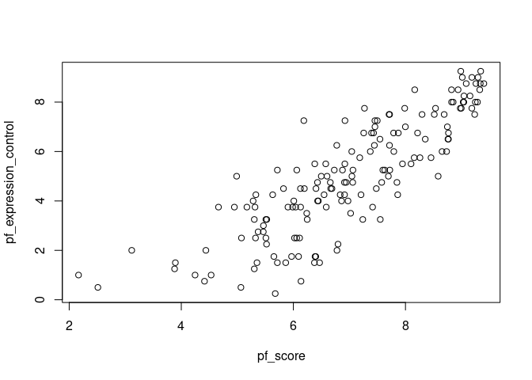

Activity 2
================

### A typical modeling process

The process that we will use for today’s activity is:

1.  Identify our research question(s),
2.  Explore (graphically and with numerical summaries) the variables of
    interest - both individually and in relationship to one another,
3.  Fit a simple linear regression model to obtain and describe model
    estimates,
4.  Assess how “good” our model is, and
5.  Predict new values.

We will continue to update/tweak/adapt this process and you are
encouraged to build your own process. Before we begin, we set up our R
session and introduce this activity’s data.

## Day 1

### The setup

We will be using two packages from Posit (formerly
[RStudio](https://posit.co/)): `{tidyverse}` and `{tidymodels}`. If you
would like to try the *ISLR* labs using these two packages instead of
base R, [Emil Hvitfeldt](https://www.emilhvitfeldt.com/) (of Posit) has
put together a [complementary online
text](https://emilhvitfeldt.github.io/ISLR-tidymodels-labs/index.html).

- In the **Packages** pane of RStudio (same area as **Files**), check to
  see if `{tidyverse}` and `{tidymodels}` are installed. Be sure to
  check both your **User Library** and **System Library**.

- If either of these are not currently listed, type the following in
  your **Console** pane, replacing `package_name` with the appropriate
  name, and press Enter/Return afterwards.

  ``` r
  # Note: the "eval = FALSE" in the above line tells R not to evaluate this code
  install.packages("package_name")
  ```

- Once you have verified that both `{tidyverse}` and `{tidymodels}` are
  installed, load these packages in the R chunk below titled `setup`.
  That is, type the following:

  ``` r
  library(tidyverse)
  library(tidymodels)
  ```

- Run the `setup` code chunk and/or **knit**
   icon
  your Rmd document to verify that no errors occur.

``` r
library(tidyverse)
```

    ## ── Attaching core tidyverse packages ──────────────────────── tidyverse 2.0.0 ──
    ## ✔ dplyr     1.1.2     ✔ readr     2.1.4
    ## ✔ forcats   1.0.0     ✔ stringr   1.5.0
    ## ✔ ggplot2   3.4.2     ✔ tibble    3.2.1
    ## ✔ lubridate 1.9.2     ✔ tidyr     1.3.0
    ## ✔ purrr     1.0.1     
    ## ── Conflicts ────────────────────────────────────────── tidyverse_conflicts() ──
    ## ✖ dplyr::filter() masks stats::filter()
    ## ✖ dplyr::lag()    masks stats::lag()
    ## ℹ Use the conflicted package (<http://conflicted.r-lib.org/>) to force all conflicts to become errors

``` r
library(tidymodels)
```

    ## ── Attaching packages ────────────────────────────────────── tidymodels 1.1.0 ──
    ## ✔ broom        1.0.5     ✔ rsample      1.1.1
    ## ✔ dials        1.2.0     ✔ tune         1.1.1
    ## ✔ infer        1.0.4     ✔ workflows    1.1.3
    ## ✔ modeldata    1.1.0     ✔ workflowsets 1.0.1
    ## ✔ parsnip      1.1.0     ✔ yardstick    1.2.0
    ## ✔ recipes      1.0.6     
    ## ── Conflicts ───────────────────────────────────────── tidymodels_conflicts() ──
    ## ✖ scales::discard() masks purrr::discard()
    ## ✖ dplyr::filter()   masks stats::filter()
    ## ✖ recipes::fixed()  masks stringr::fixed()
    ## ✖ dplyr::lag()      masks stats::lag()
    ## ✖ yardstick::spec() masks readr::spec()
    ## ✖ recipes::step()   masks stats::step()
    ## • Use suppressPackageStartupMessages() to eliminate package startup messages

 **Check in**

Test your GitHub skills by staging, committing, and pushing your changes
to GitHub and verify that your changes have been added to your GitHub
repository.

### The data

The data we’re working with is from the OpenIntro site:
`https://www.openintro.org/data/csv/hfi.csv`. Here is the “about” page:
<https://www.openintro.org/data/index.php?data=hfi>.

In the R code chunk below titled `load-data`, you will type the code
that reads in the above linked CSV file by doing the following:

- Rather than downloading this file, uploading to RStudio, then reading
  it in, explore how to load this file directly from the provided URL
  with `readr::read_csv` (`{readr}` is part of `{tidyverse}`).
- Assign this data set into a data frame named `hfi` (short for “Human
  Freedom Index”).

After doing this and viewing the loaded data, answer the following
questions:

1.  What are the dimensions of the dataset? ans. 1458 x 123
2.  What does each row represent? ans.

The dataset spans a lot of years. We are only interested in data from
year 2016. In the R code chunk below titled `hfi-2016`, type the code
that does the following:

- Filter the data `hfi` data frame for year 2016, and
- Assigns the result to a data frame named `hfi_2016`.

``` r
hfi <- read.csv("hfi.csv")
hfi
```

    ##     year ISO_code              countries                        region
    ## 1   2016      ALB                Albania                Eastern Europe
    ## 2   2016      DZA                Algeria    Middle East & North Africa
    ## 3   2016      AGO                 Angola            Sub-Saharan Africa
    ## 4   2016      ARG              Argentina Latin America & the Caribbean
    ## 5   2016      ARM                Armenia       Caucasus & Central Asia
    ## 6   2016      AUS              Australia                       Oceania
    ## 7   2016      AUT                Austria                Western Europe
    ## 8   2016      AZE             Azerbaijan       Caucasus & Central Asia
    ## 9   2016      BHS                Bahamas Latin America & the Caribbean
    ## 10  2016      BHR                Bahrain    Middle East & North Africa
    ## 11  2016      BGD             Bangladesh                    South Asia
    ## 12  2016      BRD               Barbados Latin America & the Caribbean
    ## 13  2016      BLR                Belarus                Eastern Europe
    ## 14  2016      BEL                Belgium                Western Europe
    ## 15  2016      BLZ                 Belize Latin America & the Caribbean
    ## 16  2016      BEN                  Benin            Sub-Saharan Africa
    ## 17  2016      BTN                 Bhutan                    South Asia
    ## 18  2016      BOL                Bolivia Latin America & the Caribbean
    ## 19  2016      BIH Bosnia and Herzegovina                Eastern Europe
    ## 20  2016      BWA               Botswana            Sub-Saharan Africa
    ## 21  2016      BRA                 Brazil Latin America & the Caribbean
    ## 22  2016      BRN      Brunei Darussalam                    South Asia
    ## 23  2016      BGR               Bulgaria                Eastern Europe
    ## 24  2016      BFA           Burkina Faso            Sub-Saharan Africa
    ## 25  2016      BDI                Burundi            Sub-Saharan Africa
    ## 26  2016      KHM               Cambodia                    South Asia
    ## 27  2016      CMR               Cameroon            Sub-Saharan Africa
    ## 28  2016      CAN                 Canada                 North America
    ## 29  2016      CPV             Cape Verde            Sub-Saharan Africa
    ## 30  2016      CAF      Central Afr. Rep.            Sub-Saharan Africa
    ## 31  2016      TCD                   Chad            Sub-Saharan Africa
    ## 32  2016      CHL                  Chile Latin America & the Caribbean
    ## 33  2016      CHN                  China                     East Asia
    ## 34  2016      COL               Colombia Latin America & the Caribbean
    ## 35  2016      COD         Congo, Dem. R.            Sub-Saharan Africa
    ## 36  2016      COG         Congo, Rep. Of            Sub-Saharan Africa
    ## 37  2016      CRI             Costa Rica Latin America & the Caribbean
    ## 38  2016      CIV          Cote d'Ivoire            Sub-Saharan Africa
    ## 39  2016      HRV                Croatia                Eastern Europe
    ## 40  2016      CYP                 Cyprus                Eastern Europe
    ## 41  2016      CZE             Czech Rep.                Eastern Europe
    ## 42  2016      DNK                Denmark                Western Europe
    ## 43  2016      DOM         Dominican Rep. Latin America & the Caribbean
    ## 44  2016      ECU                Ecuador Latin America & the Caribbean
    ## 45  2016      EGY                  Egypt    Middle East & North Africa
    ## 46  2016      SLV            El Salvador Latin America & the Caribbean
    ## 47  2016      EST                Estonia                Eastern Europe
    ## 48  2016      ETH               Ethiopia            Sub-Saharan Africa
    ## 49  2016      FJI                   Fiji                       Oceania
    ## 50  2016      FIN                Finland                Western Europe
    ## 51  2016      FRA                 France                Western Europe
    ## 52  2016      GAB                  Gabon            Sub-Saharan Africa
    ## 53  2016      GMB            Gambia, The            Sub-Saharan Africa
    ## 54  2016      GEO                Georgia       Caucasus & Central Asia
    ## 55  2016      DEU                Germany                Western Europe
    ## 56  2016      GHA                  Ghana            Sub-Saharan Africa
    ## 57  2016      GRC                 Greece                Eastern Europe
    ## 58  2016      GTM              Guatemala Latin America & the Caribbean
    ## 59  2016      GIN                 Guinea            Sub-Saharan Africa
    ## 60  2016      GNB          Guinea-Bissau            Sub-Saharan Africa
    ## 61  2016      GUY                 Guyana Latin America & the Caribbean
    ## 62  2016      HTI                  Haiti Latin America & the Caribbean
    ## 63  2016      HND               Honduras Latin America & the Caribbean
    ## 64  2016      HKG              Hong Kong                     East Asia
    ## 65  2016      HUN                Hungary                Eastern Europe
    ## 66  2016      ISL                Iceland                Western Europe
    ## 67  2016      IND                  India                    South Asia
    ## 68  2016      IDN              Indonesia                    South Asia
    ## 69  2016      IRN                   Iran    Middle East & North Africa
    ## 70  2016      IRQ                   Iraq    Middle East & North Africa
    ## 71  2016      IRL                Ireland                Western Europe
    ## 72  2016      ISR                 Israel    Middle East & North Africa
    ## 73  2016      ITA                  Italy                Western Europe
    ## 74  2016      JAM                Jamaica Latin America & the Caribbean
    ## 75  2016      JPN                  Japan                     East Asia
    ## 76  2016      JOR                 Jordan    Middle East & North Africa
    ## 77  2016      KAZ             Kazakhstan       Caucasus & Central Asia
    ## 78  2016      KEN                  Kenya            Sub-Saharan Africa
    ## 79  2016      KOR           Korea, South                     East Asia
    ## 80  2016      KWT                 Kuwait    Middle East & North Africa
    ## 81  2016      KGZ        Kyrgyz Republic       Caucasus & Central Asia
    ## 82  2016      LAO                   Laos                    South Asia
    ## 83  2016      LVA                 Latvia                Eastern Europe
    ## 84  2016      LBN                Lebanon    Middle East & North Africa
    ## 85  2016      LSO                Lesotho            Sub-Saharan Africa
    ## 86  2016      LBR                Liberia            Sub-Saharan Africa
    ## 87  2016      LBY                  Libya    Middle East & North Africa
    ## 88  2016      LTU              Lithuania                Eastern Europe
    ## 89  2016      LUX             Luxembourg                Western Europe
    ## 90  2016      MKD              Macedonia                Eastern Europe
    ## 91  2016      MDG             Madagascar            Sub-Saharan Africa
    ## 92  2016      MWI                 Malawi            Sub-Saharan Africa
    ## 93  2016      MYS               Malaysia                    South Asia
    ## 94  2016      MLI                   Mali            Sub-Saharan Africa
    ## 95  2016      MLT                  Malta                Western Europe
    ## 96  2016      MRT             Mauritania            Sub-Saharan Africa
    ## 97  2016      MUS              Mauritius            Sub-Saharan Africa
    ## 98  2016      MEX                 Mexico Latin America & the Caribbean
    ## 99  2016      MDA                Moldova                Eastern Europe
    ## 100 2016      MNG               Mongolia                     East Asia
    ## 101 2016      MNE             Montenegro                Eastern Europe
    ## 102 2016      MAR                Morocco    Middle East & North Africa
    ## 103 2016      MOZ             Mozambique            Sub-Saharan Africa
    ## 104 2016      MMR                Myanmar                    South Asia
    ## 105 2016      NAM                Namibia            Sub-Saharan Africa
    ## 106 2016      NPL                  Nepal                    South Asia
    ## 107 2016      NLD            Netherlands                Western Europe
    ## 108 2016      NZL            New Zealand                       Oceania
    ## 109 2016      NIC              Nicaragua Latin America & the Caribbean
    ## 110 2016      NER                  Niger            Sub-Saharan Africa
    ## 111 2016      NGA                Nigeria            Sub-Saharan Africa
    ## 112 2016      NOR                 Norway                Western Europe
    ## 113 2016      OMN                   Oman    Middle East & North Africa
    ## 114 2016      PAK               Pakistan                    South Asia
    ## 115 2016      PAN                 Panama Latin America & the Caribbean
    ## 116 2016      PNG        Pap. New Guinea                       Oceania
    ## 117 2016      PRY               Paraguay Latin America & the Caribbean
    ## 118 2016      PER                   Peru Latin America & the Caribbean
    ## 119 2016      PHL            Philippines                    South Asia
    ## 120 2016      POL                 Poland                Eastern Europe
    ## 121 2016      PRT               Portugal                Western Europe
    ## 122 2016      QAT                  Qatar    Middle East & North Africa
    ## 123 2016      ROU                Romania                Eastern Europe
    ## 124 2016      RUS                 Russia                Eastern Europe
    ## 125 2016      RWA                 Rwanda            Sub-Saharan Africa
    ## 126 2016      SAU           Saudi Arabia    Middle East & North Africa
    ## 127 2016      SEN                Senegal            Sub-Saharan Africa
    ## 128 2016      SRB                 Serbia                Eastern Europe
    ## 129 2016      SYC             Seychelles            Sub-Saharan Africa
    ## 130 2016      SLE           Sierra Leone            Sub-Saharan Africa
    ## 131 2016      SGP              Singapore                    South Asia
    ## 132 2016      SVK            Slovak Rep.                Eastern Europe
    ## 133 2016      SVN               Slovenia                Eastern Europe
    ## 134 2016      ZAF           South Africa            Sub-Saharan Africa
    ## 135 2016      ESP                  Spain                Western Europe
    ## 136 2016      LKA              Sri Lanka                    South Asia
    ## 137 2016      SDN                  Sudan            Sub-Saharan Africa
    ## 138 2016      SUR               Suriname Latin America & the Caribbean
    ## 139 2016      SWZ              Swaziland            Sub-Saharan Africa
    ## 140 2016      SWE                 Sweden                Western Europe
    ## 141 2016      CHE            Switzerland                Western Europe
    ## 142 2016      SYR                  Syria    Middle East & North Africa
    ## 143 2016      TWN                 Taiwan                     East Asia
    ## 144 2016      TJK             Tajikistan       Caucasus & Central Asia
    ## 145 2016      TZA               Tanzania            Sub-Saharan Africa
    ## 146 2016      THA               Thailand                    South Asia
    ## 147 2016      TLS            Timor-Leste                    South Asia
    ## 148 2016      TGO                   Togo            Sub-Saharan Africa
    ## 149 2016      TTO    Trinidad and Tobago Latin America & the Caribbean
    ## 150 2016      TUN                Tunisia    Middle East & North Africa
    ## 151 2016      TUR                 Turkey    Middle East & North Africa
    ## 152 2016      UGA                 Uganda            Sub-Saharan Africa
    ## 153 2016      UKR                Ukraine                Eastern Europe
    ## 154 2016      ARE   United Arab Emirates    Middle East & North Africa
    ## 155 2016      GBR         United Kingdom                Western Europe
    ## 156 2016      USA          United States                 North America
    ## 157 2016      URY                Uruguay Latin America & the Caribbean
    ## 158 2016      VEN              Venezuela Latin America & the Caribbean
    ## 159 2016      VNM                Vietnam                    South Asia
    ## 160 2016      YEM            Yemen, Rep.    Middle East & North Africa
    ## 161 2016      ZMB                 Zambia            Sub-Saharan Africa
    ## 162 2016      ZWE               Zimbabwe            Sub-Saharan Africa
    ## 163 2015      ALB                Albania                Eastern Europe
    ## 164 2015      DZA                Algeria    Middle East & North Africa
    ## 165 2015      AGO                 Angola            Sub-Saharan Africa
    ## 166 2015      ARG              Argentina Latin America & the Caribbean
    ## 167 2015      ARM                Armenia       Caucasus & Central Asia
    ## 168 2015      AUS              Australia                       Oceania
    ## 169 2015      AUT                Austria                Western Europe
    ## 170 2015      AZE             Azerbaijan       Caucasus & Central Asia
    ## 171 2015      BHS                Bahamas Latin America & the Caribbean
    ## 172 2015      BHR                Bahrain    Middle East & North Africa
    ## 173 2015      BGD             Bangladesh                    South Asia
    ## 174 2015      BRD               Barbados Latin America & the Caribbean
    ## 175 2015      BLR                Belarus                Eastern Europe
    ## 176 2015      BEL                Belgium                Western Europe
    ## 177 2015      BLZ                 Belize Latin America & the Caribbean
    ## 178 2015      BEN                  Benin            Sub-Saharan Africa
    ## 179 2015      BTN                 Bhutan                    South Asia
    ## 180 2015      BOL                Bolivia Latin America & the Caribbean
    ## 181 2015      BIH Bosnia and Herzegovina                Eastern Europe
    ## 182 2015      BWA               Botswana            Sub-Saharan Africa
    ## 183 2015      BRA                 Brazil Latin America & the Caribbean
    ## 184 2015      BRN      Brunei Darussalam                    South Asia
    ## 185 2015      BGR               Bulgaria                Eastern Europe
    ## 186 2015      BFA           Burkina Faso            Sub-Saharan Africa
    ## 187 2015      BDI                Burundi            Sub-Saharan Africa
    ## 188 2015      KHM               Cambodia                    South Asia
    ## 189 2015      CMR               Cameroon            Sub-Saharan Africa
    ## 190 2015      CAN                 Canada                 North America
    ## 191 2015      CPV             Cape Verde            Sub-Saharan Africa
    ## 192 2015      CAF      Central Afr. Rep.            Sub-Saharan Africa
    ## 193 2015      TCD                   Chad            Sub-Saharan Africa
    ## 194 2015      CHL                  Chile Latin America & the Caribbean
    ## 195 2015      CHN                  China                     East Asia
    ## 196 2015      COL               Colombia Latin America & the Caribbean
    ## 197 2015      COD         Congo, Dem. R.            Sub-Saharan Africa
    ## 198 2015      COG         Congo, Rep. Of            Sub-Saharan Africa
    ## 199 2015      CRI             Costa Rica Latin America & the Caribbean
    ## 200 2015      CIV          Cote d'Ivoire            Sub-Saharan Africa
    ## 201 2015      HRV                Croatia                Eastern Europe
    ## 202 2015      CYP                 Cyprus                Eastern Europe
    ## 203 2015      CZE             Czech Rep.                Eastern Europe
    ## 204 2015      DNK                Denmark                Western Europe
    ## 205 2015      DOM         Dominican Rep. Latin America & the Caribbean
    ## 206 2015      ECU                Ecuador Latin America & the Caribbean
    ## 207 2015      EGY                  Egypt    Middle East & North Africa
    ## 208 2015      SLV            El Salvador Latin America & the Caribbean
    ## 209 2015      EST                Estonia                Eastern Europe
    ## 210 2015      ETH               Ethiopia            Sub-Saharan Africa
    ## 211 2015      FJI                   Fiji                       Oceania
    ## 212 2015      FIN                Finland                Western Europe
    ## 213 2015      FRA                 France                Western Europe
    ## 214 2015      GAB                  Gabon            Sub-Saharan Africa
    ## 215 2015      GMB            Gambia, The            Sub-Saharan Africa
    ## 216 2015      GEO                Georgia       Caucasus & Central Asia
    ## 217 2015      DEU                Germany                Western Europe
    ## 218 2015      GHA                  Ghana            Sub-Saharan Africa
    ## 219 2015      GRC                 Greece                Eastern Europe
    ## 220 2015      GTM              Guatemala Latin America & the Caribbean
    ## 221 2015      GIN                 Guinea            Sub-Saharan Africa
    ## 222 2015      GNB          Guinea-Bissau            Sub-Saharan Africa
    ## 223 2015      GUY                 Guyana Latin America & the Caribbean
    ## 224 2015      HTI                  Haiti Latin America & the Caribbean
    ## 225 2015      HND               Honduras Latin America & the Caribbean
    ## 226 2015      HKG              Hong Kong                     East Asia
    ## 227 2015      HUN                Hungary                Eastern Europe
    ## 228 2015      ISL                Iceland                Western Europe
    ## 229 2015      IND                  India                    South Asia
    ## 230 2015      IDN              Indonesia                    South Asia
    ## 231 2015      IRN                   Iran    Middle East & North Africa
    ## 232 2015      IRQ                   Iraq    Middle East & North Africa
    ## 233 2015      IRL                Ireland                Western Europe
    ## 234 2015      ISR                 Israel    Middle East & North Africa
    ## 235 2015      ITA                  Italy                Western Europe
    ## 236 2015      JAM                Jamaica Latin America & the Caribbean
    ## 237 2015      JPN                  Japan                     East Asia
    ## 238 2015      JOR                 Jordan    Middle East & North Africa
    ## 239 2015      KAZ             Kazakhstan       Caucasus & Central Asia
    ## 240 2015      KEN                  Kenya            Sub-Saharan Africa
    ## 241 2015      KOR           Korea, South                     East Asia
    ## 242 2015      KWT                 Kuwait    Middle East & North Africa
    ## 243 2015      KGZ        Kyrgyz Republic       Caucasus & Central Asia
    ## 244 2015      LAO                   Laos                    South Asia
    ## 245 2015      LVA                 Latvia                Eastern Europe
    ## 246 2015      LBN                Lebanon    Middle East & North Africa
    ## 247 2015      LSO                Lesotho            Sub-Saharan Africa
    ## 248 2015      LBR                Liberia            Sub-Saharan Africa
    ## 249 2015      LBY                  Libya    Middle East & North Africa
    ## 250 2015      LTU              Lithuania                Eastern Europe
    ## 251 2015      LUX             Luxembourg                Western Europe
    ## 252 2015      MKD              Macedonia                Eastern Europe
    ## 253 2015      MDG             Madagascar            Sub-Saharan Africa
    ## 254 2015      MWI                 Malawi            Sub-Saharan Africa
    ## 255 2015      MYS               Malaysia                    South Asia
    ## 256 2015      MLI                   Mali            Sub-Saharan Africa
    ## 257 2015      MLT                  Malta                Western Europe
    ## 258 2015      MRT             Mauritania            Sub-Saharan Africa
    ## 259 2015      MUS              Mauritius            Sub-Saharan Africa
    ## 260 2015      MEX                 Mexico Latin America & the Caribbean
    ## 261 2015      MDA                Moldova                Eastern Europe
    ## 262 2015      MNG               Mongolia                     East Asia
    ## 263 2015      MNE             Montenegro                Eastern Europe
    ## 264 2015      MAR                Morocco    Middle East & North Africa
    ## 265 2015      MOZ             Mozambique            Sub-Saharan Africa
    ## 266 2015      MMR                Myanmar                    South Asia
    ## 267 2015      NAM                Namibia            Sub-Saharan Africa
    ## 268 2015      NPL                  Nepal                    South Asia
    ## 269 2015      NLD            Netherlands                Western Europe
    ## 270 2015      NZL            New Zealand                       Oceania
    ## 271 2015      NIC              Nicaragua Latin America & the Caribbean
    ## 272 2015      NER                  Niger            Sub-Saharan Africa
    ## 273 2015      NGA                Nigeria            Sub-Saharan Africa
    ## 274 2015      NOR                 Norway                Western Europe
    ## 275 2015      OMN                   Oman    Middle East & North Africa
    ## 276 2015      PAK               Pakistan                    South Asia
    ## 277 2015      PAN                 Panama Latin America & the Caribbean
    ## 278 2015      PNG        Pap. New Guinea                       Oceania
    ## 279 2015      PRY               Paraguay Latin America & the Caribbean
    ## 280 2015      PER                   Peru Latin America & the Caribbean
    ## 281 2015      PHL            Philippines                    South Asia
    ## 282 2015      POL                 Poland                Eastern Europe
    ## 283 2015      PRT               Portugal                Western Europe
    ## 284 2015      QAT                  Qatar    Middle East & North Africa
    ## 285 2015      ROU                Romania                Eastern Europe
    ## 286 2015      RUS                 Russia                Eastern Europe
    ## 287 2015      RWA                 Rwanda            Sub-Saharan Africa
    ## 288 2015      SAU           Saudi Arabia    Middle East & North Africa
    ## 289 2015      SEN                Senegal            Sub-Saharan Africa
    ## 290 2015      SRB                 Serbia                Eastern Europe
    ## 291 2015      SYC             Seychelles            Sub-Saharan Africa
    ## 292 2015      SLE           Sierra Leone            Sub-Saharan Africa
    ## 293 2015      SGP              Singapore                    South Asia
    ## 294 2015      SVK            Slovak Rep.                Eastern Europe
    ## 295 2015      SVN               Slovenia                Eastern Europe
    ## 296 2015      ZAF           South Africa            Sub-Saharan Africa
    ## 297 2015      ESP                  Spain                Western Europe
    ## 298 2015      LKA              Sri Lanka                    South Asia
    ## 299 2015      SDN                  Sudan            Sub-Saharan Africa
    ## 300 2015      SUR               Suriname Latin America & the Caribbean
    ## 301 2015      SWZ              Swaziland            Sub-Saharan Africa
    ## 302 2015      SWE                 Sweden                Western Europe
    ## 303 2015      CHE            Switzerland                Western Europe
    ## 304 2015      SYR                  Syria    Middle East & North Africa
    ## 305 2015      TWN                 Taiwan                     East Asia
    ## 306 2015      TJK             Tajikistan       Caucasus & Central Asia
    ## 307 2015      TZA               Tanzania            Sub-Saharan Africa
    ## 308 2015      THA               Thailand                    South Asia
    ## 309 2015      TLS            Timor-Leste                    South Asia
    ## 310 2015      TGO                   Togo            Sub-Saharan Africa
    ## 311 2015      TTO    Trinidad and Tobago Latin America & the Caribbean
    ## 312 2015      TUN                Tunisia    Middle East & North Africa
    ## 313 2015      TUR                 Turkey    Middle East & North Africa
    ## 314 2015      UGA                 Uganda            Sub-Saharan Africa
    ## 315 2015      UKR                Ukraine                Eastern Europe
    ## 316 2015      ARE   United Arab Emirates    Middle East & North Africa
    ## 317 2015      GBR         United Kingdom                Western Europe
    ## 318 2015      USA          United States                 North America
    ## 319 2015      URY                Uruguay Latin America & the Caribbean
    ## 320 2015      VEN              Venezuela Latin America & the Caribbean
    ## 321 2015      VNM                Vietnam                    South Asia
    ## 322 2015      YEM            Yemen, Rep.    Middle East & North Africa
    ## 323 2015      ZMB                 Zambia            Sub-Saharan Africa
    ## 324 2015      ZWE               Zimbabwe            Sub-Saharan Africa
    ## 325 2014      ALB                Albania                Eastern Europe
    ## 326 2014      DZA                Algeria    Middle East & North Africa
    ## 327 2014      AGO                 Angola            Sub-Saharan Africa
    ## 328 2014      ARG              Argentina Latin America & the Caribbean
    ## 329 2014      ARM                Armenia       Caucasus & Central Asia
    ## 330 2014      AUS              Australia                       Oceania
    ## 331 2014      AUT                Austria                Western Europe
    ## 332 2014      AZE             Azerbaijan       Caucasus & Central Asia
    ## 333 2014      BHS                Bahamas Latin America & the Caribbean
    ## 334 2014      BHR                Bahrain    Middle East & North Africa
    ## 335 2014      BGD             Bangladesh                    South Asia
    ## 336 2014      BRD               Barbados Latin America & the Caribbean
    ## 337 2014      BLR                Belarus                Eastern Europe
    ## 338 2014      BEL                Belgium                Western Europe
    ## 339 2014      BLZ                 Belize Latin America & the Caribbean
    ## 340 2014      BEN                  Benin            Sub-Saharan Africa
    ## 341 2014      BTN                 Bhutan                    South Asia
    ## 342 2014      BOL                Bolivia Latin America & the Caribbean
    ## 343 2014      BIH Bosnia and Herzegovina                Eastern Europe
    ## 344 2014      BWA               Botswana            Sub-Saharan Africa
    ## 345 2014      BRA                 Brazil Latin America & the Caribbean
    ## 346 2014      BRN      Brunei Darussalam                    South Asia
    ## 347 2014      BGR               Bulgaria                Eastern Europe
    ## 348 2014      BFA           Burkina Faso            Sub-Saharan Africa
    ## 349 2014      BDI                Burundi            Sub-Saharan Africa
    ## 350 2014      KHM               Cambodia                    South Asia
    ## 351 2014      CMR               Cameroon            Sub-Saharan Africa
    ## 352 2014      CAN                 Canada                 North America
    ## 353 2014      CPV             Cape Verde            Sub-Saharan Africa
    ## 354 2014      CAF      Central Afr. Rep.            Sub-Saharan Africa
    ## 355 2014      TCD                   Chad            Sub-Saharan Africa
    ## 356 2014      CHL                  Chile Latin America & the Caribbean
    ## 357 2014      CHN                  China                     East Asia
    ## 358 2014      COL               Colombia Latin America & the Caribbean
    ## 359 2014      COD         Congo, Dem. R.            Sub-Saharan Africa
    ## 360 2014      COG         Congo, Rep. Of            Sub-Saharan Africa
    ## 361 2014      CRI             Costa Rica Latin America & the Caribbean
    ## 362 2014      CIV          Cote d'Ivoire            Sub-Saharan Africa
    ## 363 2014      HRV                Croatia                Eastern Europe
    ## 364 2014      CYP                 Cyprus                Eastern Europe
    ## 365 2014      CZE             Czech Rep.                Eastern Europe
    ## 366 2014      DNK                Denmark                Western Europe
    ## 367 2014      DOM         Dominican Rep. Latin America & the Caribbean
    ## 368 2014      ECU                Ecuador Latin America & the Caribbean
    ## 369 2014      EGY                  Egypt    Middle East & North Africa
    ## 370 2014      SLV            El Salvador Latin America & the Caribbean
    ## 371 2014      EST                Estonia                Eastern Europe
    ## 372 2014      ETH               Ethiopia            Sub-Saharan Africa
    ## 373 2014      FJI                   Fiji                       Oceania
    ## 374 2014      FIN                Finland                Western Europe
    ## 375 2014      FRA                 France                Western Europe
    ## 376 2014      GAB                  Gabon            Sub-Saharan Africa
    ## 377 2014      GMB            Gambia, The            Sub-Saharan Africa
    ## 378 2014      GEO                Georgia       Caucasus & Central Asia
    ## 379 2014      DEU                Germany                Western Europe
    ## 380 2014      GHA                  Ghana            Sub-Saharan Africa
    ## 381 2014      GRC                 Greece                Eastern Europe
    ## 382 2014      GTM              Guatemala Latin America & the Caribbean
    ## 383 2014      GIN                 Guinea            Sub-Saharan Africa
    ## 384 2014      GNB          Guinea-Bissau            Sub-Saharan Africa
    ## 385 2014      GUY                 Guyana Latin America & the Caribbean
    ## 386 2014      HTI                  Haiti Latin America & the Caribbean
    ## 387 2014      HND               Honduras Latin America & the Caribbean
    ## 388 2014      HKG              Hong Kong                     East Asia
    ## 389 2014      HUN                Hungary                Eastern Europe
    ## 390 2014      ISL                Iceland                Western Europe
    ## 391 2014      IND                  India                    South Asia
    ## 392 2014      IDN              Indonesia                    South Asia
    ## 393 2014      IRN                   Iran    Middle East & North Africa
    ## 394 2014      IRQ                   Iraq    Middle East & North Africa
    ## 395 2014      IRL                Ireland                Western Europe
    ## 396 2014      ISR                 Israel    Middle East & North Africa
    ## 397 2014      ITA                  Italy                Western Europe
    ## 398 2014      JAM                Jamaica Latin America & the Caribbean
    ## 399 2014      JPN                  Japan                     East Asia
    ## 400 2014      JOR                 Jordan    Middle East & North Africa
    ## 401 2014      KAZ             Kazakhstan       Caucasus & Central Asia
    ## 402 2014      KEN                  Kenya            Sub-Saharan Africa
    ## 403 2014      KOR           Korea, South                     East Asia
    ## 404 2014      KWT                 Kuwait    Middle East & North Africa
    ## 405 2014      KGZ        Kyrgyz Republic       Caucasus & Central Asia
    ## 406 2014      LAO                   Laos                    South Asia
    ## 407 2014      LVA                 Latvia                Eastern Europe
    ## 408 2014      LBN                Lebanon    Middle East & North Africa
    ## 409 2014      LSO                Lesotho            Sub-Saharan Africa
    ## 410 2014      LBR                Liberia            Sub-Saharan Africa
    ## 411 2014      LBY                  Libya    Middle East & North Africa
    ## 412 2014      LTU              Lithuania                Eastern Europe
    ## 413 2014      LUX             Luxembourg                Western Europe
    ## 414 2014      MKD              Macedonia                Eastern Europe
    ## 415 2014      MDG             Madagascar            Sub-Saharan Africa
    ## 416 2014      MWI                 Malawi            Sub-Saharan Africa
    ## 417 2014      MYS               Malaysia                    South Asia
    ## 418 2014      MLI                   Mali            Sub-Saharan Africa
    ## 419 2014      MLT                  Malta                Western Europe
    ## 420 2014      MRT             Mauritania            Sub-Saharan Africa
    ## 421 2014      MUS              Mauritius            Sub-Saharan Africa
    ## 422 2014      MEX                 Mexico Latin America & the Caribbean
    ## 423 2014      MDA                Moldova                Eastern Europe
    ## 424 2014      MNG               Mongolia                     East Asia
    ## 425 2014      MNE             Montenegro                Eastern Europe
    ## 426 2014      MAR                Morocco    Middle East & North Africa
    ## 427 2014      MOZ             Mozambique            Sub-Saharan Africa
    ## 428 2014      MMR                Myanmar                    South Asia
    ## 429 2014      NAM                Namibia            Sub-Saharan Africa
    ## 430 2014      NPL                  Nepal                    South Asia
    ## 431 2014      NLD            Netherlands                Western Europe
    ## 432 2014      NZL            New Zealand                       Oceania
    ## 433 2014      NIC              Nicaragua Latin America & the Caribbean
    ## 434 2014      NER                  Niger            Sub-Saharan Africa
    ## 435 2014      NGA                Nigeria            Sub-Saharan Africa
    ## 436 2014      NOR                 Norway                Western Europe
    ## 437 2014      OMN                   Oman    Middle East & North Africa
    ## 438 2014      PAK               Pakistan                    South Asia
    ## 439 2014      PAN                 Panama Latin America & the Caribbean
    ## 440 2014      PNG        Pap. New Guinea                       Oceania
    ## 441 2014      PRY               Paraguay Latin America & the Caribbean
    ## 442 2014      PER                   Peru Latin America & the Caribbean
    ## 443 2014      PHL            Philippines                    South Asia
    ## 444 2014      POL                 Poland                Eastern Europe
    ## 445 2014      PRT               Portugal                Western Europe
    ## 446 2014      QAT                  Qatar    Middle East & North Africa
    ## 447 2014      ROU                Romania                Eastern Europe
    ## 448 2014      RUS                 Russia                Eastern Europe
    ## 449 2014      RWA                 Rwanda            Sub-Saharan Africa
    ## 450 2014      SAU           Saudi Arabia    Middle East & North Africa
    ## 451 2014      SEN                Senegal            Sub-Saharan Africa
    ## 452 2014      SRB                 Serbia                Eastern Europe
    ## 453 2014      SYC             Seychelles            Sub-Saharan Africa
    ## 454 2014      SLE           Sierra Leone            Sub-Saharan Africa
    ## 455 2014      SGP              Singapore                    South Asia
    ## 456 2014      SVK            Slovak Rep.                Eastern Europe
    ## 457 2014      SVN               Slovenia                Eastern Europe
    ## 458 2014      ZAF           South Africa            Sub-Saharan Africa
    ## 459 2014      ESP                  Spain                Western Europe
    ## 460 2014      LKA              Sri Lanka                    South Asia
    ## 461 2014      SDN                  Sudan            Sub-Saharan Africa
    ## 462 2014      SUR               Suriname Latin America & the Caribbean
    ## 463 2014      SWZ              Swaziland            Sub-Saharan Africa
    ## 464 2014      SWE                 Sweden                Western Europe
    ## 465 2014      CHE            Switzerland                Western Europe
    ## 466 2014      SYR                  Syria    Middle East & North Africa
    ## 467 2014      TWN                 Taiwan                     East Asia
    ## 468 2014      TJK             Tajikistan       Caucasus & Central Asia
    ## 469 2014      TZA               Tanzania            Sub-Saharan Africa
    ## 470 2014      THA               Thailand                    South Asia
    ## 471 2014      TLS            Timor-Leste                    South Asia
    ## 472 2014      TGO                   Togo            Sub-Saharan Africa
    ## 473 2014      TTO    Trinidad and Tobago Latin America & the Caribbean
    ## 474 2014      TUN                Tunisia    Middle East & North Africa
    ## 475 2014      TUR                 Turkey    Middle East & North Africa
    ## 476 2014      UGA                 Uganda            Sub-Saharan Africa
    ## 477 2014      UKR                Ukraine                Eastern Europe
    ## 478 2014      ARE   United Arab Emirates    Middle East & North Africa
    ## 479 2014      GBR         United Kingdom                Western Europe
    ## 480 2014      USA          United States                 North America
    ## 481 2014      URY                Uruguay Latin America & the Caribbean
    ## 482 2014      VEN              Venezuela Latin America & the Caribbean
    ## 483 2014      VNM                Vietnam                    South Asia
    ## 484 2014      YEM            Yemen, Rep.    Middle East & North Africa
    ## 485 2014      ZMB                 Zambia            Sub-Saharan Africa
    ## 486 2014      ZWE               Zimbabwe            Sub-Saharan Africa
    ## 487 2013      ALB                Albania                Eastern Europe
    ## 488 2013      DZA                Algeria    Middle East & North Africa
    ## 489 2013      AGO                 Angola            Sub-Saharan Africa
    ## 490 2013      ARG              Argentina Latin America & the Caribbean
    ## 491 2013      ARM                Armenia       Caucasus & Central Asia
    ## 492 2013      AUS              Australia                       Oceania
    ## 493 2013      AUT                Austria                Western Europe
    ## 494 2013      AZE             Azerbaijan       Caucasus & Central Asia
    ## 495 2013      BHS                Bahamas Latin America & the Caribbean
    ## 496 2013      BHR                Bahrain    Middle East & North Africa
    ## 497 2013      BGD             Bangladesh                    South Asia
    ## 498 2013      BRD               Barbados Latin America & the Caribbean
    ## 499 2013      BLR                Belarus                Eastern Europe
    ## 500 2013      BEL                Belgium                Western Europe
    ## 501 2013      BLZ                 Belize Latin America & the Caribbean
    ## 502 2013      BEN                  Benin            Sub-Saharan Africa
    ## 503 2013      BTN                 Bhutan                    South Asia
    ## 504 2013      BOL                Bolivia Latin America & the Caribbean
    ## 505 2013      BIH Bosnia and Herzegovina                Eastern Europe
    ## 506 2013      BWA               Botswana            Sub-Saharan Africa
    ## 507 2013      BRA                 Brazil Latin America & the Caribbean
    ## 508 2013      BRN      Brunei Darussalam                    South Asia
    ## 509 2013      BGR               Bulgaria                Eastern Europe
    ## 510 2013      BFA           Burkina Faso            Sub-Saharan Africa
    ## 511 2013      BDI                Burundi            Sub-Saharan Africa
    ## 512 2013      KHM               Cambodia                    South Asia
    ## 513 2013      CMR               Cameroon            Sub-Saharan Africa
    ## 514 2013      CAN                 Canada                 North America
    ## 515 2013      CPV             Cape Verde            Sub-Saharan Africa
    ## 516 2013      CAF      Central Afr. Rep.            Sub-Saharan Africa
    ## 517 2013      TCD                   Chad            Sub-Saharan Africa
    ## 518 2013      CHL                  Chile Latin America & the Caribbean
    ## 519 2013      CHN                  China                     East Asia
    ## 520 2013      COL               Colombia Latin America & the Caribbean
    ## 521 2013      COD         Congo, Dem. R.            Sub-Saharan Africa
    ## 522 2013      COG         Congo, Rep. Of            Sub-Saharan Africa
    ## 523 2013      CRI             Costa Rica Latin America & the Caribbean
    ## 524 2013      CIV          Cote d'Ivoire            Sub-Saharan Africa
    ## 525 2013      HRV                Croatia                Eastern Europe
    ## 526 2013      CYP                 Cyprus                Eastern Europe
    ## 527 2013      CZE             Czech Rep.                Eastern Europe
    ## 528 2013      DNK                Denmark                Western Europe
    ## 529 2013      DOM         Dominican Rep. Latin America & the Caribbean
    ## 530 2013      ECU                Ecuador Latin America & the Caribbean
    ## 531 2013      EGY                  Egypt    Middle East & North Africa
    ## 532 2013      SLV            El Salvador Latin America & the Caribbean
    ## 533 2013      EST                Estonia                Eastern Europe
    ## 534 2013      ETH               Ethiopia            Sub-Saharan Africa
    ## 535 2013      FJI                   Fiji                       Oceania
    ## 536 2013      FIN                Finland                Western Europe
    ## 537 2013      FRA                 France                Western Europe
    ## 538 2013      GAB                  Gabon            Sub-Saharan Africa
    ## 539 2013      GMB            Gambia, The            Sub-Saharan Africa
    ## 540 2013      GEO                Georgia       Caucasus & Central Asia
    ## 541 2013      DEU                Germany                Western Europe
    ## 542 2013      GHA                  Ghana            Sub-Saharan Africa
    ## 543 2013      GRC                 Greece                Eastern Europe
    ## 544 2013      GTM              Guatemala Latin America & the Caribbean
    ## 545 2013      GIN                 Guinea            Sub-Saharan Africa
    ## 546 2013      GNB          Guinea-Bissau            Sub-Saharan Africa
    ## 547 2013      GUY                 Guyana Latin America & the Caribbean
    ## 548 2013      HTI                  Haiti Latin America & the Caribbean
    ## 549 2013      HND               Honduras Latin America & the Caribbean
    ## 550 2013      HKG              Hong Kong                     East Asia
    ## 551 2013      HUN                Hungary                Eastern Europe
    ## 552 2013      ISL                Iceland                Western Europe
    ## 553 2013      IND                  India                    South Asia
    ## 554 2013      IDN              Indonesia                    South Asia
    ## 555 2013      IRN                   Iran    Middle East & North Africa
    ## 556 2013      IRQ                   Iraq    Middle East & North Africa
    ## 557 2013      IRL                Ireland                Western Europe
    ## 558 2013      ISR                 Israel    Middle East & North Africa
    ## 559 2013      ITA                  Italy                Western Europe
    ## 560 2013      JAM                Jamaica Latin America & the Caribbean
    ## 561 2013      JPN                  Japan                     East Asia
    ## 562 2013      JOR                 Jordan    Middle East & North Africa
    ## 563 2013      KAZ             Kazakhstan       Caucasus & Central Asia
    ## 564 2013      KEN                  Kenya            Sub-Saharan Africa
    ## 565 2013      KOR           Korea, South                     East Asia
    ## 566 2013      KWT                 Kuwait    Middle East & North Africa
    ## 567 2013      KGZ        Kyrgyz Republic       Caucasus & Central Asia
    ## 568 2013      LAO                   Laos                    South Asia
    ## 569 2013      LVA                 Latvia                Eastern Europe
    ## 570 2013      LBN                Lebanon    Middle East & North Africa
    ## 571 2013      LSO                Lesotho            Sub-Saharan Africa
    ## 572 2013      LBR                Liberia            Sub-Saharan Africa
    ## 573 2013      LBY                  Libya    Middle East & North Africa
    ## 574 2013      LTU              Lithuania                Eastern Europe
    ## 575 2013      LUX             Luxembourg                Western Europe
    ## 576 2013      MKD              Macedonia                Eastern Europe
    ## 577 2013      MDG             Madagascar            Sub-Saharan Africa
    ## 578 2013      MWI                 Malawi            Sub-Saharan Africa
    ## 579 2013      MYS               Malaysia                    South Asia
    ## 580 2013      MLI                   Mali            Sub-Saharan Africa
    ## 581 2013      MLT                  Malta                Western Europe
    ## 582 2013      MRT             Mauritania            Sub-Saharan Africa
    ## 583 2013      MUS              Mauritius            Sub-Saharan Africa
    ## 584 2013      MEX                 Mexico Latin America & the Caribbean
    ## 585 2013      MDA                Moldova                Eastern Europe
    ## 586 2013      MNG               Mongolia                     East Asia
    ## 587 2013      MNE             Montenegro                Eastern Europe
    ## 588 2013      MAR                Morocco    Middle East & North Africa
    ## 589 2013      MOZ             Mozambique            Sub-Saharan Africa
    ## 590 2013      MMR                Myanmar                    South Asia
    ## 591 2013      NAM                Namibia            Sub-Saharan Africa
    ## 592 2013      NPL                  Nepal                    South Asia
    ## 593 2013      NLD            Netherlands                Western Europe
    ## 594 2013      NZL            New Zealand                       Oceania
    ## 595 2013      NIC              Nicaragua Latin America & the Caribbean
    ## 596 2013      NER                  Niger            Sub-Saharan Africa
    ## 597 2013      NGA                Nigeria            Sub-Saharan Africa
    ## 598 2013      NOR                 Norway                Western Europe
    ## 599 2013      OMN                   Oman    Middle East & North Africa
    ## 600 2013      PAK               Pakistan                    South Asia
    ## 601 2013      PAN                 Panama Latin America & the Caribbean
    ## 602 2013      PNG        Pap. New Guinea                       Oceania
    ## 603 2013      PRY               Paraguay Latin America & the Caribbean
    ## 604 2013      PER                   Peru Latin America & the Caribbean
    ## 605 2013      PHL            Philippines                    South Asia
    ## 606 2013      POL                 Poland                Eastern Europe
    ## 607 2013      PRT               Portugal                Western Europe
    ## 608 2013      QAT                  Qatar    Middle East & North Africa
    ## 609 2013      ROU                Romania                Eastern Europe
    ## 610 2013      RUS                 Russia                Eastern Europe
    ## 611 2013      RWA                 Rwanda            Sub-Saharan Africa
    ## 612 2013      SAU           Saudi Arabia    Middle East & North Africa
    ## 613 2013      SEN                Senegal            Sub-Saharan Africa
    ## 614 2013      SRB                 Serbia                Eastern Europe
    ## 615 2013      SYC             Seychelles            Sub-Saharan Africa
    ## 616 2013      SLE           Sierra Leone            Sub-Saharan Africa
    ## 617 2013      SGP              Singapore                    South Asia
    ## 618 2013      SVK            Slovak Rep.                Eastern Europe
    ## 619 2013      SVN               Slovenia                Eastern Europe
    ## 620 2013      ZAF           South Africa            Sub-Saharan Africa
    ## 621 2013      ESP                  Spain                Western Europe
    ## 622 2013      LKA              Sri Lanka                    South Asia
    ## 623 2013      SDN                  Sudan            Sub-Saharan Africa
    ## 624 2013      SUR               Suriname Latin America & the Caribbean
    ## 625 2013      SWZ              Swaziland            Sub-Saharan Africa
    ## 626 2013      SWE                 Sweden                Western Europe
    ## 627 2013      CHE            Switzerland                Western Europe
    ## 628 2013      SYR                  Syria    Middle East & North Africa
    ## 629 2013      TWN                 Taiwan                     East Asia
    ## 630 2013      TJK             Tajikistan       Caucasus & Central Asia
    ## 631 2013      TZA               Tanzania            Sub-Saharan Africa
    ## 632 2013      THA               Thailand                    South Asia
    ## 633 2013      TLS            Timor-Leste                    South Asia
    ## 634 2013      TGO                   Togo            Sub-Saharan Africa
    ## 635 2013      TTO    Trinidad and Tobago Latin America & the Caribbean
    ## 636 2013      TUN                Tunisia    Middle East & North Africa
    ## 637 2013      TUR                 Turkey    Middle East & North Africa
    ## 638 2013      UGA                 Uganda            Sub-Saharan Africa
    ## 639 2013      UKR                Ukraine                Eastern Europe
    ## 640 2013      ARE   United Arab Emirates    Middle East & North Africa
    ## 641 2013      GBR         United Kingdom                Western Europe
    ## 642 2013      USA          United States                 North America
    ## 643 2013      URY                Uruguay Latin America & the Caribbean
    ## 644 2013      VEN              Venezuela Latin America & the Caribbean
    ## 645 2013      VNM                Vietnam                    South Asia
    ## 646 2013      YEM            Yemen, Rep.    Middle East & North Africa
    ## 647 2013      ZMB                 Zambia            Sub-Saharan Africa
    ## 648 2013      ZWE               Zimbabwe            Sub-Saharan Africa
    ## 649 2012      ALB                Albania                Eastern Europe
    ## 650 2012      DZA                Algeria    Middle East & North Africa
    ## 651 2012      AGO                 Angola            Sub-Saharan Africa
    ## 652 2012      ARG              Argentina Latin America & the Caribbean
    ## 653 2012      ARM                Armenia       Caucasus & Central Asia
    ## 654 2012      AUS              Australia                       Oceania
    ## 655 2012      AUT                Austria                Western Europe
    ## 656 2012      AZE             Azerbaijan       Caucasus & Central Asia
    ## 657 2012      BHS                Bahamas Latin America & the Caribbean
    ## 658 2012      BHR                Bahrain    Middle East & North Africa
    ## 659 2012      BGD             Bangladesh                    South Asia
    ## 660 2012      BRD               Barbados Latin America & the Caribbean
    ## 661 2012      BLR                Belarus                Eastern Europe
    ## 662 2012      BEL                Belgium                Western Europe
    ## 663 2012      BLZ                 Belize Latin America & the Caribbean
    ## 664 2012      BEN                  Benin            Sub-Saharan Africa
    ## 665 2012      BTN                 Bhutan                    South Asia
    ## 666 2012      BOL                Bolivia Latin America & the Caribbean
    ## 667 2012      BIH Bosnia and Herzegovina                Eastern Europe
    ## 668 2012      BWA               Botswana            Sub-Saharan Africa
    ## 669 2012      BRA                 Brazil Latin America & the Caribbean
    ## 670 2012      BRN      Brunei Darussalam                    South Asia
    ## 671 2012      BGR               Bulgaria                Eastern Europe
    ## 672 2012      BFA           Burkina Faso            Sub-Saharan Africa
    ## 673 2012      BDI                Burundi            Sub-Saharan Africa
    ## 674 2012      KHM               Cambodia                    South Asia
    ## 675 2012      CMR               Cameroon            Sub-Saharan Africa
    ## 676 2012      CAN                 Canada                 North America
    ## 677 2012      CPV             Cape Verde            Sub-Saharan Africa
    ## 678 2012      CAF      Central Afr. Rep.            Sub-Saharan Africa
    ## 679 2012      TCD                   Chad            Sub-Saharan Africa
    ## 680 2012      CHL                  Chile Latin America & the Caribbean
    ## 681 2012      CHN                  China                     East Asia
    ## 682 2012      COL               Colombia Latin America & the Caribbean
    ## 683 2012      COD         Congo, Dem. R.            Sub-Saharan Africa
    ## 684 2012      COG         Congo, Rep. Of            Sub-Saharan Africa
    ## 685 2012      CRI             Costa Rica Latin America & the Caribbean
    ## 686 2012      CIV          Cote d'Ivoire            Sub-Saharan Africa
    ## 687 2012      HRV                Croatia                Eastern Europe
    ## 688 2012      CYP                 Cyprus                Eastern Europe
    ## 689 2012      CZE             Czech Rep.                Eastern Europe
    ## 690 2012      DNK                Denmark                Western Europe
    ## 691 2012      DOM         Dominican Rep. Latin America & the Caribbean
    ## 692 2012      ECU                Ecuador Latin America & the Caribbean
    ## 693 2012      EGY                  Egypt    Middle East & North Africa
    ## 694 2012      SLV            El Salvador Latin America & the Caribbean
    ## 695 2012      EST                Estonia                Eastern Europe
    ## 696 2012      ETH               Ethiopia            Sub-Saharan Africa
    ## 697 2012      FJI                   Fiji                       Oceania
    ## 698 2012      FIN                Finland                Western Europe
    ## 699 2012      FRA                 France                Western Europe
    ## 700 2012      GAB                  Gabon            Sub-Saharan Africa
    ## 701 2012      GMB            Gambia, The            Sub-Saharan Africa
    ## 702 2012      GEO                Georgia       Caucasus & Central Asia
    ## 703 2012      DEU                Germany                Western Europe
    ## 704 2012      GHA                  Ghana            Sub-Saharan Africa
    ## 705 2012      GRC                 Greece                Eastern Europe
    ## 706 2012      GTM              Guatemala Latin America & the Caribbean
    ## 707 2012      GIN                 Guinea            Sub-Saharan Africa
    ## 708 2012      GNB          Guinea-Bissau            Sub-Saharan Africa
    ## 709 2012      GUY                 Guyana Latin America & the Caribbean
    ## 710 2012      HTI                  Haiti Latin America & the Caribbean
    ## 711 2012      HND               Honduras Latin America & the Caribbean
    ## 712 2012      HKG              Hong Kong                     East Asia
    ## 713 2012      HUN                Hungary                Eastern Europe
    ## 714 2012      ISL                Iceland                Western Europe
    ## 715 2012      IND                  India                    South Asia
    ## 716 2012      IDN              Indonesia                    South Asia
    ## 717 2012      IRN                   Iran    Middle East & North Africa
    ## 718 2012      IRQ                   Iraq    Middle East & North Africa
    ## 719 2012      IRL                Ireland                Western Europe
    ## 720 2012      ISR                 Israel    Middle East & North Africa
    ## 721 2012      ITA                  Italy                Western Europe
    ## 722 2012      JAM                Jamaica Latin America & the Caribbean
    ## 723 2012      JPN                  Japan                     East Asia
    ## 724 2012      JOR                 Jordan    Middle East & North Africa
    ## 725 2012      KAZ             Kazakhstan       Caucasus & Central Asia
    ## 726 2012      KEN                  Kenya            Sub-Saharan Africa
    ## 727 2012      KOR           Korea, South                     East Asia
    ## 728 2012      KWT                 Kuwait    Middle East & North Africa
    ## 729 2012      KGZ        Kyrgyz Republic       Caucasus & Central Asia
    ## 730 2012      LAO                   Laos                    South Asia
    ## 731 2012      LVA                 Latvia                Eastern Europe
    ## 732 2012      LBN                Lebanon    Middle East & North Africa
    ## 733 2012      LSO                Lesotho            Sub-Saharan Africa
    ## 734 2012      LBR                Liberia            Sub-Saharan Africa
    ## 735 2012      LBY                  Libya    Middle East & North Africa
    ## 736 2012      LTU              Lithuania                Eastern Europe
    ## 737 2012      LUX             Luxembourg                Western Europe
    ## 738 2012      MKD              Macedonia                Eastern Europe
    ## 739 2012      MDG             Madagascar            Sub-Saharan Africa
    ## 740 2012      MWI                 Malawi            Sub-Saharan Africa
    ## 741 2012      MYS               Malaysia                    South Asia
    ## 742 2012      MLI                   Mali            Sub-Saharan Africa
    ## 743 2012      MLT                  Malta                Western Europe
    ## 744 2012      MRT             Mauritania            Sub-Saharan Africa
    ## 745 2012      MUS              Mauritius            Sub-Saharan Africa
    ## 746 2012      MEX                 Mexico Latin America & the Caribbean
    ## 747 2012      MDA                Moldova                Eastern Europe
    ## 748 2012      MNG               Mongolia                     East Asia
    ## 749 2012      MNE             Montenegro                Eastern Europe
    ## 750 2012      MAR                Morocco    Middle East & North Africa
    ## 751 2012      MOZ             Mozambique            Sub-Saharan Africa
    ## 752 2012      MMR                Myanmar                    South Asia
    ## 753 2012      NAM                Namibia            Sub-Saharan Africa
    ## 754 2012      NPL                  Nepal                    South Asia
    ## 755 2012      NLD            Netherlands                Western Europe
    ## 756 2012      NZL            New Zealand                       Oceania
    ## 757 2012      NIC              Nicaragua Latin America & the Caribbean
    ## 758 2012      NER                  Niger            Sub-Saharan Africa
    ## 759 2012      NGA                Nigeria            Sub-Saharan Africa
    ## 760 2012      NOR                 Norway                Western Europe
    ## 761 2012      OMN                   Oman    Middle East & North Africa
    ## 762 2012      PAK               Pakistan                    South Asia
    ## 763 2012      PAN                 Panama Latin America & the Caribbean
    ## 764 2012      PNG        Pap. New Guinea                       Oceania
    ## 765 2012      PRY               Paraguay Latin America & the Caribbean
    ## 766 2012      PER                   Peru Latin America & the Caribbean
    ## 767 2012      PHL            Philippines                    South Asia
    ## 768 2012      POL                 Poland                Eastern Europe
    ## 769 2012      PRT               Portugal                Western Europe
    ## 770 2012      QAT                  Qatar    Middle East & North Africa
    ## 771 2012      ROU                Romania                Eastern Europe
    ## 772 2012      RUS                 Russia                Eastern Europe
    ## 773 2012      RWA                 Rwanda            Sub-Saharan Africa
    ## 774 2012      SAU           Saudi Arabia    Middle East & North Africa
    ## 775 2012      SEN                Senegal            Sub-Saharan Africa
    ## 776 2012      SRB                 Serbia                Eastern Europe
    ## 777 2012      SYC             Seychelles            Sub-Saharan Africa
    ## 778 2012      SLE           Sierra Leone            Sub-Saharan Africa
    ## 779 2012      SGP              Singapore                    South Asia
    ## 780 2012      SVK            Slovak Rep.                Eastern Europe
    ## 781 2012      SVN               Slovenia                Eastern Europe
    ## 782 2012      ZAF           South Africa            Sub-Saharan Africa
    ## 783 2012      ESP                  Spain                Western Europe
    ## 784 2012      LKA              Sri Lanka                    South Asia
    ## 785 2012      SDN                  Sudan            Sub-Saharan Africa
    ## 786 2012      SUR               Suriname Latin America & the Caribbean
    ## 787 2012      SWZ              Swaziland            Sub-Saharan Africa
    ## 788 2012      SWE                 Sweden                Western Europe
    ## 789 2012      CHE            Switzerland                Western Europe
    ## 790 2012      SYR                  Syria    Middle East & North Africa
    ## 791 2012      TWN                 Taiwan                     East Asia
    ## 792 2012      TJK             Tajikistan       Caucasus & Central Asia
    ## 793 2012      TZA               Tanzania            Sub-Saharan Africa
    ## 794 2012      THA               Thailand                    South Asia
    ## 795 2012      TLS            Timor-Leste                    South Asia
    ## 796 2012      TGO                   Togo            Sub-Saharan Africa
    ## 797 2012      TTO    Trinidad and Tobago Latin America & the Caribbean
    ## 798 2012      TUN                Tunisia    Middle East & North Africa
    ## 799 2012      TUR                 Turkey    Middle East & North Africa
    ## 800 2012      UGA                 Uganda            Sub-Saharan Africa
    ## 801 2012      UKR                Ukraine                Eastern Europe
    ## 802 2012      ARE   United Arab Emirates    Middle East & North Africa
    ## 803 2012      GBR         United Kingdom                Western Europe
    ## 804 2012      USA          United States                 North America
    ## 805 2012      URY                Uruguay Latin America & the Caribbean
    ## 806 2012      VEN              Venezuela Latin America & the Caribbean
    ## 807 2012      VNM                Vietnam                    South Asia
    ## 808 2012      YEM            Yemen, Rep.    Middle East & North Africa
    ## 809 2012      ZMB                 Zambia            Sub-Saharan Africa
    ## 810 2012      ZWE               Zimbabwe            Sub-Saharan Africa
    ## 811 2011      ALB                Albania                Eastern Europe
    ## 812 2011      DZA                Algeria    Middle East & North Africa
    ## 813 2011      AGO                 Angola            Sub-Saharan Africa
    ##     pf_rol_procedural pf_rol_civil pf_rol_criminal   pf_rol pf_ss_homicide
    ## 1            6.661503     4.547244        4.666508 5.291752       8.920429
    ## 2                  NA           NA              NA 3.819566       9.456254
    ## 3                  NA           NA              NA 3.451814       8.060260
    ## 4            7.098483     5.791960        4.343930 5.744791       7.622974
    ## 5                  NA           NA              NA 5.003205       8.808750
    ## 6            8.439110     7.525648        7.364078 7.776279       9.623538
    ## 7            8.969832     7.872188        7.673227 8.171749       9.737912
    ## 8                  NA           NA              NA 4.270861       9.143499
    ## 9            6.930835     6.008696        6.262840 6.400790       0.000000
    ## 10                 NA           NA              NA 5.900339       9.790481
    ## 11           2.333137     3.712171        3.353370 3.132892       8.998765
    ## 12           7.668771     6.520983        5.908108 6.699287       5.637136
    ## 13           4.483689     5.934587        4.968499 5.128925       8.566135
    ## 14           8.669067     7.343872        7.240364 7.751101       9.220407
    ## 15           4.753383     4.737766        3.315467 4.268872       0.000000
    ## 16                 NA           NA              NA 4.129480       7.526895
    ## 17                 NA           NA              NA 5.925575       9.548283
    ## 18           3.702869     3.361331        2.090006 3.051402       7.479924
    ## 19           6.312217     4.995851        5.102173 5.470080       9.489855
    ## 20           5.333481     6.055928        5.535643 5.641684       3.984712
    ## 21           4.965023     5.288791        3.701204 4.651673       0.000000
    ## 22                 NA           NA              NA 6.163383       9.802818
    ## 23           4.984199     5.631897        4.058021 4.891372       9.545583
    ## 24           5.148742     4.884167        4.548815 4.860575       9.852021
    ## 25                 NA           NA              NA 2.961470       7.591791
    ## 26           3.022812     1.983626        2.693785 2.566741       9.262616
    ## 27           2.624329     3.695063        2.761362 3.026918       8.330360
    ## 28           8.622615     7.181646        7.410711 7.738324       9.326358
    ## 29                 NA           NA              NA 5.720581       5.405668
    ## 30                 NA           NA              NA 2.238883       2.097050
    ## 31                 NA           NA              NA 2.900353       6.383880
    ## 32           7.706122     6.291439        5.550751 6.516104       8.614887
    ## 33           3.954893     5.380302        4.779259 4.704818       9.753760
    ## 34           4.968106     4.874353        3.426459 4.422973       0.000000
    ## 35                 NA           NA              NA 2.603961       4.581445
    ## 36                 NA           NA              NA 3.512352       6.271019
    ## 37           8.053553     6.267071        5.560009 6.626877       5.238007
    ## 38           2.988534     5.187530        3.925204 4.033756       5.347790
    ## 39           6.312658     5.732319        5.056636 5.700538       9.582146
    ## 40                 NA           NA              NA 6.327702       9.555653
    ## 41           8.711492     7.237188        7.411397 7.786692       9.754941
    ## 42           9.273488     8.619286        8.168529 8.687101       9.607727
    ## 43           5.242039     4.544211        3.270030 4.352093       3.927318
    ## 44           4.368084     4.596152        3.812076 4.258771       7.658493
    ## 45           2.948325     3.763257        4.166860 3.626148       8.994685
    ## 46           5.106082     4.977861        2.981356 4.355100       0.000000
    ## 47           8.766076     7.847471        6.789710 7.801086       8.722745
    ## 48           2.613462     3.896895        3.397061 3.302473       6.975355
    ## 49                 NA           NA              NA 4.701806       9.096868
    ## 50           9.498083     7.955568        8.464094 8.639248       9.432892
    ## 51           6.822107     7.021794        6.469894 6.771265       9.459125
    ## 52                 NA           NA              NA 4.241028       6.782865
    ## 53                 NA           NA              NA 3.981623       6.348597
    ## 54           5.648379     5.432612        5.076458 5.385816       9.604153
    ## 55           8.623039     8.542968        7.743621 8.303210       9.529523
    ## 56           5.849976     6.243898        5.148001 5.747292       9.326481
    ## 57           6.420952     5.682751        5.265669 5.789791       9.699859
    ## 58           5.446891     3.469544        3.046596 3.987677       0.000000
    ## 59                 NA           NA              NA 3.120741       6.470168
    ## 60                 NA           NA              NA 2.799701       6.180058
    ## 61           4.863326     5.139138        3.980731 4.661065       2.651690
    ## 62                 NA           NA              NA 3.582254       5.984143
    ## 63           3.093771     4.053457        2.436940 3.194723       0.000000
    ## 64           6.484917     7.724473        7.204062 7.137817       9.846703
    ## 65           6.555008     5.013990        4.748055 5.439018       9.171400
    ## 66                 NA           NA              NA 7.572815       9.879821
    ## 67           4.521140     4.193634        4.246546 4.320440       8.710520
    ## 68           4.182062     4.506668        3.542565 4.077098       9.801973
    ## 69           3.410152     5.211233        4.505767 4.375717       9.012385
    ## 70                 NA           NA              NA 2.464387       6.058217
    ## 71                 NA           NA              NA 7.614722       9.679168
    ## 72                 NA           NA              NA 6.790678       9.454402
    ## 73           7.522592     5.556020        6.432903 6.503838       9.730775
    ## 74           5.785643     5.438131        4.987695 5.403823       0.000000
    ## 75           7.677815     7.865213        7.387443 7.643490       9.886591
    ## 76           5.186786     6.181327        6.028310 5.798808       9.380949
    ## 77           3.894770     5.624606        4.094420 4.537932       8.077708
    ## 78           3.464645     4.596396        3.800403 3.953815       8.050626
    ## 79           7.939076     7.403502        6.971971 7.438183       9.719554
    ## 80                 NA           NA              NA 5.222398       9.260432
    ## 81           3.586664     4.648818        3.185602 3.807028       8.205846
    ## 82                 NA           NA              NA 3.953482       7.196007
    ## 83                 NA           NA              NA 6.681684       8.655066
    ## 84           4.601614     4.746243        3.671315 4.339724       8.402759
    ## 85                 NA           NA              NA 4.888498       0.000000
    ## 86           3.961120     4.309724        3.087193 3.786012       8.708617
    ## 87                 NA           NA              NA 2.198018       8.998449
    ## 88                 NA           NA              NA 6.795901       7.901253
    ## 89                 NA           NA              NA 7.897751       9.712394
    ## 90           4.684099     5.632479        4.666636 4.994404       9.364619
    ## 91           3.333572     3.930339        3.575734 3.613215       6.925294
    ## 92           5.059202     5.412025        4.296704 4.922643       9.306716
    ## 93           5.231990     5.579143        5.453439 5.421524       9.155747
    ## 94                 NA           NA              NA 3.930246       5.638730
    ## 95                 NA           NA              NA 6.880670       9.625833
    ## 96                 NA           NA              NA 3.933861       6.023326
    ## 97                 NA           NA              NA 6.446820       9.271222
    ## 98           4.690790     4.041975        3.035141 3.922635       2.294416
    ## 99           5.143328     4.658885        3.552056 4.451423       8.722340
    ## 100          5.430154     5.339118        4.985356 5.251542       7.737631
    ## 101                NA           NA              NA 5.103068       8.217753
    ## 102          3.426608     5.434931        3.735974 4.199171       9.504645
    ## 103                NA           NA              NA 3.551132       8.638278
    ## 104          2.399945     3.657112        2.872087 2.976382       9.093876
    ## 105                NA           NA              NA 5.796622       3.144676
    ## 106          3.930952     4.661817        4.309426 4.300731       9.134488
    ## 107          8.867740     8.714600        7.991312 8.524551       9.778655
    ## 108          8.365538     7.877339        7.362762 7.868546       9.605842
    ## 109          3.951176     3.928453        3.421570 3.767066       7.053150
    ## 110                NA           NA              NA 4.150644       8.222386
    ## 111          3.810968     4.990420        4.179642 4.327010       6.060660
    ## 112          8.904126     8.509218        8.256121 8.556488       9.794278
    ## 113                NA           NA              NA 5.861203       9.737435
    ## 114          3.010365     3.708664        3.796178 3.505069       8.236642
    ## 115          5.052444     4.823172        3.281000 4.385539       6.132164
    ## 116                NA           NA              NA 3.970458       6.861761
    ## 117                NA           NA              NA 4.108066       6.282639
    ## 118          6.172623     4.405750        3.569158 4.715844       6.933614
    ## 119          2.534832     4.670852        3.104072 3.436585       5.592069
    ## 120          6.579361     6.409359        6.159868 6.382863       9.731942
    ## 121          8.170780     6.920652        6.405393 7.165608       9.745627
    ## 122                NA           NA              NA 6.546296       9.848384
    ## 123          6.778754     6.460960        5.745707 6.328474       9.500479
    ## 124          3.329539     5.310768        3.345276 3.995194       5.673527
    ## 125                NA           NA              NA 5.282070       8.992223
    ## 126                NA           NA              NA 5.914095       9.401720
    ## 127          4.075341     5.649207        4.322606 4.682385       7.049766
    ## 128          4.732948     4.910500        3.555612 4.399687       9.442291
    ## 129                NA           NA              NA 5.384695       4.905248
    ## 130          3.836276     4.135833        3.803179 3.925096       9.314636
    ## 131          6.920866     8.131372        7.997979 7.683406       9.871777
    ## 132                NA           NA              NA 6.275761       9.581016
    ## 133          7.694842     5.859112        5.797913 6.450623       9.807344
    ## 134          5.888715     6.067467        5.228230 5.728138       0.000000
    ## 135          8.088213     6.596637        6.350741 7.011864       9.746606
    ## 136          4.241601     4.482074        4.832259 4.518645       8.980183
    ## 137                NA           NA              NA 3.163435       7.934184
    ## 138          4.607893     5.016272        5.167021 4.930395       6.661154
    ## 139                NA           NA              NA 4.658352       3.083054
    ## 140          9.517962     8.094623        8.006348 8.539644       9.568895
    ## 141                NA           NA              NA 8.249290       9.785457
    ## 142                NA           NA              NA 1.980355       9.118885
    ## 143                NA           NA              NA 6.983996       9.672993
    ## 144                NA           NA              NA 3.297264       9.355165
    ## 145          3.749894     5.043568        3.938931 4.244131       7.219003
    ## 146          3.515098     5.328005        4.015992 4.286365       8.704225
    ## 147                NA           NA              NA 3.261571       8.420599
    ## 148                NA           NA              NA 4.083064       6.400033
    ## 149          4.420308     5.900686        3.873113 4.731369       0.000000
    ## 150          5.074037     4.903501        4.295872 4.757804       8.780159
    ## 151          3.579995     4.373414        3.970161 3.974523       8.274906
    ## 152          2.161522     4.527822        3.399779 3.363041       5.392619
    ## 153          4.766431     5.136370        3.736319 4.546374       7.464543
    ## 154          5.347898     6.827330        6.922625 6.365951       9.642476
    ## 155          8.227729     7.512237        7.409705 7.716557       9.519036
    ## 156          7.619550     6.682994        6.547191 6.949912       7.858670
    ## 157          7.139103     7.372884        5.412934 6.641640       6.922292
    ## 158          1.479799     3.271891        1.429083 2.060257       0.000000
    ## 159          5.376034     4.448922        4.911257 4.912071       9.392643
    ## 160                NA           NA              NA 2.623957       7.336599
    ## 161          3.300633     4.891213        4.154905 4.115584       7.880823
    ## 162          2.432142     4.334427        3.756227 3.507599       7.332577
    ## 163          6.108121     4.802975        4.583263 5.164786       9.096927
    ## 164                NA           NA              NA 3.895039       9.456254
    ## 165                NA           NA              NA 3.512106       8.060260
    ## 166          6.675262     5.674435        4.255603 5.535100       7.386323
    ## 167                NA           NA              NA 4.679990       8.971528
    ## 168          8.495798     7.667774        7.518147 7.893906       9.603354
    ## 169          9.373309     8.027585        8.331509 8.577468       9.787986
    ## 170                NA           NA              NA 4.262049       9.143499
    ## 171          6.943622     6.195883        6.754619 6.631375       0.000000
    ## 172                NA           NA              NA 5.972326       9.790481
    ## 173          2.027802     3.930483        3.313346 3.090543       8.998765
    ## 174          8.038231     6.777947        6.079916 6.965364       5.637136
    ## 175                NA           NA              NA       NA             NA
    ## 176          9.056079     7.613644        7.557475 8.075733       9.220407
    ## 177          4.158332     4.697241        3.206519 4.020697       0.000000
    ## 178                NA           NA              NA 4.296936       7.526895
    ## 179                NA           NA              NA 6.051590       9.390388
    ## 180          4.602132     3.464885        2.431497 3.499504       7.497367
    ## 181          6.891500     5.000277        5.610236 5.834004       9.355197
    ## 182          4.134169     6.203938        5.177519 5.171875       3.984712
    ## 183          5.216692     5.282763        3.910913 4.803456       0.000000
    ## 184                NA           NA              NA 5.945049       9.802818
    ## 185          5.783735     5.704329        4.140488 5.209517       9.281076
    ## 186          4.297385     4.656758        4.268898 4.407680       9.852021
    ## 187                NA           NA              NA 3.428378       8.192027
    ## 188          3.104417     1.892666        3.010755 2.669279       9.262616
    ## 189          2.819171     3.462777        2.993083 3.091677       8.330360
    ## 190          8.480902     7.219872        7.400567 7.700447       9.327950
    ## 191                NA           NA              NA 6.118723       6.547279
    ## 192                NA           NA              NA 2.463762       2.097050
    ## 193                NA           NA              NA 3.364258       6.383880
    ## 194          7.845044     6.420700        5.764420 6.676722       8.797479
    ## 195          4.027728     5.226550        4.698245 4.650841       9.736584
    ## 196          5.004527     4.976449        3.414368 4.465115       0.000000
    ## 197                NA           NA              NA 2.736762       4.581445
    ## 198                NA           NA              NA 3.551855       6.271019
    ## 199          8.350072     6.157653        5.544188 6.683971       5.365914
    ## 200          2.093266     5.083694        3.674470 3.617143       5.347790
    ## 201          6.878611     5.263263        5.382617 5.841497       9.650615
    ## 202                NA           NA              NA 6.858831       9.483197
    ## 203          8.321219     7.274327        7.345654 7.647067       9.668042
    ## 204          9.572229     8.422927        8.174125 8.723094       9.606237
    ## 205          5.519736     4.563806        3.386694 4.490079       3.927318
    ## 206          4.644962     4.375666        3.596843 4.205824       7.386085
    ## 207          2.433111     3.823304        4.274757 3.510391       8.994685
    ## 208          5.390642     4.773888        3.362433 4.508988       0.000000
    ## 209          8.002189     7.704050        7.022899 7.576380       8.722745
    ## 210          2.110820     3.730377        3.283698 3.041632       6.975355
    ## 211                NA           NA              NA 4.536762       9.096868
    ## 212          9.537527     8.000194        8.475035 8.670919       9.401675
    ## 213          7.166971     7.112595        6.455265 6.911610       9.368884
    ## 214                NA           NA              NA 4.368388       6.782865
    ## 215                NA           NA              NA 4.174368       6.348597
    ## 216          6.124336     6.116747        5.615644 5.952242       9.604153
    ## 217          8.576226     8.599662        7.725812 8.300567       9.666127
    ## 218          5.122915     6.109392        4.713641 5.315316       9.326481
    ## 219          7.068642     5.717381        5.055447 5.947157       9.668384
    ## 220          5.556840     3.318314        2.887343 3.920832       0.000000
    ## 221                NA           NA              NA 3.346386       6.470168
    ## 222                NA           NA              NA 3.138332       6.180058
    ## 223          4.506539     4.818616        3.491541 4.272232       2.244774
    ## 224                NA           NA              NA 3.355848       5.984143
    ## 225          3.025491     4.254805        2.510303 3.263533       0.000000
    ## 226          7.637506     7.724688        8.021516 7.794570       9.878549
    ## 227          6.941876     5.242163        5.408424 5.864154       9.096477
    ## 228                NA           NA              NA 7.925370       9.636631
    ## 229          4.185161     4.269638        4.137325 4.197375       8.643753
    ## 230          4.159878     4.309005        3.811873 4.093585       9.768982
    ## 231          3.080471     5.504770        4.266261 4.283834       9.012385
    ## 232                NA           NA              NA       NA             NA
    ## 233                NA           NA              NA 8.106678       9.753197
    ## 234                NA           NA              NA 7.110584       9.454402
    ## 235          7.605925     5.701289        6.380706 6.562640       9.684728
    ## 236          5.578898     5.447617        4.542845 5.189787       0.000000
    ## 237          7.697981     8.206456        6.842925 7.582454       9.886540
    ## 238          5.017416     6.257973        5.876814 5.717401       9.305624
    ## 239          4.076676     5.467893        4.057219 4.533929       8.077708
    ## 240          3.124398     4.323092        3.512686 3.653392       8.085369
    ## 241          7.572907     8.104341        7.066662 7.581304       9.711426
    ## 242                NA           NA              NA 5.287818       9.281414
    ## 243          4.324572     4.264481        3.349979 3.979677       7.926825
    ## 244                NA           NA              NA 4.024116       7.196007
    ## 245                NA           NA              NA 6.495443       8.655066
    ## 246          4.358786     4.773000        3.089539 4.073775       8.420912
    ## 247                NA           NA              NA 4.953361       0.000000
    ## 248          3.960361     4.462440        2.647836 3.690212       8.708617
    ## 249                NA           NA              NA 2.516339       8.998449
    ## 250                NA           NA              NA 6.814693       7.653420
    ## 251                NA           NA              NA 8.230306       9.712394
    ## 252          4.649003     5.583143        5.142021 5.124722       9.364619
    ## 253          3.075713     4.115195        3.984888 3.725265       6.925294
    ## 254          4.920636     5.434183        4.439501 4.931440       9.306716
    ## 255          5.088065     5.630910        5.576587 5.431854       9.155747
    ## 256                NA           NA              NA 4.015772       5.638730
    ## 257                NA           NA              NA 7.086754       9.625833
    ## 258                NA           NA              NA 3.912662       6.023326
    ## 259                NA           NA              NA 6.605074       9.333045
    ## 260          4.505536     4.076806        2.861055 3.814466       3.403179
    ## 261          5.008840     4.648580        3.820528 4.492649       8.722340
    ## 262          5.717019     5.446900        4.838116 5.334012       7.527610
    ## 263                NA           NA              NA 5.284249       8.917504
    ## 264          2.869375     5.348960        3.685410 3.967915       9.504645
    ## 265                NA           NA              NA 3.838185       8.638278
    ## 266          2.300836     4.209036        3.187389 3.232420       9.120672
    ## 267                NA           NA              NA 5.536170       3.144676
    ## 268          3.906669     4.147883        4.442161 4.165571       9.134488
    ## 269          8.734455     8.773533        7.991062 8.499683       9.754406
    ## 270          8.123283     7.840253        7.506775 7.823437       9.605842
    ## 271          3.441753     3.676958        3.151196 3.423302       6.553785
    ## 272                NA           NA              NA 4.256511       8.222386
    ## 273          3.661074     4.798907        4.185521 4.215168       6.060660
    ## 274          8.997502     8.511385        8.348715 8.619200       9.815379
    ## 275                NA           NA              NA 5.975491       9.737435
    ## 276          3.023359     3.702229        3.768541 3.498043       7.996415
    ## 277          5.538654     4.838106        2.876576 4.417779       5.495370
    ## 278                NA           NA              NA 3.795297       6.861761
    ## 279                NA           NA              NA 4.114068       6.282639
    ## 280          5.911647     4.372036        3.442622 4.575435       7.135451
    ## 281          3.649386     4.489777        3.642265 3.927143       6.207886
    ## 282          7.717907     6.629664        6.911683 7.086418       9.699989
    ## 283          8.127224     6.640524        6.724595 7.164114       9.616067
    ## 284                NA           NA              NA 6.654301       9.848384
    ## 285          6.720369     6.455033        5.795816 6.323739       9.414387
    ## 286          3.082387     5.172894        3.311617 3.855633       5.407817
    ## 287                NA           NA              NA 5.346680       8.992223
    ## 288                NA           NA              NA 5.640149       9.401720
    ## 289          4.606436     5.686091        4.260042 4.850857       7.049766
    ## 290          5.605342     4.641978        3.399898 4.549073       9.530011
    ## 291                NA           NA              NA 5.543331       7.013078
    ## 292          4.679734     3.987345        3.581083 4.082721       9.314636
    ## 293          7.403073     8.473435        8.255602 8.044037       9.898830
    ## 294                NA           NA              NA 6.009683       9.676430
    ## 295          8.014776     6.415820        6.554272 6.994956       9.614418
    ## 296          5.741403     6.061828        5.191838 5.665023       0.000000
    ## 297          8.064470     6.512283        6.307879 6.961544       9.739642
    ## 298          4.446713     4.249264        4.883232 4.526403       9.059575
    ## 299                NA           NA              NA       NA             NA
    ## 300          4.143163     5.114552        5.393103 4.883606       6.661154
    ## 301                NA           NA              NA 4.800365       3.083054
    ## 302          9.420188     8.123851        7.932706 8.492248       9.541151
    ## 303                NA           NA              NA 8.393829       9.725954
    ## 304                NA           NA              NA 2.930968       9.118885
    ## 305                NA           NA              NA 7.112390       9.672993
    ## 306                NA           NA              NA 3.608039       9.355165
    ## 307          3.661101     5.007241        4.066135 4.244826       7.219003
    ## 308          3.273847     5.269455        4.496670 4.346657       8.609331
    ## 309                NA           NA              NA 0.000000       8.420599
    ## 310                NA           NA              NA 3.945629       6.400033
    ## 311          4.921163     6.102579        4.022142 5.015295       0.000000
    ## 312          4.498299     4.871046        4.591228 4.653524       8.780159
    ## 313          3.657349     4.553012        4.001249 4.070537       8.274906
    ## 314          2.111446     4.217562        3.387281 3.238763       5.392619
    ## 315          5.100407     4.720247        3.973629 4.598094       7.464543
    ## 316          4.800820     6.754037        7.446390 6.333749       9.737828
    ## 317          8.215553     7.539315        7.564355 7.773074       9.603040
    ## 318          8.092315     6.525669        6.778514 7.132166       8.014185
    ## 319          7.753088     7.295842        5.849044 6.965991       6.584636
    ## 320          1.180740     2.920870        1.347288 1.816300       0.000000
    ## 321          5.790502     4.667068        5.037917 5.165162       9.392643
    ## 322                NA           NA              NA 3.240893       7.336599
    ## 323          3.517905     5.017151        4.158967 4.231341       7.880823
    ## 324          2.190659     4.591776        3.616783 3.466406       7.332577
    ## 325          5.569809     5.041787        4.302964 4.971520       8.397686
    ## 326                NA           NA              NA 4.004329       9.409920
    ## 327                NA           NA              NA 3.447012       8.060260
    ## 328          6.476023     5.482592        3.921860 5.293492       6.996849
    ## 329                NA           NA              NA 4.636013       9.009022
    ## 330          8.611248     7.368940        7.660520 7.880236       9.585937
    ## 331          9.347036     7.897082        8.157280 8.467133       9.791503
    ## 332                NA           NA              NA 4.198301       9.006710
    ## 333                NA           NA              NA 6.106699       0.000000
    ## 334                NA           NA              NA 5.816831       9.790481
    ## 335          2.874196     3.902895        3.270791 3.349294       8.867290
    ## 336                NA           NA              NA 6.746722       6.471232
    ## 337                NA           NA              NA       NA             NA
    ## 338          8.479003     7.203943        6.703454 7.462133       9.258412
    ## 339          3.547485     4.935612        2.903974 3.795690       0.000000
    ## 340                NA           NA              NA 4.285304       7.526895
    ## 341                NA           NA              NA 5.662815       9.390388
    ## 342          5.102638     3.690042        2.495728 3.762803       6.432548
    ## 343          6.658324     5.179756        5.098233 5.645438       9.439148
    ## 344          4.485340     6.101268        6.090183 5.558931       3.984712
    ## 345          5.016562     5.257515        3.739930 4.671336       0.000000
    ## 346                NA           NA              NA 5.887949       9.802818
    ## 347          6.007185     5.389503        4.402668 5.266452       9.357532
    ## 348          3.935800     4.709018        3.640469 4.095096       9.686114
    ## 349                NA           NA              NA 3.696580       7.719321
    ## 350          3.302842     2.924415        2.823804 3.017020       9.262616
    ## 351          4.209262     3.652049        3.184258 3.681856       8.330360
    ## 352          8.047601     7.021454        7.243247 7.437434       9.414684
    ## 353                NA           NA              NA 6.009644       5.061137
    ## 354                NA           NA              NA 2.471124       2.097050
    ## 355                NA           NA              NA 3.416854       6.383880
    ## 356          7.761296     6.120241        5.631661 6.504399       8.551136
    ## 357          3.911305     4.848616        4.472554 4.410825       9.709865
    ## 358          5.102496     5.115433        3.362051 4.526660       0.000000
    ## 359                NA           NA              NA 2.935578       4.581445
    ## 360                NA           NA              NA 3.486833       6.271019
    ## 361          8.172480     6.333977        5.716250 6.740902       5.989554
    ## 362          2.669199     5.447157        3.799547 3.971968       5.347790
    ## 363          6.315262     5.372106        5.834991 5.840786       9.661776
    ## 364                NA           NA              NA 6.751971       9.618158
    ## 365          8.518589     6.882800        6.926539 7.442643       9.694297
    ## 366          9.005601     8.286373        8.382975 8.558316       9.484455
    ## 367          5.145243     5.077346        3.664041 4.628877       3.042371
    ## 368          4.951402     4.114318        3.482417 4.182712       6.702532
    ## 369          2.319177     3.941203        4.266279 3.508886       8.994685
    ## 370          6.081142     5.058404        3.372209 4.837252       0.000000
    ## 371          8.183374     7.521008        7.056128 7.586837       8.756029
    ## 372          2.329563     3.576582        3.880739 3.262294       6.975355
    ## 373                NA           NA              NA 4.298516       9.096868
    ## 374          9.576741     7.760134        8.504118 8.613664       9.355278
    ## 375          7.636506     6.979270        6.621903 7.079226       9.506470
    ## 376                NA           NA              NA 4.360055       6.782865
    ## 377                NA           NA              NA 4.161180       6.348597
    ## 378          5.442876     6.338844        5.425856 5.735859       8.917929
    ## 379          8.639535     8.248240        7.608851 8.165542       9.648544
    ## 380          6.444960     6.077134        4.962068 5.828054       9.326481
    ## 381          6.628316     5.913845        4.924811 5.822324       9.620053
    ## 382          5.612483     3.644213        3.006152 4.087616       0.000000
    ## 383                NA           NA              NA 3.017790       6.470168
    ## 384                NA           NA              NA 3.047992       6.180058
    ## 385                NA           NA              NA 4.214015       2.192750
    ## 386                NA           NA              NA 3.297202       5.984143
    ## 387          3.526627     4.509308        2.072156 3.369363       0.000000
    ## 388          7.862473     7.582196        7.945329 7.796666       9.849887
    ## 389          7.191733     5.320952        5.507910 6.006865       9.404891
    ## 390                NA           NA              NA 7.768294       9.756438
    ## 391          4.291592     4.162211        4.695394 4.383066       8.535977
    ## 392          4.070917     4.318696        3.529615 3.973076       9.799789
    ## 393          2.142934     5.568672        3.881352 3.864319       9.012385
    ## 394                NA           NA              NA       NA             NA
    ## 395                NA           NA              NA 7.890190       9.556157
    ## 396                NA           NA              NA 6.823119       9.405641
    ## 397          7.885577     5.778710        6.252177 6.638821       9.681131
    ## 398          5.397069     5.159193        4.554866 5.037043       0.000000
    ## 399          7.691000     7.405538        7.365784 7.487441       9.876719
    ## 400          5.491219     6.155950        5.454833 5.700667       9.200845
    ## 401          4.249949     5.141637        4.191425 4.527670       7.932270
    ## 402          2.870075     4.667632        3.227481 3.588396       7.996708
    ## 403          7.689924     7.950615        7.570169 7.736903       9.704677
    ## 404                NA           NA              NA 5.204719       9.281414
    ## 405          3.764999     4.566466        3.361773 3.897746       8.503784
    ## 406                NA           NA              NA 4.045643       7.196007
    ## 407                NA           NA              NA 6.454999       8.730237
    ## 408          4.990638     4.527368        3.852142 4.456716       8.286717
    ## 409                NA           NA              NA 4.788339       0.000000
    ## 410          4.580812     4.440021        3.155922 4.058918       8.708617
    ## 411                NA           NA              NA 2.793538       8.998449
    ## 412                NA           NA              NA 6.518399       7.852691
    ## 413                NA           NA              NA 8.035194       9.712394
    ## 414          4.786758     5.678727        4.401756 3.330387       9.364619
    ## 415          2.431144     4.100954        3.459063 4.871531       6.925294
    ## 416          4.959882     5.182544        4.472165 5.642938       9.306716
    ## 417          5.473649     5.689375        5.765790 4.381922       9.155747
    ## 418                NA           NA              NA 4.130213       5.638730
    ## 419                NA           NA              NA 6.978140       9.436050
    ## 420                NA           NA              NA 3.872181       6.023326
    ## 421                NA           NA              NA 6.534756       9.395491
    ## 422          4.979390     4.408714        3.114982 4.167695       3.556676
    ## 423          4.493600     4.286461        3.372177 4.050746       8.722340
    ## 424          5.373300     5.533518        4.206108 5.037642       7.086080
    ## 425                NA           NA              NA 5.228852       8.725453
    ## 426          2.739074     5.125337        3.324652 3.729688       9.586224
    ## 427                NA           NA              NA 3.840368       8.638278
    ## 428          2.486187     3.730944        2.990255 3.069129       9.052465
    ## 429                NA           NA              NA 5.339977       3.144676
    ## 430          4.321988     4.247563        4.237145 4.268898       9.211955
    ## 431          8.582618     8.590511        7.519715 8.230948       9.708692
    ## 432          8.203556     7.775732        7.724002 7.901097       9.605842
    ## 433          3.757195     3.565404        3.315519 3.546039       6.508146
    ## 434                NA           NA              NA 4.070125       8.222386
    ## 435          3.248973     4.981315        3.607145 3.945811       6.060660
    ## 436          9.191954     8.552879        8.173378 8.639404       9.774333
    ## 437                NA           NA              NA 6.017108       9.737435
    ## 438          2.618489     3.979317        3.085950 3.227919       7.137964
    ## 439          5.702424     4.992958        3.217379 4.637587       4.180307
    ## 440                NA           NA              NA 3.840141       6.861761
    ## 441                NA           NA              NA 4.079868       6.471621
    ## 442          5.365146     4.262513        3.396736 4.341465       7.318986
    ## 443          3.806354     4.588584        3.762830 4.052589       6.101586
    ## 444          8.359262     6.547486        7.385794 7.430847       9.705430
    ## 445          7.864993     6.537220        6.699255 7.033823       9.648559
    ## 446                NA           NA              NA 6.640260       9.848384
    ## 447          7.011521     6.332680        5.961556 6.435252       9.403186
    ## 448          3.923465     5.015154        3.601460 4.180026       5.475836
    ## 449                NA           NA              NA 5.251724       8.491013
    ## 450                NA           NA              NA 5.541053       9.401720
    ## 451          4.495176     5.347685        4.356232 4.733031       7.049766
    ## 452          5.147516     4.692797        3.840776 4.560363       9.459746
    ## 453                NA           NA              NA 5.280978       3.137024
    ## 454          4.411883     4.278529        3.348823 4.013078       9.331964
    ## 455          7.385998     8.430252        8.208740 8.008330       9.897216
    ## 456                NA           NA              NA 5.853420       9.491979
    ## 457          8.013838     6.416546        6.303803 6.911396       9.671632
    ## 458          5.550930     5.623638        5.019098 5.397889       0.000000
    ## 459          8.160166     6.418713        6.151264 6.910048       9.722281
    ## 460          3.287650     4.712224        4.527939 4.175938       8.927440
    ## 461                NA           NA              NA       NA             NA
    ## 462                NA           NA              NA 4.874606       6.661154
    ## 463                NA           NA              NA 4.699032       3.083054
    ## 464          9.389933     8.106433        7.754271 8.416879       9.640844
    ## 465                NA           NA              NA 8.219513       9.800720
    ## 466                NA           NA              NA 3.075800       9.118885
    ## 467                NA           NA              NA 6.962947       9.672993
    ## 468                NA           NA              NA 3.653301       9.355165
    ## 469          4.567877     5.074096        3.744545 4.462173       7.011958
    ## 470          3.367280     4.623122        4.319241 4.103214       8.451257
    ## 471                NA           NA              NA 3.341637       8.420599
    ## 472                NA           NA              NA 3.788698       6.400033
    ## 473                NA           NA              NA 4.929769       0.000000
    ## 474          4.096862     5.205958        4.928314 4.743711       8.780159
    ## 475          3.301832     4.946313        3.513647 3.920597       8.274906
    ## 476          2.284877     4.772292        3.390618 3.482596       5.392619
    ## 477          5.057896     4.875828        3.639621 4.524448       7.464543
    ## 478          5.858381     6.276733        7.687404 6.607506       9.731007
    ## 479          8.058343     7.419846        7.634273 7.704154       9.637011
    ## 480          7.072616     6.674784        6.449679 6.732360       8.216788
    ## 481          7.514563     7.122691        5.392177 6.676477       6.865081
    ## 482          1.542132     3.485510        1.598302 2.208648       0.000000
    ## 483          5.729388     4.576318        4.970094 5.091933       9.392643
    ## 484                NA           NA              NA 3.333411       7.336599
    ## 485          3.432387     4.702030        3.770361 3.968259       7.887456
    ## 486          1.973275     4.519194        3.612896 3.368455       7.332577
    ## 487          5.000000     4.900000        3.600000 4.493651       8.300775
    ## 488                NA           NA              NA 4.045818       9.499199
    ## 489                NA           NA              NA 7.304392       8.060260
    ## 490          6.600000     5.400000        3.700000 5.239683       6.996849
    ## 491                NA           NA              NA 4.626112       9.129085
    ## 492          8.500000     7.300000        7.300000 7.680952       9.576687
    ## 493          9.100000     7.500000        8.100000 8.236508       9.710881
    ## 494                NA           NA              NA 4.016059       9.058101
    ## 495                NA           NA              NA 6.099166       0.000000
    ## 496                NA           NA              NA 5.637907       9.847956
    ## 497          2.600000     3.600000        2.900000 3.047619       8.884822
    ## 498                NA           NA              NA 6.694340       6.601878
    ## 499                NA           NA              NA       NA             NA
    ## 500          8.500000     6.900000        6.700000 7.360317       9.264674
    ## 501                NA           NA              NA 4.566594       0.000000
    ## 502                NA           NA              NA 4.269008       7.526895
    ## 503                NA           NA              NA 5.503992       8.745034
    ## 504          4.200000     3.400000        2.300000 3.298413       6.415476
    ## 505          6.900000     4.900000        5.400000 5.730159       9.489598
    ## 506          4.700000     6.100000        6.400000 5.698413       3.984712
    ## 507          5.500000     5.100000        3.700000 4.746032       0.000000
    ## 508                NA           NA              NA 6.426511       9.802818
    ## 509          5.900000     5.300000        4.100000 5.098413       9.399957
    ## 510          4.400000     5.400000        3.800000 4.512698       9.714164
    ## 511                NA           NA              NA 3.599437       7.833375
    ## 512          4.000000     3.400000        2.900000 3.423810       9.262616
    ## 513          3.700000     3.400000        3.100000 3.400000       8.330360
    ## 514          7.900000     7.300000        7.200000 7.438095       9.422501
    ## 515                NA           NA              NA 5.935493       5.847000
    ## 516                NA           NA              NA 3.063782       2.097050
    ## 517                NA           NA              NA 3.063782       6.383880
    ## 518          7.600000     6.100000        5.700000 6.476190       8.726449
    ## 519          4.000000     4.100000        4.300000 4.153968       9.692217
    ## 520          5.100000     4.900000        3.500000 4.507937       0.000000
    ## 521                NA           NA              NA 2.766195       4.581445
    ## 522                NA           NA              NA 3.554800       6.271019
    ## 523                NA           NA              NA 5.920614       6.506885
    ## 524          3.000000     4.800000        4.000000 3.963492       5.347790
    ## 525          5.500000     5.200000        5.500000 5.388889       9.569873
    ## 526                NA           NA              NA 6.813374       9.580381
    ## 527          8.600000     6.500000        6.800000 7.265079       9.660200
    ## 528          9.300000     8.200000        8.400000 8.623810       9.659443
    ## 529          4.900000     4.800000        3.800000 4.474603       2.304472
    ## 530          4.700000     4.100000        3.300000 4.017460       5.594305
    ## 531          3.100000     3.900000        4.100000 3.714286       8.994685
    ## 532          6.100000     4.700000        3.100000 4.633333       0.000000
    ## 533          8.200000     7.200000        7.200000 7.549206       8.426102
    ## 534          3.000000     3.900000        4.500000 3.804762       6.975355
    ## 535                NA           NA              NA 4.030938       9.136084
    ## 536          9.700000     7.500000        8.500000 8.560317       9.345181
    ## 537          7.300000     6.900000        6.500000 6.914286       9.513767
    ## 538                NA           NA              NA 4.551715       6.782865
    ## 539                NA           NA              NA 4.417801       6.348597
    ## 540          4.900000     6.000000        5.100000 5.330159       8.917929
    ## 541          8.200000     8.200000        7.100000 7.838095       9.664309
    ## 542          5.900000     5.900000        4.400000 5.369841       9.326481
    ## 543          6.700000     6.100000        4.600000 5.793651       9.459426
    ## 544          5.500000     3.600000        3.000000 4.073016       0.000000
    ## 545                NA           NA              NA 3.078661       6.470168
    ## 546                NA           NA              NA 2.959626       6.180058
    ## 547                NA           NA              NA 4.447560       1.821454
    ## 548                NA           NA              NA 3.227454       5.984143
    ## 549                NA           NA              NA 3.480403       0.000000
    ## 550          7.600000     7.200000        7.300000 7.387302       9.653078
    ## 551          6.800000     4.900000        5.400000 5.706349       9.374092
    ## 552                NA           NA              NA 7.706134       9.877687
    ## 553          4.100000     3.900000        4.500000 4.131746       8.564700
    ## 554          4.400000     4.700000        3.700000 4.242857       9.780028
    ## 555          1.900000     5.600000        3.800000 3.769841       8.947768
    ## 556                NA           NA              NA       NA             NA
    ## 557                NA           NA              NA 7.795410       9.555742
    ## 558                NA           NA              NA 6.590184       9.405641
    ## 559          8.000000     5.800000        6.300000 6.688889       9.663471
    ## 560          4.800000     4.700000        4.200000 4.563492       0.000000
    ## 561          7.500000     7.300000        6.800000 7.219048       9.884657
    ## 562          4.300000     6.200000        5.600000 5.380952       9.315383
    ## 563          4.800000     4.700000        4.000000 4.506349       7.396447
    ## 564          2.900000     4.400000        3.300000 3.547619       7.813810
    ## 565          7.800000     7.300000        7.600000 7.579365       9.727323
    ## 566                NA           NA              NA 5.786700       9.281414
    ## 567          3.900000     4.200000        3.300000 3.823810       8.550268
    ## 568                NA           NA              NA       NA             NA
    ## 569                NA           NA              NA 6.352115       9.019984
    ## 570          6.100000     4.500000        4.100000 4.909524       8.210800
    ## 571                NA           NA              NA 4.789785       0.000000
    ## 572                NA           NA              NA       NA             NA
    ## 573                NA           NA              NA 3.510162       8.998449
    ## 574                NA           NA              NA 6.426511       7.357652
    ## 575                NA           NA              NA 7.854927       9.926568
    ## 576          6.100000     5.400000        5.000000 5.493651       9.576055
    ## 577          2.900000     4.100000        3.500000 3.504762       6.925294
    ## 578          4.800000     5.900000        4.800000 5.190476       9.306716
    ## 579          4.600000     5.700000        5.300000 5.188889       9.155747
    ## 580                NA           NA              NA 4.194611       5.638730
    ## 581                NA           NA              NA 7.215116       9.338446
    ## 582                NA           NA              NA 3.926783       6.023326
    ## 583                NA           NA              NA 6.619943       8.884720
    ## 584          4.200000     3.900000        2.500000 3.512698       2.471435
    ## 585          4.400000     4.100000        3.400000 3.946032       8.339867
    ## 586          5.500000     5.200000        4.800000 5.187302       7.141968
    ## 587                NA           NA              NA 5.206406       9.362137
    ## 588          2.700000     5.000000        3.500000 3.738095       9.492679
    ## 589                NA           NA              NA 4.328525       8.638278
    ## 590          2.100000     3.900000        3.200000 3.087302       9.037478
    ## 591                NA           NA              NA 5.578389       3.144676
    ## 592          4.900000     4.200000        4.300000 4.455556       9.133831
    ## 593          8.700000     8.300000        7.500000 8.187302       9.703083
    ## 594          8.500000     7.500000        7.200000 7.738095       9.592698
    ## 595          4.000000     3.700000        3.500000 3.761905       6.003866
    ## 596                NA           NA              NA 4.120214       8.222386
    ## 597          2.700000     5.000000        3.100000 3.593651       6.060660
    ## 598          9.200000     8.600000        8.300000 8.711111       9.637588
    ## 599                NA           NA              NA 6.084287       8.954595
    ## 600          2.400000     3.600000        3.700000 3.244444       6.932078
    ## 601          5.600000     4.500000        3.800000 4.617460       3.090983
    ## 602                NA           NA              NA 3.941662       6.861761
    ## 603                NA           NA              NA 3.926783       6.263382
    ## 604          6.700000     3.900000        3.700000 4.801587       7.365676
    ## 605          3.600000     3.900000        3.600000 3.734921       6.282330
    ## 606          7.400000     6.200000        6.900000 6.858730       9.690938
    ## 607          7.300000     6.200000        5.900000 6.461905       9.452871
    ## 608                NA           NA              NA 6.753857       9.840034
    ## 609          7.100000     5.900000        5.600000 6.195238       9.330284
    ## 610          4.000000     4.600000        3.600000 4.047619       5.609108
    ## 611                NA           NA              NA 4.834422       8.702232
    ## 612                NA           NA              NA 5.578389       9.401720
    ## 613          5.200000     5.500000        4.100000 4.973016       7.049766
    ## 614          5.300000     4.500000        4.100000 4.634921       9.363244
    ## 615                NA           NA              NA 5.161768       2.238452
    ## 616          4.400000     4.700000        3.200000 4.125397       9.331964
    ## 617          8.100000     7.700000        8.500000 8.085714       9.873154
    ## 618                NA           NA              NA 5.905734       9.476510
    ## 619          8.400000     6.100000        5.800000 6.761905       9.767680
    ## 620          5.400000     5.300000        4.500000 5.065079       0.000000
    ## 621          8.300000     6.200000        6.200000 6.882540       9.741314
    ## 622          4.100000     4.100000        4.900000 4.341270       8.793797
    ## 623                NA           NA              NA       NA             NA
    ## 624                NA           NA              NA 5.072492       6.661154
    ## 625                NA           NA              NA 4.536836       3.083054
    ## 626          9.600000     7.800000        7.800000 8.420635       9.638075
    ## 627                NA           NA              NA 7.914445       9.719649
    ## 628                NA           NA              NA 3.584558       9.118885
    ## 629                NA           NA              NA 6.768736       9.712081
    ## 630                NA           NA              NA 3.465524       9.355165
    ## 631          4.200000     4.800000        4.500000 4.504762       7.079582
    ## 632          5.100000     3.900000        5.100000 4.711111       8.301221
    ## 633                NA           NA              NA 3.435765       8.420599
    ## 634                NA           NA              NA 3.852386       6.400033
    ## 635                NA           NA              NA 4.938578       0.000000
    ## 636          4.500000     5.400000        4.500000 4.801587       8.780159
    ## 637          4.500000     5.200000        3.900000 4.563492       8.274906
    ## 638          2.300000     4.800000        3.600000 3.587302       5.891753
    ## 639          4.900000     5.200000        3.300000 4.455556       7.464543
    ## 640          6.600000     5.900000        7.800000 6.750794       9.746843
    ## 641          7.800000     7.200000        7.200000 7.420635       9.626863
    ## 642          6.900000     6.100000        6.500000 6.479365       8.184807
    ## 643          7.100000     7.000000        4.700000 6.269841       6.948361
    ## 644          2.500000     3.300000        1.600000 2.453968       0.000000
    ## 645          6.200000     4.200000        4.700000 5.061905       9.392643
    ## 646                NA           NA              NA 3.331610       7.336599
    ## 647          3.900000     4.700000        3.500000 4.053968       7.711376
    ## 648          2.200000     4.000000        3.600000 3.279365       7.332577
    ## 649          5.000000     4.900000        3.600000 4.493651       7.849344
    ## 650                NA           NA              NA 4.045818       9.443111
    ## 651                NA           NA              NA 7.304392       8.060260
    ## 652          6.600000     5.400000        3.700000 5.239683       6.996849
    ## 653                NA           NA              NA 4.626112       9.097824
    ## 654          8.500000     7.300000        7.300000 7.680952       9.574092
    ## 655          9.100000     7.500000        8.100000 8.236508       9.629001
    ## 656                NA           NA              NA 4.016059       9.127893
    ## 657                NA           NA              NA 6.099166       0.000000
    ## 658                NA           NA              NA 5.637907       9.876944
    ## 659          2.600000     3.600000        2.900000 3.047619       8.943279
    ## 660                NA           NA              NA 6.694340       6.874834
    ## 661                NA           NA              NA       NA             NA
    ## 662          8.500000     6.900000        6.700000 7.360317       9.260165
    ## 663                NA           NA              NA 4.566594       0.000000
    ## 664                NA           NA              NA 4.269008       7.372777
    ## 665                NA           NA              NA       NA             NA
    ## 666          4.200000     3.400000        2.300000 3.298413       5.230005
    ## 667          6.900000     4.900000        5.400000 5.730159       9.309248
    ## 668          4.700000     6.100000        6.400000 5.698413       3.984712
    ## 669          5.500000     5.100000        3.700000 4.746032       0.000000
    ## 670                NA           NA              NA 6.426511       9.599748
    ## 671          5.900000     5.300000        4.100000 5.098413       9.228495
    ## 672          4.400000     5.400000        3.800000 4.512698       9.797239
    ## 673                NA           NA              NA 3.599437       7.854010
    ## 674          4.000000     3.400000        2.900000 3.423810       9.262616
    ## 675          3.700000     3.400000        3.100000 3.400000       8.330360
    ## 676          7.900000     7.300000        7.200000 7.438095       9.371932
    ## 677                NA           NA              NA 5.935493       5.641845
    ## 678                NA           NA              NA 3.063782       2.097050
    ## 679                NA           NA              NA 3.063782       6.126528
    ## 680          7.600000     6.100000        5.700000 6.476190       8.997097
    ## 681          4.000000     4.100000        4.300000 4.153968       9.671727
    ## 682          5.100000     4.900000        3.500000 4.507937       0.000000
    ## 683                NA           NA              NA 2.766195       4.288769
    ## 684                NA           NA              NA 3.554800       6.053027
    ## 685                NA           NA              NA 5.920614       6.502026
    ## 686          3.000000     4.800000        4.000000 3.963492       4.948542
    ## 687          5.500000     5.200000        5.500000 5.388889       9.525198
    ## 688                NA           NA              NA 6.813374       9.224712
    ## 689          8.600000     6.500000        6.800000 7.265079       9.603278
    ## 690          9.300000     8.200000        8.400000 8.623810       9.664924
    ## 691          4.900000     4.800000        3.800000 4.474603       1.066426
    ## 692          4.700000     4.100000        3.300000 4.017460       5.011565
    ## 693          3.100000     3.900000        4.100000 3.714286       8.994685
    ## 694          6.100000     4.700000        3.100000 4.633333       0.000000
    ## 695          8.200000     7.200000        7.200000 7.549206       8.098018
    ## 696          3.000000     3.900000        4.500000 3.804762       6.616424
    ## 697                NA           NA              NA 4.030938       9.084245
    ## 698          9.700000     7.500000        8.500000 8.560317       9.349711
    ## 699          7.300000     6.900000        6.500000 6.914286       9.507227
    ## 700                NA           NA              NA 4.551715       6.512965
    ## 701                NA           NA              NA 4.417801       6.073534
    ## 702          4.900000     6.000000        5.100000 5.330159       8.917929
    ## 703          8.200000     8.200000        7.100000 7.838095       9.674834
    ## 704          5.900000     5.900000        4.400000 5.369841       9.326481
    ## 705          6.700000     6.100000        4.600000 5.793651       9.416431
    ## 706          5.500000     3.600000        3.000000 4.073016       0.000000
    ## 707                NA           NA              NA       NA             NA
    ## 708                NA           NA              NA 2.959626       5.810474
    ## 709                NA           NA              NA 4.447560       2.617094
    ## 710                NA           NA              NA 3.227454       5.984143
    ## 711                NA           NA              NA 3.480403       0.000000
    ## 712          7.600000     7.200000        7.300000 7.387302       9.848024
    ## 713          6.800000     4.900000        5.400000 5.706349       9.497451
    ## 714                NA           NA              NA 7.706134       9.877122
    ## 715          4.100000     3.900000        4.500000 4.131746       8.496420
    ## 716          4.400000     4.700000        3.700000 4.242857       9.765995
    ## 717          1.900000     5.600000        3.800000 3.769841       8.947768
    ## 718                NA           NA              NA       NA             NA
    ## 719                NA           NA              NA 7.795410       9.546826
    ## 720                NA           NA              NA 6.590184       9.303815
    ## 721          8.000000     5.800000        6.300000 6.688889       9.645092
    ## 722          4.800000     4.700000        4.200000 4.563492       0.000000
    ## 723          7.500000     7.300000        6.800000 7.219048       9.866383
    ## 724          4.300000     6.200000        5.600000 5.380952       9.194252
    ## 725          4.800000     4.700000        4.000000 4.506349       7.007301
    ## 726          2.900000     4.400000        3.300000 3.547619       7.823924
    ## 727          7.800000     7.300000        7.600000 7.579365       9.670886
    ## 728                NA           NA              NA 5.786700       9.281414
    ## 729          3.900000     4.200000        3.300000 3.823810       7.847736
    ## 730                NA           NA              NA       NA             NA
    ## 731                NA           NA              NA 6.352115       8.644969
    ## 732          6.100000     4.500000        4.100000 4.909524       8.421611
    ## 733                NA           NA              NA 4.789785       0.000000
    ## 734                NA           NA              NA       NA             NA
    ## 735                NA           NA              NA       NA             NA
    ## 736                NA           NA              NA 6.426511       7.339695
    ## 737                NA           NA              NA 7.854927       9.926568
    ## 738          6.100000     5.400000        5.000000 5.493651       9.440704
    ## 739          2.900000     4.100000        3.500000 3.504762       6.329103
    ## 740          4.800000     5.900000        4.800000 5.190476       9.306716
    ## 741          4.600000     5.700000        5.300000 5.188889       9.174507
    ## 742                NA           NA              NA 4.194611       5.128030
    ## 743                NA           NA              NA 7.215116       8.859286
    ## 744                NA           NA              NA 3.926783       5.652483
    ## 745                NA           NA              NA 6.619943       9.074496
    ## 746          4.200000     3.900000        2.500000 3.512698       1.403670
    ## 747          4.400000     4.100000        3.400000 3.946032       7.751432
    ## 748          5.500000     5.200000        4.800000 5.187302       7.171514
    ## 749                NA           NA              NA 5.206406       8.914407
    ## 750          2.700000     5.000000        3.500000 3.738095       9.540406
    ## 751                NA           NA              NA 4.328525       8.638278
    ## 752          2.100000     3.900000        3.200000 3.087302       8.873428
    ## 753                NA           NA              NA 5.578389       3.144676
    ## 754          4.900000     4.200000        4.300000 4.455556       9.071245
    ## 755          8.700000     8.300000        7.500000 8.187302       9.654538
    ## 756          8.500000     7.500000        7.200000 7.738095       9.632924
    ## 757          4.000000     3.700000        3.500000 3.761905       5.419516
    ## 758                NA           NA              NA 4.120214       8.222386
    ## 759          2.700000     5.000000        3.100000 3.593651       5.712915
    ## 760          9.200000     8.600000        8.300000 8.711111       9.784517
    ## 761                NA           NA              NA 6.084287       9.549737
    ## 762          2.400000     3.600000        3.700000 3.244444       6.886992
    ## 763          5.600000     4.500000        3.800000 4.617460       3.246642
    ## 764                NA           NA              NA 3.941662       6.861761
    ## 765                NA           NA              NA 3.926783       5.930536
    ## 766          6.700000     3.900000        3.700000 4.801587       7.389831
    ## 767          3.600000     3.900000        3.600000 3.734921       6.496627
    ## 768          7.400000     6.200000        6.900000 6.858730       9.606445
    ## 769          7.300000     6.200000        5.900000 6.461905       9.538832
    ## 770                NA           NA              NA 6.753857       9.867271
    ## 771          7.100000     5.900000        5.600000 6.195238       9.250418
    ## 772          4.000000     4.600000        3.600000 4.047619       5.609108
    ## 773                NA           NA              NA 4.834422       9.050872
    ## 774                NA           NA              NA 5.578389       9.401720
    ## 775          5.200000     5.500000        4.100000 4.973016       6.596120
    ## 776          5.300000     4.500000        4.100000 4.634921       9.504297
    ## 777                NA           NA              NA       NA             NA
    ## 778          4.400000     4.700000        3.200000 4.125397       9.331964
    ## 779          8.100000     7.700000        8.500000 8.085714       9.916524
    ## 780                NA           NA              NA 5.905734       9.534804
    ## 781          8.400000     6.100000        5.800000 6.761905       9.728207
    ## 782          5.400000     5.300000        4.500000 5.065079       0.000000
    ## 783          8.300000     6.200000        6.200000 6.882540       9.689270
    ## 784          4.100000     4.100000        4.900000 4.341270       8.676103
    ## 785                NA           NA              NA       NA             NA
    ## 786                NA           NA              NA 5.072492       6.661154
    ## 787                NA           NA              NA 4.536836       3.083054
    ## 788          9.600000     7.800000        7.800000 8.420635       9.714912
    ## 789                NA           NA              NA 7.914445       9.775887
    ## 790                NA           NA              NA 3.584558       9.118885
    ## 791                NA           NA              NA 6.768736       9.692227
    ## 792                NA           NA              NA 3.465524       9.355165
    ## 793          4.200000     4.800000        4.500000 4.504762       6.665240
    ## 794          5.100000     3.900000        5.100000 4.711111       8.040799
    ## 795                NA           NA              NA 3.435765       8.594077
    ## 796                NA           NA              NA 3.852386       6.158369
    ## 797                NA           NA              NA 4.938578       0.000000
    ## 798          4.500000     5.400000        4.500000 4.801587       8.780159
    ## 799          4.500000     5.200000        3.900000 4.563492       8.274906
    ## 800          2.300000     4.800000        3.600000 3.587302       5.520398
    ## 801          4.900000     5.200000        3.300000 4.455556       7.939551
    ## 802          6.600000     5.900000        7.800000 6.750794       9.689903
    ## 803          7.800000     7.200000        7.200000 7.420635       9.609652
    ## 804          6.900000     6.100000        6.500000 6.479365       8.103502
    ## 805          7.100000     7.000000        4.700000 6.269841       6.855843
    ## 806          2.500000     3.300000        1.600000 2.453968       0.000000
    ## 807          6.200000     4.200000        4.700000 5.061905       9.392643
    ## 808                NA           NA              NA 3.331610       7.405055
    ## 809          3.900000     4.700000        3.500000 4.053968       7.591826
    ## 810          2.200000     4.000000        3.600000 3.279365       7.332577
    ## 811          5.666667     5.074785        4.100516 4.900000       8.059220
    ## 812                NA           NA              NA 4.465447       9.695814
    ## 813                NA           NA              NA 3.812441       8.257535
    ##     pf_ss_disappearances_disap pf_ss_disappearances_violent
    ## 1                           10                   10.0000000
    ## 2                           10                    9.2940297
    ## 3                            5                   10.0000000
    ## 4                           10                   10.0000000
    ## 5                           10                   10.0000000
    ## 6                           10                   10.0000000
    ## 7                           10                   10.0000000
    ## 8                           10                    5.1833464
    ## 9                           10                   10.0000000
    ## 10                          10                   10.0000000
    ## 11                           5                    9.9161305
    ## 12                          10                   10.0000000
    ## 13                          10                   10.0000000
    ## 14                          10                   10.0000000
    ## 15                          10                   10.0000000
    ## 16                          10                   10.0000000
    ## 17                          10                   10.0000000
    ## 18                          10                   10.0000000
    ## 19                          10                   10.0000000
    ## 20                          10                   10.0000000
    ## 21                          10                   10.0000000
    ## 22                          10                   10.0000000
    ## 23                          10                   10.0000000
    ## 24                          10                   10.0000000
    ## 25                           5                   10.0000000
    ## 26                          10                   10.0000000
    ## 27                           0                    6.8571154
    ## 28                          10                   10.0000000
    ## 29                          10                   10.0000000
    ## 30                           5                   10.0000000
    ## 31                           5                   10.0000000
    ## 32                          10                   10.0000000
    ## 33                           0                   10.0000000
    ## 34                           0                    9.7944646
    ## 35                           0                    9.3056980
    ## 36                           0                   10.0000000
    ## 37                          10                   10.0000000
    ## 38                           5                   10.0000000
    ## 39                          10                   10.0000000
    ## 40                          10                   10.0000000
    ## 41                          10                   10.0000000
    ## 42                          10                   10.0000000
    ## 43                          10                   10.0000000
    ## 44                          10                   10.0000000
    ## 45                           0                    9.0664169
    ## 46                          10                   10.0000000
    ## 47                          10                   10.0000000
    ## 48                           5                    9.8372447
    ## 49                          10                   10.0000000
    ## 50                          10                   10.0000000
    ## 51                          10                   10.0000000
    ## 52                          10                   10.0000000
    ## 53                           5                   10.0000000
    ## 54                          10                   10.0000000
    ## 55                          10                   10.0000000
    ## 56                          10                   10.0000000
    ## 57                          10                   10.0000000
    ## 58                          10                   10.0000000
    ## 59                          10                   10.0000000
    ## 60                          10                   10.0000000
    ## 61                          10                   10.0000000
    ## 62                          10                   10.0000000
    ## 63                          10                   10.0000000
    ## 64                          NA                   10.0000000
    ## 65                          10                   10.0000000
    ## 66                          10                   10.0000000
    ## 67                           0                    9.8341101
    ## 68                          10                   10.0000000
    ## 69                           0                    9.8754320
    ## 70                           0                    0.0000000
    ## 71                          10                   10.0000000
    ## 72                          10                   10.0000000
    ## 73                          10                   10.0000000
    ## 74                          10                   10.0000000
    ## 75                          10                   10.0000000
    ## 76                          10                    8.8014413
    ## 77                          10                   10.0000000
    ## 78                           0                    9.6629632
    ## 79                          10                   10.0000000
    ## 80                          10                   10.0000000
    ## 81                           5                   10.0000000
    ## 82                          10                   10.0000000
    ## 83                          10                   10.0000000
    ## 84                          10                   10.0000000
    ## 85                          10                   10.0000000
    ## 86                          10                   10.0000000
    ## 87                           5                    0.0000000
    ## 88                          10                   10.0000000
    ## 89                          10                   10.0000000
    ## 90                          10                   10.0000000
    ## 91                          10                   10.0000000
    ## 92                          10                   10.0000000
    ## 93                          10                   10.0000000
    ## 94                           5                    8.2217122
    ## 95                          10                   10.0000000
    ## 96                           5                   10.0000000
    ## 97                          10                   10.0000000
    ## 98                           0                   10.0000000
    ## 99                          10                   10.0000000
    ## 100                          5                   10.0000000
    ## 101                         10                   10.0000000
    ## 102                         10                   10.0000000
    ## 103                         10                    9.6993817
    ## 104                          5                    9.2688569
    ## 105                         10                   10.0000000
    ## 106                         10                   10.0000000
    ## 107                         10                   10.0000000
    ## 108                         10                   10.0000000
    ## 109                         10                   10.0000000
    ## 110                         10                    5.5819963
    ## 111                          0                    5.6449187
    ## 112                         10                   10.0000000
    ## 113                         10                   10.0000000
    ## 114                          0                    8.8336994
    ## 115                         10                   10.0000000
    ## 116                         10                   10.0000000
    ## 117                         10                   10.0000000
    ## 118                         10                   10.0000000
    ## 119                          5                    8.2255813
    ## 120                         10                   10.0000000
    ## 121                         10                   10.0000000
    ## 122                         10                   10.0000000
    ## 123                         10                   10.0000000
    ## 124                          0                    9.8406567
    ## 125                         10                    6.3918631
    ## 126                         10                   10.0000000
    ## 127                         10                   10.0000000
    ## 128                         10                   10.0000000
    ## 129                         10                   10.0000000
    ## 130                         10                   10.0000000
    ## 131                         10                   10.0000000
    ## 132                         10                   10.0000000
    ## 133                         10                   10.0000000
    ## 134                         10                   10.0000000
    ## 135                         10                   10.0000000
    ## 136                          5                   10.0000000
    ## 137                          5                    0.0000000
    ## 138                         10                   10.0000000
    ## 139                         10                   10.0000000
    ## 140                         10                   10.0000000
    ## 141                         10                   10.0000000
    ## 142                          0                    0.0000000
    ## 143                         10                   10.0000000
    ## 144                          5                   10.0000000
    ## 145                         10                   10.0000000
    ## 146                         10                    9.7579754
    ## 147                         10                   10.0000000
    ## 148                         10                   10.0000000
    ## 149                         10                   10.0000000
    ## 150                         10                    7.8953365
    ## 151                         10                    0.0000000
    ## 152                          5                    8.9394515
    ## 153                          0                    8.1113061
    ## 154                          5                   10.0000000
    ## 155                         10                   10.0000000
    ## 156                         10                    9.8793046
    ## 157                         10                   10.0000000
    ## 158                         10                   10.0000000
    ## 159                          5                   10.0000000
    ## 160                          0                    0.0000000
    ## 161                         10                   10.0000000
    ## 162                          5                   10.0000000
    ## 163                         10                   10.0000000
    ## 164                         10                    9.0803797
    ## 165                          5                   10.0000000
    ## 166                         10                   10.0000000
    ## 167                         10                   10.0000000
    ## 168                         10                   10.0000000
    ## 169                         10                   10.0000000
    ## 170                         10                    7.5127835
    ## 171                         10                   10.0000000
    ## 172                         10                   10.0000000
    ## 173                          5                   10.0000000
    ## 174                         10                   10.0000000
    ## 175                         NA                           NA
    ## 176                         10                   10.0000000
    ## 177                         10                   10.0000000
    ## 178                         10                   10.0000000
    ## 179                         10                   10.0000000
    ## 180                         10                   10.0000000
    ## 181                         10                   10.0000000
    ## 182                         10                   10.0000000
    ## 183                         10                   10.0000000
    ## 184                         10                   10.0000000
    ## 185                         10                   10.0000000
    ## 186                         10                   10.0000000
    ## 187                          5                    5.6532837
    ## 188                         10                   10.0000000
    ## 189                          0                    0.0000000
    ## 190                         10                   10.0000000
    ## 191                         10                   10.0000000
    ## 192                          5                   10.0000000
    ## 193                          5                    3.5281609
    ## 194                         10                   10.0000000
    ## 195                          0                   10.0000000
    ## 196                          0                    9.0738571
    ## 197                          0                   10.0000000
    ## 198                          0                   10.0000000
    ## 199                         10                   10.0000000
    ## 200                          5                   10.0000000
    ## 201                         10                   10.0000000
    ## 202                         10                   10.0000000
    ## 203                         10                   10.0000000
    ## 204                         10                   10.0000000
    ## 205                         10                   10.0000000
    ## 206                         10                   10.0000000
    ## 207                          0                    7.3341344
    ## 208                         10                   10.0000000
    ## 209                         10                   10.0000000
    ## 210                          5                    9.8331215
    ## 211                         10                   10.0000000
    ## 212                         10                   10.0000000
    ## 213                         10                   10.0000000
    ## 214                         10                   10.0000000
    ## 215                          5                   10.0000000
    ## 216                         10                   10.0000000
    ## 217                         10                   10.0000000
    ## 218                         10                   10.0000000
    ## 219                         10                   10.0000000
    ## 220                         10                   10.0000000
    ## 221                         10                   10.0000000
    ## 222                         10                   10.0000000
    ## 223                         10                   10.0000000
    ## 224                         10                   10.0000000
    ## 225                         10                   10.0000000
    ## 226                         NA                   10.0000000
    ## 227                         10                   10.0000000
    ## 228                         10                   10.0000000
    ## 229                          0                    9.8739548
    ## 230                         10                   10.0000000
    ## 231                          0                   10.0000000
    ## 232                         NA                           NA
    ## 233                         10                   10.0000000
    ## 234                         10                   10.0000000
    ## 235                         10                   10.0000000
    ## 236                         10                   10.0000000
    ## 237                         10                   10.0000000
    ## 238                         10                   10.0000000
    ## 239                         10                   10.0000000
    ## 240                          0                    9.7036175
    ## 241                         10                   10.0000000
    ## 242                         10                   10.0000000
    ## 243                          5                   10.0000000
    ## 244                         10                   10.0000000
    ## 245                         10                   10.0000000
    ## 246                         10                    5.6706102
    ## 247                         10                   10.0000000
    ## 248                         10                   10.0000000
    ## 249                          5                    0.0000000
    ## 250                         10                   10.0000000
    ## 251                         10                   10.0000000
    ## 252                         10                   10.0000000
    ## 253                         10                   10.0000000
    ## 254                         10                   10.0000000
    ## 255                         10                   10.0000000
    ## 256                          5                    6.8513683
    ## 257                         10                   10.0000000
    ## 258                          5                   10.0000000
    ## 259                         10                   10.0000000
    ## 260                          0                   10.0000000
    ## 261                         10                   10.0000000
    ## 262                          5                   10.0000000
    ## 263                         10                   10.0000000
    ## 264                         10                   10.0000000
    ## 265                         10                   10.0000000
    ## 266                          5                    5.9926470
    ## 267                         10                   10.0000000
    ## 268                         10                   10.0000000
    ## 269                         10                   10.0000000
    ## 270                         10                   10.0000000
    ## 271                         10                   10.0000000
    ## 272                         10                    7.1352415
    ## 273                          0                    1.4965679
    ## 274                         10                   10.0000000
    ## 275                         10                   10.0000000
    ## 276                          0                    6.4040651
    ## 277                         10                   10.0000000
    ## 278                         10                   10.0000000
    ## 279                         10                   10.0000000
    ## 280                         10                   10.0000000
    ## 281                          5                    8.1255064
    ## 282                         10                   10.0000000
    ## 283                         10                   10.0000000
    ## 284                         10                   10.0000000
    ## 285                         10                   10.0000000
    ## 286                          0                    9.8033730
    ## 287                         10                   10.0000000
    ## 288                         10                   10.0000000
    ## 289                         10                   10.0000000
    ## 290                         10                   10.0000000
    ## 291                         10                   10.0000000
    ## 292                         10                   10.0000000
    ## 293                         10                   10.0000000
    ## 294                         10                   10.0000000
    ## 295                         10                   10.0000000
    ## 296                         10                   10.0000000
    ## 297                         10                   10.0000000
    ## 298                          5                   10.0000000
    ## 299                         NA                           NA
    ## 300                         10                   10.0000000
    ## 301                         10                   10.0000000
    ## 302                         10                   10.0000000
    ## 303                         10                   10.0000000
    ## 304                          0                    0.0000000
    ## 305                         10                   10.0000000
    ## 306                          5                   10.0000000
    ## 307                         10                   10.0000000
    ## 308                         10                    9.7426845
    ## 309                         10                   10.0000000
    ## 310                         10                   10.0000000
    ## 311                         10                   10.0000000
    ## 312                         10                   10.0000000
    ## 313                         10                    6.0394255
    ## 314                          5                    8.3642576
    ## 315                          0                    0.3736903
    ## 316                          5                   10.0000000
    ## 317                         10                   10.0000000
    ## 318                         10                    9.9324809
    ## 319                         10                   10.0000000
    ## 320                         10                   10.0000000
    ## 321                          5                   10.0000000
    ## 322                          0                    0.0000000
    ## 323                         10                   10.0000000
    ## 324                          5                   10.0000000
    ## 325                         10                   10.0000000
    ## 326                         10                    9.0881195
    ## 327                          5                   10.0000000
    ## 328                         10                   10.0000000
    ## 329                         10                   10.0000000
    ## 330                         10                   10.0000000
    ## 331                         10                   10.0000000
    ## 332                         10                    8.3919029
    ## 333                         10                   10.0000000
    ## 334                         10                   10.0000000
    ## 335                          5                   10.0000000
    ## 336                         10                   10.0000000
    ## 337                         NA                           NA
    ## 338                         10                   10.0000000
    ## 339                         10                   10.0000000
    ## 340                         10                   10.0000000
    ## 341                         10                   10.0000000
    ## 342                         10                   10.0000000
    ## 343                         10                   10.0000000
    ## 344                         10                   10.0000000
    ## 345                         10                   10.0000000
    ## 346                         10                   10.0000000
    ## 347                         10                   10.0000000
    ## 348                         10                   10.0000000
    ## 349                          5                    8.3487990
    ## 350                         10                   10.0000000
    ## 351                          0                   10.0000000
    ## 352                         10                   10.0000000
    ## 353                         10                   10.0000000
    ## 354                          5                   10.0000000
    ## 355                          5                   10.0000000
    ## 356                         10                   10.0000000
    ## 357                          0                   10.0000000
    ## 358                          0                    9.2048864
    ## 359                          0                    9.3760416
    ## 360                          0                   10.0000000
    ## 361                         10                   10.0000000
    ## 362                          5                   10.0000000
    ## 363                         10                   10.0000000
    ## 364                         10                   10.0000000
    ## 365                         10                   10.0000000
    ## 366                         10                   10.0000000
    ## 367                         10                   10.0000000
    ## 368                         10                   10.0000000
    ## 369                          0                    9.3319723
    ## 370                         10                   10.0000000
    ## 371                         10                   10.0000000
    ## 372                          5                    9.9144130
    ## 373                         10                   10.0000000
    ## 374                         10                   10.0000000
    ## 375                         10                   10.0000000
    ## 376                         10                   10.0000000
    ## 377                          5                   10.0000000
    ## 378                         10                   10.0000000
    ## 379                         10                   10.0000000
    ## 380                         10                   10.0000000
    ## 381                         10                   10.0000000
    ## 382                         10                   10.0000000
    ## 383                         10                   10.0000000
    ## 384                         10                   10.0000000
    ## 385                         10                   10.0000000
    ## 386                         10                   10.0000000
    ## 387                         10                   10.0000000
    ## 388                         NA                   10.0000000
    ## 389                         10                   10.0000000
    ## 390                         10                   10.0000000
    ## 391                          0                    9.8776271
    ## 392                         10                   10.0000000
    ## 393                          0                   10.0000000
    ## 394                         NA                           NA
    ## 395                         10                   10.0000000
    ## 396                         10                    0.0000000
    ## 397                         10                   10.0000000
    ## 398                         10                   10.0000000
    ## 399                         10                   10.0000000
    ## 400                         10                   10.0000000
    ## 401                         10                   10.0000000
    ## 402                          0                   10.0000000
    ## 403                         10                   10.0000000
    ## 404                         10                   10.0000000
    ## 405                          5                   10.0000000
    ## 406                         10                   10.0000000
    ## 407                         10                   10.0000000
    ## 408                         10                    2.5043889
    ## 409                         10                   10.0000000
    ## 410                         10                   10.0000000
    ## 411                          5                    0.0000000
    ## 412                         10                   10.0000000
    ## 413                         10                   10.0000000
    ## 414                         10                   10.0000000
    ## 415                         10                   10.0000000
    ## 416                         10                   10.0000000
    ## 417                         10                   10.0000000
    ## 418                          5                    6.2466990
    ## 419                         10                   10.0000000
    ## 420                          5                   10.0000000
    ## 421                         10                   10.0000000
    ## 422                          0                   10.0000000
    ## 423                         10                   10.0000000
    ## 424                          5                   10.0000000
    ## 425                         10                   10.0000000
    ## 426                         10                   10.0000000
    ## 427                         10                   10.0000000
    ## 428                          5                    8.8380494
    ## 429                         10                   10.0000000
    ## 430                         10                   10.0000000
    ## 431                         10                   10.0000000
    ## 432                         10                   10.0000000
    ## 433                         10                   10.0000000
    ## 434                         10                   10.0000000
    ## 435                          0                    0.9705950
    ## 436                         10                   10.0000000
    ## 437                         10                   10.0000000
    ## 438                          0                    4.5440380
    ## 439                         10                   10.0000000
    ## 440                         10                   10.0000000
    ## 441                         10                   10.0000000
    ## 442                         10                   10.0000000
    ## 443                          5                    8.4349336
    ## 444                         10                   10.0000000
    ## 445                         10                   10.0000000
    ## 446                         10                   10.0000000
    ## 447                         10                   10.0000000
    ## 448                          0                    9.6129412
    ## 449                         10                   10.0000000
    ## 450                         10                   10.0000000
    ## 451                         10                   10.0000000
    ## 452                         10                   10.0000000
    ## 453                         10                   10.0000000
    ## 454                         10                   10.0000000
    ## 455                         10                   10.0000000
    ## 456                         10                   10.0000000
    ## 457                         10                   10.0000000
    ## 458                         10                   10.0000000
    ## 459                         10                   10.0000000
    ## 460                          5                   10.0000000
    ## 461                         NA                           NA
    ## 462                         10                   10.0000000
    ## 463                         10                   10.0000000
    ## 464                         10                   10.0000000
    ## 465                         10                   10.0000000
    ## 466                          0                    0.0000000
    ## 467                         10                   10.0000000
    ## 468                          5                   10.0000000
    ## 469                         10                   10.0000000
    ## 470                         10                    9.6686972
    ## 471                         10                   10.0000000
    ## 472                         10                   10.0000000
    ## 473                         10                   10.0000000
    ## 474                         10                   10.0000000
    ## 475                         10                   10.0000000
    ## 476                          5                    2.5836919
    ## 477                          0                    0.0000000
    ## 478                          5                   10.0000000
    ## 479                         10                   10.0000000
    ## 480                         10                    9.8922245
    ## 481                         10                   10.0000000
    ## 482                         10                   10.0000000
    ## 483                          5                   10.0000000
    ## 484                          0                    0.0000000
    ## 485                         10                   10.0000000
    ## 486                          5                   10.0000000
    ## 487                         10                   10.0000000
    ## 488                          5                    8.7219135
    ## 489                          5                   10.0000000
    ## 490                         10                   10.0000000
    ## 491                         10                   10.0000000
    ## 492                         10                   10.0000000
    ## 493                         10                   10.0000000
    ## 494                         10                   10.0000000
    ## 495                         10                   10.0000000
    ## 496                          0                   10.0000000
    ## 497                          5                   10.0000000
    ## 498                         10                   10.0000000
    ## 499                         NA                           NA
    ## 500                         10                   10.0000000
    ## 501                         10                   10.0000000
    ## 502                         10                   10.0000000
    ## 503                         10                   10.0000000
    ## 504                         10                   10.0000000
    ## 505                         10                   10.0000000
    ## 506                         10                   10.0000000
    ## 507                          5                   10.0000000
    ## 508                         10                   10.0000000
    ## 509                         10                   10.0000000
    ## 510                         10                   10.0000000
    ## 511                         10                   10.0000000
    ## 512                         10                   10.0000000
    ## 513                         10                   10.0000000
    ## 514                         10                   10.0000000
    ## 515                         10                   10.0000000
    ## 516                         10                    0.0000000
    ## 517                          5                   10.0000000
    ## 518                         10                   10.0000000
    ## 519                          0                   10.0000000
    ## 520                          0                    9.0142854
    ## 521                          0                    3.1151527
    ## 522                         10                   10.0000000
    ## 523                         10                   10.0000000
    ## 524                          5                   10.0000000
    ## 525                         10                   10.0000000
    ## 526                         10                   10.0000000
    ## 527                         10                   10.0000000
    ## 528                         10                   10.0000000
    ## 529                         10                   10.0000000
    ## 530                         10                   10.0000000
    ## 531                          0                   10.0000000
    ## 532                         10                   10.0000000
    ## 533                         10                   10.0000000
    ## 534                          5                    9.7295049
    ## 535                         10                   10.0000000
    ## 536                         10                   10.0000000
    ## 537                         10                   10.0000000
    ## 538                         10                   10.0000000
    ## 539                         10                   10.0000000
    ## 540                         10                   10.0000000
    ## 541                         10                   10.0000000
    ## 542                         10                   10.0000000
    ## 543                         10                   10.0000000
    ## 544                         10                   10.0000000
    ## 545                         10                   10.0000000
    ## 546                         10                   10.0000000
    ## 547                         10                   10.0000000
    ## 548                          5                   10.0000000
    ## 549                          5                   10.0000000
    ## 550                         NA                   10.0000000
    ## 551                         10                   10.0000000
    ## 552                         10                   10.0000000
    ## 553                          0                    9.9024946
    ## 554                         10                   10.0000000
    ## 555                          0                   10.0000000
    ## 556                         NA                           NA
    ## 557                         10                   10.0000000
    ## 558                         10                   10.0000000
    ## 559                         10                   10.0000000
    ## 560                         10                   10.0000000
    ## 561                         10                   10.0000000
    ## 562                          5                   10.0000000
    ## 563                          0                   10.0000000
    ## 564                         10                   10.0000000
    ## 565                         10                   10.0000000
    ## 566                         10                   10.0000000
    ## 567                          0                   10.0000000
    ## 568                         NA                           NA
    ## 569                         10                   10.0000000
    ## 570                          5                   10.0000000
    ## 571                         10                   10.0000000
    ## 572                         NA                           NA
    ## 573                          0                   10.0000000
    ## 574                         10                   10.0000000
    ## 575                         10                   10.0000000
    ## 576                         10                   10.0000000
    ## 577                         10                   10.0000000
    ## 578                         10                   10.0000000
    ## 579                         10                    9.2145437
    ## 580                         10                    0.0000000
    ## 581                         10                   10.0000000
    ## 582                          5                   10.0000000
    ## 583                         10                   10.0000000
    ## 584                          0                   10.0000000
    ## 585                         10                   10.0000000
    ## 586                         10                   10.0000000
    ## 587                         10                   10.0000000
    ## 588                          5                   10.0000000
    ## 589                         10                    9.6595342
    ## 590                          5                    8.1988355
    ## 591                         10                   10.0000000
    ## 592                         10                   10.0000000
    ## 593                         10                   10.0000000
    ## 594                         10                   10.0000000
    ## 595                         10                   10.0000000
    ## 596                         10                   10.0000000
    ## 597                          0                    6.8398871
    ## 598                         10                   10.0000000
    ## 599                          5                   10.0000000
    ## 600                          0                    6.7457769
    ## 601                         10                   10.0000000
    ## 602                         10                   10.0000000
    ## 603                         10                   10.0000000
    ## 604                         10                   10.0000000
    ## 605                          5                    8.2602403
    ## 606                         10                   10.0000000
    ## 607                         10                   10.0000000
    ## 608                          5                   10.0000000
    ## 609                         10                   10.0000000
    ## 610                          0                    9.2543913
    ## 611                          0                   10.0000000
    ## 612                          0                   10.0000000
    ## 613                         10                   10.0000000
    ## 614                         10                   10.0000000
    ## 615                         10                   10.0000000
    ## 616                         10                   10.0000000
    ## 617                         10                   10.0000000
    ## 618                         10                   10.0000000
    ## 619                         10                   10.0000000
    ## 620                          5                   10.0000000
    ## 621                          0                   10.0000000
    ## 622                          0                   10.0000000
    ## 623                         NA                           NA
    ## 624                         10                   10.0000000
    ## 625                          5                   10.0000000
    ## 626                         10                   10.0000000
    ## 627                         10                   10.0000000
    ## 628                          0                    0.0000000
    ## 629                         10                   10.0000000
    ## 630                         10                   10.0000000
    ## 631                          5                   10.0000000
    ## 632                          5                    9.0754745
    ## 633                         10                   10.0000000
    ## 634                         10                   10.0000000
    ## 635                         10                   10.0000000
    ## 636                         10                   10.0000000
    ## 637                         10                    9.8680518
    ## 638                          5                    9.1123828
    ## 639                         10                   10.0000000
    ## 640                         10                   10.0000000
    ## 641                         10                   10.0000000
    ## 642                         10                    9.9599416
    ## 643                         10                   10.0000000
    ## 644                         10                   10.0000000
    ## 645                         10                   10.0000000
    ## 646                          0                    2.4148593
    ## 647                         10                   10.0000000
    ## 648                          5                   10.0000000
    ## 649                         10                   10.0000000
    ## 650                          5                    7.7284331
    ## 651                          5                   10.0000000
    ## 652                         10                   10.0000000
    ## 653                         10                   10.0000000
    ## 654                         10                   10.0000000
    ## 655                         10                   10.0000000
    ## 656                         10                    9.1035363
    ## 657                         10                   10.0000000
    ## 658                          0                   10.0000000
    ## 659                          5                   10.0000000
    ## 660                         10                   10.0000000
    ## 661                         NA                           NA
    ## 662                         10                   10.0000000
    ## 663                         10                   10.0000000
    ## 664                         10                   10.0000000
    ## 665                         NA                           NA
    ## 666                         10                   10.0000000
    ## 667                         10                   10.0000000
    ## 668                         10                   10.0000000
    ## 669                          5                   10.0000000
    ## 670                         10                   10.0000000
    ## 671                         10                   10.0000000
    ## 672                         10                   10.0000000
    ## 673                         10                   10.0000000
    ## 674                         10                   10.0000000
    ## 675                         10                   10.0000000
    ## 676                         10                   10.0000000
    ## 677                         10                   10.0000000
    ## 678                         10                    6.6595523
    ## 679                          5                   10.0000000
    ## 680                         10                   10.0000000
    ## 681                          0                   10.0000000
    ## 682                          0                    8.4997628
    ## 683                          0                    6.6028152
    ## 684                         10                   10.0000000
    ## 685                         10                   10.0000000
    ## 686                          5                   10.0000000
    ## 687                         10                   10.0000000
    ## 688                         10                   10.0000000
    ## 689                         10                   10.0000000
    ## 690                         10                   10.0000000
    ## 691                         10                   10.0000000
    ## 692                         10                   10.0000000
    ## 693                          0                   10.0000000
    ## 694                         10                   10.0000000
    ## 695                         10                   10.0000000
    ## 696                          5                    9.8197110
    ## 697                         10                   10.0000000
    ## 698                         10                   10.0000000
    ## 699                         10                   10.0000000
    ## 700                         10                   10.0000000
    ## 701                         10                   10.0000000
    ## 702                         10                   10.0000000
    ## 703                         10                   10.0000000
    ## 704                         10                   10.0000000
    ## 705                         10                   10.0000000
    ## 706                         10                   10.0000000
    ## 707                         NA                           NA
    ## 708                         10                   10.0000000
    ## 709                         10                   10.0000000
    ## 710                          5                   10.0000000
    ## 711                          5                   10.0000000
    ## 712                         NA                   10.0000000
    ## 713                         10                   10.0000000
    ## 714                         10                   10.0000000
    ## 715                          0                    9.8920616
    ## 716                         10                   10.0000000
    ## 717                          0                   10.0000000
    ## 718                         NA                           NA
    ## 719                         10                   10.0000000
    ## 720                         10                    7.3031625
    ## 721                         10                   10.0000000
    ## 722                         10                   10.0000000
    ## 723                         10                   10.0000000
    ## 724                          5                   10.0000000
    ## 725                          0                   10.0000000
    ## 726                         10                   10.0000000
    ## 727                         10                   10.0000000
    ## 728                         10                   10.0000000
    ## 729                          0                   10.0000000
    ## 730                         NA                           NA
    ## 731                         10                   10.0000000
    ## 732                          5                   10.0000000
    ## 733                         10                   10.0000000
    ## 734                         NA                           NA
    ## 735                         NA                           NA
    ## 736                         10                   10.0000000
    ## 737                         10                   10.0000000
    ## 738                         10                   10.0000000
    ## 739                         10                   10.0000000
    ## 740                         10                   10.0000000
    ## 741                         10                   10.0000000
    ## 742                         10                    5.4602259
    ## 743                         10                   10.0000000
    ## 744                          5                   10.0000000
    ## 745                         10                   10.0000000
    ## 746                          0                   10.0000000
    ## 747                         10                   10.0000000
    ## 748                         10                   10.0000000
    ## 749                         10                   10.0000000
    ## 750                          5                   10.0000000
    ## 751                         10                   10.0000000
    ## 752                          5                    5.4105511
    ## 753                         10                   10.0000000
    ## 754                         10                   10.0000000
    ## 755                         10                   10.0000000
    ## 756                         10                   10.0000000
    ## 757                         10                   10.0000000
    ## 758                         10                   10.0000000
    ## 759                          0                    8.3841140
    ## 760                         10                   10.0000000
    ## 761                          5                   10.0000000
    ## 762                          0                    4.7708093
    ## 763                         10                   10.0000000
    ## 764                         10                   10.0000000
    ## 765                         10                   10.0000000
    ## 766                         10                   10.0000000
    ## 767                          5                    8.9848587
    ## 768                         10                   10.0000000
    ## 769                         10                   10.0000000
    ## 770                          5                   10.0000000
    ## 771                         10                   10.0000000
    ## 772                          0                    8.7988967
    ## 773                          0                    7.4356248
    ## 774                          0                   10.0000000
    ## 775                         10                   10.0000000
    ## 776                         10                   10.0000000
    ## 777                         NA                           NA
    ## 778                         10                   10.0000000
    ## 779                         10                   10.0000000
    ## 780                         10                   10.0000000
    ## 781                         10                   10.0000000
    ## 782                          5                   10.0000000
    ## 783                          0                   10.0000000
    ## 784                          0                   10.0000000
    ## 785                         NA                           NA
    ## 786                         10                   10.0000000
    ## 787                          5                   10.0000000
    ## 788                         10                   10.0000000
    ## 789                         10                   10.0000000
    ## 790                          0                    0.0000000
    ## 791                         10                   10.0000000
    ## 792                         10                   10.0000000
    ## 793                          5                   10.0000000
    ## 794                          5                    9.3563664
    ## 795                         10                   10.0000000
    ## 796                         10                   10.0000000
    ## 797                         10                   10.0000000
    ## 798                         10                   10.0000000
    ## 799                         10                    6.3747644
    ## 800                          5                   10.0000000
    ## 801                         10                   10.0000000
    ## 802                         10                   10.0000000
    ## 803                         10                   10.0000000
    ## 804                         10                    9.7611453
    ## 805                         10                   10.0000000
    ## 806                         10                   10.0000000
    ## 807                         10                   10.0000000
    ## 808                          0                    0.0000000
    ## 809                         10                   10.0000000
    ## 810                          5                   10.0000000
    ## 811                         10                   10.0000000
    ## 812                          5                    7.5828064
    ## 813                          5                   10.0000000
    ##     pf_ss_disappearances_organized pf_ss_disappearances_fatalities
    ## 1                             10.0                      10.0000000
    ## 2                              5.0                       9.9261194
    ## 3                              7.5                      10.0000000
    ## 4                              7.5                      10.0000000
    ## 5                              7.5                       9.3161963
    ## 6                             10.0                      10.0000000
    ## 7                             10.0                      10.0000000
    ## 8                              7.5                       9.9658393
    ## 9                               NA                      10.0000000
    ## 10                             2.5                       9.7661099
    ## 11                             5.0                       9.8445346
    ## 12                              NA                      10.0000000
    ## 13                             5.0                      10.0000000
    ## 14                            10.0                       8.9416567
    ## 15                              NA                      10.0000000
    ## 16                             7.5                      10.0000000
    ## 17                             7.5                      10.0000000
    ## 18                             7.5                      10.0000000
    ## 19                             5.0                      10.0000000
    ## 20                            10.0                      10.0000000
    ## 21                            10.0                       9.9983948
    ## 22                              NA                      10.0000000
    ## 23                            10.0                      10.0000000
    ## 24                             7.5                       9.3028157
    ## 25                             2.5                       7.6561771
    ## 26                             7.5                      10.0000000
    ## 27                             2.5                       6.5158066
    ## 28                            10.0                       9.9908083
    ## 29                              NA                      10.0000000
    ## 30                             0.0                       0.0000000
    ## 31                             2.5                       9.4925922
    ## 32                            10.0                      10.0000000
    ## 33                             5.0                       9.9968569
    ## 34                             2.5                       9.7396552
    ## 35                             2.5                       7.7477521
    ## 36                             5.0                       7.9840628
    ## 37                            10.0                      10.0000000
    ## 38                             5.0                       9.6905234
    ## 39                            10.0                      10.0000000
    ## 40                             7.5                      10.0000000
    ## 41                            10.0                      10.0000000
    ## 42                            10.0                       9.9418064
    ## 43                             7.5                      10.0000000
    ## 44                             7.5                       9.9796563
    ## 45                             2.5                       7.8889875
    ## 46                             7.5                      10.0000000
    ## 47                            10.0                      10.0000000
    ## 48                             2.5                       9.0918252
    ## 49                              NA                      10.0000000
    ## 50                            10.0                      10.0000000
    ## 51                            10.0                       9.5266015
    ## 52                             5.0                      10.0000000
    ## 53                             5.0                      10.0000000
    ## 54                             5.0                       9.9103774
    ## 55                            10.0                       9.8868520
    ## 56                             7.5                      10.0000000
    ## 57                             5.0                       7.9573876
    ## 58                             5.0                      10.0000000
    ## 59                             7.5                       9.9731094
    ## 60                             5.0                      10.0000000
    ## 61                             7.5                      10.0000000
    ## 62                             5.0                       9.7848934
    ## 63                             7.5                       9.9268434
    ## 64                              NA                      10.0000000
    ## 65                             7.5                      10.0000000
    ## 66                            10.0                      10.0000000
    ## 67                             5.0                       9.8837009
    ## 68                             7.5                       9.9719154
    ## 69                             2.5                       9.9501728
    ## 70                             0.0                       0.0000000
    ## 71                             7.5                       9.8596425
    ## 72                             5.0                       9.3759264
    ## 73                            10.0                       9.9945019
    ## 74                             7.5                      10.0000000
    ## 75                            10.0                       9.9501291
    ## 76                             7.5                       8.7661896
    ## 77                             5.0                       9.8126751
    ## 78                             5.0                       9.5047622
    ## 79                             7.5                      10.0000000
    ## 80                             7.5                       9.9177480
    ## 81                             2.5                       9.9451709
    ## 82                             7.5                       9.8520350
    ## 83                            10.0                      10.0000000
    ## 84                             2.5                       8.6126529
    ## 85                             7.5                      10.0000000
    ## 86                             7.5                      10.0000000
    ## 87                             0.0                       0.0000000
    ## 88                            10.0                      10.0000000
    ## 89                              NA                      10.0000000
    ## 90                             5.0                      10.0000000
    ## 91                             7.5                       9.9598306
    ## 92                             7.5                      10.0000000
    ## 93                            10.0                       9.9358713
    ## 94                             2.5                       6.7398056
    ## 95                              NA                      10.0000000
    ## 96                             5.0                      10.0000000
    ## 97                            10.0                      10.0000000
    ## 98                             7.5                       9.9895458
    ## 99                             5.0                      10.0000000
    ## 100                           10.0                      10.0000000
    ## 101                            7.5                      10.0000000
    ## 102                            5.0                      10.0000000
    ## 103                            5.0                       9.2831411
    ## 104                            5.0                       9.5398841
    ## 105                            7.5                      10.0000000
    ## 106                            7.5                       9.9424946
    ## 107                           10.0                       9.9804271
    ## 108                           10.0                      10.0000000
    ## 109                            7.5                      10.0000000
    ## 110                            2.5                       7.0331654
    ## 111                            2.5                       6.1216478
    ## 112                           10.0                      10.0000000
    ## 113                            7.5                      10.0000000
    ## 114                            2.5                       8.0814700
    ## 115                           10.0                      10.0000000
    ## 116                            7.5                      10.0000000
    ## 117                            5.0                       9.5043598
    ## 118                            7.5                       9.8846011
    ## 119                            2.5                       8.6740253
    ## 120                            7.5                      10.0000000
    ## 121                           10.0                      10.0000000
    ## 122                           10.0                      10.0000000
    ## 123                           10.0                      10.0000000
    ## 124                            5.0                       9.8522033
    ## 125                            5.0                      10.0000000
    ## 126                            2.5                       8.3372417
    ## 127                            5.0                      10.0000000
    ## 128                            7.5                      10.0000000
    ## 129                             NA                      10.0000000
    ## 130                            7.5                       9.9549318
    ## 131                           10.0                      10.0000000
    ## 132                            7.5                      10.0000000
    ## 133                            7.5                      10.0000000
    ## 134                            5.0                       9.8750345
    ## 135                           10.0                      10.0000000
    ## 136                            5.0                      10.0000000
    ## 137                            2.5                       8.4671940
    ## 138                             NA                      10.0000000
    ## 139                            7.5                      10.0000000
    ## 140                           10.0                      10.0000000
    ## 141                           10.0                      10.0000000
    ## 142                            0.0                       0.0000000
    ## 143                            7.5                      10.0000000
    ## 144                            2.5                       9.9618391
    ## 145                            7.5                       9.9820054
    ## 146                            5.0                      10.0000000
    ## 147                            7.5                       0.0000000
    ## 148                            7.5                      10.0000000
    ## 149                            7.5                      10.0000000
    ## 150                            5.0                       7.9245679
    ## 151                            2.5                       5.7910143
    ## 152                            7.5                       9.3974156
    ## 153                            0.0                       9.6444811
    ## 154                            7.5                      10.0000000
    ## 155                           10.0                       9.9542652
    ## 156                            7.5                       9.9298523
    ## 157                           10.0                       9.9032135
    ## 158                            5.0                       9.9049676
    ## 159                           10.0                      10.0000000
    ## 160                            0.0                       0.0000000
    ## 161                            7.5                      10.0000000
    ## 162                            5.0                      10.0000000
    ## 163                           10.0                      10.0000000
    ## 164                            5.0                       9.8244361
    ## 165                            7.5                      10.0000000
    ## 166                            7.5                      10.0000000
    ## 167                            7.5                      10.0000000
    ## 168                           10.0                       9.9720484
    ## 169                           10.0                      10.0000000
    ## 170                            7.5                      10.0000000
    ## 171                             NA                      10.0000000
    ## 172                            2.5                       8.7851000
    ## 173                            5.0                       9.8428462
    ## 174                             NA                      10.0000000
    ## 175                             NA                              NA
    ## 176                           10.0                      10.0000000
    ## 177                             NA                      10.0000000
    ## 178                            7.5                      10.0000000
    ## 179                            7.5                      10.0000000
    ## 180                            7.5                      10.0000000
    ## 181                            7.5                       9.6229219
    ## 182                           10.0                      10.0000000
    ## 183                           10.0                       9.9951447
    ## 184                             NA                      10.0000000
    ## 185                           10.0                      10.0000000
    ## 186                            7.5                       9.8895676
    ## 187                            0.0                       2.8099429
    ## 188                            7.5                      10.0000000
    ## 189                            2.5                       0.0000000
    ## 190                           10.0                      10.0000000
    ## 191                             NA                      10.0000000
    ## 192                            0.0                       0.0000000
    ## 193                            2.5                       2.7191810
    ## 194                           10.0                      10.0000000
    ## 195                            5.0                       9.9700996
    ## 196                            2.5                       7.5809700
    ## 197                            2.5                       8.3945044
    ## 198                            5.0                      10.0000000
    ## 199                           10.0                      10.0000000
    ## 200                            5.0                       9.7980539
    ## 201                           10.0                      10.0000000
    ## 202                            7.5                      10.0000000
    ## 203                           10.0                      10.0000000
    ## 204                           10.0                       9.8827010
    ## 205                            7.5                      10.0000000
    ## 206                            5.0                      10.0000000
    ## 207                            2.5                       7.1919549
    ## 208                            7.5                      10.0000000
    ## 209                           10.0                      10.0000000
    ## 210                            5.0                       9.8397966
    ## 211                             NA                      10.0000000
    ## 212                           10.0                      10.0000000
    ## 213                           10.0                       9.1944853
    ## 214                            5.0                      10.0000000
    ## 215                            5.0                      10.0000000
    ## 216                            5.0                      10.0000000
    ## 217                           10.0                       9.9755162
    ## 218                            7.5                      10.0000000
    ## 219                            5.0                       9.9691954
    ## 220                            5.0                      10.0000000
    ## 221                            7.5                       9.9724325
    ## 222                            5.0                      10.0000000
    ## 223                            7.5                      10.0000000
    ## 224                            5.0                      10.0000000
    ## 225                            7.5                      10.0000000
    ## 226                             NA                      10.0000000
    ## 227                            7.5                      10.0000000
    ## 228                           10.0                      10.0000000
    ## 229                            5.0                       9.9014556
    ## 230                            7.5                       9.9754676
    ## 231                            2.5                       9.8403908
    ## 232                             NA                              NA
    ## 233                            7.5                      10.0000000
    ## 234                            5.0                       9.2044645
    ## 235                           10.0                      10.0000000
    ## 236                            7.5                      10.0000000
    ## 237                           10.0                      10.0000000
    ## 238                            7.5                       9.7452499
    ## 239                            5.0                      10.0000000
    ## 240                            5.0                       8.0523436
    ## 241                            7.5                      10.0000000
    ## 242                            7.5                       7.6286022
    ## 243                            2.5                       9.9440425
    ## 244                            5.0                      10.0000000
    ## 245                           10.0                      10.0000000
    ## 246                            2.5                       3.6768123
    ## 247                            7.5                       9.8467183
    ## 248                            7.5                      10.0000000
    ## 249                            0.0                       0.0000000
    ## 250                           10.0                      10.0000000
    ## 251                             NA                      10.0000000
    ## 252                            5.0                      10.0000000
    ## 253                            7.5                      10.0000000
    ## 254                            7.5                      10.0000000
    ## 255                           10.0                       9.9891504
    ## 256                            2.5                       4.8858588
    ## 257                             NA                      10.0000000
    ## 258                            5.0                      10.0000000
    ## 259                           10.0                      10.0000000
    ## 260                            7.5                       9.9761699
    ## 261                            5.0                      10.0000000
    ## 262                           10.0                      10.0000000
    ## 263                            7.5                      10.0000000
    ## 264                            5.0                      10.0000000
    ## 265                            5.0                       9.8571974
    ## 266                            5.0                       9.6310691
    ## 267                            7.5                      10.0000000
    ## 268                            7.5                      10.0000000
    ## 269                           10.0                      10.0000000
    ## 270                           10.0                      10.0000000
    ## 271                            7.5                      10.0000000
    ## 272                            2.5                       0.0000000
    ## 273                            2.5                       0.1553731
    ## 274                           10.0                      10.0000000
    ## 275                            7.5                      10.0000000
    ## 276                            2.5                       7.1732396
    ## 277                           10.0                      10.0000000
    ## 278                            7.5                      10.0000000
    ## 279                            5.0                       9.3473030
    ## 280                            7.5                       9.9362584
    ## 281                            2.5                       8.5449735
    ## 282                           10.0                      10.0000000
    ## 283                           10.0                      10.0000000
    ## 284                           10.0                      10.0000000
    ## 285                           10.0                      10.0000000
    ## 286                            5.0                       9.9514216
    ## 287                            5.0                      10.0000000
    ## 288                            2.5                       7.7501133
    ## 289                            5.0                      10.0000000
    ## 290                            7.5                      10.0000000
    ## 291                             NA                      10.0000000
    ## 292                            7.5                      10.0000000
    ## 293                           10.0                      10.0000000
    ## 294                            7.5                      10.0000000
    ## 295                            7.5                      10.0000000
    ## 296                            5.0                       9.9879426
    ## 297                           10.0                      10.0000000
    ## 298                            5.0                       9.9523037
    ## 299                             NA                              NA
    ## 300                             NA                      10.0000000
    ## 301                            7.5                      10.0000000
    ## 302                           10.0                       9.8639343
    ## 303                           10.0                      10.0000000
    ## 304                            0.0                       0.0000000
    ## 305                            7.5                      10.0000000
    ## 306                            2.5                       9.5320899
    ## 307                            7.5                       9.9381341
    ## 308                            5.0                       9.4368188
    ## 309                            7.5                      10.0000000
    ## 310                            7.5                      10.0000000
    ## 311                            7.5                      10.0000000
    ## 312                            5.0                       6.9545533
    ## 313                            2.5                       7.9132457
    ## 314                            7.5                       9.9667870
    ## 315                            0.0                       4.3526634
    ## 316                            7.5                      10.0000000
    ## 317                           10.0                       9.9948819
    ## 318                           10.0                       9.9542947
    ## 319                           10.0                      10.0000000
    ## 320                            5.0                       9.9893009
    ## 321                           10.0                      10.0000000
    ## 322                            0.0                       0.0000000
    ## 323                            7.5                      10.0000000
    ## 324                            5.0                      10.0000000
    ## 325                           10.0                       9.8846240
    ## 326                            5.0                       9.6846768
    ## 327                            7.5                      10.0000000
    ## 328                            7.5                      10.0000000
    ## 329                            7.5                      10.0000000
    ## 330                           10.0                       9.9432724
    ## 331                           10.0                       9.9219504
    ## 332                            7.5                      10.0000000
    ## 333                             NA                      10.0000000
    ## 334                            2.5                       7.7551581
    ## 335                            5.0                       9.9226291
    ## 336                             NA                      10.0000000
    ## 337                             NA                              NA
    ## 338                           10.0                       9.8810486
    ## 339                             NA                      10.0000000
    ## 340                            7.5                      10.0000000
    ## 341                            7.5                      10.0000000
    ## 342                            7.5                      10.0000000
    ## 343                            7.5                      10.0000000
    ## 344                           10.0                      10.0000000
    ## 345                           10.0                       9.9967354
    ## 346                             NA                      10.0000000
    ## 347                           10.0                      10.0000000
    ## 348                            7.5                      10.0000000
    ## 349                            2.5                       9.8652081
    ## 350                            7.5                      10.0000000
    ## 351                            2.5                       0.0000000
    ## 352                           10.0                       9.9624787
    ## 353                             NA                      10.0000000
    ## 354                            0.0                       0.0000000
    ## 355                            2.5                       9.8526100
    ## 356                           10.0                       9.9810754
    ## 357                            2.5                       9.9213254
    ## 358                            2.5                       9.0026206
    ## 359                            2.5                       8.3451537
    ## 360                            5.0                      10.0000000
    ## 361                           10.0                      10.0000000
    ## 362                            5.0                       9.9408232
    ## 363                           10.0                      10.0000000
    ## 364                            7.5                      10.0000000
    ## 365                            7.5                       9.9683304
    ## 366                           10.0                      10.0000000
    ## 367                            7.5                      10.0000000
    ## 368                            5.0                      10.0000000
    ## 369                            7.5                       8.7728622
    ## 370                            7.5                      10.0000000
    ## 371                           10.0                      10.0000000
    ## 372                            5.0                       9.9691887
    ## 373                             NA                      10.0000000
    ## 374                           10.0                      10.0000000
    ## 375                            7.5                       9.9949748
    ## 376                            5.0                      10.0000000
    ## 377                            5.0                      10.0000000
    ## 378                            5.0                      10.0000000
    ## 379                           10.0                      10.0000000
    ## 380                            7.5                      10.0000000
    ## 381                            5.0                      10.0000000
    ## 382                            5.0                      10.0000000
    ## 383                            7.5                      10.0000000
    ## 384                            5.0                      10.0000000
    ## 385                            7.5                      10.0000000
    ## 386                            5.0                      10.0000000
    ## 387                            7.5                      10.0000000
    ## 388                             NA                      10.0000000
    ## 389                            7.5                      10.0000000
    ## 390                           10.0                      10.0000000
    ## 391                            5.0                       9.8742779
    ## 392                            7.5                       9.9751762
    ## 393                            2.5                       9.9447357
    ## 394                             NA                              NA
    ## 395                            7.5                      10.0000000
    ## 396                            2.5                       8.0119365
    ## 397                           10.0                      10.0000000
    ## 398                            5.0                      10.0000000
    ## 399                           10.0                      10.0000000
    ## 400                            7.5                       9.9621612
    ## 401                            5.0                       9.9807202
    ## 402                            5.0                       7.7185940
    ## 403                            7.5                      10.0000000
    ## 404                            7.5                      10.0000000
    ## 405                            2.5                      10.0000000
    ## 406                            7.5                      10.0000000
    ## 407                           10.0                      10.0000000
    ## 408                            2.5                       3.1587677
    ## 409                            5.0                      10.0000000
    ## 410                            7.5                      10.0000000
    ## 411                            0.0                       0.0000000
    ## 412                           10.0                      10.0000000
    ## 413                             NA                      10.0000000
    ## 414                            7.5                      10.0000000
    ## 415                            7.5                       9.9858696
    ## 416                            7.5                      10.0000000
    ## 417                           10.0                       9.9889727
    ## 418                            2.5                       7.5829528
    ## 419                             NA                      10.0000000
    ## 420                            5.0                      10.0000000
    ## 421                           10.0                      10.0000000
    ## 422                            7.5                       9.9973166
    ## 423                            5.0                      10.0000000
    ## 424                           10.0                      10.0000000
    ## 425                            7.5                      10.0000000
    ## 426                            5.0                      10.0000000
    ## 427                            5.0                       9.7305148
    ## 428                            2.5                       9.8908665
    ## 429                            7.5                      10.0000000
    ## 430                            7.5                      10.0000000
    ## 431                            7.5                      10.0000000
    ## 432                           10.0                      10.0000000
    ## 433                            7.5                       9.7228687
    ## 434                            2.5                       9.8085113
    ## 435                            2.5                       0.0000000
    ## 436                           10.0                      10.0000000
    ## 437                            7.5                      10.0000000
    ## 438                            2.5                       5.6722562
    ## 439                           10.0                      10.0000000
    ## 440                            7.5                      10.0000000
    ## 441                            5.0                       9.7965179
    ## 442                            7.5                       9.9569522
    ## 443                            2.5                       8.4282737
    ## 444                           10.0                      10.0000000
    ## 445                           10.0                      10.0000000
    ## 446                           10.0                      10.0000000
    ## 447                           10.0                      10.0000000
    ## 448                            5.0                       9.8447129
    ## 449                            5.0                       9.9706194
    ## 450                            5.0                       9.7833861
    ## 451                            5.0                       9.8395906
    ## 452                            7.5                      10.0000000
    ## 453                             NA                      10.0000000
    ## 454                            7.5                      10.0000000
    ## 455                           10.0                      10.0000000
    ## 456                            7.5                      10.0000000
    ## 457                            7.5                      10.0000000
    ## 458                            2.5                       9.9449941
    ## 459                           10.0                      10.0000000
    ## 460                            5.0                       9.9518560
    ## 461                             NA                              NA
    ## 462                             NA                      10.0000000
    ## 463                            7.5                      10.0000000
    ## 464                           10.0                      10.0000000
    ## 465                           10.0                      10.0000000
    ## 466                            0.0                       0.0000000
    ## 467                            7.5                      10.0000000
    ## 468                            2.5                       9.9601407
    ## 469                            7.5                       9.9744743
    ## 470                            5.0                       9.0645569
    ## 471                            7.5                      10.0000000
    ## 472                            7.5                      10.0000000
    ## 473                            7.5                      10.0000000
    ## 474                            5.0                       8.7137965
    ## 475                            5.0                       9.8355632
    ## 476                            5.0                      10.0000000
    ## 477                            0.0                       0.0000000
    ## 478                           10.0                       9.9632523
    ## 479                           10.0                      10.0000000
    ## 480                           10.0                       9.9811654
    ## 481                           10.0                      10.0000000
    ## 482                            5.0                       9.9891558
    ## 483                           10.0                      10.0000000
    ## 484                            0.0                       0.0000000
    ## 485                            7.5                      10.0000000
    ## 486                            5.0                      10.0000000
    ## 487                           10.0                       9.8848626
    ## 488                            5.0                       9.1392478
    ## 489                            7.5                      10.0000000
    ## 490                            7.5                       9.9843284
    ## 491                            7.5                      10.0000000
    ## 492                           10.0                      10.0000000
    ## 493                           10.0                      10.0000000
    ## 494                            7.5                      10.0000000
    ## 495                             NA                      10.0000000
    ## 496                            2.5                       9.2397813
    ## 497                            5.0                       9.9788456
    ## 498                             NA                      10.0000000
    ## 499                             NA                              NA
    ## 500                           10.0                      10.0000000
    ## 501                             NA                      10.0000000
    ## 502                            2.5                      10.0000000
    ## 503                            7.5                      10.0000000
    ## 504                            7.5                      10.0000000
    ## 505                            7.5                      10.0000000
    ## 506                           10.0                      10.0000000
    ## 507                           10.0                       9.9967063
    ## 508                             NA                      10.0000000
    ## 509                           10.0                      10.0000000
    ## 510                            7.5                      10.0000000
    ## 511                            2.5                       9.8958354
    ## 512                            5.0                       9.9334340
    ## 513                            5.0                      10.0000000
    ## 514                           10.0                       9.9336223
    ## 515                             NA                      10.0000000
    ## 516                            0.0                       1.1104256
    ## 517                            2.5                      10.0000000
    ## 518                           10.0                       9.9618240
    ## 519                            5.0                       9.9872303
    ## 520                            2.5                       8.9931630
    ## 521                            0.0                       9.3736799
    ## 522                            5.0                      10.0000000
    ## 523                           10.0                      10.0000000
    ## 524                            2.5                       9.9544757
    ## 525                           10.0                       9.8433469
    ## 526                            7.5                      10.0000000
    ## 527                            7.5                      10.0000000
    ## 528                           10.0                       9.9406345
    ## 529                            7.5                      10.0000000
    ## 530                            5.0                      10.0000000
    ## 531                            2.5                       9.0927997
    ## 532                            7.5                      10.0000000
    ## 533                           10.0                      10.0000000
    ## 534                            5.0                       9.9543320
    ## 535                             NA                      10.0000000
    ## 536                           10.0                      10.0000000
    ## 537                            7.5                       9.9797975
    ## 538                            7.5                      10.0000000
    ## 539                            7.5                      10.0000000
    ## 540                            5.0                      10.0000000
    ## 541                           10.0                      10.0000000
    ## 542                            7.5                      10.0000000
    ## 543                            5.0                       9.8784033
    ## 544                            5.0                       9.9358819
    ## 545                            7.5                       9.9711065
    ## 546                            2.5                      10.0000000
    ## 547                            7.5                      10.0000000
    ## 548                            5.0                      10.0000000
    ## 549                            5.0                      10.0000000
    ## 550                             NA                      10.0000000
    ## 551                            7.5                      10.0000000
    ## 552                           10.0                      10.0000000
    ## 553                            5.0                       9.8769451
    ## 554                            7.5                       9.9695806
    ## 555                            2.5                       9.8450321
    ## 556                             NA                              NA
    ## 557                            7.5                       9.7100374
    ## 558                            5.0                       9.9172819
    ## 559                           10.0                      10.0000000
    ## 560                            5.0                      10.0000000
    ## 561                           10.0                      10.0000000
    ## 562                           10.0                       9.9603810
    ## 563                            5.0                      10.0000000
    ## 564                            5.0                       8.4681799
    ## 565                            7.5                      10.0000000
    ## 566                            7.5                      10.0000000
    ## 567                            2.5                      10.0000000
    ## 568                             NA                              NA
    ## 569                           10.0                      10.0000000
    ## 570                            2.5                       0.0000000
    ## 571                            7.5                      10.0000000
    ## 572                             NA                              NA
    ## 573                            2.5                       0.0000000
    ## 574                           10.0                      10.0000000
    ## 575                             NA                      10.0000000
    ## 576                            7.5                      10.0000000
    ## 577                            7.5                      10.0000000
    ## 578                            7.5                      10.0000000
    ## 579                           10.0                       9.9887792
    ## 580                            2.5                       7.2285975
    ## 581                             NA                      10.0000000
    ## 582                            5.0                      10.0000000
    ## 583                           10.0                      10.0000000
    ## 584                            7.5                       9.8721464
    ## 585                            5.0                      10.0000000
    ## 586                           10.0                      10.0000000
    ## 587                            7.5                      10.0000000
    ## 588                            5.0                      10.0000000
    ## 589                            2.5                       9.5334357
    ## 590                            2.5                       9.9546469
    ## 591                            7.5                      10.0000000
    ## 592                            7.5                       9.9285339
    ## 593                            7.5                      10.0000000
    ## 594                           10.0                      10.0000000
    ## 595                            7.5                      10.0000000
    ## 596                            5.0                       9.5296596
    ## 597                            2.5                       6.0996175
    ## 598                           10.0                      10.0000000
    ## 599                            7.5                      10.0000000
    ## 600                            2.5                       4.7242696
    ## 601                           10.0                      10.0000000
    ## 602                            7.5                      10.0000000
    ## 603                            5.0                       9.3813546
    ## 604                            7.5                       9.9454727
    ## 605                            2.5                       8.5344047
    ## 606                           10.0                      10.0000000
    ## 607                           10.0                      10.0000000
    ## 608                           10.0                      10.0000000
    ## 609                           10.0                      10.0000000
    ## 610                            5.0                       9.6585530
    ## 611                            5.0                       9.8192524
    ## 612                            5.0                       9.9777366
    ## 613                            5.0                       9.8347535
    ## 614                            7.5                      10.0000000
    ## 615                             NA                      10.0000000
    ## 616                            7.5                      10.0000000
    ## 617                           10.0                      10.0000000
    ## 618                            7.5                      10.0000000
    ## 619                            7.5                      10.0000000
    ## 620                            2.5                       9.9504036
    ## 621                           10.0                      10.0000000
    ## 622                            5.0                      10.0000000
    ## 623                             NA                              NA
    ## 624                             NA                      10.0000000
    ## 625                            7.5                       9.2135001
    ## 626                           10.0                      10.0000000
    ## 627                           10.0                      10.0000000
    ## 628                            0.0                       0.0000000
    ## 629                            7.5                      10.0000000
    ## 630                            2.5                       9.6739143
    ## 631                            7.5                      10.0000000
    ## 632                            5.0                       8.7624077
    ## 633                            7.5                      10.0000000
    ## 634                            7.5                      10.0000000
    ## 635                            7.5                      10.0000000
    ## 636                            2.5                       9.2434255
    ## 637                            5.0                       9.6349434
    ## 638                            5.0                      10.0000000
    ## 639                            2.5                       9.9926723
    ## 640                           10.0                      10.0000000
    ## 641                           10.0                       9.9792083
    ## 642                           10.0                       9.9936750
    ## 643                           10.0                      10.0000000
    ## 644                            5.0                      10.0000000
    ## 645                           10.0                      10.0000000
    ## 646                            2.5                       1.8544452
    ## 647                            7.5                      10.0000000
    ## 648                            5.0                       9.6235900
    ## 649                           10.0                      10.0000000
    ## 650                            5.0                       9.7338008
    ## 651                            7.5                      10.0000000
    ## 652                            7.5                      10.0000000
    ## 653                            7.5                      10.0000000
    ## 654                           10.0                      10.0000000
    ## 655                           10.0                      10.0000000
    ## 656                            7.5                      10.0000000
    ## 657                             NA                      10.0000000
    ## 658                            2.5                       8.9745301
    ## 659                            5.0                       9.9828760
    ## 660                             NA                      10.0000000
    ## 661                             NA                              NA
    ## 662                           10.0                       9.9700462
    ## 663                             NA                      10.0000000
    ## 664                            2.5                      10.0000000
    ## 665                             NA                              NA
    ## 666                            5.0                      10.0000000
    ## 667                            7.5                      10.0000000
    ## 668                           10.0                      10.0000000
    ## 669                           10.0                       9.9983380
    ## 670                             NA                      10.0000000
    ## 671                           10.0                       9.6349976
    ## 672                            7.5                      10.0000000
    ## 673                            2.5                       9.7854010
    ## 674                            7.5                      10.0000000
    ## 675                            5.0                      10.0000000
    ## 676                           10.0                      10.0000000
    ## 677                             NA                      10.0000000
    ## 678                            0.0                       8.9607496
    ## 679                            2.5                      10.0000000
    ## 680                           10.0                      10.0000000
    ## 681                            5.0                       9.9933368
    ## 682                            2.5                       8.8054983
    ## 683                            0.0                       8.6324277
    ## 684                            5.0                      10.0000000
    ## 685                           10.0                      10.0000000
    ## 686                            2.5                       9.2996742
    ## 687                           10.0                      10.0000000
    ## 688                            7.5                      10.0000000
    ## 689                            7.5                      10.0000000
    ## 690                           10.0                      10.0000000
    ## 691                            7.5                      10.0000000
    ## 692                            5.0                      10.0000000
    ## 693                            5.0                       9.8329789
    ## 694                            7.5                      10.0000000
    ## 695                           10.0                      10.0000000
    ## 696                            5.0                       9.9098555
    ## 697                             NA                      10.0000000
    ## 698                           10.0                      10.0000000
    ## 699                            7.5                       9.9593866
    ## 700                            5.0                      10.0000000
    ## 701                            7.5                      10.0000000
    ## 702                            2.5                       9.9128540
    ## 703                           10.0                      10.0000000
    ## 704                            7.5                      10.0000000
    ## 705                            7.5                      10.0000000
    ## 706                            5.0                       9.9563444
    ## 707                             NA                              NA
    ## 708                            2.5                       9.7965171
    ## 709                            7.5                      10.0000000
    ## 710                            5.0                      10.0000000
    ## 711                            5.0                      10.0000000
    ## 712                             NA                      10.0000000
    ## 713                            7.5                      10.0000000
    ## 714                           10.0                      10.0000000
    ## 715                            5.0                       9.9303283
    ## 716                            7.5                       9.9825889
    ## 717                            2.5                       9.9433207
    ## 718                             NA                              NA
    ## 719                            7.5                      10.0000000
    ## 720                            5.0                       9.4100668
    ## 721                           10.0                      10.0000000
    ## 722                            5.0                      10.0000000
    ## 723                           10.0                      10.0000000
    ## 724                           10.0                       9.9582946
    ## 725                            7.5                       9.9602972
    ## 726                            2.5                       9.2057424
    ## 727                            7.5                      10.0000000
    ## 728                            7.5                      10.0000000
    ## 729                            2.5                      10.0000000
    ## 730                             NA                              NA
    ## 731                           10.0                      10.0000000
    ## 732                            2.5                       9.3897979
    ## 733                            7.5                      10.0000000
    ## 734                             NA                              NA
    ## 735                             NA                              NA
    ## 736                           10.0                      10.0000000
    ## 737                             NA                      10.0000000
    ## 738                            7.5                       9.1964138
    ## 739                            5.0                      10.0000000
    ## 740                            7.5                      10.0000000
    ## 741                           10.0                       9.9771458
    ## 742                            2.5                       9.9167014
    ## 743                             NA                      10.0000000
    ## 744                            5.0                      10.0000000
    ## 745                           10.0                      10.0000000
    ## 746                            7.5                       9.9531015
    ## 747                            5.0                      10.0000000
    ## 748                            7.5                      10.0000000
    ## 749                            7.5                      10.0000000
    ## 750                            5.0                      10.0000000
    ## 751                            5.0                       9.9870180
    ## 752                            2.5                      10.0000000
    ## 753                            7.5                      10.0000000
    ## 754                            7.5                       9.8915006
    ## 755                            7.5                      10.0000000
    ## 756                           10.0                      10.0000000
    ## 757                            7.5                      10.0000000
    ## 758                            5.0                       9.9812012
    ## 759                            2.5                       7.0033385
    ## 760                           10.0                      10.0000000
    ## 761                            7.5                      10.0000000
    ## 762                            2.5                       4.7895452
    ## 763                           10.0                      10.0000000
    ## 764                            7.5                      10.0000000
    ## 765                            5.0                       9.9477470
    ## 766                            7.5                       9.8894745
    ## 767                            2.5                       9.2773570
    ## 768                           10.0                      10.0000000
    ## 769                           10.0                      10.0000000
    ## 770                           10.0                      10.0000000
    ## 771                           10.0                      10.0000000
    ## 772                            5.0                       9.6252372
    ## 773                            5.0                       9.6910391
    ## 774                            5.0                       9.9541595
    ## 775                            2.5                       9.6108054
    ## 776                            7.5                       9.9536978
    ## 777                             NA                              NA
    ## 778                            7.5                      10.0000000
    ## 779                           10.0                      10.0000000
    ## 780                            7.5                      10.0000000
    ## 781                            7.5                      10.0000000
    ## 782                            2.5                       9.9685524
    ## 783                           10.0                      10.0000000
    ## 784                            5.0                      10.0000000
    ## 785                             NA                              NA
    ## 786                             NA                      10.0000000
    ## 787                            7.5                      10.0000000
    ## 788                           10.0                      10.0000000
    ## 789                           10.0                      10.0000000
    ## 790                            0.0                       0.0000000
    ## 791                            7.5                      10.0000000
    ## 792                            2.5                       9.8749228
    ## 793                            7.5                      10.0000000
    ## 794                            5.0                       8.9583944
    ## 795                            7.5                      10.0000000
    ## 796                            7.5                      10.0000000
    ## 797                            7.5                      10.0000000
    ## 798                            2.5                      10.0000000
    ## 799                            2.5                       8.8914200
    ## 800                            5.0                      10.0000000
    ## 801                            7.5                       9.9926890
    ## 802                           10.0                      10.0000000
    ## 803                           10.0                      10.0000000
    ## 804                           10.0                       9.9925690
    ## 805                           10.0                      10.0000000
    ## 806                            5.0                      10.0000000
    ## 807                           10.0                      10.0000000
    ## 808                            2.5                       0.0000000
    ## 809                           10.0                      10.0000000
    ## 810                            2.5                      10.0000000
    ## 811                           10.0                      10.0000000
    ## 812                            5.0                       9.7736710
    ## 813                            7.5                      10.0000000
    ##     pf_ss_disappearances_injuries pf_ss_disappearances pf_ss_women_fgm
    ## 1                     10.00000000          10.00000000            10.0
    ## 2                      9.99014925           8.84205967            10.0
    ## 3                     10.00000000           8.50000000            10.0
    ## 4                      9.99087746           9.49817549            10.0
    ## 5                      9.93161963           9.34956319            10.0
    ## 6                      9.99173923           9.99834784            10.0
    ## 7                     10.00000000          10.00000000            10.0
    ## 8                      9.97950360           8.52573787            10.0
    ## 9                     10.00000000          10.00000000              NA
    ## 10                     9.71933193           8.39708837            10.0
    ## 11                     9.88953773           7.93004056            10.0
    ## 12                    10.00000000          10.00000000              NA
    ## 13                    10.00000000           9.00000000            10.0
    ## 14                     5.13162086           8.81465552            10.0
    ## 15                    10.00000000          10.00000000              NA
    ## 16                    10.00000000           9.50000000             8.7
    ## 17                    10.00000000           9.50000000            10.0
    ## 18                    10.00000000           9.50000000            10.0
    ## 19                    10.00000000           9.00000000            10.0
    ## 20                    10.00000000          10.00000000            10.0
    ## 21                    10.00000000           9.99967895            10.0
    ## 22                    10.00000000          10.00000000              NA
    ## 23                     9.97194094           9.99438819            10.0
    ## 24                     9.80693358           9.32194986             2.4
    ## 25                     5.95215447           6.22166631            10.0
    ## 26                    10.00000000           9.50000000            10.0
    ## 27                     7.23539923           4.62166425             9.9
    ## 28                     9.81248934           9.96065953            10.0
    ## 29                    10.00000000          10.00000000              NA
    ## 30                     2.46945504           3.49389101             7.6
    ## 31                     9.05898913           7.21031626             5.6
    ## 32                     9.95533160           9.99106632            10.0
    ## 33                     9.99738878           6.99884913            10.0
    ## 34                     9.75335752           6.35749545            10.0
    ## 35                     9.55293726           5.82127748            10.0
    ## 36                    10.00000000           6.59681256            10.0
    ## 37                    10.00000000          10.00000000            10.0
    ## 38                     9.72147103           7.88239888             6.4
    ## 39                    10.00000000          10.00000000            10.0
    ## 40                    10.00000000           9.50000000            10.0
    ## 41                     9.98107196           9.99621439            10.0
    ## 42                     9.89525158           9.96741160            10.0
    ## 43                    10.00000000           9.50000000            10.0
    ## 44                     9.91455635           9.47884252            10.0
    ## 45                     8.69159028           5.62939895             0.9
    ## 46                    10.00000000           9.50000000            10.0
    ## 47                    10.00000000          10.00000000            10.0
    ## 48                     9.83789568           7.25339311             2.6
    ## 49                    10.00000000          10.00000000            10.0
    ## 50                    10.00000000          10.00000000            10.0
    ## 51                     8.59475405           9.62427112            10.0
    ## 52                    10.00000000           9.00000000            10.0
    ## 53                    10.00000000           8.00000000             2.4
    ## 54                     9.62358508           8.90679250            10.0
    ## 55                     9.69934963           9.91724033            10.0
    ## 56                    10.00000000           9.50000000             9.6
    ## 57                     9.96286159           8.58404983            10.0
    ## 58                    10.00000000           9.00000000            10.0
    ## 59                    10.00000000           9.49462189             0.4
    ## 60                    10.00000000           9.00000000             5.0
    ## 61                    10.00000000           9.50000000              NA
    ## 62                    10.00000000           8.95697868            10.0
    ## 63                    10.00000000           9.48536867            10.0
    ## 64                    10.00000000          10.00000000            10.0
    ## 65                     9.95924199           9.49184840            10.0
    ## 66                    10.00000000          10.00000000            10.0
    ## 67                     9.88158632           6.91987945            10.0
    ## 68                     9.97319193           9.48902146            10.0
    ## 69                     9.98006912           6.46113478            10.0
    ## 70                     0.00000000           0.00000000            10.0
    ## 71                     9.87367828           9.44666416            10.0
    ## 72                     5.90451673           8.05608862            10.0
    ## 73                     9.99670117           9.99824062            10.0
    ## 74                    10.00000000           9.50000000            10.0
    ## 75                     9.95905335           9.98183649            10.0
    ## 76                     8.62518272           8.73856274            10.0
    ## 77                     9.87636558           8.93780814            10.0
    ## 78                     9.71523826           6.77659272             7.3
    ## 79                    10.00000000           9.50000000            10.0
    ## 80                     9.95064877           9.47367935            10.0
    ## 81                     9.83551279           7.45613674            10.0
    ## 82                     9.55610487           9.38162796            10.0
    ## 83                    10.00000000          10.00000000            10.0
    ## 84                     7.53607158           7.72974490            10.0
    ## 85                    10.00000000           9.50000000            10.0
    ## 86                    10.00000000           9.50000000             4.2
    ## 87                     0.00000000           1.00000000            10.0
    ## 88                    10.00000000          10.00000000            10.0
    ## 89                    10.00000000          10.00000000            10.0
    ## 90                    10.00000000           9.00000000            10.0
    ## 91                     9.26891632           9.34574938            10.0
    ## 92                    10.00000000           9.50000000            10.0
    ## 93                     9.94228413           9.97563108            10.0
    ## 94                     7.55485421           6.00327439             1.1
    ## 95                    10.00000000          10.00000000              NA
    ## 96                    10.00000000           8.00000000             2.8
    ## 97                    10.00000000          10.00000000            10.0
    ## 98                    10.00000000           7.49790916            10.0
    ## 99                    10.00000000           9.00000000            10.0
    ## 100                   10.00000000           9.00000000            10.0
    ## 101                   10.00000000           9.50000000              NA
    ## 102                   10.00000000           9.00000000            10.0
    ## 103                    9.42420043           8.68134465            10.0
    ## 104                    9.78065707           7.71787961            10.0
    ## 105                   10.00000000           9.50000000            10.0
    ## 106                    9.89649023           9.46779696            10.0
    ## 107                    9.96476871           9.98903915            10.0
    ## 108                   10.00000000          10.00000000            10.0
    ## 109                   10.00000000           9.50000000            10.0
    ## 110                    8.65524996           6.75408233             9.8
    ## 111                    8.75799534           4.60491237             7.0
    ## 112                   10.00000000          10.00000000            10.0
    ## 113                   10.00000000           9.50000000            10.0
    ## 114                    8.03937275           5.49090842            10.0
    ## 115                   10.00000000          10.00000000            10.0
    ## 116                   10.00000000           9.50000000            10.0
    ## 117                    9.94052317           8.88897658            10.0
    ## 118                    9.95593859           9.46810794            10.0
    ## 119                    8.60627477           6.60117628            10.0
    ## 120                    9.99473270           9.49894654            10.0
    ## 121                   10.00000000          10.00000000            10.0
    ## 122                   10.00000000          10.00000000            10.0
    ## 123                   10.00000000          10.00000000            10.0
    ## 124                    9.91547875           6.92166774            10.0
    ## 125                   10.00000000           8.27837263            10.0
    ## 126                    8.78546350           7.92454104            10.0
    ## 127                   10.00000000           9.00000000             7.4
    ## 128                   10.00000000           9.50000000            10.0
    ## 129                   10.00000000          10.00000000              NA
    ## 130                   10.00000000           9.49098635             1.2
    ## 131                   10.00000000          10.00000000            10.0
    ## 132                    4.99612200           8.49922440            10.0
    ## 133                   10.00000000           9.50000000            10.0
    ## 134                    9.96072514           8.96715193            10.0
    ## 135                    9.98278997           9.99655799            10.0
    ## 136                    9.98113475           7.99622695            10.0
    ## 137                    8.92366697           4.97817219             1.2
    ## 138                   10.00000000          10.00000000              NA
    ## 139                   10.00000000           9.50000000            10.0
    ## 140                    9.97984498           9.99596900            10.0
    ## 141                   10.00000000          10.00000000            10.0
    ## 142                    0.00000000           0.00000000            10.0
    ## 143                   10.00000000           9.50000000              NA
    ## 144                   10.00000000           7.49236783            10.0
    ## 145                    9.99280216           9.49496151             8.5
    ## 146                   10.00000000           8.95159507            10.0
    ## 147                    0.00000000           5.50000000            10.0
    ## 148                   10.00000000           9.50000000             9.6
    ## 149                   10.00000000           9.50000000            10.0
    ## 150                    9.54398957           8.07277880            10.0
    ## 151                    3.02750491           4.26370384            10.0
    ## 152                    9.90840717           8.14905485             9.9
    ## 153                    9.82668456           5.51649435            10.0
    ## 154                   10.00000000           8.50000000            10.0
    ## 155                    9.93902027           9.97865709            10.0
    ## 156                    9.91396585           9.44462454            10.0
    ## 157                    9.94192809           9.96902832            10.0
    ## 158                    9.51216698           8.88342691            10.0
    ## 159                   10.00000000           9.00000000            10.0
    ## 160                    0.28429776           0.05685955             6.2
    ## 161                   10.00000000           9.50000000             9.9
    ## 162                   10.00000000           8.00000000            10.0
    ## 163                   10.00000000          10.00000000            10.0
    ## 164                    9.90469390           8.76190194            10.0
    ## 165                   10.00000000           8.50000000            10.0
    ## 166                   10.00000000           9.50000000            10.0
    ## 167                    9.93143523           9.48628705            10.0
    ## 168                   10.00000000           9.99440969            10.0
    ## 169                   10.00000000          10.00000000            10.0
    ## 170                   10.00000000           9.00255670            10.0
    ## 171                   10.00000000          10.00000000              NA
    ## 172                    6.79266395           7.61555279            10.0
    ## 173                    9.13772186           7.79611361            10.0
    ## 174                   10.00000000          10.00000000              NA
    ## 175                            NA                   NA              NA
    ## 176                   10.00000000          10.00000000            10.0
    ## 177                   10.00000000          10.00000000              NA
    ## 178                   10.00000000           9.50000000             8.7
    ## 179                   10.00000000           9.50000000            10.0
    ## 180                   10.00000000           9.50000000            10.0
    ## 181                    9.71719145           9.36802268            10.0
    ## 182                   10.00000000          10.00000000            10.0
    ## 183                   10.00000000           9.99902895            10.0
    ## 184                   10.00000000          10.00000000              NA
    ## 185                   10.00000000          10.00000000            10.0
    ## 186                    9.90061082           9.45803568             2.4
    ## 187                    5.72518425           3.83768217            10.0
    ## 188                   10.00000000           9.50000000            10.0
    ## 189                    5.96225399           1.69245080             9.9
    ## 190                    9.98883695           9.99776739            10.0
    ## 191                   10.00000000          10.00000000              NA
    ## 192                    5.99656849           4.19931370             7.6
    ## 193                    3.90409862           3.53028811             5.6
    ## 194                   10.00000000          10.00000000            10.0
    ## 195                    9.98789399           6.99159872            10.0
    ## 196                    8.74348668           5.57966274            10.0
    ## 197                    9.35955164           6.05081122            10.0
    ## 198                   10.00000000           7.00000000            10.0
    ## 199                   10.00000000          10.00000000            10.0
    ## 200                    9.91345165           7.94230110             6.4
    ## 201                   10.00000000          10.00000000            10.0
    ## 202                   10.00000000           9.50000000            10.0
    ## 203                   10.00000000          10.00000000            10.0
    ## 204                    9.82405155           9.94135052            10.0
    ## 205                   10.00000000           9.50000000            10.0
    ## 206                   10.00000000           9.00000000            10.0
    ## 207                    7.86730754           4.97867938             0.9
    ## 208                   10.00000000           9.50000000            10.0
    ## 209                   10.00000000          10.00000000            10.0
    ## 210                    9.91389067           7.91736174             2.6
    ## 211                   10.00000000          10.00000000            10.0
    ## 212                    9.96350053           9.99270011            10.0
    ## 213                    9.52269501           9.74343606            10.0
    ## 214                   10.00000000           9.00000000            10.0
    ## 215                   10.00000000           8.00000000             2.4
    ## 216                   10.00000000           9.00000000            10.0
    ## 217                    9.87513254           9.97012974            10.0
    ## 218                   10.00000000           9.50000000             9.6
    ## 219                    9.96303444           8.98644596            10.0
    ## 220                   10.00000000           9.00000000            10.0
    ## 221                    9.93383800           9.48125410             0.4
    ## 222                   10.00000000           9.00000000             5.0
    ## 223                   10.00000000           9.50000000              NA
    ## 224                   10.00000000           9.00000000            10.0
    ## 225                   10.00000000           9.50000000            10.0
    ## 226                   10.00000000          10.00000000            10.0
    ## 227                   10.00000000           9.50000000            10.0
    ## 228                   10.00000000          10.00000000            10.0
    ## 229                    9.90114999           6.93531206            10.0
    ## 230                    9.98682998           9.49245952            10.0
    ## 231                    9.97227840           6.46253383            10.0
    ## 232                            NA                   NA              NA
    ## 233                   10.00000000           9.50000000            10.0
    ## 234                    7.18380449           8.27765381            10.0
    ## 235                    9.99670677           9.99934135            10.0
    ## 236                   10.00000000           9.50000000            10.0
    ## 237                   10.00000000          10.00000000            10.0
    ## 238                    9.75980703           9.40101138            10.0
    ## 239                   10.00000000           9.00000000            10.0
    ## 240                    9.13202271           6.37759677             7.3
    ## 241                    9.99607958           9.49921592            10.0
    ## 242                    0.00000000           7.02572044            10.0
    ## 243                   10.00000000           7.48880850            10.0
    ## 244                   10.00000000           9.00000000            10.0
    ## 245                   10.00000000          10.00000000            10.0
    ## 246                    0.00000000           4.36948451            10.0
    ## 247                    9.81606193           9.43255604            10.0
    ## 248                   10.00000000           9.50000000             4.2
    ## 249                    0.00000000           1.00000000            10.0
    ## 250                   10.00000000          10.00000000            10.0
    ## 251                   10.00000000          10.00000000            10.0
    ## 252                    9.80762831           8.96152566            10.0
    ## 253                   10.00000000           9.50000000            10.0
    ## 254                   10.00000000           9.50000000            10.0
    ## 255                    9.99349025           9.99652813            10.0
    ## 256                    7.13760752           5.27496691             1.1
    ## 257                   10.00000000          10.00000000              NA
    ## 258                   10.00000000           8.00000000             2.8
    ## 259                   10.00000000          10.00000000            10.0
    ## 260                    9.98411323           7.49205662            10.0
    ## 261                   10.00000000           9.00000000            10.0
    ## 262                   10.00000000           9.00000000            10.0
    ## 263                   10.00000000           9.50000000              NA
    ## 264                   10.00000000           9.00000000            10.0
    ## 265                    9.97857961           8.96715540            10.0
    ## 266                    9.42370447           7.00948411            10.0
    ## 267                   10.00000000           9.50000000            10.0
    ## 268                    9.92322800           9.48464560            10.0
    ## 269                   10.00000000          10.00000000            10.0
    ## 270                   10.00000000          10.00000000            10.0
    ## 271                   10.00000000           9.50000000            10.0
    ## 272                    8.83399302           5.69384690             9.8
    ## 273                    6.84957222           2.20030264             7.0
    ## 274                   10.00000000          10.00000000            10.0
    ## 275                   10.00000000           9.50000000            10.0
    ## 276                    8.04942972           4.82534688            10.0
    ## 277                   10.00000000          10.00000000            10.0
    ## 278                   10.00000000           9.50000000            10.0
    ## 279                   10.00000000           8.86946059            10.0
    ## 280                    9.95538086           9.47832785            10.0
    ## 281                    8.52137845           6.53837166            10.0
    ## 282                   10.00000000          10.00000000            10.0
    ## 283                   10.00000000          10.00000000            10.0
    ## 284                    9.91940485           9.98388097            10.0
    ## 285                   10.00000000          10.00000000            10.0
    ## 286                    9.96668907           6.94429673            10.0
    ## 287                   10.00000000           9.00000000            10.0
    ## 288                    8.21910373           7.69384340            10.0
    ## 289                    9.94658474           8.98931695             7.4
    ## 290                   10.00000000           9.50000000            10.0
    ## 291                   10.00000000          10.00000000              NA
    ## 292                   10.00000000           9.50000000             1.2
    ## 293                   10.00000000          10.00000000            10.0
    ## 294                   10.00000000           9.50000000            10.0
    ## 295                   10.00000000           9.50000000            10.0
    ## 296                    9.88424926           8.97443838            10.0
    ## 297                   10.00000000          10.00000000            10.0
    ## 298                    9.86645044           7.96375083            10.0
    ## 299                            NA                   NA              NA
    ## 300                   10.00000000          10.00000000              NA
    ## 301                   10.00000000           9.50000000            10.0
    ## 302                    9.91836057           9.95645897            10.0
    ## 303                   10.00000000          10.00000000            10.0
    ## 304                    0.00000000           0.00000000            10.0
    ## 305                   10.00000000           9.50000000              NA
    ## 306                    9.76604496           7.35962698            10.0
    ## 307                    9.94803262           9.47723334             8.5
    ## 308                    8.65419123           8.56673891            10.0
    ## 309                   10.00000000           9.50000000            10.0
    ## 310                   10.00000000           9.50000000             9.6
    ## 311                   10.00000000           9.50000000            10.0
    ## 312                    7.85340361           7.96159139            10.0
    ## 313                    7.18926967           6.72838816            10.0
    ## 314                    9.99501804           8.16521252             9.9
    ## 315                    3.79457368           1.70418548            10.0
    ## 316                   10.00000000           8.50000000            10.0
    ## 317                    9.92937079           9.98485055            10.0
    ## 318                    9.96759081           9.97087328            10.0
    ## 319                   10.00000000          10.00000000            10.0
    ## 320                   10.00000000           8.99786017            10.0
    ## 321                   10.00000000           9.00000000            10.0
    ## 322                    0.00000000           0.00000000             6.2
    ## 323                   10.00000000           9.50000000             9.9
    ## 324                   10.00000000           8.00000000            10.0
    ## 325                    9.86154877           9.94923455            10.0
    ## 326                    9.84659955           8.72387918            10.0
    ## 327                   10.00000000           8.50000000            10.0
    ## 328                   10.00000000           9.50000000            10.0
    ## 329                   10.00000000           9.50000000            10.0
    ## 330                    9.94043602           9.97674168            10.0
    ## 331                   10.00000000           9.98439008            10.0
    ## 332                    9.97902482           9.17418553            10.0
    ## 333                   10.00000000          10.00000000              NA
    ## 334                    4.16341102           6.88371382            10.0
    ## 335                    9.85696835           7.95591949            10.0
    ## 336                   10.00000000          10.00000000              NA
    ## 337                            NA                   NA              NA
    ## 338                    9.94647186           9.96550409            10.0
    ## 339                   10.00000000          10.00000000              NA
    ## 340                   10.00000000           9.50000000             8.7
    ## 341                   10.00000000           9.50000000            10.0
    ## 342                   10.00000000           9.50000000            10.0
    ## 343                    9.77565913           9.45513183            10.0
    ## 344                   10.00000000          10.00000000            10.0
    ## 345                   10.00000000           9.99934709            10.0
    ## 346                   10.00000000          10.00000000              NA
    ## 347                   10.00000000          10.00000000            10.0
    ## 348                   10.00000000           9.50000000             2.4
    ## 349                    9.97978121           7.13875766            10.0
    ## 350                   10.00000000           9.50000000            10.0
    ## 351                    9.83812880           4.46762576             9.9
    ## 352                    9.97748720           9.98799318            10.0
    ## 353                   10.00000000          10.00000000              NA
    ## 354                    0.00000000           3.00000000             7.6
    ## 355                   10.00000000           7.47052199             5.6
    ## 356                    9.70477690           9.93717047            10.0
    ## 357                    9.92992589           6.47025027            10.0
    ## 358                    8.68597010           5.87869542            10.0
    ## 359                    9.53881333           5.95200173            10.0
    ## 360                   10.00000000           7.00000000            10.0
    ## 361                   10.00000000          10.00000000            10.0
    ## 362                   10.00000000           7.98816464             6.4
    ## 363                   10.00000000          10.00000000            10.0
    ## 364                   10.00000000           9.50000000            10.0
    ## 365                    9.98099825           9.48986573            10.0
    ## 366                   10.00000000          10.00000000            10.0
    ## 367                   10.00000000           9.50000000            10.0
    ## 368                   10.00000000           9.00000000            10.0
    ## 369                    8.80844197           6.88265531             0.9
    ## 370                   10.00000000           9.50000000            10.0
    ## 371                   10.00000000          10.00000000            10.0
    ## 372                    9.98767547           7.97425542             2.6
    ## 373                   10.00000000          10.00000000            10.0
    ## 374                   10.00000000          10.00000000            10.0
    ## 375                    9.95477293           9.48994954            10.0
    ## 376                   10.00000000           9.00000000            10.0
    ## 377                   10.00000000           8.00000000             2.4
    ## 378                    9.94633754           8.98926751            10.0
    ## 379                   10.00000000          10.00000000            10.0
    ## 380                    9.97774692           9.49554939             9.6
    ## 381                    9.92655438           8.98531088            10.0
    ## 382                   10.00000000           9.00000000            10.0
    ## 383                   10.00000000           9.50000000             0.4
    ## 384                   10.00000000           9.00000000             5.0
    ## 385                   10.00000000           9.50000000              NA
    ## 386                   10.00000000           9.00000000            10.0
    ## 387                    9.97729650           9.49545930            10.0
    ## 388                   10.00000000          10.00000000            10.0
    ## 389                   10.00000000           9.50000000            10.0
    ## 390                   10.00000000          10.00000000            10.0
    ## 391                    9.88004878           6.92639076            10.0
    ## 392                    9.97648268           9.49033177            10.0
    ## 393                    9.98469604           6.48588635            10.0
    ## 394                            NA                   NA              NA
    ## 395                   10.00000000           9.50000000            10.0
    ## 396                    6.29976752           5.36234080            10.0
    ## 397                    9.99012982           9.99802596            10.0
    ## 398                    9.93012092           8.98602418            10.0
    ## 399                   10.00000000          10.00000000            10.0
    ## 400                    9.84107715           9.46064768            10.0
    ## 401                    9.98843210           8.99383045            10.0
    ## 402                    8.22702162           6.18912313             7.3
    ## 403                   10.00000000           9.50000000            10.0
    ## 404                   10.00000000           9.50000000            10.0
    ## 405                   10.00000000           7.50000000            10.0
    ## 406                   10.00000000           9.50000000            10.0
    ## 407                   10.00000000          10.00000000            10.0
    ## 408                    0.00000000           3.63263133            10.0
    ## 409                   10.00000000           9.00000000            10.0
    ## 410                   10.00000000           9.50000000             4.2
    ## 411                    0.00000000           1.00000000            10.0
    ## 412                   10.00000000          10.00000000            10.0
    ## 413                   10.00000000          10.00000000            10.0
    ## 414                    9.51865107           9.40373021            10.0
    ## 415                    9.73717455           9.44460883            10.0
    ## 416                   10.00000000           9.50000000            10.0
    ## 417                    9.97353449           9.99250144            10.0
    ## 418                    7.39430518           5.74479139             1.1
    ## 419                   10.00000000          10.00000000              NA
    ## 420                   10.00000000           8.00000000             2.8
    ## 421                   10.00000000          10.00000000            10.0
    ## 422                    9.99677995           7.49881931            10.0
    ## 423                   10.00000000           9.00000000            10.0
    ## 424                   10.00000000           9.00000000            10.0
    ## 425                   10.00000000           9.50000000              NA
    ## 426                   10.00000000           9.00000000            10.0
    ## 427                    9.55534947           8.85717286            10.0
    ## 428                    9.84978097           7.21573938            10.0
    ## 429                   10.00000000           9.50000000            10.0
    ## 430                    9.95057063           9.49011413            10.0
    ## 431                   10.00000000           9.50000000            10.0
    ## 432                   10.00000000          10.00000000            10.0
    ## 433                    9.06883891           9.25834153            10.0
    ## 434                    9.90599648           8.44290156             9.8
    ## 435                    7.41245211           2.17660943             7.0
    ## 436                   10.00000000          10.00000000            10.0
    ## 437                   10.00000000           9.50000000            10.0
    ## 438                    6.34053518           3.81136587            10.0
    ## 439                   10.00000000          10.00000000            10.0
    ## 440                   10.00000000           9.50000000            10.0
    ## 441                    9.96947769           8.95319912            10.0
    ## 442                    9.92251404           9.47589326            10.0
    ## 443                    8.55547701           6.58373687            10.0
    ## 444                   10.00000000          10.00000000            10.0
    ## 445                   10.00000000          10.00000000            10.0
    ## 446                   10.00000000          10.00000000            10.0
    ## 447                   10.00000000          10.00000000            10.0
    ## 448                    9.88040579           6.86761199            10.0
    ## 449                    9.71794629           8.93771314            10.0
    ## 450                    9.85053639           8.92678449            10.0
    ## 451                    9.95875186           8.95966849             7.4
    ## 452                   10.00000000           9.50000000            10.0
    ## 453                   10.00000000          10.00000000              NA
    ## 454                   10.00000000           9.50000000             1.2
    ## 455                   10.00000000          10.00000000            10.0
    ## 456                   10.00000000           9.50000000            10.0
    ## 457                   10.00000000           9.50000000            10.0
    ## 458                    9.97066350           8.48313151            10.0
    ## 459                   10.00000000          10.00000000            10.0
    ## 460                    9.37412739           7.86519667            10.0
    ## 461                            NA                   NA              NA
    ## 462                   10.00000000          10.00000000              NA
    ## 463                   10.00000000           9.50000000            10.0
    ## 464                    9.87623903           9.97524781            10.0
    ## 465                   10.00000000          10.00000000            10.0
    ## 466                    0.00000000           0.00000000            10.0
    ## 467                   10.00000000           9.50000000              NA
    ## 468                    9.95216882           7.48246190            10.0
    ## 469                    9.83535902           9.46196666             8.5
    ## 470                    8.09695786           8.36604239            10.0
    ## 471                   10.00000000           9.50000000            10.0
    ## 472                   10.00000000           9.50000000             9.6
    ## 473                   10.00000000           9.50000000            10.0
    ## 474                    8.85139037           8.51303738            10.0
    ## 475                    9.78969404           8.92505146            10.0
    ## 476                   10.00000000           6.51673838             9.9
    ## 477                    4.61918437           0.92383687            10.0
    ## 478                   10.00000000           8.99265046            10.0
    ## 479                    9.98761862           9.99752372            10.0
    ## 480                    9.99623309           9.97392461            10.0
    ## 481                   10.00000000          10.00000000            10.0
    ## 482                    9.99349348           8.99652985            10.0
    ## 483                   10.00000000           9.00000000            10.0
    ## 484                    0.05194136           0.01038827             6.2
    ## 485                   10.00000000           9.50000000             9.9
    ## 486                   10.00000000           8.00000000            10.0
    ## 487                   10.00000000           9.97697252            10.0
    ## 488                    9.75481605           7.52319547            10.0
    ## 489                   10.00000000           8.50000000            10.0
    ## 490                    9.99529853           9.49592540            10.0
    ## 491                    9.86175954           9.47235191            10.0
    ## 492                    9.99135916           9.99827183            10.0
    ## 493                   10.00000000          10.00000000            10.0
    ## 494                   10.00000000           9.50000000            10.0
    ## 495                    8.93966705           9.73491676              NA
    ## 496                    4.07029438           5.16201514            10.0
    ## 497                    9.86038066           7.96784524            10.0
    ## 498                   10.00000000          10.00000000              NA
    ## 499                            NA                   NA              NA
    ## 500                   10.00000000          10.00000000            10.0
    ## 501                    5.93237279           8.98309320              NA
    ## 502                   10.00000000           8.50000000             8.7
    ## 503                   10.00000000           9.50000000            10.0
    ## 504                   10.00000000           9.50000000            10.0
    ## 505                   10.00000000           9.50000000            10.0
    ## 506                   10.00000000          10.00000000            10.0
    ## 507                   10.00000000           8.99934127            10.0
    ## 508                   10.00000000          10.00000000              NA
    ## 509                   10.00000000          10.00000000            10.0
    ## 510                   10.00000000           9.50000000             2.4
    ## 511                    9.79167070           8.43750121            10.0
    ## 512                    9.97337361           8.98136153            10.0
    ## 513                   10.00000000           9.00000000             9.9
    ## 514                   10.00000000           9.98672446            10.0
    ## 515                   10.00000000          10.00000000              NA
    ## 516                    6.84420110           3.59092535             7.6
    ## 517                   10.00000000           7.50000000             5.6
    ## 518                   10.00000000           9.99236480            10.0
    ## 519                    9.98939133           6.99532433            10.0
    ## 520                    8.89740783           5.88097124            10.0
    ## 521                    9.79808187           4.45738288            10.0
    ## 522                    9.91581416           8.98316283            10.0
    ## 523                   10.00000000          10.00000000            10.0
    ## 524                    9.96358060           7.48361127             6.4
    ## 525                    9.76502042           9.92167347            10.0
    ## 526                    9.82515893           9.46503179            10.0
    ## 527                   10.00000000           9.50000000            10.0
    ## 528                   10.00000000           9.98812690            10.0
    ## 529                   10.00000000           9.50000000            10.0
    ## 530                   10.00000000           9.00000000            10.0
    ## 531                    8.60563880           6.03968769             0.9
    ## 532                   10.00000000           9.50000000            10.0
    ## 533                   10.00000000          10.00000000            10.0
    ## 534                   10.00000000           7.93676737             2.6
    ## 535                   10.00000000          10.00000000            10.0
    ## 536                   10.00000000          10.00000000            10.0
    ## 537                    9.98787853           9.49353521            10.0
    ## 538                   10.00000000           9.50000000            10.0
    ## 539                   10.00000000           9.50000000             2.4
    ## 540                    9.94703390           8.98940678            10.0
    ## 541                   10.00000000          10.00000000            10.0
    ## 542                   10.00000000           9.50000000             9.6
    ## 543                    9.87232348           8.95014536            10.0
    ## 544                    9.96152913           8.97948220            10.0
    ## 545                   10.00000000           9.49422130             0.4
    ## 546                   10.00000000           8.50000000             5.0
    ## 547                   10.00000000           9.50000000              NA
    ## 548                   10.00000000           8.00000000            10.0
    ## 549                   10.00000000           8.00000000            10.0
    ## 550                   10.00000000          10.00000000            10.0
    ## 551                   10.00000000           9.50000000            10.0
    ## 552                   10.00000000          10.00000000            10.0
    ## 553                    9.87939578           6.93176711            10.0
    ## 554                    9.98730321           9.49137677            10.0
    ## 555                    9.95609242           6.46022490            10.0
    ## 556                            NA                   NA              NA
    ## 557                    9.95650561           9.43330860            10.0
    ## 558                    9.80147652           8.94375168            10.0
    ## 559                    9.99003884           9.99800777            10.0
    ## 560                   10.00000000           9.00000000            10.0
    ## 561                   10.00000000          10.00000000            10.0
    ## 562                   10.00000000           8.99207619            10.0
    ## 563                   10.00000000           7.00000000            10.0
    ## 564                    8.02350596           8.29833718             7.3
    ## 565                   10.00000000           9.50000000            10.0
    ## 566                   10.00000000           9.50000000            10.0
    ## 567                   10.00000000           6.50000000            10.0
    ## 568                            NA                   NA              NA
    ## 569                   10.00000000          10.00000000            10.0
    ## 570                    0.00000000           3.50000000            10.0
    ## 571                   10.00000000           9.50000000            10.0
    ## 572                            NA                   NA              NA
    ## 573                    0.00000000           2.50000000            10.0
    ## 574                   10.00000000          10.00000000            10.0
    ## 575                   10.00000000          10.00000000            10.0
    ## 576                   10.00000000           9.50000000            10.0
    ## 577                   10.00000000           9.50000000            10.0
    ## 578                   10.00000000           9.50000000            10.0
    ## 579                    9.99326752           9.83931808            10.0
    ## 580                    8.32502095           5.61072368             1.1
    ## 581                   10.00000000          10.00000000              NA
    ## 582                   10.00000000           8.00000000             2.8
    ## 583                   10.00000000          10.00000000            10.0
    ## 584                    9.82046088           7.43852145            10.0
    ## 585                   10.00000000           9.00000000            10.0
    ## 586                   10.00000000          10.00000000            10.0
    ## 587                   10.00000000           9.50000000              NA
    ## 588                   10.00000000           8.00000000            10.0
    ## 589                    9.41742516           8.22207902            10.0
    ## 590                    9.90087116           7.11087071            10.0
    ## 591                   10.00000000           9.50000000            10.0
    ## 592                    9.37109862           9.35992651            10.0
    ## 593                   10.00000000           9.50000000            10.0
    ## 594                   10.00000000          10.00000000            10.0
    ## 595                   10.00000000           9.50000000            10.0
    ## 596                    9.64181772           8.83429547             9.8
    ## 597                    9.40405974           4.96871287             7.0
    ## 598                   10.00000000          10.00000000            10.0
    ## 599                   10.00000000           8.50000000            10.0
    ## 600                    3.63390303           3.52078989            10.0
    ## 601                   10.00000000          10.00000000            10.0
    ## 602                   10.00000000           9.50000000            10.0
    ## 603                    9.53601599           8.78347413            10.0
    ## 604                    9.97382688           9.48385991            10.0
    ## 605                    8.64745528           6.58842006            10.0
    ## 606                   10.00000000          10.00000000            10.0
    ## 607                   10.00000000          10.00000000            10.0
    ## 608                   10.00000000           9.00000000            10.0
    ## 609                   10.00000000          10.00000000            10.0
    ## 610                    9.59862560           6.70231399            10.0
    ## 611                    9.02396271           6.76864301            10.0
    ## 612                    9.93320972           6.98218926            10.0
    ## 613                    9.98583602           8.96411791             7.4
    ## 614                   10.00000000           9.50000000            10.0
    ## 615                   10.00000000          10.00000000              NA
    ## 616                   10.00000000           9.50000000             1.2
    ## 617                   10.00000000          10.00000000            10.0
    ## 618                   10.00000000           9.50000000            10.0
    ## 619                   10.00000000           9.50000000            10.0
    ## 620                    9.98140137           7.48636100            10.0
    ## 621                    9.99571000           7.99914200            10.0
    ## 622                    9.78625213           6.95725042            10.0
    ## 623                            NA                   NA              NA
    ## 624                   10.00000000          10.00000000              NA
    ## 625                    9.84270002           8.31124003            10.0
    ## 626                   10.00000000          10.00000000            10.0
    ## 627                   10.00000000          10.00000000            10.0
    ## 628                    0.00000000           0.00000000            10.0
    ## 629                    9.99143097           9.49828619              NA
    ## 630                    7.99457287           8.03369743            10.0
    ## 631                   10.00000000           8.50000000             8.5
    ## 632                    8.01300396           7.17017723            10.0
    ## 633                   10.00000000           9.50000000            10.0
    ## 634                   10.00000000           9.50000000             9.6
    ## 635                    9.25829669           9.35165934            10.0
    ## 636                    9.49158196           8.24700150            10.0
    ## 637                    9.49331902           8.79926285            10.0
    ## 638                   10.00000000           7.82247656             9.9
    ## 639                    9.98681017           8.49589650            10.0
    ## 640                   10.00000000          10.00000000            10.0
    ## 641                    9.80039991           9.95592165            10.0
    ## 642                    9.83112217           9.95694775            10.0
    ## 643                   10.00000000          10.00000000            10.0
    ## 644                   10.00000000           9.00000000            10.0
    ## 645                   10.00000000          10.00000000            10.0
    ## 646                    2.92314196           1.93848929             6.2
    ## 647                   10.00000000           9.50000000             9.9
    ## 648                    9.98671494           7.92206099            10.0
    ## 649                   10.00000000          10.00000000            10.0
    ## 650                    9.44098159           7.38064310            10.0
    ## 651                   10.00000000           8.50000000            10.0
    ## 652                   10.00000000           9.50000000            10.0
    ## 653                   10.00000000           9.50000000            10.0
    ## 654                   10.00000000          10.00000000             9.5
    ## 655                   10.00000000          10.00000000             9.5
    ## 656                   10.00000000           9.32070725            10.0
    ## 657                   10.00000000          10.00000000              NA
    ## 658                    4.30864233           5.15663449            10.0
    ## 659                    9.95890245           7.98835570            10.0
    ## 660                   10.00000000          10.00000000              NA
    ## 661                            NA                   NA              NA
    ## 662                    9.98202772           9.99041478             9.5
    ## 663                   10.00000000          10.00000000              NA
    ## 664                   10.00000000           8.50000000             8.7
    ## 665                            NA                   NA              NA
    ## 666                    9.96093370           8.99218674            10.0
    ## 667                   10.00000000           9.50000000            10.0
    ## 668                   10.00000000          10.00000000            10.0
    ## 669                   10.00000000           8.99966760            10.0
    ## 670                   10.00000000          10.00000000             9.0
    ## 671                    9.17874460           9.76274844            10.0
    ## 672                   10.00000000           9.50000000             2.7
    ## 673                    9.52788231           8.36265667            10.0
    ## 674                   10.00000000           9.50000000            10.0
    ## 675                   10.00000000           9.00000000             9.9
    ## 676                   10.00000000          10.00000000             9.5
    ## 677                   10.00000000          10.00000000            10.0
    ## 678                    9.28737115           6.98153460             7.4
    ## 679                   10.00000000           7.50000000             5.5
    ## 680                   10.00000000          10.00000000              NA
    ## 681                    9.99437327           6.99754201            10.0
    ## 682                    8.05466872           5.57198597            10.0
    ## 683                    9.67526199           4.98210097            10.0
    ## 684                   10.00000000           9.00000000             9.0
    ## 685                   10.00000000          10.00000000            10.0
    ## 686                    9.89728555           7.33939195             6.4
    ## 687                   10.00000000          10.00000000            10.0
    ## 688                   10.00000000           9.50000000            10.0
    ## 689                   10.00000000           9.50000000            10.0
    ## 690                   10.00000000          10.00000000             9.5
    ## 691                   10.00000000           9.50000000            10.0
    ## 692                   10.00000000           9.00000000            10.0
    ## 693                    9.80185224           6.92696623             0.9
    ## 694                   10.00000000           9.50000000            10.0
    ## 695                   10.00000000          10.00000000            10.0
    ## 696                    9.98269226           7.94245176             2.6
    ## 697                   10.00000000          10.00000000            10.0
    ## 698                   10.00000000          10.00000000            10.0
    ## 699                    9.97563197           9.48700372             9.5
    ## 700                   10.00000000           9.00000000            10.0
    ## 701                   10.00000000           9.50000000             2.2
    ## 702                    9.89542484           8.46165577            10.0
    ## 703                   10.00000000          10.00000000             9.5
    ## 704                   10.00000000           9.50000000             9.6
    ## 705                    9.94567683           9.48913537            10.0
    ## 706                    9.98690333           8.98864955            10.0
    ## 707                            NA                   NA              NA
    ## 708                   10.00000000           8.45930341             5.5
    ## 709                   10.00000000           9.50000000              NA
    ## 710                   10.00000000           8.00000000            10.0
    ## 711                   10.00000000           8.00000000            10.0
    ## 712                   10.00000000          10.00000000            10.0
    ## 713                   10.00000000           9.50000000             9.5
    ## 714                   10.00000000          10.00000000              NA
    ## 715                    9.89691749           6.94386147            10.0
    ## 716                    9.98392821           9.49330342            10.0
    ## 717                    9.96860840           6.48238582            10.0
    ## 718                            NA                   NA              NA
    ## 719                   10.00000000           9.50000000            10.0
    ## 720                    7.72454333           7.88755452             9.5
    ## 721                    9.99664090           9.99932818             9.5
    ## 722                   10.00000000           9.00000000            10.0
    ## 723                   10.00000000          10.00000000            10.0
    ## 724                    9.59962830           8.91158458             9.5
    ## 725                    9.96426748           7.48491293            10.0
    ## 726                    8.09378177           7.95990483             7.3
    ## 727                   10.00000000           9.50000000              NA
    ## 728                   10.00000000           9.50000000            10.0
    ## 729                   10.00000000           6.50000000            10.0
    ## 730                            NA                   NA              NA
    ## 731                   10.00000000          10.00000000            10.0
    ## 732                    6.25742718           6.62944502            10.0
    ## 733                   10.00000000           9.50000000             5.0
    ## 734                            NA                   NA              NA
    ## 735                            NA                   NA              NA
    ## 736                   10.00000000          10.00000000            10.0
    ## 737                   10.00000000          10.00000000            10.0
    ## 738                   10.00000000           9.33928276            10.0
    ## 739                    9.97315024           8.99463005            10.0
    ## 740                   10.00000000           9.50000000             9.5
    ## 741                    9.99314375           9.99405792            10.0
    ## 742                    9.43773439           7.46293233             1.5
    ## 743                   10.00000000          10.00000000            10.0
    ## 744                   10.00000000           8.00000000             2.8
    ## 745                   10.00000000          10.00000000            10.0
    ## 746                    9.98675807           7.48797191             9.5
    ## 747                   10.00000000           9.00000000            10.0
    ## 748                   10.00000000           9.50000000            10.0
    ## 749                   10.00000000           9.50000000              NA
    ## 750                   10.00000000           8.00000000            10.0
    ## 751                    9.96884323           8.99117225            10.0
    ## 752                   10.00000000           6.58211022            10.0
    ## 753                   10.00000000           9.50000000            10.0
    ## 754                    9.79023451           9.43634702            10.0
    ## 755                   10.00000000           9.50000000             9.5
    ## 756                   10.00000000          10.00000000            10.0
    ## 757                   10.00000000           9.50000000            10.0
    ## 758                   10.00000000           8.99624024             9.8
    ## 759                    8.79017761           5.33552603             7.0
    ## 760                   10.00000000          10.00000000             9.5
    ## 761                   10.00000000           8.50000000             9.0
    ## 762                    5.20660642           3.45339219            10.0
    ## 763                   10.00000000          10.00000000              NA
    ## 764                   10.00000000           9.50000000            10.0
    ## 765                    9.93729640           8.97700868            10.0
    ## 766                    9.94694778           9.46728447              NA
    ## 767                    9.09153452           6.97075004            10.0
    ## 768                   10.00000000          10.00000000            10.0
    ## 769                   10.00000000          10.00000000            10.0
    ## 770                   10.00000000           9.00000000             7.0
    ## 771                   10.00000000          10.00000000            10.0
    ## 772                    9.63687576           6.61220193            10.0
    ## 773                    9.25849393           6.27703158            10.0
    ## 774                    9.93123924           6.97707975             9.0
    ## 775                    9.41620809           8.30540270             7.2
    ## 776                    9.94443732           9.47962702            10.0
    ## 777                            NA                   NA              NA
    ## 778                   10.00000000           9.50000000             0.6
    ## 779                   10.00000000          10.00000000            10.0
    ## 780                   10.00000000           9.50000000            10.0
    ## 781                   10.00000000           9.50000000            10.0
    ## 782                    9.98490515           7.49069151            10.0
    ## 783                   10.00000000           8.00000000             9.5
    ## 784                    9.99020808           6.99804162            10.0
    ## 785                            NA                   NA              NA
    ## 786                   10.00000000          10.00000000            10.0
    ## 787                   10.00000000           8.50000000            10.0
    ## 788                   10.00000000          10.00000000             9.5
    ## 789                   10.00000000          10.00000000             9.5
    ## 790                    0.00000000           0.00000000            10.0
    ## 791                   10.00000000           9.50000000            10.0
    ## 792                    9.84990735           8.44496603            10.0
    ## 793                   10.00000000           8.50000000             8.5
    ## 794                    6.86633946           7.03622005            10.0
    ## 795                   10.00000000           9.50000000            10.0
    ## 796                   10.00000000           9.50000000             9.4
    ## 797                   10.00000000           9.50000000            10.0
    ## 798                   10.00000000           8.50000000            10.0
    ## 799                    8.75552950           7.30434278             9.5
    ## 800                   10.00000000           8.00000000             9.9
    ## 801                    9.84208206           9.46695421            10.0
    ## 802                   10.00000000          10.00000000              NA
    ## 803                   10.00000000          10.00000000             9.5
    ## 804                    9.99617832           9.94997851             9.5
    ## 805                   10.00000000          10.00000000            10.0
    ## 806                    9.98661898           8.99732379            10.0
    ## 807                   10.00000000          10.00000000            10.0
    ## 808                    2.57325451           1.01465090             6.2
    ## 809                   10.00000000          10.00000000            10.0
    ## 810                   10.00000000           7.50000000              NA
    ## 811                   10.00000000          10.00000000            10.0
    ## 812                    9.81531555           7.43435859            10.0
    ## 813                   10.00000000           8.50000000            10.0
    ##     pf_ss_women_missing pf_ss_women_inheritance_widows
    ## 1                   7.5                              5
    ## 2                   7.5                              0
    ## 3                  10.0                              5
    ## 4                  10.0                             10
    ## 5                   5.0                             10
    ## 6                  10.0                             10
    ## 7                  10.0                             10
    ## 8                   7.5                              5
    ## 9                    NA                             NA
    ## 10                  7.5                              0
    ## 11                  7.5                              0
    ## 12                   NA                             NA
    ## 13                 10.0                             10
    ## 14                 10.0                             10
    ## 15                   NA                             10
    ## 16                  7.5                              5
    ## 17                  7.5                              5
    ## 18                 10.0                              5
    ## 19                 10.0                              5
    ## 20                  7.5                              5
    ## 21                 10.0                              5
    ## 22                   NA                              0
    ## 23                 10.0                             10
    ## 24                 10.0                              5
    ## 25                  7.5                              5
    ## 26                 10.0                             10
    ## 27                  7.5                              5
    ## 28                 10.0                             10
    ## 29                   NA                             NA
    ## 30                 10.0                              5
    ## 31                 10.0                              0
    ## 32                 10.0                              5
    ## 33                  2.5                              5
    ## 34                 10.0                             10
    ## 35                 10.0                              5
    ## 36                 10.0                             10
    ## 37                 10.0                             10
    ## 38                  7.5                              5
    ## 39                 10.0                             10
    ## 40                 10.0                             10
    ## 41                 10.0                             10
    ## 42                 10.0                             10
    ## 43                 10.0                             10
    ## 44                 10.0                             10
    ## 45                  7.5                              0
    ## 46                 10.0                             10
    ## 47                 10.0                             10
    ## 48                 10.0                              5
    ## 49                  7.5                              5
    ## 50                 10.0                             10
    ## 51                 10.0                             10
    ## 52                  7.5                             10
    ## 53                 10.0                              0
    ## 54                  7.5                              5
    ## 55                 10.0                             10
    ## 56                 10.0                              5
    ## 57                 10.0                              5
    ## 58                 10.0                             10
    ## 59                  7.5                             10
    ## 60                 10.0                              5
    ## 61                   NA                             10
    ## 62                 10.0                              5
    ## 63                 10.0                              5
    ## 64                  7.5                              5
    ## 65                 10.0                             10
    ## 66                 10.0                             10
    ## 67                  5.0                              5
    ## 68                  7.5                              5
    ## 69                  7.5                              0
    ## 70                  7.5                              0
    ## 71                 10.0                             10
    ## 72                 10.0                             10
    ## 73                 10.0                             10
    ## 74                 10.0                             10
    ## 75                  7.5                             10
    ## 76                  7.5                              0
    ## 77                 10.0                             10
    ## 78                  7.5                              5
    ## 79                  7.5                             10
    ## 80                  7.5                              0
    ## 81                 10.0                              5
    ## 82                 10.0                              5
    ## 83                 10.0                             10
    ## 84                 10.0                              0
    ## 85                  7.5                              5
    ## 86                 10.0                              5
    ## 87                  7.5                              0
    ## 88                 10.0                             10
    ## 89                 10.0                             10
    ## 90                  7.5                              5
    ## 91                 10.0                              5
    ## 92                  7.5                              5
    ## 93                 10.0                              0
    ## 94                  7.5                              5
    ## 95                 10.0                             10
    ## 96                  7.5                              0
    ## 97                 10.0                              5
    ## 98                 10.0                              5
    ## 99                 10.0                              5
    ## 100                10.0                             10
    ## 101                  NA                             NA
    ## 102                10.0                              0
    ## 103                10.0                              5
    ## 104                10.0                              0
    ## 105                10.0                              5
    ## 106                 7.5                             10
    ## 107                10.0                             10
    ## 108                10.0                             10
    ## 109                10.0                              5
    ## 110                 7.5                              0
    ## 111                 7.5                              0
    ## 112                10.0                             10
    ## 113                 7.5                              0
    ## 114                 5.0                              0
    ## 115                10.0                             10
    ## 116                 7.5                              5
    ## 117                10.0                              5
    ## 118                10.0                              5
    ## 119                10.0                              5
    ## 120                10.0                             10
    ## 121                10.0                             10
    ## 122                 7.5                              0
    ## 123                10.0                             10
    ## 124                10.0                             10
    ## 125                10.0                              5
    ## 126                 5.0                              0
    ## 127                10.0                              5
    ## 128                10.0                              5
    ## 129                  NA                             NA
    ## 130                10.0                              5
    ## 131                10.0                              5
    ## 132                10.0                             10
    ## 133                10.0                             10
    ## 134                 7.5                             10
    ## 135                10.0                              5
    ## 136                10.0                              5
    ## 137                10.0                              0
    ## 138                  NA                              5
    ## 139                10.0                              0
    ## 140                10.0                             10
    ## 141                10.0                             10
    ## 142                 7.5                              0
    ## 143                  NA                             10
    ## 144                10.0                              5
    ## 145                 7.5                              0
    ## 146                10.0                              5
    ## 147                 7.5                              5
    ## 148                10.0                              5
    ## 149                10.0                              5
    ## 150                 7.5                              0
    ## 151                10.0                             10
    ## 152                 7.5                              5
    ## 153                 7.5                             10
    ## 154                 7.5                              0
    ## 155                10.0                             10
    ## 156                10.0                             10
    ## 157                10.0                              5
    ## 158                10.0                             10
    ## 159                 7.5                              5
    ## 160                 7.5                              0
    ## 161                 7.5                              5
    ## 162                 7.5                              5
    ## 163                 7.5                              5
    ## 164                 7.5                              0
    ## 165                10.0                              5
    ## 166                10.0                             10
    ## 167                 5.0                             10
    ## 168                10.0                             10
    ## 169                10.0                             10
    ## 170                 7.5                              5
    ## 171                  NA                             NA
    ## 172                 7.5                              0
    ## 173                 7.5                              0
    ## 174                  NA                             NA
    ## 175                  NA                             NA
    ## 176                10.0                             10
    ## 177                  NA                             10
    ## 178                 7.5                              5
    ## 179                 7.5                              5
    ## 180                10.0                              5
    ## 181                10.0                              5
    ## 182                 7.5                              5
    ## 183                10.0                              5
    ## 184                  NA                              0
    ## 185                10.0                             10
    ## 186                10.0                              5
    ## 187                 7.5                              5
    ## 188                10.0                             10
    ## 189                 7.5                              5
    ## 190                10.0                             10
    ## 191                  NA                             NA
    ## 192                10.0                              5
    ## 193                10.0                              0
    ## 194                10.0                              5
    ## 195                 2.5                              5
    ## 196                10.0                             10
    ## 197                10.0                              5
    ## 198                10.0                             10
    ## 199                10.0                             10
    ## 200                 7.5                              5
    ## 201                10.0                             10
    ## 202                10.0                             10
    ## 203                10.0                             10
    ## 204                10.0                             10
    ## 205                10.0                             10
    ## 206                10.0                             10
    ## 207                 7.5                              0
    ## 208                10.0                             10
    ## 209                10.0                             10
    ## 210                10.0                              5
    ## 211                 7.5                              5
    ## 212                10.0                             10
    ## 213                10.0                             10
    ## 214                 7.5                             10
    ## 215                10.0                              0
    ## 216                 7.5                              5
    ## 217                10.0                             10
    ## 218                10.0                              5
    ## 219                10.0                              5
    ## 220                10.0                             10
    ## 221                 7.5                             10
    ## 222                10.0                              5
    ## 223                  NA                             10
    ## 224                10.0                              5
    ## 225                10.0                              5
    ## 226                 7.5                              5
    ## 227                10.0                             10
    ## 228                10.0                             10
    ## 229                 5.0                              5
    ## 230                 7.5                              5
    ## 231                 7.5                              0
    ## 232                  NA                             NA
    ## 233                10.0                             10
    ## 234                10.0                             10
    ## 235                10.0                             10
    ## 236                10.0                             10
    ## 237                 7.5                             10
    ## 238                 7.5                              0
    ## 239                10.0                             10
    ## 240                 7.5                              5
    ## 241                 7.5                             10
    ## 242                 7.5                              0
    ## 243                10.0                              5
    ## 244                10.0                              5
    ## 245                10.0                             10
    ## 246                10.0                              0
    ## 247                 7.5                              5
    ## 248                10.0                              5
    ## 249                 7.5                              0
    ## 250                10.0                             10
    ## 251                10.0                             10
    ## 252                 7.5                              5
    ## 253                10.0                              5
    ## 254                 7.5                              5
    ## 255                10.0                              0
    ## 256                 7.5                              5
    ## 257                10.0                             10
    ## 258                 7.5                              0
    ## 259                10.0                              5
    ## 260                10.0                              5
    ## 261                10.0                              5
    ## 262                10.0                             10
    ## 263                  NA                             NA
    ## 264                10.0                              0
    ## 265                10.0                              5
    ## 266                10.0                              0
    ## 267                10.0                              5
    ## 268                 7.5                             10
    ## 269                10.0                             10
    ## 270                10.0                             10
    ## 271                10.0                              5
    ## 272                 7.5                              0
    ## 273                 7.5                              0
    ## 274                10.0                             10
    ## 275                 7.5                              0
    ## 276                 5.0                              0
    ## 277                10.0                             10
    ## 278                 7.5                              5
    ## 279                10.0                              5
    ## 280                10.0                              5
    ## 281                10.0                              5
    ## 282                10.0                             10
    ## 283                10.0                             10
    ## 284                 7.5                              0
    ## 285                10.0                             10
    ## 286                10.0                             10
    ## 287                10.0                              5
    ## 288                 5.0                              0
    ## 289                10.0                              5
    ## 290                10.0                              5
    ## 291                  NA                             NA
    ## 292                10.0                              5
    ## 293                10.0                              5
    ## 294                10.0                             10
    ## 295                10.0                             10
    ## 296                 7.5                             10
    ## 297                10.0                              5
    ## 298                10.0                              5
    ## 299                  NA                             NA
    ## 300                  NA                              5
    ## 301                10.0                              0
    ## 302                10.0                             10
    ## 303                10.0                             10
    ## 304                 7.5                              0
    ## 305                  NA                             10
    ## 306                10.0                              5
    ## 307                 7.5                              0
    ## 308                10.0                              5
    ## 309                 7.5                              5
    ## 310                10.0                              5
    ## 311                10.0                              5
    ## 312                 7.5                              0
    ## 313                10.0                             10
    ## 314                 7.5                              5
    ## 315                 7.5                             10
    ## 316                 7.5                              0
    ## 317                10.0                             10
    ## 318                10.0                             10
    ## 319                10.0                              5
    ## 320                10.0                             10
    ## 321                 7.5                              5
    ## 322                 7.5                              0
    ## 323                 7.5                              5
    ## 324                 7.5                              5
    ## 325                 7.5                              5
    ## 326                 7.5                              0
    ## 327                10.0                              5
    ## 328                10.0                             10
    ## 329                 5.0                             10
    ## 330                10.0                             10
    ## 331                10.0                             10
    ## 332                 7.5                              5
    ## 333                  NA                             NA
    ## 334                 7.5                              0
    ## 335                 7.5                              0
    ## 336                  NA                             NA
    ## 337                  NA                             NA
    ## 338                10.0                             10
    ## 339                  NA                             10
    ## 340                 7.5                              5
    ## 341                 7.5                              5
    ## 342                10.0                              5
    ## 343                10.0                              5
    ## 344                 7.5                              5
    ## 345                10.0                              5
    ## 346                  NA                              0
    ## 347                10.0                             10
    ## 348                10.0                              5
    ## 349                 7.5                              5
    ## 350                10.0                             10
    ## 351                 7.5                              5
    ## 352                10.0                             10
    ## 353                  NA                             NA
    ## 354                10.0                              5
    ## 355                10.0                              0
    ## 356                10.0                              5
    ## 357                 2.5                              5
    ## 358                10.0                             10
    ## 359                10.0                              5
    ## 360                10.0                             10
    ## 361                10.0                             10
    ## 362                 7.5                              5
    ## 363                10.0                             10
    ## 364                10.0                             10
    ## 365                10.0                             10
    ## 366                10.0                             10
    ## 367                10.0                             10
    ## 368                10.0                             10
    ## 369                 7.5                              0
    ## 370                10.0                             10
    ## 371                10.0                             10
    ## 372                10.0                              5
    ## 373                 7.5                              5
    ## 374                10.0                             10
    ## 375                10.0                             10
    ## 376                 7.5                             10
    ## 377                10.0                              0
    ## 378                 7.5                              5
    ## 379                10.0                             10
    ## 380                10.0                              5
    ## 381                10.0                              5
    ## 382                10.0                             10
    ## 383                 7.5                             10
    ## 384                10.0                              5
    ## 385                  NA                             10
    ## 386                10.0                              5
    ## 387                10.0                              5
    ## 388                 7.5                              5
    ## 389                10.0                             10
    ## 390                10.0                             10
    ## 391                 5.0                              5
    ## 392                 7.5                              5
    ## 393                 7.5                              0
    ## 394                  NA                             NA
    ## 395                10.0                             10
    ## 396                10.0                             10
    ## 397                10.0                             10
    ## 398                10.0                             10
    ## 399                 7.5                             10
    ## 400                 7.5                              0
    ## 401                10.0                             10
    ## 402                 7.5                              5
    ## 403                 7.5                             10
    ## 404                 7.5                              0
    ## 405                10.0                              5
    ## 406                10.0                              5
    ## 407                10.0                             10
    ## 408                10.0                              0
    ## 409                 7.5                              5
    ## 410                10.0                              5
    ## 411                 7.5                              0
    ## 412                10.0                             10
    ## 413                10.0                             10
    ## 414                 7.5                              5
    ## 415                10.0                              5
    ## 416                 7.5                              5
    ## 417                10.0                              0
    ## 418                 7.5                              5
    ## 419                10.0                             10
    ## 420                 7.5                              0
    ## 421                10.0                              5
    ## 422                10.0                              5
    ## 423                10.0                              5
    ## 424                10.0                             10
    ## 425                  NA                             NA
    ## 426                10.0                              0
    ## 427                10.0                              5
    ## 428                10.0                              0
    ## 429                10.0                              5
    ## 430                 7.5                             10
    ## 431                10.0                             10
    ## 432                10.0                             10
    ## 433                10.0                              5
    ## 434                 7.5                              0
    ## 435                 7.5                              0
    ## 436                10.0                             10
    ## 437                 7.5                              0
    ## 438                 5.0                              0
    ## 439                10.0                             10
    ## 440                 7.5                              5
    ## 441                10.0                              5
    ## 442                10.0                              5
    ## 443                10.0                              5
    ## 444                10.0                             10
    ## 445                10.0                             10
    ## 446                 7.5                              0
    ## 447                10.0                             10
    ## 448                10.0                             10
    ## 449                10.0                              5
    ## 450                 5.0                              0
    ## 451                10.0                              5
    ## 452                10.0                              5
    ## 453                  NA                             NA
    ## 454                10.0                              5
    ## 455                10.0                              5
    ## 456                10.0                             10
    ## 457                10.0                             10
    ## 458                 7.5                             10
    ## 459                10.0                              5
    ## 460                10.0                              5
    ## 461                  NA                             NA
    ## 462                  NA                              5
    ## 463                10.0                              0
    ## 464                10.0                             10
    ## 465                10.0                             10
    ## 466                 7.5                              0
    ## 467                  NA                             10
    ## 468                10.0                              5
    ## 469                 7.5                              0
    ## 470                10.0                              5
    ## 471                 7.5                              5
    ## 472                10.0                              5
    ## 473                10.0                              5
    ## 474                 7.5                              0
    ## 475                10.0                             10
    ## 476                 7.5                              5
    ## 477                 7.5                             10
    ## 478                 7.5                              0
    ## 479                10.0                             10
    ## 480                10.0                             10
    ## 481                10.0                              5
    ## 482                10.0                             10
    ## 483                 7.5                              5
    ## 484                 7.5                              0
    ## 485                 7.5                              5
    ## 486                 7.5                              5
    ## 487                 7.5                              5
    ## 488                 7.5                              0
    ## 489                10.0                              5
    ## 490                10.0                             10
    ## 491                 5.0                             10
    ## 492                10.0                             10
    ## 493                10.0                             10
    ## 494                 7.5                              5
    ## 495                  NA                             NA
    ## 496                 7.5                              0
    ## 497                 7.5                              0
    ## 498                  NA                             NA
    ## 499                  NA                             NA
    ## 500                10.0                             10
    ## 501                  NA                             10
    ## 502                 7.5                              5
    ## 503                 7.5                              5
    ## 504                10.0                              5
    ## 505                10.0                              5
    ## 506                 7.5                              5
    ## 507                10.0                              5
    ## 508                  NA                              0
    ## 509                10.0                             10
    ## 510                10.0                              5
    ## 511                 7.5                              5
    ## 512                10.0                             10
    ## 513                 7.5                              5
    ## 514                10.0                             10
    ## 515                  NA                             NA
    ## 516                10.0                              5
    ## 517                10.0                              0
    ## 518                10.0                              5
    ## 519                 2.5                              5
    ## 520                10.0                             10
    ## 521                10.0                              5
    ## 522                10.0                             10
    ## 523                10.0                             10
    ## 524                 7.5                              5
    ## 525                10.0                             10
    ## 526                10.0                             10
    ## 527                10.0                             10
    ## 528                10.0                             10
    ## 529                10.0                             10
    ## 530                10.0                             10
    ## 531                 7.5                              0
    ## 532                10.0                             10
    ## 533                10.0                             10
    ## 534                10.0                              5
    ## 535                 7.5                              5
    ## 536                10.0                             10
    ## 537                10.0                             10
    ## 538                 7.5                             10
    ## 539                10.0                              0
    ## 540                 7.5                              5
    ## 541                10.0                             10
    ## 542                10.0                              5
    ## 543                10.0                              5
    ## 544                10.0                             10
    ## 545                 7.5                             10
    ## 546                10.0                              5
    ## 547                  NA                             10
    ## 548                10.0                              5
    ## 549                10.0                              5
    ## 550                 7.5                              5
    ## 551                10.0                             10
    ## 552                10.0                             10
    ## 553                 5.0                              5
    ## 554                 7.5                              5
    ## 555                 7.5                              0
    ## 556                  NA                             NA
    ## 557                10.0                             10
    ## 558                10.0                             10
    ## 559                10.0                             10
    ## 560                10.0                             10
    ## 561                 7.5                             10
    ## 562                 7.5                              0
    ## 563                10.0                             10
    ## 564                 7.5                              5
    ## 565                 7.5                             10
    ## 566                 7.5                              0
    ## 567                10.0                              5
    ## 568                  NA                             NA
    ## 569                10.0                             10
    ## 570                10.0                              0
    ## 571                 7.5                              5
    ## 572                  NA                             NA
    ## 573                 7.5                              0
    ## 574                10.0                             10
    ## 575                10.0                             10
    ## 576                 7.5                              5
    ## 577                10.0                              5
    ## 578                 7.5                              5
    ## 579                10.0                              0
    ## 580                 7.5                              5
    ## 581                10.0                             10
    ## 582                 7.5                              0
    ## 583                10.0                              5
    ## 584                10.0                              5
    ## 585                10.0                              5
    ## 586                10.0                             10
    ## 587                  NA                             NA
    ## 588                10.0                              0
    ## 589                10.0                              5
    ## 590                10.0                              0
    ## 591                10.0                              5
    ## 592                 7.5                             10
    ## 593                10.0                             10
    ## 594                10.0                             10
    ## 595                10.0                              5
    ## 596                 7.5                              0
    ## 597                 7.5                              0
    ## 598                10.0                             10
    ## 599                 7.5                              0
    ## 600                 5.0                              0
    ## 601                10.0                             10
    ## 602                 7.5                              5
    ## 603                10.0                              5
    ## 604                10.0                              5
    ## 605                10.0                              5
    ## 606                10.0                             10
    ## 607                10.0                             10
    ## 608                 7.5                              0
    ## 609                10.0                             10
    ## 610                10.0                             10
    ## 611                10.0                              5
    ## 612                 5.0                              0
    ## 613                10.0                              5
    ## 614                10.0                              5
    ## 615                  NA                             NA
    ## 616                10.0                              5
    ## 617                10.0                              5
    ## 618                10.0                             10
    ## 619                10.0                             10
    ## 620                 7.5                             10
    ## 621                10.0                              5
    ## 622                10.0                              5
    ## 623                  NA                             NA
    ## 624                  NA                              5
    ## 625                10.0                              0
    ## 626                10.0                             10
    ## 627                10.0                             10
    ## 628                 7.5                              0
    ## 629                  NA                             10
    ## 630                10.0                              5
    ## 631                 7.5                              0
    ## 632                10.0                              5
    ## 633                 7.5                              5
    ## 634                10.0                              5
    ## 635                10.0                              5
    ## 636                 7.5                              0
    ## 637                10.0                             10
    ## 638                 7.5                              5
    ## 639                 7.5                             10
    ## 640                 7.5                              0
    ## 641                10.0                             10
    ## 642                10.0                             10
    ## 643                10.0                              5
    ## 644                10.0                             10
    ## 645                 7.5                              5
    ## 646                 7.5                              0
    ## 647                 7.5                              5
    ## 648                 7.5                              5
    ## 649                 7.5                             10
    ## 650                 7.5                              5
    ## 651                10.0                              5
    ## 652                10.0                             10
    ## 653                 7.5                             10
    ## 654                10.0                             10
    ## 655                10.0                             10
    ## 656                 7.5                              5
    ## 657                10.0                             NA
    ## 658                 7.5                              0
    ## 659                 7.5                              5
    ## 660                10.0                             NA
    ## 661                  NA                             NA
    ## 662                10.0                             10
    ## 663                10.0                             10
    ## 664                10.0                              0
    ## 665                  NA                             NA
    ## 666                10.0                             10
    ## 667                10.0                              5
    ## 668                10.0                              5
    ## 669                10.0                              5
    ## 670                10.0                              0
    ## 671                10.0                             10
    ## 672                10.0                              0
    ## 673                10.0                              0
    ## 674                10.0                             10
    ## 675                10.0                              5
    ## 676                10.0                             10
    ## 677                10.0                             NA
    ## 678                10.0                              5
    ## 679                10.0                              0
    ## 680                10.0                             10
    ## 681                 2.5                              5
    ## 682                10.0                             10
    ## 683                10.0                              0
    ## 684                10.0                              0
    ## 685                10.0                             10
    ## 686                10.0                              5
    ## 687                10.0                             10
    ## 688                10.0                             10
    ## 689                10.0                             10
    ## 690                10.0                             10
    ## 691                10.0                             10
    ## 692                10.0                             10
    ## 693                10.0                              0
    ## 694                10.0                             10
    ## 695                10.0                             10
    ## 696                10.0                              5
    ## 697                10.0                              5
    ## 698                10.0                             10
    ## 699                10.0                             10
    ## 700                10.0                              0
    ## 701                10.0                              0
    ## 702                 7.5                              5
    ## 703                10.0                             10
    ## 704                10.0                              5
    ## 705                10.0                             10
    ## 706                10.0                             10
    ## 707                  NA                             NA
    ## 708                10.0                              5
    ## 709                10.0                             10
    ## 710                10.0                              5
    ## 711                10.0                              5
    ## 712                 7.5                             10
    ## 713                10.0                             10
    ## 714                10.0                             10
    ## 715                 2.5                              5
    ## 716                10.0                              5
    ## 717                 7.5                              5
    ## 718                  NA                             NA
    ## 719                10.0                             10
    ## 720                10.0                             10
    ## 721                10.0                             10
    ## 722                10.0                             10
    ## 723                10.0                             10
    ## 724                 5.0                              0
    ## 725                10.0                             10
    ## 726                10.0                              5
    ## 727                10.0                             10
    ## 728                 5.0                              5
    ## 729                10.0                              5
    ## 730                  NA                             NA
    ## 731                10.0                             10
    ## 732                10.0                              5
    ## 733                10.0                              5
    ## 734                  NA                             NA
    ## 735                  NA                             NA
    ## 736                10.0                             10
    ## 737                10.0                             10
    ## 738                10.0                             10
    ## 739                10.0                              0
    ## 740                10.0                             10
    ## 741                10.0                              5
    ## 742                10.0                              0
    ## 743                10.0                             10
    ## 744                10.0                              0
    ## 745                10.0                             10
    ## 746                10.0                             10
    ## 747                10.0                             10
    ## 748                10.0                             10
    ## 749                10.0                             10
    ## 750                10.0                              0
    ## 751                10.0                              0
    ## 752                10.0                              5
    ## 753                10.0                              5
    ## 754                 7.5                             10
    ## 755                10.0                             10
    ## 756                10.0                             10
    ## 757                10.0                              5
    ## 758                10.0                              0
    ## 759                 7.5                              5
    ## 760                10.0                             10
    ## 761                 7.5                              0
    ## 762                 5.0                              5
    ## 763                10.0                             10
    ## 764                 5.0                              5
    ## 765                10.0                             10
    ## 766                10.0                             10
    ## 767                10.0                             10
    ## 768                10.0                             10
    ## 769                10.0                             10
    ## 770                 0.0                              0
    ## 771                10.0                             10
    ## 772                10.0                             10
    ## 773                10.0                              5
    ## 774                 7.5                              0
    ## 775                10.0                              5
    ## 776                10.0                              5
    ## 777                  NA                             NA
    ## 778                10.0                              5
    ## 779                 7.5                              5
    ## 780                10.0                             10
    ## 781                10.0                             10
    ## 782                10.0                             10
    ## 783                10.0                             10
    ## 784                10.0                              5
    ## 785                  NA                             NA
    ## 786                10.0                              5
    ## 787                10.0                              5
    ## 788                10.0                             10
    ## 789                10.0                             10
    ## 790                 5.0                              5
    ## 791                 7.5                             10
    ## 792                10.0                             10
    ## 793                10.0                              0
    ## 794                10.0                             10
    ## 795                 7.5                              5
    ## 796                10.0                              5
    ## 797                10.0                             10
    ## 798                10.0                              0
    ## 799                10.0                             10
    ## 800                10.0                              0
    ## 801                10.0                             10
    ## 802                 5.0                              0
    ## 803                10.0                             10
    ## 804                10.0                             10
    ## 805                10.0                             10
    ## 806                10.0                             10
    ## 807                10.0                              5
    ## 808                 7.5                              0
    ## 809                10.0                              5
    ## 810                10.0                              5
    ## 811                 7.5                             10
    ## 812                 7.5                              5
    ## 813                10.0                              5
    ##     pf_ss_women_inheritance_daughters pf_ss_women_inheritance pf_ss_women
    ## 1                                   5                     5.0    7.500000
    ## 2                                   0                     0.0    5.833333
    ## 3                                   5                     5.0    8.333333
    ## 4                                  10                    10.0   10.000000
    ## 5                                  10                    10.0    8.333333
    ## 6                                  10                    10.0   10.000000
    ## 7                                  10                    10.0   10.000000
    ## 8                                  10                     7.5    8.333333
    ## 9                                  NA                      NA          NA
    ## 10                                  0                     0.0    5.833333
    ## 11                                  0                     0.0    5.833333
    ## 12                                 NA                      NA          NA
    ## 13                                 10                    10.0   10.000000
    ## 14                                 10                    10.0   10.000000
    ## 15                                 10                    10.0   10.000000
    ## 16                                  5                     5.0    7.066667
    ## 17                                  5                     5.0    7.500000
    ## 18                                  5                     5.0    8.333333
    ## 19                                  5                     5.0    8.333333
    ## 20                                  5                     5.0    7.500000
    ## 21                                  5                     5.0    8.333333
    ## 22                                  0                     0.0    0.000000
    ## 23                                 10                    10.0   10.000000
    ## 24                                  5                     5.0    5.800000
    ## 25                                  0                     2.5    6.666667
    ## 26                                 10                    10.0   10.000000
    ## 27                                  5                     5.0    7.466667
    ## 28                                 10                    10.0   10.000000
    ## 29                                 NA                      NA          NA
    ## 30                                  5                     5.0    7.533333
    ## 31                                  0                     0.0    5.200000
    ## 32                                  5                     5.0    8.333333
    ## 33                                  5                     5.0    5.833333
    ## 34                                 10                    10.0   10.000000
    ## 35                                  5                     5.0    8.333333
    ## 36                                  5                     7.5    9.166667
    ## 37                                 10                    10.0   10.000000
    ## 38                                  5                     5.0    6.300000
    ## 39                                 10                    10.0   10.000000
    ## 40                                 10                    10.0   10.000000
    ## 41                                 10                    10.0   10.000000
    ## 42                                 10                    10.0   10.000000
    ## 43                                 10                    10.0   10.000000
    ## 44                                 10                    10.0   10.000000
    ## 45                                  0                     0.0    2.800000
    ## 46                                 10                    10.0   10.000000
    ## 47                                 10                    10.0   10.000000
    ## 48                                  5                     5.0    5.866667
    ## 49                                  5                     5.0    7.500000
    ## 50                                 10                    10.0   10.000000
    ## 51                                 10                    10.0   10.000000
    ## 52                                  5                     7.5    8.333333
    ## 53                                  0                     0.0    4.133333
    ## 54                                  5                     5.0    7.500000
    ## 55                                 10                    10.0   10.000000
    ## 56                                  5                     5.0    8.200000
    ## 57                                  5                     5.0    8.333333
    ## 58                                 10                    10.0   10.000000
    ## 59                                  5                     7.5    5.133333
    ## 60                                  0                     2.5    5.833333
    ## 61                                 10                    10.0   10.000000
    ## 62                                  5                     5.0    8.333333
    ## 63                                  5                     5.0    8.333333
    ## 64                                 10                     7.5    8.333333
    ## 65                                 10                    10.0   10.000000
    ## 66                                 10                    10.0   10.000000
    ## 67                                  5                     5.0    6.666667
    ## 68                                  5                     5.0    7.500000
    ## 69                                  0                     0.0    5.833333
    ## 70                                  0                     0.0    5.833333
    ## 71                                 10                    10.0   10.000000
    ## 72                                 10                    10.0   10.000000
    ## 73                                 10                    10.0   10.000000
    ## 74                                 10                    10.0   10.000000
    ## 75                                 10                    10.0    9.166667
    ## 76                                  0                     0.0    5.833333
    ## 77                                 10                    10.0   10.000000
    ## 78                                  5                     5.0    6.600000
    ## 79                                 10                    10.0    9.166667
    ## 80                                  0                     0.0    5.833333
    ## 81                                  5                     5.0    8.333333
    ## 82                                  5                     5.0    8.333333
    ## 83                                 10                    10.0   10.000000
    ## 84                                  0                     0.0    6.666667
    ## 85                                  5                     5.0    7.500000
    ## 86                                  5                     5.0    6.400000
    ## 87                                  0                     0.0    5.833333
    ## 88                                 10                    10.0   10.000000
    ## 89                                 10                    10.0   10.000000
    ## 90                                  5                     5.0    7.500000
    ## 91                                  5                     5.0    8.333333
    ## 92                                  5                     5.0    7.500000
    ## 93                                  0                     0.0    6.666667
    ## 94                                  5                     5.0    4.533333
    ## 95                                 10                    10.0   10.000000
    ## 96                                  0                     0.0    3.433333
    ## 97                                  5                     5.0    8.333333
    ## 98                                  5                     5.0    8.333333
    ## 99                                  5                     5.0    8.333333
    ## 100                                10                    10.0   10.000000
    ## 101                                NA                      NA          NA
    ## 102                                 0                     0.0    6.666667
    ## 103                                 5                     5.0    8.333333
    ## 104                                 5                     2.5    7.500000
    ## 105                                 5                     5.0    8.333333
    ## 106                                10                    10.0    9.166667
    ## 107                                10                    10.0   10.000000
    ## 108                                10                    10.0   10.000000
    ## 109                                 5                     5.0    8.333333
    ## 110                                 0                     0.0    5.766667
    ## 111                                 0                     0.0    4.833333
    ## 112                                10                    10.0   10.000000
    ## 113                                 0                     0.0    5.833333
    ## 114                                 0                     0.0    5.000000
    ## 115                                10                    10.0   10.000000
    ## 116                                 5                     5.0    7.500000
    ## 117                                 5                     5.0    8.333333
    ## 118                                 5                     5.0    8.333333
    ## 119                                 5                     5.0    8.333333
    ## 120                                10                    10.0   10.000000
    ## 121                                10                    10.0   10.000000
    ## 122                                 0                     0.0    5.833333
    ## 123                                10                    10.0   10.000000
    ## 124                                10                    10.0   10.000000
    ## 125                                 5                     5.0    8.333333
    ## 126                                 0                     0.0    5.000000
    ## 127                                 5                     5.0    7.466667
    ## 128                                10                     7.5    9.166667
    ## 129                                NA                      NA          NA
    ## 130                                 5                     5.0    5.400000
    ## 131                                 5                     5.0    8.333333
    ## 132                                10                    10.0   10.000000
    ## 133                                10                    10.0   10.000000
    ## 134                                10                    10.0    9.166667
    ## 135                                10                     7.5    9.166667
    ## 136                                 5                     5.0    8.333333
    ## 137                                 0                     0.0    3.733333
    ## 138                                 5                     5.0    5.000000
    ## 139                                 5                     2.5    7.500000
    ## 140                                10                    10.0   10.000000
    ## 141                                 5                     7.5    9.166667
    ## 142                                 0                     0.0    5.833333
    ## 143                                10                    10.0   10.000000
    ## 144                                 5                     5.0    8.333333
    ## 145                                 0                     0.0    5.333333
    ## 146                                 5                     5.0    8.333333
    ## 147                                 5                     5.0    7.500000
    ## 148                                 5                     5.0    8.200000
    ## 149                                 5                     5.0    8.333333
    ## 150                                 0                     0.0    5.833333
    ## 151                                10                    10.0   10.000000
    ## 152                                 5                     5.0    7.466667
    ## 153                                10                    10.0    9.166667
    ## 154                                 0                     0.0    5.833333
    ## 155                                10                    10.0   10.000000
    ## 156                                10                    10.0   10.000000
    ## 157                                 5                     5.0    8.333333
    ## 158                                10                    10.0   10.000000
    ## 159                                 5                     5.0    7.500000
    ## 160                                 0                     0.0    4.566667
    ## 161                                 5                     5.0    7.466667
    ## 162                                 5                     5.0    7.500000
    ## 163                                 5                     5.0    7.500000
    ## 164                                 0                     0.0    5.833333
    ## 165                                 5                     5.0    8.333333
    ## 166                                10                    10.0   10.000000
    ## 167                                10                    10.0    8.333333
    ## 168                                10                    10.0   10.000000
    ## 169                                10                    10.0   10.000000
    ## 170                                10                     7.5    8.333333
    ## 171                                NA                      NA          NA
    ## 172                                 0                     0.0    5.833333
    ## 173                                 0                     0.0    5.833333
    ## 174                                NA                      NA          NA
    ## 175                                NA                      NA          NA
    ## 176                                10                    10.0   10.000000
    ## 177                                10                    10.0   10.000000
    ## 178                                 5                     5.0    7.066667
    ## 179                                 5                     5.0    7.500000
    ## 180                                 5                     5.0    8.333333
    ## 181                                 5                     5.0    8.333333
    ## 182                                 5                     5.0    7.500000
    ## 183                                 5                     5.0    8.333333
    ## 184                                 0                     0.0    0.000000
    ## 185                                10                    10.0   10.000000
    ## 186                                 5                     5.0    5.800000
    ## 187                                 0                     2.5    6.666667
    ## 188                                10                    10.0   10.000000
    ## 189                                 5                     5.0    7.466667
    ## 190                                10                    10.0   10.000000
    ## 191                                NA                      NA          NA
    ## 192                                 5                     5.0    7.533333
    ## 193                                 0                     0.0    5.200000
    ## 194                                 5                     5.0    8.333333
    ## 195                                 5                     5.0    5.833333
    ## 196                                10                    10.0   10.000000
    ## 197                                 5                     5.0    8.333333
    ## 198                                 5                     7.5    9.166667
    ## 199                                10                    10.0   10.000000
    ## 200                                 5                     5.0    6.300000
    ## 201                                10                    10.0   10.000000
    ## 202                                10                    10.0   10.000000
    ## 203                                10                    10.0   10.000000
    ## 204                                10                    10.0   10.000000
    ## 205                                10                    10.0   10.000000
    ## 206                                10                    10.0   10.000000
    ## 207                                 0                     0.0    2.800000
    ## 208                                10                    10.0   10.000000
    ## 209                                10                    10.0   10.000000
    ## 210                                 5                     5.0    5.866667
    ## 211                                 5                     5.0    7.500000
    ## 212                                10                    10.0   10.000000
    ## 213                                10                    10.0   10.000000
    ## 214                                 5                     7.5    8.333333
    ## 215                                 0                     0.0    4.133333
    ## 216                                 5                     5.0    7.500000
    ## 217                                10                    10.0   10.000000
    ## 218                                 5                     5.0    8.200000
    ## 219                                 5                     5.0    8.333333
    ## 220                                10                    10.0   10.000000
    ## 221                                 5                     7.5    5.133333
    ## 222                                 0                     2.5    5.833333
    ## 223                                10                    10.0   10.000000
    ## 224                                 5                     5.0    8.333333
    ## 225                                 5                     5.0    8.333333
    ## 226                                10                     7.5    8.333333
    ## 227                                10                    10.0   10.000000
    ## 228                                10                    10.0   10.000000
    ## 229                                 5                     5.0    6.666667
    ## 230                                 5                     5.0    7.500000
    ## 231                                 0                     0.0    5.833333
    ## 232                                NA                      NA          NA
    ## 233                                10                    10.0   10.000000
    ## 234                                10                    10.0   10.000000
    ## 235                                10                    10.0   10.000000
    ## 236                                10                    10.0   10.000000
    ## 237                                10                    10.0    9.166667
    ## 238                                 0                     0.0    5.833333
    ## 239                                10                    10.0   10.000000
    ## 240                                 5                     5.0    6.600000
    ## 241                                10                    10.0    9.166667
    ## 242                                 0                     0.0    5.833333
    ## 243                                 5                     5.0    8.333333
    ## 244                                 5                     5.0    8.333333
    ## 245                                10                    10.0   10.000000
    ## 246                                 0                     0.0    6.666667
    ## 247                                 5                     5.0    7.500000
    ## 248                                 5                     5.0    6.400000
    ## 249                                 0                     0.0    5.833333
    ## 250                                10                    10.0   10.000000
    ## 251                                10                    10.0   10.000000
    ## 252                                 5                     5.0    7.500000
    ## 253                                 5                     5.0    8.333333
    ## 254                                 5                     5.0    7.500000
    ## 255                                 0                     0.0    6.666667
    ## 256                                 5                     5.0    4.533333
    ## 257                                10                    10.0   10.000000
    ## 258                                 0                     0.0    3.433333
    ## 259                                 5                     5.0    8.333333
    ## 260                                 5                     5.0    8.333333
    ## 261                                 5                     5.0    8.333333
    ## 262                                10                    10.0   10.000000
    ## 263                                NA                      NA          NA
    ## 264                                 0                     0.0    6.666667
    ## 265                                 5                     5.0    8.333333
    ## 266                                 5                     2.5    7.500000
    ## 267                                 5                     5.0    8.333333
    ## 268                                10                    10.0    9.166667
    ## 269                                10                    10.0   10.000000
    ## 270                                10                    10.0   10.000000
    ## 271                                 5                     5.0    8.333333
    ## 272                                 0                     0.0    5.766667
    ## 273                                 0                     0.0    4.833333
    ## 274                                10                    10.0   10.000000
    ## 275                                 0                     0.0    5.833333
    ## 276                                 0                     0.0    5.000000
    ## 277                                10                    10.0   10.000000
    ## 278                                 5                     5.0    7.500000
    ## 279                                 5                     5.0    8.333333
    ## 280                                 5                     5.0    8.333333
    ## 281                                 5                     5.0    8.333333
    ## 282                                10                    10.0   10.000000
    ## 283                                10                    10.0   10.000000
    ## 284                                 0                     0.0    5.833333
    ## 285                                10                    10.0   10.000000
    ## 286                                10                    10.0   10.000000
    ## 287                                 5                     5.0    8.333333
    ## 288                                 0                     0.0    5.000000
    ## 289                                 5                     5.0    7.466667
    ## 290                                10                     7.5    9.166667
    ## 291                                NA                      NA          NA
    ## 292                                 5                     5.0    5.400000
    ## 293                                 5                     5.0    8.333333
    ## 294                                10                    10.0   10.000000
    ## 295                                10                    10.0   10.000000
    ## 296                                10                    10.0    9.166667
    ## 297                                10                     7.5    9.166667
    ## 298                                 5                     5.0    8.333333
    ## 299                                NA                      NA          NA
    ## 300                                 5                     5.0    5.000000
    ## 301                                 5                     2.5    7.500000
    ## 302                                10                    10.0   10.000000
    ## 303                                 5                     7.5    9.166667
    ## 304                                 0                     0.0    5.833333
    ## 305                                10                    10.0   10.000000
    ## 306                                 5                     5.0    8.333333
    ## 307                                 0                     0.0    5.333333
    ## 308                                 5                     5.0    8.333333
    ## 309                                 5                     5.0    7.500000
    ## 310                                 5                     5.0    8.200000
    ## 311                                 5                     5.0    8.333333
    ## 312                                 0                     0.0    5.833333
    ## 313                                10                    10.0   10.000000
    ## 314                                 5                     5.0    7.466667
    ## 315                                10                    10.0    9.166667
    ## 316                                 0                     0.0    5.833333
    ## 317                                10                    10.0   10.000000
    ## 318                                10                    10.0   10.000000
    ## 319                                 5                     5.0    8.333333
    ## 320                                10                    10.0   10.000000
    ## 321                                 5                     5.0    7.500000
    ## 322                                 0                     0.0    4.566667
    ## 323                                 5                     5.0    7.466667
    ## 324                                 5                     5.0    7.500000
    ## 325                                 5                     5.0    7.500000
    ## 326                                 0                     0.0    5.833333
    ## 327                                 5                     5.0    8.333333
    ## 328                                10                    10.0   10.000000
    ## 329                                10                    10.0    8.333333
    ## 330                                10                    10.0   10.000000
    ## 331                                10                    10.0   10.000000
    ## 332                                10                     7.5    8.333333
    ## 333                                NA                      NA          NA
    ## 334                                 0                     0.0    5.833333
    ## 335                                 0                     0.0    5.833333
    ## 336                                NA                      NA          NA
    ## 337                                NA                      NA          NA
    ## 338                                10                    10.0   10.000000
    ## 339                                10                    10.0   10.000000
    ## 340                                 5                     5.0    7.066667
    ## 341                                 5                     5.0    7.500000
    ## 342                                 5                     5.0    8.333333
    ## 343                                 5                     5.0    8.333333
    ## 344                                 5                     5.0    7.500000
    ## 345                                 5                     5.0    8.333333
    ## 346                                 0                     0.0    0.000000
    ## 347                                10                    10.0   10.000000
    ## 348                                 5                     5.0    5.800000
    ## 349                                 0                     2.5    6.666667
    ## 350                                10                    10.0   10.000000
    ## 351                                 5                     5.0    7.466667
    ## 352                                10                    10.0   10.000000
    ## 353                                NA                      NA          NA
    ## 354                                 5                     5.0    7.533333
    ## 355                                 0                     0.0    5.200000
    ## 356                                 5                     5.0    8.333333
    ## 357                                 5                     5.0    5.833333
    ## 358                                10                    10.0   10.000000
    ## 359                                 5                     5.0    8.333333
    ## 360                                 5                     7.5    9.166667
    ## 361                                10                    10.0   10.000000
    ## 362                                 5                     5.0    6.300000
    ## 363                                10                    10.0   10.000000
    ## 364                                10                    10.0   10.000000
    ## 365                                10                    10.0   10.000000
    ## 366                                10                    10.0   10.000000
    ## 367                                10                    10.0   10.000000
    ## 368                                10                    10.0   10.000000
    ## 369                                 0                     0.0    2.800000
    ## 370                                10                    10.0   10.000000
    ## 371                                10                    10.0   10.000000
    ## 372                                 5                     5.0    5.866667
    ## 373                                 5                     5.0    7.500000
    ## 374                                10                    10.0   10.000000
    ## 375                                10                    10.0   10.000000
    ## 376                                 5                     7.5    8.333333
    ## 377                                 0                     0.0    4.133333
    ## 378                                 5                     5.0    7.500000
    ## 379                                10                    10.0   10.000000
    ## 380                                 5                     5.0    8.200000
    ## 381                                 5                     5.0    8.333333
    ## 382                                10                    10.0   10.000000
    ## 383                                 5                     7.5    5.133333
    ## 384                                 0                     2.5    5.833333
    ## 385                                10                    10.0   10.000000
    ## 386                                 5                     5.0    8.333333
    ## 387                                 5                     5.0    8.333333
    ## 388                                10                     7.5    8.333333
    ## 389                                10                    10.0   10.000000
    ## 390                                10                    10.0   10.000000
    ## 391                                 5                     5.0    6.666667
    ## 392                                 5                     5.0    7.500000
    ## 393                                 0                     0.0    5.833333
    ## 394                                NA                      NA          NA
    ## 395                                10                    10.0   10.000000
    ## 396                                10                    10.0   10.000000
    ## 397                                10                    10.0   10.000000
    ## 398                                10                    10.0   10.000000
    ## 399                                10                    10.0    9.166667
    ## 400                                 0                     0.0    5.833333
    ## 401                                10                    10.0   10.000000
    ## 402                                 5                     5.0    6.600000
    ## 403                                10                    10.0    9.166667
    ## 404                                 0                     0.0    5.833333
    ## 405                                 5                     5.0    8.333333
    ## 406                                 5                     5.0    8.333333
    ## 407                                10                    10.0   10.000000
    ## 408                                 0                     0.0    6.666667
    ## 409                                 5                     5.0    7.500000
    ## 410                                 5                     5.0    6.400000
    ## 411                                 0                     0.0    5.833333
    ## 412                                10                    10.0   10.000000
    ## 413                                10                    10.0   10.000000
    ## 414                                 5                     5.0    7.500000
    ## 415                                 5                     5.0    8.333333
    ## 416                                 5                     5.0    7.500000
    ## 417                                 0                     0.0    6.666667
    ## 418                                 5                     5.0    4.533333
    ## 419                                10                    10.0   10.000000
    ## 420                                 0                     0.0    3.433333
    ## 421                                 5                     5.0    8.333333
    ## 422                                 5                     5.0    8.333333
    ## 423                                 5                     5.0    8.333333
    ## 424                                10                    10.0   10.000000
    ## 425                                NA                      NA          NA
    ## 426                                 0                     0.0    6.666667
    ## 427                                 5                     5.0    8.333333
    ## 428                                 5                     2.5    7.500000
    ## 429                                 5                     5.0    8.333333
    ## 430                                10                    10.0    9.166667
    ## 431                                10                    10.0   10.000000
    ## 432                                10                    10.0   10.000000
    ## 433                                 5                     5.0    8.333333
    ## 434                                 0                     0.0    5.766667
    ## 435                                 0                     0.0    4.833333
    ## 436                                10                    10.0   10.000000
    ## 437                                 0                     0.0    5.833333
    ## 438                                 0                     0.0    5.000000
    ## 439                                10                    10.0   10.000000
    ## 440                                 5                     5.0    7.500000
    ## 441                                 5                     5.0    8.333333
    ## 442                                 5                     5.0    8.333333
    ## 443                                 5                     5.0    8.333333
    ## 444                                10                    10.0   10.000000
    ## 445                                10                    10.0   10.000000
    ## 446                                 0                     0.0    5.833333
    ## 447                                10                    10.0   10.000000
    ## 448                                10                    10.0   10.000000
    ## 449                                 5                     5.0    8.333333
    ## 450                                 0                     0.0    5.000000
    ## 451                                 5                     5.0    7.466667
    ## 452                                10                     7.5    9.166667
    ## 453                                NA                      NA          NA
    ## 454                                 5                     5.0    5.400000
    ## 455                                 5                     5.0    8.333333
    ## 456                                10                    10.0   10.000000
    ## 457                                10                    10.0   10.000000
    ## 458                                10                    10.0    9.166667
    ## 459                                10                     7.5    9.166667
    ## 460                                 5                     5.0    8.333333
    ## 461                                NA                      NA          NA
    ## 462                                 5                     5.0    5.000000
    ## 463                                 5                     2.5    7.500000
    ## 464                                10                    10.0   10.000000
    ## 465                                 5                     7.5    9.166667
    ## 466                                 0                     0.0    5.833333
    ## 467                                10                    10.0   10.000000
    ## 468                                 5                     5.0    8.333333
    ## 469                                 0                     0.0    5.333333
    ## 470                                 5                     5.0    8.333333
    ## 471                                 5                     5.0    7.500000
    ## 472                                 5                     5.0    8.200000
    ## 473                                 5                     5.0    8.333333
    ## 474                                 0                     0.0    5.833333
    ## 475                                10                    10.0   10.000000
    ## 476                                 5                     5.0    7.466667
    ## 477                                10                    10.0    9.166667
    ## 478                                 0                     0.0    5.833333
    ## 479                                10                    10.0   10.000000
    ## 480                                10                    10.0   10.000000
    ## 481                                 5                     5.0    8.333333
    ## 482                                10                    10.0   10.000000
    ## 483                                 5                     5.0    7.500000
    ## 484                                 0                     0.0    4.566667
    ## 485                                 5                     5.0    7.466667
    ## 486                                 5                     5.0    7.500000
    ## 487                                 5                     5.0    7.500000
    ## 488                                 0                     0.0    5.833333
    ## 489                                 5                     5.0    8.333333
    ## 490                                10                    10.0   10.000000
    ## 491                                10                    10.0    8.333333
    ## 492                                10                    10.0   10.000000
    ## 493                                10                    10.0   10.000000
    ## 494                                10                     7.5    8.333333
    ## 495                                NA                      NA          NA
    ## 496                                 0                     0.0    5.833333
    ## 497                                 0                     0.0    5.833333
    ## 498                                NA                      NA          NA
    ## 499                                NA                      NA          NA
    ## 500                                10                    10.0   10.000000
    ## 501                                10                    10.0   10.000000
    ## 502                                 5                     5.0    7.066667
    ## 503                                 5                     5.0    7.500000
    ## 504                                 5                     5.0    8.333333
    ## 505                                 5                     5.0    8.333333
    ## 506                                 5                     5.0    7.500000
    ## 507                                 5                     5.0    8.333333
    ## 508                                 0                     0.0    0.000000
    ## 509                                10                    10.0   10.000000
    ## 510                                 5                     5.0    5.800000
    ## 511                                 0                     2.5    6.666667
    ## 512                                10                    10.0   10.000000
    ## 513                                 5                     5.0    7.466667
    ## 514                                10                    10.0   10.000000
    ## 515                                NA                      NA          NA
    ## 516                                 5                     5.0    7.533333
    ## 517                                 0                     0.0    5.200000
    ## 518                                 5                     5.0    8.333333
    ## 519                                 5                     5.0    5.833333
    ## 520                                10                    10.0   10.000000
    ## 521                                 5                     5.0    8.333333
    ## 522                                 5                     7.5    9.166667
    ## 523                                10                    10.0   10.000000
    ## 524                                 5                     5.0    6.300000
    ## 525                                10                    10.0   10.000000
    ## 526                                10                    10.0   10.000000
    ## 527                                10                    10.0   10.000000
    ## 528                                10                    10.0   10.000000
    ## 529                                10                    10.0   10.000000
    ## 530                                10                    10.0   10.000000
    ## 531                                 0                     0.0    2.800000
    ## 532                                10                    10.0   10.000000
    ## 533                                10                    10.0   10.000000
    ## 534                                 5                     5.0    5.866667
    ## 535                                 5                     5.0    7.500000
    ## 536                                10                    10.0   10.000000
    ## 537                                10                    10.0   10.000000
    ## 538                                 5                     7.5    8.333333
    ## 539                                 0                     0.0    4.133333
    ## 540                                 5                     5.0    7.500000
    ## 541                                10                    10.0   10.000000
    ## 542                                 5                     5.0    8.200000
    ## 543                                 5                     5.0    8.333333
    ## 544                                10                    10.0   10.000000
    ## 545                                 5                     7.5    5.133333
    ## 546                                 0                     2.5    5.833333
    ## 547                                10                    10.0   10.000000
    ## 548                                 5                     5.0    8.333333
    ## 549                                 5                     5.0    8.333333
    ## 550                                10                     7.5    8.333333
    ## 551                                10                    10.0   10.000000
    ## 552                                10                    10.0   10.000000
    ## 553                                 5                     5.0    6.666667
    ## 554                                 5                     5.0    7.500000
    ## 555                                 0                     0.0    5.833333
    ## 556                                NA                      NA          NA
    ## 557                                10                    10.0   10.000000
    ## 558                                10                    10.0   10.000000
    ## 559                                10                    10.0   10.000000
    ## 560                                10                    10.0   10.000000
    ## 561                                10                    10.0    9.166667
    ## 562                                 0                     0.0    5.833333
    ## 563                                10                    10.0   10.000000
    ## 564                                 5                     5.0    6.600000
    ## 565                                10                    10.0    9.166667
    ## 566                                 0                     0.0    5.833333
    ## 567                                 5                     5.0    8.333333
    ## 568                                NA                      NA          NA
    ## 569                                10                    10.0   10.000000
    ## 570                                 0                     0.0    6.666667
    ## 571                                 5                     5.0    7.500000
    ## 572                                NA                      NA          NA
    ## 573                                 0                     0.0    5.833333
    ## 574                                10                    10.0   10.000000
    ## 575                                10                    10.0   10.000000
    ## 576                                 5                     5.0    7.500000
    ## 577                                 5                     5.0    8.333333
    ## 578                                 5                     5.0    7.500000
    ## 579                                 0                     0.0    6.666667
    ## 580                                 5                     5.0    4.533333
    ## 581                                10                    10.0   10.000000
    ## 582                                 0                     0.0    3.433333
    ## 583                                 5                     5.0    8.333333
    ## 584                                 5                     5.0    8.333333
    ## 585                                 5                     5.0    8.333333
    ## 586                                10                    10.0   10.000000
    ## 587                                NA                      NA          NA
    ## 588                                 0                     0.0    6.666667
    ## 589                                 5                     5.0    8.333333
    ## 590                                 5                     2.5    7.500000
    ## 591                                 5                     5.0    8.333333
    ## 592                                10                    10.0    9.166667
    ## 593                                10                    10.0   10.000000
    ## 594                                10                    10.0   10.000000
    ## 595                                 5                     5.0    8.333333
    ## 596                                 0                     0.0    5.766667
    ## 597                                 0                     0.0    4.833333
    ## 598                                10                    10.0   10.000000
    ## 599                                 0                     0.0    5.833333
    ## 600                                 0                     0.0    5.000000
    ## 601                                10                    10.0   10.000000
    ## 602                                 5                     5.0    7.500000
    ## 603                                 5                     5.0    8.333333
    ## 604                                 5                     5.0    8.333333
    ## 605                                 5                     5.0    8.333333
    ## 606                                10                    10.0   10.000000
    ## 607                                10                    10.0   10.000000
    ## 608                                 0                     0.0    5.833333
    ## 609                                10                    10.0   10.000000
    ## 610                                10                    10.0   10.000000
    ## 611                                 5                     5.0    8.333333
    ## 612                                 0                     0.0    5.000000
    ## 613                                 5                     5.0    7.466667
    ## 614                                10                     7.5    9.166667
    ## 615                                NA                      NA          NA
    ## 616                                 5                     5.0    5.400000
    ## 617                                 5                     5.0    8.333333
    ## 618                                10                    10.0   10.000000
    ## 619                                10                    10.0   10.000000
    ## 620                                10                    10.0    9.166667
    ## 621                                10                     7.5    9.166667
    ## 622                                 5                     5.0    8.333333
    ## 623                                NA                      NA          NA
    ## 624                                 5                     5.0    5.000000
    ## 625                                 5                     2.5    7.500000
    ## 626                                10                    10.0   10.000000
    ## 627                                 5                     7.5    9.166667
    ## 628                                 0                     0.0    5.833333
    ## 629                                10                    10.0   10.000000
    ## 630                                 5                     5.0    8.333333
    ## 631                                 0                     0.0    5.333333
    ## 632                                 5                     5.0    8.333333
    ## 633                                 5                     5.0    7.500000
    ## 634                                 5                     5.0    8.200000
    ## 635                                 5                     5.0    8.333333
    ## 636                                 0                     0.0    5.833333
    ## 637                                10                    10.0   10.000000
    ## 638                                 5                     5.0    7.466667
    ## 639                                10                    10.0    9.166667
    ## 640                                 0                     0.0    5.833333
    ## 641                                10                    10.0   10.000000
    ## 642                                10                    10.0   10.000000
    ## 643                                 5                     5.0    8.333333
    ## 644                                10                    10.0   10.000000
    ## 645                                 5                     5.0    7.500000
    ## 646                                 0                     0.0    4.566667
    ## 647                                 5                     5.0    7.466667
    ## 648                                 5                     5.0    7.500000
    ## 649                                 5                     7.5    8.333333
    ## 650                                 5                     5.0    7.500000
    ## 651                                 5                     5.0    8.333333
    ## 652                                10                    10.0   10.000000
    ## 653                                10                    10.0    9.166667
    ## 654                                10                    10.0    9.833333
    ## 655                                10                    10.0    9.833333
    ## 656                                 5                     5.0    7.500000
    ## 657                                NA                      NA   10.000000
    ## 658                                 0                     0.0    5.833333
    ## 659                                 5                     5.0    7.500000
    ## 660                                NA                      NA   10.000000
    ## 661                                NA                      NA          NA
    ## 662                                10                    10.0    9.833333
    ## 663                                10                    10.0   10.000000
    ## 664                                 5                     2.5    7.066667
    ## 665                                NA                      NA          NA
    ## 666                                10                    10.0   10.000000
    ## 667                                 5                     5.0    8.333333
    ## 668                                 5                     5.0    8.333333
    ## 669                                10                     7.5    9.166667
    ## 670                                 0                     0.0    6.333333
    ## 671                                10                    10.0   10.000000
    ## 672                                 0                     0.0    4.233333
    ## 673                                 0                     0.0    6.666667
    ## 674                                10                    10.0   10.000000
    ## 675                                 5                     5.0    8.300000
    ## 676                                10                    10.0    9.833333
    ## 677                                NA                      NA   10.000000
    ## 678                                 5                     5.0    7.466667
    ## 679                                 0                     0.0    5.166667
    ## 680                                10                    10.0   10.000000
    ## 681                                 5                     5.0    5.833333
    ## 682                                10                    10.0   10.000000
    ## 683                                10                     5.0    8.333333
    ## 684                                 5                     2.5    7.166667
    ## 685                                10                    10.0   10.000000
    ## 686                                 5                     5.0    7.133333
    ## 687                                10                    10.0   10.000000
    ## 688                                10                    10.0   10.000000
    ## 689                                10                    10.0   10.000000
    ## 690                                10                    10.0    9.833333
    ## 691                                10                    10.0   10.000000
    ## 692                                10                    10.0   10.000000
    ## 693                                 0                     0.0    3.633333
    ## 694                                10                    10.0   10.000000
    ## 695                                10                    10.0   10.000000
    ## 696                                 5                     5.0    5.866667
    ## 697                                 5                     5.0    8.333333
    ## 698                                10                    10.0   10.000000
    ## 699                                10                    10.0    9.833333
    ## 700                                 0                     0.0    6.666667
    ## 701                                 0                     0.0    4.066667
    ## 702                                 5                     5.0    7.500000
    ## 703                                10                    10.0    9.833333
    ## 704                                 5                     5.0    8.200000
    ## 705                                10                    10.0   10.000000
    ## 706                                10                    10.0   10.000000
    ## 707                                NA                      NA          NA
    ## 708                                 0                     2.5    6.000000
    ## 709                                10                    10.0   10.000000
    ## 710                                 5                     5.0    8.333333
    ## 711                                10                     7.5    9.166667
    ## 712                                10                    10.0    9.166667
    ## 713                                10                    10.0    9.833333
    ## 714                                10                    10.0   10.000000
    ## 715                                 5                     5.0    5.833333
    ## 716                                 5                     5.0    8.333333
    ## 717                                 0                     2.5    6.666667
    ## 718                                NA                      NA          NA
    ## 719                                10                    10.0   10.000000
    ## 720                                10                    10.0    9.833333
    ## 721                                10                    10.0    9.833333
    ## 722                                10                    10.0   10.000000
    ## 723                                10                    10.0   10.000000
    ## 724                                 0                     0.0    4.833333
    ## 725                                10                    10.0   10.000000
    ## 726                                 5                     5.0    7.433333
    ## 727                                10                    10.0   10.000000
    ## 728                                 0                     2.5    5.833333
    ## 729                                 5                     5.0    8.333333
    ## 730                                NA                      NA          NA
    ## 731                                10                    10.0   10.000000
    ## 732                                 5                     5.0    8.333333
    ## 733                                 0                     2.5    5.833333
    ## 734                                NA                      NA          NA
    ## 735                                NA                      NA          NA
    ## 736                                10                    10.0   10.000000
    ## 737                                10                    10.0   10.000000
    ## 738                                10                    10.0   10.000000
    ## 739                                 0                     0.0    6.666667
    ## 740                                10                    10.0    9.833333
    ## 741                                 5                     5.0    8.333333
    ## 742                                 0                     0.0    3.833333
    ## 743                                10                    10.0   10.000000
    ## 744                                 0                     0.0    4.266667
    ## 745                                10                    10.0   10.000000
    ## 746                                10                    10.0    9.833333
    ## 747                                 5                     7.5    9.166667
    ## 748                                10                    10.0   10.000000
    ## 749                                10                    10.0   10.000000
    ## 750                                 0                     0.0    6.666667
    ## 751                                 0                     0.0    6.666667
    ## 752                                10                     7.5    9.166667
    ## 753                                 5                     5.0    8.333333
    ## 754                                10                    10.0    9.166667
    ## 755                                10                    10.0    9.833333
    ## 756                                10                    10.0   10.000000
    ## 757                                 5                     5.0    8.333333
    ## 758                                 0                     0.0    6.600000
    ## 759                                 0                     2.5    5.666667
    ## 760                                10                    10.0    9.833333
    ## 761                                 0                     0.0    5.500000
    ## 762                                 5                     5.0    6.666667
    ## 763                                10                    10.0   10.000000
    ## 764                                 5                     5.0    6.666667
    ## 765                                10                    10.0   10.000000
    ## 766                                10                    10.0   10.000000
    ## 767                                10                    10.0   10.000000
    ## 768                                10                    10.0   10.000000
    ## 769                                10                    10.0   10.000000
    ## 770                                 0                     0.0    2.333333
    ## 771                                10                    10.0   10.000000
    ## 772                                10                    10.0   10.000000
    ## 773                                 5                     5.0    8.333333
    ## 774                                 0                     0.0    5.500000
    ## 775                                 5                     5.0    7.400000
    ## 776                                 5                     5.0    8.333333
    ## 777                                NA                      NA          NA
    ## 778                                 5                     5.0    5.200000
    ## 779                                 5                     5.0    7.500000
    ## 780                                10                    10.0   10.000000
    ## 781                                10                    10.0   10.000000
    ## 782                                10                    10.0   10.000000
    ## 783                                10                    10.0    9.833333
    ## 784                                 5                     5.0    8.333333
    ## 785                                NA                      NA          NA
    ## 786                                 5                     5.0    8.333333
    ## 787                                 0                     2.5    7.500000
    ## 788                                10                    10.0    9.833333
    ## 789                                10                    10.0    9.833333
    ## 790                                 5                     5.0    6.666667
    ## 791                                10                    10.0    9.166667
    ## 792                                 5                     7.5    9.166667
    ## 793                                 0                     0.0    6.166667
    ## 794                                10                    10.0   10.000000
    ## 795                                 5                     5.0    7.500000
    ## 796                                 5                     5.0    8.133333
    ## 797                                10                    10.0   10.000000
    ## 798                                 0                     0.0    6.666667
    ## 799                                10                    10.0    9.833333
    ## 800                                 0                     0.0    6.633333
    ## 801                                10                    10.0   10.000000
    ## 802                                 0                     0.0    2.500000
    ## 803                                10                    10.0    9.833333
    ## 804                                10                    10.0    9.833333
    ## 805                                10                    10.0   10.000000
    ## 806                                10                    10.0   10.000000
    ## 807                                 5                     5.0    8.333333
    ## 808                                 0                     0.0    4.566667
    ## 809                                10                     7.5    9.166667
    ## 810                                 5                     5.0    7.500000
    ## 811                                 5                     7.5    8.333333
    ## 812                                 5                     5.0    7.500000
    ## 813                                 5                     5.0    8.333333
    ##        pf_ss pf_movement_domestic pf_movement_foreign pf_movement_women
    ## 1   8.806810                    5                  10                 5
    ## 2   8.043882                    5                   5                 5
    ## 3   8.297865                    0                   5                10
    ## 4   9.040383                   10                  10                10
    ## 5   8.830549                    5                   5                10
    ## 6   9.873962                   10                  10                10
    ## 7   9.912637                   10                  10                10
    ## 8   8.667524                    5                   5                 5
    ## 9   5.000000                   10                  10                NA
    ## 10  8.006968                   10                   5                 5
    ## 11  7.587380                    5                   5                 5
    ## 12  7.818568                   10                  10                NA
    ## 13  9.188712                    0                   0                10
    ## 14  9.345021                   10                  10                10
    ## 15  6.666667                   10                  10                NA
    ## 16  8.031187                    5                  10                 5
    ## 17  8.849428                    5                   0                10
    ## 18  8.437752                   10                  10                10
    ## 19  8.941063                    5                   5                10
    ## 20  7.161571                   10                  10                 5
    ## 21  6.111004                   10                  10                10
    ## 22  6.600939                   10                   5                NA
    ## 23  9.846657                   10                  10                10
    ## 24  8.324657                   10                  10                 5
    ## 25  6.826708                    0                   0                 5
    ## 26  9.587539                   10                  10                10
    ## 27  6.806230                    0                   5                 5
    ## 28  9.762339                   10                  10                10
    ## 29  7.702834                   10                  10                NA
    ## 30  4.374758                   NA                  NA                 5
    ## 31  6.264732                   10                  10                 5
    ## 32  8.979762                   10                  10                10
    ## 33  7.528647                    0                   0                10
    ## 34  5.452498                   10                  10                 5
    ## 35  6.245352                    0                   5                 0
    ## 36  7.344833                   10                   5                 5
    ## 37  8.412669                   10                  10                10
    ## 38  6.510063                    0                  10                10
    ## 39  9.860715                   10                  10                10
    ## 40  9.685218                   10                  10                10
    ## 41  9.917052                   10                  10                10
    ## 42  9.858380                   10                  10                10
    ## 43  7.809106                    5                   5                10
    ## 44  9.045779                   10                  10                10
    ## 45  5.808028                    5                   0                 0
    ## 46  6.500000                   10                  10                10
    ## 47  9.574248                   10                  10                10
    ## 48  6.698472                    5                   5                10
    ## 49  8.865623                   10                   5                10
    ## 50  9.810964                   10                  10                10
    ## 51  9.694465                   10                  10                10
    ## 52  8.038733                    0                   0                 0
    ## 53  6.160643                   10                   5                 5
    ## 54  8.670315                    5                  10                10
    ## 55  9.815588                   10                  10                10
    ## 56  9.008827                   10                  10                10
    ## 57  8.872414                   10                  10                10
    ## 58  6.333333                   10                  10                10
    ## 59  7.032708                    0                   5                 5
    ## 60  7.004464                   10                  10                10
    ## 61  7.383897                   10                  10                NA
    ## 62  7.758152                   10                  10                10
    ## 63  5.939567                   10                  10                 5
    ## 64  9.393346                   NA                  NA                10
    ## 65  9.554416                   10                  10                10
    ## 66  9.959940                   10                  10                10
    ## 67  7.432355                    5                   5                10
    ## 68  8.930331                   10                   5                 5
    ## 69  7.102284                    0                   0                 0
    ## 70  3.963850                    0                   0                 0
    ## 71  9.708611                   10                  10                10
    ## 72  9.170164                    0                   0                 5
    ## 73  9.909672                   10                  10                10
    ## 74  6.500000                   10                  10                 5
    ## 75  9.678365                   10                  10                10
    ## 76  7.984282                   10                   5                 5
    ## 77  9.005172                    5                   5                 5
    ## 78  7.142406                    5                   5                10
    ## 79  9.462074                   10                   5                10
    ## 80  8.189148                   10                   0                 5
    ## 81  7.998439                    5                   5                 5
    ## 82  8.303656                    5                   5                 5
    ## 83  9.551689                   10                  10                10
    ## 84  7.599724                    5                  10                 5
    ## 85  5.666667                   10                  10                10
    ## 86  8.202872                    5                  10                 5
    ## 87  5.277261                   NA                  NA                 5
    ## 88  9.300418                   10                  10                10
    ## 89  9.904131                   10                  10                10
    ## 90  8.621540                   10                   0                10
    ## 91  8.201459                   10                  10                10
    ## 92  8.768905                   10                  10                 5
    ## 93  8.599348                    5                   5                 5
    ## 94  5.391779                   10                  10                 5
    ## 95  9.875278                   10                  10                10
    ## 96  5.818886                    5                  10                10
    ## 97  9.201518                    5                   5                10
    ## 98  6.041886                   10                  10                10
    ## 99  8.685224                    5                  10                10
    ## 100 8.912544                   10                  10                10
    ## 101 8.858877                   10                  10                NA
    ## 102 8.390437                   10                   5                10
    ## 103 8.550985                   10                  10                 5
    ## 104 8.103919                    0                   0                 5
    ## 105 6.992670                   10                  10                10
    ## 106 9.256317                   10                  10                 5
    ## 107 9.922565                   10                  10                10
    ## 108 9.868614                   10                  10                10
    ## 109 8.295494                   10                  10                 5
    ## 110 6.914378                   10                  10                 0
    ## 111 5.166302                    5                  10                 5
    ## 112 9.931426                   10                  10                10
    ## 113 8.356923                   10                  10                 0
    ## 114 6.242517                    5                   5                 5
    ## 115 8.710721                   10                  10                10
    ## 116 7.953920                   10                  10                10
    ## 117 7.834983                   10                   5                10
    ## 118 8.245018                   10                  10                10
    ## 119 6.842193                   10                  10                 5
    ## 120 9.743629                   10                  10                10
    ## 121 9.915209                   10                  10                10
    ## 122 8.560572                    5                   5                 0
    ## 123 9.833493                   10                  10                10
    ## 124 7.531732                    0                   0                10
    ## 125 8.534643                   10                   5                 5
    ## 126 7.442087                    0                   0                 0
    ## 127 7.838811                   10                   5                 5
    ## 128 9.369653                   10                  10                10
    ## 129 7.452624                   10                   5                NA
    ## 130 8.068541                   10                  10                 5
    ## 131 9.401703                   10                   5                10
    ## 132 9.360080                   10                  10                10
    ## 133 9.769115                   10                  10                10
    ## 134 6.044606                   10                  10                10
    ## 135 9.636610                   10                  10                10
    ## 136 8.436581                    5                   5                10
    ## 137 5.548563                   10                   5                 0
    ## 138 7.220385                   10                  10                NA
    ## 139 6.694351                   10                   5                 5
    ## 140 9.854955                   10                  10                10
    ## 141 9.650708                   10                  10                10
    ## 142 4.984073                    0                   0                 0
    ## 143 9.724331                   10                  10                NA
    ## 144 8.393622                    5                  10                10
    ## 145 7.349099                   10                  10                 5
    ## 146 8.663051                   10                   5                10
    ## 147 7.140200                    5                  10                 0
    ## 148 8.033344                    0                  10                10
    ## 149 5.944444                   10                  10                10
    ## 150 7.562090                   10                  10                 5
    ## 151 7.512870                   10                  10                10
    ## 152 7.002780                   10                  10                 5
    ## 153 7.382568                    5                  10                10
    ## 154 7.991936                   10                   0                 0
    ## 155 9.832564                   10                  10                10
    ## 156 9.101098                   10                  10                10
    ## 157 8.408218                   10                  10                10
    ## 158 6.294476                   10                   5                10
    ## 159 8.630881                    0                   5                 5
    ## 160 3.986708                   NA                  NA                 0
    ## 161 8.282496                    0                  10                 5
    ## 162 7.610859                    0                   5                10
    ## 163 8.865642                    5                  10                 5
    ## 164 8.017163                    5                   5                 5
    ## 165 8.297865                    0                   5                10
    ## 166 8.962108                   10                  10                10
    ## 167 8.930383                    5                   5                10
    ## 168 9.865921                   10                  10                10
    ## 169 9.929329                   10                  10                10
    ## 170 8.826463                    5                   5                 5
    ## 171 5.000000                   10                  10                NA
    ## 172 7.746456                   10                   5                 5
    ## 173 7.542737                    5                   5                 5
    ## 174 7.818568                   10                  10                NA
    ## 175       NA                   NA                  NA                NA
    ## 176 9.740136                   10                  10                10
    ## 177 6.666667                   10                  10                NA
    ## 178 8.031187                    5                  10                 5
    ## 179 8.796796                    5                   0                10
    ## 180 8.443567                   10                  10                10
    ## 181 9.018851                    5                   5                10
    ## 182 7.161571                   10                  10                 5
    ## 183 6.110787                   10                  10                10
    ## 184 6.600939                   10                   5                NA
    ## 185 9.760359                   10                  10                10
    ## 186 8.370019                   10                  10                 5
    ## 187 6.232125                    0                   0                 5
    ## 188 9.587539                   10                  10                10
    ## 189 5.829826                    0                   5                 5
    ## 190 9.775239                   10                  10                10
    ## 191 8.273639                   10                  10                NA
    ## 192 4.609899                   NA                  NA                 5
    ## 193 5.038056                   10                  10                 5
    ## 194 9.043604                   10                  10                10
    ## 195 7.520505                    0                   0                10
    ## 196 5.193221                   10                  10                 5
    ## 197 6.321863                    0                   5                 0
    ## 198 7.479229                   10                   5                 5
    ## 199 8.455305                   10                  10                10
    ## 200 6.530030                    0                  10                10
    ## 201 9.883538                   10                  10                10
    ## 202 9.661066                   10                  10                10
    ## 203 9.889347                   10                  10                10
    ## 204 9.849196                   10                  10                10
    ## 205 7.809106                    5                   5                10
    ## 206 8.795362                   10                  10                10
    ## 207 5.591121                    5                   0                 0
    ## 208 6.500000                   10                  10                10
    ## 209 9.574248                   10                  10                10
    ## 210 6.919794                    5                   5                10
    ## 211 8.865623                   10                   5                10
    ## 212 9.798125                   10                  10                10
    ## 213 9.704107                   10                  10                10
    ## 214 8.038733                    0                   0                 0
    ## 215 6.160643                   10                   5                 5
    ## 216 8.701384                    5                  10                10
    ## 217 9.878752                   10                  10                10
    ## 218 9.008827                   10                  10                10
    ## 219 8.996054                   10                  10                10
    ## 220 6.333333                   10                  10                10
    ## 221 7.028252                    0                   5                 5
    ## 222 7.004464                   10                  10                10
    ## 223 7.248258                   10                  10                NA
    ## 224 7.772492                   10                  10                10
    ## 225 5.944444                   10                  10                 5
    ## 226 9.403961                   NA                  NA                10
    ## 227 9.532159                   10                  10                10
    ## 228 9.878877                   10                  10                10
    ## 229 7.415244                    5                   5                10
    ## 230 8.920481                   10                   5                 5
    ## 231 7.102751                    0                   0                 0
    ## 232       NA                   NA                  NA                NA
    ## 233 9.751066                   10                  10                10
    ## 234 9.244019                    0                   0                 5
    ## 235 9.894690                   10                  10                10
    ## 236 6.500000                   10                  10                 5
    ## 237 9.684402                   10                  10                10
    ## 238 8.179990                   10                   5                 5
    ## 239 9.025903                    5                   5                 5
    ## 240 7.020989                    5                   5                10
    ## 241 9.459103                   10                   5                10
    ## 242 7.380156                   10                   0                 5
    ## 243 7.916322                    5                   5                 5
    ## 244 8.176447                    5                   5                 5
    ## 245 9.551689                   10                  10                10
    ## 246 6.485688                    5                  10                 5
    ## 247 5.644185                   10                  10                10
    ## 248 8.202872                    5                  10                 5
    ## 249 5.277261                   NA                  NA                 5
    ## 250 9.217807                   10                  10                10
    ## 251 9.904131                   10                  10                10
    ## 252 8.608715                   10                   0                10
    ## 253 8.252876                   10                  10                10
    ## 254 8.768905                   10                  10                 5
    ## 255 8.606314                    5                   5                 5
    ## 256 5.149010                   10                  10                 5
    ## 257 9.875278                   10                  10                10
    ## 258 5.818886                    5                  10                10
    ## 259 9.222126                    5                   5                10
    ## 260 6.409523                   10                  10                10
    ## 261 8.685224                    5                  10                10
    ## 262 8.842537                   10                  10                10
    ## 263 9.208752                   10                  10                NA
    ## 264 8.390437                   10                   5                10
    ## 265 8.646255                   10                  10                 5
    ## 266 7.876719                    0                   0                 5
    ## 267 6.992670                   10                  10                10
    ## 268 9.261934                   10                  10                 5
    ## 269 9.918135                   10                  10                10
    ## 270 9.868614                   10                  10                10
    ## 271 8.129039                   10                  10                 5
    ## 272 6.560967                   10                  10                 0
    ## 273 4.364765                    5                  10                 5
    ## 274 9.938460                   10                  10                10
    ## 275 8.356923                   10                  10                 0
    ## 276 5.940587                    5                   5                 5
    ## 277 8.498457                   10                  10                10
    ## 278 7.953920                   10                  10                10
    ## 279 7.828478                   10                   5                10
    ## 280 8.315704                   10                  10                10
    ## 281 7.026530                   10                  10                 5
    ## 282 9.899996                   10                  10                10
    ## 283 9.872022                   10                  10                10
    ## 284 8.555199                    5                   5                 0
    ## 285 9.804796                   10                  10                10
    ## 286 7.450705                    0                   0                10
    ## 287 8.775185                   10                   5                 5
    ## 288 7.365188                    0                   0                 0
    ## 289 7.835250                   10                   5                 5
    ## 290 9.398893                   10                  10                10
    ## 291 8.506539                   10                   5                NA
    ## 292 8.071545                   10                  10                 5
    ## 293 9.410721                   10                   5                10
    ## 294 9.725477                   10                  10                10
    ## 295 9.704806                   10                  10                10
    ## 296 6.047035                   10                  10                10
    ## 297 9.635436                   10                  10                10
    ## 298 8.452220                    5                   5                10
    ## 299       NA                   NA                  NA                NA
    ## 300 7.220385                   10                  10                NA
    ## 301 6.694351                   10                   5                 5
    ## 302 9.832537                   10                  10                10
    ## 303 9.630874                   10                  10                10
    ## 304 4.984073                    0                   0                 0
    ## 305 9.724331                   10                  10                NA
    ## 306 8.349375                    5                  10                10
    ## 307 7.343190                   10                  10                 5
    ## 308 8.503134                   10                   5                10
    ## 309 8.473533                    5                  10                 0
    ## 310 8.033344                    0                  10                10
    ## 311 5.944444                   10                  10                10
    ## 312 7.525028                   10                  10                 5
    ## 313 8.334432                   10                  10                10
    ## 314 7.008166                   10                  10                 5
    ## 315 6.111798                    5                  10                10
    ## 316 8.023721                   10                   0                 0
    ## 317 9.862630                   10                  10                10
    ## 318 9.328353                   10                  10                10
    ## 319 8.305990                   10                  10                10
    ## 320 6.332620                   10                   5                10
    ## 321 8.630881                    0                   5                 5
    ## 322 3.967755                   NA                  NA                 0
    ## 323 8.282496                    0                  10                 5
    ## 324 7.610859                    0                   5                10
    ## 325 8.615640                    5                  10                 5
    ## 326 7.989044                    5                   5                 5
    ## 327 8.297865                    0                   5                10
    ## 328 8.832283                   10                  10                10
    ## 329 8.947452                    5                   5                10
    ## 330 9.854226                   10                  10                10
    ## 331 9.925298                   10                  10                10
    ## 332 8.838076                    5                   5                 5
    ## 333 5.000000                   10                  10                NA
    ## 334 7.502510                   10                   5                 5
    ## 335 7.552181                    5                   5                 5
    ## 336 8.235616                   10                  10                NA
    ## 337       NA                   NA                  NA                NA
    ## 338 9.741305                   10                  10                10
    ## 339 6.666667                   10                  10                NA
    ## 340 8.031187                    5                  10                 5
    ## 341 8.796796                    5                   0                10
    ## 342 8.088627                   10                  10                10
    ## 343 9.075871                    5                   5                10
    ## 344 7.161571                   10                  10                 5
    ## 345 6.110893                   10                  10                10
    ## 346 6.600939                   10                   5                NA
    ## 347 9.785844                   10                  10                10
    ## 348 8.328705                   10                  10                 5
    ## 349 7.174915                    0                   0                 5
    ## 350 9.587539                   10                  10                10
    ## 351 6.754884                    0                   5                 5
    ## 352 9.800893                   10                  10                10
    ## 353 7.530569                   10                  10                NA
    ## 354 4.210128                   NA                  NA                 5
    ## 355 6.351467                   10                  10                 5
    ## 356 8.940547                   10                  10                10
    ## 357 7.337816                    0                   0                10
    ## 358 5.292898                   10                  10                 5
    ## 359 6.288927                    0                   5                 0
    ## 360 7.479229                   10                   5                 5
    ## 361 8.663185                   10                  10                10
    ## 362 6.545318                    0                  10                10
    ## 363 9.887259                   10                  10                10
    ## 364 9.706053                   10                  10                10
    ## 365 9.728054                   10                  10                10
    ## 366 9.828152                   10                  10                10
    ## 367 7.514124                    5                   5                10
    ## 368 8.567511                   10                  10                10
    ## 369 6.225780                    5                   0                 0
    ## 370 6.500000                   10                  10                10
    ## 371 9.585343                   10                  10                10
    ## 372 6.938759                    5                   5                10
    ## 373 8.865623                   10                   5                10
    ## 374 9.785093                   10                  10                10
    ## 375 9.665473                   10                  10                10
    ## 376 8.038733                    0                   0                 0
    ## 377 6.160643                   10                   5                 5
    ## 378 8.469066                    5                  10                10
    ## 379 9.882848                   10                  10                10
    ## 380 9.007344                   10                  10                10
    ## 381 8.979566                   10                  10                10
    ## 382 6.333333                   10                  10                10
    ## 383 7.034500                    0                   5                 5
    ## 384 7.004464                   10                  10                10
    ## 385 7.230917                   10                  10                NA
    ## 386 7.772492                   10                  10                10
    ## 387 5.942931                   10                  10                 5
    ## 388 9.394407                   NA                  NA                10
    ## 389 9.634964                   10                  10                10
    ## 390 9.918813                   10                  10                10
    ## 391 7.376345                    5                   5                10
    ## 392 8.930040                   10                   5                 5
    ## 393 7.110535                    0                   0                 0
    ## 394       NA                   NA                  NA                NA
    ## 395 9.685386                   10                  10                10
    ## 396 8.255994                    0                   0                 5
    ## 397 9.893052                   10                  10                10
    ## 398 6.328675                   10                  10                 5
    ## 399 9.681129                   10                  10                10
    ## 400 8.164942                   10                   5                 5
    ## 401 8.975367                    5                   5                 5
    ## 402 6.928610                    5                   5                10
    ## 403 9.457115                   10                   5                10
    ## 404 8.204916                   10                   0                 5
    ## 405 8.112372                    5                   5                 5
    ## 406 8.343114                    5                   5                 5
    ## 407 9.576746                   10                  10                10
    ## 408 6.195338                    5                  10                 5
    ## 409 5.500000                   10                  10                10
    ## 410 8.202872                    5                  10                 5
    ## 411 5.277261                   NA                  NA                 5
    ## 412 9.284230                   10                  10                10
    ## 413 9.904131                   10                  10                10
    ## 414 8.756117                   10                   0                10
    ## 415 8.234412                   10                  10                10
    ## 416 8.768905                   10                  10                 5
    ## 417 8.604972                    5                   5                 5
    ## 418 5.305618                   10                  10                 5
    ## 419 9.812017                   10                  10                10
    ## 420 5.818886                    5                  10                10
    ## 421 9.242941                    5                   5                10
    ## 422 6.462943                   10                  10                10
    ## 423 8.685224                    5                  10                10
    ## 424 8.695360                   10                  10                10
    ## 425 9.112727                   10                  10                NA
    ## 426 8.417630                   10                   5                10
    ## 427 8.609595                   10                  10                 5
    ## 428 7.922735                    0                   0                 5
    ## 429 6.992670                   10                  10                10
    ## 430 9.289578                   10                  10                 5
    ## 431 9.736231                   10                  10                10
    ## 432 9.868614                   10                  10                10
    ## 433 8.033274                   10                  10                 5
    ## 434 7.477318                   10                  10                 0
    ## 435 4.356868                    5                  10                 5
    ## 436 9.924778                   10                  10                10
    ## 437 8.356923                   10                  10                 0
    ## 438 5.316443                    5                   5                 5
    ## 439 8.060102                   10                  10                10
    ## 440 7.953920                   10                  10                10
    ## 441 7.919384                   10                   5                10
    ## 442 8.376071                   10                  10                10
    ## 443 7.006219                   10                  10                 5
    ## 444 9.901810                   10                  10                10
    ## 445 9.882853                   10                  10                10
    ## 446 8.560572                    5                   5                 0
    ## 447 9.801062                   10                  10                10
    ## 448 7.447816                    0                   0                10
    ## 449 8.587353                   10                   5                 5
    ## 450 7.776168                    0                   0                 0
    ## 451 7.825367                   10                   5                 5
    ## 452 9.375471                   10                  10                10
    ## 453 6.568512                   10                   5                NA
    ## 454 8.077321                   10                  10                 5
    ## 455 9.410183                   10                   5                10
    ## 456 9.663993                   10                  10                10
    ## 457 9.723877                   10                  10                10
    ## 458 5.883266                   10                  10                10
    ## 459 9.629649                   10                  10                10
    ## 460 8.375323                    5                   5                10
    ## 461       NA                   NA                  NA                NA
    ## 462 7.220385                   10                  10                NA
    ## 463 6.694351                   10                   5                 5
    ## 464 9.872031                   10                  10                10
    ## 465 9.655796                   10                  10                10
    ## 466 4.984073                    0                   0                 0
    ## 467 9.724331                   10                  10                NA
    ## 468 8.390320                    5                  10                10
    ## 469 7.269086                   10                  10                 5
    ## 470 8.383544                   10                   5                10
    ## 471 8.473533                    5                  10                 0
    ## 472 8.033344                    0                  10                10
    ## 473 5.944444                   10                  10                10
    ## 474 7.708843                   10                  10                 5
    ## 475 9.066653                   10                  10                10
    ## 476 6.458675                   10                  10                 5
    ## 477 5.851682                    5                  10                10
    ## 478 8.185664                   10                   0                 0
    ## 479 9.878178                   10                  10                10
    ## 480 9.396904                   10                  10                10
    ## 481 8.399471                   10                  10                10
    ## 482 6.332177                   10                   5                10
    ## 483 8.630881                    0                   5                 5
    ## 484 3.971218                   NA                  NA                 0
    ## 485 8.284707                    0                  10                 5
    ## 486 7.610859                    0                   5                10
    ## 487 8.592583                   10                   5                 5
    ## 488 7.618576                    5                   5                 5
    ## 489 8.297865                    5                   0                10
    ## 490 8.830925                   10                  10                10
    ## 491 8.978257                    5                   5                10
    ## 492 9.858320                   10                  10                10
    ## 493 9.903627                   10                  10                10
    ## 494 8.963811                    5                   5                 5
    ## 495 4.867458                   10                  10                NA
    ## 496 6.947768                    5                  10                 5
    ## 497 7.562000                    5                  10                 5
    ## 498 8.300939                   10                  10                NA
    ## 499       NA                   NA                  NA                NA
    ## 500 9.754891                   10                  10                10
    ## 501 6.327698                   10                  10                NA
    ## 502 7.697854                   10                   0                 5
    ## 503 8.581678                    0                  10                10
    ## 504 8.082936                   10                  10                10
    ## 505 9.107644                   10                   0                10
    ## 506 7.161571                   10                   5                 5
    ## 507 5.777558                   10                  10                10
    ## 508 6.600939                    5                  10                NA
    ## 509 9.799986                   10                  10                10
    ## 510 8.338055                   10                  10                 5
    ## 511 7.645848                    5                   5                 5
    ## 512 9.414659                    5                  10                10
    ## 513 8.265675                    5                   0                 5
    ## 514 9.803075                   10                  10                10
    ## 515 7.923500                   10                  10                NA
    ## 516 4.407103                    5                   0                 5
    ## 517 6.361293                   10                   5                 5
    ## 518 9.017382                   10                  10                10
    ## 519 7.506958                    0                   0                10
    ## 520 5.293657                   10                   5                 5
    ## 521 5.790720                    0                   0                 0
    ## 522 8.140283                   10                  10                 5
    ## 523 8.835628                   10                   5                10
    ## 524 6.377134                    5                   0                10
    ## 525 9.830515                   10                  10                10
    ## 526 9.681804                   10                  10                10
    ## 527 9.720067                   10                  10                10
    ## 528 9.882523                   10                  10                10
    ## 529 7.268157                    5                   5                10
    ## 530 8.198102                   10                  10                10
    ## 531 5.944791                    0                  10                 0
    ## 532 6.500000                   10                  10                10
    ## 533 9.475367                   10                  10                10
    ## 534 6.926263                    5                  10                10
    ## 535 8.878695                    5                  10                10
    ## 536 9.781727                   10                  10                10
    ## 537 9.669101                   10                   5                10
    ## 538 8.205400                   10                   0                 0
    ## 539 6.660643                    5                  10                 5
    ## 540 8.469112                   10                   5                10
    ## 541 9.888103                   10                  10                10
    ## 542 9.008827                   10                  10                10
    ## 543 8.914302                   10                  10                10
    ## 544 6.326494                   10                  10                10
    ## 545 7.032574                   10                   0                 5
    ## 546 6.837797                   10                  10                10
    ## 547 7.107151                   10                  10                NA
    ## 548 7.439159                   10                  10                10
    ## 549 5.444444                    5                  10                 5
    ## 550 9.328804                   NA                  NA                10
    ## 551 9.624697                   10                  10                10
    ## 552 9.959229                   10                  10                10
    ## 553 7.387711                    5                  10                10
    ## 554 8.923802                    5                  10                 5
    ## 555 7.080442                    0                   0                 0
    ## 556       NA                   NA                  NA                NA
    ## 557 9.663017                   10                  10                10
    ## 558 9.449798                    0                   0                 5
    ## 559 9.887160                   10                  10                10
    ## 560 6.333333                   10                  10                 5
    ## 561 9.683775                   10                  10                10
    ## 562 8.046931                    0                  10                 5
    ## 563 8.132149                    5                   5                 5
    ## 564 7.570716                    5                   0                10
    ## 565 9.464663                    5                  10                10
    ## 566 8.204916                    0                  10                 5
    ## 567 7.794534                    5                   5                 5
    ## 568       NA                   NA                  NA                NA
    ## 569 9.673328                   10                  10                10
    ## 570 6.125822                    5                   5                 5
    ## 571 5.666667                   10                  10                10
    ## 572       NA                   NA                  NA                NA
    ## 573 5.777261                    0                   5                 5
    ## 574 9.119217                   10                  10                10
    ## 575 9.975523                   10                  10                10
    ## 576 8.858685                   10                  10                10
    ## 577 8.252876                    5                  10                10
    ## 578 8.768905                   10                  10                 5
    ## 579 8.553910                    5                   5                 5
    ## 580 5.260929                   10                  10                 5
    ## 581 9.779482                   10                  10                10
    ## 582 5.818886                   10                   0                10
    ## 583 9.072684                   10                  10                10
    ## 584 6.081097                   10                  10                10
    ## 585 8.557734                    5                  10                10
    ## 586 9.047323                   10                  10                10
    ## 587 9.431069                   10                  10                NA
    ## 588 8.053115                    5                  10                10
    ## 589 8.397897                   10                   0                 5
    ## 590 7.882783                    0                   0                 5
    ## 591 6.992670                   10                  10                10
    ## 592 9.220141                   10                  10                 5
    ## 593 9.734361                   10                  10                10
    ## 594 9.864233                   10                  10                10
    ## 595 7.945733                    5                  10                 5
    ## 596 7.607783                    5                   5                 0
    ## 597 5.287569                    5                   0                 5
    ## 598 9.879196                   10                  10                10
    ## 599 7.762643                   10                  10                 0
    ## 600 5.150956                    5                   5                 5
    ## 601 7.696994                   10                  10                10
    ## 602 7.953920                   10                  10                10
    ## 603 7.793397                   10                  10                10
    ## 604 8.394290                   10                  10                10
    ## 605 7.068028                    5                  10                 5
    ## 606 9.896979                   10                  10                10
    ## 607 9.817624                   10                  10                10
    ## 608 8.224456                    0                  10                 0
    ## 609 9.776761                   10                  10                10
    ## 610 7.437140                   10                   0                10
    ## 611 7.934736                    5                  10                 5
    ## 612 7.127970                    0                   0                 0
    ## 613 7.826850                    5                  10                 5
    ## 614 9.343304                    5                   5                10
    ## 615 6.119226                   10                  10                NA
    ## 616 8.077321                    5                   0                 5
    ## 617 9.402162                    5                   5                10
    ## 618 9.658837                   10                  10                10
    ## 619 9.755893                   10                  10                10
    ## 620 5.551009                   10                  10                10
    ## 621 8.969041                   10                  10                10
    ## 622 8.028127                    5                   5                10
    ## 623       NA                   NA                  NA                NA
    ## 624 7.220385                   10                  10                NA
    ## 625 6.298098                    5                   5                 5
    ## 626 9.879358                   10                  10                10
    ## 627 9.628772                   10                  10                10
    ## 628 4.984073                    0                   5                 0
    ## 629 9.736789                   10                  10                NA
    ## 630 8.574065                    5                  10                10
    ## 631 6.970972                   10                  10                 5
    ## 632 7.934911                   10                  10                10
    ## 633 8.473533                   10                  10                 0
    ## 634 8.033344                    5                   0                10
    ## 635 5.894998                   10                  10                10
    ## 636 7.620165                    0                  10                 5
    ## 637 9.024723                   10                  10                10
    ## 638 7.060299                   10                  10                 5
    ## 639 8.375702                   10                  10                10
    ## 640 8.526725                    0                   5                 0
    ## 641 9.860928                   10                  10                10
    ## 642 9.380585                   10                   5                10
    ## 643 8.427232                   10                  10                10
    ## 644 6.333333                   10                  10                10
    ## 645 8.964214                    5                   0                 5
    ## 646 4.613918                    0                   5                 0
    ## 647 8.226014                   10                   5                 5
    ## 648 7.584879                    0                   0                10
    ## 649 8.727559                   10                   5                 5
    ## 650 8.107918                    5                   5                 0
    ## 651 8.297865                    5                   0                 5
    ## 652 8.832283                   10                  10                10
    ## 653 9.254830                    5                   5                10
    ## 654 9.802475                   10                  10                10
    ## 655 9.820778                   10                  10                10
    ## 656 8.649533                    5                   5                 5
    ## 657 6.666667                   10                  10                10
    ## 658 6.955637                    5                  10                 5
    ## 659 8.143878                    5                  10                 5
    ## 660 8.958278                   10                  10                NA
    ## 661       NA                   NA                  NA                NA
    ## 662 9.694638                   10                  10                10
    ## 663 6.666667                   10                  10                NA
    ## 664 7.646481                   10                   0                 5
    ## 665       NA                   NA                  NA                NA
    ## 666 8.074064                   10                  10                10
    ## 667 9.047527                   10                   0                10
    ## 668 7.439348                   10                   5                 5
    ## 669 6.055445                   10                  10                10
    ## 670 8.644360                    5                  10                10
    ## 671 9.663748                   10                  10                10
    ## 672 7.843524                   10                  10                 5
    ## 673 7.627778                    5                   5                 5
    ## 674 9.587539                    5                  10                10
    ## 675 8.543453                    5                   0                 5
    ## 676 9.735089                   10                  10                10
    ## 677 8.547282                   10                  10                10
    ## 678 5.515084                    5                   0                 0
    ## 679 6.264398                   10                   5                 5
    ## 680 9.665699                   10                  10                10
    ## 681 7.500868                    0                   0                10
    ## 682 5.190662                   10                   5                 5
    ## 683 5.868068                    0                   0                 0
    ## 684 7.406565                   10                  10                 5
    ## 685 8.834009                   10                   5                10
    ## 686 6.473756                    5                   0                 5
    ## 687 9.841733                   10                  10                10
    ## 688 9.574904                   10                  10                10
    ## 689 9.701093                   10                  10                NA
    ## 690 9.832752                   10                  10                10
    ## 691 6.855475                    5                   5                10
    ## 692 8.003855                   10                  10                10
    ## 693 6.518328                    0                  10                 0
    ## 694 6.500000                   10                  10                10
    ## 695 9.366006                   10                  10                10
    ## 696 6.808514                    5                  10                 5
    ## 697 9.139193                    5                  10                10
    ## 698 9.783237                   10                  10                10
    ## 699 9.609188                   10                   5                10
    ## 700 7.393210                   10                   0                 0
    ## 701 6.546734                    5                  10                10
    ## 702 8.293195                   10                   5                 5
    ## 703 9.836056                   10                  10                10
    ## 704 9.008827                   10                  10                10
    ## 705 9.635189                   10                  10                10
    ## 706 6.329550                   10                  10                10
    ## 707       NA                   NA                  NA                NA
    ## 708 6.756593                   10                  10                10
    ## 709 7.372365                   10                  10                10
    ## 710 7.439159                   10                  10                10
    ## 711 5.722222                    5                  10                 5
    ## 712 9.671564                   NA                  NA                10
    ## 713 9.610261                   10                  10                10
    ## 714 9.959041                   10                  10                10
    ## 715 7.091205                    5                  10                10
    ## 716 9.197544                    5                  10                 5
    ## 717 7.365607                    0                   0                 0
    ## 718       NA                   NA                  NA                NA
    ## 719 9.682275                   10                  10                10
    ## 720 9.008234                    0                   0                10
    ## 721 9.825918                   10                  10                10
    ## 722 6.333333                   10                  10                 5
    ## 723 9.955461                   10                  10                10
    ## 724 7.646390                    0                  10                10
    ## 725 8.164071                    5                   5                10
    ## 726 7.739054                    5                   0                10
    ## 727 9.723629                    5                  10                10
    ## 728 8.204916                    0                  10                 0
    ## 729 7.560356                    5                   5                 5
    ## 730       NA                   NA                  NA                NA
    ## 731 9.548323                   10                  10                10
    ## 732 7.794796                    5                   5                 5
    ## 733 5.111111                   10                  10                10
    ## 734       NA                   NA                  NA                NA
    ## 735       NA                   NA                  NA                NA
    ## 736 9.113232                   10                  10                10
    ## 737 9.975523                   10                  10                10
    ## 738 9.593329                   10                  10                10
    ## 739 7.330133                    5                  10                10
    ## 740 9.546683                   10                  10                 5
    ## 741 9.167299                    5                   5                 5
    ## 742 5.474765                   10                  10                 0
    ## 743 9.619762                   10                  10                10
    ## 744 5.973050                   10                   0                10
    ## 745 9.691499                   10                  10                10
    ## 746 6.241658                   10                  10                10
    ## 747 8.639366                    5                  10                10
    ## 748 8.890505                   10                  10                10
    ## 749 9.471469                   10                  10                10
    ## 750 8.069024                    5                  10                10
    ## 751 8.098706                   10                   0                 5
    ## 752 8.207401                    0                   0                 5
    ## 753 6.992670                   10                  10                10
    ## 754 9.224753                   10                  10                 5
    ## 755 9.662624                   10                  10                10
    ## 756 9.877641                   10                  10                10
    ## 757 7.750950                    5                  10                 5
    ## 758 7.939542                    5                   5                 0
    ## 759 5.571703                    5                   0                 0
    ## 760 9.872617                   10                  10                10
    ## 761 7.849912                   10                  10                 0
    ## 762 5.669017                    5                   5                 0
    ## 763 7.748881                   10                  10                10
    ## 764 7.676143                   10                  10                 5
    ## 765 8.302515                   10                  10                10
    ## 766 8.952372                   10                  10                10
    ## 767 7.822459                    5                  10                10
    ## 768 9.868815                   10                  10                10
    ## 769 9.846277                   10                  10                10
    ## 770 7.066868                    0                  10                 0
    ## 771 9.750139                   10                  10                10
    ## 772 7.407103                   10                   0                10
    ## 773 7.887079                    5                  10                 5
    ## 774 7.292933                    0                   0                 0
    ## 775 7.433841                    5                  10                 0
    ## 776 9.105753                    5                   5                10
    ## 777       NA                   NA                  NA                NA
    ## 778 8.010655                    5                   0                 5
    ## 779 9.138841                    5                   5                10
    ## 780 9.678268                   10                  10                10
    ## 781 9.742736                   10                  10                10
    ## 782 5.830231                   10                  10                10
    ## 783 9.174201                   10                  10                10
    ## 784 8.002493                    5                   5                 5
    ## 785       NA                   NA                  NA                NA
    ## 786 8.331496                   10                  10                NA
    ## 787 6.361018                    5                   5                 0
    ## 788 9.849415                   10                  10                10
    ## 789 9.869740                   10                  10                10
    ## 790 5.261851                    0                   5                 5
    ## 791 9.452965                   10                  10                10
    ## 792 8.988932                    5                  10                10
    ## 793 7.110636                   10                  10                 5
    ## 794 8.359006                   10                  10                10
    ## 795 8.531359                   10                  10                 0
    ## 796 7.930567                    5                   0                 0
    ## 797 6.500000                   10                  10                10
    ## 798 7.982275                    0                  10                 5
    ## 799 8.470861                   10                  10                10
    ## 800 6.717910                   10                  10                 5
    ## 801 9.135502                   10                  10                10
    ## 802 7.396634                    0                   5                 0
    ## 803 9.814328                   10                  10                10
    ## 804 9.295605                   10                   5                10
    ## 805 8.951948                   10                  10                10
    ## 806 6.332441                   10                  10                10
    ## 807 9.241992                    5                   0                 5
    ## 808 4.328791                    0                   5                 0
    ## 809 8.919498                   10                   5                 5
    ## 810 7.444192                    0                   0                 5
    ## 811 8.797518                   10                   5                 5
    ## 812 8.210057                    5                   5                 0
    ## 813 8.363623                    5                   0                 5
    ##     pf_movement pf_religion_estop_establish pf_religion_estop_operate
    ## 1      6.666667                          NA                        NA
    ## 2      5.000000                          NA                        NA
    ## 3      5.000000                          NA                        NA
    ## 4     10.000000                          NA                        NA
    ## 5      6.666667                          NA                        NA
    ## 6     10.000000                          NA                        NA
    ## 7     10.000000                          NA                        NA
    ## 8      5.000000                          NA                        NA
    ## 9     10.000000                          NA                        NA
    ## 10     6.666667                          NA                        NA
    ## 11     5.000000                          NA                        NA
    ## 12    10.000000                          NA                        NA
    ## 13     3.333333                          NA                        NA
    ## 14    10.000000                          NA                        NA
    ## 15    10.000000                          NA                        NA
    ## 16     6.666667                          NA                        NA
    ## 17     5.000000                          NA                        NA
    ## 18    10.000000                          NA                        NA
    ## 19     6.666667                          NA                        NA
    ## 20     8.333333                          NA                        NA
    ## 21    10.000000                          NA                        NA
    ## 22     7.500000                          NA                        NA
    ## 23    10.000000                          NA                        NA
    ## 24     8.333333                          NA                        NA
    ## 25     1.666667                          NA                        NA
    ## 26    10.000000                          NA                        NA
    ## 27     3.333333                          NA                        NA
    ## 28    10.000000                          NA                        NA
    ## 29    10.000000                          NA                        NA
    ## 30     5.000000                          NA                        NA
    ## 31     8.333333                          NA                        NA
    ## 32    10.000000                          NA                        NA
    ## 33     3.333333                          NA                        NA
    ## 34     8.333333                          NA                        NA
    ## 35     1.666667                          NA                        NA
    ## 36     6.666667                          NA                        NA
    ## 37    10.000000                          NA                        NA
    ## 38     6.666667                          NA                        NA
    ## 39    10.000000                          NA                        NA
    ## 40    10.000000                          NA                        NA
    ## 41    10.000000                          NA                        NA
    ## 42    10.000000                          NA                        NA
    ## 43     6.666667                          NA                        NA
    ## 44    10.000000                          NA                        NA
    ## 45     1.666667                          NA                        NA
    ## 46    10.000000                          NA                        NA
    ## 47    10.000000                          NA                        NA
    ## 48     6.666667                          NA                        NA
    ## 49     8.333333                          NA                        NA
    ## 50    10.000000                          NA                        NA
    ## 51    10.000000                          NA                        NA
    ## 52     0.000000                          NA                        NA
    ## 53     6.666667                          NA                        NA
    ## 54     8.333333                          NA                        NA
    ## 55    10.000000                          NA                        NA
    ## 56    10.000000                          NA                        NA
    ## 57    10.000000                          NA                        NA
    ## 58    10.000000                          NA                        NA
    ## 59     3.333333                          NA                        NA
    ## 60    10.000000                          NA                        NA
    ## 61    10.000000                          NA                        NA
    ## 62    10.000000                          NA                        NA
    ## 63     8.333333                          NA                        NA
    ## 64    10.000000                          NA                        NA
    ## 65    10.000000                          NA                        NA
    ## 66    10.000000                          NA                        NA
    ## 67     6.666667                          NA                        NA
    ## 68     6.666667                          NA                        NA
    ## 69     0.000000                          NA                        NA
    ## 70     0.000000                          NA                        NA
    ## 71    10.000000                          NA                        NA
    ## 72     1.666667                          NA                        NA
    ## 73    10.000000                          NA                        NA
    ## 74     8.333333                          NA                        NA
    ## 75    10.000000                          NA                        NA
    ## 76     6.666667                          NA                        NA
    ## 77     5.000000                          NA                        NA
    ## 78     6.666667                          NA                        NA
    ## 79     8.333333                          NA                        NA
    ## 80     5.000000                          NA                        NA
    ## 81     5.000000                          NA                        NA
    ## 82     5.000000                          NA                        NA
    ## 83    10.000000                          NA                        NA
    ## 84     6.666667                          NA                        NA
    ## 85    10.000000                          NA                        NA
    ## 86     6.666667                          NA                        NA
    ## 87     5.000000                          NA                        NA
    ## 88    10.000000                          NA                        NA
    ## 89    10.000000                          NA                        NA
    ## 90     6.666667                          NA                        NA
    ## 91    10.000000                          NA                        NA
    ## 92     8.333333                          NA                        NA
    ## 93     5.000000                          NA                        NA
    ## 94     8.333333                          NA                        NA
    ## 95    10.000000                          NA                        NA
    ## 96     8.333333                          NA                        NA
    ## 97     6.666667                          NA                        NA
    ## 98    10.000000                          NA                        NA
    ## 99     8.333333                          NA                        NA
    ## 100   10.000000                          NA                        NA
    ## 101   10.000000                          NA                        NA
    ## 102    8.333333                          NA                        NA
    ## 103    8.333333                          NA                        NA
    ## 104    1.666667                          NA                        NA
    ## 105   10.000000                          NA                        NA
    ## 106    8.333333                          NA                        NA
    ## 107   10.000000                          NA                        NA
    ## 108   10.000000                          NA                        NA
    ## 109    8.333333                          NA                        NA
    ## 110    6.666667                          NA                        NA
    ## 111    6.666667                          NA                        NA
    ## 112   10.000000                          NA                        NA
    ## 113    6.666667                          NA                        NA
    ## 114    5.000000                          NA                        NA
    ## 115   10.000000                          NA                        NA
    ## 116   10.000000                          NA                        NA
    ## 117    8.333333                          NA                        NA
    ## 118   10.000000                          NA                        NA
    ## 119    8.333333                          NA                        NA
    ## 120   10.000000                          NA                        NA
    ## 121   10.000000                          NA                        NA
    ## 122    3.333333                          NA                        NA
    ## 123   10.000000                          NA                        NA
    ## 124    3.333333                          NA                        NA
    ## 125    6.666667                          NA                        NA
    ## 126    0.000000                          NA                        NA
    ## 127    6.666667                          NA                        NA
    ## 128   10.000000                          NA                        NA
    ## 129    7.500000                          NA                        NA
    ## 130    8.333333                          NA                        NA
    ## 131    8.333333                          NA                        NA
    ## 132   10.000000                          NA                        NA
    ## 133   10.000000                          NA                        NA
    ## 134   10.000000                          NA                        NA
    ## 135   10.000000                          NA                        NA
    ## 136    6.666667                          NA                        NA
    ## 137    5.000000                          NA                        NA
    ## 138   10.000000                          NA                        NA
    ## 139    6.666667                          NA                        NA
    ## 140   10.000000                          NA                        NA
    ## 141   10.000000                          NA                        NA
    ## 142    0.000000                          NA                        NA
    ## 143   10.000000                          NA                        NA
    ## 144    8.333333                          NA                        NA
    ## 145    8.333333                          NA                        NA
    ## 146    8.333333                          NA                        NA
    ## 147    5.000000                          NA                        NA
    ## 148    6.666667                          NA                        NA
    ## 149   10.000000                          NA                        NA
    ## 150    8.333333                          NA                        NA
    ## 151   10.000000                          NA                        NA
    ## 152    8.333333                          NA                        NA
    ## 153    8.333333                          NA                        NA
    ## 154    3.333333                          NA                        NA
    ## 155   10.000000                          NA                        NA
    ## 156   10.000000                          NA                        NA
    ## 157   10.000000                          NA                        NA
    ## 158    8.333333                          NA                        NA
    ## 159    3.333333                          NA                        NA
    ## 160    0.000000                          NA                        NA
    ## 161    5.000000                          NA                        NA
    ## 162    5.000000                          NA                        NA
    ## 163    6.666667                          NA                        NA
    ## 164    5.000000                          NA                        NA
    ## 165    5.000000                          NA                        NA
    ## 166   10.000000                          NA                        NA
    ## 167    6.666667                          NA                        NA
    ## 168   10.000000                          NA                        NA
    ## 169   10.000000                          NA                        NA
    ## 170    5.000000                          NA                        NA
    ## 171   10.000000                          NA                        NA
    ## 172    6.666667                          NA                        NA
    ## 173    5.000000                          NA                        NA
    ## 174   10.000000                          NA                        NA
    ## 175          NA                          NA                        NA
    ## 176   10.000000                          NA                        NA
    ## 177   10.000000                          NA                        NA
    ## 178    6.666667                          NA                        NA
    ## 179    5.000000                          NA                        NA
    ## 180   10.000000                          NA                        NA
    ## 181    6.666667                          NA                        NA
    ## 182    8.333333                          NA                        NA
    ## 183   10.000000                          NA                        NA
    ## 184    7.500000                          NA                        NA
    ## 185   10.000000                          NA                        NA
    ## 186    8.333333                          NA                        NA
    ## 187    1.666667                          NA                        NA
    ## 188   10.000000                          NA                        NA
    ## 189    3.333333                          NA                        NA
    ## 190   10.000000                          NA                        NA
    ## 191   10.000000                          NA                        NA
    ## 192    5.000000                          NA                        NA
    ## 193    8.333333                          NA                        NA
    ## 194   10.000000                          NA                        NA
    ## 195    3.333333                          NA                        NA
    ## 196    8.333333                          NA                        NA
    ## 197    1.666667                          NA                        NA
    ## 198    6.666667                          NA                        NA
    ## 199   10.000000                          NA                        NA
    ## 200    6.666667                          NA                        NA
    ## 201   10.000000                          NA                        NA
    ## 202   10.000000                          NA                        NA
    ## 203   10.000000                          NA                        NA
    ## 204   10.000000                          NA                        NA
    ## 205    6.666667                          NA                        NA
    ## 206   10.000000                          NA                        NA
    ## 207    1.666667                          NA                        NA
    ## 208   10.000000                          NA                        NA
    ## 209   10.000000                          NA                        NA
    ## 210    6.666667                          NA                        NA
    ## 211    8.333333                          NA                        NA
    ## 212   10.000000                          NA                        NA
    ## 213   10.000000                          NA                        NA
    ## 214    0.000000                          NA                        NA
    ## 215    6.666667                          NA                        NA
    ## 216    8.333333                          NA                        NA
    ## 217   10.000000                          NA                        NA
    ## 218   10.000000                          NA                        NA
    ## 219   10.000000                          NA                        NA
    ## 220   10.000000                          NA                        NA
    ## 221    3.333333                          NA                        NA
    ## 222   10.000000                          NA                        NA
    ## 223   10.000000                          NA                        NA
    ## 224   10.000000                          NA                        NA
    ## 225    8.333333                          NA                        NA
    ## 226   10.000000                          NA                        NA
    ## 227   10.000000                          NA                        NA
    ## 228   10.000000                          NA                        NA
    ## 229    6.666667                          NA                        NA
    ## 230    6.666667                          NA                        NA
    ## 231    0.000000                          NA                        NA
    ## 232          NA                          NA                        NA
    ## 233   10.000000                          NA                        NA
    ## 234    1.666667                          NA                        NA
    ## 235   10.000000                          NA                        NA
    ## 236    8.333333                          NA                        NA
    ## 237   10.000000                          NA                        NA
    ## 238    6.666667                          NA                        NA
    ## 239    5.000000                          NA                        NA
    ## 240    6.666667                          NA                        NA
    ## 241    8.333333                          NA                        NA
    ## 242    5.000000                          NA                        NA
    ## 243    5.000000                          NA                        NA
    ## 244    5.000000                          NA                        NA
    ## 245   10.000000                          NA                        NA
    ## 246    6.666667                          NA                        NA
    ## 247   10.000000                          NA                        NA
    ## 248    6.666667                          NA                        NA
    ## 249    5.000000                          NA                        NA
    ## 250   10.000000                          NA                        NA
    ## 251   10.000000                          NA                        NA
    ## 252    6.666667                          NA                        NA
    ## 253   10.000000                          NA                        NA
    ## 254    8.333333                          NA                        NA
    ## 255    5.000000                          NA                        NA
    ## 256    8.333333                          NA                        NA
    ## 257   10.000000                          NA                        NA
    ## 258    8.333333                          NA                        NA
    ## 259    6.666667                          NA                        NA
    ## 260   10.000000                          NA                        NA
    ## 261    8.333333                          NA                        NA
    ## 262   10.000000                          NA                        NA
    ## 263   10.000000                          NA                        NA
    ## 264    8.333333                          NA                        NA
    ## 265    8.333333                          NA                        NA
    ## 266    1.666667                          NA                        NA
    ## 267   10.000000                          NA                        NA
    ## 268    8.333333                          NA                        NA
    ## 269   10.000000                          NA                        NA
    ## 270   10.000000                          NA                        NA
    ## 271    8.333333                          NA                        NA
    ## 272    6.666667                          NA                        NA
    ## 273    6.666667                          NA                        NA
    ## 274   10.000000                          NA                        NA
    ## 275    6.666667                          NA                        NA
    ## 276    5.000000                          NA                        NA
    ## 277   10.000000                          NA                        NA
    ## 278   10.000000                          NA                        NA
    ## 279    8.333333                          NA                        NA
    ## 280   10.000000                          NA                        NA
    ## 281    8.333333                          NA                        NA
    ## 282   10.000000                          NA                        NA
    ## 283   10.000000                          NA                        NA
    ## 284    3.333333                          NA                        NA
    ## 285   10.000000                          NA                        NA
    ## 286    3.333333                          NA                        NA
    ## 287    6.666667                          NA                        NA
    ## 288    0.000000                          NA                        NA
    ## 289    6.666667                          NA                        NA
    ## 290   10.000000                          NA                        NA
    ## 291    7.500000                          NA                        NA
    ## 292    8.333333                          NA                        NA
    ## 293    8.333333                          NA                        NA
    ## 294   10.000000                          NA                        NA
    ## 295   10.000000                          NA                        NA
    ## 296   10.000000                          NA                        NA
    ## 297   10.000000                          NA                        NA
    ## 298    6.666667                          NA                        NA
    ## 299          NA                          NA                        NA
    ## 300   10.000000                          NA                        NA
    ## 301    6.666667                          NA                        NA
    ## 302   10.000000                          NA                        NA
    ## 303   10.000000                          NA                        NA
    ## 304    0.000000                          NA                        NA
    ## 305   10.000000                          NA                        NA
    ## 306    8.333333                          NA                        NA
    ## 307    8.333333                          NA                        NA
    ## 308    8.333333                          NA                        NA
    ## 309    5.000000                          NA                        NA
    ## 310    6.666667                          NA                        NA
    ## 311   10.000000                          NA                        NA
    ## 312    8.333333                          NA                        NA
    ## 313   10.000000                          NA                        NA
    ## 314    8.333333                          NA                        NA
    ## 315    8.333333                          NA                        NA
    ## 316    3.333333                          NA                        NA
    ## 317   10.000000                          NA                        NA
    ## 318   10.000000                          NA                        NA
    ## 319   10.000000                          NA                        NA
    ## 320    8.333333                          NA                        NA
    ## 321    3.333333                          NA                        NA
    ## 322    0.000000                          NA                        NA
    ## 323    5.000000                          NA                        NA
    ## 324    5.000000                          NA                        NA
    ## 325    6.666667                          NA                        NA
    ## 326    5.000000                          NA                        NA
    ## 327    5.000000                          NA                        NA
    ## 328   10.000000                          NA                        NA
    ## 329    6.666667                          NA                        NA
    ## 330   10.000000                          NA                        NA
    ## 331   10.000000                          NA                        NA
    ## 332    5.000000                          NA                        NA
    ## 333   10.000000                          NA                        NA
    ## 334    6.666667                          NA                        NA
    ## 335    5.000000                          NA                        NA
    ## 336   10.000000                          NA                        NA
    ## 337          NA                          NA                        NA
    ## 338   10.000000                          NA                        NA
    ## 339   10.000000                          NA                        NA
    ## 340    6.666667                          NA                        NA
    ## 341    5.000000                          NA                        NA
    ## 342   10.000000                          NA                        NA
    ## 343    6.666667                          NA                        NA
    ## 344    8.333333                          NA                        NA
    ## 345   10.000000                          NA                        NA
    ## 346    7.500000                          NA                        NA
    ## 347   10.000000                          NA                        NA
    ## 348    8.333333                          NA                        NA
    ## 349    1.666667                          NA                        NA
    ## 350   10.000000                          NA                        NA
    ## 351    3.333333                          NA                        NA
    ## 352   10.000000                          NA                        NA
    ## 353   10.000000                          NA                        NA
    ## 354    5.000000                          NA                        NA
    ## 355    8.333333                          NA                        NA
    ## 356   10.000000                          NA                        NA
    ## 357    3.333333                          NA                        NA
    ## 358    8.333333                          NA                        NA
    ## 359    1.666667                          NA                        NA
    ## 360    6.666667                          NA                        NA
    ## 361   10.000000                          NA                        NA
    ## 362    6.666667                          NA                        NA
    ## 363   10.000000                          NA                        NA
    ## 364   10.000000                          NA                        NA
    ## 365   10.000000                          NA                        NA
    ## 366   10.000000                          NA                        NA
    ## 367    6.666667                          NA                        NA
    ## 368   10.000000                          NA                        NA
    ## 369    1.666667                          NA                        NA
    ## 370   10.000000                          NA                        NA
    ## 371   10.000000                          NA                        NA
    ## 372    6.666667                          NA                        NA
    ## 373    8.333333                          NA                        NA
    ## 374   10.000000                          NA                        NA
    ## 375   10.000000                          NA                        NA
    ## 376    0.000000                          NA                        NA
    ## 377    6.666667                          NA                        NA
    ## 378    8.333333                          NA                        NA
    ## 379   10.000000                          NA                        NA
    ## 380   10.000000                          NA                        NA
    ## 381   10.000000                          NA                        NA
    ## 382   10.000000                          NA                        NA
    ## 383    3.333333                          NA                        NA
    ## 384   10.000000                          NA                        NA
    ## 385   10.000000                          NA                        NA
    ## 386   10.000000                          NA                        NA
    ## 387    8.333333                          NA                        NA
    ## 388   10.000000                          NA                        NA
    ## 389   10.000000                          NA                        NA
    ## 390   10.000000                          NA                        NA
    ## 391    6.666667                          NA                        NA
    ## 392    6.666667                          NA                        NA
    ## 393    0.000000                          NA                        NA
    ## 394          NA                          NA                        NA
    ## 395   10.000000                          NA                        NA
    ## 396    1.666667                          NA                        NA
    ## 397   10.000000                          NA                        NA
    ## 398    8.333333                          NA                        NA
    ## 399   10.000000                          NA                        NA
    ## 400    6.666667                          NA                        NA
    ## 401    5.000000                          NA                        NA
    ## 402    6.666667                          NA                        NA
    ## 403    8.333333                          NA                        NA
    ## 404    5.000000                          NA                        NA
    ## 405    5.000000                          NA                        NA
    ## 406    5.000000                          NA                        NA
    ## 407   10.000000                          NA                        NA
    ## 408    6.666667                          NA                        NA
    ## 409   10.000000                          NA                        NA
    ## 410    6.666667                          NA                        NA
    ## 411    5.000000                          NA                        NA
    ## 412   10.000000                          NA                        NA
    ## 413   10.000000                          NA                        NA
    ## 414    6.666667                          NA                        NA
    ## 415   10.000000                          NA                        NA
    ## 416    8.333333                          NA                        NA
    ## 417    5.000000                          NA                        NA
    ## 418    8.333333                          NA                        NA
    ## 419   10.000000                          NA                        NA
    ## 420    8.333333                          NA                        NA
    ## 421    6.666667                          NA                        NA
    ## 422   10.000000                          NA                        NA
    ## 423    8.333333                          NA                        NA
    ## 424   10.000000                          NA                        NA
    ## 425   10.000000                          NA                        NA
    ## 426    8.333333                          NA                        NA
    ## 427    8.333333                          NA                        NA
    ## 428    1.666667                          NA                        NA
    ## 429   10.000000                          NA                        NA
    ## 430    8.333333                          NA                        NA
    ## 431   10.000000                          NA                        NA
    ## 432   10.000000                          NA                        NA
    ## 433    8.333333                          NA                        NA
    ## 434    6.666667                          NA                        NA
    ## 435    6.666667                          NA                        NA
    ## 436   10.000000                          NA                        NA
    ## 437    6.666667                          NA                        NA
    ## 438    5.000000                          NA                        NA
    ## 439   10.000000                          NA                        NA
    ## 440   10.000000                          NA                        NA
    ## 441    8.333333                          NA                        NA
    ## 442   10.000000                          NA                        NA
    ## 443    8.333333                          NA                        NA
    ## 444   10.000000                          NA                        NA
    ## 445   10.000000                          NA                        NA
    ## 446    3.333333                          NA                        NA
    ## 447   10.000000                          NA                        NA
    ## 448    3.333333                          NA                        NA
    ## 449    6.666667                          NA                        NA
    ## 450    0.000000                          NA                        NA
    ## 451    6.666667                          NA                        NA
    ## 452   10.000000                          NA                        NA
    ## 453    7.500000                          NA                        NA
    ## 454    8.333333                          NA                        NA
    ## 455    8.333333                          NA                        NA
    ## 456   10.000000                          NA                        NA
    ## 457   10.000000                          NA                        NA
    ## 458   10.000000                          NA                        NA
    ## 459   10.000000                          NA                        NA
    ## 460    6.666667                          NA                        NA
    ## 461          NA                          NA                        NA
    ## 462   10.000000                          NA                        NA
    ## 463    6.666667                          NA                        NA
    ## 464   10.000000                          NA                        NA
    ## 465   10.000000                          NA                        NA
    ## 466    0.000000                          NA                        NA
    ## 467   10.000000                          NA                        NA
    ## 468    8.333333                          NA                        NA
    ## 469    8.333333                          NA                        NA
    ## 470    8.333333                          NA                        NA
    ## 471    5.000000                          NA                        NA
    ## 472    6.666667                          NA                        NA
    ## 473   10.000000                          NA                        NA
    ## 474    8.333333                          NA                        NA
    ## 475   10.000000                          NA                        NA
    ## 476    8.333333                          NA                        NA
    ## 477    8.333333                          NA                        NA
    ## 478    3.333333                          NA                        NA
    ## 479   10.000000                          NA                        NA
    ## 480   10.000000                          NA                        NA
    ## 481   10.000000                          NA                        NA
    ## 482    8.333333                          NA                        NA
    ## 483    3.333333                          NA                        NA
    ## 484    0.000000                          NA                        NA
    ## 485    5.000000                          NA                        NA
    ## 486    5.000000                          NA                        NA
    ## 487    6.666667                        10.0                       7.5
    ## 488    5.000000                         2.5                       5.0
    ## 489    5.000000                         5.0                       5.0
    ## 490   10.000000                        10.0                      10.0
    ## 491    6.666667                         5.0                       5.0
    ## 492   10.000000                        10.0                      10.0
    ## 493   10.000000                        10.0                      10.0
    ## 494    5.000000                         2.5                       2.5
    ## 495   10.000000                          NA                        NA
    ## 496    6.666667                         7.5                       7.5
    ## 497    6.666667                         5.0                       5.0
    ## 498   10.000000                          NA                        NA
    ## 499          NA                          NA                        NA
    ## 500   10.000000                        10.0                      10.0
    ## 501   10.000000                          NA                        NA
    ## 502    5.000000                        10.0                      10.0
    ## 503    6.666667                          NA                        NA
    ## 504   10.000000                        10.0                      10.0
    ## 505    6.666667                         7.5                       7.5
    ## 506    6.666667                         5.0                       7.5
    ## 507   10.000000                        10.0                      10.0
    ## 508    7.500000                          NA                        NA
    ## 509   10.000000                         7.5                       7.5
    ## 510    8.333333                         7.5                      10.0
    ## 511    5.000000                        10.0                      10.0
    ## 512    8.333333                         7.5                       7.5
    ## 513    3.333333                        10.0                       7.5
    ## 514   10.000000                        10.0                      10.0
    ## 515   10.000000                          NA                        NA
    ## 516    3.333333                         7.5                       7.5
    ## 517    6.666667                         5.0                       7.5
    ## 518   10.000000                        10.0                      10.0
    ## 519    3.333333                         2.5                       2.5
    ## 520    6.666667                         7.5                       7.5
    ## 521    0.000000                          NA                        NA
    ## 522    8.333333                        10.0                       7.5
    ## 523    8.333333                         7.5                       7.5
    ## 524    5.000000                        10.0                      10.0
    ## 525   10.000000                         7.5                       7.5
    ## 526   10.000000                         5.0                      10.0
    ## 527   10.000000                        10.0                      10.0
    ## 528   10.000000                        10.0                      10.0
    ## 529    6.666667                        10.0                       7.5
    ## 530   10.000000                        10.0                       7.5
    ## 531    3.333333                         2.5                       7.5
    ## 532   10.000000                         7.5                       7.5
    ## 533   10.000000                         5.0                      10.0
    ## 534    8.333333                         2.5                       7.5
    ## 535    8.333333                          NA                        NA
    ## 536   10.000000                        10.0                       7.5
    ## 537    8.333333                         7.5                      10.0
    ## 538    3.333333                        10.0                       7.5
    ## 539    6.666667                          NA                        NA
    ## 540    8.333333                         7.5                      10.0
    ## 541   10.000000                        10.0                      10.0
    ## 542   10.000000                         7.5                      10.0
    ## 543   10.000000                         7.5                      10.0
    ## 544   10.000000                         7.5                       7.5
    ## 545    5.000000                        10.0                       7.5
    ## 546   10.000000                          NA                        NA
    ## 547   10.000000                          NA                        NA
    ## 548   10.000000                        10.0                      10.0
    ## 549    6.666667                         5.0                       7.5
    ## 550   10.000000                        10.0                      10.0
    ## 551   10.000000                        10.0                       7.5
    ## 552   10.000000                        10.0                      10.0
    ## 553    8.333333                        10.0                      10.0
    ## 554    6.666667                         7.5                      10.0
    ## 555    0.000000                         5.0                       5.0
    ## 556          NA                          NA                        NA
    ## 557   10.000000                        10.0                      10.0
    ## 558    1.666667                         7.5                       7.5
    ## 559   10.000000                        10.0                      10.0
    ## 560    8.333333                         7.5                      10.0
    ## 561   10.000000                         5.0                       7.5
    ## 562    5.000000                         2.5                       0.0
    ## 563    5.000000                         2.5                       7.5
    ## 564    5.000000                        10.0                      10.0
    ## 565    8.333333                         7.5                       7.5
    ## 566    5.000000                         2.5                       7.5
    ## 567    5.000000                          NA                        NA
    ## 568          NA                          NA                        NA
    ## 569   10.000000                        10.0                      10.0
    ## 570    5.000000                         7.5                      10.0
    ## 571   10.000000                          NA                        NA
    ## 572          NA                          NA                        NA
    ## 573    3.333333                         7.5                       7.5
    ## 574   10.000000                        10.0                      10.0
    ## 575   10.000000                          NA                        NA
    ## 576   10.000000                          NA                        NA
    ## 577    8.333333                        10.0                       7.5
    ## 578    8.333333                          NA                        NA
    ## 579    5.000000                         2.5                       5.0
    ## 580    8.333333                        10.0                      10.0
    ## 581   10.000000                        10.0                      10.0
    ## 582    6.666667                         2.5                       7.5
    ## 583   10.000000                        10.0                       7.5
    ## 584   10.000000                         7.5                       7.5
    ## 585    8.333333                          NA                        NA
    ## 586   10.000000                         5.0                       5.0
    ## 587   10.000000                          NA                        NA
    ## 588    8.333333                         2.5                       2.5
    ## 589    5.000000                        10.0                       7.5
    ## 590    1.666667                         2.5                       5.0
    ## 591   10.000000                         7.5                       7.5
    ## 592    8.333333                         7.5                       5.0
    ## 593   10.000000                        10.0                      10.0
    ## 594   10.000000                         5.0                      10.0
    ## 595    6.666667                         5.0                       7.5
    ## 596    3.333333                         7.5                       7.5
    ## 597    3.333333                        10.0                       2.5
    ## 598   10.000000                        10.0                       7.5
    ## 599    6.666667                         2.5                       5.0
    ## 600    5.000000                         2.5                       7.5
    ## 601   10.000000                        10.0                      10.0
    ## 602   10.000000                          NA                        NA
    ## 603   10.000000                         5.0                       7.5
    ## 604   10.000000                         7.5                       7.5
    ## 605    6.666667                         5.0                      10.0
    ## 606   10.000000                        10.0                      10.0
    ## 607   10.000000                        10.0                      10.0
    ## 608    3.333333                         2.5                       2.5
    ## 609   10.000000                        10.0                       5.0
    ## 610    6.666667                         2.5                       5.0
    ## 611    6.666667                         5.0                       2.5
    ## 612    0.000000                         2.5                       2.5
    ## 613    6.666667                         7.5                       5.0
    ## 614    6.666667                         5.0                       7.5
    ## 615   10.000000                          NA                        NA
    ## 616    3.333333                         7.5                       7.5
    ## 617    6.666667                         5.0                       5.0
    ## 618   10.000000                        10.0                      10.0
    ## 619   10.000000                        10.0                      10.0
    ## 620   10.000000                         7.5                      10.0
    ## 621   10.000000                         7.5                       7.5
    ## 622    6.666667                         7.5                       5.0
    ## 623          NA                          NA                        NA
    ## 624   10.000000                          NA                        NA
    ## 625    5.000000                          NA                        NA
    ## 626   10.000000                        10.0                      10.0
    ## 627   10.000000                        10.0                      10.0
    ## 628    1.666667                        10.0                       7.5
    ## 629   10.000000                        10.0                       7.5
    ## 630    8.333333                          NA                        NA
    ## 631    8.333333                        10.0                       7.5
    ## 632   10.000000                         7.5                       7.5
    ## 633    6.666667                          NA                        NA
    ## 634    5.000000                         7.5                       7.5
    ## 635   10.000000                          NA                        NA
    ## 636    5.000000                         2.5                       5.0
    ## 637   10.000000                         5.0                       5.0
    ## 638    8.333333                         7.5                       5.0
    ## 639   10.000000                         7.5                       7.5
    ## 640    1.666667                         0.0                       5.0
    ## 641   10.000000                        10.0                      10.0
    ## 642    8.333333                        10.0                      10.0
    ## 643   10.000000                        10.0                      10.0
    ## 644   10.000000                        10.0                       7.5
    ## 645    3.333333                         2.5                       2.5
    ## 646    1.666667                          NA                        NA
    ## 647    6.666667                         7.5                       7.5
    ## 648    3.333333                         2.5                       5.0
    ## 649    6.666667                        10.0                       7.5
    ## 650    3.333333                         2.5                       5.0
    ## 651    3.333333                         5.0                       5.0
    ## 652   10.000000                        10.0                      10.0
    ## 653    6.666667                         5.0                       5.0
    ## 654   10.000000                        10.0                      10.0
    ## 655   10.000000                        10.0                      10.0
    ## 656    5.000000                         2.5                       2.5
    ## 657   10.000000                          NA                        NA
    ## 658    6.666667                         7.5                       7.5
    ## 659    6.666667                         5.0                       5.0
    ## 660   10.000000                          NA                        NA
    ## 661          NA                          NA                        NA
    ## 662   10.000000                        10.0                      10.0
    ## 663   10.000000                          NA                        NA
    ## 664    5.000000                        10.0                      10.0
    ## 665          NA                          NA                        NA
    ## 666   10.000000                        10.0                      10.0
    ## 667    6.666667                         7.5                       7.5
    ## 668    6.666667                         5.0                       7.5
    ## 669   10.000000                        10.0                      10.0
    ## 670    8.333333                          NA                        NA
    ## 671   10.000000                         7.5                       7.5
    ## 672    8.333333                         7.5                      10.0
    ## 673    5.000000                        10.0                      10.0
    ## 674    8.333333                         7.5                       7.5
    ## 675    3.333333                        10.0                       7.5
    ## 676   10.000000                        10.0                      10.0
    ## 677   10.000000                          NA                        NA
    ## 678    1.666667                         7.5                       7.5
    ## 679    6.666667                         5.0                       7.5
    ## 680   10.000000                        10.0                      10.0
    ## 681    3.333333                         2.5                       2.5
    ## 682    6.666667                         7.5                       7.5
    ## 683    0.000000                          NA                        NA
    ## 684    8.333333                        10.0                       7.5
    ## 685    8.333333                         7.5                       7.5
    ## 686    3.333333                        10.0                      10.0
    ## 687   10.000000                         7.5                       7.5
    ## 688   10.000000                         5.0                      10.0
    ## 689   10.000000                        10.0                      10.0
    ## 690   10.000000                        10.0                      10.0
    ## 691    6.666667                        10.0                       7.5
    ## 692   10.000000                        10.0                       7.5
    ## 693    3.333333                         2.5                       7.5
    ## 694   10.000000                         7.5                       7.5
    ## 695   10.000000                         5.0                      10.0
    ## 696    6.666667                         2.5                       7.5
    ## 697    8.333333                          NA                        NA
    ## 698   10.000000                        10.0                       7.5
    ## 699    8.333333                         7.5                      10.0
    ## 700    3.333333                        10.0                       7.5
    ## 701    8.333333                          NA                        NA
    ## 702    6.666667                         7.5                      10.0
    ## 703   10.000000                        10.0                      10.0
    ## 704   10.000000                         7.5                      10.0
    ## 705   10.000000                         7.5                      10.0
    ## 706   10.000000                         7.5                       7.5
    ## 707          NA                          NA                        NA
    ## 708   10.000000                          NA                        NA
    ## 709   10.000000                          NA                        NA
    ## 710   10.000000                        10.0                      10.0
    ## 711    6.666667                         5.0                       7.5
    ## 712   10.000000                        10.0                      10.0
    ## 713   10.000000                        10.0                       7.5
    ## 714   10.000000                        10.0                      10.0
    ## 715    8.333333                        10.0                      10.0
    ## 716    6.666667                         7.5                      10.0
    ## 717    0.000000                         5.0                       5.0
    ## 718          NA                          NA                        NA
    ## 719   10.000000                        10.0                      10.0
    ## 720    3.333333                         7.5                       7.5
    ## 721   10.000000                        10.0                      10.0
    ## 722    8.333333                         7.5                      10.0
    ## 723   10.000000                         5.0                       7.5
    ## 724    6.666667                         2.5                       0.0
    ## 725    6.666667                         2.5                       7.5
    ## 726    5.000000                        10.0                      10.0
    ## 727    8.333333                         7.5                       7.5
    ## 728    3.333333                         2.5                       7.5
    ## 729    5.000000                          NA                        NA
    ## 730          NA                          NA                        NA
    ## 731   10.000000                        10.0                      10.0
    ## 732    5.000000                         7.5                      10.0
    ## 733   10.000000                          NA                        NA
    ## 734          NA                          NA                        NA
    ## 735          NA                          NA                        NA
    ## 736   10.000000                        10.0                      10.0
    ## 737   10.000000                          NA                        NA
    ## 738   10.000000                          NA                        NA
    ## 739    8.333333                        10.0                       7.5
    ## 740    8.333333                          NA                        NA
    ## 741    5.000000                         2.5                       5.0
    ## 742    6.666667                        10.0                      10.0
    ## 743   10.000000                        10.0                      10.0
    ## 744    6.666667                         2.5                       7.5
    ## 745   10.000000                        10.0                       7.5
    ## 746   10.000000                         7.5                       7.5
    ## 747    8.333333                          NA                        NA
    ## 748   10.000000                         5.0                       5.0
    ## 749   10.000000                          NA                        NA
    ## 750    8.333333                         2.5                       2.5
    ## 751    5.000000                        10.0                       7.5
    ## 752    1.666667                         2.5                       5.0
    ## 753   10.000000                         7.5                       7.5
    ## 754    8.333333                         7.5                       5.0
    ## 755   10.000000                        10.0                      10.0
    ## 756   10.000000                         5.0                      10.0
    ## 757    6.666667                         5.0                       7.5
    ## 758    3.333333                         7.5                       7.5
    ## 759    1.666667                        10.0                       2.5
    ## 760   10.000000                        10.0                       7.5
    ## 761    6.666667                         2.5                       5.0
    ## 762    3.333333                         2.5                       7.5
    ## 763   10.000000                        10.0                      10.0
    ## 764    8.333333                          NA                        NA
    ## 765   10.000000                         5.0                       7.5
    ## 766   10.000000                         7.5                       7.5
    ## 767    8.333333                         5.0                      10.0
    ## 768   10.000000                        10.0                      10.0
    ## 769   10.000000                        10.0                      10.0
    ## 770    3.333333                         2.5                       2.5
    ## 771   10.000000                        10.0                       5.0
    ## 772    6.666667                         2.5                       5.0
    ## 773    6.666667                         5.0                       2.5
    ## 774    0.000000                         2.5                       2.5
    ## 775    5.000000                         7.5                       5.0
    ## 776    6.666667                         5.0                       7.5
    ## 777          NA                          NA                        NA
    ## 778    3.333333                         7.5                       7.5
    ## 779    6.666667                         5.0                       5.0
    ## 780   10.000000                        10.0                      10.0
    ## 781   10.000000                        10.0                      10.0
    ## 782   10.000000                         7.5                      10.0
    ## 783   10.000000                         7.5                       7.5
    ## 784    5.000000                         7.5                       5.0
    ## 785          NA                          NA                        NA
    ## 786   10.000000                          NA                        NA
    ## 787    3.333333                          NA                        NA
    ## 788   10.000000                        10.0                      10.0
    ## 789   10.000000                        10.0                      10.0
    ## 790    3.333333                        10.0                       7.5
    ## 791   10.000000                        10.0                       7.5
    ## 792    8.333333                          NA                        NA
    ## 793    8.333333                        10.0                       7.5
    ## 794   10.000000                         7.5                       7.5
    ## 795    6.666667                          NA                        NA
    ## 796    1.666667                         7.5                       7.5
    ## 797   10.000000                          NA                        NA
    ## 798    5.000000                         2.5                       5.0
    ## 799   10.000000                         5.0                       5.0
    ## 800    8.333333                         7.5                       5.0
    ## 801   10.000000                         7.5                       7.5
    ## 802    1.666667                         0.0                       5.0
    ## 803   10.000000                        10.0                      10.0
    ## 804    8.333333                        10.0                      10.0
    ## 805   10.000000                        10.0                      10.0
    ## 806   10.000000                        10.0                       7.5
    ## 807    3.333333                         2.5                       2.5
    ## 808    1.666667                          NA                        NA
    ## 809    6.666667                         7.5                       7.5
    ## 810    1.666667                         2.5                       5.0
    ## 811    6.666667                        10.0                       7.5
    ## 812    3.333333                         2.5                       5.0
    ## 813    3.333333                         5.0                       5.0
    ##     pf_religion_estop pf_religion_harassment pf_religion_restrictions
    ## 1               10.00               9.566667                 8.011111
    ## 2                5.00               6.873333                 2.961111
    ## 3               10.00               8.904444                 7.455556
    ## 4                7.50               9.037778                 6.850000
    ## 5                5.00               8.577778                 5.088889
    ## 6               10.00               8.288889                 8.938889
    ## 7               10.00               8.131111                 5.644444
    ## 8                2.50               8.422222                 5.461111
    ## 9                  NA               9.444444                 6.433333
    ## 10              10.00               8.362222                 4.022222
    ## 11               7.50               6.088889                 4.211111
    ## 12                 NA               9.444444                 7.544444
    ## 13               2.50               8.471111                 4.488889
    ## 14              10.00               8.333333                 6.061111
    ## 15                 NA               9.593333                 8.516667
    ## 16              10.00               8.606667                 9.633333
    ## 17                 NA               9.426667                 5.088889
    ## 18               7.50               8.851111                 8.933333
    ## 19              10.00               8.417778                 7.127778
    ## 20                 NA               9.777778                 8.238889
    ## 21               5.00               8.157778                 9.077778
    ## 22               0.00                     NA                       NA
    ## 23               7.50               8.088889                 5.827778
    ## 24               7.50               8.128889                 8.427778
    ## 25               5.00               9.300000                 8.105556
    ## 26              10.00               8.617778                 6.200000
    ## 27               7.50               8.495556                 7.683333
    ## 28              10.00               8.444444                 8.566667
    ## 29                 NA               9.777778                 6.438889
    ## 30              10.00               7.088889                 7.777778
    ## 31               7.50               9.204444                 7.772222
    ## 32              10.00               9.142222                 8.655556
    ## 33               0.00               7.482222                 3.516667
    ## 34              10.00               8.211111                 8.011111
    ## 35                 NA               7.902222                 9.116667
    ## 36              10.00               9.533333                 8.516667
    ## 37              10.00               9.444444                 4.811111
    ## 38              10.00               9.444444                 8.888889
    ## 39               7.50               9.104444                 7.550000
    ## 40               7.50               8.611111                 5.366667
    ## 41               7.50               8.482222                 7.311111
    ## 42              10.00               7.740000                 5.366667
    ## 43              10.00              10.000000                 5.461111
    ## 44               5.00               9.333333                 9.077778
    ## 45               2.50               5.877778                 2.822222
    ## 46              10.00               9.444444                 7.822222
    ## 47               7.50               9.111111                 8.377778
    ## 48               2.50               8.140000                 6.016667
    ## 49                 NA               9.055556                 9.350000
    ## 50              10.00               8.704444                 5.000000
    ## 51               7.50               7.088889                 7.172222
    ## 52               7.50               9.888889                 9.444444
    ## 53                 NA               8.671111                 6.477778
    ## 54               7.50               8.104444                 5.877778
    ## 55              10.00               7.260000                 5.833333
    ## 56               7.50               8.777778                 7.966667
    ## 57              10.00               7.577778                 4.394444
    ## 58              10.00               8.882222                 6.527778
    ## 59              10.00               9.093333                 6.527778
    ## 60                 NA               9.888889                 9.816667
    ## 61                 NA               9.666667                 8.655556
    ## 62              10.00               8.926667                 6.250000
    ## 63              10.00               8.833333                 7.361111
    ## 64               7.50               9.482222                 8.794444
    ## 65               7.50               7.964444                 6.388889
    ## 66              10.00               9.555556                 4.811111
    ## 67               5.00               5.544444                 5.922222
    ## 68               2.50               6.240000                 2.822222
    ## 69               2.50               6.937778                 3.377778
    ## 70               7.50               5.244444                 3.238889
    ## 71              10.00               8.593333                 8.655556
    ## 72               7.50               6.455556                 3.838889
    ## 73              10.00               7.808889                 6.338889
    ## 74              10.00               9.444444                 8.472222
    ## 75               5.00               9.277778                10.000000
    ## 76               7.50               7.751111                 3.750000
    ## 77               2.50               8.471111                 5.555556
    ## 78               7.50               7.666667                 6.477778
    ## 79              10.00               9.126667                 8.933333
    ## 80               2.50               8.060000                 3.377778
    ## 81                 NA               7.733333                 6.527778
    ## 82               7.50               8.204444                 4.488889
    ## 83              10.00               9.111111                 6.527778
    ## 84               7.50               7.944444                 6.016667
    ## 85                 NA               9.666667                 8.794444
    ## 86                 NA               9.437778                 8.977778
    ## 87               7.50               7.533333                 5.783333
    ## 88              10.00               9.028889                 6.388889
    ## 89              10.00               9.555556                 7.866667
    ## 90              10.00               8.660000                 6.344444
    ## 91               5.00               9.288889                 8.333333
    ## 92                 NA               9.426667                 7.638889
    ## 93               2.50               6.884444                 2.405556
    ## 94               7.50               9.000000                 9.305556
    ## 95              10.00               9.148889                 6.200000
    ## 96               5.00               9.066667                 2.916667
    ## 97               7.50               9.184444                 7.405556
    ## 98               7.50               7.384444                 7.822222
    ## 99               5.00               7.677778                 5.461111
    ## 100             10.00               9.037778                 6.716667
    ## 101                NA               8.975556                 8.800000
    ## 102              2.50               8.104444                 2.683333
    ## 103              5.00               9.288889                 9.400000
    ## 104              7.50               6.866667                 4.672222
    ## 105              7.50               9.788889                 8.888889
    ## 106              2.50               7.557778                 5.505556
    ## 107             10.00               8.444444                 8.238889
    ## 108             10.00               9.333333                 9.861111
    ## 109              7.50               9.660000                 6.577778
    ## 110              7.50               9.295556                 6.616667
    ## 111             10.00               6.477778                 5.505556
    ## 112              7.50               8.611111                 6.111111
    ## 113              2.50               8.900000                 3.700000
    ## 114              2.50               5.962222                 3.655556
    ## 115             10.00               9.022222                 6.061111
    ## 116                NA               8.628889                 7.544444
    ## 117              7.50               9.566667                 7.455556
    ## 118             10.00               9.260000                 5.416667
    ## 119             10.00               8.111111                 7.361111
    ## 120              5.00               8.160000                 5.877778
    ## 121             10.00               9.482222                 8.794444
    ## 122              2.50               8.611111                 2.961111
    ## 123             10.00               7.937778                 5.694444
    ## 124              5.00               5.966667                 2.822222
    ## 125              2.50               8.682222                 6.938889
    ## 126              0.00               7.144444                 2.500000
    ## 127             10.00               9.566667                 7.500000
    ## 128             10.00               8.888889                 5.922222
    ## 129                NA               9.888889                 6.388889
    ## 130                NA               8.762222                 8.144444
    ## 131              5.00               8.577778                 4.766667
    ## 132              7.50               8.555556                 7.127778
    ## 133             10.00               9.177778                 7.822222
    ## 134             10.00               8.277778                 9.816667
    ## 135             10.00               7.740000                 6.250000
    ## 136              7.50               7.440000                 5.688889
    ## 137              7.50               8.175556                 3.794444
    ## 138                NA               9.666667                 9.305556
    ## 139                NA               9.297778                 6.616667
    ## 140             10.00               8.371111                 8.283333
    ## 141             10.00               7.715556                 6.850000
    ## 142                NA               5.433333                 3.377778
    ## 143             10.00               9.277778                 8.794444
    ## 144              0.00               8.388889                 4.677778
    ## 145              5.00               8.326667                 6.016667
    ## 146             10.00               7.417778                 4.350000
    ## 147                NA               9.240000                 8.011111
    ## 148             10.00               9.593333                 7.038889
    ## 149                NA               8.760000                 8.472222
    ## 150              7.50               8.033333                 3.838889
    ## 151              2.50               7.048889                 3.933333
    ## 152             10.00               7.555556                 7.638889
    ## 153              2.50               7.484444                 7.588889
    ## 154              2.50               8.071111                 3.516667
    ## 155             10.00               7.573333                 5.183333
    ## 156             10.00               7.906667                 8.655556
    ## 157              7.50               9.000000                 8.938889
    ## 158              5.00               9.037778                 6.616667
    ## 159              2.50               8.615556                 6.572222
    ## 160                NA                     NA                       NA
    ## 161                NA               8.326667                 6.338889
    ## 162              2.50               9.333333                 7.450000
    ## 163             10.00               9.233333                 8.472222
    ## 164              5.00               6.895556                 4.072222
    ## 165             10.00               8.815556                 7.455556
    ## 166              7.50               8.944444                 7.222222
    ## 167              5.00               8.555556                 5.555556
    ## 168             10.00               8.666667                 8.755556
    ## 169             10.00               8.222222                 6.477778
    ## 170              2.50               8.551111                 6.016667
    ## 171                NA               9.355556                 6.250000
    ## 172             10.00               8.288889                 4.994444
    ## 173              7.50               7.128889                 5.044444
    ## 174                NA               9.444444                 8.194444
    ## 175                NA                     NA                       NA
    ## 176             10.00               8.300000                 6.616667
    ## 177                NA               9.888889                 8.333333
    ## 178             10.00              10.000000                 9.633333
    ## 179                NA               9.288889                 5.922222
    ## 180              7.50               8.888889                 9.488889
    ## 181             10.00               8.288889                 8.055556
    ## 182                NA              10.000000                 8.516667
    ## 183              5.00               8.795556                 9.355556
    ## 184              0.00                     NA                       NA
    ## 185              7.50               7.617778                 6.938889
    ## 186              7.50               8.462222                 8.522222
    ## 187              5.00               9.022222                 7.922222
    ## 188             10.00               9.155556                 7.033333
    ## 189              7.50               8.495556                 8.333333
    ## 190             10.00               8.444444                 8.105556
    ## 191                NA               9.222222                 9.122222
    ## 192             10.00               7.644444                 8.377778
    ## 193              7.50               8.411111                 8.050000
    ## 194             10.00               9.666667                 7.916667
    ## 195              0.00               7.140000                 5.183333
    ## 196             10.00               8.944444                 8.100000
    ## 197                NA               8.473333                 7.544444
    ## 198             10.00               8.888889                 8.516667
    ## 199             10.00               9.555556                 6.755556
    ## 200             10.00               9.388889                 8.611111
    ## 201              7.50               9.400000                 8.105556
    ## 202              7.50               8.666667                 6.294444
    ## 203              7.50               8.800000                 8.516667
    ## 204             10.00               7.851111                 5.366667
    ## 205             10.00              10.000000                 6.850000
    ## 206              5.00               9.555556                 8.194444
    ## 207              2.50               6.166667                 3.655556
    ## 208             10.00               9.444444                 8.194444
    ## 209              7.50               9.555556                 8.100000
    ## 210              2.50               9.311111                 7.311111
    ## 211                NA               9.500000                 8.611111
    ## 212             10.00               9.222222                 7.638889
    ## 213              7.50               7.684444                 6.711111
    ## 214              7.50               9.444444                 8.705556
    ## 215                NA               9.011111                 8.011111
    ## 216              7.50               8.417778                 6.988889
    ## 217             10.00               7.644444                 6.666667
    ## 218              7.50               8.955556                 7.505556
    ## 219             10.00               8.333333                 5.783333
    ## 220             10.00               9.444444                 7.638889
    ## 221             10.00               8.666667                 7.361111
    ## 222                NA               9.815556                 8.244444
    ## 223                NA               9.666667                 9.027778
    ## 224             10.00               9.333333                 8.194444
    ## 225             10.00               9.000000                 7.083333
    ## 226              7.50               9.277778                 8.516667
    ## 227              7.50               8.400000                 8.238889
    ## 228             10.00               9.222222                 5.088889
    ## 229              5.00               6.177778                 6.477778
    ## 230              2.50               6.344444                 4.072222
    ## 231              2.50               7.011111                 3.377778
    ## 232                NA                     NA                       NA
    ## 233             10.00               8.333333                 7.822222
    ## 234              7.50               7.026667                 5.505556
    ## 235             10.00               7.544444                 7.077778
    ## 236             10.00               9.622222                 8.844444
    ## 237              5.00               8.944444                 9.816667
    ## 238              7.50               7.762222                 4.305556
    ## 239              2.50               8.444444                 6.016667
    ## 240              7.50               7.517778                 7.033333
    ## 241             10.00               8.755556                 9.027778
    ## 242              2.50               7.937778                 4.766667
    ## 243                NA               7.382222                 5.972222
    ## 244              7.50               8.566667                 6.016667
    ## 245             10.00               9.122222                 7.083333
    ## 246              7.50               8.300000                 6.755556
    ## 247                NA               9.777778                 8.150000
    ## 248                NA               9.184444                 8.794444
    ## 249              7.50               7.571111                 6.061111
    ## 250             10.00               8.955556                 7.588889
    ## 251             10.00               9.851111                 7.127778
    ## 252             10.00               8.511111                 7.222222
    ## 253              5.00               9.844444                 8.055556
    ## 254                NA               9.388889                 7.827778
    ## 255              2.50               7.273333                 3.794444
    ## 256              7.50               8.666667                 8.150000
    ## 257             10.00               9.222222                 6.483333
    ## 258              5.00               9.066667                 4.583333
    ## 259              7.50               9.333333                 7.822222
    ## 260              7.50               8.255556                 7.177778
    ## 261              5.00               7.800000                 6.294444
    ## 262             10.00               9.333333                 7.544444
    ## 263                NA               8.244444                 7.594444
    ## 264              2.50               8.100000                 4.350000
    ## 265              5.00               9.955556                 9.261111
    ## 266              7.50               7.522222                 6.711111
    ## 267              7.50               9.800000                 9.077778
    ## 268              2.50               7.800000                 7.633333
    ## 269             10.00               8.388889                 7.544444
    ## 270             10.00               9.666667                 9.677778
    ## 271              7.50               9.511111                 8.338889
    ## 272              7.50               8.324444                 6.250000
    ## 273             10.00               6.755556                 6.250000
    ## 274              7.50               8.833333                 6.761111
    ## 275              2.50               9.444444                 4.811111
    ## 276              2.50               5.695556                 5.322222
    ## 277             10.00               9.288889                 6.155556
    ## 278                NA               8.628889                 7.272222
    ## 279              7.50               9.555556                 8.194444
    ## 280             10.00               9.111111                 6.061111
    ## 281             10.00               8.888889                 8.566667
    ## 282              5.00               8.733333                 7.405556
    ## 283             10.00               9.888889                 8.794444
    ## 284              2.50               8.704444                 4.072222
    ## 285             10.00               8.206667                 7.500000
    ## 286              5.00               6.200000                 3.377778
    ## 287              2.50               9.188889                 6.661111
    ## 288              0.00               7.511111                 3.888889
    ## 289             10.00               9.788889                 8.333333
    ## 290             10.00               9.066667                 7.966667
    ## 291                NA              10.000000                 7.405556
    ## 292                NA               9.644444                 8.516667
    ## 293              5.00               8.855556                 4.211111
    ## 294              7.50               8.888889                 7.961111
    ## 295             10.00               9.844444                 7.544444
    ## 296             10.00               8.262222                 9.450000
    ## 297             10.00               8.926667                 7.361111
    ## 298              7.50               7.006667                 6.244444
    ## 299                NA                     NA                       NA
    ## 300                NA               9.704444                 8.844444
    ## 301                NA               9.111111                 7.822222
    ## 302             10.00               8.704444                 8.005556
    ## 303             10.00               8.426667                 7.405556
    ## 304                NA               6.088889                 4.488889
    ## 305             10.00               9.333333                 8.238889
    ## 306              0.00               8.177778                 5.788889
    ## 307              5.00               8.866667                 7.038889
    ## 308             10.00               7.426667                 6.761111
    ## 309                NA               8.757778                 6.994444
    ## 310             10.00               9.555556                 7.594444
    ## 311                NA               9.611111                 8.522222
    ## 312              7.50               7.900000                 5.227778
    ## 313              2.50               7.211111                 4.905556
    ## 314             10.00               7.644444                 8.055556
    ## 315              2.50               7.728889                 7.450000
    ## 316              2.50               8.522222                 4.350000
    ## 317             10.00               7.815556                 5.838889
    ## 318             10.00               7.346667                 8.472222
    ## 319              7.50              10.000000                 9.216667
    ## 320              5.00               9.288889                 7.727778
    ## 321              2.50               7.988889                 6.622222
    ## 322                NA                     NA                       NA
    ## 323                NA               8.911111                 6.805556
    ## 324              2.50               9.362222                 7.266667
    ## 325             10.00               9.704444                 9.861111
    ## 326              5.00               7.462222                 4.163889
    ## 327             10.00               9.571111                 8.794444
    ## 328              7.50               9.037778                 7.033333
    ## 329              5.00               8.366667                 6.022222
    ## 330             10.00               8.795556                 9.722222
    ## 331             10.00               8.797778                 6.666667
    ## 332              2.50               7.277778                 5.552778
    ## 333                NA               9.622222                 6.663889
    ## 334             10.00               7.511111                 4.858333
    ## 335              7.50               7.200000                 6.111111
    ## 336                NA               9.260000                 8.516667
    ## 337                NA                     NA                       NA
    ## 338             10.00               8.704444                 6.016667
    ## 339                NA               9.666667                 7.683333
    ## 340             10.00               9.926667                 9.261111
    ## 341                NA               8.920000                 6.433333
    ## 342              7.50               9.555556                 9.072222
    ## 343             10.00               8.417778                 7.961111
    ## 344                NA               9.926667                 9.072222
    ## 345              5.00               8.631111                 9.538889
    ## 346              0.00                     NA                       NA
    ## 347              7.50               8.191111                 5.922222
    ## 348              7.50               9.166667                 9.261111
    ## 349              5.00               9.260000                 5.738889
    ## 350             10.00               8.888889                 9.305556
    ## 351              7.50               9.222222                 9.027778
    ## 352             10.00               9.722222                 9.027778
    ## 353                NA               7.555556                 8.516667
    ## 354             10.00               9.593333                 8.794444
    ## 355              7.50               8.888889                 8.100000
    ## 356             10.00               7.755556                 4.905556
    ## 357              0.00               8.906667                 8.566667
    ## 358             10.00               8.986667                 6.294444
    ## 359                NA               8.888889                 5.505556
    ## 360             10.00               8.882222                 7.727778
    ## 361             10.00               9.666667                 8.655556
    ## 362             10.00               8.073333                 7.822222
    ## 363              7.50               9.777778                 6.200000
    ## 364              7.50               8.777778                 7.733333
    ## 365              7.50               9.355556                 7.872222
    ## 366             10.00               8.815556                 7.777778
    ## 367             10.00               9.777778                 8.794444
    ## 368              5.00               9.888889                 7.683333
    ## 369              2.50               9.093333                 9.072222
    ## 370             10.00               9.444444                 9.261111
    ## 371              7.50               9.333333                 7.033333
    ## 372              2.50               9.355556                 6.480556
    ## 373                NA               8.473333                 7.591667
    ## 374             10.00               8.797778                 8.705556
    ## 375              7.50               9.444444                 7.405556
    ## 376              7.50               8.015556                 7.727778
    ## 377                NA               9.555556                 9.627778
    ## 378              7.50               9.560000                 7.916667
    ## 379             10.00               8.062222                 7.361111
    ## 380              7.50               8.611111                 7.036111
    ## 381             10.00               9.111111                 8.705556
    ## 382             10.00               9.333333                 8.794444
    ## 383             10.00               9.504444                 7.361111
    ## 384                NA               9.000000                 6.477778
    ## 385                NA               9.666667                 9.261111
    ## 386             10.00               9.844444                 8.888889
    ## 387             10.00               9.628889                 7.266667
    ## 388              7.50               9.400000                 7.500000
    ## 389              7.50               9.437778                 8.838889
    ## 390             10.00               8.926667                 7.033333
    ## 391              5.00               9.111111                 6.016667
    ## 392              2.50               6.988889                 7.127778
    ## 393              2.50               6.522222                 3.747222
    ## 394                NA                     NA                       NA
    ## 395             10.00               6.188889                 4.719444
    ## 396              7.50               8.593333                 8.516667
    ## 397             10.00               7.055556                 4.350000
    ## 398             10.00               9.704444                 8.608333
    ## 399              5.00               9.371111                 9.722222
    ## 400              7.50               7.411111                 5.041667
    ## 401              2.50               8.620000                 5.600000
    ## 402              7.50               7.200000                 6.661111
    ## 403             10.00               9.520000                 6.616667
    ## 404              2.50               8.004444                 8.150000
    ## 405                NA               8.442222                 4.488889
    ## 406              7.50               7.906667                 6.944444
    ## 407             10.00               7.982222                 5.183333
    ## 408              7.50               9.084444                 6.894444
    ## 409                NA               6.922222                 6.477778
    ## 410                NA               9.666667                 8.516667
    ## 411              7.50               9.777778                 8.936111
    ## 412             10.00               9.148889                 6.061111
    ## 413             10.00               9.260000                 7.777778
    ## 414             10.00               9.037778                 8.611111
    ## 415              5.00              10.000000                 9.627778
    ## 416                NA               8.828889                 6.850000
    ## 417              2.50               9.926667                 7.591667
    ## 418              7.50               7.340000                 3.886111
    ## 419             10.00               8.140000                 3.750000
    ## 420              5.00               9.333333                 7.127778
    ## 421              7.50               9.888889                 9.677778
    ## 422              7.50               9.415556                 4.583333
    ## 423              5.00               9.704444                 8.238889
    ## 424             10.00               9.888889                 9.816667
    ## 425                NA               8.906667                 7.266667
    ## 426              2.50               9.666667                 7.594444
    ## 427              5.00               9.426667                 7.733333
    ## 428              7.50               8.948889                 9.350000
    ## 429              7.50               8.455556                 8.705556
    ## 430              2.50               9.733333                 8.888889
    ## 431             10.00               6.577778                 5.830556
    ## 432             10.00               9.777778                 9.261111
    ## 433              7.50               9.537778                 9.627778
    ## 434              7.50               8.662222                 8.422222
    ## 435             10.00               8.611111                 9.355556
    ## 436              7.50               9.815556                10.000000
    ## 437              2.50               9.882222                 7.455556
    ## 438              2.50               9.240000                 8.238889
    ## 439             10.00               9.555556                 4.811111
    ## 440                NA               6.195556                 5.600000
    ## 441              7.50               9.666667                10.000000
    ## 442             10.00               7.166667                 5.600000
    ## 443             10.00               9.888889                 7.266667
    ## 444              5.00               8.888889                 7.544444
    ## 445             10.00               9.333333                 7.638889
    ## 446              2.50               9.351111                 5.972222
    ## 447             10.00               9.777778                 8.844444
    ## 448              5.00               9.148889                 4.350000
    ## 449              2.50               8.815556                 6.850000
    ## 450              0.00               9.666667                 8.238889
    ## 451             10.00               9.444444                 8.516667
    ## 452             10.00               8.853333                 7.822222
    ## 453                NA               9.777778                 9.027778
    ## 454                NA               9.777778                10.000000
    ## 455              5.00               7.437778                 4.166667
    ## 456              7.50               9.500000                 8.288889
    ## 457             10.00               8.911111                 6.477778
    ## 458             10.00               8.722222                 5.691667
    ## 459             10.00               9.628889                 8.516667
    ## 460              7.50               8.055556                 6.477778
    ## 461                NA                     NA                       NA
    ## 462                NA               6.988889                 3.933333
    ## 463                NA               9.555556                10.000000
    ## 464             10.00               9.260000                 6.894444
    ## 465             10.00               8.462222                 7.588889
    ## 466                NA               8.851111                 7.727778
    ## 467             10.00               6.088889                 4.672222
    ## 468              0.00               9.555556                 9.816667
    ## 469              5.00               8.988889                 5.788889
    ## 470             10.00               8.388889                 7.405556
    ## 471                NA               7.644444                 6.016667
    ## 472             10.00               9.926667                 7.733333
    ## 473                NA               9.777778                 8.983333
    ## 474              7.50               7.688889                 4.950000
    ## 475              2.50               7.044444                 3.747222
    ## 476             10.00               8.495556                 6.991667
    ## 477              2.50               7.826667                 7.450000
    ## 478              2.50               8.760000                 5.505556
    ## 479             10.00               8.295556                 6.761111
    ## 480             10.00               7.788889                 8.794444
    ## 481              7.50               9.666667                 9.211111
    ## 482              5.00               9.086667                 7.916667
    ## 483              2.50               7.966667                 7.177778
    ## 484                NA                     NA                       NA
    ## 485                NA               8.577778                 6.802778
    ## 486              2.50               8.591111                 7.775000
    ## 487              8.75               9.660000                 8.933333
    ## 488              3.75               7.615556                 4.163889
    ## 489              5.00               8.288889                 6.991667
    ## 490             10.00               9.260000                 7.311111
    ## 491              5.00               7.928889                 5.833333
    ## 492             10.00               9.333333                 8.427778
    ## 493             10.00               9.166667                 6.388889
    ## 494              2.50               7.728889                 6.108333
    ## 495                NA               9.666667                 6.941667
    ## 496              7.50               7.422222                 4.488889
    ## 497              5.00               6.100000                 5.319444
    ## 498                NA               9.555556                 8.516667
    ## 499                NA                     NA                       NA
    ## 500             10.00               8.815556                 6.016667
    ## 501                NA               9.888889                 8.238889
    ## 502             10.00               9.593333                 9.816667
    ## 503                NA               9.037778                 6.016667
    ## 504             10.00               9.777778                 8.655556
    ## 505              7.50               8.084444                 7.405556
    ## 506              6.25              10.000000                 9.211111
    ## 507             10.00               8.631111                 9.538889
    ## 508                NA                     NA                       NA
    ## 509              7.50               7.995556                 6.477778
    ## 510              8.75               8.871111                 8.333333
    ## 511             10.00               9.371111                 7.127778
    ## 512              7.50               9.522222                 8.333333
    ## 513              8.75               9.333333                 9.027778
    ## 514             10.00               9.722222                 9.305556
    ## 515                NA               7.066667                 7.727778
    ## 516              7.50               8.833333                 7.452778
    ## 517              6.25               8.777778                 8.100000
    ## 518             10.00               7.555556                 4.627778
    ## 519              2.50               9.240000                 8.566667
    ## 520              7.50               8.886667                 6.572222
    ## 521                NA               8.813333                 6.200000
    ## 522              8.75               8.548889                 7.172222
    ## 523              7.50               9.777778                 9.255556
    ## 524             10.00               8.277778                 7.544444
    ## 525              7.50               9.888889                 5.922222
    ## 526              7.50               8.511111                 7.455556
    ## 527             10.00               9.322222                 7.872222
    ## 528             10.00               8.993333                 8.611111
    ## 529              8.75               9.777778                 8.794444
    ## 530              8.75               9.888889                 6.850000
    ## 531              5.00               8.944444                 7.916667
    ## 532              7.50               9.666667                 9.261111
    ## 533              7.50               9.444444                 8.144444
    ## 534              5.00               9.022222                 6.111111
    ## 535                NA               7.762222                 6.480556
    ## 536              8.75               8.908889                 9.355556
    ## 537              8.75               9.244444                 7.500000
    ## 538              8.75               7.911111                 7.727778
    ## 539                NA               9.333333                 9.627778
    ## 540              8.75               9.726667                 8.100000
    ## 541             10.00               8.391111                 6.897222
    ## 542              8.75               7.893333                 6.525000
    ## 543              8.75               8.777778                 9.122222
    ## 544              7.50               9.333333                 8.794444
    ## 545              8.75               9.704444                 7.361111
    ## 546                NA               8.982222                 7.588889
    ## 547                NA               9.666667                 9.538889
    ## 548             10.00               9.844444                 8.888889
    ## 549              6.25               9.517778                 8.100000
    ## 550             10.00               9.511111                 8.055556
    ## 551              8.75               8.882222                 8.333333
    ## 552             10.00               8.806667                 7.033333
    ## 553             10.00               9.184444                 5.366667
    ## 554              8.75               6.395556                 6.663889
    ## 555              5.00               6.155556                 3.747222
    ## 556                NA                     NA                       NA
    ## 557             10.00               6.166667                 4.719444
    ## 558              7.50               8.444444                 8.794444
    ## 559             10.00               6.988889                 4.350000
    ## 560              8.75               9.704444                 8.608333
    ## 561              6.25               8.982222                 9.538889
    ## 562              1.25               7.588889                 4.394444
    ## 563              5.00               8.686667                 6.433333
    ## 564             10.00               7.222222                 6.800000
    ## 565              7.50               9.253333                 6.755556
    ## 566              5.00               8.160000                 8.150000
    ## 567                NA               8.108889                 4.488889
    ## 568                NA                     NA                       NA
    ## 569             10.00               8.971111                 5.461111
    ## 570              8.75               8.788889                 7.727778
    ## 571                NA               7.611111                 6.294444
    ## 572                NA                     NA                       NA
    ## 573              7.50               9.444444                 9.027778
    ## 574             10.00               9.037778                 6.250000
    ## 575                NA               9.297778                 7.222222
    ## 576                NA               8.944444                 8.611111
    ## 577              8.75              10.000000                 9.627778
    ## 578                NA               8.717778                 7.405556
    ## 579              3.75               9.815556                 7.408333
    ## 580             10.00               8.164444                 3.238889
    ## 581             10.00               8.240000                 3.888889
    ## 582              5.00               9.000000                 6.850000
    ## 583              8.75              10.000000                 9.677778
    ## 584              7.50               9.215556                 4.211111
    ## 585                NA               9.815556                 7.683333
    ## 586              5.00              10.000000                 9.538889
    ## 587                NA               8.595556                 5.600000
    ## 588              2.50               9.555556                 7.594444
    ## 589              8.75               9.604444                 7.544444
    ## 590              3.75               9.215556                 9.441667
    ## 591              7.50               8.551111                 9.261111
    ## 592              6.25               9.400000                 9.261111
    ## 593             10.00               6.711111                 5.136111
    ## 594              7.50               9.666667                 9.816667
    ## 595              6.25               9.537778                 9.350000
    ## 596              7.50               7.695556                 7.633333
    ## 597              6.25               8.722222                 8.888889
    ## 598              8.75               9.888889                 9.488889
    ## 599              3.75              10.000000                 8.011111
    ## 600              5.00               8.362222                 8.522222
    ## 601             10.00               9.222222                 4.533333
    ## 602                NA               5.611111                 4.766667
    ## 603              6.25               9.666667                 9.861111
    ## 604              7.50               7.133333                 5.322222
    ## 605              7.50               9.888889                 7.544444
    ## 606             10.00               8.482222                 7.544444
    ## 607             10.00               9.333333                 7.916667
    ## 608              2.50               9.517778                 5.972222
    ## 609              7.50               9.777778                 8.472222
    ## 610              3.75               8.993333                 4.350000
    ## 611              3.75               8.288889                 5.833333
    ## 612              2.50               9.666667                 8.238889
    ## 613              6.25               9.333333                 8.516667
    ## 614              6.25               8.964444                 7.822222
    ## 615                NA               9.888889                 9.027778
    ## 616              7.50               9.777778                 9.627778
    ## 617              5.00               7.504444                 3.888889
    ## 618             10.00               9.240000                 8.705556
    ## 619             10.00               8.733333                 7.033333
    ## 620              8.75               8.411111                 5.691667
    ## 621              7.50               9.628889                 8.516667
    ## 622              6.25               7.566667                 6.155556
    ## 623                NA                     NA                       NA
    ## 624                NA               6.700000                 3.655556
    ## 625                NA               9.426667                10.000000
    ## 626             10.00               9.148889                 7.450000
    ## 627             10.00               8.462222                 7.172222
    ## 628              8.75               8.813333                 7.405556
    ## 629              8.75               6.911111                 4.394444
    ## 630                NA               9.555556                 9.538889
    ## 631              8.75               8.733333                 5.788889
    ## 632              7.50               7.084444                 7.222222
    ## 633                NA               7.773333                 5.044444
    ## 634              7.50               9.888889                 7.916667
    ## 635                NA               9.777778                 8.983333
    ## 636              3.75               7.777778                 4.672222
    ## 637              5.00               7.213333                 4.580556
    ## 638              6.25               8.273333                 7.177778
    ## 639              7.50               8.482222                 7.450000
    ## 640              2.50               8.748889                 5.505556
    ## 641             10.00               7.806667                 6.761111
    ## 642             10.00               8.240000                 8.794444
    ## 643             10.00               9.666667                 9.627778
    ## 644              8.75               9.160000                 7.916667
    ## 645              2.50               7.722222                 6.991667
    ## 646                NA                     NA                       NA
    ## 647              7.50               9.066667                 6.666667
    ## 648              3.75               9.555556                 7.636111
    ## 649              8.75               9.955556                 9.211111
    ## 650              3.75               7.595556                 3.702778
    ## 651              5.00               8.244444                 7.269444
    ## 652             10.00               9.111111                 7.127778
    ## 653              5.00               8.355556                 5.416667
    ## 654             10.00               8.926667                 8.516667
    ## 655             10.00               8.426667                 6.200000
    ## 656              2.50               7.751111                 5.552778
    ## 657                NA               9.666667                 6.525000
    ## 658              7.50               6.966667                 4.119444
    ## 659              5.00               6.984444                 6.063889
    ## 660                NA               9.371111                 8.238889
    ## 661                NA                     NA                       NA
    ## 662             10.00               8.271111                 6.294444
    ## 663                NA               9.888889                 8.238889
    ## 664             10.00               9.260000                 9.816667
    ## 665                NA                     NA                       NA
    ## 666             10.00               9.888889                 8.750000
    ## 667              7.50               8.011111                 7.405556
    ## 668              6.25               9.537778                 9.350000
    ## 669             10.00               8.855556                 9.538889
    ## 670                NA                     NA                       NA
    ## 671              7.50               7.940000                 6.522222
    ## 672              8.75               9.371111                 9.538889
    ## 673             10.00               9.315556                 7.127778
    ## 674              7.50               9.426667                 8.844444
    ## 675              8.75               9.166667                 8.566667
    ## 676             10.00               9.777778                 9.305556
    ## 677                NA               7.733333                 7.636111
    ## 678              7.50               8.862222                 6.711111
    ## 679              6.25               8.444444                 8.100000
    ## 680             10.00               7.540000                 5.183333
    ## 681              2.50               8.777778                 8.194444
    ## 682              7.50               9.020000                 6.616667
    ## 683                NA               8.213333                 6.666667
    ## 684              8.75               8.288889                 7.172222
    ## 685              7.50               9.593333                 9.255556
    ## 686             10.00               7.851111                 7.172222
    ## 687              7.50               9.815556                 5.644444
    ## 688              7.50               8.733333                 6.994444
    ## 689             10.00               9.288889                 8.055556
    ## 690             10.00               9.140000                 7.872222
    ## 691              8.75               9.666667                 8.238889
    ## 692              8.75               9.888889                 7.127778
    ## 693              5.00               9.222222                 8.705556
    ## 694              7.50               9.815556                 8.288889
    ## 695              7.50               9.444444                 7.866667
    ## 696              5.00               9.022222                 5.833333
    ## 697                NA               7.684444                 6.802778
    ## 698              8.75               9.093333                 8.700000
    ## 699              8.75               8.993333                 7.683333
    ## 700              8.75               7.500000                 7.683333
    ## 701                NA               9.222222                 9.350000
    ## 702              8.75              10.000000                 8.100000
    ## 703             10.00               8.166667                 7.080556
    ## 704              8.75               7.500000                 6.436111
    ## 705              8.75               7.888889                 9.261111
    ## 706              7.50               9.555556                 9.350000
    ## 707                NA                     NA                       NA
    ## 708                NA               8.744444                 6.894444
    ## 709                NA               9.555556                 9.816667
    ## 710             10.00               9.888889                 8.888889
    ## 711              6.25               9.593333                 8.100000
    ## 712             10.00               9.815556                 7.316667
    ## 713              8.75               9.260000                 8.333333
    ## 714             10.00               8.622222                 7.961111
    ## 715             10.00               9.260000                 5.277778
    ## 716              8.75               6.088889                 6.525000
    ## 717              5.00               6.177778                 4.025000
    ## 718                NA                     NA                       NA
    ## 719             10.00               6.244444                 4.350000
    ## 720              7.50               8.555556                 9.350000
    ## 721             10.00               6.611111                 4.258333
    ## 722              8.75               9.593333                 7.775000
    ## 723              6.25               9.148889                 9.722222
    ## 724              1.25               7.671111                 4.394444
    ## 725              5.00               8.360000                 5.738889
    ## 726             10.00               6.840000                 7.358333
    ## 727              7.50               9.122222                 6.755556
    ## 728              5.00               7.715556                 8.938889
    ## 729                NA               7.955556                 4.672222
    ## 730                NA                     NA                       NA
    ## 731             10.00               8.860000                 5.738889
    ## 732              8.75               9.122222                 7.727778
    ## 733                NA               6.922222                 6.755556
    ## 734                NA                     NA                       NA
    ## 735                NA                     NA                       NA
    ## 736             10.00               9.406667                 6.250000
    ## 737                NA               9.184444                 7.033333
    ## 738                NA               8.944444                 8.472222
    ## 739              8.75              10.000000                 9.627778
    ## 740                NA               8.866667                 7.405556
    ## 741              3.75               9.060000                 7.869444
    ## 742             10.00               7.611111                 3.377778
    ## 743             10.00               7.262222                 3.333333
    ## 744              5.00               9.000000                 6.850000
    ## 745              8.75               9.888889                 9.816667
    ## 746              7.50               8.673333                 4.211111
    ## 747                NA               9.031111                 8.238889
    ## 748              5.00              10.000000                 9.261111
    ## 749                NA               8.417778                 5.738889
    ## 750              2.50               9.666667                 7.594444
    ## 751              8.75               9.537778                 7.127778
    ## 752              3.75               9.444444                10.000000
    ## 753              7.50               8.188889                 8.983333
    ## 754              6.25               9.333333                 9.355556
    ## 755             10.00               6.822222                 4.858333
    ## 756              7.50               9.777778                 9.261111
    ## 757              6.25               9.537778                 9.488889
    ## 758              7.50               7.922222                 7.911111
    ## 759              6.25               8.277778                 8.888889
    ## 760              8.75               9.666667                10.000000
    ## 761              3.75               9.926667                 8.055556
    ## 762              5.00               8.928889                 8.661111
    ## 763             10.00               9.222222                 4.350000
    ## 764                NA               5.377778                 4.397222
    ## 765              6.25               9.666667                 9.722222
    ## 766              7.50               6.777778                 5.505556
    ## 767              7.50               9.888889                 7.544444
    ## 768             10.00               8.297778                 7.405556
    ## 769             10.00               9.333333                 8.194444
    ## 770              2.50               9.371111                 6.250000
    ## 771              7.50               9.555556                 8.472222
    ## 772              3.75               9.160000                 4.072222
    ## 773              3.75               8.528889                 6.111111
    ## 774              2.50               9.482222                 8.655556
    ## 775              6.25               9.371111                 8.794444
    ## 776              6.25               8.631111                 7.822222
    ## 777                NA                     NA                       NA
    ## 778              7.50               9.777778                10.000000
    ## 779              5.00               7.306667                 3.055556
    ## 780             10.00               9.000000                 8.705556
    ## 781             10.00               8.715556                 6.894444
    ## 782              8.75               8.500000                 5.877778
    ## 783              7.50               9.740000                 8.377778
    ## 784              6.25               6.544444                 4.627778
    ## 785                NA                     NA                       NA
    ## 786                NA               6.333333                 4.533333
    ## 787                NA               9.426667                 9.444444
    ## 788             10.00               9.406667                 7.727778
    ## 789             10.00               8.417778                 8.700000
    ## 790              8.75               8.444444                 7.683333
    ## 791              8.75               5.655556                 4.116667
    ## 792                NA               9.555556                 9.538889
    ## 793              8.75               8.500000                 5.372222
    ## 794              7.50               7.484444                 7.500000
    ## 795                NA               7.440000                 5.877778
    ## 796              7.50               9.882222                 8.800000
    ## 797                NA               9.777778                 8.794444
    ## 798              3.75               7.273333                 4.766667
    ## 799              5.00               7.595556                 4.858333
    ## 800              6.25               8.140000                 7.916667
    ## 801              7.50               8.060000                 7.033333
    ## 802              2.50               8.237778                 4.625000
    ## 803             10.00               7.640000                 6.111111
    ## 804             10.00               8.066667                 8.794444
    ## 805             10.00               9.517778                 9.627778
    ## 806              8.75               8.626667                 7.450000
    ## 807              2.50               7.360000                 6.622222
    ## 808                NA                     NA                       NA
    ## 809              7.50               8.962222                 7.266667
    ## 810              3.75               9.288889                 8.144444
    ## 811              8.75              10.000000                 8.655556
    ## 812              3.75               7.351111                 3.702778
    ## 813              5.00               8.522222                 7.547222
    ##     pf_religion pf_association_association pf_association_assembly
    ## 1      9.192593                       10.0                    10.0
    ## 2      4.944815                        5.0                     5.0
    ## 3      8.786667                        2.5                     2.5
    ## 4      7.795926                        7.5                    10.0
    ## 5      6.222222                        7.5                     7.5
    ## 6      9.075926                       10.0                    10.0
    ## 7      7.925185                       10.0                    10.0
    ## 8      5.461111                        2.5                     5.0
    ## 9      7.938889                         NA                      NA
    ## 10     7.461481                        5.0                     0.0
    ## 11     5.933333                        5.0                     7.5
    ## 12     8.494444                         NA                      NA
    ## 13     5.153333                        2.5                     2.5
    ## 14     8.131481                       10.0                    10.0
    ## 15     9.055000                         NA                      NA
    ## 16     9.413333                       10.0                    10.0
    ## 17     7.257778                         NA                      NA
    ## 18     8.428148                        7.5                     7.5
    ## 19     8.515185                       10.0                     7.5
    ## 20     9.008333                         NA                      NA
    ## 21     7.411852                       10.0                    10.0
    ## 22     0.000000                        0.0                     0.0
    ## 23     7.138889                       10.0                    10.0
    ## 24     8.018889                        7.5                     7.5
    ## 25     7.468519                        0.0                     0.0
    ## 26     8.272593                       10.0                     7.5
    ## 27     7.892963                        7.5                     2.5
    ## 28     9.003704                       10.0                    10.0
    ## 29     8.108333                         NA                      NA
    ## 30     8.288889                        7.5                    10.0
    ## 31     8.158889                        5.0                     5.0
    ## 32     9.265926                       10.0                    10.0
    ## 33     3.666296                        2.5                     2.5
    ## 34     8.740741                       10.0                    10.0
    ## 35     8.509444                         NA                      NA
    ## 36     9.350000                       10.0                     2.5
    ## 37     8.085185                       10.0                    10.0
    ## 38     9.444444                       10.0                     7.5
    ## 39     8.051481                       10.0                    10.0
    ## 40     7.159259                       10.0                    10.0
    ## 41     7.764444                       10.0                     7.5
    ## 42     7.702222                       10.0                    10.0
    ## 43     8.487037                        7.5                     7.5
    ## 44     7.803704                        7.5                    10.0
    ## 45     3.733333                        5.0                     2.5
    ## 46     9.088889                        7.5                     7.5
    ## 47     8.329630                       10.0                     7.5
    ## 48     5.552222                        0.0                     0.0
    ## 49     9.202778                         NA                      NA
    ## 50     7.901481                       10.0                    10.0
    ## 51     7.253704                       10.0                    10.0
    ## 52     8.944444                        5.0                     2.5
    ## 53     7.574444                         NA                      NA
    ## 54     7.160741                       10.0                     7.5
    ## 55     7.697778                       10.0                    10.0
    ## 56     8.081481                        7.5                     7.5
    ## 57     7.324074                       10.0                    10.0
    ## 58     8.470000                        7.5                     7.5
    ## 59     8.540370                        7.5                     7.5
    ## 60     9.852778                         NA                      NA
    ## 61     9.161111                         NA                      NA
    ## 62     8.392222                       10.0                    10.0
    ## 63     8.731481                        7.5                     7.5
    ## 64     8.592222                        7.5                     7.5
    ## 65     7.284444                       10.0                     7.5
    ## 66     8.122222                       10.0                    10.0
    ## 67     5.488889                        7.5                     7.5
    ## 68     3.854074                       10.0                    10.0
    ## 69     4.271852                        2.5                     5.0
    ## 70     5.327778                        5.0                     7.5
    ## 71     9.082963                       10.0                    10.0
    ## 72     5.931481                       10.0                    10.0
    ## 73     8.049259                       10.0                    10.0
    ## 74     9.305556                       10.0                    10.0
    ## 75     8.092593                       10.0                    10.0
    ## 76     6.333704                        5.0                     7.5
    ## 77     5.508889                        5.0                     5.0
    ## 78     7.214815                       10.0                     7.5
    ## 79     9.353333                       10.0                    10.0
    ## 80     4.645926                        7.5                     7.5
    ## 81     7.130556                         NA                      NA
    ## 82     6.731111                        0.0                     0.0
    ## 83     8.546296                       10.0                    10.0
    ## 84     7.153704                       10.0                    10.0
    ## 85     9.230556                         NA                      NA
    ## 86     9.207778                         NA                      NA
    ## 87     6.938889                        2.5                     2.5
    ## 88     8.472593                       10.0                    10.0
    ## 89     9.140741                       10.0                    10.0
    ## 90     8.334815                        7.5                     7.5
    ## 91     7.540741                        7.5                     2.5
    ## 92     8.532778                         NA                      NA
    ## 93     3.930000                        7.5                     2.5
    ## 94     8.601852                        7.5                     7.5
    ## 95     8.449630                       10.0                    10.0
    ## 96     5.661111                        7.5                     7.5
    ## 97     8.030000                       10.0                     7.5
    ## 98     7.568889                       10.0                    10.0
    ## 99     6.046296                        7.5                     7.5
    ## 100    8.584815                       10.0                    10.0
    ## 101    8.887778                         NA                      NA
    ## 102    4.429259                        7.5                     2.5
    ## 103    7.896296                        5.0                     2.5
    ## 104    6.346296                        7.5                     7.5
    ## 105    8.725926                        7.5                     7.5
    ## 106    5.187778                        7.5                     7.5
    ## 107    8.894444                       10.0                    10.0
    ## 108    9.731481                       10.0                    10.0
    ## 109    7.912593                        5.0                     2.5
    ## 110    7.804074                        5.0                     5.0
    ## 111    7.327778                        7.5                     7.5
    ## 112    7.407407                       10.0                    10.0
    ## 113    5.033333                        2.5                     2.5
    ## 114    4.039259                        7.5                     7.5
    ## 115    8.361111                       10.0                    10.0
    ## 116    8.086667                         NA                      NA
    ## 117    8.174074                        7.5                    10.0
    ## 118    8.225556                       10.0                     7.5
    ## 119    8.490741                        7.5                     7.5
    ## 120    6.345926                       10.0                    10.0
    ## 121    9.425556                       10.0                    10.0
    ## 122    4.690741                        0.0                     2.5
    ## 123    7.877407                       10.0                    10.0
    ## 124    4.596296                        5.0                     5.0
    ## 125    6.040370                        2.5                     2.5
    ## 126    3.214815                        2.5                     2.5
    ## 127    9.022222                       10.0                    10.0
    ## 128    8.270370                        7.5                     7.5
    ## 129    8.138889                         NA                      NA
    ## 130    8.453333                         NA                      NA
    ## 131    6.114815                        5.0                     2.5
    ## 132    7.727778                       10.0                    10.0
    ## 133    9.000000                       10.0                    10.0
    ## 134    9.364815                       10.0                    10.0
    ## 135    7.996667                       10.0                     7.5
    ## 136    6.876296                        5.0                     5.0
    ## 137    6.490000                        2.5                     2.5
    ## 138    9.486111                         NA                      NA
    ## 139    7.957222                         NA                      NA
    ## 140    8.884815                       10.0                    10.0
    ## 141    8.188519                       10.0                    10.0
    ## 142    4.405556                         NA                      NA
    ## 143    9.357407                       10.0                    10.0
    ## 144    4.355556                        2.5                     2.5
    ## 145    6.447778                        7.5                     5.0
    ## 146    7.255926                        2.5                     0.0
    ## 147    8.625556                         NA                      NA
    ## 148    8.877407                        7.5                     5.0
    ## 149    8.616111                         NA                      NA
    ## 150    6.457407                        7.5                     7.5
    ## 151    4.494074                        7.5                     5.0
    ## 152    8.398148                        7.5                     5.0
    ## 153    5.857778                        7.5                     7.5
    ## 154    4.695926                        0.0                     0.0
    ## 155    7.585556                       10.0                    10.0
    ## 156    8.854074                       10.0                    10.0
    ## 157    8.479630                        7.5                    10.0
    ## 158    6.884815                       10.0                    10.0
    ## 159    5.895926                        2.5                     2.5
    ## 160          NA                         NA                      NA
    ## 161    7.332778                         NA                      NA
    ## 162    6.427778                        2.5                     2.5
    ## 163    9.235185                       10.0                    10.0
    ## 164    5.322593                        5.0                     5.0
    ## 165    8.757037                        2.5                     2.5
    ## 166    7.888889                        7.5                    10.0
    ## 167    6.370370                        7.5                     7.5
    ## 168    9.140741                       10.0                    10.0
    ## 169    8.233333                       10.0                    10.0
    ## 170    5.689259                        2.5                     5.0
    ## 171    7.802778                         NA                      NA
    ## 172    7.761111                        5.0                     0.0
    ## 173    6.557778                        5.0                     7.5
    ## 174    8.819444                         NA                      NA
    ## 175          NA                         NA                      NA
    ## 176    8.305556                       10.0                    10.0
    ## 177    9.111111                         NA                      NA
    ## 178    9.877778                       10.0                    10.0
    ## 179    7.605556                         NA                      NA
    ## 180    8.625926                        7.5                     7.5
    ## 181    8.781481                       10.0                     7.5
    ## 182    9.258333                         NA                      NA
    ## 183    7.717037                       10.0                    10.0
    ## 184    0.000000                        0.0                     0.0
    ## 185    7.352222                       10.0                    10.0
    ## 186    8.161481                        7.5                     7.5
    ## 187    7.314815                        0.0                     0.0
    ## 188    8.729630                       10.0                     7.5
    ## 189    8.109630                        7.5                     2.5
    ## 190    8.850000                       10.0                    10.0
    ## 191    9.172222                         NA                      NA
    ## 192    8.674074                        7.5                    10.0
    ## 193    7.987037                        5.0                     5.0
    ## 194    9.194444                       10.0                    10.0
    ## 195    4.107778                        2.5                     2.5
    ## 196    9.014815                       10.0                    10.0
    ## 197    8.008889                         NA                      NA
    ## 198    9.135185                       10.0                     2.5
    ## 199    8.770370                       10.0                    10.0
    ## 200    9.333333                       10.0                     7.5
    ## 201    8.335185                       10.0                    10.0
    ## 202    7.487037                       10.0                    10.0
    ## 203    8.272222                       10.0                     7.5
    ## 204    7.739259                       10.0                    10.0
    ## 205    8.950000                        7.5                     7.5
    ## 206    7.583333                        7.5                    10.0
    ## 207    4.107407                        5.0                     2.5
    ## 208    9.212963                        7.5                     7.5
    ## 209    8.385185                       10.0                     7.5
    ## 210    6.374074                        0.0                     0.0
    ## 211    9.055556                         NA                      NA
    ## 212    8.953704                       10.0                    10.0
    ## 213    7.298519                       10.0                    10.0
    ## 214    8.550000                        5.0                     2.5
    ## 215    8.511111                         NA                      NA
    ## 216    7.635556                       10.0                     7.5
    ## 217    8.103704                       10.0                    10.0
    ## 218    7.987037                        7.5                     7.5
    ## 219    8.038889                       10.0                    10.0
    ## 220    9.027778                        7.5                     7.5
    ## 221    8.675926                        7.5                     7.5
    ## 222    9.030000                         NA                      NA
    ## 223    9.347222                         NA                      NA
    ## 224    9.175926                       10.0                    10.0
    ## 225    8.694444                        7.5                     7.5
    ## 226    8.431481                        7.5                     7.5
    ## 227    8.046296                       10.0                     7.5
    ## 228    8.103704                       10.0                    10.0
    ## 229    5.885185                        7.5                     7.5
    ## 230    4.305556                       10.0                    10.0
    ## 231    4.296296                        2.5                     5.0
    ## 232          NA                         NA                      NA
    ## 233    8.718519                       10.0                    10.0
    ## 234    6.677407                       10.0                    10.0
    ## 235    8.207407                       10.0                    10.0
    ## 236    9.488889                       10.0                    10.0
    ## 237    7.920370                       10.0                    10.0
    ## 238    6.522593                        5.0                     7.5
    ## 239    5.653704                        5.0                     5.0
    ## 240    7.350370                       10.0                     7.5
    ## 241    9.261111                       10.0                    10.0
    ## 242    5.068148                        7.5                     7.5
    ## 243    6.677222                         NA                      NA
    ## 244    7.361111                        0.0                     0.0
    ## 245    8.735185                       10.0                    10.0
    ## 246    7.518519                       10.0                    10.0
    ## 247    8.963889                         NA                      NA
    ## 248    8.989444                         NA                      NA
    ## 249    7.044074                        2.5                     2.5
    ## 250    8.848148                       10.0                    10.0
    ## 251    8.992963                       10.0                    10.0
    ## 252    8.577778                        7.5                     7.5
    ## 253    7.633333                        7.5                     2.5
    ## 254    8.608333                         NA                      NA
    ## 255    4.522593                        7.5                     2.5
    ## 256    8.105556                        7.5                     7.5
    ## 257    8.568519                       10.0                    10.0
    ## 258    6.216667                        7.5                     7.5
    ## 259    8.218519                       10.0                     7.5
    ## 260    7.644444                       10.0                    10.0
    ## 261    6.364815                        7.5                     7.5
    ## 262    8.959259                       10.0                    10.0
    ## 263    7.919444                         NA                      NA
    ## 264    4.983333                        7.5                     2.5
    ## 265    8.072222                        5.0                     2.5
    ## 266    7.244444                        7.5                     7.5
    ## 267    8.792593                        7.5                     7.5
    ## 268    5.977778                        7.5                     7.5
    ## 269    8.644444                       10.0                    10.0
    ## 270    9.781481                       10.0                    10.0
    ## 271    8.450000                        5.0                     2.5
    ## 272    7.358148                        5.0                     5.0
    ## 273    7.668519                        7.5                     7.5
    ## 274    7.698148                       10.0                    10.0
    ## 275    5.585185                        2.5                     2.5
    ## 276    4.505926                        7.5                     7.5
    ## 277    8.481481                       10.0                    10.0
    ## 278    7.950556                         NA                      NA
    ## 279    8.416667                        7.5                    10.0
    ## 280    8.390741                       10.0                     7.5
    ## 281    9.151852                        7.5                     7.5
    ## 282    7.046296                       10.0                    10.0
    ## 283    9.561111                       10.0                    10.0
    ## 284    5.092222                        0.0                     2.5
    ## 285    8.568889                       10.0                    10.0
    ## 286    4.859259                        5.0                     5.0
    ## 287    6.116667                        2.5                     2.5
    ## 288    3.800000                        2.5                     2.5
    ## 289    9.374074                       10.0                    10.0
    ## 290    9.011111                        7.5                     7.5
    ## 291    8.702778                         NA                      NA
    ## 292    9.080556                         NA                      NA
    ## 293    6.022222                        5.0                     2.5
    ## 294    8.116667                       10.0                    10.0
    ## 295    9.129630                       10.0                    10.0
    ## 296    9.237407                       10.0                    10.0
    ## 297    8.762593                       10.0                     7.5
    ## 298    6.917037                        5.0                     5.0
    ## 299          NA                         NA                      NA
    ## 300    9.274444                         NA                      NA
    ## 301    8.466667                         NA                      NA
    ## 302    8.903333                       10.0                    10.0
    ## 303    8.610741                       10.0                    10.0
    ## 304    5.288889                         NA                      NA
    ## 305    9.190741                       10.0                    10.0
    ## 306    4.655556                        2.5                     2.5
    ## 307    6.968519                        7.5                     5.0
    ## 308    8.062593                        2.5                     0.0
    ## 309    7.876111                         NA                      NA
    ## 310    9.050000                        7.5                     5.0
    ## 311    9.066667                         NA                      NA
    ## 312    6.875926                        7.5                     7.5
    ## 313    4.872222                        7.5                     5.0
    ## 314    8.566667                        7.5                     5.0
    ## 315    5.892963                        7.5                     7.5
    ## 316    5.124074                        0.0                     0.0
    ## 317    7.884815                       10.0                    10.0
    ## 318    8.606296                       10.0                    10.0
    ## 319    8.905556                        7.5                    10.0
    ## 320    7.338889                       10.0                    10.0
    ## 321    5.703704                        2.5                     2.5
    ## 322          NA                         NA                      NA
    ## 323    7.858333                         NA                      NA
    ## 324    6.376296                        2.5                     2.5
    ## 325    9.855185                       10.0                    10.0
    ## 326    5.542037                        5.0                     5.0
    ## 327    9.455185                        2.5                     2.5
    ## 328    7.857037                        7.5                    10.0
    ## 329    6.462963                        7.5                     7.5
    ## 330    9.505926                       10.0                    10.0
    ## 331    8.488148                       10.0                    10.0
    ## 332    5.110185                        2.5                     5.0
    ## 333    8.143056                         NA                      NA
    ## 334    7.456481                        5.0                     0.0
    ## 335    6.937037                        5.0                     7.5
    ## 336    8.888333                         NA                      NA
    ## 337          NA                         NA                      NA
    ## 338    8.240370                       10.0                    10.0
    ## 339    8.675000                         NA                      NA
    ## 340    9.729259                       10.0                    10.0
    ## 341    7.676667                         NA                      NA
    ## 342    8.709259                        7.5                     7.5
    ## 343    8.792963                       10.0                     7.5
    ## 344    9.499444                         NA                      NA
    ## 345    7.723333                       10.0                    10.0
    ## 346    0.000000                        0.0                     0.0
    ## 347    7.204444                       10.0                    10.0
    ## 348    8.642593                        7.5                     7.5
    ## 349    6.666296                        0.0                     0.0
    ## 350    9.398148                       10.0                     7.5
    ## 351    8.583333                        7.5                     2.5
    ## 352    9.583333                       10.0                    10.0
    ## 353    8.036111                         NA                      NA
    ## 354    9.462593                        7.5                    10.0
    ## 355    8.162963                        5.0                     5.0
    ## 356    7.553704                       10.0                    10.0
    ## 357    5.824444                        2.5                     2.5
    ## 358    8.427037                       10.0                    10.0
    ## 359    7.197222                         NA                      NA
    ## 360    8.870000                       10.0                     2.5
    ## 361    9.440741                       10.0                    10.0
    ## 362    8.631852                       10.0                     7.5
    ## 363    7.825926                       10.0                    10.0
    ## 364    8.003704                       10.0                    10.0
    ## 365    8.242593                       10.0                     7.5
    ## 366    8.864444                       10.0                    10.0
    ## 367    9.524074                        7.5                     7.5
    ## 368    7.524074                        7.5                    10.0
    ## 369    6.888519                        5.0                     2.5
    ## 370    9.568519                        7.5                     7.5
    ## 371    7.955556                       10.0                     7.5
    ## 372    6.112037                        0.0                     0.0
    ## 373    8.032500                         NA                      NA
    ## 374    9.167778                       10.0                    10.0
    ## 375    8.116667                       10.0                    10.0
    ## 376    7.747778                        5.0                     2.5
    ## 377    9.591667                         NA                      NA
    ## 378    8.325556                       10.0                     7.5
    ## 379    8.474444                       10.0                    10.0
    ## 380    7.715741                        7.5                     7.5
    ## 381    9.272222                       10.0                    10.0
    ## 382    9.375926                        7.5                     7.5
    ## 383    8.955185                        7.5                     7.5
    ## 384    7.738889                         NA                      NA
    ## 385    9.463889                         NA                      NA
    ## 386    9.577778                       10.0                    10.0
    ## 387    8.965185                        7.5                     7.5
    ## 388    8.133333                        7.5                     7.5
    ## 389    8.592222                       10.0                     7.5
    ## 390    8.653333                       10.0                    10.0
    ## 391    6.709259                        7.5                     7.5
    ## 392    5.538889                       10.0                    10.0
    ## 393    4.256481                        2.5                     5.0
    ## 394          NA                         NA                      NA
    ## 395    6.969444                       10.0                    10.0
    ## 396    8.203333                       10.0                    10.0
    ## 397    7.135185                       10.0                    10.0
    ## 398    9.437593                       10.0                    10.0
    ## 399    8.031111                       10.0                    10.0
    ## 400    6.650926                        5.0                     7.5
    ## 401    5.573333                        5.0                     5.0
    ## 402    7.120370                       10.0                     7.5
    ## 403    8.712222                       10.0                    10.0
    ## 404    6.218148                        7.5                     7.5
    ## 405    6.465556                         NA                      NA
    ## 406    7.450370                        0.0                     0.0
    ## 407    7.721852                       10.0                    10.0
    ## 408    7.826296                       10.0                    10.0
    ## 409    6.700000                         NA                      NA
    ## 410    9.091667                         NA                      NA
    ## 411    8.737963                        2.5                     2.5
    ## 412    8.403333                       10.0                    10.0
    ## 413    9.012593                       10.0                    10.0
    ## 414    9.216296                        7.5                     7.5
    ## 415    8.209259                        7.5                     2.5
    ## 416    7.839444                         NA                      NA
    ## 417    6.672778                        7.5                     2.5
    ## 418    6.242037                        7.5                     7.5
    ## 419    7.296667                       10.0                    10.0
    ## 420    7.153704                        7.5                     7.5
    ## 421    9.022222                       10.0                     7.5
    ## 422    7.166296                       10.0                    10.0
    ## 423    7.647778                        7.5                     7.5
    ## 424    9.901852                       10.0                    10.0
    ## 425    8.086667                         NA                      NA
    ## 426    6.587037                        7.5                     2.5
    ## 427    7.386667                        5.0                     2.5
    ## 428    8.599630                        7.5                     7.5
    ## 429    8.220370                        7.5                     7.5
    ## 430    7.040741                        7.5                     7.5
    ## 431    7.469444                       10.0                    10.0
    ## 432    9.679630                       10.0                    10.0
    ## 433    8.888519                        5.0                     2.5
    ## 434    8.194815                        5.0                     5.0
    ## 435    9.322222                        7.5                     7.5
    ## 436    9.105185                       10.0                    10.0
    ## 437    6.612593                        2.5                     2.5
    ## 438    6.659630                        7.5                     7.5
    ## 439    8.122222                       10.0                    10.0
    ## 440    5.897778                         NA                      NA
    ## 441    9.055556                        7.5                    10.0
    ## 442    7.588889                       10.0                     7.5
    ## 443    9.051852                        7.5                     7.5
    ## 444    7.144444                       10.0                    10.0
    ## 445    8.990741                       10.0                    10.0
    ## 446    5.941111                        0.0                     2.5
    ## 447    9.540741                       10.0                    10.0
    ## 448    6.166296                        5.0                     5.0
    ## 449    6.055185                        2.5                     2.5
    ## 450    5.968519                        2.5                     2.5
    ## 451    9.320370                       10.0                    10.0
    ## 452    8.891852                        7.5                     7.5
    ## 453    9.402778                         NA                      NA
    ## 454    9.888889                         NA                      NA
    ## 455    5.534815                        5.0                     2.5
    ## 456    8.429630                       10.0                    10.0
    ## 457    8.462963                       10.0                    10.0
    ## 458    8.137963                       10.0                    10.0
    ## 459    9.381852                       10.0                     7.5
    ## 460    7.344444                        5.0                     5.0
    ## 461          NA                         NA                      NA
    ## 462    5.461111                         NA                      NA
    ## 463    9.777778                         NA                      NA
    ## 464    8.718148                       10.0                    10.0
    ## 465    8.683704                       10.0                    10.0
    ## 466    8.289444                         NA                      NA
    ## 467    6.920370                       10.0                    10.0
    ## 468    6.457407                        2.5                     2.5
    ## 469    6.592593                        7.5                     5.0
    ## 470    8.598148                        2.5                     0.0
    ## 471    6.830556                         NA                      NA
    ## 472    9.220000                        7.5                     5.0
    ## 473    9.380556                         NA                      NA
    ## 474    6.712963                        7.5                     7.5
    ## 475    4.430556                        7.5                     5.0
    ## 476    8.495741                        7.5                     5.0
    ## 477    5.925556                        7.5                     7.5
    ## 478    5.588519                        0.0                     0.0
    ## 479    8.352222                       10.0                    10.0
    ## 480    8.861111                       10.0                    10.0
    ## 481    8.792593                        7.5                    10.0
    ## 482    7.334444                       10.0                    10.0
    ## 483    5.881481                        2.5                     2.5
    ## 484          NA                         NA                      NA
    ## 485    7.690278                         NA                      NA
    ## 486    6.288704                        2.5                     2.5
    ## 487    9.114444                       10.0                    10.0
    ## 488    5.176481                        5.0                     2.5
    ## 489    6.760185                        2.5                     2.5
    ## 490    8.857037                       10.0                    10.0
    ## 491    6.254074                        5.0                     7.5
    ## 492    9.253704                       10.0                    10.0
    ## 493    8.518519                       10.0                    10.0
    ## 494    5.445741                        2.5                     5.0
    ## 495    8.304167                         NA                      NA
    ## 496    6.470370                        5.0                     2.5
    ## 497    5.473148                        7.5                     5.0
    ## 498    9.036111                         NA                      NA
    ## 499          NA                         NA                      NA
    ## 500    8.277407                       10.0                    10.0
    ## 501    9.063889                         NA                      NA
    ## 502    9.803333                       10.0                    10.0
    ## 503    7.527222                         NA                      NA
    ## 504    9.477778                       10.0                    10.0
    ## 505    7.663333                       10.0                    10.0
    ## 506    8.487037                        7.5                     7.5
    ## 507    9.390000                       10.0                    10.0
    ## 508          NA                         NA                      NA
    ## 509    7.324444                       10.0                    10.0
    ## 510    8.651481                       10.0                     7.5
    ## 511    8.832963                        7.5                     7.5
    ## 512    8.451852                        7.5                     5.0
    ## 513    9.037037                        7.5                     7.5
    ## 514    9.675926                       10.0                    10.0
    ## 515    7.397222                         NA                      NA
    ## 516    7.928704                        7.5                     2.5
    ## 517    7.709259                        7.5                     5.0
    ## 518    7.394444                       10.0                     7.5
    ## 519    6.768889                        0.0                     2.5
    ## 520    7.652963                       10.0                     7.5
    ## 521    7.506667                         NA                      NA
    ## 522    8.157037                        7.5                     5.0
    ## 523    8.844444                       10.0                    10.0
    ## 524    8.607407                       10.0                     7.5
    ## 525    7.770370                       10.0                    10.0
    ## 526    7.822222                       10.0                    10.0
    ## 527    9.064815                       10.0                    10.0
    ## 528    9.201481                       10.0                    10.0
    ## 529    9.107407                        7.5                     5.0
    ## 530    8.496296                       10.0                    10.0
    ## 531    7.287037                        5.0                     7.5
    ## 532    8.809259                        7.5                     7.5
    ## 533    8.362963                       10.0                     7.5
    ## 534    6.711111                        5.0                     2.5
    ## 535    7.121389                         NA                      NA
    ## 536    9.004815                       10.0                    10.0
    ## 537    8.498148                       10.0                    10.0
    ## 538    8.129630                        7.5                     7.5
    ## 539    9.480556                         NA                      NA
    ## 540    8.858889                       10.0                     7.5
    ## 541    8.429444                       10.0                    10.0
    ## 542    7.722778                       10.0                     7.5
    ## 543    8.883333                       10.0                    10.0
    ## 544    8.542593                        7.5                     7.5
    ## 545    8.605185                        7.5                     7.5
    ## 546    8.285556                         NA                      NA
    ## 547    9.602778                         NA                      NA
    ## 548    9.577778                       10.0                    10.0
    ## 549    7.955926                        7.5                     7.5
    ## 550    9.188889                       10.0                    10.0
    ## 551    8.655185                       10.0                    10.0
    ## 552    8.613333                       10.0                    10.0
    ## 553    8.183704                       10.0                    10.0
    ## 554    7.269815                       10.0                    10.0
    ## 555    4.967593                        5.0                     2.5
    ## 556          NA                         NA                      NA
    ## 557    6.962037                       10.0                    10.0
    ## 558    8.246296                       10.0                    10.0
    ## 559    7.112963                       10.0                    10.0
    ## 560    9.020926                       10.0                    10.0
    ## 561    8.257037                       10.0                    10.0
    ## 562    4.411111                        7.5                    10.0
    ## 563    6.706667                        2.5                     2.5
    ## 564    8.007407                        7.5                     7.5
    ## 565    7.836296                       10.0                    10.0
    ## 566    7.103333                        7.5                    10.0
    ## 567    6.298889                         NA                      NA
    ## 568          NA                         NA                      NA
    ## 569    8.144074                       10.0                    10.0
    ## 570    8.422222                       10.0                    10.0
    ## 571    6.952778                         NA                      NA
    ## 572          NA                         NA                      NA
    ## 573    8.657407                        7.5                     7.5
    ## 574    8.429259                       10.0                    10.0
    ## 575    8.260000                         NA                      NA
    ## 576    8.777778                         NA                      NA
    ## 577    9.459259                       10.0                     5.0
    ## 578    8.061667                         NA                      NA
    ## 579    6.991296                        7.5                     2.5
    ## 580    7.134444                       10.0                    10.0
    ## 581    7.376296                       10.0                    10.0
    ## 582    6.950000                        7.5                     7.5
    ## 583    9.475926                       10.0                     7.5
    ## 584    6.975556                       10.0                    10.0
    ## 585    8.749444                         NA                      NA
    ## 586    8.179630                        7.5                     7.5
    ## 587    7.097778                         NA                      NA
    ## 588    6.550000                        7.5                     7.5
    ## 589    8.632963                       10.0                    10.0
    ## 590    7.469074                        0.0                     0.0
    ## 591    8.437407                        7.5                     7.5
    ## 592    8.303704                        7.5                     7.5
    ## 593    7.282407                       10.0                    10.0
    ## 594    8.994444                       10.0                    10.0
    ## 595    8.379259                        7.5                     7.5
    ## 596    7.609630                       10.0                    10.0
    ## 597    7.953704                       10.0                     7.5
    ## 598    9.375926                       10.0                    10.0
    ## 599    7.253704                        2.5                     2.5
    ## 600    7.294815                        7.5                     7.5
    ## 601    7.918519                       10.0                    10.0
    ## 602    5.188889                         NA                      NA
    ## 603    8.592593                        7.5                     7.5
    ## 604    6.651852                        7.5                     7.5
    ## 605    8.311111                        7.5                     7.5
    ## 606    8.675556                       10.0                    10.0
    ## 607    9.083333                       10.0                    10.0
    ## 608    5.996667                        2.5                     5.0
    ## 609    8.583333                       10.0                     7.5
    ## 610    5.697778                        5.0                     2.5
    ## 611    5.957407                        5.0                     5.0
    ## 612    6.801852                        0.0                     0.0
    ## 613    8.033333                       10.0                    10.0
    ## 614    7.678889                        7.5                    10.0
    ## 615    9.458333                         NA                      NA
    ## 616    8.968519                        5.0                     5.0
    ## 617    5.464444                        2.5                     0.0
    ## 618    9.315185                       10.0                    10.0
    ## 619    8.588889                       10.0                    10.0
    ## 620    7.617593                       10.0                    10.0
    ## 621    8.548519                       10.0                    10.0
    ## 622    6.657407                        7.5                     7.5
    ## 623          NA                         NA                      NA
    ## 624    5.177778                         NA                      NA
    ## 625    9.713333                         NA                      NA
    ## 626    8.866296                       10.0                    10.0
    ## 627    8.544815                       10.0                    10.0
    ## 628    8.322963                        7.5                     2.5
    ## 629    6.685185                       10.0                    10.0
    ## 630    9.547222                         NA                      NA
    ## 631    7.757407                        5.0                     5.0
    ## 632    7.268889                        7.5                     7.5
    ## 633    6.408889                         NA                      NA
    ## 634    8.435185                        5.0                     5.0
    ## 635    9.380556                         NA                      NA
    ## 636    5.400000                        7.5                     5.0
    ## 637    5.597963                        7.5                     7.5
    ## 638    7.233704                        5.0                     5.0
    ## 639    7.810741                        7.5                     7.5
    ## 640    5.584815                        0.0                     0.0
    ## 641    8.189259                       10.0                    10.0
    ## 642    9.011481                       10.0                    10.0
    ## 643    9.764815                       10.0                    10.0
    ## 644    8.608889                       10.0                    10.0
    ## 645    5.737963                        2.5                     2.5
    ## 646          NA                         NA                      NA
    ## 647    7.744444                        7.5                     7.5
    ## 648    6.980556                        5.0                     5.0
    ## 649    9.305556                       10.0                    10.0
    ## 650    5.016111                        5.0                     2.5
    ## 651    6.837963                        2.5                     2.5
    ## 652    8.746296                       10.0                    10.0
    ## 653    6.257407                        5.0                     7.5
    ## 654    9.147778                       10.0                    10.0
    ## 655    8.208889                       10.0                    10.0
    ## 656    5.267963                        2.5                     5.0
    ## 657    8.095833                         NA                      NA
    ## 658    6.195370                        5.0                     2.5
    ## 659    6.016111                        7.5                     5.0
    ## 660    8.805000                         NA                      NA
    ## 661          NA                         NA                      NA
    ## 662    8.188519                       10.0                    10.0
    ## 663    9.063889                         NA                      NA
    ## 664    9.692222                       10.0                    10.0
    ## 665          NA                         NA                      NA
    ## 666    9.546296                       10.0                    10.0
    ## 667    7.638889                       10.0                    10.0
    ## 668    8.379259                        7.5                     7.5
    ## 669    9.464815                       10.0                    10.0
    ## 670          NA                         NA                      NA
    ## 671    7.320741                       10.0                    10.0
    ## 672    9.220000                       10.0                     7.5
    ## 673    8.814444                        7.5                     7.5
    ## 674    8.590370                        7.5                     5.0
    ## 675    8.827778                        7.5                     7.5
    ## 676    9.694444                       10.0                    10.0
    ## 677    7.684722                         NA                      NA
    ## 678    7.691111                        7.5                     2.5
    ## 679    7.598148                        7.5                     5.0
    ## 680    7.574444                       10.0                     7.5
    ## 681    6.490741                        0.0                     2.5
    ## 682    7.712222                       10.0                     7.5
    ## 683    7.440000                         NA                      NA
    ## 684    8.070370                        7.5                     5.0
    ## 685    8.782963                       10.0                    10.0
    ## 686    8.341111                       10.0                     7.5
    ## 687    7.653333                       10.0                    10.0
    ## 688    7.742593                       10.0                    10.0
    ## 689    9.114815                       10.0                    10.0
    ## 690    9.004074                       10.0                    10.0
    ## 691    8.885185                        7.5                     5.0
    ## 692    8.588889                       10.0                    10.0
    ## 693    7.642593                        5.0                     7.5
    ## 694    8.534815                        7.5                     7.5
    ## 695    8.270370                       10.0                     7.5
    ## 696    6.618519                        5.0                     2.5
    ## 697    7.243611                         NA                      NA
    ## 698    8.847778                       10.0                    10.0
    ## 699    8.475556                       10.0                    10.0
    ## 700    7.977778                        7.5                     7.5
    ## 701    9.286111                         NA                      NA
    ## 702    8.950000                       10.0                     7.5
    ## 703    8.415741                       10.0                    10.0
    ## 704    7.562037                       10.0                     7.5
    ## 705    8.633333                       10.0                    10.0
    ## 706    8.801852                        7.5                     7.5
    ## 707          NA                         NA                      NA
    ## 708    7.819444                         NA                      NA
    ## 709    9.686111                         NA                      NA
    ## 710    9.592593                       10.0                    10.0
    ## 711    7.981111                        7.5                     7.5
    ## 712    9.044074                       10.0                    10.0
    ## 713    8.781111                       10.0                    10.0
    ## 714    8.861111                       10.0                    10.0
    ## 715    8.179259                       10.0                    10.0
    ## 716    7.121296                       10.0                    10.0
    ## 717    5.067593                        5.0                     2.5
    ## 718          NA                         NA                      NA
    ## 719    6.864815                       10.0                    10.0
    ## 720    8.468519                       10.0                    10.0
    ## 721    6.956481                       10.0                    10.0
    ## 722    8.706111                       10.0                    10.0
    ## 723    8.373704                       10.0                    10.0
    ## 724    4.438519                        7.5                    10.0
    ## 725    6.366296                        2.5                     2.5
    ## 726    8.066111                        7.5                     7.5
    ## 727    7.792593                       10.0                    10.0
    ## 728    7.218148                        7.5                    10.0
    ## 729    6.313889                         NA                      NA
    ## 730          NA                         NA                      NA
    ## 731    8.199630                       10.0                    10.0
    ## 732    8.533333                       10.0                    10.0
    ## 733    6.838889                         NA                      NA
    ## 734          NA                         NA                      NA
    ## 735          NA                         NA                      NA
    ## 736    8.552222                       10.0                    10.0
    ## 737    8.108889                         NA                      NA
    ## 738    8.708333                         NA                      NA
    ## 739    9.459259                       10.0                     5.0
    ## 740    8.136111                         NA                      NA
    ## 741    6.893148                        7.5                     2.5
    ## 742    6.996296                       10.0                    10.0
    ## 743    6.865185                       10.0                    10.0
    ## 744    6.950000                        7.5                     7.5
    ## 745    9.485185                       10.0                     7.5
    ## 746    6.794815                       10.0                    10.0
    ## 747    8.635000                         NA                      NA
    ## 748    8.087037                        7.5                     7.5
    ## 749    7.078333                         NA                      NA
    ## 750    6.587037                        7.5                     7.5
    ## 751    8.471852                       10.0                    10.0
    ## 752    7.731481                        0.0                     0.0
    ## 753    8.224074                        7.5                     7.5
    ## 754    8.312963                        7.5                     7.5
    ## 755    7.226852                       10.0                    10.0
    ## 756    8.846296                       10.0                    10.0
    ## 757    8.425556                        7.5                     7.5
    ## 758    7.777778                       10.0                    10.0
    ## 759    7.805556                       10.0                     7.5
    ## 760    9.472222                       10.0                    10.0
    ## 761    7.244074                        2.5                     2.5
    ## 762    7.530000                        7.5                     7.5
    ## 763    7.857407                       10.0                    10.0
    ## 764    4.887500                         NA                      NA
    ## 765    8.546296                        7.5                     7.5
    ## 766    6.594444                        7.5                     7.5
    ## 767    8.311111                        7.5                     7.5
    ## 768    8.567778                       10.0                    10.0
    ## 769    9.175926                       10.0                    10.0
    ## 770    6.040370                        2.5                     5.0
    ## 771    8.509259                       10.0                     7.5
    ## 772    5.660741                        5.0                     2.5
    ## 773    6.130000                        5.0                     5.0
    ## 774    6.879259                        0.0                     0.0
    ## 775    8.138519                       10.0                    10.0
    ## 776    7.567778                        7.5                    10.0
    ## 777          NA                         NA                      NA
    ## 778    9.092593                        5.0                     5.0
    ## 779    5.120741                        2.5                     0.0
    ## 780    9.235185                       10.0                    10.0
    ## 781    8.536667                       10.0                    10.0
    ## 782    7.709259                       10.0                    10.0
    ## 783    8.539259                       10.0                    10.0
    ## 784    5.807407                        7.5                     7.5
    ## 785          NA                         NA                      NA
    ## 786    5.433333                         NA                      NA
    ## 787    9.435556                         NA                      NA
    ## 788    9.044815                       10.0                    10.0
    ## 789    9.039259                       10.0                    10.0
    ## 790    8.292593                        7.5                     2.5
    ## 791    6.174074                       10.0                    10.0
    ## 792    9.547222                         NA                      NA
    ## 793    7.540741                        5.0                     5.0
    ## 794    7.494815                        7.5                     7.5
    ## 795    6.658889                         NA                      NA
    ## 796    8.727407                        5.0                     5.0
    ## 797    9.286111                         NA                      NA
    ## 798    5.263333                        7.5                     5.0
    ## 799    5.817963                        7.5                     7.5
    ## 800    7.435556                        5.0                     5.0
    ## 801    7.531111                        7.5                     7.5
    ## 802    5.120926                        0.0                     0.0
    ## 803    7.917037                       10.0                    10.0
    ## 804    8.953704                       10.0                    10.0
    ## 805    9.715185                       10.0                    10.0
    ## 806    8.275556                       10.0                    10.0
    ## 807    5.494074                        2.5                     2.5
    ## 808          NA                         NA                      NA
    ## 809    7.909630                        7.5                     7.5
    ## 810    7.061111                        5.0                     5.0
    ## 811    9.135185                       10.0                    10.0
    ## 812    4.934630                        5.0                     2.5
    ## 813    7.023148                        2.5                     2.5
    ##     pf_association_political_establish pf_association_political_operate
    ## 1                                   NA                               NA
    ## 2                                   NA                               NA
    ## 3                                   NA                               NA
    ## 4                                   NA                               NA
    ## 5                                   NA                               NA
    ## 6                                   NA                               NA
    ## 7                                   NA                               NA
    ## 8                                   NA                               NA
    ## 9                                   NA                               NA
    ## 10                                  NA                               NA
    ## 11                                  NA                               NA
    ## 12                                  NA                               NA
    ## 13                                  NA                               NA
    ## 14                                  NA                               NA
    ## 15                                  NA                               NA
    ## 16                                  NA                               NA
    ## 17                                  NA                               NA
    ## 18                                  NA                               NA
    ## 19                                  NA                               NA
    ## 20                                  NA                               NA
    ## 21                                  NA                               NA
    ## 22                                  NA                               NA
    ## 23                                  NA                               NA
    ## 24                                  NA                               NA
    ## 25                                  NA                               NA
    ## 26                                  NA                               NA
    ## 27                                  NA                               NA
    ## 28                                  NA                               NA
    ## 29                                  NA                               NA
    ## 30                                  NA                               NA
    ## 31                                  NA                               NA
    ## 32                                  NA                               NA
    ## 33                                  NA                               NA
    ## 34                                  NA                               NA
    ## 35                                  NA                               NA
    ## 36                                  NA                               NA
    ## 37                                  NA                               NA
    ## 38                                  NA                               NA
    ## 39                                  NA                               NA
    ## 40                                  NA                               NA
    ## 41                                  NA                               NA
    ## 42                                  NA                               NA
    ## 43                                  NA                               NA
    ## 44                                  NA                               NA
    ## 45                                  NA                               NA
    ## 46                                  NA                               NA
    ## 47                                  NA                               NA
    ## 48                                  NA                               NA
    ## 49                                  NA                               NA
    ## 50                                  NA                               NA
    ## 51                                  NA                               NA
    ## 52                                  NA                               NA
    ## 53                                  NA                               NA
    ## 54                                  NA                               NA
    ## 55                                  NA                               NA
    ## 56                                  NA                               NA
    ## 57                                  NA                               NA
    ## 58                                  NA                               NA
    ## 59                                  NA                               NA
    ## 60                                  NA                               NA
    ## 61                                  NA                               NA
    ## 62                                  NA                               NA
    ## 63                                  NA                               NA
    ## 64                                  NA                               NA
    ## 65                                  NA                               NA
    ## 66                                  NA                               NA
    ## 67                                  NA                               NA
    ## 68                                  NA                               NA
    ## 69                                  NA                               NA
    ## 70                                  NA                               NA
    ## 71                                  NA                               NA
    ## 72                                  NA                               NA
    ## 73                                  NA                               NA
    ## 74                                  NA                               NA
    ## 75                                  NA                               NA
    ## 76                                  NA                               NA
    ## 77                                  NA                               NA
    ## 78                                  NA                               NA
    ## 79                                  NA                               NA
    ## 80                                  NA                               NA
    ## 81                                  NA                               NA
    ## 82                                  NA                               NA
    ## 83                                  NA                               NA
    ## 84                                  NA                               NA
    ## 85                                  NA                               NA
    ## 86                                  NA                               NA
    ## 87                                  NA                               NA
    ## 88                                  NA                               NA
    ## 89                                  NA                               NA
    ## 90                                  NA                               NA
    ## 91                                  NA                               NA
    ## 92                                  NA                               NA
    ## 93                                  NA                               NA
    ## 94                                  NA                               NA
    ## 95                                  NA                               NA
    ## 96                                  NA                               NA
    ## 97                                  NA                               NA
    ## 98                                  NA                               NA
    ## 99                                  NA                               NA
    ## 100                                 NA                               NA
    ## 101                                 NA                               NA
    ## 102                                 NA                               NA
    ## 103                                 NA                               NA
    ## 104                                 NA                               NA
    ## 105                                 NA                               NA
    ## 106                                 NA                               NA
    ## 107                                 NA                               NA
    ## 108                                 NA                               NA
    ## 109                                 NA                               NA
    ## 110                                 NA                               NA
    ## 111                                 NA                               NA
    ## 112                                 NA                               NA
    ## 113                                 NA                               NA
    ## 114                                 NA                               NA
    ## 115                                 NA                               NA
    ## 116                                 NA                               NA
    ## 117                                 NA                               NA
    ## 118                                 NA                               NA
    ## 119                                 NA                               NA
    ## 120                                 NA                               NA
    ## 121                                 NA                               NA
    ## 122                                 NA                               NA
    ## 123                                 NA                               NA
    ## 124                                 NA                               NA
    ## 125                                 NA                               NA
    ## 126                                 NA                               NA
    ## 127                                 NA                               NA
    ## 128                                 NA                               NA
    ## 129                                 NA                               NA
    ## 130                                 NA                               NA
    ## 131                                 NA                               NA
    ## 132                                 NA                               NA
    ## 133                                 NA                               NA
    ## 134                                 NA                               NA
    ## 135                                 NA                               NA
    ## 136                                 NA                               NA
    ## 137                                 NA                               NA
    ## 138                                 NA                               NA
    ## 139                                 NA                               NA
    ## 140                                 NA                               NA
    ## 141                                 NA                               NA
    ## 142                                 NA                               NA
    ## 143                                 NA                               NA
    ## 144                                 NA                               NA
    ## 145                                 NA                               NA
    ## 146                                 NA                               NA
    ## 147                                 NA                               NA
    ## 148                                 NA                               NA
    ## 149                                 NA                               NA
    ## 150                                 NA                               NA
    ## 151                                 NA                               NA
    ## 152                                 NA                               NA
    ## 153                                 NA                               NA
    ## 154                                 NA                               NA
    ## 155                                 NA                               NA
    ## 156                                 NA                               NA
    ## 157                                 NA                               NA
    ## 158                                 NA                               NA
    ## 159                                 NA                               NA
    ## 160                                 NA                               NA
    ## 161                                 NA                               NA
    ## 162                                 NA                               NA
    ## 163                                 NA                               NA
    ## 164                                 NA                               NA
    ## 165                                 NA                               NA
    ## 166                                 NA                               NA
    ## 167                                 NA                               NA
    ## 168                                 NA                               NA
    ## 169                                 NA                               NA
    ## 170                                 NA                               NA
    ## 171                                 NA                               NA
    ## 172                                 NA                               NA
    ## 173                                 NA                               NA
    ## 174                                 NA                               NA
    ## 175                                 NA                               NA
    ## 176                                 NA                               NA
    ## 177                                 NA                               NA
    ## 178                                 NA                               NA
    ## 179                                 NA                               NA
    ## 180                                 NA                               NA
    ## 181                                 NA                               NA
    ## 182                                 NA                               NA
    ## 183                                 NA                               NA
    ## 184                                 NA                               NA
    ## 185                                 NA                               NA
    ## 186                                 NA                               NA
    ## 187                                 NA                               NA
    ## 188                                 NA                               NA
    ## 189                                 NA                               NA
    ## 190                                 NA                               NA
    ## 191                                 NA                               NA
    ## 192                                 NA                               NA
    ## 193                                 NA                               NA
    ## 194                                 NA                               NA
    ## 195                                 NA                               NA
    ## 196                                 NA                               NA
    ## 197                                 NA                               NA
    ## 198                                 NA                               NA
    ## 199                                 NA                               NA
    ## 200                                 NA                               NA
    ## 201                                 NA                               NA
    ## 202                                 NA                               NA
    ## 203                                 NA                               NA
    ## 204                                 NA                               NA
    ## 205                                 NA                               NA
    ## 206                                 NA                               NA
    ## 207                                 NA                               NA
    ## 208                                 NA                               NA
    ## 209                                 NA                               NA
    ## 210                                 NA                               NA
    ## 211                                 NA                               NA
    ## 212                                 NA                               NA
    ## 213                                 NA                               NA
    ## 214                                 NA                               NA
    ## 215                                 NA                               NA
    ## 216                                 NA                               NA
    ## 217                                 NA                               NA
    ## 218                                 NA                               NA
    ## 219                                 NA                               NA
    ## 220                                 NA                               NA
    ## 221                                 NA                               NA
    ## 222                                 NA                               NA
    ## 223                                 NA                               NA
    ## 224                                 NA                               NA
    ## 225                                 NA                               NA
    ## 226                                 NA                               NA
    ## 227                                 NA                               NA
    ## 228                                 NA                               NA
    ## 229                                 NA                               NA
    ## 230                                 NA                               NA
    ## 231                                 NA                               NA
    ## 232                                 NA                               NA
    ## 233                                 NA                               NA
    ## 234                                 NA                               NA
    ## 235                                 NA                               NA
    ## 236                                 NA                               NA
    ## 237                                 NA                               NA
    ## 238                                 NA                               NA
    ## 239                                 NA                               NA
    ## 240                                 NA                               NA
    ## 241                                 NA                               NA
    ## 242                                 NA                               NA
    ## 243                                 NA                               NA
    ## 244                                 NA                               NA
    ## 245                                 NA                               NA
    ## 246                                 NA                               NA
    ## 247                                 NA                               NA
    ## 248                                 NA                               NA
    ## 249                                 NA                               NA
    ## 250                                 NA                               NA
    ## 251                                 NA                               NA
    ## 252                                 NA                               NA
    ## 253                                 NA                               NA
    ## 254                                 NA                               NA
    ## 255                                 NA                               NA
    ## 256                                 NA                               NA
    ## 257                                 NA                               NA
    ## 258                                 NA                               NA
    ## 259                                 NA                               NA
    ## 260                                 NA                               NA
    ## 261                                 NA                               NA
    ## 262                                 NA                               NA
    ## 263                                 NA                               NA
    ## 264                                 NA                               NA
    ## 265                                 NA                               NA
    ## 266                                 NA                               NA
    ## 267                                 NA                               NA
    ## 268                                 NA                               NA
    ## 269                                 NA                               NA
    ## 270                                 NA                               NA
    ## 271                                 NA                               NA
    ## 272                                 NA                               NA
    ## 273                                 NA                               NA
    ## 274                                 NA                               NA
    ## 275                                 NA                               NA
    ## 276                                 NA                               NA
    ## 277                                 NA                               NA
    ## 278                                 NA                               NA
    ## 279                                 NA                               NA
    ## 280                                 NA                               NA
    ## 281                                 NA                               NA
    ## 282                                 NA                               NA
    ## 283                                 NA                               NA
    ## 284                                 NA                               NA
    ## 285                                 NA                               NA
    ## 286                                 NA                               NA
    ## 287                                 NA                               NA
    ## 288                                 NA                               NA
    ## 289                                 NA                               NA
    ## 290                                 NA                               NA
    ## 291                                 NA                               NA
    ## 292                                 NA                               NA
    ## 293                                 NA                               NA
    ## 294                                 NA                               NA
    ## 295                                 NA                               NA
    ## 296                                 NA                               NA
    ## 297                                 NA                               NA
    ## 298                                 NA                               NA
    ## 299                                 NA                               NA
    ## 300                                 NA                               NA
    ## 301                                 NA                               NA
    ## 302                                 NA                               NA
    ## 303                                 NA                               NA
    ## 304                                 NA                               NA
    ## 305                                 NA                               NA
    ## 306                                 NA                               NA
    ## 307                                 NA                               NA
    ## 308                                 NA                               NA
    ## 309                                 NA                               NA
    ## 310                                 NA                               NA
    ## 311                                 NA                               NA
    ## 312                                 NA                               NA
    ## 313                                 NA                               NA
    ## 314                                 NA                               NA
    ## 315                                 NA                               NA
    ## 316                                 NA                               NA
    ## 317                                 NA                               NA
    ## 318                                 NA                               NA
    ## 319                                 NA                               NA
    ## 320                                 NA                               NA
    ## 321                                 NA                               NA
    ## 322                                 NA                               NA
    ## 323                                 NA                               NA
    ## 324                                 NA                               NA
    ## 325                                 NA                               NA
    ## 326                                 NA                               NA
    ## 327                                 NA                               NA
    ## 328                                 NA                               NA
    ## 329                                 NA                               NA
    ## 330                                 NA                               NA
    ## 331                                 NA                               NA
    ## 332                                 NA                               NA
    ## 333                                 NA                               NA
    ## 334                                 NA                               NA
    ## 335                                 NA                               NA
    ## 336                                 NA                               NA
    ## 337                                 NA                               NA
    ## 338                                 NA                               NA
    ## 339                                 NA                               NA
    ## 340                                 NA                               NA
    ## 341                                 NA                               NA
    ## 342                                 NA                               NA
    ## 343                                 NA                               NA
    ## 344                                 NA                               NA
    ## 345                                 NA                               NA
    ## 346                                 NA                               NA
    ## 347                                 NA                               NA
    ## 348                                 NA                               NA
    ## 349                                 NA                               NA
    ## 350                                 NA                               NA
    ## 351                                 NA                               NA
    ## 352                                 NA                               NA
    ## 353                                 NA                               NA
    ## 354                                 NA                               NA
    ## 355                                 NA                               NA
    ## 356                                 NA                               NA
    ## 357                                 NA                               NA
    ## 358                                 NA                               NA
    ## 359                                 NA                               NA
    ## 360                                 NA                               NA
    ## 361                                 NA                               NA
    ## 362                                 NA                               NA
    ## 363                                 NA                               NA
    ## 364                                 NA                               NA
    ## 365                                 NA                               NA
    ## 366                                 NA                               NA
    ## 367                                 NA                               NA
    ## 368                                 NA                               NA
    ## 369                                 NA                               NA
    ## 370                                 NA                               NA
    ## 371                                 NA                               NA
    ## 372                                 NA                               NA
    ## 373                                 NA                               NA
    ## 374                                 NA                               NA
    ## 375                                 NA                               NA
    ## 376                                 NA                               NA
    ## 377                                 NA                               NA
    ## 378                                 NA                               NA
    ## 379                                 NA                               NA
    ## 380                                 NA                               NA
    ## 381                                 NA                               NA
    ## 382                                 NA                               NA
    ## 383                                 NA                               NA
    ## 384                                 NA                               NA
    ## 385                                 NA                               NA
    ## 386                                 NA                               NA
    ## 387                                 NA                               NA
    ## 388                                 NA                               NA
    ## 389                                 NA                               NA
    ## 390                                 NA                               NA
    ## 391                                 NA                               NA
    ## 392                                 NA                               NA
    ## 393                                 NA                               NA
    ## 394                                 NA                               NA
    ## 395                                 NA                               NA
    ## 396                                 NA                               NA
    ## 397                                 NA                               NA
    ## 398                                 NA                               NA
    ## 399                                 NA                               NA
    ## 400                                 NA                               NA
    ## 401                                 NA                               NA
    ## 402                                 NA                               NA
    ## 403                                 NA                               NA
    ## 404                                 NA                               NA
    ## 405                                 NA                               NA
    ## 406                                 NA                               NA
    ## 407                                 NA                               NA
    ## 408                                 NA                               NA
    ## 409                                 NA                               NA
    ## 410                                 NA                               NA
    ## 411                                 NA                               NA
    ## 412                                 NA                               NA
    ## 413                                 NA                               NA
    ## 414                                 NA                               NA
    ## 415                                 NA                               NA
    ## 416                                 NA                               NA
    ## 417                                 NA                               NA
    ## 418                                 NA                               NA
    ## 419                                 NA                               NA
    ## 420                                 NA                               NA
    ## 421                                 NA                               NA
    ## 422                                 NA                               NA
    ## 423                                 NA                               NA
    ## 424                                 NA                               NA
    ## 425                                 NA                               NA
    ## 426                                 NA                               NA
    ## 427                                 NA                               NA
    ## 428                                 NA                               NA
    ## 429                                 NA                               NA
    ## 430                                 NA                               NA
    ## 431                                 NA                               NA
    ## 432                                 NA                               NA
    ## 433                                 NA                               NA
    ## 434                                 NA                               NA
    ## 435                                 NA                               NA
    ## 436                                 NA                               NA
    ## 437                                 NA                               NA
    ## 438                                 NA                               NA
    ## 439                                 NA                               NA
    ## 440                                 NA                               NA
    ## 441                                 NA                               NA
    ## 442                                 NA                               NA
    ## 443                                 NA                               NA
    ## 444                                 NA                               NA
    ## 445                                 NA                               NA
    ## 446                                 NA                               NA
    ## 447                                 NA                               NA
    ## 448                                 NA                               NA
    ## 449                                 NA                               NA
    ## 450                                 NA                               NA
    ## 451                                 NA                               NA
    ## 452                                 NA                               NA
    ## 453                                 NA                               NA
    ## 454                                 NA                               NA
    ## 455                                 NA                               NA
    ## 456                                 NA                               NA
    ## 457                                 NA                               NA
    ## 458                                 NA                               NA
    ## 459                                 NA                               NA
    ## 460                                 NA                               NA
    ## 461                                 NA                               NA
    ## 462                                 NA                               NA
    ## 463                                 NA                               NA
    ## 464                                 NA                               NA
    ## 465                                 NA                               NA
    ## 466                                 NA                               NA
    ## 467                                 NA                               NA
    ## 468                                 NA                               NA
    ## 469                                 NA                               NA
    ## 470                                 NA                               NA
    ## 471                                 NA                               NA
    ## 472                                 NA                               NA
    ## 473                                 NA                               NA
    ## 474                                 NA                               NA
    ## 475                                 NA                               NA
    ## 476                                 NA                               NA
    ## 477                                 NA                               NA
    ## 478                                 NA                               NA
    ## 479                                 NA                               NA
    ## 480                                 NA                               NA
    ## 481                                 NA                               NA
    ## 482                                 NA                               NA
    ## 483                                 NA                               NA
    ## 484                                 NA                               NA
    ## 485                                 NA                               NA
    ## 486                                 NA                               NA
    ## 487                               10.0                              7.5
    ## 488                                2.5                              5.0
    ## 489                                2.5                              2.5
    ## 490                               10.0                              5.0
    ## 491                               10.0                             10.0
    ## 492                               10.0                             10.0
    ## 493                               10.0                             10.0
    ## 494                                2.5                              2.5
    ## 495                                 NA                               NA
    ## 496                                7.5                              5.0
    ## 497                                7.5                              7.5
    ## 498                                 NA                               NA
    ## 499                                 NA                               NA
    ## 500                               10.0                             10.0
    ## 501                                 NA                               NA
    ## 502                               10.0                             10.0
    ## 503                                 NA                               NA
    ## 504                               10.0                              7.5
    ## 505                               10.0                              2.5
    ## 506                                5.0                              5.0
    ## 507                               10.0                              7.5
    ## 508                                 NA                               NA
    ## 509                               10.0                              7.5
    ## 510                               10.0                              2.5
    ## 511                               10.0                              5.0
    ## 512                                7.5                              7.5
    ## 513                                7.5                             10.0
    ## 514                               10.0                             10.0
    ## 515                                 NA                               NA
    ## 516                                2.5                              7.5
    ## 517                                7.5                              7.5
    ## 518                               10.0                              7.5
    ## 519                                0.0                              0.0
    ## 520                                7.5                              7.5
    ## 521                                 NA                               NA
    ## 522                               10.0                              7.5
    ## 523                                7.5                             10.0
    ## 524                               10.0                             10.0
    ## 525                               10.0                             10.0
    ## 526                               10.0                              7.5
    ## 527                                7.5                             10.0
    ## 528                               10.0                             10.0
    ## 529                               10.0                              7.5
    ## 530                                2.5                              7.5
    ## 531                                7.5                              5.0
    ## 532                               10.0                              7.5
    ## 533                               10.0                             10.0
    ## 534                                2.5                              7.5
    ## 535                                 NA                               NA
    ## 536                               10.0                             10.0
    ## 537                               10.0                             10.0
    ## 538                               10.0                              5.0
    ## 539                                 NA                               NA
    ## 540                                5.0                              7.5
    ## 541                               10.0                             10.0
    ## 542                                7.5                              7.5
    ## 543                               10.0                             10.0
    ## 544                                7.5                              7.5
    ## 545                               10.0                              7.5
    ## 546                                 NA                               NA
    ## 547                                 NA                               NA
    ## 548                               10.0                             10.0
    ## 549                                5.0                              7.5
    ## 550                               10.0                              7.5
    ## 551                               10.0                              7.5
    ## 552                               10.0                             10.0
    ## 553                               10.0                             10.0
    ## 554                               10.0                              7.5
    ## 555                                2.5                              2.5
    ## 556                                 NA                               NA
    ## 557                               10.0                             10.0
    ## 558                               10.0                             10.0
    ## 559                               10.0                             10.0
    ## 560                                7.5                              7.5
    ## 561                                7.5                              7.5
    ## 562                                2.5                              0.0
    ## 563                                0.0                              0.0
    ## 564                               10.0                             10.0
    ## 565                                7.5                              7.5
    ## 566                                0.0                              0.0
    ## 567                                 NA                               NA
    ## 568                                 NA                               NA
    ## 569                               10.0                             10.0
    ## 570                                7.5                             10.0
    ## 571                                 NA                               NA
    ## 572                                 NA                               NA
    ## 573                                7.5                              7.5
    ## 574                               10.0                             10.0
    ## 575                                 NA                               NA
    ## 576                                 NA                               NA
    ## 577                               10.0                             10.0
    ## 578                                 NA                               NA
    ## 579                                2.5                              7.5
    ## 580                               10.0                              7.5
    ## 581                               10.0                             10.0
    ## 582                               10.0                             10.0
    ## 583                               10.0                              5.0
    ## 584                                7.5                              2.5
    ## 585                                 NA                               NA
    ## 586                                7.5                              7.5
    ## 587                                 NA                               NA
    ## 588                               10.0                              7.5
    ## 589                               10.0                              7.5
    ## 590                                7.5                              7.5
    ## 591                                7.5                              7.5
    ## 592                                7.5                              5.0
    ## 593                               10.0                             10.0
    ## 594                                5.0                             10.0
    ## 595                                2.5                              2.5
    ## 596                                7.5                              5.0
    ## 597                               10.0                              7.5
    ## 598                               10.0                             10.0
    ## 599                                2.5                              2.5
    ## 600                               10.0                              7.5
    ## 601                               10.0                             10.0
    ## 602                                 NA                               NA
    ## 603                                5.0                              5.0
    ## 604                                7.5                              7.5
    ## 605                                7.5                              2.5
    ## 606                               10.0                             10.0
    ## 607                               10.0                             10.0
    ## 608                                0.0                              0.0
    ## 609                               10.0                              7.5
    ## 610                                2.5                              5.0
    ## 611                                0.0                              0.0
    ## 612                                0.0                              0.0
    ## 613                               10.0                              7.5
    ## 614                               10.0                              5.0
    ## 615                                 NA                               NA
    ## 616                                5.0                              5.0
    ## 617                                5.0                              5.0
    ## 618                               10.0                             10.0
    ## 619                               10.0                             10.0
    ## 620                               10.0                              5.0
    ## 621                               10.0                              7.5
    ## 622                                7.5                             10.0
    ## 623                                 NA                               NA
    ## 624                                 NA                               NA
    ## 625                                 NA                               NA
    ## 626                               10.0                             10.0
    ## 627                               10.0                             10.0
    ## 628                                5.0                              2.5
    ## 629                               10.0                              7.5
    ## 630                                 NA                               NA
    ## 631                                2.5                              7.5
    ## 632                               10.0                              7.5
    ## 633                                 NA                               NA
    ## 634                                5.0                              5.0
    ## 635                                 NA                               NA
    ## 636                                7.5                              7.5
    ## 637                                7.5                              5.0
    ## 638                                5.0                              5.0
    ## 639                                5.0                              5.0
    ## 640                                0.0                              0.0
    ## 641                               10.0                             10.0
    ## 642                               10.0                             10.0
    ## 643                               10.0                              7.5
    ## 644                               10.0                             10.0
    ## 645                                0.0                              7.5
    ## 646                                 NA                               NA
    ## 647                                7.5                              7.5
    ## 648                                2.5                              2.5
    ## 649                               10.0                              7.5
    ## 650                                2.5                              5.0
    ## 651                                2.5                              2.5
    ## 652                               10.0                              5.0
    ## 653                               10.0                             10.0
    ## 654                               10.0                             10.0
    ## 655                               10.0                             10.0
    ## 656                                2.5                              2.5
    ## 657                                 NA                               NA
    ## 658                                7.5                              5.0
    ## 659                                7.5                              7.5
    ## 660                                 NA                               NA
    ## 661                                 NA                               NA
    ## 662                               10.0                             10.0
    ## 663                                 NA                               NA
    ## 664                               10.0                             10.0
    ## 665                                 NA                               NA
    ## 666                               10.0                              7.5
    ## 667                               10.0                              2.5
    ## 668                                5.0                              5.0
    ## 669                               10.0                              7.5
    ## 670                                 NA                               NA
    ## 671                               10.0                              7.5
    ## 672                               10.0                              2.5
    ## 673                               10.0                              5.0
    ## 674                                7.5                              7.5
    ## 675                                7.5                             10.0
    ## 676                               10.0                             10.0
    ## 677                                 NA                               NA
    ## 678                                2.5                              7.5
    ## 679                                7.5                              7.5
    ## 680                               10.0                              7.5
    ## 681                                0.0                              0.0
    ## 682                                7.5                              7.5
    ## 683                                 NA                               NA
    ## 684                               10.0                              7.5
    ## 685                                7.5                             10.0
    ## 686                               10.0                             10.0
    ## 687                               10.0                             10.0
    ## 688                               10.0                              7.5
    ## 689                                7.5                             10.0
    ## 690                               10.0                             10.0
    ## 691                               10.0                              7.5
    ## 692                                2.5                              7.5
    ## 693                                7.5                              5.0
    ## 694                               10.0                              7.5
    ## 695                               10.0                             10.0
    ## 696                                2.5                              7.5
    ## 697                                 NA                               NA
    ## 698                               10.0                             10.0
    ## 699                               10.0                             10.0
    ## 700                               10.0                              5.0
    ## 701                                 NA                               NA
    ## 702                                5.0                              7.5
    ## 703                               10.0                             10.0
    ## 704                                7.5                              7.5
    ## 705                               10.0                             10.0
    ## 706                                7.5                              7.5
    ## 707                                 NA                               NA
    ## 708                                 NA                               NA
    ## 709                                 NA                               NA
    ## 710                               10.0                             10.0
    ## 711                                5.0                              7.5
    ## 712                               10.0                              7.5
    ## 713                               10.0                              7.5
    ## 714                               10.0                             10.0
    ## 715                               10.0                             10.0
    ## 716                               10.0                              7.5
    ## 717                                2.5                              2.5
    ## 718                                 NA                               NA
    ## 719                               10.0                             10.0
    ## 720                               10.0                             10.0
    ## 721                               10.0                             10.0
    ## 722                                7.5                              7.5
    ## 723                                7.5                              7.5
    ## 724                                2.5                              0.0
    ## 725                                0.0                              0.0
    ## 726                               10.0                             10.0
    ## 727                                7.5                              7.5
    ## 728                                0.0                              0.0
    ## 729                                 NA                               NA
    ## 730                                 NA                               NA
    ## 731                               10.0                             10.0
    ## 732                                7.5                             10.0
    ## 733                                 NA                               NA
    ## 734                                 NA                               NA
    ## 735                                 NA                               NA
    ## 736                               10.0                             10.0
    ## 737                                 NA                               NA
    ## 738                                 NA                               NA
    ## 739                               10.0                             10.0
    ## 740                                 NA                               NA
    ## 741                                2.5                              7.5
    ## 742                               10.0                              7.5
    ## 743                               10.0                             10.0
    ## 744                               10.0                             10.0
    ## 745                               10.0                              5.0
    ## 746                                7.5                              2.5
    ## 747                                 NA                               NA
    ## 748                                7.5                              7.5
    ## 749                                 NA                               NA
    ## 750                               10.0                              7.5
    ## 751                               10.0                              7.5
    ## 752                                7.5                              7.5
    ## 753                                7.5                              7.5
    ## 754                                7.5                              5.0
    ## 755                               10.0                             10.0
    ## 756                                5.0                             10.0
    ## 757                                2.5                              2.5
    ## 758                                7.5                              5.0
    ## 759                               10.0                              7.5
    ## 760                               10.0                             10.0
    ## 761                                2.5                              2.5
    ## 762                               10.0                              7.5
    ## 763                               10.0                             10.0
    ## 764                                 NA                               NA
    ## 765                                5.0                              5.0
    ## 766                                7.5                              7.5
    ## 767                                7.5                              2.5
    ## 768                               10.0                             10.0
    ## 769                               10.0                             10.0
    ## 770                                0.0                              0.0
    ## 771                               10.0                              7.5
    ## 772                                2.5                              5.0
    ## 773                                0.0                              0.0
    ## 774                                0.0                              0.0
    ## 775                               10.0                              7.5
    ## 776                               10.0                              5.0
    ## 777                                 NA                               NA
    ## 778                                5.0                              5.0
    ## 779                                5.0                              5.0
    ## 780                               10.0                             10.0
    ## 781                               10.0                             10.0
    ## 782                               10.0                              5.0
    ## 783                               10.0                              7.5
    ## 784                                7.5                             10.0
    ## 785                                 NA                               NA
    ## 786                                 NA                               NA
    ## 787                                 NA                               NA
    ## 788                               10.0                             10.0
    ## 789                               10.0                             10.0
    ## 790                                5.0                              2.5
    ## 791                               10.0                              7.5
    ## 792                                 NA                               NA
    ## 793                                2.5                              7.5
    ## 794                               10.0                              7.5
    ## 795                                 NA                               NA
    ## 796                                5.0                              5.0
    ## 797                                 NA                               NA
    ## 798                                7.5                              7.5
    ## 799                                7.5                              5.0
    ## 800                                5.0                              5.0
    ## 801                                5.0                              5.0
    ## 802                                0.0                              0.0
    ## 803                               10.0                             10.0
    ## 804                               10.0                             10.0
    ## 805                               10.0                              7.5
    ## 806                               10.0                             10.0
    ## 807                                0.0                              7.5
    ## 808                                 NA                               NA
    ## 809                                7.5                              7.5
    ## 810                                2.5                              2.5
    ## 811                               10.0                              7.5
    ## 812                                2.5                              5.0
    ## 813                                2.5                              2.5
    ##     pf_association_political pf_association_prof_establish
    ## 1                      10.00                            NA
    ## 2                       5.00                            NA
    ## 3                       2.50                            NA
    ## 4                       5.00                            NA
    ## 5                       5.00                            NA
    ## 6                      10.00                            NA
    ## 7                      10.00                            NA
    ## 8                       2.50                            NA
    ## 9                         NA                            NA
    ## 10                      0.00                            NA
    ## 11                      7.50                            NA
    ## 12                        NA                            NA
    ## 13                      2.50                            NA
    ## 14                     10.00                            NA
    ## 15                        NA                            NA
    ## 16                     10.00                            NA
    ## 17                        NA                            NA
    ## 18                      5.00                            NA
    ## 19                     10.00                            NA
    ## 20                        NA                            NA
    ## 21                      2.50                            NA
    ## 22                      0.00                            NA
    ## 23                      7.50                            NA
    ## 24                      7.50                            NA
    ## 25                      2.50                            NA
    ## 26                      5.00                            NA
    ## 27                      5.00                            NA
    ## 28                     10.00                            NA
    ## 29                        NA                            NA
    ## 30                      7.50                            NA
    ## 31                      7.50                            NA
    ## 32                     10.00                            NA
    ## 33                      0.00                            NA
    ## 34                     10.00                            NA
    ## 35                        NA                            NA
    ## 36                     10.00                            NA
    ## 37                     10.00                            NA
    ## 38                     10.00                            NA
    ## 39                      7.50                            NA
    ## 40                      7.50                            NA
    ## 41                     10.00                            NA
    ## 42                     10.00                            NA
    ## 43                      7.50                            NA
    ## 44                      5.00                            NA
    ## 45                      2.50                            NA
    ## 46                      7.50                            NA
    ## 47                     10.00                            NA
    ## 48                      2.50                            NA
    ## 49                        NA                            NA
    ## 50                     10.00                            NA
    ## 51                     10.00                            NA
    ## 52                      2.50                            NA
    ## 53                        NA                            NA
    ## 54                      7.50                            NA
    ## 55                     10.00                            NA
    ## 56                      7.50                            NA
    ## 57                     10.00                            NA
    ## 58                     10.00                            NA
    ## 59                     10.00                            NA
    ## 60                        NA                            NA
    ## 61                        NA                            NA
    ## 62                     10.00                            NA
    ## 63                      7.50                            NA
    ## 64                      7.50                            NA
    ## 65                     10.00                            NA
    ## 66                     10.00                            NA
    ## 67                     10.00                            NA
    ## 68                      5.00                            NA
    ## 69                      5.00                            NA
    ## 70                      5.00                            NA
    ## 71                      7.50                            NA
    ## 72                     10.00                            NA
    ## 73                     10.00                            NA
    ## 74                     10.00                            NA
    ## 75                      7.50                            NA
    ## 76                      5.00                            NA
    ## 77                      2.50                            NA
    ## 78                      5.00                            NA
    ## 79                      7.50                            NA
    ## 80                      0.00                            NA
    ## 81                        NA                            NA
    ## 82                      0.00                            NA
    ## 83                     10.00                            NA
    ## 84                      7.50                            NA
    ## 85                        NA                            NA
    ## 86                        NA                            NA
    ## 87                      2.50                            NA
    ## 88                     10.00                            NA
    ## 89                     10.00                            NA
    ## 90                      5.00                            NA
    ## 91                      5.00                            NA
    ## 92                        NA                            NA
    ## 93                      2.50                            NA
    ## 94                      7.50                            NA
    ## 95                     10.00                            NA
    ## 96                      7.50                            NA
    ## 97                     10.00                            NA
    ## 98                      7.50                            NA
    ## 99                      5.00                            NA
    ## 100                    10.00                            NA
    ## 101                       NA                            NA
    ## 102                     2.50                            NA
    ## 103                     0.00                            NA
    ## 104                     5.00                            NA
    ## 105                     7.50                            NA
    ## 106                     5.00                            NA
    ## 107                    10.00                            NA
    ## 108                    10.00                            NA
    ## 109                     2.50                            NA
    ## 110                     5.00                            NA
    ## 111                    10.00                            NA
    ## 112                    10.00                            NA
    ## 113                     0.00                            NA
    ## 114                    10.00                            NA
    ## 115                     7.50                            NA
    ## 116                       NA                            NA
    ## 117                     5.00                            NA
    ## 118                    10.00                            NA
    ## 119                     7.50                            NA
    ## 120                    10.00                            NA
    ## 121                    10.00                            NA
    ## 122                     0.00                            NA
    ## 123                    10.00                            NA
    ## 124                     2.50                            NA
    ## 125                     0.00                            NA
    ## 126                     0.00                            NA
    ## 127                    10.00                            NA
    ## 128                     7.50                            NA
    ## 129                       NA                            NA
    ## 130                       NA                            NA
    ## 131                     2.50                            NA
    ## 132                    10.00                            NA
    ## 133                    10.00                            NA
    ## 134                    10.00                            NA
    ## 135                    10.00                            NA
    ## 136                     5.00                            NA
    ## 137                     2.50                            NA
    ## 138                       NA                            NA
    ## 139                       NA                            NA
    ## 140                    10.00                            NA
    ## 141                    10.00                            NA
    ## 142                       NA                            NA
    ## 143                    10.00                            NA
    ## 144                     0.00                            NA
    ## 145                     2.50                            NA
    ## 146                     2.50                            NA
    ## 147                       NA                            NA
    ## 148                    10.00                            NA
    ## 149                       NA                            NA
    ## 150                     7.50                            NA
    ## 151                     5.00                            NA
    ## 152                     2.50                            NA
    ## 153                     5.00                            NA
    ## 154                     0.00                            NA
    ## 155                    10.00                            NA
    ## 156                    10.00                            NA
    ## 157                     5.00                            NA
    ## 158                     2.50                            NA
    ## 159                     0.00                            NA
    ## 160                       NA                            NA
    ## 161                       NA                            NA
    ## 162                     2.50                            NA
    ## 163                    10.00                            NA
    ## 164                     5.00                            NA
    ## 165                     2.50                            NA
    ## 166                     5.00                            NA
    ## 167                     5.00                            NA
    ## 168                    10.00                            NA
    ## 169                    10.00                            NA
    ## 170                     2.50                            NA
    ## 171                       NA                            NA
    ## 172                     0.00                            NA
    ## 173                     7.50                            NA
    ## 174                       NA                            NA
    ## 175                       NA                            NA
    ## 176                    10.00                            NA
    ## 177                       NA                            NA
    ## 178                    10.00                            NA
    ## 179                       NA                            NA
    ## 180                     5.00                            NA
    ## 181                    10.00                            NA
    ## 182                       NA                            NA
    ## 183                     2.50                            NA
    ## 184                     0.00                            NA
    ## 185                     7.50                            NA
    ## 186                     7.50                            NA
    ## 187                     2.50                            NA
    ## 188                     5.00                            NA
    ## 189                     5.00                            NA
    ## 190                    10.00                            NA
    ## 191                       NA                            NA
    ## 192                     7.50                            NA
    ## 193                     7.50                            NA
    ## 194                    10.00                            NA
    ## 195                     0.00                            NA
    ## 196                    10.00                            NA
    ## 197                       NA                            NA
    ## 198                    10.00                            NA
    ## 199                    10.00                            NA
    ## 200                    10.00                            NA
    ## 201                     7.50                            NA
    ## 202                     7.50                            NA
    ## 203                    10.00                            NA
    ## 204                    10.00                            NA
    ## 205                     7.50                            NA
    ## 206                     5.00                            NA
    ## 207                     2.50                            NA
    ## 208                     7.50                            NA
    ## 209                    10.00                            NA
    ## 210                     2.50                            NA
    ## 211                       NA                            NA
    ## 212                    10.00                            NA
    ## 213                    10.00                            NA
    ## 214                     2.50                            NA
    ## 215                       NA                            NA
    ## 216                     7.50                            NA
    ## 217                    10.00                            NA
    ## 218                     7.50                            NA
    ## 219                    10.00                            NA
    ## 220                    10.00                            NA
    ## 221                    10.00                            NA
    ## 222                       NA                            NA
    ## 223                       NA                            NA
    ## 224                    10.00                            NA
    ## 225                     7.50                            NA
    ## 226                     7.50                            NA
    ## 227                    10.00                            NA
    ## 228                    10.00                            NA
    ## 229                    10.00                            NA
    ## 230                     5.00                            NA
    ## 231                     5.00                            NA
    ## 232                       NA                            NA
    ## 233                     7.50                            NA
    ## 234                    10.00                            NA
    ## 235                    10.00                            NA
    ## 236                    10.00                            NA
    ## 237                     7.50                            NA
    ## 238                     5.00                            NA
    ## 239                     2.50                            NA
    ## 240                     5.00                            NA
    ## 241                     7.50                            NA
    ## 242                     0.00                            NA
    ## 243                       NA                            NA
    ## 244                     0.00                            NA
    ## 245                    10.00                            NA
    ## 246                     7.50                            NA
    ## 247                       NA                            NA
    ## 248                       NA                            NA
    ## 249                     2.50                            NA
    ## 250                    10.00                            NA
    ## 251                    10.00                            NA
    ## 252                     5.00                            NA
    ## 253                     5.00                            NA
    ## 254                       NA                            NA
    ## 255                     2.50                            NA
    ## 256                     7.50                            NA
    ## 257                    10.00                            NA
    ## 258                     7.50                            NA
    ## 259                    10.00                            NA
    ## 260                     7.50                            NA
    ## 261                     5.00                            NA
    ## 262                    10.00                            NA
    ## 263                       NA                            NA
    ## 264                     2.50                            NA
    ## 265                     0.00                            NA
    ## 266                     5.00                            NA
    ## 267                     7.50                            NA
    ## 268                     5.00                            NA
    ## 269                    10.00                            NA
    ## 270                    10.00                            NA
    ## 271                     2.50                            NA
    ## 272                     5.00                            NA
    ## 273                    10.00                            NA
    ## 274                    10.00                            NA
    ## 275                     0.00                            NA
    ## 276                    10.00                            NA
    ## 277                     7.50                            NA
    ## 278                       NA                            NA
    ## 279                     5.00                            NA
    ## 280                    10.00                            NA
    ## 281                     7.50                            NA
    ## 282                    10.00                            NA
    ## 283                    10.00                            NA
    ## 284                     0.00                            NA
    ## 285                    10.00                            NA
    ## 286                     2.50                            NA
    ## 287                     0.00                            NA
    ## 288                     0.00                            NA
    ## 289                    10.00                            NA
    ## 290                     7.50                            NA
    ## 291                       NA                            NA
    ## 292                       NA                            NA
    ## 293                     2.50                            NA
    ## 294                    10.00                            NA
    ## 295                    10.00                            NA
    ## 296                    10.00                            NA
    ## 297                    10.00                            NA
    ## 298                     5.00                            NA
    ## 299                       NA                            NA
    ## 300                       NA                            NA
    ## 301                       NA                            NA
    ## 302                    10.00                            NA
    ## 303                    10.00                            NA
    ## 304                       NA                            NA
    ## 305                    10.00                            NA
    ## 306                     0.00                            NA
    ## 307                     2.50                            NA
    ## 308                     2.50                            NA
    ## 309                       NA                            NA
    ## 310                    10.00                            NA
    ## 311                       NA                            NA
    ## 312                     7.50                            NA
    ## 313                     5.00                            NA
    ## 314                     2.50                            NA
    ## 315                     5.00                            NA
    ## 316                     0.00                            NA
    ## 317                    10.00                            NA
    ## 318                    10.00                            NA
    ## 319                     5.00                            NA
    ## 320                     2.50                            NA
    ## 321                     0.00                            NA
    ## 322                       NA                            NA
    ## 323                       NA                            NA
    ## 324                     2.50                            NA
    ## 325                    10.00                            NA
    ## 326                     5.00                            NA
    ## 327                     2.50                            NA
    ## 328                     5.00                            NA
    ## 329                     5.00                            NA
    ## 330                    10.00                            NA
    ## 331                    10.00                            NA
    ## 332                     2.50                            NA
    ## 333                       NA                            NA
    ## 334                     0.00                            NA
    ## 335                     7.50                            NA
    ## 336                       NA                            NA
    ## 337                       NA                            NA
    ## 338                    10.00                            NA
    ## 339                       NA                            NA
    ## 340                    10.00                            NA
    ## 341                       NA                            NA
    ## 342                     5.00                            NA
    ## 343                    10.00                            NA
    ## 344                       NA                            NA
    ## 345                     2.50                            NA
    ## 346                     0.00                            NA
    ## 347                     7.50                            NA
    ## 348                     7.50                            NA
    ## 349                     2.50                            NA
    ## 350                     5.00                            NA
    ## 351                     5.00                            NA
    ## 352                    10.00                            NA
    ## 353                       NA                            NA
    ## 354                     7.50                            NA
    ## 355                     7.50                            NA
    ## 356                    10.00                            NA
    ## 357                     0.00                            NA
    ## 358                    10.00                            NA
    ## 359                       NA                            NA
    ## 360                    10.00                            NA
    ## 361                    10.00                            NA
    ## 362                    10.00                            NA
    ## 363                     7.50                            NA
    ## 364                     7.50                            NA
    ## 365                    10.00                            NA
    ## 366                    10.00                            NA
    ## 367                     7.50                            NA
    ## 368                     5.00                            NA
    ## 369                     2.50                            NA
    ## 370                     7.50                            NA
    ## 371                    10.00                            NA
    ## 372                     2.50                            NA
    ## 373                       NA                            NA
    ## 374                    10.00                            NA
    ## 375                    10.00                            NA
    ## 376                     2.50                            NA
    ## 377                       NA                            NA
    ## 378                     7.50                            NA
    ## 379                    10.00                            NA
    ## 380                     7.50                            NA
    ## 381                    10.00                            NA
    ## 382                    10.00                            NA
    ## 383                    10.00                            NA
    ## 384                       NA                            NA
    ## 385                       NA                            NA
    ## 386                    10.00                            NA
    ## 387                     7.50                            NA
    ## 388                     7.50                            NA
    ## 389                    10.00                            NA
    ## 390                    10.00                            NA
    ## 391                    10.00                            NA
    ## 392                     5.00                            NA
    ## 393                     5.00                            NA
    ## 394                       NA                            NA
    ## 395                     7.50                            NA
    ## 396                    10.00                            NA
    ## 397                    10.00                            NA
    ## 398                    10.00                            NA
    ## 399                     7.50                            NA
    ## 400                     5.00                            NA
    ## 401                     2.50                            NA
    ## 402                     5.00                            NA
    ## 403                     7.50                            NA
    ## 404                     0.00                            NA
    ## 405                       NA                            NA
    ## 406                     0.00                            NA
    ## 407                    10.00                            NA
    ## 408                     7.50                            NA
    ## 409                       NA                            NA
    ## 410                       NA                            NA
    ## 411                     2.50                            NA
    ## 412                    10.00                            NA
    ## 413                    10.00                            NA
    ## 414                     5.00                            NA
    ## 415                     5.00                            NA
    ## 416                       NA                            NA
    ## 417                     2.50                            NA
    ## 418                     7.50                            NA
    ## 419                    10.00                            NA
    ## 420                     7.50                            NA
    ## 421                    10.00                            NA
    ## 422                     7.50                            NA
    ## 423                     5.00                            NA
    ## 424                    10.00                            NA
    ## 425                       NA                            NA
    ## 426                     2.50                            NA
    ## 427                     0.00                            NA
    ## 428                     5.00                            NA
    ## 429                     7.50                            NA
    ## 430                     5.00                            NA
    ## 431                    10.00                            NA
    ## 432                    10.00                            NA
    ## 433                     2.50                            NA
    ## 434                     5.00                            NA
    ## 435                    10.00                            NA
    ## 436                    10.00                            NA
    ## 437                     0.00                            NA
    ## 438                    10.00                            NA
    ## 439                     7.50                            NA
    ## 440                       NA                            NA
    ## 441                     5.00                            NA
    ## 442                    10.00                            NA
    ## 443                     7.50                            NA
    ## 444                    10.00                            NA
    ## 445                    10.00                            NA
    ## 446                     0.00                            NA
    ## 447                    10.00                            NA
    ## 448                     2.50                            NA
    ## 449                     0.00                            NA
    ## 450                     0.00                            NA
    ## 451                    10.00                            NA
    ## 452                     7.50                            NA
    ## 453                       NA                            NA
    ## 454                       NA                            NA
    ## 455                     2.50                            NA
    ## 456                    10.00                            NA
    ## 457                    10.00                            NA
    ## 458                    10.00                            NA
    ## 459                    10.00                            NA
    ## 460                     5.00                            NA
    ## 461                       NA                            NA
    ## 462                       NA                            NA
    ## 463                       NA                            NA
    ## 464                    10.00                            NA
    ## 465                    10.00                            NA
    ## 466                       NA                            NA
    ## 467                    10.00                            NA
    ## 468                     0.00                            NA
    ## 469                     2.50                            NA
    ## 470                     2.50                            NA
    ## 471                       NA                            NA
    ## 472                    10.00                            NA
    ## 473                       NA                            NA
    ## 474                     7.50                            NA
    ## 475                     5.00                            NA
    ## 476                     2.50                            NA
    ## 477                     5.00                            NA
    ## 478                     0.00                            NA
    ## 479                    10.00                            NA
    ## 480                    10.00                            NA
    ## 481                     5.00                            NA
    ## 482                     2.50                            NA
    ## 483                     0.00                            NA
    ## 484                       NA                            NA
    ## 485                       NA                            NA
    ## 486                     2.50                            NA
    ## 487                     8.75                          10.0
    ## 488                     3.75                           2.5
    ## 489                     2.50                           2.5
    ## 490                     7.50                           5.0
    ## 491                    10.00                           5.0
    ## 492                    10.00                          10.0
    ## 493                    10.00                          10.0
    ## 494                     2.50                           2.5
    ## 495                       NA                            NA
    ## 496                     6.25                           7.5
    ## 497                     7.50                           5.0
    ## 498                       NA                            NA
    ## 499                       NA                            NA
    ## 500                    10.00                          10.0
    ## 501                       NA                            NA
    ## 502                    10.00                          10.0
    ## 503                       NA                            NA
    ## 504                     8.75                          10.0
    ## 505                     6.25                           7.5
    ## 506                     5.00                           5.0
    ## 507                     8.75                          10.0
    ## 508                       NA                            NA
    ## 509                     8.75                          10.0
    ## 510                     6.25                          10.0
    ## 511                     7.50                          10.0
    ## 512                     7.50                           7.5
    ## 513                     8.75                           7.5
    ## 514                    10.00                          10.0
    ## 515                       NA                            NA
    ## 516                     5.00                           7.5
    ## 517                     7.50                           5.0
    ## 518                     8.75                          10.0
    ## 519                     0.00                           0.0
    ## 520                     7.50                           5.0
    ## 521                       NA                            NA
    ## 522                     8.75                          10.0
    ## 523                     8.75                           7.5
    ## 524                    10.00                          10.0
    ## 525                    10.00                           7.5
    ## 526                     8.75                          10.0
    ## 527                     8.75                          10.0
    ## 528                    10.00                          10.0
    ## 529                     8.75                           7.5
    ## 530                     5.00                           2.5
    ## 531                     6.25                           5.0
    ## 532                     8.75                           7.5
    ## 533                    10.00                          10.0
    ## 534                     5.00                           2.5
    ## 535                       NA                            NA
    ## 536                    10.00                          10.0
    ## 537                    10.00                          10.0
    ## 538                     7.50                           7.5
    ## 539                       NA                            NA
    ## 540                     6.25                           7.5
    ## 541                    10.00                          10.0
    ## 542                     7.50                           7.5
    ## 543                    10.00                          10.0
    ## 544                     7.50                           7.5
    ## 545                     8.75                          10.0
    ## 546                       NA                            NA
    ## 547                       NA                            NA
    ## 548                    10.00                          10.0
    ## 549                     6.25                           5.0
    ## 550                     8.75                          10.0
    ## 551                     8.75                          10.0
    ## 552                    10.00                          10.0
    ## 553                    10.00                           7.5
    ## 554                     8.75                           7.5
    ## 555                     2.50                           2.5
    ## 556                       NA                            NA
    ## 557                    10.00                          10.0
    ## 558                    10.00                           7.5
    ## 559                    10.00                          10.0
    ## 560                     7.50                           7.5
    ## 561                     7.50                           5.0
    ## 562                     1.25                           2.5
    ## 563                     0.00                           2.5
    ## 564                    10.00                          10.0
    ## 565                     7.50                           7.5
    ## 566                     0.00                           2.5
    ## 567                       NA                            NA
    ## 568                       NA                            NA
    ## 569                    10.00                          10.0
    ## 570                     8.75                           7.5
    ## 571                       NA                            NA
    ## 572                       NA                            NA
    ## 573                     7.50                           7.5
    ## 574                    10.00                          10.0
    ## 575                       NA                            NA
    ## 576                       NA                            NA
    ## 577                    10.00                          10.0
    ## 578                       NA                            NA
    ## 579                     5.00                           2.5
    ## 580                     8.75                          10.0
    ## 581                    10.00                          10.0
    ## 582                    10.00                          10.0
    ## 583                     7.50                          10.0
    ## 584                     5.00                           7.5
    ## 585                       NA                            NA
    ## 586                     7.50                          10.0
    ## 587                       NA                            NA
    ## 588                     8.75                           5.0
    ## 589                     8.75                           7.5
    ## 590                     7.50                           2.5
    ## 591                     7.50                           7.5
    ## 592                     6.25                           2.5
    ## 593                    10.00                          10.0
    ## 594                     7.50                           2.5
    ## 595                     2.50                           5.0
    ## 596                     6.25                           7.5
    ## 597                     8.75                          10.0
    ## 598                    10.00                          10.0
    ## 599                     2.50                           2.5
    ## 600                     8.75                          10.0
    ## 601                    10.00                          10.0
    ## 602                       NA                            NA
    ## 603                     5.00                           5.0
    ## 604                     7.50                           7.5
    ## 605                     5.00                           5.0
    ## 606                    10.00                          10.0
    ## 607                    10.00                          10.0
    ## 608                     0.00                           0.0
    ## 609                     8.75                           5.0
    ## 610                     3.75                           5.0
    ## 611                     0.00                           2.5
    ## 612                     0.00                           0.0
    ## 613                     8.75                          10.0
    ## 614                     7.50                           5.0
    ## 615                       NA                            NA
    ## 616                     5.00                           5.0
    ## 617                     5.00                           2.5
    ## 618                    10.00                          10.0
    ## 619                    10.00                          10.0
    ## 620                     7.50                           7.5
    ## 621                     8.75                          10.0
    ## 622                     8.75                           7.5
    ## 623                       NA                            NA
    ## 624                       NA                            NA
    ## 625                       NA                            NA
    ## 626                    10.00                          10.0
    ## 627                    10.00                          10.0
    ## 628                     3.75                           2.5
    ## 629                     8.75                          10.0
    ## 630                       NA                            NA
    ## 631                     5.00                           2.5
    ## 632                     8.75                           7.5
    ## 633                       NA                            NA
    ## 634                     5.00                           7.5
    ## 635                       NA                            NA
    ## 636                     7.50                           7.5
    ## 637                     6.25                           7.5
    ## 638                     5.00                           7.5
    ## 639                     5.00                           7.5
    ## 640                     0.00                           0.0
    ## 641                    10.00                          10.0
    ## 642                    10.00                          10.0
    ## 643                     8.75                           7.5
    ## 644                    10.00                           7.5
    ## 645                     3.75                           2.5
    ## 646                       NA                            NA
    ## 647                     7.50                           5.0
    ## 648                     2.50                           2.5
    ## 649                     8.75                          10.0
    ## 650                     3.75                           2.5
    ## 651                     2.50                           2.5
    ## 652                     7.50                           5.0
    ## 653                    10.00                           5.0
    ## 654                    10.00                          10.0
    ## 655                    10.00                          10.0
    ## 656                     2.50                           2.5
    ## 657                       NA                            NA
    ## 658                     6.25                           7.5
    ## 659                     7.50                           5.0
    ## 660                       NA                            NA
    ## 661                       NA                            NA
    ## 662                    10.00                          10.0
    ## 663                       NA                            NA
    ## 664                    10.00                          10.0
    ## 665                       NA                            NA
    ## 666                     8.75                          10.0
    ## 667                     6.25                           7.5
    ## 668                     5.00                           5.0
    ## 669                     8.75                          10.0
    ## 670                       NA                            NA
    ## 671                     8.75                          10.0
    ## 672                     6.25                          10.0
    ## 673                     7.50                          10.0
    ## 674                     7.50                           7.5
    ## 675                     8.75                           7.5
    ## 676                    10.00                          10.0
    ## 677                       NA                            NA
    ## 678                     5.00                           7.5
    ## 679                     7.50                           5.0
    ## 680                     8.75                          10.0
    ## 681                     0.00                           0.0
    ## 682                     7.50                           5.0
    ## 683                       NA                            NA
    ## 684                     8.75                          10.0
    ## 685                     8.75                           7.5
    ## 686                    10.00                          10.0
    ## 687                    10.00                           7.5
    ## 688                     8.75                          10.0
    ## 689                     8.75                          10.0
    ## 690                    10.00                          10.0
    ## 691                     8.75                           7.5
    ## 692                     5.00                           2.5
    ## 693                     6.25                           5.0
    ## 694                     8.75                           7.5
    ## 695                    10.00                          10.0
    ## 696                     5.00                           2.5
    ## 697                       NA                            NA
    ## 698                    10.00                          10.0
    ## 699                    10.00                          10.0
    ## 700                     7.50                           7.5
    ## 701                       NA                            NA
    ## 702                     6.25                           7.5
    ## 703                    10.00                          10.0
    ## 704                     7.50                           7.5
    ## 705                    10.00                          10.0
    ## 706                     7.50                           7.5
    ## 707                       NA                            NA
    ## 708                       NA                            NA
    ## 709                       NA                            NA
    ## 710                    10.00                          10.0
    ## 711                     6.25                           5.0
    ## 712                     8.75                          10.0
    ## 713                     8.75                          10.0
    ## 714                    10.00                          10.0
    ## 715                    10.00                           7.5
    ## 716                     8.75                           7.5
    ## 717                     2.50                           2.5
    ## 718                       NA                            NA
    ## 719                    10.00                          10.0
    ## 720                    10.00                           7.5
    ## 721                    10.00                          10.0
    ## 722                     7.50                           7.5
    ## 723                     7.50                           5.0
    ## 724                     1.25                           2.5
    ## 725                     0.00                           2.5
    ## 726                    10.00                          10.0
    ## 727                     7.50                           7.5
    ## 728                     0.00                           2.5
    ## 729                       NA                            NA
    ## 730                       NA                            NA
    ## 731                    10.00                          10.0
    ## 732                     8.75                           7.5
    ## 733                       NA                            NA
    ## 734                       NA                            NA
    ## 735                       NA                            NA
    ## 736                    10.00                          10.0
    ## 737                       NA                            NA
    ## 738                       NA                            NA
    ## 739                    10.00                          10.0
    ## 740                       NA                            NA
    ## 741                     5.00                           2.5
    ## 742                     8.75                          10.0
    ## 743                    10.00                          10.0
    ## 744                    10.00                          10.0
    ## 745                     7.50                          10.0
    ## 746                     5.00                           7.5
    ## 747                       NA                            NA
    ## 748                     7.50                          10.0
    ## 749                       NA                            NA
    ## 750                     8.75                           5.0
    ## 751                     8.75                           7.5
    ## 752                     7.50                           2.5
    ## 753                     7.50                           7.5
    ## 754                     6.25                           2.5
    ## 755                    10.00                          10.0
    ## 756                     7.50                           2.5
    ## 757                     2.50                           5.0
    ## 758                     6.25                           7.5
    ## 759                     8.75                          10.0
    ## 760                    10.00                          10.0
    ## 761                     2.50                           2.5
    ## 762                     8.75                          10.0
    ## 763                    10.00                          10.0
    ## 764                       NA                            NA
    ## 765                     5.00                           5.0
    ## 766                     7.50                           7.5
    ## 767                     5.00                           5.0
    ## 768                    10.00                          10.0
    ## 769                    10.00                          10.0
    ## 770                     0.00                           0.0
    ## 771                     8.75                           5.0
    ## 772                     3.75                           5.0
    ## 773                     0.00                           2.5
    ## 774                     0.00                           0.0
    ## 775                     8.75                          10.0
    ## 776                     7.50                           5.0
    ## 777                       NA                            NA
    ## 778                     5.00                           5.0
    ## 779                     5.00                           2.5
    ## 780                    10.00                          10.0
    ## 781                    10.00                          10.0
    ## 782                     7.50                           7.5
    ## 783                     8.75                          10.0
    ## 784                     8.75                           7.5
    ## 785                       NA                            NA
    ## 786                       NA                            NA
    ## 787                       NA                            NA
    ## 788                    10.00                          10.0
    ## 789                    10.00                          10.0
    ## 790                     3.75                           2.5
    ## 791                     8.75                          10.0
    ## 792                       NA                            NA
    ## 793                     5.00                           2.5
    ## 794                     8.75                           7.5
    ## 795                       NA                            NA
    ## 796                     5.00                           7.5
    ## 797                       NA                            NA
    ## 798                     7.50                           7.5
    ## 799                     6.25                           7.5
    ## 800                     5.00                           7.5
    ## 801                     5.00                           7.5
    ## 802                     0.00                           0.0
    ## 803                    10.00                          10.0
    ## 804                    10.00                          10.0
    ## 805                     8.75                           7.5
    ## 806                    10.00                           7.5
    ## 807                     3.75                           2.5
    ## 808                       NA                            NA
    ## 809                     7.50                           5.0
    ## 810                     2.50                           2.5
    ## 811                     8.75                          10.0
    ## 812                     3.75                           2.5
    ## 813                     2.50                           2.5
    ##     pf_association_prof_operate pf_association_prof
    ## 1                            NA               10.00
    ## 2                            NA                5.00
    ## 3                            NA                5.00
    ## 4                            NA                7.50
    ## 5                            NA                5.00
    ## 6                            NA               10.00
    ## 7                            NA               10.00
    ## 8                            NA                2.50
    ## 9                            NA                  NA
    ## 10                           NA               10.00
    ## 11                           NA                7.50
    ## 12                           NA                  NA
    ## 13                           NA                2.50
    ## 14                           NA               10.00
    ## 15                           NA                  NA
    ## 16                           NA                7.50
    ## 17                           NA                  NA
    ## 18                           NA                5.00
    ## 19                           NA               10.00
    ## 20                           NA                  NA
    ## 21                           NA                2.50
    ## 22                           NA                2.50
    ## 23                           NA               10.00
    ## 24                           NA                7.50
    ## 25                           NA                2.50
    ## 26                           NA                5.00
    ## 27                           NA                5.00
    ## 28                           NA               10.00
    ## 29                           NA                  NA
    ## 30                           NA                7.50
    ## 31                           NA                7.50
    ## 32                           NA               10.00
    ## 33                           NA                0.00
    ## 34                           NA               10.00
    ## 35                           NA                  NA
    ## 36                           NA               10.00
    ## 37                           NA                7.50
    ## 38                           NA               10.00
    ## 39                           NA                7.50
    ## 40                           NA                7.50
    ## 41                           NA               10.00
    ## 42                           NA                7.50
    ## 43                           NA                5.00
    ## 44                           NA                2.50
    ## 45                           NA                2.50
    ## 46                           NA                7.50
    ## 47                           NA               10.00
    ## 48                           NA                2.50
    ## 49                           NA                  NA
    ## 50                           NA               10.00
    ## 51                           NA               10.00
    ## 52                           NA                2.50
    ## 53                           NA                  NA
    ## 54                           NA                7.50
    ## 55                           NA               10.00
    ## 56                           NA                7.50
    ## 57                           NA               10.00
    ## 58                           NA                2.50
    ## 59                           NA               10.00
    ## 60                           NA                  NA
    ## 61                           NA                  NA
    ## 62                           NA               10.00
    ## 63                           NA               10.00
    ## 64                           NA                7.50
    ## 65                           NA               10.00
    ## 66                           NA               10.00
    ## 67                           NA                5.00
    ## 68                           NA                2.50
    ## 69                           NA                2.50
    ## 70                           NA                2.50
    ## 71                           NA                5.00
    ## 72                           NA               10.00
    ## 73                           NA                7.50
    ## 74                           NA                7.50
    ## 75                           NA                5.00
    ## 76                           NA                2.50
    ## 77                           NA                2.50
    ## 78                           NA                5.00
    ## 79                           NA               10.00
    ## 80                           NA                2.50
    ## 81                           NA                  NA
    ## 82                           NA                0.00
    ## 83                           NA               10.00
    ## 84                           NA                7.50
    ## 85                           NA                  NA
    ## 86                           NA                  NA
    ## 87                           NA                2.50
    ## 88                           NA               10.00
    ## 89                           NA               10.00
    ## 90                           NA               10.00
    ## 91                           NA                5.00
    ## 92                           NA                  NA
    ## 93                           NA                2.50
    ## 94                           NA                7.50
    ## 95                           NA               10.00
    ## 96                           NA                0.00
    ## 97                           NA                7.50
    ## 98                           NA                7.50
    ## 99                           NA                5.00
    ## 100                          NA                2.50
    ## 101                          NA                  NA
    ## 102                          NA                5.00
    ## 103                          NA                2.50
    ## 104                          NA                7.50
    ## 105                          NA                7.50
    ## 106                          NA                2.50
    ## 107                          NA               10.00
    ## 108                          NA               10.00
    ## 109                          NA                2.50
    ## 110                          NA                7.50
    ## 111                          NA               10.00
    ## 112                          NA               10.00
    ## 113                          NA                5.00
    ## 114                          NA               10.00
    ## 115                          NA                7.50
    ## 116                          NA                  NA
    ## 117                          NA                7.50
    ## 118                          NA                7.50
    ## 119                          NA               10.00
    ## 120                          NA                7.50
    ## 121                          NA               10.00
    ## 122                          NA                0.00
    ## 123                          NA               10.00
    ## 124                          NA                5.00
    ## 125                          NA                2.50
    ## 126                          NA                0.00
    ## 127                          NA               10.00
    ## 128                          NA                7.50
    ## 129                          NA                  NA
    ## 130                          NA                  NA
    ## 131                          NA                2.50
    ## 132                          NA               10.00
    ## 133                          NA               10.00
    ## 134                          NA               10.00
    ## 135                          NA               10.00
    ## 136                          NA                5.00
    ## 137                          NA                2.50
    ## 138                          NA                  NA
    ## 139                          NA                  NA
    ## 140                          NA               10.00
    ## 141                          NA               10.00
    ## 142                          NA                  NA
    ## 143                          NA               10.00
    ## 144                          NA                2.50
    ## 145                          NA                5.00
    ## 146                          NA                7.50
    ## 147                          NA                  NA
    ## 148                          NA                7.50
    ## 149                          NA                  NA
    ## 150                          NA                7.50
    ## 151                          NA                2.50
    ## 152                          NA               10.00
    ## 153                          NA                2.50
    ## 154                          NA                0.00
    ## 155                          NA               10.00
    ## 156                          NA               10.00
    ## 157                          NA                7.50
    ## 158                          NA                5.00
    ## 159                          NA                0.00
    ## 160                          NA                  NA
    ## 161                          NA                  NA
    ## 162                          NA                2.50
    ## 163                          NA               10.00
    ## 164                          NA                5.00
    ## 165                          NA                5.00
    ## 166                          NA                7.50
    ## 167                          NA                5.00
    ## 168                          NA               10.00
    ## 169                          NA               10.00
    ## 170                          NA                2.50
    ## 171                          NA                  NA
    ## 172                          NA               10.00
    ## 173                          NA                7.50
    ## 174                          NA                  NA
    ## 175                          NA                  NA
    ## 176                          NA               10.00
    ## 177                          NA                  NA
    ## 178                          NA                7.50
    ## 179                          NA                  NA
    ## 180                          NA                5.00
    ## 181                          NA               10.00
    ## 182                          NA                  NA
    ## 183                          NA                2.50
    ## 184                          NA                2.50
    ## 185                          NA               10.00
    ## 186                          NA                7.50
    ## 187                          NA                2.50
    ## 188                          NA                5.00
    ## 189                          NA                5.00
    ## 190                          NA               10.00
    ## 191                          NA                  NA
    ## 192                          NA                7.50
    ## 193                          NA                7.50
    ## 194                          NA               10.00
    ## 195                          NA                0.00
    ## 196                          NA               10.00
    ## 197                          NA                  NA
    ## 198                          NA               10.00
    ## 199                          NA                7.50
    ## 200                          NA               10.00
    ## 201                          NA                7.50
    ## 202                          NA                7.50
    ## 203                          NA               10.00
    ## 204                          NA                7.50
    ## 205                          NA                5.00
    ## 206                          NA                2.50
    ## 207                          NA                2.50
    ## 208                          NA                7.50
    ## 209                          NA               10.00
    ## 210                          NA                2.50
    ## 211                          NA                  NA
    ## 212                          NA               10.00
    ## 213                          NA               10.00
    ## 214                          NA                2.50
    ## 215                          NA                  NA
    ## 216                          NA                7.50
    ## 217                          NA               10.00
    ## 218                          NA                7.50
    ## 219                          NA               10.00
    ## 220                          NA                2.50
    ## 221                          NA               10.00
    ## 222                          NA                  NA
    ## 223                          NA                  NA
    ## 224                          NA               10.00
    ## 225                          NA               10.00
    ## 226                          NA                7.50
    ## 227                          NA               10.00
    ## 228                          NA               10.00
    ## 229                          NA                5.00
    ## 230                          NA                2.50
    ## 231                          NA                2.50
    ## 232                          NA                  NA
    ## 233                          NA                5.00
    ## 234                          NA               10.00
    ## 235                          NA                7.50
    ## 236                          NA                7.50
    ## 237                          NA                5.00
    ## 238                          NA                2.50
    ## 239                          NA                2.50
    ## 240                          NA                5.00
    ## 241                          NA               10.00
    ## 242                          NA                2.50
    ## 243                          NA                  NA
    ## 244                          NA                0.00
    ## 245                          NA               10.00
    ## 246                          NA                7.50
    ## 247                          NA                  NA
    ## 248                          NA                  NA
    ## 249                          NA                2.50
    ## 250                          NA               10.00
    ## 251                          NA               10.00
    ## 252                          NA               10.00
    ## 253                          NA                5.00
    ## 254                          NA                  NA
    ## 255                          NA                2.50
    ## 256                          NA                7.50
    ## 257                          NA               10.00
    ## 258                          NA                0.00
    ## 259                          NA                7.50
    ## 260                          NA                7.50
    ## 261                          NA                5.00
    ## 262                          NA                2.50
    ## 263                          NA                  NA
    ## 264                          NA                5.00
    ## 265                          NA                2.50
    ## 266                          NA                7.50
    ## 267                          NA                7.50
    ## 268                          NA                2.50
    ## 269                          NA               10.00
    ## 270                          NA               10.00
    ## 271                          NA                2.50
    ## 272                          NA                7.50
    ## 273                          NA               10.00
    ## 274                          NA               10.00
    ## 275                          NA                5.00
    ## 276                          NA               10.00
    ## 277                          NA                7.50
    ## 278                          NA                  NA
    ## 279                          NA                7.50
    ## 280                          NA                7.50
    ## 281                          NA               10.00
    ## 282                          NA                7.50
    ## 283                          NA               10.00
    ## 284                          NA                0.00
    ## 285                          NA               10.00
    ## 286                          NA                5.00
    ## 287                          NA                2.50
    ## 288                          NA                0.00
    ## 289                          NA               10.00
    ## 290                          NA                7.50
    ## 291                          NA                  NA
    ## 292                          NA                  NA
    ## 293                          NA                2.50
    ## 294                          NA               10.00
    ## 295                          NA               10.00
    ## 296                          NA               10.00
    ## 297                          NA               10.00
    ## 298                          NA                5.00
    ## 299                          NA                  NA
    ## 300                          NA                  NA
    ## 301                          NA                  NA
    ## 302                          NA               10.00
    ## 303                          NA               10.00
    ## 304                          NA                  NA
    ## 305                          NA               10.00
    ## 306                          NA                2.50
    ## 307                          NA                5.00
    ## 308                          NA                7.50
    ## 309                          NA                  NA
    ## 310                          NA                7.50
    ## 311                          NA                  NA
    ## 312                          NA                7.50
    ## 313                          NA                2.50
    ## 314                          NA               10.00
    ## 315                          NA                2.50
    ## 316                          NA                0.00
    ## 317                          NA               10.00
    ## 318                          NA               10.00
    ## 319                          NA                7.50
    ## 320                          NA                5.00
    ## 321                          NA                0.00
    ## 322                          NA                  NA
    ## 323                          NA                  NA
    ## 324                          NA                2.50
    ## 325                          NA               10.00
    ## 326                          NA                5.00
    ## 327                          NA                5.00
    ## 328                          NA                7.50
    ## 329                          NA                5.00
    ## 330                          NA               10.00
    ## 331                          NA               10.00
    ## 332                          NA                2.50
    ## 333                          NA                  NA
    ## 334                          NA               10.00
    ## 335                          NA                7.50
    ## 336                          NA                  NA
    ## 337                          NA                  NA
    ## 338                          NA               10.00
    ## 339                          NA                  NA
    ## 340                          NA                7.50
    ## 341                          NA                  NA
    ## 342                          NA                5.00
    ## 343                          NA               10.00
    ## 344                          NA                  NA
    ## 345                          NA                2.50
    ## 346                          NA                2.50
    ## 347                          NA               10.00
    ## 348                          NA                7.50
    ## 349                          NA                2.50
    ## 350                          NA                5.00
    ## 351                          NA                5.00
    ## 352                          NA               10.00
    ## 353                          NA                  NA
    ## 354                          NA                7.50
    ## 355                          NA                7.50
    ## 356                          NA               10.00
    ## 357                          NA                0.00
    ## 358                          NA               10.00
    ## 359                          NA                  NA
    ## 360                          NA               10.00
    ## 361                          NA                7.50
    ## 362                          NA               10.00
    ## 363                          NA                7.50
    ## 364                          NA                7.50
    ## 365                          NA               10.00
    ## 366                          NA                7.50
    ## 367                          NA                5.00
    ## 368                          NA                2.50
    ## 369                          NA                2.50
    ## 370                          NA                7.50
    ## 371                          NA               10.00
    ## 372                          NA                2.50
    ## 373                          NA                  NA
    ## 374                          NA               10.00
    ## 375                          NA               10.00
    ## 376                          NA                2.50
    ## 377                          NA                  NA
    ## 378                          NA                7.50
    ## 379                          NA               10.00
    ## 380                          NA                7.50
    ## 381                          NA               10.00
    ## 382                          NA                2.50
    ## 383                          NA               10.00
    ## 384                          NA                  NA
    ## 385                          NA                  NA
    ## 386                          NA               10.00
    ## 387                          NA               10.00
    ## 388                          NA                7.50
    ## 389                          NA               10.00
    ## 390                          NA               10.00
    ## 391                          NA                5.00
    ## 392                          NA                2.50
    ## 393                          NA                2.50
    ## 394                          NA                  NA
    ## 395                          NA                5.00
    ## 396                          NA               10.00
    ## 397                          NA                7.50
    ## 398                          NA                7.50
    ## 399                          NA                5.00
    ## 400                          NA                2.50
    ## 401                          NA                2.50
    ## 402                          NA                5.00
    ## 403                          NA               10.00
    ## 404                          NA                2.50
    ## 405                          NA                  NA
    ## 406                          NA                0.00
    ## 407                          NA               10.00
    ## 408                          NA                7.50
    ## 409                          NA                  NA
    ## 410                          NA                  NA
    ## 411                          NA                2.50
    ## 412                          NA               10.00
    ## 413                          NA               10.00
    ## 414                          NA               10.00
    ## 415                          NA                5.00
    ## 416                          NA                  NA
    ## 417                          NA                2.50
    ## 418                          NA                7.50
    ## 419                          NA               10.00
    ## 420                          NA                0.00
    ## 421                          NA                7.50
    ## 422                          NA                7.50
    ## 423                          NA                5.00
    ## 424                          NA                2.50
    ## 425                          NA                  NA
    ## 426                          NA                5.00
    ## 427                          NA                2.50
    ## 428                          NA                7.50
    ## 429                          NA                7.50
    ## 430                          NA                2.50
    ## 431                          NA               10.00
    ## 432                          NA               10.00
    ## 433                          NA                2.50
    ## 434                          NA                7.50
    ## 435                          NA               10.00
    ## 436                          NA               10.00
    ## 437                          NA                5.00
    ## 438                          NA               10.00
    ## 439                          NA                7.50
    ## 440                          NA                  NA
    ## 441                          NA                7.50
    ## 442                          NA                7.50
    ## 443                          NA               10.00
    ## 444                          NA                7.50
    ## 445                          NA               10.00
    ## 446                          NA                0.00
    ## 447                          NA               10.00
    ## 448                          NA                5.00
    ## 449                          NA                2.50
    ## 450                          NA                0.00
    ## 451                          NA               10.00
    ## 452                          NA                7.50
    ## 453                          NA                  NA
    ## 454                          NA                  NA
    ## 455                          NA                2.50
    ## 456                          NA               10.00
    ## 457                          NA               10.00
    ## 458                          NA               10.00
    ## 459                          NA               10.00
    ## 460                          NA                5.00
    ## 461                          NA                  NA
    ## 462                          NA                  NA
    ## 463                          NA                  NA
    ## 464                          NA               10.00
    ## 465                          NA               10.00
    ## 466                          NA                  NA
    ## 467                          NA               10.00
    ## 468                          NA                2.50
    ## 469                          NA                5.00
    ## 470                          NA                7.50
    ## 471                          NA                  NA
    ## 472                          NA                7.50
    ## 473                          NA                  NA
    ## 474                          NA                7.50
    ## 475                          NA                2.50
    ## 476                          NA               10.00
    ## 477                          NA                2.50
    ## 478                          NA                0.00
    ## 479                          NA               10.00
    ## 480                          NA               10.00
    ## 481                          NA                7.50
    ## 482                          NA                5.00
    ## 483                          NA                0.00
    ## 484                          NA                  NA
    ## 485                          NA                  NA
    ## 486                          NA                2.50
    ## 487                         5.0                7.50
    ## 488                         5.0                3.75
    ## 489                         2.5                2.50
    ## 490                         5.0                5.00
    ## 491                         7.5                6.25
    ## 492                         7.5                8.75
    ## 493                        10.0               10.00
    ## 494                         2.5                2.50
    ## 495                          NA                  NA
    ## 496                         7.5                7.50
    ## 497                         5.0                5.00
    ## 498                          NA                  NA
    ## 499                          NA                  NA
    ## 500                        10.0               10.00
    ## 501                          NA                  NA
    ## 502                        10.0               10.00
    ## 503                          NA                  NA
    ## 504                         7.5                8.75
    ## 505                         7.5                7.50
    ## 506                         5.0                5.00
    ## 507                         7.5                8.75
    ## 508                          NA                  NA
    ## 509                         7.5                8.75
    ## 510                         7.5                8.75
    ## 511                        10.0               10.00
    ## 512                         7.5                7.50
    ## 513                         5.0                6.25
    ## 514                        10.0               10.00
    ## 515                          NA                  NA
    ## 516                         7.5                7.50
    ## 517                         7.5                6.25
    ## 518                        10.0               10.00
    ## 519                         2.5                1.25
    ## 520                         7.5                6.25
    ## 521                          NA                  NA
    ## 522                         5.0                7.50
    ## 523                         7.5                7.50
    ## 524                        10.0               10.00
    ## 525                         7.5                7.50
    ## 526                        10.0               10.00
    ## 527                         5.0                7.50
    ## 528                        10.0               10.00
    ## 529                         7.5                7.50
    ## 530                         7.5                5.00
    ## 531                         2.5                3.75
    ## 532                         7.5                7.50
    ## 533                        10.0               10.00
    ## 534                         5.0                3.75
    ## 535                          NA                  NA
    ## 536                        10.0               10.00
    ## 537                        10.0               10.00
    ## 538                         5.0                6.25
    ## 539                          NA                  NA
    ## 540                         7.5                7.50
    ## 541                        10.0               10.00
    ## 542                        10.0                8.75
    ## 543                        10.0               10.00
    ## 544                         7.5                7.50
    ## 545                         7.5                8.75
    ## 546                          NA                  NA
    ## 547                          NA                  NA
    ## 548                        10.0               10.00
    ## 549                         7.5                6.25
    ## 550                        10.0               10.00
    ## 551                         7.5                8.75
    ## 552                        10.0               10.00
    ## 553                        10.0                8.75
    ## 554                         7.5                7.50
    ## 555                         2.5                2.50
    ## 556                          NA                  NA
    ## 557                         7.5                8.75
    ## 558                        10.0                8.75
    ## 559                        10.0               10.00
    ## 560                         7.5                7.50
    ## 561                        10.0                7.50
    ## 562                         7.5                5.00
    ## 563                         2.5                2.50
    ## 564                        10.0               10.00
    ## 565                         7.5                7.50
    ## 566                         7.5                5.00
    ## 567                          NA                  NA
    ## 568                          NA                  NA
    ## 569                        10.0               10.00
    ## 570                         7.5                7.50
    ## 571                          NA                  NA
    ## 572                          NA                  NA
    ## 573                         5.0                6.25
    ## 574                        10.0               10.00
    ## 575                          NA                  NA
    ## 576                          NA                  NA
    ## 577                         7.5                8.75
    ## 578                          NA                  NA
    ## 579                         5.0                3.75
    ## 580                        10.0               10.00
    ## 581                        10.0               10.00
    ## 582                         7.5                8.75
    ## 583                        10.0               10.00
    ## 584                         5.0                6.25
    ## 585                          NA                  NA
    ## 586                         5.0                7.50
    ## 587                          NA                  NA
    ## 588                         7.5                6.25
    ## 589                         7.5                7.50
    ## 590                         5.0                3.75
    ## 591                         7.5                7.50
    ## 592                         5.0                3.75
    ## 593                        10.0               10.00
    ## 594                         7.5                5.00
    ## 595                         2.5                3.75
    ## 596                         7.5                7.50
    ## 597                         7.5                8.75
    ## 598                        10.0               10.00
    ## 599                         5.0                3.75
    ## 600                         7.5                8.75
    ## 601                        10.0               10.00
    ## 602                          NA                  NA
    ## 603                         5.0                5.00
    ## 604                         5.0                6.25
    ## 605                         5.0                5.00
    ## 606                        10.0               10.00
    ## 607                        10.0               10.00
    ## 608                         0.0                0.00
    ## 609                         5.0                5.00
    ## 610                         7.5                6.25
    ## 611                         2.5                2.50
    ## 612                         0.0                0.00
    ## 613                         7.5                8.75
    ## 614                         5.0                5.00
    ## 615                          NA                  NA
    ## 616                         5.0                5.00
    ## 617                         2.5                2.50
    ## 618                        10.0               10.00
    ## 619                        10.0               10.00
    ## 620                         2.5                5.00
    ## 621                         7.5                8.75
    ## 622                         5.0                6.25
    ## 623                          NA                  NA
    ## 624                          NA                  NA
    ## 625                          NA                  NA
    ## 626                        10.0               10.00
    ## 627                        10.0               10.00
    ## 628                         2.5                2.50
    ## 629                         7.5                8.75
    ## 630                          NA                  NA
    ## 631                         5.0                3.75
    ## 632                         7.5                7.50
    ## 633                          NA                  NA
    ## 634                         5.0                6.25
    ## 635                          NA                  NA
    ## 636                         7.5                7.50
    ## 637                         7.5                7.50
    ## 638                         5.0                6.25
    ## 639                         7.5                7.50
    ## 640                         0.0                0.00
    ## 641                        10.0               10.00
    ## 642                        10.0               10.00
    ## 643                         7.5                7.50
    ## 644                         5.0                6.25
    ## 645                         2.5                2.50
    ## 646                          NA                  NA
    ## 647                         7.5                6.25
    ## 648                         2.5                2.50
    ## 649                         5.0                7.50
    ## 650                         5.0                3.75
    ## 651                         2.5                2.50
    ## 652                         5.0                5.00
    ## 653                         7.5                6.25
    ## 654                         7.5                8.75
    ## 655                        10.0               10.00
    ## 656                         2.5                2.50
    ## 657                          NA                  NA
    ## 658                         7.5                7.50
    ## 659                         5.0                5.00
    ## 660                          NA                  NA
    ## 661                          NA                  NA
    ## 662                        10.0               10.00
    ## 663                          NA                  NA
    ## 664                        10.0               10.00
    ## 665                          NA                  NA
    ## 666                         7.5                8.75
    ## 667                         7.5                7.50
    ## 668                         5.0                5.00
    ## 669                         7.5                8.75
    ## 670                          NA                  NA
    ## 671                         7.5                8.75
    ## 672                         7.5                8.75
    ## 673                        10.0               10.00
    ## 674                         7.5                7.50
    ## 675                         5.0                6.25
    ## 676                        10.0               10.00
    ## 677                          NA                  NA
    ## 678                         7.5                7.50
    ## 679                         7.5                6.25
    ## 680                        10.0               10.00
    ## 681                         2.5                1.25
    ## 682                         7.5                6.25
    ## 683                          NA                  NA
    ## 684                         5.0                7.50
    ## 685                         7.5                7.50
    ## 686                        10.0               10.00
    ## 687                         7.5                7.50
    ## 688                        10.0               10.00
    ## 689                         5.0                7.50
    ## 690                        10.0               10.00
    ## 691                         7.5                7.50
    ## 692                         7.5                5.00
    ## 693                         2.5                3.75
    ## 694                         7.5                7.50
    ## 695                        10.0               10.00
    ## 696                         5.0                3.75
    ## 697                          NA                  NA
    ## 698                        10.0               10.00
    ## 699                        10.0               10.00
    ## 700                         5.0                6.25
    ## 701                          NA                  NA
    ## 702                         7.5                7.50
    ## 703                        10.0               10.00
    ## 704                        10.0                8.75
    ## 705                        10.0               10.00
    ## 706                         7.5                7.50
    ## 707                          NA                  NA
    ## 708                          NA                  NA
    ## 709                          NA                  NA
    ## 710                        10.0               10.00
    ## 711                         7.5                6.25
    ## 712                        10.0               10.00
    ## 713                         7.5                8.75
    ## 714                        10.0               10.00
    ## 715                        10.0                8.75
    ## 716                         7.5                7.50
    ## 717                         2.5                2.50
    ## 718                          NA                  NA
    ## 719                         7.5                8.75
    ## 720                        10.0                8.75
    ## 721                        10.0               10.00
    ## 722                         7.5                7.50
    ## 723                        10.0                7.50
    ## 724                         7.5                5.00
    ## 725                         2.5                2.50
    ## 726                        10.0               10.00
    ## 727                         7.5                7.50
    ## 728                         7.5                5.00
    ## 729                          NA                  NA
    ## 730                          NA                  NA
    ## 731                        10.0               10.00
    ## 732                         7.5                7.50
    ## 733                          NA                  NA
    ## 734                          NA                  NA
    ## 735                          NA                  NA
    ## 736                        10.0               10.00
    ## 737                          NA                  NA
    ## 738                          NA                  NA
    ## 739                         7.5                8.75
    ## 740                          NA                  NA
    ## 741                         5.0                3.75
    ## 742                        10.0               10.00
    ## 743                        10.0               10.00
    ## 744                         7.5                8.75
    ## 745                        10.0               10.00
    ## 746                         5.0                6.25
    ## 747                          NA                  NA
    ## 748                         5.0                7.50
    ## 749                          NA                  NA
    ## 750                         7.5                6.25
    ## 751                         7.5                7.50
    ## 752                         5.0                3.75
    ## 753                         7.5                7.50
    ## 754                         5.0                3.75
    ## 755                        10.0               10.00
    ## 756                         7.5                5.00
    ## 757                         2.5                3.75
    ## 758                         7.5                7.50
    ## 759                         7.5                8.75
    ## 760                        10.0               10.00
    ## 761                         5.0                3.75
    ## 762                         7.5                8.75
    ## 763                        10.0               10.00
    ## 764                          NA                  NA
    ## 765                         5.0                5.00
    ## 766                         5.0                6.25
    ## 767                         5.0                5.00
    ## 768                        10.0               10.00
    ## 769                        10.0               10.00
    ## 770                         0.0                0.00
    ## 771                         5.0                5.00
    ## 772                         7.5                6.25
    ## 773                         2.5                2.50
    ## 774                         0.0                0.00
    ## 775                         7.5                8.75
    ## 776                         5.0                5.00
    ## 777                          NA                  NA
    ## 778                         5.0                5.00
    ## 779                         2.5                2.50
    ## 780                        10.0               10.00
    ## 781                        10.0               10.00
    ## 782                         2.5                5.00
    ## 783                         7.5                8.75
    ## 784                         5.0                6.25
    ## 785                          NA                  NA
    ## 786                          NA                  NA
    ## 787                          NA                  NA
    ## 788                        10.0               10.00
    ## 789                        10.0               10.00
    ## 790                         2.5                2.50
    ## 791                         7.5                8.75
    ## 792                          NA                  NA
    ## 793                         5.0                3.75
    ## 794                         7.5                7.50
    ## 795                          NA                  NA
    ## 796                         5.0                6.25
    ## 797                          NA                  NA
    ## 798                         7.5                7.50
    ## 799                         7.5                7.50
    ## 800                         5.0                6.25
    ## 801                         7.5                7.50
    ## 802                         0.0                0.00
    ## 803                        10.0               10.00
    ## 804                        10.0               10.00
    ## 805                         7.5                7.50
    ## 806                         5.0                6.25
    ## 807                         2.5                2.50
    ## 808                          NA                  NA
    ## 809                         7.5                6.25
    ## 810                         2.5                2.50
    ## 811                         5.0                7.50
    ## 812                         5.0                3.75
    ## 813                         2.5                2.50
    ##     pf_association_sport_establish pf_association_sport_operate
    ## 1                               NA                           NA
    ## 2                               NA                           NA
    ## 3                               NA                           NA
    ## 4                               NA                           NA
    ## 5                               NA                           NA
    ## 6                               NA                           NA
    ## 7                               NA                           NA
    ## 8                               NA                           NA
    ## 9                               NA                           NA
    ## 10                              NA                           NA
    ## 11                              NA                           NA
    ## 12                              NA                           NA
    ## 13                              NA                           NA
    ## 14                              NA                           NA
    ## 15                              NA                           NA
    ## 16                              NA                           NA
    ## 17                              NA                           NA
    ## 18                              NA                           NA
    ## 19                              NA                           NA
    ## 20                              NA                           NA
    ## 21                              NA                           NA
    ## 22                              NA                           NA
    ## 23                              NA                           NA
    ## 24                              NA                           NA
    ## 25                              NA                           NA
    ## 26                              NA                           NA
    ## 27                              NA                           NA
    ## 28                              NA                           NA
    ## 29                              NA                           NA
    ## 30                              NA                           NA
    ## 31                              NA                           NA
    ## 32                              NA                           NA
    ## 33                              NA                           NA
    ## 34                              NA                           NA
    ## 35                              NA                           NA
    ## 36                              NA                           NA
    ## 37                              NA                           NA
    ## 38                              NA                           NA
    ## 39                              NA                           NA
    ## 40                              NA                           NA
    ## 41                              NA                           NA
    ## 42                              NA                           NA
    ## 43                              NA                           NA
    ## 44                              NA                           NA
    ## 45                              NA                           NA
    ## 46                              NA                           NA
    ## 47                              NA                           NA
    ## 48                              NA                           NA
    ## 49                              NA                           NA
    ## 50                              NA                           NA
    ## 51                              NA                           NA
    ## 52                              NA                           NA
    ## 53                              NA                           NA
    ## 54                              NA                           NA
    ## 55                              NA                           NA
    ## 56                              NA                           NA
    ## 57                              NA                           NA
    ## 58                              NA                           NA
    ## 59                              NA                           NA
    ## 60                              NA                           NA
    ## 61                              NA                           NA
    ## 62                              NA                           NA
    ## 63                              NA                           NA
    ## 64                              NA                           NA
    ## 65                              NA                           NA
    ## 66                              NA                           NA
    ## 67                              NA                           NA
    ## 68                              NA                           NA
    ## 69                              NA                           NA
    ## 70                              NA                           NA
    ## 71                              NA                           NA
    ## 72                              NA                           NA
    ## 73                              NA                           NA
    ## 74                              NA                           NA
    ## 75                              NA                           NA
    ## 76                              NA                           NA
    ## 77                              NA                           NA
    ## 78                              NA                           NA
    ## 79                              NA                           NA
    ## 80                              NA                           NA
    ## 81                              NA                           NA
    ## 82                              NA                           NA
    ## 83                              NA                           NA
    ## 84                              NA                           NA
    ## 85                              NA                           NA
    ## 86                              NA                           NA
    ## 87                              NA                           NA
    ## 88                              NA                           NA
    ## 89                              NA                           NA
    ## 90                              NA                           NA
    ## 91                              NA                           NA
    ## 92                              NA                           NA
    ## 93                              NA                           NA
    ## 94                              NA                           NA
    ## 95                              NA                           NA
    ## 96                              NA                           NA
    ## 97                              NA                           NA
    ## 98                              NA                           NA
    ## 99                              NA                           NA
    ## 100                             NA                           NA
    ## 101                             NA                           NA
    ## 102                             NA                           NA
    ## 103                             NA                           NA
    ## 104                             NA                           NA
    ## 105                             NA                           NA
    ## 106                             NA                           NA
    ## 107                             NA                           NA
    ## 108                             NA                           NA
    ## 109                             NA                           NA
    ## 110                             NA                           NA
    ## 111                             NA                           NA
    ## 112                             NA                           NA
    ## 113                             NA                           NA
    ## 114                             NA                           NA
    ## 115                             NA                           NA
    ## 116                             NA                           NA
    ## 117                             NA                           NA
    ## 118                             NA                           NA
    ## 119                             NA                           NA
    ## 120                             NA                           NA
    ## 121                             NA                           NA
    ## 122                             NA                           NA
    ## 123                             NA                           NA
    ## 124                             NA                           NA
    ## 125                             NA                           NA
    ## 126                             NA                           NA
    ## 127                             NA                           NA
    ## 128                             NA                           NA
    ## 129                             NA                           NA
    ## 130                             NA                           NA
    ## 131                             NA                           NA
    ## 132                             NA                           NA
    ## 133                             NA                           NA
    ## 134                             NA                           NA
    ## 135                             NA                           NA
    ## 136                             NA                           NA
    ## 137                             NA                           NA
    ## 138                             NA                           NA
    ## 139                             NA                           NA
    ## 140                             NA                           NA
    ## 141                             NA                           NA
    ## 142                             NA                           NA
    ## 143                             NA                           NA
    ## 144                             NA                           NA
    ## 145                             NA                           NA
    ## 146                             NA                           NA
    ## 147                             NA                           NA
    ## 148                             NA                           NA
    ## 149                             NA                           NA
    ## 150                             NA                           NA
    ## 151                             NA                           NA
    ## 152                             NA                           NA
    ## 153                             NA                           NA
    ## 154                             NA                           NA
    ## 155                             NA                           NA
    ## 156                             NA                           NA
    ## 157                             NA                           NA
    ## 158                             NA                           NA
    ## 159                             NA                           NA
    ## 160                             NA                           NA
    ## 161                             NA                           NA
    ## 162                             NA                           NA
    ## 163                             NA                           NA
    ## 164                             NA                           NA
    ## 165                             NA                           NA
    ## 166                             NA                           NA
    ## 167                             NA                           NA
    ## 168                             NA                           NA
    ## 169                             NA                           NA
    ## 170                             NA                           NA
    ## 171                             NA                           NA
    ## 172                             NA                           NA
    ## 173                             NA                           NA
    ## 174                             NA                           NA
    ## 175                             NA                           NA
    ## 176                             NA                           NA
    ## 177                             NA                           NA
    ## 178                             NA                           NA
    ## 179                             NA                           NA
    ## 180                             NA                           NA
    ## 181                             NA                           NA
    ## 182                             NA                           NA
    ## 183                             NA                           NA
    ## 184                             NA                           NA
    ## 185                             NA                           NA
    ## 186                             NA                           NA
    ## 187                             NA                           NA
    ## 188                             NA                           NA
    ## 189                             NA                           NA
    ## 190                             NA                           NA
    ## 191                             NA                           NA
    ## 192                             NA                           NA
    ## 193                             NA                           NA
    ## 194                             NA                           NA
    ## 195                             NA                           NA
    ## 196                             NA                           NA
    ## 197                             NA                           NA
    ## 198                             NA                           NA
    ## 199                             NA                           NA
    ## 200                             NA                           NA
    ## 201                             NA                           NA
    ## 202                             NA                           NA
    ## 203                             NA                           NA
    ## 204                             NA                           NA
    ## 205                             NA                           NA
    ## 206                             NA                           NA
    ## 207                             NA                           NA
    ## 208                             NA                           NA
    ## 209                             NA                           NA
    ## 210                             NA                           NA
    ## 211                             NA                           NA
    ## 212                             NA                           NA
    ## 213                             NA                           NA
    ## 214                             NA                           NA
    ## 215                             NA                           NA
    ## 216                             NA                           NA
    ## 217                             NA                           NA
    ## 218                             NA                           NA
    ## 219                             NA                           NA
    ## 220                             NA                           NA
    ## 221                             NA                           NA
    ## 222                             NA                           NA
    ## 223                             NA                           NA
    ## 224                             NA                           NA
    ## 225                             NA                           NA
    ## 226                             NA                           NA
    ## 227                             NA                           NA
    ## 228                             NA                           NA
    ## 229                             NA                           NA
    ## 230                             NA                           NA
    ## 231                             NA                           NA
    ## 232                             NA                           NA
    ## 233                             NA                           NA
    ## 234                             NA                           NA
    ## 235                             NA                           NA
    ## 236                             NA                           NA
    ## 237                             NA                           NA
    ## 238                             NA                           NA
    ## 239                             NA                           NA
    ## 240                             NA                           NA
    ## 241                             NA                           NA
    ## 242                             NA                           NA
    ## 243                             NA                           NA
    ## 244                             NA                           NA
    ## 245                             NA                           NA
    ## 246                             NA                           NA
    ## 247                             NA                           NA
    ## 248                             NA                           NA
    ## 249                             NA                           NA
    ## 250                             NA                           NA
    ## 251                             NA                           NA
    ## 252                             NA                           NA
    ## 253                             NA                           NA
    ## 254                             NA                           NA
    ## 255                             NA                           NA
    ## 256                             NA                           NA
    ## 257                             NA                           NA
    ## 258                             NA                           NA
    ## 259                             NA                           NA
    ## 260                             NA                           NA
    ## 261                             NA                           NA
    ## 262                             NA                           NA
    ## 263                             NA                           NA
    ## 264                             NA                           NA
    ## 265                             NA                           NA
    ## 266                             NA                           NA
    ## 267                             NA                           NA
    ## 268                             NA                           NA
    ## 269                             NA                           NA
    ## 270                             NA                           NA
    ## 271                             NA                           NA
    ## 272                             NA                           NA
    ## 273                             NA                           NA
    ## 274                             NA                           NA
    ## 275                             NA                           NA
    ## 276                             NA                           NA
    ## 277                             NA                           NA
    ## 278                             NA                           NA
    ## 279                             NA                           NA
    ## 280                             NA                           NA
    ## 281                             NA                           NA
    ## 282                             NA                           NA
    ## 283                             NA                           NA
    ## 284                             NA                           NA
    ## 285                             NA                           NA
    ## 286                             NA                           NA
    ## 287                             NA                           NA
    ## 288                             NA                           NA
    ## 289                             NA                           NA
    ## 290                             NA                           NA
    ## 291                             NA                           NA
    ## 292                             NA                           NA
    ## 293                             NA                           NA
    ## 294                             NA                           NA
    ## 295                             NA                           NA
    ## 296                             NA                           NA
    ## 297                             NA                           NA
    ## 298                             NA                           NA
    ## 299                             NA                           NA
    ## 300                             NA                           NA
    ## 301                             NA                           NA
    ## 302                             NA                           NA
    ## 303                             NA                           NA
    ## 304                             NA                           NA
    ## 305                             NA                           NA
    ## 306                             NA                           NA
    ## 307                             NA                           NA
    ## 308                             NA                           NA
    ## 309                             NA                           NA
    ## 310                             NA                           NA
    ## 311                             NA                           NA
    ## 312                             NA                           NA
    ## 313                             NA                           NA
    ## 314                             NA                           NA
    ## 315                             NA                           NA
    ## 316                             NA                           NA
    ## 317                             NA                           NA
    ## 318                             NA                           NA
    ## 319                             NA                           NA
    ## 320                             NA                           NA
    ## 321                             NA                           NA
    ## 322                             NA                           NA
    ## 323                             NA                           NA
    ## 324                             NA                           NA
    ## 325                             NA                           NA
    ## 326                             NA                           NA
    ## 327                             NA                           NA
    ## 328                             NA                           NA
    ## 329                             NA                           NA
    ## 330                             NA                           NA
    ## 331                             NA                           NA
    ## 332                             NA                           NA
    ## 333                             NA                           NA
    ## 334                             NA                           NA
    ## 335                             NA                           NA
    ## 336                             NA                           NA
    ## 337                             NA                           NA
    ## 338                             NA                           NA
    ## 339                             NA                           NA
    ## 340                             NA                           NA
    ## 341                             NA                           NA
    ## 342                             NA                           NA
    ## 343                             NA                           NA
    ## 344                             NA                           NA
    ## 345                             NA                           NA
    ## 346                             NA                           NA
    ## 347                             NA                           NA
    ## 348                             NA                           NA
    ## 349                             NA                           NA
    ## 350                             NA                           NA
    ## 351                             NA                           NA
    ## 352                             NA                           NA
    ## 353                             NA                           NA
    ## 354                             NA                           NA
    ## 355                             NA                           NA
    ## 356                             NA                           NA
    ## 357                             NA                           NA
    ## 358                             NA                           NA
    ## 359                             NA                           NA
    ## 360                             NA                           NA
    ## 361                             NA                           NA
    ## 362                             NA                           NA
    ## 363                             NA                           NA
    ## 364                             NA                           NA
    ## 365                             NA                           NA
    ## 366                             NA                           NA
    ## 367                             NA                           NA
    ## 368                             NA                           NA
    ## 369                             NA                           NA
    ## 370                             NA                           NA
    ## 371                             NA                           NA
    ## 372                             NA                           NA
    ## 373                             NA                           NA
    ## 374                             NA                           NA
    ## 375                             NA                           NA
    ## 376                             NA                           NA
    ## 377                             NA                           NA
    ## 378                             NA                           NA
    ## 379                             NA                           NA
    ## 380                             NA                           NA
    ## 381                             NA                           NA
    ## 382                             NA                           NA
    ## 383                             NA                           NA
    ## 384                             NA                           NA
    ## 385                             NA                           NA
    ## 386                             NA                           NA
    ## 387                             NA                           NA
    ## 388                             NA                           NA
    ## 389                             NA                           NA
    ## 390                             NA                           NA
    ## 391                             NA                           NA
    ## 392                             NA                           NA
    ## 393                             NA                           NA
    ## 394                             NA                           NA
    ## 395                             NA                           NA
    ## 396                             NA                           NA
    ## 397                             NA                           NA
    ## 398                             NA                           NA
    ## 399                             NA                           NA
    ## 400                             NA                           NA
    ## 401                             NA                           NA
    ## 402                             NA                           NA
    ## 403                             NA                           NA
    ## 404                             NA                           NA
    ## 405                             NA                           NA
    ## 406                             NA                           NA
    ## 407                             NA                           NA
    ## 408                             NA                           NA
    ## 409                             NA                           NA
    ## 410                             NA                           NA
    ## 411                             NA                           NA
    ## 412                             NA                           NA
    ## 413                             NA                           NA
    ## 414                             NA                           NA
    ## 415                             NA                           NA
    ## 416                             NA                           NA
    ## 417                             NA                           NA
    ## 418                             NA                           NA
    ## 419                             NA                           NA
    ## 420                             NA                           NA
    ## 421                             NA                           NA
    ## 422                             NA                           NA
    ## 423                             NA                           NA
    ## 424                             NA                           NA
    ## 425                             NA                           NA
    ## 426                             NA                           NA
    ## 427                             NA                           NA
    ## 428                             NA                           NA
    ## 429                             NA                           NA
    ## 430                             NA                           NA
    ## 431                             NA                           NA
    ## 432                             NA                           NA
    ## 433                             NA                           NA
    ## 434                             NA                           NA
    ## 435                             NA                           NA
    ## 436                             NA                           NA
    ## 437                             NA                           NA
    ## 438                             NA                           NA
    ## 439                             NA                           NA
    ## 440                             NA                           NA
    ## 441                             NA                           NA
    ## 442                             NA                           NA
    ## 443                             NA                           NA
    ## 444                             NA                           NA
    ## 445                             NA                           NA
    ## 446                             NA                           NA
    ## 447                             NA                           NA
    ## 448                             NA                           NA
    ## 449                             NA                           NA
    ## 450                             NA                           NA
    ## 451                             NA                           NA
    ## 452                             NA                           NA
    ## 453                             NA                           NA
    ## 454                             NA                           NA
    ## 455                             NA                           NA
    ## 456                             NA                           NA
    ## 457                             NA                           NA
    ## 458                             NA                           NA
    ## 459                             NA                           NA
    ## 460                             NA                           NA
    ## 461                             NA                           NA
    ## 462                             NA                           NA
    ## 463                             NA                           NA
    ## 464                             NA                           NA
    ## 465                             NA                           NA
    ## 466                             NA                           NA
    ## 467                             NA                           NA
    ## 468                             NA                           NA
    ## 469                             NA                           NA
    ## 470                             NA                           NA
    ## 471                             NA                           NA
    ## 472                             NA                           NA
    ## 473                             NA                           NA
    ## 474                             NA                           NA
    ## 475                             NA                           NA
    ## 476                             NA                           NA
    ## 477                             NA                           NA
    ## 478                             NA                           NA
    ## 479                             NA                           NA
    ## 480                             NA                           NA
    ## 481                             NA                           NA
    ## 482                             NA                           NA
    ## 483                             NA                           NA
    ## 484                             NA                           NA
    ## 485                             NA                           NA
    ## 486                             NA                           NA
    ## 487                           10.0                          7.5
    ## 488                            2.5                          5.0
    ## 489                            5.0                          5.0
    ## 490                           10.0                         10.0
    ## 491                           10.0                         10.0
    ## 492                           10.0                          5.0
    ## 493                           10.0                         10.0
    ## 494                            2.5                          2.5
    ## 495                             NA                           NA
    ## 496                            7.5                          7.5
    ## 497                            7.5                          5.0
    ## 498                             NA                           NA
    ## 499                             NA                           NA
    ## 500                           10.0                          7.5
    ## 501                             NA                           NA
    ## 502                           10.0                         10.0
    ## 503                             NA                           NA
    ## 504                           10.0                         10.0
    ## 505                           10.0                         10.0
    ## 506                            5.0                          7.5
    ## 507                           10.0                         10.0
    ## 508                             NA                           NA
    ## 509                           10.0                         10.0
    ## 510                           10.0                         10.0
    ## 511                           10.0                         10.0
    ## 512                            7.5                          7.5
    ## 513                           10.0                          7.5
    ## 514                           10.0                         10.0
    ## 515                             NA                           NA
    ## 516                            7.5                          5.0
    ## 517                            5.0                          7.5
    ## 518                           10.0                         10.0
    ## 519                            5.0                          5.0
    ## 520                            7.5                          7.5
    ## 521                             NA                           NA
    ## 522                            7.5                          5.0
    ## 523                           10.0                          7.5
    ## 524                           10.0                         10.0
    ## 525                           10.0                         10.0
    ## 526                           10.0                          7.5
    ## 527                           10.0                         10.0
    ## 528                           10.0                         10.0
    ## 529                           10.0                          7.5
    ## 530                            7.5                          7.5
    ## 531                            7.5                          5.0
    ## 532                            7.5                          7.5
    ## 533                           10.0                         10.0
    ## 534                            2.5                          5.0
    ## 535                             NA                           NA
    ## 536                           10.0                         10.0
    ## 537                           10.0                         10.0
    ## 538                           10.0                          7.5
    ## 539                             NA                           NA
    ## 540                           10.0                         10.0
    ## 541                           10.0                         10.0
    ## 542                            7.5                         10.0
    ## 543                           10.0                         10.0
    ## 544                            7.5                          7.5
    ## 545                           10.0                          7.5
    ## 546                             NA                           NA
    ## 547                             NA                           NA
    ## 548                            2.5                         10.0
    ## 549                            5.0                          7.5
    ## 550                           10.0                         10.0
    ## 551                           10.0                          7.5
    ## 552                           10.0                         10.0
    ## 553                           10.0                         10.0
    ## 554                           10.0                          7.5
    ## 555                            2.5                          2.5
    ## 556                             NA                           NA
    ## 557                           10.0                         10.0
    ## 558                           10.0                         10.0
    ## 559                           10.0                         10.0
    ## 560                            7.5                          7.5
    ## 561                            5.0                          7.5
    ## 562                            5.0                          7.5
    ## 563                            7.5                          7.5
    ## 564                           10.0                         10.0
    ## 565                            7.5                          7.5
    ## 566                            2.5                          5.0
    ## 567                             NA                           NA
    ## 568                             NA                           NA
    ## 569                           10.0                         10.0
    ## 570                           10.0                          7.5
    ## 571                             NA                           NA
    ## 572                             NA                           NA
    ## 573                            7.5                          7.5
    ## 574                           10.0                         10.0
    ## 575                             NA                           NA
    ## 576                             NA                           NA
    ## 577                           10.0                          7.5
    ## 578                             NA                           NA
    ## 579                            5.0                          7.5
    ## 580                           10.0                         10.0
    ## 581                           10.0                         10.0
    ## 582                           10.0                          7.5
    ## 583                           10.0                          7.5
    ## 584                            7.5                          7.5
    ## 585                             NA                           NA
    ## 586                           10.0                         10.0
    ## 587                             NA                           NA
    ## 588                            7.5                          7.5
    ## 589                           10.0                          7.5
    ## 590                            2.5                          5.0
    ## 591                            7.5                          7.5
    ## 592                            7.5                          5.0
    ## 593                           10.0                         10.0
    ## 594                           10.0                         10.0
    ## 595                            5.0                          7.5
    ## 596                            7.5                          7.5
    ## 597                           10.0                         10.0
    ## 598                           10.0                         10.0
    ## 599                            5.0                          5.0
    ## 600                           10.0                          7.5
    ## 601                           10.0                         10.0
    ## 602                             NA                           NA
    ## 603                            5.0                          5.0
    ## 604                            7.5                          7.5
    ## 605                            7.5                          5.0
    ## 606                           10.0                          5.0
    ## 607                           10.0                         10.0
    ## 608                            2.5                          5.0
    ## 609                           10.0                          7.5
    ## 610                            2.5                          7.5
    ## 611                            5.0                          2.5
    ## 612                            2.5                          0.0
    ## 613                           10.0                          7.5
    ## 614                            7.5                          7.5
    ## 615                             NA                           NA
    ## 616                            5.0                          7.5
    ## 617                            5.0                          5.0
    ## 618                           10.0                         10.0
    ## 619                           10.0                         10.0
    ## 620                            7.5                          7.5
    ## 621                            7.5                         10.0
    ## 622                            7.5                          5.0
    ## 623                             NA                           NA
    ## 624                             NA                           NA
    ## 625                             NA                           NA
    ## 626                           10.0                         10.0
    ## 627                           10.0                         10.0
    ## 628                           10.0                          7.5
    ## 629                           10.0                          7.5
    ## 630                             NA                           NA
    ## 631                           10.0                          7.5
    ## 632                            7.5                          7.5
    ## 633                             NA                           NA
    ## 634                            7.5                          7.5
    ## 635                             NA                           NA
    ## 636                            7.5                          5.0
    ## 637                            7.5                          5.0
    ## 638                           10.0                          7.5
    ## 639                            7.5                          7.5
    ## 640                            2.5                          5.0
    ## 641                           10.0                         10.0
    ## 642                           10.0                         10.0
    ## 643                            7.5                          7.5
    ## 644                           10.0                          5.0
    ## 645                            7.5                          2.5
    ## 646                             NA                           NA
    ## 647                           10.0                         10.0
    ## 648                            2.5                          5.0
    ## 649                           10.0                          7.5
    ## 650                            2.5                          5.0
    ## 651                            5.0                          5.0
    ## 652                           10.0                         10.0
    ## 653                           10.0                         10.0
    ## 654                           10.0                          5.0
    ## 655                           10.0                         10.0
    ## 656                            2.5                          2.5
    ## 657                             NA                           NA
    ## 658                            7.5                          7.5
    ## 659                            7.5                          5.0
    ## 660                             NA                           NA
    ## 661                             NA                           NA
    ## 662                           10.0                          7.5
    ## 663                             NA                           NA
    ## 664                           10.0                         10.0
    ## 665                             NA                           NA
    ## 666                           10.0                         10.0
    ## 667                           10.0                         10.0
    ## 668                            5.0                          7.5
    ## 669                           10.0                         10.0
    ## 670                             NA                           NA
    ## 671                           10.0                         10.0
    ## 672                           10.0                         10.0
    ## 673                           10.0                         10.0
    ## 674                            7.5                          7.5
    ## 675                           10.0                          7.5
    ## 676                           10.0                         10.0
    ## 677                             NA                           NA
    ## 678                            7.5                          5.0
    ## 679                            5.0                          7.5
    ## 680                           10.0                         10.0
    ## 681                            5.0                          5.0
    ## 682                            7.5                          7.5
    ## 683                             NA                           NA
    ## 684                            7.5                          5.0
    ## 685                           10.0                          7.5
    ## 686                           10.0                         10.0
    ## 687                           10.0                         10.0
    ## 688                           10.0                          7.5
    ## 689                           10.0                         10.0
    ## 690                           10.0                         10.0
    ## 691                           10.0                          7.5
    ## 692                            7.5                          7.5
    ## 693                            7.5                          5.0
    ## 694                            7.5                          7.5
    ## 695                           10.0                         10.0
    ## 696                            2.5                          5.0
    ## 697                             NA                           NA
    ## 698                           10.0                         10.0
    ## 699                           10.0                         10.0
    ## 700                           10.0                          7.5
    ## 701                             NA                           NA
    ## 702                           10.0                         10.0
    ## 703                           10.0                         10.0
    ## 704                            7.5                         10.0
    ## 705                           10.0                         10.0
    ## 706                            7.5                          7.5
    ## 707                             NA                           NA
    ## 708                             NA                           NA
    ## 709                             NA                           NA
    ## 710                            2.5                         10.0
    ## 711                            5.0                          7.5
    ## 712                           10.0                         10.0
    ## 713                           10.0                          7.5
    ## 714                           10.0                         10.0
    ## 715                           10.0                         10.0
    ## 716                           10.0                          7.5
    ## 717                            2.5                          2.5
    ## 718                             NA                           NA
    ## 719                           10.0                         10.0
    ## 720                           10.0                         10.0
    ## 721                           10.0                         10.0
    ## 722                            7.5                          7.5
    ## 723                            5.0                          7.5
    ## 724                            5.0                          7.5
    ## 725                            7.5                          7.5
    ## 726                           10.0                         10.0
    ## 727                            7.5                          7.5
    ## 728                            2.5                          5.0
    ## 729                             NA                           NA
    ## 730                             NA                           NA
    ## 731                           10.0                         10.0
    ## 732                           10.0                          7.5
    ## 733                             NA                           NA
    ## 734                             NA                           NA
    ## 735                             NA                           NA
    ## 736                           10.0                         10.0
    ## 737                             NA                           NA
    ## 738                             NA                           NA
    ## 739                           10.0                          7.5
    ## 740                             NA                           NA
    ## 741                            5.0                          7.5
    ## 742                           10.0                         10.0
    ## 743                           10.0                         10.0
    ## 744                           10.0                          7.5
    ## 745                           10.0                          7.5
    ## 746                            7.5                          7.5
    ## 747                             NA                           NA
    ## 748                           10.0                         10.0
    ## 749                             NA                           NA
    ## 750                            7.5                          7.5
    ## 751                           10.0                          7.5
    ## 752                            2.5                          5.0
    ## 753                            7.5                          7.5
    ## 754                            7.5                          5.0
    ## 755                           10.0                         10.0
    ## 756                           10.0                         10.0
    ## 757                            5.0                          7.5
    ## 758                            7.5                          7.5
    ## 759                           10.0                         10.0
    ## 760                           10.0                         10.0
    ## 761                            5.0                          5.0
    ## 762                           10.0                          7.5
    ## 763                           10.0                         10.0
    ## 764                             NA                           NA
    ## 765                            5.0                          5.0
    ## 766                            7.5                          7.5
    ## 767                            7.5                          5.0
    ## 768                           10.0                          5.0
    ## 769                           10.0                         10.0
    ## 770                            2.5                          5.0
    ## 771                           10.0                          7.5
    ## 772                            2.5                          7.5
    ## 773                            5.0                          2.5
    ## 774                            2.5                          0.0
    ## 775                           10.0                          7.5
    ## 776                            7.5                          7.5
    ## 777                             NA                           NA
    ## 778                            5.0                          7.5
    ## 779                            5.0                          5.0
    ## 780                           10.0                         10.0
    ## 781                           10.0                         10.0
    ## 782                            7.5                          7.5
    ## 783                            7.5                         10.0
    ## 784                            7.5                          5.0
    ## 785                             NA                           NA
    ## 786                             NA                           NA
    ## 787                             NA                           NA
    ## 788                           10.0                         10.0
    ## 789                           10.0                         10.0
    ## 790                           10.0                          7.5
    ## 791                           10.0                          7.5
    ## 792                             NA                           NA
    ## 793                           10.0                          7.5
    ## 794                            7.5                          7.5
    ## 795                             NA                           NA
    ## 796                            7.5                          7.5
    ## 797                             NA                           NA
    ## 798                            7.5                          5.0
    ## 799                            7.5                          5.0
    ## 800                           10.0                          7.5
    ## 801                            7.5                          7.5
    ## 802                            2.5                          5.0
    ## 803                           10.0                         10.0
    ## 804                           10.0                         10.0
    ## 805                            7.5                          7.5
    ## 806                           10.0                          5.0
    ## 807                            7.5                          2.5
    ## 808                             NA                           NA
    ## 809                           10.0                         10.0
    ## 810                            2.5                          5.0
    ## 811                           10.0                          7.5
    ## 812                            2.5                          5.0
    ## 813                            5.0                          5.0
    ##     pf_association_sport pf_association pf_expression_killed
    ## 1                  10.00     10.0000000           10.0000000
    ## 2                   5.00      5.0000000           10.0000000
    ## 3                   7.50      4.0000000           10.0000000
    ## 4                   7.50      7.5000000           10.0000000
    ## 5                   7.50      6.5000000           10.0000000
    ## 6                  10.00     10.0000000           10.0000000
    ## 7                  10.00     10.0000000           10.0000000
    ## 8                   2.50      3.0000000           10.0000000
    ## 9                     NA             NA           10.0000000
    ## 10                 10.00      5.0000000           10.0000000
    ## 11                  7.50      7.0000000           10.0000000
    ## 12                    NA             NA           10.0000000
    ## 13                  2.50      2.5000000           10.0000000
    ## 14                 10.00     10.0000000           10.0000000
    ## 15                    NA             NA           10.0000000
    ## 16                 10.00      9.5000000           10.0000000
    ## 17                    NA             NA           10.0000000
    ## 18                  7.50      6.5000000           10.0000000
    ## 19                 10.00      9.5000000           10.0000000
    ## 20                    NA             NA           10.0000000
    ## 21                  7.50      6.5000000            8.5552812
    ## 22                  2.50      1.0000000           10.0000000
    ## 23                 10.00      9.5000000           10.0000000
    ## 24                  7.50      7.5000000           10.0000000
    ## 25                  2.50      1.5000000           10.0000000
    ## 26                 10.00      7.5000000           10.0000000
    ## 27                  7.50      5.5000000           10.0000000
    ## 28                 10.00     10.0000000           10.0000000
    ## 29                    NA             NA           10.0000000
    ## 30                 10.00      8.5000000           10.0000000
    ## 31                  7.50      6.5000000           10.0000000
    ## 32                 10.00     10.0000000           10.0000000
    ## 33                  2.50      1.5000000           10.0000000
    ## 34                 10.00     10.0000000           10.0000000
    ## 35                    NA             NA            8.7299354
    ## 36                 10.00      8.5000000           10.0000000
    ## 37                 10.00      9.5000000           10.0000000
    ## 38                 10.00      9.5000000           10.0000000
    ## 39                 10.00      9.0000000           10.0000000
    ## 40                  7.50      8.5000000           10.0000000
    ## 41                 10.00      9.5000000           10.0000000
    ## 42                 10.00      9.5000000           10.0000000
    ## 43                 10.00      7.5000000           10.0000000
    ## 44                  7.50      6.5000000           10.0000000
    ## 45                  5.00      3.5000000           10.0000000
    ## 46                 10.00      8.0000000            0.0000000
    ## 47                 10.00      9.5000000           10.0000000
    ## 48                  2.50      1.5000000           10.0000000
    ## 49                    NA             NA           10.0000000
    ## 50                 10.00     10.0000000           10.0000000
    ## 51                 10.00     10.0000000           10.0000000
    ## 52                  7.50      4.0000000           10.0000000
    ## 53                    NA             NA           10.0000000
    ## 54                 10.00      8.5000000           10.0000000
    ## 55                 10.00     10.0000000           10.0000000
    ## 56                  7.50      7.5000000           10.0000000
    ## 57                 10.00     10.0000000           10.0000000
    ## 58                 10.00      7.5000000            3.9695349
    ## 59                 10.00      9.0000000            1.9328321
    ## 60                    NA             NA           10.0000000
    ## 61                    NA             NA           10.0000000
    ## 62                 10.00     10.0000000           10.0000000
    ## 63                 10.00      8.5000000           10.0000000
    ## 64                 10.00      8.0000000           10.0000000
    ## 65                  7.50      9.0000000           10.0000000
    ## 66                 10.00     10.0000000           10.0000000
    ## 67                  5.00      7.0000000            9.6224054
    ## 68                  7.50      7.0000000           10.0000000
    ## 69                  5.00      4.0000000           10.0000000
    ## 70                  2.50      4.5000000            0.0000000
    ## 71                  5.00      7.5000000           10.0000000
    ## 72                 10.00     10.0000000           10.0000000
    ## 73                 10.00      9.5000000           10.0000000
    ## 74                 10.00      9.5000000           10.0000000
    ## 75                  5.00      7.5000000           10.0000000
    ## 76                  5.00      5.0000000           10.0000000
    ## 77                  5.00      4.0000000           10.0000000
    ## 78                  7.50      7.0000000           10.0000000
    ## 79                 10.00      9.5000000           10.0000000
    ## 80                  2.50      4.0000000           10.0000000
    ## 81                    NA             NA           10.0000000
    ## 82                  2.50      0.5000000           10.0000000
    ## 83                 10.00     10.0000000           10.0000000
    ## 84                 10.00      9.0000000           10.0000000
    ## 85                    NA             NA           10.0000000
    ## 86                    NA             NA           10.0000000
    ## 87                  2.50      2.5000000            0.0000000
    ## 88                 10.00     10.0000000           10.0000000
    ## 89                 10.00     10.0000000           10.0000000
    ## 90                 10.00      8.0000000           10.0000000
    ## 91                  7.50      5.5000000           10.0000000
    ## 92                    NA             NA           10.0000000
    ## 93                  5.00      4.0000000           10.0000000
    ## 94                  7.50      7.5000000           10.0000000
    ## 95                 10.00     10.0000000           10.0000000
    ## 96                  5.00      5.5000000           10.0000000
    ## 97                 10.00      9.0000000           10.0000000
    ## 98                  7.50      8.5000000            2.9434137
    ## 99                  5.00      6.0000000           10.0000000
    ## 100                10.00      8.5000000           10.0000000
    ## 101                   NA             NA           10.0000000
    ## 102                 7.50      5.0000000           10.0000000
    ## 103                 2.50      2.5000000           10.0000000
    ## 104                 7.50      7.0000000            8.1091126
    ## 105                 5.00      7.0000000           10.0000000
    ## 106                 2.50      5.0000000           10.0000000
    ## 107                10.00     10.0000000           10.0000000
    ## 108                10.00     10.0000000           10.0000000
    ## 109                 7.50      4.0000000           10.0000000
    ## 110                 5.00      5.5000000           10.0000000
    ## 111                10.00      9.0000000           10.0000000
    ## 112                10.00     10.0000000           10.0000000
    ## 113                 2.50      2.5000000           10.0000000
    ## 114                10.00      9.0000000            8.4472329
    ## 115                 7.50      8.5000000           10.0000000
    ## 116                   NA             NA           10.0000000
    ## 117                 7.50      7.5000000           10.0000000
    ## 118                10.00      9.0000000            6.8527568
    ## 119                 7.50      8.0000000            7.0964058
    ## 120                 7.50      9.0000000           10.0000000
    ## 121                 7.50      9.5000000           10.0000000
    ## 122                10.00      2.5000000           10.0000000
    ## 123                10.00     10.0000000           10.0000000
    ## 124                 7.50      5.0000000           10.0000000
    ## 125                 2.50      2.0000000           10.0000000
    ## 126                 5.00      2.0000000           10.0000000
    ## 127                10.00     10.0000000           10.0000000
    ## 128                10.00      8.0000000           10.0000000
    ## 129                   NA             NA           10.0000000
    ## 130                   NA             NA           10.0000000
    ## 131                 5.00      3.5000000           10.0000000
    ## 132                10.00     10.0000000           10.0000000
    ## 133                10.00     10.0000000           10.0000000
    ## 134                10.00     10.0000000           10.0000000
    ## 135                10.00      9.5000000           10.0000000
    ## 136                 7.50      5.5000000           10.0000000
    ## 137                 7.50      3.5000000           10.0000000
    ## 138                   NA             NA           10.0000000
    ## 139                   NA             NA           10.0000000
    ## 140                10.00     10.0000000           10.0000000
    ## 141                10.00     10.0000000           10.0000000
    ## 142                   NA             NA            0.0000000
    ## 143                10.00     10.0000000           10.0000000
    ## 144                 2.50      2.0000000           10.0000000
    ## 145                 5.00      5.0000000           10.0000000
    ## 146                10.00      4.5000000           10.0000000
    ## 147                   NA             NA           10.0000000
    ## 148                10.00      8.0000000           10.0000000
    ## 149                   NA             NA           10.0000000
    ## 150                10.00      8.0000000           10.0000000
    ## 151                 2.50      4.5000000            7.4846699
    ## 152                10.00      7.0000000           10.0000000
    ## 153                 5.00      5.5000000            7.7780071
    ## 154                 2.50      0.5000000           10.0000000
    ## 155                10.00     10.0000000           10.0000000
    ## 156                10.00     10.0000000            9.6905247
    ## 157                 7.50      7.5000000           10.0000000
    ## 158                 5.00      6.5000000           10.0000000
    ## 159                 2.50      1.5000000           10.0000000
    ## 160                   NA             NA            0.0000000
    ## 161                   NA             NA           10.0000000
    ## 162                 2.50      2.5000000           10.0000000
    ## 163                10.00     10.0000000           10.0000000
    ## 164                 5.00      5.0000000           10.0000000
    ## 165                 7.50      4.0000000           10.0000000
    ## 166                 7.50      7.5000000           10.0000000
    ## 167                 7.50      6.5000000           10.0000000
    ## 168                10.00     10.0000000           10.0000000
    ## 169                10.00     10.0000000           10.0000000
    ## 170                 2.50      3.0000000            0.0000000
    ## 171                   NA             NA           10.0000000
    ## 172                10.00      5.0000000           10.0000000
    ## 173                 7.50      7.0000000            6.2779361
    ## 174                   NA             NA           10.0000000
    ## 175                   NA             NA                   NA
    ## 176                10.00     10.0000000           10.0000000
    ## 177                   NA             NA           10.0000000
    ## 178                10.00      9.5000000           10.0000000
    ## 179                   NA             NA           10.0000000
    ## 180                 7.50      6.5000000           10.0000000
    ## 181                10.00      9.5000000           10.0000000
    ## 182                   NA             NA           10.0000000
    ## 183                 7.50      6.5000000            6.1157904
    ## 184                 2.50      1.0000000           10.0000000
    ## 185                10.00      9.5000000           10.0000000
    ## 186                 7.50      7.5000000           10.0000000
    ## 187                 2.50      1.5000000            0.1953767
    ## 188                10.00      7.5000000           10.0000000
    ## 189                 7.50      5.5000000           10.0000000
    ## 190                10.00     10.0000000           10.0000000
    ## 191                   NA             NA           10.0000000
    ## 192                10.00      8.5000000           10.0000000
    ## 193                 7.50      6.5000000           10.0000000
    ## 194                10.00     10.0000000           10.0000000
    ## 195                 2.50      1.5000000           10.0000000
    ## 196                10.00     10.0000000            3.7796370
    ## 197                   NA             NA            8.6876058
    ## 198                10.00      8.5000000           10.0000000
    ## 199                10.00      9.5000000           10.0000000
    ## 200                10.00      9.5000000           10.0000000
    ## 201                10.00      9.0000000           10.0000000
    ## 202                 7.50      8.5000000           10.0000000
    ## 203                10.00      9.5000000           10.0000000
    ## 204                10.00      9.5000000           10.0000000
    ## 205                10.00      7.5000000           10.0000000
    ## 206                 7.50      6.5000000           10.0000000
    ## 207                 5.00      3.5000000           10.0000000
    ## 208                10.00      8.0000000           10.0000000
    ## 209                10.00      9.5000000           10.0000000
    ## 210                 2.50      1.5000000           10.0000000
    ## 211                   NA             NA           10.0000000
    ## 212                10.00     10.0000000           10.0000000
    ## 213                10.00     10.0000000            0.0000000
    ## 214                 7.50      4.0000000           10.0000000
    ## 215                   NA             NA           10.0000000
    ## 216                10.00      8.5000000           10.0000000
    ## 217                10.00     10.0000000           10.0000000
    ## 218                 7.50      7.5000000            6.3745550
    ## 219                10.00     10.0000000           10.0000000
    ## 220                10.00      7.5000000            0.0000000
    ## 221                10.00      9.0000000           10.0000000
    ## 222                   NA             NA           10.0000000
    ## 223                   NA             NA           10.0000000
    ## 224                10.00     10.0000000           10.0000000
    ## 225                10.00      8.5000000           10.0000000
    ## 226                10.00      8.0000000           10.0000000
    ## 227                 7.50      9.0000000           10.0000000
    ## 228                10.00     10.0000000           10.0000000
    ## 229                 5.00      7.0000000            9.6944358
    ## 230                 7.50      7.0000000           10.0000000
    ## 231                 5.00      4.0000000           10.0000000
    ## 232                   NA             NA                   NA
    ## 233                 5.00      7.5000000           10.0000000
    ## 234                10.00     10.0000000           10.0000000
    ## 235                10.00      9.5000000           10.0000000
    ## 236                10.00      9.5000000           10.0000000
    ## 237                 5.00      7.5000000           10.0000000
    ## 238                 5.00      5.0000000           10.0000000
    ## 239                 5.00      4.0000000           10.0000000
    ## 240                 7.50      7.0000000            7.8829822
    ## 241                10.00      9.5000000           10.0000000
    ## 242                 2.50      4.0000000           10.0000000
    ## 243                   NA             NA           10.0000000
    ## 244                 2.50      0.5000000           10.0000000
    ## 245                10.00     10.0000000           10.0000000
    ## 246                10.00      9.0000000           10.0000000
    ## 247                   NA             NA           10.0000000
    ## 248                   NA             NA           10.0000000
    ## 249                 2.50      2.5000000            0.0000000
    ## 250                10.00     10.0000000           10.0000000
    ## 251                10.00     10.0000000           10.0000000
    ## 252                10.00      8.0000000           10.0000000
    ## 253                 7.50      5.5000000           10.0000000
    ## 254                   NA             NA           10.0000000
    ## 255                 5.00      4.0000000           10.0000000
    ## 256                 7.50      7.5000000           10.0000000
    ## 257                10.00     10.0000000           10.0000000
    ## 258                 5.00      5.5000000           10.0000000
    ## 259                10.00      9.0000000           10.0000000
    ## 260                 7.50      8.5000000            6.0283086
    ## 261                 5.00      6.0000000           10.0000000
    ## 262                10.00      8.5000000           10.0000000
    ## 263                   NA             NA           10.0000000
    ## 264                 7.50      5.0000000           10.0000000
    ## 265                 2.50      2.5000000           10.0000000
    ## 266                 7.50      7.0000000           10.0000000
    ## 267                 5.00      7.0000000           10.0000000
    ## 268                 2.50      5.0000000           10.0000000
    ## 269                10.00     10.0000000           10.0000000
    ## 270                10.00     10.0000000           10.0000000
    ## 271                 7.50      4.0000000           10.0000000
    ## 272                 5.00      5.5000000           10.0000000
    ## 273                10.00      9.0000000           10.0000000
    ## 274                10.00     10.0000000           10.0000000
    ## 275                 2.50      2.5000000           10.0000000
    ## 276                10.00      9.0000000            8.9439251
    ## 277                 7.50      8.5000000           10.0000000
    ## 278                   NA             NA           10.0000000
    ## 279                 7.50      7.5000000           10.0000000
    ## 280                10.00      9.0000000           10.0000000
    ## 281                 7.50      8.0000000            3.1181178
    ## 282                 7.50      9.0000000            7.3674797
    ## 283                 7.50      9.5000000           10.0000000
    ## 284                10.00      2.5000000           10.0000000
    ## 285                10.00     10.0000000           10.0000000
    ## 286                 7.50      5.0000000           10.0000000
    ## 287                 2.50      2.0000000           10.0000000
    ## 288                 5.00      2.0000000           10.0000000
    ## 289                10.00     10.0000000           10.0000000
    ## 290                10.00      8.0000000           10.0000000
    ## 291                   NA             NA           10.0000000
    ## 292                   NA             NA           10.0000000
    ## 293                 5.00      3.5000000           10.0000000
    ## 294                10.00     10.0000000           10.0000000
    ## 295                10.00     10.0000000           10.0000000
    ## 296                10.00     10.0000000           10.0000000
    ## 297                10.00      9.5000000           10.0000000
    ## 298                 7.50      5.5000000           10.0000000
    ## 299                   NA             NA                   NA
    ## 300                   NA             NA           10.0000000
    ## 301                   NA             NA           10.0000000
    ## 302                10.00     10.0000000           10.0000000
    ## 303                10.00     10.0000000           10.0000000
    ## 304                   NA             NA            0.0000000
    ## 305                10.00     10.0000000           10.0000000
    ## 306                 2.50      2.0000000           10.0000000
    ## 307                 5.00      5.0000000           10.0000000
    ## 308                10.00      4.5000000           10.0000000
    ## 309                   NA             NA           10.0000000
    ## 310                10.00      8.0000000           10.0000000
    ## 311                   NA             NA           10.0000000
    ## 312                10.00      8.0000000           10.0000000
    ## 313                 2.50      4.5000000            6.1671859
    ## 314                10.00      7.0000000           10.0000000
    ## 315                 5.00      5.5000000            7.7853582
    ## 316                 2.50      0.5000000           10.0000000
    ## 317                10.00     10.0000000           10.0000000
    ## 318                10.00     10.0000000            9.3767463
    ## 319                 7.50      7.5000000           10.0000000
    ## 320                 5.00      6.5000000           10.0000000
    ## 321                 2.50      1.5000000           10.0000000
    ## 322                   NA             NA            0.0000000
    ## 323                   NA             NA           10.0000000
    ## 324                 2.50      2.5000000           10.0000000
    ## 325                10.00     10.0000000           10.0000000
    ## 326                 5.00      5.0000000           10.0000000
    ## 327                 7.50      4.0000000           10.0000000
    ## 328                 7.50      7.5000000           10.0000000
    ## 329                 7.50      6.5000000           10.0000000
    ## 330                10.00     10.0000000           10.0000000
    ## 331                10.00     10.0000000           10.0000000
    ## 332                 2.50      3.0000000           10.0000000
    ## 333                   NA             NA           10.0000000
    ## 334                10.00      5.0000000           10.0000000
    ## 335                 7.50      7.0000000            8.1180046
    ## 336                   NA             NA           10.0000000
    ## 337                   NA             NA                   NA
    ## 338                10.00     10.0000000           10.0000000
    ## 339                   NA             NA           10.0000000
    ## 340                10.00      9.5000000           10.0000000
    ## 341                   NA             NA           10.0000000
    ## 342                 7.50      6.5000000           10.0000000
    ## 343                10.00      9.5000000           10.0000000
    ## 344                   NA             NA           10.0000000
    ## 345                 7.50      6.5000000            8.5309466
    ## 346                 2.50      1.0000000           10.0000000
    ## 347                10.00      9.5000000           10.0000000
    ## 348                 7.50      7.5000000           10.0000000
    ## 349                 2.50      1.5000000           10.0000000
    ## 350                10.00      7.5000000            0.0000000
    ## 351                 7.50      5.5000000           10.0000000
    ## 352                10.00     10.0000000           10.0000000
    ## 353                   NA             NA           10.0000000
    ## 354                10.00      8.5000000            0.0000000
    ## 355                 7.50      6.5000000           10.0000000
    ## 356                10.00     10.0000000           10.0000000
    ## 357                 2.50      1.5000000           10.0000000
    ## 358                10.00     10.0000000            7.9075957
    ## 359                   NA             NA            7.2871373
    ## 360                10.00      8.5000000           10.0000000
    ## 361                10.00      9.5000000           10.0000000
    ## 362                10.00      9.5000000           10.0000000
    ## 363                10.00      9.0000000           10.0000000
    ## 364                 7.50      8.5000000           10.0000000
    ## 365                10.00      9.5000000           10.0000000
    ## 366                10.00      9.5000000           10.0000000
    ## 367                10.00      7.5000000           10.0000000
    ## 368                 7.50      6.5000000           10.0000000
    ## 369                 5.00      3.5000000            8.9108245
    ## 370                10.00      8.0000000           10.0000000
    ## 371                10.00      9.5000000           10.0000000
    ## 372                 2.50      1.5000000           10.0000000
    ## 373                   NA             NA           10.0000000
    ## 374                10.00     10.0000000           10.0000000
    ## 375                10.00     10.0000000           10.0000000
    ## 376                 7.50      4.0000000           10.0000000
    ## 377                   NA             NA           10.0000000
    ## 378                10.00      8.5000000           10.0000000
    ## 379                10.00     10.0000000           10.0000000
    ## 380                 7.50      7.5000000           10.0000000
    ## 381                10.00     10.0000000           10.0000000
    ## 382                10.00      7.5000000           10.0000000
    ## 383                10.00      9.0000000            0.0000000
    ## 384                   NA             NA           10.0000000
    ## 385                   NA             NA           10.0000000
    ## 386                10.00     10.0000000           10.0000000
    ## 387                10.00      8.5000000            0.0000000
    ## 388                10.00      8.0000000           10.0000000
    ## 389                 7.50      9.0000000           10.0000000
    ## 390                10.00     10.0000000           10.0000000
    ## 391                 5.00      7.0000000            9.8454237
    ## 392                 7.50      7.0000000           10.0000000
    ## 393                 5.00      4.0000000           10.0000000
    ## 394                   NA             NA                   NA
    ## 395                 5.00      7.5000000           10.0000000
    ## 396                10.00     10.0000000            0.0000000
    ## 397                10.00      9.5000000           10.0000000
    ## 398                10.00      9.5000000           10.0000000
    ## 399                 5.00      7.5000000           10.0000000
    ## 400                 5.00      5.0000000           10.0000000
    ## 401                 5.00      4.0000000           10.0000000
    ## 402                 7.50      7.0000000           10.0000000
    ## 403                10.00      9.5000000           10.0000000
    ## 404                 2.50      4.0000000           10.0000000
    ## 405                   NA             NA           10.0000000
    ## 406                 2.50      0.5000000           10.0000000
    ## 407                10.00     10.0000000           10.0000000
    ## 408                10.00      9.0000000           10.0000000
    ## 409                   NA             NA           10.0000000
    ## 410                   NA             NA           10.0000000
    ## 411                 2.50      2.5000000            0.0000000
    ## 412                10.00     10.0000000           10.0000000
    ## 413                10.00     10.0000000           10.0000000
    ## 414                10.00      8.0000000           10.0000000
    ## 415                 7.50      5.5000000           10.0000000
    ## 416                   NA             NA           10.0000000
    ## 417                 5.00      4.0000000           10.0000000
    ## 418                 7.50      7.5000000           10.0000000
    ## 419                10.00     10.0000000           10.0000000
    ## 420                 5.00      5.5000000           10.0000000
    ## 421                10.00      9.0000000           10.0000000
    ## 422                 7.50      8.5000000            7.5849611
    ## 423                 5.00      6.0000000           10.0000000
    ## 424                10.00      8.5000000           10.0000000
    ## 425                   NA             NA           10.0000000
    ## 426                 7.50      5.0000000           10.0000000
    ## 427                 2.50      2.5000000           10.0000000
    ## 428                 7.50      7.0000000            8.0741151
    ## 429                 5.00      7.0000000           10.0000000
    ## 430                 2.50      5.0000000           10.0000000
    ## 431                10.00     10.0000000           10.0000000
    ## 432                10.00     10.0000000           10.0000000
    ## 433                 7.50      4.0000000           10.0000000
    ## 434                 5.00      5.5000000           10.0000000
    ## 435                10.00      9.0000000           10.0000000
    ## 436                10.00     10.0000000           10.0000000
    ## 437                 2.50      2.5000000           10.0000000
    ## 438                10.00      9.0000000            6.2273559
    ## 439                 7.50      8.5000000           10.0000000
    ## 440                   NA             NA           10.0000000
    ## 441                 7.50      7.5000000            0.0000000
    ## 442                10.00      9.0000000            6.7714184
    ## 443                 7.50      8.0000000            6.0040858
    ## 444                 7.50      9.0000000           10.0000000
    ## 445                 7.50      9.5000000           10.0000000
    ## 446                10.00      2.5000000           10.0000000
    ## 447                10.00     10.0000000           10.0000000
    ## 448                 7.50      5.0000000           10.0000000
    ## 449                 2.50      2.0000000           10.0000000
    ## 450                 5.00      2.0000000           10.0000000
    ## 451                10.00     10.0000000           10.0000000
    ## 452                10.00      8.0000000           10.0000000
    ## 453                   NA             NA           10.0000000
    ## 454                   NA             NA           10.0000000
    ## 455                 5.00      3.5000000           10.0000000
    ## 456                10.00     10.0000000           10.0000000
    ## 457                10.00     10.0000000           10.0000000
    ## 458                10.00     10.0000000            8.1664689
    ## 459                10.00      9.5000000           10.0000000
    ## 460                 7.50      5.5000000           10.0000000
    ## 461                   NA             NA                   NA
    ## 462                   NA             NA           10.0000000
    ## 463                   NA             NA           10.0000000
    ## 464                10.00     10.0000000           10.0000000
    ## 465                10.00     10.0000000           10.0000000
    ## 466                   NA             NA            0.0000000
    ## 467                10.00     10.0000000           10.0000000
    ## 468                 2.50      2.0000000           10.0000000
    ## 469                 5.00      5.0000000           10.0000000
    ## 470                10.00      4.5000000           10.0000000
    ## 471                   NA             NA           10.0000000
    ## 472                10.00      8.0000000           10.0000000
    ## 473                   NA             NA           10.0000000
    ## 474                10.00      8.0000000           10.0000000
    ## 475                 2.50      4.5000000            8.7018151
    ## 476                10.00      7.0000000           10.0000000
    ## 477                 5.00      5.5000000            0.0000000
    ## 478                 2.50      0.5000000           10.0000000
    ## 479                10.00     10.0000000           10.0000000
    ## 480                10.00     10.0000000           10.0000000
    ## 481                 7.50      7.5000000           10.0000000
    ## 482                 5.00      6.5000000           10.0000000
    ## 483                 2.50      1.5000000           10.0000000
    ## 484                   NA             NA            2.3798861
    ## 485                   NA             NA           10.0000000
    ## 486                 2.50      2.5000000           10.0000000
    ## 487                 8.75      9.5833333           10.0000000
    ## 488                 3.75      3.7500000           10.0000000
    ## 489                 5.00      3.3333333           10.0000000
    ## 490                10.00     10.0000000           10.0000000
    ## 491                10.00      7.5000000           10.0000000
    ## 492                 7.50      9.1666667           10.0000000
    ## 493                10.00     10.0000000           10.0000000
    ## 494                 2.50      3.3333333           10.0000000
    ## 495                   NA             NA           10.0000000
    ## 496                 7.50      5.0000000           10.0000000
    ## 497                 6.25      6.2500000            9.3653666
    ## 498                   NA             NA           10.0000000
    ## 499                   NA             NA                   NA
    ## 500                 8.75      9.5833333           10.0000000
    ## 501                   NA             NA           10.0000000
    ## 502                10.00     10.0000000           10.0000000
    ## 503                   NA             NA           10.0000000
    ## 504                10.00     10.0000000           10.0000000
    ## 505                10.00     10.0000000           10.0000000
    ## 506                 6.25      7.0833333           10.0000000
    ## 507                10.00     10.0000000            8.0237997
    ## 508                   NA             NA           10.0000000
    ## 509                10.00     10.0000000           10.0000000
    ## 510                10.00      9.1666667           10.0000000
    ## 511                10.00      8.3333333           10.0000000
    ## 512                 7.50      6.6666667           10.0000000
    ## 513                 8.75      7.9166667           10.0000000
    ## 514                10.00     10.0000000           10.0000000
    ## 515                   NA             NA           10.0000000
    ## 516                 6.25      5.4166667           10.0000000
    ## 517                 6.25      6.2500000           10.0000000
    ## 518                10.00      9.1666667           10.0000000
    ## 519                 5.00      2.5000000           10.0000000
    ## 520                 7.50      8.3333333            5.7755089
    ## 521                   NA             NA           10.0000000
    ## 522                 6.25      6.2500000           10.0000000
    ## 523                 8.75      9.5833333           10.0000000
    ## 524                10.00      9.1666667           10.0000000
    ## 525                10.00     10.0000000           10.0000000
    ## 526                 8.75      9.5833333           10.0000000
    ## 527                10.00     10.0000000           10.0000000
    ## 528                10.00     10.0000000           10.0000000
    ## 529                 8.75      7.0833333           10.0000000
    ## 530                 7.50      9.1666667           10.0000000
    ## 531                 6.25      6.2500000            2.2055449
    ## 532                 7.50      7.5000000           10.0000000
    ## 533                10.00      9.1666667           10.0000000
    ## 534                 3.75      3.7500000           10.0000000
    ## 535                   NA             NA           10.0000000
    ## 536                10.00     10.0000000           10.0000000
    ## 537                10.00     10.0000000           10.0000000
    ## 538                 8.75      7.9166667           10.0000000
    ## 539                   NA             NA           10.0000000
    ## 540                10.00      9.1666667           10.0000000
    ## 541                10.00     10.0000000           10.0000000
    ## 542                 8.75      8.7500000           10.0000000
    ## 543                10.00     10.0000000           10.0000000
    ## 544                 7.50      7.5000000            0.0000000
    ## 545                 8.75      7.9166667           10.0000000
    ## 546                   NA             NA           10.0000000
    ## 547                   NA             NA           10.0000000
    ## 548                 6.25      8.7500000           10.0000000
    ## 549                 6.25      7.0833333            0.0000000
    ## 550                10.00     10.0000000           10.0000000
    ## 551                 8.75      9.5833333           10.0000000
    ## 552                10.00     10.0000000           10.0000000
    ## 553                10.00     10.0000000            9.5307229
    ## 554                 8.75      9.5833333           10.0000000
    ## 555                 2.50      3.3333333           10.0000000
    ## 556                   NA             NA                   NA
    ## 557                10.00     10.0000000           10.0000000
    ## 558                10.00     10.0000000           10.0000000
    ## 559                10.00     10.0000000           10.0000000
    ## 560                 7.50      9.1666667           10.0000000
    ## 561                 6.25      8.7500000           10.0000000
    ## 562                 6.25      7.9166667           10.0000000
    ## 563                 7.50      4.1666667           10.0000000
    ## 564                10.00      8.3333333            7.7691941
    ## 565                 7.50      9.1666667           10.0000000
    ## 566                 3.75      7.0833333           10.0000000
    ## 567                   NA             NA           10.0000000
    ## 568                   NA             NA                   NA
    ## 569                10.00     10.0000000           10.0000000
    ## 570                 8.75      9.5833333           10.0000000
    ## 571                   NA             NA           10.0000000
    ## 572                   NA             NA                   NA
    ## 573                 7.50      7.5000000            0.0000000
    ## 574                10.00     10.0000000           10.0000000
    ## 575                   NA             NA           10.0000000
    ## 576                   NA             NA           10.0000000
    ## 577                 8.75      7.9166667           10.0000000
    ## 578                   NA             NA           10.0000000
    ## 579                 6.25      5.4166667           10.0000000
    ## 580                10.00     10.0000000            0.0000000
    ## 581                10.00     10.0000000           10.0000000
    ## 582                 8.75      7.9166667           10.0000000
    ## 583                 8.75      8.7500000           10.0000000
    ## 584                 7.50      9.1666667            7.5517393
    ## 585                   NA             NA           10.0000000
    ## 586                10.00      8.3333333           10.0000000
    ## 587                   NA             NA           10.0000000
    ## 588                 7.50      7.5000000           10.0000000
    ## 589                 8.75      9.5833333           10.0000000
    ## 590                 3.75      1.2500000           10.0000000
    ## 591                 7.50      7.5000000           10.0000000
    ## 592                 6.25      7.0833333           10.0000000
    ## 593                10.00     10.0000000           10.0000000
    ## 594                10.00     10.0000000           10.0000000
    ## 595                 6.25      7.0833333           10.0000000
    ## 596                 7.50      9.1666667           10.0000000
    ## 597                10.00      9.1666667            9.4180271
    ## 598                10.00     10.0000000           10.0000000
    ## 599                 5.00      3.3333333           10.0000000
    ## 600                 8.75      7.9166667            5.5974433
    ## 601                10.00     10.0000000           10.0000000
    ## 602                   NA             NA           10.0000000
    ## 603                 5.00      6.6666667           10.0000000
    ## 604                 7.50      7.5000000            6.7283606
    ## 605                 6.25      7.0833333            0.8611843
    ## 606                 7.50      9.1666667           10.0000000
    ## 607                10.00     10.0000000           10.0000000
    ## 608                 3.75      3.7500000           10.0000000
    ## 609                 8.75      8.7500000           10.0000000
    ## 610                 5.00      4.1666667            8.6063389
    ## 611                 3.75      4.5833333           10.0000000
    ## 612                 1.25      0.4166667           10.0000000
    ## 613                 8.75      9.5833333           10.0000000
    ## 614                 7.50      8.3333333           10.0000000
    ## 615                   NA             NA           10.0000000
    ## 616                 6.25      5.4166667           10.0000000
    ## 617                 5.00      2.5000000           10.0000000
    ## 618                10.00     10.0000000           10.0000000
    ## 619                10.00     10.0000000           10.0000000
    ## 620                 7.50      9.1666667           10.0000000
    ## 621                 8.75      9.5833333           10.0000000
    ## 622                 6.25      7.0833333           10.0000000
    ## 623                   NA             NA                   NA
    ## 624                   NA             NA           10.0000000
    ## 625                   NA             NA           10.0000000
    ## 626                10.00     10.0000000           10.0000000
    ## 627                10.00     10.0000000           10.0000000
    ## 628                 8.75      6.2500000            0.0000000
    ## 629                 8.75      9.5833333           10.0000000
    ## 630                   NA             NA           10.0000000
    ## 631                 8.75      6.2500000            8.0251437
    ## 632                 7.50      7.5000000           10.0000000
    ## 633                   NA             NA           10.0000000
    ## 634                 7.50      5.8333333           10.0000000
    ## 635                   NA             NA           10.0000000
    ## 636                 6.25      6.2500000           10.0000000
    ## 637                 6.25      7.0833333           10.0000000
    ## 638                 8.75      6.2500000           10.0000000
    ## 639                 7.50      7.5000000           10.0000000
    ## 640                 3.75      1.2500000           10.0000000
    ## 641                10.00     10.0000000           10.0000000
    ## 642                10.00     10.0000000           10.0000000
    ## 643                 7.50      9.1666667           10.0000000
    ## 644                 7.50      9.1666667           10.0000000
    ## 645                 5.00      3.3333333           10.0000000
    ## 646                   NA             NA           10.0000000
    ## 647                10.00      8.3333333           10.0000000
    ## 648                 3.75      4.5833333           10.0000000
    ## 649                 8.75      9.0000000           10.0000000
    ## 650                 3.75      3.7500000           10.0000000
    ## 651                 5.00      3.0000000           10.0000000
    ## 652                10.00      8.5000000           10.0000000
    ## 653                10.00      7.7500000           10.0000000
    ## 654                 7.50      9.2500000           10.0000000
    ## 655                10.00     10.0000000           10.0000000
    ## 656                 2.50      3.0000000           10.0000000
    ## 657                   NA             NA           10.0000000
    ## 658                 7.50      5.7500000            0.0000000
    ## 659                 6.25      6.2500000            8.0735524
    ## 660                   NA             NA           10.0000000
    ## 661                   NA             NA                   NA
    ## 662                 8.75      9.7500000           10.0000000
    ## 663                   NA             NA           10.0000000
    ## 664                10.00     10.0000000           10.0000000
    ## 665                   NA             NA                   NA
    ## 666                10.00      9.5000000           10.0000000
    ## 667                10.00      8.7500000           10.0000000
    ## 668                 6.25      6.2500000           10.0000000
    ## 669                10.00      9.5000000            7.5069927
    ## 670                   NA             NA           10.0000000
    ## 671                10.00      9.5000000           10.0000000
    ## 672                10.00      8.5000000           10.0000000
    ## 673                10.00      8.5000000           10.0000000
    ## 674                 7.50      7.0000000            3.2326652
    ## 675                 8.75      7.7500000           10.0000000
    ## 676                10.00     10.0000000           10.0000000
    ## 677                   NA             NA           10.0000000
    ## 678                 6.25      5.7500000           10.0000000
    ## 679                 6.25      6.5000000           10.0000000
    ## 680                10.00      9.2500000           10.0000000
    ## 681                 5.00      1.7500000           10.0000000
    ## 682                 7.50      7.7500000            5.7339226
    ## 683                   NA             NA           10.0000000
    ## 684                 6.25      7.0000000           10.0000000
    ## 685                 8.75      9.0000000           10.0000000
    ## 686                10.00      9.5000000           10.0000000
    ## 687                10.00      9.5000000           10.0000000
    ## 688                 8.75      9.5000000           10.0000000
    ## 689                10.00      9.2500000           10.0000000
    ## 690                10.00     10.0000000           10.0000000
    ## 691                 8.75      7.5000000           10.0000000
    ## 692                 7.50      7.5000000            3.5147752
    ## 693                 6.25      5.7500000            8.8612198
    ## 694                 7.50      7.7500000           10.0000000
    ## 695                10.00      9.5000000           10.0000000
    ## 696                 3.75      4.0000000           10.0000000
    ## 697                   NA             NA           10.0000000
    ## 698                10.00     10.0000000           10.0000000
    ## 699                10.00     10.0000000           10.0000000
    ## 700                 8.75      7.5000000           10.0000000
    ## 701                   NA             NA           10.0000000
    ## 702                10.00      8.2500000           10.0000000
    ## 703                10.00     10.0000000           10.0000000
    ## 704                 8.75      8.5000000           10.0000000
    ## 705                10.00     10.0000000           10.0000000
    ## 706                 7.50      7.5000000           10.0000000
    ## 707                   NA             NA                   NA
    ## 708                   NA             NA           10.0000000
    ## 709                   NA             NA           10.0000000
    ## 710                 6.25      9.2500000           10.0000000
    ## 711                 6.25      6.7500000            0.0000000
    ## 712                10.00      9.7500000           10.0000000
    ## 713                 8.75      9.2500000           10.0000000
    ## 714                10.00     10.0000000           10.0000000
    ## 715                10.00      9.7500000            9.6833103
    ## 716                 8.75      9.0000000            9.5982052
    ## 717                 2.50      3.0000000            8.6920167
    ## 718                   NA             NA                   NA
    ## 719                10.00      9.7500000           10.0000000
    ## 720                10.00      9.7500000            0.0000000
    ## 721                10.00     10.0000000           10.0000000
    ## 722                 7.50      8.5000000           10.0000000
    ## 723                 6.25      8.2500000           10.0000000
    ## 724                 6.25      6.0000000           10.0000000
    ## 725                 7.50      3.0000000           10.0000000
    ## 726                10.00      9.0000000           10.0000000
    ## 727                 7.50      8.5000000           10.0000000
    ## 728                 3.75      5.2500000           10.0000000
    ## 729                   NA             NA           10.0000000
    ## 730                   NA             NA                   NA
    ## 731                10.00     10.0000000           10.0000000
    ## 732                 8.75      9.0000000            0.0000000
    ## 733                   NA             NA           10.0000000
    ## 734                   NA             NA                   NA
    ## 735                   NA             NA                   NA
    ## 736                10.00     10.0000000           10.0000000
    ## 737                   NA             NA           10.0000000
    ## 738                   NA             NA           10.0000000
    ## 739                 8.75      8.5000000           10.0000000
    ## 740                   NA             NA           10.0000000
    ## 741                 6.25      5.0000000           10.0000000
    ## 742                10.00      9.7500000           10.0000000
    ## 743                10.00     10.0000000           10.0000000
    ## 744                 8.75      8.5000000           10.0000000
    ## 745                 8.75      8.7500000           10.0000000
    ## 746                 7.50      7.7500000            5.0342762
    ## 747                   NA             NA           10.0000000
    ## 748                10.00      8.0000000           10.0000000
    ## 749                   NA             NA           10.0000000
    ## 750                 7.50      7.5000000           10.0000000
    ## 751                 8.75      9.0000000           10.0000000
    ## 752                 3.75      3.0000000           10.0000000
    ## 753                 7.50      7.5000000           10.0000000
    ## 754                 6.25      6.2500000            6.3833537
    ## 755                10.00     10.0000000           10.0000000
    ## 756                10.00      8.5000000           10.0000000
    ## 757                 6.25      5.5000000           10.0000000
    ## 758                 7.50      8.2500000           10.0000000
    ## 759                10.00      9.0000000            8.8045233
    ## 760                10.00     10.0000000           10.0000000
    ## 761                 5.00      3.2500000           10.0000000
    ## 762                 8.75      8.2500000            4.9413060
    ## 763                10.00     10.0000000           10.0000000
    ## 764                   NA             NA           10.0000000
    ## 765                 5.00      6.0000000           10.0000000
    ## 766                 7.50      7.2500000           10.0000000
    ## 767                 6.25      6.2500000            4.8382643
    ## 768                 7.50      9.5000000           10.0000000
    ## 769                10.00     10.0000000           10.0000000
    ## 770                 3.75      2.2500000           10.0000000
    ## 771                 8.75      8.0000000           10.0000000
    ## 772                 5.00      4.5000000            9.3016842
    ## 773                 3.75      3.2500000           10.0000000
    ## 774                 1.25      0.2500000           10.0000000
    ## 775                 8.75      9.2500000           10.0000000
    ## 776                 7.50      7.5000000           10.0000000
    ## 777                   NA             NA                   NA
    ## 778                 6.25      5.2500000           10.0000000
    ## 779                 5.00      3.0000000           10.0000000
    ## 780                10.00     10.0000000           10.0000000
    ## 781                10.00     10.0000000           10.0000000
    ## 782                 7.50      8.0000000           10.0000000
    ## 783                 8.75      9.2500000           10.0000000
    ## 784                 6.25      7.2500000           10.0000000
    ## 785                   NA             NA                   NA
    ## 786                   NA             NA           10.0000000
    ## 787                   NA             NA           10.0000000
    ## 788                10.00     10.0000000           10.0000000
    ## 789                10.00     10.0000000           10.0000000
    ## 790                 8.75      5.0000000            0.0000000
    ## 791                 8.75      9.2500000           10.0000000
    ## 792                   NA             NA           10.0000000
    ## 793                 8.75      5.5000000            7.9626346
    ## 794                 7.50      7.7500000            8.5260298
    ## 795                   NA             NA           10.0000000
    ## 796                 7.50      5.7500000           10.0000000
    ## 797                   NA             NA           10.0000000
    ## 798                 6.25      6.7500000           10.0000000
    ## 799                 6.25      7.0000000           10.0000000
    ## 800                 8.75      6.0000000           10.0000000
    ## 801                 7.50      7.0000000           10.0000000
    ## 802                 3.75      0.7500000           10.0000000
    ## 803                10.00     10.0000000           10.0000000
    ## 804                10.00     10.0000000           10.0000000
    ## 805                 7.50      8.7500000           10.0000000
    ## 806                 7.50      8.7500000           10.0000000
    ## 807                 5.00      3.2500000           10.0000000
    ## 808                   NA             NA           10.0000000
    ## 809                10.00      7.7500000           10.0000000
    ## 810                 3.75      3.7500000           10.0000000
    ## 811                 8.75      9.0000000           10.0000000
    ## 812                 3.75      3.7500000           10.0000000
    ## 813                 5.00      3.0000000           10.0000000
    ##     pf_expression_jailed pf_expression_influence pf_expression_control
    ## 1             10.0000000               5.0000000                  5.25
    ## 2             10.0000000               2.6666667                  4.00
    ## 3             10.0000000               2.6666667                  2.50
    ## 4             10.0000000               5.6666667                  5.50
    ## 5             10.0000000               3.3333333                  4.25
    ## 6             10.0000000               8.0000000                  7.75
    ## 7             10.0000000               7.3333333                  8.00
    ## 8              4.8759005               0.3333333                  0.25
    ## 9             10.0000000               8.3333333                  7.25
    ## 10             0.0000000               0.6666667                  0.75
    ## 11             9.8772641               3.6666667                  3.25
    ## 12            10.0000000               9.0000000                  7.50
    ## 13            10.0000000               0.6666667                  2.50
    ## 14            10.0000000               9.0000000                  9.25
    ## 15            10.0000000               7.3333333                  6.75
    ## 16            10.0000000               5.6666667                  7.25
    ## 17            10.0000000               4.0000000                  5.00
    ## 18            10.0000000               4.6666667                  4.25
    ## 19            10.0000000               6.3333333                  4.25
    ## 20            10.0000000               6.0000000                  5.25
    ## 21            10.0000000               5.3333333                  4.50
    ## 22            10.0000000               0.6666667                  3.75
    ## 23            10.0000000               6.0000000                  5.75
    ## 24            10.0000000               4.6666667                  7.00
    ## 25            10.0000000               1.6666667                  0.75
    ## 26            10.0000000               2.0000000                  3.25
    ## 27             9.5733641               2.6666667                  4.25
    ## 28            10.0000000               8.3333333                  8.25
    ## 29            10.0000000               8.0000000                  7.75
    ## 30            10.0000000               3.0000000                  3.00
    ## 31            10.0000000               2.6666667                  2.50
    ## 32            10.0000000               7.3333333                  6.75
    ## 33             9.7243710               0.0000000                  1.50
    ## 34            10.0000000               5.6666667                  3.50
    ## 35            10.0000000               4.3333333                  3.75
    ## 36            10.0000000               1.6666667                  2.00
    ## 37            10.0000000               8.6666667                  8.50
    ## 38            10.0000000               5.3333333                  5.25
    ## 39            10.0000000               7.0000000                  5.75
    ## 40            10.0000000               8.6666667                  7.50
    ## 41            10.0000000               8.6666667                  8.00
    ## 42            10.0000000               9.3333333                  8.50
    ## 43            10.0000000               7.3333333                  4.75
    ## 44            10.0000000               2.3333333                  3.25
    ## 45             7.3873608               1.3333333                  1.50
    ## 46            10.0000000               6.6666667                  5.50
    ## 47            10.0000000               8.3333333                  9.00
    ## 48             8.4375488               0.3333333                  0.50
    ## 49            10.0000000               4.6666667                  6.00
    ## 50            10.0000000               8.6666667                  9.00
    ## 51            10.0000000               8.0000000                  6.75
    ## 52            10.0000000               2.0000000                  3.75
    ## 53             0.0000000               0.3333333                  1.25
    ## 54            10.0000000               5.6666667                  4.75
    ## 55            10.0000000               8.0000000                  7.50
    ## 56            10.0000000               7.0000000                  6.75
    ## 57            10.0000000               5.6666667                  5.50
    ## 58            10.0000000               4.0000000                  4.25
    ## 59            10.0000000               3.3333333                  2.75
    ## 60            10.0000000               4.3333333                  4.00
    ## 61            10.0000000               6.3333333                  6.00
    ## 62            10.0000000               4.3333333                  5.75
    ## 63            10.0000000               4.0000000                  1.75
    ## 64            10.0000000               5.6666667                  5.00
    ## 65            10.0000000               6.0000000                  5.75
    ## 66            10.0000000               8.6666667                  8.75
    ## 67             9.9924481               6.3333333                  4.50
    ## 68            10.0000000               4.6666667                  5.50
    ## 69             9.0034559               0.0000000                  1.00
    ## 70            10.0000000               2.3333333                  2.00
    ## 71            10.0000000               8.0000000                  8.50
    ## 72             1.8090335               7.3333333                  6.50
    ## 73            10.0000000               6.0000000                  7.50
    ## 74            10.0000000               9.0000000                  7.75
    ## 75            10.0000000               8.3333333                  6.00
    ## 76            10.0000000               2.6666667                  3.50
    ## 77             8.3140761               0.6666667                  1.50
    ## 78            10.0000000               4.3333333                  4.00
    ## 79            10.0000000               6.3333333                  6.50
    ## 80            10.0000000               3.0000000                  4.25
    ## 81             8.3551279               3.3333333                  3.25
    ## 82            10.0000000               1.3333333                  1.50
    ## 83            10.0000000               7.6666667                  8.00
    ## 84            10.0000000               3.3333333                  4.75
    ## 85            10.0000000               5.6666667                  4.50
    ## 86            10.0000000               4.3333333                  4.50
    ## 87            10.0000000               2.6666667                  1.25
    ## 88            10.0000000               8.0000000                  8.50
    ## 89            10.0000000               9.0000000                  8.75
    ## 90            10.0000000               3.6666667                  3.75
    ## 91            10.0000000               3.6666667                  4.25
    ## 92            10.0000000               5.0000000                  6.25
    ## 93            10.0000000               1.3333333                  3.75
    ## 94            10.0000000               7.3333333                  5.25
    ## 95            10.0000000               8.3333333                  7.75
    ## 96             7.6749690               4.3333333                  5.00
    ## 97            10.0000000               8.0000000                  7.50
    ## 98            10.0000000               3.6666667                  2.25
    ## 99            10.0000000               4.3333333                  4.75
    ## 100           10.0000000               5.6666667                  7.00
    ## 101            0.0000000               5.6666667                  5.25
    ## 102           10.0000000               2.3333333                  3.75
    ## 103           10.0000000               6.0000000                  4.75
    ## 104            9.6218225               2.3333333                  2.75
    ## 105           10.0000000               7.0000000                  6.75
    ## 106           10.0000000               4.6666667                  4.75
    ## 107           10.0000000               9.3333333                  8.75
    ## 108           10.0000000               8.6666667                  8.00
    ## 109           10.0000000               5.3333333                  4.00
    ## 110           10.0000000               4.6666667                  5.25
    ## 111            9.8924671               5.3333333                  4.50
    ## 112           10.0000000               9.3333333                  9.25
    ## 113           10.0000000               1.6666667                  3.25
    ## 114           10.0000000               3.6666667                  2.50
    ## 115            7.5211440               4.3333333                  6.25
    ## 116           10.0000000               7.6666667                  6.75
    ## 117           10.0000000               4.6666667                  4.00
    ## 118           10.0000000               5.3333333                  5.25
    ## 119           10.0000000               5.3333333                  5.00
    ## 120           10.0000000               6.3333333                  6.50
    ## 121           10.0000000               8.6666667                  8.25
    ## 122           10.0000000               3.0000000                  3.25
    ## 123           10.0000000               7.0000000                  6.00
    ## 124            9.8614406               1.6666667                  1.50
    ## 125           10.0000000               2.3333333                  1.50
    ## 126            8.1410156               0.3333333                  2.00
    ## 127           10.0000000               4.0000000                  6.25
    ## 128           10.0000000               5.0000000                  4.75
    ## 129           10.0000000               4.6666667                  6.00
    ## 130           10.0000000               4.0000000                  5.00
    ## 131            6.4332102               2.0000000                  4.50
    ## 132           10.0000000               7.3333333                  7.75
    ## 133           10.0000000               8.0000000                  8.00
    ## 134           10.0000000               7.3333333                  5.00
    ## 135           10.0000000               8.0000000                  6.50
    ## 136           10.0000000               4.3333333                  3.75
    ## 137           10.0000000               1.3333333                  1.00
    ## 138           10.0000000               7.3333333                  6.75
    ## 139           10.0000000               1.3333333                  2.50
    ## 140           10.0000000               9.3333333                  8.75
    ## 141           10.0000000               8.6666667                  9.00
    ## 142            6.2019382               0.3333333                  0.50
    ## 143           10.0000000               7.0000000                  8.00
    ## 144           10.0000000               0.6666667                  1.75
    ## 145           10.0000000               3.0000000                  4.50
    ## 146            9.8547852               1.0000000                  1.75
    ## 147           10.0000000               6.3333333                  7.25
    ## 148           10.0000000               4.0000000                  5.25
    ## 149           10.0000000               7.6666667                  7.25
    ## 150            9.1230569               4.0000000                  5.50
    ## 151            0.0000000               1.0000000                  1.75
    ## 152           10.0000000               4.0000000                  3.75
    ## 153           10.0000000               5.6666667                  3.75
    ## 154           10.0000000               1.6666667                  2.50
    ## 155           10.0000000               7.0000000                  7.75
    ## 156           10.0000000               8.0000000                  7.00
    ## 157           10.0000000               8.0000000                  7.50
    ## 158            9.6832253               1.3333333                  2.25
    ## 159            9.1540575               0.0000000                  1.75
    ## 160           10.0000000               1.3333333                  1.00
    ## 161            9.3972777               3.6666667                  4.00
    ## 162           10.0000000               2.0000000                  3.75
    ## 163           10.0000000               5.0000000                  5.50
    ## 164           10.0000000               2.6666667                  4.25
    ## 165           10.0000000               3.3333333                  2.50
    ## 166           10.0000000               5.3333333                  5.00
    ## 167           10.0000000               3.3333333                  4.25
    ## 168           10.0000000               8.0000000                  7.50
    ## 169           10.0000000               7.3333333                  7.75
    ## 170            1.7092784               0.3333333                  0.50
    ## 171           10.0000000               8.3333333                  7.50
    ## 172            0.0000000               0.6666667                  0.75
    ## 173            9.6898280               4.0000000                  3.25
    ## 174           10.0000000               9.0000000                  7.75
    ## 175                   NA                      NA                    NA
    ## 176           10.0000000               9.3333333                  9.00
    ## 177           10.0000000               7.3333333                  7.75
    ## 178           10.0000000               5.6666667                  7.00
    ## 179           10.0000000               4.0000000                  5.00
    ## 180           10.0000000               5.0000000                  4.75
    ## 181           10.0000000               6.6666667                  4.25
    ## 182           10.0000000               6.0000000                  5.25
    ## 183           10.0000000               5.6666667                  4.50
    ## 184           10.0000000               0.6666667                  3.75
    ## 185           10.0000000               6.0000000                  6.00
    ## 186           10.0000000               4.6666667                  7.00
    ## 187           10.0000000               1.6666667                  1.75
    ## 188           10.0000000               2.3333333                  3.25
    ## 189            9.5620666               2.6666667                  4.50
    ## 190           10.0000000               8.3333333                  8.25
    ## 191           10.0000000               8.0000000                  7.75
    ## 192           10.0000000               3.0000000                  3.00
    ## 193           10.0000000               2.6666667                  2.50
    ## 194           10.0000000               7.3333333                  6.75
    ## 195            9.6426540               0.0000000                  1.25
    ## 196           10.0000000               5.6666667                  3.50
    ## 197            9.8687606               2.0000000                  2.50
    ## 198           10.0000000               4.3333333                  3.75
    ## 199           10.0000000               8.6666667                  8.25
    ## 200           10.0000000               5.3333333                  5.25
    ## 201           10.0000000               7.0000000                  5.50
    ## 202           10.0000000               8.3333333                  7.50
    ## 203           10.0000000               8.6666667                  8.00
    ## 204           10.0000000               9.3333333                  8.50
    ## 205           10.0000000               7.3333333                  4.75
    ## 206           10.0000000               2.3333333                  3.25
    ## 207            7.5474037               1.6666667                  1.25
    ## 208           10.0000000               7.0000000                  5.75
    ## 209           10.0000000               8.3333333                  9.00
    ## 210            8.9987287               0.6666667                  1.00
    ## 211           10.0000000               4.6666667                  5.00
    ## 212           10.0000000               8.6666667                  9.25
    ## 213           10.0000000               8.0000000                  6.25
    ## 214           10.0000000               2.0000000                  4.50
    ## 215            0.0000000               0.3333333                  1.00
    ## 216           10.0000000               5.6666667                  5.00
    ## 217           10.0000000               8.0000000                  7.50
    ## 218           10.0000000               7.3333333                  7.00
    ## 219           10.0000000               5.0000000                  5.00
    ## 220           10.0000000               4.0000000                  4.25
    ## 221           10.0000000               3.6666667                  2.75
    ## 222           10.0000000               4.0000000                  4.00
    ## 223           10.0000000               6.3333333                  6.50
    ## 224           10.0000000               4.6666667                  5.50
    ## 225           10.0000000               4.0000000                  1.50
    ## 226           10.0000000               5.6666667                  5.75
    ## 227           10.0000000               6.0000000                  6.25
    ## 228           10.0000000               8.6666667                  8.75
    ## 229            9.9694436               6.3333333                  4.75
    ## 230           10.0000000               4.6666667                  5.50
    ## 231            7.6058615               0.0000000                  1.00
    ## 232                   NA                      NA                    NA
    ## 233           10.0000000               8.3333333                  8.50
    ## 234            8.8066968               7.6666667                  6.50
    ## 235           10.0000000               6.0000000                  7.50
    ## 236           10.0000000               9.0000000                  8.00
    ## 237           10.0000000               8.3333333                  6.25
    ## 238           10.0000000               2.6666667                  4.00
    ## 239           10.0000000               0.6666667                  1.75
    ## 240           10.0000000               4.3333333                  4.00
    ## 241           10.0000000               6.6666667                  6.50
    ## 242            7.4592166               3.3333333                  4.25
    ## 243            8.3212745               3.3333333                  3.25
    ## 244           10.0000000               1.3333333                  1.75
    ## 245           10.0000000               7.6666667                  7.50
    ## 246           10.0000000               3.3333333                  4.50
    ## 247           10.0000000               5.6666667                  5.00
    ## 248           10.0000000               4.6666667                  4.75
    ## 249           10.0000000               2.6666667                  1.50
    ## 250           10.0000000               8.0000000                  8.25
    ## 251           10.0000000               9.0000000                  9.00
    ## 252           10.0000000               3.6666667                  4.00
    ## 253           10.0000000               3.6666667                  4.25
    ## 254           10.0000000               5.0000000                  6.25
    ## 255           10.0000000               1.3333333                  4.00
    ## 256           10.0000000               7.3333333                  5.25
    ## 257           10.0000000               8.3333333                  7.75
    ## 258            7.6089946               4.6666667                  5.00
    ## 259           10.0000000               8.0000000                  7.50
    ## 260           10.0000000               3.6666667                  2.25
    ## 261           10.0000000               4.3333333                  4.75
    ## 262           10.0000000               5.6666667                  7.00
    ## 263           10.0000000               6.3333333                  5.50
    ## 264            9.7126711               2.3333333                  3.75
    ## 265           10.0000000               6.0000000                  5.25
    ## 266            9.0458683               2.3333333                  3.00
    ## 267           10.0000000               7.0000000                  6.50
    ## 268           10.0000000               4.6666667                  4.25
    ## 269           10.0000000               9.3333333                  8.75
    ## 270           10.0000000               8.3333333                  8.00
    ## 271           10.0000000               5.3333333                  4.25
    ## 272           10.0000000               4.6666667                  5.00
    ## 273           10.0000000               5.3333333                  4.50
    ## 274           10.0000000               9.3333333                  9.25
    ## 275           10.0000000               1.6666667                  3.25
    ## 276           10.0000000               3.6666667                  2.75
    ## 277           10.0000000               4.3333333                  5.50
    ## 278           10.0000000               7.6666667                  6.75
    ## 279           10.0000000               5.0000000                  3.75
    ## 280           10.0000000               5.0000000                  5.25
    ## 281           10.0000000               5.3333333                  5.00
    ## 282           10.0000000               7.0000000                  7.25
    ## 283           10.0000000               8.3333333                  8.25
    ## 284           10.0000000               3.0000000                  3.50
    ## 285           10.0000000               7.0000000                  6.00
    ## 286            9.9306022               1.6666667                  1.50
    ## 287           10.0000000               2.3333333                  1.50
    ## 288            7.7818018               0.3333333                  2.00
    ## 289           10.0000000               3.6666667                  6.00
    ## 290           10.0000000               6.0000000                  4.75
    ## 291           10.0000000               4.6666667                  6.00
    ## 292           10.0000000               4.6666667                  4.75
    ## 293           10.0000000               2.0000000                  4.50
    ## 294           10.0000000               7.6666667                  7.75
    ## 295           10.0000000               8.0000000                  8.00
    ## 296           10.0000000               7.0000000                  5.75
    ## 297           10.0000000               8.0000000                  6.50
    ## 298           10.0000000               3.6666667                  3.50
    ## 299                   NA                      NA                    NA
    ## 300           10.0000000               7.3333333                  6.75
    ## 301           10.0000000               1.6666667                  2.50
    ## 302           10.0000000               9.3333333                  8.75
    ## 303           10.0000000               8.6666667                  9.00
    ## 304            6.2636750               0.3333333                  0.50
    ## 305           10.0000000               7.0000000                  7.75
    ## 306           10.0000000               1.3333333                  2.00
    ## 307           10.0000000               4.0000000                  4.50
    ## 308            9.7086994               1.0000000                  1.75
    ## 309           10.0000000               6.3333333                  7.25
    ## 310           10.0000000               3.6666667                  4.75
    ## 311           10.0000000               7.6666667                  7.00
    ## 312           10.0000000               4.3333333                  5.50
    ## 313            8.2113534               1.3333333                  2.50
    ## 314           10.0000000               4.0000000                  4.00
    ## 315           10.0000000               5.6666667                  4.00
    ## 316            8.9076174               1.6666667                  2.50
    ## 317           10.0000000               7.0000000                  7.75
    ## 318           10.0000000               8.0000000                  7.50
    ## 319           10.0000000               8.0000000                  7.25
    ## 320           10.0000000               1.3333333                  2.50
    ## 321            9.3587796               0.0000000                  1.75
    ## 322           10.0000000               1.3333333                  1.50
    ## 323           10.0000000               3.6666667                  4.25
    ## 324           10.0000000               2.0000000                  3.75
    ## 325           10.0000000               5.0000000                  5.75
    ## 326            9.7443326               3.0000000                  4.25
    ## 327           10.0000000               3.6666667                  2.50
    ## 328           10.0000000               5.0000000                  5.00
    ## 329           10.0000000               3.6666667                  4.50
    ## 330           10.0000000               8.3333333                  7.50
    ## 331           10.0000000               7.3333333                  8.00
    ## 332            0.5611689               0.3333333                  1.00
    ## 333           10.0000000               8.3333333                  7.75
    ## 334            0.0000000               0.6666667                  0.75
    ## 335            9.8118005               4.6666667                  4.50
    ## 336           10.0000000               9.0000000                  7.75
    ## 337                   NA                      NA                    NA
    ## 338           10.0000000               9.3333333                  9.00
    ## 339           10.0000000               7.3333333                  7.75
    ## 340           10.0000000               5.3333333                  7.25
    ## 341           10.0000000               4.0000000                  4.75
    ## 342           10.0000000               5.3333333                  4.75
    ## 343           10.0000000               6.6666667                  4.00
    ## 344           10.0000000               6.0000000                  5.25
    ## 345           10.0000000               5.6666667                  4.75
    ## 346           10.0000000               0.6666667                  3.75
    ## 347           10.0000000               6.3333333                  6.25
    ## 348           10.0000000               4.0000000                  6.75
    ## 349           10.0000000               2.0000000                  2.75
    ## 350           10.0000000               2.3333333                  3.25
    ## 351            9.1007155               2.6666667                  4.25
    ## 352           10.0000000               8.3333333                  8.25
    ## 353           10.0000000               8.0000000                  7.75
    ## 354           10.0000000               3.0000000                  2.75
    ## 355           10.0000000               2.6666667                  2.50
    ## 356           10.0000000               7.3333333                  6.50
    ## 357            9.6774832               0.0000000                  1.50
    ## 358           10.0000000               6.0000000                  3.25
    ## 359            9.8643569               4.3333333                  3.75
    ## 360           10.0000000               2.0000000                  2.25
    ## 361           10.0000000               8.6666667                  8.25
    ## 362           10.0000000               5.3333333                  5.00
    ## 363           10.0000000               7.0000000                  6.00
    ## 364           10.0000000               8.3333333                  7.25
    ## 365           10.0000000               8.6666667                  8.00
    ## 366           10.0000000               9.3333333                  8.75
    ## 367           10.0000000               7.3333333                  4.75
    ## 368           10.0000000               2.3333333                  3.50
    ## 369            8.6929894               2.0000000                  1.75
    ## 370           10.0000000               7.0000000                  6.00
    ## 371           10.0000000               8.3333333                  9.00
    ## 372            8.2540245               0.6666667                  1.00
    ## 373           10.0000000               4.0000000                  4.50
    ## 374           10.0000000               8.6666667                  9.25
    ## 375           10.0000000               8.3333333                  7.25
    ## 376           10.0000000               2.0000000                  4.00
    ## 377            4.7858333               1.0000000                  1.50
    ## 378           10.0000000               6.0000000                  5.00
    ## 379           10.0000000               8.0000000                  8.00
    ## 380           10.0000000               7.3333333                  7.50
    ## 381           10.0000000               4.6666667                  4.75
    ## 382           10.0000000               4.0000000                  4.00
    ## 383           10.0000000               3.6666667                  3.00
    ## 384           10.0000000               4.3333333                  4.00
    ## 385           10.0000000               6.3333333                  6.50
    ## 386           10.0000000               5.0000000                  5.75
    ## 387           10.0000000               3.6666667                  1.50
    ## 388           10.0000000               5.6666667                  5.50
    ## 389           10.0000000               6.3333333                  6.50
    ## 390           10.0000000               8.6666667                  8.50
    ## 391            9.9922712               6.3333333                  5.00
    ## 392           10.0000000               4.6666667                  5.50
    ## 393            6.1740107               0.0000000                  1.00
    ## 394                   NA                      NA                    NA
    ## 395           10.0000000               8.3333333                  8.50
    ## 396            5.1312730               7.6666667                  6.50
    ## 397           10.0000000               6.0000000                  7.50
    ## 398           10.0000000               9.0000000                  8.00
    ## 399           10.0000000               8.3333333                  6.50
    ## 400           10.0000000               2.6666667                  4.00
    ## 401           10.0000000               0.3333333                  1.75
    ## 402           10.0000000               4.3333333                  4.25
    ## 403           10.0000000               6.6666667                  6.50
    ## 404            7.3562109               3.3333333                  4.25
    ## 405            8.2863508               3.3333333                  3.25
    ## 406           10.0000000               1.3333333                  1.75
    ## 407           10.0000000               7.6666667                  7.50
    ## 408           10.0000000               3.3333333                  4.75
    ## 409           10.0000000               5.6666667                  5.25
    ## 410           10.0000000               4.3333333                  4.50
    ## 411           10.0000000               2.6666667                  1.75
    ## 412           10.0000000               7.6666667                  8.00
    ## 413           10.0000000               9.3333333                  9.00
    ## 414            5.1865107               4.0000000                  4.75
    ## 415           10.0000000               3.6666667                  4.00
    ## 416           10.0000000               4.6666667                  5.75
    ## 417           10.0000000               1.6666667                  4.25
    ## 418           10.0000000               7.3333333                  5.25
    ## 419           10.0000000               8.3333333                  7.75
    ## 420            7.5393216               5.0000000                  5.00
    ## 421           10.0000000               7.6666667                  7.50
    ## 422            9.9194987               4.0000000                  2.25
    ## 423           10.0000000               4.3333333                  5.25
    ## 424           10.0000000               5.6666667                  7.00
    ## 425           10.0000000               6.6666667                  5.50
    ## 426            9.7086084               2.0000000                  4.00
    ## 427           10.0000000               6.0000000                  5.75
    ## 428            8.0741151               2.3333333                  3.25
    ## 429           10.0000000               7.0000000                  6.50
    ## 430           10.0000000               4.6666667                  4.00
    ## 431           10.0000000               9.3333333                  8.75
    ## 432           10.0000000               8.6666667                  8.00
    ## 433           10.0000000               5.3333333                  4.75
    ## 434           10.0000000               5.0000000                  5.25
    ## 435           10.0000000               5.3333333                  4.25
    ## 436           10.0000000               9.0000000                  9.25
    ## 437           10.0000000               1.6666667                  3.25
    ## 438           10.0000000               3.6666667                  2.50
    ## 439           10.0000000               4.3333333                  5.25
    ## 440           10.0000000               8.0000000                  6.50
    ## 441           10.0000000               4.6666667                  3.75
    ## 442           10.0000000               5.0000000                  5.00
    ## 443           10.0000000               5.3333333                  5.00
    ## 444           10.0000000               7.0000000                  7.50
    ## 445           10.0000000               8.3333333                  8.25
    ## 446           10.0000000               3.0000000                  4.00
    ## 447           10.0000000               6.0000000                  6.25
    ## 448            9.9304685               1.6666667                  1.50
    ## 449           10.0000000               2.6666667                  1.50
    ## 450            8.7003164               0.3333333                  2.75
    ## 451           10.0000000               4.0000000                  6.00
    ## 452           10.0000000               6.3333333                  5.75
    ## 453           10.0000000               4.6666667                  5.75
    ## 454           10.0000000               5.0000000                  5.25
    ## 455           10.0000000               2.0000000                  4.50
    ## 456           10.0000000               7.6666667                  7.75
    ## 457           10.0000000               7.6666667                  7.50
    ## 458           10.0000000               6.6666667                  5.75
    ## 459           10.0000000               8.0000000                  6.50
    ## 460           10.0000000               2.3333333                  1.75
    ## 461                   NA                      NA                    NA
    ## 462           10.0000000               7.3333333                  6.50
    ## 463            2.2785706               1.6666667                  3.00
    ## 464           10.0000000               9.3333333                  9.00
    ## 465           10.0000000               8.6666667                  9.00
    ## 466            0.0000000               0.3333333                  0.50
    ## 467           10.0000000               7.0000000                  7.50
    ## 468           10.0000000               1.6666667                  2.00
    ## 469           10.0000000               4.0000000                  4.75
    ## 470            9.6171140               1.0000000                  2.25
    ## 471           10.0000000               6.3333333                  7.25
    ## 472           10.0000000               3.6666667                  4.25
    ## 473           10.0000000               7.6666667                  7.00
    ## 474           10.0000000               4.6666667                  6.00
    ## 475            3.7185411               2.0000000                  3.25
    ## 476           10.0000000               3.6666667                  4.25
    ## 477           10.0000000               5.3333333                  3.50
    ## 478           10.0000000               1.6666667                  3.00
    ## 479           10.0000000               7.0000000                  7.75
    ## 480           10.0000000               8.0000000                  7.25
    ## 481           10.0000000               8.0000000                  7.50
    ## 482           10.0000000               1.3333333                  2.25
    ## 483            4.7947806               0.0000000                  1.50
    ## 484           10.0000000               2.0000000                  2.25
    ## 485           10.0000000               4.0000000                  3.75
    ## 486           10.0000000               2.3333333                  4.25
    ## 487           10.0000000               5.0000000                  5.75
    ## 488           10.0000000               3.3333333                  4.50
    ## 489           10.0000000               3.6666667                  2.75
    ## 490           10.0000000               5.3333333                  4.75
    ## 491           10.0000000               3.6666667                  4.25
    ## 492           10.0000000               8.3333333                  7.50
    ## 493           10.0000000               7.3333333                  8.00
    ## 494            1.5045460               0.6666667                  1.50
    ## 495           10.0000000               8.6666667                  7.75
    ## 496            0.0000000               0.6666667                  0.75
    ## 497            9.9365367               5.0000000                  4.25
    ## 498           10.0000000               9.0000000                  7.75
    ## 499                   NA                      NA                    NA
    ## 500           10.0000000               9.3333333                  9.00
    ## 501           10.0000000               7.3333333                  7.75
    ## 502           10.0000000               6.0000000                  7.25
    ## 503           10.0000000               4.0000000                  4.75
    ## 504           10.0000000               5.3333333                  4.50
    ## 505           10.0000000               6.6666667                  4.25
    ## 506           10.0000000               6.3333333                  5.75
    ## 507           10.0000000               5.6666667                  4.75
    ## 508           10.0000000               0.6666667                  3.75
    ## 509           10.0000000               6.3333333                  6.00
    ## 510           10.0000000               5.3333333                  5.75
    ## 511           10.0000000               2.0000000                  2.75
    ## 512           10.0000000               2.3333333                  4.00
    ## 513           10.0000000               2.6666667                  4.25
    ## 514           10.0000000               8.3333333                  8.00
    ## 515           10.0000000               8.0000000                  7.75
    ## 516           10.0000000               2.0000000                  2.00
    ## 517           10.0000000               2.6666667                  2.25
    ## 518           10.0000000               7.3333333                  6.50
    ## 519            9.7642517               0.3333333                  1.75
    ## 520           10.0000000               6.3333333                  3.25
    ## 521            9.8597791               2.0000000                  2.25
    ## 522            7.8953541               4.6666667                  4.00
    ## 523           10.0000000               8.3333333                  8.25
    ## 524           10.0000000               5.0000000                  4.75
    ## 525           10.0000000               7.0000000                  6.00
    ## 526           10.0000000               8.3333333                  7.25
    ## 527           10.0000000               8.6666667                  8.00
    ## 528           10.0000000               9.3333333                  8.75
    ## 529           10.0000000               7.3333333                  5.00
    ## 530           10.0000000               2.6666667                  3.75
    ## 531            9.4432532               2.6666667                  2.50
    ## 532           10.0000000               7.0000000                  6.00
    ## 533           10.0000000               8.3333333                  9.00
    ## 534            9.2622860               1.0000000                  1.25
    ## 535           10.0000000               4.0000000                  4.00
    ## 536           10.0000000               8.6666667                  9.25
    ## 537           10.0000000               8.3333333                  7.50
    ## 538           10.0000000               2.0000000                  4.00
    ## 539            4.6217012               0.6666667                  1.25
    ## 540           10.0000000               6.0000000                  5.25
    ## 541           10.0000000               8.0000000                  8.25
    ## 542           10.0000000               7.3333333                  7.50
    ## 543           10.0000000               5.3333333                  5.00
    ## 544           10.0000000               4.3333333                  3.75
    ## 545           10.0000000               3.6666667                  3.00
    ## 546           10.0000000               3.6666667                  2.75
    ## 547           10.0000000               6.6666667                  6.75
    ## 548           10.0000000               5.3333333                  5.50
    ## 549           10.0000000               4.0000000                  2.25
    ## 550           10.0000000               6.0000000                  6.00
    ## 551           10.0000000               6.3333333                  6.75
    ## 552           10.0000000               9.0000000                  9.00
    ## 553            9.9921787               6.6666667                  5.00
    ## 554           10.0000000               4.6666667                  5.50
    ## 555            5.4801025               0.0000000                  1.00
    ## 556                   NA                      NA                    NA
    ## 557           10.0000000               8.3333333                  8.50
    ## 558            6.2776847               7.6666667                  6.50
    ## 559            9.8339807               6.0000000                  7.50
    ## 560           10.0000000               9.0000000                  8.00
    ## 561           10.0000000               8.3333333                  6.50
    ## 562            7.6228578               2.6666667                  3.50
    ## 563           10.0000000               0.3333333                  1.75
    ## 564           10.0000000               4.3333333                  4.25
    ## 565           10.0000000               7.0000000                  6.50
    ## 566            7.2209755               3.3333333                  4.25
    ## 567            8.2516260               3.6666667                  3.25
    ## 568                   NA                      NA                    NA
    ## 569           10.0000000               8.0000000                  7.25
    ## 570           10.0000000               4.0000000                  4.75
    ## 571           10.0000000               5.6666667                  5.50
    ## 572                   NA                      NA                    NA
    ## 573           10.0000000               4.6666667                  2.75
    ## 574           10.0000000               8.0000000                  8.00
    ## 575           10.0000000               9.3333333                  9.00
    ## 576            5.1824386               4.3333333                  4.75
    ## 577           10.0000000               3.3333333                  3.25
    ## 578           10.0000000               4.3333333                  5.50
    ## 579           10.0000000               2.0000000                  4.25
    ## 580           10.0000000               7.0000000                  5.00
    ## 581           10.0000000               8.3333333                  7.75
    ## 582           10.0000000               5.3333333                  5.25
    ## 583           10.0000000               7.6666667                  7.50
    ## 584           10.0000000               4.6666667                  2.25
    ## 585           10.0000000               4.6666667                  5.50
    ## 586           10.0000000               5.6666667                  7.00
    ## 587           10.0000000               6.6666667                  5.50
    ## 588            9.7043587               2.0000000                  4.00
    ## 589           10.0000000               5.6666667                  5.75
    ## 590           10.0000000               2.6666667                  4.00
    ## 591           10.0000000               7.0000000                  7.00
    ## 592           10.0000000               4.6666667                  4.00
    ## 593           10.0000000               9.6666667                  8.75
    ## 594           10.0000000               9.0000000                  8.00
    ## 595           10.0000000               5.3333333                  4.75
    ## 596           10.0000000               5.0000000                  5.00
    ## 597           10.0000000               5.3333333                  4.50
    ## 598           10.0000000               9.0000000                  9.25
    ## 599           10.0000000               1.6666667                  3.25
    ## 600            9.9449680               3.6666667                  2.75
    ## 601           10.0000000               4.3333333                  5.00
    ## 602           10.0000000               8.0000000                  6.75
    ## 603           10.0000000               4.3333333                  4.00
    ## 604           10.0000000               5.3333333                  5.50
    ## 605           10.0000000               5.6666667                  4.75
    ## 606           10.0000000               7.0000000                  7.25
    ## 607           10.0000000               8.3333333                  8.25
    ## 608           10.0000000               3.3333333                  3.75
    ## 609           10.0000000               6.0000000                  6.25
    ## 610            9.8606339               1.6666667                  2.00
    ## 611            9.0962618               2.6666667                  1.75
    ## 612            9.3320972               0.3333333                  2.75
    ## 613           10.0000000               4.0000000                  6.00
    ## 614           10.0000000               7.0000000                  6.00
    ## 615           10.0000000               4.6666667                  5.25
    ## 616           10.0000000               5.3333333                  5.25
    ## 617           10.0000000               2.0000000                  4.50
    ## 618           10.0000000               7.6666667                  7.75
    ## 619           10.0000000               8.0000000                  7.25
    ## 620           10.0000000               7.0000000                  6.50
    ## 621           10.0000000               8.0000000                  6.50
    ## 622           10.0000000               2.3333333                  1.75
    ## 623                   NA                      NA                    NA
    ## 624           10.0000000               7.3333333                  6.75
    ## 625           10.0000000               1.6666667                  3.00
    ## 626           10.0000000               9.3333333                  9.00
    ## 627           10.0000000               8.6666667                  9.25
    ## 628            3.9421906               0.3333333                  0.50
    ## 629           10.0000000               7.0000000                  7.75
    ## 630           10.0000000               1.6666667                  2.50
    ## 631           10.0000000               4.0000000                  4.50
    ## 632            9.8532499               3.0000000                  3.25
    ## 633           10.0000000               6.3333333                  7.25
    ## 634           10.0000000               3.3333333                  3.75
    ## 635           10.0000000               8.0000000                  7.25
    ## 636           10.0000000               4.0000000                  5.25
    ## 637            4.7220731               2.3333333                  3.50
    ## 638           10.0000000               3.6666667                  4.00
    ## 639           10.0000000               3.6666667                  4.00
    ## 640           10.0000000               1.6666667                  3.00
    ## 641           10.0000000               7.3333333                  7.50
    ## 642            9.9683749               8.0000000                  7.50
    ## 643           10.0000000               7.3333333                  7.50
    ## 644           10.0000000               1.3333333                  2.50
    ## 645            8.0327380               0.3333333                  1.75
    ## 646           10.0000000               2.0000000                  2.75
    ## 647           10.0000000               4.0000000                  4.00
    ## 648           10.0000000               2.0000000                  3.75
    ## 649           10.0000000               5.0000000                  5.75
    ## 650           10.0000000               3.0000000                  4.25
    ## 651           10.0000000               3.6666667                  3.00
    ## 652           10.0000000               5.6666667                  4.25
    ## 653           10.0000000               3.6666667                  4.50
    ## 654           10.0000000               8.6666667                  7.50
    ## 655           10.0000000               7.3333333                  8.00
    ## 656            0.3181916               1.0000000                  1.75
    ## 657           10.0000000               9.0000000                  7.75
    ## 658            2.3089761               0.6666667                  0.75
    ## 659           10.0000000               5.0000000                  4.50
    ## 660           10.0000000               9.0000000                  7.75
    ## 661                   NA                      NA                    NA
    ## 662           10.0000000               9.3333333                  9.00
    ## 663           10.0000000               7.3333333                  7.75
    ## 664           10.0000000               6.3333333                  7.00
    ## 665                   NA                      NA                    NA
    ## 666           10.0000000               5.3333333                  4.50
    ## 667           10.0000000               7.0000000                  4.25
    ## 668           10.0000000               6.3333333                  5.75
    ## 669           10.0000000               5.6666667                  4.50
    ## 670           10.0000000               0.6666667                  3.75
    ## 671           10.0000000               6.3333333                  6.25
    ## 672            9.3965440               5.6666667                  6.00
    ## 673            8.9270052               2.3333333                  3.00
    ## 674            9.3232665               2.3333333                  4.00
    ## 675           10.0000000               3.0000000                  4.00
    ## 676           10.0000000               8.3333333                  7.75
    ## 677           10.0000000               8.0000000                  7.75
    ## 678           10.0000000               3.3333333                  4.25
    ## 679           10.0000000               2.3333333                  2.25
    ## 680           10.0000000               7.3333333                  6.50
    ## 681            9.7630849               0.3333333                  2.00
    ## 682           10.0000000               6.3333333                  3.50
    ## 683            9.5650830               1.3333333                  1.75
    ## 684           10.0000000               4.6666667                  4.25
    ## 685           10.0000000               8.3333333                  8.25
    ## 686           10.0000000               4.3333333                  3.75
    ## 687           10.0000000               7.0000000                  6.00
    ## 688           10.0000000               8.0000000                  7.50
    ## 689           10.0000000               8.6666667                  8.00
    ## 690           10.0000000               9.3333333                  8.75
    ## 691           10.0000000               7.6666667                  5.00
    ## 692           10.0000000               3.0000000                  3.75
    ## 693           10.0000000               2.6666667                  4.00
    ## 694           10.0000000               6.6666667                  5.75
    ## 695           10.0000000               8.3333333                  9.00
    ## 696            9.3509597               0.6666667                  1.25
    ## 697           10.0000000               4.0000000                  3.50
    ## 698           10.0000000               8.6666667                  9.25
    ## 699           10.0000000               8.3333333                  7.50
    ## 700           10.0000000               2.0000000                  3.75
    ## 701            4.4509954               0.6666667                  1.25
    ## 702           10.0000000               6.0000000                  5.00
    ## 703           10.0000000               8.0000000                  8.25
    ## 704           10.0000000               7.3333333                  7.50
    ## 705           10.0000000               6.0000000                  5.25
    ## 706           10.0000000               4.6666667                  3.75
    ## 707                   NA                      NA                    NA
    ## 708           10.0000000               3.6666667                  2.75
    ## 709           10.0000000               7.0000000                  6.50
    ## 710           10.0000000               5.3333333                  5.75
    ## 711           10.0000000               4.3333333                  2.50
    ## 712           10.0000000               6.3333333                  6.25
    ## 713           10.0000000               6.0000000                  6.75
    ## 714           10.0000000               9.0000000                  8.75
    ## 715            9.9762483               6.6666667                  5.25
    ## 716           10.0000000               4.6666667                  5.50
    ## 717            4.1140750               0.0000000                  0.50
    ## 718                   NA                      NA                    NA
    ## 719           10.0000000               8.3333333                  8.50
    ## 720            6.2075722               7.6666667                  6.25
    ## 721            9.8320449               6.0000000                  7.25
    ## 722           10.0000000               8.6666667                  8.00
    ## 723           10.0000000               8.6666667                  6.50
    ## 724           10.0000000               3.0000000                  4.25
    ## 725           10.0000000               0.3333333                  2.00
    ## 726           10.0000000               4.6666667                  5.00
    ## 727           10.0000000               7.0000000                  6.75
    ## 728           10.0000000               3.3333333                  4.25
    ## 729            8.2165787               3.3333333                  2.75
    ## 730                   NA                      NA                    NA
    ## 731           10.0000000               8.0000000                  7.00
    ## 732           10.0000000               4.0000000                  4.75
    ## 733           10.0000000               5.3333333                  5.25
    ## 734                   NA                      NA                    NA
    ## 735                   NA                      NA                    NA
    ## 736           10.0000000               8.0000000                  8.00
    ## 737           10.0000000               9.3333333                  9.00
    ## 738           10.0000000               4.3333333                  4.50
    ## 739           10.0000000               3.3333333                  2.50
    ## 740           10.0000000               4.3333333                  5.25
    ## 741           10.0000000               2.0000000                  4.25
    ## 742           10.0000000               5.6666667                  4.75
    ## 743           10.0000000               8.6666667                  7.75
    ## 744           10.0000000               5.3333333                  5.75
    ## 745           10.0000000               7.6666667                  7.50
    ## 746           10.0000000               4.6666667                  2.25
    ## 747           10.0000000               4.6666667                  5.50
    ## 748           10.0000000               5.6666667                  7.00
    ## 749           10.0000000               7.0000000                  5.75
    ## 750            9.4000082               2.0000000                  4.00
    ## 751           10.0000000               5.6666667                  6.50
    ## 752           10.0000000               2.3333333                  4.00
    ## 753           10.0000000               7.0000000                  7.00
    ## 754           10.0000000               4.6666667                  3.25
    ## 755           10.0000000               9.6666667                  8.50
    ## 756           10.0000000               9.0000000                  8.25
    ## 757           10.0000000               5.3333333                  5.00
    ## 758           10.0000000               5.0000000                  5.50
    ## 759           10.0000000               5.6666667                  4.25
    ## 760           10.0000000               9.0000000                  9.25
    ## 761           10.0000000               1.6666667                  3.25
    ## 762           10.0000000               3.6666667                  2.75
    ## 763           10.0000000               4.3333333                  5.25
    ## 764           10.0000000               8.0000000                  7.00
    ## 765           10.0000000               4.0000000                  3.75
    ## 766           10.0000000               5.3333333                  5.50
    ## 767           10.0000000               5.6666667                  5.00
    ## 768           10.0000000               7.0000000                  7.50
    ## 769           10.0000000               8.3333333                  8.50
    ## 770           10.0000000               3.3333333                  3.75
    ## 771           10.0000000               6.0000000                  6.00
    ## 772           10.0000000               1.6666667                  2.00
    ## 773            7.2193522               2.0000000                  2.00
    ## 774            8.6247848               0.3333333                  2.50
    ## 775           10.0000000               3.3333333                  5.50
    ## 776           10.0000000               7.0000000                  6.00
    ## 777                   NA                      NA                    NA
    ## 778           10.0000000               5.3333333                  5.25
    ## 779           10.0000000               2.0000000                  4.50
    ## 780           10.0000000               8.0000000                  7.75
    ## 781           10.0000000               8.0000000                  7.25
    ## 782           10.0000000               6.6666667                  6.25
    ## 783           10.0000000               8.3333333                  6.50
    ## 784           10.0000000               2.3333333                  2.00
    ## 785                   NA                      NA                    NA
    ## 786           10.0000000               8.0000000                  7.00
    ## 787           10.0000000               2.0000000                  3.00
    ## 788           10.0000000               9.3333333                  9.00
    ## 789           10.0000000               8.6666667                  9.25
    ## 790            2.6545127               0.3333333                  0.75
    ## 791           10.0000000               7.0000000                  7.75
    ## 792           10.0000000               1.6666667                  2.75
    ## 793           10.0000000               4.0000000                  5.50
    ## 794            9.8526030               3.0000000                  3.75
    ## 795           10.0000000               6.3333333                  7.25
    ## 796           10.0000000               2.6666667                  3.25
    ## 797           10.0000000               8.0000000                  7.00
    ## 798           10.0000000               4.0000000                  5.50
    ## 799            3.4289812               3.0000000                  4.00
    ## 800           10.0000000               3.6666667                  4.50
    ## 801           10.0000000               3.6666667                  4.75
    ## 802           10.0000000               2.0000000                  3.25
    ## 803           10.0000000               7.6666667                  7.75
    ## 804           10.0000000               9.0000000                  7.50
    ## 805           10.0000000               7.3333333                  7.50
    ## 806           10.0000000               1.0000000                  2.75
    ## 807            8.4522157               0.3333333                  1.75
    ## 808            9.5985543               1.6666667                  2.25
    ## 809           10.0000000               4.3333333                  4.00
    ## 810           10.0000000               1.6666667                  3.50
    ## 811           10.0000000               4.6666667                  5.50
    ## 812           10.0000000               2.6666667                  4.25
    ## 813           10.0000000               3.6666667                  3.25
    ##     pf_expression_cable pf_expression_newspapers pf_expression_internet
    ## 1                  10.0                     10.0                   10.0
    ## 2                  10.0                      7.5                    7.5
    ## 3                   7.5                      5.0                    7.5
    ## 4                  10.0                     10.0                   10.0
    ## 5                   7.5                      7.5                    7.5
    ## 6                  10.0                     10.0                   10.0
    ## 7                  10.0                     10.0                   10.0
    ## 8                  10.0                      0.0                    7.5
    ## 9                    NA                       NA                     NA
    ## 10                  7.5                      7.5                    2.5
    ## 11                  7.5                      7.5                    7.5
    ## 12                   NA                       NA                     NA
    ## 13                  7.5                      5.0                    5.0
    ## 14                 10.0                     10.0                   10.0
    ## 15                   NA                       NA                     NA
    ## 16                 10.0                     10.0                   10.0
    ## 17                   NA                       NA                     NA
    ## 18                 10.0                     10.0                   10.0
    ## 19                 10.0                     10.0                   10.0
    ## 20                   NA                       NA                     NA
    ## 21                 10.0                     10.0                   10.0
    ## 22                  2.5                      2.5                    2.5
    ## 23                 10.0                     10.0                   10.0
    ## 24                  7.5                      7.5                    7.5
    ## 25                  0.0                      0.0                    0.0
    ## 26                 10.0                     10.0                   10.0
    ## 27                  7.5                      7.5                    7.5
    ## 28                 10.0                     10.0                   10.0
    ## 29                   NA                       NA                     NA
    ## 30                 10.0                     10.0                   10.0
    ## 31                 10.0                      7.5                   10.0
    ## 32                 10.0                     10.0                   10.0
    ## 33                  7.5                      2.5                    5.0
    ## 34                 10.0                     10.0                   10.0
    ## 35                   NA                       NA                     NA
    ## 36                 10.0                      7.5                    7.5
    ## 37                 10.0                     10.0                   10.0
    ## 38                 10.0                     10.0                   10.0
    ## 39                 10.0                     10.0                    7.5
    ## 40                 10.0                     10.0                   10.0
    ## 41                 10.0                     10.0                   10.0
    ## 42                 10.0                     10.0                   10.0
    ## 43                 10.0                     10.0                   10.0
    ## 44                 10.0                     10.0                   10.0
    ## 45                  7.5                     10.0                    7.5
    ## 46                 10.0                     10.0                   10.0
    ## 47                 10.0                     10.0                   10.0
    ## 48                  7.5                      7.5                    2.5
    ## 49                   NA                       NA                     NA
    ## 50                 10.0                     10.0                   10.0
    ## 51                 10.0                     10.0                   10.0
    ## 52                  7.5                      7.5                    2.5
    ## 53                   NA                       NA                     NA
    ## 54                 10.0                     10.0                   10.0
    ## 55                 10.0                     10.0                   10.0
    ## 56                 10.0                      7.5                   10.0
    ## 57                 10.0                     10.0                   10.0
    ## 58                 10.0                     10.0                   10.0
    ## 59                  7.5                      7.5                    7.5
    ## 60                   NA                       NA                     NA
    ## 61                   NA                       NA                     NA
    ## 62                 10.0                      7.5                   10.0
    ## 63                 10.0                     10.0                   10.0
    ## 64                 10.0                     10.0                   10.0
    ## 65                 10.0                     10.0                   10.0
    ## 66                 10.0                     10.0                   10.0
    ## 67                 10.0                      7.5                    7.5
    ## 68                  7.5                     10.0                    5.0
    ## 69                  7.5                      5.0                    5.0
    ## 70                  7.5                      7.5                    7.5
    ## 71                 10.0                     10.0                   10.0
    ## 72                 10.0                     10.0                   10.0
    ## 73                 10.0                     10.0                   10.0
    ## 74                 10.0                     10.0                   10.0
    ## 75                 10.0                     10.0                   10.0
    ## 76                  7.5                      7.5                    5.0
    ## 77                  7.5                      7.5                    7.5
    ## 78                 10.0                     10.0                   10.0
    ## 79                 10.0                     10.0                   10.0
    ## 80                 10.0                      7.5                    7.5
    ## 81                   NA                       NA                     NA
    ## 82                  7.5                      2.5                    7.5
    ## 83                 10.0                     10.0                   10.0
    ## 84                 10.0                     10.0                   10.0
    ## 85                   NA                       NA                     NA
    ## 86                   NA                       NA                     NA
    ## 87                  7.5                      7.5                    5.0
    ## 88                 10.0                     10.0                   10.0
    ## 89                 10.0                     10.0                   10.0
    ## 90                 10.0                     10.0                    7.5
    ## 91                 10.0                     10.0                   10.0
    ## 92                   NA                       NA                     NA
    ## 93                  7.5                      7.5                    7.5
    ## 94                  7.5                      7.5                    7.5
    ## 95                 10.0                     10.0                   10.0
    ## 96                  5.0                      5.0                    5.0
    ## 97                 10.0                     10.0                   10.0
    ## 98                 10.0                     10.0                   10.0
    ## 99                  7.5                      7.5                    7.5
    ## 100                10.0                     10.0                    5.0
    ## 101                  NA                       NA                     NA
    ## 102                10.0                      7.5                    7.5
    ## 103                 7.5                      7.5                    7.5
    ## 104                10.0                     10.0                   10.0
    ## 105                  NA                       NA                    7.5
    ## 106                 5.0                      7.5                    5.0
    ## 107                10.0                     10.0                   10.0
    ## 108                10.0                     10.0                   10.0
    ## 109                 7.5                      5.0                    7.5
    ## 110                 2.5                      2.5                    2.5
    ## 111                10.0                     10.0                    7.5
    ## 112                10.0                     10.0                   10.0
    ## 113                 5.0                      2.5                    5.0
    ## 114                10.0                      7.5                    7.5
    ## 115                10.0                     10.0                   10.0
    ## 116                  NA                       NA                     NA
    ## 117                10.0                     10.0                   10.0
    ## 118                10.0                     10.0                   10.0
    ## 119                10.0                     10.0                   10.0
    ## 120                 7.5                     10.0                   10.0
    ## 121                10.0                     10.0                   10.0
    ## 122                 7.5                      7.5                    7.5
    ## 123                10.0                     10.0                   10.0
    ## 124                 5.0                      7.5                    7.5
    ## 125                 7.5                      5.0                    7.5
    ## 126                 7.5                      7.5                    5.0
    ## 127                10.0                      7.5                   10.0
    ## 128                10.0                     10.0                   10.0
    ## 129                  NA                       NA                     NA
    ## 130                  NA                       NA                     NA
    ## 131                 7.5                      7.5                    5.0
    ## 132                10.0                     10.0                   10.0
    ## 133                10.0                     10.0                   10.0
    ## 134                10.0                     10.0                   10.0
    ## 135                10.0                     10.0                   10.0
    ## 136                 7.5                      7.5                    7.5
    ## 137                10.0                      0.0                    7.5
    ## 138                  NA                       NA                     NA
    ## 139                  NA                       NA                     NA
    ## 140                10.0                     10.0                   10.0
    ## 141                10.0                     10.0                   10.0
    ## 142                  NA                       NA                     NA
    ## 143                10.0                     10.0                   10.0
    ## 144                 2.5                      2.5                    2.5
    ## 145                10.0                     10.0                    5.0
    ## 146                10.0                     10.0                    7.5
    ## 147                  NA                       NA                     NA
    ## 148                10.0                     10.0                   10.0
    ## 149                  NA                       NA                     NA
    ## 150                10.0                      7.5                   10.0
    ## 151                 5.0                      7.5                    5.0
    ## 152                10.0                     10.0                    7.5
    ## 153                 7.5                      7.5                    7.5
    ## 154                 7.5                      7.5                    5.0
    ## 155                10.0                     10.0                   10.0
    ## 156                10.0                     10.0                   10.0
    ## 157                10.0                     10.0                   10.0
    ## 158                 5.0                      2.5                    5.0
    ## 159                 7.5                      7.5                    5.0
    ## 160                  NA                       NA                     NA
    ## 161                  NA                       NA                     NA
    ## 162                  NA                       NA                    7.5
    ## 163                10.0                     10.0                   10.0
    ## 164                10.0                      7.5                    7.5
    ## 165                 7.5                      5.0                    7.5
    ## 166                10.0                     10.0                   10.0
    ## 167                 7.5                      7.5                    7.5
    ## 168                10.0                     10.0                   10.0
    ## 169                10.0                     10.0                   10.0
    ## 170                10.0                      0.0                    7.5
    ## 171                  NA                       NA                     NA
    ## 172                 7.5                      7.5                    2.5
    ## 173                 7.5                      7.5                    7.5
    ## 174                  NA                       NA                     NA
    ## 175                  NA                       NA                     NA
    ## 176                10.0                     10.0                   10.0
    ## 177                  NA                       NA                     NA
    ## 178                10.0                     10.0                   10.0
    ## 179                  NA                       NA                     NA
    ## 180                10.0                     10.0                   10.0
    ## 181                10.0                     10.0                   10.0
    ## 182                  NA                       NA                     NA
    ## 183                10.0                     10.0                   10.0
    ## 184                 2.5                      2.5                    2.5
    ## 185                10.0                     10.0                   10.0
    ## 186                 7.5                      7.5                    7.5
    ## 187                 0.0                      0.0                    0.0
    ## 188                10.0                     10.0                   10.0
    ## 189                 7.5                      7.5                    7.5
    ## 190                10.0                     10.0                   10.0
    ## 191                  NA                       NA                     NA
    ## 192                10.0                     10.0                   10.0
    ## 193                10.0                      7.5                   10.0
    ## 194                10.0                     10.0                   10.0
    ## 195                 7.5                      2.5                    5.0
    ## 196                10.0                     10.0                   10.0
    ## 197                  NA                       NA                     NA
    ## 198                10.0                      7.5                    7.5
    ## 199                10.0                     10.0                   10.0
    ## 200                10.0                     10.0                   10.0
    ## 201                10.0                     10.0                    7.5
    ## 202                10.0                     10.0                   10.0
    ## 203                10.0                     10.0                   10.0
    ## 204                10.0                     10.0                   10.0
    ## 205                10.0                     10.0                   10.0
    ## 206                10.0                     10.0                   10.0
    ## 207                 7.5                     10.0                    7.5
    ## 208                10.0                     10.0                   10.0
    ## 209                10.0                     10.0                   10.0
    ## 210                 7.5                      7.5                    2.5
    ## 211                  NA                       NA                     NA
    ## 212                10.0                     10.0                   10.0
    ## 213                10.0                     10.0                   10.0
    ## 214                 7.5                      7.5                    2.5
    ## 215                  NA                       NA                     NA
    ## 216                10.0                     10.0                   10.0
    ## 217                10.0                     10.0                   10.0
    ## 218                10.0                      7.5                   10.0
    ## 219                10.0                     10.0                   10.0
    ## 220                10.0                     10.0                   10.0
    ## 221                 7.5                      7.5                    7.5
    ## 222                  NA                       NA                     NA
    ## 223                  NA                       NA                     NA
    ## 224                10.0                      7.5                   10.0
    ## 225                10.0                     10.0                   10.0
    ## 226                10.0                     10.0                   10.0
    ## 227                10.0                     10.0                   10.0
    ## 228                10.0                     10.0                   10.0
    ## 229                10.0                      7.5                    7.5
    ## 230                 7.5                     10.0                    5.0
    ## 231                 7.5                      5.0                    5.0
    ## 232                  NA                       NA                     NA
    ## 233                10.0                     10.0                   10.0
    ## 234                10.0                     10.0                   10.0
    ## 235                10.0                     10.0                   10.0
    ## 236                10.0                     10.0                   10.0
    ## 237                10.0                     10.0                   10.0
    ## 238                 7.5                      7.5                    5.0
    ## 239                 7.5                      7.5                    7.5
    ## 240                10.0                     10.0                   10.0
    ## 241                10.0                     10.0                   10.0
    ## 242                10.0                      7.5                    7.5
    ## 243                  NA                       NA                     NA
    ## 244                 7.5                      2.5                    7.5
    ## 245                10.0                     10.0                   10.0
    ## 246                10.0                     10.0                   10.0
    ## 247                  NA                       NA                     NA
    ## 248                  NA                       NA                     NA
    ## 249                 7.5                      7.5                    5.0
    ## 250                10.0                     10.0                   10.0
    ## 251                10.0                     10.0                   10.0
    ## 252                10.0                     10.0                    7.5
    ## 253                10.0                     10.0                   10.0
    ## 254                  NA                       NA                     NA
    ## 255                 7.5                      7.5                    7.5
    ## 256                 7.5                      7.5                    7.5
    ## 257                10.0                     10.0                   10.0
    ## 258                 5.0                      5.0                    5.0
    ## 259                10.0                     10.0                   10.0
    ## 260                10.0                     10.0                   10.0
    ## 261                 7.5                      7.5                    7.5
    ## 262                10.0                     10.0                    5.0
    ## 263                  NA                       NA                     NA
    ## 264                10.0                      7.5                    7.5
    ## 265                 7.5                      7.5                    7.5
    ## 266                10.0                     10.0                   10.0
    ## 267                  NA                       NA                    7.5
    ## 268                 5.0                      7.5                    5.0
    ## 269                10.0                     10.0                   10.0
    ## 270                10.0                     10.0                   10.0
    ## 271                 7.5                      5.0                    7.5
    ## 272                 2.5                      2.5                    2.5
    ## 273                10.0                     10.0                    7.5
    ## 274                10.0                     10.0                   10.0
    ## 275                 5.0                      2.5                    5.0
    ## 276                10.0                      7.5                    7.5
    ## 277                10.0                     10.0                   10.0
    ## 278                  NA                       NA                     NA
    ## 279                10.0                     10.0                   10.0
    ## 280                10.0                     10.0                   10.0
    ## 281                10.0                     10.0                   10.0
    ## 282                 7.5                     10.0                   10.0
    ## 283                10.0                     10.0                   10.0
    ## 284                 7.5                      7.5                    7.5
    ## 285                10.0                     10.0                   10.0
    ## 286                 5.0                      7.5                    7.5
    ## 287                 7.5                      5.0                    7.5
    ## 288                 7.5                      7.5                    5.0
    ## 289                10.0                      7.5                   10.0
    ## 290                10.0                     10.0                   10.0
    ## 291                  NA                       NA                     NA
    ## 292                  NA                       NA                     NA
    ## 293                 7.5                      7.5                    5.0
    ## 294                10.0                     10.0                   10.0
    ## 295                10.0                     10.0                   10.0
    ## 296                10.0                     10.0                   10.0
    ## 297                10.0                     10.0                   10.0
    ## 298                 7.5                      7.5                    7.5
    ## 299                  NA                       NA                     NA
    ## 300                  NA                       NA                     NA
    ## 301                  NA                       NA                     NA
    ## 302                10.0                     10.0                   10.0
    ## 303                10.0                     10.0                   10.0
    ## 304                  NA                       NA                     NA
    ## 305                10.0                     10.0                   10.0
    ## 306                 2.5                      2.5                    2.5
    ## 307                10.0                     10.0                    5.0
    ## 308                10.0                     10.0                    7.5
    ## 309                  NA                       NA                     NA
    ## 310                10.0                     10.0                   10.0
    ## 311                  NA                       NA                     NA
    ## 312                10.0                      7.5                   10.0
    ## 313                 5.0                      7.5                    5.0
    ## 314                10.0                     10.0                    7.5
    ## 315                 7.5                      7.5                    7.5
    ## 316                 7.5                      7.5                    5.0
    ## 317                10.0                     10.0                   10.0
    ## 318                10.0                     10.0                   10.0
    ## 319                10.0                     10.0                   10.0
    ## 320                 5.0                      2.5                    5.0
    ## 321                 7.5                      7.5                    5.0
    ## 322                  NA                       NA                     NA
    ## 323                  NA                       NA                     NA
    ## 324                  NA                       NA                    7.5
    ## 325                10.0                     10.0                   10.0
    ## 326                10.0                      7.5                    7.5
    ## 327                 7.5                      5.0                    7.5
    ## 328                10.0                     10.0                   10.0
    ## 329                 7.5                      7.5                    7.5
    ## 330                10.0                     10.0                   10.0
    ## 331                10.0                     10.0                   10.0
    ## 332                10.0                      0.0                    7.5
    ## 333                  NA                       NA                     NA
    ## 334                 7.5                      7.5                    2.5
    ## 335                 7.5                      7.5                    7.5
    ## 336                  NA                       NA                     NA
    ## 337                  NA                       NA                     NA
    ## 338                10.0                     10.0                   10.0
    ## 339                  NA                       NA                     NA
    ## 340                10.0                     10.0                   10.0
    ## 341                  NA                       NA                     NA
    ## 342                10.0                     10.0                   10.0
    ## 343                10.0                     10.0                   10.0
    ## 344                  NA                       NA                     NA
    ## 345                10.0                     10.0                   10.0
    ## 346                 2.5                      2.5                    2.5
    ## 347                10.0                     10.0                   10.0
    ## 348                 7.5                      7.5                    7.5
    ## 349                 0.0                      0.0                    0.0
    ## 350                10.0                     10.0                   10.0
    ## 351                 7.5                      7.5                    7.5
    ## 352                10.0                     10.0                   10.0
    ## 353                  NA                       NA                     NA
    ## 354                10.0                     10.0                   10.0
    ## 355                10.0                      7.5                   10.0
    ## 356                10.0                     10.0                   10.0
    ## 357                 7.5                      2.5                    5.0
    ## 358                10.0                     10.0                   10.0
    ## 359                  NA                       NA                     NA
    ## 360                10.0                      7.5                    7.5
    ## 361                10.0                     10.0                   10.0
    ## 362                10.0                     10.0                   10.0
    ## 363                10.0                     10.0                    7.5
    ## 364                10.0                     10.0                   10.0
    ## 365                10.0                     10.0                   10.0
    ## 366                10.0                     10.0                   10.0
    ## 367                10.0                     10.0                   10.0
    ## 368                10.0                     10.0                   10.0
    ## 369                 7.5                     10.0                    7.5
    ## 370                10.0                     10.0                   10.0
    ## 371                10.0                     10.0                   10.0
    ## 372                 7.5                      7.5                    2.5
    ## 373                  NA                       NA                     NA
    ## 374                10.0                     10.0                   10.0
    ## 375                10.0                     10.0                   10.0
    ## 376                 7.5                      7.5                    2.5
    ## 377                  NA                       NA                     NA
    ## 378                10.0                     10.0                   10.0
    ## 379                10.0                     10.0                   10.0
    ## 380                10.0                      7.5                   10.0
    ## 381                10.0                     10.0                   10.0
    ## 382                10.0                     10.0                   10.0
    ## 383                 7.5                      7.5                    7.5
    ## 384                  NA                       NA                     NA
    ## 385                  NA                       NA                     NA
    ## 386                10.0                      7.5                   10.0
    ## 387                10.0                     10.0                   10.0
    ## 388                10.0                     10.0                   10.0
    ## 389                10.0                     10.0                   10.0
    ## 390                10.0                     10.0                   10.0
    ## 391                10.0                      7.5                    7.5
    ## 392                 7.5                     10.0                    5.0
    ## 393                 7.5                      5.0                    5.0
    ## 394                  NA                       NA                     NA
    ## 395                10.0                     10.0                   10.0
    ## 396                10.0                     10.0                   10.0
    ## 397                10.0                     10.0                   10.0
    ## 398                10.0                     10.0                   10.0
    ## 399                10.0                     10.0                   10.0
    ## 400                 7.5                      7.5                    5.0
    ## 401                 7.5                      7.5                    7.5
    ## 402                10.0                     10.0                   10.0
    ## 403                10.0                     10.0                   10.0
    ## 404                10.0                      7.5                    7.5
    ## 405                  NA                       NA                     NA
    ## 406                 7.5                      2.5                    7.5
    ## 407                10.0                     10.0                   10.0
    ## 408                10.0                     10.0                   10.0
    ## 409                  NA                       NA                     NA
    ## 410                  NA                       NA                     NA
    ## 411                 7.5                      7.5                    5.0
    ## 412                10.0                     10.0                   10.0
    ## 413                10.0                     10.0                   10.0
    ## 414                10.0                     10.0                    7.5
    ## 415                10.0                     10.0                   10.0
    ## 416                  NA                       NA                     NA
    ## 417                 7.5                      7.5                    7.5
    ## 418                 7.5                      7.5                    7.5
    ## 419                10.0                     10.0                   10.0
    ## 420                 5.0                      5.0                    5.0
    ## 421                10.0                     10.0                   10.0
    ## 422                10.0                     10.0                   10.0
    ## 423                 7.5                      7.5                    7.5
    ## 424                10.0                     10.0                    5.0
    ## 425                  NA                       NA                     NA
    ## 426                10.0                      7.5                    7.5
    ## 427                 7.5                      7.5                    7.5
    ## 428                10.0                     10.0                   10.0
    ## 429                  NA                       NA                    7.5
    ## 430                 5.0                      7.5                    5.0
    ## 431                10.0                     10.0                   10.0
    ## 432                10.0                     10.0                   10.0
    ## 433                 7.5                      5.0                    7.5
    ## 434                 2.5                      2.5                    2.5
    ## 435                10.0                     10.0                    7.5
    ## 436                10.0                     10.0                   10.0
    ## 437                 5.0                      2.5                    5.0
    ## 438                10.0                      7.5                    7.5
    ## 439                10.0                     10.0                   10.0
    ## 440                  NA                       NA                     NA
    ## 441                10.0                     10.0                   10.0
    ## 442                10.0                     10.0                   10.0
    ## 443                10.0                     10.0                   10.0
    ## 444                 7.5                     10.0                   10.0
    ## 445                10.0                     10.0                   10.0
    ## 446                 7.5                      7.5                    7.5
    ## 447                10.0                     10.0                   10.0
    ## 448                 5.0                      7.5                    7.5
    ## 449                 7.5                      5.0                    7.5
    ## 450                 7.5                      7.5                    5.0
    ## 451                10.0                      7.5                   10.0
    ## 452                10.0                     10.0                   10.0
    ## 453                  NA                       NA                     NA
    ## 454                  NA                       NA                     NA
    ## 455                 7.5                      7.5                    5.0
    ## 456                10.0                     10.0                   10.0
    ## 457                10.0                     10.0                   10.0
    ## 458                10.0                     10.0                   10.0
    ## 459                10.0                     10.0                   10.0
    ## 460                 7.5                      7.5                    7.5
    ## 461                  NA                       NA                     NA
    ## 462                  NA                       NA                     NA
    ## 463                  NA                       NA                     NA
    ## 464                10.0                     10.0                   10.0
    ## 465                10.0                     10.0                   10.0
    ## 466                  NA                       NA                     NA
    ## 467                10.0                     10.0                   10.0
    ## 468                 2.5                      2.5                    2.5
    ## 469                10.0                     10.0                    5.0
    ## 470                10.0                     10.0                    7.5
    ## 471                  NA                       NA                     NA
    ## 472                10.0                     10.0                   10.0
    ## 473                  NA                       NA                     NA
    ## 474                10.0                      7.5                   10.0
    ## 475                 5.0                      7.5                    5.0
    ## 476                10.0                     10.0                    7.5
    ## 477                 7.5                      7.5                    7.5
    ## 478                 7.5                      7.5                    5.0
    ## 479                10.0                     10.0                   10.0
    ## 480                10.0                     10.0                   10.0
    ## 481                10.0                     10.0                   10.0
    ## 482                 5.0                      2.5                    5.0
    ## 483                 7.5                      7.5                    5.0
    ## 484                  NA                       NA                     NA
    ## 485                  NA                       NA                     NA
    ## 486                  NA                       NA                    7.5
    ## 487                10.0                     10.0                   10.0
    ## 488                10.0                      7.5                    7.5
    ## 489                 7.5                      5.0                    7.5
    ## 490                10.0                     10.0                   10.0
    ## 491                10.0                     10.0                   10.0
    ## 492                10.0                     10.0                   10.0
    ## 493                10.0                     10.0                   10.0
    ## 494                 7.5                      7.5                    7.5
    ## 495                  NA                       NA                     NA
    ## 496                10.0                      7.5                    2.5
    ## 497                 7.5                     10.0                   10.0
    ## 498                  NA                       NA                     NA
    ## 499                  NA                       NA                     NA
    ## 500                10.0                     10.0                   10.0
    ## 501                  NA                       NA                     NA
    ## 502                10.0                     10.0                   10.0
    ## 503                  NA                       NA                     NA
    ## 504                10.0                     10.0                   10.0
    ## 505                10.0                     10.0                   10.0
    ## 506                 7.5                      5.0                    7.5
    ## 507                10.0                     10.0                   10.0
    ## 508                  NA                       NA                     NA
    ## 509                10.0                     10.0                   10.0
    ## 510                10.0                     10.0                   10.0
    ## 511                 7.5                     10.0                   10.0
    ## 512                10.0                     10.0                   10.0
    ## 513                10.0                      7.5                   10.0
    ## 514                10.0                     10.0                   10.0
    ## 515                  NA                       NA                     NA
    ## 516                 5.0                      2.5                    5.0
    ## 517                 5.0                      7.5                    7.5
    ## 518                10.0                     10.0                   10.0
    ## 519                 5.0                      7.5                    5.0
    ## 520                10.0                     10.0                    7.5
    ## 521                  NA                       NA                     NA
    ## 522                 7.5                      7.5                    5.0
    ## 523                10.0                     10.0                   10.0
    ## 524                10.0                      7.5                   10.0
    ## 525                10.0                     10.0                   10.0
    ## 526                10.0                     10.0                   10.0
    ## 527                10.0                     10.0                   10.0
    ## 528                10.0                     10.0                   10.0
    ## 529                10.0                     10.0                   10.0
    ## 530                10.0                     10.0                   10.0
    ## 531                10.0                      7.5                    7.5
    ## 532                 7.5                      7.5                    7.5
    ## 533                10.0                     10.0                   10.0
    ## 534                 7.5                      7.5                    7.5
    ## 535                  NA                       NA                     NA
    ## 536                10.0                     10.0                   10.0
    ## 537                10.0                     10.0                   10.0
    ## 538                10.0                      7.5                    7.5
    ## 539                  NA                       NA                     NA
    ## 540                10.0                      7.5                   10.0
    ## 541                10.0                     10.0                   10.0
    ## 542                10.0                     10.0                   10.0
    ## 543                10.0                     10.0                   10.0
    ## 544                 7.5                      7.5                    7.5
    ## 545                 7.5                      7.5                    7.5
    ## 546                  NA                       NA                     NA
    ## 547                  NA                       NA                     NA
    ## 548                10.0                     10.0                   10.0
    ## 549                 7.5                      7.5                    7.5
    ## 550                10.0                     10.0                   10.0
    ## 551                10.0                     10.0                   10.0
    ## 552                10.0                     10.0                   10.0
    ## 553                 7.5                      5.0                   10.0
    ## 554                10.0                      7.5                    7.5
    ## 555                 5.0                      2.5                    2.5
    ## 556                  NA                       NA                     NA
    ## 557                10.0                     10.0                   10.0
    ## 558                10.0                     10.0                   10.0
    ## 559                10.0                     10.0                   10.0
    ## 560                10.0                     10.0                   10.0
    ## 561                10.0                     10.0                   10.0
    ## 562                 7.5                      7.5                   10.0
    ## 563                 7.5                      5.0                    7.5
    ## 564                 7.5                     10.0                   10.0
    ## 565                10.0                     10.0                    7.5
    ## 566                 7.5                      5.0                    5.0
    ## 567                  NA                       NA                     NA
    ## 568                  NA                       NA                     NA
    ## 569                10.0                     10.0                   10.0
    ## 570                10.0                     10.0                   10.0
    ## 571                  NA                       NA                     NA
    ## 572                  NA                       NA                     NA
    ## 573                10.0                     10.0                    7.5
    ## 574                10.0                     10.0                   10.0
    ## 575                  NA                       NA                     NA
    ## 576                  NA                       NA                     NA
    ## 577                10.0                     10.0                   10.0
    ## 578                  NA                       NA                     NA
    ## 579                 5.0                      5.0                    7.5
    ## 580                 5.0                      5.0                    7.5
    ## 581                10.0                     10.0                   10.0
    ## 582                 7.5                      7.5                    7.5
    ## 583                10.0                     10.0                   10.0
    ## 584                10.0                     10.0                   10.0
    ## 585                  NA                       NA                     NA
    ## 586                10.0                     10.0                   10.0
    ## 587                  NA                       NA                     NA
    ## 588                10.0                      7.5                    7.5
    ## 589                10.0                     10.0                   10.0
    ## 590                 7.5                      7.5                    5.0
    ## 591                 7.5                      7.5                    7.5
    ## 592                 5.0                      5.0                    5.0
    ## 593                10.0                     10.0                   10.0
    ## 594                10.0                     10.0                   10.0
    ## 595                10.0                      7.5                   10.0
    ## 596                10.0                     10.0                   10.0
    ## 597                10.0                     10.0                   10.0
    ## 598                10.0                     10.0                   10.0
    ## 599                 7.5                      5.0                    5.0
    ## 600                10.0                      7.5                    7.5
    ## 601                10.0                     10.0                   10.0
    ## 602                  NA                       NA                     NA
    ## 603                10.0                     10.0                   10.0
    ## 604                10.0                     10.0                   10.0
    ## 605                 7.5                     10.0                    7.5
    ## 606                10.0                     10.0                   10.0
    ## 607                10.0                     10.0                   10.0
    ## 608                 7.5                      5.0                    5.0
    ## 609                10.0                     10.0                   10.0
    ## 610                10.0                     10.0                   10.0
    ## 611                10.0                      7.5                    7.5
    ## 612                 5.0                      2.5                    2.5
    ## 613                10.0                     10.0                   10.0
    ## 614                10.0                      7.5                   10.0
    ## 615                  NA                       NA                     NA
    ## 616                 7.5                      5.0                    7.5
    ## 617                 5.0                      7.5                    5.0
    ## 618                10.0                     10.0                   10.0
    ## 619                10.0                     10.0                   10.0
    ## 620                10.0                     10.0                    7.5
    ## 621                 7.5                     10.0                   10.0
    ## 622                10.0                      7.5                    7.5
    ## 623                  NA                       NA                     NA
    ## 624                  NA                       NA                     NA
    ## 625                  NA                       NA                     NA
    ## 626                10.0                     10.0                   10.0
    ## 627                10.0                     10.0                   10.0
    ## 628                 7.5                      5.0                    7.5
    ## 629                10.0                     10.0                   10.0
    ## 630                  NA                       NA                     NA
    ## 631                 7.5                      7.5                   10.0
    ## 632                 7.5                      7.5                    5.0
    ## 633                  NA                       NA                     NA
    ## 634                 7.5                      7.5                    7.5
    ## 635                  NA                       NA                     NA
    ## 636                10.0                      7.5                    5.0
    ## 637                10.0                     10.0                    5.0
    ## 638                10.0                      7.5                    7.5
    ## 639                10.0                      5.0                   10.0
    ## 640                 5.0                      7.5                    2.5
    ## 641                10.0                     10.0                   10.0
    ## 642                10.0                     10.0                   10.0
    ## 643                10.0                     10.0                   10.0
    ## 644                10.0                     10.0                    7.5
    ## 645                 7.5                      5.0                    2.5
    ## 646                  NA                       NA                     NA
    ## 647                 7.5                      7.5                    7.5
    ## 648                 7.5                      7.5                    7.5
    ## 649                10.0                     10.0                   10.0
    ## 650                10.0                      7.5                    7.5
    ## 651                 7.5                      5.0                    7.5
    ## 652                10.0                     10.0                   10.0
    ## 653                10.0                     10.0                   10.0
    ## 654                10.0                     10.0                   10.0
    ## 655                10.0                     10.0                   10.0
    ## 656                 7.5                      7.5                    7.5
    ## 657                  NA                       NA                     NA
    ## 658                10.0                      7.5                    2.5
    ## 659                 7.5                     10.0                   10.0
    ## 660                  NA                       NA                     NA
    ## 661                  NA                       NA                     NA
    ## 662                10.0                     10.0                   10.0
    ## 663                  NA                       NA                     NA
    ## 664                10.0                     10.0                   10.0
    ## 665                  NA                       NA                     NA
    ## 666                10.0                     10.0                   10.0
    ## 667                10.0                     10.0                   10.0
    ## 668                 7.5                      5.0                    7.5
    ## 669                10.0                     10.0                   10.0
    ## 670                  NA                       NA                     NA
    ## 671                10.0                     10.0                   10.0
    ## 672                10.0                     10.0                   10.0
    ## 673                 7.5                     10.0                   10.0
    ## 674                10.0                     10.0                   10.0
    ## 675                10.0                      7.5                   10.0
    ## 676                10.0                     10.0                   10.0
    ## 677                  NA                       NA                     NA
    ## 678                 5.0                      2.5                    5.0
    ## 679                 5.0                      7.5                    7.5
    ## 680                10.0                     10.0                   10.0
    ## 681                 5.0                      7.5                    5.0
    ## 682                10.0                     10.0                    7.5
    ## 683                  NA                       NA                     NA
    ## 684                 7.5                      7.5                    5.0
    ## 685                10.0                     10.0                   10.0
    ## 686                10.0                      7.5                   10.0
    ## 687                10.0                     10.0                   10.0
    ## 688                10.0                     10.0                   10.0
    ## 689                10.0                     10.0                   10.0
    ## 690                10.0                     10.0                   10.0
    ## 691                10.0                     10.0                   10.0
    ## 692                10.0                     10.0                   10.0
    ## 693                10.0                      7.5                    7.5
    ## 694                 7.5                      7.5                    7.5
    ## 695                10.0                     10.0                   10.0
    ## 696                 7.5                      7.5                    7.5
    ## 697                  NA                       NA                     NA
    ## 698                10.0                     10.0                   10.0
    ## 699                10.0                     10.0                   10.0
    ## 700                10.0                      7.5                    7.5
    ## 701                  NA                       NA                     NA
    ## 702                10.0                      7.5                   10.0
    ## 703                10.0                     10.0                   10.0
    ## 704                10.0                     10.0                   10.0
    ## 705                10.0                     10.0                   10.0
    ## 706                 7.5                      7.5                    7.5
    ## 707                  NA                       NA                     NA
    ## 708                  NA                       NA                     NA
    ## 709                  NA                       NA                     NA
    ## 710                10.0                     10.0                   10.0
    ## 711                 7.5                      7.5                    7.5
    ## 712                10.0                     10.0                   10.0
    ## 713                10.0                     10.0                   10.0
    ## 714                10.0                     10.0                   10.0
    ## 715                 7.5                      5.0                   10.0
    ## 716                10.0                      7.5                    7.5
    ## 717                 5.0                      2.5                    2.5
    ## 718                  NA                       NA                     NA
    ## 719                10.0                     10.0                   10.0
    ## 720                10.0                     10.0                   10.0
    ## 721                10.0                     10.0                   10.0
    ## 722                10.0                     10.0                   10.0
    ## 723                10.0                     10.0                   10.0
    ## 724                 7.5                      7.5                   10.0
    ## 725                 7.5                      5.0                    7.5
    ## 726                 7.5                     10.0                   10.0
    ## 727                10.0                     10.0                    7.5
    ## 728                 7.5                      5.0                    5.0
    ## 729                  NA                       NA                     NA
    ## 730                  NA                       NA                     NA
    ## 731                10.0                     10.0                   10.0
    ## 732                10.0                     10.0                   10.0
    ## 733                  NA                       NA                     NA
    ## 734                  NA                       NA                     NA
    ## 735                  NA                       NA                     NA
    ## 736                10.0                     10.0                   10.0
    ## 737                  NA                       NA                     NA
    ## 738                  NA                       NA                     NA
    ## 739                10.0                     10.0                   10.0
    ## 740                  NA                       NA                     NA
    ## 741                 5.0                      5.0                    7.5
    ## 742                 5.0                      5.0                    7.5
    ## 743                10.0                     10.0                   10.0
    ## 744                 7.5                      7.5                    7.5
    ## 745                10.0                     10.0                   10.0
    ## 746                10.0                     10.0                   10.0
    ## 747                  NA                       NA                     NA
    ## 748                10.0                     10.0                   10.0
    ## 749                  NA                       NA                     NA
    ## 750                10.0                      7.5                    7.5
    ## 751                10.0                     10.0                   10.0
    ## 752                 7.5                      7.5                    5.0
    ## 753                 7.5                      7.5                    7.5
    ## 754                 5.0                      5.0                    5.0
    ## 755                10.0                     10.0                   10.0
    ## 756                10.0                     10.0                   10.0
    ## 757                10.0                      7.5                   10.0
    ## 758                10.0                     10.0                   10.0
    ## 759                10.0                     10.0                   10.0
    ## 760                10.0                     10.0                   10.0
    ## 761                 7.5                      5.0                    5.0
    ## 762                10.0                      7.5                    7.5
    ## 763                10.0                     10.0                   10.0
    ## 764                  NA                       NA                     NA
    ## 765                10.0                     10.0                   10.0
    ## 766                10.0                     10.0                   10.0
    ## 767                 7.5                     10.0                    7.5
    ## 768                10.0                     10.0                   10.0
    ## 769                10.0                     10.0                   10.0
    ## 770                 7.5                      5.0                    5.0
    ## 771                10.0                     10.0                   10.0
    ## 772                10.0                     10.0                   10.0
    ## 773                10.0                      7.5                    7.5
    ## 774                 5.0                      2.5                    2.5
    ## 775                10.0                     10.0                   10.0
    ## 776                10.0                      7.5                   10.0
    ## 777                  NA                       NA                     NA
    ## 778                 7.5                      5.0                    7.5
    ## 779                 5.0                      7.5                    5.0
    ## 780                10.0                     10.0                   10.0
    ## 781                10.0                     10.0                   10.0
    ## 782                10.0                     10.0                    7.5
    ## 783                 7.5                     10.0                   10.0
    ## 784                10.0                      7.5                    7.5
    ## 785                  NA                       NA                     NA
    ## 786                  NA                       NA                     NA
    ## 787                  NA                       NA                     NA
    ## 788                10.0                     10.0                   10.0
    ## 789                10.0                     10.0                   10.0
    ## 790                 7.5                      5.0                    7.5
    ## 791                10.0                     10.0                   10.0
    ## 792                  NA                       NA                     NA
    ## 793                 7.5                      7.5                   10.0
    ## 794                 7.5                      7.5                    5.0
    ## 795                  NA                       NA                     NA
    ## 796                 7.5                      7.5                    7.5
    ## 797                  NA                       NA                     NA
    ## 798                10.0                      7.5                    5.0
    ## 799                10.0                     10.0                    5.0
    ## 800                10.0                      7.5                    7.5
    ## 801                10.0                      5.0                   10.0
    ## 802                 5.0                      7.5                    2.5
    ## 803                10.0                     10.0                   10.0
    ## 804                10.0                     10.0                   10.0
    ## 805                10.0                     10.0                   10.0
    ## 806                10.0                     10.0                    7.5
    ## 807                 7.5                      5.0                    2.5
    ## 808                  NA                       NA                     NA
    ## 809                 7.5                      7.5                    7.5
    ## 810                 7.5                      7.5                    7.5
    ## 811                10.0                     10.0                   10.0
    ## 812                10.0                      7.5                    7.5
    ## 813                 7.5                      5.0                    7.5
    ##     pf_expression pf_identity_legal pf_identity_parental_marriage
    ## 1       8.6071429                 0                            10
    ## 2       7.3809524                NA                             0
    ## 3       6.4523810                10                            10
    ## 4       8.7380952                10                            10
    ## 5       7.1547619                 7                            10
    ## 6       9.3928571                 7                            10
    ## 7       9.3333333                10                            10
    ## 8       4.7084620                 0                            10
    ## 9       8.8958333                NA                            10
    ## 10      4.1309524                NA                             0
    ## 11      7.0419901                 0                             0
    ## 12      9.1250000                NA                            10
    ## 13      5.8095238                 7                            10
    ## 14      9.7500000                 7                            10
    ## 15      8.5208333                NA                            10
    ## 16      8.9880952                NA                            10
    ## 17      7.2500000                 0                            NA
    ## 18      8.4166667                10                            10
    ## 19      8.6547619                 7                            10
    ## 20      7.8125000                 7                             5
    ## 21      8.3412306                 0                            10
    ## 22      4.5595238                 0                             0
    ## 23      8.8214286                 7                            10
    ## 24      7.7380952                NA                            10
    ## 25      3.2023810                NA                             5
    ## 26      7.8928571                NA                            10
    ## 27      6.9985758                NA                            10
    ## 28      9.5119048                 7                            10
    ## 29      8.9375000                NA                            NA
    ## 30      8.0000000                NA                             5
    ## 31      7.5238095                NA                             0
    ## 32      9.1547619                 0                             0
    ## 33      5.1749101                 7                            10
    ## 34      8.4523810                10                            10
    ## 35      6.7033172                NA                             0
    ## 36      6.9523810                NA                            10
    ## 37      9.5952381                 0                             5
    ## 38      8.6547619                NA                            10
    ## 39      8.6071429                10                            10
    ## 40      9.4523810                10                            10
    ## 41      9.5238095                 7                            10
    ## 42      9.6904762                10                            10
    ## 43      8.8690476                 0                            10
    ## 44      7.9404762                10                            10
    ## 45      6.4600992                NA                             0
    ## 46      7.4523810                 0                            10
    ## 47      9.6190476                 7                            10
    ## 48      5.2529832                NA                            10
    ## 49      7.6666667                NA                            10
    ## 50      9.6666667                 7                            10
    ## 51      9.2500000                10                            10
    ## 52      6.1785714                NA                             0
    ## 53      2.8958333                NA                            10
    ## 54      8.6309524                 7                             5
    ## 55      9.3571429                10                            10
    ## 56      8.7500000                NA                            10
    ## 57      8.7380952                 7                             5
    ## 58      7.4599336                 0                             5
    ## 59      5.7880236                NA                             0
    ## 60      7.0833333                NA                             5
    ## 61      8.0833333                NA                            NA
    ## 62      8.2261905                 0                             5
    ## 63      7.9642857                 0                            10
    ## 64      8.6666667                 7                            10
    ## 65      8.8214286                10                            10
    ## 66      9.6309524                 7                            10
    ## 67      7.9211695                 7                             5
    ## 68      7.5238095                10                             5
    ## 69      5.3576366                 7                             0
    ## 70      5.2619048                NA                             0
    ## 71      9.5000000                10                            10
    ## 72      7.9489095                NA                            10
    ## 73      9.0714286                 7                            10
    ## 74      9.5357143                 0                            10
    ## 75      9.1904762                 7                            10
    ## 76      6.5952381                NA                             0
    ## 77      6.1401061                 7                            10
    ## 78      8.3333333                10                             5
    ## 79      8.9761905                 7                            10
    ## 80      7.4642857                NA                             0
    ## 81      6.2346153                 7                            10
    ## 82      5.7619048                NA                            10
    ## 83      9.3809524                10                            10
    ## 84      8.2976190                NA                             5
    ## 85      7.5416667                 0                             5
    ## 86      7.2083333                NA                            10
    ## 87      4.8452381                NA                             0
    ## 88      9.5000000                10                            10
    ## 89      9.6785714                 7                            10
    ## 90      7.8452381                 7                            10
    ## 91      8.2738095                NA                            10
    ## 92      7.8125000                10                            10
    ## 93      6.7976190                 7                             5
    ## 94      7.8690476                NA                             0
    ## 95      9.4404762                10                            10
    ## 96      6.0011861                NA                             0
    ## 97      9.3571429                NA                            10
    ## 98      6.9800115                10                            10
    ## 99      7.3690476                10                            10
    ## 100     8.2380952                 7                            10
    ## 101     5.2291667                 7                            10
    ## 102     7.2976190                NA                             5
    ## 103     7.6071429                10                            10
    ## 104     7.5448955                 0                             0
    ## 105     8.2500000                 7                            10
    ## 106     6.7023810                10                            10
    ## 107     9.7261905                 7                            10
    ## 108     9.5238095                 7                            10
    ## 109     7.0476190                 0                             5
    ## 110     5.3452381                NA                             5
    ## 111     8.1751144                NA                             5
    ## 112     9.7976190                10                            10
    ## 113     5.3452381                NA                             0
    ## 114     7.0876999                10                             0
    ## 115     8.3006396                 7                            10
    ## 116     8.6041667                NA                             5
    ## 117     8.3809524                 0                            10
    ## 118     8.2051557                10                            10
    ## 119     8.2042484                10                             0
    ## 120     8.6190476                 7                            10
    ## 121     9.5595238                 7                            10
    ## 122     6.9642857                NA                             0
    ## 123     9.0000000                 7                            10
    ## 124     6.1468725                 7                            10
    ## 125     6.2619048                NA                             5
    ## 126     5.7820498                NA                             0
    ## 127     8.2500000                NA                             0
    ## 128     8.5357143                 7                            10
    ## 129     7.6666667                NA                            NA
    ## 130     7.2500000                NA                            10
    ## 131     6.1333157                 7                            10
    ## 132     9.2976190                 7                            10
    ## 133     9.4285714                 7                            10
    ## 134     8.9047619                 7                            10
    ## 135     9.2142857                 7                            10
    ## 136     7.2261905                 7                             0
    ## 137     5.6904762                NA                             0
    ## 138     8.5208333                NA                            10
    ## 139     5.9583333                 7                             5
    ## 140     9.7261905                10                            10
    ## 141     9.6666667                 7                            10
    ## 142     1.7588179                NA                             0
    ## 143     9.2857143                NA                            10
    ## 144     4.2738095                NA                            10
    ## 145     7.5000000                 0                             5
    ## 146     7.1578265                 0                            10
    ## 147     8.3958333                NA                             5
    ## 148     8.4642857                NA                             5
    ## 149     8.7291667                NA                            10
    ## 150     8.0175796                NA                             5
    ## 151     3.9620957                 7                            10
    ## 152     7.8928571                 0                             5
    ## 153     7.0992391                 7                            10
    ## 154     6.3095238                NA                             0
    ## 155     9.2500000                 7                            10
    ## 156     9.2415035                 7                            10
    ## 157     9.3571429                10                            10
    ## 158     5.1095084                 0                            10
    ## 159     5.8434368                 7                            10
    ## 160     3.0833333                NA                             0
    ## 161     6.7659861                10                             0
    ## 162     6.6500000                 0                             0
    ## 163     8.6428571                 0                            10
    ## 164     7.4166667                NA                             0
    ## 165     6.5476190                10                            10
    ## 166     8.6190476                10                            10
    ## 167     7.1547619                 7                            10
    ## 168     9.3571429                 7                            10
    ## 169     9.2976190                10                            10
    ## 170     2.8632302                 0                            10
    ## 171     8.9583333                NA                            10
    ## 172     4.1309524                NA                             0
    ## 173     6.5311092                 0                             0
    ## 174     9.1875000                NA                            10
    ## 175            NA                NA                            NA
    ## 176     9.7619048                 7                            10
    ## 177     8.7708333                NA                            10
    ## 178     8.9523810                NA                            10
    ## 179     7.2500000                 0                            NA
    ## 180     8.5357143                10                            10
    ## 181     8.7023810                 7                            10
    ## 182     7.8125000                 7                             5
    ## 183     8.0403510                 0                            10
    ## 184     4.5595238                 0                             0
    ## 185     8.8571429                 7                            10
    ## 186     7.7380952                NA                            10
    ## 187     1.9445776                NA                             5
    ## 188     7.9404762                NA                            10
    ## 189     7.0326762                NA                            10
    ## 190     9.5119048                 7                            10
    ## 191     8.9375000                NA                            NA
    ## 192     8.0000000                NA                             5
    ## 193     7.5238095                NA                             0
    ## 194     9.1547619                 0                             0
    ## 195     5.1275220                 7                            10
    ## 196     7.5637577                10                            10
    ## 197     5.7640916                NA                             0
    ## 198     7.5833333                NA                            10
    ## 199     9.5595238                 0                             5
    ## 200     8.6547619                NA                            10
    ## 201     8.5714286                10                            10
    ## 202     9.4047619                10                            10
    ## 203     9.5238095                 7                            10
    ## 204     9.6904762                10                            10
    ## 205     8.8690476                 0                            10
    ## 206     7.9404762                10                            10
    ## 207     6.4948672                NA                             0
    ## 208     8.9642857                 0                            10
    ## 209     9.6190476                 7                            10
    ## 210     5.4521993                NA                            10
    ## 211     7.4166667                NA                            10
    ## 212     9.7023810                 7                            10
    ## 213     7.7500000                10                            10
    ## 214     6.2857143                NA                             0
    ## 215     2.8333333                NA                            10
    ## 216     8.6666667                 7                             5
    ## 217     9.3571429                10                            10
    ## 218     8.3154126                NA                            10
    ## 219     8.5714286                 7                             5
    ## 220     6.8928571                 0                             5
    ## 221     6.9880952                NA                             0
    ## 222     7.0000000                NA                             5
    ## 223     8.2083333                NA                            NA
    ## 224     8.2380952                 0                             5
    ## 225     7.9285714                 0                            10
    ## 226     8.7738095                 7                            10
    ## 227     8.8928571                10                            10
    ## 228     9.6309524                 7                            10
    ## 229     7.9638875                 7                             5
    ## 230     7.5238095                10                             5
    ## 231     5.1579802                 7                             0
    ## 232            NA                NA                            NA
    ## 233     9.5476190                10                            10
    ## 234     8.9961948                NA                            10
    ## 235     9.0714286                 7                            10
    ## 236     9.5714286                 0                            10
    ## 237     9.2261905                 7                            10
    ## 238     6.6666667                NA                             0
    ## 239     6.4166667                 7                            10
    ## 240     8.0309022                10                             5
    ## 241     9.0238095                 7                            10
    ## 242     7.1489357                NA                             0
    ## 243     6.2261520                 7                            10
    ## 244     5.7976190                NA                            10
    ## 245     9.3095238                10                            10
    ## 246     8.2619048                NA                             5
    ## 247     7.6666667                 0                             5
    ## 248     7.3541667                NA                            10
    ## 249     4.8809524                NA                             0
    ## 250     9.4642857                10                            10
    ## 251     9.7142857                 7                            10
    ## 252     7.8809524                 7                            10
    ## 253     8.2738095                NA                            10
    ## 254     7.8125000                10                            10
    ## 255     6.8333333                 7                             5
    ## 256     7.8690476                NA                             0
    ## 257     9.4404762                10                            10
    ## 258     6.0393802                NA                             0
    ## 259     9.3571429                NA                            10
    ## 260     7.4207108                10                            10
    ## 261     7.3690476                10                            10
    ## 262     8.2380952                 7                            10
    ## 263     7.9583333                 7                            10
    ## 264     7.2565721                NA                             5
    ## 265     7.6785714                10                            10
    ## 266     7.7684574                 0                             0
    ## 267     8.2000000                 7                            10
    ## 268     6.6309524                10                            10
    ## 269     9.7261905                 7                            10
    ## 270     9.4761905                 7                            10
    ## 271     7.0833333                 0                             5
    ## 272     5.3095238                NA                             5
    ## 273     8.1904762                NA                             5
    ## 274     9.7976190                10                            10
    ## 275     5.3452381                NA                             0
    ## 276     7.1943703                10                             0
    ## 277     8.5476190                 7                            10
    ## 278     8.6041667                NA                             5
    ## 279     8.3928571                 0                            10
    ## 280     8.6071429                10                            10
    ## 281     7.6359216                10                             0
    ## 282     8.4453542                 7                            10
    ## 283     9.5119048                 7                            10
    ## 284     7.0000000                NA                             0
    ## 285     9.0000000                 7                            10
    ## 286     6.1567527                 7                            10
    ## 287     6.2619048                NA                             5
    ## 288     5.7307336                NA                             0
    ## 289     8.1666667                NA                             0
    ## 290     8.6785714                 7                            10
    ## 291     7.6666667                NA                            NA
    ## 292     7.3541667                NA                            10
    ## 293     6.6428571                 7                            10
    ## 294     9.3452381                 7                            10
    ## 295     9.4285714                 7                            10
    ## 296     8.9642857                 7                            10
    ## 297     9.2142857                 7                            10
    ## 298     7.0952381                 7                             0
    ## 299            NA                NA                            NA
    ## 300     8.5208333                NA                            10
    ## 301     6.0416667                 7                             5
    ## 302     9.7261905                10                            10
    ## 303     9.6666667                 7                            10
    ## 304     1.7742521                NA                             0
    ## 305     9.2500000                NA                            10
    ## 306     4.4047619                NA                            10
    ## 307     7.6428571                 0                             5
    ## 308     7.1369571                 0                            10
    ## 309     8.3958333                NA                             5
    ## 310     8.3452381                NA                             5
    ## 311     8.6666667                NA                            10
    ## 312     8.1904762                NA                             5
    ## 313     5.1016961                 7                            10
    ## 314     7.9285714                 0                             5
    ## 315     7.1360036                 7                            10
    ## 316     6.1534692                NA                             0
    ## 317     9.2500000                 7                            10
    ## 318     9.2681066                 7                            10
    ## 319     9.3214286                10                            10
    ## 320     5.1904762                 0                            10
    ## 321     5.8726828                 7                            10
    ## 322     3.2083333                NA                             0
    ## 323     6.9791667                10                             0
    ## 324     6.6500000                 0                             0
    ## 325     8.6785714                NA                            10
    ## 326     7.4277618                NA                             0
    ## 327     6.5952381                NA                            10
    ## 328     8.5714286                NA                            10
    ## 329     7.2380952                NA                            10
    ## 330     9.4047619                NA                            10
    ## 331     9.3333333                NA                            10
    ## 332     4.1992146                NA                            10
    ## 333     9.0208333                NA                            10
    ## 334     4.1309524                NA                             0
    ## 335     7.0852102                NA                             0
    ## 336     9.1875000                NA                            10
    ## 337            NA                NA                            NA
    ## 338     9.7619048                NA                            10
    ## 339     8.7708333                NA                            10
    ## 340     8.9404762                NA                            10
    ## 341     7.1875000                NA                            NA
    ## 342     8.5833333                NA                            10
    ## 343     8.6666667                NA                            10
    ## 344     7.8125000                NA                             5
    ## 345     8.4210876                NA                            10
    ## 346     4.5595238                NA                             0
    ## 347     8.9404762                NA                            10
    ## 348     7.6071429                NA                            10
    ## 349     3.5357143                NA                             5
    ## 350     6.5119048                NA                            10
    ## 351     6.9310546                NA                            10
    ## 352     9.5119048                NA                            10
    ## 353     8.9375000                NA                            NA
    ## 354     6.5357143                NA                             5
    ## 355     7.5238095                NA                             0
    ## 356     9.1190476                NA                             0
    ## 357     5.1682119                NA                            10
    ## 358     8.1653708                NA                            10
    ## 359     6.3087069                NA                             0
    ## 360     7.0357143                NA                            10
    ## 361     9.5595238                NA                             5
    ## 362     8.6190476                NA                            10
    ## 363     8.6428571                NA                            10
    ## 364     9.3690476                NA                            10
    ## 365     9.5238095                NA                            10
    ## 366     9.7261905                NA                            10
    ## 367     8.8690476                NA                            10
    ## 368     7.9761905                NA                            10
    ## 369     6.6219734                NA                             0
    ## 370     9.0000000                NA                            10
    ## 371     9.6190476                NA                            10
    ## 372     5.3458130                NA                            10
    ## 373     7.1250000                NA                            10
    ## 374     9.7023810                NA                            10
    ## 375     9.3690476                NA                            10
    ## 376     6.2142857                NA                             0
    ## 377     4.3214583                NA                            10
    ## 378     8.7142857                NA                             5
    ## 379     9.4285714                NA                            10
    ## 380     8.9047619                NA                            10
    ## 381     8.4880952                NA                             5
    ## 382     8.2857143                NA                             5
    ## 383     5.5952381                NA                             0
    ## 384     7.0833333                NA                             5
    ## 385     8.2083333                NA                            NA
    ## 386     8.3214286                NA                             5
    ## 387     6.4523810                NA                            10
    ## 388     8.7380952                NA                            10
    ## 389     8.9761905                NA                            10
    ## 390     9.5952381                NA                            10
    ## 391     8.0244326                NA                             5
    ## 392     7.5238095                NA                             5
    ## 393     4.9534301                NA                             0
    ## 394            NA                NA                            NA
    ## 395     9.5476190                NA                            10
    ## 396     7.0425628                NA                            10
    ## 397     9.0714286                NA                            10
    ## 398     9.5714286                NA                            10
    ## 399     9.2619048                NA                            10
    ## 400     6.6666667                NA                             0
    ## 401     6.3690476                NA                            10
    ## 402     8.3690476                NA                             5
    ## 403     9.0238095                NA                            10
    ## 404     7.1342206                NA                             0
    ## 405     6.2174210                NA                            10
    ## 406     5.7976190                NA                            10
    ## 407     9.3095238                NA                            10
    ## 408     8.2976190                NA                             5
    ## 409     7.7291667                NA                             5
    ## 410     7.2083333                NA                            10
    ## 411     4.9166667                NA                             0
    ## 412     9.3809524                NA                            10
    ## 413     9.7619048                NA                            10
    ## 414     7.3480730                NA                            10
    ## 415     8.2380952                NA                            10
    ## 416     7.6041667                NA                            10
    ## 417     6.9166667                NA                             5
    ## 418     7.8690476                NA                             0
    ## 419     9.4404762                NA                            10
    ## 420     6.0770459                NA                             0
    ## 421     9.3095238                NA                            10
    ## 422     7.6792085                NA                            10
    ## 423     7.4404762                NA                            10
    ## 424     8.2380952                NA                            10
    ## 425     8.0416667                NA                            10
    ## 426     7.2440869                NA                             5
    ## 427     7.7500000                NA                            10
    ## 428     7.3902234                NA                             0
    ## 429     8.2000000                NA                            10
    ## 430     6.5952381                NA                            10
    ## 431     9.7261905                NA                            10
    ## 432     9.5238095                NA                            10
    ## 433     7.1547619                NA                             5
    ## 434     5.3928571                NA                             5
    ## 435     8.1547619                NA                             5
    ## 436     9.7500000                NA                            10
    ## 437     5.3452381                NA                             0
    ## 438     6.7705746                NA                             0
    ## 439     8.5119048                NA                            10
    ## 440     8.6250000                NA                             5
    ## 441     6.9166667                NA                            10
    ## 442     8.1102026                NA                            10
    ## 443     8.0482027                NA                             0
    ## 444     8.8571429                NA                            10
    ## 445     9.5119048                NA                            10
    ## 446     7.0714286                NA                             0
    ## 447     8.8928571                NA                            10
    ## 448     6.1567336                NA                            10
    ## 449     6.3095238                NA                             5
    ## 450     5.9690928                NA                             0
    ## 451     8.2142857                NA                             0
    ## 452     8.8690476                NA                            10
    ## 453     7.6041667                NA                            NA
    ## 454     7.5625000                NA                            10
    ## 455     6.6428571                NA                            10
    ## 456     9.3452381                NA                            10
    ## 457     9.3095238                NA                            10
    ## 458     8.6547337                NA                            10
    ## 459     9.2142857                NA                            10
    ## 460     6.6547619                NA                             0
    ## 461            NA                NA                            NA
    ## 462     8.4583333                NA                            10
    ## 463     4.2363093                NA                             5
    ## 464     9.7619048                NA                            10
    ## 465     9.6666667                NA                            10
    ## 466     0.2083333                NA                             0
    ## 467     9.2142857                NA                            10
    ## 468     4.4523810                NA                            10
    ## 469     7.6785714                NA                             5
    ## 470     7.1953020                NA                            10
    ## 471     8.3958333                NA                             5
    ## 472     8.2738095                NA                             5
    ## 473     8.6666667                NA                            10
    ## 474     8.3095238                NA                             5
    ## 475     5.0243366                NA                            10
    ## 476     7.9166667                NA                             5
    ## 477     5.9047619                NA                            10
    ## 478     6.3809524                NA                             0
    ## 479     9.2500000                NA                            10
    ## 480     9.3214286                NA                            10
    ## 481     9.3571429                NA                            10
    ## 482     5.1547619                NA                            10
    ## 483     5.1849687                NA                            10
    ## 484     4.1574715                NA                             0
    ## 485     6.9375000                NA                             0
    ## 486     6.8166667                NA                             0
    ## 487     8.6785714                NA                            10
    ## 488     7.5476190                NA                             0
    ## 489     6.6309524                NA                            10
    ## 490     8.5833333                NA                            10
    ## 491     8.2738095                NA                            10
    ## 492     9.4047619                NA                            10
    ## 493     9.3333333                NA                            10
    ## 494     5.1673161                NA                            10
    ## 495     9.1041667                NA                            10
    ## 496     4.4880952                NA                             0
    ## 497     8.0074148                NA                             0
    ## 498     9.1875000                NA                            10
    ## 499            NA                NA                            NA
    ## 500     9.7619048                NA                            10
    ## 501     8.7708333                NA                            10
    ## 502     9.0357143                NA                            10
    ## 503     7.1875000                NA                            NA
    ## 504     8.5476190                NA                            10
    ## 505     8.7023810                NA                            10
    ## 506     7.4404762                NA                             5
    ## 507     8.3486381                NA                            10
    ## 508     6.1041667                NA                             0
    ## 509     8.9047619                NA                            10
    ## 510     8.7261905                NA                            10
    ## 511     7.4642857                NA                             5
    ## 512     8.0476190                NA                            10
    ## 513     7.7738095                NA                            10
    ## 514     9.4761905                NA                            10
    ## 515     8.9375000                NA                            NA
    ## 516     5.2142857                NA                             5
    ## 517     6.4166667                NA                             0
    ## 518     9.1190476                NA                             0
    ## 519     5.6210836                NA                            10
    ## 520     7.5512632                NA                            10
    ## 521     6.0274448                NA                             0
    ## 522     6.6517172                NA                            10
    ## 523     9.5119048                NA                             5
    ## 524     8.1785714                NA                            10
    ## 525     9.0000000                NA                            10
    ## 526     9.3690476                NA                            10
    ## 527     9.5238095                NA                            10
    ## 528     9.7261905                NA                            10
    ## 529     8.9047619                NA                            10
    ## 530     8.0595238                NA                            10
    ## 531     5.9736378                NA                             0
    ## 532     7.9285714                NA                            10
    ## 533     9.6190476                NA                            10
    ## 534     6.2874694                NA                            10
    ## 535     7.0000000                NA                            10
    ## 536     9.7023810                NA                            10
    ## 537     9.4047619                NA                            10
    ## 538     7.2857143                NA                             0
    ## 539     4.1345920                NA                            10
    ## 540     8.3928571                NA                             5
    ## 541     9.4642857                NA                            10
    ## 542     9.2619048                NA                            10
    ## 543     8.6190476                NA                             5
    ## 544     5.7976190                NA                             5
    ## 545     7.0238095                NA                             0
    ## 546     6.6041667                NA                             5
    ## 547     8.3541667                NA                            NA
    ## 548     8.6904762                NA                             5
    ## 549     5.5357143                NA                            10
    ## 550     8.8571429                NA                            10
    ## 551     9.0119048                NA                            10
    ## 552     9.7142857                NA                            10
    ## 553     7.6699383                NA                             5
    ## 554     7.8809524                NA                             5
    ## 555     3.7828718                NA                             0
    ## 556            NA                NA                            NA
    ## 557     9.5476190                NA                            10
    ## 558     8.6349073                NA                            10
    ## 559     9.0477115                NA                            10
    ## 560     9.5714286                NA                            10
    ## 561     9.2619048                NA                            10
    ## 562     6.9699321                NA                             0
    ## 563     6.0119048                NA                            10
    ## 564     7.6932182                NA                             5
    ## 565     8.7142857                NA                            10
    ## 566     6.0434727                NA                             0
    ## 567     6.2920732                NA                            10
    ## 568            NA                NA                            NA
    ## 569     9.3214286                NA                            10
    ## 570     8.3928571                NA                             5
    ## 571     7.7916667                NA                             5
    ## 572            NA                NA                            NA
    ## 573     6.4166667                NA                             0
    ## 574     9.4285714                NA                            10
    ## 575     9.5833333                NA                            10
    ## 576     6.0664430                NA                            10
    ## 577     8.0833333                NA                            10
    ## 578     7.4583333                NA                            10
    ## 579     6.2500000                NA                             5
    ## 580     5.6428571                NA                             0
    ## 581     9.4404762                NA                            10
    ## 582     7.5833333                NA                             0
    ## 583     9.3095238                NA                            10
    ## 584     7.7812008                NA                            10
    ## 585     7.5416667                NA                            10
    ## 586     8.9523810                NA                            10
    ## 587     8.0416667                NA                            10
    ## 588     7.2434798                NA                             5
    ## 589     8.7738095                NA                            10
    ## 590     6.6666667                NA                             0
    ## 591     8.0714286                NA                            10
    ## 592     6.2380952                NA                            10
    ## 593     9.7738095                NA                            10
    ## 594     9.5714286                NA                            10
    ## 595     8.2261905                NA                             5
    ## 596     8.5714286                NA                             5
    ## 597     8.4644801                NA                             5
    ## 598     9.7500000                NA                            10
    ## 599     6.0595238                NA                             0
    ## 600     6.7084397                NA                             0
    ## 601     8.4761905                NA                            10
    ## 602     8.6875000                NA                             5
    ## 603     8.3333333                NA                            10
    ## 604     8.2230991                NA                            10
    ## 605     6.6111216                NA                             0
    ## 606     9.1785714                NA                            10
    ## 607     9.5119048                NA                            10
    ## 608     6.3690476                NA                             0
    ## 609     8.8928571                NA                            10
    ## 610     7.4476628                NA                            10
    ## 611     6.9304183                NA                             5
    ## 612     4.6307758                NA                             0
    ## 613     8.5714286                NA                             0
    ## 614     8.6428571                NA                            10
    ## 615     7.4791667                NA                            NA
    ## 616     7.2261905                NA                            10
    ## 617     6.2857143                NA                            10
    ## 618     9.3452381                NA                            10
    ## 619     9.3214286                NA                            10
    ## 620     8.7142857                NA                            10
    ## 621     8.8571429                NA                            10
    ## 622     7.0119048                NA                             0
    ## 623            NA                NA                            NA
    ## 624     8.5208333                NA                            10
    ## 625     6.1666667                NA                             5
    ## 626     9.7619048                NA                            10
    ## 627     9.7023810                NA                            10
    ## 628     3.5393606                NA                             0
    ## 629     9.2500000                NA                            10
    ## 630     6.0416667                NA                            10
    ## 631     7.3607348                NA                             5
    ## 632     6.5861786                NA                            10
    ## 633     8.3958333                NA                             5
    ## 634     7.0833333                NA                             5
    ## 635     8.8125000                NA                            10
    ## 636     7.3928571                NA                             5
    ## 637     6.5079152                NA                            10
    ## 638     7.5238095                NA                             5
    ## 639     7.5238095                NA                            10
    ## 640     5.6666667                NA                             0
    ## 641     9.2619048                NA                            10
    ## 642     9.3526250                NA                            10
    ## 643     9.2619048                NA                            10
    ## 644     7.3333333                NA                            10
    ## 645     5.0165816                NA                            10
    ## 646     6.1875000                NA                             0
    ## 647     7.2142857                NA                             0
    ## 648     6.8928571                NA                             0
    ## 649     8.6785714                NA                            10
    ## 650     7.4642857                NA                             0
    ## 651     6.6666667                NA                            10
    ## 652     8.5595238                NA                            10
    ## 653     8.3095238                NA                            10
    ## 654     9.4523810                NA                            10
    ## 655     9.3333333                NA                            10
    ## 656     5.0811702                NA                            10
    ## 657     9.1875000                NA                            10
    ## 658     3.3893775                NA                             0
    ## 659     7.8676503                NA                             0
    ## 660     9.1875000                NA                            10
    ## 661            NA                NA                            NA
    ## 662     9.7619048                NA                            10
    ## 663     8.7708333                NA                            10
    ## 664     9.0476190                NA                             5
    ## 665            NA                NA                            NA
    ## 666     8.5476190                NA                            10
    ## 667     8.7500000                NA                            10
    ## 668     7.4404762                NA                             5
    ## 669     8.2390942                NA                            10
    ## 670     6.1041667                NA                             0
    ## 671     8.9404762                NA                            10
    ## 672     8.7233158                NA                            10
    ## 673     7.3943341                NA                             5
    ## 674     6.9841807                NA                            10
    ## 675     7.7857143                NA                             5
    ## 676     9.4404762                NA                            10
    ## 677     8.9375000                NA                            NA
    ## 678     5.7261905                NA                             0
    ## 679     6.3690476                NA                             0
    ## 680     9.1190476                NA                            10
    ## 681     5.6566312                NA                            10
    ## 682     7.5810366                NA                            10
    ## 683     5.6621041                NA                             0
    ## 684     6.9880952                NA                             0
    ## 685     9.5119048                NA                            10
    ## 686     7.9404762                NA                             0
    ## 687     9.0000000                NA                            10
    ## 688     9.3571429                NA                            10
    ## 689     9.5238095                NA                            10
    ## 690     9.7261905                NA                            10
    ## 691     8.9523810                NA                            10
    ## 692     7.1806822                NA                            10
    ## 693     7.2182695                NA                             0
    ## 694     7.8452381                NA                            10
    ## 695     9.6190476                NA                            10
    ## 696     6.2525181                NA                            10
    ## 697     6.8750000                NA                            10
    ## 698     9.7023810                NA                            10
    ## 699     9.4047619                NA                            10
    ## 700     7.2500000                NA                             0
    ## 701     4.0919155                NA                            10
    ## 702     8.3571429                NA                             5
    ## 703     9.4642857                NA                            10
    ## 704     9.2619048                NA                             5
    ## 705     8.7500000                NA                            10
    ## 706     7.2738095                NA                             0
    ## 707            NA                NA                            NA
    ## 708     6.6041667                NA                             5
    ## 709     8.3750000                NA                            NA
    ## 710     8.7261905                NA                             5
    ## 711     5.6190476                NA                            10
    ## 712     8.9404762                NA                            10
    ## 713     8.9642857                NA                            10
    ## 714     9.6785714                NA                            10
    ## 715     7.7251750                NA                            10
    ## 716     7.8235531                NA                             5
    ## 717     3.3294417                NA                             0
    ## 718            NA                NA                            NA
    ## 719     9.5476190                NA                            10
    ## 720     7.1606056                NA                            10
    ## 721     9.0117207                NA                            10
    ## 722     9.5238095                NA                            10
    ## 723     9.3095238                NA                            10
    ## 724     7.4642857                NA                             0
    ## 725     6.0476190                NA                            10
    ## 726     8.1666667                NA                             5
    ## 727     8.7500000                NA                            10
    ## 728     6.4404762                NA                             0
    ## 729     6.0749780                NA                            10
    ## 730            NA                NA                            NA
    ## 731     9.2857143                NA                            10
    ## 732     6.9642857                NA                             5
    ## 733     7.6458333                NA                            10
    ## 734            NA                NA                            NA
    ## 735            NA                NA                            NA
    ## 736     9.4285714                NA                            10
    ## 737     9.5833333                NA                            10
    ## 738     7.2083333                NA                            10
    ## 739     7.9761905                NA                             5
    ## 740     7.3958333                NA                            10
    ## 741     6.2500000                NA                            10
    ## 742     6.8452381                NA                             0
    ## 743     9.4880952                NA                            10
    ## 744     7.6547619                NA                             5
    ## 745     9.3095238                NA                            10
    ## 746     7.4215633                NA                            10
    ## 747     7.5416667                NA                            10
    ## 748     8.9523810                NA                            10
    ## 749     8.1875000                NA                            10
    ## 750     7.2000012                NA                            10
    ## 751     8.8809524                NA                            10
    ## 752     6.6190476                NA                             0
    ## 753     8.0714286                NA                             5
    ## 754     5.6142886                NA                            10
    ## 755     9.7380952                NA                            10
    ## 756     9.6071429                NA                            10
    ## 757     8.2619048                NA                             5
    ## 758     8.6428571                NA                             5
    ## 759     8.3887414                NA                             5
    ## 760     9.7500000                NA                            10
    ## 761     6.0595238                NA                             0
    ## 762     6.6225675                NA                             0
    ## 763     8.5119048                NA                            10
    ## 764     8.7500000                NA                             5
    ## 765     8.2500000                NA                            10
    ## 766     8.6904762                NA                            10
    ## 767     7.2149901                NA                            10
    ## 768     9.2142857                NA                            10
    ## 769     9.5476190                NA                            10
    ## 770     6.3690476                NA                             0
    ## 771     8.8571429                NA                            10
    ## 772     7.5669073                NA                            10
    ## 773     6.6027646                NA                             5
    ## 774     4.4940169                NA                             0
    ## 775     8.4047619                NA                             0
    ## 776     8.6428571                NA                            10
    ## 777            NA                NA                            NA
    ## 778     7.2261905                NA                             5
    ## 779     6.2857143                NA                            10
    ## 780     9.3928571                NA                            10
    ## 781     9.3214286                NA                            10
    ## 782     8.6309524                NA                            10
    ## 783     8.9047619                NA                            10
    ## 784     7.0476190                NA                             0
    ## 785            NA                NA                            NA
    ## 786     8.7500000                NA                            10
    ## 787     6.2500000                NA                             0
    ## 788     9.7619048                NA                            10
    ## 789     9.7023810                NA                            10
    ## 790     3.3911209                NA                             5
    ## 791     9.2500000                NA                            10
    ## 792     6.1041667                NA                            10
    ## 793     7.4946621                NA                             5
    ## 794     6.4469475                NA                             5
    ## 795     8.3958333                NA                             5
    ## 796     6.9166667                NA                             5
    ## 797     8.7500000                NA                            10
    ## 798     7.4285714                NA                            10
    ## 799     6.4898545                NA                            10
    ## 800     7.5952381                NA                             5
    ## 801     7.6309524                NA                            10
    ## 802     5.7500000                NA                             0
    ## 803     9.3452381                NA                            10
    ## 804     9.5000000                NA                            10
    ## 805     9.2619048                NA                            10
    ## 806     7.3214286                NA                            10
    ## 807     5.0765070                NA                            10
    ## 808     5.8788052                NA                             0
    ## 809     7.2619048                NA                             0
    ## 810     6.8095238                NA                             0
    ## 811     8.5952381                NA                            10
    ## 812     7.4166667                NA                             0
    ## 813     6.7023810                NA                            10
    ##     pf_identity_parental_divorce pf_identity_parental pf_identity_sex_male
    ## 1                             10                 10.0                   10
    ## 2                              5                  2.5                    0
    ## 3                             10                 10.0                    0
    ## 4                             10                 10.0                   10
    ## 5                             10                 10.0                   10
    ## 6                             10                 10.0                   10
    ## 7                             10                 10.0                   10
    ## 8                             10                 10.0                   10
    ## 9                             10                 10.0                   10
    ## 10                             0                  0.0                   10
    ## 11                             0                  0.0                    0
    ## 12                            10                 10.0                    0
    ## 13                            10                 10.0                   10
    ## 14                            10                 10.0                   10
    ## 15                            10                 10.0                   10
    ## 16                            10                 10.0                   10
    ## 17                            10                 10.0                    0
    ## 18                            10                 10.0                   10
    ## 19                            10                 10.0                   10
    ## 20                             5                  5.0                    0
    ## 21                            10                 10.0                   10
    ## 22                             0                  0.0                    0
    ## 23                            10                 10.0                   10
    ## 24                            10                 10.0                   10
    ## 25                            10                  7.5                    0
    ## 26                            10                 10.0                   10
    ## 27                            10                 10.0                    0
    ## 28                            10                 10.0                   10
    ## 29                            NA                   NA                   10
    ## 30                             5                  5.0                   10
    ## 31                             0                  0.0                    0
    ## 32                             0                  0.0                   10
    ## 33                            10                 10.0                   10
    ## 34                            10                 10.0                   10
    ## 35                             0                  0.0                   10
    ## 36                             5                  7.5                   10
    ## 37                            10                  7.5                   10
    ## 38                            10                 10.0                   10
    ## 39                            10                 10.0                   10
    ## 40                            10                 10.0                   10
    ## 41                            10                 10.0                   10
    ## 42                            10                 10.0                   10
    ## 43                            10                 10.0                   10
    ## 44                            10                 10.0                   10
    ## 45                             0                  0.0                    0
    ## 46                            10                 10.0                   10
    ## 47                            10                 10.0                   10
    ## 48                            10                 10.0                    0
    ## 49                            10                 10.0                   10
    ## 50                            10                 10.0                   10
    ## 51                            10                 10.0                   10
    ## 52                             0                  0.0                   10
    ## 53                            10                 10.0                    0
    ## 54                             5                  5.0                   10
    ## 55                            10                 10.0                   10
    ## 56                             5                  7.5                    0
    ## 57                             5                  5.0                   10
    ## 58                             5                  5.0                   10
    ## 59                             0                  0.0                    0
    ## 60                             5                  5.0                   10
    ## 61                            NA                   NA                    0
    ## 62                            10                  7.5                   10
    ## 63                            10                 10.0                   10
    ## 64                            10                 10.0                   10
    ## 65                            10                 10.0                   10
    ## 66                            10                 10.0                   10
    ## 67                             5                  5.0                    0
    ## 68                             5                  5.0                    5
    ## 69                             0                  0.0                    0
    ## 70                             0                  0.0                    0
    ## 71                            10                 10.0                   10
    ## 72                            10                 10.0                   10
    ## 73                            10                 10.0                   10
    ## 74                            10                 10.0                    0
    ## 75                            10                 10.0                   10
    ## 76                             0                  0.0                   10
    ## 77                            10                 10.0                   10
    ## 78                             5                  5.0                    0
    ## 79                            10                 10.0                   10
    ## 80                             0                  0.0                    0
    ## 81                            10                 10.0                   10
    ## 82                            10                 10.0                   10
    ## 83                            10                 10.0                   10
    ## 84                             5                  5.0                    0
    ## 85                            10                  7.5                   10
    ## 86                             5                  7.5                    0
    ## 87                             5                  2.5                    0
    ## 88                            10                 10.0                   10
    ## 89                            10                 10.0                   10
    ## 90                            10                 10.0                   10
    ## 91                             5                  7.5                   10
    ## 92                            10                 10.0                    0
    ## 93                             5                  5.0                    0
    ## 94                             0                  0.0                   10
    ## 95                            10                 10.0                   10
    ## 96                             0                  0.0                    0
    ## 97                            10                 10.0                    0
    ## 98                            10                 10.0                   10
    ## 99                            10                 10.0                   10
    ## 100                           10                 10.0                   10
    ## 101                           10                 10.0                   10
    ## 102                            5                  5.0                    0
    ## 103                           10                 10.0                   10
    ## 104                            5                  2.5                    0
    ## 105                           10                 10.0                    0
    ## 106                           10                 10.0                   10
    ## 107                           10                 10.0                   10
    ## 108                           10                 10.0                   10
    ## 109                           10                  7.5                   10
    ## 110                            0                  2.5                   10
    ## 111                            5                  5.0                    0
    ## 112                           10                 10.0                   10
    ## 113                            0                  0.0                    0
    ## 114                            0                  0.0                    0
    ## 115                           10                 10.0                   10
    ## 116                           10                  7.5                    0
    ## 117                           10                 10.0                   10
    ## 118                            5                  7.5                   10
    ## 119                            0                  0.0                   10
    ## 120                           10                 10.0                   10
    ## 121                           10                 10.0                   10
    ## 122                            0                  0.0                    0
    ## 123                           10                 10.0                   10
    ## 124                           10                 10.0                   10
    ## 125                           10                  7.5                   10
    ## 126                            0                  0.0                    0
    ## 127                            5                  2.5                    0
    ## 128                           10                 10.0                   10
    ## 129                           NA                   NA                   10
    ## 130                           10                 10.0                    0
    ## 131                           10                 10.0                    0
    ## 132                           10                 10.0                   10
    ## 133                           10                 10.0                   10
    ## 134                           10                 10.0                   10
    ## 135                           10                 10.0                   10
    ## 136                            0                  0.0                    0
    ## 137                            0                  0.0                    0
    ## 138                           10                 10.0                   10
    ## 139                            0                  2.5                    0
    ## 140                           10                 10.0                   10
    ## 141                           10                 10.0                   10
    ## 142                            0                  0.0                    0
    ## 143                           10                 10.0                   10
    ## 144                           10                 10.0                   10
    ## 145                            5                  5.0                    0
    ## 146                            5                  7.5                   10
    ## 147                            5                  5.0                   10
    ## 148                            5                  5.0                    0
    ## 149                           10                 10.0                    0
    ## 150                            0                  2.5                    0
    ## 151                           10                 10.0                   10
    ## 152                            5                  5.0                    0
    ## 153                           10                 10.0                   10
    ## 154                            0                  0.0                    0
    ## 155                           10                 10.0                   10
    ## 156                           10                 10.0                   10
    ## 157                           10                 10.0                   10
    ## 158                           10                 10.0                   10
    ## 159                           10                 10.0                   10
    ## 160                            0                  0.0                    0
    ## 161                            5                  2.5                    0
    ## 162                           10                  5.0                    0
    ## 163                           10                 10.0                   10
    ## 164                            5                  2.5                    0
    ## 165                           10                 10.0                    0
    ## 166                           10                 10.0                   10
    ## 167                           10                 10.0                   10
    ## 168                           10                 10.0                   10
    ## 169                           10                 10.0                   10
    ## 170                           10                 10.0                   10
    ## 171                           10                 10.0                   10
    ## 172                            0                  0.0                   10
    ## 173                            0                  0.0                    0
    ## 174                           10                 10.0                    0
    ## 175                           NA                   NA                   NA
    ## 176                           10                 10.0                   10
    ## 177                           10                 10.0                    0
    ## 178                           10                 10.0                   10
    ## 179                           10                 10.0                    0
    ## 180                           10                 10.0                   10
    ## 181                           10                 10.0                   10
    ## 182                            5                  5.0                    0
    ## 183                           10                 10.0                   10
    ## 184                            0                  0.0                    0
    ## 185                           10                 10.0                   10
    ## 186                           10                 10.0                   10
    ## 187                           10                  7.5                    0
    ## 188                           10                 10.0                   10
    ## 189                           10                 10.0                    0
    ## 190                           10                 10.0                   10
    ## 191                           NA                   NA                   10
    ## 192                            5                  5.0                   10
    ## 193                            0                  0.0                   10
    ## 194                            0                  0.0                   10
    ## 195                           10                 10.0                   10
    ## 196                           10                 10.0                   10
    ## 197                            0                  0.0                   10
    ## 198                            5                  7.5                   10
    ## 199                           10                  7.5                   10
    ## 200                           10                 10.0                   10
    ## 201                           10                 10.0                   10
    ## 202                           10                 10.0                   10
    ## 203                           10                 10.0                   10
    ## 204                           10                 10.0                   10
    ## 205                           10                 10.0                   10
    ## 206                           10                 10.0                   10
    ## 207                            0                  0.0                    0
    ## 208                           10                 10.0                   10
    ## 209                           10                 10.0                   10
    ## 210                           10                 10.0                    0
    ## 211                           10                 10.0                   10
    ## 212                           10                 10.0                   10
    ## 213                           10                 10.0                   10
    ## 214                            0                  0.0                   10
    ## 215                           10                 10.0                    0
    ## 216                            5                  5.0                   10
    ## 217                           10                 10.0                   10
    ## 218                            5                  7.5                    0
    ## 219                            5                  5.0                   10
    ## 220                            5                  5.0                   10
    ## 221                            0                  0.0                    0
    ## 222                            5                  5.0                   10
    ## 223                           NA                   NA                    0
    ## 224                           10                  7.5                   10
    ## 225                           10                 10.0                   10
    ## 226                           10                 10.0                   10
    ## 227                           10                 10.0                   10
    ## 228                           10                 10.0                   10
    ## 229                            5                  5.0                    0
    ## 230                            5                  5.0                    5
    ## 231                            0                  0.0                    0
    ## 232                           NA                   NA                   NA
    ## 233                           10                 10.0                   10
    ## 234                           10                 10.0                   10
    ## 235                           10                 10.0                   10
    ## 236                           10                 10.0                    0
    ## 237                           10                 10.0                   10
    ## 238                            0                  0.0                   10
    ## 239                           10                 10.0                   10
    ## 240                            5                  5.0                    0
    ## 241                           10                 10.0                   10
    ## 242                            0                  0.0                    0
    ## 243                           10                 10.0                   10
    ## 244                           10                 10.0                   10
    ## 245                           10                 10.0                   10
    ## 246                            5                  5.0                    0
    ## 247                           10                  7.5                   10
    ## 248                            5                  7.5                    0
    ## 249                            5                  2.5                    0
    ## 250                           10                 10.0                   10
    ## 251                           10                 10.0                   10
    ## 252                           10                 10.0                   10
    ## 253                            5                  7.5                   10
    ## 254                           10                 10.0                    0
    ## 255                            5                  5.0                    0
    ## 256                            0                  0.0                   10
    ## 257                           10                 10.0                   10
    ## 258                            0                  0.0                    0
    ## 259                           10                 10.0                    0
    ## 260                           10                 10.0                   10
    ## 261                           10                 10.0                   10
    ## 262                           10                 10.0                   10
    ## 263                           10                 10.0                   10
    ## 264                            5                  5.0                    0
    ## 265                           10                 10.0                   10
    ## 266                            5                  2.5                    0
    ## 267                           10                 10.0                    0
    ## 268                           10                 10.0                   10
    ## 269                           10                 10.0                   10
    ## 270                           10                 10.0                   10
    ## 271                           10                  7.5                   10
    ## 272                            0                  2.5                   10
    ## 273                            5                  5.0                    0
    ## 274                           10                 10.0                   10
    ## 275                            0                  0.0                    0
    ## 276                            0                  0.0                    0
    ## 277                           10                 10.0                   10
    ## 278                           10                  7.5                    0
    ## 279                           10                 10.0                   10
    ## 280                            5                  7.5                   10
    ## 281                            0                  0.0                   10
    ## 282                           10                 10.0                   10
    ## 283                           10                 10.0                   10
    ## 284                            0                  0.0                    0
    ## 285                           10                 10.0                   10
    ## 286                           10                 10.0                   10
    ## 287                           10                  7.5                   10
    ## 288                            0                  0.0                    0
    ## 289                            5                  2.5                    0
    ## 290                           10                 10.0                   10
    ## 291                           NA                   NA                   10
    ## 292                           10                 10.0                    0
    ## 293                           10                 10.0                    0
    ## 294                           10                 10.0                   10
    ## 295                           10                 10.0                   10
    ## 296                           10                 10.0                   10
    ## 297                           10                 10.0                   10
    ## 298                            0                  0.0                    0
    ## 299                           NA                   NA                   NA
    ## 300                           10                 10.0                   10
    ## 301                            0                  2.5                    0
    ## 302                           10                 10.0                   10
    ## 303                           10                 10.0                   10
    ## 304                            0                  0.0                    0
    ## 305                           10                 10.0                   10
    ## 306                           10                 10.0                   10
    ## 307                            5                  5.0                    0
    ## 308                            5                  7.5                   10
    ## 309                            5                  5.0                   10
    ## 310                            5                  5.0                    0
    ## 311                           10                 10.0                    0
    ## 312                            0                  2.5                    0
    ## 313                           10                 10.0                   10
    ## 314                            5                  5.0                    0
    ## 315                           10                 10.0                   10
    ## 316                            0                  0.0                    0
    ## 317                           10                 10.0                   10
    ## 318                           10                 10.0                   10
    ## 319                           10                 10.0                   10
    ## 320                           10                 10.0                   10
    ## 321                           10                 10.0                   10
    ## 322                            0                  0.0                    0
    ## 323                            5                  2.5                    0
    ## 324                           10                  5.0                    0
    ## 325                           10                 10.0                   10
    ## 326                            5                  2.5                    0
    ## 327                           10                 10.0                    0
    ## 328                           10                 10.0                   10
    ## 329                           10                 10.0                   10
    ## 330                           10                 10.0                   10
    ## 331                           10                 10.0                   10
    ## 332                           10                 10.0                   10
    ## 333                           10                 10.0                   10
    ## 334                            0                  0.0                   10
    ## 335                            0                  0.0                    0
    ## 336                           10                 10.0                    0
    ## 337                           NA                   NA                   NA
    ## 338                           10                 10.0                   10
    ## 339                           10                 10.0                    0
    ## 340                           10                 10.0                   10
    ## 341                           10                 10.0                    0
    ## 342                           10                 10.0                   10
    ## 343                           10                 10.0                   10
    ## 344                            5                  5.0                    0
    ## 345                           10                 10.0                   10
    ## 346                            0                  0.0                    0
    ## 347                           10                 10.0                   10
    ## 348                           10                 10.0                   10
    ## 349                           10                  7.5                    0
    ## 350                           10                 10.0                   10
    ## 351                           10                 10.0                    0
    ## 352                           10                 10.0                   10
    ## 353                           NA                   NA                   10
    ## 354                            5                  5.0                   10
    ## 355                            0                  0.0                   10
    ## 356                            0                  0.0                   10
    ## 357                           10                 10.0                   10
    ## 358                           10                 10.0                   10
    ## 359                            0                  0.0                   10
    ## 360                            5                  7.5                   10
    ## 361                           10                  7.5                   10
    ## 362                           10                 10.0                   10
    ## 363                           10                 10.0                   10
    ## 364                           10                 10.0                   10
    ## 365                           10                 10.0                   10
    ## 366                           10                 10.0                   10
    ## 367                           10                 10.0                   10
    ## 368                           10                 10.0                   10
    ## 369                            0                  0.0                    0
    ## 370                           10                 10.0                   10
    ## 371                           10                 10.0                   10
    ## 372                           10                 10.0                    0
    ## 373                           10                 10.0                   10
    ## 374                           10                 10.0                   10
    ## 375                           10                 10.0                   10
    ## 376                            0                  0.0                   10
    ## 377                           10                 10.0                    0
    ## 378                            5                  5.0                   10
    ## 379                           10                 10.0                   10
    ## 380                            5                  7.5                    0
    ## 381                            5                  5.0                   10
    ## 382                            5                  5.0                   10
    ## 383                            0                  0.0                    0
    ## 384                            5                  5.0                   10
    ## 385                           NA                   NA                    0
    ## 386                           10                  7.5                   10
    ## 387                           10                 10.0                   10
    ## 388                           10                 10.0                   10
    ## 389                           10                 10.0                   10
    ## 390                           10                 10.0                   10
    ## 391                            5                  5.0                    0
    ## 392                            5                  5.0                    5
    ## 393                            0                  0.0                    0
    ## 394                           NA                   NA                   NA
    ## 395                           10                 10.0                   10
    ## 396                           10                 10.0                   10
    ## 397                           10                 10.0                   10
    ## 398                           10                 10.0                    0
    ## 399                           10                 10.0                   10
    ## 400                            0                  0.0                   10
    ## 401                           10                 10.0                   10
    ## 402                            5                  5.0                    0
    ## 403                           10                 10.0                   10
    ## 404                            0                  0.0                    0
    ## 405                           10                 10.0                   10
    ## 406                           10                 10.0                   10
    ## 407                           10                 10.0                   10
    ## 408                            5                  5.0                    0
    ## 409                           10                  7.5                   10
    ## 410                            5                  7.5                    0
    ## 411                            5                  2.5                    0
    ## 412                           10                 10.0                   10
    ## 413                           10                 10.0                   10
    ## 414                           10                 10.0                   10
    ## 415                            5                  7.5                   10
    ## 416                           10                 10.0                    0
    ## 417                            5                  5.0                    0
    ## 418                            0                  0.0                   10
    ## 419                           10                 10.0                   10
    ## 420                            0                  0.0                    0
    ## 421                           10                 10.0                    0
    ## 422                           10                 10.0                   10
    ## 423                           10                 10.0                   10
    ## 424                           10                 10.0                   10
    ## 425                           10                 10.0                   10
    ## 426                            5                  5.0                    0
    ## 427                           10                 10.0                   10
    ## 428                            5                  2.5                    0
    ## 429                           10                 10.0                    0
    ## 430                           10                 10.0                   10
    ## 431                           10                 10.0                   10
    ## 432                           10                 10.0                   10
    ## 433                           10                  7.5                   10
    ## 434                            0                  2.5                   10
    ## 435                            5                  5.0                    0
    ## 436                           10                 10.0                   10
    ## 437                            0                  0.0                    0
    ## 438                            0                  0.0                    0
    ## 439                           10                 10.0                   10
    ## 440                           10                  7.5                    0
    ## 441                           10                 10.0                   10
    ## 442                            5                  7.5                   10
    ## 443                            0                  0.0                   10
    ## 444                           10                 10.0                   10
    ## 445                           10                 10.0                   10
    ## 446                            0                  0.0                    0
    ## 447                           10                 10.0                   10
    ## 448                           10                 10.0                   10
    ## 449                           10                  7.5                   10
    ## 450                            0                  0.0                    0
    ## 451                            5                  2.5                    0
    ## 452                           10                 10.0                   10
    ## 453                           NA                   NA                    0
    ## 454                           10                 10.0                    0
    ## 455                           10                 10.0                    0
    ## 456                           10                 10.0                   10
    ## 457                           10                 10.0                   10
    ## 458                           10                 10.0                   10
    ## 459                           10                 10.0                   10
    ## 460                            0                  0.0                    0
    ## 461                           NA                   NA                   NA
    ## 462                           10                 10.0                   10
    ## 463                            0                  2.5                    0
    ## 464                           10                 10.0                   10
    ## 465                           10                 10.0                   10
    ## 466                            0                  0.0                    0
    ## 467                           10                 10.0                   10
    ## 468                           10                 10.0                   10
    ## 469                            5                  5.0                    0
    ## 470                            5                  7.5                   10
    ## 471                            5                  5.0                   10
    ## 472                            5                  5.0                    0
    ## 473                           10                 10.0                    0
    ## 474                            0                  2.5                    0
    ## 475                           10                 10.0                   10
    ## 476                            5                  5.0                    0
    ## 477                           10                 10.0                   10
    ## 478                            0                  0.0                    0
    ## 479                           10                 10.0                   10
    ## 480                           10                 10.0                   10
    ## 481                           10                 10.0                   10
    ## 482                           10                 10.0                   10
    ## 483                           10                 10.0                   10
    ## 484                            0                  0.0                    0
    ## 485                            5                  2.5                    0
    ## 486                           10                  5.0                    0
    ## 487                           10                 10.0                   10
    ## 488                            5                  2.5                    0
    ## 489                           10                 10.0                    0
    ## 490                           10                 10.0                   10
    ## 491                           10                 10.0                   10
    ## 492                           10                 10.0                   10
    ## 493                           10                 10.0                   10
    ## 494                           10                 10.0                   10
    ## 495                           10                 10.0                   10
    ## 496                            0                  0.0                   10
    ## 497                            0                  0.0                    0
    ## 498                           10                 10.0                    0
    ## 499                           NA                   NA                   NA
    ## 500                           10                 10.0                   10
    ## 501                           10                 10.0                    0
    ## 502                           10                 10.0                   10
    ## 503                           10                 10.0                    0
    ## 504                           10                 10.0                   10
    ## 505                           10                 10.0                   10
    ## 506                            5                  5.0                    0
    ## 507                           10                 10.0                   10
    ## 508                            0                  0.0                    0
    ## 509                           10                 10.0                   10
    ## 510                           10                 10.0                   10
    ## 511                           10                  7.5                    0
    ## 512                           10                 10.0                   10
    ## 513                           10                 10.0                    0
    ## 514                           10                 10.0                   10
    ## 515                           NA                   NA                   10
    ## 516                            5                  5.0                   10
    ## 517                            0                  0.0                   10
    ## 518                            0                  0.0                   10
    ## 519                           10                 10.0                   10
    ## 520                           10                 10.0                   10
    ## 521                            0                  0.0                   10
    ## 522                            5                  7.5                   10
    ## 523                           10                  7.5                   10
    ## 524                           10                 10.0                   10
    ## 525                           10                 10.0                   10
    ## 526                           10                 10.0                    5
    ## 527                           10                 10.0                   10
    ## 528                           10                 10.0                   10
    ## 529                           10                 10.0                   10
    ## 530                           10                 10.0                   10
    ## 531                            0                  0.0                    0
    ## 532                           10                 10.0                   10
    ## 533                           10                 10.0                   10
    ## 534                           10                 10.0                    0
    ## 535                           10                 10.0                   10
    ## 536                           10                 10.0                   10
    ## 537                           10                 10.0                   10
    ## 538                            0                  0.0                   10
    ## 539                           10                 10.0                    0
    ## 540                            5                  5.0                   10
    ## 541                           10                 10.0                   10
    ## 542                            5                  7.5                    0
    ## 543                            5                  5.0                   10
    ## 544                            5                  5.0                   10
    ## 545                            0                  0.0                   10
    ## 546                            5                  5.0                    0
    ## 547                           NA                   NA                   10
    ## 548                           10                  7.5                    0
    ## 549                           10                 10.0                   10
    ## 550                           10                 10.0                   10
    ## 551                           10                 10.0                   10
    ## 552                           10                 10.0                   10
    ## 553                            5                  5.0                   10
    ## 554                            5                  5.0                    5
    ## 555                            0                  0.0                    0
    ## 556                           NA                   NA                   NA
    ## 557                           10                 10.0                   10
    ## 558                           10                 10.0                   10
    ## 559                           10                 10.0                   10
    ## 560                           10                 10.0                    0
    ## 561                           10                 10.0                   10
    ## 562                            0                  0.0                   10
    ## 563                           10                 10.0                   10
    ## 564                            5                  5.0                    0
    ## 565                           10                 10.0                   10
    ## 566                            0                  0.0                    0
    ## 567                           10                 10.0                   10
    ## 568                           NA                   NA                   NA
    ## 569                           10                 10.0                   10
    ## 570                            5                  5.0                    0
    ## 571                           10                  7.5                    0
    ## 572                           NA                   NA                   NA
    ## 573                            5                  2.5                    0
    ## 574                           10                 10.0                   10
    ## 575                           10                 10.0                   10
    ## 576                           10                 10.0                   10
    ## 577                            5                  7.5                   10
    ## 578                           10                 10.0                    0
    ## 579                            5                  5.0                    0
    ## 580                            0                  0.0                   10
    ## 581                           10                 10.0                   10
    ## 582                            0                  0.0                    0
    ## 583                           10                 10.0                    0
    ## 584                           10                 10.0                   10
    ## 585                           10                 10.0                   10
    ## 586                           10                 10.0                   10
    ## 587                           10                 10.0                   10
    ## 588                            5                  5.0                    0
    ## 589                           10                 10.0                    0
    ## 590                            5                  2.5                    0
    ## 591                           10                 10.0                    0
    ## 592                           10                 10.0                   10
    ## 593                           10                 10.0                   10
    ## 594                           10                 10.0                   10
    ## 595                           10                  7.5                   10
    ## 596                            0                  2.5                   10
    ## 597                            5                  5.0                    0
    ## 598                           10                 10.0                   10
    ## 599                            0                  0.0                    0
    ## 600                            0                  0.0                    0
    ## 601                           10                 10.0                   10
    ## 602                           10                  7.5                    0
    ## 603                           10                 10.0                   10
    ## 604                            5                  7.5                   10
    ## 605                            0                  0.0                   10
    ## 606                           10                 10.0                   10
    ## 607                           10                 10.0                   10
    ## 608                            0                  0.0                    0
    ## 609                           10                 10.0                   10
    ## 610                           10                 10.0                   10
    ## 611                           10                  7.5                   10
    ## 612                            0                  0.0                    0
    ## 613                            5                  2.5                    0
    ## 614                           10                 10.0                   10
    ## 615                           NA                   NA                    0
    ## 616                           10                 10.0                    0
    ## 617                           10                 10.0                    0
    ## 618                           10                 10.0                   10
    ## 619                           10                 10.0                   10
    ## 620                           10                 10.0                   10
    ## 621                           10                 10.0                   10
    ## 622                            0                  0.0                    0
    ## 623                           NA                   NA                   NA
    ## 624                           10                 10.0                   10
    ## 625                            0                  2.5                    0
    ## 626                           10                 10.0                   10
    ## 627                           10                 10.0                   10
    ## 628                            0                  0.0                    0
    ## 629                           10                 10.0                   10
    ## 630                           10                 10.0                    0
    ## 631                            5                  5.0                   10
    ## 632                            5                  7.5                   10
    ## 633                            5                  5.0                   10
    ## 634                            5                  5.0                    0
    ## 635                           10                 10.0                    0
    ## 636                            0                  2.5                    0
    ## 637                           10                 10.0                   10
    ## 638                            5                  5.0                    0
    ## 639                           10                 10.0                   10
    ## 640                            0                  0.0                    0
    ## 641                           10                 10.0                   10
    ## 642                           10                 10.0                   10
    ## 643                           10                 10.0                   10
    ## 644                           10                 10.0                   10
    ## 645                           10                 10.0                   10
    ## 646                            0                  0.0                    0
    ## 647                            5                  2.5                    0
    ## 648                           10                  5.0                    0
    ## 649                           10                 10.0                   10
    ## 650                           10                  5.0                    0
    ## 651                           10                 10.0                    0
    ## 652                           10                 10.0                   10
    ## 653                           10                 10.0                   10
    ## 654                           10                 10.0                   10
    ## 655                           10                 10.0                   10
    ## 656                           10                 10.0                   10
    ## 657                           10                 10.0                   10
    ## 658                            0                  0.0                   10
    ## 659                            0                  0.0                    0
    ## 660                           10                 10.0                    0
    ## 661                           NA                   NA                   NA
    ## 662                           10                 10.0                   10
    ## 663                           10                 10.0                    0
    ## 664                            5                  5.0                   10
    ## 665                           NA                   NA                   NA
    ## 666                           10                 10.0                   10
    ## 667                           10                 10.0                   10
    ## 668                            5                  5.0                    0
    ## 669                           10                 10.0                   10
    ## 670                            0                  0.0                    0
    ## 671                           10                 10.0                   10
    ## 672                            5                  7.5                   10
    ## 673                           NA                  5.0                    0
    ## 674                           10                 10.0                   10
    ## 675                           10                  7.5                    0
    ## 676                           10                 10.0                   10
    ## 677                           NA                   NA                   10
    ## 678                           NA                  0.0                   10
    ## 679                            0                  0.0                   10
    ## 680                           10                 10.0                   10
    ## 681                           10                 10.0                   10
    ## 682                           10                 10.0                   10
    ## 683                            0                  0.0                   10
    ## 684                            0                  0.0                   10
    ## 685                           10                 10.0                   10
    ## 686                           10                  5.0                   10
    ## 687                           10                 10.0                   10
    ## 688                           10                 10.0                    5
    ## 689                           10                 10.0                   10
    ## 690                           10                 10.0                   10
    ## 691                           10                 10.0                   10
    ## 692                           10                 10.0                   10
    ## 693                           10                  5.0                    0
    ## 694                           10                 10.0                   10
    ## 695                           10                 10.0                   10
    ## 696                           10                 10.0                    0
    ## 697                           10                 10.0                   10
    ## 698                           10                 10.0                   10
    ## 699                           10                 10.0                   10
    ## 700                            0                  0.0                   10
    ## 701                           10                 10.0                    0
    ## 702                            5                  5.0                   10
    ## 703                           10                 10.0                   10
    ## 704                            5                  5.0                    0
    ## 705                           10                 10.0                   10
    ## 706                            5                  2.5                   10
    ## 707                           NA                   NA                   NA
    ## 708                           10                  7.5                    0
    ## 709                           NA                   NA                   10
    ## 710                           10                  7.5                    0
    ## 711                            5                  7.5                   10
    ## 712                           10                 10.0                   10
    ## 713                           10                 10.0                   10
    ## 714                           10                 10.0                   10
    ## 715                           10                 10.0                   10
    ## 716                            5                  5.0                    5
    ## 717                            0                  0.0                    0
    ## 718                           NA                   NA                   NA
    ## 719                           10                 10.0                   10
    ## 720                           10                 10.0                   10
    ## 721                           10                 10.0                   10
    ## 722                           10                 10.0                    0
    ## 723                           10                 10.0                   10
    ## 724                            0                  0.0                   10
    ## 725                           10                 10.0                   10
    ## 726                            5                  5.0                    0
    ## 727                           10                 10.0                   10
    ## 728                            5                  2.5                    0
    ## 729                           10                 10.0                   10
    ## 730                           NA                   NA                   NA
    ## 731                           10                 10.0                   10
    ## 732                            5                  5.0                    0
    ## 733                           10                 10.0                    0
    ## 734                           NA                   NA                   NA
    ## 735                           NA                   NA                   NA
    ## 736                           10                 10.0                   10
    ## 737                           10                 10.0                   10
    ## 738                           10                 10.0                   10
    ## 739                           10                  7.5                   10
    ## 740                           10                 10.0                    0
    ## 741                            5                  7.5                    0
    ## 742                            0                  0.0                   10
    ## 743                           10                 10.0                   10
    ## 744                           10                  7.5                    0
    ## 745                           10                 10.0                    0
    ## 746                           10                 10.0                   10
    ## 747                           10                 10.0                   10
    ## 748                           10                 10.0                   10
    ## 749                           10                 10.0                   10
    ## 750                           10                 10.0                    0
    ## 751                           10                 10.0                    0
    ## 752                            5                  2.5                    0
    ## 753                           10                  7.5                    0
    ## 754                           10                 10.0                   10
    ## 755                           10                 10.0                   10
    ## 756                           10                 10.0                   10
    ## 757                           10                  7.5                   10
    ## 758                            5                  5.0                   10
    ## 759                            5                  5.0                    0
    ## 760                           10                 10.0                   10
    ## 761                            0                  0.0                    0
    ## 762                            5                  2.5                    0
    ## 763                           10                 10.0                   10
    ## 764                            5                  5.0                    0
    ## 765                           10                 10.0                   10
    ## 766                           10                 10.0                   10
    ## 767                           10                 10.0                   10
    ## 768                           10                 10.0                   10
    ## 769                           10                 10.0                   10
    ## 770                            0                  0.0                    0
    ## 771                           10                 10.0                   10
    ## 772                           10                 10.0                   10
    ## 773                           10                  7.5                   10
    ## 774                            0                  0.0                    0
    ## 775                           10                  5.0                    0
    ## 776                           10                 10.0                   10
    ## 777                           NA                   NA                   NA
    ## 778                            5                  5.0                    0
    ## 779                           10                 10.0                    0
    ## 780                           10                 10.0                   10
    ## 781                           10                 10.0                   10
    ## 782                           10                 10.0                   10
    ## 783                           10                 10.0                   10
    ## 784                            5                  2.5                    0
    ## 785                           NA                   NA                   NA
    ## 786                           10                 10.0                   10
    ## 787                            0                  0.0                    0
    ## 788                           10                 10.0                   10
    ## 789                           10                 10.0                   10
    ## 790                            5                  5.0                    0
    ## 791                           10                 10.0                   10
    ## 792                           10                 10.0                    0
    ## 793                            5                  5.0                   10
    ## 794                            5                  5.0                   10
    ## 795                            5                  5.0                   10
    ## 796                            5                  5.0                    0
    ## 797                           10                 10.0                    0
    ## 798                           10                 10.0                    0
    ## 799                           10                 10.0                   10
    ## 800                            5                  5.0                    0
    ## 801                           10                 10.0                   10
    ## 802                            0                  0.0                    0
    ## 803                           10                 10.0                   10
    ## 804                           10                 10.0                   10
    ## 805                           10                 10.0                   10
    ## 806                           10                 10.0                   10
    ## 807                           10                 10.0                   10
    ## 808                            5                  2.5                    0
    ## 809                            5                  2.5                    0
    ## 810                           10                  5.0                    0
    ## 811                           10                 10.0                   10
    ## 812                           10                  5.0                    0
    ## 813                           10                 10.0                    0
    ##     pf_identity_sex_female pf_identity_sex pf_identity_divorce pf_identity
    ## 1                       10              10                   5   6.2500000
    ## 2                        0               0                   0   0.8333333
    ## 3                        0               0                  10   7.5000000
    ## 4                       10              10                  10  10.0000000
    ## 5                       10              10                   5   8.0000000
    ## 6                       10              10                  10   9.2500000
    ## 7                       10              10                  10  10.0000000
    ## 8                       10              10                   5   6.2500000
    ## 9                       10              10                  NA  10.0000000
    ## 10                      10              10                   0   3.3333333
    ## 11                      10               5                   0   1.2500000
    ## 12                       0               0                  NA   5.0000000
    ## 13                      10              10                   5   8.0000000
    ## 14                      10              10                  10   9.2500000
    ## 15                      10              10                  NA  10.0000000
    ## 16                      10              10                  10  10.0000000
    ## 17                       0               0                   5   3.7500000
    ## 18                      10              10                  10  10.0000000
    ## 19                      10              10                  10   9.2500000
    ## 20                       0               0                   5   4.2500000
    ## 21                      10              10                  10   7.5000000
    ## 22                      10               5                  NA   1.6666667
    ## 23                      10              10                  10   9.2500000
    ## 24                      10              10                  10  10.0000000
    ## 25                       0               0                  10   5.8333333
    ## 26                      10              10                   5   8.3333333
    ## 27                       0               0                   5   5.0000000
    ## 28                      10              10                  10   9.2500000
    ## 29                      10              10                  NA  10.0000000
    ## 30                      10              10                  10   8.3333333
    ## 31                       0               0                   5   1.6666667
    ## 32                      10              10                  10   5.0000000
    ## 33                      10              10                  10   9.2500000
    ## 34                      10              10                  10  10.0000000
    ## 35                      10              10                   5   5.0000000
    ## 36                      10              10                  10   9.1666667
    ## 37                      10              10                  10   6.8750000
    ## 38                      10              10                  10  10.0000000
    ## 39                      10              10                  10  10.0000000
    ## 40                      10              10                  10  10.0000000
    ## 41                      10              10                  10   9.2500000
    ## 42                      10              10                  10  10.0000000
    ## 43                      10              10                  10   7.5000000
    ## 44                      10              10                  10  10.0000000
    ## 45                       0               0                   0   0.0000000
    ## 46                      10              10                  10   7.5000000
    ## 47                      10              10                  10   9.2500000
    ## 48                       0               0                  10   6.6666667
    ## 49                      10              10                  10  10.0000000
    ## 50                      10              10                  10   9.2500000
    ## 51                      10              10                  10  10.0000000
    ## 52                      10              10                   0   3.3333333
    ## 53                       0               0                   5   5.0000000
    ## 54                      10              10                  10   8.0000000
    ## 55                      10              10                  10  10.0000000
    ## 56                      10               5                  10   7.5000000
    ## 57                      10              10                   5   6.7500000
    ## 58                      10              10                  10   6.2500000
    ## 59                       0               0                   5   1.6666667
    ## 60                      10              10                  10   8.3333333
    ## 61                      10               5                  NA   5.0000000
    ## 62                      10              10                  10   6.8750000
    ## 63                      10              10                  10   7.5000000
    ## 64                      10              10                  10   9.2500000
    ## 65                      10              10                  10  10.0000000
    ## 66                      10              10                  10   9.2500000
    ## 67                      10               5                   5   5.5000000
    ## 68                       5               5                   5   6.2500000
    ## 69                       0               0                   5   3.0000000
    ## 70                       0               0                   0   0.0000000
    ## 71                      10              10                  10  10.0000000
    ## 72                      10              10                  10  10.0000000
    ## 73                      10              10                  10   9.2500000
    ## 74                      10               5                  10   6.2500000
    ## 75                      10              10                  10   9.2500000
    ## 76                      10              10                   0   3.3333333
    ## 77                      10              10                  10   9.2500000
    ## 78                      10               5                  10   7.5000000
    ## 79                      10              10                  10   9.2500000
    ## 80                      10               5                   0   1.6666667
    ## 81                      10              10                   5   8.0000000
    ## 82                      10              10                  10  10.0000000
    ## 83                      10              10                  10  10.0000000
    ## 84                      10               5                   0   3.3333333
    ## 85                      10              10                   5   5.6250000
    ## 86                       0               0                   5   4.1666667
    ## 87                       0               0                   0   0.8333333
    ## 88                      10              10                  10  10.0000000
    ## 89                      10              10                  10   9.2500000
    ## 90                      10              10                  10   9.2500000
    ## 91                      10              10                   5   7.5000000
    ## 92                       0               0                  10   7.5000000
    ## 93                       0               0                   5   4.2500000
    ## 94                      10              10                   5   5.0000000
    ## 95                      10              10                  NA  10.0000000
    ## 96                       0               0                   0   0.0000000
    ## 97                       0               0                   5   5.0000000
    ## 98                      10              10                  10  10.0000000
    ## 99                      10              10                  10  10.0000000
    ## 100                     10              10                  10   9.2500000
    ## 101                     10              10                  NA   9.0000000
    ## 102                      0               0                   5   3.3333333
    ## 103                     10              10                  10  10.0000000
    ## 104                     10               5                  10   4.3750000
    ## 105                     10               5                  10   8.0000000
    ## 106                     10              10                  10  10.0000000
    ## 107                     10              10                  10   9.2500000
    ## 108                     10              10                  10   9.2500000
    ## 109                     10              10                  10   6.8750000
    ## 110                     10              10                   0   4.1666667
    ## 111                      0               0                   5   3.3333333
    ## 112                     10              10                  10  10.0000000
    ## 113                      0               0                   0   0.0000000
    ## 114                     10               5                   0   3.7500000
    ## 115                     10              10                  10   9.2500000
    ## 116                     10               5                  10   7.5000000
    ## 117                     10              10                  10   7.5000000
    ## 118                     10              10                  10   9.3750000
    ## 119                     10              10                   5   6.2500000
    ## 120                     10              10                  10   9.2500000
    ## 121                     10              10                  10   9.2500000
    ## 122                      0               0                   0   0.0000000
    ## 123                     10              10                  10   9.2500000
    ## 124                     10              10                  10   9.2500000
    ## 125                     10              10                  10   9.1666667
    ## 126                      0               0                   0   0.0000000
    ## 127                      0               0                   5   2.5000000
    ## 128                     10              10                  10   9.2500000
    ## 129                     10              10                  NA  10.0000000
    ## 130                     10               5                  10   8.3333333
    ## 131                     10               5                  10   8.0000000
    ## 132                     10              10                  10   9.2500000
    ## 133                     10              10                  10   9.2500000
    ## 134                     10              10                  10   9.2500000
    ## 135                     10              10                  10   9.2500000
    ## 136                      0               0                   0   1.7500000
    ## 137                      0               0                   0   0.0000000
    ## 138                     10              10                  NA  10.0000000
    ## 139                     10               5                   5   4.8750000
    ## 140                     10              10                   5   8.7500000
    ## 141                     10              10                  10   9.2500000
    ## 142                      0               0                   0   0.0000000
    ## 143                     10              10                  NA  10.0000000
    ## 144                     10              10                   5   8.3333333
    ## 145                     10               5                  10   5.0000000
    ## 146                     10              10                   0   4.3750000
    ## 147                     10              10                   5   6.6666667
    ## 148                     10               5                   5   5.0000000
    ## 149                      0               0                  10   6.6666667
    ## 150                      0               0                  10   4.1666667
    ## 151                     10              10                  10   9.2500000
    ## 152                      0               0                  10   3.7500000
    ## 153                     10              10                  10   9.2500000
    ## 154                      0               0                   0   0.0000000
    ## 155                     10              10                  10   9.2500000
    ## 156                     10              10                  10   9.2500000
    ## 157                     10              10                  10  10.0000000
    ## 158                     10              10                  10   7.5000000
    ## 159                     10              10                  10   9.2500000
    ## 160                      0               0                   0   0.0000000
    ## 161                      0               0                  NA   4.1666667
    ## 162                     10               5                  NA   3.3333333
    ## 163                     10              10                   5   6.2500000
    ## 164                      0               0                   0   0.8333333
    ## 165                      0               0                  10   7.5000000
    ## 166                     10              10                  10  10.0000000
    ## 167                     10              10                   5   8.0000000
    ## 168                     10              10                  10   9.2500000
    ## 169                     10              10                  10  10.0000000
    ## 170                     10              10                   5   6.2500000
    ## 171                     10              10                  NA  10.0000000
    ## 172                     10              10                   0   3.3333333
    ## 173                     10               5                   0   1.2500000
    ## 174                      0               0                  NA   5.0000000
    ## 175                     NA              NA                  NA          NA
    ## 176                     10              10                  10   9.2500000
    ## 177                     10               5                  NA   7.5000000
    ## 178                     10              10                  10  10.0000000
    ## 179                      0               0                   5   3.7500000
    ## 180                     10              10                  10  10.0000000
    ## 181                     10              10                  10   9.2500000
    ## 182                      0               0                   5   4.2500000
    ## 183                     10              10                  10   7.5000000
    ## 184                     10               5                  NA   1.6666667
    ## 185                     10              10                  10   9.2500000
    ## 186                     10              10                  10  10.0000000
    ## 187                      0               0                  10   5.8333333
    ## 188                     10              10                   5   8.3333333
    ## 189                      0               0                   5   5.0000000
    ## 190                     10              10                  10   9.2500000
    ## 191                     10              10                  NA  10.0000000
    ## 192                     10              10                  10   8.3333333
    ## 193                     10              10                   5   5.0000000
    ## 194                     10              10                  10   5.0000000
    ## 195                     10              10                  10   9.2500000
    ## 196                     10              10                  10  10.0000000
    ## 197                     10              10                   5   5.0000000
    ## 198                     10              10                  10   9.1666667
    ## 199                     10              10                  10   6.8750000
    ## 200                     10              10                  10  10.0000000
    ## 201                     10              10                  10  10.0000000
    ## 202                     10              10                  10  10.0000000
    ## 203                     10              10                  10   9.2500000
    ## 204                     10              10                  10  10.0000000
    ## 205                     10              10                  10   7.5000000
    ## 206                     10              10                  10  10.0000000
    ## 207                      0               0                   0   0.0000000
    ## 208                     10              10                  10   7.5000000
    ## 209                     10              10                  10   9.2500000
    ## 210                      0               0                  10   6.6666667
    ## 211                     10              10                  10  10.0000000
    ## 212                     10              10                  10   9.2500000
    ## 213                     10              10                  10  10.0000000
    ## 214                     10              10                   0   3.3333333
    ## 215                      0               0                   5   5.0000000
    ## 216                     10              10                  10   8.0000000
    ## 217                     10              10                  10  10.0000000
    ## 218                     10               5                  10   7.5000000
    ## 219                     10              10                   5   6.7500000
    ## 220                     10              10                  10   6.2500000
    ## 221                      0               0                   5   1.6666667
    ## 222                     10              10                  10   8.3333333
    ## 223                     10               5                  NA   5.0000000
    ## 224                     10              10                  10   6.8750000
    ## 225                     10              10                  10   7.5000000
    ## 226                     10              10                  10   9.2500000
    ## 227                     10              10                  10  10.0000000
    ## 228                     10              10                  10   9.2500000
    ## 229                     10               5                   5   5.5000000
    ## 230                      5               5                   5   6.2500000
    ## 231                      0               0                   5   3.0000000
    ## 232                     NA              NA                  NA          NA
    ## 233                     10              10                  10  10.0000000
    ## 234                     10              10                  10  10.0000000
    ## 235                     10              10                  10   9.2500000
    ## 236                     10               5                  10   6.2500000
    ## 237                     10              10                  10   9.2500000
    ## 238                     10              10                   0   3.3333333
    ## 239                     10              10                  10   9.2500000
    ## 240                     10               5                  10   7.5000000
    ## 241                     10              10                  10   9.2500000
    ## 242                     10               5                   0   1.6666667
    ## 243                     10              10                   5   8.0000000
    ## 244                     10              10                  10  10.0000000
    ## 245                     10              10                  10  10.0000000
    ## 246                     10               5                   0   3.3333333
    ## 247                     10              10                   5   5.6250000
    ## 248                      0               0                   5   4.1666667
    ## 249                      0               0                   0   0.8333333
    ## 250                     10              10                  10  10.0000000
    ## 251                     10              10                  10   9.2500000
    ## 252                     10              10                  10   9.2500000
    ## 253                     10              10                   5   7.5000000
    ## 254                      0               0                  10   7.5000000
    ## 255                      0               0                   5   4.2500000
    ## 256                     10              10                   5   5.0000000
    ## 257                     10              10                  NA  10.0000000
    ## 258                      0               0                   0   0.0000000
    ## 259                      0               0                   5   5.0000000
    ## 260                     10              10                  10  10.0000000
    ## 261                     10              10                  10  10.0000000
    ## 262                     10              10                  10   9.2500000
    ## 263                     10              10                  NA   9.0000000
    ## 264                      0               0                   5   3.3333333
    ## 265                     10              10                  10  10.0000000
    ## 266                     10               5                  10   4.3750000
    ## 267                     10               5                  10   8.0000000
    ## 268                     10              10                  10  10.0000000
    ## 269                     10              10                  10   9.2500000
    ## 270                     10              10                  10   9.2500000
    ## 271                     10              10                  10   6.8750000
    ## 272                     10              10                   0   4.1666667
    ## 273                      0               0                   5   3.3333333
    ## 274                     10              10                  10  10.0000000
    ## 275                      0               0                   0   0.0000000
    ## 276                     10               5                   0   3.7500000
    ## 277                     10              10                  10   9.2500000
    ## 278                     10               5                  10   7.5000000
    ## 279                     10              10                  10   7.5000000
    ## 280                     10              10                  10   9.3750000
    ## 281                     10              10                   5   6.2500000
    ## 282                     10              10                  10   9.2500000
    ## 283                     10              10                  10   9.2500000
    ## 284                      0               0                   0   0.0000000
    ## 285                     10              10                  10   9.2500000
    ## 286                     10              10                  10   9.2500000
    ## 287                     10              10                  10   9.1666667
    ## 288                      0               0                   0   0.0000000
    ## 289                      0               0                   5   2.5000000
    ## 290                     10              10                  10   9.2500000
    ## 291                     10              10                  NA  10.0000000
    ## 292                     10               5                  10   8.3333333
    ## 293                     10               5                  10   8.0000000
    ## 294                     10              10                  10   9.2500000
    ## 295                     10              10                  10   9.2500000
    ## 296                     10              10                  10   9.2500000
    ## 297                     10              10                  10   9.2500000
    ## 298                      0               0                   0   1.7500000
    ## 299                     NA              NA                  NA          NA
    ## 300                     10              10                  NA  10.0000000
    ## 301                     10               5                   5   4.8750000
    ## 302                     10              10                   5   8.7500000
    ## 303                     10              10                  10   9.2500000
    ## 304                      0               0                   0   0.0000000
    ## 305                     10              10                  NA  10.0000000
    ## 306                     10              10                   5   8.3333333
    ## 307                     10               5                  10   5.0000000
    ## 308                     10              10                   0   4.3750000
    ## 309                     10              10                   5   6.6666667
    ## 310                     10               5                   5   5.0000000
    ## 311                      0               0                  10   6.6666667
    ## 312                      0               0                  10   4.1666667
    ## 313                     10              10                  10   9.2500000
    ## 314                      0               0                  10   3.7500000
    ## 315                     10              10                  10   9.2500000
    ## 316                      0               0                   0   0.0000000
    ## 317                     10              10                  10   9.2500000
    ## 318                     10              10                  10   9.2500000
    ## 319                     10              10                  10  10.0000000
    ## 320                     10              10                  10   7.5000000
    ## 321                     10              10                  10   9.2500000
    ## 322                      0               0                   0   0.0000000
    ## 323                      0               0                  NA   4.1666667
    ## 324                     10               5                  NA   3.3333333
    ## 325                     10              10                   5   8.3333333
    ## 326                      0               0                   0   0.8333333
    ## 327                      0               0                  10   6.6666667
    ## 328                     10              10                  10  10.0000000
    ## 329                     10              10                   5   8.3333333
    ## 330                     10              10                  10  10.0000000
    ## 331                     10              10                  10  10.0000000
    ## 332                     10              10                   5   8.3333333
    ## 333                     10              10                  NA  10.0000000
    ## 334                     10              10                   0   3.3333333
    ## 335                     10               5                   0   1.6666667
    ## 336                      0               0                  NA   5.0000000
    ## 337                     NA              NA                  NA          NA
    ## 338                     10              10                  10  10.0000000
    ## 339                     10               5                  NA   7.5000000
    ## 340                     10              10                  10  10.0000000
    ## 341                      0               0                   5   5.0000000
    ## 342                     10              10                  10  10.0000000
    ## 343                     10              10                  10  10.0000000
    ## 344                      0               0                   5   3.3333333
    ## 345                     10              10                  10  10.0000000
    ## 346                     10               5                  NA   2.5000000
    ## 347                     10              10                  10  10.0000000
    ## 348                     10              10                  10  10.0000000
    ## 349                      0               0                  10   5.8333333
    ## 350                     10              10                   5   8.3333333
    ## 351                      0               0                   5   5.0000000
    ## 352                     10              10                  10  10.0000000
    ## 353                     10              10                  NA  10.0000000
    ## 354                     10              10                  10   8.3333333
    ## 355                     10              10                   5   5.0000000
    ## 356                     10              10                  10   6.6666667
    ## 357                     10              10                  10  10.0000000
    ## 358                     10              10                  10  10.0000000
    ## 359                     10              10                   5   5.0000000
    ## 360                     10              10                  10   9.1666667
    ## 361                     10              10                  10   9.1666667
    ## 362                     10              10                  10  10.0000000
    ## 363                     10              10                  10  10.0000000
    ## 364                     10              10                  10  10.0000000
    ## 365                     10              10                  10  10.0000000
    ## 366                     10              10                  10  10.0000000
    ## 367                     10              10                  10  10.0000000
    ## 368                     10              10                  10  10.0000000
    ## 369                      0               0                   0   0.0000000
    ## 370                     10              10                  10  10.0000000
    ## 371                     10              10                  10  10.0000000
    ## 372                      0               0                  10   6.6666667
    ## 373                     10              10                  10  10.0000000
    ## 374                     10              10                  10  10.0000000
    ## 375                     10              10                  10  10.0000000
    ## 376                     10              10                   0   3.3333333
    ## 377                      0               0                   5   5.0000000
    ## 378                     10              10                  10   8.3333333
    ## 379                     10              10                  10  10.0000000
    ## 380                     10               5                  10   7.5000000
    ## 381                     10              10                   5   6.6666667
    ## 382                     10              10                  10   8.3333333
    ## 383                      0               0                   5   1.6666667
    ## 384                     10              10                  10   8.3333333
    ## 385                     10               5                  NA   5.0000000
    ## 386                     10              10                  10   9.1666667
    ## 387                     10              10                  10  10.0000000
    ## 388                     10              10                  10  10.0000000
    ## 389                     10              10                  10  10.0000000
    ## 390                     10              10                  10  10.0000000
    ## 391                     10               5                   5   5.0000000
    ## 392                      5               5                   5   5.0000000
    ## 393                      0               0                   5   1.6666667
    ## 394                     NA              NA                  NA          NA
    ## 395                     10              10                  10  10.0000000
    ## 396                     10              10                  10  10.0000000
    ## 397                     10              10                  10  10.0000000
    ## 398                     10               5                  10   8.3333333
    ## 399                     10              10                  10  10.0000000
    ## 400                     10              10                   0   3.3333333
    ## 401                     10              10                  10  10.0000000
    ## 402                     10               5                  10   6.6666667
    ## 403                     10              10                  10  10.0000000
    ## 404                     10               5                   0   1.6666667
    ## 405                     10              10                   5   8.3333333
    ## 406                     10              10                  10  10.0000000
    ## 407                     10              10                  10  10.0000000
    ## 408                     10               5                   0   3.3333333
    ## 409                     10              10                   5   7.5000000
    ## 410                      0               0                   5   4.1666667
    ## 411                      0               0                   0   0.8333333
    ## 412                     10              10                  10  10.0000000
    ## 413                     10              10                  10  10.0000000
    ## 414                     10              10                  10  10.0000000
    ## 415                     10              10                   5   7.5000000
    ## 416                      0               0                  10   6.6666667
    ## 417                      0               0                   5   3.3333333
    ## 418                     10              10                   5   5.0000000
    ## 419                     10              10                  NA  10.0000000
    ## 420                      0               0                   0   0.0000000
    ## 421                      0               0                   5   5.0000000
    ## 422                     10              10                  10  10.0000000
    ## 423                     10              10                  10  10.0000000
    ## 424                     10              10                  10  10.0000000
    ## 425                     10              10                  NA  10.0000000
    ## 426                      0               0                   5   3.3333333
    ## 427                     10              10                  10  10.0000000
    ## 428                     10               5                  10   5.8333333
    ## 429                     10               5                  10   8.3333333
    ## 430                     10              10                  10  10.0000000
    ## 431                     10              10                  10  10.0000000
    ## 432                     10              10                  10  10.0000000
    ## 433                     10              10                  10   9.1666667
    ## 434                     10              10                   0   4.1666667
    ## 435                      0               0                   5   3.3333333
    ## 436                     10              10                  10  10.0000000
    ## 437                      0               0                   0   0.0000000
    ## 438                     10               5                   0   1.6666667
    ## 439                     10              10                  10  10.0000000
    ## 440                     10               5                  10   7.5000000
    ## 441                     10              10                  10  10.0000000
    ## 442                     10              10                  10   9.1666667
    ## 443                     10              10                   5   5.0000000
    ## 444                     10              10                  10  10.0000000
    ## 445                     10              10                  10  10.0000000
    ## 446                      0               0                   0   0.0000000
    ## 447                     10              10                  10  10.0000000
    ## 448                     10              10                  10  10.0000000
    ## 449                     10              10                  10   9.1666667
    ## 450                      0               0                   0   0.0000000
    ## 451                      0               0                   5   2.5000000
    ## 452                     10              10                  10  10.0000000
    ## 453                     10               5                  NA   5.0000000
    ## 454                     10               5                  10   8.3333333
    ## 455                     10               5                  10   8.3333333
    ## 456                     10              10                  10  10.0000000
    ## 457                     10              10                  10  10.0000000
    ## 458                     10              10                  10  10.0000000
    ## 459                     10              10                  10  10.0000000
    ## 460                      0               0                   0   0.0000000
    ## 461                     NA              NA                  NA          NA
    ## 462                     10              10                  NA  10.0000000
    ## 463                     10               5                   5   4.1666667
    ## 464                     10              10                   5   8.3333333
    ## 465                     10              10                  10  10.0000000
    ## 466                      0               0                   0   0.0000000
    ## 467                     10              10                  NA  10.0000000
    ## 468                     10              10                   5   8.3333333
    ## 469                     10               5                  10   6.6666667
    ## 470                     10              10                   0   5.8333333
    ## 471                     10              10                   5   6.6666667
    ## 472                     10               5                   5   5.0000000
    ## 473                      0               0                  10   6.6666667
    ## 474                      0               0                  10   4.1666667
    ## 475                     10              10                  10  10.0000000
    ## 476                      0               0                  10   5.0000000
    ## 477                     10              10                  10  10.0000000
    ## 478                      0               0                   0   0.0000000
    ## 479                     10              10                  10  10.0000000
    ## 480                     10              10                  10  10.0000000
    ## 481                     10              10                  10  10.0000000
    ## 482                     10              10                  10  10.0000000
    ## 483                     10              10                  10  10.0000000
    ## 484                      0               0                   0   0.0000000
    ## 485                      0               0                  NA   1.2500000
    ## 486                     10               5                  NA   5.0000000
    ## 487                     10              10                   5   8.3333333
    ## 488                      0               0                   0   0.8333333
    ## 489                      0               0                  10   6.6666667
    ## 490                     10              10                  10  10.0000000
    ## 491                     10              10                   5   8.3333333
    ## 492                     10              10                  10  10.0000000
    ## 493                     10              10                  10  10.0000000
    ## 494                     10              10                   5   8.3333333
    ## 495                     10              10                  NA  10.0000000
    ## 496                     10              10                   0   3.3333333
    ## 497                      0               0                   0   0.0000000
    ## 498                      0               0                  NA   5.0000000
    ## 499                     NA              NA                  NA          NA
    ## 500                     10              10                  10  10.0000000
    ## 501                     10               5                  NA   7.5000000
    ## 502                     10              10                  10  10.0000000
    ## 503                      0               0                   5   5.0000000
    ## 504                     10              10                  10  10.0000000
    ## 505                     10              10                  10  10.0000000
    ## 506                      0               0                   5   3.3333333
    ## 507                     10              10                  10  10.0000000
    ## 508                     10               5                  NA   2.5000000
    ## 509                     10              10                  10  10.0000000
    ## 510                     10              10                  10  10.0000000
    ## 511                      0               0                  10   5.8333333
    ## 512                     10              10                   5   8.3333333
    ## 513                      0               0                   5   5.0000000
    ## 514                     10              10                  10  10.0000000
    ## 515                     10              10                  NA  10.0000000
    ## 516                     10              10                  10   8.3333333
    ## 517                     10              10                   5   5.0000000
    ## 518                     10              10                  10   6.6666667
    ## 519                     10              10                  10  10.0000000
    ## 520                     10              10                  10  10.0000000
    ## 521                     10              10                   5   5.0000000
    ## 522                     10              10                  10   9.1666667
    ## 523                     10              10                  10   9.1666667
    ## 524                     10              10                  10  10.0000000
    ## 525                     10              10                  10  10.0000000
    ## 526                      5               5                  10   8.3333333
    ## 527                     10              10                  10  10.0000000
    ## 528                     10              10                  10  10.0000000
    ## 529                     10              10                  10  10.0000000
    ## 530                     10              10                  10  10.0000000
    ## 531                      0               0                   0   0.0000000
    ## 532                     10              10                  10  10.0000000
    ## 533                     10              10                  10  10.0000000
    ## 534                      0               0                  10   6.6666667
    ## 535                     10              10                  10  10.0000000
    ## 536                     10              10                  10  10.0000000
    ## 537                     10              10                  10  10.0000000
    ## 538                     10              10                   0   3.3333333
    ## 539                      0               0                   5   5.0000000
    ## 540                     10              10                  10   8.3333333
    ## 541                     10              10                  10  10.0000000
    ## 542                     10               5                  10   7.5000000
    ## 543                     10              10                   5   6.6666667
    ## 544                     10              10                  10   8.3333333
    ## 545                     10              10                   5   5.0000000
    ## 546                      0               0                  10   5.0000000
    ## 547                     10              10                  NA  10.0000000
    ## 548                     10               5                  10   7.5000000
    ## 549                     10              10                  10  10.0000000
    ## 550                     10              10                  10  10.0000000
    ## 551                     10              10                  10  10.0000000
    ## 552                     10              10                  10  10.0000000
    ## 553                     10              10                   5   6.6666667
    ## 554                      5               5                   5   5.0000000
    ## 555                      0               0                   5   1.6666667
    ## 556                     NA              NA                  NA          NA
    ## 557                     10              10                  10  10.0000000
    ## 558                     10              10                  10  10.0000000
    ## 559                     10              10                  10  10.0000000
    ## 560                     10               5                  10   8.3333333
    ## 561                     10              10                  10  10.0000000
    ## 562                     10              10                   0   3.3333333
    ## 563                     10              10                  10  10.0000000
    ## 564                     10               5                  10   6.6666667
    ## 565                     10              10                  10  10.0000000
    ## 566                     10               5                   0   1.6666667
    ## 567                     10              10                   5   8.3333333
    ## 568                     NA              NA                  NA          NA
    ## 569                     10              10                  10  10.0000000
    ## 570                      0               0                   0   1.6666667
    ## 571                     10               5                   5   5.8333333
    ## 572                     NA              NA                  NA          NA
    ## 573                      0               0                   0   0.8333333
    ## 574                     10              10                  10  10.0000000
    ## 575                     10              10                  10  10.0000000
    ## 576                     10              10                  10  10.0000000
    ## 577                     10              10                   5   7.5000000
    ## 578                     10               5                  10   8.3333333
    ## 579                      0               0                   5   3.3333333
    ## 580                     10              10                   5   5.0000000
    ## 581                     10              10                  NA  10.0000000
    ## 582                      0               0                   0   0.0000000
    ## 583                     10               5                   5   6.6666667
    ## 584                     10              10                  10  10.0000000
    ## 585                     10              10                  10  10.0000000
    ## 586                     10              10                  10  10.0000000
    ## 587                     10              10                  NA  10.0000000
    ## 588                      0               0                   5   3.3333333
    ## 589                      0               0                  10   6.6666667
    ## 590                     10               5                  10   5.8333333
    ## 591                     10               5                  10   8.3333333
    ## 592                     10              10                  10  10.0000000
    ## 593                     10              10                  10  10.0000000
    ## 594                     10              10                  10  10.0000000
    ## 595                     10              10                  10   9.1666667
    ## 596                     10              10                   0   4.1666667
    ## 597                      0               0                   5   3.3333333
    ## 598                     10              10                  10  10.0000000
    ## 599                      0               0                   0   0.0000000
    ## 600                      0               0                   0   0.0000000
    ## 601                     10              10                  10  10.0000000
    ## 602                     10               5                  10   7.5000000
    ## 603                     10              10                  10  10.0000000
    ## 604                     10              10                  10   9.1666667
    ## 605                     10              10                   5   5.0000000
    ## 606                     10              10                  10  10.0000000
    ## 607                     10              10                  10  10.0000000
    ## 608                      0               0                   0   0.0000000
    ## 609                     10              10                  10  10.0000000
    ## 610                     10              10                  10  10.0000000
    ## 611                     10              10                  10   9.1666667
    ## 612                      0               0                   0   0.0000000
    ## 613                      0               0                   5   2.5000000
    ## 614                     10              10                  10  10.0000000
    ## 615                     10               5                  NA   5.0000000
    ## 616                     10               5                  10   8.3333333
    ## 617                     10               5                  10   8.3333333
    ## 618                     10              10                  10  10.0000000
    ## 619                     10              10                  10  10.0000000
    ## 620                     10              10                  10  10.0000000
    ## 621                     10              10                  10  10.0000000
    ## 622                      0               0                   0   0.0000000
    ## 623                     NA              NA                  NA          NA
    ## 624                     10              10                  NA  10.0000000
    ## 625                     10               5                   5   4.1666667
    ## 626                     10              10                   5   8.3333333
    ## 627                     10              10                  10  10.0000000
    ## 628                      0               0                   0   0.0000000
    ## 629                     10              10                  NA  10.0000000
    ## 630                      0               0                   5   5.0000000
    ## 631                     10              10                  10   8.3333333
    ## 632                     10              10                   0   5.8333333
    ## 633                     10              10                   5   6.6666667
    ## 634                      0               0                   5   3.3333333
    ## 635                      0               0                  10   6.6666667
    ## 636                      0               0                  10   4.1666667
    ## 637                     10              10                  10  10.0000000
    ## 638                      0               0                  10   5.0000000
    ## 639                     10              10                  10  10.0000000
    ## 640                      0               0                   0   0.0000000
    ## 641                     10              10                  10  10.0000000
    ## 642                     10              10                  10  10.0000000
    ## 643                     10              10                  10  10.0000000
    ## 644                     10              10                  10  10.0000000
    ## 645                     10              10                  10  10.0000000
    ## 646                      0               0                   0   0.0000000
    ## 647                     10               5                  NA   3.7500000
    ## 648                     10               5                  NA   5.0000000
    ## 649                     10              10                  NA  10.0000000
    ## 650                      0               0                  NA   2.5000000
    ## 651                      0               0                  NA   5.0000000
    ## 652                     10              10                  NA  10.0000000
    ## 653                     10              10                  NA  10.0000000
    ## 654                     10              10                  NA  10.0000000
    ## 655                     10              10                  NA  10.0000000
    ## 656                     10              10                  NA  10.0000000
    ## 657                     10              10                  NA  10.0000000
    ## 658                     10              10                  NA   5.0000000
    ## 659                      0               0                  NA   0.0000000
    ## 660                      0               0                  NA   5.0000000
    ## 661                     NA              NA                  NA          NA
    ## 662                     10              10                  NA  10.0000000
    ## 663                     10               5                  NA   7.5000000
    ## 664                     10              10                  NA   7.5000000
    ## 665                     NA              NA                  NA          NA
    ## 666                     10              10                  NA  10.0000000
    ## 667                     10              10                  NA  10.0000000
    ## 668                      0               0                  NA   2.5000000
    ## 669                     10              10                  NA  10.0000000
    ## 670                     10               5                  NA   2.5000000
    ## 671                     10              10                  NA  10.0000000
    ## 672                     10              10                  NA   8.7500000
    ## 673                      0               0                  NA   2.5000000
    ## 674                     10              10                  NA  10.0000000
    ## 675                      0               0                  NA   3.7500000
    ## 676                     10              10                  NA  10.0000000
    ## 677                     10              10                  NA  10.0000000
    ## 678                     10              10                  NA   5.0000000
    ## 679                     10              10                  NA   5.0000000
    ## 680                     10              10                  NA  10.0000000
    ## 681                     10              10                  NA  10.0000000
    ## 682                     10              10                  NA  10.0000000
    ## 683                     10              10                  NA   5.0000000
    ## 684                     10              10                  NA   5.0000000
    ## 685                     10              10                  NA  10.0000000
    ## 686                     10              10                  NA   7.5000000
    ## 687                     10              10                  NA  10.0000000
    ## 688                      5               5                  NA   7.5000000
    ## 689                     10              10                  NA  10.0000000
    ## 690                     10              10                  NA  10.0000000
    ## 691                     10              10                  NA  10.0000000
    ## 692                     10              10                  NA  10.0000000
    ## 693                      0               0                  NA   2.5000000
    ## 694                     10              10                  NA  10.0000000
    ## 695                     10              10                  NA  10.0000000
    ## 696                      0               0                  NA   5.0000000
    ## 697                     10              10                  NA  10.0000000
    ## 698                     10              10                  NA  10.0000000
    ## 699                     10              10                  NA  10.0000000
    ## 700                     10              10                  NA   5.0000000
    ## 701                      0               0                  NA   5.0000000
    ## 702                     10              10                  NA   7.5000000
    ## 703                     10              10                  NA  10.0000000
    ## 704                     10               5                  NA   5.0000000
    ## 705                     10              10                  NA  10.0000000
    ## 706                     10              10                  NA   6.2500000
    ## 707                     NA              NA                  NA          NA
    ## 708                      0               0                  NA   3.7500000
    ## 709                     10              10                  NA  10.0000000
    ## 710                     10               5                  NA   6.2500000
    ## 711                     10              10                  NA   8.7500000
    ## 712                     10              10                  NA  10.0000000
    ## 713                     10              10                  NA  10.0000000
    ## 714                     10              10                  NA  10.0000000
    ## 715                     10              10                  NA  10.0000000
    ## 716                      5               5                  NA   5.0000000
    ## 717                      0               0                  NA   0.0000000
    ## 718                     NA              NA                  NA          NA
    ## 719                     10              10                  NA  10.0000000
    ## 720                     10              10                  NA  10.0000000
    ## 721                     10              10                  NA  10.0000000
    ## 722                     10               5                  NA   7.5000000
    ## 723                     10              10                  NA  10.0000000
    ## 724                     10              10                  NA   5.0000000
    ## 725                     10              10                  NA  10.0000000
    ## 726                     10               5                  NA   5.0000000
    ## 727                     10              10                  NA  10.0000000
    ## 728                     10               5                  NA   3.7500000
    ## 729                     10              10                  NA  10.0000000
    ## 730                     NA              NA                  NA          NA
    ## 731                     10              10                  NA  10.0000000
    ## 732                      0               0                  NA   2.5000000
    ## 733                     10               5                  NA   7.5000000
    ## 734                     NA              NA                  NA          NA
    ## 735                     NA              NA                  NA          NA
    ## 736                     10              10                  NA  10.0000000
    ## 737                     10              10                  NA  10.0000000
    ## 738                     10              10                  NA  10.0000000
    ## 739                     10              10                  NA   8.7500000
    ## 740                     10               5                  NA   7.5000000
    ## 741                      0               0                  NA   3.7500000
    ## 742                     10              10                  NA   5.0000000
    ## 743                     10              10                  NA  10.0000000
    ## 744                      0               0                  NA   3.7500000
    ## 745                     10               5                  NA   7.5000000
    ## 746                     10              10                  NA  10.0000000
    ## 747                     10              10                  NA  10.0000000
    ## 748                     10              10                  NA  10.0000000
    ## 749                     10              10                  NA  10.0000000
    ## 750                      0               0                  NA   5.0000000
    ## 751                      0               0                  NA   5.0000000
    ## 752                     10               5                  NA   3.7500000
    ## 753                     10               5                  NA   6.2500000
    ## 754                     10              10                  NA  10.0000000
    ## 755                     10              10                  NA  10.0000000
    ## 756                     10              10                  NA  10.0000000
    ## 757                     10              10                  NA   8.7500000
    ## 758                     10              10                  NA   7.5000000
    ## 759                      0               0                  NA   2.5000000
    ## 760                     10              10                  NA  10.0000000
    ## 761                      0               0                  NA   0.0000000
    ## 762                      0               0                  NA   1.2500000
    ## 763                     10              10                  NA  10.0000000
    ## 764                     10               5                  NA   5.0000000
    ## 765                     10              10                  NA  10.0000000
    ## 766                     10              10                  NA  10.0000000
    ## 767                     10              10                  NA  10.0000000
    ## 768                     10              10                  NA  10.0000000
    ## 769                     10              10                  NA  10.0000000
    ## 770                      0               0                  NA   0.0000000
    ## 771                     10              10                  NA  10.0000000
    ## 772                     10              10                  NA  10.0000000
    ## 773                     10              10                  NA   8.7500000
    ## 774                      0               0                  NA   0.0000000
    ## 775                      0               0                  NA   2.5000000
    ## 776                     10              10                  NA  10.0000000
    ## 777                     NA              NA                  NA          NA
    ## 778                     10               5                  NA   5.0000000
    ## 779                     10               5                  NA   7.5000000
    ## 780                     10              10                  NA  10.0000000
    ## 781                     10              10                  NA  10.0000000
    ## 782                     10              10                  NA  10.0000000
    ## 783                     10              10                  NA  10.0000000
    ## 784                      0               0                  NA   1.2500000
    ## 785                     NA              NA                  NA          NA
    ## 786                     10              10                  NA  10.0000000
    ## 787                     10               5                  NA   2.5000000
    ## 788                     10              10                  NA  10.0000000
    ## 789                     10              10                  NA  10.0000000
    ## 790                      0               0                  NA   2.5000000
    ## 791                     10              10                  NA  10.0000000
    ## 792                      0               0                  NA   5.0000000
    ## 793                     10              10                  NA   7.5000000
    ## 794                     10              10                  NA   7.5000000
    ## 795                     10              10                  NA   7.5000000
    ## 796                      0               0                  NA   2.5000000
    ## 797                      0               0                  NA   5.0000000
    ## 798                      0               0                  NA   5.0000000
    ## 799                     10              10                  NA  10.0000000
    ## 800                      0               0                  NA   2.5000000
    ## 801                     10              10                  NA  10.0000000
    ## 802                      0               0                  NA   0.0000000
    ## 803                     10              10                  NA  10.0000000
    ## 804                     10              10                  NA  10.0000000
    ## 805                     10              10                  NA  10.0000000
    ## 806                     10              10                  NA  10.0000000
    ## 807                     10              10                  NA  10.0000000
    ## 808                      0               0                  NA   1.2500000
    ## 809                     10               5                  NA   3.7500000
    ## 810                     10               5                  NA   5.0000000
    ## 811                     10              10                  NA  10.0000000
    ## 812                      0               0                  NA   2.5000000
    ## 813                      0               0                  NA   5.0000000
    ##     pf_score pf_rank ef_government_consumption ef_government_transfers
    ## 1   7.596281      57                8.23235294                7.509902
    ## 2   5.281772     147                2.15000000                7.817129
    ## 3   6.111324     117                7.60000000                8.886739
    ## 4   8.099696      42                5.33529412                6.048930
    ## 5   6.912804      84                7.26470588                7.748532
    ## 6   9.184438      11                4.51176471                6.664948
    ## 7   9.246948       8                3.74411765                3.101062
    ## 8   5.676553     131                6.32058823                7.881208
    ## 9   7.454538      64                7.08529412                9.040503
    ## 10  6.136070     114                3.68823529                9.581704
    ## 11  5.302600     146                9.45588235                9.724590
    ## 12  7.706894      54                7.56449467                5.968942
    ## 13  6.059028     120                5.08529412                4.460490
    ## 14  8.987179      19                2.49117647                2.010416
    ## 15  7.430864      66                6.63264334                8.431260
    ## 16  7.496976      61                7.45882353                9.771475
    ## 17  6.600973      96                4.44705882                9.899420
    ## 18  7.206770      73                5.81470588                8.836512
    ## 19  7.861447      47                5.58235294                5.352167
    ## 20  6.876334      86                3.64411765                7.164033
    ## 21  6.665977      94                4.71470588                5.786374
    ## 22  4.663700     153                0.00000000                      NA
    ## 23  8.155539      41                5.74705882                5.846512
    ## 24  7.455340      63                3.12184641               10.000000
    ## 25  4.414134     156                5.96176471               10.000000
    ## 26  7.238448      72                9.87941177                9.712056
    ## 27  5.330774     142                7.37941177                9.567100
    ## 28  9.151727      12                3.92352941                7.172716
    ## 29  7.986583      44                5.12306107                9.359981
    ## 30  5.465632     138                9.70294118                9.580096
    ## 31  5.509541     136               10.00000000                9.918256
    ## 32  8.216035      39                6.62941177                7.891642
    ## 33  5.350820     141                3.86176471                8.294278
    ## 34  7.021513      79                5.09705882                7.840214
    ## 35  4.947257     152                7.67647059                8.850409
    ## 36  6.777868      90                5.43529412                9.898215
    ## 37  8.165429      40                5.43529412                8.501325
    ## 38  7.062542      75                7.33529412                9.958249
    ## 39  8.456176      35                4.43823529                4.297315
    ## 40  8.514394      34                6.52058823                6.235337
    ## 41  9.029761      16                3.22647059                3.353894
    ## 42  9.325640       4                1.50588235                4.530715
    ## 43  6.942575      81                7.74705882                9.585597
    ## 44  7.550555      59                6.07647059                9.591281
    ## 45  3.894554     158                8.19705882                7.070287
    ## 46  6.917902      83                8.24411765                9.472089
    ## 47  9.013701      17                3.47352941                6.061366
    ## 48  5.064090     150                8.17941176                9.105665
    ## 49  7.792204      49                3.49411765                9.462711
    ## 50  9.294368       5                2.85882353                3.245496
    ## 51  8.766803      25                2.96176471                2.418467
    ## 52  5.315575     144                3.67058823                9.809264
    ## 53  5.302685     145                8.32352941                9.579510
    ## 54  7.576536      58                5.25294118                6.882548
    ## 55  9.235191       9                3.85882353                3.064661
    ## 56  7.872178      46                5.44117647                9.637602
    ## 57  7.946768      45                5.16176471                3.856036
    ## 58  6.548246      99                8.73529412                9.878646
    ## 59  5.371202     140                9.63864203                      NA
    ## 60  6.859722      87                7.63235294                      NA
    ## 61  7.041796      78                5.27352941                      NA
    ## 62  7.184443      74                8.80588235                9.916894
    ## 63  6.386483     107                7.12941177               10.000000
    ## 64  8.583680      32                7.91764706                9.436172
    ## 65  8.258946      38                3.27058823                5.291400
    ## 66  9.083506      13                2.34705882                7.957880
    ## 67  6.195871     112                6.90000000                8.977771
    ## 68  6.381312     108                7.62352941                9.120230
    ## 69  4.532449     154                5.51470588                7.989101
    ## 70  3.116028     160                4.00588235                7.986878
    ## 71  8.939129      21                3.73529412                7.013150
    ## 72  7.544916      60                3.27647059                6.733058
    ## 73  8.690446      30                4.83529412                3.456202
    ## 74  7.268416      70                7.34411765                8.377777
    ## 75  8.733771      29                4.07058823                4.070483
    ## 76  6.238667     111                7.04747067                7.799966
    ## 77  6.375676     109                6.50294118                8.551374
    ## 78  6.445537     102                7.47058824                9.814191
    ## 79  8.766350      26                4.77058823                7.035130
    ## 80  5.630574     133                1.05294118                6.896331
    ## 81  6.247013     110                6.66764706                7.149458
    ## 82  5.863586     127                6.52352941                9.836922
    ## 83  8.851068      22                5.09411765                7.019055
    ## 84  6.429994     104                7.54705882                8.126968
    ## 85  6.688444      93                2.63529412                8.893185
    ## 86  6.403402     105                8.81176471                8.644689
    ## 87  3.880566     159                0.00000000                      NA
    ## 88  8.821339      24                5.56764706                6.365568
    ## 89  9.257402       7                1.30588235                3.871542
    ## 90  7.413658      67                6.05882353                4.554431
    ## 91  6.835124      88                8.40000000                9.907357
    ## 92  7.445214      65                6.86470588                9.367905
    ## 93  5.902980     126                6.27941176                8.171941
    ## 94  6.060929     119                6.92647059                9.847864
    ## 95  8.977997      20                4.12647059                6.542941
    ## 96  4.987750     151                3.98823529                      NA
    ## 97  7.717466      52                6.67941177                8.361441
    ## 98  6.796020      89                7.30882353                6.354223
    ## 99  7.059030      76                6.47352941                6.524018
    ## 100 7.998313      43                5.37058823                7.628007
    ## 101 7.630104      56                5.77941176                      NA
    ## 102 5.986757     124                4.42941177                7.294093
    ## 103 6.659207      95                3.43823529                9.022196
    ## 104 5.463361     139                2.89117647                      NA
    ## 105 7.394916      68                4.29411765                6.844743
    ## 106 6.911611      85                8.23235294                9.434414
    ## 107 9.398842       1                1.21764706                3.514909
    ## 108 9.284819       6                4.62058823                6.286829
    ## 109 6.432495     103                8.96176471               10.000000
    ## 110 5.714520     129                6.53823529                9.839237
    ## 111 5.823617     128                9.47723803                9.867494
    ## 112 9.342481       2                1.52647059                4.954059
    ## 113 5.509055     137                0.00000000                8.134860
    ## 114 5.324592     143                8.12647059                9.219278
    ## 115 7.715240      53                6.39705882                8.555858
    ## 116 7.254949      71                4.52319845                7.664850
    ## 117 6.974598      80                7.38823529                8.850240
    ## 118 7.720787      51                6.75882353                9.659719
    ## 119 6.497527     100                7.90000000                9.095368
    ## 120 8.353120      36                4.88823529                5.609294
    ## 121 9.043712      14                5.42058824                4.719199
    ## 122 5.525553     134                0.00000000                9.613648
    ## 123 8.653232      31                6.30882353                7.025734
    ## 124 5.714382     130                4.12058823                5.229296
    ## 125 6.467739     101                6.90882353                9.459158
    ## 126 4.438732     155                0.70000000                      NA
    ## 127 6.774188      91                6.59117647                9.730965
    ## 128 7.847943      48                6.44411765                3.689298
    ## 129 7.372524      69                0.00000000                7.307388
    ## 130 7.044659      77                8.57058824               10.000000
    ## 131 7.479424      62                4.82352941                8.854174
    ## 132 8.536500      33                4.05000000                4.809322
    ## 133 8.822791      23                4.12058823                4.986511
    ## 134 7.695144      55                4.18529412                7.990043
    ## 135 8.758214      27                4.51764706                4.560501
    ## 136 6.040722     121                8.45294118                9.091304
    ## 137 4.246047     157                9.82352941                      NA
    ## 138 7.788563      50                4.85000000                8.584783
    ## 139 6.020329     122                4.99411765                9.875389
    ## 140 9.334750       3                0.84117647                4.641235
    ## 141 9.185518      10                6.40000000                6.302265
    ## 142 2.511654     161                6.81965094                8.967030
    ## 143 9.041394      15                5.55882353                9.265678
    ## 144 5.652325     132                8.54120482                9.063488
    ## 145 6.126419     116                6.36470588                9.894345
    ## 146 6.399563     106                4.34705882                9.223524
    ## 147 6.186450     113                0.00000000                7.477157
    ## 148 6.729938      92                7.43235294                8.447262
    ## 149 6.920446      82                6.96217781                8.418998
    ## 150 6.577472      98                5.31176471                6.411152
    ## 151 6.092465     118                5.92058824                6.385132
    ## 152 6.128889     115                9.15000000               10.000000
    ## 153 6.586270      97                4.97352941                4.869889
    ## 154 5.073350     149                6.07352941                8.816881
    ## 155 8.995836      18                5.21176471                5.445781
    ## 156 8.747310      28                6.71470588                5.990629
    ## 157 8.296142      37                6.45882353                5.899395
    ## 158 5.521449     135                6.98529412                5.773842
    ## 159 5.968008     125                9.21470588                      NA
    ## 160 2.166555     162                8.51470588                9.020396
    ## 161 6.007699     123                4.75882353               10.000000
    ## 162 5.170726     148                4.58529412               10.000000
    ## 163 7.587078      61                8.18529412                7.509902
    ## 164 5.335310     142                1.61176471                7.817129
    ## 165 6.132958     114                6.23529412                8.886739
    ## 166 8.025096      45                5.28529412                6.048930
    ## 167 6.871773      87                7.53529412                7.748532
    ## 168 9.214745      11                4.70882353                6.664948
    ## 169 9.379794       3                3.69411765                3.101062
    ## 170 5.552377     137                6.37941177                7.881208
    ## 171 7.502983      63                7.16764706                9.040503
    ## 172 6.118902     118                3.48788739                9.581704
    ## 173 5.292209     145                9.72352941                9.724590
    ## 174 7.821851      50                7.64705882                5.968942
    ## 175       NA      NA                        NA                      NA
    ## 176 9.185713      12                2.40588235                2.010416
    ## 177 7.094584      77                6.57058823                8.431260
    ## 178 7.581713      62                5.91764706                9.771475
    ## 179 6.662791      97                4.74705882                9.899420
    ## 180 7.351932      68                5.83823529                8.836512
    ## 181 8.003267      46                5.48823529                5.352167
    ## 182 6.790132      91                3.42941176                7.164033
    ## 183 6.704300      93                4.82352941                5.786374
    ## 184 4.609116     152                0.00000000                      NA
    ## 185 8.238405      42                5.73235294                5.846512
    ## 186 7.367716      67                3.75000000               10.000000
    ## 187 4.241065     155                5.97058824               10.000000
    ## 188 7.314548      70                9.83235294                9.712056
    ## 189 5.127940     148                7.41176471                9.567100
    ## 190 9.130112      14                3.84705882                7.172716
    ## 191 8.361806      39                5.17094663                9.359981
    ## 192 5.619156     130                9.67647059                9.580096
    ## 193 5.634996     128                9.83529412                9.918256
    ## 194 8.265002      40                6.70588235                7.891642
    ## 195 5.374700     141                3.94705882                8.294278
    ## 196 6.905774      85                5.03823529                7.840214
    ## 197 4.819612     151                7.48823529                8.850409
    ## 198 6.862956      88                5.57647059                9.898215
    ## 199 8.255308      41                5.39117647                8.501325
    ## 200 6.952270      81                7.17058824                9.958249
    ## 201 8.521920      36                4.43823529                4.297315
    ## 202 8.669154      32                6.33823529                6.235337
    ## 203 9.038707      20                3.12647059                3.353894
    ## 204 9.336046       5                1.40294118                4.530715
    ## 205 7.023368      79                7.81470588                9.585597
    ## 206 7.452677      66                6.21176471                9.591281
    ## 207 3.852272     157                8.06764706                7.070287
    ## 208 7.119972      75                8.33823529                9.472089
    ## 209 8.963080      21                3.51176471                6.061366
    ## 210 5.156317     146                8.38235294                9.105665
    ## 211 7.701291      58                4.29705882                9.462711
    ## 212 9.407869       1                2.76470588                3.245496
    ## 213 8.658781      33                2.85882353                2.418467
    ## 214 5.318685     143                3.76470588                9.809264
    ## 215 5.460142     139                8.32352941                9.579510
    ## 216 7.776962      52                5.65882353                6.882548
    ## 217 9.290914       8                3.97941177                3.064661
    ## 218 7.711281      56                5.22941177                9.637602
    ## 219 8.071835      43                5.19411765                3.856036
    ## 220 6.530605     100                8.56764706                9.878646
    ## 221 5.560062     136                9.19411765                      NA
    ## 222 6.831116      90                7.18235294                      NA
    ## 223 6.949567      83                6.61764706                      NA
    ## 224 7.210987      72                8.75294118                9.916894
    ## 225 6.397629     105                7.13823529               10.000000
    ## 226 8.745162      28                8.02647059                9.436172
    ## 227 8.442994      37                3.27058823                5.291400
    ## 228 9.149527      13                2.30588235                7.957880
    ## 229 6.204729     112                7.31764706                8.977771
    ## 230 6.428120     103                7.47058824                9.120230
    ## 231 4.492074     153                5.83823529                7.989101
    ## 232       NA      NA                        NA                      NA
    ## 233 9.041050      19                3.82352941                7.013150
    ## 234 7.822677      49                3.18823529                6.733058
    ## 235 8.717216      29                4.79705882                3.456202
    ## 236 7.236812      71                7.48235294                8.377777
    ## 237 8.706370      31                4.16764706                4.070483
    ## 238 6.293274     109                6.22647059                7.799966
    ## 239 6.421995     104                6.52941176                8.551374
    ## 240 6.323389     108                7.26470588                9.814191
    ## 241 8.796927      27                4.90000000                7.035130
    ## 242 5.455369     140                0.94411765                6.896331
    ## 243 6.211922     111                6.89411765                7.149458
    ## 244 5.916014     125                6.61764706                9.836922
    ## 245 8.816254      26                5.05294118                7.019055
    ## 246 6.117908     119                8.00588235                8.126968
    ## 247 6.681331      95                2.45294118                8.893185
    ## 248 6.370389     106                8.82058824                8.644689
    ## 249 3.974236     156                0.00000000                      NA
    ## 250 8.839368      23                5.35882353                6.365568
    ## 251 9.329334       6                1.30000000                3.871542
    ## 252 7.470899      64                6.00294118                4.554431
    ## 253 6.885250      86                8.23529412                9.907357
    ## 254 7.456857      65                7.35000000                9.382328
    ## 255 5.970135     124                6.02058823                8.171941
    ## 256 5.971989     123                6.91176471                9.847864
    ## 257 9.041407      17                3.91764706                6.542941
    ## 258 5.041825     150                3.49705882                      NA
    ## 259 7.781033      51                6.86470588                8.361441
    ## 260 6.912513      84                7.22352941                6.277929
    ## 261 7.101188      76                6.19411765                6.524018
    ## 262 8.038873      44                6.28235294                7.628007
    ## 263 7.982973      47                5.92941177                      NA
    ## 264 5.980245     122                4.42647059                7.294093
    ## 265 6.779523      92                3.42941176                9.022196
    ## 266 5.582742     135                2.89117647                      NA
    ## 267 7.331469      69                3.79117647                6.844743
    ## 268 6.951082      82                8.15588235                9.362132
    ## 269 9.366518       4                1.11176471                3.514909
    ## 270 9.273780       9                4.54200533                6.286829
    ## 271 6.362252     107                9.13823529               10.000000
    ## 272 5.604470     132                5.88529412                9.839237
    ## 273 5.630883     129                9.69705882                9.867494
    ## 274 9.388992       2                1.42352941                4.954059
    ## 275 5.592812     134                0.00000000                8.134860
    ## 276 5.304687     144                8.22352941                9.219278
    ## 277 7.706969      57                6.57941176                8.555858
    ## 278 7.194145      73                3.62988826                7.256131
    ## 279 6.999922      80                7.15588235                8.850240
    ## 280 7.760073      53                6.81764706                9.659719
    ## 281 6.675529      96                7.96176471                9.185286
    ## 282 8.620769      34                4.84411765                5.609294
    ## 283 9.041336      18                5.41470588                4.719199
    ## 284 5.594931     133                0.00000000                9.613648
    ## 285 8.714023      30                6.46764706                7.025734
    ## 286 5.686519     127                4.40294118                5.229296
    ## 287 6.551657      99                7.18823529                9.459158
    ## 288 4.404408     154                0.00000000                      NA
    ## 289 6.842267      89                6.57352941                9.730965
    ## 290 7.980960      48                6.51764706                3.689298
    ## 291 7.746148      55                1.62941176                7.307388
    ## 292 7.176240      74                9.08823529               10.000000
    ## 293 7.613531      60                5.17352941                8.854174
    ## 294 8.604980      35                4.07058823                4.809322
    ## 295 8.955761      22                4.18823529                4.986511
    ## 296 7.673184      59                4.25294118                7.990043
    ## 297 8.821933      25                4.37941177                4.560501
    ## 298 6.037550     120                8.41470588                9.091304
    ## 299       NA      NA                        NA                      NA
    ## 300 7.750407      54                1.73235294                8.584783
    ## 301 6.129929     115                5.30882353                9.875389
    ## 302 9.319149       7                1.02058823                4.641235
    ## 303 9.258916      10                6.38823529                6.302265
    ## 304 2.861653     158                6.82188015                8.967030
    ## 305 9.053254      15                5.62647059                9.271896
    ## 306 5.762052     126                7.23235294                9.063488
    ## 307 6.191475     113                6.33235294                9.982403
    ## 308 6.453236     102                4.39411765                9.223524
    ## 309 5.610710     131                0.00000000                7.477157
    ## 310 6.700934      94                6.92352941                8.447262
    ## 311 7.039935      78                5.87647059                8.418998
    ## 312 6.601278      98                5.41176471                6.411152
    ## 313 6.473634     101                6.26764706                6.385132
    ## 314 6.119589     117                8.59117647               10.000000
    ## 315 6.288703     110                5.22941177                4.869889
    ## 316 5.100455     149                6.10294118                8.816881
    ## 317 9.047408      16                5.11176471                5.445781
    ## 318 8.827570      24                6.61764706                5.990629
    ## 319 8.390694      38                6.69411765                5.899395
    ## 320 5.523500     138                6.98529412                5.773842
    ## 321 6.014983     121                9.25882353                      NA
    ## 322 2.336884     159                8.26470588                9.020396
    ## 323 6.128980     116                5.12352941               10.000000
    ## 324 5.155279     147                5.60000000               10.000000
    ## 325 7.750166      53                8.14117647                7.442922
    ## 326 5.378657     143                1.52941177                7.817129
    ## 327 6.107928     117                4.08529412                8.010978
    ## 328 7.924290      48                5.65294118                4.123314
    ## 329 6.915972      88                7.93823529                7.935639
    ## 330 9.324684       7                4.60294118                6.661437
    ## 331 9.380256       4                3.82352941                3.154970
    ## 332 5.823368     130                6.17058824                7.881208
    ## 333 7.422161      63                6.85294118                8.899996
    ## 334 5.988579     121                3.63529412                9.581704
    ## 335 5.494260     141                9.75000000                9.675957
    ## 336 7.880064      49                7.50294118                5.968942
    ## 337       NA      NA                        NA                      NA
    ## 338 9.101087      15                2.32647059                2.312476
    ## 339 6.983818      81                6.73823529                8.431260
    ## 340 7.562763      57                6.18529412                9.771475
    ## 341 6.722924      92                4.60000000                9.899420
    ## 342 7.342117      67                6.19411765                8.836512
    ## 343 8.042957      46                5.43823529                5.140515
    ## 344 6.802452      90                2.99705882                7.164033
    ## 345 6.959999      83                4.76176471                6.351136
    ## 346 4.678174     153                0.00000000                      NA
    ## 347 8.327566      40                5.66176471                5.826528
    ## 348 7.314257      69                3.94411765               10.000000
    ## 349 4.638075     154                5.44411765               10.000000
    ## 350 7.325478      68                9.81764706                9.640676
    ## 351 5.543957     139                7.35882353                9.567100
    ## 352 9.219105      12                3.89705882                7.613064
    ## 353 8.006755      47                5.16846886                9.359981
    ## 354 5.453477     142                9.68235294                9.580096
    ## 355 5.994091     120                9.30882353                9.918256
    ## 356 8.195178      41                6.85294118                7.925249
    ## 357 5.519759     140                4.04117647                8.294278
    ## 358 6.947464      86                5.09705882                7.209945
    ## 359 4.827701     151                7.29117647                8.850409
    ## 360 6.765420      91                4.49411765                9.898215
    ## 361 8.617715      36                5.43823529                8.530985
    ## 362 6.971078      82                6.95294118                9.929755
    ## 363 8.478890      38                4.45000000                4.297315
    ## 364 8.701781      34                6.34705882                6.016551
    ## 365 9.019314      17                3.22058824                3.148936
    ## 366 9.405681       3                1.35882353                4.469325
    ## 367 7.291729      70                8.12352941                9.215506
    ## 368 7.387582      65                6.02647059                9.591281
    ## 369 4.301382     155                8.03823529                6.338118
    ## 370 7.491165      59                8.41470588                9.476085
    ## 371 9.000505      18                3.72058824                6.436274
    ## 372 5.179382     148                8.34117647                9.105665
    ## 373 7.477389      60                4.76176471                9.462711
    ## 374 9.486705       2                2.66470588                3.667364
    ## 375 8.934746      21                2.83529412                2.432962
    ## 376 5.229237     147                2.91176471                9.809264
    ## 377 5.777930     132                8.67352941                9.579510
    ## 378 7.771882      52                6.08235294                6.930983
    ## 379 9.302399       9                4.07058823                3.137876
    ## 380 7.870900      50                5.51764706                9.637602
    ## 381 8.143171      42                5.27941176                4.001886
    ## 382 6.954735      84                8.46470588                9.878646
    ## 383 5.368115     144                9.19705882                      NA
    ## 384 6.657558      96                6.95588235                      NA
    ## 385 6.945261      87                6.42058824                      NA
    ## 386 7.474011      61                9.19117647                9.916894
    ## 387 6.553164     103                7.05882353               10.000000
    ## 388 8.784911      29                8.07647059                9.436172
    ## 389 8.567299      37                3.33823529                5.431762
    ## 390 9.246634      11                2.45588235                7.766257
    ## 391 6.279888     111                7.06764706                8.977771
    ## 392 6.398716     107                7.56470588                8.844244
    ## 393 4.231371     156                6.42647059                7.989101
    ## 394       NA      NA                        NA                      NA
    ## 395 8.795600      27                3.73235294                5.907136
    ## 396 7.461034      62                3.24117647                6.959631
    ## 397 8.703630      33                4.63823529                3.341070
    ## 398 7.358998      66                7.40882353                8.316175
    ## 399 8.771444      30                4.30000000                4.070483
    ## 400 6.298162     110                5.99117647                7.799966
    ## 401 6.469997     105                6.44117647                8.612774
    ## 402 6.211527     113                7.44117647                9.853773
    ## 403 8.855441      24                4.99117647                7.269874
    ## 404 5.754312     134                0.59117647                7.188621
    ## 405 6.254568     112                7.23529412                8.474341
    ## 406 5.971988     123                6.67647059                9.765741
    ## 407 8.711074      32                5.20294118                6.876826
    ## 408 6.175405     114                8.07941176                7.527212
    ## 409 6.563231     102                2.59411765                8.893185
    ## 410 6.457114     106                8.71176471                8.644689
    ## 411 4.216496     157                0.00000000                      NA
    ## 412 8.729086      31                5.52941176                6.401646
    ## 413 9.362281       6                1.36764706                4.025018
    ## 414 7.144729      76                5.97352941                4.554431
    ## 415 7.221221      74                8.43823529                9.907357
    ## 416 7.408412      64                7.82058823                9.292501
    ## 417 5.839001     129                5.79705882                8.709871
    ## 418 5.853400     128                6.88235294               10.000000
    ## 419 8.871254      23                3.89629094                6.402398
    ## 420 5.129175     149                3.29117647                      NA
    ## 421 7.844266      51                6.88823529                8.361441
    ## 422 6.992210      80                7.29705882                6.318801
    ## 423 7.126151      77                6.47941177                6.508042
    ## 424 8.097245      44                6.26764706                7.628007
    ## 425 8.101436      43                6.04411765                      NA
    ## 426 6.086609     118                4.47058824                7.294093
    ## 427 6.709491      93                3.84411765                9.022196
    ## 428 5.796951     131                2.43529412                      NA
    ## 429 7.258532      73                3.29411765                7.151911
    ## 430 7.086550      78                8.26470588                9.469627
    ## 431 9.211358      13                0.98823529                3.431351
    ## 432 9.362772       5                4.39705882                6.305646
    ## 433 6.649156      98                9.20000000               10.000000
    ## 434 5.878961     126                6.29117647                9.839237
    ## 435 5.723368     135                9.33235294                9.867494
    ## 436 9.526564       1                1.50588235                5.320120
    ## 437 5.705957     136                0.00000000                8.134860
    ## 438 5.045778     150                8.29117647                9.219278
    ## 439 7.687835      54                6.95588235                8.555858
    ## 440 6.951363      85                1.71792125                6.833787
    ## 441 7.180369      75                7.25294118                9.109582
    ## 442 7.565960      56                6.99117647                9.552594
    ## 443 6.608041     100                8.07352941                9.130790
    ## 444 8.833323      26                4.88235294                5.545294
    ## 445 9.029433      16                5.30882353                4.521644
    ## 446 5.684795     137                0.00000000                9.613648
    ## 447 8.902438      22                6.34411765                6.717725
    ## 448 5.972597     122                4.37058823                4.613237
    ## 449 6.479574     104                6.99117647                9.453296
    ## 450 4.723066     152                0.00000000                      NA
    ## 451 6.809732      89                6.59705882                9.959516
    ## 452 8.060048      45                6.10588235                3.689298
    ## 453 6.650740      97                2.04117647                9.129449
    ## 454 7.287357      71                9.81764706               10.000000
    ## 455 7.589062      55                5.53235294                8.854174
    ## 456 8.656840      35                4.41176471                4.483555
    ## 457 8.936067      20                4.18235294                4.865762
    ## 458 7.499558      58                4.22352941                8.149633
    ## 459 8.944538      19                4.40882353                4.351611
    ## 460 5.754403     133                8.54705882                9.395579
    ## 461       NA      NA                        NA                      NA
    ## 462 7.263678      72                0.00000000                8.584783
    ## 463 5.954273     125                5.80000000                9.875389
    ## 464 9.253566      10                1.09705882                4.527175
    ## 465 9.303864       8                6.35294118                6.302265
    ## 466 3.077190     158                6.82796255                8.967030
    ## 467 8.785285      28                5.45968153                9.261910
    ## 468 5.968551     124                8.12352941                9.063488
    ## 469 6.359931     108                6.56764706                9.939233
    ## 470 6.567701     101                4.51470588                9.131975
    ## 471 6.315424     109                0.00000000                8.152412
    ## 472 6.671558      94                7.37647059                8.447262
    ## 473 7.057789      79                5.49117647                8.418998
    ## 474 6.665387      95                5.45588235                6.411152
    ## 475 6.642302      99                6.22647059                6.145692
    ## 476 6.159892     116                8.65588235               10.000000
    ## 477 6.160398     115                5.40882353                4.042518
    ## 478 5.278573     146                6.80588235                8.363310
    ## 479 9.155805      14                4.99411765                5.350649
    ## 480 8.850570      25                6.54705882                6.083226
    ## 481 8.333961      39                6.78235294                6.457900
    ## 482 5.867460     127                6.98529412                5.773842
    ## 483 6.020682     119                9.20882353                      NA
    ## 484 2.519069     159                8.14705882                9.020396
    ## 485 5.672964     138                5.35882353               10.000000
    ## 486 5.305365     145                4.97058824               10.000000
    ## 487 7.509193      61                8.17352941                7.539903
    ## 488 5.146842     147                1.29411765                7.817129
    ## 489 6.739678      95                3.32941177                8.253906
    ## 490 8.261689      41                5.75294118                4.934996
    ## 491 7.103881      82                8.22352941                7.995040
    ## 492 9.167331      13                4.58823529                6.798429
    ## 493 9.320219       4                3.85294118                3.166135
    ## 494 5.972940     127                5.52941176                8.104656
    ## 495 7.417698      65                6.50000000                8.914706
    ## 496 5.742265     138                3.56356511                9.581704
    ## 497 5.292128     145                9.82352941                9.581690
    ## 498 7.901771      51                7.27647059                5.968942
    ## 499       NA      NA                        NA                      NA
    ## 500 9.041067      16                2.32352941                2.431786
    ## 501 7.140413      79                6.64705882                8.685185
    ## 502 7.375620      69                6.06470588                9.771475
    ## 503 6.819091      91                5.04117647                9.834226
    ## 504 7.647877      56                6.26470588                8.836512
    ## 505 8.012689      47                5.48823529                5.460912
    ## 506 6.516080     103                3.88235294                7.164033
    ## 507 7.404761      67                4.84411765                6.691380
    ## 508 5.940890     129                0.00000000                      NA
    ## 509 8.347520      39                5.61764706                5.823797
    ## 510 7.700455      55                4.26470588               10.000000
    ## 511 6.357713     109                5.14705882               10.000000
    ## 512 7.192898      77                9.80588235                9.682359
    ## 513 6.222504     115                7.31470588                9.567100
    ## 514 9.225504       8                3.52941176                7.511503
    ## 515 8.006589      48                4.80806268                9.359981
    ## 516 4.890353     150                8.84411765                9.580096
    ## 517 5.560528     141                8.91176471                9.918256
    ## 518 8.108076      43                7.00000000                8.113711
    ## 519 5.737562     139                3.87647059                8.294278
    ## 520 6.470821     105                5.11176471                7.487635
    ## 521 4.455993     153                6.95882353                8.850409
    ## 522 6.779646      94                4.97058824                9.898215
    ## 523 8.233029      42                5.35294118                8.511793
    ## 524 6.680421      98                6.80882353                9.847193
    ## 525 8.481888      38                4.47058824                4.458972
    ## 526 8.634588      34                5.53069384                6.218754
    ## 527 9.105149      14                3.24411765                3.014160
    ## 528 9.519350       2                1.35294118                4.386141
    ## 529 7.111907      81                8.41176471                9.263380
    ## 530 7.626139      59                6.18823529                9.591281
    ## 531 4.699170     152                8.05882353                6.351391
    ## 532 7.207116      75                8.38235294                9.288063
    ## 533 8.971011      19                3.79411765                6.593934
    ## 534 5.857614     134                8.73529412                9.105665
    ## 535 7.284248      74                5.20882353                9.462711
    ## 536 9.456231       3                2.61764706                3.438503
    ## 537 8.769471      25                2.82352941                2.710788
    ## 538 6.189146     117                2.66764706                9.809264
    ## 539 5.929838     131                8.71470588                9.579510
    ## 540 7.758326      53                6.17647059                7.235556
    ## 541 9.220923       9                4.23529412                3.076983
    ## 542 7.918135      50                5.29411765                9.637602
    ## 543 8.093893      45                5.32352941                3.874383
    ## 544 6.617232     101                8.58823529                9.878646
    ## 545 5.882375     133                9.20588235                      NA
    ## 546 6.185571     119                8.06176471                      NA
    ## 547 7.633296      57                6.71470588                      NA
    ## 548 7.118479      80                9.33823529                9.916894
    ## 549 5.955376     128                6.76470588               10.000000
    ## 550 8.983629      18                8.13529412                9.168103
    ## 551 8.557804      36                3.70588235                4.742521
    ## 552 9.249103       7                2.47058824                7.713232
    ## 553 6.965229      86                7.33823529                8.977771
    ## 554 6.931741      87                7.64705882                8.768292
    ## 555 4.087617     156                6.80882353                7.989101
    ## 556       NA      NA                        NA                      NA
    ## 557 9.015572      17                3.52941176                5.421072
    ## 558 7.864782      52                3.21764706                7.134856
    ## 559 8.760080      26                4.61764706                3.197319
    ## 560 7.166775      78                7.20886005                9.355005
    ## 561 8.852600      24                4.32352941                3.664850
    ## 562 6.120075     122                6.39705882                7.799966
    ## 563 6.348148     111                6.79411765                8.652579
    ## 564 6.349646     110                7.33235294                9.958710
    ## 565 8.666065      31                5.11764706                7.149181
    ## 566 6.187585     118                0.15882353                7.940482
    ## 567 6.145123     120                7.05882353                8.818362
    ## 568       NA      NA                6.25882353                      NA
    ## 569 8.752911      28                5.21470588                7.001540
    ## 570 6.065344     125                7.85294118                7.397856
    ## 571 6.436335     107                3.80588235                8.893185
    ## 572       NA      NA                7.72352941                8.644689
    ## 573 4.995930     149                0.00000000                      NA
    ## 574 8.672215      30                5.55249165                6.251157
    ## 575 9.188029      11                1.26470588                3.471933
    ## 576 7.943612      49                5.99705882                4.554431
    ## 577 7.068669      83                8.83823529                9.871935
    ## 578 7.513179      60                6.65588235                9.152292
    ## 579 6.134829     121                5.58823529                8.579945
    ## 580 5.974948     126                6.71764706                9.729554
    ## 581 8.930327      20                4.04143919                6.067918
    ## 582 5.348084     144                3.19411765                      NA
    ## 583 8.343368      40                6.97058824                8.404840
    ## 584 6.790791      93                7.44117647                6.435967
    ## 585 7.453997      63                6.47058824                6.532819
    ## 586 8.105190      44                6.05000000                7.628007
    ## 587 8.051799      46                6.00000000                      NA
    ## 588 6.243817     114                4.70588235                7.294093
    ## 589 7.047283      85                4.53235294                9.022196
    ## 590 5.031095     148                3.58235294                      NA
    ## 591 7.376982      68                3.43823529                7.065763
    ## 592 7.414771      66                8.44117647                9.425187
    ## 593 9.186037      12                0.91176471                3.425682
    ## 594 9.257169       6                4.58823529                6.169287
    ## 595 6.879121      90                9.32647059               10.000000
    ## 596 6.216772     116                6.95000000                9.839237
    ## 597 5.445457     142                9.13529412                9.867494
    ## 598 9.560169       1                1.52941177                5.065798
    ## 599 5.793055     137                0.00000000                8.134860
    ## 600 4.790842     151                8.26470588                9.110004
    ## 601 7.718085      54                6.88235294                8.555858
    ## 602 6.895944      88                3.09523011                9.116076
    ## 603 7.289304      72                7.32352941                9.084898
    ## 604 7.453131      64                7.23529412                9.612114
    ## 605 6.067960     124                7.88235294                9.231608
    ## 606 8.891007      23                5.00000000                5.124913
    ## 607 8.929406      21                5.08823529                4.045435
    ## 608 5.689483     140                0.00000000                9.613648
    ## 609 8.615619      35                6.28235294                6.778302
    ## 610 6.269067     112                4.14117647                5.046163
    ## 611 6.522739     102                7.40588235                8.843306
    ## 612 4.361519     154                0.00000000                      NA
    ## 613 6.735443      96                6.82352941               10.000000
    ## 614 7.626731      58                6.10573970                3.689298
    ## 615 6.812436      92                0.49705882                9.141765
    ## 616 6.378484     108                9.56470588               10.000000
    ## 617 7.296985      71                5.51470588                8.854174
    ## 618 8.757185      27                4.64705882                4.455113
    ## 619 8.920481      22                4.01470588                4.619403
    ## 620 7.203877      76                4.27647059                8.300045
    ## 621 8.661795      32                4.38235294                4.444559
    ## 622 5.834280     136                8.73235294                9.354047
    ## 623       NA      NA                        NA                      NA
    ## 624 7.285546      73                0.00000000                8.584783
    ## 625 5.839567     135                6.07647059                9.875389
    ## 626 9.271152       5                1.20588235                4.383492
    ## 627 9.210524      10                6.40000000                6.069195
    ## 628 4.120057     155                6.81256495                8.967030
    ## 629 8.678233      29                5.51418643                9.155313
    ## 630 6.625175     100                8.97058823                9.063488
    ## 631 6.672414      99                6.11764706                9.971240
    ## 632 6.880345      89                4.56764706                9.119337
    ## 633 6.494581     104                0.00000000                8.168420
    ## 634 5.939951     130                6.96764706                8.447262
    ## 635 7.065859      84                6.27058823                8.418998
    ## 636 5.926390     132                5.42647059                6.411152
    ## 637 7.315975      70                6.30000000                6.032527
    ## 638 6.095985     123                8.85294118                9.980324
    ## 639 7.491269      62                5.43529412                3.458197
    ## 640 5.236195     146                6.61470588                8.523877
    ## 641 9.065507      15                4.94411765                5.205203
    ## 642 8.634731      33                6.41176471                6.076996
    ## 643 8.493607      37                6.64705882                5.982860
    ## 644 6.707714      97                7.06209491                5.773842
    ## 645 6.248651     113                9.23529412                      NA
    ## 646 3.295410     157                7.90294118                9.020396
    ## 647 6.440869     106                6.20000000               10.000000
    ## 648 5.395069     143                5.48823529               10.000000
    ## 649 7.670382      56                8.14705882                7.611651
    ## 650 5.244807     141                0.38235294                7.817129
    ## 651 6.384360     105                1.77941177                8.403203
    ## 652 8.098573      46                5.70294118                5.243418
    ## 653 7.368595      67                8.49411765                7.995040
    ## 654 9.155873      12                4.41176471                6.785688
    ## 655 9.268544       7                4.20588235                3.292381
    ## 656 6.001311     125                5.67647059                8.122631
    ## 657 7.851875      51                6.61764706                8.947548
    ## 658 5.848527     129                3.64705882                9.301907
    ## 659 5.477917     138                9.73529412                9.637865
    ## 660 8.037217      48                6.82352941                6.101253
    ## 661       NA      NA                        NA                      NA
    ## 662 9.033781      16                2.35294118                2.342307
    ## 663 7.225155      73                6.59759657                8.648811
    ## 664 7.102856      81                6.19117647                9.173147
    ## 665       NA      NA                2.80882353                      NA
    ## 666 7.602511      61                6.32352941                8.836512
    ## 667 7.874977      50                5.58313879                5.025788
    ## 668 6.408080     103                4.00000000                7.164033
    ## 669 7.420760      65                4.93235294                6.323848
    ## 670 6.590635      95                0.00000000                      NA
    ## 671 8.266662      42                6.02941176                5.410651
    ## 672 7.441721      64                4.38235294               10.000000
    ## 673 6.027682     123                4.64705882                9.306713
    ## 674 7.343626      69                9.78529412                9.603089
    ## 675 6.130546     119                7.35000000                9.567100
    ## 676 9.206788       8                3.79411765                6.901810
    ## 677 8.198471      45                5.54855146                9.359981
    ## 678 4.728113     148                9.41176471                9.580096
    ## 679 5.545431     135                9.11764706                9.918256
    ## 680 8.629822      32                7.00000000                8.011755
    ## 681 5.636779     134                3.89117647                8.294278
    ## 682 6.395642     104                5.52941176                7.696536
    ## 683 4.421329     150                7.41176471                8.850409
    ## 684 6.279521     112                3.23529412                9.898215
    ## 685 8.251476      44                5.41176471                8.550580
    ## 686 6.270804     115                6.42058824                9.634099
    ## 687 8.422989      41                4.50000000                4.858785
    ## 688 8.507043      40                5.33243252                5.859035
    ## 689 9.030405      17                3.32352941                2.691014
    ## 690 9.487167       2                1.32352941                4.321812
    ## 691 7.032943      83                8.35294118                9.294069
    ## 692 7.332286      71                6.47058824                9.591281
    ## 693 5.202573     143                8.14705882                6.697961
    ## 694 7.196339      75                8.58823529                9.105210
    ## 695 8.967745      19                3.73529412                6.401506
    ## 696 5.507089     136                8.73529412                9.105665
    ## 697 7.349026      68                5.34411765                9.252212
    ## 698 9.440905       4                2.70588235                3.536138
    ## 699 8.752234      26                2.94117647                1.940251
    ## 700 6.092342     121                2.27352941                9.809264
    ## 701 6.080054     122                8.69411765                9.579510
    ## 702 7.378219      66                5.94117647                6.517924
    ## 703 9.206540       9                4.38235294                2.147316
    ## 704 7.627061      57                2.58823529                9.637602
    ## 705 8.595543      34                4.88235294                3.525534
    ## 706 6.583208      96                8.50000000                9.853042
    ## 707       NA      NA                9.38235294                      NA
    ## 708 5.950756     126                8.24411765                      NA
    ## 709 7.712620      54                6.75294118                      NA
    ## 710 7.048531      82                9.43529412                9.916894
    ## 711 5.877339     128                6.73529412               10.000000
    ## 712 9.038171      14                8.13235294                9.431644
    ## 713 8.528692      37                3.78705057                4.594566
    ## 714 9.270262       6                2.35294118                7.415699
    ## 715 7.204515      74                7.14705882                9.111149
    ## 716 6.921252      87                7.64705882                8.719567
    ## 717 3.923565     152                6.87058823                7.989101
    ## 718       NA      NA                        NA                      NA
    ## 719 8.985665      18                3.44117647                4.980282
    ## 720 7.770850      52                3.27941176                7.462421
    ## 721 8.725522      27                4.67647059                3.438320
    ## 722 6.980532      86                7.08823529                9.379262
    ## 723 8.886950      23                4.35294118                3.722117
    ## 724 6.213783     117                6.18235294                7.448717
    ## 725 6.375663     107                5.85294118                9.026557
    ## 726 6.344946     108                7.32352941                9.882518
    ## 727 8.663341      31                5.05882353                7.168543
    ## 728 6.097100     120                0.26470588                7.747709
    ## 729 6.269650     116                6.79411765                8.547389
    ## 730       NA      NA                        NA                      NA
    ## 731 8.723644      28                5.24117647                6.763280
    ## 732 6.375842     106                7.90588235                7.275078
    ## 733 6.473314     100                3.67058823                8.951104
    ## 734       NA      NA                        NA                      NA
    ## 735       NA      NA                0.00000000                      NA
    ## 736 8.683015      30                5.37013492                6.061793
    ## 737 9.169140      10                1.38235294                3.229430
    ## 738 8.261328      43                5.83823529                4.554431
    ## 739 7.010602      84                8.87337053                9.978202
    ## 740 7.604950      60                7.67352941                9.807536
    ## 741 6.278362     113                5.38235294                8.452734
    ## 742 5.943164     127                6.48235294                9.884224
    ## 743 8.844048      24                4.08538009                5.935839
    ## 744 5.827101     130                3.15000000                      NA
    ## 745 8.582331      35                7.26470588                8.516446
    ## 746 6.635227      93                7.47058824                6.623978
    ## 747 7.460099      63                6.58823529                6.349497
    ## 748 8.023393      49                5.78529412                6.392445
    ## 749 8.077698      47                6.20588235                      NA
    ## 750 6.413817     102                4.61764706                7.042879
    ## 751 6.742088      89                5.27941176                9.022196
    ## 752 5.100395     145                4.69411765                      NA
    ## 753 7.147315      80                3.60588235                8.852888
    ## 754 7.271136      72                8.14705882                9.424618
    ## 755 9.158976      11                0.47058824                2.873595
    ## 756 9.099278      13                4.44117647                5.948402
    ## 757 6.638626      92                9.33235294                9.999901
    ## 758 6.565336      98                7.00000000                9.839237
    ## 759 5.227435     142                8.14705882                9.713272
    ## 760 9.568154       1                1.61764706                5.133969
    ## 761 5.805576     131                0.00000000                8.450662
    ## 762 4.926955     146                8.44117647                9.234288
    ## 763 7.728516      53                7.44117647                8.555858
    ## 764 6.275805     114                6.22117530                9.116076
    ## 765 7.336954      70                7.52941176                9.226969
    ## 766 7.691982      55                7.73529412                9.639451
    ## 767 6.900288      88                8.11764706                9.256131
    ## 768 8.910093      22                5.11764706                5.554504
    ## 769 8.949400      20                5.38235294                3.795200
    ## 770 5.254456     140                0.00000000                9.613648
    ## 771 8.522985      38                6.14411765                6.450967
    ## 772 6.303112     110                4.15588235                5.341746
    ## 773 6.320318     109                7.37941177                8.184954
    ## 774 4.380158     151                0.00000000                      NA
    ## 775 6.431042     101                6.32352941               10.000000
    ## 776 7.472898      62                5.76470588                3.689298
    ## 777       NA      NA                1.82352941                      NA
    ## 778 6.024225     124                8.80152061               10.000000
    ## 779 7.163451      78                5.94117647                8.753185
    ## 780 8.758805      25                4.89279824                4.302856
    ## 781 8.911970      21                4.02647059                4.031334
    ## 782 7.157849      79                4.47058824                8.205451
    ## 783 8.683587      29                4.29411765                4.424666
    ## 784 5.721443     133                8.68529412                9.287793
    ## 785       NA      NA                        NA                      NA
    ## 786 7.623914      58                0.00000000                8.584783
    ## 787 5.414325     139                6.26764706                9.875389
    ## 788 9.448184       3                1.26470588                4.341530
    ## 789 9.320210       5                6.41764706                6.026149
    ## 790 4.463307     149                6.10647683                8.967030
    ## 791 8.522833      39                5.32093894                9.128065
    ## 792 6.736704      90                9.58823529                9.063488
    ## 793 6.540723      99                5.44117647               10.000000
    ## 794 7.186706      77                4.79117647                9.437755
    ## 795 6.644455      91                0.00000000                6.806636
    ## 796 5.501812     137                7.52941176               10.000000
    ## 797 6.989158      85                6.61470588                8.418998
    ## 798 6.140156     118                5.44117647                6.148333
    ## 799 7.189370      76                6.30000000                6.205507
    ## 800 5.762716     132                9.17647059                9.906186
    ## 801 7.613971      59                5.23823529                4.418476
    ## 802 4.865616     147                7.22352941                8.980905
    ## 803 9.034968      15                4.76764706                5.637807
    ## 804 8.622446      33                6.29411765                6.033243
    ## 805 8.578156      36                6.91176471                6.076294
    ## 806 6.631301      94                6.73529412                5.773842
    ## 807 6.291366     111                9.29411765                      NA
    ## 808 3.381012     153                7.63235294                9.020396
    ## 809 6.577187      97                6.35000000               10.000000
    ## 810 5.109619     144                5.71176471               10.000000
    ## 811 7.764088      54                8.14705882                7.234605
    ## 812 5.362339     140                0.02941176                7.817129
    ## 813 5.549902     138                2.75588235                7.602039
    ##     ef_government_enterprises ef_government_tax_income
    ## 1                           8                        9
    ## 2                           0                        7
    ## 3                           0                       10
    ## 4                           6                        7
    ## 5                           8                        5
    ## 6                          10                        5
    ## 7                          10                        4
    ## 8                           0                        9
    ## 9                           7                       10
    ## 10                         10                       10
    ## 11                          7                        8
    ## 12                          6                        6
    ## 13                         10                       10
    ## 14                         10                        2
    ## 15                          4                        9
    ## 16                          4                        4
    ## 17                          7                        9
    ## 18                          0                       10
    ## 19                          4                       10
    ## 20                          7                        9
    ## 21                          4                        8
    ## 22                         NA                       10
    ## 23                          8                       10
    ## 24                          2                        9
    ## 25                          2                        8
    ## 26                          2                       10
    ## 27                          7                        5
    ## 28                          8                        5
    ## 29                          0                        8
    ## 30                          4                        5
    ## 31                         10                        1
    ## 32                         10                        7
    ## 33                          2                        6
    ## 34                         10                        7
    ## 35                          8                        5
    ## 36                          4                        5
    ## 37                         10                        9
    ## 38                          4                        3
    ## 39                          8                        4
    ## 40                         10                        7
    ## 41                         10                        9
    ## 42                          8                        3
    ## 43                          6                        9
    ## 44                          2                        6
    ## 45                          2                        9
    ## 46                          8                        8
    ## 47                          7                       10
    ## 48                          4                        7
    ## 49                          6                        5
    ## 50                          8                        3
    ## 51                          8                        5
    ## 52                          8                        5
    ## 53                          4                        8
    ## 54                          8                       10
    ## 55                         10                        5
    ## 56                          6                        9
    ## 57                          6                        4
    ## 58                         10                       10
    ## 59                          6                        5
    ## 60                          0                        9
    ## 61                          6                        8
    ## 62                          7                        8
    ## 63                          8                        9
    ## 64                          7                       10
    ## 65                          4                       10
    ## 66                          8                        4
    ## 67                          7                        8
    ## 68                          7                        8
    ## 69                          4                       10
    ## 70                          0                       10
    ## 71                         10                        6
    ## 72                         10                        5
    ## 73                         10                        5
    ## 74                          7                        9
    ## 75                          7                        3
    ## 76                          8                       10
    ## 77                          6                       10
    ## 78                          6                        8
    ## 79                         10                        6
    ## 80                          7                       10
    ## 81                          6                       10
    ## 82                          6                        9
    ## 83                          8                        9
    ## 84                         10                       10
    ## 85                          0                        8
    ## 86                          4                        9
    ## 87                         NA                       10
    ## 88                         10                       10
    ## 89                          7                        5
    ## 90                          6                       10
    ## 91                          4                       10
    ## 92                          2                        8
    ## 93                          4                        9
    ## 94                          0                        5
    ## 95                          6                        7
    ## 96                          6                        6
    ## 97                          6                       10
    ## 98                         10                        8
    ## 99                          6                       10
    ## 100                        10                       10
    ## 101                         8                       10
    ## 102                         8                        5
    ## 103                         6                        7
    ## 104                         7                        9
    ## 105                         4                        6
    ## 106                         7                        7
    ## 107                         8                        3
    ## 108                         8                        7
    ## 109                         7                        8
    ## 110                         6                        7
    ## 111                         2                        9
    ## 112                         7                        6
    ## 113                         0                       10
    ## 114                         6                        8
    ## 115                         8                        9
    ## 116                         8                        5
    ## 117                         8                       10
    ## 118                         6                        8
    ## 119                        10                        7
    ## 120                         8                        7
    ## 121                        10                        4
    ## 122                        NA                       10
    ## 123                         7                       10
    ## 124                        10                       10
    ## 125                         0                        8
    ## 126                        NA                       10
    ## 127                         6                        5
    ## 128                         8                       10
    ## 129                         8                       10
    ## 130                         4                        7
    ## 131                         8                       10
    ## 132                         8                        9
    ## 133                         8                        4
    ## 134                         8                        4
    ## 135                        10                        5
    ## 136                         7                        9
    ## 137                        10                       10
    ## 138                        10                        5
    ## 139                         0                        7
    ## 140                         8                        2
    ## 141                        10                        8
    ## 142                         2                        9
    ## 143                         8                        6
    ## 144                         0                       10
    ## 145                         7                        8
    ## 146                         6                        7
    ## 147                         7                       10
    ## 148                         4                        7
    ## 149                         0                        9
    ## 150                         7                        7
    ## 151                         7                        7
    ## 152                        10                        5
    ## 153                        10                       10
    ## 154                         2                       10
    ## 155                         8                        6
    ## 156                         8                        5
    ## 157                         7                        9
    ## 158                         0                        7
    ## 159                        NA                        7
    ## 160                         4                       10
    ## 161                         4                        7
    ## 162                         6                        4
    ## 163                         8                        9
    ## 164                         0                        7
    ## 165                         0                       10
    ## 166                         6                        7
    ## 167                         8                        5
    ## 168                        10                        5
    ## 169                        10                        4
    ## 170                         0                        9
    ## 171                         7                       10
    ## 172                         4                       10
    ## 173                         7                        9
    ## 174                         6                        6
    ## 175                        NA                       NA
    ## 176                        10                        2
    ## 177                         4                        9
    ## 178                         4                        4
    ## 179                         8                        9
    ## 180                         0                       10
    ## 181                         4                       10
    ## 182                         4                        9
    ## 183                         4                        8
    ## 184                        NA                       10
    ## 185                         8                       10
    ## 186                         2                        9
    ## 187                         2                        8
    ## 188                         2                       10
    ## 189                         8                        5
    ## 190                         8                        4
    ## 191                         0                        8
    ## 192                         4                        3
    ## 193                         7                        1
    ## 194                        10                        7
    ## 195                         2                        6
    ## 196                        10                        7
    ## 197                         8                        5
    ## 198                         0                        4
    ## 199                        10                        9
    ## 200                         4                        3
    ## 201                         8                        4
    ## 202                        10                        7
    ## 203                         8                        9
    ## 204                         8                        3
    ## 205                         6                        9
    ## 206                         2                        7
    ## 207                         2                        9
    ## 208                         8                        8
    ## 209                         7                       10
    ## 210                         4                        7
    ## 211                         6                        5
    ## 212                         8                        3
    ## 213                         8                        5
    ## 214                         8                        5
    ## 215                         4                        8
    ## 216                         8                       10
    ## 217                        10                        5
    ## 218                         6                        9
    ## 219                         4                        3
    ## 220                        10                       10
    ## 221                         6                        5
    ## 222                         0                       10
    ## 223                         8                        8
    ## 224                         4                        8
    ## 225                        10                        9
    ## 226                         7                       10
    ## 227                         4                       10
    ## 228                         8                        4
    ## 229                         7                        8
    ## 230                         7                        8
    ## 231                         6                       10
    ## 232                        NA                       NA
    ## 233                        10                        6
    ## 234                        10                        5
    ## 235                        10                        5
    ## 236                         7                        9
    ## 237                         7                        3
    ## 238                         8                       10
    ## 239                         6                       10
    ## 240                         6                        8
    ## 241                        10                        6
    ## 242                         7                       10
    ## 243                         6                       10
    ## 244                        NA                        9
    ## 245                         7                        9
    ## 246                        10                       10
    ## 247                         0                        8
    ## 248                        NA                        9
    ## 249                        NA                       10
    ## 250                        10                       10
    ## 251                         7                        5
    ## 252                         6                       10
    ## 253                         6                       10
    ## 254                         2                        8
    ## 255                         4                        9
    ## 256                         0                        5
    ## 257                         6                        7
    ## 258                         7                        5
    ## 259                         6                       10
    ## 260                         8                        8
    ## 261                         6                       10
    ## 262                        10                       10
    ## 263                         2                       10
    ## 264                         8                        5
    ## 265                         6                        7
    ## 266                         7                        9
    ## 267                         6                        6
    ## 268                         8                        7
    ## 269                         8                        3
    ## 270                         8                        7
    ## 271                         7                        8
    ## 272                         4                        7
    ## 273                         2                        9
    ## 274                         7                        6
    ## 275                         0                       10
    ## 276                         6                        8
    ## 277                         8                        9
    ## 278                         8                        5
    ## 279                         8                       10
    ## 280                         7                        8
    ## 281                        10                        7
    ## 282                         7                        7
    ## 283                        10                        4
    ## 284                        NA                       10
    ## 285                         7                       10
    ## 286                        10                       10
    ## 287                         0                        8
    ## 288                        NA                       10
    ## 289                         6                        5
    ## 290                         8                       10
    ## 291                         8                       10
    ## 292                         4                        8
    ## 293                         8                       10
    ## 294                         6                        9
    ## 295                         7                        4
    ## 296                         8                        4
    ## 297                        10                        4
    ## 298                         7                        9
    ## 299                        NA                       NA
    ## 300                        10                        5
    ## 301                         0                        7
    ## 302                         8                        2
    ## 303                        10                        8
    ## 304                         2                        9
    ## 305                         8                        6
    ## 306                         0                       10
    ## 307                         7                        8
    ## 308                         6                        7
    ## 309                         7                       10
    ## 310                         2                        7
    ## 311                         0                        9
    ## 312                         7                        7
    ## 313                         7                        7
    ## 314                         8                        5
    ## 315                        10                        9
    ## 316                         2                       10
    ## 317                         8                        6
    ## 318                         8                        5
    ## 319                         7                        9
    ## 320                         0                        8
    ## 321                        NA                        7
    ## 322                         2                       10
    ## 323                         4                        7
    ## 324                         8                        4
    ## 325                         8                        9
    ## 326                         0                        7
    ## 327                         0                       10
    ## 328                         6                        7
    ## 329                        10                        5
    ## 330                        10                        5
    ## 331                        10                        4
    ## 332                         0                        9
    ## 333                         7                       10
    ## 334                         4                       10
    ## 335                         7                        9
    ## 336                         6                        6
    ## 337                        NA                       NA
    ## 338                        10                        2
    ## 339                         4                        9
    ## 340                         2                        4
    ## 341                         8                        9
    ## 342                         0                       10
    ## 343                         4                       10
    ## 344                         4                        9
    ## 345                         4                        8
    ## 346                        NA                       10
    ## 347                         8                       10
    ## 348                         2                        9
    ## 349                         2                        8
    ## 350                         2                       10
    ## 351                         8                        5
    ## 352                        10                        6
    ## 353                         0                        7
    ## 354                         7                        3
    ## 355                         4                        1
    ## 356                        10                        7
    ## 357                         2                        6
    ## 358                        10                        7
    ## 359                         4                        5
    ## 360                         0                        4
    ## 361                        10                        9
    ## 362                         4                        3
    ## 363                         8                        4
    ## 364                        10                        7
    ## 365                         8                        9
    ## 366                         8                        3
    ## 367                         6                        9
    ## 368                         0                        7
    ## 369                         2                        8
    ## 370                         8                        8
    ## 371                         7                        9
    ## 372                         2                        7
    ## 373                         6                        5
    ## 374                         8                        4
    ## 375                         8                        5
    ## 376                         6                        5
    ## 377                         4                        8
    ## 378                         8                       10
    ## 379                        10                        5
    ## 380                         6                        9
    ## 381                         4                        4
    ## 382                        10                       10
    ## 383                         6                        5
    ## 384                         0                       10
    ## 385                         4                        8
    ## 386                         2                        8
    ## 387                        10                        9
    ## 388                         7                       10
    ## 389                         6                       10
    ## 390                         8                        4
    ## 391                         7                        8
    ## 392                         7                        8
    ## 393                         7                        7
    ## 394                        NA                       NA
    ## 395                        10                        5
    ## 396                        10                        5
    ## 397                        10                        4
    ## 398                         7                        9
    ## 399                         7                        4
    ## 400                        10                       10
    ## 401                         6                       10
    ## 402                         6                        8
    ## 403                        10                        6
    ## 404                         7                       10
    ## 405                         6                       10
    ## 406                        NA                        9
    ## 407                         8                        9
    ## 408                        10                       10
    ## 409                         0                        8
    ## 410                        NA                        9
    ## 411                        NA                       10
    ## 412                        10                       10
    ## 413                         8                        6
    ## 414                         6                       10
    ## 415                         7                       10
    ## 416                         4                        8
    ## 417                         4                        8
    ## 418                         0                        5
    ## 419                         6                        7
    ## 420                         7                        5
    ## 421                         6                       10
    ## 422                         8                        8
    ## 423                         6                       10
    ## 424                        10                       10
    ## 425                         6                       10
    ## 426                         8                        5
    ## 427                         6                        7
    ## 428                         6                        9
    ## 429                         7                        7
    ## 430                         7                        7
    ## 431                         8                        3
    ## 432                         8                        7
    ## 433                         7                        8
    ## 434                         4                        7
    ## 435                         2                        9
    ## 436                         8                        7
    ## 437                         0                       10
    ## 438                         6                        8
    ## 439                         8                        9
    ## 440                         8                        5
    ## 441                         8                       10
    ## 442                         7                        8
    ## 443                        10                        7
    ## 444                         7                        7
    ## 445                        10                        4
    ## 446                        NA                       10
    ## 447                         8                       10
    ## 448                        10                       10
    ## 449                         0                        8
    ## 450                        NA                       10
    ## 451                         7                        5
    ## 452                        10                       10
    ## 453                         8                       10
    ## 454                         4                        8
    ## 455                         8                       10
    ## 456                         8                        9
    ## 457                         6                        4
    ## 458                         8                        6
    ## 459                        10                        4
    ## 460                         7                        9
    ## 461                        NA                       NA
    ## 462                        10                        5
    ## 463                         0                        7
    ## 464                         8                        2
    ## 465                        10                        8
    ## 466                         2                        9
    ## 467                         8                        7
    ## 468                         0                       10
    ## 469                         7                        8
    ## 470                         7                        8
    ## 471                         8                       10
    ## 472                         4                        7
    ## 473                         0                        9
    ## 474                         7                        7
    ## 475                         7                        7
    ## 476                         8                        5
    ## 477                        10                       10
    ## 478                         2                       10
    ## 479                         8                        6
    ## 480                         8                        5
    ## 481                         7                        9
    ## 482                         0                        8
    ## 483                        NA                        7
    ## 484                         7                       10
    ## 485                         4                        7
    ## 486                         8                        4
    ## 487                         7                       10
    ## 488                         0                        7
    ## 489                         0                       10
    ## 490                         6                        7
    ## 491                        10                        6
    ## 492                        10                        6
    ## 493                        10                        4
    ## 494                         0                        9
    ## 495                         7                       10
    ## 496                         4                       10
    ## 497                         7                        9
    ## 498                         6                        6
    ## 499                        NA                       NA
    ## 500                        10                        2
    ## 501                         4                        9
    ## 502                         6                        4
    ## 503                         6                        9
    ## 504                         0                       10
    ## 505                         4                       10
    ## 506                         7                        9
    ## 507                         4                        8
    ## 508                        NA                       10
    ## 509                         8                       10
    ## 510                         0                        8
    ## 511                         2                        8
    ## 512                         2                       10
    ## 513                         7                        5
    ## 514                         8                        6
    ## 515                         0                        7
    ## 516                         8                        7
    ## 517                         4                        1
    ## 518                        10                        7
    ## 519                         2                        6
    ## 520                         8                        7
    ## 521                         4                        5
    ## 522                         0                        4
    ## 523                        10                        9
    ## 524                         4                        3
    ## 525                         8                        4
    ## 526                        10                        7
    ## 527                        10                        9
    ## 528                         7                        3
    ## 529                         6                        9
    ## 530                         0                        7
    ## 531                         4                        9
    ## 532                         8                        8
    ## 533                         7                        9
    ## 534                         4                        7
    ## 535                         8                        5
    ## 536                         8                        4
    ## 537                         8                        5
    ## 538                         4                        5
    ## 539                         4                        8
    ## 540                         7                       10
    ## 541                        10                        5
    ## 542                         7                        9
    ## 543                         6                        5
    ## 544                        10                       10
    ## 545                         6                        5
    ## 546                         2                       10
    ## 547                         0                        7
    ## 548                         0                        8
    ## 549                         8                        9
    ## 550                         8                       10
    ## 551                         7                       10
    ## 552                         8                        4
    ## 553                         7                        8
    ## 554                         7                        8
    ## 555                         7                        7
    ## 556                        NA                       NA
    ## 557                        10                        5
    ## 558                        10                        5
    ## 559                        10                        5
    ## 560                         7                        9
    ## 561                         7                        4
    ## 562                        10                       10
    ## 563                         6                       10
    ## 564                         6                        8
    ## 565                         8                        6
    ## 566                         7                       10
    ## 567                         7                       10
    ## 568                        NA                       NA
    ## 569                         8                        9
    ## 570                        10                       10
    ## 571                         0                        7
    ## 572                        NA                       NA
    ## 573                        NA                       10
    ## 574                        10                       10
    ## 575                         8                        6
    ## 576                         6                       10
    ## 577                         8                       10
    ## 578                         2                        8
    ## 579                         4                        8
    ## 580                         4                        5
    ## 581                         6                        7
    ## 582                         8                        5
    ## 583                         7                       10
    ## 584                         7                        8
    ## 585                         6                       10
    ## 586                        10                       10
    ## 587                         7                       10
    ## 588                         8                        5
    ## 589                         6                        7
    ## 590                         6                        8
    ## 591                         7                        7
    ## 592                         8                        7
    ## 593                         8                        3
    ## 594                         8                        7
    ## 595                         7                        8
    ## 596                         4                        7
    ## 597                         2                        9
    ## 598                         8                        7
    ## 599                         0                       10
    ## 600                         6                       10
    ## 601                         6                        9
    ## 602                         8                        5
    ## 603                         8                       10
    ## 604                         7                        8
    ## 605                        10                        7
    ## 606                         7                        7
    ## 607                        10                        4
    ## 608                        NA                       10
    ## 609                         8                       10
    ## 610                        10                       10
    ## 611                         0                        8
    ## 612                        NA                       10
    ## 613                         7                        5
    ## 614                        10                       10
    ## 615                         7                       10
    ## 616                         4                        8
    ## 617                         8                       10
    ## 618                        10                        9
    ## 619                         7                        4
    ## 620                        10                        6
    ## 621                        10                        4
    ## 622                         7                        9
    ## 623                        NA                       NA
    ## 624                        10                        5
    ## 625                         2                        7
    ## 626                         7                        2
    ## 627                        10                        8
    ## 628                         2                        9
    ## 629                         7                        7
    ## 630                         0                       10
    ## 631                         7                        8
    ## 632                         7                        8
    ## 633                         7                       10
    ## 634                         4                        7
    ## 635                         0                        9
    ## 636                         7                        7
    ## 637                         7                        7
    ## 638                        10                        5
    ## 639                        10                       10
    ## 640                         2                       10
    ## 641                        10                        6
    ## 642                         8                        5
    ## 643                         8                        9
    ## 644                         0                        7
    ## 645                        NA                        7
    ## 646                         6                       10
    ## 647                         4                        7
    ## 648                         6                        5
    ## 649                         8                       10
    ## 650                         0                        7
    ## 651                         0                       10
    ## 652                         6                        7
    ## 653                        10                        9
    ## 654                        10                        6
    ## 655                        10                        4
    ## 656                         0                        8
    ## 657                         7                       10
    ## 658                         4                       10
    ## 659                         7                        9
    ## 660                         7                        7
    ## 661                        NA                       NA
    ## 662                        10                        2
    ## 663                         6                        9
    ## 664                         2                        4
    ## 665                        NA                       NA
    ## 666                         0                       10
    ## 667                         4                       10
    ## 668                         7                        9
    ## 669                         4                        8
    ## 670                        NA                       10
    ## 671                         8                       10
    ## 672                         2                        4
    ## 673                         2                        1
    ## 674                         2                       10
    ## 675                         7                        5
    ## 676                         8                        6
    ## 677                         2                        7
    ## 678                         0                        5
    ## 679                         2                        1
    ## 680                        10                        7
    ## 681                         2                        6
    ## 682                         8                        7
    ## 683                         4                        3
    ## 684                         0                        4
    ## 685                        10                        9
    ## 686                         2                        3
    ## 687                         8                        4
    ## 688                        10                        7
    ## 689                        10                       10
    ## 690                         7                        3
    ## 691                         6                        9
    ## 692                         2                        7
    ## 693                         4                       10
    ## 694                         8                        8
    ## 695                         7                        9
    ## 696                         4                        7
    ## 697                         7                        5
    ## 698                         8                        4
    ## 699                         8                        5
    ## 700                         4                        5
    ## 701                         0                        7
    ## 702                         6                       10
    ## 703                        10                        5
    ## 704                         7                        9
    ## 705                         7                        5
    ## 706                        10                        7
    ## 707                        NA                       NA
    ## 708                         4                       10
    ## 709                         2                        7
    ## 710                         0                        8
    ## 711                        10                        9
    ## 712                         8                       10
    ## 713                         8                       10
    ## 714                         8                        4
    ## 715                         7                        8
    ## 716                         7                        8
    ## 717                         7                        7
    ## 718                        NA                       NA
    ## 719                        10                        5
    ## 720                        10                        5
    ## 721                        10                        5
    ## 722                         7                        9
    ## 723                        10                        5
    ## 724                        10                       10
    ## 725                         6                       10
    ## 726                         6                        8
    ## 727                         8                        6
    ## 728                         7                       10
    ## 729                         7                       10
    ## 730                        NA                       NA
    ## 731                         8                        9
    ## 732                        10                        9
    ## 733                         0                        7
    ## 734                        NA                       NA
    ## 735                        NA                       NA
    ## 736                        10                       10
    ## 737                         8                        4
    ## 738                         8                       10
    ## 739                        10                        9
    ## 740                         2                        8
    ## 741                         2                        8
    ## 742                         8                        5
    ## 743                         6                        7
    ## 744                         8                        5
    ## 745                         7                       10
    ## 746                         7                        8
    ## 747                         6                       10
    ## 748                        10                       10
    ## 749                         7                       10
    ## 750                         8                        5
    ## 751                         6                        7
    ## 752                         4                        8
    ## 753                        10                        6
    ## 754                         7                        5
    ## 755                         8                        3
    ## 756                         8                        7
    ## 757                         7                        8
    ## 758                         6                        7
    ## 759                         2                        9
    ## 760                         8                        7
    ## 761                         0                       10
    ## 762                         6                       10
    ## 763                         7                        9
    ## 764                         8                        6
    ## 765                         8                       10
    ## 766                         7                        8
    ## 767                        10                        7
    ## 768                         7                        7
    ## 769                         8                        5
    ## 770                        NA                       10
    ## 771                         8                       10
    ## 772                        10                       10
    ## 773                         0                        8
    ## 774                        NA                       10
    ## 775                         6                        0
    ## 776                         8                       10
    ## 777                        NA                       NA
    ## 778                         4                        8
    ## 779                         8                       10
    ## 780                        10                       10
    ## 781                         8                        4
    ## 782                         8                        6
    ## 783                        10                        4
    ## 784                         7                        9
    ## 785                        NA                       NA
    ## 786                        10                        5
    ## 787                         4                        7
    ## 788                         7                        2
    ## 789                        10                        8
    ## 790                         2                        9
    ## 791                         7                        7
    ## 792                         0                       10
    ## 793                         7                        8
    ## 794                         7                        7
    ## 795                         8                       10
    ## 796                         4                        4
    ## 797                         0                        9
    ## 798                         8                        7
    ## 799                         8                        7
    ## 800                        10                        8
    ## 801                        10                       10
    ## 802                         2                       10
    ## 803                         8                        5
    ## 804                         8                        8
    ## 805                         8                        9
    ## 806                         0                        8
    ## 807                        NA                        7
    ## 808                         2                       10
    ## 809                         4                        9
    ## 810                         8                        5
    ## 811                         7                       10
    ## 812                         0                        7
    ## 813                         0                       10
    ##     ef_government_tax_payroll ef_government_tax ef_government ef_legal_judicial
    ## 1                           7               8.0      7.935564         2.6682218
    ## 2                           2               4.5      3.616782         4.1867042
    ## 3                           9               9.5      6.496685         1.8431292
    ## 4                           1               4.0      5.346056         3.6896900
    ## 5                           5               5.0      7.003310         3.8673786
    ## 6                           5               5.0      6.544178         8.7669285
    ## 7                           3               3.5      5.086295         7.6508554
    ## 8                           4               6.5      5.175449         5.6768862
    ## 9                          10              10.0      8.281449                NA
    ## 10                         10              10.0      8.317485         6.8225630
    ## 11                          8               8.0      8.545118         3.8888454
    ## 12                          6               6.0      6.383359         6.4301636
    ## 13                          5               7.5      6.761446                NA
    ## 14                          0               1.0      3.875398         7.6837492
    ## 15                         NA               9.0      7.015976         8.0271639
    ## 16                          3               3.5      6.182575         3.3523270
    ## 17                          8               8.5      7.461620         6.1591697
    ## 18                         10              10.0      6.162805         0.9562561
    ## 19                          3               6.5      5.358630         3.0817183
    ## 20                          9               9.0      6.702038         5.3429111
    ## 21                          4               6.0      5.125270         5.1756644
    ## 22                         10              10.0      5.000000         5.1547321
    ## 23                          7               8.5      7.023393         3.3252764
    ## 24                          4               6.5      5.405462         1.8539802
    ## 25                          5               6.5      6.115441         2.0948613
    ## 26                         10              10.0      7.897867         2.7001242
    ## 27                          4               4.5      7.111628         3.4312638
    ## 28                          5               5.0      6.024061         8.6484122
    ## 29                          4               6.0      5.120760         5.4392036
    ## 30                         NA               5.0      7.070759                NA
    ## 31                          1               1.0      7.729564         1.7829967
    ## 32                          7               7.0      7.880263         6.4398249
    ## 33                          6               6.0      5.039011         5.8232292
    ## 34                          2               4.5      6.859318         3.2688491
    ## 35                          3               4.0      7.131720         2.3182845
    ## 36                          3               4.0      5.833377                NA
    ## 37                          4               6.5      7.609155         7.2557433
    ## 38                          1               2.0      5.823386         4.2912106
    ## 39                          0               2.0      4.683888         3.1543513
    ## 40                          6               6.5      7.313981         6.0919531
    ## 41                          4               6.5      5.770091         5.8273784
    ## 42                          2               2.5      4.134149         8.5696093
    ## 43                          7               8.0      7.833164         2.2252846
    ## 44                          4               5.0      5.666938         1.1639152
    ## 45                          5               7.0      6.066837         6.8728518
    ## 46                          8               8.0      8.429052         3.7240767
    ## 47                          4               7.0      5.883724         7.8390749
    ## 48                          3               5.0      6.571269         4.4723074
    ## 49                          5               5.0      5.989207                NA
    ## 50                          2               2.5      4.151080         9.6974635
    ## 51                          2               3.5      4.220058         7.1291471
    ## 52                          2               3.5      6.244963         3.4331248
    ## 53                          8               8.0      7.475760         4.6010546
    ## 54                         10              10.0      7.533872         4.2834401
    ## 55                          5               5.0      5.480871         7.5274785
    ## 56                          5               7.0      7.019695         6.0302925
    ## 57                          1               2.5      4.379450         4.6925084
    ## 58                          9               9.5      9.528485         4.2511781
    ## 59                          3               4.0      6.546214         2.5000000
    ## 60                          4               6.5      4.710784                NA
    ## 61                          5               6.5      5.924510         3.8582484
    ## 62                         NA               8.0      8.430694         2.3717948
    ## 63                          9               9.0      8.532353         2.7653329
    ## 64                         10              10.0      8.588455         8.5205992
    ## 65                          4               7.0      4.890497         3.5925583
    ## 66                          3               3.5      5.451235         7.9540197
    ## 67                          8               8.0      7.719443         5.6002363
    ## 68                          7               7.5      7.810940         5.6099804
    ## 69                         10              10.0      6.875952         4.3794970
    ## 70                          8               9.0      5.248190                NA
    ## 71                          3               4.5      6.312111         8.8099758
    ## 72                          5               5.0      6.252382         8.4311771
    ## 73                          2               3.5      5.447874         5.0160257
    ## 74                          5               7.0      7.430474         6.4019140
    ## 75                          3               3.0      4.535268         8.3861947
    ## 76                          5               7.5      7.586859         6.5922769
    ## 77                          8               9.0      7.513579         4.3948289
    ## 78                          8               8.0      7.821195         5.3897238
    ## 79                          5               5.5      6.826429         4.6566665
    ## 80                         10              10.0      6.237318         6.0281380
    ## 81                          7               8.5      7.079276         3.5236204
    ## 82                          9               9.0      7.840113         4.7197549
    ## 83                          4               6.5      6.653293         4.3740666
    ## 84                          8               9.0      8.668507         3.4219742
    ## 85                          8               8.0      4.882120         4.5926491
    ## 86                          7               8.0      7.364113         3.8469136
    ## 87                          9               9.5      4.750000         3.3982770
    ## 88                          4               7.0      7.233304         5.3575333
    ## 89                          4               4.5      4.169356         8.6401065
    ## 90                          7               8.5      6.278314         3.4568743
    ## 91                          7               8.5      7.701839         2.2795029
    ## 92                          4               6.0      6.058153         5.1512392
    ## 93                          9               9.0      6.862838         6.0914413
    ## 94                          1               3.0      4.943584         3.9015015
    ## 95                          7               7.0      5.917353         5.6405648
    ## 96                          6               6.0      5.329412         3.0877626
    ## 97                          8               9.0      7.510213         6.5842311
    ## 98                          8               8.0      7.915762         3.1723897
    ## 99                          4               7.0      6.499387         1.8321486
    ## 100                         8               9.0      7.999649         3.2832817
    ## 101                         4               7.0      6.926471         4.3187797
    ## 102                         3               4.0      5.930876         4.5870272
    ## 103                         5               6.0      6.115108         3.1462514
    ## 104                         9               9.0      6.297059         2.6969544
    ## 105                         6               6.0      5.284715         7.1288927
    ## 106                         7               7.0      7.916692         5.0208227
    ## 107                         3               3.0      3.933139         9.0758634
    ## 108                         7               7.0      6.476854         9.5141315
    ## 109                         4               6.0      7.990441         0.9689923
    ## 110                         3               5.0      6.844368                NA
    ## 111                         5               7.0      7.086183         4.3751323
    ## 112                         3               4.5      4.495133         9.2701101
    ## 113                        10              10.0      4.533715         6.0913229
    ## 114                         8               8.0      7.836437         4.3809613
    ## 115                         4               6.5      7.363229         2.9739261
    ## 116                         5               5.0      6.297012         4.2693084
    ## 117                         7               8.5      8.184619         1.8249706
    ## 118                         3               5.5      6.979636         3.3679994
    ## 119                         7               7.0      8.498842         4.2646190
    ## 120                         1               4.0      5.624382         3.7047732
    ## 121                         1               2.5      5.659947         6.5277553
    ## 122                        10              10.0      6.537883         7.1713456
    ## 123                         4               7.0      6.833639         4.7958787
    ## 124                         5               7.5      6.712471         4.1973114
    ## 125                         5               6.5      5.716995         7.6147167
    ## 126                        10              10.0      5.350000         6.9951137
    ## 127                         5               5.0      6.830535         4.5025845
    ## 128                         5               7.5      6.408354         3.0461927
    ## 129                        10              10.0      6.326847         5.0354608
    ## 130                         4               5.5      7.017647         3.2067164
    ## 131                        10              10.0      7.919426         7.7917298
    ## 132                         2               5.5      5.589831         2.9790080
    ## 133                         0               2.0      4.776775         4.5303778
    ## 134                         4               4.0      6.043834         6.5172275
    ## 135                         5               5.0      6.019537         5.2680016
    ## 136                         8               8.5      8.261061         4.8637124
    ## 137                         7               8.5      9.441176                NA
    ## 138                         5               5.0      7.108696         4.2316354
    ## 139                         7               7.0      5.467377         4.2857142
    ## 140                         0               1.0      3.620603         8.5355218
    ## 141                         6               7.0      7.425566         9.1913072
    ## 142                         5               7.0      6.196670         3.1043651
    ## 143                         6               6.0      7.206125         5.7534615
    ## 144                         7               8.5      6.526173         5.7404319
    ## 145                         4               6.0      7.314763         4.7426530
    ## 146                         7               7.0      6.642646         5.1297824
    ## 147                        10              10.0      6.119289         3.8501883
    ## 148                        NA               7.0      6.719904                NA
    ## 149                         5               7.0      5.595294         5.8114115
    ## 150                         2               4.5      5.805729         4.6989568
    ## 151                         7               7.0      6.576430         3.4373196
    ## 152                         3               4.0      8.287500         4.0311340
    ## 153                         7               8.5      7.085855         2.2465352
    ## 154                        10              10.0      6.722603         7.9618478
    ## 155                         2               4.0      5.664386         8.9102244
    ## 156                         5               5.0      6.426334         7.5170652
    ## 157                         7               8.0      6.839555         7.6458001
    ## 158                         5               6.0      4.689784         0.2167672
    ## 159                         5               6.0      7.607353         4.3377697
    ## 160                         8               9.0      7.633775         2.5081964
    ## 161                         4               5.5      6.064706         4.0054286
    ## 162                         4               4.0      6.146324         3.3085167
    ## 163                         7               8.0      7.923799         2.7460469
    ## 164                         2               4.5      3.482223         4.0721914
    ## 165                         9               9.5      6.155508         1.8431292
    ## 166                         1               4.0      5.333556         3.0305783
    ## 167                         5               5.0      7.070957         3.6042836
    ## 168                         5               5.0      6.593443         8.7296908
    ## 169                         3               3.5      5.073795         7.2909966
    ## 170                         4               6.5      5.190155         4.4350029
    ## 171                        10              10.0      8.302038                NA
    ## 172                        10              10.0      6.767398         6.8225632
    ## 173                         9               9.0      8.862030         3.1752735
    ## 174                         6               6.0      6.404000         6.4301636
    ## 175                        NA                NA            NA                NA
    ## 176                         0               1.0      3.854075         7.8835470
    ## 177                        NA               9.0      7.000462         8.0271639
    ## 178                         3               3.5      5.797280         3.9341926
    ## 179                         8               8.5      7.786620         6.3626584
    ## 180                        10              10.0      6.168687         0.9562561
    ## 181                         3               6.5      5.335101         3.1826474
    ## 182                         9               9.0      5.898361         6.1064425
    ## 183                         4               6.0      5.152476         4.6122164
    ## 184                        10              10.0      5.000000         5.0980393
    ## 185                         7               8.5      7.019716         3.3706518
    ## 186                         4               6.5      5.562500         1.8539802
    ## 187                         5               6.5      6.117647         1.2082951
    ## 188                        10              10.0      7.886102         2.9685109
    ## 189                         4               4.5      7.369716         3.3634296
    ## 190                         4               4.0      5.754944         8.5436875
    ## 191                         4               6.0      5.132732         5.5210497
    ## 192                        NA               3.0      6.564142                NA
    ## 193                         1               1.0      6.938388         2.0042480
    ## 194                         7               7.0      7.899381         6.3827048
    ## 195                         6               6.0      5.060334         5.2695866
    ## 196                         2               4.5      6.844612         3.2122564
    ## 197                         3               4.0      7.084661         2.0035462
    ## 198                         2               3.0      4.618671                NA
    ## 199                         4               6.5      7.598125         6.9623896
    ## 200                         1               2.0      5.782209         4.2912106
    ## 201                         0               2.0      4.683888         3.5413699
    ## 202                         6               6.5      7.268393         6.1007810
    ## 203                         4               6.5      5.245091         5.7127155
    ## 204                         2               2.5      4.108414         8.6162866
    ## 205                         7               8.0      7.850076         2.4975434
    ## 206                         4               5.5      5.825761         1.5311411
    ## 207                         5               7.0      6.034484         5.9113181
    ## 208                         8               8.0      8.452581         3.7381301
    ## 209                         4               7.0      5.893283         7.8561626
    ## 210                         3               5.0      6.622004         4.7499404
    ## 211                         5               5.0      6.189942                NA
    ## 212                         2               2.5      4.127551         9.5710120
    ## 213                         2               3.5      4.194323         7.1173226
    ## 214                         2               3.5      6.268493         3.4331248
    ## 215                         8               8.0      7.475760         4.1795911
    ## 216                        10              10.0      7.635343         5.0490042
    ## 217                         5               5.0      5.511018         7.6263330
    ## 218                         5               7.0      6.966753         5.9867811
    ## 219                         2               2.5      3.887539         4.8756736
    ## 220                         9               9.5      9.486573         3.8921353
    ## 221                         3               4.0      6.398039         1.7187369
    ## 222                         7               8.5      5.227451                NA
    ## 223                         4               6.0      6.872549         3.8582484
    ## 224                        NA               8.0      7.667459         2.7520655
    ## 225                         9               9.0      9.034559         3.9025592
    ## 226                        10              10.0      8.615661         8.8587347
    ## 227                         3               6.5      4.765497         3.5706548
    ## 228                         3               3.5      5.440941         7.8468207
    ## 229                         8               8.0      7.823855         5.5144353
    ## 230                         7               7.5      7.772705         5.1219161
    ## 231                        10              10.0      7.456834         4.1912678
    ## 232                        NA                NA            NA                NA
    ## 233                         3               4.5      6.334170         8.9853184
    ## 234                         5               5.0      6.230323         8.5202970
    ## 235                         2               3.5      5.438315         4.7159540
    ## 236                         5               7.0      7.465032         6.4743877
    ## 237                         3               3.0      4.559532         8.4691386
    ## 238                         5               7.5      7.381609         6.5819238
    ## 239                         8               9.0      7.520197         4.8968866
    ## 240                         8               8.0      7.769724         5.0730189
    ## 241                         5               5.5      6.858782         4.8162878
    ## 242                        10              10.0      6.210112         6.2203395
    ## 243                         7               8.5      7.135894         3.8189012
    ## 244                         9               9.0      8.484856         4.6687060
    ## 245                         4               6.5      6.392999         4.9606353
    ## 246                         8               9.0      8.783213         3.3958194
    ## 247                         8               8.0      4.836532         5.8861949
    ## 248                         7               8.0      8.488426         4.6622180
    ## 249                         9               9.5      4.750000         3.3982770
    ## 250                         4               7.0      7.181098         5.2317732
    ## 251                         4               4.5      4.167886         8.6420778
    ## 252                         7               8.5      6.264343         3.4568743
    ## 253                         7               8.5      8.160663         2.5671738
    ## 254                         4               6.0      6.183082         5.2322811
    ## 255                         9               9.0      6.798132         6.0139603
    ## 256                         1               3.0      4.939907         4.4648648
    ## 257                         7               7.0      5.865147         6.0804353
    ## 258                         5               5.0      5.165686         3.0728773
    ## 259                         8               9.0      7.556537         6.6504884
    ## 260                         8               8.0      7.375365         3.5035677
    ## 261                         4               7.0      6.429534         1.6552814
    ## 262                         8               9.0      8.227590         3.6455955
    ## 263                         4               7.0      4.976471         4.2554451
    ## 264                         3               4.0      5.930141         4.5088367
    ## 265                         5               6.0      6.112902         3.2457865
    ## 266                         9               9.0      6.297059         2.6969544
    ## 267                         6               6.0      5.658980         6.9659907
    ## 268                         7               7.0      8.129504         5.2176566
    ## 269                         3               3.0      3.906668         8.9702379
    ## 270                         7               7.0      6.457208         9.4662036
    ## 271                         4               6.0      8.034559         1.1311508
    ## 272                         3               5.0      6.181133                NA
    ## 273                         5               7.0      7.141138         4.6911387
    ## 274                         3               4.5      4.469397         9.2875593
    ## 275                        10              10.0      4.533715         6.0913226
    ## 276                         8               8.0      7.860702         4.2819590
    ## 277                         4               6.5      7.408818         3.1076513
    ## 278                         5               5.0      5.971505         4.2693084
    ## 279                         7               8.5      8.126531         1.9178873
    ## 280                         3               5.5      7.244342         3.5503326
    ## 281                         7               7.0      8.536763         4.6020415
    ## 282                         4               5.5      5.738353         4.5883031
    ## 283                         1               2.5      5.658476         6.1667372
    ## 284                        10              10.0      6.537883         7.6469493
    ## 285                         4               7.0      6.873345         4.8740443
    ## 286                         5               7.5      6.783059         3.9351485
    ## 287                         5               6.5      5.786848         7.4751233
    ## 288                        10              10.0      5.000000         7.1793378
    ## 289                         5               5.0      6.826124         4.4117906
    ## 290                         5               7.5      6.426736         2.9849774
    ## 291                        10              10.0      6.734200         5.1974588
    ## 292                         5               6.5      7.397059         2.8576610
    ## 293                        10              10.0      8.006926         7.6378241
    ## 294                         2               5.5      5.094978         3.0370115
    ## 295                         0               2.0      4.543687         4.5469014
    ## 296                         4               4.0      6.060746         8.0349714
    ## 297                         4               4.0      5.734978         5.0086692
    ## 298                         8               8.5      8.251502         5.6548824
    ## 299                        NA                NA            NA                NA
    ## 300                         5               5.0      6.329284         4.2316354
    ## 301                         7               7.0      5.546053         3.1043651
    ## 302                         0               1.0      3.665456         9.1111562
    ## 303                         6               7.0      7.422625         9.1321831
    ## 304                         5               7.0      6.197228         3.1043651
    ## 305                         6               6.0      7.224592         5.6443596
    ## 306                         7               8.5      6.198960         5.7404321
    ## 307                         4               6.0      7.328689         4.8202077
    ## 308                         7               7.0      6.654410         5.0381905
    ## 309                        10              10.0      6.119289         3.8501883
    ## 310                        NA               7.0      6.092698                NA
    ## 311                         5               7.0      5.323867         5.3253715
    ## 312                         4               5.5      6.080729         4.7136585
    ## 313                         7               7.0      6.663195         3.4373196
    ## 314                         3               4.0      7.647794         4.2573767
    ## 315                         4               6.5      6.649825         2.1036631
    ## 316                        10              10.0      6.729956         7.8559846
    ## 317                         2               4.0      5.639386         8.8354788
    ## 318                         5               5.0      6.402069         7.1149248
    ## 319                         7               8.0      6.898378         7.6996950
    ## 320                         6               7.0      4.939784         0.1885711
    ## 321                         5               6.0      7.629412         4.1867737
    ## 322                         8               9.0      7.071275         2.1425780
    ## 323                         4               5.5      6.155882         4.9580758
    ## 324                         4               4.0      6.900000         3.1922102
    ## 325                         7               8.0      7.896025         2.7257007
    ## 326                         2               4.5      3.461635         3.8952460
    ## 327                         9               9.5      5.399068         1.8431292
    ## 328                         1               4.0      4.944064         2.3966668
    ## 329                         5               5.0      7.718468         3.2688005
    ## 330                         5               5.0      6.566095         8.5835965
    ## 331                         3               3.5      5.119625         6.9313319
    ## 332                         4               6.5      5.137949         3.6008412
    ## 333                        10              10.0      8.188234                NA
    ## 334                        10              10.0      6.804250         6.2399012
    ## 335                         9               9.0      8.856489         2.2944519
    ## 336                         6               6.0      6.367971         7.1182479
    ## 337                        NA                NA            NA                NA
    ## 338                         0               1.0      3.909737         8.0271639
    ## 339                        NA               9.0      7.042374         7.7835218
    ## 340                         3               3.5      5.364192         4.0909092
    ## 341                         8               8.5      7.749855         6.4537463
    ## 342                        10              10.0      6.257657         2.6023759
    ## 343                         3               6.5      5.269688         3.1067959
    ## 344                         9               9.0      5.790273         6.3936659
    ## 345                         4               6.0      5.278225         3.9674873
    ## 346                        10              10.0      5.000000         4.2552640
    ## 347                         7               8.5      6.997073         2.8098612
    ## 348                         4               6.5      5.611029         1.8539802
    ## 349                         5               6.5      5.986029         1.0459134
    ## 350                        10              10.0      7.864581         2.4888121
    ## 351                         4               4.5      7.356481         3.4303400
    ## 352                         6               6.0      6.877531         8.6687517
    ## 353                         3               5.0      4.882112         5.5015968
    ## 354                        NA               3.0      7.315612         5.2536880
    ## 355                         1               1.0      6.056770         2.2744585
    ## 356                         7               7.0      7.944548         6.7206880
    ## 357                         6               6.0      5.083864         4.8133079
    ## 358                         2               4.5      6.701751         2.8181818
    ## 359                         3               4.0      6.035396                NA
    ## 360                         2               3.0      4.348083         3.0684622
    ## 361                         4               6.5      7.617305         6.7950555
    ## 362                         1               2.0      5.720674         5.0243702
    ## 363                         0               2.0      4.686829         3.7010657
    ## 364                         6               6.5      7.215902         6.2143865
    ## 365                         4               6.5      5.217381         5.4703461
    ## 366                         2               2.5      4.082037         8.8003537
    ## 367                         7               8.0      7.834759         2.6521851
    ## 368                         4               5.5      5.279438         1.8421054
    ## 369                         5               6.5      5.719088         5.9113181
    ## 370                         8               8.0      8.472698         4.0302465
    ## 371                         4               6.5      5.914216         7.8037336
    ## 372                         3               5.0      6.111710         3.9392817
    ## 373                         5               5.0      6.306119         3.1317073
    ## 374                         3               3.5      4.458018         9.3248138
    ## 375                         2               3.5      4.192064         6.8659807
    ## 376                         2               3.5      5.555257         3.3244485
    ## 377                         8               8.0      7.563260         4.5668437
    ## 378                        10              10.0      7.753334         5.2354612
    ## 379                         5               5.0      5.552116         7.9655529
    ## 380                         5               7.0      7.038812         5.4705956
    ## 381                         1               2.5      3.945324         4.6769787
    ## 382                         9               9.5      9.460838         3.3028413
    ## 383                         3               4.0      6.399020         1.7187369
    ## 384                         7               8.5      5.151961         1.7187369
    ## 385                         4               6.0      5.473529         3.8582484
    ## 386                        NA               8.0      7.277018         2.7520655
    ## 387                         9               9.0      9.014706         3.9025592
    ## 388                        10              10.0      8.628161         8.8587347
    ## 389                         3               6.5      5.317499         4.3487254
    ## 390                         3               3.5      5.430535         7.8595415
    ## 391                         8               8.0      7.761355         5.0347782
    ## 392                         7               7.5      7.727238         5.0533249
    ## 393                         7               7.0      7.103893         4.3486851
    ## 394                        NA                NA            NA                NA
    ## 395                         3               4.0      5.909872         8.7644647
    ## 396                         5               5.0      6.300202         7.9170683
    ## 397                         1               2.5      5.119826         4.2718474
    ## 398                         5               7.0      7.431250         6.2559017
    ## 399                         4               4.0      4.842621         8.6436783
    ## 400                         8               9.0      8.197786         6.0217569
    ## 401                         8               9.0      7.513488         4.6205411
    ## 402                         8               8.0      7.823737         5.1241276
    ## 403                         5               5.5      6.940263         4.7405554
    ## 404                        10              10.0      6.194949         6.5186212
    ## 405                         7               8.5      7.552409         3.1350230
    ## 406                         9               9.0      8.480737         4.4466556
    ## 407                         4               6.5      6.644942         5.2599803
    ## 408                         8               9.0      8.651656         2.8331778
    ## 409                         8               8.0      4.871826         6.3856098
    ## 410                         7               8.0      8.452151         5.3797468
    ## 411                         9               9.5      4.750000         3.3982770
    ## 412                         4               7.0      7.232764         4.7799414
    ## 413                         5               5.5      4.723166         8.7025786
    ## 414                         7               8.5      6.256990         3.7831132
    ## 415                         7               8.5      8.461398         2.5811841
    ## 416                         4               6.0      6.778272         5.1276428
    ## 417                         8               8.0      6.626732         6.5939096
    ## 418                         1               3.0      4.970588         4.6049781
    ## 419                         7               7.0      5.824672         6.3890669
    ## 420                         5               5.0      5.097059         1.7261855
    ## 421                         8               9.0      7.562419         6.6879247
    ## 422                         8               8.0      7.403965         3.6237176
    ## 423                         4               7.0      6.496864         1.7678761
    ## 424                         8               9.0      8.223913         3.5792181
    ## 425                         3               6.5      6.181373         4.0565592
    ## 426                         3               4.0      5.941170         4.2368494
    ## 427                         5               6.0      6.216578         2.6903366
    ## 428                         9               9.0      5.811765         2.6969544
    ## 429                         7               7.0      6.111507         6.3494918
    ## 430                         7               7.0      7.933583         4.5152098
    ## 431                         3               3.0      3.854897         8.7840799
    ## 432                         7               7.0      6.425676         9.4725564
    ## 433                         8               8.0      8.550000         1.1311508
    ## 434                         3               5.0      6.282603                NA
    ## 435                         5               7.0      7.049962         3.8636327
    ## 436                         4               5.5      5.081501         9.1713546
    ## 437                        10              10.0      4.533715         5.8549403
    ## 438                         8               8.0      7.877614         4.2693084
    ## 439                         4               6.5      7.502935         2.7494903
    ## 440                         5               5.0      5.387927         4.6980281
    ## 441                         7               8.5      8.215631         1.5866649
    ## 442                         4               6.0      7.385943         2.9985193
    ## 443                         7               7.0      8.551080         4.5578741
    ## 444                         4               5.5      5.731912         5.3187126
    ## 445                         1               2.5      5.582617         6.0704953
    ## 446                        10              10.0      6.537883         8.1793684
    ## 447                         4               7.0      7.015461         4.9278081
    ## 448                         4               7.0      6.495956         3.1745609
    ## 449                         5               6.5      5.736118         7.0233758
    ## 450                        10              10.0      5.000000         7.1374086
    ## 451                         5               5.0      7.139144         4.5976653
    ## 452                         5               7.5      6.823795         2.6830246
    ## 453                        10              10.0      7.292656         5.1974588
    ## 454                         5               6.5      7.579412         2.7710007
    ## 455                        10              10.0      8.096632         7.5682870
    ## 456                         2               5.5      5.598830         2.6465036
    ## 457                         0               2.0      4.262029         4.1664927
    ## 458                         5               5.5      6.468291         7.4072676
    ## 459                         4               4.0      5.690109         4.2316354
    ## 460                         8               8.5      8.360660         5.4154204
    ## 461                        NA                NA            NA                NA
    ## 462                         5               5.0      5.896196         3.6717192
    ## 463                         7               7.0      5.668847         3.1043651
    ## 464                         0               1.0      3.656058         8.2182794
    ## 465                         6               7.0      7.413802         8.7935238
    ## 466                         5               7.0      6.198748         4.1232814
    ## 467                         7               7.0      7.430398         5.5840380
    ## 468                         7               8.5      6.421754         5.1423949
    ## 469                         4               6.0      7.376720         4.0313808
    ## 470                         8               8.0      7.161670         5.1367444
    ## 471                        10              10.0      6.538103         3.8501883
    ## 472                        NA               7.0      6.705933                NA
    ## 473                         5               7.0      5.227544         5.4672134
    ## 474                         4               5.5      6.091759         4.6245608
    ## 475                         7               7.0      6.593041         3.2617458
    ## 476                         3               4.0      7.663971         4.0171610
    ## 477                         4               7.0      6.612835         2.1339035
    ## 478                        10              10.0      6.792298         7.6823600
    ## 479                         2               4.0      5.586192         8.6791934
    ## 480                         5               5.0      6.407571         6.9216409
    ## 481                         7               8.0      7.060063         7.8232602
    ## 482                         6               7.0      4.939784         0.2128107
    ## 483                         5               6.0      7.604412         4.1292333
    ## 484                         8               9.0      8.291864         7.6903987
    ## 485                         4               5.5      6.214706         5.0713168
    ## 486                         4               4.0      6.742647         2.8150123
    ## 487                         7               8.5      7.803358         2.4654619
    ## 488                         2               4.5      3.402812         4.1020893
    ## 489                         9               9.5      5.270829         1.8431292
    ## 490                         1               4.0      5.171984         2.1547418
    ## 491                         6               6.0      8.054642         3.1996512
    ## 492                         5               5.5      6.721666         8.1465407
    ## 493                         3               3.5      5.129769         6.9571528
    ## 494                         4               6.5      5.033517         3.6008412
    ## 495                        10              10.0      8.103677                NA
    ## 496                        10              10.0      6.786317         5.6860386
    ## 497                         9               9.0      8.851305         2.0496188
    ## 498                         6               6.0      6.311353         7.1182479
    ## 499                        NA                NA            NA                NA
    ## 500                         0               1.0      3.938829         7.7835218
    ## 501                        NA               9.0      7.083061         7.3774630
    ## 502                         3               3.5      6.334045         7.0572805
    ## 503                         9               9.0      7.468851         6.3514070
    ## 504                        10              10.0      6.275305         3.8230749
    ## 505                         3               6.5      5.362287         3.5072158
    ## 506                         9               9.0      6.761596         6.4578263
    ## 507                         4               6.0      5.383874         4.2552640
    ## 508                        10              10.0      5.000000         4.7787097
    ## 509                         7               8.5      6.985361         2.2151201
    ## 510                         4               6.0      5.066176         1.8539802
    ## 511                         5               6.5      5.911765         1.0459134
    ## 512                        10              10.0      7.872060         2.1153917
    ## 513                         4               4.5      7.095452         3.0487342
    ## 514                         6               6.0      6.260229         8.5878135
    ## 515                         3               5.0      4.792011         5.2536880
    ## 516                        NA               7.0      8.356053         5.2024764
    ## 517                         1               1.0      5.957505         1.9739853
    ## 518                         7               7.0      8.028428         7.0213134
    ## 519                         6               6.0      5.042687         4.9773766
    ## 520                         3               5.0      6.399850         3.0684622
    ## 521                         3               4.0      5.952308         3.4061023
    ## 522                         2               3.0      4.467201                NA
    ## 523                         4               6.5      7.591184         6.7329580
    ## 524                         1               2.0      5.664004         3.7100473
    ## 525                         0               2.0      4.732390         3.5924692
    ## 526                         6               6.5      7.062362         5.7741669
    ## 527                         5               7.0      5.814569         4.7798066
    ## 528                         2               2.5      3.809770         9.1902829
    ## 529                         7               8.0      7.918786         2.4773525
    ## 530                         4               5.5      5.319879         2.2988562
    ## 531                         5               7.0      6.352554         5.0095908
    ## 532                         8               8.0      8.417604         4.3564783
    ## 533                         4               6.5      5.972013         7.7806763
    ## 534                         3               5.0      6.710240         3.1317073
    ## 535                         5               5.0      6.917884         3.0944638
    ## 536                         3               3.5      4.389038         9.2818004
    ## 537                         2               3.5      4.258579         6.6142675
    ## 538                         2               3.5      4.994228         3.0867324
    ## 539                         8               8.0      7.573554         4.7327754
    ## 540                        10              10.0      7.603007         4.7337600
    ## 541                         5               5.0      5.578069         8.1403367
    ## 542                         5               7.0      7.232930         5.6078000
    ## 543                         2               3.5      4.674478         4.4317384
    ## 544                         9               9.5      9.491720         3.3235513
    ## 545                         3               4.0      6.401961         1.7187369
    ## 546                         7               8.5      6.187255         0.0000000
    ## 547                         4               5.5      4.071569         4.0412092
    ## 548                        NA               8.0      6.813782         1.8992824
    ## 549                         8               8.5      8.316176         3.0472572
    ## 550                        10              10.0      8.825849         8.8736092
    ## 551                         3               6.5      5.487101         5.0655247
    ## 552                         3               3.5      5.420955         7.5196744
    ## 553                         8               8.0      7.829002         5.3512636
    ## 554                         7               7.5      7.728838         4.7706455
    ## 555                         7               7.0      7.199481         3.9779446
    ## 556                        NA                NA            NA                NA
    ## 557                         3               4.0      5.737621         8.7914721
    ## 558                         5               5.0      6.338126         7.9520959
    ## 559                         2               3.5      5.328742         4.2315290
    ## 560                         5               7.0      7.640966         5.8932069
    ## 561                         4               4.0      4.747095         8.6035078
    ## 562                         8               9.0      8.299256         5.7678534
    ## 563                         8               9.0      7.611674         4.0641251
    ## 564                         8               8.0      7.822766         5.2157717
    ## 565                         6               6.0      6.566707         4.1758201
    ## 566                        10              10.0      6.274826         6.4381361
    ## 567                         7               8.5      7.844296         2.5274363
    ## 568                        NA                NA            NA                NA
    ## 569                         4               6.5      6.679062         5.0095284
    ## 570                         8               9.0      8.562699         1.7624536
    ## 571                         7               7.0      4.924767         5.1313864
    ## 572                        NA                NA            NA                NA
    ## 573                         9               9.5      4.750000         3.3982770
    ## 574                         4               7.0      7.200912         4.4101592
    ## 575                         5               5.5      4.559160         8.3281809
    ## 576                         7               8.5      6.262872         4.2073483
    ## 577                         7               8.5      8.802542         1.9509833
    ## 578                         4               6.0      5.952043         4.9986919
    ## 579                         8               8.0      6.542045         6.4498828
    ## 580                         2               3.5      5.986800         3.4494483
    ## 581                         7               7.0      5.777339         6.0153082
    ## 582                         5               5.0      5.398039         2.2186045
    ## 583                         8               9.0      7.843857         6.7628062
    ## 584                         4               6.0      6.719286         3.6631743
    ## 585                         4               7.0      6.500852         1.5896820
    ## 586                         8               9.0      8.169502         3.1815450
    ## 587                         5               7.5      6.833333         3.9478412
    ## 588                         2               3.5      5.874994         4.1996678
    ## 589                         5               6.0      6.388637         2.4612354
    ## 590                         8               8.0      5.860784         2.6707507
    ## 591                         7               7.0      6.126000         6.1240014
    ## 592                         7               7.0      8.216591         3.8785116
    ## 593                         3               3.0      3.834362         8.4824284
    ## 594                         7               7.0      6.439381         9.5827453
    ## 595                         8               8.0      8.581618         2.0861850
    ## 596                         3               5.0      6.447309                NA
    ## 597                         5               7.0      7.000697         3.4522489
    ## 598                         4               5.5      5.023802         8.9082361
    ## 599                        10              10.0      4.533715         6.8438720
    ## 600                        10              10.0      8.343677         4.6980281
    ## 601                         4               6.5      6.984553         2.8464725
    ## 602                         5               5.0      6.302827         8.7575361
    ## 603                         7               8.5      8.227107         1.0808352
    ## 604                         4               6.0      7.461852         2.4507541
    ## 605                         7               7.0      8.528490         4.2552279
    ## 606                         4               5.5      5.656228         5.1806565
    ## 607                         1               2.5      5.408418         5.8176385
    ## 608                        10              10.0      6.537883         8.2911843
    ## 609                         4               7.0      7.015164         4.1034101
    ## 610                         4               7.0      6.546835         3.1745609
    ## 611                         5               6.5      5.687297         6.4748350
    ## 612                        10              10.0      5.000000         7.0225626
    ## 613                         5               5.0      7.205882         4.2059310
    ## 614                         5               7.5      6.823760         2.5920928
    ## 615                        10              10.0      6.659706         5.1974588
    ## 616                         5               6.5      7.516176         3.0148063
    ## 617                        10              10.0      8.092220         7.7799895
    ## 618                         2               5.5      6.150543         2.0991656
    ## 619                         0               2.0      4.408527         3.9213751
    ## 620                         5               5.5      7.019129         7.3988233
    ## 621                         4               4.0      5.706728         3.6717192
    ## 622                         8               8.5      8.396600         4.3918784
    ## 623                        NA                NA            NA                NA
    ## 624                         5               5.0      5.896196         4.7472715
    ## 625                         7               7.0      6.237965         4.1232814
    ## 626                         0               1.0      3.397344         7.8440709
    ## 627                         6               7.0      7.367299         8.4504117
    ## 628                         5               7.0      6.194899         0.0000000
    ## 629                         7               7.0      7.167375         5.3995948
    ## 630                         7               8.5      6.633519         4.3229167
    ## 631                         3               5.5      7.147222         3.6728986
    ## 632                         8               8.0      7.171746         4.6707510
    ## 633                        10              10.0      6.292105         3.8501883
    ## 634                        NA               7.0      6.603727                NA
    ## 635                         5               7.0      5.422397         5.9996446
    ## 636                         4               5.5      6.084406         4.2614398
    ## 637                         7               7.0      6.583132         3.4528588
    ## 638                         3               4.0      8.208316         3.3062657
    ## 639                         4               7.0      6.473373         1.6937492
    ## 640                        10              10.0      6.784646         7.6823600
    ## 641                         2               4.0      6.037330         8.6688110
    ## 642                         5               5.0      6.372190         6.8366040
    ## 643                         7               8.0      7.157480         7.6903987
    ## 644                         5               6.0      4.708984         0.1920619
    ## 645                         5               6.0      7.617647         4.0048072
    ## 646                         8               9.0      7.980834         2.1306636
    ## 647                         4               5.5      6.425000         4.5223427
    ## 648                         5               5.0      6.622059         2.5081901
    ## 649                         7               8.5      8.064677         2.2202879
    ## 650                         2               4.5      3.174870         3.6901885
    ## 651                         9               9.5      4.920654         2.4019600
    ## 652                         1               4.0      5.236590         2.2938915
    ## 653                         7               8.0      8.622289         3.2511288
    ## 654                         5               5.5      6.674363         7.9015843
    ## 655                         3               3.5      5.249566         6.8378390
    ## 656                         4               6.0      4.949775         3.8038046
    ## 657                        10              10.0      8.141299                NA
    ## 658                        10              10.0      6.737242         5.8575674
    ## 659                         9               9.0      8.843290         2.3918935
    ## 660                         3               5.0      6.231196         7.5115055
    ## 661                        NA                NA            NA                NA
    ## 662                         0               1.0      3.923812         7.3774630
    ## 663                        NA               9.0      7.561602         7.0572805
    ## 664                         3               3.5      5.216081         2.8963987
    ## 665                        NA                NA            NA                NA
    ## 666                        10              10.0      6.290010         3.5072158
    ## 667                         3               6.5      5.277232         4.7892867
    ## 668                         9               9.0      6.791008         7.1749723
    ## 669                         8               8.0      5.814050         4.7787097
    ## 670                        10              10.0      5.000000         6.7325583
    ## 671                         7               8.5      6.985016         2.6681939
    ## 672                        NA               4.0      5.095588         1.8274157
    ## 673                        NA               1.0      4.238443         1.1121654
    ## 674                        10              10.0      7.847096         2.9453702
    ## 675                         4               4.5      7.104275         2.1345739
    ## 676                         6               6.0      6.173982         8.5835040
    ## 677                         3               5.0      5.477133         5.2024764
    ## 678                        NA               5.0      5.997965                NA
    ## 679                         1               1.0      5.508976         1.7073878
    ## 680                         7               7.0      8.002939         7.1479406
    ## 681                         6               6.0      5.046364         5.0126461
    ## 682                         3               5.0      6.556487         3.4061023
    ## 683                         2               2.5      5.690543                NA
    ## 684                         2               3.0      4.033377                NA
    ## 685                         4               6.5      7.615586         6.3644510
    ## 686                         2               2.5      5.138672         2.3978348
    ## 687                         0               2.0      4.839696         3.2809318
    ## 688                         6               6.5      6.922867         5.7908197
    ## 689                         4               7.0      5.753636         4.6487168
    ## 690                         2               2.5      3.786335         8.5951003
    ## 691                         7               8.0      7.911753         2.2988562
    ## 692                         4               5.5      5.890467         3.5981967
    ## 693                         8               9.0      6.961255         4.0929269
    ## 694                         8               8.0      8.423361         3.4128077
    ## 695                         4               6.5      5.909200         7.5256793
    ## 696                         4               5.5      6.835240         3.0944638
    ## 697                         5               5.0      6.649082                NA
    ## 698                         3               3.5      4.435505         9.3232707
    ## 699                         3               4.0      4.220357         6.7625571
    ## 700                         2               3.5      4.895698         2.7461557
    ## 701                         7               7.0      6.318407         4.9479208
    ## 702                        10              10.0      7.114775         3.8545477
    ## 703                         5               5.0      5.382417         8.3805477
    ## 704                         5               7.0      6.556459         5.6759620
    ## 705                         5               5.0      5.101972         4.0226859
    ## 706                         4               5.5      8.463261         3.3781479
    ## 707                        NA                NA            NA                NA
    ## 708                        NA              10.0      7.414706                NA
    ## 709                         4               5.5      4.750980         4.1609912
    ## 710                        NA               8.0      6.838047         1.7257620
    ## 711                         8               8.5      8.808824         3.2814469
    ## 712                        10              10.0      8.890999         8.8090631
    ## 713                         3               6.5      5.720404         4.7637790
    ## 714                         3               3.5      5.317160         7.5981406
    ## 715                         7               7.5      7.689552         6.2394889
    ## 716                         7               7.5      7.716657         4.4291503
    ## 717                         7               7.0      7.214922         4.4508559
    ## 718                        NA                NA            NA                NA
    ## 719                         3               4.0      5.605365         8.9192457
    ## 720                         5               5.0      6.435458         7.9427741
    ## 721                         2               3.5      5.403698         4.5246793
    ## 722                         5               7.0      7.616874         5.7186245
    ## 723                         5               5.0      5.768765         8.2696246
    ## 724                         8               9.0      8.157767         5.7228067
    ## 725                         8               9.0      7.469874         3.9783205
    ## 726                         8               8.0      7.801512         4.9508772
    ## 727                         6               6.0      6.556842         4.2364456
    ## 728                        10              10.0      6.253104         6.5916510
    ## 729                         7               8.5      7.710377         1.9841510
    ## 730                        NA                NA            NA                NA
    ## 731                         3               6.0      6.501114         4.8522672
    ## 732                        NA               9.0      8.545240         2.1891161
    ## 733                        NA               7.0      4.905423         4.1497103
    ## 734                        NA                NA            NA                NA
    ## 735                        NA                NA            NA                NA
    ## 736                         4               7.0      7.107982         4.5157187
    ## 737                         3               3.5      4.027946         7.7711335
    ## 738                         7               8.5      6.723167         3.6239852
    ## 739                         7               8.0      9.212893         1.9006219
    ## 740                         5               6.5      6.495266         4.9604672
    ## 741                         8               8.0      5.958772         5.9129014
    ## 742                         2               3.5      6.966644         2.7156616
    ## 743                         7               7.0      5.755305         6.3036757
    ## 744                         5               5.0      5.383333         2.3587255
    ## 745                         8               9.0      7.945288         6.6681228
    ## 746                         4               6.0      6.773642         3.9134356
    ## 747                         4               7.0      6.484433         1.5382859
    ## 748                         8               9.0      7.794435         3.1084755
    ## 749                         5               7.5      6.901961         4.4033994
    ## 750                         3               4.0      5.915131         3.9844867
    ## 751                         5               6.0      6.575402         2.5935027
    ## 752                         5               6.5      5.064706         3.0635650
    ## 753                         6               6.0      7.114693         6.1831150
    ## 754                        NA               5.0      7.392919         3.8329545
    ## 755                         3               3.0      3.586046         8.6294827
    ## 756                         7               7.0      6.347395         9.4637991
    ## 757                         8               8.0      8.583064         2.7290673
    ## 758                         3               5.0      6.959809                NA
    ## 759                         5               7.0      6.715083         3.6826058
    ## 760                         4               5.5      5.062904         8.7575361
    ## 761                        10              10.0      4.612665         7.1367883
    ## 762                        10              10.0      8.418866         5.1025284
    ## 763                         4               6.5      7.374259         2.8277448
    ## 764                         6               6.0      7.334313                NA
    ## 765                         7               8.5      8.314095         1.1890782
    ## 766                         4               6.0      7.593686         2.5641022
    ## 767                         7               7.0      8.593444         3.6101284
    ## 768                         4               5.5      5.793038         5.1506889
    ## 769                         2               3.5      5.169388         5.2963086
    ## 770                        NA              10.0      6.537883         8.4673431
    ## 771                         4               7.0      6.898771         3.0552110
    ## 772                         4               7.0      6.624407         2.7951309
    ## 773                         5               6.5      5.516092         6.7352881
    ## 774                        10              10.0      5.000000         7.1424180
    ## 775                         0               0.0      5.580882         3.4425369
    ## 776                         5               7.5      6.238501         2.5990935
    ## 777                        NA                NA            NA                NA
    ## 778                         5               6.5      7.325380         3.4277208
    ## 779                        10              10.0      8.173590         7.7948634
    ## 780                         3               6.5      6.423914         2.2267571
    ## 781                         1               2.5      4.639451         4.2793870
    ## 782                         5               5.5      6.544010         7.4688713
    ## 783                         4               4.0      5.679696         4.4637631
    ## 784                         8               8.5      8.368272         4.8902626
    ## 785                        NA                NA            NA                NA
    ## 786                        NA               5.0      5.896196         5.0113833
    ## 787                         7               7.0      6.785759         4.1085026
    ## 788                         0               1.0      3.401559         8.5878341
    ## 789                         6               7.0      7.360949         8.4703873
    ## 790                         5               7.0      6.018377         4.6029047
    ## 791                         7               7.0      7.112251         5.9033605
    ## 792                         7               8.5      6.787931         5.0106735
    ## 793                         3               5.5      6.985294         3.7237958
    ## 794                         7               7.0      7.057233         4.6648612
    ## 795                        10              10.0      6.201659         3.9909418
    ## 796                        NA               4.0      6.382353                NA
    ## 797                         5               7.0      5.508426         5.9570986
    ## 798                         4               5.5      6.272377         4.2515459
    ## 799                         7               7.0      6.876377         4.0095223
    ## 800                         4               6.0      8.770664         3.5407306
    ## 801                         4               7.0      6.664178         2.0310877
    ## 802                        10              10.0      7.051109         7.4484800
    ## 803                         1               3.0      5.351363         8.7232086
    ## 804                         7               7.5      6.956840         6.7366687
    ## 805                         8               8.5      7.372015         7.3596402
    ## 806                         6               7.0      4.877284         0.1887273
    ## 807                         5               6.0      7.647059         3.9354210
    ## 808                         8               9.0      6.913187         2.0560913
    ## 809                        NA               9.0      7.337500         4.5778378
    ## 810                         5               5.0      7.177941         2.8599323
    ## 811                         7               8.5      7.720416         2.6362650
    ## 812                        NA               7.0      3.711635         2.5349531
    ## 813                         9               9.5      4.964480         2.3632305
    ##     ef_legal_courts ef_legal_protection ef_legal_military ef_legal_integrity
    ## 1         3.1454617           4.5122278         8.3333333          4.1666667
    ## 2         4.3271126           4.6899521         4.1666667          5.0000000
    ## 3         1.9745657           2.5123642         3.3333333          4.1666667
    ## 4         2.9305635           4.2559946         7.5000000          3.3333333
    ## 5         4.1975687           5.6643168         5.8333333          5.0000000
    ## 6         5.6106528           7.9983044        10.0000000          9.1666667
    ## 7         5.4821996           8.0925647        10.0000000         10.0000000
    ## 8         5.8611186           6.3218355         5.0000000          5.8333333
    ## 9         6.7000000                  NA        10.0000000          6.6666667
    ## 10        6.2314010           7.4357128         5.0000000          7.5000000
    ## 11        3.4181279           5.0832899         4.1666667          3.3333333
    ## 12        4.1100342           6.4984981         9.8000000                 NA
    ## 13        4.2000000                  NA         5.0000000          5.8333333
    ## 14        5.3967059           7.9075178        10.0000000          8.3333333
    ## 15        4.2000000           7.3851063         6.4000000                 NA
    ## 16        4.0986911           4.9888221         6.3000000                 NA
    ## 17        5.3193482           6.7053739         9.2000000                 NA
    ## 18        1.7036460           3.4125184         5.0000000          4.1666667
    ## 19        2.3570581           3.6283795         5.1000000                 NA
    ## 20        5.4150254           6.8132281         8.3333333          5.8333333
    ## 21        3.0060061           5.5180256         6.6666667          3.3333333
    ## 22        3.5233847           5.6592067         8.3333333          8.3333333
    ## 23        3.3264494           4.1832097         8.3333333          5.0000000
    ## 24        3.5946267           4.1639264         3.3333333          5.8333333
    ## 25        2.9935692           3.3762848         1.7000000                 NA
    ## 26        3.1141458           4.6588620         6.0000000                 NA
    ## 27        4.1995370           5.1028482         5.0000000          3.3333333
    ## 28        6.3881683           8.3807405        10.0000000          9.1666667
    ## 29        3.7247139           5.3163830         8.4000000                 NA
    ## 30        2.5000000                  NA         0.8000000                 NA
    ## 31        2.8677903           3.1667566         3.6863066                 NA
    ## 32        4.7082263           7.0691681         7.5000000          7.5000000
    ## 33        5.1730216           5.9602849         5.0000000          5.8333333
    ## 34        2.7542710           4.8016608         4.1666667          3.3333333
    ## 35        3.1190465           3.9648028         2.5000000          1.6666667
    ## 36        3.7000000                  NA         5.0000000          3.3333333
    ## 37        4.3894323           6.3025037        10.0000000          5.0000000
    ## 38        4.8377253           5.4021950         3.3333333          4.1666667
    ## 39        1.7653749           4.3839769         8.3333333          7.5000000
    ## 40        4.2384527           5.8688370         8.3333333          8.3333333
    ## 41        3.0469678           6.0514355        10.0000000          8.3333333
    ## 42        5.9760642           8.1816753        10.0000000         10.0000000
    ## 43        2.8099147           4.8204664         5.0000000          4.1666667
    ## 44        2.1446825           3.8057276         2.5000000          4.1666667
    ## 45        4.0909092           4.8821549         1.6666667          5.0000000
    ## 46        2.5672519           4.1652028         4.1666667          2.5000000
    ## 47        5.5340389           7.3427693         8.3333333          6.6666667
    ## 48        4.2962247           5.3362139         1.6666667          7.5000000
    ## 49        4.6000000                  NA         7.9000000                 NA
    ## 50        7.9810294           9.2880654        10.0000000         10.0000000
    ## 51        5.6734804           7.2905850         8.3333333          8.3333333
    ## 52        3.6362994           5.1475552         3.3333333          5.0000000
    ## 53        5.1316186           5.8416740         3.3333333          5.8333333
    ## 54        4.0269387           6.1281951         5.3000000                 NA
    ## 55        6.9664490           7.5989318        10.0000000          8.3333333
    ## 56        5.2975104           5.5140821         5.0000000          4.1666667
    ## 57        2.2805411           4.8091737         8.3333333          7.5000000
    ## 58        3.1323649           4.9846613         6.6666667          4.1666667
    ## 59        2.7616004           5.8838383         0.8333333          4.1666667
    ## 60        3.2000000                  NA         3.3333333          4.1666667
    ## 61        4.1195866           4.5346006         6.6666667          2.5000000
    ## 62        2.3765306           2.7898550         0.0000000          2.5000000
    ## 63        2.9237028           4.6160555         4.1666667          2.5000000
    ## 64        7.4988027           8.6296296         8.3333333          8.3333333
    ## 65        2.7219472           3.8407882        10.0000000          6.6666667
    ## 66        6.7833515           8.1733155        10.0000000         10.0000000
    ## 67        5.7395295           5.5995258         6.6666667          7.5000000
    ## 68        4.9705581           6.0309704         4.1666667          4.1666667
    ## 69        3.8360399           4.7449573         7.5000000          6.6666667
    ## 70        3.0000000                  NA         0.0000000          2.5000000
    ## 71        5.3231382           8.2937455        10.0000000         10.0000000
    ## 72        5.6424820           7.5854381         4.1666667          8.3333333
    ## 73        1.9879381           5.0419625        10.0000000          6.6666667
    ## 74        4.0776728           5.9800855        10.0000000          3.3333333
    ## 75        6.4152841           8.4493272         8.3333333          8.3333333
    ## 76        5.0753270           6.5159798         7.5000000          6.6666667
    ## 77        4.1832433           5.1501695         8.3333333          5.8333333
    ## 78        4.7588305           5.9662636         6.6666667          3.3333333
    ## 79        4.4333333           6.5608335         6.6666667          8.3333333
    ## 80        4.8664580           6.0377344         8.3333333          6.6666667
    ## 81        3.3110984           4.2016621         4.0000000                 NA
    ## 82        4.6210061           4.8290618         7.6000000                 NA
    ## 83        2.6629949           5.0612871         8.3333333          8.3333333
    ## 84        2.9201271           5.3026938         3.3333333          6.6666667
    ## 85        4.1172548           4.4174969         6.0000000                 NA
    ## 86        3.9465753           4.6135004         5.0000000          3.3333333
    ## 87        2.3320752           3.2780822         5.0000000          6.6666667
    ## 88        3.6858465           5.5707105         8.3333333          6.6666667
    ## 89        7.2434239           8.8556743        10.0000000         10.0000000
    ## 90        3.7414279           5.1168358         5.8000000                 NA
    ## 91        2.7689282           3.5681848         1.6666667          4.1666667
    ## 92        3.6673961           4.8267043         5.8333333          4.1666667
    ## 93        6.4726166           7.2651982         8.3333333          6.6666667
    ## 94        4.0016417           4.3706715         4.1666667          5.0000000
    ## 95        4.5136033           6.8789792        10.0000000          8.3333333
    ## 96        1.9589925           2.6073496         4.6000000                 NA
    ## 97        5.6844016           6.4838330         8.8000000                 NA
    ## 98        2.9845258           4.9574967         5.0000000          2.5000000
    ## 99        2.3532573           3.8395143         6.6666667          6.6666667
    ## 100       3.7668735           4.4163934         8.3333333          6.6666667
    ## 101       4.0381239           5.0051729         6.7000000                 NA
    ## 102       4.2493947           6.1617573         6.6666667          6.6666667
    ## 103       2.7483964           4.4929977         6.6666667          5.0000000
    ## 104       2.7335338           3.4096095         3.3333333          5.0000000
    ## 105       5.8678754           7.0365047        10.0000000          8.3333333
    ## 106       3.7155332           5.3576835         3.8000000                 NA
    ## 107       7.2499526           8.6842934        10.0000000         10.0000000
    ## 108       7.4786611           8.8446005        10.0000000          9.1666667
    ## 109       1.8119969           4.0942029         4.1666667          5.8333333
    ## 110       4.3000000                  NA         3.3333333          3.3333333
    ## 111       3.0383996           4.6275632         3.3333333          3.3333333
    ## 112       6.8990974           8.6114899        10.0000000         10.0000000
    ## 113       5.5763737           7.4148003         8.3333333          8.3333333
    ## 114       3.9629084           4.3348030         2.5000000          5.0000000
    ## 115       3.2474462           6.3738211         8.3333333          5.0000000
    ## 116       4.1000000           4.1151024         7.5000000          5.0000000
    ## 117       2.3093663           4.4564788         2.5000000          3.3333333
    ## 118       2.5785001           4.4854474         7.5000000          5.0000000
    ## 119       3.2300353           5.4410593         4.1666667          4.1666667
    ## 120       2.9192462           5.1122491        10.0000000          7.5000000
    ## 121       3.0228287           6.1527459        10.0000000          8.3333333
    ## 122       7.2529288           7.6585499         6.6666667          8.3333333
    ## 123       3.0188344           5.6401523         8.3333333          5.8333333
    ## 124       3.9150763           4.3205233         6.6666667          5.0000000
    ## 125       7.0126291           7.4543087         6.1000000                 NA
    ## 126       5.6851844           6.7532317         8.3333333          8.3333333
    ## 127       5.1041134           5.4525733         4.1666667          5.0000000
    ## 128       2.7306694           3.9269364         6.6666667          5.8333333
    ## 129       4.4503546           5.7092198         8.2000000                 NA
    ## 130       3.2956346           4.2843858         4.1666667          5.8333333
    ## 131       7.3914909           8.9273095         8.3333333          8.3333333
    ## 132       2.0113134           5.2253453        10.0000000          6.6666667
    ## 133       3.1455874           5.6317306         9.1666667          7.5000000
    ## 134       5.4474223           5.8587114         8.3333333          3.3333333
    ## 135       3.9359987           6.0841282         8.3333333          8.3333333
    ## 136       3.8040415           5.2399898         5.0000000          5.8333333
    ## 137       3.5000000                  NA         0.0000000          4.1666667
    ## 138       5.3000000           5.5646187         5.0000000          5.0000000
    ## 139       3.7500000           4.6527779         5.1000000                 NA
    ## 140       6.7430468           8.2723554         9.1666667         10.0000000
    ## 141       7.7597352           9.2344952        10.0000000          8.3333333
    ## 142       3.2000000           5.8555555         3.3333333          7.5000000
    ## 143       4.5222404           7.6486810         6.6666667          8.3333333
    ## 144       5.4254973           5.7568789         4.0000000                 NA
    ## 145       4.7152676           5.1427611         6.6666667          8.3333333
    ## 146       4.4319415           5.1535296         3.3333333          4.1666667
    ## 147       3.2165299           2.9973928         5.7000000                 NA
    ## 148       4.0000000                  NA         4.1666667          5.0000000
    ## 149       3.2340026           5.4487594         8.3333333          3.3333333
    ## 150       4.1164986           5.8302840         6.6666667          8.3333333
    ## 151       3.1778423           5.5908155         3.3333333          5.0000000
    ## 152       4.1489728           5.0660539         3.3333333          5.8333333
    ## 153       2.7062277           3.8041576         8.3333333          6.6666667
    ## 154       7.1850407           8.1969992         8.3333333          6.6666667
    ## 155       7.1345790           8.8292535        10.0000000          8.3333333
    ## 156       7.2879410           7.8621372         6.6666667          8.3333333
    ## 157       4.3571367           6.4737717         5.8333333          4.1666667
    ## 158       0.6412513           1.1493760         0.8333333          1.6666667
    ## 159       4.1152646           4.9931800         5.0000000          6.6666667
    ## 160       2.7962200           3.2528007         4.1666667          3.3333333
    ## 161       3.8129634           5.5971201         8.3333333          6.6666667
    ## 162       3.3472160           2.5682501         3.3333333          5.0000000
    ## 163       2.9701440           4.2284869         8.3333333          4.1666667
    ## 164       4.1569078           4.3883495         4.1666667          5.0000000
    ## 165       1.9745657           2.5123642         3.3333333          4.1666667
    ## 166       2.8947949           3.6550305         7.5000000          3.3333333
    ## 167       4.0407831           5.4823466         5.8333333          5.0000000
    ## 168       5.9436735           8.0907254        10.0000000          9.1666667
    ## 169       6.1872496           8.1941860        10.0000000         10.0000000
    ## 170       5.0218712           5.4046515         5.0000000          5.8333333
    ## 171       6.6000000                  NA        10.0000000          7.5000000
    ## 172       6.2314007           7.4357128         5.0000000          7.5000000
    ## 173       3.0430308           4.7345695         4.1666667          3.3333333
    ## 174       4.1100342           6.4984981         9.8000000                 NA
    ## 175              NA                  NA                NA                 NA
    ## 176       5.9011053           7.8861315        10.0000000          8.3333333
    ## 177       4.3000000           7.3851063         6.4000000                 NA
    ## 178       3.9054821           4.7386017         6.3000000                 NA
    ## 179       5.6681336           6.2303407         9.2000000                 NA
    ## 180       1.7036460           3.4125184         5.0000000          4.1666667
    ## 181       2.7657965           3.5687557         5.1000000                 NA
    ## 182       5.8800761           6.7129161         8.3333333          5.8333333
    ## 183       2.9019491           5.2158883         6.6666667          3.3333333
    ## 184       3.4917329           5.4504506         8.3333333          8.3333333
    ## 185       3.6127465           4.4764559         8.3333333          5.0000000
    ## 186       3.5946267           4.1639264         3.3333333          5.0000000
    ## 187       3.1004126           2.9342568         1.7000000                 NA
    ## 188       3.0107411           4.7351736         6.0000000                 NA
    ## 189       4.2261602           5.1313418         5.0000000          3.3333333
    ## 190       6.5087026           8.1712329        10.0000000          9.1666667
    ## 191       3.8617533           5.4180301         8.4000000                 NA
    ## 192       2.5000000                  NA         0.8000000                 NA
    ## 193       3.0949670           3.3447308         3.7000000                 NA
    ## 194       4.7881195           7.1242441         7.5000000          7.5000000
    ## 195       4.9690958           5.8687276         5.0000000          5.8333333
    ## 196       3.1788141           5.1827052         3.3333333          3.3333333
    ## 197       3.2657709           4.5652175         2.5000000          1.6666667
    ## 198       3.7000000                  NA         5.0000000          3.3333333
    ## 199       4.2985275           6.0089546        10.0000000          5.0000000
    ## 200       4.8377253           5.4021950         3.3333333          4.1666667
    ## 201       2.1379966           4.6811715         8.3333333          7.5000000
    ## 202       3.7762720           5.4438432         8.3333333          8.3333333
    ## 203       3.4677373           5.8565877        10.0000000          8.3333333
    ## 204       6.1008365           7.9605310        10.0000000         10.0000000
    ## 205       2.8560784           5.0378812         5.0000000          3.3333333
    ## 206       2.4791204           4.3823510         2.5000000          4.1666667
    ## 207       4.0353303           4.9032210         1.6666667          5.0000000
    ## 208       2.7276321           4.6816598         4.1666667          2.5000000
    ## 209       5.7163043           7.5720905         8.3333333          6.6666667
    ## 210       4.7240802           5.0461432         1.6666667          7.5000000
    ## 211       4.8000000                  NA         7.9000000                 NA
    ## 212       7.9220250           9.1173254        10.0000000         10.0000000
    ## 213       6.1495634           7.4160493         9.1666667          8.3333333
    ## 214       3.6362994           5.1475552         3.3333333          5.0000000
    ## 215       4.8545435           5.3631593         3.3333333          5.8333333
    ## 216       4.7441580           6.2910222         5.3000000                 NA
    ## 217       6.8045426           8.0214713        10.0000000          8.3333333
    ## 218       5.0447276           5.4453125         5.0000000          4.1666667
    ## 219       2.9686882           5.1004658         8.3333333          7.5000000
    ## 220       3.4001573           5.5428007         6.6666667          5.0000000
    ## 221       2.2507276           2.7079653         0.8333333          4.1666667
    ## 222       3.3000000                  NA         3.3333333          4.1666667
    ## 223       4.1195866           4.5346006         6.6666667          2.5000000
    ## 224       2.4364545           2.6147595         0.0000000          2.5000000
    ## 225       4.5096999           5.2417550         4.1666667          2.5000000
    ## 226       7.9633579           8.6756467         8.3333333          8.3333333
    ## 227       3.0583899           3.1173094        10.0000000          6.6666667
    ## 228       7.0400471           8.0487595        10.0000000         10.0000000
    ## 229       5.8576442           4.9029530         6.6666667          7.5000000
    ## 230       4.8938035           5.5930105         4.1666667          4.1666667
    ## 231       3.7432384           4.7570414         7.5000000          6.6666667
    ## 232              NA                  NA                NA                 NA
    ## 233       6.3283742           8.6496470        10.0000000         10.0000000
    ## 234       5.7235706           7.3000612         4.1666667          8.3333333
    ## 235       2.2563578           4.9920151        10.0000000          6.6666667
    ## 236       4.0494349           6.1805568        10.0000000          4.1666667
    ## 237       6.5652920           8.6191512         8.3333333          8.3333333
    ## 238       5.4467750           6.6662714         7.5000000          6.6666667
    ## 239       4.8103884           5.6085292         8.3333333          5.8333333
    ## 240       4.7696623           5.5981360         6.6666667          3.3333333
    ## 241       4.7034849           6.4470454         6.6666667          8.3333333
    ## 242       5.4662849           5.7257999         8.3333333          6.6666667
    ## 243       3.4373783           4.2211415         4.0000000                 NA
    ## 244       4.8944067           4.5977878         7.6000000                 NA
    ## 245       3.2183122           5.6889816         8.3333333          8.3333333
    ## 246       3.3638481           5.4866588         3.3333333          6.6666667
    ## 247       4.2873729           5.3629806         6.0000000                 NA
    ## 248       4.6063161           5.3123043         5.0000000          5.3000000
    ## 249       2.3320752           3.2780822         5.0000000          6.6666667
    ## 250       3.9626390           5.6196679         8.3333333          6.6666667
    ## 251       7.3618172           8.8720989        10.0000000         10.0000000
    ## 252       3.7414279           5.1168358         5.8000000                 NA
    ## 253       2.7007879           3.6327693         1.6666667          4.1666667
    ## 254       3.6638670           4.9909435         5.8333333          4.1666667
    ## 255       6.6688721           7.1517164         8.3333333          6.6666667
    ## 256       4.3074493           4.5728994         4.1666667          5.0000000
    ## 257       4.4411531           6.6946053        10.0000000          8.3333333
    ## 258       2.2696077           2.9085183         4.6000000                 NA
    ## 259       5.8827867           6.5949039         8.8000000                 NA
    ## 260       3.2094479           5.1331749         5.0000000          2.5000000
    ## 261       1.9441283           3.5660709         6.6666667          6.6666667
    ## 262       3.9648980           4.6346219         8.3333333          6.6666667
    ## 263       4.0139548           4.8143270         6.7000000                 NA
    ## 264       4.2781715           6.1085573         6.6666667          7.5000000
    ## 265       3.0253076           4.4021872         6.6666667          5.0000000
    ## 266       2.7335338           3.4096095         2.5000000          5.0000000
    ## 267       5.9267120           7.0652149        10.0000000          8.3333333
    ## 268       3.5389717           5.1242923         3.8000000                 NA
    ## 269       7.4843753           8.6410740        10.0000000         10.0000000
    ## 270       7.6236632           8.5849671        10.0000000          9.1666667
    ## 271       2.4292798           3.7436343         4.1666667          5.8333333
    ## 272       4.5000000                  NA         3.3333333          3.3333333
    ## 273       3.6986411           4.9912672         3.3333333          3.3333333
    ## 274       7.5214242           8.6222671        10.0000000         10.0000000
    ## 275       5.5763741           7.4148007         8.3333333          8.3333333
    ## 276       3.2856367           4.1402131         2.5000000          5.0000000
    ## 277       3.4022907           6.5172254         8.3333333          5.0000000
    ## 278       4.0000000           4.1151024         7.5000000          5.0000000
    ## 279       2.2878874           4.6132063         2.5000000          3.3333333
    ## 280       2.6657079           5.0091063         7.5000000          5.0000000
    ## 281       3.4524398           5.1958155         5.0000000          4.1666667
    ## 282       3.7291403           5.3877500        10.0000000          7.5000000
    ## 283       3.1397292           5.8136407        10.0000000          8.3333333
    ## 284       7.3654902           7.9382295         6.6666667          8.3333333
    ## 285       3.1525801           4.9159869         8.3333333          5.8333333
    ## 286       3.7197472           4.1379795         6.6666667          5.0000000
    ## 287       7.1937408           7.8425568         6.1000000                 NA
    ## 288       5.9429389           7.1365552         8.3333333          8.3333333
    ## 289       5.4708210           5.2927847         4.1666667          5.0000000
    ## 290       2.8465135           3.6548823         6.6666667          5.8333333
    ## 291       4.4828019           5.2526471         8.2000000                 NA
    ## 292       3.1816475           4.1474745         4.1666667          5.8333333
    ## 293       7.9447013           8.8501406         8.3333333          8.3333333
    ## 294       2.0597516           5.2884284        10.0000000          6.6666667
    ## 295       3.5669207           5.5868327         9.1666667          7.5000000
    ## 296       7.4246345           7.3907760         8.3333333          3.3333333
    ## 297       4.1893277           6.0920621         8.3333333          8.3333333
    ## 298       5.0350945           5.5925806         5.0000000          5.8333333
    ## 299              NA                  NA                NA                 NA
    ## 300       5.1000000           5.5646187         5.0000000          5.0000000
    ## 301       3.8642305           5.8555555         5.1000000                 NA
    ## 302       7.4604120           8.8727602         9.1666667         10.0000000
    ## 303       8.0040700           9.1525449        10.0000000          8.3333333
    ## 304       3.0000000           5.8555555         3.3333333          7.5000000
    ## 305       4.3795488           7.6701960         6.6666667          8.3333333
    ## 306       5.4254974           5.7568788         4.0000000                 NA
    ## 307       4.7464759           4.8973096         6.6666667          8.3333333
    ## 308       4.6258490           5.0081140         3.3333333          4.1666667
    ## 309       3.2165299           2.9973928         5.7000000                 NA
    ## 310       4.1000000                  NA         4.1666667          5.0000000
    ## 311       3.3430235           5.1222703         8.3333333          3.3333333
    ## 312       4.3349592           5.8688974         6.6666667          8.3333333
    ## 313       3.1778424           5.5908156         3.3333333          5.0000000
    ## 314       4.3736477           5.3946524         3.3333333          5.8333333
    ## 315       2.7370593           3.3752051         8.3333333          6.6666667
    ## 316       6.8702273           7.9021593         8.3333333          6.6666667
    ## 317       7.5149164           8.8005885        10.0000000          8.3333333
    ## 318       6.5632729           7.6877301         6.6666667          8.3333333
    ## 319       4.8621770           6.9509432         5.8333333          4.1666667
    ## 320       0.7293124           1.0803276         0.8333333          1.6666667
    ## 321       4.1559945           4.9592595         5.0000000          6.6666667
    ## 322       2.7054324           3.3522635         4.1666667          3.3333333
    ## 323       4.7748456           5.7982460         8.3333333          6.6666667
    ## 324       3.4142156           2.6366665         3.3333333          5.0000000
    ## 325       3.1130896           3.4139951         8.3333333          4.1666667
    ## 326       3.8702190           4.5801967         4.1666667          5.0000000
    ## 327       1.9745657           2.5123642         3.3333333          4.1666667
    ## 328       2.5146841           3.1267025         7.5000000          3.3333333
    ## 329       3.4287875           4.9306917         5.8333333          5.0000000
    ## 330       6.3045063           8.1258123        10.0000000          9.1666667
    ## 331       6.4122636           8.1438520        10.0000000         10.0000000
    ## 332       4.4697936           4.6820070         5.0000000          5.8333333
    ## 333       6.6900000                  NA        10.0000000          7.5000000
    ## 334       5.7082081           7.2425049         5.0000000          7.5000000
    ## 335       2.7434361           4.0980044         4.1666667          3.3333333
    ## 336       5.2516737           6.6944468         9.8900000                 NA
    ## 337              NA                  NA                NA                 NA
    ## 338       5.9422266           7.3851063        10.0000000          8.3333333
    ## 339       4.2400000           7.4143275         6.4500000                 NA
    ## 340       3.6742425           4.7692307         6.4000000                 NA
    ## 341       5.4194080           5.9127193         8.9600000                 NA
    ## 342       3.1906427           4.0650205         5.0000000          4.1666667
    ## 343       2.9045236           3.5598707         6.1400000                 NA
    ## 344       5.6329329           6.4868511         8.3333333          5.8333333
    ## 345       3.0860448           4.8572207         6.6666667          3.3333333
    ## 346       6.4400000           4.9892754         8.3333333          8.3333333
    ## 347       3.1141355           4.3274815         8.3333333          4.1666667
    ## 348       3.5946267           4.1639264         3.3333333          5.0000000
    ## 349       3.1862710           2.9343242         3.9300000                 NA
    ## 350       2.8581451           4.2916595         6.2000000                 NA
    ## 351       4.1813168           4.8836912         5.0000000          3.3333333
    ## 352       6.8843002           8.3407962        10.0000000          9.1666667
    ## 353       3.8660981           5.0667233         7.3900000                 NA
    ## 354       2.4900000                  NA         0.0000000                 NA
    ## 355       2.8604494           3.2231905         3.5800000                 NA
    ## 356       5.0283299           6.7936904         7.5000000          7.5000000
    ## 357       4.5595330           5.7458732         5.0000000          5.8333333
    ## 358       3.4340339           5.0877735         3.3333333          3.3333333
    ## 359       3.0300000                  NA         0.0000000          0.1666667
    ## 360       3.6700000                  NA         0.0000000          3.3333333
    ## 361       4.7824009           5.9772914        10.0000000          5.0000000
    ## 362       5.5749373           5.4082438         3.3333333          4.1666667
    ## 363       2.1891313           4.6558329         8.3333333          7.5000000
    ## 364       4.6639022           5.7763582         8.3333333          8.3333333
    ## 365       3.9100917           5.6873451        10.0000000          8.3333333
    ## 366       5.9743922           7.8930104        10.0000000         10.0000000
    ## 367       3.4485162           5.0171063         5.0000000          4.1666667
    ## 368       2.5874015           4.8850576         2.5000000          4.1666667
    ## 369       4.0353303           4.9032210         1.6666667          5.0000000
    ## 370       3.3312834           4.5326087         4.1666667          2.5000000
    ## 371       5.6296943           7.2850590         8.3333333          6.6666667
    ## 372       4.0265281           4.5523076         1.6666667          7.5000000
    ## 373       4.6000000                  NA         7.5800000                 NA
    ## 374       8.0482186           9.0396678        10.0000000         10.0000000
    ## 375       5.8593569           7.5920616         9.1666667          8.3333333
    ## 376       3.6964255           5.3071384         3.3333333          5.0000000
    ## 377       5.1085305           5.2446063         3.3333333          5.8333333
    ## 378       4.6910073           5.5651854         5.6900000                 NA
    ## 379       7.0347118           8.0199355        10.0000000          8.3333333
    ## 380       5.0039565           5.2968480         5.0000000          4.1666667
    ## 381       3.1951920           5.0191682         8.3333333          7.5000000
    ## 382       3.6399337           5.3560756         6.6666667          4.1666667
    ## 383       2.2507276           2.7079653         0.8333333          4.1666667
    ## 384       3.1600000                  NA         2.5000000          4.1666667
    ## 385       4.1195866           4.5346006         6.6666667          2.5000000
    ## 386       2.4364545           2.6147595         0.0000000          2.5000000
    ## 387       4.5096999           5.2417550         5.0000000          2.5000000
    ## 388       7.9633579           8.6756467         8.3333333          8.3333333
    ## 389       3.2519142           4.0824963        10.0000000          6.6666667
    ## 390       6.7374510           7.4929398        10.0000000         10.0000000
    ## 391       5.2092688           4.6080625         6.6666667          6.6666667
    ## 392       4.8528355           5.5280309         4.1670000          5.0000000
    ## 393       3.6159854           4.9119214         7.5000000          6.6670000
    ## 394              NA                  NA                NA                 NA
    ## 395       6.6004514           8.4530495        10.0000000         10.0000000
    ## 396       5.3235962           6.7561445         4.1670000          8.3330000
    ## 397       2.0672785           5.0896354        10.0000000          6.6670000
    ## 398       4.0481908           5.8469348        10.0000000          4.1670000
    ## 399       6.6440450           8.6343180         8.3330000          8.3330000
    ## 400       5.5625313           6.3832445         7.5000000          6.6670000
    ## 401       4.8103411           5.3940568         8.3330000          5.8330000
    ## 402       4.9348589           5.3246797         6.6670000          3.3330000
    ## 403       4.3830640           5.9736112         6.6670000          8.3330000
    ## 404       5.1830219           5.5650656         8.3330000          6.6670000
    ## 405       3.3303575           3.8321183         4.2200000                 NA
    ## 406       4.5880313           4.2776381         7.5300000                 NA
    ## 407       3.6035044           6.1977738         8.3330000          8.3330000
    ## 408       3.3093533           5.1094824         3.3330000          6.6670000
    ## 409       4.3402341           5.7221699         5.5800000                 NA
    ## 410       4.8958333           5.6666668         5.0000000          3.3330000
    ## 411       2.3320752           3.2780822         5.0000000          6.6670000
    ## 412       4.0440800           5.4776771         8.3330000          6.6670000
    ## 413       7.4194368           8.7215604        10.0000000         10.0000000
    ## 414       4.2436720           5.5920990         6.9700000                 NA
    ## 415       2.6787154           3.4472501         1.6670000          4.1670000
    ## 416       3.8266828           5.2601983         5.8330000          4.1670000
    ## 417       6.9285950           7.2513709         8.3330000          6.6670000
    ## 418       4.5793076           4.5809163         4.1670000          5.0000000
    ## 419       4.7058107           6.5505955        10.0000000          8.3330000
    ## 420       2.3665629           2.4650696         3.3300000          4.1700000
    ## 421       5.9833236           6.8240439         8.2700000                 NA
    ## 422       3.4319861           5.0029158         5.0000000          2.5000000
    ## 423       2.2871936           3.7215004         6.6670000          6.6670000
    ## 424       3.6571889           4.4640046         8.3330000          6.6670000
    ## 425       4.0242746           5.1082612         6.9400000                 NA
    ## 426       4.2896834           6.1505583         6.6670000          7.5000000
    ## 427       3.4560948           4.1990692         6.6670000          5.0000000
    ## 428       2.7335338           3.4096095         2.5000000          5.0000000
    ## 429       5.7210512           6.7980246        10.0000000          8.3330000
    ## 430       3.4954685           4.5482718         4.4400000                 NA
    ## 431       7.4413506           8.3453656        10.0000000         10.0000000
    ## 432       7.6254769           8.4941655        10.0000000          9.1670000
    ## 433       2.4292798           3.7436343         4.1670000          5.8330000
    ## 434       4.3400000                  NA         3.3330000          3.3330000
    ## 435       3.8178404           4.6895938         3.3330000          3.3330000
    ## 436       7.5160244           8.3142195        10.0000000         10.0000000
    ## 437       4.9965655           6.8084963         8.3330000          8.3330000
    ## 438       3.4111419           4.1151024         2.5000000          5.0000000
    ## 439       3.7437333           6.0929194         8.3330000          5.0000000
    ## 440       4.0700000           3.7944126         7.5000000          5.0000000
    ## 441       2.5298583           4.3669161         2.5000000          3.3330000
    ## 442       2.7751311           4.5895698         7.5000000          5.0000000
    ## 443       3.8990094           5.1947579         5.0000000          4.1670000
    ## 444       3.9328006           5.4953042        10.0000000          7.5000000
    ## 445       3.6432357           6.1605881        10.0000000          8.3330000
    ## 446       7.7875000           8.3095952         6.6670000          8.3330000
    ## 447       3.8365403           4.8120021         8.3330000          5.8330000
    ## 448       3.4217749           3.8896102         6.6670000          5.0000000
    ## 449       6.9702351           7.6178657         6.0400000                 NA
    ## 450       5.8710078           7.2309420         8.3330000          8.3330000
    ## 451       5.3051598           5.2544202         4.1670000          5.0000000
    ## 452       2.7372277           3.5108143         6.6670000          5.8330000
    ## 453       4.4828019           5.2526471         7.4100000                 NA
    ## 454       3.0710959           3.8577561         4.1670000          5.8330000
    ## 455       7.8097349           8.7804912         8.3330000          8.3330000
    ## 456       2.1624425           4.9993094        10.0000000          6.6670000
    ## 457       3.2407559           5.5404011         9.1670000          7.5000000
    ## 458       6.8921073           7.4517361         8.3330000          3.3330000
    ## 459       4.0309861           5.5646187         8.3330000          8.3330000
    ## 460       5.3798689           5.5316676         3.3330000          4.1670000
    ## 461              NA                  NA                NA                 NA
    ## 462       5.2700000           5.5367603         5.0000000          5.0000000
    ## 463       3.8642305           5.8555555         4.9300000                 NA
    ## 464       7.0992165           8.2134302         9.1670000         10.0000000
    ## 465       7.6442789           8.8905728        10.0000000          8.3330000
    ## 466       3.1900000           5.4913387         3.3330000          7.5000000
    ## 467       4.5155085           7.8097024         6.6670000          8.3330000
    ## 468       5.0205985           5.3347546         4.5100000                 NA
    ## 469       4.2947999           4.1768761         6.6670000          8.3330000
    ## 470       4.6665316           5.1690205         3.3330000          4.1670000
    ## 471       3.2165299           2.9973928         5.7300000                 NA
    ## 472       4.0100000                  NA         0.0000000          5.0000000
    ## 473       3.6410463           5.0422642         8.3330000          3.3330000
    ## 474       4.2969667           5.5852293         6.6670000          8.3330000
    ## 475       3.9411178           5.7158924         3.3330000          5.0000000
    ## 476       4.5199070           4.8186341         3.3330000          5.8330000
    ## 477       2.8380609           3.2456502         8.3330000          6.6670000
    ## 478       6.5718232           7.4327843         8.3330000          6.6670000
    ## 479       7.4529178           8.8111064        10.0000000          8.3330000
    ## 480       6.3817068           7.5748953         6.6670000          8.3330000
    ## 481       5.1797634           6.8760267         5.8330000          4.1670000
    ## 482       0.6410564           0.9903292         0.8330000          1.6670000
    ## 483       4.1847336           4.8495898         5.0000000          6.6670000
    ## 484       3.4900000           6.4988091         5.8330000          3.3330000
    ## 485       5.1374260           5.9164425         8.3330000          6.6670000
    ## 486       3.2870014           2.3290745         3.3330000          5.0000000
    ## 487       3.2715210           2.9559381         8.3333333          4.1666667
    ## 488       3.4003547           4.5377390         5.0000000          5.0000000
    ## 489       1.9745657           2.5123642         3.3333333          4.1666667
    ## 490       2.1003209           2.7054971         7.5000000          3.3000000
    ## 491       3.5560489           5.2559619         5.8333333          5.0000000
    ## 492       5.7706163           7.5128460        10.0000000          9.1666667
    ## 493       5.8016559           8.0739709        10.0000000         10.0000000
    ## 494       4.4697936           4.6820070         5.0000000          5.8333333
    ## 495       6.5967384                  NA        10.0000000          7.5000000
    ## 496       5.0660786           7.0779742         5.0000000          7.5000000
    ## 497       3.1305700           3.7545016         4.1666667          3.3333333
    ## 498       5.2516737           6.6944468         9.7000000                 NA
    ## 499              NA                  NA                NA                 NA
    ## 500       5.2213298           7.4143275        10.0000000          8.3333333
    ## 501       5.2314746           7.3513321         6.8000000                 NA
    ## 502       4.7767715           7.0999788         7.1000000                 NA
    ## 503       4.3975723           5.6195420         8.4000000                 NA
    ## 504       4.2650773           4.0846814         5.0000000          4.1666667
    ## 505       4.0097451           3.6889502         5.3000000                 NA
    ## 506       5.2077290           6.4996609         8.3333333          5.8333333
    ## 507       3.5508478           4.9892754         6.6666667          3.3333333
    ## 508       4.0089705           5.9973540         8.3333333          8.3333333
    ## 509       2.6974481           4.1133264         8.3333333          4.1666667
    ## 510       3.5946267           4.1639264         4.1666667          5.0000000
    ## 511       3.1862710           2.9343242         2.9000000                 NA
    ## 512       3.1262994           3.9129234         5.9000000                 NA
    ## 513       4.0452256           4.3933588         5.0000000          3.3333333
    ## 514       6.9163249           8.3150605        10.0000000          9.1666667
    ## 515       4.1913675           4.6272956         8.5000000                 NA
    ## 516       2.3000000           4.7916493         0.6000000                 NA
    ## 517       2.0460600           2.5165190         3.4000000                 NA
    ## 518       5.4164835           6.6364066         7.5000000          7.5000000
    ## 519       4.7133085           5.8125309         5.0000000          5.8333333
    ## 520       3.7225406           4.7706420         3.3333333          3.3333333
    ## 521       2.8000000           4.7256937         0.0000000          1.6666667
    ## 522       2.6342466                  NA         0.0000000          3.3333333
    ## 523       4.8840081           5.9665615        10.0000000          5.0000000
    ## 524       4.4229640           4.2219660         3.3000000          4.1666667
    ## 525       2.1824110           4.6549704         8.3333333          7.5000000
    ## 526       5.0678732           5.5480381         8.3333333          8.3333333
    ## 527       3.3110610           5.0056468        10.0000000          8.3333333
    ## 528       5.5659232           7.8299065        10.0000000         10.0000000
    ## 529       4.0620317           4.7097937         5.0000000          4.1666667
    ## 530       3.6363658           4.7140150         2.5000000          4.1666667
    ## 531       3.7407496           4.2614571         1.7000000          5.0000000
    ## 532       4.0370166           4.3371186         4.1666667          3.3333333
    ## 533       5.5148625           6.9708143         8.3333333          6.6666667
    ## 534       3.1090883           3.9988306         1.6666667          7.5000000
    ## 535       3.6885764           4.4962585         6.2000000                 NA
    ## 536       8.0009697           8.9776927        10.0000000         10.0000000
    ## 537       5.3398874           7.5712359         9.1666667          8.3333333
    ## 538       3.7724791           4.8808253         3.3333333          5.0000000
    ## 539       4.7218584           5.3571330         3.3333333          5.8333333
    ## 540       4.0781213           4.7643835         5.1000000                 NA
    ## 541       6.8124883           7.7318927        10.0000000          8.3333333
    ## 542       4.6245386           5.4717427         5.0000000          4.1666667
    ## 543       2.8463491           4.8444208         8.3333333          7.5000000
    ## 544       4.0062648           4.7428237         6.6666667          4.1700000
    ## 545       2.2507276           2.7079653         3.0000000                 NA
    ## 546       2.7000000           0.0000000         0.8333333          4.1666667
    ## 547       4.1610590           4.6027237         6.6666667          2.5000000
    ## 548       2.1335535           2.2129253         0.0000000          2.5000000
    ## 549       4.2287762           4.4867353         5.8300000          2.5000000
    ## 550       7.7789603           8.4440360         8.3333333          8.3333333
    ## 551       3.1357678           4.5579766        10.0000000          6.6666667
    ## 552       6.1477193           7.1440311        10.0000000         10.0000000
    ## 553       4.6763882           5.1077911         6.6666667          6.6666667
    ## 554       4.9900866           5.4776240         4.1666667          5.0000000
    ## 555       3.0869565           4.7610498         7.5000000          6.6666667
    ## 556              NA                  NA                NA                 NA
    ## 557       6.3511284           8.1248752        10.0000000         10.0000000
    ## 558       5.0623073           6.3463422         4.1666667          8.3333333
    ## 559       1.8942492           5.0169378        10.0000000          6.6666667
    ## 560       4.1007476           5.6286750        10.0000000          4.1700000
    ## 561       6.3180572           8.2401778         8.3333333          8.3333333
    ## 562       5.6612475           6.8168811         7.5000000          6.6666667
    ## 563       4.4062299           5.1857043         8.3333333          5.8333333
    ## 564       4.8993616           5.3459702         6.6666667          3.3333333
    ## 565       3.5326595           5.3553461         6.6666667          8.3333333
    ## 566       4.5242168           5.7210757         8.3333333          8.3333333
    ## 567       2.9136137           3.6221284         3.9000000                 NA
    ## 568              NA                  NA                NA                 NA
    ## 569       3.3297658           5.9857603         8.3333333          8.3333333
    ## 570       2.2007668           4.2131468         3.3333333          6.6666667
    ## 571       4.2766948           4.3270991         7.2000000                 NA
    ## 572              NA                  NA                NA                 NA
    ## 573       2.3320752           3.2780822         1.5000000                 NA
    ## 574       3.5494374           5.4137430         8.3333333          6.6666667
    ## 575       7.0709825           8.5171726        10.0000000         10.0000000
    ## 576       4.1876515           5.9183415         5.3000000                 NA
    ## 577       3.0151170           3.4404902         1.6666667          4.1666667
    ## 578       4.3636179           4.7898629         6.6666667          4.2000000
    ## 579       6.7285776           7.1599722         8.3333333          6.6666667
    ## 580       4.0807052           4.0019521         4.2000000          5.0000000
    ## 581       4.8933273           6.7379920        10.0000000          8.3333333
    ## 582       2.0981052           2.5453815         3.3333300          4.1666000
    ## 583       5.8158103           6.8474386         8.8000000                 NA
    ## 584       3.6853457           4.9407659         5.8000000          3.3300000
    ## 585       2.4553880           3.6043092         6.6666667          6.6700000
    ## 586       3.0640546           4.3787265         8.3333333          6.6666667
    ## 587       4.1123156           5.1725733         7.6000000                 NA
    ## 588       4.1509283           6.4232053         6.6666667          7.5000000
    ## 589       3.3457435           3.9279171         6.6666667          5.0000000
    ## 590       2.5769380           2.8223794         2.5000000          5.0000000
    ## 591       5.3859962           6.7863898        10.0000000          8.3333333
    ## 592       3.1766908           3.8955787         3.3000000                 NA
    ## 593       7.2328428           8.0741972        10.0000000         10.0000000
    ## 594       7.8288145           8.2619976        10.0000000          9.1666667
    ## 595       3.2416976           3.4959633         5.0000000          5.8333333
    ## 596       4.2000000           4.1012528         3.3333333          3.3333333
    ## 597       3.4659451           3.9928538         3.3333333          3.3333333
    ## 598       7.0601887           8.3198214        10.0000000         10.0000000
    ## 599       5.5780832           7.0707673         8.3333333          8.3333333
    ## 600       3.6436098           3.7944126         3.3300000          5.8333333
    ## 601       4.1853957           5.8358025         8.3300000          5.0000000
    ## 602       3.8000000           8.2717602         7.5000000          4.1666667
    ## 603       3.0241890           3.6930966         2.5000000          3.3333333
    ## 604       3.2463001           4.2288682         7.5000000          5.0000000
    ## 605       4.3176262           5.4665281         5.0000000          4.1666667
    ## 606       3.1015662           5.5403829        10.0000000          7.5000000
    ## 607       3.6528172           6.4100534        10.0000000          8.3333333
    ## 608       7.4472725           8.3269738         6.6666667          8.3333333
    ## 609       3.5687940           4.9253323         8.3333333          5.8000000
    ## 610       3.4217749           3.8896102         6.7000000          5.0000000
    ## 611       6.2618250           7.1071983         6.1000000                 NA
    ## 612       5.4137928           6.8681239         8.3333333          8.3333333
    ## 613       4.5712274           4.9104311         4.2000000          5.0000000
    ## 614       2.5093582           3.5762092         6.6666667          5.8333333
    ## 615       4.4828019           5.2526471         8.6000000                 NA
    ## 616       3.0465966           4.0021148         4.1666667          5.8333333
    ## 617       7.1188741           8.7290531         8.3333333          8.3333333
    ## 618       2.2002230           4.7371506        10.0000000          6.6666667
    ## 619       2.3823824           5.2989924         9.1666667          7.5000000
    ## 620       6.7593079           7.6662997         8.3333333          3.3300000
    ## 621       3.8388002           5.5367603         8.3333333          8.3333333
    ## 622       4.8871517           5.5056817         3.3333333          4.1666667
    ## 623              NA                  NA                NA                 NA
    ## 624       3.2040601           3.7560532         5.0000000          5.0000000
    ## 625       4.4416164           5.4913387         5.1000000                 NA
    ## 626       6.7503562           7.8201035         9.1666667         10.0000000
    ## 627       7.0752095           8.7269358        10.0000000          8.3333333
    ## 628       0.0000000           0.0000000         3.3333333          7.5000000
    ## 629       4.4918476           7.8824425         6.6666667          8.3333333
    ## 630       4.5161291           4.7543859         3.3000000                 NA
    ## 631       4.1565168           4.2463698         6.6666667          8.3333333
    ## 632       4.2526712           5.1542565         3.3333333          4.1666667
    ## 633       3.2165299           2.9973928         5.3000000                 NA
    ## 634       3.8000000           7.9940028         0.0000000          5.0000000
    ## 635       3.8120354           5.2134551         8.3333333          3.3300000
    ## 636       4.2292063           4.9929452         6.6666667          8.3333333
    ## 637       4.4566950           5.9362989         3.3333333          5.8333333
    ## 638       4.1601814           4.0027776         3.3333333          5.8333333
    ## 639       2.4543738           2.8295193         8.3333333          6.6666667
    ## 640       6.5718232           7.4327843         8.3333333          6.6666667
    ## 641       7.3611752           8.6982511        10.0000000          8.3333333
    ## 642       6.0915063           7.2488381         6.6666667          8.3333333
    ## 643       4.8961128           6.4988091         5.8333333          4.1666667
    ## 644       0.6370520           0.8699595         0.8333333          1.6666667
    ## 645       3.8941469           4.3421237         5.0000000          6.6666667
    ## 646       2.3247700           3.4713999         5.8300000          3.3333333
    ## 647       4.7819287           6.0234616         8.3333333          6.6666667
    ## 648       3.2350907           2.2840860         3.3333333          5.0000000
    ## 649       3.2293338           3.0756115         8.3333333          4.1666667
    ## 650       2.8066097           3.7069411         5.0000000          5.0000000
    ## 651       2.4617033           2.9411767         3.3333333          4.1666667
    ## 652       2.0978570           2.4519766         7.5000000          3.3000000
    ## 653       4.1908604           5.9257560         5.8333333          5.0000000
    ## 654       5.7552230           7.0588911        10.0000000          9.1666667
    ## 655       5.9518222           8.1465183        10.0000000         10.0000000
    ## 656       4.6332535           4.9645156         5.8333333          5.8333333
    ## 657       6.5967384                  NA        10.0000000          7.5000000
    ## 658       5.0899206           7.5149810         5.0000000          7.5000000
    ## 659       3.6942595           3.9252685         4.1666667          3.3333333
    ## 660       5.6073678           6.7288876         9.5000000                 NA
    ## 661              NA                  NA                NA                 NA
    ## 662       5.2314746           7.3513321        10.0000000          8.3333333
    ## 663       4.7767715           7.0999788         6.8000000                 NA
    ## 664       3.7561653           4.0662845         7.1000000                 NA
    ## 665              NA                  NA                NA                 NA
    ## 666       4.0097451           3.6889502         5.0000000          4.1666667
    ## 667       4.3346892           4.4653200         4.9000000                 NA
    ## 668       5.9472102           6.5716709         8.3333333          5.8333333
    ## 669       4.0089705           5.9973540         6.6666667          3.3333333
    ## 670       5.2303500           5.9662305         8.3333333          8.3333333
    ## 671       3.0412566           4.2299855         8.3333333          4.1666667
    ## 672       3.6020966           4.4513099         4.1666667          5.0000000
    ## 673       2.5311196           2.7757397         1.8000000                 NA
    ## 674       4.1809547           4.4054219         5.9000000                 NA
    ## 675       3.6218868           4.7495260         5.0000000          3.3333333
    ## 676       6.8249440           8.3910279        10.0000000          9.1666667
    ## 677       4.3218995           4.7916493         8.4000000                 NA
    ## 678       3.0013570                  NA         1.3000000                 NA
    ## 679       2.1522866           2.3758716         3.5000000                 NA
    ## 680       5.8767405           6.8413365         7.5000000          7.5000000
    ## 681       5.0244904           6.0370750         5.0000000          5.8333333
    ## 682       3.8065818           4.7256937         3.3333333          3.3333333
    ## 683       2.6342466                  NA         0.0000000          1.6666667
    ## 684       3.5837384                  NA         0.0000000          3.3333333
    ## 685       4.7872504           5.9567270        10.0000000          5.0000000
    ## 686       3.8362131           4.0344376         3.3000000          4.1666667
    ## 687       2.5013485           4.6539509         8.3333333          7.5000000
    ## 688       5.4721103           6.2361315         8.3333333          8.3333333
    ## 689       3.1303003           4.8119612        10.0000000          8.3333333
    ## 690       5.7171710           7.3953046        10.0000000         10.0000000
    ## 691       3.6363658           4.7140150         5.0000000          4.1666667
    ## 692       3.6889850           4.6434245         2.5000000          4.1666667
    ## 693       3.6719339           4.5308693         1.7000000          5.0000000
    ## 694       3.1464244           4.2269651         4.1666667          3.3333333
    ## 695       5.4249938           6.8938759         8.3333333          6.6666667
    ## 696       3.6885764           4.4962585         1.6666667          7.5000000
    ## 697       4.1416795                  NA         6.2000000                 NA
    ## 698       8.2781971           8.9649592        10.0000000         10.0000000
    ## 699       5.3168101           7.7839282         9.1666667          8.3333333
    ## 700       3.9598638           5.2180251         3.3333333          5.0000000
    ## 701       5.3127660           5.6031123         3.3333333          5.8333333
    ## 702       3.7091538           4.0085353         4.5000000                 NA
    ## 703       6.7925956           8.0674285        10.0000000          8.3333333
    ## 704       4.6595453           5.3976352         5.0000000          4.1666667
    ## 705       2.5964536           4.8198063         8.3333333          7.5000000
    ## 706       3.9924521           4.7187328         6.6666667          3.3000000
    ## 707              NA                  NA                NA                 NA
    ## 708       2.8700230                  NA         0.8333333          4.1666667
    ## 709       4.3655025           4.8069122         6.6666667          2.5000000
    ## 710       2.1106898           1.8863983         0.0000000          2.5000000
    ## 711       3.5963813           3.9636398         5.0000000          2.5000000
    ## 712       7.8411859           8.5001230         8.3333333          8.3333333
    ## 713       2.9104042           4.5015250        10.0000000          6.6666667
    ## 714       6.0032176           6.9670460        10.0000000         10.0000000
    ## 715       4.6636307           5.6277368         6.6666667          6.6666667
    ## 716       4.8526904           5.1103085         4.1666667          5.0000000
    ## 717       3.4623617           5.5135628         7.5000000          6.6666667
    ## 718              NA                  NA                NA                 NA
    ## 719       6.1770775           7.8723865        10.0000000         10.0000000
    ## 720       5.2485072           6.6385797         4.1666667          8.3333333
    ## 721       2.3476536           5.4380692        10.0000000          6.6666667
    ## 722       3.9529142           5.5168938        10.0000000          3.3333333
    ## 723       5.6567399           8.0240615         8.3333333          8.3333333
    ## 724       5.5887550           7.2122767         7.5000000          6.6666667
    ## 725       4.5825142           5.4282546         8.3333333          5.8333333
    ## 726       4.6266245           4.8525248         6.6666667          3.3333333
    ## 727       3.8146664           5.9121911         6.6666667          8.3333333
    ## 728       4.6079424           6.6960242         8.3333333          8.3333333
    ## 729       2.6320617           3.1616864         3.9000000                 NA
    ## 730              NA                  NA                NA                 NA
    ## 731       3.4457469           5.5742021         8.3333333          8.3333333
    ## 732       2.4866705           4.8729110         3.3333333          6.6666667
    ## 733       4.1495634           3.7926797         7.0000000                 NA
    ## 734              NA                  NA                NA                 NA
    ## 735              NA                  NA                NA                 NA
    ## 736       3.8308316           5.4057172         8.3333333          6.6666667
    ## 737       6.9681869           8.3753464        10.0000000         10.0000000
    ## 738       3.6587854           5.7697664         5.1000000                 NA
    ## 739       3.1126392           3.2468831         1.6666667          4.1666667
    ## 740       4.8091664           4.7110454         6.6666667          4.2000000
    ## 741       6.4952435           6.9996715         8.3333333          6.6666667
    ## 742       3.7171469           3.7750354         4.2000000          5.0000000
    ## 743       4.8935638           7.5529529        10.0000000          8.3333333
    ## 744       3.0133535           2.9521548         3.3330000          4.1666670
    ## 745       6.0352277           6.7995991         8.9000000                 NA
    ## 746       3.9053102           5.3203073         5.8000000          2.5000000
    ## 747       2.6033129           3.6195546         6.6666667          7.5000000
    ## 748       3.1375466           4.2614243         8.3333333          6.6666667
    ## 749       4.5131602           5.3744571         7.8000000                 NA
    ## 750       4.2481261           6.3502733         6.6666667          7.5000000
    ## 751       3.4265047           4.0993058         6.6666667          5.0000000
    ## 752       2.3785908           2.5153000         2.5000000          5.0000000
    ## 753       5.3903363           6.8143731        10.0000000          8.3333333
    ## 754       3.2813392           4.1012528         2.6000000                 NA
    ## 755       7.4224030           8.2772586        10.0000000         10.0000000
    ## 756       7.7658268           8.2323423        10.0000000          9.1666667
    ## 757       3.7968826           3.8902379         5.0000000          5.8333333
    ## 758       4.2529329                  NA         3.3333333          3.3333333
    ## 759       4.0161981           4.0670440         3.3333333          3.3333333
    ## 760       7.2483938           8.2717602        10.0000000         10.0000000
    ## 761       6.5768092           7.6707617         8.3333333          8.3333333
    ## 762       3.4591695           3.9062873         2.5000000          5.8333333
    ## 763       4.5541985           6.3949163         7.5000000          5.0000000
    ## 764       4.0302651                  NA         7.5000000          4.1666667
    ## 765       2.9727378           3.4379617         2.5000000          3.3333333
    ## 766       3.4945902           4.5018580         7.5000000          5.0000000
    ## 767       4.2398280           5.5754544         5.0000000          4.1666667
    ## 768       3.2391012           5.4859737        10.0000000          7.5000000
    ## 769       3.4787674           6.4101655        10.0000000          8.3333333
    ## 770       7.2313452           8.2985827         6.6666667          8.3333333
    ## 771       2.8277183           4.9042252         8.3333333          5.8000000
    ## 772       3.1625252           3.3881892         6.7000000          5.0000000
    ## 773       6.3582665           7.0658214         5.7000000                 NA
    ## 774       5.6935542           7.2288014         8.3333333          8.3333333
    ## 775       4.6119589           5.0107588         4.2000000          5.0000000
    ## 776       2.5219735           3.6351064         6.6666667          5.8333333
    ## 777              NA                  NA                NA                 NA
    ## 778       3.7096751           4.5314798         4.1666667          5.8333333
    ## 779       7.5391834           8.8913685         8.3333333          8.3333333
    ## 780       2.2109173           4.8947943        10.0000000          6.6666667
    ## 781       2.6230211           5.4238073         9.1666667          7.5000000
    ## 782       6.8239320           7.7078562         8.3333333          4.1666667
    ## 783       4.3341438           6.1790386         8.3333333          8.3333333
    ## 784       5.4534026           5.6189987         3.3333333          4.1666667
    ## 785              NA                  NA                NA                 NA
    ## 786       3.5251638           4.3073288         6.5000000                 NA
    ## 787       4.4423131           5.2861427         5.2000000                 NA
    ## 788       7.5897078           8.0996991         9.1666667         10.0000000
    ## 789       7.4664305           8.7361443        10.0000000          8.3333333
    ## 790       3.6114424           5.6837812         3.3333333          7.5000000
    ## 791       4.9414454           7.9940028         6.6666667          8.3333333
    ## 792       3.4792199           6.4136203         3.2000000                 NA
    ## 793       4.1351333           4.6520969         6.6666667          8.3333333
    ## 794       4.5117220           5.1302443         3.3333333          4.1666667
    ## 795       3.9245430           3.0250331         5.6000000                 NA
    ## 796       3.9353630                  NA         0.0000000          5.0000000
    ## 797       4.0512546           5.3737020         8.3333333          4.1666667
    ## 798       4.5091646           5.4184321         6.6666667          8.3333333
    ## 799       4.7666491           6.1252389         3.3333333          5.8333333
    ## 800       4.4348053           4.4380023         3.3333333          5.8333333
    ## 801       2.0875412           2.5181755         8.3333333          6.6666667
    ## 802       6.3928642           7.3062467         8.3333333          6.6666667
    ## 803       7.2770644           8.5989888        10.0000000          8.3333333
    ## 804       5.8774108           6.9510050         6.6666667          8.3333333
    ## 805       4.8876689           6.4526306         5.8333333          4.1666667
    ## 806       1.0647414           1.0171631         0.8333333          1.6666667
    ## 807       3.9444394           4.1770078         5.0000000          6.6666667
    ## 808       2.3826911           3.7151168         5.0000000          3.3333333
    ## 809       5.1333368           6.0924693         8.3333333          6.6666667
    ## 810       3.6549214           2.7444801         3.3333333          5.0000000
    ## 811       3.8008065           3.5610916         8.3333333          4.1666667
    ## 812       2.5974650           2.5640554         5.0000000          5.0000000
    ## 813       2.5064297           2.8537127         3.3333333          4.1666667
    ##     ef_legal_enforcement ef_legal_restrictions ef_legal_police ef_legal_crime
    ## 1              4.3874441              6.485287        6.933500      6.2154007
    ## 2              4.5075380              6.626692        6.136845      6.7373832
    ## 3              2.3022004              5.455882        3.016104      4.2911966
    ## 4              3.6328718              6.857195        3.385786      4.1338317
    ## 5              5.1966925              9.801963        5.714028      7.0076537
    ## 6              6.0253312              8.205655        8.707445      6.7901834
    ## 7              6.2209926              8.100494        8.501867      7.1949093
    ## 8              7.2529624              9.830312        6.170495      7.2801924
    ## 9              4.6992566              6.149350              NA             NA
    ## 10             4.7858144              8.855315        7.764706      7.2872504
    ## 11             0.9411483              3.120479        3.754961      4.7281476
    ## 12             3.8030033              6.174797        7.495682      4.8959750
    ## 13             6.9703051              9.943302              NA             NA
    ## 14             5.5650378              4.767010        7.667312      6.2787358
    ## 15             3.3290656              7.288232        3.329000      4.7670100
    ## 16             1.0687470              6.581602        5.510088      4.9781267
    ## 17             7.3653548              6.901203        7.969437      7.5473936
    ## 18             4.4915763              6.754126        2.460318      5.9908887
    ## 19             3.7930568              7.837120        4.374545      5.1730879
    ## 20             3.0722963              7.813293        6.060113      5.5666272
    ## 21             3.6632524              8.354688        4.299419      2.8065900
    ## 22             4.1711035              4.802773        6.560233      7.1612716
    ## 23             5.0839318              8.687652        4.260773      4.9036849
    ## 24             2.1391952              4.789216        5.077217      4.6772934
    ## 25             2.6546157              8.546313        3.360151      4.6721474
    ## 26             1.8245417              7.528184        3.317420      5.0799743
    ## 27             2.1685256              3.374666        5.398002      4.3191429
    ## 28             3.6450241              8.971140        8.817170      6.8661388
    ## 29             6.0585816              8.828181        5.422616      5.0060940
    ## 30             0.5081715              4.966734              NA             NA
    ## 31             2.2232108              4.928059        2.899315      3.2493977
    ## 32             5.1093791              9.066918        8.145647      5.2052323
    ## 33             5.7399749              8.513847        5.981356      6.3103247
    ## 34             2.2171346              9.091960        3.923158      3.1694516
    ## 35             0.9700586              5.633134        3.939286      5.7380342
    ## 36             3.0117382              3.960542              NA             NA
    ## 37             3.5235016              8.674490        6.097736      5.4085191
    ## 38             3.9742675              7.000560        5.083334      4.6309690
    ## 39             4.6423874              7.513402        6.074649      7.2444296
    ## 40             4.0035155              6.411310        6.150461      6.8915184
    ## 41             3.8061487              8.155976        6.261775      7.5284918
    ## 42             5.3937316              9.727176        7.924673      6.9248509
    ## 43             3.5330088              8.031916        2.430884      3.2527097
    ## 44             4.8703786              8.591535        4.841976      4.5527395
    ## 45             3.4080552              8.220975        6.329966      5.6734006
    ## 46             3.8333840              8.165021        2.286652      0.7781959
    ## 47             5.7048902              9.504908        8.341100      7.7076356
    ## 48             5.5467586              7.044972        5.022477      5.6907264
    ## 49             5.1090617              7.709819              NA             NA
    ## 50             5.8251365              7.796891        9.688242      8.9068015
    ## 51             6.4305014              6.390857        7.819396      6.5370798
    ## 52             2.9158890              4.620810        4.898990      5.9338381
    ## 53             5.0944586              6.254445        7.653865      6.9355917
    ## 54             6.7977229              9.981101        6.965083      7.0296923
    ## 55             5.8289968              6.814874        7.234964      6.6432238
    ## 56             3.7162640              7.073726        6.449960      5.5585647
    ## 57             4.1250380              8.044201        5.647686      6.5741062
    ## 58             3.3898268              8.330187        2.997205      2.5616125
    ## 59             5.3865507              6.242904        1.969697      4.0769231
    ## 60             3.2986849              7.284925              NA             NA
    ## 61             4.4454181              7.637463        2.985697      4.3814825
    ## 62             3.8819003              2.731892        3.435374      3.6333334
    ## 63             2.8612039              7.578268        2.582917      2.1599785
    ## 64             6.1291459              6.949194        8.869731      7.9844960
    ## 65             4.9936788              8.025707        5.799365      7.6326529
    ## 66             6.7750946              8.750492        8.943262      8.2146009
    ## 67             3.1164012              6.237166        5.934369      5.6411807
    ## 68             3.1544325              6.750078        5.491021      5.2767921
    ## 69             5.6257990              7.899555        5.587872      5.7310891
    ## 70             4.8383027              7.162485              NA             NA
    ## 71             3.9314807              8.582896        7.993030      6.5543493
    ## 72             3.4627403              5.740858        6.804162      6.7142534
    ## 73             3.5964151              8.251283        5.767509      5.0550238
    ## 74             3.2693862              6.438444        4.565119      2.8704035
    ## 75             6.3297089              7.847785        8.605214      7.3796169
    ## 76             3.7304988              6.720312        8.246834      6.4974125
    ## 77             6.3394103              9.900982        5.198336      6.9126145
    ## 78             4.4203770              6.874879        5.118940      3.4593300
    ## 79             7.5074041              8.219627        7.120833      6.3224999
    ## 80             5.0688590              9.174171        6.659853      6.7433413
    ## 81             4.5189220              9.868110        4.098533      5.5615425
    ## 82             5.2059432              8.669629        5.459108      6.3931036
    ## 83             5.5264667              9.030740        5.433932      7.0149827
    ## 84             3.1594256              7.418030        4.094397      4.5065701
    ## 85             3.9279062              6.524772        7.540193      8.9633981
    ## 86             2.8733562              4.632218        4.275361      5.1610478
    ## 87             3.6239475                    NA        1.672884      2.4518284
    ## 88             6.2421923              9.670884        6.206574      6.7619165
    ## 89             7.4560587              6.179187        8.692810      8.0902712
    ## 90             3.9366172              8.381147        6.626016      5.6958837
    ## 91             2.9584219              5.118804        3.085870      3.7994707
    ## 92             2.3320185              8.170015        4.663662      4.4200071
    ## 93             4.9952597              8.603821        7.435615      6.3480496
    ## 94             2.6324661              5.803227        3.841991      3.8178082
    ## 95             5.3523734              5.311781        6.269021      7.5465886
    ## 96             6.2664968              7.561866        5.254525      5.6754104
    ## 97             5.0341990              9.481486        5.970763      6.7785486
    ## 98             5.8895929              7.425927        2.407978      2.8066130
    ## 99             4.3180543              9.534472        3.997173      6.2368719
    ## 100            5.7867179              9.111264        5.314077      6.7401203
    ## 101            4.7957190              7.644077        4.882882      5.8869823
    ## 102            5.0108850              7.480465        7.606957      6.9346094
    ## 103            0.0000000              7.567603        3.040829      3.9911115
    ## 104            1.8707955              7.045849        3.095484      3.9392063
    ## 105            4.8226267              4.481025        5.509706      4.7573717
    ## 106            3.3715984              8.308791        5.286063      5.2608697
    ## 107            5.1387185              7.947613        8.554676      6.7912237
    ## 108            7.1840615              9.948230        9.070974      7.2301976
    ## 109            5.1433851              7.298087        5.296296      6.4444447
    ## 110            4.0279304              7.201904              NA             NA
    ## 111            4.4751580              5.246375        3.262872      3.4446824
    ## 112            6.8485287              9.121524        9.154445      8.1998587
    ## 113            5.0403577              8.054056        8.759259      8.8008809
    ## 114            3.7543943              5.562326        3.780828      3.5606996
    ## 115            2.6910724              8.785860        5.748341      5.2636623
    ## 116            1.0106076              6.929956        3.069189      3.0434151
    ## 117            4.0747236              8.538955        2.833952      4.6962118
    ## 118            5.0849413              8.773509        2.629039      3.4713749
    ## 119            3.1164012              7.925068        3.976094      4.2990923
    ## 120            4.1234152              9.277712        5.143006      6.4199456
    ## 121            5.2971168              7.581509        7.851491      8.0453324
    ## 122            4.8564295              9.655697        8.861652      9.0223583
    ## 123            5.0383450              9.237416        5.646742      6.8191655
    ## 124            6.9222993              9.688568        4.606659      5.9123675
    ## 125            3.7312576              9.834834        8.709509      8.2954812
    ## 126            4.4602560              9.971651        8.146473      7.3090267
    ## 127            2.7882904              6.377695        6.689991      5.4034932
    ## 128            3.1999457              8.682725        4.832206      5.5949171
    ## 129            4.0642767              7.075347        5.851064      5.5673758
    ## 130            4.1833066              5.391561        4.040298      4.5351489
    ## 131            7.6610215              8.961691        9.241013      8.3645741
    ## 132            3.1407057              9.688163        4.247195      6.3333050
    ## 133            4.2283321              8.407065        7.115565      7.7055907
    ## 134            3.9255062              7.067112        3.598786      2.5907799
    ## 135            5.5759646              7.758621        8.712314      7.2295475
    ## 136            3.6146434              7.359712        5.170000      5.8533533
    ## 137            3.7969272              8.937459              NA             NA
    ## 138            2.7457575              4.627291        8.009480      7.0789472
    ## 139            1.5912937              7.269266        7.430556      7.1333337
    ## 140            4.9773996              8.454247        7.233298      6.9647614
    ## 141            5.1627881              9.598999        9.269528      7.9257520
    ## 142            3.2196953              4.092837        5.952674      6.1090028
    ## 143            5.5091272              7.886393        7.614915      7.0176586
    ## 144            5.6745604              8.300623        6.370370      6.4624532
    ## 145            5.7144901              7.024453        5.627782      5.1234659
    ## 146            6.2724714              7.468113        5.086010      5.1867398
    ## 147            0.0000000                    NA        4.292972      4.7338106
    ## 148            3.9007001              2.008728              NA             NA
    ## 149            2.9644980              6.243780        3.161010      2.8834907
    ## 150            4.8819594              7.257791        5.566157      5.2661347
    ## 151            4.5805531              8.881572        5.576923      5.7550812
    ## 152            4.8699595              8.187227        4.725236      4.0812933
    ## 153            4.8026205              9.087033        4.492179      5.2126352
    ## 154            5.8349396              9.905909        9.122336      8.8920951
    ## 155            4.3944281              8.015852        8.351080      6.6752370
    ## 156            5.4461184              8.890953        8.224656      6.3370101
    ## 157            3.5910654              6.451672        5.303615      4.4420866
    ## 158            2.3831418              8.129719        1.395894      1.6100883
    ## 159            5.6879888              8.716067        5.550994      6.0948944
    ## 160            3.7808030              9.049234        2.408899      3.2143235
    ## 161            3.5084186              5.895293        4.508760      5.6779774
    ## 162            2.3747008              6.821422        4.095267      5.7193470
    ## 163            4.3874441              6.386673        6.719298      6.2783427
    ## 164            4.5075380              6.626692        6.086957      5.9999890
    ## 165            2.3022004              5.423011        3.016104      4.2911966
    ## 166            4.1234660              6.857195        3.280142      4.1527914
    ## 167            5.1966925              9.801963        5.675676      7.3651553
    ## 168            6.1631519              8.205655        8.764045      6.8896872
    ## 169            6.2209926              8.100494        8.634921      7.5110325
    ## 170            7.2529624              9.773614        5.454726      7.5792249
    ## 171            4.6992566              6.149350              NA             NA
    ## 172            4.7858144              8.855315        7.764706      7.2872502
    ## 173            0.9411483              3.087607        3.477366      4.2985474
    ## 174            3.8030033              6.174797        7.495682      4.8959750
    ## 175                   NA                    NA              NA             NA
    ## 176            5.5650378              4.767010        8.133334      6.8218973
    ## 177            3.3290656              7.288232        3.329000      4.7670100
    ## 178            1.0687470              3.951912        5.126263      5.5186568
    ## 179            7.3653548              6.901203        7.581121      7.7632263
    ## 180            3.9933340              6.754126        2.460318      5.9908887
    ## 181            3.7930568              7.837120        4.924925      5.0642459
    ## 182            3.3360713              8.096782        6.403509      5.5013009
    ## 183            3.7422421              8.387559        4.037941      2.7663742
    ## 184            4.1711035              4.802773        6.147186      6.7129628
    ## 185            4.7679733              8.838846        4.210526      4.9999867
    ## 186            2.1391952              4.756345        5.077217      4.6772934
    ## 187            2.6546157              8.513442        2.003362      3.8886611
    ## 188            1.8245417              7.528184        3.359788      5.4130094
    ## 189            2.1685256              3.374666        5.561403      4.8249238
    ## 190            3.6450241              8.669158        8.778626      7.1730235
    ## 191            6.0585816              8.828181        5.443038      5.0879043
    ## 192            0.5081715              4.933862              NA             NA
    ## 193            2.2232108              4.960930        3.120915      3.3285508
    ## 194            5.1093791              9.066918        8.189509      5.3671614
    ## 195            6.0678095              8.513847        6.153484      6.4943191
    ## 196            2.2171346              9.040190        3.985043      2.9997911
    ## 197            0.9700586              5.388254        4.444445      5.3191487
    ## 198            3.0117382              4.917394              NA             NA
    ## 199            3.5235016              8.523296        5.790598      5.3697736
    ## 200            3.9742675              6.934817        5.083334      4.6309690
    ## 201            5.1390868              7.184691        6.448413      7.6282860
    ## 202            4.0035155              6.411310        5.755208      7.2071717
    ## 203            3.8547577              8.155976        5.911949      7.1121381
    ## 204            6.1850565              9.727176        8.286164      7.3457986
    ## 205            4.1736051              7.999045        2.264957      3.4642856
    ## 206            4.3805108              8.591535        4.855072      4.5518302
    ## 207            3.4080552              8.701690        3.890329      3.1953878
    ## 208            3.8333840              8.165021        2.118055      1.3267041
    ## 209            5.9309830              9.504908        8.449612      7.5566148
    ## 210            5.5467586              7.012101        4.799197      5.1576684
    ## 211            5.1090617              7.709819              NA             NA
    ## 212            6.6541435              8.080379        9.645390      8.9432129
    ## 213            6.4305014              6.390857        7.930403      6.3265950
    ## 214            2.9158890              4.601911        4.898990      5.9338381
    ## 215            5.0944586              6.254445        6.549020      7.1205278
    ## 216            6.4999927              9.981101        7.185185      7.4947594
    ## 217            5.8289968              6.814874        7.238562      6.3401893
    ## 218            3.7162640              8.736182        6.144781      5.3405303
    ## 219            4.1250380              8.044201        6.213992      6.6572963
    ## 220            3.3898268              8.330187        2.886179      2.2976868
    ## 221            5.3865507              6.374388        3.394412      4.3487106
    ## 222            3.4809687              7.228227              NA             NA
    ## 223            4.5547883              7.070485        2.985697      4.3814825
    ## 224            3.8819003              2.699021        3.357062      3.2703676
    ## 225            2.8612039              7.710563        3.654580      2.8162409
    ## 226            6.4633836              6.949194        8.685419      8.4690707
    ## 227            6.5763284              8.025707        5.544871      7.7858656
    ## 228            6.7750946              8.750492        9.012345      8.5768454
    ## 229            2.5938544              6.584439        6.226054      5.6010024
    ## 230            1.9149788              5.932080        5.529412      4.8944314
    ## 231            5.6257990              7.899555        5.499002      5.6292881
    ## 232                   NA                    NA              NA             NA
    ## 233            3.9314807              8.582896        8.513513      6.9920167
    ## 234            3.4627403              5.740858        6.798246      6.5956453
    ## 235            3.5964151              8.251283        5.527778      4.9767632
    ## 236            3.5488880              6.438444        4.646465      2.2017991
    ## 237            6.3297089              7.847785        8.545198      7.1930522
    ## 238            3.3762867              6.644715        8.316326      6.4359196
    ## 239            6.3394103              9.900982        5.134680      7.0173185
    ## 240            4.4203770              6.842008        4.774775      2.9361873
    ## 241            7.5074041              8.219627        7.166667      6.5161842
    ## 242            5.0688590              8.909582        6.779661      7.2276824
    ## 243            4.5189220              9.868110        3.716667      4.9713119
    ## 244            5.2059432              8.669629        5.723271      6.4850430
    ## 245            5.5264667              9.030740        5.306513      7.1920198
    ## 246            3.1594256              7.418030        4.177489      4.8160334
    ## 247            3.9279062              6.491901        7.825203      8.9544175
    ## 248            2.8733562              4.895187        4.292929      5.1414989
    ## 249            3.6239475                    NA        1.672884      2.4518284
    ## 250            6.2421923              9.670884        6.198347      6.8784852
    ## 251            7.4560587              6.179187        8.735632      7.9584101
    ## 252            3.9366172              8.381147        6.626016      5.6958837
    ## 253            2.9584219              5.085933        3.191057      4.4046244
    ## 254            2.3320185              8.137144        4.619883      3.7690352
    ## 255            4.9952597              8.636692        7.316666      6.4116665
    ## 256            2.6324661              5.573130        4.298246      4.3373251
    ## 257            4.4774113              5.278910        6.643836      7.3738583
    ## 258            6.2664968              7.561866        1.888889      4.0378501
    ## 259            5.0341990              6.251072        6.250000      6.9894769
    ## 260            5.8918539              7.495044        2.517007      2.7523704
    ## 261            4.3180543              9.600214        3.680000      6.4093708
    ## 262            5.7867179              9.111264        5.250000      6.9239334
    ## 263            4.7957190              7.676948        4.526515      5.6392665
    ## 264            5.0898746              7.644820        7.996633      7.3347687
    ## 265            0.0000000              7.468990        2.916667      3.9041323
    ## 266            1.8707955              6.717138        3.095484      3.9392063
    ## 267            4.8226267              4.481025        5.735931      5.2697777
    ## 268            3.3715984              8.327690        4.666667      5.1242816
    ## 269            5.1387185              7.947613        8.719807      7.0090397
    ## 270            7.1840615              9.948230        9.351852      7.3298595
    ## 271            5.1433851              7.298087        4.498421      6.7896825
    ## 272            3.1612414              6.380126              NA             NA
    ## 273            3.1166412              5.233145        3.317610      3.4801325
    ## 274            7.7528999              9.121524        9.137931      8.0372612
    ## 275            5.1375757              8.711478        8.759259      8.8008807
    ## 276            3.7543943              5.562326        3.520115      3.0979582
    ## 277            2.9857195              8.785860        6.144067      5.8610829
    ## 278            1.0106076              6.929956        3.069189      3.0434151
    ## 279            4.0747236              8.506084        2.974683      4.5880489
    ## 280            5.0849413              8.792408        2.596899      3.0132026
    ## 281            3.1164012              7.925068        4.083333      4.5292571
    ## 282            4.1234152              9.277712        5.146341      6.7105001
    ## 283            5.5037051              7.581509        7.852713      8.1718725
    ## 284            4.8564295              9.655697        8.790323      8.9470463
    ## 285            4.8499851              9.142920        5.323129      7.0990389
    ## 286            6.9222993              9.650769        4.163033      5.8258132
    ## 287            3.7312576              9.740338        9.072464      8.8801764
    ## 288            4.4602560              9.943302        8.074074      7.9077791
    ## 289            2.7882904              5.305300        6.786942      6.1043623
    ## 290            3.1999457              8.682725        4.545455      5.6186870
    ## 291            4.0642767              7.075347        5.197397      5.2708416
    ## 292            4.1833066              5.424432        4.175438      4.6911289
    ## 293            7.6610215              8.961691        9.244604      8.5833351
    ## 294            3.3286174              9.688163        4.308176      6.3682012
    ## 295            4.2283321              8.407065        7.489712      7.9200058
    ## 296            3.9255062              7.165726        3.863636      2.3940781
    ## 297            5.4969750              7.758621        8.649123      7.3686170
    ## 298            3.6146434              7.359712        5.350000      6.6508335
    ## 299                   NA                    NA              NA             NA
    ## 300            2.7457575              3.493337        8.009480      7.0789472
    ## 301            1.5912937              7.269266        5.952674      6.1090028
    ## 302            6.1983007              8.454247        7.861635      8.0121505
    ## 303            5.8410665              9.598999        9.268293      7.8530495
    ## 304            3.2196953              4.092837        5.952674      6.1090028
    ## 305            5.5455840              7.886393        7.425474      7.4450854
    ## 306            5.6745604              8.413208        6.370370      6.4624537
    ## 307            5.7144901              7.287422        5.448029      5.3477741
    ## 308            5.9637636              7.454141        6.013513      4.9492011
    ## 309            0.0000000                    NA        4.292972      4.7338106
    ## 310            3.9007001              1.975857              NA             NA
    ## 311            2.9644980              6.243780        2.927536      2.4209456
    ## 312            4.8819594              7.257791        5.494506      5.1048659
    ## 313            4.5805531              8.552860        5.576923      5.7550813
    ## 314            4.8699595              8.351583        4.982456      4.3909475
    ## 315            4.8026205              8.940766        4.213837      4.1388197
    ## 316            5.5128034              9.905909        9.036669      9.0576141
    ## 317            4.5037983              8.015852        8.428571      6.8610048
    ## 318            5.4461184              8.923825        8.290323      6.0105629
    ## 319            3.5910654              6.451672        5.397727      4.5608286
    ## 320            3.2121488              8.129719        1.542288      1.0383824
    ## 321            5.6879888              8.716067        5.266666      6.1241097
    ## 322            3.7808030              9.049234        2.030168      2.7469461
    ## 323            3.5084186              5.895293        4.004629      6.1639271
    ## 324            2.3747008              6.821422        4.166667      6.3092952
    ## 325            4.3870000              6.231362        4.540076      6.2561250
    ## 326            4.5080000              6.626692        5.121436      5.4334579
    ## 327            2.3020000              5.455882        3.016104      4.2911966
    ## 328            4.6510000              6.857195        2.800510      3.8922871
    ## 329            5.3180000              9.801963        4.990241      7.4761160
    ## 330            6.1630000              8.205655        8.424030      7.2274247
    ## 331            6.3670000              8.100494        8.233351      8.3121589
    ## 332            7.2530000              9.773614        5.139398      7.7871240
    ## 333            5.4910000              3.684016              NA             NA
    ## 334            4.7860000              8.855315        6.728068      6.6262104
    ## 335            0.9410000              3.087607        2.617881      3.9500551
    ## 336            3.8030000              5.929107        7.719306      5.2472982
    ## 337                   NA                    NA              NA             NA
    ## 338            5.5650000              9.943302        7.823979      7.2824716
    ## 339            3.3290000              4.767010        7.823979      7.4223228
    ## 340            1.0690000              7.288232        5.680187      5.9701490
    ## 341            7.3650000              3.886170        6.558576      8.0606289
    ## 342            3.9930000              6.735227        4.089980      5.2061728
    ## 343            3.9150000              7.837120        7.296133      5.0505050
    ## 344            3.3360000              8.096782        5.424365      5.3253121
    ## 345            3.7420000              8.381889        4.848202      3.1159244
    ## 346            4.1710000              4.802773        4.848202      3.7183950
    ## 347            4.7680000              8.838846        3.775628      5.3023821
    ## 348            2.1390000              4.756345        5.077217      4.6772934
    ## 349            2.6550000              8.513442        1.930256      4.1530092
    ## 350            1.8250000              7.495313        3.244600      5.1492704
    ## 351            2.1690000              3.374666        5.481523      5.6649310
    ## 352            4.8140000              8.603415        8.545693      7.3816360
    ## 353            6.0590000              8.861052        5.712293      4.9612591
    ## 354            0.5080000              4.933862        5.712293      4.6825495
    ## 355            2.2230000              4.993801        2.748460      3.6365688
    ## 356            5.1090000              9.066918        8.809773      5.9314044
    ## 357            6.0680000              8.513847        5.499892      6.4189586
    ## 358            2.2170000              9.040190        5.073687      2.8979010
    ## 359            0.9700000              6.045677              NA             NA
    ## 360            3.0120000              5.016007              NA             NA
    ## 361            3.5240000              8.523296        6.588297      5.2719311
    ## 362            3.9740000              6.967689        4.662576      4.1653312
    ## 363            5.1390000              7.184691        5.739894      7.3665640
    ## 364            4.0040000              6.411310        6.200822      7.9500773
    ## 365            3.8550000              8.099279        5.114829      7.0304806
    ## 366            5.9590000              9.727176        8.404182      7.0833489
    ## 367            4.5130000              7.933303        2.604563      3.8004840
    ## 368            4.3810000              8.657278        4.413830      4.5175437
    ## 369            3.4080000              8.612121        3.890329      3.1953878
    ## 370            3.8330000              8.165021        4.532258      2.1950196
    ## 371            5.9310000              9.504908        7.105797      7.4335241
    ## 372            5.5470000              7.012101        4.634726      5.7864567
    ## 373            5.1090000              7.709819              NA             NA
    ## 374            6.6540000              8.080379        9.553438      9.1776094
    ## 375            6.4310000              7.068799        7.213670      5.8987844
    ## 376            2.9160000              4.601911        4.214662      6.2021970
    ## 377            5.0940000              6.254445        6.035974      7.2630464
    ## 378            6.5000000              9.948230        7.279154      7.9342034
    ## 379            6.3570000              7.060564        8.186427      6.6220991
    ## 380            3.7160000              8.769053        5.138952      5.1244165
    ## 381            4.1250000              8.011330        5.627847      6.6620572
    ## 382            3.3900000              8.330187        3.179980      1.8480247
    ## 383            5.3870000              6.374388        3.394412      4.3487106
    ## 384            3.4810000              7.195356              NA             NA
    ## 385            4.5550000              7.070485        2.985697      4.3814825
    ## 386            3.8820000              2.666150        3.357062      3.2703676
    ## 387            2.8610000              7.710563        3.654580      2.8162409
    ## 388            6.4630000              6.949194        8.685419      8.4690707
    ## 389            6.5760000              8.044606        5.244919      6.6782592
    ## 390            6.7750000              8.750492        8.548716      8.7508137
    ## 391            2.5940000              6.646402        4.715273      5.0390160
    ## 392            1.9150000              5.932080        5.219782      4.8550741
    ## 393            5.6260000              7.768071        5.054629      5.1459428
    ## 394                   NA                    NA              NA             NA
    ## 395            3.9310000              8.582896        8.519762      7.5020115
    ## 396            3.4630000              5.740858        5.190690      6.4979689
    ## 397            3.5960000              8.251283        6.412295      5.0922248
    ## 398            2.7580000              6.438444        4.273952      1.4372137
    ## 399            6.3300000              7.847785        8.286454      7.2981424
    ## 400            3.3760000              6.644715        7.136462      5.7000978
    ## 401            6.3390000              9.882082        4.693214      6.7822685
    ## 402            4.0920000              7.466559        4.784988      2.8046585
    ## 403            8.1050000              8.200728        6.043250      6.0431142
    ## 404            5.0690000              8.909582        5.668701      7.2386407
    ## 405            4.5190000              9.868110        3.426501      5.2321211
    ## 406            5.2060000              8.636758        5.375038      6.7506362
    ## 407            5.5260000              9.030740        6.069024      7.1598167
    ## 408            3.1590000              7.418030        2.934315      4.7105671
    ## 409            3.9280000              6.426158        6.107736      7.9602526
    ## 410            2.8730000              4.895187        4.426117      5.4166667
    ## 411            3.6420000                    NA        1.672884      2.4518284
    ## 412            6.7700000              9.689783        5.512350      6.6580959
    ## 413            7.4560000              6.179187        8.566278      8.3028988
    ## 414            4.1630000              8.348276        5.863042      6.4524664
    ## 415            2.9580000              5.085933        3.009973      4.6379399
    ## 416            3.0100000              8.104272        4.941268      3.5905519
    ## 417            4.9950000              8.669563        6.886540      6.7118780
    ## 418            2.6320000              5.540258        4.704278      4.0663757
    ## 419            4.4770000              7.908600        7.105011      7.9016497
    ## 420            6.2660000              7.561866        3.331389      5.5987985
    ## 421            5.0340000              6.251072        5.894581      6.9573071
    ## 422            5.6550000              7.119691        3.034803      2.7707936
    ## 423            4.3180000              9.600214        3.482567      6.5743159
    ## 424            5.7870000              9.111264        4.568804      6.9197528
    ## 425            4.7960000              7.676948        5.535452      5.8041889
    ## 426            5.0900000              7.493627        6.441001      7.4129115
    ## 427            0.0000000              7.501861        3.103053      4.0147081
    ## 428            1.8710000              6.717138        3.095484      3.9392063
    ## 429            4.8230000              4.513896        4.798062      5.0241769
    ## 430            3.3720000              8.327690        4.718658      4.9146133
    ## 431            5.1390000              7.947613        8.382063      6.9943138
    ## 432            7.1840000              9.948230        9.143537      7.5569934
    ## 433            4.9250000              7.260288        4.498421      6.7896825
    ## 434            3.1610000              6.380126              NA             NA
    ## 435            3.1170000              5.233145        2.702067      3.4960649
    ## 436            7.7530000              9.121524        8.437404      7.9187233
    ## 437            5.1380000              8.711478        7.602797      8.6583118
    ## 438            3.6020000              6.589704        3.069189      3.0434151
    ## 439            2.9860000              8.785860        5.884512      5.6188662
    ## 440            1.0110000              6.962828        3.069189      3.0456484
    ## 441            4.1880000              8.506084        2.089696      4.4441251
    ## 442            5.0850000              8.792408        2.693076      3.0973541
    ## 443            3.1160000              7.925068        4.394844      5.1858053
    ## 444            4.1230000              9.277712        5.107186      7.0779462
    ## 445            5.5040000              7.581509        7.222002      8.4000078
    ## 446            4.8560000              9.655697        8.822546      8.8565863
    ## 447            4.8500000              9.180719        5.361124      6.5783016
    ## 448            7.1480000              9.650769        3.658894      5.7850285
    ## 449            3.7310000              9.362353        7.953110      8.8299449
    ## 450            4.4600000              9.886605        7.016248      7.9715948
    ## 451            2.7880000              5.305300        6.044069      6.2240371
    ## 452            3.6130000              8.059050        4.714204      5.6374959
    ## 453            4.0640000              7.075347        5.197397      5.2708416
    ## 454            4.1830000              5.391561        3.992475      4.7207531
    ## 455            7.7670000              8.961691        8.603103      8.6328909
    ## 456            3.3290000              9.688163        4.266441      6.3109401
    ## 457            4.2280000              8.407065        6.554471      7.6705176
    ## 458            3.9260000              7.461566        4.394316      2.9542684
    ## 459            5.4970000              7.758621        8.009480      7.0789472
    ## 460            3.6150000              7.359712        4.418267      6.9947142
    ## 461                   NA                    NA              NA             NA
    ## 462            2.7460000              3.493337        8.009480      6.9638132
    ## 463            1.5910000              7.269266        5.952674      6.1090028
    ## 464            6.1980000              8.321952        7.802193      7.3941210
    ## 465            6.0670000              9.598999        8.703974      8.0382218
    ## 466            3.2200000              4.640914        5.952674      5.8167087
    ## 467            5.5460000              7.886393        6.659954      7.9543541
    ## 468            5.6750000              8.183110        4.754386      5.8137970
    ## 469            5.7140000              7.287422        4.110412      5.1897479
    ## 470            5.9640000              7.872421        3.668202      4.9103523
    ## 471            0.0000000                    NA        4.292972      4.7338106
    ## 472            3.9010000              1.975857              NA             NA
    ## 473            2.9640000              6.243780        3.464500      2.3816468
    ## 474            4.8820000              7.257791        5.140627      4.9440537
    ## 475            4.5810000              8.552860        4.299569      6.3288808
    ## 476            4.8700000              8.351583        4.540469      4.1080572
    ## 477            4.8030000              8.907895        2.747317      4.0760317
    ## 478            5.5490000              9.905909        8.651390      9.1992059
    ## 479            4.5040000              8.081595        7.678392      6.9249427
    ## 480            5.4460000              8.923825        7.891956      5.7566056
    ## 481            3.8460000              6.451672        5.137184      4.5712281
    ## 482            3.2120000              8.195462        1.214753      1.0574488
    ## 483            5.6880000              8.716067        4.447831      5.9948185
    ## 484            3.7810000              9.049234        5.137184      4.6925816
    ## 485            3.5080000              4.711933        5.072290      6.6917260
    ## 486            2.3740000              6.821422        3.267244      6.1846974
    ## 487            4.3874441              6.329976        4.540076      5.5795718
    ## 488            4.3860155              6.626692        5.121436      4.9814210
    ## 489            2.3022004              5.423011        3.016104      4.2911966
    ## 490            4.7725384              6.857195        2.800510      3.7253290
    ## 491            5.3182150              9.801963        4.990241      7.5628236
    ## 492            6.1631519              8.205655        8.424030      7.4835678
    ## 493            6.3789718              8.100494        8.233351      8.4792423
    ## 494            7.2529624              9.707872        5.139398      7.7871240
    ## 495            5.4905814              3.716887              NA             NA
    ## 496            4.7858144              8.855315        6.728068      5.8189625
    ## 497            0.9411483              3.021865        2.617881      4.1500560
    ## 498            3.8030033              5.929107        7.719306      5.2472982
    ## 499                   NA                    NA              NA             NA
    ## 500            5.5832661              4.615816        7.823979      7.4223228
    ## 501            3.3290656              7.307131        7.723071      7.5581055
    ## 502            1.0687470              3.886170        7.916399      7.9814964
    ## 503            7.3653548              6.617714        6.558576      7.6956214
    ## 504            3.9933340              6.735227        4.089980      4.3500358
    ## 505            3.9145793              7.837120        3.656264      4.6269464
    ## 506            3.3360713              8.040084        5.424365      5.2141372
    ## 507            3.9974393              8.579116        4.848202      3.7183950
    ## 508            4.1711035              4.802773        5.550551      4.0036451
    ## 509            4.7679733              8.857745        3.775628      5.4313495
    ## 510            2.1391952              4.690603        5.077217      4.6772934
    ## 511            2.6546157              8.513442        1.930256      4.1530092
    ## 512            1.8245417              7.495313        3.244600      5.2040181
    ## 513            2.1685256              3.374666        5.481523      5.6610861
    ## 514            4.8138966              8.603415        8.545693      6.9806388
    ## 515            6.0585816              8.367985        5.712293      4.6825495
    ## 516            0.5081715              4.933862        5.589909      4.8233751
    ## 517            2.2232108              4.172023        2.748460      3.3657908
    ## 518            5.1093791              9.066918        8.809773      6.0536409
    ## 519            6.0678095              8.449994        5.499892      6.3430135
    ## 520            2.0895360              9.040190        5.073687      2.8115784
    ## 521            0.9700586              6.045677        5.257818      2.7991722
    ## 522            3.0117382              3.960542              NA             NA
    ## 523            3.5235016              8.523296        6.588297      5.0015583
    ## 524            3.9742675              6.277395        4.662576      3.9109856
    ## 525            5.3152944              6.995699        5.739894      7.0458194
    ## 526            4.0035155              6.430209        6.200822      7.7876147
    ## 527            3.8547577              8.231573        5.114829      6.3910115
    ## 528            5.9589636              9.727176        8.404182      6.1244475
    ## 529            4.5127443              7.819907        2.604563      3.8711646
    ## 530            4.3805108              8.638378        2.221560      3.6961617
    ## 531            3.4080552              8.579250        3.890329      2.4647417
    ## 532            3.8333840              8.165021        4.532258      2.7945513
    ## 533            5.9309830              9.537779        7.105797      7.5120123
    ## 534            5.5467586              8.534838        4.634726      6.6289551
    ## 535            5.1090617              7.709819        4.903381      7.3165977
    ## 536            6.8303511              8.080379        9.553438      8.8980120
    ## 537            6.4305014              7.068799        7.213670      5.4896481
    ## 538            2.9158890              3.053379        4.214662      5.7381022
    ## 539            5.0944586              6.254445        6.035974      6.9207416
    ## 540            6.4999927              9.948230        7.279154      7.1452389
    ## 541            6.6203216              7.041665        8.186427      6.9712760
    ## 542            3.7162640              8.769053        5.138952      4.5137754
    ## 543            4.1250380              8.011330        5.627847      6.5133687
    ## 544            3.3898268              8.297316        3.179980      1.7995256
    ## 545            5.6503256              6.341517        3.394412      4.3487106
    ## 546            3.4809687              5.551800        0.000000      0.0000000
    ## 547            4.5547883              7.070485        2.985697      4.5028654
    ## 548            3.8819003              2.666150        3.357062      3.2966402
    ## 549            2.8612039              7.710563        3.654580      2.2741964
    ## 550            6.4633836              6.798001        8.685419      7.8306564
    ## 551            6.5763284              8.044606        5.244919      6.2818023
    ## 552            6.7750946              8.750492        8.548716      8.5018716
    ## 553            2.5938544              6.810757        4.715273      4.7420559
    ## 554            1.9149788              5.932080        5.219782      5.4552182
    ## 555            5.6257990              5.854188        5.054629      4.3244259
    ## 556                   NA                    NA              NA             NA
    ## 557            3.9314807              8.550025        8.519762      7.5124470
    ## 558            3.4627403              6.069570        5.190690      6.3970847
    ## 559            3.5964151              8.251283        6.412295      5.4374400
    ## 560            2.7575632              6.196871        4.273952      1.7586877
    ## 561            5.7950098              7.847785        8.286454      6.9987743
    ## 562            3.3762867              7.137782        7.136462      6.7854225
    ## 563            6.3394103              9.759237        4.693214      6.3382520
    ## 564            4.0922663              7.225797        4.784988      3.2798811
    ## 565            8.1054167              8.191278        6.043250      5.5673433
    ## 566            5.0567067              8.947380        5.668701      7.0759803
    ## 567            6.2569985              9.806890        3.426501      5.3710223
    ## 568                   NA                    NA              NA             NA
    ## 569            5.5264667              9.002391        6.069024      6.9539900
    ## 570            3.1594256              7.588123        2.934315      4.3078924
    ## 571            3.9279062              6.426158        6.107736      4.8853294
    ## 572                   NA                    NA              NA             NA
    ## 573            3.6239475                    NA        1.672884      2.4518284
    ## 574            6.7697422              9.689783        5.512350      6.3989153
    ## 575            7.4560587              6.179187        8.566278      8.4483213
    ## 576            4.1627100              8.329377        5.863042      6.3644940
    ## 577            2.4237229              5.248602        3.009973      4.4795916
    ## 578            3.0102969              8.071401        4.941268      4.3347199
    ## 579            4.9952597              8.660113        6.886540      6.4808150
    ## 580            2.6324661              5.474516        4.704278      3.0869285
    ## 581            4.4774113              8.040084        7.105011      7.7899133
    ## 582            6.2664968              7.528995        3.331389      6.2150503
    ## 583            5.0341990              6.251072        5.894581      6.9727920
    ## 584            5.6561967              7.121581        3.034803      2.8003832
    ## 585            4.4537100              9.600214        3.482567      6.5002595
    ## 586            5.7867179              9.111264        4.568804      6.2867750
    ## 587            4.7957190              7.676948        5.535452      6.1977560
    ## 588            5.0898746              7.304634        6.441001      7.2006600
    ## 589            0.0000000              6.975923        3.103053      4.0725495
    ## 590            1.8707955              5.497665        3.095484      3.5530049
    ## 591            4.8226267              4.481025        4.798062      4.9355970
    ## 592            3.3715984              8.327690        4.718658      3.9316079
    ## 593            5.1387185              7.947613        8.382063      7.0531961
    ## 594            7.1840615              9.948230        9.143537      7.7858499
    ## 595            4.9248288              7.260288        4.498421      5.8535421
    ## 596            3.1612414              6.380126        4.471007      3.7599105
    ## 597            3.1166412              3.684613        2.702067      3.1645910
    ## 598            7.7528999              9.121524        8.437404      7.6823995
    ## 599            5.1375757              8.711478        7.602797      8.5768153
    ## 600            3.6024912              6.556833        3.069189      3.0456484
    ## 601            2.9857195              8.785860        5.884512      4.8922933
    ## 602            1.0106076              6.962828        8.406589      7.7746868
    ## 603            4.1877700              8.506084        2.089696      4.3483460
    ## 604            5.0849413              8.792408        2.693076      3.3271515
    ## 605            3.1164012              7.925068        4.394844      5.5262390
    ## 606            4.1234152              9.277712        5.107186      7.3507502
    ## 607            5.5037051              7.581509        7.222002      8.3738581
    ## 608            4.8564295              9.655697        8.822546      9.2130836
    ## 609            4.8499851              9.147848        5.361124      5.5858688
    ## 610            7.5470672              9.608043        3.658894      5.7850285
    ## 611            3.7312576              9.362353        7.953110      8.5574833
    ## 612            4.0080704              9.848806        7.016248      7.7080155
    ## 613            2.7882904              3.661743        6.044069      5.8587882
    ## 614            3.6131222              8.091921        4.714204      5.2967948
    ## 615            4.0642767              7.075347        5.197397      5.2708416
    ## 616            4.1833066              5.391561        3.992475      4.6787133
    ## 617            7.7665315              8.994562        8.603103      8.6176896
    ## 618            4.5344457              9.688163        4.266441      5.9097944
    ## 619            4.2283321              7.273111        6.554471      7.5744643
    ## 620            3.9255062              7.527308        4.394316      2.9200647
    ## 621            5.4969750              7.768071        8.009480      6.9638132
    ## 622            3.6146434              7.359712        4.418267      6.3090405
    ## 623                   NA                    NA              NA             NA
    ## 624            2.7457575              3.493337        5.745499      5.5127174
    ## 625            1.5912937              7.269266        5.952674      5.8167087
    ## 626            6.1496917              8.321952        7.802193      6.9224173
    ## 627            6.0671593              9.598999        8.703974      7.6824839
    ## 628            3.2196953              4.640914        0.000000      0.0000000
    ## 629            5.5455840              7.886393        6.659954      7.8981314
    ## 630            5.6745604              8.084497        4.754386      5.6529212
    ## 631            5.7144901              7.254551        4.110412      5.2487203
    ## 632            6.2371892              7.891321        3.668202      5.3537414
    ## 633            0.0000000                    NA        4.292972      4.7338106
    ## 634            3.1470574              1.942985        6.947785      8.2020812
    ## 635            2.9644980              6.243780        3.464500      2.0916883
    ## 636            4.8819594              7.257791        5.140627      4.3692467
    ## 637            5.7863814              8.571760        4.299569      5.8389913
    ## 638            4.8699595              8.332684        4.540469      3.9532544
    ## 639            4.8026205              8.832298        2.747317      4.7501891
    ## 640            5.3307038              9.896459        8.651390      9.1992059
    ## 641            4.7468433              8.081595        7.678392      6.7425739
    ## 642            5.4461184              8.923825        7.891956      5.3317233
    ## 643            3.8462626              6.451672        5.137184      4.6925816
    ## 644            3.2121488              8.195462        1.214753      1.4799966
    ## 645            5.6879888              8.725517        4.447831      5.8639469
    ## 646            3.7808030              9.049234        2.117839      2.4103797
    ## 647            3.5084186              4.679061        5.072290      5.9780813
    ## 648            2.3747008              6.821422        3.267244      6.1980080
    ## 649            4.3388351              5.727630        4.492725      5.4183156
    ## 650            4.3860155              6.475498        4.577516      5.1035551
    ## 651            2.3022004              5.404112        3.285715      3.9898983
    ## 652            4.7725384              6.819397        2.932124      4.3640560
    ## 653            5.0144088              9.834834        5.074950      7.8898372
    ## 654            6.1631519              8.271397        8.306307      7.2753865
    ## 655            6.3789718              8.100494        8.212631      8.3234860
    ## 656            7.5544195              9.627753        5.535754      7.8771201
    ## 657            5.4905814              3.716887              NA             NA
    ## 658            4.7858144              8.526603        6.653213      5.7511658
    ## 659            0.9411483              3.167322        2.715885      4.7745693
    ## 660            3.8030033              5.267634        7.792609      5.7213968
    ## 661                   NA                    NA              NA             NA
    ## 662            5.5832661              4.615816        7.723071      7.5581055
    ## 663            3.3290656              7.288232        7.916399      7.9814964
    ## 664            1.0687470              3.886170        5.680187      5.2940553
    ## 665                   NA                    NA              NA             NA
    ## 666            3.9933340              6.735227        3.656264      4.6269464
    ## 667            3.9145793              7.785350        7.296133      8.7010900
    ## 668            3.3360713              8.040084        5.734200      6.1470496
    ## 669            3.9974393              8.578374        5.550551      4.0036451
    ## 670            4.1711035              4.802773        7.196536      8.6136835
    ## 671            4.7679733              8.782148        3.971233      4.8545829
    ## 672            2.1391952              4.690603        5.106713      4.8582272
    ## 673            2.6546157              8.456744        1.824564      4.5980332
    ## 674            1.8245417              7.495313        3.830223      5.9109934
    ## 675            2.1685256              3.374666        5.429801      5.4196605
    ## 676            4.8138966              8.570544        8.379106      7.1640672
    ## 677            6.0585816              8.367985        5.589909      4.8233751
    ## 678            0.5081715              4.966734              NA             NA
    ## 679            2.2232108              4.168434        2.177459      3.4471164
    ## 680            5.1093791              9.066918        8.611799      6.1914532
    ## 681            6.7303966              8.268562        5.692223      6.3759462
    ## 682            2.0895360              9.096887        5.257818      2.7991722
    ## 683            0.8674155              6.904443              NA             NA
    ## 684            3.0117382              3.960542              NA             NA
    ## 685            3.5235016              8.523296        6.448040      4.8896173
    ## 686            3.5220819              5.656151        3.851075      3.7272791
    ## 687            5.3152944              6.419272        5.946450      7.1836074
    ## 688            4.0035155              6.085096        6.302549      7.4825111
    ## 689            3.8547577              8.231573        4.820712      6.6755761
    ## 690            5.9589636              9.727176        8.485088      5.9441861
    ## 691            4.5127443              7.649814        2.221560      3.6961617
    ## 692            4.3805108              8.605507        4.413830      4.2218928
    ## 693            3.4080552              8.579250        3.188241      2.2261923
    ## 694            3.8333840              8.165021        3.531708      2.3253381
    ## 695            5.9309830              9.504908        7.194343      7.6801383
    ## 696            5.5467586              8.534838        4.903381      7.3165977
    ## 697            5.1090617              8.038530              NA             NA
    ## 698            6.8303511              8.420566        9.488324      8.8048047
    ## 699            6.4305014              7.068799        7.088364      6.5260121
    ## 700            2.9158890              4.601911        4.118116      6.0175118
    ## 701            5.0944586              6.221574        6.066218      7.3358821
    ## 702            6.4999927              9.962202        6.931545      6.7071805
    ## 703            6.6203216              7.370376        8.278137      7.5958391
    ## 704            5.3365958              8.962972        5.872132      5.3980850
    ## 705            4.1250380              5.776094        5.074275      6.1026800
    ## 706            3.3898268              9.302349        2.993407      1.6095252
    ## 707                   NA                    NA              NA             NA
    ## 708            3.4809687              5.551800              NA             NA
    ## 709            4.5547883              7.070485        3.001297      5.0055618
    ## 710            3.8819003              2.633279        3.270376      3.1967108
    ## 711            2.8612039              7.691663        2.251181      1.4779707
    ## 712            6.4633836              6.798001        8.787550      7.8012019
    ## 713            6.5763284              8.044606        5.346468      6.4276482
    ## 714            6.7750946              9.144946        8.519568      8.5522640
    ## 715            2.5938544              6.867455        4.954549      6.0833466
    ## 716            1.7114953              6.001264        5.037178      5.6323838
    ## 717            5.6257990              5.835288        5.516387      5.3776603
    ## 718                   NA                    NA              NA             NA
    ## 719            3.9314807              8.446079        8.526818      7.4704253
    ## 720            3.4627403              6.069570        5.780987      6.8685267
    ## 721            3.5964151              8.251283        6.683406      5.8322570
    ## 722            2.7575632              6.196871        4.419513      2.1887167
    ## 723            5.7950098              7.847785        7.939303      7.0325664
    ## 724            3.3762867              7.137782        7.552942      8.1234400
    ## 725            6.3394103              9.532446        4.879074      6.9948558
    ## 726            4.0922663              7.206897        4.475212      3.9474319
    ## 727            8.1054167              8.153480        6.255764      6.4692885
    ## 728            5.0567067              8.947380        6.264294      8.1993979
    ## 729            6.2569985              9.787991        3.261173      5.3567391
    ## 730                   NA                    NA              NA             NA
    ## 731            5.5264667              9.002391        5.628104      7.4022149
    ## 732            3.1594256              7.588123        3.602984      5.3604156
    ## 733            3.9279062              6.327545        4.798582      4.0956899
    ## 734                   NA                    NA              NA             NA
    ## 735                   NA                    NA              NA             NA
    ## 736            6.7697422              9.689783        5.396423      6.8754260
    ## 737            7.4560587              6.179187        8.365040      8.7500702
    ## 738            4.1627100              8.329377        5.663104      6.5171286
    ## 739            2.4237229              5.215731        2.947603      4.2178743
    ## 740            2.2088994              8.038530        4.896746      4.7717934
    ## 741            5.5907200              8.650664        6.520023      5.9851106
    ## 742            2.6324661              5.507387        4.113260      3.7821005
    ## 743            4.4774113              8.040084        7.138331      7.9478162
    ## 744            6.2664968              7.528995        3.275873      7.2127051
    ## 745            4.9588347              6.232172        5.920329      6.9474965
    ## 746            5.5664663              6.859287        3.289767      2.9926910
    ## 747            6.1870882              9.590764        3.401507      6.6751567
    ## 748            6.2389035              9.111264        4.545592      6.2352196
    ## 749            4.7957190              7.658049        6.085720      6.9252416
    ## 750            5.0898746              6.926649        6.131064      7.1202793
    ## 751            0.0000000              6.731853        3.607092      4.9098001
    ## 752            1.8707955              5.497665        3.290815      3.2952617
    ## 753            4.8226267              4.443226        5.062779      4.7575054
    ## 754            3.3715984              8.327690        4.471007      3.7599105
    ## 755            5.1387185              7.947613        8.494684      7.4426059
    ## 756            7.1840615              9.948230        9.059950      8.0630573
    ## 757            5.7538357              7.430381        4.812781      5.2299004
    ## 758            2.7359126              6.380126              NA             NA
    ## 759            2.0958530              3.544759        3.225834      3.2261647
    ## 760            7.7528999              9.121524        8.406589      7.7746868
    ## 761            5.1375757              8.711478        7.966720      8.7572367
    ## 762            3.5538822              6.523962        3.001232      3.0251315
    ## 763            2.2565845              8.686437        6.183043      4.4626122
    ## 764            1.0106076              6.962828              NA             NA
    ## 765            4.1877700              8.506084        2.007491      4.0439024
    ## 766            5.0849413              8.792408        2.979308      3.6076638
    ## 767            3.4202074              7.685116        4.611913      5.2080404
    ## 768            4.1477197              9.207042        5.124364      7.3417534
    ## 769            5.5523141              7.581509        7.078931      8.2437348
    ## 770            4.8564295              9.655697        8.871558      9.6726075
    ## 771            4.8499851              9.096077        4.405822      6.7630678
    ## 772            7.6155998              9.551346        3.411811      5.8440738
    ## 773            3.9493471              9.707467        8.058248      8.2427428
    ## 774            4.0080704              9.848806        7.414879      8.1294762
    ## 775            2.7882904              2.697882        5.894967      6.3217285
    ## 776            3.6131222              8.871717        5.006013      5.4489998
    ## 777                   NA                    NA              NA             NA
    ## 778            1.5833760              5.150799        4.726380      5.7675925
    ## 779            7.7665315              8.942792        8.761889      8.7478988
    ## 780            4.5344457              9.688163        4.354854      6.1010117
    ## 781            4.2283321              7.273111        6.602338      7.9670037
    ## 782            3.9255062              7.560179        4.585509      2.7517197
    ## 783            5.4969750              7.429910        8.248919      7.4779025
    ## 784            3.6146434              7.340812        4.910565      6.9941901
    ## 785                   NA                    NA              NA             NA
    ## 786            2.7457575              3.474438        6.185105      5.4440995
    ## 787            1.5912937              7.269266        5.466403      5.8980519
    ## 788            6.2024467              8.057363        8.222803      7.5267953
    ## 789            6.0671593              9.598999        8.756112      7.7813421
    ## 790            3.2196953              4.640914        6.175632      8.2594666
    ## 791            5.5455840              7.886393        6.947785      8.2020812
    ## 792            5.6745604              7.953012        8.361057      7.5700138
    ## 793            5.7144901              7.235651        4.124055      5.9702199
    ## 794            6.2371892              7.891321        4.234346      6.0548656
    ## 795            0.0000000                    NA        4.527033      5.3622346
    ## 796            3.1470574              1.252692              NA             NA
    ## 797            2.9644980              6.234330        3.512855      2.1224731
    ## 798            4.8819594              7.257791        4.884464      4.4039096
    ## 799            5.7863814              8.571760        5.025014      6.0738860
    ## 800            4.0436065              8.257087        4.571733      3.9668608
    ## 801            4.9545236              8.524983        3.054978      6.6593243
    ## 802            5.3307038              9.755120        8.419992      9.2244417
    ## 803            4.7468433              8.048724        7.786402      6.9143635
    ## 804            6.5581509              8.655591        7.796430      5.5736067
    ## 805            3.8462626              6.418801        4.891692      4.8971249
    ## 806            3.2121488              8.460051        1.528057      1.8683095
    ## 807            5.6879888              8.725517        4.595248      6.2660970
    ## 808            3.9934674              8.391812        2.155204      3.4182828
    ## 809            3.5084186              6.322618        5.349129      6.0919737
    ## 810            2.3747008              6.755680        3.409536      6.6659084
    ## 811            5.3562527              5.629017        5.072040      6.1462790
    ## 812            4.3860155              6.475498        3.378147      4.2751777
    ## 813            2.3022004              5.503535        4.225102      5.6249809
    ##     ef_legal_gender ef_legal ef_money_growth ef_money_sd ef_money_inflation
    ## 1         0.9487179 5.071814        8.986454   9.4845753           9.743600
    ## 2         0.8205128 4.690743        6.955962   8.3391521           8.720460
    ## 3         0.8461538 2.963635        9.385679   4.9867420           3.054000
    ## 4         0.7692308 3.904030        5.233264   5.2240795           2.000000
    ## 5         1.0000000 5.809215        9.078264   9.2634959           9.746000
    ## 6         1.0000000 7.919019        8.564838   9.5007035           9.744620
    ## 7         1.0000000 7.915987        8.033869   9.8754505           9.822000
    ## 8         0.7179487 5.652732        9.240398   6.6493503           9.164200
    ## 9         0.9459459 6.658107        8.654101   8.9755140           9.930800
    ## 10        0.5365854 5.265602        9.961596   8.2154178           9.440400
    ## 11        0.7948718 3.234259        9.489123   9.5480436           8.897300
    ## 12        0.8717949 5.756723        6.434800   9.2036520           9.980000
    ## 13        0.7297297 5.525957        8.698423   0.0000000           7.632684
    ## 14        1.0000000 7.066600        8.094897   9.8089669           9.605600
    ## 15        0.8378378 5.137397        9.412645   9.5454530           9.860000
    ## 16        0.6585366 3.822761        9.438973   8.8025677           9.814000
    ## 17        0.9230769 6.871067        8.673923   9.0851219           9.124600
    ## 18        0.8717949 3.632945        9.969644   8.3005565           9.275000
    ## 19        0.8717949 4.134908        8.806769   9.7071419           9.749712
    ## 20        0.9743590 5.950516        8.753211   8.2277219           9.246200
    ## 21        0.9230769 4.575176        9.103945   9.5320966           8.252200
    ## 22        0.7948718 5.354638        9.498933   5.8373629           9.853540
    ## 23        0.8461538 4.831211        8.462608   9.4544867           9.840300
    ## 24        0.8717949 3.687657        9.902545   8.6325902           9.950600
    ## 25        0.9024390 3.495487        8.401182   8.0483010           8.892400
    ## 26        1.0000000 4.277907        8.197497   9.6410297           9.395610
    ## 27        0.5853659 3.199561        9.586799   9.4744378           9.826860
    ## 28        1.0000000 7.875940        8.992625   9.6102232           9.716000
    ## 29        1.0000000 6.024472        8.485154   9.2993836           9.718600
    ## 30        0.6923077 1.856230        8.648341   8.4061917           9.080000
    ## 31        0.7179487 2.663232        9.211357   7.9128607           9.780000
    ## 32        0.9024390 6.420139        8.713568   9.3692857           9.242800
    ## 33        0.8717949 5.650259        9.981751   9.5879565           9.600000
    ## 34        0.8717949 3.819136        9.064892   9.3343683           8.496600
    ## 35        0.5853659 2.629005        8.783999   9.2388260           6.360000
    ## 36        0.7073171 3.244861        7.762545   5.3733098           9.280000
    ## 37        0.8717949 5.891155        9.509111   9.6106621           9.999180
    ## 38        0.9230769 4.564130        9.093016   9.7573511           9.854800
    ## 39        0.9487179 5.479351        7.120635   9.6446600           9.780000
    ## 40        0.8974359 5.937152        8.736025   9.5089188           9.714200
    ## 41        0.9230769 6.304648        7.901909   9.7728188           9.872140
    ## 42        1.0000000 8.077531        9.847808   9.6565972           9.950000
    ## 43        1.0000000 4.030095        8.961171   9.2604301           9.677200
    ## 44        0.8717949 3.809895        9.360712   9.0024637           9.656000
    ## 45        0.5384615 3.944015        6.342617   9.0188471           7.237200
    ## 46        1.0000000 3.576272        9.524336   9.8299579           9.879220
    ## 47        1.0000000 7.441602        7.825201   9.5112803           9.970180
    ## 48        0.7948718 4.644365        9.019102   5.3660326           8.546800
    ## 49        0.9189189 6.073110        7.333571   9.2262890           9.227200
    ## 50        1.0000000 8.798181        7.836625   9.6767797           9.928800
    ## 51        0.9487179 6.922032        8.134101   9.8230080           9.963340
    ## 52        0.8048780 3.902531        8.449106   8.3314860           9.578660
    ## 53        0.9487179 5.486656        9.045849   9.3996973           8.556000
    ## 54        1.0000000 6.314022        8.342321   8.9758683           9.573020
    ## 55        1.0000000 7.438695        8.144176   9.8711760           9.903340
    ## 56        0.9756098 5.356873        7.115381   9.2707770           6.505220
    ## 57        1.0000000 5.778510        7.639093   9.6754671           9.835000
    ## 58        0.9487179 4.382490        9.260378   9.8592373           9.110320
    ## 59        0.7179487 3.227979        9.416953   8.9885835           8.374040
    ## 60        0.7948718 3.820135        6.734919   7.6998951           9.661140
    ## 61        0.9230769 4.394141        9.794410   8.6714840           9.852400
    ## 62        0.8974359 2.500471        7.921583   8.7095347           7.233400
    ## 63        0.9230769 3.435270        8.479690   9.2394090           9.455508
    ## 64        1.0000000 7.916474        9.145594   9.6072626           9.523000
    ## 65        1.0000000 5.919263        9.341477   9.5807958           9.919860
    ## 66        1.0000000 8.399349        9.224812   9.3353153           9.661060
    ## 67        0.7837838 5.156629        9.778043   9.0092936           9.011800
    ## 68        0.9268293 4.883138        9.878062   9.5603527           9.295000
    ## 69        0.5853659 4.577434        8.809328   4.9960146           9.920000
    ## 70        0.5853659 2.774515        6.304900   4.4420808           8.286200
    ## 71        1.0000000 7.720957        7.825452   9.1958891          10.000000
    ## 72        0.9487179 6.158069        8.235198   9.4733705           9.891200
    ## 73        1.0000000 5.709203        7.959196   9.8202786           9.975340
    ## 74        0.9459459 5.074201        5.396578   9.4422773           9.530200
    ## 75        0.9487179 7.586987        8.639289   9.4826665           9.976680
    ## 76        0.4878049 4.756455        9.351501   9.2783087           9.842600
    ## 77        0.7435897 5.448355        8.934769   8.1726174           7.098000
    ## 78        0.9230769 4.913285        8.907283   9.2286933           8.740500
    ## 79        0.9230769 6.391154        8.909139   9.7213905           9.806000
    ## 80        0.4871795 4.922445        9.357262   4.6498004           9.362000
    ## 81        0.7435897 4.259098        8.640167   8.8819351           9.915800
    ## 82        1.0000000 5.937201        6.102190   8.5432051           9.698200
    ## 83        1.0000000 6.196793        7.845656   9.4745641           9.973180
    ## 84        0.7435897 3.954386        9.985386   8.9554340           9.837200
    ## 85        0.8918919 5.449083        9.304440   8.3732698           8.678200
    ## 86        1.0000000 4.186923        9.678481   9.5371373           8.233220
    ## 87        0.8048780 3.206339        7.001157   1.0584356           4.580000
    ## 88        1.0000000 6.499517        7.960775   9.5815742           9.819000
    ## 89        1.0000000 8.350837        7.969856   9.3319646           9.940180
    ## 90        0.8974359 5.070281        8.550252   9.0232428           9.952200
    ## 91        0.7073171 2.789805        8.286047   9.6268665           8.669200
    ## 92        0.9459459 4.673626        7.616662   8.6204835           5.658600
    ## 93        0.6666667 5.760370        4.072238   9.5224975           9.574480
    ## 94        0.6585366 3.458599        9.936640   9.2403153           9.639920
    ## 95        1.0000000 6.649583        8.156198   9.8840554           9.884600
    ## 96        0.6097561 3.723809        9.283909   8.4121201           9.702800
    ## 97        0.9743590 6.764334        8.932861   9.6222681           9.795400
    ## 98        1.0000000 4.127169        8.493418   9.4971606           9.435800
    ## 99        0.7179487 4.337327        9.042937   9.1665487           8.724000
    ## 100       0.8717949 5.554939        9.392270   8.2696789           9.889200
    ## 101       0.8205128 4.923547        8.815265   9.3102259           9.945800
    ## 102       0.7560976 5.401408        9.667345   9.5263991           9.672940
    ## 103       0.9487179 3.968224        7.374261   8.4766349           8.006800
    ## 104       0.9268293 3.545876        7.848683   9.4665551           8.607060
    ## 105       1.0000000 6.437482        7.663695   8.2438285           8.657620
    ## 106       0.8378378 4.608535        8.095800   9.4044497           8.242000
    ## 107       1.0000000 8.160260        8.292201   9.7853429           9.936680
    ## 108       1.0000000 8.715280        8.832740   9.2053222           9.783424
    ## 109       0.9512195 4.450667        8.094951   9.0117168           9.296020
    ## 110       0.6486486 3.659423        8.782581   9.3187908           9.965860
    ## 111       0.8461538 3.603779        8.961600   9.0211174           6.860800
    ## 112       1.0000000 8.678339        9.614940   9.0921696           9.290000
    ## 113       0.6097561 5.938544        9.478238   5.9003396           9.779800
    ## 114       0.6923077 3.463300        8.187106   8.9363579           9.249600
    ## 115       0.9487179 5.241777        9.668703   9.2677180           9.850800
    ## 116       0.8974359 4.115072        9.207815   7.5599050           8.665260
    ## 117       1.0000000 3.840888        9.042455   8.9056439           9.182640
    ## 118       1.0000000 4.765646        9.905326   9.6319655           9.280860
    ## 119       0.8974359 4.278265        8.605311   9.4385804           9.646660
    ## 120       0.8461538 5.559010        9.083964   9.6296911           9.878066
    ## 121       1.0000000 6.979124        7.926291   9.5985985           9.878522
    ## 122       0.6153846 6.235291        9.745661   5.5485858           9.424900
    ## 123       1.0000000 6.040356        8.203501   9.4699860           9.692400
    ## 124       0.7435897 4.962399        8.626469   9.1977522           8.590060
    ## 125       0.9512195 7.164968        9.251792   9.2760830           8.855000
    ## 126       0.4146341 5.186018        9.694364   7.0932627           9.295300
    ## 127       0.6829268 4.252701        9.333597   9.6289016           9.833060
    ## 128       1.0000000 4.945955        8.508404   9.3052901           9.775600
    ## 129       0.9743590 5.670494        7.732407   8.4780459           9.796900
    ## 130       0.8461538 3.993544        7.815151   7.1355469           7.823400
    ## 131       0.9743590 8.227099        9.711728   9.4356877           9.899500
    ## 132       1.0000000 5.587967        8.257662   9.7213462           9.896000
    ## 133       0.9487179 6.217592        8.209171   9.8755518           9.988680
    ## 134       1.0000000 5.185801        8.893684   9.6992694           8.734800
    ## 135       1.0000000 6.803471        8.164990   9.8313222           9.959600
    ## 136       0.8974359 4.926881        8.039273   8.7371181           9.202600
    ## 137       0.4634146 2.985520        7.268192   3.4051678           6.449935
    ## 138       0.9743590 5.216446        9.467712   4.5123913           0.000000
    ## 139       0.6923077 4.359061        7.981410   9.5084018           8.432000
    ## 140       1.0000000 7.816366        7.726320   9.8407649           9.803160
    ## 141       1.0000000 8.497326        9.921561   9.8539862           9.913200
    ## 142       0.4634146 3.444509        9.478306   0.0000000           1.000000
    ## 143       1.0000000 6.772497        9.490799   9.6575383           9.720000
    ## 144       0.7179487 5.124943        8.208029   8.3184298           8.799200
    ## 145       0.9189189 5.659838        9.923925   8.9958291           8.965940
    ## 146       0.8461538 4.741394        9.835597   9.7504529           9.962340
    ## 147       1.0000000 3.541556        7.464398   7.4562693           9.755880
    ## 148       0.9268293 3.675638        9.355289   8.9273066           9.829120
    ## 149       0.9743590 4.542519        9.718557   7.0986225           9.387920
    ## 150       0.8048780 5.276038        9.343496   9.6460359           9.257800
    ## 151       0.8974359 4.778739        7.966541   9.6403050           8.445000
    ## 152       0.9230769 4.730400        9.347711   6.3341175           8.907200
    ## 153       0.7179487 4.519292        7.609486   4.6934237           7.221000
    ## 154       0.5121951 6.057112        9.215374   7.5240563           9.676440
    ## 155       1.0000000 7.849332        9.765756   9.7368246           9.871680
    ## 156       1.0000000 7.396209        9.744643   9.8991544           9.747700
    ## 157       1.0000000 5.362794        8.230570   9.5846132           8.072200
    ## 158       1.0000000 2.002915        2.768404   0.0000000           0.000000
    ## 159       0.7804878 5.060821        8.252161   8.2723720           9.351240
    ## 160       0.6341463 3.133065        9.906750   7.2695623           9.000000
    ## 161       1.0000000 5.333996        8.067194   8.5583901           6.426020
    ## 162       0.8461538 3.750570        9.369522   9.1354155           9.688060
    ## 163       0.9487179 5.003489        9.292550   9.4275129           9.622438
    ## 164       0.8205128 4.551817        7.025470   6.3426853           9.043005
    ## 165       0.8461538 2.960264        9.052059   5.5456651           7.944135
    ## 166       0.7692308 3.816362        5.179318   5.9180050           4.724000
    ## 167       1.0000000 5.777804        9.535895   9.1343241           9.254683
    ## 168       1.0000000 7.994811        8.823098   8.9191290           9.698327
    ## 169       1.0000000 8.015541        8.759315   9.8864002           9.820687
    ## 170       0.7179487 5.321383        9.700890   5.3647515           9.165607
    ## 171       0.9459459 6.800810        8.685871   8.8053512           9.626000
    ## 172       0.5365854 5.265602        9.961596   7.1338468           9.632801
    ## 173       0.7948718 3.017134        9.826860   9.5296896           8.761144
    ## 174       0.8717949 5.756723        7.851123   9.2739552           9.787757
    ## 175              NA       NA              NA          NA                 NA
    ## 176       1.0000000 7.254600        8.997155   9.7719302           9.887881
    ## 177       0.8378378 5.148884        8.223353   9.5356120           9.822944
    ## 178       0.6585366 3.580765        8.960046   8.8439964           9.935920
    ## 179       0.9230769 6.859620        9.909582   9.1096342           9.095658
    ## 180       0.8717949 3.581134        8.502351   7.2187141           9.187807
    ## 181       0.8717949 4.239211        9.341706   9.6786149           9.830000
    ## 182       0.9743590 6.164800        8.064218   8.8873851           9.387929
    ## 183       0.9230769 4.451300        9.059566   9.6091128           8.194552
    ## 184       0.7948718 5.239123        9.686671   4.4186142           9.915220
    ## 185       0.8461538 4.883130        8.304472   9.1367648           9.979026
    ## 186       0.8717949 3.597581        8.994413   9.0327529           9.809001
    ## 187       0.9024390 3.091825        8.868193   8.3555456           8.889159
    ## 188       1.0000000 4.354994        7.769422   9.6564845           9.755746
    ## 189       0.5853659 3.257379        9.351749   9.5708853           9.462803
    ## 190       1.0000000 7.850680        9.099447   9.4556439           9.774952
    ## 191       1.0000000 6.077317        9.292517   9.1666741           9.973484
    ## 192       0.6923077 1.849276        8.555233   8.2422152           2.571560
    ## 193       0.7179487 2.767782        8.855373   7.2864504           9.268000
    ## 194       0.9024390 6.450118        8.745286   9.3651699           9.130227
    ## 195       0.8717949 5.633084        9.668459   8.7447051           9.711489
    ## 196       0.8717949 3.793775        8.957454   9.1481025           8.998994
    ## 197       0.5853659 2.653119        9.295714   7.7956258           9.480000
    ## 198       0.7073171 3.408226        9.893404   4.1075297           9.097200
    ## 199       0.8717949 5.768980        9.410247   9.7866155           9.840663
    ## 200       0.9230769 4.557107        8.909034   9.3476797           9.752511
    ## 201       0.9487179 5.693975        7.628321   9.5914850           9.907100
    ## 202       0.8974359 5.836172        9.747104   9.4173112           9.580600
    ## 203       0.9230769 6.239871        8.851519   9.5192414           9.931044
    ## 204       1.0000000 8.246872        8.790115   9.7378147           9.909593
    ## 205       1.0000000 4.069637        9.190852   9.0096542           9.832651
    ## 206       0.8717949 3.893149        9.360712   8.8264978           9.205956
    ## 207       0.5384615 3.479658        7.693458   9.4977487           7.928502
    ## 208       1.0000000 3.695250        9.413547   9.0718769           9.853873
    ## 209       1.0000000 7.509631        8.506210   9.5424678           9.908647
    ## 210       0.7948718 4.607092        8.793817   5.1972651           7.973177
    ## 211       0.9189189 6.121083        6.990157   8.6590836           9.725835
    ## 212       1.0000000 8.881499        8.740463   9.7179953           9.958567
    ## 213       0.9487179 7.065325        9.245754   9.8250382           9.992439
    ## 214       0.8048780 3.900636        9.580033   6.2061993           9.940400
    ## 215       0.9487179 5.259634        8.892237   9.2186755           8.638400
    ## 216       1.0000000 6.568153        8.306716   8.4553092           9.199284
    ## 217       1.0000000 7.445367        8.849149   9.7965515           9.953114
    ## 218       0.9756098 5.441844        6.792862   9.1046429           6.570985
    ## 219       1.0000000 5.979854        9.297558   9.4328852           9.652820
    ## 220       0.9487179 4.482662        9.422507   9.5737581           9.522256
    ## 221       0.7179487 2.976011        9.983002   7.7707241           8.369620
    ## 222       0.7948718 3.860625        8.067518   7.8086987           9.719078
    ## 223       0.9230769 4.345252        9.859327   8.3683768           9.808600
    ## 224       0.8974359 2.478434        8.444652   9.4076405           8.196696
    ## 225       0.9230769 3.991802        9.234136   8.8288108           9.368434
    ## 226       1.0000000 8.081275        8.974180   9.6586166           9.400998
    ## 227       1.0000000 6.038421        8.262656   9.7181097           9.985944
    ## 228       1.0000000 8.450045        9.613031   9.3950910           9.673743
    ## 229       0.7837838 5.098356        9.778043   8.7962384           8.825515
    ## 230       0.9268293 4.518732        9.399969   9.3191856           8.727376
    ## 231       0.5853659 4.536952              NA          NA                 NA
    ## 232              NA       NA        6.304900   4.3833004           7.258840
    ## 233       1.0000000 7.998138        8.966416   9.2321000           9.941080
    ## 234       0.9487179 6.132119        8.537726   9.5577621           9.873376
    ## 235       1.0000000 5.664804        9.140785   9.8306359           9.992243
    ## 236       0.9459459 5.157475        5.879648   9.5950662           9.264566
    ## 237       0.9487179 7.603897        9.376704   9.2961154           9.842724
    ## 238       0.4878049 4.763859        9.464703   9.3427062           9.825420
    ## 239       0.7435897 5.606112        9.544035   7.5788012           8.670800
    ## 240       0.9230769 4.745103        8.787496   8.9277272           8.683518
    ## 241       0.9230769 6.450502        9.064742   9.7262576           9.858767
    ## 242       0.4871795 4.990165        8.805698   2.1714429           9.345660
    ## 243       0.7435897 4.201227        9.100023   6.7429803           8.699336
    ## 244       1.0000000 5.980598        6.102190   8.5343380           9.744754
    ## 245       1.0000000 6.398926        8.749973   9.1732410           9.959677
    ## 246       0.7435897 4.050679        9.861680   9.1647502           9.250222
    ## 247       0.8918919 5.762700        8.658781   8.6147668           9.364909
    ## 248       1.0000000 4.675979        9.409296   8.6225286           8.443600
    ## 249       0.8048780 3.206339        7.466312   0.9369859           8.040000
    ## 250       1.0000000 6.533777        8.696692   9.1153768           9.824196
    ## 251       1.0000000 8.356142        8.551121   9.3688315           9.905097
    ## 252       0.8974359 5.070281        8.995969   9.3220990           9.939744
    ## 253       0.7073171 2.881012        9.125498   9.5476962           8.519200
    ## 254       0.9459459 4.621100        7.616662   6.4927975           5.750816
    ## 255       0.6666667 5.758781        9.417480   9.0562122           9.579122
    ## 256       0.6585366 3.626026        9.215207   9.0338837           9.712853
    ## 257       1.0000000 6.591505        8.952889   9.8817976           9.780014
    ## 258       0.6097561 3.280492        9.283909   6.7584271           9.903200
    ## 259       0.9743590 6.472557        9.093631   9.5241264           9.742690
    ## 260       1.0000000 4.222496        8.748733   9.3963106           9.455872
    ## 261       0.7179487 4.247767        8.905900   9.2046710           8.064278
    ## 262       0.8717949 5.648352        9.320235   8.0016027           8.844810
    ## 263       0.8205128 4.826882        9.145718   9.7683982           9.690262
    ## 264       0.7560976 5.573496        9.949686   9.5346831           9.688419
    ## 265       0.9487179 3.965613        7.546002   8.7271035           9.289848
    ## 266       0.9268293 3.421484        7.780656   9.5768534           7.839313
    ## 267       1.0000000 6.511179        8.988546   8.2507997           9.318845
    ## 268       0.8378378 4.499390        8.024424   9.1590488           8.426218
    ## 269       1.0000000 8.212318        9.336906   9.7839763           9.879950
    ## 270       1.0000000 8.739500        8.859669   9.2179442           9.954033
    ## 271       0.9512195 4.448091        7.341826   9.0487374           9.200180
    ## 272       0.6486486 3.414027        8.057857   9.2652036           9.798623
    ## 273       0.8461538 3.609768        9.192074   9.3687164           8.196463
    ## 274       1.0000000 8.831207        9.764042   8.7276084           9.565270
    ## 275       0.6097561 6.006032        8.630732   4.7515433           9.986942
    ## 276       0.6923077 3.304005        8.290938   7.7470244           9.492097
    ## 277       0.9487179 5.427962        9.725460   7.7130596           9.974895
    ## 278       0.8974359 4.104531        9.594021   7.6142242           8.797960
    ## 279       1.0000000 3.866206        8.844863   8.6764772           9.374199
    ## 280       1.0000000 4.801400        9.507671   9.4618608           9.288921
    ## 281       0.8974359 4.434837        8.772201   9.2911052           9.713262
    ## 282       0.8461538 5.791094        9.207021   9.4744620           9.801740
    ## 283       1.0000000 6.951471        9.217344   9.5883012           9.902546
    ## 284       0.6153846 6.300015        9.338519   4.5209236           9.623282
    ## 285       1.0000000 5.947150        8.704467   9.0093247           9.881336
    ## 286       0.7435897 4.845383        8.812080   8.3591130           6.894934
    ## 287       0.9512195 7.321422        9.038229   9.0129159           9.496382
    ## 288       0.4146341 5.290017        9.043082   4.7202546           9.563073
    ## 289       0.6829268 4.237886        8.905304   9.3800438           9.970979
    ## 290       1.0000000 4.892576        7.980422   8.6807173           9.721528
    ## 291       0.9743590 5.520896        8.528974   9.5845472           9.191682
    ## 292       0.8461538 3.965240        8.043899   6.8276165           8.403569
    ## 293       0.9743590 8.286822        9.838384   9.6253633           9.891667
    ## 294       1.0000000 5.638335        9.339242   9.6661827           9.934956
    ## 295       0.9487179 6.323854        9.295205   9.8790378           9.896375
    ## 296       1.0000000 5.762888        8.786819   9.5360094           9.082346
    ## 297       1.0000000 6.803340        9.367741   9.7831992           9.899762
    ## 298       0.8974359 5.280256        9.066783   8.6286020           9.815596
    ## 299              NA       NA              NA          NA                 NA
    ## 300       0.9743590 5.070129        9.615058   7.2147174           8.620039
    ## 301       0.6923077 4.108753        8.573462   9.1727036           9.010000
    ## 302       1.0000000 8.348592        9.030865   9.8289333           9.990643
    ## 303       1.0000000 8.575949        9.617803   9.8318115           9.771217
    ## 304       0.4634146 3.428249        9.478306   0.0000000           0.000000
    ## 305       1.0000000 6.777405        9.490799   9.1078911           9.940000
    ## 306       0.7179487 5.137032        9.710742   7.8058328           8.857088
    ## 307       0.9189189 5.678050        9.385307   8.9680223           8.882433
    ## 308       0.8461538 4.774643        9.603732   9.3921081           9.820996
    ## 309       1.0000000 3.541556        8.253626   7.2728908           9.873143
    ## 310       0.9268293 3.688572        9.470968   8.9243916           9.642027
    ## 311       0.9743590 4.389010        8.093870   5.8576484           9.068366
    ## 312       0.8048780 5.279934        9.538562   9.6661210           9.028564
    ## 313       0.8974359 4.744088        8.286272   9.5585671           8.465829
    ## 314       0.9230769 4.891804        9.052664   6.3891855           8.954915
    ## 315       0.7179487 4.324647        8.063884   4.6936041           0.255144
    ## 316       0.5121951 5.976646        8.395137   6.0873403           9.186400
    ## 317       1.0000000 7.921505        9.696575   9.6811354           9.989996
    ## 318       1.0000000 7.226306        9.201299   9.8666318           9.976275
    ## 319       1.0000000 5.501568        8.377445   9.6713371           8.266746
    ## 320       1.0000000 2.046750        2.768404   0.0000000           0.000000
    ## 321       0.7804878 5.021324        8.124388   6.7114643           9.873878
    ## 322       0.6341463 3.023845        9.906750   7.1440452           5.218000
    ## 323       1.0000000 5.567048        8.085987   8.7978933           7.979861
    ## 324       0.8461538 3.820360        9.369522   8.8309298           9.520258
    ## 325       0.9459459 4.666740        9.417393   9.4262409           9.673644
    ## 326       0.8108108 4.346139        7.919265   6.4757943           9.416719
    ## 327       0.8648649 2.993651        8.468855   5.1460056           8.544088
    ## 328       0.8108108 3.729504        6.160118   5.6828639           2.265400
    ## 329       1.0000000 5.560881        9.526631   8.5026554           9.403802
    ## 330       1.0000000 8.022299        8.526581   9.0302646           9.502415
    ## 331       1.0000000 8.055606        8.881294   9.8882640           9.678839
    ## 332       0.7567568 5.225289        9.040047   6.0200021           9.722994
    ## 333       0.9459459 6.492652        8.469510   9.3230030           9.699107
    ## 334       0.5365854 5.009798        9.667386   7.3407644           9.469761
    ## 335       0.8108108 2.739599        9.908119   9.5743350           8.601767
    ## 336       0.8717949 6.042748        9.530949   9.1454504           9.622566
    ## 337              NA       NA              NA          NA                 NA
    ## 338       1.0000000 7.811398        9.214300   9.7753883           9.932000
    ## 339       0.8378378 5.654816        7.879229   9.7350834           9.759720
    ## 340       0.6666667 4.056453        8.932621   8.9084744           9.782558
    ## 341       0.9230769 6.324068        9.690113   9.3997347           8.358691
    ## 342       0.8378378 3.986994        8.029318   8.0288460           8.843287
    ## 343       0.8918919 4.707257        9.620230   9.6924228           9.813953
    ## 344       0.9729730 6.013465        9.202479   7.1718583           9.119373
    ## 345       0.8918919 4.414285        9.596165   9.5791745           8.733582
    ## 346       0.7948718 4.974944        9.480199   6.5018665           9.961115
    ## 347       0.8918919 4.775591        8.132358   9.1134967           9.716375
    ## 348       0.8918919 3.636187        9.018222   8.8592383           9.951172
    ## 349       0.8974359 3.361808        9.126521   8.9113093           9.124032
    ## 350       1.0000000 4.194100        8.159742   9.6518756           9.228952
    ## 351       0.6153846 3.367072        9.145369   9.8879128           9.610410
    ## 352       1.0000000 8.045029        9.130440   9.6673851           9.618673
    ## 353       1.0000000 5.927253        9.930606   9.1474604           9.951274
    ## 354       0.6923077 2.850377        8.348214   8.2251992           4.943600
    ## 355       0.7105263 2.730420        8.148105   7.9395271           9.663833
    ## 356       0.8974359 6.584082        8.725993   7.8771928           9.121000
    ## 357       0.8918919 5.513051        9.417669   8.7598085           9.600631
    ## 358       0.8648649 3.857725        9.010560   9.1559464           9.424438
    ## 359       0.5897436 1.623501        9.161294   6.3320638           9.800000
    ## 360       0.7179487 2.591211        8.196848   5.5152117           9.984568
    ## 361       0.8648649 5.849695        9.212012   9.3624528           9.096937
    ## 362       0.9189189 4.613630        8.856505   9.2830261           9.910264
    ## 363       0.9459459 5.601028        7.601547   9.6429609           9.956961
    ## 364       0.8974359 6.102104        9.829013   9.3647145           9.729002
    ## 365       0.9189189 6.129955        8.948334   9.3609195           9.932563
    ## 366       1.0000000 8.204607        9.482117   9.4718580           9.887049
    ## 367       1.0000000 4.348425        9.549003   9.1578869           9.400272
    ## 368       0.8648649 3.931848        8.968761   9.2023453           9.285374
    ## 369       0.5675676 3.537684        7.882637   9.4713646           7.970840
    ## 370       1.0000000 4.142900        9.951297   9.0954856           9.778845
    ## 371       1.0000000 7.299302        6.946559   9.5997610           9.971037
    ## 372       0.8108108 4.493333        8.657017   4.6915048           8.521637
    ## 373       0.9142857 5.384986        5.913149   8.5231498           9.891934
    ## 374       1.0000000 8.875347        8.813649   9.5560424           9.791760
    ## 375       0.9459459 6.965368        9.226556   9.8357744           9.898460
    ## 376       0.7948718 3.848616        9.203691   5.6290951           9.068878
    ## 377       0.9487179 5.276058        8.934580   9.1410507           8.810525
    ## 378       1.0000000 6.605405        8.793592   8.2403380           9.386226
    ## 379       1.0000000 7.731069        8.862182   9.7494197           9.818641
    ## 380       0.9743590 5.230569        6.318041   9.1633377           6.901366
    ## 381       1.0000000 5.905656        9.840149   9.2405663           9.737552
    ## 382       0.9459459 4.311392        9.509169   9.5266547           9.316328
    ## 383       0.7297297 2.996463        9.632906   7.3775803           8.057205
    ## 384       0.7948718 3.323767        7.331246   8.3150977           9.698151
    ## 385       0.9230769 4.345274        8.883719   8.4288591           9.815860
    ## 386       0.8918919 2.467748        9.141350   9.4205601           9.086765
    ## 387       0.8717949 3.971990        9.233001   8.8440576           8.774150
    ## 388       1.0000000 8.081232        8.988699   9.4270062           9.113814
    ## 389       1.0000000 6.099287        8.076718   9.9299589           9.952396
    ## 390       1.0000000 8.323884        9.999031   9.2314752           9.593000
    ## 391       0.8000000 4.718013        9.957488   8.9009433           8.729361
    ## 392       0.9230769 4.543069        9.079357   9.2564582           8.721015
    ## 393       0.5641026 4.400188              NA          NA                 NA
    ## 394              NA       NA        6.161660   5.4498078           6.552928
    ## 395       1.0000000 8.039293        9.133711   9.4238749           9.960643
    ## 396       0.9459459 5.771819        8.684551   9.5095614           9.904809
    ## 397       1.0000000 5.716396        9.431156   9.7961397           9.951788
    ## 398       0.9142857 4.809711        6.140406   9.2244506           8.341999
    ## 399       0.9459459 7.605451        9.304590   9.3792757           9.450229
    ## 400       0.5128205 4.621819        9.300642   9.2379306           9.421687
    ## 401       0.7837838 5.617681        9.953499   7.3192537           8.656339
    ## 402       0.9459459 4.814256        8.903233   8.4156934           8.624500
    ## 403       0.9189189 6.235348        9.010574   9.4869142           9.745519
    ## 404       0.5135135 4.973795        8.569840   5.2248332           9.418220
    ## 405       0.7837838 4.187793        9.129565   7.0794826           8.493151
    ## 406       1.0000000 5.851345        6.102190   8.3831295           9.172955
    ## 407       1.0000000 6.612538        8.437022   8.8395883           9.878296
    ## 408       0.7837838 3.911830        9.806317   9.1987401           9.850056
    ## 409       0.8857143 5.474483        8.390913   8.5893435           8.931928
    ## 410       1.0000000 4.654024        9.787055   8.7372262           8.034728
    ## 411       0.8048780 3.208413        7.210675   3.3352796           8.400000
    ## 412       1.0000000 6.436881        8.425843   9.2339325           9.978701
    ## 413       1.0000000 8.371993        8.763817   9.3051321           9.874050
    ## 414       0.8918919 5.370096        8.991848   9.3284381           9.943796
    ## 415       0.7179487 2.885485        8.894093   9.4881857           8.783881
    ## 416       0.9428571 4.734162        7.069889   6.0051661           5.113264
    ## 417       0.6756757 5.868296        8.990543   9.0291600           9.371402
    ## 418       0.6666667 3.692140        8.861797   9.0545213           9.821446
    ## 419       1.0000000 7.041193        8.776068   9.7967955           9.937700
    ## 420       0.5897436 3.251544        8.474841   5.2377129           9.292956
    ## 421       0.9729730 6.400109        9.324494   9.6415672           9.356462
    ## 422       1.0000000 4.237656        8.639545   9.4129725           9.196277
    ## 423       0.7567568 4.400253        8.376089   8.9784703           8.982243
    ## 424       0.8918919 5.579739        9.397911   7.3274774           7.395070
    ## 425       0.8378378 5.047356        9.654878   9.8035714           9.857897
    ## 426       0.7692308 5.433664        9.904502   9.5871867           9.912909
    ## 427       0.9459459 3.960229        8.336527   8.1655150           9.488050
    ## 428       0.9268293 3.421506        8.069712   9.4844944           8.905107
    ## 429       1.0000000 6.262300        8.721874   9.2820816           8.929966
    ## 430       0.8285714 4.380790        8.535276   8.8390809           8.326404
    ## 431       1.0000000 8.114865        9.486103   9.9081433           9.804793
    ## 432       1.0000000 8.732440        8.849475   9.1493209           9.818680
    ## 433       0.8974359 4.298478        8.072014   8.6652172           8.792842
    ## 434       0.6285714 3.346246        8.040305   9.2636774           9.842750
    ## 435       0.8648649 3.479563        9.770474   8.6376713           8.388523
    ## 436       1.0000000 8.692472        9.949340   8.9750835           9.594981
    ## 437       0.5897436 5.690981        8.982146   6.3276861           9.797197
    ## 438       0.7027027 3.367554        8.397302   7.8957639           8.561666
    ## 439       0.9459459 5.318311        9.847259   7.6577443           9.472434
    ## 440       0.8857143 4.101544        8.834579   8.4244593           8.958412
    ## 441       1.0000000 3.727149        9.120595   8.9670818           8.994234
    ## 442       1.0000000 4.725673        9.085449   9.0894056           9.354791
    ## 443       0.8918919 4.565804        8.715256   9.5684323           9.179104
    ## 444       0.8648649 5.991672        9.351100   9.5053415           9.978610
    ## 445       1.0000000 6.990538        9.686979   9.6322571           9.944369
    ## 446       0.6153846 6.413731        9.637240   7.4552387           9.383505
    ## 447       1.0000000 5.968055        8.932202   9.0164654           9.786208
    ## 448       0.7837838 4.795964        9.041552   8.3307253           8.434794
    ## 449       0.9487179 7.006601        9.162104   9.1305241           9.643180
    ## 450       0.4358974 5.284087        8.483247   5.9687756           9.465895
    ## 451       0.6410256 4.073905        9.404295   9.4078177           9.784051
    ## 452       1.0000000 4.828313        7.649903   8.6709139           9.583510
    ## 453       0.9743590 5.423378        8.057117   8.6326997           9.722833
    ## 454       0.8378378 3.878618        8.536533   7.0078720           8.534111
    ## 455       0.9729730 8.197615        9.441769   8.5578662           9.797980
    ## 456       1.0000000 5.563311        9.525576   9.7152020           9.984767
    ## 457       0.9459459 6.105373        9.442773   9.6722785           9.959985
    ## 458       1.0000000 5.794807        8.934963   9.4866559           8.724948
    ## 459       1.0000000 6.537476        9.615710   9.7578177           9.970594
    ## 460       0.9189189 4.926787        9.493088   9.0514417           9.344435
    ## 461              NA       NA              NA          NA                 NA
    ## 462       0.9743590 5.011703        9.765675   7.5766520           9.330842
    ## 463       0.6923077 4.090741        8.945007   9.1890717           8.862947
    ## 464       1.0000000 8.046021        9.257558   9.9094242           9.964072
    ## 465       1.0000000 8.452174        9.178681   9.8507844           9.997355
    ## 466       0.4871795 3.574842        9.478306   0.0000000           1.000000
    ## 467       0.8918919 6.406782        9.615052   9.1741339           9.760000
    ## 468       0.7567568 4.878738        9.672623   8.0373986           8.779114
    ## 469       0.9142857 5.296684        8.910481   8.9853199           8.773677
    ## 470       0.8648649 4.650483        9.483324   9.4116177           9.621925
    ## 471       1.0000000 3.545842        7.788547   7.4766387           9.911290
    ## 472       0.8974359 2.824686        9.508782   8.9275210           9.962071
    ## 473       0.9743590 4.482941        8.366802   7.1391048           8.863116
    ## 474       0.7948718 5.158385        9.090227   9.7740148           9.012453
    ## 475       0.9189189 4.798797        8.398498   9.5060652           8.229085
    ## 476       0.9142857 4.721034        9.237154   6.4527206           9.142358
    ## 477       0.7567568 4.270076        8.179293   7.9632004           7.562327
    ## 478       0.5384615 5.982263        8.180917   7.2355055           9.531059
    ## 479       1.0000000 7.829461        9.511058   9.7880077           9.707962
    ## 480       1.0000000 7.099625        8.056415   9.8266269           9.675555
    ## 481       1.0000000 5.542793        8.659081   9.3282109           8.224529
    ## 482       1.0000000 2.002651        2.768404   4.9760236           0.000000
    ## 483       0.8205128 5.024340        8.365248   7.2503023           9.182820
    ## 484       0.6153846 4.442775        9.906750   6.6899613           8.368200
    ## 485       1.0000000 5.678793        8.817896   8.6771400           8.437609
    ## 486       0.8378378 3.615584        8.314950   8.5948416           9.957400
    ## 487       0.9459459 4.543782        9.665261   9.4860315           9.612476
    ## 488       0.8108108 4.341494        8.915843   5.4183212           9.349263
    ## 489       0.8648649 2.990266        8.997099   4.6691668           8.244782
    ## 490       0.8108108 3.613184        6.328051   9.2624952           4.400000
    ## 491       1.0000000 5.613138        9.411390   8.4538092           8.841242
    ## 492       1.0000000 7.874786        8.570297   8.9292232           9.510022
    ## 493       1.0000000 8.002760        9.118603   9.7936080           9.599969
    ## 494       0.7567568 5.218869        8.496707   4.0582254           9.515240
    ## 495       0.9459459 6.480819        9.085913   9.4176205           9.926054
    ## 496       0.5365854 4.824729        9.870630   5.6138125           9.362150
    ## 497       0.8108108 2.732880        8.853360   9.6695305           8.494005
    ## 498       0.8717949 6.020521        9.336898   8.8437242           9.639199
    ## 499              NA       NA              NA          NA                 NA
    ## 500       1.0000000 7.133100        9.513222   9.8381126           9.777553
    ## 501       0.8378378 6.050810        8.608053   9.6707627           9.869490
    ## 502       0.6666667 4.884046        9.321801   9.1578649           9.805926
    ## 503       0.9230769 6.370888        9.674799   9.2457507           8.598667
    ## 504       0.8378378 4.135960        7.384808   7.4903251           8.856884
    ## 505       0.8918919 4.320705        9.771036   9.6595623           9.982672
    ## 506       0.9729730 5.956903        8.355493   6.3774137           8.823222
    ## 507       0.8918919 4.618165        9.227665   9.5243548           8.759620
    ## 508       0.7948718 4.983738        8.803681   3.9936782           9.923347
    ## 509       0.8918919 4.662314        8.764495   9.1253962           9.821981
    ## 510       0.8918919 3.716885        8.997897   9.0784817           9.892473
    ## 511       0.8974359 3.239615        8.821391   9.5291891           8.409865
    ## 512       1.0000000 4.102886        8.897667   9.6861094           9.411480
    ## 513       0.6153846 3.276220        9.356719   8.8947176           9.610971
    ## 514       1.0000000 7.992168        8.929730   9.1463555           9.812342
    ## 515       1.0000000 5.924220        9.872181   9.4013778           9.697569
    ## 516       0.6923077 3.040807        8.401001   8.9177823           8.689600
    ## 517       0.7105263 2.399660        8.157363   6.4757288           9.970910
    ## 518       0.8974359 6.653034        8.563136   7.8698755           9.641658
    ## 519       0.8918919 5.538751        9.983244   8.5998694           9.473831
    ## 520       0.8648649 3.858540        8.716154   9.2020587           9.595445
    ## 521       0.5897436 2.443894        7.677274   4.9071806           9.673415
    ## 522       0.7179487 2.223002        7.305292   3.7861703           8.806214
    ## 523       0.8648649 5.824613        9.265752   9.0653736           8.955143
    ## 524       0.9189189 4.120011        8.623861   9.3052878           9.486314
    ## 525       0.9459459 5.552421        7.897932   9.5943574           9.558708
    ## 526       0.8974359 6.059030        9.819804   9.4038596           9.919989
    ## 527       0.9189189 5.865711        8.926648   9.3376692           9.713055
    ## 528       1.0000000 8.088987        9.781137   9.4435089           9.843477
    ## 529       1.0000000 4.358247        9.589497   9.3318945           9.033810
    ## 530       0.8648649 3.755891        8.421304   9.3116016           9.452274
    ## 531       0.5675676 3.314027        8.081333   9.4921000           8.104116
    ## 532       1.0000000 4.395092        9.312748   8.9346125           9.841498
    ## 533       1.0000000 7.261436        6.318749   9.2772740           9.442301
    ## 534       0.8108108 4.502035        7.625926   4.6273761           8.384306
    ## 535       0.9142857 5.086994        5.476322   8.2821000           9.418164
    ## 536       1.0000000 8.846960        8.989836   9.5041922           9.704813
    ## 537       0.9459459 6.835460        9.343063   9.8302828           9.827279
    ## 538       0.7948718 3.589285        8.057153   3.7698858           9.903971
    ## 539       0.9487179 5.227333        9.174847   8.8877265           8.860054
    ## 540       1.0000000 6.193610        7.910287   7.8794727           9.896980
    ## 541       1.0000000 7.759749        8.907351   9.7638113           9.699056
    ## 542       0.9743590 5.156235        6.418642   9.1597689           7.678333
    ## 543       1.0000000 5.803714        9.061843   9.2893963           9.815746
    ## 544       0.9459459 4.278482        9.346822   9.4558090           9.131326
    ## 545       0.7297297 3.179718        7.482294   7.3137561           7.622315
    ## 546       0.7948718 1.668510        7.895427   8.6079632           9.859364
    ## 547       0.9230769 4.389476        8.441823   8.5921469           9.633510
    ## 548       0.8918919 2.306796        7.950043   9.3769367           8.829305
    ## 549       0.8717949 3.805287        9.696074   8.8403021           8.967620
    ## 550       1.0000000 7.948970        9.124089   9.2968545           9.129646
    ## 551       1.0000000 6.174844        8.553512   9.7425640           9.654832
    ## 552       1.0000000 8.154178        9.487063   8.8401830           9.223071
    ## 553       0.8000000 4.733072        9.706363   9.3585196           7.818471
    ## 554       0.9230769 4.586227        8.642468   9.1932465           8.717323
    ## 555       0.5641026 4.071156              NA   4.4419402           2.146728
    ## 556              NA       NA        8.061145          NA                 NA
    ## 557       1.0000000 7.975688        9.763808   9.1884250           9.899464
    ## 558       0.9459459 5.727657        9.310530   9.3382053           9.694825
    ## 559       1.0000000 5.722980        9.838525   9.7353846           9.756002
    ## 560       0.9142857 4.762286        7.702661   9.1972578           8.131119
    ## 561       0.9459459 7.433128        9.439539   9.6959395           9.928106
    ## 562       0.5128205 4.777874        9.441082   9.1605828           8.906202
    ## 563       0.7837838 5.445777        9.862084   7.2028812           8.832660
    ## 564       0.9459459 4.848004        8.287974   8.4110373           8.856345
    ## 565       0.9189189 5.966891        9.230243   9.4624224           9.738427
    ## 566       0.5135135 5.053358        8.448627   3.2808948           9.459459
    ## 567       0.7837838 4.216931        7.756710   6.7319875           8.678693
    ## 568       1.0000000       NA        6.102190          NA                 NA
    ## 569       1.0000000 6.504844        7.953478   8.7492092          10.000000
    ## 570       0.7837838 3.584030        9.410347   9.2229971           9.780000
    ## 571       0.8857143 4.983272        9.026503   9.6019882           9.014332
    ## 572       1.0000000       NA        8.720233          NA                 NA
    ## 573       0.8048780 2.353702        7.749382   1.0198912           9.478836
    ## 574       1.0000000 6.304903        7.953799   8.8416232           9.784178
    ## 575       1.0000000 8.285131        8.036451   9.1302747           9.653194
    ## 576       0.8918919 5.242073        9.419740   9.3509331           9.443123
    ## 577       0.7179487 2.806156        8.963885   9.4335503           8.834714
    ## 578       0.9428571 4.897784        7.381478   6.0707050           4.543333
    ## 579       0.6756757 5.805393        8.799734   8.0393892           9.578998
    ## 580       0.6666667 3.391694        8.456555   9.0901660           9.879831
    ## 581       1.0000000 7.043598        8.571907   9.8026054           9.725019
    ## 582       0.5897436 3.329979        8.239979   5.1520798           9.174072
    ## 583       0.9729730 6.458860        9.806291   9.5899688           9.291341
    ## 584       1.0000000 4.448028        8.600823   9.4318791           9.238722
    ## 585       0.7567568 4.394117        7.888047   8.5974614           9.071642
    ## 586       0.8918919 5.400078        6.675679   6.8037211           8.279034
    ## 587       0.8378378 5.173353        9.702018   9.7767517           9.558821
    ## 588       0.7692308 5.403687        9.870972   9.5450959           9.622500
    ## 589       0.9459459 3.843577        8.483382   8.1422783           9.147729
    ## 590       0.9268293 3.167174        7.583825   9.4417991           8.895144
    ## 591       1.0000000 6.185226        8.390206   9.1784019           8.879815
    ## 592       0.8285714 3.954324        8.737581   8.7371836           8.191464
    ## 593       1.0000000 8.034562        9.441058   9.7045513           9.500011
    ## 594       1.0000000 8.766878        9.095206   9.1392146           9.739428
    ## 595       0.8974359 4.447828        7.865612   7.8406679           8.572924
    ## 596       0.6285714 3.332485        8.055361   9.2762663           9.540614
    ## 597       0.8648649 3.133556        9.023888   8.1775630           8.304835
    ## 598       1.0000000 8.586942        9.802452   8.3107158           9.573658
    ## 599       0.5897436 5.845669        8.965240   3.1021584           9.750917
    ## 600       0.7027027 3.554254        8.256097   7.4043442           8.462099
    ## 601       0.9459459 5.269844        9.350647   7.5857617           9.194568
    ## 602       0.8857143 5.934833        8.297033   8.1438253           9.007937
    ## 603       1.0000000 3.640372        8.903585   8.6305708           9.463229
    ## 604       1.0000000 4.702611        8.623325   9.0898742           9.436699
    ## 605       0.8918919 4.642346        8.765672   9.5593118           9.400461
    ## 606       0.8648649 5.924227        9.097778   9.4683712           9.793146
    ## 607       1.0000000 6.988324        9.908789   9.6042129           9.945117
    ## 608       0.6153846 6.426824        9.381849   3.8520223           9.373686
    ## 609       1.0000000 5.741744        9.595663   9.2839026           9.202928
    ## 610       0.7837838 4.834547        7.925775   7.9012688           8.647499
    ## 611       0.9487179 6.765469        8.824321   8.6674854           8.392168
    ## 612       0.4358974 5.149470        8.678611   3.5135291           9.298747
    ## 613       0.6410256 3.759816        9.205560   9.3612554           9.860275
    ## 614       1.0000000 4.765967        8.526355   9.0418928           8.461147
    ## 615       0.9743590 5.570255        8.798092   5.0971648           9.132212
    ## 616       0.8378378 3.911488        8.462475   7.8310631           7.946717
    ## 617       0.9729730 8.141415        8.863048   8.5450347           9.522546
    ## 618       1.0000000 5.566894        9.692594   9.7434845           9.719905
    ## 619       0.9459459 5.827005        9.426368   9.5644683           9.647930
    ## 620       1.0000000 5.806107        8.829672   9.5192584           9.337781
    ## 621       1.0000000 6.439143        9.909960   9.8246340           9.718274
    ## 622       0.9189189 4.689238        9.711667   9.4860377           8.617691
    ## 623              NA       NA              NA          NA                 NA
    ## 624       0.9743590 4.300230        9.800154   8.0688976           9.607843
    ## 625       0.6923077 4.208154        8.469863   9.1911339           8.876080
    ## 626       1.0000000 7.864161        9.388021   9.8400414           9.991141
    ## 627       1.0000000 8.293167        8.908941   9.9504343           9.951802
    ## 628       0.4871795 1.544514        9.478306   0.0000000           0.000000
    ## 629       0.8918919 6.386601        9.495950   9.2274514           9.840000
    ## 630       0.7567568 4.508255        9.827866   8.2299617           8.998071
    ## 631       0.9142857 5.254072        8.282803   9.2604251           8.425855
    ## 632       0.8648649 4.633996        9.161137   9.4859558           9.563023
    ## 633       1.0000000 3.484413        9.240397   7.7117250           7.768676
    ## 634       0.8974359 4.391842        9.270158   9.2225845           9.645306
    ## 635       0.9743590 4.546832        8.679616   5.0503415           8.960037
    ## 636       0.7948718 4.999039        9.034574   9.5993639           8.840291
    ## 637       0.9189189 5.064797        8.143023   9.4488723           8.501382
    ## 638       0.9142857 4.502002        8.519565   6.6024513           8.907120
    ## 639       0.7567568 4.207439        8.358526   8.0334879           9.944751
    ## 640       0.5384615 5.962797        8.696603   5.9708920           9.779862
    ## 641       1.0000000 7.812331        9.657211   9.7517345           9.489091
    ## 642       1.0000000 6.974508        8.176688   9.7974683           9.707033
    ## 643       1.0000000 5.468113        8.138409   9.3999835           8.284973
    ## 644       1.0000000 2.033493        2.768404   3.7585252           1.872114
    ## 645       0.8205128 4.918725        8.825793   7.4579956           8.681549
    ## 646       0.6153846 3.091525        9.689074   4.8833609           7.806312
    ## 647       1.0000000 5.507287        7.948863   8.5237124           8.604465
    ## 648       0.8378378 3.575827        7.292273   5.6161699           9.673676
    ## 649       0.9629630 4.471492        9.432128   9.8168339           9.594000
    ## 650       0.7307692 3.917916        9.169656   5.5954073           8.222000
    ## 651       0.9629630 3.302878        8.842997   4.4487584           7.942000
    ## 652       0.9629630 3.983925        6.816830   9.3645825           5.120000
    ## 653       1.0000000 5.779457        9.665126   8.2118871           9.488000
    ## 654       1.0000000 7.766512        9.021008   9.1509256           9.888000
    ## 655       1.0000000 7.994640        8.896679   9.7520332           9.502000
    ## 656       0.9230769 5.946932        9.187344   3.4682172           9.788000
    ## 657       0.9459459 6.480819        9.333553   9.3816531           9.606000
    ## 658       0.5365854 4.838474        9.627262   5.3450079           9.450000
    ## 659       0.8148148 2.934994        8.536583   9.5702150           8.756000
    ## 660       0.8717949 6.075425        8.978046   8.0351891           9.094000
    ## 661              NA       NA              NA          NA                 NA
    ## 662       1.0000000 7.085985        9.314910   9.8518188           9.432000
    ## 663       0.8378378 6.001600        8.701026   9.5614911           9.736000
    ## 664       0.8620690 3.927570        9.923340   8.8980665           8.650000
    ## 665       0.9230769       NA        8.446034   9.2333242           7.816069
    ## 666       0.8888889 4.132925        8.531512   7.3786520           9.082000
    ## 667       0.9629630 5.666393        9.794726   8.7437663           9.590000
    ## 668       0.9629630 6.228910        9.484243   5.8266467           8.492000
    ## 669       0.9629630 5.116250        9.005207   9.5304088           8.920000
    ## 670       0.7948718 5.921073        9.107137   3.6706721           9.908000
    ## 671       0.9615385 4.883727        9.925010   8.5383515           9.410000
    ## 672       0.9629630 3.908720        8.402342   9.1713587           9.236000
    ## 673       0.8620690 2.997114        8.669737   8.0537817           6.398000
    ## 674       1.0000000 4.561602        9.384220   8.2438612           9.414000
    ## 675       0.7586207 3.442204        9.548077   8.9091013           9.412000
    ## 676       1.0000000 7.988195        8.790677   9.0394793           9.696000
    ## 677       1.0000000 5.944485        8.958921   9.7357272           9.492000
    ## 678       0.6923077 2.068055        8.871241   9.0709783           8.846000
    ## 679       0.7931034 2.437698        8.998048   6.2245984           7.196000
    ## 680       0.8965517 6.727023        8.330399   7.7551559           9.398000
    ## 681       0.9629630 5.886127        9.148173   8.5086812           9.470000
    ## 682       0.9629630 4.127507        9.105199   9.0616551           9.364000
    ## 683       0.6896552 2.039882        7.392264   5.8128156           8.056000
    ## 684       0.7931034 2.490504        6.979129   2.7589116           9.222000
    ## 685       0.9259259 5.937510        9.432142   8.6275729           9.100000
    ## 686       0.7931034 3.435959        8.322050   8.7173646           9.738000
    ## 687       0.9629630 5.576362        9.745390   9.1720887           9.316000
    ## 688       0.8974359 6.118113        9.353500   9.1987332           9.522000
    ## 689       0.9629630 5.944171        9.103526   9.3170792           9.340000
    ## 690       1.0000000 7.980332        9.625269   9.2909357           9.518000
    ## 691       1.0000000 4.210687        9.422565   8.9908835           9.262000
    ## 692       0.8888889 4.220514        8.673690   8.6749445           8.980000
    ## 693       0.7407407 3.519920        8.659257   9.6418372           8.576000
    ## 694       1.0000000 4.015739        8.853224   8.7423750           9.654000
    ## 695       1.0000000 7.239436        7.224575   8.9335803           9.214000
    ## 696       0.9629630 5.097983        7.856947   5.3914906           5.446000
    ## 697       0.9259259 5.654825        8.052126   8.3215099           9.316000
    ## 698       1.0000000 8.901164        8.804786   9.5015056           9.438000
    ## 699       0.9629630 7.031439        9.325591   9.6966778           9.608000
    ## 700       0.7586207 3.703929        8.719491   3.7269942           9.468000
    ## 701       0.9487179 5.385888        9.852454   8.8373134           9.150000
    ## 702       1.0000000 5.771645        9.049383   7.8199266           9.812000
    ## 703       1.0000000 7.937620        8.520718   9.8284944           9.598000
    ## 704       0.9655172 5.511048        6.488881   9.0973681           8.168000
    ## 705       1.0000000 5.372263        9.196365   9.3989264           9.700000
    ## 706       0.9629630 4.291376        9.272326   9.0311134           9.244000
    ## 707       0.7586207       NA        6.062473   7.7955803           6.955089
    ## 708       0.7948718 3.033834        8.352676   8.4241083           9.574000
    ## 709       0.9230769 4.501304        8.296471   8.9797325           9.522000
    ## 710       0.8918919 2.228766        7.566942   7.1698963           8.744000
    ## 711       0.8965517 3.437341        9.686159   8.9072023           8.960000
    ## 712       1.0000000 7.963019        8.275529   9.2874946           9.188000
    ## 713       0.9629630 6.023834        9.470905   9.7579629           8.858000
    ## 714       1.0000000 8.173364        9.392993   8.4434410           8.962000
    ## 715       0.9629630 5.492304        9.418458   9.3548099           8.138000
    ## 716       0.8965517 4.419085        8.545213   7.9396793           9.144000
    ## 717       0.5172414 4.210225        9.446963   6.0668619           0.000000
    ## 718              NA       NA              NA          NA                 NA
    ## 719       1.0000000 7.927057        9.731772   9.2951976           9.662000
    ## 720       0.9629630 5.944690        8.600212   9.3092633           9.658000
    ## 721       1.0000000 5.926714        9.627776   9.6288810           9.392000
    ## 722       0.9259259 4.716853        8.415265   7.3983553           8.620000
    ## 723       0.9655172 7.341399        9.646701   9.7268856           9.994000
    ## 724       0.4827586 4.850347        9.848698   7.9908980           9.046000
    ## 725       0.9629630 6.096259        8.111536   6.7561382           8.978000
    ## 726       0.9259259 4.724064        8.777700   8.2153663           8.124000
    ## 727       0.9629630 6.319350        9.085909   9.5414821           9.560000
    ## 728       0.6296296 5.706426        8.882267   3.2331476           9.434000
    ## 729       0.9629630 4.458478        7.541971   6.4486375           9.462000
    ## 730       1.0000000       NA              NA          NA                 NA
    ## 731       1.0000000 6.455340        9.049222   7.2484498           9.550000
    ## 732       0.7777778 3.877496        9.322783   9.1190351           9.040000
    ## 733       0.9259259 4.603165        8.843855   9.0461861           8.780000
    ## 734       1.0000000       NA              NA          NA                 NA
    ## 735       0.8048780       NA        7.921477   0.5317597           8.788039
    ## 736       1.0000000 6.387071        8.725065   8.1543075           8.634000
    ## 737       1.0000000 8.207225        8.474400   9.0994730           9.468000
    ## 738       0.9629630 5.253975        9.446508   8.9531198           9.336000
    ## 739       0.8620690 2.989491        8.965960   9.4662649           8.728000
    ## 740       0.9259259 4.842988        7.869857   7.7707147           5.746000
    ## 741       0.6666667 5.662438        8.873729   7.4546784           9.668000
    ## 742       0.7931034 3.530726        8.154077   8.4011006           8.914000
    ## 743       1.0000000 7.187463        8.560051   9.8048475           9.516000
    ## 744       0.6551724 3.688089        8.214978   5.1741159           9.012000
    ## 745       1.0000000 6.557723        9.484464   9.0226645           9.230000
    ## 746       1.0000000 4.460807        8.707255   9.5230455           9.178000
    ## 747       0.9259259 5.112513        8.277476   8.6126108           9.072000
    ## 748       0.9259259 5.525099        6.841692   6.5377640           7.004000
    ## 749       0.9629630 5.834386        9.432313   8.5005743           9.169200
    ## 750       0.8275862 5.484527        9.817398   8.9843006           9.744000
    ## 751       0.9629630 4.038766        7.578642   8.2515410           9.582000
    ## 752       0.9268293 3.148438        7.614468   8.5194249           9.706000
    ## 753       1.0000000 6.200810        9.203792   8.7647345           8.692000
    ## 754       0.7777778 3.749528        8.743362   8.7479580           8.110000
    ## 755       1.0000000 8.150307        9.017432   9.5722649           9.510000
    ## 756       1.0000000 8.764881        9.496865   9.1722720           9.824000
    ## 757       0.8965517 4.686213        7.707427   7.6905369           8.562000
    ## 758       0.7600000 3.526272        7.528237   8.8932844           9.908000
    ## 759       0.9259259 3.266063        9.419454   7.8701760           7.556000
    ## 760       1.0000000 8.592599        9.976700   7.9256364           9.858000
    ## 761       0.5862069 6.047329        8.790593   2.0133126           9.418000
    ## 762       0.7407407 3.569053        8.329746   7.6919621           8.062000
    ## 763       0.9629630 5.219904        9.410880   7.2521080           8.860000
    ## 764       0.9259259 4.558737        8.042514   7.6300094           9.552000
    ## 765       1.0000000 3.575373        8.439651   8.7349734           9.264000
    ## 766       1.0000000 4.836097        8.843063   9.1585277           9.270000
    ## 767       0.8275862 4.418429        9.187404   9.1258193           9.366000
    ## 768       0.9629630 6.237494        9.310508   9.6506634           9.250000
    ## 769       1.0000000 6.886118        9.769267   9.6569475           9.446000
    ## 770       0.6153846 6.466345        8.414528   3.7011989           9.626000
    ## 771       1.0000000 5.559493        9.194139   8.9895560           9.334000
    ## 772       0.9629630 5.176625        8.129030   7.4041989           8.986000
    ## 773       0.9310345 6.736556        9.168874   7.6899342           8.746000
    ## 774       0.4137931 5.194329        8.395623   2.9961589           9.422000
    ## 775       0.7586207 3.904932        9.363493   9.0296968           9.716000
    ## 776       1.0000000 4.910669        8.980985   8.9601396           8.534000
    ## 777       0.9743590       NA        9.635824   3.0553410           8.577926
    ## 778       0.8214286 3.936008        7.985464   8.1361628           7.426000
    ## 779       0.9629630 8.191138        8.431960   8.6057060           9.094000
    ## 780       1.0000000 5.630845        9.819749   9.5620153           8.918000
    ## 781       0.9259259 5.891586        9.279351   9.2318099           9.480000
    ## 782       1.0000000 5.924842        9.261157   9.2252996           8.918000
    ## 783       1.0000000 6.699702        9.951980   9.5172306           9.510000
    ## 784       1.0000000 5.146986        9.137884   8.3388743           8.492000
    ## 785              NA       NA              NA          NA                 NA
    ## 786       0.9743590 4.589555        9.940450   7.7480868           8.998000
    ## 787       0.6923077 4.152709        9.003011   8.3809491           8.212000
    ## 788       1.0000000 8.161480        9.430425   9.6266037           9.822000
    ## 789       1.0000000 8.356656        8.102322   9.6355287           9.866000
    ## 790       0.5862069 4.144157        9.478306   3.7455752           2.660000
    ## 791       0.9629630 6.807190        8.816107   9.2521791           9.620000
    ## 792       0.9259259 5.737112        9.205179   6.9118745           8.834000
    ## 793       0.8888889 5.305201        8.089849   9.2849005           6.800000
    ## 794       0.9259259 4.945837        8.878171   9.4964823           9.398000
    ## 795       1.0000000 3.775684        9.109081   9.1562844           7.640000
    ## 796       0.8275862 2.437107        8.693135   8.9225472           9.474000
    ## 797       0.9743590 4.685396        7.364162   5.1587096           8.148000
    ## 798       0.7931034 5.041337        8.723331   9.5251119           8.900000
    ## 799       0.9259259 5.298984        8.162174   8.9707014           8.222000
    ## 800       0.8888889 4.451428        8.244064   6.7782057           7.196000
    ## 801       0.9285714 4.803280        8.906258   6.8811777           9.888000
    ## 802       0.5862069 6.069695        9.457116   5.2207137           9.868000
    ## 803       1.0000000 7.825436        9.837470   9.7512664           9.436000
    ## 804       1.0000000 7.016540        7.954213   9.7539563           9.586000
    ## 805       1.0000000 5.417091        9.028906   9.3212445           8.380000
    ## 806       1.0000000 2.204355        4.156090   3.9588147           5.786000
    ## 807       0.9655172 5.350398        8.408001   7.2918810           8.182000
    ## 808       0.6206897 3.101460        9.831915   4.5746524           6.542000
    ## 809       1.0000000 5.786198        8.350326   8.8479180           8.684000
    ## 810       0.9629630 4.013004        6.829326   5.4700418           9.215600
    ## 811       0.9629630 4.874882        9.981533   9.8095057           9.310000
    ## 812       0.7307692 3.481857        8.769994   5.6270211           9.096000
    ## 813       0.9629630 3.585591        5.756264   4.6247449           7.306000
    ##     ef_money_currency ef_money ef_trade_tariffs_revenue ef_trade_tariffs_mean
    ## 1                  10 9.553657                9.6266667                  9.24
    ## 2                   5 7.253894                8.4800000                  6.22
    ## 3                   5 5.606605                8.9933333                  7.72
    ## 4                  10 5.614336                6.0600000                  7.26
    ## 5                  10 9.521940                8.8666667                  8.76
    ## 6                  10 9.452540                8.5800000                  9.50
    ## 7                  10 9.432830                9.0000000                  8.96
    ## 8                   5 7.513487                9.0333333                  8.20
    ## 9                   0 6.890104                4.5000000                  3.36
    ## 10                 10 9.404353                9.4800000                  9.06
    ## 11                  0 6.983617                6.2400000                  7.22
    ## 12                  0 6.404613                8.3533333                  7.86
    ## 13                  5 5.332777                8.0666667                  8.56
    ## 14                 10 9.377366                9.0000000                  8.96
    ## 15                  0 7.204524                7.0733333                  7.80
    ## 16                  0 7.013885                5.8400000                  7.56
    ## 17                  0 6.720911                9.6733333                  5.54
    ## 18                 10 9.386300                9.2379333                  7.66
    ## 19                  5 8.315906                9.9900000                  8.74
    ## 20                 10 9.056783                3.7600000                  8.48
    ## 21                  5 7.972060                8.3733333                  7.30
    ## 22                 10 8.797459                       NA                  9.76
    ## 23                 10 9.439349                9.0000000                  8.96
    ## 24                  0 7.121434                7.5200000                  7.56
    ## 25                  5 7.585471                8.0666667                  7.44
    ## 26                 10 9.308534                8.7133333                  7.76
    ## 27                  0 7.222024                3.8400000                  6.36
    ## 28                 10 9.579712                9.7200000                  9.18
    ## 29                  5 8.125784                7.2533333                  8.00
    ## 30                  0 6.533633                0.8866667                  6.40
    ## 31                  0 6.726055                       NA                  6.42
    ## 32                 10 9.331413                9.7800000                  8.80
    ## 33                  5 8.542427                9.3466667                  8.02
    ## 34                  5 7.973965                8.8466667                  8.68
    ## 35                  5 7.345706                7.7866667                  7.82
    ## 36                  0 5.603964                9.3466667                  7.62
    ## 37                 10 9.779738                8.6133333                  8.88
    ## 38                  0 7.176292                2.7400000                  7.56
    ## 39                 10 9.136324                9.9066667                  8.96
    ## 40                 10 9.489786                9.0000000                  8.96
    ## 41                 10 9.386717                9.0000000                  8.96
    ## 42                 10 9.863601                9.0000000                  8.96
    ## 43                 10 9.474700                8.7466667                  8.54
    ## 44                  5 8.254794                6.5333333                  7.54
    ## 45                 10 8.149666                8.2800000                  6.42
    ## 46                 10 9.808379                9.2666667                  8.80
    ## 47                 10 9.326665                9.0000000                  8.96
    ## 48                  0 5.732984                3.8400000                  6.52
    ## 49                  0 6.446765                7.2133333                  7.66
    ## 50                 10 9.360551                9.0000000                  8.96
    ## 51                 10 9.480112                9.0000000                  8.96
    ## 52                  0 6.589813                       NA                  6.46
    ## 53                 10 9.250386                5.2400000                  7.18
    ## 54                 10 9.222802                9.8666667                  9.70
    ## 55                 10 9.479673                9.0000000                  8.96
    ## 56                  5 6.972844                7.2866667                  7.56
    ## 57                  5 8.037390                9.0000000                  8.96
    ## 58                 10 9.557484                9.4066667                  8.88
    ## 59                  5 7.944894                       NA                  7.62
    ## 60                  0 6.023988                       NA                  7.62
    ## 61                  5 8.329573                       NA                  7.82
    ## 62                  5 7.216129                       NA                  8.24
    ## 63                 10 9.293652                9.5266667                  8.86
    ## 64                 10 9.568964                9.9933333                 10.00
    ## 65                 10 9.710533                9.0000000                  8.96
    ## 66                  0 7.055297                9.8466667                  9.06
    ## 67                  5 8.199784                7.9333333                  7.32
    ## 68                 10 9.683354                9.5000000                  8.42
    ## 69                 10 8.431336                7.5200000                  4.68
    ## 70                 10 7.258295                9.7333333                    NA
    ## 71                 10 9.255335                9.0000000                  8.96
    ## 72                 10 9.399942                9.7200000                  9.22
    ## 73                 10 9.438704                9.0000000                  8.96
    ## 74                 10 8.592264                1.3533333                  8.30
    ## 75                 10 9.524659                9.6333333                  9.20
    ## 76                 10 9.618102                9.1533333                  8.06
    ## 77                 10 8.551346                7.4666667                  8.62
    ## 78                 10 9.219119                7.6000000                  7.44
    ## 79                 10 9.609132                9.5666667                  7.22
    ## 80                 10 8.342266                9.3800000                  9.06
    ## 81                 10 9.359475                8.1533333                  8.62
    ## 82                  5 7.335899                8.9466667                  8.30
    ## 83                 10 9.323350                9.0000000                  8.96
    ## 84                 10 9.694505                9.1333333                  8.86
    ## 85                  5 7.838977                0.0000000                  8.48
    ## 86                 10 9.362209                6.4333333                  7.96
    ## 87                 10 5.659898                       NA                    NA
    ## 88                 10 9.340337                9.0000000                  8.96
    ## 89                 10 9.310500                9.0000000                  8.96
    ## 90                  5 8.131424                9.5400000                  8.64
    ## 91                  5 7.895528                5.6533333                  7.66
    ## 92                  5 6.723936                8.8533333                  7.52
    ## 93                  0 5.792304                9.8400000                  8.84
    ## 94                  0 7.204219                8.2200000                  7.56
    ## 95                 10 9.481213                9.0000000                  8.96
    ## 96                  5 8.099707                       NA                  7.60
    ## 97                 10 9.587632                9.7866667                  9.80
    ## 98                  5 8.106595                9.7733333                  8.60
    ## 99                  5 7.983371                9.3733333                  8.92
    ## 100                10 9.387787                8.6800000                  8.96
    ## 101                 5 8.267823                7.8000000                  9.22
    ## 102                 0 7.216671                9.2733333                  7.70
    ## 103                 0 5.964424                8.8000000                  7.98
    ## 104                 0 6.480575                0.0000000                  8.88
    ## 105                 0 6.141286                2.8066667                  8.48
    ## 106                 0 6.435562                5.0133333                  7.58
    ## 107                10 9.503556                9.0000000                  8.96
    ## 108                10 9.455372                8.8066667                  9.60
    ## 109                10 9.100672                9.5066667                  8.86
    ## 110                 0 7.016808                3.8195162                  7.56
    ## 111                 5 7.460879                       NA                  7.58
    ## 112                10 9.499277                9.9000000                  8.78
    ## 113                10 8.789594                9.6266667                  8.90
    ## 114                 0 6.593266                7.9333333                  7.58
    ## 115                10 9.696805                8.9371450                  8.64
    ## 116                 0 6.358245                6.6133333                  9.06
    ## 117                10 9.282685                9.0600000                  8.04
    ## 118                10 9.704538                9.5666667                  9.52
    ## 119                10 9.422638                7.2000000                  8.74
    ## 120                10 9.647930                9.0000000                  8.96
    ## 121                10 9.350853                9.0000000                  8.96
    ## 122                10 8.679787                9.3133333                  9.06
    ## 123                10 9.341472                9.0000000                  8.96
    ## 124                10 9.103570                5.5866667                  8.48
    ## 125                10 9.345719                8.4133333                  7.46
    ## 126                10 9.020732                       NA                  8.98
    ## 127                 0 7.198890                7.5400000                  7.56
    ## 128                 5 8.147324                9.2666667                  8.52
    ## 129                10 9.001838                9.2266667                  9.44
    ## 130                 5 6.943524                8.9933333                  7.62
    ## 131                10 9.761729               10.0000000                 10.00
    ## 132                10 9.468752                9.0000000                  8.96
    ## 133                10 9.518351                9.0000000                  8.96
    ## 134                 5 8.081938                8.7800000                  8.46
    ## 135                10 9.488978                9.0000000                  8.96
    ## 136                 0 6.494748                6.6266667                  8.14
    ## 137                 5 5.530824                       NA                  7.60
    ## 138                10 5.995026                8.3866667                  7.92
    ## 139                 5 7.730453                0.0000000                  8.48
    ## 140                10 9.342561                9.0000000                  8.96
    ## 141                10 9.922187                9.9066667                  8.74
    ## 142                10 5.119577                8.3666667                  6.70
    ## 143                10 9.717084                9.5342810                  8.72
    ## 144                10 8.831415                9.1866667                  8.48
    ## 145                 5 8.221423                8.5600000                  7.42
    ## 146                 5 8.637098                9.6333333                  7.80
    ## 147                10 8.669137                9.1666667                  9.50
    ## 148                 0 7.027929                6.9266667                  7.56
    ## 149                10 9.051275                8.9000000                  7.86
    ## 150                 0 7.061833                8.8333333                  7.68
    ## 151                10 9.012962                9.4933333                  7.82
    ## 152                10 8.647257                7.7533333                  7.44
    ## 153                 0 4.880977                9.4400000                  9.10
    ## 154                10 9.103968               10.0000000                  9.06
    ## 155                10 9.843565                9.0000000                  8.96
    ## 156                10 9.847874                9.4933333                  9.30
    ## 157                10 8.971846                8.4400000                  7.92
    ## 158                 5 1.942101                8.4466667                  7.46
    ## 159                 0 6.468943                9.1200000                  8.08
    ## 160                10 9.044078                8.9200000                  8.50
    ## 161                10 8.262901                7.5000000                  7.22
    ## 162                 5 8.298249                6.1933333                  6.52
    ## 163                10 9.585625                9.3533333                  9.24
    ## 164                 5 6.852790                8.4800000                  6.24
    ## 165                 5 6.885465                8.9200000                  7.72
    ## 166                10 6.455331                4.1533333                  7.28
    ## 167                10 9.481225                9.1133333                  8.78
    ## 168                10 9.360139                9.0733333                  9.50
    ## 169                10 9.616600                9.1005597                  8.98
    ## 170                 5 7.307812                8.8933333                  8.18
    ## 171                 0 6.779306                4.6400000                  3.22
    ## 172                10 9.182061                9.4800000                  9.06
    ## 173                 0 7.029423                6.5266667                  7.22
    ## 174                 0 6.728209                8.3533333                  7.86
    ## 175                NA       NA                       NA                    NA
    ## 176                10 9.664242                9.1005597                  8.98
    ## 177                 0 6.895477                7.3400000                  7.82
    ## 178                 0 6.934991                5.8400000                  7.56
    ## 179                 0 7.028719                9.8133333                  5.54
    ## 180                10 8.727218                9.2379333                  7.68
    ## 181                 5 8.462580               10.0000000                  8.74
    ## 182                10 9.084883                3.7600000                  8.48
    ## 183                 5 7.965808                8.2533333                  7.30
    ## 184                10 8.505126                       NA                  9.76
    ## 185                10 9.355065                9.1005597                  8.98
    ## 186                 0 6.959042                7.6066667                  7.56
    ## 187                 5 7.778224                8.0666667                  7.44
    ## 188                10 9.295413                8.1200000                  7.76
    ## 189                 0 7.096359                3.8400000                  6.36
    ## 190                10 9.582511                9.7333333                  9.16
    ## 191                 5 8.358169                7.2533333                  8.00
    ## 192                 0 4.842252                0.8866667                  6.40
    ## 193                 0 6.352456                       NA                  6.42
    ## 194                10 9.310171                9.7733333                  8.80
    ## 195                 5 8.281163                9.3466667                  8.02
    ## 196                 5 8.026138                8.9400000                  8.86
    ## 197                 5 7.892835                7.7866667                  7.82
    ## 198                 0 5.774534                9.3466667                  6.38
    ## 199                10 9.759381                8.8866667                  8.88
    ## 200                 0 7.002306                3.9733333                  7.56
    ## 201                10 9.281726                9.9066667                  8.98
    ## 202                10 9.686254                9.1005597                  8.98
    ## 203                10 9.575451                9.1005597                  8.98
    ## 204                10 9.609381                9.1005597                  8.98
    ## 205                10 9.508289                8.8933333                  8.54
    ## 206                 5 8.098292                6.5333333                  7.62
    ## 207                10 8.779927                8.2800000                  6.64
    ## 208                10 9.584824                9.1200000                  8.80
    ## 209                10 9.489331                9.1005597                  8.98
    ## 210                 0 5.491065                3.8400000                  6.52
    ## 211                 0 6.343769                7.2133333                  7.70
    ## 212                10 9.604256                9.8166000                  8.98
    ## 213                10 9.765808                9.8166000                  8.98
    ## 214                 0 6.431658                       NA                  6.46
    ## 215                10 9.187328                5.2400000                  7.18
    ## 216                10 8.990327                9.8666667                  9.70
    ## 217                10 9.649704                9.1005597                  8.98
    ## 218                 5 6.867122                7.2866667                  7.42
    ## 219                 5 8.345816                9.1005597                  8.98
    ## 220                10 9.629630                9.4066667                  8.88
    ## 221                 5 7.780837                       NA                  7.62
    ## 222                 0 6.398824                       NA                  7.62
    ## 223                 5 8.259076                       NA                  7.82
    ## 224                 5 7.762247                       NA                  9.04
    ## 225                10 9.357845                9.5133333                  8.86
    ## 226                10 9.508449                9.9933333                 10.00
    ## 227                10 9.491677                9.1005597                  8.98
    ## 228                 0 7.170466                9.8000000                  8.96
    ## 229                 5 8.099949                7.9333333                  7.32
    ## 230                10 9.361633                9.4333333                  8.62
    ## 231                10       NA                7.5200000                  4.68
    ## 232                NA       NA                       NA                    NA
    ## 233                10 9.534899                9.1005597                  8.98
    ## 234                10 9.492216                9.7200000                  9.10
    ## 235                10 9.740916                9.1005597                  8.98
    ## 236                10 8.684820                3.5066667                  8.30
    ## 237                10 9.628886                9.6266667                  9.20
    ## 238                10 9.658207                9.1533333                  8.00
    ## 239                10 8.948409                6.5933333                  8.44
    ## 240                10 9.099685                7.7466667                  7.42
    ## 241                10 9.662442                9.5933333                  7.22
    ## 242                10 7.580700                9.6200000                  9.06
    ## 243                10 8.635585                8.1666667                  8.52
    ## 244                 5 7.345321                8.5686667                  8.00
    ## 245                10 9.470723                9.1005597                  8.98
    ## 246                10 9.569163                9.4533333                  8.88
    ## 247                 5 7.909614                0.0000000                  8.48
    ## 248                10 9.118856                6.4333333                  7.96
    ## 249                10 6.610825                       NA                    NA
    ## 250                10 9.409066                9.1000000                  8.98
    ## 251                10 9.456262                9.1000000                  8.98
    ## 252                 5 8.314453                9.5400000                  8.62
    ## 253                 5 8.048099                5.6533333                  7.66
    ## 254                 5 6.215069                8.5133333                  7.48
    ## 255                 0 7.013204                9.8000000                  8.78
    ## 256                 0 6.990486                7.6466667                  7.56
    ## 257                10 9.653675                9.1000000                  8.98
    ## 258                 5 7.736384                       NA                  7.60
    ## 259                10 9.590112                9.8133333                  9.80
    ## 260                 5 8.150229                9.3733333                  8.58
    ## 261                 5 7.793712                9.2800000                  8.92
    ## 262                10 9.041662                8.6800000                  9.00
    ## 263                 5 8.401095                7.8000000                  9.20
    ## 264                 0 7.293197                9.2733333                  7.70
    ## 265                 0 6.390738                8.8000000                  7.98
    ## 266                 0 6.299206                0.0000000                  8.88
    ## 267                 0 6.639548                2.9533333                  8.48
    ## 268                 0 6.402423                5.8133333                  7.54
    ## 269                10 9.750208                9.1000000                  8.98
    ## 270                10 9.507912                8.8800000                  9.60
    ## 271                10 8.897686                9.5200000                  8.86
    ## 272                 0 6.780421                3.8195162                  7.56
    ## 273                 5 7.939313                       NA                  7.58
    ## 274                10 9.514230                9.9000000                  8.68
    ## 275                10 8.342304                9.6266667                  8.90
    ## 276                 0 6.382515                7.9333333                  7.54
    ## 277                10 9.353354                8.9371450                  8.64
    ## 278                 0 6.501551                6.6133333                  9.06
    ## 279                10 9.223885                9.0200000                  8.04
    ## 280                10 9.564613                9.5666667                  9.52
    ## 281                10 9.444142                9.1000000                  8.74
    ## 282                10 9.620806                9.1000000                  8.98
    ## 283                10 9.677048                9.8133333                  8.98
    ## 284                10 8.370681                9.3133333                  9.06
    ## 285                10 9.398782                9.1000000                  8.98
    ## 286                10 8.516532                4.4933333                  8.44
    ## 287                10 9.386882                8.3800000                  7.44
    ## 288                10 8.331602                       NA                  8.98
    ## 289                 0 7.064082                7.2733333                  7.56
    ## 290                 5 7.845667                9.2666667                  8.52
    ## 291                10 9.326301                9.2266667                  9.42
    ## 292                 5 7.068771                8.9600000                  7.62
    ## 293                10 9.838853               10.0000000                  9.96
    ## 294                10 9.735095                9.1000000                  8.98
    ## 295                10 9.767655                9.1000000                  8.98
    ## 296                 5 8.101294                8.7066667                  8.48
    ## 297                10 9.762675                9.1000000                  8.98
    ## 298                 0 6.877745                7.0000000                  8.14
    ## 299                NA       NA                       NA                    NA
    ## 300                10 8.862454                8.3866667                  7.92
    ## 301                 5 7.939041                0.0000000                  8.48
    ## 302                10 9.712610                9.1000000                  8.98
    ## 303                10 9.805208                9.9066667                  8.66
    ## 304                10 4.869577                8.3666667                  6.70
    ## 305                10 9.634673                8.8914259                  8.72
    ## 306                10 9.093416                9.1866667                  8.48
    ## 307                 5 8.058940                8.5600000                  7.42
    ## 308                 5 8.454209                9.6133333                  7.80
    ## 309                10 8.849915                9.3666667                  9.50
    ## 310                 0 7.009347                7.2533333                  7.56
    ## 311                10 8.254971                8.9866667                  7.86
    ## 312                 0 7.058312                8.8333333                  6.90
    ## 313                10 9.077667                9.5600000                  7.84
    ## 314                10 8.599191                8.1666667                  7.44
    ## 315                 0 3.253158                8.7200000                  9.10
    ## 316                10 8.417219                9.9933333                  9.06
    ## 317                10 9.841927                9.1000000                  8.98
    ## 318                10 9.761051                9.5000000                  9.30
    ## 319                10 9.078882                8.4533333                  7.90
    ## 320                 5 1.942101                8.4466667                  7.42
    ## 321                 0 6.177432                9.1200000                  7.16
    ## 322                10 8.067199                8.9200000                  8.50
    ## 323                10 8.715935                7.5000000                  7.28
    ## 324                 5 8.180178                6.1933333                  6.64
    ## 325                10 9.629320                9.6400000                  9.24
    ## 326                 5 7.202944                8.4800000                  6.24
    ## 327                 5 6.789737                9.2866667                  7.72
    ## 328                 5 4.777095                4.1533333                  7.28
    ## 329                10 9.358272                9.0333333                  9.26
    ## 330                10 9.264815                9.1466667                  9.46
    ## 331                10 9.612099                9.8166000                  8.94
    ## 332                 5 7.445761                8.9733333                  8.20
    ## 333                 0 6.872905                4.4866667                  2.98
    ## 334                10 9.119478                9.5133333                  9.06
    ## 335                 0 7.021055                6.5266667                  7.22
    ## 336                 0 7.074741                8.3533333                  7.86
    ## 337                NA       NA                       NA                    NA
    ## 338                10 9.730422                9.8166000                  8.94
    ## 339                 0 6.843508                6.8133333                  7.68
    ## 340                 0 6.905913                5.8400000                  7.62
    ## 341                 0 6.862135                9.8133333                    NA
    ## 342                10 8.725363                9.2379333                  7.68
    ## 343                 5 8.531652               10.0000000                  8.72
    ## 344                10 8.873428                1.6533333                  8.48
    ## 345                 5 8.227230                8.1866667                  7.30
    ## 346                10 8.985795                       NA                  9.76
    ## 347                10 9.240558                9.8166000                  8.94
    ## 348                 0 6.957158                7.0333333                  7.62
    ## 349                 5 8.040466                8.0666667                  7.44
    ## 350                10 9.260143                8.6000000                  7.76
    ## 351                 0 7.160923                3.8400000                  6.36
    ## 352                10 9.604124                9.7666667                  9.16
    ## 353                 5 8.507335                7.2533333                  7.98
    ## 354                 0 5.379253                0.8866667                  6.40
    ## 355                 0 6.437866                       NA                  6.40
    ## 356                10 8.931047                9.7733333                  8.80
    ## 357                 5 8.194527                9.3333333                  8.08
    ## 358                 5 8.147736                8.9400000                  8.84
    ## 359                 5 7.573339                7.7866667                  7.82
    ## 360                 0 5.924157                9.4133333                  6.38
    ## 361                10 9.417851                8.8866667                  8.88
    ## 362                 0 7.012449                4.5866667                  7.62
    ## 363                10 9.300367                9.7266667                  8.94
    ## 364                 0 7.230682                9.8166000                  8.94
    ## 365                10 9.560454                9.8166000                  8.94
    ## 366                10 9.710256                9.8166000                  8.94
    ## 367                10 9.526790                8.8800000                  8.54
    ## 368                 0 6.864120                6.5333333                  7.62
    ## 369                10 8.831210                8.5533333                  6.64
    ## 370                10 9.706407                9.1200000                  8.80
    ## 371                10 9.129339                9.8166000                  8.94
    ## 372                 0 5.467540                3.8400000                  6.54
    ## 373                 0 6.082058                7.2133333                  7.68
    ## 374                10 9.540363                9.8166000                  8.94
    ## 375                10 9.740198                9.8166000                  8.94
    ## 376                 0 5.975416                       NA                  6.46
    ## 377                10 9.221539                5.2400000                  7.18
    ## 378                10 9.105039                9.7866667                  9.70
    ## 379                10 9.607561                9.8166000                  8.94
    ## 380                 5 6.845686                7.2866667                  7.42
    ## 381                10 9.704567                9.8166000                  8.94
    ## 382                10 9.588038                9.4066667                  8.88
    ## 383                 5 7.516923                       NA                  7.62
    ## 384                 0 6.336124                       NA                  7.62
    ## 385                 5 8.032110                       NA                  7.76
    ## 386                 5 8.162169                       NA                  9.04
    ## 387                10 9.212802                9.5933333                  8.86
    ## 388                10 9.382380                9.9933333                 10.00
    ## 389                10 9.489768                9.8166000                  8.94
    ## 390                 0 7.205876                9.7933333                  8.94
    ## 391                 0 6.896948                7.9333333                  7.30
    ## 392                10 9.264207                9.3266667                  8.62
    ## 393                10       NA                7.5200000                  4.68
    ## 394                NA       NA                       NA                    NA
    ## 395                10 9.629557                9.8166000                  8.94
    ## 396                10 9.524730                9.7733333                  9.08
    ## 397                10 9.794771                9.8133333                  8.94
    ## 398                10 8.426714                8.0400000                  8.30
    ## 399                10 9.533524                9.6066667                  9.16
    ## 400                10 9.490065                9.2066667                  7.96
    ## 401                10 8.982273                4.9666667                  8.28
    ## 402                10 8.985857                7.7466667                  7.44
    ## 403                10 9.560752                9.5066667                  7.34
    ## 404                10 8.303223                9.6200000                  9.06
    ## 405                10 8.675549                8.3333333                  9.08
    ## 406                 5 7.164569                8.5686667                  8.00
    ## 407                10 9.288727                9.8133333                  8.94
    ## 408                10 9.713778                9.3266667                  8.86
    ## 409                 5 7.728046                0.0000000                  8.48
    ## 410                10 9.139752                6.4333333                  7.96
    ## 411                 5 5.986489                       NA                    NA
    ## 412                10 9.409619                9.8133333                  8.94
    ## 413                10 9.485750                9.8133333                  8.94
    ## 414                 5 8.316021                9.5400000                  8.62
    ## 415                 5 8.041540                4.7600000                  7.66
    ## 416                 5 5.797080                8.5733333                  7.48
    ## 417                 0 6.847776                9.7933333                  8.78
    ## 418                 0 6.934441                7.6466667                  7.62
    ## 419                10 9.627641                9.8133333                  8.94
    ## 420                 5 7.001378                       NA                  7.60
    ## 421                10 9.580631                9.7733333                  9.80
    ## 422                 5 8.062198                9.3733333                  8.50
    ## 423                 5 7.834200                9.2400000                  9.08
    ## 424                10 8.530115                8.6800000                  9.00
    ## 425                 5 8.579087                7.8000000                  9.18
    ## 426                 0 7.351149                9.1333333                  7.76
    ## 427                 0 6.497523                8.8000000                  7.98
    ## 428                 0 6.614828                0.0000000                  8.88
    ## 429                 0 6.733480                7.4800000                  8.48
    ## 430                 0 6.425190                5.4933333                  7.54
    ## 431                10 9.799760                9.8133333                  8.94
    ## 432                10 9.454369                8.9133333                  9.60
    ## 433                10 8.882518                9.5600000                  8.86
    ## 434                 0 6.786683                3.8195162                  7.62
    ## 435                 5 7.949167                       NA                  7.62
    ## 436                10 9.629851                9.8933333                  8.46
    ## 437                10 8.776757                9.6266667                  9.06
    ## 438                 0 6.213683                7.9333333                  7.32
    ## 439                10 9.244359                8.9371450                  8.64
    ## 440                 5 7.804363                6.6133333                  9.06
    ## 441                10 9.270478                9.0733333                  8.00
    ## 442                10 9.382411                9.6200000                  9.32
    ## 443                10 9.365698                7.0733333                  8.74
    ## 444                10 9.708763                9.8133333                  8.94
    ## 445                10 9.815901                9.8133333                  8.94
    ## 446                10 9.118996                9.3133333                  9.06
    ## 447                10 9.433719                9.8133333                  8.94
    ## 448                10 8.951768                0.2400000                  8.32
    ## 449                10 9.483952                8.6533333                  7.46
    ## 450                10 8.479479                       NA                  8.98
    ## 451                 0 7.149041                7.2733333                  7.62
    ## 452                 5 7.726082                9.2666667                  8.52
    ## 453                10 9.103162                9.0533333                    NA
    ## 454                 5 7.269629                8.9600000                  7.62
    ## 455                10 9.449404               10.0000000                  9.96
    ## 456                10 9.806386                9.8133333                  8.94
    ## 457                10 9.768759                9.8133333                  8.94
    ## 458                 5 8.036642                8.7066667                  8.48
    ## 459                10 9.836030                9.8133333                  8.94
    ## 460                 0 6.972241                7.2933333                  8.10
    ## 461                NA       NA                       NA                    NA
    ## 462                10 9.168292                8.3866667                  7.92
    ## 463                 5 7.999256                0.0000000                  8.48
    ## 464                10 9.782764                9.8133333                  8.94
    ## 465                10 9.756705                9.4800000                  8.66
    ## 466                10 5.119577                8.3666667                  6.70
    ## 467                10 9.637297                9.6600000                  8.70
    ## 468                10 9.122284                9.1866667                  8.46
    ## 469                 5 7.917369                3.3400000                  7.44
    ## 470                 0 7.129217                9.5733333                  7.68
    ## 471                10 8.794119                9.3666667                  9.50
    ## 472                 0 7.099593                7.2533333                  7.62
    ## 473                10 8.592256                8.9533333                  7.86
    ## 474                 0 6.969174                8.8333333                  7.18
    ## 475                10 9.033412                9.4866667                  7.86
    ## 476                10 8.708058                8.4533333                  7.46
    ## 477                 0 5.926205                9.3533333                  9.10
    ## 478                10 8.736870                9.9933333                  9.06
    ## 479                10 9.751757                9.8133333                  8.94
    ## 480                10 9.389649                9.5266667                  9.30
    ## 481                10 9.052955                8.6266667                  7.90
    ## 482                 5 3.186107                8.4466667                  7.42
    ## 483                 0 6.199593                8.1574803                  8.10
    ## 484                10 8.741228                8.9200000                  8.50
    ## 485                10 8.983161                7.5000000                  7.30
    ## 486                 5 7.966798                6.1933333                  6.74
    ## 487                10 9.690942                9.6400000                  9.24
    ## 488                 5 7.170857                8.4800000                  6.28
    ## 489                 5 6.727762                9.2866667                  8.54
    ## 490                 5 6.247637                4.6466667                  7.32
    ## 491                10 9.176610                9.0333333                  9.30
    ## 492                10 9.252386                9.1466667                  9.46
    ## 493                10 9.628045                9.6406667                  8.90
    ## 494                 5 6.767543                8.9733333                  8.20
    ## 495                 0 7.107397                4.4866667                  2.96
    ## 496                10 8.711648                9.4800000                  9.06
    ## 497                 0 6.754224                6.5266667                  7.22
    ## 498                 0 6.954955                8.3533333                  7.84
    ## 499                NA       NA                       NA                    NA
    ## 500                10 9.782222                9.6406667                  8.90
    ## 501                 0 7.037076                6.9933333                  7.78
    ## 502                 0 7.071398                5.8400000                  7.62
    ## 503                 0 6.879804                9.8200000                    NA
    ## 504                10 8.433004                9.2379333                  7.68
    ## 505                 5 8.603317               10.0000000                  8.72
    ## 506                10 8.389032                4.2933333                  8.48
    ## 507                 5 8.127910                8.1866667                  7.30
    ## 508                10 8.180177                       NA                  9.50
    ## 509                10 9.427968                9.6400000                  8.90
    ## 510                 0 6.992213                7.0333333                  7.62
    ## 511                 5 7.940111                8.0666667                  7.44
    ## 512                10 9.498814                8.6066667                  7.82
    ## 513                 0 6.965602                3.8400000                  6.40
    ## 514                10 9.472107                9.7666667                  9.16
    ## 515                 5 8.492782                7.2533333                  7.98
    ## 516                 0 6.502096                0.8866667                  6.40
    ## 517                 0 6.151000                       NA                  6.40
    ## 518                10 9.018667                9.7733333                  8.80
    ## 519                 5 8.264236                9.3600000                  8.02
    ## 520                 5 8.128414                8.9400000                  8.24
    ## 521                 5 6.814467                7.7866667                  7.80
    ## 522                 0 4.974419                9.3466667                  6.40
    ## 523                10 9.321567                8.8866667                  8.88
    ## 524                 0 6.853866                4.5866667                  7.62
    ## 525                10 9.262749                9.7266667                  8.90
    ## 526                 0 7.285913                9.6400000                  8.90
    ## 527                10 9.494343                9.6400000                  8.90
    ## 528                10 9.767031                9.6400000                  8.90
    ## 529                10 9.488800                8.9200000                  8.54
    ## 530                 0 6.796295                6.5333333                  7.98
    ## 531                10 8.919387                8.5133333                  6.64
    ## 532                10 9.522215                9.1200000                  8.80
    ## 533                10 8.759581                9.6400000                  8.90
    ## 534                 0 5.159402                3.8400000                  6.54
    ## 535                 0 5.794147                7.2133333                  7.72
    ## 536                10 9.549710                9.6333333                  8.90
    ## 537                10 9.750156                9.6333333                  8.90
    ## 538                 0 5.432752                       NA                  6.38
    ## 539                10 9.230657                5.2400000                  7.18
    ## 540                10 8.921685                9.7866667                  9.70
    ## 541                10 9.592554                9.6400000                  8.90
    ## 542                 5 7.064186                7.2866667                  7.42
    ## 543                10 9.541746                9.6400000                  8.90
    ## 544                10 9.483489                9.4066667                  8.88
    ## 545                 5 6.854591                       NA                  7.62
    ## 546                 0 6.590689                       NA                  7.62
    ## 547                 5 7.916870                       NA                  7.76
    ## 548                 5 7.789071                       NA                  9.04
    ## 549                10 9.375999                9.5933333                  8.86
    ## 550                10 9.387647                9.9933333                 10.00
    ## 551                10 9.487727                9.6400000                  8.90
    ## 552                 0 6.887579                9.7933333                  8.92
    ## 553                 0 6.720839                7.9333333                  7.30
    ## 554                10 9.138259                9.3266667                  8.62
    ## 555                10 5.529556                7.5200000                  4.68
    ## 556                NA       NA                       NA                    NA
    ## 557                10 9.712924                9.6400000                  8.90
    ## 558                10 9.585890                9.7733333                  9.08
    ## 559                10 9.832478                9.6400000                  8.90
    ## 560                10 8.757760                8.0400000                  7.92
    ## 561                10 9.765896                9.6066667                  9.02
    ## 562                10 9.376967                9.2066667                  8.10
    ## 563                10 8.974406                4.9666667                  8.18
    ## 564                10 8.888839                7.7466667                  7.46
    ## 565                10 9.607773                9.5066667                  7.34
    ## 566                10 7.797245                9.6200000                  9.06
    ## 567                10 8.291848                8.3333333                  9.08
    ## 568                NA       NA                       NA                    NA
    ## 569                10 9.175672                9.6400000                  8.90
    ## 570                10 9.603336                9.3266667                  8.74
    ## 571                 5 8.160706                0.0000000                  8.48
    ## 572                NA       NA                       NA                    NA
    ## 573                 5 5.812027                       NA                    NA
    ## 574                10 9.144900                9.6400000                  8.90
    ## 575                10 9.204980                9.6400000                  8.90
    ## 576                 5 8.303449                9.5400000                  8.64
    ## 577                 5 8.058037                5.4000000                  7.66
    ## 578                 5 5.748879                8.5733333                  7.52
    ## 579                 0 6.604530                9.7933333                  8.80
    ## 580                 0 6.856638                7.6466667                  7.62
    ## 581                10 9.524883                9.6400000                  8.90
    ## 582                 5 6.891532                       NA                  8.08
    ## 583                10 9.671900                9.7733333                  9.80
    ## 584                 5 8.067856                9.3733333                  8.42
    ## 585                 5 7.639288                9.2400000                  9.08
    ## 586                10 7.939609                8.6800000                  9.00
    ## 587                 5 8.509398                7.8000000                  9.14
    ## 588                 0 7.259642                9.2466667                  7.42
    ## 589                 0 6.443347                8.8000000                  7.98
    ## 590                 0 6.480192                0.0000000                  8.88
    ## 591                 0 6.612106                2.0800000                  8.48
    ## 592                 0 6.416557                5.1933333                  7.56
    ## 593                10 9.661405                9.6400000                  8.90
    ## 594                10 9.493462                8.9133333                  9.60
    ## 595                10 8.569801                9.5600000                  8.84
    ## 596                 0 6.718060                3.8195162                  7.62
    ## 597                 5 7.626571                       NA                  7.66
    ## 598                10 9.421707                9.9000000                  8.46
    ## 599                10 7.954579                9.6266667                  9.06
    ## 600                 0 6.030635                7.7866667                  7.30
    ## 601                10 9.032744                8.9371450                  8.62
    ## 602                 5 7.612199                6.6133333                  9.06
    ## 603                10 9.249346                9.0733333                  8.00
    ## 604                10 9.287475                9.5800000                  9.32
    ## 605                10 9.431361                7.0733333                  8.74
    ## 606                10 9.589824                9.6400000                  8.90
    ## 607                10 9.864530                9.6400000                  8.90
    ## 608                10 8.151889                9.3133333                  9.06
    ## 609                10 9.520623                9.6400000                  8.90
    ## 610                10 8.618636                0.2400000                  8.06
    ## 611                10 8.970994                8.6533333                  7.44
    ## 612                10 7.872722                       NA                  9.04
    ## 613                 0 7.106773                7.2733333                  7.64
    ## 614                 5 7.757349                9.2666667                  8.52
    ## 615                10 8.256867                9.0533333                    NA
    ## 616                 5 7.310064                9.1066667                  7.62
    ## 617                10 9.232657               10.0000000                  9.96
    ## 618                10 9.788996                9.6400000                  8.90
    ## 619                10 9.659691                9.6400000                  8.90
    ## 620                 5 8.171678                8.7066667                  8.48
    ## 621                10 9.863217                9.6400000                  8.90
    ## 622                 0 6.953849                7.2933333                  8.02
    ## 623                NA       NA                       NA                    NA
    ## 624                10 9.369224                8.3866667                  7.92
    ## 625                 5 7.884269                0.0000000                  8.48
    ## 626                10 9.804801                9.6400000                  8.90
    ## 627                10 9.702794                9.9133333                  8.64
    ## 628                10 4.869577                8.3666667                  6.70
    ## 629                10 9.640850                9.6745897                  8.80
    ## 630                10 9.263975                9.1866667                  8.44
    ## 631                 5 7.742271                8.5533333                  7.44
    ## 632                 0 7.052529                9.5733333                  7.72
    ## 633                10 8.680199                9.3666667                  9.50
    ## 634                 0 7.034512                7.2533333                  7.62
    ## 635                10 8.172498                8.9866667                  7.86
    ## 636                 0 6.868557                8.8333333                  6.90
    ## 637                10 9.023319                9.4866667                  7.84
    ## 638                10 8.507284                8.4533333                  7.44
    ## 639                 0 6.584191                9.3533333                  9.10
    ## 640                10 8.611839                9.9933333                  9.06
    ## 641                10 9.724509                9.6400000                  8.90
    ## 642                10 9.420297                9.5333333                  9.32
    ## 643                10 8.955841                8.5200000                  7.90
    ## 644                 5 3.349761                8.4466667                  7.34
    ## 645                 0 6.241334                9.1200000                  8.10
    ## 646                10 8.094687                8.9200000                  8.50
    ## 647                10 8.769260                7.5000000                  7.36
    ## 648                 5 6.895530                6.1933333                  6.64
    ## 649                10 9.710740                9.6133333                  9.24
    ## 650                 5 6.996766                8.4800000                  6.28
    ## 651                 5 6.558439                9.0933333                  8.54
    ## 652                 5 6.575353                3.5933333                  7.50
    ## 653                10 9.341253                9.0333333                  9.30
    ## 654                10 9.514984                9.2466667                  9.46
    ## 655                10 9.537678                9.6333333                  8.90
    ## 656                 5 6.860890                9.0933333                  8.18
    ## 657                 0 7.080302                3.9333333                  2.82
    ## 658                10 8.605567                9.5133333                  9.00
    ## 659                 0 6.715700                6.2733333                  7.12
    ## 660                 0 6.526809                8.3533333                  7.52
    ## 661                NA       NA                       NA                    NA
    ## 662                10 9.649682                9.6333333                  8.90
    ## 663                 0 6.999629                6.8133333                  7.86
    ## 664                 0 6.867852                5.6333333                  7.62
    ## 665                NA       NA                       NA                    NA
    ## 666                10 8.748041                9.2379333                  7.76
    ## 667                 5 8.282123               10.0000000                  8.68
    ## 668                10 8.450722                1.6533333                  8.48
    ## 669                 5 8.113904                8.2266667                  7.30
    ## 670                10 8.171452                       NA                  9.50
    ## 671                10 9.468340                9.6333333                  8.90
    ## 672                 0 6.702425                7.0733333                  7.62
    ## 673                 5 7.030380                7.8266667                  7.44
    ## 674                10 9.260520                8.6400000                  7.82
    ## 675                 0 6.967295                3.8400000                  6.44
    ## 676                10 9.381539                9.7666667                  9.14
    ## 677                 5 8.296662                7.2533333                  7.98
    ## 678                 0 6.697055                0.8866667                  6.44
    ## 679                 0 5.604661                       NA                  6.44
    ## 680                10 8.870889                9.7666667                  8.80
    ## 681                 5 8.031714                9.3333333                  8.08
    ## 682                 5 8.132713                8.8333333                  8.24
    ## 683                10 7.815270                7.7866667                  7.80
    ## 684                 0 4.740010                9.3466667                  6.44
    ## 685                10 9.289929                9.0000000                  8.88
    ## 686                 0 6.694354                5.2600000                  7.62
    ## 687                10 9.558370                9.5866667                  9.00
    ## 688                10 9.518558                9.6333333                  8.90
    ## 689                10 9.440151                9.6333333                  8.90
    ## 690                10 9.608551                9.6333333                  8.90
    ## 691                10 9.418862                8.8800000                  8.54
    ## 692                 0 6.582159                6.5333333                  7.98
    ## 693                10 9.219274                8.5533333                  6.64
    ## 694                10 9.312400                9.2000000                  8.80
    ## 695                10 8.843039                9.6333333                  8.90
    ## 696                 0 4.673610                3.8400000                  6.54
    ## 697                 0 6.422409                7.4000000                  6.62
    ## 698                10 9.436073                9.6333333                  8.90
    ## 699                10 9.657567                9.6333333                  8.90
    ## 700                 0 5.478621                       NA                  6.44
    ## 701                 5 8.209942                5.2400000                  7.18
    ## 702                10 9.170327                9.7600000                  9.70
    ## 703                10 9.486803                9.6333333                  8.90
    ## 704                 5 7.188562                7.2866667                  7.40
    ## 705                10 9.573823                9.6333333                  8.90
    ## 706                10 9.386860                9.2933333                  8.86
    ## 707                NA       NA                       NA                    NA
    ## 708                 0 6.587696                       NA                  7.62
    ## 709                 5 7.949551                       NA                  7.82
    ## 710                 5 7.120210                       NA                  9.44
    ## 711                10 9.388340                9.5533333                  8.84
    ## 712                10 9.187756                9.9933333                 10.00
    ## 713                10 9.521717                9.6333333                  8.90
    ## 714                 0 6.699609                9.7333333                  8.90
    ## 715                 0 6.727817                7.7533333                  7.26
    ## 716                10 8.907223                9.2200000                  8.60
    ## 717                10 6.378456                7.5200000                  4.68
    ## 718                NA       NA                       NA                    NA
    ## 719                10 9.672242                9.6333333                  8.90
    ## 720                10 9.391869                9.7666667                  8.86
    ## 721                10 9.662164                9.6333333                  8.90
    ## 722                10 8.608405                8.2000000                  8.48
    ## 723                10 9.841897                9.6000000                  9.08
    ## 724                10 9.221399                9.2666667                  7.82
    ## 725                10 8.461419                7.7466667                  8.10
    ## 726                10 8.779267                7.9333333                  7.42
    ## 727                10 9.546848                9.5800000                  7.34
    ## 728                10 7.887354                9.6400000                  9.06
    ## 729                10 8.363152                8.6133333                  9.08
    ## 730                NA       NA                       NA                    NA
    ## 731                10 8.961918                9.6333333                  8.90
    ## 732                10 9.370455                8.9466667                  8.74
    ## 733                 5 7.917510                0.0000000                  7.96
    ## 734                NA       NA                       NA                    NA
    ## 735                NA       NA                       NA                    NA
    ## 736                10 8.878343                9.6333333                  8.90
    ## 737                10 9.260468                9.6333333                  8.90
    ## 738                 5 8.183907                9.5400000                  8.60
    ## 739                 5 8.040056                5.6000000                  7.64
    ## 740                 5 6.596643                8.7333333                  7.46
    ## 741                 0 6.499102                9.8133333                  8.70
    ## 742                 0 6.367294                8.1733333                  7.62
    ## 743                10 9.470225                9.6333333                  8.90
    ## 744                 5 6.850274                       NA                  8.08
    ## 745                10 9.434282                9.7600000                  9.78
    ## 746                 5 8.102075                9.3733333                  8.44
    ## 747                 5 7.740522                9.2333333                  9.08
    ## 748                10 7.595864                8.7733333                  9.00
    ## 749                 5 8.025522                7.8000000                  9.14
    ## 750                 0 7.136425                9.1333333                  7.42
    ## 751                 0 6.353046                8.8866667                  7.98
    ## 752                 0 6.459973                0.0000000                  8.88
    ## 753                 0 6.665132                1.6800000                  8.48
    ## 754                 0 6.400330                5.6600000                  7.54
    ## 755                10 9.524924                9.6333333                  8.90
    ## 756                10 9.623284                8.8600000                  9.60
    ## 757                10 8.489991                9.5400000                  8.86
    ## 758                 0 6.582380                3.8195162                  7.62
    ## 759                 5 7.461407                       NA                  7.66
    ## 760                10 9.440084                9.8933333                  8.40
    ## 761                10 7.555476                9.4333333                  9.06
    ## 762                 0 6.020927                7.8133333                  7.30
    ## 763                10 8.880747                8.9371450                  8.60
    ## 764                 5 7.556131                6.6133333                  8.98
    ## 765                10 9.109656                8.9600000                  7.98
    ## 766                10 9.317898                9.6200000                  9.26
    ## 767                10 9.419806                7.1800000                  8.76
    ## 768                10 9.552793                9.6333333                  8.90
    ## 769                10 9.718054                9.6333333                  8.90
    ## 770                10 7.935432                9.3133333                  9.06
    ## 771                10 9.379424                9.6333333                  8.90
    ## 772                10 8.629807                0.0000000                  8.00
    ## 773                10 8.901202                8.1200000                  7.44
    ## 774                10 7.703445                       NA                  7.74
    ## 775                 0 7.027297                7.2733333                  7.62
    ## 776                 5 7.868781                9.2666667                  8.54
    ## 777                NA       NA                       NA                    NA
    ## 778                 5 7.136907                8.6400000                  7.62
    ## 779                10 9.032917               10.0000000                  9.96
    ## 780                10 9.574941                9.6333333                  8.90
    ## 781                10 9.497790                9.6333333                  8.90
    ## 782                 5 8.101114                8.6600000                  8.48
    ## 783                10 9.744803                9.6333333                  8.90
    ## 784                 0 6.492190                6.7866667                  8.02
    ## 785                NA       NA                       NA                    NA
    ## 786                10 9.171634                8.3866667                  7.94
    ## 787                 5 7.648990                0.0000000                  8.48
    ## 788                10 9.719757                9.6333333                  8.90
    ## 789                10 9.400963                9.4800000                  8.70
    ## 790                10 6.470970                8.3666667                  7.16
    ## 791                10 9.422072                9.6260440                  8.78
    ## 792                10 8.737763                9.1866667                  8.44
    ## 793                 5 7.293687                8.7733333                  7.42
    ## 794                 0 6.943163                9.5466667                  8.04
    ## 795                10 8.976341                9.4933333                  9.50
    ## 796                 0 6.772421                7.5400000                  7.62
    ## 797                10 7.667718                8.9866667                  8.50
    ## 798                 0 6.787111                8.8333333                  6.90
    ## 799                10 8.838719                9.5666667                  8.08
    ## 800                10 8.054567                8.6666667                  7.44
    ## 801                 0 6.418859                9.4266667                  9.10
    ## 802                10 8.636457               10.0000000                  9.06
    ## 803                10 9.756184                9.6333333                  8.90
    ## 804                10 9.323542                9.5466667                  9.32
    ## 805                10 9.182538                8.6266667                  7.90
    ## 806                 5 4.725226                8.4466667                  7.34
    ## 807                 0 5.970471                9.0666667                  8.10
    ## 808                10 7.737142                8.9200000                  8.50
    ## 809                10 8.970561                7.5000000                  7.28
    ## 810                 0 5.378742                6.1933333                  6.64
    ## 811                10 9.775260                8.5722303                  9.00
    ## 812                 5 7.123254                8.4800000                  6.28
    ## 813                 5 5.671752                9.1066667                  8.54
    ##     ef_trade_tariffs_sd ef_trade_tariffs ef_trade_regulatory_nontariff
    ## 1                8.0240         8.963556                      5.574481
    ## 2                5.9176         6.872533                      4.962589
    ## 3                4.2544         6.989244                      3.132738
    ## 4                5.9448         6.421600                      4.466582
    ## 5                8.0160         8.547556                      5.922542
    ## 6                8.3800         8.820000                      6.431715
    ## 7                6.8384         8.266133                      6.544708
    ## 8                6.6880         7.973778                      5.961409
    ## 9                1.8992         3.253067                            NA
    ## 10               7.0296         8.523200                      6.712476
    ## 11               6.1636         6.541200                      6.314549
    ## 12               5.6344         7.282578                      6.036764
    ## 13               6.4864         7.704356                            NA
    ## 14               6.8384         8.266133                      6.151284
    ## 15               4.9840         6.619111                      7.922696
    ## 16               7.0232         6.807733                      4.270247
    ## 17               4.2020         6.471778                      5.366191
    ## 18               6.3496         7.749178                      4.917060
    ## 19               6.9256         8.551867                      4.742879
    ## 20               5.5920         5.944000                      5.636884
    ## 21               6.1120         7.261778                      3.995879
    ## 22               8.7568         9.258400                      5.185436
    ## 23               6.8384         8.266133                      5.369019
    ## 24               7.0232         7.367733                      5.486452
    ## 25               5.1872         6.897956                      3.666236
    ## 26               6.4608         7.644711                      5.207586
    ## 27               6.2872         5.495733                      4.726003
    ## 28               2.2428         7.047600                      5.954494
    ## 29               4.8400         6.697778                      4.915946
    ## 30               6.1840         4.490222                            NA
    ## 31               6.2052         6.312600                      3.276968
    ## 32               9.8320         9.470667                      7.229940
    ## 33               7.2676         8.211422                      5.808639
    ## 34               5.9344         7.820356                      5.007330
    ## 35               7.6456         7.750756                      4.034473
    ## 36               7.0012         7.989289                            NA
    ## 37               6.3936         7.962311                      4.712103
    ## 38               7.0232         5.774400                      4.025348
    ## 39               6.8384         8.568356                      6.649038
    ## 40               6.8384         8.266133                      6.430490
    ## 41               6.8384         8.266133                      6.869941
    ## 42               6.8384         8.266133                      6.451180
    ## 43               6.4376         7.908089                      5.290619
    ## 44               4.8832         6.318844                      3.115693
    ## 45               0.0000         4.900000                      5.340136
    ## 46               6.6160         8.227556                      4.713804
    ## 47               6.8384         8.266133                      7.060150
    ## 48               5.3368         5.232267                      4.700135
    ## 49               0.0000         4.957778                            NA
    ## 50               6.8384         8.266133                      7.883946
    ## 51               6.8384         8.266133                      5.387817
    ## 52               6.1060         6.283000                      3.830853
    ## 53               7.0108         6.476933                      5.586708
    ## 54               8.3140         9.293556                      6.541076
    ## 55               6.8384         8.266133                      6.841143
    ## 56               7.0232         7.289956                      5.580324
    ## 57               6.8384         8.266133                      6.451072
    ## 58               7.5136         8.600089                      5.980132
    ## 59               7.1916         7.405800                      4.543011
    ## 60               7.2868         7.453400                            NA
    ## 61               5.1168         6.468400                      6.226974
    ## 62               5.7760         7.008000                      5.185185
    ## 63               6.8536         8.413422                      5.124394
    ## 64              10.0000         9.997778                      8.033708
    ## 65               6.8384         8.266133                      5.229872
    ## 66               3.0628         7.323156                      5.241717
    ## 67               3.6216         6.291644                      5.868884
    ## 68               5.8920         7.937333                      5.455100
    ## 69               0.0000         4.066667                      5.006448
    ## 70                   NA         9.733333                            NA
    ## 71               6.8384         8.266133                      6.813496
    ## 72               6.6148         8.518267                      6.014551
    ## 73               6.8384         8.266133                      6.367730
    ## 74               5.5120         5.055111                      6.698805
    ## 75               4.1760         7.669778                      5.759940
    ## 76               4.1024         7.105244                      4.877406
    ## 77               7.2400         7.775556                      5.726716
    ## 78               5.1872         6.742400                      5.297101
    ## 79               0.0000         5.595556                      5.362037
    ## 80               7.8944         8.778133                      5.310666
    ## 81               7.6264         8.133244                      4.959126
    ## 82               7.3480         8.198222                      5.480182
    ## 83               6.8384         8.266133                      6.691351
    ## 84               5.4856         7.826311                      5.172907
    ## 85               5.6224         4.700800                      3.852494
    ## 86               7.0216         7.138311                      4.553583
    ## 87                   NA               NA                      5.505607
    ## 88               6.8384         8.266133                      5.604293
    ## 89               6.8384         8.266133                      6.739070
    ## 90               6.5456         8.241867                      5.784707
    ## 91               7.2388         6.850711                      4.116257
    ## 92               5.8336         7.402311                      5.752594
    ## 93               3.3880         7.356000                      6.322511
    ## 94               7.0232         7.601067                      4.369117
    ## 95               6.8384         8.266133                      6.969994
    ## 96               7.1680         7.384000                      1.946386
    ## 97               8.6440         9.410222                      6.264603
    ## 98               5.5200         7.964444                      5.810954
    ## 99               7.7752         8.689511                      5.400554
    ## 100              9.0640         8.901333                      5.002145
    ## 101              7.7380         8.252667                      5.833836
    ## 102              3.3760         6.783111                      4.884740
    ## 103              7.0508         7.943600                      4.487389
    ## 104              7.3120         5.397333                      4.977518
    ## 105              5.5616         5.616089                      5.893989
    ## 106              5.3536         5.982311                      5.612808
    ## 107              6.8384         8.266133                      7.005387
    ## 108              8.9760         9.127556                      7.708546
    ## 109              7.0132         8.459956                      4.855072
    ## 110              7.0232         6.134239                            NA
    ## 111              6.9024         7.241200                      6.294160
    ## 112              0.0000         6.226667                      5.722955
    ## 113              5.5560         8.027556                      6.078452
    ## 114              5.8860         7.133111                      4.899501
    ## 115              6.1104         7.895848                      6.416676
    ## 116              6.0896         7.254311                      5.051719
    ## 117              6.7856         7.961867                      5.502157
    ## 118              8.4352         9.173956                      5.700614
    ## 119              7.3036         7.747867                      5.729876
    ## 120              6.8384         8.266133                      5.939730
    ## 121              6.8384         8.266133                      7.550304
    ## 122              6.9356         8.436311                      7.157215
    ## 123              6.8384         8.266133                      6.057827
    ## 124              6.7472         6.937956                      4.768467
    ## 125              5.2756         7.049644                      5.740304
    ## 126              6.1648         7.572400                      5.848241
    ## 127              7.0232         7.374400                      4.754653
    ## 128              7.1584         8.315022                      4.993481
    ## 129              5.8896         8.185422                      6.050725
    ## 130              7.1440         7.919111                      4.529625
    ## 131             10.0000        10.000000                      8.155286
    ## 132              6.8384         8.266133                      5.753739
    ## 133              6.8384         8.266133                      6.042392
    ## 134              5.0720         7.437333                      5.643503
    ## 135              6.8384         8.266133                      6.183213
    ## 136              2.9692         5.911956                      5.471872
    ## 137              6.5440         7.072000                            NA
    ## 138              6.1312         7.479289                      6.559008
    ## 139              5.5616         4.680533                      5.937500
    ## 140              6.8384         8.266133                      6.854094
    ## 141              0.0000         6.215556                      6.392989
    ## 142              0.6280         5.231556                      5.243370
    ## 143              4.8800         7.711427                      6.430192
    ## 144              7.8416         8.502756                      5.207972
    ## 145              5.0980         7.026000                      4.817475
    ## 146              3.4440         6.959111                      5.721745
    ## 147             10.0000         9.555556                      4.288467
    ## 148              7.0232         7.169956                            NA
    ## 149              5.8056         7.521867                      6.707932
    ## 150              5.2672         7.260178                      4.621747
    ## 151              0.5388         5.950711                      6.030467
    ## 152              5.1872         6.793511                      6.071184
    ## 153              7.9480         8.829333                      4.598095
    ## 154              6.9920         8.684000                      7.684240
    ## 155              6.8384         8.266133                      7.013774
    ## 156              6.3740         8.389111                      6.935378
    ## 157              6.8384         7.732800                      5.732923
    ## 158              6.4948         7.467156                      3.928308
    ## 159              5.4688         7.556267                      4.869278
    ## 160              7.8700         8.430000                      3.863050
    ## 161              1.2708         5.330267                      5.270638
    ## 162              1.7176         4.810311                      4.991549
    ## 163              8.0240         8.872444                      5.439023
    ## 164              5.7888         6.836267                      4.287389
    ## 165              4.2544         6.964800                      3.132738
    ## 166              6.0288         5.820711                      4.037772
    ## 167              8.3896         8.760978                      6.141480
    ## 168              8.5000         9.024444                      6.501839
    ## 169              7.0012         8.360587                      6.399058
    ## 170              6.6148         7.896044                      5.590112
    ## 171              2.2708         3.376933                            NA
    ## 172              7.2928         8.610933                      6.712476
    ## 173              6.1636         6.636756                      5.908626
    ## 174              5.6344         7.282578                      6.036764
    ## 175                  NA               NA                            NA
    ## 176              7.0012         8.360587                      6.616761
    ## 177              5.0732         6.744400                      7.922696
    ## 178              7.0232         6.807733                      3.665541
    ## 179              4.2020         6.518444                      4.991343
    ## 180              6.3808         7.766244                      4.917060
    ## 181              6.9760         8.572000                      4.927628
    ## 182              5.5312         5.923733                      6.028553
    ## 183              6.1120         7.221778                      4.459823
    ## 184              8.7280         9.244000                      4.941520
    ## 185              7.0012         8.360587                      5.403871
    ## 186              7.0232         7.396622                      5.486452
    ## 187              5.1872         6.897956                      3.940040
    ## 188              6.4608         7.446933                      5.352137
    ## 189              6.2872         5.495733                      3.916418
    ## 190              1.9360         6.943111                      5.751872
    ## 191              4.8400         6.697778                      5.043452
    ## 192              6.1840         4.490222                            NA
    ## 193              6.2052         6.312600                      3.436857
    ## 194              9.8320         9.468444                      6.905645
    ## 195              6.9508         8.105822                      5.493618
    ## 196              6.2836         8.027867                      5.212524
    ## 197              7.6456         7.750756                      3.210526
    ## 198              6.1628         7.296489                            NA
    ## 199              6.2368         8.001156                      4.671540
    ## 200              7.0232         6.185511                      4.025348
    ## 201              7.0012         8.629289                      6.702661
    ## 202              7.0012         8.360587                      6.183167
    ## 203              7.0012         8.360587                      6.614404
    ## 204              7.0012         8.360587                      5.943085
    ## 205              8.4232         8.618844                      5.636508
    ## 206              4.7640         6.305778                      3.185453
    ## 207              0.0000         4.973333                      5.033100
    ## 208              6.6400         8.186667                      4.817060
    ## 209              8.6332         8.904587                      6.584894
    ## 210              5.3368         5.232267                      4.333172
    ## 211              0.5700         5.161111                            NA
    ## 212              7.0012         8.599267                      7.343955
    ## 213              7.0012         8.599267                      5.410113
    ## 214              6.1060         6.283000                      3.830853
    ## 215              7.0108         6.476933                      5.499339
    ## 216              8.3620         9.309556                      6.652884
    ## 217              7.0012         8.360587                      5.936989
    ## 218              7.1620         7.289556                      5.796196
    ## 219              7.0012         8.360587                      5.914573
    ## 220              7.5136         8.600089                      6.053760
    ## 221              7.1916         7.405800                      5.052872
    ## 222              7.2868         7.453400                            NA
    ## 223              5.1168         6.468400                      6.226974
    ## 224              7.6768         8.358400                      5.007043
    ## 225              6.8536         8.408978                      6.173956
    ## 226             10.0000         9.997778                      7.512907
    ## 227              7.0012         8.360587                      4.675354
    ## 228              3.0320         7.264000                      5.451262
    ## 229              3.5144         6.255911                      5.984280
    ## 230              6.1636         8.072311                      5.262996
    ## 231              0.0000         4.066667                      5.303747
    ## 232                  NA               NA                            NA
    ## 233              7.0012         8.360587                      7.385433
    ## 234              5.9140         8.244667                      5.935111
    ## 235              7.0012         8.360587                      6.183405
    ## 236              5.5120         5.772889                      6.904593
    ## 237              4.3040         7.710222                      5.295360
    ## 238              4.0000         7.051111                      5.108732
    ## 239              6.5368         7.190044                      5.675864
    ## 240              5.2012         6.789289                      5.291604
    ## 241              0.0000         5.604444                      5.212356
    ## 242              7.8944         8.858133                      5.262326
    ## 243              7.6320         8.106222                      4.892505
    ## 244              6.6000         7.722889                      5.570058
    ## 245              7.0012         8.360587                      6.374462
    ## 246              5.5872         7.973511                      5.379186
    ## 247              5.5920         4.690667                      4.278869
    ## 248              7.0216         7.138311                      4.460211
    ## 249                  NA               NA                      5.505607
    ## 250              7.0012         8.360400                      5.462757
    ## 251              7.0012         8.360400                      6.460615
    ## 252              6.4948         8.218267                      5.784707
    ## 253              7.2388         6.850711                      3.515500
    ## 254              5.1616         7.051644                      6.271725
    ## 255              2.7532         7.111067                      6.569597
    ## 256              7.0232         7.409956                      4.401316
    ## 257              7.0012         8.360400                      6.603102
    ## 258              7.1680         7.384000                      2.686187
    ## 259              8.6600         9.424444                      6.135140
    ## 260              5.1436         7.698978                      5.695610
    ## 261              7.7968         8.665600                      5.352085
    ## 262              9.6400         9.106667                      5.232720
    ## 263              7.6800         8.226667                      5.936286
    ## 264              3.3760         6.783111                      4.331954
    ## 265              7.0508         7.943600                      4.835625
    ## 266              7.3120         5.397333                      4.977518
    ## 267              5.4400         5.624444                      6.048104
    ## 268              5.4244         6.259244                      5.558926
    ## 269              7.0012         8.360400                      6.440569
    ## 270              8.9600         9.146667                      7.204715
    ## 271              7.0132         8.464400                      4.966899
    ## 272              7.0232         6.134239                            NA
    ## 273              6.9992         7.289600                      6.347237
    ## 274              0.0000         6.193333                      6.072813
    ## 275              5.7100         8.078889                      6.078453
    ## 276              5.9656         7.146311                      4.757569
    ## 277              6.1104         7.895848                      6.379191
    ## 278              6.0896         7.254311                      5.051719
    ## 279              6.7856         7.948533                      5.719847
    ## 280              8.4352         9.173956                      5.531051
    ## 281              7.3036         8.381200                      5.800687
    ## 282              7.0012         8.360400                      5.933289
    ## 283              7.0012         8.598178                      7.385048
    ## 284              7.2176         8.530311                      6.951099
    ## 285              7.0012         8.360400                      6.211304
    ## 286              6.5056         6.479644                      4.812673
    ## 287              5.2384         7.019467                      5.662161
    ## 288              6.9604         7.970200                      5.951760
    ## 289              7.0232         7.285511                      4.446597
    ## 290              7.1584         8.315022                      5.010943
    ## 291              5.8704         8.172356                      5.703681
    ## 292              7.1440         7.908000                      4.545170
    ## 293             10.0000         9.986667                      7.953137
    ## 294              7.0012         8.360400                      5.744211
    ## 295              7.0012         8.360400                      6.041665
    ## 296              4.8624         7.349689                      6.177812
    ## 297              7.0012         8.360400                      5.824198
    ## 298              3.0064         6.048800                      5.560764
    ## 299                  NA               NA                            NA
    ## 300              6.1312         7.479289                      6.559008
    ## 301              5.4400         4.640000                      6.018622
    ## 302              7.0012         8.360400                      7.074313
    ## 303              0.0000         6.188889                      5.837418
    ## 304              0.6280         5.231556                      5.243370
    ## 305              4.7008         7.437409                      6.560736
    ## 306              7.8416         8.502756                      5.207972
    ## 307              5.0980         7.026000                      5.162889
    ## 308              3.4440         6.952444                      5.544294
    ## 309             10.0000         9.622222                      4.288467
    ## 310              7.0232         7.278844                            NA
    ## 311              5.8056         7.550756                      6.431846
    ## 312              5.1640         6.965778                      4.468425
    ## 313              0.6688         6.022933                      6.030467
    ## 314              5.2384         6.948356                      5.955541
    ## 315              7.9660         8.595333                      4.720519
    ## 316              7.1612         8.738178                      7.445536
    ## 317              7.0012         8.360400                      6.546666
    ## 318              6.3320         8.377333                      6.366836
    ## 319              6.8080         7.720444                      6.011110
    ## 320              6.8524         7.573022                      3.999728
    ## 321              3.2976         6.525867                      4.889796
    ## 322              7.8700         8.430000                      4.440085
    ## 323              1.4048         5.394933                      5.858640
    ## 324              2.0032         4.945511                      5.632857
    ## 325              8.0392         8.973067                      6.274729
    ## 326              5.7888         6.836267                      5.949444
    ## 327              4.2544         7.087022                      3.132738
    ## 328              6.0288         5.820711                      3.796212
    ## 329              8.2832         8.858844                      5.354984
    ## 330              8.2072         8.937956                      7.346294
    ## 331              6.5444         8.433667                      7.640390
    ## 332              6.6880         7.953778                      4.809762
    ## 333              2.5588         3.341822                            NA
    ## 334              7.4432         8.672178                      7.620855
    ## 335              6.2748         6.673822                      5.460057
    ## 336              5.6344         7.282578                      6.769702
    ## 337                  NA               NA                            NA
    ## 338              6.5444         8.433667                      7.922696
    ## 339              4.3856         6.292978                      6.119638
    ## 340              7.2868         6.915600                      5.947599
    ## 341                  NA         9.813333                      5.251729
    ## 342              6.3808         7.766244                      3.574406
    ## 343              6.6720         8.464000                      5.432061
    ## 344              5.5312         5.221511                      6.526707
    ## 345              6.0580         7.181556                      4.755562
    ## 346              8.7136         9.236800                      6.200176
    ## 347              6.5444         8.433667                      5.385853
    ## 348              7.2868         7.313378                      5.486452
    ## 349              5.1872         6.897956                      4.190021
    ## 350              6.4608         7.606933                      5.366080
    ## 351              6.2872         5.495733                      5.879884
    ## 352              1.9696         6.965422                      6.500909
    ## 353              4.8288         6.687378                      5.166972
    ## 354              6.1840         4.490222                            NA
    ## 355              6.1840         6.292000                      3.988923
    ## 356              9.8320         9.468444                      8.941279
    ## 357              7.2352         8.216178                      5.970738
    ## 358              6.3344         8.038133                      4.157871
    ## 359              7.6456         7.750756                            NA
    ## 360              6.1628         7.318711                            NA
    ## 361              6.2816         8.016089                      5.416158
    ## 362              7.2868         6.497822                      5.768188
    ## 363              6.5444         8.403689                      6.027554
    ## 364              6.5444         8.433667                      7.302934
    ## 365              6.5444         8.433667                      8.190264
    ## 366              6.5444         8.433667                      7.364673
    ## 367              6.4376         7.952533                      4.817379
    ## 368              4.7164         6.289911                      2.835865
    ## 369              0.0000         5.064444                      4.794260
    ## 370              6.5680         8.162667                      6.344860
    ## 371              6.5444         8.433667                      7.903340
    ## 372              5.2944         5.224800                      4.777472
    ## 373              0.0000         4.964444                            NA
    ## 374              6.5444         8.433667                      8.130459
    ## 375              6.5444         8.433667                      7.134766
    ## 376              6.1060         6.283000                      5.478548
    ## 377              7.0108         6.476933                      6.563663
    ## 378              8.2780         9.254889                      7.413293
    ## 379              6.5444         8.433667                      6.835300
    ## 380              7.1620         7.289556                      6.799150
    ## 381              6.5444         8.433667                      6.858501
    ## 382              7.5136         8.600089                      6.067179
    ## 383              7.1916         7.405800                      5.052872
    ## 384              7.2868         7.453400                            NA
    ## 385              5.2064         6.483200                      6.226974
    ## 386              7.6768         8.358400                      5.007043
    ## 387              7.0132         8.488844                      6.173956
    ## 388             10.0000         9.997778                      9.188349
    ## 389              6.5444         8.433667                      7.322723
    ## 390              2.7920         7.175111                      5.265369
    ## 391              3.2500         6.161111                      5.684042
    ## 392              6.1636         8.036756                      6.685238
    ## 393              0.0000         4.066667                      4.868745
    ## 394                  NA               NA                            NA
    ## 395              6.5444         8.433667                      7.818003
    ## 396              5.8048         8.219378                      7.378212
    ## 397              6.5444         8.432578                      6.312973
    ## 398              5.3760         7.238667                      6.883898
    ## 399              3.4816         7.416089                      5.375566
    ## 400              4.0840         7.083556                      6.018179
    ## 401              6.2848         6.510489                      4.535933
    ## 402              5.1872         6.791289                      4.757996
    ## 403              0.0000         5.615556                      5.861691
    ## 404              7.8944         8.858133                      5.915768
    ## 405              7.9576         8.456978                      4.569810
    ## 406              6.6000         7.722889                      5.494250
    ## 407              6.5444         8.432578                      7.528574
    ## 408              5.3488         7.845156                      5.852259
    ## 409              5.5920         4.690667                      4.891258
    ## 410              6.8992         7.097511                            NA
    ## 411                  NA               NA                      5.505607
    ## 412              6.5444         8.432578                      6.353417
    ## 413              6.5444         8.432578                      8.296737
    ## 414              6.4948         8.218267                      6.027107
    ## 415              7.2856         6.568533                      5.415123
    ## 416              5.1616         7.071644                      5.094145
    ## 417              2.8264         7.133244                      5.565014
    ## 418              7.2868         7.517822                      4.617228
    ## 419              6.5444         8.432578                      7.335060
    ## 420              7.1680         7.384000                      6.436508
    ## 421              8.6440         9.405778                      6.828122
    ## 422              4.3900         7.421111                      6.408571
    ## 423              7.6632         8.661067                      5.443305
    ## 424              9.7000         9.126667                      5.248363
    ## 425              7.5892         8.189733                      6.774476
    ## 426              3.5936         6.828978                      5.152242
    ## 427              7.0508         7.943600                      5.077714
    ## 428              7.3120         5.397333                      4.977518
    ## 429              5.4400         7.133333                      6.197212
    ## 430              5.6704         6.234578                      4.676505
    ## 431              6.5444         8.432578                      7.339652
    ## 432              8.9600         9.157778                      8.742251
    ## 433              7.0132         8.477733                      4.384124
    ## 434              7.2868         6.242105                            NA
    ## 435              6.5252         7.072600                      5.025425
    ## 436              0.0000         6.117778                      5.100317
    ## 437              7.6124         8.766356                      7.309891
    ## 438              5.6048         6.952711                      5.051719
    ## 439              6.0832         7.886782                      5.585092
    ## 440              5.4504         7.041244                      5.661874
    ## 441              6.7600         7.944444                      5.567918
    ## 442              8.3544         9.098133                      6.520373
    ## 443              7.3036         7.705644                      5.310326
    ## 444              6.5444         8.432578                      6.379929
    ## 445              6.5444         8.432578                      7.495247
    ## 446              7.4244         8.599244                      8.656389
    ## 447              6.5444         8.432578                      6.325602
    ## 448              6.3040         4.954667                      4.330516
    ## 449              5.2756         7.129644                      5.787385
    ## 450              7.0828         8.031400                      6.771550
    ## 451              7.2868         7.393378                      5.493366
    ## 452              7.1584         8.315022                      5.561094
    ## 453                  NA         9.053333                      5.703681
    ## 454              7.1440         7.908000                      6.082206
    ## 455             10.0000         9.986667                      8.917203
    ## 456              6.5444         8.432578                      8.019564
    ## 457              6.5444         8.432578                      7.032052
    ## 458              4.7104         7.299022                      6.222752
    ## 459              6.5444         8.432578                      6.559008
    ## 460              0.9940         5.462444                      5.095881
    ## 461                  NA               NA                            NA
    ## 462              6.1312         7.479289                      5.682737
    ## 463              5.4704         4.650133                      6.018622
    ## 464              6.5444         8.432578                      8.339578
    ## 465              0.0000         6.046667                      5.391129
    ## 466              0.6280         5.231556                      5.243370
    ## 467              4.4100         7.590000                      6.265462
    ## 468              7.5976         8.414756                      4.506423
    ## 469              5.1872         5.322400                      5.750167
    ## 470              3.4112         6.888178                      5.662961
    ## 471             10.0000         9.622222                      4.288467
    ## 472              7.2868         7.386711                            NA
    ## 473              5.8056         7.539644                      6.642071
    ## 474              5.5444         7.185911                      6.183328
    ## 475              0.4984         5.948356                      6.206702
    ## 476              5.2248         7.046044                      5.435861
    ## 477              7.9300         8.794444                      4.941623
    ## 478              7.4432         8.832178                      8.302830
    ## 479              6.5444         8.432578                      7.152913
    ## 480              6.3880         8.404889                      6.515108
    ## 481              6.8080         7.778222                      5.871291
    ## 482              6.8524         7.573022                      3.667596
    ## 483              5.5160         7.257827                      5.149861
    ## 484              7.9000         8.440000                      5.909023
    ## 485              5.8960         6.898667                      6.396471
    ## 486              2.3716         5.101644                      4.737205
    ## 487              8.0392         8.973067                      4.457772
    ## 488              5.8320         6.864000                      4.511615
    ## 489              7.3136         8.380089                      3.132738
    ## 490              6.1944         6.053689                      3.222217
    ## 491              8.3620         8.898444                      5.502637
    ## 492              8.3692         8.991956                      5.862009
    ## 493              6.2160         8.252222                      5.868171
    ## 494              6.7600         7.977778                      5.620452
    ## 495              2.3968         3.281156                            NA
    ## 496              7.1048         8.548267                      6.446406
    ## 497              6.2748         6.673822                      6.112551
    ## 498              5.1616         7.118311                      6.769702
    ## 499                  NA               NA                            NA
    ## 500              6.2160         8.252222                      6.119638
    ## 501              5.1604         6.644578                      6.733135
    ## 502              7.2868         6.915600                      7.317511
    ## 503                  NA         9.820000                      5.251729
    ## 504              6.3808         7.766244                      4.416714
    ## 505              6.7232         8.481067                      4.357512
    ## 506              5.4096         6.060978                      5.646851
    ## 507              6.0580         7.181556                      4.965478
    ## 508              7.8200         8.660000                      4.854329
    ## 509              6.2160         8.252000                      5.189254
    ## 510              7.2868         7.313378                      5.486452
    ## 511              5.1872         6.897956                      4.102466
    ## 512              6.5556         7.660756                      5.451209
    ## 513              6.1840         5.474667                      4.907430
    ## 514              2.1040         7.010222                      5.500940
    ## 515              4.8288         6.687378                      5.166972
    ## 516              6.1840         4.490222                      4.602616
    ## 517              6.1840         6.292000                      3.615486
    ## 518              9.8320         9.468444                      6.278596
    ## 519              6.9508         8.110267                      5.774874
    ## 520              6.8672         8.015733                      4.918944
    ## 521              7.6240         7.736889                      4.541916
    ## 522              6.1840         7.310222                            NA
    ## 523              6.2368         8.001156                      4.783619
    ## 524              7.2868         6.497822                      5.365621
    ## 525              6.2160         8.280889                      6.019705
    ## 526              6.2160         8.252000                      6.715640
    ## 527              6.2160         8.252000                      5.591336
    ## 528              6.2160         8.252000                      5.901761
    ## 529              6.4376         7.965867                      5.162129
    ## 530              5.2732         6.595511                      4.497759
    ## 531              0.0000         5.051111                      4.870907
    ## 532              6.5920         8.170667                      4.516183
    ## 533              6.2160         8.252000                      6.380693
    ## 534              5.2944         5.224800                      4.995415
    ## 535              0.0000         4.977778                      4.384344
    ## 536              6.2160         8.249778                      6.835728
    ## 537              6.2160         8.249778                      5.576763
    ## 538              6.2352         6.307600                      5.478548
    ## 539              7.0108         6.476933                      5.861884
    ## 540              8.6500         9.378889                      7.238251
    ## 541              6.2160         8.252000                      5.468423
    ## 542              7.2136         7.306756                      4.757471
    ## 543              6.2160         8.252000                      6.641785
    ## 544              7.4688         8.585156                      5.717382
    ## 545              7.1916         7.405800                      5.052872
    ## 546              7.2868         7.453400                      0.000000
    ## 547              5.2064         6.483200                      5.577036
    ## 548              7.6768         8.358400                      5.007043
    ## 549              6.9904         8.481244                      4.920931
    ## 550             10.0000         9.997778                      7.517682
    ## 551              6.2160         8.252000                      6.094773
    ## 552              0.0000         6.237778                      4.723968
    ## 553              3.2500         6.161111                      5.188981
    ## 554              6.1636         8.036756                      5.159000
    ## 555              0.0000         4.066667                      4.868745
    ## 556                  NA               NA                            NA
    ## 557              6.2160         8.252000                      6.580698
    ## 558              5.9888         8.280711                      5.329378
    ## 559              6.2160         8.252000                      5.507305
    ## 560              6.1728         7.377600                      6.733867
    ## 561              2.1600         6.928889                      4.936330
    ## 562              3.9960         7.100889                      5.478832
    ## 563              6.1416         6.429422                      5.679850
    ## 564              5.2248         6.810489                      5.024343
    ## 565              0.0000         5.615556                      5.116225
    ## 566              7.8944         8.858133                      4.564203
    ## 567              7.9944         8.469244                      5.977789
    ## 568                  NA               NA                            NA
    ## 569              6.2160         8.252000                      6.143393
    ## 570              3.8760         7.314222                      5.852259
    ## 571              5.5616         4.680533                      4.870818
    ## 572                  NA               NA                            NA
    ## 573                  NA               NA                      4.548629
    ## 574              6.2160         8.252000                      5.194583
    ## 575              6.2160         8.252000                      7.247075
    ## 576              6.5456         8.241867                      5.588618
    ## 577              7.2388         6.766267                      5.024798
    ## 578              5.2384         7.110578                      6.073648
    ## 579              2.8000         7.131111                      6.831994
    ## 580              7.2868         7.517822                      3.665563
    ## 581              6.2160         8.252000                      5.708561
    ## 582              7.1960         7.638000                      3.697723
    ## 583              8.5920         9.388444                      6.077545
    ## 584              3.3324         7.041911                      5.612485
    ## 585              7.6816         8.667200                      5.443305
    ## 586              9.7200         9.133333                      5.511507
    ## 587              7.4544         8.131467                      5.508373
    ## 588              1.8472         6.171289                      6.162625
    ## 589              7.0508         7.943600                      5.751590
    ## 590              7.3120         5.397333                      4.977518
    ## 591              5.2576         5.272533                      5.667420
    ## 592              5.9008         6.218044                      5.483663
    ## 593              6.2160         8.252000                      6.364020
    ## 594              8.9680         9.160444                      7.425303
    ## 595              6.9840         8.461333                      4.734433
    ## 596              7.2868         6.242105                      4.944351
    ## 597              6.8176         7.238800                      5.918100
    ## 598              0.0000         6.120000                      5.887966
    ## 599              7.1800         8.622222                      6.127670
    ## 600              5.5180         6.868222                      5.661874
    ## 601              5.9980         7.851715                      5.875485
    ## 602              5.6760         7.116444                      5.901208
    ## 603              6.7600         7.944444                      5.619160
    ## 604              8.3544         9.084800                      5.319324
    ## 605              7.3036         7.705644                      5.837981
    ## 606              6.2160         8.252000                      5.647560
    ## 607              6.2160         8.252000                      7.001676
    ## 608              7.4056         8.592978                      5.938145
    ## 609              6.2160         8.252000                      4.933759
    ## 610              5.6156         4.638533                      5.007668
    ## 611              5.2896         7.127644                      5.787385
    ## 612              6.6976         7.868800                      5.726265
    ## 613              7.3096         7.407644                      5.193701
    ## 614              7.1584         8.315022                      5.435369
    ## 615                  NA         9.053333                      5.703681
    ## 616              7.1440         7.956889                      6.082206
    ## 617              5.0784         8.346133                      7.475914
    ## 618              6.2160         8.252000                      5.957194
    ## 619              6.2160         8.252000                      5.940178
    ## 620              3.7072         6.964622                      6.251589
    ## 621              6.2160         8.252000                      5.682737
    ## 622              3.7828         6.365378                      5.112586
    ## 623                  NA               NA                            NA
    ## 624              6.1312         7.479289                      6.562862
    ## 625              5.2576         4.579200                      6.018622
    ## 626              6.2160         8.252000                      5.929836
    ## 627              0.0000         6.184444                      5.067823
    ## 628              0.6280         5.231556                      0.000000
    ## 629              5.0320         7.835530                      6.353579
    ## 630              7.7848         8.470489                      4.526316
    ## 631              5.1872         7.060178                      4.850074
    ## 632              3.4792         6.924178                      5.766553
    ## 633             10.0000         9.622222                      5.338139
    ## 634              7.2868         7.386711                      6.250770
    ## 635              5.8056         7.550756                      6.662022
    ## 636              5.1640         6.965778                      4.857282
    ## 637              0.4960         5.940889                      5.509819
    ## 638              5.2384         7.043911                      5.680493
    ## 639              7.9480         8.800444                      5.108077
    ## 640              7.3680         8.807111                      7.516797
    ## 641              6.2160         8.252000                      6.084805
    ## 642              6.3824         8.411911                      5.607050
    ## 643              6.8080         7.742667                      5.909023
    ## 644              6.7548         7.513822                      4.280642
    ## 645              5.4400         7.553333                      5.433969
    ## 646              7.9000         8.440000                      4.706449
    ## 647              5.7232         6.861067                      5.794251
    ## 648              0.3168         4.383378                      6.484155
    ## 649              8.0392         8.964178                      5.114077
    ## 650              5.8320         6.864000                      4.050592
    ## 651              7.3136         8.315644                      4.558823
    ## 652              5.9000         5.664444                      2.447808
    ## 653              8.3620         8.898444                      5.141317
    ## 654              8.8984         9.201689                      6.345426
    ## 655              6.1060         8.213111                      6.341617
    ## 656              6.6512         7.974844                      5.419329
    ## 657              2.9636         3.238978                            NA
    ## 658              6.8600         8.457778                      6.469159
    ## 659              6.3712         6.588178                      5.615458
    ## 660              2.2128         6.028711                      6.310344
    ## 661                  NA               NA                            NA
    ## 662              6.1060         8.213111                      6.733135
    ## 663              5.0352         6.569511                      7.317511
    ## 664              7.2868         6.846711                      4.002958
    ## 665                  NA               NA                            NA
    ## 666              6.7744         7.924111                      4.357512
    ## 667              5.5912         8.090400                      4.964918
    ## 668              5.5616         5.231644                      6.058560
    ## 669              6.0580         7.194889                      4.854329
    ## 670              7.8200         8.660000                      5.506864
    ## 671              6.1060         8.213111                      4.634805
    ## 672              7.2868         7.326711                      5.432923
    ## 673              5.2384         6.835022                      3.921242
    ## 674              6.5556         7.671867                      5.421880
    ## 675              6.2264         5.502133                      5.372972
    ## 676              1.8644         6.923689                      5.587011
    ## 677              4.8288         6.687378                      4.602616
    ## 678              6.2264         4.517689                            NA
    ## 679              6.2264         6.333200                      3.532962
    ## 680              9.8320         9.466222                      6.334185
    ## 681              6.9664         8.126578                      5.461166
    ## 682              6.8672         7.980178                      4.541916
    ## 683              7.6240         7.736889                            NA
    ## 684              6.2264         7.337689                            NA
    ## 685              6.2368         8.038933                      4.737405
    ## 686              7.2868         6.722267                      4.898441
    ## 687              7.5400         8.708889                      5.698852
    ## 688              6.1060         8.213111                      6.555182
    ## 689              6.1060         8.213111                      5.559959
    ## 690              6.1060         8.213111                      6.132116
    ## 691              6.4376         7.952533                      4.497759
    ## 692              5.2732         6.595511                      4.660600
    ## 693              0.0000         5.064444                      4.372703
    ## 694              6.5680         8.189333                      4.204598
    ## 695              6.1060         8.213111                      6.692661
    ## 696              5.2944         5.224800                      4.384344
    ## 697              0.0000         4.673333                            NA
    ## 698              6.1060         8.213111                      7.391013
    ## 699              6.1060         8.213111                      6.185365
    ## 700              6.2264         6.333200                      4.655941
    ## 701              7.0108         6.476933                      5.972187
    ## 702              8.2180         9.226000                      6.808683
    ## 703              6.1060         8.213111                      5.719814
    ## 704              7.1920         7.292889                      5.086947
    ## 705              6.1060         8.213111                      6.490757
    ## 706              7.4008         8.518044                      5.859277
    ## 707                  NA               NA                            NA
    ## 708              7.2868         7.453400                            NA
    ## 709              5.1168         6.468400                      5.502701
    ## 710              8.1520         8.796000                      4.621901
    ## 711              6.9608         8.451378                      4.798147
    ## 712             10.0000         9.997778                      8.076162
    ## 713              6.1060         8.213111                      5.924032
    ## 714              1.3980         6.677111                      5.064863
    ## 715              3.2048         6.072711                      5.625566
    ## 716              5.8840         7.901333                      5.505919
    ## 717              0.0000         4.066667                      4.889854
    ## 718                  NA               NA                            NA
    ## 719              6.1060         8.213111                      6.565735
    ## 720              4.8928         7.839822                      5.310473
    ## 721              6.1060         8.213111                      5.561905
    ## 722              5.6832         7.454400                      6.397084
    ## 723              2.7320         7.137333                      4.923035
    ## 724              4.0704         7.052356                      5.743183
    ## 725              5.5160         7.120889                      5.851063
    ## 726              5.2012         6.851511                      4.610624
    ## 727              0.0000         5.640000                      5.122788
    ## 728              7.8944         8.864800                      4.874017
    ## 729              7.9944         8.562578                      5.367089
    ## 730                  NA               NA                            NA
    ## 731              6.1060         8.213111                      6.213200
    ## 732              3.8760         7.187556                      5.392926
    ## 733              4.0432         4.001067                      5.382834
    ## 734                  NA               NA                            NA
    ## 735                  NA               NA                            NA
    ## 736              6.1060         8.213111                      5.744316
    ## 737              6.1060         8.213111                      7.077576
    ## 738              6.5280         8.222667                      5.533563
    ## 739              7.2624         6.834133                      4.563969
    ## 740              5.5804         7.257911                      5.091038
    ## 741              2.2780         6.930444                      6.319942
    ## 742              7.2868         7.693378                      4.372699
    ## 743              6.1060         8.213111                      6.325722
    ## 744              7.1960         7.638000                      4.361198
    ## 745              8.4688         9.336267                      6.344255
    ## 746              2.6056         6.806311                      5.724885
    ## 747              7.7000         8.671111                      5.602036
    ## 748              9.7200         9.164444                      5.342005
    ## 749              7.6092         8.183067                      5.417786
    ## 750              1.8472         6.133511                      6.431258
    ## 751              7.0508         7.972489                      5.297226
    ## 752              7.3120         5.397333                      4.948835
    ## 753              5.1968         5.118933                      5.492858
    ## 754              5.8672         6.355733                      4.944351
    ## 755              6.1060         8.213111                      6.836781
    ## 756              8.9600         9.140000                      7.832333
    ## 757              7.0360         8.478667                      4.372798
    ## 758              7.2868         6.242105                            NA
    ## 759              6.8644         7.262200                      5.131007
    ## 760              0.0000         6.097778                      5.901208
    ## 761              7.1424         8.545244                      6.738108
    ## 762              5.5720         6.895111                      5.281593
    ## 763              6.0240         7.853715                      5.832788
    ## 764              5.5720         7.055111                            NA
    ## 765              6.7276         7.889200                      5.501253
    ## 766              8.1352         9.005067                      5.466819
    ## 767              6.8752         7.605067                      5.660898
    ## 768              6.1060         8.213111                      5.318723
    ## 769              6.1060         8.213111                      7.070513
    ## 770              7.3868         8.586711                      7.632765
    ## 771              6.1060         8.213111                      4.586118
    ## 772              5.4400         4.480000                      4.633617
    ## 773              5.2384         6.932800                      5.783271
    ## 774              1.7736         4.756800                      6.191161
    ## 775              7.2868         7.393378                      5.438838
    ## 776              7.1584         8.321689                      4.947999
    ## 777                  NA               NA                            NA
    ## 778              7.1440         7.801333                      6.025963
    ## 779              5.3088         8.422933                      7.610336
    ## 780              6.1060         8.213111                      6.002938
    ## 781              6.1060         8.213111                      5.907790
    ## 782              3.6464         6.928800                      6.158198
    ## 783              6.1060         8.213111                      6.157542
    ## 784              3.9808         6.262489                      5.001819
    ## 785                  NA               NA                            NA
    ## 786              6.1684         7.498356                      6.371241
    ## 787              5.1968         4.558933                      5.388415
    ## 788              6.1060         8.213111                      6.521343
    ## 789              0.0000         6.060000                      4.877746
    ## 790              3.1840         6.236889                      6.308260
    ## 791              4.7540         7.720015                      6.250770
    ## 792              7.7536         8.460089                      6.554388
    ## 793              5.1496         7.114311                      4.427653
    ## 794              4.8648         7.483822                      5.832075
    ## 795              9.0600         9.351111                      4.359212
    ## 796              7.2868         7.482267                            NA
    ## 797              5.4400         7.642222                      5.910323
    ## 798              5.1640         6.965778                      5.130090
    ## 799              1.3216         6.322756                      5.124911
    ## 800              5.2384         7.115022                      5.247289
    ## 801              7.4260         8.650889                      4.747767
    ## 802              7.3868         8.815600                      7.550210
    ## 803              6.1060         8.213111                      6.492589
    ## 804              6.4504         8.439022                      5.770921
    ## 805              6.8080         7.778222                      5.804701
    ## 806              6.8080         7.531556                      3.904760
    ## 807              5.4020         7.522889                      5.024608
    ## 808              8.2000         8.540000                      4.178628
    ## 809              5.8656         6.881867                      5.568834
    ## 810              0.3168         4.383378                      6.398591
    ## 811              7.7800         8.450743                      5.754995
    ## 812              5.8320         6.864000                      3.389391
    ## 813              7.3136         8.320089                      4.707980
    ##     ef_trade_regulatory_compliance ef_trade_regulatory ef_trade_black
    ## 1                        9.4053278           7.4899046      10.000000
    ## 2                        0.0000000           2.4812945       5.563910
    ## 3                        0.9171598           2.0249490      10.000000
    ## 4                        5.1556292           4.8111055       0.000000
    ## 5                        8.4662786           7.1944105      10.000000
    ## 6                        8.4224919           7.4271033      10.000000
    ## 7                        9.9633138           8.2540111      10.000000
    ## 8                        7.6366960           6.7990523      10.000000
    ## 9                        8.1059246           8.1059246      10.000000
    ## 10                       5.8787130           6.2955947      10.000000
    ## 11                       0.1627219           3.2386357      10.000000
    ## 12                       5.2869970           5.6618804      10.000000
    ## 13                       9.7289955           9.7289955      10.000000
    ## 14                       9.9633138           8.0572987      10.000000
    ## 15                       5.8236895           6.8731926      10.000000
    ## 16                       5.1556409           4.7129439      10.000000
    ## 17                       9.5011856           7.4336883      10.000000
    ## 18                       3.0450003           3.9810300      10.000000
    ## 19                       9.5958594           7.1693692      10.000000
    ## 20                       9.3929030           7.5148937      10.000000
    ## 21                       7.0210154           5.5084470      10.000000
    ## 22                       2.3372781           3.7613569      10.000000
    ## 23                       9.8390542           7.6040364      10.000000
    ## 24                       3.5899655           4.5382088      10.000000
    ## 25                       1.1402645           2.4032503      10.000000
    ## 26                       3.9881937           4.5978900      10.000000
    ## 27                       0.0000000           2.3630013      10.000000
    ## 28                       9.8899413           7.9222175      10.000000
    ## 29                       6.6556362           5.7857913      10.000000
    ## 30                       2.6373075           2.6373075      10.000000
    ## 31                       0.7745862           2.0257773      10.000000
    ## 32                       6.8295989           7.0297695      10.000000
    ## 33                       6.6315458           6.2200923      10.000000
    ## 34                       3.6307960           4.3190629       9.534426
    ## 35                       0.0000000           2.0172366      10.000000
    ## 36                       0.0000000           0.0000000      10.000000
    ## 37                       7.4686459           6.0903744      10.000000
    ## 38                       1.8343195           2.9298338      10.000000
    ## 39                       9.9633138           8.3061759      10.000000
    ## 40                       9.3106540           7.8705720      10.000000
    ## 41                       9.9633138           8.4166273      10.000000
    ## 42                       9.9633138           8.2072469      10.000000
    ## 43                       8.8686431           7.0796309      10.000000
    ## 44                       5.2426222           4.1791576      10.000000
    ## 45                       2.0225063           3.6813211       9.182631
    ## 46                       8.4213078           6.5675559      10.000000
    ## 47                       9.9195271           8.4898383      10.000000
    ## 48                       2.2195464           3.4598405      10.000000
    ## 49                       6.4236860           6.4236860      10.000000
    ## 50                       9.1236745           8.5038103      10.000000
    ## 51                       9.9633138           7.6755655      10.000000
    ## 52                       3.5668882           3.6988704      10.000000
    ## 53                       4.8023913           5.1945494      10.000000
    ## 54                       8.6538539           7.5974648      10.000000
    ## 55                       9.1751537           8.0081483      10.000000
    ## 56                       3.2461845           4.4132544      10.000000
    ## 57                       9.4230808           7.9370764      10.000000
    ## 58                       6.6224983           6.3013149      10.000000
    ## 59                       1.7266600           3.1348354       6.584022
    ## 60                       4.3278383           4.3278383      10.000000
    ## 61                       1.4497041           3.8383390      10.000000
    ## 62                       7.2633214           6.2242533      10.000000
    ## 63                       4.5372992           4.8308467      10.000000
    ## 64                       9.6384620           8.8360850      10.000000
    ## 65                       9.9633138           7.5965929      10.000000
    ## 66                       8.7686450           7.0051812      10.000000
    ## 67                       2.0168864           3.9428851      10.000000
    ## 68                       4.2572959           4.8561978      10.000000
    ## 69                       0.2355373           2.6209925      10.000000
    ## 70                       0.4585799           0.4585799       9.612468
    ## 71                       9.0828441           7.9481700      10.000000
    ## 72                       7.3295934           6.6720720      10.000000
    ## 73                       9.9633138           8.1655220      10.000000
    ## 74                       5.6893654           6.1940855      10.000000
    ## 75                       8.8165719           7.2882560      10.000000
    ## 76                       7.0544447           5.9659251      10.000000
    ## 77                       4.8816568           5.3041863      10.000000
    ## 78                       5.5739707           5.4355356      10.000000
    ## 79                       9.5899430           7.4759900      10.000000
    ## 80                       3.5852332           4.4479495      10.000000
    ## 81                       7.5047401           6.2319332      10.000000
    ## 82                       1.6059526           3.5430674      10.000000
    ## 83                       9.4159804           8.0536657      10.000000
    ## 84                       3.1195490           4.1462279      10.000000
    ## 85                       9.7284035           6.7904486      10.000000
    ## 86                       0.0000000           2.2767913      10.000000
    ## 87                       4.2586023           4.8821046       7.372263
    ## 88                       9.7224871           7.6633898      10.000000
    ## 89                       9.9633138           8.3511921      10.000000
    ## 90                       9.5964514           7.6905794      10.000000
    ## 91                       5.0722078           4.5942324      10.000000
    ## 92                       5.0231007           5.3878472       6.639712
    ## 93                       7.6272275           6.9748693      10.000000
    ## 94                       5.3094824           4.8392999      10.000000
    ## 95                       9.3645012           8.1672476      10.000000
    ## 96                       5.5585974           3.7524920      10.000000
    ## 97                       8.2313683           7.2479857      10.000000
    ## 98                       5.7600000           5.7854769      10.000000
    ## 99                       8.7946825           7.0976184      10.000000
    ## 100                      2.5887574           3.7954512      10.000000
    ## 101                      9.2272210           7.5305283      10.000000
    ## 102                      7.0621372           5.9734384      10.000000
    ## 103                      6.4603762           5.4738827      10.000000
    ## 104                      0.8875740           2.9325462      10.000000
    ## 105                      5.2692634           5.5816264      10.000000
    ## 106                      6.2201337           5.9164709      10.000000
    ## 107                      9.9633138           8.4843505      10.000000
    ## 108                      8.7396512           8.2240984      10.000000
    ## 109                      6.3337446           5.5944085      10.000000
    ## 110                      4.3710213           4.3710213      10.000000
    ## 111                      0.0000000           3.1470799       8.446115
    ## 112                      9.8532551           7.7881051      10.000000
    ## 113                      7.5692399           6.8238461      10.000000
    ## 114                      3.1257599           4.0126302      10.000000
    ## 115                      8.8994129           7.6580445      10.000000
    ## 116                      4.1384830           4.5951010      10.000000
    ## 117                      5.6047561           5.5534567      10.000000
    ## 118                      5.7680623           5.7343380      10.000000
    ## 119                      5.0189526           5.3744141      10.000000
    ## 120                      9.9633138           7.9515219      10.000000
    ## 121                      9.9633138           8.7568089      10.000000
    ## 122                      7.4585853           7.3079003      10.000000
    ## 123                      9.9633138           8.0105702      10.000000
    ## 124                      6.6678850           5.7181758      10.000000
    ## 125                      4.9745778           5.3574409      10.000000
    ## 126                      1.7159997           3.7821203      10.000000
    ## 127                      6.2461674           5.5004102      10.000000
    ## 128                      9.7650897           7.3792855      10.000000
    ## 129                      5.3183628           5.6845439       9.026217
    ## 130                      3.4177712           3.9736980      10.000000
    ## 131                      9.2047356           8.6800110      10.000000
    ## 132                      9.9633138           7.8585263      10.000000
    ## 133                      9.9633138           8.0028530      10.000000
    ## 134                      3.6591977           4.6513503      10.000000
    ## 135                      9.9633138           8.0732636      10.000000
    ## 136                      6.2325585           5.8522155      10.000000
    ## 137                      0.9171598           0.9171598       0.000000
    ## 138                      6.8331510           6.6960796      10.000000
    ## 139                      9.8088764           7.8731882      10.000000
    ## 140                      9.9195271           8.3868105      10.000000
    ## 141                      9.8899413           8.1414652      10.000000
    ## 142                      2.8201389           4.0317546       8.585209
    ## 143                      8.7639087           7.5970504      10.000000
    ## 144                      3.4662941           4.3371329      10.000000
    ## 145                      0.7964796           2.8069771      10.000000
    ## 146                      7.8437966           6.7827711      10.000000
    ## 147                      5.0455822           4.6670244             NA
    ## 148                      3.2923198           3.2923198      10.000000
    ## 149                      6.1810794           6.4445058      10.000000
    ## 150                      7.2568130           5.9392800       9.243354
    ## 151                      8.7710092           7.4007379      10.000000
    ## 152                      3.1627398           4.6169621      10.000000
    ## 153                      3.7787172           4.1884061      10.000000
    ## 154                      8.3011886           7.9927145      10.000000
    ## 155                      9.3130221           8.1633980      10.000000
    ## 156                      9.8011839           8.3682809      10.000000
    ## 157                      5.6935135           5.7132180      10.000000
    ## 158                      0.0000000           1.9641542       0.000000
    ## 159                      5.7485370           5.3089077      10.000000
    ## 160                      5.7600000           4.8115251      10.000000
    ## 161                      2.4308028           3.8507206      10.000000
    ## 162                      1.6414470           3.3164979      10.000000
    ## 163                      9.4053278           7.4221752      10.000000
    ## 164                      0.0000000           2.1436945       5.563910
    ## 165                      0.0000000           1.5663692      10.000000
    ## 166                      5.1556292           4.5967007       0.000000
    ## 167                      8.4662786           7.3038794      10.000000
    ## 168                      8.4224919           7.4621655      10.000000
    ## 169                      9.9633138           8.1811857      10.000000
    ## 170                      7.6366960           6.6134040      10.000000
    ## 171                      8.1059246           8.1059246      10.000000
    ## 172                      5.8787130           6.2955945      10.000000
    ## 173                      0.1627219           3.0356739      10.000000
    ## 174                      5.2869970           5.6618804      10.000000
    ## 175                             NA                  NA             NA
    ## 176                      9.9633138           8.2900376      10.000000
    ## 177                      5.8236895           6.8731926      10.000000
    ## 178                      5.1556409           4.4105910      10.000000
    ## 179                      9.5011856           7.2462642      10.000000
    ## 180                      1.8934911           3.4052754      10.000000
    ## 181                      9.5958594           7.2617437      10.000000
    ## 182                      9.1958630           7.6122079      10.000000
    ## 183                      5.8260459           5.1429345      10.000000
    ## 184                      2.2189349           3.5802276      10.000000
    ## 185                      9.8390542           7.6214626      10.000000
    ## 186                      3.5899655           4.5382088      10.000000
    ## 187                      1.1402645           2.5401524      10.000000
    ## 188                      3.9881937           4.6701655      10.000000
    ## 189                      0.0000000           1.9582090      10.000000
    ## 190                      9.8899413           7.8209065      10.000000
    ## 191                      5.3810865           5.2122695      10.000000
    ## 192                      2.6373075           2.6373075      10.000000
    ## 193                      0.7745862           2.1057216      10.000000
    ## 194                      6.8295989           6.8676221      10.000000
    ## 195                      6.6337351           6.0636767      10.000000
    ## 196                      3.6307960           4.4216600       9.534426
    ## 197                      0.0000000           1.6052632      10.000000
    ## 198                      0.0000000           0.0000000      10.000000
    ## 199                      7.4686459           6.0700931      10.000000
    ## 200                      1.8343195           2.9298338      10.000000
    ## 201                      9.9633138           8.3329876      10.000000
    ## 202                      9.3106540           7.7469103      10.000000
    ## 203                      9.9633138           8.2888588      10.000000
    ## 204                      9.9633138           7.9531992      10.000000
    ## 205                      8.8686431           7.2525754      10.000000
    ## 206                      5.2426222           4.2140375      10.000000
    ## 207                      2.0225063           3.5278031       9.182631
    ## 208                      8.1869896           6.5020250      10.000000
    ## 209                      9.9195271           8.2522104      10.000000
    ## 210                      1.7597863           3.0464791      10.000000
    ## 211                      6.4236860           6.4236860      10.000000
    ## 212                      9.1236745           8.2338148      10.000000
    ## 213                      9.9633138           7.6867134      10.000000
    ## 214                      3.5668882           3.6988704      10.000000
    ## 215                      4.5177779           5.0085583      10.000000
    ## 216                      9.3982273           8.0255554      10.000000
    ## 217                      9.1751537           7.5560713      10.000000
    ## 218                      3.2461845           4.5211901      10.000000
    ## 219                      9.4230808           7.6688269      10.000000
    ## 220                      6.6224983           6.3381293      10.000000
    ## 221                      1.7266600           3.3897661       6.584022
    ## 222                      5.6219132           5.6219132      10.000000
    ## 223                      1.4497041           3.8383390      10.000000
    ## 224                      7.2633214           6.1351822      10.000000
    ## 225                      4.5372992           5.3556275      10.000000
    ## 226                      9.2662753           8.3895914      10.000000
    ## 227                      9.9633138           7.3193337      10.000000
    ## 228                      8.7686450           7.1099535      10.000000
    ## 229                      1.8473597           3.9158200      10.000000
    ## 230                      4.0722071           4.6676017      10.000000
    ## 231                      0.0000000           2.6518737      10.000000
    ## 232                             NA                  NA             NA
    ## 233                      9.0828441           8.2341387      10.000000
    ## 234                      7.3295934           6.6323523      10.000000
    ## 235                      9.9633138           8.0733596      10.000000
    ## 236                      5.4526790           6.1786362      10.000000
    ## 237                      8.8165719           7.0559658      10.000000
    ## 238                      7.2011896           6.1549607      10.000000
    ## 239                      4.8816568           5.2787602      10.000000
    ## 240                      5.2189411           5.2552725      10.000000
    ## 241                      9.5899430           7.4011497      10.000000
    ## 242                      2.7674718           4.0148991      10.000000
    ## 243                      8.0224916           6.4574982      10.000000
    ## 244                      1.6059526           3.5880051      10.000000
    ## 245                      9.4159804           7.8952213      10.000000
    ## 246                      3.1195490           4.2493673      10.000000
    ## 247                      9.7284035           7.0036364      10.000000
    ## 248                      0.0000000           2.2301056      10.000000
    ## 249                      4.2586023           4.8821046       7.372263
    ## 250                      9.7224871           7.5926220      10.000000
    ## 251                      9.9633138           8.2119643      10.000000
    ## 252                      9.5964514           7.6905794      10.000000
    ## 253                      5.0722078           4.2938541      10.000000
    ## 254                      4.4432214           5.3574732       6.639712
    ## 255                      7.5171688           7.0433827      10.000000
    ## 256                      5.3094824           4.8553992      10.000000
    ## 257                      9.3645012           7.9838017      10.000000
    ## 258                      5.1177706           3.9019790      10.000000
    ## 259                      7.8645059           6.9998231      10.000000
    ## 260                      8.4698268           7.0827184      10.000000
    ## 261                      8.7946825           7.0733835      10.000000
    ## 262                      2.5887574           3.9107387      10.000000
    ## 263                      9.2272210           7.5817532      10.000000
    ## 264                      7.0621372           5.6970454      10.000000
    ## 265                      6.1976561           5.5166406      10.000000
    ## 266                      0.8579882           2.9177533      10.000000
    ## 267                      5.2692634           5.6586838      10.000000
    ## 268                      6.7455738           6.1522501      10.000000
    ## 269                      9.9633138           8.2019411      10.000000
    ## 270                      8.7177579           7.9612366      10.000000
    ## 271                      6.3337446           5.6503216      10.000000
    ## 272                      4.3710213           4.3710213      10.000000
    ## 273                      0.0000000           3.1736186       8.446115
    ## 274                      9.8532551           7.9630340      10.000000
    ## 275                      7.0041535           6.5413031      10.000000
    ## 276                      2.9834528           3.8705107      10.000000
    ## 277                      8.8994129           7.6393022      10.000000
    ## 278                      4.1384830           4.5951010      10.000000
    ## 279                      5.6047561           5.6623015      10.000000
    ## 280                      5.7680623           5.6495567      10.000000
    ## 281                      5.0189526           5.4098199      10.000000
    ## 282                      9.9633138           7.9483015      10.000000
    ## 283                      9.9633138           8.6741810      10.000000
    ## 284                      6.7574027           6.8542509      10.000000
    ## 285                      9.9633138           8.0873089      10.000000
    ## 286                      5.7600000           5.2863365      10.000000
    ## 287                      4.6195482           5.1408547      10.000000
    ## 288                      1.5189596           3.7353597      10.000000
    ## 289                      6.2461674           5.3463823      10.000000
    ## 290                      9.7650897           7.3880163      10.000000
    ## 291                      5.3183628           5.5110218       9.026217
    ## 292                      1.1432246           2.8441975      10.000000
    ## 293                      9.1313631           8.5422499      10.000000
    ## 294                      9.9633138           7.8537624      10.000000
    ## 295                      9.9633138           8.0024892      10.000000
    ## 296                      3.6591977           4.9185046      10.000000
    ## 297                      9.9633138           7.8937560      10.000000
    ## 298                      5.4716161           5.5161901      10.000000
    ## 299                             NA                  NA             NA
    ## 300                      6.8331510           6.6960796      10.000000
    ## 301                      9.7136106           7.8661161      10.000000
    ## 302                      9.9195271           8.4969200      10.000000
    ## 303                      9.8899413           7.8636795      10.000000
    ## 304                      2.8201389           4.0317546       8.585209
    ## 305                      7.6473447           7.1040403      10.000000
    ## 306                      3.4515012           4.3297367      10.000000
    ## 307                      0.7964796           2.9796842      10.000000
    ## 308                      7.8437966           6.6940452      10.000000
    ## 309                      5.0455822           4.6670244             NA
    ## 310                      3.2923198           3.2923198      10.000000
    ## 311                      6.1810794           6.3064629      10.000000
    ## 312                      7.2568130           5.8626189       9.243354
    ## 313                      8.7710092           7.4007380      10.000000
    ## 314                      2.7248731           4.3402070      10.000000
    ## 315                      3.7787172           4.2496182      10.000000
    ## 316                      8.3011886           7.8733623      10.000000
    ## 317                      9.3130221           7.9298438      10.000000
    ## 318                      9.7644977           8.0656666      10.000000
    ## 319                      5.5899632           5.8005365      10.000000
    ## 320                      0.0000000           1.9998638       0.000000
    ## 321                      5.5940996           5.2419479      10.000000
    ## 322                      5.7600000           5.1000423      10.000000
    ## 323                      0.6065089           3.2325744      10.000000
    ## 324                      1.6852337           3.6590454      10.000000
    ## 325                      9.2230807           7.7489049      10.000000
    ## 326                      0.0000000           2.9747221       7.181974
    ## 327                      0.0000000           1.5663692      10.000000
    ## 328                      3.8834399           3.8398259       0.000000
    ## 329                      9.8165688           7.5857763      10.000000
    ## 330                      8.4668706           7.9065825      10.000000
    ## 331                      9.9633138           8.8018520      10.000000
    ## 332                      7.4094782           6.1096199      10.000000
    ## 333                      8.1059246           8.1059246      10.000000
    ## 334                      5.6816730           6.6512640      10.000000
    ## 335                      0.1627219           2.8113893      10.000000
    ## 336                      4.9319674           5.8508347      10.000000
    ## 337                             NA                  NA             NA
    ## 338                      9.7289955           8.8258456      10.000000
    ## 339                      9.9633138           8.0414757      10.000000
    ## 340                      4.7728094           5.3602041      10.000000
    ## 341                      5.2378899           5.2448092      10.000000
    ## 342                      1.8934911           2.7339487      10.000000
    ## 343                      9.5958594           7.5139601      10.000000
    ## 344                      9.1958630           7.8612852      10.000000
    ## 345                      4.9159905           4.8357764       9.814471
    ## 346                      2.1597633           4.1799697      10.000000
    ## 347                      9.8390542           7.6124538      10.000000
    ## 348                      2.7094959           4.0979740      10.000000
    ## 349                      1.1402645           2.6651426      10.000000
    ## 350                      4.1130453           4.7395628      10.000000
    ## 351                      0.0000000           2.9399422      10.000000
    ## 352                      9.8899413           8.1954253      10.000000
    ## 353                      5.3810865           5.2740295      10.000000
    ## 354                      2.5544704           2.5544704      10.000000
    ## 355                      0.9278396           2.4583814      10.000000
    ## 356                      6.8295989           7.8854389      10.000000
    ## 357                      6.6337351           6.3022366      10.000000
    ## 358                      3.6307960           3.8943337      10.000000
    ## 359                      0.0000000           0.0000000      10.000000
    ## 360                      0.0000000           0.0000000      10.000000
    ## 361                      7.4686459           6.4424021      10.000000
    ## 362                      1.8343195           3.8012538      10.000000
    ## 363                      9.9633138           7.9954339      10.000000
    ## 364                      9.3106540           8.3067940      10.000000
    ## 365                      9.9633138           9.0767890      10.000000
    ## 366                      9.9633138           8.6639936      10.000000
    ## 367                      8.8686431           6.8430112      10.000000
    ## 368                      3.4035820           3.1197233      10.000000
    ## 369                      2.4071217           3.6006910       9.483601
    ## 370                      8.1869896           7.2659246      10.000000
    ## 371                      9.8757404           8.8895401      10.000000
    ## 372                      0.9935196           2.8854958      10.000000
    ## 373                      6.4236860           6.4236860      10.000000
    ## 374                      9.1236745           8.6270670      10.000000
    ## 375                      9.9633138           8.5490401      10.000000
    ## 376                      3.3041681           4.3913582      10.000000
    ## 377                      4.5177779           5.5407203      10.000000
    ## 378                      8.0804830           7.7468878      10.000000
    ## 379                      9.1751537           8.0052267      10.000000
    ## 380                      0.6870129           3.7430816      10.000000
    ## 381                      9.4230808           8.1407907      10.000000
    ## 382                      6.6224983           6.3448389      10.000000
    ## 383                      1.2645319           3.1587020       5.817923
    ## 384                      5.0964732           5.0964732      10.000000
    ## 385                      1.4497041           3.8383390      10.000000
    ## 386                      7.0218988           6.0144709      10.000000
    ## 387                      4.0781351           5.1260455      10.000000
    ## 388                      9.2662753           9.2273124      10.000000
    ## 389                      9.9633138           8.6430186      10.000000
    ## 390                      8.7686450           7.0170068      10.000000
    ## 391                      1.7159997           3.7000211      10.000000
    ## 392                      3.9751652           5.3302016      10.000000
    ## 393                      0.0000000           2.4343725       4.141116
    ## 394                             NA                  NA             NA
    ## 395                      9.0828441           8.4504236      10.000000
    ## 396                      7.3295934           7.3539029      10.000000
    ## 397                      9.9633138           8.1381434      10.000000
    ## 398                      3.9923301           5.4381141      10.000000
    ## 399                      8.1290020           6.7522838      10.000000
    ## 400                      7.3828447           6.7005118      10.000000
    ## 401                      4.8816568           4.7087951      10.000000
    ## 402                      5.2189411           4.9884685      10.000000
    ## 403                      9.5680497           7.7148702      10.000000
    ## 404                      2.6793064           4.2975374      10.000000
    ## 405                      7.8035582           6.1866840      10.000000
    ## 406                      1.9361287           3.7151896      10.000000
    ## 407                      9.4159804           8.4722771      10.000000
    ## 408                      2.2390794           4.0456692      10.000000
    ## 409                      9.7431964           7.3172274      10.000000
    ## 410                      0.0000000           0.0000000      10.000000
    ## 411                      4.2586023           4.8821046       7.186312
    ## 412                      9.7224871           8.0379522      10.000000
    ## 413                      9.9633138           9.1300255      10.000000
    ## 414                      9.5964514           7.8117792      10.000000
    ## 415                      4.6165881           5.0158555      10.000000
    ## 416                      3.3923413           4.2432432       7.754011
    ## 417                      8.8402413           7.2026276      10.000000
    ## 418                      5.4869972           5.0521128      10.000000
    ## 419                      9.3645012           8.3497805      10.000000
    ## 420                      4.8242807           5.6303944      10.000000
    ## 421                      7.9088846           7.3685035      10.000000
    ## 422                      8.4698268           7.4391991      10.000000
    ## 423                      8.8094754           7.1263902      10.000000
    ## 424                      4.6455858           4.9469745      10.000000
    ## 425                      9.2272210           8.0008485      10.000000
    ## 426                      4.4236845           4.7879635      10.000000
    ## 427                      6.1976561           5.6376849      10.000000
    ## 428                      2.5147929           3.7461557      10.000000
    ## 429                      5.2692634           5.7332375      10.000000
    ## 430                      7.0290070           5.8527558      10.000000
    ## 431                      9.9633138           8.6514829      10.000000
    ## 432                      8.7177579           8.7300045      10.000000
    ## 433                      5.2828645           4.8334941      10.000000
    ## 434                      3.3059326           3.3059326      10.000000
    ## 435                      0.0000000           2.5127123      10.000000
    ## 436                      7.2260548           6.1631859      10.000000
    ## 437                      6.7704273           7.0401589      10.000000
    ## 438                      2.5639272           3.8078231      10.000000
    ## 439                      8.8994129           7.2422524      10.000000
    ## 440                      3.4816829           4.5717785      10.000000
    ## 441                      4.0284359           4.7981771      10.000000
    ## 442                      5.7680623           6.1442179      10.000000
    ## 443                      5.0189526           5.1646392      10.000000
    ## 444                      9.9633138           8.1716212      10.000000
    ## 445                      9.9633138           8.7292804      10.000000
    ## 446                      6.7574027           7.7068957      10.000000
    ## 447                      9.9633138           8.1444581      10.000000
    ## 448                      4.9006133           4.6155645      10.000000
    ## 449                      1.9568263           3.8721057      10.000000
    ## 450                      1.5189596           4.1452549      10.000000
    ## 451                      6.9059276           6.1996469      10.000000
    ## 452                      9.7798826           7.6704882      10.000000
    ## 453                      5.2449903           5.4743356      10.000000
    ## 454                      1.1432246           3.6127152      10.000000
    ## 455                      9.1171623           9.0171828      10.000000
    ## 456                      9.9633138           8.9914389      10.000000
    ## 457                      9.9633138           8.4976830      10.000000
    ## 458                      3.6591977           4.9409748      10.000000
    ## 459                      9.9633138           8.2611610      10.000000
    ## 460                      5.4716161           5.2837487      10.000000
    ## 461                             NA                  NA             NA
    ## 462                      6.0449909           5.8638641      10.000000
    ## 463                      9.7136106           7.8661161      10.000000
    ## 464                      9.9195271           9.1295527      10.000000
    ## 465                      9.8899413           7.6405352      10.000000
    ## 466                      2.8201389           4.0317546       6.966292
    ## 467                      7.6473447           6.9564035      10.000000
    ## 468                      3.4515012           3.9789620      10.000000
    ## 469                      0.7964796           3.2733235      10.000000
    ## 470                      7.8437966           6.7533787      10.000000
    ## 471                      5.1047538           4.6966102             NA
    ## 472                      4.1023732           4.1023732      10.000000
    ## 473                      6.1810794           6.4115754      10.000000
    ## 474                      7.2568130           6.7200707       9.495437
    ## 475                      9.0858004           7.6462512      10.000000
    ## 476                      2.6674775           4.0516692      10.000000
    ## 477                      4.0745752           4.5080993       7.805961
    ## 478                      7.4242672           7.8635485      10.000000
    ## 479                      9.2390576           8.1959854      10.000000
    ## 480                      9.7644977           8.1398026      10.000000
    ## 481                      3.7426036           4.8069475      10.000000
    ## 482                      0.0000000           1.8337982       0.000000
    ## 483                      4.4201401           4.7850004      10.000000
    ## 484                      5.7600000           5.8345115      10.000000
    ## 485                      0.9615385           3.6790049      10.000000
    ## 486                      4.1704408           4.4538227      10.000000
    ## 487                      7.4475905           5.9526811      10.000000
    ## 488                      7.1157245           5.8136697       5.272008
    ## 489                      4.1257873           3.6292628      10.000000
    ## 490                      7.2851636           5.2536904       0.000000
    ## 491                      7.6991196           6.6008784      10.000000
    ## 492                      8.9104607           7.3862346      10.000000
    ## 493                      8.7641737           7.3161722      10.000000
    ## 494                      6.3397384           5.9800955      10.000000
    ## 495                      7.7598106           7.7598106      10.000000
    ## 496                      8.3056666           7.3760363      10.000000
    ## 497                      5.6937241           5.9031374      10.000000
    ## 498                      8.9104607           7.8400814      10.000000
    ## 499                             NA                  NA             NA
    ## 500                      8.9104607           7.5150491      10.000000
    ## 501                      7.5528326           7.1429840      10.000000
    ## 502                      6.5074245           6.9124675      10.000000
    ## 503                      4.6681373           4.9599329      10.000000
    ## 504                      6.5716215           5.4941679      10.000000
    ## 505                      8.0113396           6.1844256      10.000000
    ## 506                      5.7152984           5.6810748      10.000000
    ## 507                      7.9795554           6.4725166       9.449060
    ## 508                      7.6349225           6.2446259      10.000000
    ## 509                      7.5938776           6.3915660      10.000000
    ## 510                      3.6672803           4.5768661      10.000000
    ## 511                      4.7965314           4.4494987      10.000000
    ## 512                      6.8213975           6.1363033      10.000000
    ## 513                      6.6751105           5.7912701      10.000000
    ## 514                      8.8694157           7.1851779      10.000000
    ## 515                      7.2388595           6.2029160      10.000000
    ## 516                      2.0616292           3.3321228      10.000000
    ## 517                      0.0000000           1.8077428      10.000000
    ## 518                      8.1576266           7.2181113      10.000000
    ## 519                      6.9052405           6.3400574      10.000000
    ## 520                      8.1790256           6.5489849      10.000000
    ## 521                      2.5415352           3.5417254      10.000000
    ## 522                      2.6004732           2.6004732      10.000000
    ## 523                      8.1165816           6.4501001      10.000000
    ## 524                      6.0703165           5.7179686      10.000000
    ## 525                      7.9488956           6.9843002      10.000000
    ## 526                      9.2654787           7.9905592      10.000000
    ## 527                      7.6777206           6.6345281      10.000000
    ## 528                      9.3493217           7.6255416      10.000000
    ## 529                      8.8694157           7.0157724      10.000000
    ## 530                      7.0729265           5.7853428      10.000000
    ## 531                      8.2218236           6.5463654      10.000000
    ## 532                      8.4502006           6.4831920      10.000000
    ## 533                      9.3493217           7.8650074      10.000000
    ## 534                      3.7279712           4.3616931      10.000000
    ## 535                      7.1978145           5.7910795      10.000000
    ## 536                      8.9729047           7.9043165      10.000000
    ## 537                      8.6392856           7.1080245      10.000000
    ## 538                      7.1139715           6.2962599      10.000000
    ## 539                      7.3851465           6.6235151      10.000000
    ## 540                      8.7855727           8.0119116      10.000000
    ## 541                      8.9729047           7.2206639      10.000000
    ## 542                      6.0113785           5.3844246      10.000000
    ## 543                      8.0327386           7.3372620      10.000000
    ## 544                      7.7401646           6.7287733      10.000000
    ## 545                      5.2104873           5.1316797       5.800000
    ## 546                      6.6947565           3.3473782      10.000000
    ## 547                      7.1978145           6.3874253      10.000000
    ## 548                      6.1934514           5.6002472      10.000000
    ## 549                      8.1593796           6.5401554      10.000000
    ## 550                      9.3493217           8.4335017      10.000000
    ## 551                      7.5528326           6.8238029      10.000000
    ## 552                      8.7641737           6.7440706      10.000000
    ## 553                      7.4133159           6.3011483      10.000000
    ## 554                      7.1157245           6.1373623      10.000000
    ## 555                      5.7580964           5.3134207       5.855131
    ## 556                             NA                  NA             NA
    ## 557                      8.9318597           7.7562788      10.000000
    ## 558                      8.7017296           7.0155536      10.000000
    ## 559                      7.4475905           6.4774479      10.000000
    ## 560                      7.4261915           7.0800293      10.000000
    ## 561                      8.5554426           6.7458862      10.000000
    ## 562                      8.2218236           6.8503277      10.000000
    ## 563                      0.8162519           3.2480509      10.000000
    ## 564                      6.3611375           5.6927403      10.000000
    ## 565                      9.0567477           7.0864862      10.000000
    ## 566                      7.6580746           6.1111387      10.000000
    ## 567                      0.4415878           3.2096886      10.000000
    ## 568                             NA                  NA             NA
    ## 569                      8.6392856           7.3913395      10.000000
    ## 570                      6.4467335           6.1494963      10.000000
    ## 571                      5.5048144           5.1878160      10.000000
    ## 572                             NA                  NA             NA
    ## 573                      5.9257825           5.2372059      10.000000
    ## 574                      8.7641737           6.9793781      10.000000
    ## 575                      9.0567477           8.1519112      10.000000
    ## 576                      8.4715996           7.0301086      10.000000
    ## 577                      7.0087295           6.0167637      10.000000
    ## 578                      4.8786213           5.4761347       8.016610
    ## 579                      8.7427746           7.7873844      10.000000
    ## 580                      5.8615854           4.7635740      10.000000
    ## 581                      8.6803306           7.1944459      10.000000
    ## 582                      5.1925944           4.4451588      10.000000
    ## 583                      8.7641737           7.4208594      10.000000
    ## 584                      8.4591108           7.0357978      10.000000
    ## 585                      6.5502225           5.9967638      10.000000
    ## 586                      3.6655272           4.5885172      10.000000
    ## 587                      8.1165816           6.8124774      10.000000
    ## 588                      8.4519536           7.3072895      10.000000
    ## 589                      6.8427965           6.2971933      10.000000
    ## 590                      7.1139715           6.0457450      10.000000
    ## 591                      6.9034875           6.2854538      10.000000
    ## 592                      4.3755633           4.9296132      10.000000
    ## 593                      9.2030347           7.7835271      10.000000
    ## 594                      8.7641737           8.0947383      10.000000
    ## 595                      7.1550165           5.9447246      10.000000
    ## 596                      1.6603071           3.3023292      10.000000
    ## 597                      6.1277432           6.0229217      10.000000
    ## 598                      9.0567477           7.4723568      10.000000
    ## 599                      8.7641737           7.4459220      10.000000
    ## 600                      7.2800798           6.4709769      10.000000
    ## 601                      8.7641737           7.3198293      10.000000
    ## 602                      6.3628905           6.1320492      10.000000
    ## 603                      5.8598324           5.7394960      10.000000
    ## 604                      8.0969356           6.7081299      10.000000
    ## 605                      7.9702946           6.9041377      10.000000
    ## 606                      8.0327386           6.8401491      10.000000
    ## 607                      8.0951826           7.5484295      10.000000
    ## 608                      7.9078506           6.9229976      10.000000
    ## 609                      8.2628686           6.5983137      10.000000
    ## 610                      7.1840986           6.0958835      10.000000
    ## 611                      6.2986935           6.0430392      10.000000
    ## 612                      8.0130926           6.8696789      10.000000
    ## 613                      8.2842676           6.7389843      10.000000
    ## 614                      8.2218236           6.8285962      10.000000
    ## 615                      7.7615636           6.7326222      10.000000
    ## 616                      6.3200925           6.2011491      10.000000
    ## 617                      9.4117657           8.4438400      10.000000
    ## 618                      7.8240076           6.8906010      10.000000
    ## 619                      7.9488956           6.9445366      10.000000
    ## 620                      7.5117876           6.8816883      10.000000
    ## 621                      8.7641737           7.2234555      10.000000
    ## 622                      8.0113396           6.5619630      10.000000
    ## 623                             NA                  NA             NA
    ## 624                      7.1336175           6.8482397      10.000000
    ## 625                      7.3030566           6.6608391      10.000000
    ## 626                      9.0353487           7.4825925      10.000000
    ## 627                      8.9943037           7.0310634      10.000000
    ## 628                      7.1567695           3.5783848       5.199291
    ## 629                      8.7017296           7.5276545      10.000000
    ## 630                      0.6289199           2.5776179      10.000000
    ## 631                      7.0318815           5.9409776      10.000000
    ## 632                      8.1790256           6.9727891      10.000000
    ## 633                      6.1934514           5.7657954             NA
    ## 634                      6.3414915           6.2961308      10.000000
    ## 635                      8.3681106           7.5150663      10.000000
    ## 636                      7.5742316           6.2157568      10.000000
    ## 637                      8.2004246           6.8551221      10.000000
    ## 638                      5.8812314           5.7808622      10.000000
    ## 639                      5.9847204           5.5463987      10.000000
    ## 640                      9.1405907           8.3286939      10.000000
    ## 641                      9.1191917           7.6019984      10.000000
    ## 642                      9.3243441           7.4656970      10.000000
    ## 643                      8.0327386           6.9708808      10.000000
    ## 644                      0.4693912           2.3750165       0.000000
    ## 645                      7.0925725           6.2632705      10.000000
    ## 646                      6.0471644           5.3768065      10.000000
    ## 647                      2.5790742           4.1866627      10.000000
    ## 648                      1.2873961           3.8857754      10.000000
    ## 649                      7.4475905           6.2808340      10.000000
    ## 650                      7.0532805           5.5519363       7.197872
    ## 651                      4.1257873           4.3423053      10.000000
    ## 652                      7.2851636           4.8664857       1.196755
    ## 653                      7.6991196           6.4202183      10.000000
    ## 654                      8.9104607           7.6279433      10.000000
    ## 655                      8.9104607           7.6260390      10.000000
    ## 656                      6.2558954           5.8376121      10.000000
    ## 657                      7.7598106           7.7598106      10.000000
    ## 658                      8.3056666           7.3874128      10.000000
    ## 659                      5.8829844           5.7492210      10.000000
    ## 660                      8.9104607           7.6104021      10.000000
    ## 661                             NA                  NA             NA
    ## 662                      8.9104607           7.8217980      10.000000
    ## 663                      7.5528326           7.4351715      10.000000
    ## 664                      6.2986935           5.1508259      10.000000
    ## 665                             NA                  NA             NA
    ## 666                      6.9052405           5.6313761      10.000000
    ## 667                      8.0113396           6.4881290      10.000000
    ## 668                      5.7152984           5.8869293      10.000000
    ## 669                      8.0130926           6.4337110       9.607843
    ## 670                      7.6349225           6.5708935      10.000000
    ## 671                      7.4261915           6.0304983      10.000000
    ## 672                      3.6672803           4.5501019      10.000000
    ## 673                      4.6091994           4.2652206      10.000000
    ## 674                      6.8213975           6.1216385      10.000000
    ## 675                      6.6751105           6.0240413      10.000000
    ## 676                      8.8694157           7.2282131      10.000000
    ## 677                      7.4475905           6.0251035      10.000000
    ## 678                      2.8734012           2.8734012      10.000000
    ## 679                      0.0000000           1.7664808      10.000000
    ## 680                      8.1576266           7.2459058      10.000000
    ## 681                      6.9052405           6.1832034      10.000000
    ## 682                      8.1790256           6.3604706      10.000000
    ## 683                      2.5415352           2.5415352      10.000000
    ## 684                      2.6004732           2.6004732      10.000000
    ## 685                      8.2004246           6.4689150      10.000000
    ## 686                      5.9454284           5.4219348      10.000000
    ## 687                      7.7187656           6.7088089      10.000000
    ## 688                      9.2654787           7.9103306      10.000000
    ## 689                      7.6777206           6.6188397      10.000000
    ## 690                      9.3493217           7.7407190      10.000000
    ## 691                      8.8694157           6.6835874      10.000000
    ## 692                      6.9266395           5.7936196      10.000000
    ## 693                      8.2218236           6.2972632      10.000000
    ## 694                      8.4502006           6.3273991      10.000000
    ## 695                      9.3493217           8.0209913      10.000000
    ## 696                      3.7279712           4.0561579      10.000000
    ## 697                      7.2816575           7.2816575      10.000000
    ## 698                      8.9729047           8.1819589      10.000000
    ## 699                      8.6392856           7.4123254      10.000000
    ## 700                      7.1139715           5.8849563      10.000000
    ## 701                      6.9248865           6.4485366      10.000000
    ## 702                      8.7855727           7.7971278      10.000000
    ## 703                      8.9729047           7.3463591      10.000000
    ## 704                      5.9489345           5.5179409      10.000000
    ## 705                      7.8864516           7.1886041      10.000000
    ## 706                      7.6777206           6.7684988      10.000000
    ## 707                             NA                  NA             NA
    ## 708                      6.6947565           6.6947565      10.000000
    ## 709                      7.1978145           6.3502576      10.000000
    ## 710                      5.4620164           5.0419589      10.000000
    ## 711                      8.1593796           6.4787631      10.000000
    ## 712                      9.3493217           8.7127421      10.000000
    ## 713                      7.5528326           6.7384322      10.000000
    ## 714                      8.7641737           6.9145182      10.000000
    ## 715                      7.5742316           6.5998990      10.000000
    ## 716                      7.3030566           6.4044878      10.000000
    ## 717                      5.7580964           5.3239750       0.000000
    ## 718                             NA                  NA             NA
    ## 719                      8.8694157           7.7175753      10.000000
    ## 720                      8.7017296           7.0061013      10.000000
    ## 721                      7.4475905           6.5047479      10.000000
    ## 722                      7.4261915           6.9116378      10.000000
    ## 723                      8.5554426           6.7392387      10.000000
    ## 724                      8.1379806           6.9405820      10.000000
    ## 725                      0.6913639           3.2712136      10.000000
    ## 726                      6.3611375           5.4858806      10.000000
    ## 727                      9.0567477           7.0897676      10.000000
    ## 728                      7.6366756           6.2553463      10.000000
    ## 729                      0.3166998           2.8418943      10.000000
    ## 730                             NA                  NA             NA
    ## 731                      8.6392856           7.4262427      10.000000
    ## 732                      6.4467335           5.9198296      10.000000
    ## 733                      5.5048144           5.4438242      10.000000
    ## 734                             NA                  NA             NA
    ## 735                             NA                  NA             NA
    ## 736                      8.7641737           7.2542446      10.000000
    ## 737                      9.0567477           8.0671621      10.000000
    ## 738                      8.4715996           7.0025814      10.000000
    ## 739                      7.0087295           5.7863492      10.000000
    ## 740                      4.6288453           4.8599415       8.741741
    ## 741                      8.7427746           7.5313584      10.000000
    ## 742                      5.9864734           5.1795863      10.000000
    ## 743                      8.6803306           7.5030264      10.000000
    ## 744                      5.1925944           4.7768964      10.000000
    ## 745                      8.7017296           7.5229925      10.000000
    ## 746                      8.5554426           7.1401640      10.000000
    ## 747                      5.2960834           5.4490595      10.000000
    ## 748                      2.9340922           4.1380488      10.000000
    ## 749                      8.1165816           6.7671840      10.000000
    ## 750                      8.2432226           7.3372402      10.000000
    ## 751                      6.8427965           6.0700114      10.000000
    ## 752                      6.3825365           5.6656857      10.000000
    ## 753                      6.8196445           6.1562511      10.000000
    ## 754                      4.2078773           4.5761143      10.000000
    ## 755                      9.2030347           8.0199079      10.000000
    ## 756                      8.7641737           8.2982532      10.000000
    ## 757                      7.1550165           5.7639073      10.000000
    ## 758                      1.5140201           1.5140201      10.000000
    ## 759                      6.2594015           5.6952041      10.000000
    ## 760                      9.0567477           7.4789778      10.000000
    ## 761                      8.7641737           7.7511410      10.000000
    ## 762                      7.2799045           6.2807489      10.000000
    ## 763                      8.7641737           7.2984806      10.000000
    ## 764                      6.2380025           6.2380025      10.000000
    ## 765                      5.8598324           5.6805429       9.520226
    ## 766                      8.0969356           6.7818774      10.000000
    ## 767                      8.0327386           6.8468185      10.000000
    ## 768                      7.8650526           6.5918877      10.000000
    ## 769                      8.0951826           7.5828477      10.000000
    ## 770                      7.6777206           7.6552425      10.000000
    ## 771                      8.2628686           6.4244935      10.000000
    ## 772                      7.0087295           5.8211732      10.000000
    ## 773                      6.1113614           5.9473163      10.000000
    ## 774                      8.0130926           7.1021268      10.000000
    ## 775                      8.2842676           6.8615529      10.000000
    ## 776                      8.2218236           6.5849112      10.000000
    ## 777                             NA                  NA             NA
    ## 778                      6.1952045           6.1105838      10.000000
    ## 779                      9.4117657           8.5110510      10.000000
    ## 780                      7.7401646           6.8715511      10.000000
    ## 781                      7.9488956           6.9283430      10.000000
    ## 782                      7.5117876           6.8349930      10.000000
    ## 783                      8.7641737           7.4608577      10.000000
    ## 784                      7.4261915           6.2140050      10.000000
    ## 785                             NA                  NA             NA
    ## 786                      7.1336175           6.7524294      10.000000
    ## 787                      7.3030566           6.3457360      10.000000
    ## 788                      9.0353487           7.7783460      10.000000
    ## 789                      8.9943037           6.9360250      10.000000
    ## 790                      6.8641955           6.5862280       3.182781
    ## 791                      8.7017296           7.4762499      10.000000
    ## 792                      0.5040318           3.5292097      10.000000
    ## 793                      6.7196615           5.5736574      10.000000
    ## 794                      8.1790256           7.0055501      10.000000
    ## 795                      6.1934514           5.2763316             NA
    ## 796                      6.3414915           6.3414915      10.000000
    ## 797                      8.3681106           7.1392170      10.000000
    ## 798                      8.0130926           6.5715914      10.000000
    ## 799                      8.2004246           6.6626676      10.000000
    ## 800                      5.5886574           5.4179733      10.000000
    ## 801                      5.9847204           5.3662440      10.000000
    ## 802                      9.1405907           8.3454003      10.000000
    ## 803                      9.1191917           7.8058904      10.000000
    ## 804                      9.3493217           7.5601214      10.000000
    ## 805                      7.8240076           6.8143544      10.000000
    ## 806                      0.4693912           2.1870758       0.000000
    ## 807                      7.0925725           6.0585903      10.000000
    ## 808                      6.1720524           5.1753401      10.000000
    ## 809                      3.4157512           4.4922927      10.000000
    ## 810                      1.2873961           3.8429936      10.000000
    ## 811                      7.4475905           6.6012930      10.000000
    ## 812                      7.0532805           5.2213357       9.074447
    ## 813                      3.3301552           4.0190677      10.000000
    ##     ef_trade_movement_foreign ef_trade_movement_capital ef_trade_movement_visit
    ## 1                    6.306106                 4.6153846               8.2969231
    ## 2                    3.664829                 0.0000000               1.1062564
    ## 3                    2.946919                 3.0769231               0.1106256
    ## 4                    5.358169                 0.7692308               7.9650462
    ## 5                    5.108379                 5.3846154              10.0000000
    ## 6                    6.853332                 4.6153846               0.1106256
    ## 7                    6.899640                 3.0769231               7.7437949
    ## 8                    6.226287                 4.6153846               1.4381333
    ## 9                          NA                 0.7692308              10.0000000
    ## 10                   7.456232                 6.1538462               0.7743795
    ## 11                   5.499795                 0.0000000               7.6331693
    ## 12                   6.842255                 0.0000000               9.4031795
    ## 13                         NA                 0.7692000               1.7700103
    ## 14                   7.854414                 3.8461538               7.7437949
    ## 15                   7.822642                 0.0000000               6.3056616
    ## 16                   5.217278                 0.7692308               1.7700103
    ## 17                   3.942180                 0.0000000               0.3318769
    ## 18                   4.038499                 4.6153846              10.0000000
    ## 19                   4.658517                 3.0769231               8.5181744
    ## 20                   6.393008                 5.3846154              10.0000000
    ## 21                   5.198826                 2.3076923               8.1862975
    ## 22                   5.130600                 6.1538462               4.3144000
    ## 23                   5.301504                 6.9230769               7.6331693
    ## 24                   5.572019                 0.7692308               7.1906667
    ## 25                   3.887163                 1.5384615              10.0000000
    ## 26                   5.776211                 5.3846154              10.0000000
    ## 27                   5.694581                 0.8333333               0.5531282
    ## 28                   7.017939                 7.6923077               5.5312821
    ## 29                   5.957954                 3.0000000              10.0000000
    ## 30                         NA                 1.5384615               1.4381333
    ## 31                   3.463340                 1.5384615               1.4381333
    ## 32                   7.573222                 3.0769231               9.0713026
    ## 33                   5.889390                 0.7692308               0.5531282
    ## 34                   5.544995                 1.5384615               9.6244308
    ## 35                   5.711344                 0.7692308               0.3318769
    ## 36                         NA                 1.5384615               1.5487590
    ## 37                   6.899825                 7.6923077               9.2925539
    ## 38                   6.446567                 0.7692308               2.4337641
    ## 39                   5.385522                 4.6153846               7.6331693
    ## 40                   6.319683                 6.9230769               7.7437949
    ## 41                   7.945795                 3.0769231               7.7437949
    ## 42                   7.451080                 6.9230769               7.7437949
    ## 43                   6.535142                 3.8461538              10.0000000
    ## 44                   3.424506                 3.0769231              10.0000000
    ## 45                   4.302721                 4.6153846               5.1994051
    ## 46                   5.285211                 4.6153846               7.8544205
    ## 47                   7.815368                 5.3846154               7.7437949
    ## 48                   4.380180                 0.0000000               0.2212513
    ## 49                         NA                 0.0000000              10.0000000
    ## 50                   7.664572                 3.0769231               7.7437949
    ## 51                   7.183106                 5.3846154               7.7437949
    ## 52                   6.597895                 1.5384615               0.2212513
    ## 53                   7.020343                 7.6923077              10.0000000
    ## 54                   6.416924                 6.1538462               9.5138052
    ## 55                   6.937747                 3.0769231               7.7437949
    ## 56                   6.432329                 3.8461538               2.5443898
    ## 57                   5.024849                 0.7692308               7.7437949
    ## 58                   6.422079                 8.4615385               8.7394257
    ## 59                   6.390826                 0.8333333               2.3231385
    ## 60                         NA                 0.7692308               1.5487590
    ## 61                   5.664694                 5.8333333               4.5356513
    ## 62                   4.198413                 6.1538462              10.0000000
    ## 63                   5.941406                 2.3076923               8.6288000
    ## 64                   8.462963                 6.9230769              10.0000000
    ## 65                   6.266346                 3.8461538               7.7437949
    ## 66                   4.442494                 0.7692308               7.7437949
    ## 67                   5.836848                 0.0000000               0.3318769
    ## 68                   5.749350                 1.5384615               8.2969231
    ## 69                   3.766911                 0.8333333               0.4425026
    ## 70                         NA                 2.3077000               0.0000000
    ## 71                   8.005208                 7.6923077               8.8500513
    ## 72                   6.973114                 6.1538462               9.8456821
    ## 73                   5.045670                 6.9230769               7.7437949
    ## 74                   7.032169                 1.5384615              10.0000000
    ## 75                   7.226694                 0.7692308               7.0800410
    ## 76                   5.583589                 6.1538462              10.0000000
    ## 77                   5.069211                 2.3076923               1.6593846
    ## 78                   6.085305                 3.8461538               3.7612718
    ## 79                   5.465000                 6.1538462              10.0000000
    ## 80                   3.134716                 3.0769231               6.1950359
    ## 81                   4.454174                 1.5384615               8.7394257
    ## 82                   5.074234                 1.6666667              10.0000000
    ## 83                   6.575396                 6.9230769               7.7437949
    ## 84                   5.040240                 1.5384615               9.2925539
    ## 85                   4.159916                 2.3076923               5.0887795
    ## 86                   5.779590                 8.4615385               1.7700103
    ## 87                   5.009764                 0.7692308               0.3318769
    ## 88                   5.845060                 6.9230769               7.7437949
    ## 89                   8.266447                 3.8461538               7.7437949
    ## 90                   6.082061                 3.0769231               8.5181744
    ## 91                   5.351404                 0.7692308              10.0000000
    ## 92                   6.014680                 1.5384615               7.0800410
    ## 93                   6.683489                 0.7692308              10.0000000
    ## 94                   4.409563                 0.7692308              10.0000000
    ## 95                   7.088244                 6.9230769               7.7437949
    ## 96                   3.534934                 3.3333333               0.9956308
    ## 97                   6.513573                 4.6153846              10.0000000
    ## 98                   7.025597                 1.5384615               7.3012923
    ## 99                   4.848851                 0.7692308               6.5269128
    ## 100                  4.574804                 6.1538462               2.5443898
    ## 101                  5.587016                 6.9230769               8.0756718
    ## 102                  6.724742                 0.7692308               7.4119180
    ## 103                  5.568443                 0.0000000               0.8850051
    ## 104                  3.851862                 0.7692308               0.0000000
    ## 105                  6.151266                 0.7692308               5.7525333
    ## 106                  3.924153                 0.0000000              10.0000000
    ## 107                  7.428259                 8.4615385               7.7437949
    ## 108                  6.909817                 6.9230769               7.7437949
    ## 109                  6.261563                 5.3846154              10.0000000
    ## 110                        NA                 0.7692308               2.1018872
    ## 111                  6.523021                 5.8333333               1.9912615
    ## 112                  6.650182                 4.6153846               7.7437949
    ## 113                  5.250793                 5.3846154               7.3012923
    ## 114                  4.941279                 0.7692308               0.7743795
    ## 115                  7.700282                10.0000000              10.0000000
    ## 116                  6.027468                 7.6923077               7.0800410
    ## 117                  6.237860                 3.8461538               6.7481641
    ## 118                  6.565931                 8.4615385               8.9606769
    ## 119                  5.391175                 0.7692308              10.0000000
    ## 120                  6.256422                 2.3076923               7.7437949
    ## 121                  7.089841                 4.6153846               7.7437949
    ## 122                  5.842585                 4.6153846               4.0931487
    ## 123                  6.262593                 8.4615385               7.7437949
    ## 124                  4.179346                 6.1538462               3.7612718
    ## 125                  6.616897                 8.4615385               1.8806359
    ## 126                  4.652077                 1.5384615               0.5531282
    ## 127                  5.829890                 0.7692308               4.7569026
    ## 128                  5.630274                 1.5384615               6.9694154
    ## 129                  5.966312                 8.4615385              10.0000000
    ## 130                  5.238795                 0.0000000               1.7700103
    ## 131                  8.531010                 6.9230769              10.0000000
    ## 132                  7.881979                 5.3846154               7.7437949
    ## 133                  4.980685                 3.0769231               7.7437949
    ## 134                  5.997332                 0.7692308               8.2969231
    ## 135                  6.762780                 3.0769231               7.7437949
    ## 136                  5.399930                 0.0000000               0.0000000
    ## 137                        NA                 6.1538000               0.8850051
    ## 138                  6.629055                 0.0000000               7.3012923
    ## 139                  6.131307                 0.7692308               9.6244308
    ## 140                  7.599193                 3.0769231               7.7437949
    ## 141                  7.751827                 3.0769231               7.7437949
    ## 142                  4.571993                 0.8333333               0.0000000
    ## 143                  6.021319                        NA               5.1994051
    ## 144                  4.524526                 2.3076923               0.9956308
    ## 145                  4.976775                 0.0000000              10.0000000
    ## 146                  6.453384                 1.5384615               6.0844103
    ## 147                  5.341916                 8.4615385                      NA
    ## 148                        NA                 0.7692308               1.6593846
    ## 149                  6.040421                 6.1538462              10.0000000
    ## 150                  5.439816                 0.7692308               9.4031795
    ## 151                  5.844405                 2.3076923               8.4075487
    ## 152                  6.751639                 8.4615385              10.0000000
    ## 153                  3.783234                 0.0000000               5.8631590
    ## 154                  7.601457                 5.8333333               5.3100308
    ## 155                  8.293683                 4.6153846               9.0713026
    ## 156                  7.168482                 3.8461538               0.5531282
    ## 157                  6.974991                 8.4615385               7.7437949
    ## 158                  3.121910                 0.7692308               7.1906667
    ## 159                  5.175356                 0.7692308               0.7743795
    ## 160                  2.562883                 6.9230769               0.9956308
    ## 161                  6.893227                 9.2307692              10.0000000
    ## 162                  3.505783                 0.0000000               8.8500513
    ## 163                  5.553254                 4.6153846               8.2969231
    ## 164                  3.363314                 0.0000000               1.1062564
    ## 165                  2.946919                 3.0769231               0.1106256
    ## 166                  4.782937                 0.7692308               7.9650462
    ## 167                  5.332247                 5.3846154              10.0000000
    ## 168                  7.023069                 4.6153846               0.1106256
    ## 169                  7.017330                 3.0769231               7.7437949
    ## 170                  5.655330                 4.6153846               1.4381333
    ## 171                        NA                 0.7692308              10.0000000
    ## 172                  7.456232                 6.1538462               0.7743795
    ## 173                  5.239890                 0.0000000               7.6331693
    ## 174                  6.842255                 0.0000000               9.4031795
    ## 175                        NA                        NA                      NA
    ## 176                  7.579258                 3.8461538               7.7437949
    ## 177                  7.822642                 0.0000000               6.3056616
    ## 178                  4.904830                 0.7692308               1.7700103
    ## 179                  3.580415                 0.0000000               0.3318769
    ## 180                  4.038499                 4.6153846              10.0000000
    ## 181                  4.234497                 3.0769231               8.5181744
    ## 182                  6.670993                 5.3846154              10.0000000
    ## 183                  5.226519                 2.3076923               8.1862975
    ## 184                  4.913547                 6.1538462               4.3144000
    ## 185                  5.100642                 6.9230769               7.6331693
    ## 186                  5.572019                 0.7692308               7.1906667
    ## 187                  3.399622                 1.5384615              10.0000000
    ## 188                  5.991393                 5.3846154              10.0000000
    ## 189                  5.792167                 0.8333333               0.5531282
    ## 190                  6.969497                 7.6923077               5.5312821
    ## 191                  5.851294                 3.0000000              10.0000000
    ## 192                        NA                 1.5384615               1.4381333
    ## 193                  3.630867                 1.5384615               1.4381333
    ## 194                  7.404636                 3.0769231               9.0713026
    ## 195                  5.760545                 0.7692308               0.5531282
    ## 196                  5.864930                 1.5384615               9.6244308
    ## 197                  6.210127                 0.7692308               0.3318769
    ## 198                        NA                 1.5384615               1.5487590
    ## 199                  6.706078                 7.6923077               9.2925539
    ## 200                  6.446567                 0.7692308               2.4337641
    ## 201                  5.000771                 4.6153846               7.6331693
    ## 202                  5.648883                 6.9230769               7.7437949
    ## 203                  7.744114                 3.0769231               7.7437949
    ## 204                  7.380167                 6.9230769               7.7437949
    ## 205                  6.728917                 3.8461538              10.0000000
    ## 206                  3.748086                 3.0769231              10.0000000
    ## 207                  4.286953                 4.6153846               5.1994051
    ## 208                  5.385292                 4.6153846               7.8544205
    ## 209                  7.863419                 5.3846154               7.7437949
    ## 210                  4.603550                 0.0000000               0.2212513
    ## 211                        NA                 0.0000000              10.0000000
    ## 212                  7.561942                 3.0769231               7.7437949
    ## 213                  6.990364                 5.3846154               7.7437949
    ## 214                  6.597895                 1.5384615               0.2212513
    ## 215                  6.397240                 7.6923077              10.0000000
    ## 216                  6.297041                 6.1538462               9.5138052
    ## 217                  6.476325                 3.0769231               7.7437949
    ## 218                  6.349893                 3.8461538               2.5443898
    ## 219                  5.031023                 0.7692308               7.7437949
    ## 220                  6.646518                 8.4615385               8.7394257
    ## 221                  4.135102                 0.8333333               2.3231385
    ## 222                        NA                 0.7692308               1.5487590
    ## 223                  5.664694                 5.8333333               4.5356513
    ## 224                  3.747791                 6.1538462              10.0000000
    ## 225                  6.802133                 2.3076923               8.6288000
    ## 226                  8.639860                 6.9230769              10.0000000
    ## 227                  6.276984                 3.8461538               7.7437949
    ## 228                  4.145145                 0.7692308               7.7437949
    ## 229                  5.858460                 0.0000000               0.3318769
    ## 230                  5.818054                 1.5384615               8.2969231
    ## 231                  2.973430                 0.8333333               0.4425026
    ## 232                        NA                        NA                      NA
    ## 233                  8.829732                 7.6923077               8.8500513
    ## 234                  6.717527                 6.1538462               9.8456821
    ## 235                  5.112579                 6.9230769               7.7437949
    ## 236                  7.081132                 1.5384615              10.0000000
    ## 237                  7.004548                 0.7692308               7.0800410
    ## 238                  5.787150                 6.1538462              10.0000000
    ## 239                  5.214357                 2.3076923               1.6593846
    ## 240                  5.868600                 3.8461538               3.7612718
    ## 241                  5.401694                 6.1538462              10.0000000
    ## 242                  3.239200                 3.0769231               6.1950359
    ## 243                  4.363480                 1.5384615               8.7394257
    ## 244                  5.272208                 1.6666667              10.0000000
    ## 245                  6.722957                 6.9230769               7.7437949
    ## 246                  5.215379                 1.5384615               9.2925539
    ## 247                  5.109687                 2.3076923               5.0887795
    ## 248                  4.885493                 8.4615385               1.7700103
    ## 249                  5.009764                 0.7692308               0.3318769
    ## 250                  5.848022                 6.9230769               7.7437949
    ## 251                  8.350376                 3.8461538               7.7437949
    ## 252                  6.082061                 3.0769231               8.5181744
    ## 253                  5.106578                 0.7692308              10.0000000
    ## 254                  6.240771                 1.5384615               7.0800410
    ## 255                  6.847053                 0.7692308              10.0000000
    ## 256                  4.244019                 0.7692308              10.0000000
    ## 257                  6.896656                 6.9230769               7.7437949
    ## 258                  3.228879                 3.3333333               0.9956308
    ## 259                  6.459073                 4.6153846              10.0000000
    ## 260                  7.085900                 1.5384615               7.3012923
    ## 261                  4.746443                 0.7692308               6.5269128
    ## 262                  4.548237                 6.1538462               2.5443898
    ## 263                  5.223896                 6.9230769               8.0756718
    ## 264                  6.510841                 0.7692308               7.4119180
    ## 265                  5.776677                 0.0000000               0.8850051
    ## 266                  3.851862                 0.7692308               0.0000000
    ## 267                  6.292494                 0.7692308               5.7525333
    ## 268                  3.867019                 0.0000000              10.0000000
    ## 269                  7.465649                 8.4615385               7.7437949
    ## 270                  6.886389                 6.9230769               7.7437949
    ## 271                  6.016690                 5.3846154              10.0000000
    ## 272                        NA                 0.7692308               2.1018872
    ## 273                  6.579160                 5.8333333               1.9912615
    ## 274                  7.025866                 4.6153846               7.7437949
    ## 275                  5.250792                 5.3846154               7.3012923
    ## 276                  4.655196                 0.7692308               0.7743795
    ## 277                  7.915291                10.0000000              10.0000000
    ## 278                  6.027468                 7.6923077               7.0800410
    ## 279                  6.270152                 3.8461538               6.7481641
    ## 280                  6.809452                 8.4615385               8.9606769
    ## 281                  5.554493                 0.7692308              10.0000000
    ## 282                  6.431238                 2.3076923               7.7437949
    ## 283                  6.870073                 4.6153846               7.7437949
    ## 284                  5.891304                 4.6153846               4.0931487
    ## 285                  6.180237                 8.4615385               7.7437949
    ## 286                  4.066654                 6.1538462               3.7612718
    ## 287                  6.980273                 8.4615385               1.8806359
    ## 288                  4.437428                 1.5384615               0.5531282
    ## 289                  5.767594                 0.7692308               4.7569026
    ## 290                  5.199495                 1.5384615               6.9694154
    ## 291                  5.428854                 8.4615385              10.0000000
    ## 292                  5.828800                 0.0000000               1.7700103
    ## 293                  8.485647                 6.9230769              10.0000000
    ## 294                  7.873879                 5.3846154               7.7437949
    ## 295                  4.563976                 3.0769231               7.7437949
    ## 296                  6.583985                 0.7692308               8.2969231
    ## 297                  6.562360                 3.0769231               7.7437949
    ## 298                  5.851260                 0.0000000               0.0000000
    ## 299                        NA                        NA                      NA
    ## 300                  6.629055                 0.0000000               7.3012923
    ## 301                  5.614620                 0.7692308               9.6244308
    ## 302                  7.914203                 3.0769231               7.7437949
    ## 303                  7.558143                 3.0769231               7.7437949
    ## 304                  4.571993                 0.8333333               0.0000000
    ## 305                  5.871079                        NA               5.1994051
    ## 306                  4.524527                 2.3076923               0.9956308
    ## 307                  5.372063                 0.0000000              10.0000000
    ## 308                  6.282112                 1.5384615               6.0844103
    ## 309                  5.341916                 8.4615385                      NA
    ## 310                        NA                 0.7692308               1.6593846
    ## 311                  6.061283                 6.1538462              10.0000000
    ## 312                  5.343815                 0.7692308               9.4031795
    ## 313                  5.844405                 2.3076923               8.4075487
    ## 314                  7.007945                 8.4615385              10.0000000
    ## 315                  3.712991                 0.0000000               5.8631590
    ## 316                  7.663748                 5.8333333               5.3100308
    ## 317                  8.467155                 4.6153846               9.0713026
    ## 318                  6.703106                 3.8461538               0.5531282
    ## 319                  7.285264                 8.4615385               7.7437949
    ## 320                  3.206285                 0.7692308               7.1906667
    ## 321                  5.376160                 0.7692308               0.7743795
    ## 322                  2.886111                 6.9230769               0.9956308
    ## 323                  7.265213                 9.2307692              10.0000000
    ## 324                  3.492903                 0.0000000               8.8500513
    ## 325                  5.712008                 4.6153846               8.2969231
    ## 326                  3.870704                 0.0000000               1.1062564
    ## 327                  2.946919                 2.3076923               0.1106256
    ## 328                  5.479897                 0.7692308               7.9650462
    ## 329                  5.857526                 5.3846154              10.0000000
    ## 330                  7.290033                 4.6153846               0.1106256
    ## 331                  7.337996                 3.0769231               7.7437949
    ## 332                  6.998391                 4.6153846               1.4381333
    ## 333                        NA                 0.7692308              10.0000000
    ## 334                  8.051519                 6.1538462               0.7743795
    ## 335                  6.311088                 0.0000000               7.6331693
    ## 336                  6.810534                 0.0000000               9.4031795
    ## 337                        NA                        NA                      NA
    ## 338                  7.822642                 3.8461538               7.7437949
    ## 339                  6.744437                 0.0000000               6.3056616
    ## 340                  5.596255                 0.7692308               1.7700103
    ## 341                  4.017347                 0.0000000               0.3318769
    ## 342                  2.686900                 4.6153846              10.0000000
    ## 343                  5.361023                 3.0769231               8.5181744
    ## 344                  7.331151                 5.3846154              10.0000000
    ## 345                  6.543703                 3.0769231               8.1862975
    ## 346                  5.848559                 6.1538462               4.3144000
    ## 347                  5.422242                 6.9230769               7.6331693
    ## 348                  5.572019                 0.7692308               7.1906667
    ## 349                  4.757040                 1.5384615              10.0000000
    ## 350                  6.752098                 6.9230769              10.0000000
    ## 351                  6.146746                 0.8333333               0.5531282
    ## 352                  7.389469                 7.6923077               5.5312821
    ## 353                  5.683860                 2.7272727              10.0000000
    ## 354                  5.683860                 1.5384615               1.4381333
    ## 355                  3.844316                 1.5384615               1.4381333
    ## 356                  8.141581                 3.0769231               9.0713026
    ## 357                  6.601502                 0.7692308               0.5531282
    ## 358                  5.879987                 1.5384615               9.6244308
    ## 359                  5.838224                 0.7692308               0.3318769
    ## 360                  5.821250                 1.5384615               1.5487590
    ## 361                  7.864756                 6.9230769               9.2925539
    ## 362                  7.132169                 0.7692308               2.4337641
    ## 363                  5.199899                 4.6153846               7.6331693
    ## 364                  6.937372                 6.9230769               7.7437949
    ## 365                  7.712945                 3.0769231               7.7437949
    ## 366                  7.320226                 6.9230769               7.7437949
    ## 367                  7.135227                 3.8461538              10.0000000
    ## 368                  3.631500                 3.0769231              10.0000000
    ## 369                  6.671578                 4.6153846               5.1994051
    ## 370                  7.331738                 4.6153846               7.8544205
    ## 371                  7.428147                 5.3846154               7.7437949
    ## 372                  5.154178                 0.0000000               0.2212513
    ## 373                  4.477085                 0.0000000              10.0000000
    ## 374                  7.847416                 3.0769231               7.7437949
    ## 375                  7.092404                 5.3846154               7.7437949
    ## 376                  6.375210                 1.5384615               0.2212513
    ## 377                  8.120801                 7.6923077              10.0000000
    ## 378                  7.062873                 6.1538462               9.5138052
    ## 379                  6.870862                 3.0769231               7.7437949
    ## 380                  7.067167                 3.8461538               2.5443898
    ## 381                  5.816174                 3.0769231               7.7437949
    ## 382                  6.672046                 7.6923077               8.7394257
    ## 383                  4.135102                 0.8333333               2.3231385
    ## 384                  4.135102                 0.7692308               1.5487590
    ## 385                  5.664694                 6.6666667               4.5356513
    ## 386                  3.747791                 9.2307692              10.0000000
    ## 387                  6.802133                 2.3076923               8.6288000
    ## 388                  9.212221                 6.9230769              10.0000000
    ## 389                  7.615360                 3.8461538               7.7437949
    ## 390                  4.510731                 0.7692308               7.7437949
    ## 391                  6.898118                 0.0000000               0.3318769
    ## 392                  7.222822                 1.5384615               8.2969231
    ## 393                  2.656402                 0.8333333               0.4425026
    ## 394                        NA                        NA                      NA
    ## 395                  8.996009                 7.6923077               8.8500513
    ## 396                  6.466215                 6.1538462               9.8456821
    ## 397                  4.801046                 6.9230769               7.7437949
    ## 398                  7.336559                 0.0000000              10.0000000
    ## 399                  5.737076                 8.4615385               7.0800410
    ## 400                  7.186202                 6.1538462              10.0000000
    ## 401                  5.251767                 2.3076923               1.6593846
    ## 402                  6.379141                 3.8461538               3.7612718
    ## 403                  6.678147                 6.1538462              10.0000000
    ## 404                  3.937935                 3.0769231               6.1950359
    ## 405                  4.766645                 2.3076923               8.7394257
    ## 406                  5.874009                 1.6666667              10.0000000
    ## 407                  6.537971                 6.9230769               7.7437949
    ## 408                  4.736426                 1.5384615               9.2925539
    ## 409                  6.286970                 2.3076923               5.0887795
    ## 410                        NA                 8.4615385               1.7700103
    ## 411                  5.009764                 0.7692308               0.3318769
    ## 412                  5.582323                 3.8461538               7.7437949
    ## 413                  8.619866                 3.8461538               7.7437949
    ## 414                  5.261317                 3.0769231               8.5181744
    ## 415                  5.637246                 0.7692308              10.0000000
    ## 416                  6.556643                 1.5384615               7.0800410
    ## 417                  6.897803                 0.7692308              10.0000000
    ## 418                  5.155952                 0.7692308              10.0000000
    ## 419                  7.384869                 6.9230769               7.7437949
    ## 420                  5.553801                 3.3333333               0.9956308
    ## 421                  7.618433                 4.6153846              10.0000000
    ## 422                  7.336173                 1.5384615               7.3012923
    ## 423                  4.700882                 0.7692308               6.5269128
    ## 424                  5.668485                 6.1538462               2.5443898
    ## 425                  7.331810                 6.9230769               8.0756718
    ## 426                  6.229639                 0.7692308               7.4119180
    ## 427                  6.198868                 0.0000000               0.8850051
    ## 428                  3.851862                 0.0000000               0.0000000
    ## 429                  7.089977                 0.7692308               5.7525333
    ## 430                  4.399022                 0.0000000              10.0000000
    ## 431                  7.505946                 8.4615385               7.7437949
    ## 432                  7.398365                 6.9230769               7.7437949
    ## 433                  5.700173                 5.3846154              10.0000000
    ## 434                  6.886963                 0.7692308               2.1018872
    ## 435                  6.285864                 5.3846154               1.9912615
    ## 436                  6.738577                 4.6153846               7.7437949
    ## 437                  6.529649                 5.3846154               7.3012923
    ## 438                  6.027468                 0.7692308               0.7743795
    ## 439                  7.630973                10.0000000              10.0000000
    ## 440                  5.172318                 7.6923077               7.0800410
    ## 441                  5.130841                 3.8461538               6.7481641
    ## 442                  7.843456                 8.4615385               8.9606769
    ## 443                  5.629575                 0.7692308              10.0000000
    ## 444                  6.566985                 2.3076923               7.7437949
    ## 445                  6.816370                 4.6153846               7.7437949
    ## 446                  7.682167                 4.6153846               4.0931487
    ## 447                  6.250221                 8.4615385               7.7437949
    ## 448                  4.433812                 6.1538462               3.7612718
    ## 449                  6.882423                 8.4615385               1.8806359
    ## 450                  5.866428                 1.5384615               0.5531282
    ## 451                  6.553070                 0.7692308               4.7569026
    ## 452                  5.446458                 1.5384615               6.9694154
    ## 453                  5.428854                 8.4615385              10.0000000
    ## 454                  6.137268                 1.6666667               1.7700103
    ## 455                  9.222480                 7.6923077              10.0000000
    ## 456                  8.703570                 5.3846154               7.7437949
    ## 457                  5.465822                 3.0769231               7.7437949
    ## 458                  6.733603                 0.7692308               8.2969231
    ## 459                  6.629055                 3.0769231               7.7437949
    ## 460                  7.004750                 0.0000000               0.0000000
    ## 461                        NA                        NA                      NA
    ## 462                  5.964505                 0.0000000               7.3012923
    ## 463                  5.614620                 0.7692308               9.6244308
    ## 464                  8.264233                 3.0769231               7.7437949
    ## 465                  7.705950                 3.0769231               7.7437949
    ## 466                  4.571993                 0.8333333               0.0000000
    ## 467                  7.172666                        NA               5.1994051
    ## 468                  5.160225                 2.3076923               0.9956308
    ## 469                  6.544865                 0.0000000              10.0000000
    ## 470                  6.761916                 1.5384615               6.0844103
    ## 471                  5.341916                 8.4615385                      NA
    ## 472                  5.304076                 0.7692308               1.6593846
    ## 473                  6.952513                 6.1538462              10.0000000
    ## 474                  7.686192                 0.7692308               9.4031795
    ## 475                  6.685370                 2.3076923               8.4075487
    ## 476                  7.932613                 8.4615385              10.0000000
    ## 477                  4.476806                 0.0000000               5.8631590
    ## 478                  7.402046                 5.8333333               5.3100308
    ## 479                  7.959038                 4.6153846               9.0713026
    ## 480                  6.849439                 3.8461538               0.5531282
    ## 481                  7.834618                 7.6923077               7.7437949
    ## 482                  3.123776                 0.0000000               7.1906667
    ## 483                  6.452235                 0.7692308               0.7743795
    ## 484                  3.400000                 6.9230769               0.9956308
    ## 485                  7.778755                 9.2307692              10.0000000
    ## 486                  3.393003                 0.0000000               8.8500513
    ## 487                  4.779699                 4.6153846               8.2969231
    ## 488                  3.792780                 0.0000000               1.1062564
    ## 489                  2.946919                 2.3076923               0.1106256
    ## 490                  3.519095                 0.7692308               7.9650462
    ## 491                  5.073175                 5.3846154              10.0000000
    ## 492                  6.913769                 4.6153846               0.1106256
    ## 493                  6.264562                 3.0769231               7.7437949
    ## 494                  5.051808                 4.6153846               1.4381333
    ## 495                        NA                 0.7692308              10.0000000
    ## 496                  7.392142                 6.1538462               0.7743795
    ## 497                  5.332569                 0.0000000               7.6331693
    ## 498                  6.810534                 0.0000000               9.4031795
    ## 499                        NA                        NA                      NA
    ## 500                  6.744437                 4.6153846               7.7437949
    ## 501                  7.139946                 0.0000000               6.3056616
    ## 502                  7.451559                 0.7692308               1.7700103
    ## 503                  4.017347                 0.0000000               0.3318769
    ## 504                  4.247442                 4.6153846              10.0000000
    ## 505                  4.298674                 3.0769231               8.5181744
    ## 506                  6.454269                 5.3846154              10.0000000
    ## 507                  5.037965                 3.0769231               8.1862975
    ## 508                  5.592247                 6.1538462               4.3144000
    ## 509                  4.859278                 6.9230769               7.6331693
    ## 510                  5.572019                 0.7692308               7.1906667
    ## 511                  3.366687                 0.7692308              10.0000000
    ## 512                  6.275627                 6.9230769              10.0000000
    ## 513                  6.014357                 1.5384615               0.5531282
    ## 514                  6.806330                 6.9230769               5.5312821
    ## 515                  5.683860                 3.3333333              10.0000000
    ## 516                  5.764889                 2.3076923               1.4381333
    ## 517                  3.686502                 1.5384615               1.4381333
    ## 518                  7.310202                 3.0769231               9.0713026
    ## 519                  6.245364                 0.7692308               0.5531282
    ## 520                  5.838224                 1.5384615               9.6244308
    ## 521                  5.821250                 0.7692308               0.3318769
    ## 522                        NA                 1.5384615               1.5487590
    ## 523                  6.814215                 7.6923077               9.2925539
    ## 524                  6.228725                 0.7692308               2.4337641
    ## 525                  4.080954                 4.6153846               7.6331693
    ## 526                  5.873036                 0.0000000               7.7437949
    ## 527                  7.039978                 3.0769231               7.7437949
    ## 528                  6.716224                 7.6923077               7.7437949
    ## 529                  6.216013                 3.8461538              10.0000000
    ## 530                  6.251862                 3.0769231              10.0000000
    ## 531                  4.069424                 4.6153846               5.1994051
    ## 532                  4.784043                 4.6153846               7.8544205
    ## 533                  7.537830                 5.3846154               7.7437949
    ## 534                  4.477085                 0.0000000               0.2212513
    ## 535                  4.525878                 0.0000000              10.0000000
    ## 536                  6.669751                 3.0769231               7.7437949
    ## 537                  6.575500                 5.3846154               7.7437949
    ## 538                  6.375210                 1.5384615               0.2212513
    ## 539                  6.481567                 7.6923077              10.0000000
    ## 540                  5.886074                 6.1538462               9.5138052
    ## 541                  6.471686                 3.0769231               7.7437949
    ## 542                  5.635233                 3.8461538               2.5443898
    ## 543                  4.583908                 3.8461538               7.7437949
    ## 544                  5.849729                 8.4615385               8.7394257
    ## 545                  4.135102                 0.8333333               2.3231385
    ## 546                  0.000000                 0.7692308               1.5487590
    ## 547                  5.344695                 6.6666667               4.5356513
    ## 548                  3.747791                 9.2307692              10.0000000
    ## 549                  5.329826                 2.3076923               8.6288000
    ## 550                  8.591784                 6.9230769              10.0000000
    ## 551                  6.476091                 3.8461538               7.7437949
    ## 552                  3.430850                 0.7692308               7.7437949
    ## 553                  5.355952                 0.0000000               0.3318769
    ## 554                  5.958630                 1.5384615               8.2969231
    ## 555                  2.656402                 0.7692308               0.4425026
    ## 556                        NA                        NA                      NA
    ## 557                  8.892341                 8.4615385               8.8500513
    ## 558                  6.190928                 5.3846154               9.8456821
    ## 559                  3.451315                 6.9230769               7.7437949
    ## 560                  5.923601                 0.0000000              10.0000000
    ## 561                  6.573106                 8.4615385               7.0800410
    ## 562                  5.882050                 6.9230769              10.0000000
    ## 563                  5.259749                 2.3076923               1.6593846
    ## 564                  5.758200                 3.8461538               3.7612718
    ## 565                  5.337929                 6.1538462              10.0000000
    ## 566                  3.028299                 4.6153846               6.1950359
    ## 567                  5.034357                 3.0769231               8.7394257
    ## 568                        NA                        NA              10.0000000
    ## 569                  6.691383                 6.9230769               7.7437949
    ## 570                  4.736426                 1.5384615               9.2925539
    ## 571                  5.588901                 2.3076923               5.0887795
    ## 572                        NA                        NA               1.7700103
    ## 573                  2.768294                 0.7692308               0.3318769
    ## 574                  5.328036                 3.8461538               7.7437949
    ## 575                  8.473127                 3.8461538               7.7437949
    ## 576                  5.926359                 3.0769231               8.5181744
    ## 577                  5.223643                 0.0000000              10.0000000
    ## 578                  5.611266                 1.5384615               7.0800410
    ## 579                  7.291873                 0.7692308              10.0000000
    ## 580                  4.489795                 0.7692308              10.0000000
    ## 581                  6.724069                 6.9230769               7.7437949
    ## 582                  3.192282                 3.3333333               0.9956308
    ## 583                  6.883111                 4.6153846              10.0000000
    ## 584                  6.382381                 2.3076923               7.3012923
    ## 585                  4.700882                 0.0000000               6.5269128
    ## 586                  5.764311                 6.6666667               2.5443898
    ## 587                  5.737607                 6.9230769               8.0756718
    ## 588                  7.168546                 0.7692308               7.4119180
    ## 589                  6.302517                 0.0000000               0.8850051
    ## 590                  3.851862                 0.0000000               0.0000000
    ## 591                  6.085868                 1.5384615               5.7525333
    ## 592                  4.189586                 0.0000000              10.0000000
    ## 593                  7.380175                 9.2307692               7.7437949
    ## 594                  6.886963                 6.9230769               7.7437949
    ## 595                  5.422146                 5.3846154              10.0000000
    ## 596                  3.961217                 0.7692308               2.1018872
    ## 597                  6.338487                 5.8333333               1.9912615
    ## 598                  6.662467                 4.6153846               7.7437949
    ## 599                  6.140317                 5.8333333               7.3012923
    ## 600                  5.172318                 0.7692308               0.7743795
    ## 601                  7.379394                10.0000000              10.0000000
    ## 602                        NA                 7.6923077               7.0800410
    ## 603                  5.684097                 4.6153846               6.7481641
    ## 604                  6.439599                 8.4615385               8.9606769
    ## 605                  6.192903                 0.7692308              10.0000000
    ## 606                  6.033799                 2.3076923               7.7437949
    ## 607                  5.626040                 4.6153846               7.7437949
    ## 608                  6.908372                 4.6153846               4.0931487
    ## 609                  5.256823                 8.4615385               7.7437949
    ## 610                  4.212719                 6.1538462               3.7612718
    ## 611                  6.882423                 8.4615385               1.8806359
    ## 612                  5.173287                 1.5384615               0.5531282
    ## 613                  5.809341                 0.7692308               4.7569026
    ## 614                  4.354154                 1.5384615               6.9694154
    ## 615                  5.428854                 8.4615385              10.0000000
    ## 616                  6.137268                 1.6666667               1.7700103
    ## 617                  8.728100                 6.9230769              10.0000000
    ## 618                  7.075755                 5.3846154               7.7437949
    ## 619                  3.343541                 3.0769231               7.7437949
    ## 620                  5.866833                 0.7692308               8.2969231
    ## 621                  5.964505                 3.0769231               7.7437949
    ## 622                  6.708663                 0.0000000               0.0000000
    ## 623                        NA                        NA                      NA
    ## 624                  4.651966                 0.0000000               7.3012923
    ## 625                  5.614620                 0.7692308               9.6244308
    ## 626                  6.799529                 3.0769231               7.7437949
    ## 627                  6.698415                 3.0769231               7.7437949
    ## 628                  0.000000                 0.8333333               0.0000000
    ## 629                  7.079000                        NA               5.1994051
    ## 630                  4.126661                 3.0769231               0.9956308
    ## 631                  5.304076                 0.0000000              10.0000000
    ## 632                  6.365268                 1.5384615               6.0844103
    ## 633                  4.875968                 8.4615385                      NA
    ## 634                  7.160666                 0.7692308               1.6593846
    ## 635                  5.924930                 6.1538462              10.0000000
    ## 636                  5.893983                 0.7692308               9.4031795
    ## 637                  5.455761                 2.3076923               8.4075487
    ## 638                  6.747229                 8.4615385              10.0000000
    ## 639                  4.132065                 0.0000000               5.8631590
    ## 640                  7.807103                 5.8333333               5.3100308
    ## 641                  8.029778                 4.6153846               9.0713026
    ## 642                  6.464455                 3.8461538               0.5531282
    ## 643                  7.138684                 7.6923077               7.7437949
    ## 644                  2.208293                 0.7692308               7.1906667
    ## 645                  5.700221                 0.7692308               0.7743795
    ## 646                  3.414293                 6.9230769               0.9956308
    ## 647                  6.964511                 9.2307692              10.0000000
    ## 648                  3.411528                 0.0000000               8.8500513
    ## 649                  5.034644                 4.6153846               0.0000000
    ## 650                  3.733772                 0.0000000               1.1062564
    ## 651                  3.418067                 2.3076923               0.0000000
    ## 652                  3.839134                 0.7692308               4.6462769
    ## 653                  5.591835                 5.3846154               1.1062564
    ## 654                  7.307296                 4.6153846               0.1106256
    ## 655                  6.385597                 3.0769231               6.4162872
    ## 656                  5.411772                 4.6153846               0.0000000
    ## 657                        NA                 0.7692308               7.9650462
    ## 658                  7.643569                 6.6666667               0.5531282
    ## 659                  5.517640                 0.0000000               0.0000000
    ## 660                  7.143828                 0.0000000              10.0000000
    ## 661                        NA                        NA                      NA
    ## 662                  7.139946                 4.6153846               6.4162872
    ## 663                  7.451559                 0.0000000               5.1994051
    ## 664                  3.646795                 0.7692308               0.0000000
    ## 665                        NA                        NA                      NA
    ## 666                  4.298674                 4.6153846               4.3144000
    ## 667                  5.617867                 3.0769231               5.3100308
    ## 668                  6.419365                 5.3846154               6.6375385
    ## 669                  5.592247                 3.0769231               6.3056616
    ## 670                  5.892393                 6.1538462               3.9825231
    ## 671                  4.715079                 6.9230769               6.4162872
    ## 672                  5.622753                 0.7692308               0.0000000
    ## 673                  3.357090                 0.0000000               0.0000000
    ## 674                  6.368584                 7.0000000               0.3318769
    ## 675                  6.931965                 1.5384615               0.0000000
    ## 676                  6.912189                 6.9230769               5.5610201
    ## 677                  5.764889                 3.3333333               1.7700103
    ## 678                        NA                 1.5384615               0.0000000
    ## 679                  4.007500                 1.5384615               0.0000000
    ## 680                  7.579272                 3.0769231               5.5312821
    ## 681                  6.006419                 0.7692308               0.2212513
    ## 682                  5.821250                 1.5384615               7.8544205
    ## 683                        NA                 0.7692308               0.0000000
    ## 684                        NA                 1.5384615               0.0000000
    ## 685                  7.146160                 7.6923077               9.1819282
    ## 686                  6.972488                 0.7692308               2.3231385
    ## 687                  4.308933                 4.6153846               6.6375385
    ## 688                  6.171505                 0.7692308               6.4162872
    ## 689                  7.243737                 6.9230769               6.4162872
    ## 690                  6.481263                 7.6923077               6.3395630
    ## 691                  6.251862                 5.0000000               6.3056616
    ## 692                  4.663111                 3.8461538              10.0000000
    ## 693                  4.357720                 4.6153846               0.7743795
    ## 694                  4.585887                 4.6153846               3.3187692
    ## 695                  7.549053                 6.1538462               6.4162872
    ## 696                  4.525878                 0.0000000               0.2212513
    ## 697                        NA                 0.0000000               8.9606769
    ## 698                  6.924298                 7.6923077               6.4162872
    ## 699                  6.641790                 5.3846154               6.4162872
    ## 700                  6.546878                 1.5384615               0.0000000
    ## 701                  6.834033                 7.6923077               6.7481641
    ## 702                  5.717198                 6.1538462               8.2969231
    ## 703                  6.517231                 3.8461538               6.4162872
    ## 704                  6.537022                 3.8461538               1.5487590
    ## 705                  4.470725                 3.8461538               6.4162872
    ## 706                  5.957830                 8.4615385               7.9650462
    ## 707                        NA                        NA                      NA
    ## 708                        NA                 0.7692308               0.0000000
    ## 709                  5.481024                 6.6666667               3.6506462
    ## 710                  3.696668                 9.2307692               0.0000000
    ## 711                  5.251986                 2.3076923               7.6331693
    ## 712                  8.525134                 7.6923077              10.0000000
    ## 713                  6.480524                 3.8461538               6.4162872
    ## 714                  3.226504                 0.7692308               6.4162872
    ## 715                  5.740858                 0.0000000               0.3318769
    ## 716                  6.045613                 1.5384615               1.2168821
    ## 717                  2.836509                 0.0000000               0.0000000
    ## 718                        NA                        NA                      NA
    ## 719                  8.801007                 8.4615385               8.7394257
    ## 720                  6.709663                 5.3846154               7.6331693
    ## 721                  3.883669                 6.9230769               6.4162872
    ## 722                  6.251154                 0.0000000               7.8544205
    ## 723                  6.493164                 3.8461538               6.7481641
    ## 724                  5.928398                 6.9230769              10.0000000
    ## 725                  5.274349                 2.3076923               0.0000000
    ## 726                  5.462396                 3.8461538               3.5400205
    ## 727                  5.511427                 6.9230769              10.0000000
    ## 728                  3.323926                 5.0000000               4.0931487
    ## 729                  4.573958                 3.0769231               6.1950359
    ## 730                        NA                        NA                      NA
    ## 731                  6.496666                 6.9230769               6.4162872
    ## 732                  4.782997                 1.5384615               9.0713026
    ## 733                  6.752389                 2.3076923               6.3056616
    ## 734                        NA                        NA                      NA
    ## 735                        NA                        NA                      NA
    ## 736                  5.246755                 3.0769231               6.4162872
    ## 737                  8.416087                 3.8461538               6.4162872
    ## 738                  5.771890                 3.0769231               7.6331693
    ## 739                  5.445080                 0.0000000               0.0000000
    ## 740                  5.561400                 1.5384615               6.6375385
    ## 741                  7.058202                 0.7692308              10.0000000
    ## 742                  4.640179                 0.7692308               2.3231385
    ## 743                  6.758903                 6.9230769               6.4162872
    ## 744                  3.876638                 3.3333333               0.0000000
    ## 745                  6.896244                 4.6153846               8.7394257
    ## 746                  6.752767                 1.5384615               4.0931487
    ## 747                  4.756386                 0.0000000               4.6462769
    ## 748                  5.771480                 6.6666667               0.4425026
    ## 749                  6.013864                 6.9230769               4.9781539
    ## 750                  7.194638                 0.7692308               7.1906667
    ## 751                  6.270402                 0.0000000               0.8850051
    ## 752                  3.779080                 0.0000000               0.0000000
    ## 753                  6.110434                 1.5384615               4.5356513
    ## 754                  3.961217                 0.0000000              10.0000000
    ## 755                  7.235971                 9.2307692               6.4162872
    ## 756                  6.979142                 6.9230769               5.8631590
    ## 757                  5.208169                 5.3846154              10.0000000
    ## 758                        NA                 0.0000000               0.0000000
    ## 759                  6.255822                 5.0000000               0.0000000
    ## 760                  6.578301                 4.6153846               6.5269128
    ## 761                  6.626745                 5.8333333               7.8527833
    ## 762                  5.316437                 0.7690000               0.7743795
    ## 763                  7.869461                10.0000000               5.3100308
    ## 764                        NA                 7.6923077               1.8806359
    ## 765                  5.643132                 3.8461538               5.9737846
    ## 766                  6.916607                 7.6923077               9.6244308
    ## 767                  5.990677                 0.7692308               0.2212513
    ## 768                  5.846218                 1.5384615               6.4162872
    ## 769                  5.487083                 5.3846154               6.4162872
    ## 770                  6.702885                 4.6153846               3.4293949
    ## 771                  4.858279                 7.6923077               6.4162872
    ## 772                  4.164178                 6.1538462               1.3275077
    ## 773                  6.788100                 8.4615385               1.5487590
    ## 774                  5.624481                 1.5384615               0.5531282
    ## 775                  6.603997                 0.7692308               4.4250257
    ## 776                  4.438552                 0.7692308               6.0844103
    ## 777                        NA                        NA                      NA
    ## 778                  6.233276                 3.0769231               1.4381333
    ## 779                  8.628519                 6.9230769              10.0000000
    ## 780                  7.362166                 5.3846154               6.4162872
    ## 781                  3.449196                 3.0769231               6.4162872
    ## 782                  6.423170                 0.7692308               7.9650462
    ## 783                  6.106065                 3.0769231               6.4162872
    ## 784                  6.781506                 0.0000000               8.5181744
    ## 785                        NA                        NA                      NA
    ## 786                  4.974407                 0.0000000               2.3231385
    ## 787                  5.669566                 0.7692308               5.4206564
    ## 788                  7.005533                 3.0769231               6.4162872
    ## 789                  6.851652                 3.8461538               6.7481641
    ## 790                  3.908246                 0.8333333               0.0000000
    ## 791                  7.160666                        NA               4.2037744
    ## 792                  6.261940                 2.3076923               1.1062564
    ## 793                  5.744143                 0.0000000               4.4250257
    ## 794                  6.608028                 1.5380000               1.2168821
    ## 795                  4.889836                 8.3333333                      NA
    ## 796                        NA                 0.7692308               0.2212513
    ## 797                  6.042892                 6.1538462               5.5312821
    ## 798                  6.407907                 0.7690000               6.9694154
    ## 799                  5.678536                 2.3076923              10.0000000
    ## 800                  6.789069                 8.4615385               3.2081436
    ## 801                  4.059041                 0.0000000               4.3144000
    ## 802                  7.626556                 5.8333333               3.4293949
    ## 803                  7.943733                 7.6923077               8.9606769
    ## 804                  6.457593                 3.8461538               4.0931487
    ## 805                  7.479639                 7.6923077               6.9694154
    ## 806                  2.556638                 0.7692308               6.5269128
    ## 807                  5.793570                 0.7692308               0.5531282
    ## 808                  3.508068                 6.9230769               0.2212513
    ## 809                  6.880345                 9.2307692               3.6506462
    ## 810                  3.700403                 0.0000000               3.2081436
    ## 811                  5.655817                 4.6153846               0.0000000
    ## 812                  3.690735                 0.0000000               1.1062564
    ## 813                  5.202005                 2.3076923               0.0000000
    ##     ef_trade_movement ef_trade ef_regulation_credit_ownership
    ## 1           6.4061379 8.214900                              5
    ## 2           1.5903617 4.127025                              0
    ## 3           2.0448227 5.264754                              8
    ## 4           4.6974821 3.982547                              5
    ## 5           6.8309980 8.143241                             10
    ## 6           3.8597807 7.526721                             10
    ## 7           5.9067859 8.106733                              8
    ## 8           4.0932684 7.216525                              5
    ## 9           5.3846154 6.685902                             10
    ## 10          4.7948192 7.403403                             10
    ## 11          4.3776546 6.039373                              5
    ## 12          5.4151448 7.089901                              8
    ## 13          1.2696051 7.175739                              2
    ## 14          6.4814542 8.201222                             10
    ## 15          4.7094345 7.050435                             10
    ## 16          2.5855062 6.026546                             10
    ## 17          1.4246858 6.332538                              5
    ## 18          6.2179611 6.987042                              8
    ## 19          5.4178715 7.784777                             10
    ## 20          7.2592077 7.679525                              8
    ## 21          5.2309385 7.000291                              5
    ## 22          5.1996153 7.054843                             NA
    ## 23          6.6192501 8.122355                             10
    ## 24          4.5106387 6.604145                             10
    ## 25          5.1418748 6.110770                              5
    ## 26          7.0536087 7.324052                             NA
    ## 27          2.3603476 5.054771                              5
    ## 28          6.7471763 7.929248                             10
    ## 29          6.3193178 7.200722                             NA
    ## 30          1.4882974 4.653957                              5
    ## 31          2.1466450 5.121256                              2
    ## 32          6.5738160 8.268563                              8
    ## 33          2.4039163 6.708858                              2
    ## 34          5.5692958 6.810785                              8
    ## 35          2.2708173 5.509702                              0
    ## 36          1.5436103 4.883225                              0
    ## 37          7.9615620 8.003562                              5
    ## 38          3.2165207 5.480189                              8
    ## 39          5.8780253 8.188139                             10
    ## 40          6.9955183 8.283056                             10
    ## 41          6.2555045 8.234566                             10
    ## 42          7.3726505 8.461508                             10
    ## 43          6.7937654 7.945371                              5
    ## 44          5.5004762 6.499620                              8
    ## 45          4.7058369 5.617447                              2
    ## 46          5.9183386 7.678363                              8
    ## 47          6.9812594 8.434308                             10
    ## 48          1.5338105 5.056479                              2
    ## 49          5.0000000 6.595366                             10
    ## 50          6.1617632 8.232927                             10
    ## 51          6.7705054 8.178051                             10
    ## 52          2.7858691 5.691935                              5
    ## 53          8.2375501 7.477258                             10
    ## 54          7.3615251 8.563136                             10
    ## 55          5.9194883 8.048442                              5
    ## 56          4.2742910 6.494375                              8
    ## 57          4.5126248 7.678959                              8
    ## 58          7.8743478 8.193938                             10
    ## 59          3.1824324 5.076772                             NA
    ## 60          1.1589949 5.735058                             10
    ## 61          5.3445594 6.412825                             10
    ## 62          6.7840863 7.504085                             NA
    ## 63          5.6259660 7.217559                             10
    ## 64          8.4620132 9.323969                             10
    ## 65          5.9520982 7.953706                             10
    ## 66          4.3185065 7.161711                              5
    ## 67          2.0562418 5.572693                              2
    ## 68          5.1949115 6.997111                              5
    ## 69          1.6809157 4.592144                              0
    ## 70          1.1538500 5.239558                             NA
    ## 71          8.1825224 8.599206                              8
    ## 72          7.6575474 8.211972                             10
    ## 73          6.5708474 8.250626                             10
    ## 74          6.1902101 6.859852                             10
    ## 75          5.0253219 7.495839                              8
    ## 76          7.2458117 7.579245                             10
    ## 77          3.0120959 6.522959                              8
    ## 78          4.5642436 6.685545                             10
    ## 79          7.2062821 7.569457                              8
    ## 80          4.1355582 6.840410                             10
    ## 81          4.9106872 7.318966                              8
    ## 82          5.5803002 6.830397                             NA
    ## 83          7.0807560 8.350139                              8
    ## 84          5.2904185 6.815739                             NA
    ## 85          3.8521293 6.335844                             10
    ## 86          5.3370462 6.188037                             NA
    ## 87          2.0369571 4.763775                              0
    ## 88          6.8373106 8.191708                             10
    ## 89          6.6187984 8.309031                              8
    ## 90          5.8923860 7.956208                             10
    ## 91          5.3735448 6.704622                             10
    ## 92          4.8777277 6.076900                              8
    ## 93          5.8175734 7.537111                             10
    ## 94          5.0595978 6.874991                              8
    ## 95          7.2517054 8.421272                             10
    ## 96          2.6212993 5.939448                              8
    ## 97          7.0429857 8.425298                             10
    ## 98          5.2884503 7.259593                             10
    ## 99          4.0483315 7.458865                             10
    ## 100         4.4243465 6.780283                             NA
    ## 101         6.8619216 8.161279                             10
    ## 102         4.9686302 6.931295                              5
    ## 103         2.1511494 6.392158                             10
    ## 104         1.5403642 4.967561                              0
    ## 105         4.2243433 6.355515                             10
    ## 106         4.6413843 6.635042                              8
    ## 107         7.8778643 8.657087                              8
    ## 108         7.1922296 8.635971                             10
    ## 109         7.2153929 7.817439                             10
    ## 110         1.4355590 5.485205                             10
    ## 111         4.7825386 5.904233                             10
    ## 112         6.3364540 7.587806                             10
    ## 113         5.9789001 7.707575                             10
    ## 114         2.1616299 5.826843                              8
    ## 115         9.2334273 8.696830                              8
    ## 116         6.9332722 7.195671                             10
    ## 117         5.6107260 7.281512                              8
    ## 118         7.9960487 8.226086                             10
    ## 119         5.3868020 7.127271                              8
    ## 120         5.4359698 7.913406                              8
    ## 121         6.4830067 8.376487                              8
    ## 122         4.8503727 7.648646                             NA
    ## 123         7.4893087 8.441503                             10
    ## 124         4.6981546 6.838571                              5
    ## 125         5.6530237 7.015027                              8
    ## 126         2.2478890 5.900602                              8
    ## 127         3.7853412 6.665038                             10
    ## 128         4.7127171 7.601756                              8
    ## 129         8.1426169 7.759700                              5
    ## 130         2.3362685 6.057269                              2
    ## 131         8.4846957 9.291177                             10
    ## 132         7.0034630 8.282031                             10
    ## 133         5.2671344 7.884030                              5
    ## 134         5.0211621 6.777461                             10
    ## 135         5.8611658 8.050141                             10
    ## 136         1.7999766 5.891037                              5
    ## 137         3.5194026 2.877141                             NA
    ## 138         4.6434493 7.204704                              5
    ## 139         5.5083228 7.015511                              8
    ## 140         6.1399703 8.198229                             10
    ## 141         6.1908483 7.636967                              8
    ## 142         1.8017756 4.912574                              2
    ## 143         5.6103620 7.729710                              8
    ## 144         2.6092832 6.362293                              8
    ## 145         4.9922585 6.206309                             10
    ## 146         4.6920853 7.108492                              8
    ## 147         6.9017272 7.041436                             NA
    ## 148         1.2143077 5.419146                              5
    ## 149         7.3980889 7.841115                              8
    ## 150         5.2040755 6.911722                              5
    ## 151         5.5198820 7.217833                              5
    ## 152         8.4043926 7.453716                             10
    ## 153         3.2154643 6.558301                              8
    ## 154         6.2482736 8.231247                              5
    ## 155         7.3267900 8.439080                             10
    ## 156         3.8559214 7.653328                             10
    ## 157         7.7267747 7.793198                              5
    ## 158         3.6939360 3.281311                              5
    ## 159         2.2396554 6.276207                             NA
    ## 160         3.4938635 6.683847                             NA
    ## 161         8.7079988 6.972247                              5
    ## 162         4.1186116 5.561355                              8
    ## 163         6.1551873 8.112452                              5
    ## 164         1.4898569 4.008432                              0
    ## 165         2.0448227 5.143998                              8
    ## 166         4.5057381 3.730787                              5
    ## 167         6.9056207 8.242619                             10
    ## 168         3.9163598 7.600742                             10
    ## 169         5.9460161 8.121947                              8
    ## 170         3.9029492 7.103099                              5
    ## 171         5.3846154 6.716868                             10
    ## 172         4.7948192 7.425337                             10
    ## 173         4.2910196 5.990862                              5
    ## 174         5.4151448 7.089901                              8
    ## 175                NA       NA                             NA
    ## 176         6.3897356 8.260090                             10
    ## 177         4.7094345 7.081757                             10
    ## 178         2.4813569 5.924920                             10
    ## 179         1.3040972 6.267201                              5
    ## 180         6.2179611 6.847370                              8
    ## 181         5.2765314 7.777569                             10
    ## 182         7.3518694 7.721953                              8
    ## 183         5.2401697 6.901220                              5
    ## 184         5.1272645 6.987873                             NA
    ## 185         6.5522960 8.133586                             10
    ## 186         4.5106387 6.611367                             10
    ## 187         4.9793613 6.104367                              5
    ## 188         7.1253362 7.310609                             NA
    ## 189         2.3928762 4.961705                              5
    ## 190         6.7310288 7.873762                             10
    ## 191         6.2837647 7.048453                             NA
    ## 192         1.4882974 4.653957                              5
    ## 193         2.2024872 5.155202                              2
    ## 194         6.5176205 8.213422                              8
    ## 195         2.3609678 6.632617                              2
    ## 196         5.6759406 6.914973                              8
    ## 197         2.4370782 5.448274                              0
    ## 198         1.5436103 4.710025                              0
    ## 199         7.8969798 7.992057                              5
    ## 200         3.2165207 5.582966                              8
    ## 201         5.7497749 8.178013                             10
    ## 202         6.7719183 8.219854                             10
    ## 203         6.1882773 8.209431                             10
    ## 204         7.3490128 8.415700                             10
    ## 205         6.8583571 8.182444                              5
    ## 206         5.6083363 6.532038                              8
    ## 207         4.7005808 5.596087                              2
    ## 208         5.9516992 7.660098                              8
    ## 209         6.9972763 8.538518                             10
    ## 210         1.6082670 4.971753                              2
    ## 211         5.0000000 6.646199                             10
    ## 212         6.1275532 8.240159                             10
    ## 213         6.7062580 8.248060                             10
    ## 214         2.7858691 5.691935                              5
    ## 215         8.0298491 7.378835                             10
    ## 216         7.3215643 8.664169                             10
    ## 217         5.7656809 7.920585                              5
    ## 218         4.2468123 6.514389                              8
    ## 219         4.5146827 7.636024                              8
    ## 220         7.9491606 8.221845                             10
    ## 221         2.4305245 4.952528                             NA
    ## 222         1.1589949 6.058577                             10
    ## 223         5.3445594 6.412825                             10
    ## 224         6.6338791 7.781865                             NA
    ## 225         5.9128751 7.419370                             10
    ## 226         8.5209790 9.227087                             10
    ## 227         5.9556441 7.908891                             10
    ## 228         4.2193901 7.148336                              5
    ## 229         2.0634458 5.558794                              2
    ## 230         5.2178130 6.989431                              5
    ## 231         1.4164219 4.533741                              0
    ## 232                NA       NA                             NA
    ## 233         8.4573637 8.763022                              8
    ## 234         7.5723518 8.112343                             10
    ## 235         6.5931504 8.256774                             10
    ## 236         6.2065312 7.039514                             10
    ## 237         4.9512733 7.429365                              8
    ## 238         7.3136654 7.629934                             10
    ## 239         3.0604781 6.382321                              8
    ## 240         4.4920087 6.634143                             10
    ## 241         7.1851801 7.547694                              8
    ## 242         4.1703864 6.760855                             10
    ## 243         4.8804557 7.361044                              8
    ## 244         5.6462914 6.739296                             NA
    ## 245         7.1299430 8.346438                              8
    ## 246         5.3487982 6.892919                             NA
    ## 247         4.1687196 6.465756                             10
    ## 248         5.0390138 6.101858                             NA
    ## 249         2.0369571 4.763775                              0
    ## 250         6.8382980 8.197830                             10
    ## 251         6.6467749 8.304785                              8
    ## 252         5.8923860 7.950308                             10
    ## 253         5.2919363 6.609125                             10
    ## 254         4.9530911 6.000480                              8
    ## 255         5.8720947 7.506636                             10
    ## 256         5.0044166 6.817443                              8
    ## 257         7.1878425 8.383011                             10
    ## 258         2.5192811 5.951315                              8
    ## 259         7.0248192 8.362272                             10
    ## 260         5.3085513 7.522562                             10
    ## 261         4.0141956 7.438295                             10
    ## 262         4.4154909 6.858224                             NA
    ## 263         6.7408816 8.137325                             10
    ## 264         4.8973301 6.844372                              5
    ## 265         2.2205606 6.420200                             10
    ## 266         1.5403642 4.963863                              0
    ## 267         4.2714195 6.388637                             10
    ## 268         4.6223397 6.758459                              8
    ## 269         7.8903273 8.613167                              8
    ## 270         7.1844204 8.573081                             10
    ## 271         7.1337684 7.812123                             10
    ## 272         1.4355590 5.485205                             10
    ## 273         4.8012517 5.927646                             10
    ## 274         6.4616817 7.654512                             10
    ## 275         5.9789001 7.649773                             10
    ## 276         2.0662687 5.770773                              8
    ## 277         9.3050969 8.710062                              8
    ## 278         6.9332722 7.195671                             10
    ## 279         5.6214901 7.308081                              8
    ## 280         8.0772224 8.225184                             10
    ## 281         5.4412411 7.308065                              8
    ## 282         5.4942419 7.950736                              8
    ## 283         6.4097507 8.420527                              8
    ## 284         4.8666124 7.562794                             NA
    ## 285         7.4618569 8.477391                             10
    ## 286         4.6605906 6.606643                              5
    ## 287         5.7741490 6.983618                              8
    ## 288         2.1763393 5.970475                              8
    ## 289         3.7645759 6.599117                             10
    ## 290         4.5691240 7.568041                              8
    ## 291         7.9634642 7.668265                              5
    ## 292         2.5329367 5.821284                              2
    ## 293         8.4695748 9.249623                             10
    ## 294         7.0007631 8.303731                             10
    ## 295         5.1282313 7.872780                              5
    ## 296         5.2167128 6.871227                             10
    ## 297         5.7943594 8.012129                             10
    ## 298         1.9504199 5.878852                              5
    ## 299                NA       NA                             NA
    ## 300         4.6434493 7.204704                              5
    ## 301         5.3360940 6.960553                              8
    ## 302         6.2449737 8.275573                             10
    ## 303         6.1262870 7.544714                              8
    ## 304         1.8017756 4.912574                              2
    ## 305         5.5352420 7.519173                              8
    ## 306         2.6092833 6.360444                              8
    ## 307         5.1240211 6.282426                             10
    ## 308         4.6349946 7.070371                              8
    ## 309         6.9017272 7.063658                             NA
    ## 310         1.2143077 5.446368                              5
    ## 311         7.4050431 7.815565                              8
    ## 312         5.1720750 6.810956                              5
    ## 313         5.5198821 7.235888                              5
    ## 314         8.4898278 7.444598                             10
    ## 315         3.1920500 6.509250                              8
    ## 316         6.2690374 8.220144                              5
    ## 317         7.3846139 8.418714                             10
    ## 318         3.7007962 7.535949                             10
    ## 319         7.8301991 7.837795                              5
    ## 320         3.7220609 3.323737                              5
    ## 321         2.3065901 6.018601                             NA
    ## 322         3.6016062 6.782912                             NA
    ## 323         8.8319941 6.864875                              5
    ## 324         4.1143180 5.679719                              8
    ## 325         6.2081053 8.232519                              5
    ## 326         1.6589867 4.662987                              0
    ## 327         1.7884124 5.110451                              8
    ## 328         4.7380581 3.599649                              5
    ## 329         7.0807138 8.381334                             10
    ## 330         4.0053479 7.712471                             10
    ## 331         6.0529045 8.322106                              8
    ## 332         4.3506362 7.103508                              5
    ## 333         5.3846154 6.708091                             10
    ## 334         4.9932481 7.579172                             10
    ## 335         4.6480857 6.033324                              5
    ## 336         5.4045711 7.134496                              8
    ## 337                NA       NA                             NA
    ## 338         6.4708635 8.432594                             10
    ## 339         4.3500328 7.171122                             10
    ## 340         2.7118321 6.246909                             10
    ## 341         1.4497412 6.626971                              5
    ## 342         5.7674284 6.566905                              8
    ## 343         5.6520401 7.907500                             10
    ## 344         7.5719220 7.663680                              8
    ## 345         5.9356413 6.941861                              5
    ## 346         5.4389351 7.213926                             NA
    ## 347         6.6594960 8.176404                             10
    ## 348         4.5106387 6.480498                             10
    ## 349         5.4318337 6.248733                              5
    ## 350         7.8917248 7.559555                             NA
    ## 351         2.5110693 5.236686                              5
    ## 352         6.8710196 8.007967                             10
    ## 353         6.1370443 7.024613                             NA
    ## 354         2.8868183 4.982878                              5
    ## 355         2.2736369 5.256005                              2
    ## 356         6.7632690 8.529288                              8
    ## 357         2.6412868 6.789925                              2
    ## 358         5.6809597 6.903357                              8
    ## 359         2.3131106 5.015967                              0
    ## 360         2.9694903 5.072050                              0
    ## 361         8.0267956 8.121322                              5
    ## 362         3.4450545 5.936033                              8
    ## 363         5.8161509 8.053818                             10
    ## 364         7.2014145 8.485469                             10
    ## 365         6.1778878 8.422086                             10
    ## 366         7.3290325 8.606673                             10
    ## 367         6.9937936 7.947335                              5
    ## 368         5.5694745 6.244777                              8
    ## 369         5.4954560 5.911048                              2
    ## 370         6.6005143 8.007276                              8
    ## 371         6.8521858 8.543848                             10
    ## 372         1.7918099 4.975526                              2
    ## 373         4.8256950 6.553456                             10
    ## 374         6.2227113 8.320861                             10
    ## 375         6.7402714 8.430745                             10
    ## 376         2.7116410 5.846500                              5
    ## 377         8.6043695 7.655506                             10
    ## 378         7.5768414 8.644655                             10
    ## 379         5.8971934 8.084022                              5
    ## 380         4.4859037 6.379635                              8
    ## 381         5.5456306 8.030022                              8
    ## 382         7.7012597 8.161547                             10
    ## 383         2.4305245 4.703237                             NA
    ## 384         2.1510305 6.175226                             10
    ## 385         5.6223372 6.485969                             10
    ## 386         7.6595201 8.008098                             NA
    ## 387         5.9128751 7.381941                             10
    ## 388         8.7117659 9.484214                             10
    ## 389         6.4017696 8.369614                             10
    ## 390         4.3412521 7.133343                              5
    ## 391         2.4099982 5.567783                              2
    ## 392         5.6860688 7.263257                              5
    ## 393         1.3107461 2.988225                              0
    ## 394                NA       NA                             NA
    ## 395         8.5127892 8.849220                              8
    ## 396         7.4885811 8.265465                             10
    ## 397         6.4893059 8.265007                             10
    ## 398         5.7788529 7.113908                             10
    ## 399         7.0928851 7.815314                              8
    ## 400         7.7800159 7.891021                             10
    ## 401         3.0729479 6.073058                              8
    ## 402         4.6621888 6.610487                             10
    ## 403         7.6106644 7.735273                              8
    ## 404         4.4032980 6.889742                             10
    ## 405         5.2712542 7.478729                              8
    ## 406         5.8468920 6.821243                             NA
    ## 407         7.0682810 8.493284                              8
    ## 408         5.1891470 6.769993                             NA
    ## 409         4.5611474 6.642260                             10
    ## 410         5.1157744 5.553321                             NA
    ## 411         2.0369571 4.701791                              0
    ## 412         5.7240905 8.048655                             10
    ## 413         6.7366049 8.574802                              8
    ## 414         5.6188049 7.912213                             10
    ## 415         5.4688257 6.763304                             10
    ## 416         5.0583820 6.031820                              8
    ## 417         5.8890111 7.556221                             10
    ## 418         5.3083943 6.969582                              8
    ## 419         7.3505803 8.533235                             10
    ## 420         3.2942551 6.577162                              8
    ## 421         7.4112724 8.546388                             10
    ## 422         5.3919757 7.563071                             10
    ## 423         3.9990084 7.446616                             10
    ## 424         4.7889070 7.215637                             NA
    ## 425         7.4435197 8.408525                             10
    ## 426         4.8035959 6.605134                              5
    ## 427         2.3612911 6.485644                             10
    ## 428         1.2839539 5.106861                              0
    ## 429         4.5372471 6.850954                             10
    ## 430         4.7996739 6.721752                              8
    ## 431         7.9037599 8.746955                              8
    ## 432         7.3550790 8.810715                             10
    ## 433         7.0282628 7.584873                             10
    ## 434         3.2526938 5.700183                             10
    ## 435         4.5539137 6.034807                             10
    ## 436         6.3659190 7.161721                             10
    ## 437         6.4051855 8.052925                             10
    ## 438         2.5236927 5.821057                              8
    ## 439         9.2103244 8.584840                              8
    ## 440         6.6482223 7.065311                             10
    ## 441         5.2417195 6.996085                              8
    ## 442         8.4218906 8.416060                             10
    ## 443         5.4662687 7.084138                              8
    ## 444         5.5394907 8.035922                              8
    ## 445         6.3918500 8.388427                              8
    ## 446         5.4635667 7.942427                             NA
    ## 447         7.4851847 8.515555                             10
    ## 448         4.7829768 6.088302                              5
    ## 449         5.7415326 6.685821                              8
    ## 450         2.6526725 6.207332                              8
    ## 451         4.0264011 6.904856                             10
    ## 452         4.6514450 7.659239                              8
    ## 453         7.9634642 8.122783                              5
    ## 454         3.1913151 6.178008                              2
    ## 455         8.9715958 9.493861                             10
    ## 456         7.2773267 8.675336                             10
    ## 457         5.4288466 8.089777                              5
    ## 458         5.2665858 6.876646                             10
    ## 459         5.8165911 8.127582                             10
    ## 460         2.3349166 5.770277                              5
    ## 461                NA       NA                             NA
    ## 462         4.4219323 6.941271                              5
    ## 463         5.3360940 6.963086                              8
    ## 464         6.3616505 8.480945                             10
    ## 465         6.1755559 7.465689                              8
    ## 466         1.8017756 4.507844                              2
    ## 467         6.1860357 7.683110                              8
    ## 468         2.8211828 6.303725                              8
    ## 469         5.5149550 6.027670                             10
    ## 470         4.7949291 7.109121                              8
    ## 471         6.9017272 7.073520                             NA
    ## 472         2.5775638 6.016662                              5
    ## 473         7.7021199 7.913335                              8
    ## 474         5.9528673 7.338572                              5
    ## 475         5.8002035 7.348703                              5
    ## 476         8.7980505 7.473941                             10
    ## 477         3.4466551 6.138790                              8
    ## 478         6.1818032 8.219382                              5
    ## 479         7.2152419 8.460951                             10
    ## 480         3.7495735 7.573566                             10
    ## 481         7.7569067 7.585519                              5
    ## 482         3.4381476 3.211242                              5
    ## 483         2.6652816 6.177027                             NA
    ## 484         3.7729026 7.011854                             NA
    ## 485         9.0031748 7.395212                              5
    ## 486         4.0810180 5.909121                              8
    ## 487         5.8973357 7.705771                              5
    ## 488         1.6330121 4.895672                              0
    ## 489         1.7884124 5.949441                              8
    ## 490         4.0844573 3.847959                              5
    ## 491         6.8192635 8.079647                             10
    ## 492         3.8799265 7.564529                             10
    ## 493         5.6950934 7.815872                              8
    ## 494         3.7017753 6.914912                              5
    ## 495         5.3846154 6.606395                             10
    ## 496         4.7734559 7.674440                             10
    ## 497         4.3219128 6.724718                              5
    ## 498         5.4045711 7.590741                              8
    ## 499                NA       NA                             NA
    ## 500         6.3678721 8.033786                             10
    ## 501         4.4818693 7.067358                             10
    ## 502         3.3302667 6.789584                             10
    ## 503         1.4497412 6.557419                              5
    ## 504         6.2876087 7.387005                              8
    ## 505         5.2979238 7.490854                             10
    ## 506         7.2796281 7.255420                              8
    ## 507         5.4337287 7.134215                              5
    ## 508         5.3534977 7.564531                             NA
    ## 509         6.4718414 7.778852                             10
    ## 510         4.5106387 6.600221                             10
    ## 511         4.7119727 6.514857                              5
    ## 512         7.7329014 7.882490                             NA
    ## 513         2.7019824 5.991980                              5
    ## 514         6.4202297 7.653907                             10
    ## 515         6.3390645 7.307340                             NA
    ## 516         3.1702381 5.248146                              5
    ## 517         2.2210324 5.080194                              2
    ## 518         6.4861425 8.293175                              8
    ## 519         2.5225743 6.743225                              2
    ## 520         5.6670389 7.557939                              8
    ## 521         2.3074527 5.896517                              0
    ## 522         1.5436103 5.363576                              0
    ## 523         7.9330255 8.096070                              5
    ## 524         3.1439066 6.339924                              8
    ## 525         5.4431694 7.677090                             10
    ## 526         4.5389436 7.695376                             10
    ## 527         5.9535652 7.710023                             10
    ## 528         7.3841089 8.315413                             10
    ## 529         6.6873891 7.917257                              5
    ## 530         6.4429282 7.205946                              8
    ## 531         4.6280714 6.556387                              2
    ## 532         5.7512828 7.601285                              8
    ## 533         6.8887468 8.251439                             10
    ## 534         1.5661121 5.288151                              2
    ## 535         4.8419594 6.402704                             10
    ## 536         5.8301563 7.996063                             10
    ## 537         6.5679702 7.981443                             10
    ## 538         2.7116410 6.328875                              5
    ## 539         8.0579582 7.789602                             10
    ## 540         7.1845751 8.643844                             10
    ## 541         5.7641347 7.809200                              5
    ## 542         4.0085922 6.674943                              8
    ## 543         5.3912854 7.745137                              8
    ## 544         7.6835642 8.249373                             10
    ## 545         2.4305245 5.192001                             NA
    ## 546         0.7726632 5.393360                             10
    ## 547         5.5156710 7.096574                             10
    ## 548         7.6595201 7.904542                             NA
    ## 549         5.4221063 7.610877                             10
    ## 550         8.5049535 9.234058                             10
    ## 551         6.0220132 7.774454                             10
    ## 552         3.9812918 6.740785                              5
    ## 553         1.8959430 6.089551                              2
    ## 554         5.2646714 7.359697                              5
    ## 555         1.2893786 4.131149                              0
    ## 556                NA       NA                             NA
    ## 557         8.7346436 8.685731                              8
    ## 558         7.1404085 8.109168                             10
    ## 559         6.0393958 7.692211                             10
    ## 560         5.3078669 7.441374                             10
    ## 561         7.3715618 7.761584                              8
    ## 562         7.6017091 7.888231                             10
    ## 563         3.0756085 5.688270                              8
    ## 564         4.4552084 6.739609                             10
    ## 565         7.1639250 7.466492                              8
    ## 566         4.6129065 7.395545                             10
    ## 567         5.6169018 6.823959                              8
    ## 568                NA       NA                             NA
    ## 569         7.1194181 8.190689                              8
    ## 570         5.1891470 7.163216                             NA
    ## 571         4.3284576 6.049202                             10
    ## 572                NA       NA                             NA
    ## 573         1.2898006 5.509002                              0
    ## 574         5.6393283 7.717677                             10
    ## 575         6.6876918 8.272901                              8
    ## 576         5.8404856 7.778115                             10
    ## 577         5.0745475 6.964394                             10
    ## 578         4.7432560 6.336645                              8
    ## 579         6.0203681 7.734716                             10
    ## 580         5.0863419 6.841935                              8
    ## 581         7.1303137 8.144190                             10
    ## 582         2.5070821 6.147560                              8
    ## 583         7.1661651 8.493867                             10
    ## 584         5.3304552 7.352041                             10
    ## 585         3.7425982 7.101640                             10
    ## 586         4.9917892 7.178410                             NA
    ## 587         6.9121185 7.964016                             10
    ## 588         5.1165648 7.148786                              5
    ## 589         2.3958408 6.659159                             10
    ## 590         1.2839539 5.681758                              0
    ## 591         4.4589542 6.504235                             10
    ## 592         4.7298620 6.469380                              8
    ## 593         8.1182465 8.538443                              8
    ## 594         7.1846118 8.609949                             10
    ## 595         6.9355871 7.835411                             10
    ## 596         2.2774451 5.455470                             10
    ## 597         4.7210273 6.995687                             10
    ## 598         6.3405487 7.483226                             10
    ## 599         6.4249807 8.123281                             10
    ## 600         2.2386428 6.394460                              8
    ## 601         9.1264645 8.574502                              8
    ## 602         7.3861744 7.658667                             10
    ## 603         5.6825487 7.341622                              8
    ## 604         7.9539381 8.436717                             10
    ## 605         5.6540445 7.565957                              8
    ## 606         5.3617620 7.613478                              8
    ## 607         5.9950731 7.948876                              8
    ## 608         5.2056351 7.680403                             NA
    ## 609         7.1540522 8.001091                             10
    ## 610         4.7092791 6.360924                              5
    ## 611         5.7415326 7.228054                              8
    ## 612         2.4216256 6.790026                              8
    ## 613         3.7784916 6.981280                             10
    ## 614         4.2873435 7.357740                              8
    ## 615         7.9634642 8.437355                              5
    ## 616         3.1913151 6.837338                              2
    ## 617         8.5503922 8.835091                             10
    ## 618         6.7347218 7.969331                             10
    ## 619         4.7214197 7.479489                              5
    ## 620         4.9776621 7.205993                             10
    ## 621         5.5950742 7.767632                             10
    ## 622         2.2362212 6.290890                              5
    ## 623                NA       NA                             NA
    ## 624         3.9844196 7.077987                              5
    ## 625         5.3360940 6.644033                              8
    ## 626         5.8734155 7.902002                             10
    ## 627         5.8397109 7.263805                              8
    ## 628         0.2777778 3.571752                              2
    ## 629         6.1392028 7.875597                              8
    ## 630         2.7330715 5.945295                              8
    ## 631         5.1013587 7.025629                             10
    ## 632         4.6627133 7.139920                              8
    ## 633         6.6687531 7.352257                             NA
    ## 634         3.1964270 6.719817                              5
    ## 635         7.3595922 8.106354                              8
    ## 636         5.3554644 7.134250                              5
    ## 637         5.3903340 7.046586                              5
    ## 638         8.4029225 7.806924                             10
    ## 639         3.3317413 6.919646                              8
    ## 640         6.3168224 8.363157                              5
    ## 641         7.2388217 8.273205                             10
    ## 642         3.6212457 7.374713                             10
    ## 643         7.5249287 8.059619                              5
    ## 644         3.3893967 3.319559                              5
    ## 645         2.4146103 6.557804                             NA
    ## 646         3.7776669 6.898618                             NA
    ## 647         8.7317600 7.444872                              5
    ## 648         4.0871931 5.589087                              8
    ## 649         3.2166762 7.115422                              5
    ## 650         1.6133426 5.306788                              0
    ## 651         1.9085866 6.141634                              8
    ## 652         3.0848806 3.703141                              5
    ## 653         4.0275689 7.336558                             10
    ## 654         4.0111021 7.710184                             10
    ## 655         5.2929358 7.783021                              8
    ## 656         3.3423856 6.788711                              5
    ## 657         4.3671385 6.341482                             10
    ## 658         4.9544546 7.699911                             10
    ## 659         1.8392133 6.044153                              5
    ## 660         5.7146093 7.338431                              8
    ## 661                NA       NA                             NA
    ## 662         6.0572060 8.023029                             10
    ## 663         4.2169881 7.055418                             10
    ## 664         1.4720086 5.867386                             10
    ## 665                NA       NA                             NA
    ## 666         4.4094862 6.991243                              8
    ## 667         4.6682735 7.311701                             10
    ## 668         6.1471730 6.816437                              8
    ## 669         4.9916105 7.057013                              5
    ## 670         5.3429209 7.643454                             NA
    ## 671         6.0181478 7.565439                             10
    ## 672         2.1306611 6.001869                             10
    ## 673         1.1190300 5.554818                              5
    ## 674         4.5668203 7.090081                             NA
    ## 675         2.8234754 6.087413                              5
    ## 676         6.4654285 7.654333                             10
    ## 677         3.6227441 6.583806                             NA
    ## 678         0.7692308 4.540080                              5
    ## 679         1.8486538 4.987084                              2
    ## 680         5.3958258 8.026988                              8
    ## 681         2.3323003 6.660520                              2
    ## 682         5.0713775 7.353006                              8
    ## 683         0.3846154 5.165760                              0
    ## 684         0.7692308 5.176848                              0
    ## 685         8.0067985 8.128662                              5
    ## 686         3.3549524 6.374788                              8
    ## 687         5.1872854 7.651246                             10
    ## 688         4.4523411 7.643946                             10
    ## 689         6.8610338 7.923246                             10
    ## 690         6.8377112 8.197885                             10
    ## 691         5.8525077 7.622157                              5
    ## 692         6.1697550 7.139721                              8
    ## 693         3.2491613 6.152717                              2
    ## 694         4.1733470 7.172520                              8
    ## 695         6.7063956 8.235125                             10
    ## 696         1.5823765 5.215834                              2
    ## 697         4.4803385 6.608832                             10
    ## 698         7.0109644 8.351509                             10
    ## 699         6.1475642 7.943250                             10
    ## 700         2.6951133 6.228317                              5
    ## 701         7.0915015 7.504243                             10
    ## 702         6.7226557 8.436446                             10
    ## 703         5.5932242 7.788174                              5
    ## 704         3.9773115 6.697035                              8
    ## 705         4.9110553 7.578193                              8
    ## 706         7.4614715 8.187004                             10
    ## 707                NA       NA                             NA
    ## 708         0.3846154 6.133193                             10
    ## 709         5.2661123 7.021192                             10
    ## 710         4.3091458 7.036776                             NA
    ## 711         5.0642826 7.498606                             10
    ## 712         8.7391472 9.362417                             10
    ## 713         5.5809883 7.633133                             10
    ## 714         3.4706741 6.765576                              5
    ## 715         2.0242449 6.174214                              2
    ## 716         2.9336522 6.809868                              5
    ## 717         0.9455030 2.584036                              0
    ## 718                NA       NA                             NA
    ## 719         8.6673238 8.649503                              8
    ## 720         6.5758160 7.855435                             10
    ## 721         5.7410110 7.614717                             10
    ## 722         4.7018583 7.266974                             10
    ## 723         5.6958272 7.393100                              8
    ## 724         7.6171584 7.902524                             10
    ## 725         2.5273472 5.729862                              8
    ## 726         4.2828569 6.655062                             10
    ## 727         7.4781681 7.551984                              8
    ## 728         4.1390249 7.314793                             10
    ## 729         4.6153056 6.504944                              8
    ## 730                NA       NA                             NA
    ## 731         6.6120099 8.062841                              8
    ## 732         5.1309203 7.059576                             NA
    ## 733         5.1219144 6.141701                             10
    ## 734                NA       NA                             NA
    ## 735                NA       NA                             NA
    ## 736         4.9133217 7.595169                             10
    ## 737         6.2261761 8.126612                              8
    ## 738         5.4939940 7.679811                             10
    ## 739         1.8150268 6.108877                             10
    ## 740         4.5791335 6.359682                              8
    ## 741         5.9424777 7.601070                             10
    ## 742         2.5775160 6.362620                              8
    ## 743         6.6994224 8.103890                             10
    ## 744         2.4033239 6.204555                              8
    ## 745         6.7503514 8.402403                             10
    ## 746         4.1281259 7.018650                             10
    ## 747         3.1342208 6.813598                             10
    ## 748         4.2935498 6.899011                             NA
    ## 749         5.9716984 7.730487                             10
    ## 750         5.0515118 7.130566                              5
    ## 751         2.3851356 6.606909                             10
    ## 752         1.2596933 5.580678                              0
    ## 753         4.0615155 6.334175                             10
    ## 754         4.6537391 6.396397                              8
    ## 755         7.6276760 8.465174                              8
    ## 756         6.5884592 8.506678                             10
    ## 757         6.8642613 7.776709                             10
    ## 758         0.0000000 4.439031                             10
    ## 759         3.7519407 6.677336                             10
    ## 760         5.9068661 7.370905                             10
    ## 761         6.7709539 8.266835                             10
    ## 762         2.2866054 6.365616                              8
    ## 763         7.7264973 8.219673                              8
    ## 764         4.7864718 7.019896                             10
    ## 765         5.1543567 7.061081                              8
    ## 766         8.0777818 8.466181                             10
    ## 767         2.3270530 6.694735                              8
    ## 768         4.6003224 7.351330                              8
    ## 769         5.7626620 7.889655                              8
    ## 770         4.9158882 7.789460                             NA
    ## 771         6.3222912 7.739974                             10
    ## 772         3.8818440 6.045754                              5
    ## 773         5.5994657 7.119896                              8
    ## 774         2.5720236 6.107738                              8
    ## 775         3.9327511 7.046920                             10
    ## 776         3.7640644 7.167666                              8
    ## 777                NA       NA                             NA
    ## 778         3.5827775 6.873674                              2
    ## 779         8.5171985 8.862796                             10
    ## 780         6.3876895 7.868088                             10
    ## 781         4.3141356 7.363897                              5
    ## 782         5.0524823 7.204069                             10
    ## 783         5.1997584 7.718432                             10
    ## 784         5.0998933 6.894097                              5
    ## 785                NA       NA                             NA
    ## 786         2.4325152 6.670825                              5
    ## 787         3.9531510 6.214455                              8
    ## 788         5.4995811 7.872760                             10
    ## 789         5.8153234 7.202837                              8
    ## 790         1.5805266 4.396606                              2
    ## 791         5.6822200 7.719621                              8
    ## 792         3.2252961 6.303649                              8
    ## 793         3.3897229 6.519423                             10
    ## 794         3.1209699 6.902586                              8
    ## 795         6.6115848 7.079676                             NA
    ## 796         0.4952410 6.079750                              5
    ## 797         5.9093399 7.672695                              8
    ## 798         4.7154407 7.063202                              5
    ## 799         5.9954094 7.245208                              5
    ## 800         6.1529171 7.171478                             10
    ## 801         2.7911470 6.702070                              8
    ## 802         5.6297613 8.197690                              5
    ## 803         8.1989060 8.554477                             10
    ## 804         4.7989653 7.699527                             10
    ## 805         7.3804540 7.993258                              5
    ## 806         3.2842605 3.250723                              5
    ## 807         2.3719762 6.488364                             NA
    ## 808         3.5507988 6.816535                             NA
    ## 809         6.5872535 6.990353                              5
    ## 810         2.3028490 5.132305                              8
    ## 811         3.4237337 7.118943                              5
    ## 812         1.5989972 5.689695                              0
    ## 813         2.5032326 6.210597                              8
    ##     ef_regulation_credit_private ef_regulation_credit_interest
    ## 1                      7.2956869                             9
    ## 2                      5.3015259                            10
    ## 3                      9.1947155                             4
    ## 4                      4.2594611                             7
    ## 5                      7.3061381                            10
    ## 6                      8.7290740                            10
    ## 7                      9.3870437                            10
    ## 8                      8.4033338                             9
    ## 9                      5.8681996                            10
    ## 10                     2.8275013                            10
    ## 11                     8.6522509                            10
    ## 12                     0.8590000                            10
    ## 13                     4.5518554                             5
    ## 14                     8.8181974                            10
    ## 15                     9.8438255                            10
    ## 16                     5.4637698                            10
    ## 17                     9.2964148                             9
    ## 18                     4.8920000                            10
    ## 19                     8.6837007                            10
    ## 20                     9.5702585                             9
    ## 21                     3.6200916                             5
    ## 22                     8.2571525                            10
    ## 23                     8.8317147                            10
    ## 24                     8.0269408                             9
    ## 25                     0.0000000                            10
    ## 26                    10.0000000                             9
    ## 27                     6.4996652                            10
    ## 28                     9.1364218                            10
    ## 29                     8.6139586                            10
    ## 30                     9.5850000                            10
    ## 31                     5.8802344                            10
    ## 32                     8.8425010                            10
    ## 33                     9.4013439                            10
    ## 34                     8.6488800                            10
    ## 35                    10.0000000                             9
    ## 36                     8.1719945                            10
    ## 37                     6.3942635                             9
    ## 38                     8.0800000                            10
    ## 39                     8.2285539                            10
    ## 40                     8.7253484                            10
    ## 41                     9.3065131                            10
    ## 42                     9.3087215                            10
    ## 43                    10.0000000                            10
    ## 44                     7.7063544                            10
    ## 45                     0.0000000                            10
    ## 46                     7.1834061                            10
    ## 47                    10.0000000                            10
    ## 48                     9.2198582                            10
    ## 49                     9.2006958                             9
    ## 50                     8.3935166                            10
    ## 51                     8.3185800                            10
    ## 52                     9.3280000                            10
    ## 53                     2.5141534                             9
    ## 54                     9.4025319                            10
    ## 55                    10.0000000                            10
    ## 56                     7.1903593                            10
    ## 57                     5.7030613                            10
    ## 58                     8.8792374                            10
    ## 59                    10.0000000                            10
    ## 60                     3.6263293                             9
    ## 61                     0.0000000                             9
    ## 62                     7.4800000                             9
    ## 63                     9.2754365                             9
    ## 64                    10.0000000                            10
    ## 65                     9.0823916                            10
    ## 66                    10.0000000                            10
    ## 67                     7.6472518                            10
    ## 68                     9.2221642                            10
    ## 69                     9.2172520                            10
    ## 70                     4.2449110                            10
    ## 71                     9.5270833                            10
    ## 72                     8.7434576                            10
    ## 73                     8.6663966                            10
    ## 74                     9.6668349                             9
    ## 75                     8.0756796                            10
    ## 76                     6.1612967                            10
    ## 77                     7.5888864                            10
    ## 78                     4.2690097                            10
    ## 79                     9.9497265                            10
    ## 80                    10.0000000                            10
    ## 81                     9.3699687                             8
    ## 82                     8.2537681                            10
    ## 83                     9.2852114                             8
    ## 84                     0.0000000                            10
    ## 85                    10.0000000                             9
    ## 86                     0.0000000                             9
    ## 87                    10.0000000                            10
    ## 88                     9.5371856                            10
    ## 89                    10.0000000                            10
    ## 90                     8.7740000                            10
    ## 91                     7.1715467                             5
    ## 92                     0.0000000                             6
    ## 93                     8.9217361                            10
    ## 94                     8.1136013                            10
    ## 95                     9.4779760                            10
    ## 96                     8.5186764                             9
    ## 97                     7.9009695                            10
    ## 98                     8.0246196                            10
    ## 99                     8.5539623                            10
    ## 100                    6.8772407                            10
    ## 101                    0.0000000                            10
    ## 102                    8.4268717                            10
    ## 103                    0.0000000                             9
    ## 104                    7.6740000                            10
    ## 105                    6.4490263                            10
    ## 106                   10.0000000                            10
    ## 107                    9.3483607                            10
    ## 108                   10.0000000                            10
    ## 109                    9.3604625                             9
    ## 110                    7.3798854                            10
    ## 111                    6.9681054                             9
    ## 112                   10.0000000                            10
    ## 113                    0.9425246                            10
    ## 114                    6.2558669                            10
    ## 115                    9.3337796                            10
    ## 116                    5.2330486                             9
    ## 117                    8.6757893                             9
    ## 118                    8.8809025                             9
    ## 119                    9.9962175                            10
    ## 120                    8.4874644                            10
    ## 121                    7.2106768                            10
    ## 122                   10.0000000                            10
    ## 123                    9.3663409                            10
    ## 124                    8.7213127                            10
    ## 125                    6.2192841                             9
    ## 126                    3.8439131                            10
    ## 127                    7.5756655                            10
    ## 128                    7.3875285                             9
    ## 129                   10.0000000                             9
    ## 130                    0.0000000                             9
    ## 131                   10.0000000                            10
    ## 132                    8.7740637                            10
    ## 133                    8.7396351                            10
    ## 134                    7.5004634                            10
    ## 135                    7.9701866                            10
    ## 136                    7.7397714                            10
    ## 137                    6.7446873                            NA
    ## 138                    8.9660000                             5
    ## 139                    8.3280000                            10
    ## 140                    9.6993655                            10
    ## 141                    9.9317357                            10
    ## 142                    4.7562563                            10
    ## 143                    9.2435984                            10
    ## 144                    8.5269568                             8
    ## 145                    8.2657276                            10
    ## 146                   10.0000000                            10
    ## 147                   10.0000000                             9
    ## 148                    7.5367765                            10
    ## 149                    0.0000000                            10
    ## 150                    6.6714972                            10
    ## 151                    9.5952572                            10
    ## 152                    8.5107782                             9
    ## 153                    9.3488944                            10
    ## 154                    8.4007998                            NA
    ## 155                    6.4973092                             8
    ## 156                    8.0015051                            10
    ## 157                    8.0951860                             9
    ## 158                    0.0000000                             5
    ## 159                    7.9067908                            10
    ## 160                    0.0000000                            10
    ## 161                    7.5508096                            10
    ## 162                    9.3120451                            10
    ## 163                    7.6290000                            10
    ## 164                    5.5710000                            10
    ## 165                    9.1947155                             9
    ## 166                    5.2860000                            10
    ## 167                    6.9870000                            10
    ## 168                    8.7510000                            10
    ## 169                    9.3800000                            10
    ## 170                    8.7180000                             9
    ## 171                    5.8681996                            10
    ## 172                    5.2750000                            10
    ## 173                    8.6320000                            10
    ## 174                    0.8590000                            10
    ## 175                           NA                            NA
    ## 176                    8.8150000                            10
    ## 177                    9.8438255                            10
    ## 178                    5.2750000                            10
    ## 179                    8.9110000                             9
    ## 180                    4.8920000                            10
    ## 181                    8.6300000                            10
    ## 182                    9.5820000                            10
    ## 183                    3.7030000                             7
    ## 184                    6.6040000                            10
    ## 185                    8.7800000                            10
    ## 186                    8.0269408                            10
    ## 187                    0.0000000                            10
    ## 188                   10.0000000                            NA
    ## 189                    6.4140000                             9
    ## 190                    9.1760000                            10
    ## 191                    8.4760000                            10
    ## 192                    9.5850000                             9
    ## 193                    6.5750000                             9
    ## 194                    8.8520000                            10
    ## 195                    9.4040000                            10
    ## 196                    8.4190000                            10
    ## 197                   10.0000000                             9
    ## 198                    9.1566977                             9
    ## 199                    6.1280000                             9
    ## 200                    8.0800000                            10
    ## 201                    8.2200000                            10
    ## 202                    8.3660000                            10
    ## 203                    9.3110000                            10
    ## 204                    9.2580000                            10
    ## 205                   10.0000000                             9
    ## 206                    7.5100000                            10
    ## 207                    0.0000000                            10
    ## 208                    6.9710000                            10
    ## 209                   10.0000000                            10
    ## 210                    9.0750000                             5
    ## 211                    8.9055490                            10
    ## 212                    8.2340000                            10
    ## 213                    8.2920000                            10
    ## 214                    9.3280000                             9
    ## 215                    0.0000000                             9
    ## 216                    9.4650000                            10
    ## 217                   10.0000000                            10
    ## 218                    6.7700000                            NA
    ## 219                    5.7150000                            10
    ## 220                    8.7590000                            10
    ## 221                   10.0000000                            NA
    ## 222                    5.5116971                            10
    ## 223                    0.0000000                             9
    ## 224                    7.4800000                             9
    ## 225                    9.2460000                             9
    ## 226                   10.0000000                            10
    ## 227                    9.1750000                            10
    ## 228                   10.0000000                            10
    ## 229                    7.7580000                            10
    ## 230                    9.2210000                            10
    ## 231                    9.0270000                             5
    ## 232                           NA                            NA
    ## 233                    9.4260000                            10
    ## 234                    8.7140000                            10
    ## 235                    8.6070000                            10
    ## 236                    9.6800000                             9
    ## 237                    7.9320000                             9
    ## 238                    6.4950000                            10
    ## 239                    7.7950000                            10
    ## 240                    4.1240000                            10
    ## 241                    9.9490000                            10
    ## 242                   10.0000000                            10
    ## 243                    9.0810000                             8
    ## 244                    8.5390000                             8
    ## 245                    9.2600000                            10
    ## 246                    0.0000000                            10
    ## 247                   10.0000000                             9
    ## 248                    0.0000000                             9
    ## 249                   10.0000000                            10
    ## 250                    9.5770000                            10
    ## 251                   10.0000000                            10
    ## 252                    8.7740000                            10
    ## 253                    7.5210000                             5
    ## 254                    0.0000000                             6
    ## 255                    8.9190000                            10
    ## 256                    9.0190000                            10
    ## 257                    9.5250000                            10
    ## 258                    7.8620000                             9
    ## 259                    8.3250000                            10
    ## 260                    7.9510000                            10
    ## 261                    8.2500000                            10
    ## 262                    6.1790000                            10
    ## 263                    4.9980000                            10
    ## 264                    8.6560000                             8
    ## 265                    0.0000000                            10
    ## 266                    7.6740000                            10
    ## 267                    7.0020000                            10
    ## 268                   10.0000000                             7
    ## 269                    9.3260000                            10
    ## 270                   10.0000000                            10
    ## 271                    9.2550000                             9
    ## 272                    8.2652627                            10
    ## 273                    6.6940000                            10
    ## 274                   10.0000000                            10
    ## 275                    0.0000000                            10
    ## 276                    6.2780000                            10
    ## 277                    9.3290000                            10
    ## 278                    5.3081131                             8
    ## 279                    8.3500000                             8
    ## 280                    8.9630000                             9
    ## 281                    9.9960000                            10
    ## 282                    8.5300000                            10
    ## 283                    7.1850000                             9
    ## 284                   10.0000000                            10
    ## 285                    9.4010000                            10
    ## 286                    8.5020000                            10
    ## 287                    7.4820000                             9
    ## 288                    2.3420000                            NA
    ## 289                    7.2970000                            10
    ## 290                    7.1580000                             9
    ## 291                   10.0000000                             9
    ## 292                    0.0000000                             8
    ## 293                   10.0000000                            10
    ## 294                    8.7680000                             9
    ## 295                    8.7830000                            10
    ## 296                   10.0000000                            10
    ## 297                    7.9360000                             9
    ## 298                    7.6240000                            10
    ## 299                           NA                            NA
    ## 300                    8.9660000                            10
    ## 301                    8.3280000                            10
    ## 302                    9.7080000                            10
    ## 303                    9.9290000                            10
    ## 304                    4.7562563                            10
    ## 305                    9.2570000                            10
    ## 306                    7.4710000                             8
    ## 307                    8.3660000                            10
    ## 308                   10.0000000                            10
    ## 309                   10.0000000                             9
    ## 310                    7.8904527                            10
    ## 311                    0.0000000                            10
    ## 312                    6.6290000                            10
    ## 313                    9.3560000                            10
    ## 314                    8.3330000                             9
    ## 315                    9.2240000                             4
    ## 316                    8.2430000                            10
    ## 317                    6.5480000                             8
    ## 318                    8.0150000                            10
    ## 319                    7.6600000                             9
    ## 320                    0.0000000                             5
    ## 321                    7.7450000                            10
    ## 322                    0.0000000                            10
    ## 323                    7.4060000                            10
    ## 324                   10.0000000                             0
    ## 325                    6.7080000                            10
    ## 326                    8.4590000                            10
    ## 327                    9.1947155                             9
    ## 328                    8.5600000                             5
    ## 329                    8.3850000                            10
    ## 330                    8.5070000                            10
    ## 331                    8.6640000                            10
    ## 332                   10.0000000                             9
    ## 333                    5.8681996                            10
    ## 334                    6.9370000                            10
    ## 335                    8.9990000                            10
    ## 336                    0.0000000                            10
    ## 337                           NA                            NA
    ## 338                    8.6420000                            10
    ## 339                    9.8438255                            10
    ## 340                    8.0980000                            10
    ## 341                    8.2830000                             9
    ## 342                    8.5720000                            10
    ## 343                    7.2600000                            10
    ## 344                   10.0000000                            10
    ## 345                    6.1460000                             8
    ## 346                    8.8681398                            10
    ## 347                    8.2820000                            10
    ## 348                    8.0269408                            10
    ## 349                    0.0000000                            10
    ## 350                    9.2440000                            NA
    ## 351                    7.1260000                             9
    ## 352                    9.1950000                            10
    ## 353                    7.1080000                            10
    ## 354                    9.5850000                             9
    ## 355                    0.0000000                             9
    ## 356                    9.3030000                            10
    ## 357                    9.7670000                            10
    ## 358                    9.2830000                            10
    ## 359                   10.0000000                             9
    ## 360                    9.4718039                             9
    ## 361                    5.7980000                             9
    ## 362                    8.3210000                            10
    ## 363                    7.3180000                            10
    ## 364                    9.9000000                            10
    ## 365                    9.6330000                            10
    ## 366                   10.0000000                            10
    ## 367                    8.3210000                            10
    ## 368                    9.8060000                            10
    ## 369                    0.0000000                            10
    ## 370                    6.3060000                            10
    ## 371                   10.0000000                            10
    ## 372                   10.0000000                             5
    ## 373                    8.9220280                            10
    ## 374                    8.6120000                            10
    ## 375                    8.0010000                            10
    ## 376                   10.0000000                             9
    ## 377                    1.6250000                             9
    ## 378                    8.8530000                            10
    ## 379                   10.0000000                            10
    ## 380                    3.7000000                            10
    ## 381                    7.6500000                            10
    ## 382                    9.4260000                             9
    ## 383                   10.0000000                            NA
    ## 384                    8.0235060                             2
    ## 385                    0.0000000                             9
    ## 386                    7.4800000                             9
    ## 387                    7.0100000                             9
    ## 388                   10.0000000                            10
    ## 389                    9.0130000                            10
    ## 390                   10.0000000                            10
    ## 391                    7.6180000                            10
    ## 392                    9.3010000                            10
    ## 393                    9.6060000                             5
    ## 394                           NA                            NA
    ## 395                    8.3640000                            10
    ## 396                   10.0000000                            10
    ## 397                    8.3450000                            10
    ## 398                    9.6540000                             9
    ## 399                    6.5640000                             9
    ## 400                    3.0040000                            10
    ## 401                   10.0000000                            10
    ## 402                    4.9110000                             9
    ## 403                   10.0000000                            10
    ## 404                   10.0000000                            10
    ## 405                   10.0000000                             8
    ## 406                    8.8080000                             8
    ## 407                    9.2020000                            10
    ## 408                    0.0000000                            10
    ## 409                    9.1150000                            10
    ## 410                   10.0000000                             9
    ## 411                   10.0000000                            10
    ## 412                    9.5780000                            10
    ## 413                   10.0000000                            10
    ## 414                    8.5610000                            10
    ## 415                    8.1230000                             5
    ## 416                    4.4140000                             7
    ## 417                    8.7670000                            10
    ## 418                    7.8250000                            10
    ## 419                    8.9450000                            10
    ## 420                    8.2130000                             9
    ## 421                    7.6630000                            10
    ## 422                    7.6710000                             9
    ## 423                    9.0850000                            10
    ## 424                    5.4930000                            10
    ## 425                    6.7130000                            10
    ## 426                    8.2600000                             8
    ## 427                    3.1940000                            10
    ## 428                    7.6740000                            10
    ## 429                    7.7790000                            10
    ## 430                   10.0000000                             7
    ## 431                    9.2180000                            10
    ## 432                    9.6990000                            10
    ## 433                    9.4330000                             9
    ## 434                    8.7633421                            10
    ## 435                    8.6720000                            10
    ## 436                   10.0000000                            10
    ## 437                    9.4950000                            10
    ## 438                    6.3080000                            10
    ## 439                    7.5880000                            10
    ## 440                    5.7909112                             8
    ## 441                    9.6460000                             8
    ## 442                    9.9480000                             9
    ## 443                   10.0000000                            10
    ## 444                    8.1850000                            10
    ## 445                    7.0800000                            10
    ## 446                   10.0000000                            10
    ## 447                    9.1720000                            10
    ## 448                    9.4820000                            10
    ## 449                    7.2920000                             9
    ## 450                    9.8890000                            NA
    ## 451                    7.0880000                            10
    ## 452                    3.4120000                             9
    ## 453                   10.0000000                             9
    ## 454                    1.6910000                             9
    ## 455                   10.0000000                            10
    ## 456                    8.5720000                             9
    ## 457                    7.7210000                            10
    ## 458                    7.2490000                            10
    ## 459                    7.0210000                            10
    ## 460                    7.5220000                            10
    ## 461                           NA                            NA
    ## 462                    8.9660000                            10
    ## 463                    8.3280000                            10
    ## 464                    9.2810000                            10
    ## 465                   10.0000000                            10
    ## 466                    4.7562563                            10
    ## 467                    9.2970000                            10
    ## 468                   10.0000000                             8
    ## 469                    8.2050000                            10
    ## 470                    9.3780000                            10
    ## 471                   10.0000000                             9
    ## 472                   10.0000000                            10
    ## 473                    8.2070000                            10
    ## 474                    7.0020000                            10
    ## 475                    8.8780000                            10
    ## 476                    8.3780000                             9
    ## 477                    5.8060000                            10
    ## 478                   10.0000000                            10
    ## 479                    5.3150000                             8
    ## 480                    7.0180000                            10
    ## 481                    8.0200000                             9
    ## 482                    2.9020000                             5
    ## 483                    8.2710000                            10
    ## 484                    0.0000000                            10
    ## 485                    8.1830000                            10
    ## 486                    0.0000000                             0
    ## 487                    5.9449130                            10
    ## 488                   10.0000000                            10
    ## 489                    9.1947155                             9
    ## 490                    8.3820362                             7
    ## 491                    8.3909901                            10
    ## 492                    8.5042146                            10
    ## 493                    9.2491551                            10
    ## 494                   10.0000000                             9
    ## 495                    5.8681996                            10
    ## 496                    8.4418417                            10
    ## 497                    8.5915743                            10
    ## 498                    0.0000000                            10
    ## 499                           NA                            NA
    ## 500                    8.4382400                            10
    ## 501                    9.8438255                            10
    ## 502                   10.0000000                            10
    ## 503                    8.7407804                             8
    ## 504                   10.0000000                             9
    ## 505                    8.4412335                            10
    ## 506                   10.0000000                            10
    ## 507                    7.7783843                             8
    ## 508                    8.9892512                            10
    ## 509                    9.1946833                            10
    ## 510                    8.0269408                            10
    ## 511                    0.0000000                            10
    ## 512                    8.0067114                            NA
    ## 513                    7.4351852                             9
    ## 514                   10.0000000                            10
    ## 515                    7.7849419                            10
    ## 516                    9.5850000                             9
    ## 517                    8.6792453                             9
    ## 518                    9.6798558                            10
    ## 519                    9.6276436                            10
    ## 520                    9.5209180                            10
    ## 521                   10.0000000                             9
    ## 522                    9.6159531                             9
    ## 523                    6.5761070                             9
    ## 524                    8.4568788                            10
    ## 525                    7.1663255                            10
    ## 526                    5.3160260                            10
    ## 527                    8.6542521                            10
    ## 528                    9.8393207                            10
    ## 529                    6.9019438                            10
    ## 530                    9.8060000                            10
    ## 531                    0.0000000                            10
    ## 532                    4.5352456                            10
    ## 533                    9.8571372                            10
    ## 534                    8.4664925                             5
    ## 535                    9.1982949                            10
    ## 536                    8.4474428                            10
    ## 537                    7.6325427                            10
    ## 538                    9.5989629                             9
    ## 539                    0.0000000                             9
    ## 540                    9.3340893                            10
    ## 541                   10.0000000                            10
    ## 542                    4.6719692                            10
    ## 543                    8.1186094                            10
    ## 544                    8.2005387                             9
    ## 545                   10.0000000                            NA
    ## 546                    8.5776337                            10
    ## 547                    0.0000000                             9
    ## 548                    7.1672254                             9
    ## 549                    5.2816946                             9
    ## 550                   10.0000000                            10
    ## 551                    8.8598437                            10
    ## 552                    8.6660058                            10
    ## 553                    7.7836484                            10
    ## 554                    9.2927929                            10
    ## 555                    9.8046637                             0
    ## 556                           NA                            NA
    ## 557                    5.9130291                            10
    ## 558                    8.5673740                            10
    ## 559                    8.2992205                            10
    ## 560                   10.0000000                             9
    ## 561                    6.1510841                            10
    ## 562                    4.5289101                            10
    ## 563                   10.0000000                            10
    ## 564                    4.9718344                             9
    ## 565                   10.0000000                            10
    ## 566                   10.0000000                            10
    ## 567                    7.2976473                             8
    ## 568                           NA                            NA
    ## 569                    9.3964696                            10
    ## 570                    0.0000000                            10
    ## 571                   10.0000000                             9
    ## 572                           NA                            NA
    ## 573                   10.0000000                            10
    ## 574                    8.9133140                            10
    ## 575                   10.0000000                            10
    ## 576                    8.2419234                            10
    ## 577                    9.1975886                             5
    ## 578                    6.0479468                             7
    ## 579                    8.4620497                            10
    ## 580                    9.5159855                            10
    ## 581                    7.9912543                            10
    ## 582                    8.8805372                             9
    ## 583                    7.5148810                            10
    ## 584                    8.1127451                            10
    ## 585                    9.1029510                            10
    ## 586                    6.2799100                            10
    ## 587                    0.0000000                            10
    ## 588                    7.9991182                             8
    ## 589                    3.2428467                            10
    ## 590                    7.3833920                            10
    ## 591                    7.6719629                             9
    ## 592                   10.0000000                             7
    ## 593                    8.8283481                            10
    ## 594                    9.6746495                            10
    ## 595                    9.7314062                             9
    ## 596                    9.2831458                            10
    ## 597                    8.3417051                             9
    ## 598                   10.0000000                            10
    ## 599                   10.0000000                            10
    ## 600                    7.5595526                            10
    ## 601                    8.3263298                            10
    ## 602                    6.2596838                             9
    ## 603                    8.9426555                             9
    ## 604                   10.0000000                             9
    ## 605                    9.9620038                            10
    ## 606                    7.3094702                             9
    ## 607                    6.9516451                            10
    ## 608                   10.0000000                            10
    ## 609                    8.8693331                            10
    ## 610                    9.5009680                            10
    ## 611                    8.5754205                             9
    ## 612                   10.0000000                            NA
    ## 613                    6.8970252                            10
    ## 614                    5.0349223                             9
    ## 615                   10.0000000                             8
    ## 616                    0.0000000                             9
    ## 617                   10.0000000                            10
    ## 618                    8.5540593                             9
    ## 619                    4.0007631                            10
    ## 620                    6.8380235                            10
    ## 621                    6.2019104                            10
    ## 622                    7.9503628                            10
    ## 623                           NA                            NA
    ## 624                    8.9660000                            10
    ## 625                    9.5721753                            10
    ## 626                    9.6014165                            10
    ## 627                   10.0000000                            10
    ## 628                    4.7562563                            10
    ## 629                    8.9641434                            10
    ## 630                    9.4103087                             8
    ## 631                    7.1995174                            10
    ## 632                    9.9295503                            10
    ## 633                   10.0000000                             9
    ## 634                   10.0000000                            10
    ## 635                    9.0451762                             9
    ## 636                    6.0122123                            10
    ## 637                    8.9034704                            10
    ## 638                    7.4874372                             9
    ## 639                    2.4777722                            10
    ## 640                   10.0000000                            10
    ## 641                    4.7487551                             8
    ## 642                    7.2052502                            10
    ## 643                    8.5790851                            10
    ## 644                    4.2946994                             5
    ## 645                    8.2875970                            10
    ## 646                    0.0000000                            10
    ## 647                    6.6373868                            10
    ## 648                    0.0000000                             0
    ## 649                    6.1676051                            10
    ## 650                    9.9417476                            10
    ## 651                   10.0000000                             9
    ## 652                    9.3720000                             7
    ## 653                    9.1517227                            10
    ## 654                    8.7886443                            10
    ## 655                    9.0802263                            10
    ## 656                   10.0000000                             9
    ## 657                    5.8681996                            10
    ## 658                    9.3880000                            10
    ## 659                    8.8490000                            10
    ## 660                    4.1310000                            10
    ## 661                           NA                            NA
    ## 662                    8.5738255                            10
    ## 663                    9.8438255                             9
    ## 664                   10.0000000                            10
    ## 665                   10.0000000                            NA
    ## 666                   10.0000000                             9
    ## 667                    8.4412335                            10
    ## 668                   10.0000000                            10
    ## 669                    8.9640707                             7
    ## 670                    9.0668903                            10
    ## 671                    9.6524036                            10
    ## 672                    7.7050000                            10
    ## 673                    6.1900000                             8
    ## 674                    6.2126409                            NA
    ## 675                    9.3990000                             9
    ## 676                    9.8821791                            10
    ## 677                    6.5430000                            10
    ## 678                   10.0000000                             9
    ## 679                    8.5722386                             9
    ## 680                   10.0000000                            10
    ## 681                    9.5650000                            10
    ## 682                   10.0000000                            10
    ## 683                   10.0000000                             8
    ## 684                    9.3183379                             9
    ## 685                    7.3317966                             9
    ## 686                    8.0302387                            10
    ## 687                    8.2546584                            10
    ## 688                    4.4384179                            10
    ## 689                    9.0375855                            10
    ## 690                    8.4830482                            10
    ## 691                    2.3800000                            10
    ## 692                    9.8060000                            10
    ## 693                    1.8413422                             9
    ## 694                    9.1426756                            10
    ## 695                    9.9813556                            10
    ## 696                    9.5920054                             5
    ## 697                    9.3659981                            10
    ## 698                    9.5005365                            10
    ## 699                    7.7044107                            10
    ## 700                    7.4966583                             9
    ## 701                    2.9180000                             8
    ## 702                    9.7320792                            10
    ## 703                   10.0000000                            10
    ## 704                    0.0000000                            10
    ## 705                    0.5590161                            10
    ## 706                    8.1105276                             9
    ## 707                    5.6386025                            NA
    ## 708                    9.4147014                            10
    ## 709                    3.5580000                             9
    ## 710                    7.6410000                             9
    ## 711                    7.9493216                             9
    ## 712                   10.0000000                            10
    ## 713                    8.7711674                            10
    ## 714                    7.1977728                            10
    ## 715                    8.8232973                            10
    ## 716                    9.5870000                            10
    ## 717                    9.3480000                             2
    ## 718                           NA                            NA
    ## 719                    5.9308737                            10
    ## 720                    7.6281726                            10
    ## 721                    8.2903524                            10
    ## 722                    6.3956358                             9
    ## 723                    6.3470257                            10
    ## 724                    2.8827845                            10
    ## 725                   10.0000000                            10
    ## 726                    6.5694375                             9
    ## 727                   10.0000000                            10
    ## 728                   10.0000000                             9
    ## 729                    4.8842180                             8
    ## 730                           NA                            NA
    ## 731                   10.0000000                            10
    ## 732                    0.0000000                            10
    ## 733                   10.0000000                            10
    ## 734                           NA                            NA
    ## 735                           NA                            NA
    ## 736                    3.8327251                            10
    ## 737                    9.6726325                            10
    ## 738                    8.5365876                            10
    ## 739                    8.0500000                             5
    ## 740                    6.5440000                             8
    ## 741                    8.5822326                            10
    ## 742                   10.0000000                            10
    ## 743                    7.6510000                            10
    ## 744                   10.0000000                             9
    ## 745                    9.5841610                            10
    ## 746                    8.4390000                            10
    ## 747                    8.7085755                            10
    ## 748                    7.4386186                            10
    ## 749                    8.8329455                            10
    ## 750                    7.5422065                             8
    ## 751                    7.8888512                            10
    ## 752                    5.8740000                            10
    ## 753                    7.8880000                             9
    ## 754                    9.8446844                             7
    ## 755                    8.8707162                            10
    ## 756                    9.7517831                            10
    ## 757                   10.0000000                             9
    ## 758                    9.3359541                            10
    ## 759                    9.5969745                             9
    ## 760                   10.0000000                            10
    ## 761                    9.8230510                            10
    ## 762                    6.0938666                            10
    ## 763                    8.8750000                            10
    ## 764                    6.8293947                             9
    ## 765                    9.2240281                             9
    ## 766                   10.0000000                             8
    ## 767                    9.5491878                            10
    ## 768                    7.9662245                            10
    ## 769                    4.8852470                            10
    ## 770                   10.0000000                             9
    ## 771                    8.9158222                            10
    ## 772                   10.0000000                            10
    ## 773                    7.6378201                            10
    ## 774                   10.0000000                            NA
    ## 775                    6.9333098                            10
    ## 776                    4.0141540                            10
    ## 777                   10.0000000                            NA
    ## 778                   10.0000000                             9
    ## 779                   10.0000000                            10
    ## 780                    7.9170209                             9
    ## 781                    8.3616124                            10
    ## 782                    7.0455327                            10
    ## 783                    5.6684765                            10
    ## 784                    7.1576227                            10
    ## 785                           NA                            NA
    ## 786                    8.9660000                            10
    ## 787                    6.1370000                            10
    ## 788                    9.8811936                            10
    ## 789                   10.0000000                            10
    ## 790                    4.7562563                            10
    ## 791                    8.8080000                            10
    ## 792                    8.5199733                             8
    ## 793                    6.9571744                            10
    ## 794                    9.2895134                            10
    ## 795                   10.0000000                             9
    ## 796                    0.0000000                            10
    ## 797                    7.3120000                            10
    ## 798                    6.7054991                            10
    ## 799                    9.6033725                            10
    ## 800                    8.8770076                             9
    ## 801                    6.8881372                            10
    ## 802                   10.0000000                            10
    ## 803                    5.8062519                             8
    ## 804                    5.7403818                            10
    ## 805                    8.8049877                            10
    ## 806                    3.4420000                            10
    ## 807                    8.2940000                            10
    ## 808                    4.0840000                            10
    ## 809                    8.0760000                            10
    ## 810                    0.0000000                             0
    ## 811                    6.1361361                            10
    ## 812                    9.9417476                             9
    ## 813                   10.0000000                             8
    ##     ef_regulation_credit ef_regulation_labor_minwage ef_regulation_labor_firing
    ## 1               7.098562                    5.566667                  5.3963987
    ## 2               5.100509                    5.566667                  3.8969115
    ## 3               7.064905                    8.900000                  2.6561976
    ## 4               5.419820                    2.766667                  2.1918980
    ## 5               9.102046                    5.566667                  5.7663107
    ## 6               9.576358                    8.900000                  3.7298719
    ## 7               9.129015                    8.900000                  3.3520858
    ## 8               7.467778                    8.333333                  6.1365358
    ## 9               8.622733                    8.900000                         NA
    ## 10              7.609167                    8.333333                  5.6874673
    ## 11              7.884084                   10.000000                  5.2818958
    ## 12              6.286333                    8.900000                  3.9029287
    ## 13              3.850618                   10.000000                         NA
    ## 14              9.606066                    8.900000                  3.6462299
    ## 15              9.947942                    7.766667                  3.2944434
    ## 16              8.487923                    6.100000                  4.9707663
    ## 17              7.765472                   10.000000                  5.3351259
    ## 18              7.630667                    1.100000                  2.0130986
    ## 19              9.561234                    5.566667                  3.8851428
    ## 20              8.856753                   10.000000                  4.7765203
    ## 21              4.540031                    2.233333                  1.3364863
    ## 22              9.128576                   10.000000                  4.7049367
    ## 23              9.610572                    5.566667                  4.5772302
    ## 24              9.008980                    6.666667                  5.1508933
    ## 25              5.000000                   10.000000                  3.6595674
    ## 26              9.500000                    6.666667                  5.4650243
    ## 27              7.166555                    7.233333                  4.8564275
    ## 28              9.712141                    8.900000                  6.4610632
    ## 29              9.306979                    3.900000                  4.3459805
    ## 30              8.195000                    0.000000                         NA
    ## 31              5.960078                    5.000000                  4.0946543
    ## 32              8.947500                    6.666667                  3.3759471
    ## 33              7.133781                    8.900000                  5.7739266
    ## 34              8.882960                    8.900000                  3.8762387
    ## 35              6.333333                    1.666667                  5.2303624
    ## 36              6.057332                    1.100000                         NA
    ## 37              6.798088                    2.233333                  4.7984580
    ## 38              8.693333                    5.566667                  4.7013189
    ## 39              9.409518                    5.566667                  2.6043725
    ## 40              9.575116                    5.566667                  4.5870721
    ## 41              9.768838                    8.900000                  3.8441765
    ## 42              9.769574                   10.000000                  7.0472550
    ## 43              8.333333                    5.566667                  3.4798344
    ## 44              8.568785                    4.433333                  2.1947122
    ## 45              4.000000                   10.000000                  4.5622897
    ## 46              8.394469                    4.433333                  3.5740316
    ## 47             10.000000                    6.666667                  6.0229564
    ## 48              7.073286                    6.666667                  4.4744674
    ## 49              9.400232                    8.900000                         NA
    ## 50              9.464506                    3.900000                  4.2414713
    ## 51              9.439527                    2.233333                  2.3228979
    ## 52              8.109333                    7.233333                  3.9928488
    ## 53              7.171384                   10.000000                  4.5924203
    ## 54              9.800844                    6.666667                  5.7192787
    ## 55              8.333333                    8.900000                  5.9905330
    ## 56              8.396786                   10.000000                  5.7980069
    ## 57              7.901020                    5.566667                  4.1101599
    ## 58              9.626412                    3.333333                  5.0939560
    ## 59             10.000000                    4.433333                  4.8177083
    ## 60              7.542110                    3.333333                         NA
    ## 61              6.333333                    8.900000                  5.8619350
    ## 62              8.240000                    6.666667                  4.6153847
    ## 63              9.425146                    0.000000                  4.4295514
    ## 64             10.000000                   10.000000                  7.9885054
    ## 65              9.694131                    7.233333                  5.7613166
    ## 66              8.333333                    5.566667                  7.3904109
    ## 67              6.549084                    7.216667                  5.9293755
    ## 68              8.074055                    1.100000                  5.7695214
    ## 69              6.405751                    7.766667                  4.5468871
    ## 70              7.122456                    3.333333                         NA
    ## 71              9.175694                    8.900000                  5.1622621
    ## 72              9.581153                    8.900000                  5.8922640
    ## 73              9.555466                    5.566667                  2.9931601
    ## 74              9.555612                    8.900000                  5.0666634
    ## 75              8.691893                    8.900000                  3.6577702
    ## 76              8.720432                    7.766667                  5.1657732
    ## 77              8.529629                   10.000000                  5.2818656
    ## 78              8.089670                    6.666667                  5.4312054
    ## 79              9.316576                    5.566667                  4.1875001
    ## 80             10.000000                   10.000000                  4.6600258
    ## 81              8.456656                    5.000000                  4.4131505
    ## 82              9.126884                    5.566667                  4.8638392
    ## 83              8.428404                    5.000000                  4.1640663
    ## 84              5.000000                    5.566667                  5.0004538
    ## 85              9.666667                    6.666667                  4.1138661
    ## 86              4.500000                    6.666667                  4.4126387
    ## 87              6.666667                    7.233333                  2.6546938
    ## 88              9.845729                    8.333333                  3.7063531
    ## 89              9.333333                    2.233333                  4.4623506
    ## 90              9.591333                    7.233333                  5.2679747
    ## 91              7.390516                    0.000000                  4.5662038
    ## 92              4.666667                    4.433333                  4.3466945
    ## 93              9.640579                   10.000000                  6.4455692
    ## 94              8.704534                    4.433333                  5.0385873
    ## 95              9.825992                    7.233333                  4.9782554
    ## 96              8.506225                    4.433333                  3.8444122
    ## 97              9.300323                    6.666667                  5.5565389
    ## 98              9.341540                    6.666667                  4.0467580
    ## 99              9.517987                    5.566667                  4.0290356
    ## 100             8.438620                    8.900000                  4.5727281
    ## 101             6.666667                    5.566667                  4.4974109
    ## 102             7.808957                    0.000000                  3.8367307
    ## 103             6.333333                    3.333333                  3.9596359
    ## 104             5.891333                    8.900000                  5.2185185
    ## 105             8.816342                   10.000000                  4.5496380
    ## 106             9.333333                    3.333333                  3.4688111
    ## 107             9.116120                    6.666667                  5.4014460
    ## 108            10.000000                    8.900000                  6.0452040
    ## 109             9.453488                    6.666667                  5.3100777
    ## 110             9.126628                    1.666667                         NA
    ## 111             8.656035                   10.000000                  6.2976344
    ## 112            10.000000                    7.233333                  3.9981222
    ## 113             6.980842                    8.900000                  3.4366461
    ## 114             8.085289                    1.100000                  4.6548466
    ## 115             9.111260                    2.233333                  4.0041916
    ## 116             8.077683                    7.766667                  5.4551312
    ## 117             8.558596                    4.433333                  3.9016930
    ## 118             9.293634                    3.900000                  2.8299014
    ## 119             9.332073                    7.766667                  4.4132431
    ## 120             8.829155                    5.566667                  4.0706595
    ## 121             8.403559                    2.233333                  3.5004385
    ## 122            10.000000                   10.000000                  6.7855080
    ## 123             9.788780                    3.900000                  4.9906135
    ## 124             7.907104                    4.450000                  5.0724761
    ## 125             7.739761                   10.000000                  6.0394200
    ## 126             7.281304                    8.333333                  5.3422999
    ## 127             9.191888                    0.000000                  4.1826363
    ## 128             8.129176                    2.233333                  4.3977217
    ## 129             8.000000                    8.900000                  4.3617022
    ## 130             3.666667                    3.333333                  4.0804255
    ## 131            10.000000                   10.000000                  7.6372194
    ## 132             9.591355                          NA                  3.4820751
    ## 133             7.913212                    2.233333                  2.3887718
    ## 134             9.166821                    5.566667                  3.1888004
    ## 135             9.323396                    3.900000                  3.6333700
    ## 136             7.579924                   10.000000                  4.1016301
    ## 137             6.744687                    8.333333                         NA
    ## 138             6.322000                   10.000000                  2.8523646
    ## 139             8.776000                    8.900000                  5.8333333
    ## 140             9.899788                    6.666667                  4.1692158
    ## 141             9.310579                   10.000000                  7.7048540
    ## 142             5.585419                    8.333333                  3.6067960
    ## 143             9.081199                    6.666667                  6.2520647
    ## 144             8.175652                    5.566667                  5.7964953
    ## 145             9.421909                    5.566667                  4.2762657
    ## 146             9.333333                    5.566667                  5.6082853
    ## 147             9.500000                    2.233333                  4.1618409
    ## 148             7.512259                    1.666667                         NA
    ## 149             6.000000                   10.000000                  4.2803955
    ## 150             7.223832                    6.100000                  2.7980296
    ## 151             8.198419                    5.566667                  4.1972208
    ## 152             9.170259                   10.000000                  5.3510380
    ## 153             9.116298                    5.566667                  4.9820256
    ## 154             6.700400                   10.000000                  7.4601761
    ## 155             8.165770                    8.900000                  6.9013071
    ## 156             9.333835                    9.450000                  7.3964087
    ## 157             7.365062                    8.900000                  3.0759283
    ## 158             3.333333                    0.000000                  0.7948333
    ## 159             8.953395                    7.766667                  5.0371615
    ## 160             5.000000                    8.900000                  3.3876220
    ## 161             7.516937                    3.333333                  4.8733946
    ## 162             9.104015                    6.666667                  2.9371842
    ## 163             7.543000                    5.566667                  5.0266379
    ## 164             5.190333                    5.566667                  3.7839496
    ## 165             8.731572                    8.900000                  2.6561976
    ## 166             6.762000                    1.666667                  2.2589743
    ## 167             8.995667                    5.566667                  6.0144322
    ## 168             9.583667                    8.900000                  3.5559152
    ## 169             9.126667                    8.900000                  3.3333333
    ## 170             7.572667                    8.333333                  5.8400000
    ## 171             8.622733                    8.900000                         NA
    ## 172             8.425000                    8.333333                  5.6874669
    ## 173             7.877333                   10.000000                  5.4813461
    ## 174             6.286333                    8.900000                  3.9029287
    ## 175                   NA                          NA                         NA
    ## 176             9.605000                    8.900000                  3.7418341
    ## 177             9.947942                    7.766667                  3.2944434
    ## 178             8.425000                    6.100000                  4.3440171
    ## 179             7.637000                   10.000000                  5.0742637
    ## 180             7.630667                    1.100000                  2.0130986
    ## 181             9.543333                    4.433333                  3.7628686
    ## 182             9.194000                   10.000000                  4.7551834
    ## 183             5.234333                    2.233333                  1.5405358
    ## 184             8.302000                   10.000000                  4.5454546
    ## 185             9.593333                    5.566667                  4.7556708
    ## 186             9.342314                    6.666667                  5.1508933
    ## 187             5.000000                   10.000000                  3.6723099
    ## 188            10.000000                    6.666667                  5.5286220
    ## 189             6.804667                    7.233333                  5.0862630
    ## 190             9.725333                    8.900000                  6.3462698
    ## 191             9.238000                    3.900000                  4.2927629
    ## 192             7.861667                    0.000000                         NA
    ## 193             5.858333                    5.000000                  3.8989710
    ## 194             8.950667                    6.666667                  3.3202011
    ## 195             7.134667                    8.900000                  5.7589308
    ## 196             8.806333                    8.900000                  3.9391171
    ## 197             6.333333                    5.000000                  3.9298244
    ## 198             6.052233                    1.100000                         NA
    ## 199             6.709333                    2.233333                  5.3711455
    ## 200             8.693333                    4.433333                  4.7013189
    ## 201             9.406667                    5.566667                  2.8072576
    ## 202             9.455333                    5.566667                  4.4864547
    ## 203             9.770333                   10.000000                  4.1942196
    ## 204             9.752667                   10.000000                  7.4225526
    ## 205             8.000000                    5.566667                  3.8372471
    ## 206             8.503333                    4.433333                  2.2887087
    ## 207             4.000000                   10.000000                  4.7554708
    ## 208             8.323667                    5.566667                  4.2347428
    ## 209            10.000000                    6.666667                  6.1059212
    ## 210             5.358333                    6.666667                  4.2872242
    ## 211             9.635183                    7.766667                         NA
    ## 212             9.411333                    3.900000                  4.2319052
    ## 213             9.430667                    2.233333                  2.6856833
    ## 214             7.776000                    8.333333                  3.9928488
    ## 215             6.333333                   10.000000                  4.9246771
    ## 216             9.821667                    6.666667                  5.9183957
    ## 217             8.333333                    8.900000                  5.1666665
    ## 218             7.385000                   10.000000                  5.6069108
    ## 219             7.905000                    5.566667                  3.9875831
    ## 220             9.586333                    3.333333                  5.2248552
    ## 221            10.000000                    3.333333                  4.0394479
    ## 222             8.503899                    3.333333                         NA
    ## 223             6.333333                    8.900000                  5.8619350
    ## 224             8.240000                    6.666667                  5.0640430
    ## 225             9.415333                    0.000000                  4.3376136
    ## 226            10.000000                   10.000000                  7.8872607
    ## 227             9.725000                    7.233333                  5.5978141
    ## 228             8.333333                    5.566667                  7.6026415
    ## 229             6.586000                    6.666667                  6.2566926
    ## 230             8.073667                    1.100000                  5.6827789
    ## 231             4.675667                    8.900000                  4.4073994
    ## 232                   NA                          NA                         NA
    ## 233             9.142000                    8.900000                  6.2619992
    ## 234             9.571333                    8.900000                  5.8591803
    ## 235             9.535667                    5.566667                  3.0331400
    ## 236             9.560000                    8.900000                  4.7039404
    ## 237             8.310667                    8.900000                  3.7111244
    ## 238             8.831667                    8.900000                  5.5254152
    ## 239             8.598333                   10.000000                  5.5882075
    ## 240             8.041333                    6.666667                  5.1096593
    ## 241             9.316333                    5.566667                  3.7541667
    ## 242            10.000000                   10.000000                  4.7985377
    ## 243             8.360333                    5.000000                  4.6187064
    ## 244             8.269500                    5.566667                  5.0092694
    ## 245             9.086667                    5.000000                  4.6391832
    ## 246             5.000000                    5.566667                  4.7733032
    ## 247             9.666667                    6.666667                  4.3817487
    ## 248             4.500000                   10.000000                  4.6818660
    ## 249             6.666667                    6.100000                  2.6546938
    ## 250             9.859000                    8.333333                  3.7108859
    ## 251             9.333333                    2.233333                  4.8255391
    ## 252             9.591333                    7.233333                  5.2679747
    ## 253             7.507000                    0.000000                  4.5509926
    ## 254             4.666667                    4.433333                  4.5022780
    ## 255             9.639667                   10.000000                  6.7698020
    ## 256             9.006333                    4.433333                  4.8872941
    ## 257             9.841667                    7.233333                  4.7600857
    ## 258             8.287333                    4.433333                  4.6023680
    ## 259             9.441667                    5.566667                  5.4348110
    ## 260             9.317000                    6.666667                  4.2015579
    ## 261             9.416667                    5.566667                  3.8769019
    ## 262             8.089500                   10.000000                  4.7736151
    ## 263             8.332667                    5.566667                  4.3164704
    ## 264             7.218667                    1.100000                  3.9131192
    ## 265             6.666667                    3.333333                  4.1844331
    ## 266             5.891333                    8.900000                  5.2185185
    ## 267             9.000667                   10.000000                  4.2780110
    ## 268             8.333333                    3.333333                  3.0106885
    ## 269             9.108667                    6.666667                  5.0305939
    ## 270            10.000000                    8.900000                  6.0155614
    ## 271             9.418333                    6.666667                  5.4712841
    ## 272             9.421754                    1.666667                         NA
    ## 273             8.898000                   10.000000                  6.2543702
    ## 274            10.000000                    7.233333                  4.3505505
    ## 275             6.666667                    7.766667                  3.4366462
    ## 276             8.092667                    1.100000                  4.7379729
    ## 277             9.109667                    2.233333                  4.1915281
    ## 278             7.769371                    6.666667                  5.4551312
    ## 279             8.116667                    4.433333                  3.8981882
    ## 280             9.321000                    3.900000                  2.5152286
    ## 281             9.332000                    7.766667                  4.4715830
    ## 282             8.843333                    8.900000                  4.2398841
    ## 283             8.061667                    2.233333                  3.5009261
    ## 284            10.000000                   10.000000                  6.8860251
    ## 285             9.800333                    3.900000                  4.3460629
    ## 286             7.834000                    3.900000                  5.1067583
    ## 287             8.160667                   10.000000                  6.3121673
    ## 288             5.171000                   10.000000                  5.8139486
    ## 289             9.099000                    0.000000                  4.3507358
    ## 290             8.052667                    2.233333                  4.3383838
    ## 291             8.000000                    6.666667                  4.4163275
    ## 292             3.333333                    3.333333                  4.4713505
    ## 293            10.000000                   10.000000                  7.6144373
    ## 294             9.256000                    6.666667                  3.2367276
    ## 295             7.927667                    2.233333                  2.2856184
    ## 296            10.000000                    5.566667                  2.0980611
    ## 297             8.978667                    3.900000                  3.8362341
    ## 298             7.541333                   10.000000                  3.9737154
    ## 299                   NA                          NA                         NA
    ## 300             7.988667                    8.900000                  2.8523646
    ## 301             8.776000                    8.900000                  4.6561249
    ## 302             9.902667                    6.666667                  3.8369495
    ## 303             9.309667                   10.000000                  7.9833410
    ## 304             5.585419                    7.233333                  3.6067960
    ## 305             9.085667                    3.333333                  6.3566421
    ## 306             7.823667                    5.566667                  5.7964952
    ## 307             9.455333                    5.566667                  4.5454253
    ## 308             9.333333                    5.566667                  5.6434440
    ## 309             9.500000                    2.233333                  4.1618409
    ## 310             7.630151                    1.666667                         NA
    ## 311             6.000000                   10.000000                  4.5345263
    ## 312             7.209667                    6.100000                  2.9429427
    ## 313             8.118667                    4.433333                  4.1972208
    ## 314             9.111000                   10.000000                  5.2219461
    ## 315             7.074667                    5.566667                  5.0318134
    ## 316             7.747667                   10.000000                  7.2268503
    ## 317             8.182667                    8.900000                  6.8311293
    ## 318             9.338333                   10.000000                  6.9079272
    ## 319             7.220000                    5.566667                  2.9326839
    ## 320             3.333333                    0.000000                  0.7286094
    ## 321             8.872500                    7.766667                  5.1756565
    ## 322             5.000000                    7.766667                  4.0684255
    ## 323             7.468667                    3.333333                  5.5224719
    ## 324             6.000000                    6.666667                  2.2315384
    ## 325             7.236000                    5.566667                  6.1493675
    ## 326             6.153000                    5.566667                  3.6630996
    ## 327             8.731572                    2.233333                  2.6561976
    ## 328             6.186667                    2.766667                  2.8728099
    ## 329             9.461667                    5.566667                  6.0252587
    ## 330             9.502333                    8.900000                  4.9540317
    ## 331             8.888000                    8.900000                  3.8457238
    ## 332             8.000000                    8.333333                  6.7650157
    ## 333             8.622733                    8.900000                         NA
    ## 334             8.979000                    8.333333                  4.2600925
    ## 335             7.999667                   10.000000                  5.9369673
    ## 336             6.000000                    8.900000                  4.4079047
    ## 337                   NA                          NA                         NA
    ## 338             9.547333                    8.900000                  3.2944434
    ## 339             9.947942                    7.766667                  2.6309504
    ## 340             9.366000                    6.100000                  5.3433536
    ## 341             7.427667                   10.000000                  4.8931481
    ## 342             8.857333                    1.100000                  2.4587486
    ## 343             9.086667                    4.433333                  7.4623379
    ## 344             9.333333                   10.000000                  4.8721836
    ## 345             6.382000                    2.233333                  3.1586022
    ## 346             9.434070                   10.000000                  4.5772742
    ## 347             9.427333                    5.566667                  5.4184918
    ## 348             9.342314                    6.666667                  5.1508933
    ## 349             5.000000                   10.000000                  4.1967786
    ## 350             9.244000                    6.666667                  5.4626894
    ## 351             7.042000                    7.233333                  5.3990326
    ## 352             9.731667                    8.900000                  6.0624505
    ## 353             8.554000                    3.900000                  3.9390258
    ## 354             7.861667                    1.100000                         NA
    ## 355             3.666667                    6.100000                  4.7231105
    ## 356             9.101000                    6.666667                  3.8477234
    ## 357             7.255667                    8.900000                  4.6316253
    ## 358             9.094333                    8.900000                  4.5035490
    ## 359             6.333333                    2.766667                         NA
    ## 360             6.157268                    1.100000                         NA
    ## 361             6.599333                    2.233333                  5.7983149
    ## 362             8.773667                    4.433333                  5.1222741
    ## 363             9.106000                    5.566667                  4.6513498
    ## 364             9.966667                    5.566667                  4.9314756
    ## 365             9.877667                    8.900000                  3.7119933
    ## 366            10.000000                   10.000000                  8.1238891
    ## 367             7.773667                    5.566667                  4.9998762
    ## 368             9.268667                    4.433333                  2.3953442
    ## 369             4.000000                   10.000000                  4.7099917
    ## 370             8.102000                    5.566667                  6.1724520
    ## 371            10.000000                    6.666667                  4.2595624
    ## 372             5.666667                    6.666667                  4.9863230
    ## 373             9.640676                    7.766667                         NA
    ## 374             9.537333                    3.900000                  4.4912195
    ## 375             9.333667                    2.233333                  3.0298671
    ## 376             8.000000                    8.333333                  3.9841527
    ## 377             6.875000                   10.000000                  6.3798673
    ## 378             9.617667                    6.666667                  7.3890019
    ## 379             8.333333                    5.566667                  2.4804745
    ## 380             7.233333                    8.900000                  4.6553841
    ## 381             8.550000                    5.566667                  3.3851649
    ## 382             9.475333                    4.433333                  5.2764530
    ## 383            10.000000                    3.333333                  4.0394479
    ## 384             6.674502                    3.333333                         NA
    ## 385             6.333333                    8.900000                  5.8619350
    ## 386             8.240000                    6.666667                  5.0640430
    ## 387             8.670000                    0.000000                  4.3376136
    ## 388            10.000000                   10.000000                  7.9359190
    ## 389             9.671000                    7.233333                  4.9112554
    ## 390             8.333333                    5.566667                  7.4116607
    ## 391             6.539333                    6.666667                  3.7132238
    ## 392             8.100333                    1.100000                  5.5428438
    ## 393             4.868667                    8.900000                  3.7313305
    ## 394                   NA                          NA                         NA
    ## 395             8.788000                    8.900000                  4.6639819
    ## 396            10.000000                    8.900000                  5.3343088
    ## 397             9.448333                    5.566667                  2.4506352
    ## 398             9.551333                    8.900000                  5.1279579
    ## 399             7.854667                    8.900000                  3.2802840
    ## 400             7.668000                    8.900000                  3.9780134
    ## 401             9.333333                   10.000000                  6.6789158
    ## 402             7.970333                    6.666667                  5.9458607
    ## 403             9.333333                    5.566667                  3.5481619
    ## 404            10.000000                   10.000000                  5.1375970
    ## 405             8.666667                    5.000000                  5.9330435
    ## 406             8.404000                    4.433333                  5.2354863
    ## 407             9.067333                    5.000000                  5.1948682
    ## 408             5.000000                    5.566667                  4.8057428
    ## 409             9.705000                    6.666667                  4.8831144
    ## 410             9.500000                    7.766667                         NA
    ## 411             6.666667                    7.233333                  2.6546938
    ## 412             9.859333                    8.333333                  4.4299183
    ## 413             9.333333                    2.233333                  3.4634049
    ## 414             9.520333                    6.100000                  5.0918883
    ## 415             7.707667                    0.000000                  5.4582020
    ## 416             6.471333                    3.333333                  4.9537015
    ## 417             9.589000                   10.000000                  5.2824881
    ## 418             8.608333                    4.433333                  5.5628841
    ## 419             9.648333                    7.233333                  3.9110727
    ## 420             8.404333                    4.433333                  5.3967800
    ## 421             9.221000                    5.566667                  4.2011322
    ## 422             8.890333                    6.666667                  3.6279490
    ## 423             9.695000                    5.566667                  4.3550806
    ## 424             7.746500                   10.000000                  6.1584443
    ## 425             8.904333                    5.566667                  5.2423968
    ## 426             7.086667                    0.000000                  4.8633050
    ## 427             7.731333                    3.333333                  3.9700309
    ## 428             5.891333                   10.000000                  5.2185185
    ## 429             9.259667                   10.000000                  2.3769949
    ## 430             8.333333                    3.333333                  3.7669727
    ## 431             9.072667                    6.666667                  3.2977965
    ## 432             9.899667                    8.900000                  4.1431047
    ## 433             9.477667                    6.666667                  5.4904629
    ## 434             9.587781                    1.666667                         NA
    ## 435             9.557333                   10.000000                  7.2564127
    ## 436            10.000000                    3.900000                  3.2104976
    ## 437             9.831667                    8.900000                  5.4061699
    ## 438             8.102667                    1.100000                  5.4551312
    ## 439             8.529333                    2.233333                  3.5455902
    ## 440             7.930304                    6.666667                  5.2241398
    ## 441             8.548667                    4.433333                  3.9394340
    ## 442             9.649333                    3.900000                  4.0953052
    ## 443             9.333333                    7.766667                  3.5304342
    ## 444             8.728333                    8.900000                  4.0776209
    ## 445             8.360000                    5.566667                  2.4421798
    ## 446            10.000000                   10.000000                  6.6565861
    ## 447             9.724000                    3.900000                  5.2027661
    ## 448             8.160667                    3.900000                  5.3885826
    ## 449             8.097333                   10.000000                  5.5114800
    ## 450             8.944500                   10.000000                  5.1227812
    ## 451             9.029333                    0.000000                  5.1341093
    ## 452             6.804000                    2.233333                  5.2465569
    ## 453             8.000000                    5.566667                  4.4163275
    ## 454             4.230333                    3.333333                  5.7867554
    ## 455            10.000000                   10.000000                  8.1392013
    ## 456             9.190667                    6.666667                  4.3756251
    ## 457             7.573667                    2.233333                  3.3877120
    ## 458             9.083000                    5.566667                  2.4817010
    ## 459             9.007000                    2.233333                  2.8523646
    ## 460             7.507333                   10.000000                  4.2671418
    ## 461                   NA                          NA                         NA
    ## 462             7.988667                   10.000000                  3.8352103
    ## 463             8.776000                    8.900000                  4.6561249
    ## 464             9.760333                    6.666667                  3.7391918
    ## 465             9.333333                   10.000000                  7.6274535
    ## 466             5.585419                    7.233333                  3.6067960
    ## 467             9.099000                    3.333333                  6.3709734
    ## 468             8.666667                    5.566667                  5.5961003
    ## 469             9.401667                    5.566667                  4.1372602
    ## 470             9.126000                    5.566667                  5.6900931
    ## 471             9.500000                    3.333333                  4.1618409
    ## 472             8.333333                    1.666667                         NA
    ## 473             8.735667                   10.000000                  4.6936094
    ## 474             7.334000                    7.766667                  4.9094397
    ## 475             7.959333                    5.566667                  5.6518269
    ## 476             9.126000                   10.000000                  7.0792537
    ## 477             7.935333                    5.566667                  6.2054490
    ## 478             8.333333                   10.000000                  6.4259416
    ## 479             7.771667                    8.900000                  5.2166554
    ## 480             9.006000                   10.000000                  7.2689895
    ## 481             7.340000                    5.566667                  2.9506581
    ## 482             4.300667                    2.233333                  1.9012627
    ## 483             9.135500                    7.766667                  5.9444676
    ## 484             5.000000                    8.900000                  3.2113566
    ## 485             7.727667                    6.666667                  5.6633538
    ## 486             2.666667                    6.666667                  2.7924808
    ## 487             6.981638                    5.566667                  4.8143014
    ## 488             6.666667                    5.566667                  3.4717416
    ## 489             8.731572                    3.333333                  2.6561976
    ## 490             6.794012                    1.666667                  2.6388569
    ## 491             9.463663                    6.666667                  5.8256708
    ## 492             9.501405                    8.900000                  2.8451119
    ## 493             9.083052                    8.900000                  4.1102677
    ## 494             8.000000                    8.333333                  5.6816645
    ## 495             8.622733                    8.900000                         NA
    ## 496             9.480614                    8.333333                  5.5732703
    ## 497             7.863858                   10.000000                  5.6174914
    ## 498             6.000000                    8.900000                  4.4079047
    ## 499                   NA                          NA                         NA
    ## 500             9.479413                    8.900000                  2.6309504
    ## 501             9.947942                    7.766667                  2.9584723
    ## 502            10.000000                    6.100000                  6.0299683
    ## 503             7.246927                   10.000000                  4.8931481
    ## 504             9.000000                    2.233333                  4.1652542
    ## 505             9.480411                    4.433333                  4.3212746
    ## 506             9.333333                   10.000000                  4.6156753
    ## 507             6.926128                    2.233333                  2.8597259
    ## 508             9.494626                   10.000000                  3.6729329
    ## 509             9.731561                    5.566667                  4.2550562
    ## 510             9.342314                    7.766667                  5.1508933
    ## 511             5.000000                   10.000000                  3.7926393
    ## 512             8.006711                    6.666667                  6.2647914
    ## 513             7.145062                    7.233333                  5.3508896
    ## 514            10.000000                    8.900000                  5.6752316
    ## 515             8.892471                    3.900000                  3.9390258
    ## 516             7.861667                    0.000000                  4.1874172
    ## 517             6.559748                    6.100000                  3.8703492
    ## 518             9.226619                    6.666667                  4.8550806
    ## 519             7.209215                    8.900000                  5.9805340
    ## 520             9.173639                    8.900000                  4.7416306
    ## 521             6.333333                    1.666667                  4.5940755
    ## 522             6.205318                    1.100000                         NA
    ## 523             6.858702                    1.100000                  5.4758405
    ## 524             8.818960                    4.433333                  5.5908121
    ## 525             9.055442                    5.566667                  3.1677699
    ## 526             8.438675                    5.566667                  5.3505353
    ## 527             9.551417                   10.000000                  3.7138341
    ## 528             9.946440                   10.000000                  7.1279729
    ## 529             7.300648                    5.566667                  5.0168041
    ## 530             9.268667                    4.433333                  4.9921247
    ## 531             4.000000                   10.000000                  4.8061205
    ## 532             7.511749                    5.566667                  4.6877740
    ## 533             9.952379                    6.666667                  6.3204178
    ## 534             5.155498                    6.666667                  4.7426532
    ## 535             9.732765                    7.766667                  4.3281286
    ## 536             9.482481                    3.900000                  4.1634957
    ## 537             9.210848                    2.233333                  2.8895103
    ## 538             7.866321                    8.333333                  3.9841527
    ## 539             6.333333                   10.000000                  5.3567155
    ## 540             9.778030                    6.666667                  6.1387842
    ## 541             8.333333                    6.666667                  3.9763690
    ## 542             7.557323                    8.900000                  4.7883791
    ## 543             8.706203                    5.566667                  4.3744627
    ## 544             9.066846                    4.433333                  5.6884761
    ## 545            10.000000                    6.666667                  4.0394479
    ## 546             9.525878                    3.333333                  0.0000000
    ## 547             6.333333                    8.900000                  5.4596284
    ## 548             8.083613                    6.666667                  5.0640430
    ## 549             8.093898                    0.000000                  4.7758213
    ## 550            10.000000                   10.000000                  7.8760931
    ## 551             9.619948                    7.233333                  5.3063258
    ## 552             7.888669                    5.566667                  7.2338478
    ## 553             6.594549                    7.766667                  5.2292298
    ## 554             8.097598                    1.100000                  5.4840269
    ## 555             3.268221                    7.766667                  3.7313305
    ## 556                   NA                          NA                         NA
    ## 557             7.971010                    8.900000                  5.3481435
    ## 558             9.522458                   10.000000                  5.2850810
    ## 559             9.433074                    5.566667                  2.3927356
    ## 560             9.666667                    8.900000                  5.1366692
    ## 561             8.050361                    8.900000                  2.9668318
    ## 562             8.176303                    8.900000                  5.0213661
    ## 563             9.333333                   10.000000                  5.7214993
    ## 564             7.990611                    6.666667                  5.8400522
    ## 565             9.333333                    5.566667                  4.0238155
    ## 566            10.000000                   10.000000                  4.7606840
    ## 567             7.765882                    5.000000                  5.1532980
    ## 568                   NA                          NA                         NA
    ## 569             9.132157                    2.233333                  5.2196333
    ## 570             5.000000                    5.566667                  4.8057428
    ## 571             9.666667                    7.766667                  4.7514451
    ## 572                   NA                          NA                         NA
    ## 573             6.666667                    8.333333                  4.3180106
    ## 574             9.637771                    8.333333                  3.2965192
    ## 575             9.333333                    2.233333                  4.4364617
    ## 576             9.413974                    6.100000                  5.6538873
    ## 577             8.065863                    1.100000                  5.4021885
    ## 578             7.015982                    5.566667                  4.4055532
    ## 579             9.487350                   10.000000                  6.5519688
    ## 580             9.171995                    4.433333                  5.4533673
    ## 581             9.330418                    7.233333                  4.5451580
    ## 582             8.626846                    4.433333                  3.7965855
    ## 583             9.171627                    6.666667                  5.3107203
    ## 584             9.370915                    6.666667                  4.0481927
    ## 585             9.700984                    5.566667                  4.3550806
    ## 586             8.139955                    8.900000                  4.8031106
    ## 587             6.666667                    6.666667                  4.9846353
    ## 588             6.999706                    1.100000                  4.4744779
    ## 589             7.747616                    3.333333                  4.0817272
    ## 590             5.794464                   10.000000                  5.2185185
    ## 591             8.890654                   10.000000                  3.1877695
    ## 592             8.333333                    3.333333                  3.7420176
    ## 593             8.942783                    6.666667                  3.4187998
    ## 594             9.891550                    8.900000                  5.0859190
    ## 595             9.577135                    6.666667                  5.2276997
    ## 596             9.761049                    1.666667                  3.7279445
    ## 597             9.113902                    8.900000                  6.9170881
    ## 598            10.000000                    3.900000                  3.0811902
    ## 599            10.000000                    8.900000                  4.4011411
    ## 600             8.519851                    1.100000                  5.2241398
    ## 601             8.775443                    2.233333                  4.5271962
    ## 602             8.419895                    7.766667                  2.8488155
    ## 603             8.647552                    3.333333                  3.9680286
    ## 604             9.666667                    3.900000                  3.1601107
    ## 605             9.320668                    7.766667                  4.0395049
    ## 606             8.103157                    8.900000                  3.9349485
    ## 607             8.317215                    5.566667                  3.8950663
    ## 608            10.000000                   10.000000                  7.1545649
    ## 609             9.623111                    5.000000                  5.0919489
    ## 610             8.166989                    5.000000                  5.3277403
    ## 611             8.525140                   10.000000                  5.5114800
    ## 612             9.000000                   10.000000                  5.1375591
    ## 613             8.965675                    0.000000                  5.1261702
    ## 614             7.344974                    2.233333                  3.8614718
    ## 615             7.666667                    5.566667                  4.4163275
    ## 616             3.666667                    6.666667                  5.7867554
    ## 617            10.000000                   10.000000                  7.3350178
    ## 618             9.184686                    6.666667                  3.1373707
    ## 619             6.333588                    2.233333                  2.3956781
    ## 620             8.946008                    5.566667                  1.7994643
    ## 621             8.733970                    2.233333                  3.8352103
    ## 622             7.650121                   10.000000                  3.3138396
    ## 623                   NA                          NA                         NA
    ## 624             7.988667                   10.000000                  3.2777184
    ## 625             9.190725                    8.900000                  4.6561249
    ## 626             9.867139                    6.666667                  4.1135801
    ## 627             9.333333                   10.000000                  7.8319923
    ## 628             5.585419                    6.100000                  0.0000000
    ## 629             8.988048                    2.233333                  5.7299593
    ## 630             8.470103                    5.566667                  5.2482271
    ## 631             9.066506                    4.433333                  4.7821809
    ## 632             9.309850                    5.566667                  5.6990334
    ## 633             9.500000                    3.333333                  4.0181999
    ## 634             8.333333                    1.666667                  5.1967865
    ## 635             8.681725                   10.000000                  4.5824041
    ## 636             7.004071                    6.100000                  4.1882489
    ## 637             7.967823                    5.566667                  4.8543545
    ## 638             8.829146                   10.000000                  6.5469376
    ## 639             6.825924                    5.566667                  4.8817437
    ## 640             8.333333                   10.000000                  6.7556980
    ## 641             7.582918                    8.900000                  5.7639787
    ## 642             9.068417                   10.000000                  6.4262620
    ## 643             7.859695                    5.566667                  3.2113566
    ## 644             4.764900                    2.233333                  0.6833139
    ## 645             9.143799                    7.766667                  4.8558477
    ## 646             5.000000                    8.900000                  4.7475268
    ## 647             7.212462                    6.666667                  5.9066710
    ## 648             2.666667                    6.666667                  2.0259045
    ## 649             7.055868                    5.566667                  5.6837256
    ## 650             6.647249                    5.566667                  2.7559869
    ## 651             9.000000                    3.333333                  3.1862750
    ## 652             7.124000                    3.900000                  2.8645598
    ## 653             9.717241                    6.666667                  6.3281740
    ## 654             9.596215                    8.900000                  3.0828982
    ## 655             9.026742                   10.000000                  3.8608488
    ## 656             8.000000                    8.333333                  6.5312803
    ## 657             8.622733                    8.900000                         NA
    ## 658             9.796000                    8.333333                  5.4483878
    ## 659             7.949667                    5.566667                  5.8196080
    ## 660             7.377000                    8.900000                  5.1813373
    ## 661                   NA                          NA                         NA
    ## 662             9.524608                    8.900000                  2.9584723
    ## 663             9.614609                    7.766667                  6.0299683
    ## 664            10.000000                    6.100000                  4.5731950
    ## 665                   NA                          NA                         NA
    ## 666             9.000000                    2.233333                  4.3212746
    ## 667             9.480411                    3.333333                  5.5514833
    ## 668             9.333333                   10.000000                  4.1030379
    ## 669             6.988024                    2.233333                  3.6729329
    ## 670             9.533445                   10.000000                  5.1937803
    ## 671             9.884135                    6.666667                  4.9874258
    ## 672             9.235000                    7.766667                  4.7728705
    ## 673             6.396667                   10.000000                  3.9854109
    ## 674             6.212641                    5.566667                  6.1941915
    ## 675             7.799667                    7.233333                  6.0853591
    ## 676             9.960726                    8.900000                  6.1122067
    ## 677             8.271500                    5.000000                  4.1874172
    ## 678             8.000000                    2.766667                         NA
    ## 679             6.524080                    5.000000                  4.5970327
    ## 680             9.333333                    6.666667                  4.9579929
    ## 681             7.188333                    8.900000                  5.7007087
    ## 682             9.333333                    8.900000                  4.5940755
    ## 683             6.000000                    1.666667                         NA
    ## 684             6.106113                    2.233333                         NA
    ## 685             7.110599                    2.233333                  5.3841673
    ## 686             8.676746                    6.666667                  5.9173048
    ## 687             9.418219                    2.233333                  3.3390569
    ## 688             8.146139                    6.666667                  5.0794406
    ## 689             9.679195                   10.000000                  3.7881207
    ## 690             9.494349                   10.000000                  6.7468469
    ## 691             5.793333                    5.566667                  4.9921247
    ## 692             9.268667                    5.566667                  4.3575752
    ## 693             4.280447                   10.000000                  3.7970299
    ## 694             9.047559                    6.666667                  4.3603071
    ## 695             9.993785                    6.666667                  6.0610569
    ## 696             5.530668                    6.666667                  4.3281286
    ## 697             9.788666                    7.766667                         NA
    ## 698             9.833512                    3.900000                  4.4919741
    ## 699             9.234804                    3.333333                  2.5774157
    ## 700             7.165553                    8.333333                  3.7856382
    ## 701             6.972667                   10.000000                  5.5209251
    ## 702             9.910693                   10.000000                  6.3160316
    ## 703             8.333333                    6.666667                  3.8364780
    ## 704             6.000000                   10.000000                  5.9062721
    ## 705             6.186339                    5.566667                  4.2413965
    ## 706             9.036843                    5.566667                  5.3956289
    ## 707                   NA                          NA                         NA
    ## 708             9.804900                    3.333333                         NA
    ## 709             7.519333                   10.000000                  6.3430809
    ## 710             8.320500                    6.666667                  5.0862519
    ## 711             8.983107                    0.000000                  4.0985035
    ## 712            10.000000                   10.000000                  8.0460254
    ## 713             9.590389                    7.233333                  5.2345239
    ## 714             7.399258                    5.566667                  7.2036012
    ## 715             6.941099                   10.000000                  5.2377015
    ## 716             8.195667                    2.233333                  5.4523005
    ## 717             3.782667                    7.766667                  4.0433424
    ## 718                   NA                          NA                         NA
    ## 719             7.976958                    8.900000                  5.3854325
    ## 720             9.209391                    8.900000                  5.2290912
    ## 721             9.430117                    7.233333                  2.5906929
    ## 722             8.465212                    8.900000                  5.6424235
    ## 723             8.115675                    8.900000                  3.1706617
    ## 724             7.627595                    8.900000                  4.9665900
    ## 725             9.333333                   10.000000                  5.9998145
    ## 726             8.523146                    7.766667                  6.2275187
    ## 727             9.333333                    6.666667                  4.0924920
    ## 728             9.666667                   10.000000                  4.3175679
    ## 729             6.961406                    5.000000                  5.5611119
    ## 730                   NA                          NA                         NA
    ## 731             9.333333                    2.233333                  5.3825168
    ## 732             5.000000                    5.566667                  5.2958335
    ## 733            10.000000                    7.766667                  4.7552083
    ## 734                   NA                          NA                         NA
    ## 735                   NA                          NA                         NA
    ## 736             7.944242                    8.333333                  3.4608311
    ## 737             9.224211                    2.233333                  3.8475684
    ## 738             9.512196                    7.233333                  5.2598622
    ## 739             7.683333                    1.100000                  5.4902986
    ## 740             7.514667                    4.433333                  5.0620664
    ## 741             9.527411                   10.000000                  5.7837518
    ## 742             9.333333                    6.666667                  5.1824150
    ## 743             9.217000                    6.100000                  4.8237781
    ## 744             9.000000                    5.566667                  4.4416398
    ## 745             9.861387                   10.000000                  5.0619558
    ## 746             9.479667                    6.666667                  3.9480194
    ## 747             9.569525                    5.566667                  4.3892083
    ## 748             8.719309                    8.900000                  5.0850925
    ## 749             9.610982                    5.566667                  5.0834623
    ## 750             6.847402                    1.100000                  4.4646308
    ## 751             9.296284                    3.333333                  4.3428382
    ## 752             5.291333                    0.000000                  5.4144700
    ## 753             8.962667                   10.000000                  3.1362381
    ## 754             8.281561                    3.333333                  3.7279445
    ## 755             8.956905                    6.666667                  3.6211406
    ## 756             9.917261                    8.900000                  5.1717977
    ## 757             9.666667                    6.666667                  4.8840275
    ## 758             9.778651                    1.666667                         NA
    ## 759             9.532325                    7.766667                  6.3361051
    ## 760            10.000000                    3.900000                  2.8488155
    ## 761             9.941017                   10.000000                  5.2868583
    ## 762             8.031289                    2.233333                  5.5373669
    ## 763             8.958333                    2.233333                  4.5163926
    ## 764             8.609798                    7.766667                         NA
    ## 765             8.741343                    5.566667                  3.8152257
    ## 766             9.333333                    3.900000                  3.5693218
    ## 767             9.183063                    4.433333                  3.8365947
    ## 768             8.655408                    8.900000                  3.9844431
    ## 769             7.628416                    3.900000                  3.7412713
    ## 770             9.500000                   10.000000                  7.3416927
    ## 771             9.638607                    5.000000                  4.7660984
    ## 772             8.333333                    5.000000                  4.9091838
    ## 773             8.545940                   10.000000                  5.3764301
    ## 774             9.000000                   10.000000                  5.5288534
    ## 775             8.977770                    2.233333                  4.9315718
    ## 776             7.338051                    2.233333                  4.1940851
    ## 777                   NA                          NA                         NA
    ## 778             7.000000                    6.666667                  5.8857366
    ## 779            10.000000                   10.000000                  7.6317993
    ## 780             8.972340                    6.666667                  3.6969996
    ## 781             7.787204                    2.233333                  2.2785572
    ## 782             9.015178                    4.433333                  1.5488075
    ## 783             8.556159                    2.233333                  3.7838219
    ## 784             7.385874                   10.000000                  3.2325999
    ## 785                   NA                          NA                         NA
    ## 786             7.988667                   10.000000                  2.9777330
    ## 787             8.045667                   10.000000                  4.0277345
    ## 788             9.960398                    6.666667                  3.9092796
    ## 789             9.333333                   10.000000                  7.7193125
    ## 790             5.585419                    6.100000                         NA
    ## 791             8.936000                    2.233333                  5.1967865
    ## 792             8.173324                    6.666667                  5.3150617
    ## 793             8.985725                    4.433333                  4.9868427
    ## 794             9.096504                    6.666667                  5.5901599
    ## 795             9.500000                    3.333333                  5.0283026
    ## 796             5.000000                    1.666667                         NA
    ## 797             8.437333                   10.000000                  4.9642140
    ## 798             7.235166                    8.333333                  4.1086370
    ## 799             8.201124                    5.566667                  5.1822443
    ## 800             9.292336                   10.000000                  6.7429004
    ## 801             8.296046                    5.566667                  5.5685886
    ## 802             8.333333                   10.000000                  6.0936217
    ## 803             7.935417                    8.900000                  5.7817899
    ## 804             8.580127                   10.000000                  6.5267362
    ## 805             7.934996                    6.666667                  3.1298850
    ## 806             6.147333                    3.333333                  1.1289172
    ## 807             9.147000                    8.900000                  4.8324216
    ## 808             7.042000                    8.900000                  4.9155454
    ## 809             7.692000                    7.766667                  6.0156755
    ## 810             2.666667                    6.666667                  2.2722836
    ## 811             7.045379                    5.566667                  6.0933079
    ## 812             6.313916                    5.566667                  3.8517344
    ## 813             8.666667                    3.333333                  4.1740622
    ##     ef_regulation_labor_bargain ef_regulation_labor_hours
    ## 1                      6.234861                         8
    ## 2                      5.958321                         6
    ## 3                      5.172987                         4
    ## 4                      3.432613                        10
    ## 5                      6.823076                        10
    ## 6                      5.633808                        10
    ## 7                      2.138621                         6
    ## 8                      7.235649                         6
    ## 9                            NA                         8
    ## 10                     7.695706                         8
    ## 11                     6.693923                        10
    ## 12                     6.350840                         8
    ## 13                           NA                        10
    ## 14                     5.418867                         6
    ## 15                     6.505966                         8
    ## 16                     7.986615                         8
    ## 17                     6.650586                        10
    ## 18                     5.629299                         8
    ## 19                     7.440884                        10
    ## 20                     6.497997                        10
    ## 21                     5.202723                         6
    ## 22                     7.415311                        10
    ## 23                     6.818471                         6
    ## 24                     7.190212                         6
    ## 25                     7.405114                         8
    ## 26                     5.861019                        10
    ## 27                     6.911609                         8
    ## 28                     7.444929                         8
    ## 29                     7.048450                         8
    ## 30                           NA                         6
    ## 31                     6.142016                         6
    ## 32                     8.463799                        10
    ## 33                     6.046105                        10
    ## 34                     6.427226                        10
    ## 35                     6.938032                         8
    ## 36                           NA                         4
    ## 37                     6.180151                         8
    ## 38                     6.748578                         8
    ## 39                     6.556144                         6
    ## 40                     6.119331                        10
    ## 41                     8.217654                        10
    ## 42                     5.853713                         8
    ## 43                     6.256626                         8
    ## 44                     6.368824                         6
    ## 45                     5.909091                         8
    ## 46                     7.072527                         6
    ## 47                     8.641166                         4
    ## 48                     5.537966                        10
    ## 49                           NA                        10
    ## 50                     2.062639                         8
    ## 51                     6.683133                         4
    ## 52                     5.874462                         8
    ## 53                     7.587496                        10
    ## 54                     7.288999                         8
    ## 55                     5.486340                         8
    ## 56                     6.018986                         8
    ## 57                     5.637526                         6
    ## 58                     7.240945                         4
    ## 59                     7.513227                         6
    ## 60                           NA                         8
    ## 61                     6.861039                         4
    ## 62                     6.354167                        10
    ## 63                     5.827215                         8
    ## 64                     8.750000                        10
    ## 65                     6.481043                         4
    ## 66                     5.069476                         8
    ## 67                     5.750762                         3
    ## 68                     5.906673                        10
    ## 69                     5.216794                         8
    ## 70                           NA                         6
    ## 71                     7.113016                        10
    ## 72                     7.192234                         8
    ## 73                     4.081802                         8
    ## 74                     7.245050                        10
    ## 75                     8.037621                         8
    ## 76                     7.115631                         6
    ## 77                     5.743427                        10
    ## 78                     6.604068                         8
    ## 79                     6.660463                        10
    ## 80                     6.412864                         4
    ## 81                     5.326823                        10
    ## 82                     6.663728                        10
    ## 83                     8.426757                        10
    ## 84                     6.599464                         8
    ## 85                     4.107394                         8
    ## 86                     5.255112                         8
    ## 87                     5.387762                         8
    ## 88                     8.174512                        10
    ## 89                     6.760545                         6
    ## 90                     5.197515                         8
    ## 91                     6.325976                         8
    ## 92                     6.701822                        10
    ## 93                     7.378761                        10
    ## 94                     5.226419                         8
    ## 95                     7.916794                         8
    ## 96                     6.182857                         8
    ## 97                     5.909337                        10
    ## 98                     6.948547                         8
    ## 99                     5.923920                         6
    ## 100                    8.178960                         6
    ## 101                    6.753881                        10
    ## 102                    7.281050                         8
    ## 103                    5.502566                         6
    ## 104                    7.417321                         8
    ## 105                    6.311100                        10
    ## 106                    5.519922                        10
    ## 107                    5.071632                        10
    ## 108                    8.021390                        10
    ## 109                    5.930232                         2
    ## 110                          NA                         8
    ## 111                    7.390366                        10
    ## 112                    4.577465                         4
    ## 113                    6.725579                         2
    ## 114                    5.128296                         6
    ## 115                    5.963305                         4
    ## 116                    7.698591                        10
    ## 117                    7.144708                         6
    ## 118                    7.820083                        10
    ## 119                    6.070574                        10
    ## 120                    7.457520                         8
    ## 121                    6.445579                         6
    ## 122                    8.212822                         4
    ## 123                    7.330313                         8
    ## 124                    6.057517                         6
    ## 125                    7.320854                        10
    ## 126                    7.398768                         6
    ## 127                    6.030424                         4
    ## 128                    7.228382                        10
    ## 129                    5.354610                         8
    ## 130                    5.515749                         8
    ## 131                    8.377947                        10
    ## 132                    6.681528                        NA
    ## 133                    5.740781                         8
    ## 134                    4.061840                         8
    ## 135                    6.412396                         8
    ## 136                    6.454310                         8
    ## 137                          NA                         8
    ## 138                    4.968886                        10
    ## 139                    5.000000                        10
    ## 140                    4.361790                         6
    ## 141                    8.366624                         6
    ## 142                    7.140709                         6
    ## 143                    8.273698                        10
    ## 144                    7.363488                         8
    ## 145                    5.961698                        10
    ## 146                    5.763191                        10
    ## 147                    5.747952                         8
    ## 148                          NA                         8
    ## 149                    6.069699                        10
    ## 150                    4.488418                        10
    ## 151                    6.882368                         8
    ## 152                    8.325160                         8
    ## 153                    4.738439                         6
    ## 154                    8.319600                         6
    ## 155                    8.054078                         8
    ## 156                    7.978375                        10
    ## 157                    2.699827                         8
    ## 158                    5.742396                         4
    ## 159                    6.204809                        10
    ## 160                    6.331985                         8
    ## 161                    7.064760                         8
    ## 162                    2.877707                         8
    ## 163                    6.090413                         8
    ## 164                    5.545816                         6
    ## 165                    5.172987                         4
    ## 166                    3.352490                        10
    ## 167                    7.368225                        10
    ## 168                    5.559641                        10
    ## 169                    2.079199                         6
    ## 170                    7.451659                         8
    ## 171                          NA                         8
    ## 172                    7.695706                         8
    ## 173                    6.723144                        10
    ## 174                    6.350840                         8
    ## 175                          NA                        NA
    ## 176                    4.792580                         6
    ## 177                    6.505966                         8
    ## 178                    7.382463                         8
    ## 179                    7.061730                        10
    ## 180                    5.629299                         8
    ## 181                    7.078900                        10
    ## 182                    6.578386                        10
    ## 183                    5.154770                         6
    ## 184                    7.619048                        10
    ## 185                    6.693185                         6
    ## 186                    7.190212                         6
    ## 187                    7.917335                         8
    ## 188                    5.745392                        10
    ## 189                    6.495047                         8
    ## 190                    7.332247                         8
    ## 191                    6.805359                         8
    ## 192                          NA                         6
    ## 193                    6.325772                         6
    ## 194                    8.462982                        10
    ## 195                    6.421426                        10
    ## 196                    7.223544                        10
    ## 197                    6.964912                         6
    ## 198                          NA                         4
    ## 199                    5.901731                         8
    ## 200                    6.748578                         8
    ## 201                    6.795276                         6
    ## 202                    6.232093                        10
    ## 203                    8.221545                        10
    ## 204                    5.912463                         8
    ## 205                    7.217882                         8
    ## 206                    6.946988                         6
    ## 207                    6.647463                         8
    ## 208                    7.011511                         6
    ## 209                    8.742427                         4
    ## 210                    5.338233                        10
    ## 211                          NA                        10
    ## 212                    1.959585                         8
    ## 213                    6.803902                         4
    ## 214                    5.874462                         8
    ## 215                    7.619758                         6
    ## 216                    7.868168                         8
    ## 217                    4.777049                         8
    ## 218                    6.227861                         8
    ## 219                    5.053347                         6
    ## 220                    7.503423                         4
    ## 221                    7.244966                         6
    ## 222                          NA                         8
    ## 223                    6.861039                        10
    ## 224                    6.876163                        10
    ## 225                    6.244137                         8
    ## 226                    8.603849                        10
    ## 227                    6.501836                         6
    ## 228                    5.056347                         8
    ## 229                    5.546469                         4
    ## 230                    5.582036                        10
    ## 231                    4.976563                         8
    ## 232                          NA                        NA
    ## 233                    7.259178                        10
    ## 234                    7.022153                         8
    ## 235                    3.998856                         8
    ## 236                    6.989307                        10
    ## 237                    8.291191                         8
    ## 238                    6.982061                         6
    ## 239                    7.329077                        10
    ## 240                    7.199411                         8
    ## 241                    6.617500                        10
    ## 242                    6.923711                         4
    ## 243                    7.103286                        10
    ## 244                    6.944395                        10
    ## 245                    8.421487                        10
    ## 246                    6.874761                         8
    ## 247                    4.227150                         8
    ## 248                    4.715625                         8
    ## 249                    5.387762                         6
    ## 250                    8.110217                        10
    ## 251                    6.535995                         6
    ## 252                    5.197515                         8
    ## 253                    6.273855                         8
    ## 254                    7.342441                        10
    ## 255                    7.265792                        10
    ## 256                    5.335567                         8
    ## 257                    7.390151                         8
    ## 258                    5.584057                        10
    ## 259                    5.769902                        10
    ## 260                    7.129864                         8
    ## 261                    7.333179                         6
    ## 262                    8.545642                         6
    ## 263                    6.546084                         8
    ## 264                    7.138275                         8
    ## 265                    5.512529                         6
    ## 266                    7.417321                         8
    ## 267                    6.297516                        10
    ## 268                    5.578295                        10
    ## 269                    4.757547                        10
    ## 270                    8.021390                        10
    ## 271                    6.370868                         4
    ## 272                          NA                         8
    ## 273                    7.289841                        10
    ## 274                    4.811966                         4
    ## 275                    6.725579                         2
    ## 276                    5.121905                         6
    ## 277                    5.930631                         4
    ## 278                    7.698591                        10
    ## 279                    7.552940                         6
    ## 280                    7.971303                        10
    ## 281                    5.952276                        10
    ## 282                    7.472759                         8
    ## 283                    6.474445                         6
    ## 284                    8.352065                         4
    ## 285                    7.390703                         8
    ## 286                    7.649439                         6
    ## 287                    7.485310                        10
    ## 288                    7.772846                         6
    ## 289                    6.008799                         4
    ## 290                    7.176768                        10
    ## 291                    6.425230                         8
    ## 292                    5.680079                         8
    ## 293                    8.411642                        10
    ## 294                    6.599734                         8
    ## 295                    5.424321                         8
    ## 296                    3.081049                         8
    ## 297                    6.703521                         8
    ## 298                    6.391786                         8
    ## 299                          NA                        NA
    ## 300                    4.968886                        10
    ## 301                    5.836326                        10
    ## 302                    3.995540                         6
    ## 303                    8.284331                         6
    ## 304                    7.140709                         6
    ## 305                    8.264316                        10
    ## 306                    7.363488                         6
    ## 307                    6.379994                        10
    ## 308                    5.628066                        10
    ## 309                    5.747952                         8
    ## 310                          NA                         8
    ## 311                    6.059109                        10
    ## 312                    4.707124                        10
    ## 313                    6.882368                         8
    ## 314                    8.271359                         8
    ## 315                    6.437999                         6
    ## 316                    8.576059                         6
    ## 317                    8.113150                         8
    ## 318                    7.909209                        10
    ## 319                    2.675960                         8
    ## 320                    5.766437                         4
    ## 321                    6.386935                        10
    ## 322                    7.136923                         8
    ## 323                    7.063133                         8
    ## 324                    3.133484                         8
    ## 325                    7.197824                         8
    ## 326                    4.911656                         6
    ## 327                    5.172987                         4
    ## 328                    3.439294                        10
    ## 329                    7.193722                        10
    ## 330                    6.276470                        10
    ## 331                    2.146209                         6
    ## 332                    7.592222                         8
    ## 333                          NA                         8
    ## 334                    7.957973                         8
    ## 335                    6.345539                        10
    ## 336                    6.505966                         8
    ## 337                          NA                        NA
    ## 338                    4.711157                         6
    ## 339                    4.737715                         8
    ## 340                    7.788050                         8
    ## 341                    6.939294                        10
    ## 342                    5.741543                         8
    ## 343                    7.546994                        10
    ## 344                    5.543204                        10
    ## 345                    5.394904                         6
    ## 346                    7.539471                        10
    ## 347                    7.587712                         6
    ## 348                    7.190212                         6
    ## 349                    7.380949                         8
    ## 350                    6.706270                        10
    ## 351                    6.921293                         8
    ## 352                    7.606648                         8
    ## 353                    6.506836                         8
    ## 354                          NA                         6
    ## 355                    7.144318                         6
    ## 356                    7.818634                        10
    ## 357                    7.101834                        10
    ## 358                    6.932833                        10
    ## 359                          NA                         6
    ## 360                          NA                         4
    ## 361                    6.844506                         8
    ## 362                    7.066708                         8
    ## 363                    6.895428                         6
    ## 364                    5.806850                        10
    ## 365                    7.675672                        10
    ## 366                    5.684188                         8
    ## 367                    7.454064                         8
    ## 368                    5.425054                         6
    ## 369                    7.063515                         8
    ## 370                    7.803831                         6
    ## 371                    8.659381                         4
    ## 372                    6.771171                        10
    ## 373                          NA                        10
    ## 374                    3.706091                         8
    ## 375                    6.329658                         4
    ## 376                    5.785302                         8
    ## 377                    7.852466                         6
    ## 378                    7.836252                         8
    ## 379                    3.134888                         8
    ## 380                    5.362069                         8
    ## 381                    3.533982                         6
    ## 382                    7.509255                         4
    ## 383                    7.244966                         6
    ## 384                          NA                         8
    ## 385                    6.861039                        10
    ## 386                    6.876163                        10
    ## 387                    6.244137                         8
    ## 388                    8.861667                        10
    ## 389                    7.502600                         2
    ## 390                    6.116912                         8
    ## 391                    7.216252                         2
    ## 392                    6.203574                        10
    ## 393                    4.600771                         8
    ## 394                          NA                        NA
    ## 395                    3.600727                        10
    ## 396                    7.177591                         8
    ## 397                    3.683026                         8
    ## 398                    6.898059                        10
    ## 399                    8.016876                         8
    ## 400                    7.785496                         6
    ## 401                    7.385981                        10
    ## 402                    6.613813                         8
    ## 403                    7.425441                        10
    ## 404                    7.525385                         4
    ## 405                    7.041207                        10
    ## 406                    7.786798                        10
    ## 407                    8.150139                        10
    ## 408                    7.170531                         8
    ## 409                    4.967455                         8
    ## 410                          NA                        10
    ## 411                    5.387762                         6
    ## 412                    8.202617                        10
    ## 413                    5.769589                         6
    ## 414                    8.132784                         8
    ## 415                    6.873437                         8
    ## 416                    7.662700                        10
    ## 417                    7.099809                        10
    ## 418                    5.423500                         8
    ## 419                    7.113252                         8
    ## 420                    7.016361                        10
    ## 421                    5.682346                        10
    ## 422                    6.324264                         8
    ## 423                    7.534334                         6
    ## 424                    7.924992                         6
    ## 425                    6.823114                         8
    ## 426                    6.822700                         8
    ## 427                    5.195571                         6
    ## 428                    7.417321                         8
    ## 429                    6.527089                        10
    ## 430                    5.915979                        10
    ## 431                    4.176792                        10
    ## 432                    7.820024                        10
    ## 433                    6.772762                         4
    ## 434                          NA                         8
    ## 435                    7.362794                        10
    ## 436                    4.654748                         4
    ## 437                    7.698591                         2
    ## 438                    6.190361                         6
    ## 439                    6.692148                         4
    ## 440                    6.031608                        10
    ## 441                    6.699806                         6
    ## 442                    7.413508                        10
    ## 443                    6.064414                        10
    ## 444                    7.627219                         8
    ## 445                    5.615133                         6
    ## 446                    8.656300                         4
    ## 447                    6.385090                         8
    ## 448                    6.932986                         6
    ## 449                    7.088943                        10
    ## 450                    7.336639                         6
    ## 451                    5.835659                         4
    ## 452                    6.904278                        10
    ## 453                    6.425230                         8
    ## 454                    6.666823                         8
    ## 455                    8.659939                        10
    ## 456                    7.641706                         8
    ## 457                    5.741632                         8
    ## 458                    3.873333                         8
    ## 459                    4.968886                         8
    ## 460                    6.661008                         8
    ## 461                          NA                        NA
    ## 462                    5.325485                        10
    ## 463                    5.836326                        10
    ## 464                    3.764389                         6
    ## 465                    7.831793                         6
    ## 466                    7.140709                         6
    ## 467                    8.017839                        10
    ## 468                    7.177003                         6
    ## 469                    5.055824                        10
    ## 470                    6.278106                        10
    ## 471                    5.747952                         8
    ## 472                          NA                         8
    ## 473                    6.388443                        10
    ## 474                    4.798814                        10
    ## 475                    6.847372                         8
    ## 476                    8.650396                         8
    ## 477                    7.103254                         6
    ## 478                    8.531743                         6
    ## 479                    7.827169                         8
    ## 480                    7.922900                        10
    ## 481                    2.332954                         8
    ## 482                    4.485680                         4
    ## 483                    6.649493                        10
    ## 484                    2.276975                         8
    ## 485                    6.515607                         8
    ## 486                    3.056272                         8
    ## 487                    5.201742                         8
    ## 488                    5.983322                         4
    ## 489                    5.172987                         4
    ## 490                    2.734226                        10
    ## 491                    6.790473                        10
    ## 492                    4.472561                         8
    ## 493                    2.506828                         8
    ## 494                    7.308685                         8
    ## 495                          NA                         8
    ## 496                    7.999876                         8
    ## 497                    6.392249                        10
    ## 498                    6.505966                         8
    ## 499                          NA                        NA
    ## 500                    4.737715                         6
    ## 501                    4.614869                        10
    ## 502                    4.325337                         8
    ## 503                    6.939294                        10
    ## 504                    5.009155                         8
    ## 505                    4.961243                        10
    ## 506                    7.290357                        10
    ## 507                    4.946224                         6
    ## 508                    5.230586                        10
    ## 509                    7.282736                         8
    ## 510                    7.190212                         6
    ## 511                    6.901056                         8
    ## 512                    6.270165                        10
    ## 513                    6.147816                         8
    ## 514                    7.260266                        10
    ## 515                    6.506836                         8
    ## 516                    7.045611                         4
    ## 517                    6.754900                         8
    ## 518                    7.694948                        10
    ## 519                    6.400536                        10
    ## 520                    7.096035                        10
    ## 521                    6.787297                         8
    ## 522                          NA                         6
    ## 523                    6.625964                         8
    ## 524                    6.196439                         6
    ## 525                    7.446148                         6
    ## 526                    5.874644                        10
    ## 527                    7.288978                        10
    ## 528                    5.909453                         8
    ## 529                    7.041155                         8
    ## 530                    7.127444                         8
    ## 531                    6.754581                         8
    ## 532                    4.913984                         6
    ## 533                    8.608104                         4
    ## 534                    6.638648                        10
    ## 535                    6.143000                        10
    ## 536                    2.279963                         8
    ## 537                    6.374960                         2
    ## 538                    5.785302                         8
    ## 539                    7.781800                         6
    ## 540                    7.673629                         8
    ## 541                    4.021758                         8
    ## 542                    3.810297                         8
    ## 543                    5.317056                         4
    ## 544                    7.815220                         6
    ## 545                    7.244966                         6
    ## 546                    0.000000                         8
    ## 547                    6.676943                        10
    ## 548                    6.876163                        10
    ## 549                    6.182161                         8
    ## 550                    8.439576                        10
    ## 551                    6.802347                         4
    ## 552                    5.214041                         8
    ## 553                    5.716190                         6
    ## 554                    5.672952                        10
    ## 555                    4.600771                         8
    ## 556                          NA                        NA
    ## 557                    6.513888                        10
    ## 558                    6.518509                         8
    ## 559                    3.367088                         8
    ## 560                    7.345853                        10
    ## 561                    8.098475                        10
    ## 562                    6.655999                        10
    ## 563                    7.833507                        10
    ## 564                    6.723470                         8
    ## 565                    6.964031                         8
    ## 566                    7.022792                         6
    ## 567                    7.902488                        10
    ## 568                          NA                        NA
    ## 569                    8.299501                         8
    ## 570                    7.170531                        10
    ## 571                    5.071416                         8
    ## 572                          NA                        NA
    ## 573                    6.478484                         6
    ## 574                    8.250112                         8
    ## 575                    6.186439                         4
    ## 576                    7.848869                         8
    ## 577                    6.998942                         8
    ## 578                    7.244689                        10
    ## 579                    7.464760                        10
    ## 580                    6.229610                         8
    ## 581                    7.128281                         6
    ## 582                    6.075895                         8
    ## 583                    6.101181                        10
    ## 584                    6.349045                        10
    ## 585                    7.534334                         6
    ## 586                    7.887240                         8
    ## 587                    6.627144                         8
    ## 588                    7.399919                         8
    ## 589                    4.776295                         6
    ## 590                    7.417321                        10
    ## 591                    6.278410                        10
    ## 592                    5.606578                        10
    ## 593                    4.240297                         8
    ## 594                    7.950893                        10
    ## 595                    6.297851                         4
    ## 596                    5.247349                         6
    ## 597                    7.426747                        10
    ## 598                    4.425080                         4
    ## 599                    7.670834                         4
    ## 600                    6.031608                         8
    ## 601                    5.939758                         6
    ## 602                    4.511254                        10
    ## 603                    7.471897                         8
    ## 604                    7.331459                        10
    ## 605                    6.378578                        10
    ## 606                    7.610139                         8
    ## 607                    6.249263                         6
    ## 608                    8.343892                         8
    ## 609                    6.732491                         8
    ## 610                    7.621897                         6
    ## 611                    7.088943                        10
    ## 612                    7.953706                         8
    ## 613                    5.759615                         6
    ## 614                    7.268741                        10
    ## 615                    6.425230                         8
    ## 616                    6.666823                         6
    ## 617                    8.280306                        10
    ## 618                    6.041187                         8
    ## 619                    4.905049                         8
    ## 620                    2.788736                         8
    ## 621                    5.325485                         6
    ## 622                    7.306691                         8
    ## 623                          NA                        NA
    ## 624                    6.663445                        10
    ## 625                    5.836326                        10
    ## 626                    4.333798                         6
    ## 627                    7.915395                         6
    ## 628                    0.000000                         6
    ## 629                    7.493132                        10
    ## 630                    6.298246                         4
    ## 631                    5.972513                        10
    ## 632                    5.463973                        10
    ## 633                    5.790007                         8
    ## 634                    7.488576                         8
    ## 635                    6.083008                        10
    ## 636                    5.312609                        10
    ## 637                    7.217575                         8
    ## 638                    8.590839                         8
    ## 639                    6.530421                         6
    ## 640                    8.566537                         6
    ## 641                    8.070249                         8
    ## 642                    7.730151                        10
    ## 643                    2.276975                         8
    ## 644                    4.532191                         4
    ## 645                    6.902960                        10
    ## 646                    8.055413                         8
    ## 647                    6.831533                         8
    ## 648                    2.634311                         6
    ## 649                    5.453825                         8
    ## 650                    5.686970                         6
    ## 651                    5.468750                         4
    ## 652                    2.770201                        10
    ## 653                    7.364381                        10
    ## 654                    4.556385                         6
    ## 655                    2.315071                         8
    ## 656                    7.397378                         8
    ## 657                          NA                        10
    ## 658                    8.181079                         8
    ## 659                    6.306235                        10
    ## 660                    6.434992                        10
    ## 661                          NA                        NA
    ## 662                    4.614869                         8
    ## 663                    4.325337                        10
    ## 664                    7.174475                         8
    ## 665                          NA                        NA
    ## 666                    4.961243                         8
    ## 667                    5.673682                        10
    ## 668                    7.086349                        10
    ## 669                    5.230586                         6
    ## 670                    7.965491                        10
    ## 671                    7.154071                         8
    ## 672                    6.972338                         6
    ## 673                    6.903188                         6
    ## 674                    6.863060                        10
    ## 675                    5.895819                        10
    ## 676                    7.509967                        10
    ## 677                    7.045611                         8
    ## 678                          NA                         4
    ## 679                    6.899730                         8
    ## 680                    7.639522                        10
    ## 681                    6.353674                        10
    ## 682                    6.787297                        10
    ## 683                          NA                         8
    ## 684                          NA                         6
    ## 685                    6.667608                         8
    ## 686                    7.034228                         6
    ## 687                    7.180556                         6
    ## 688                    5.580351                        10
    ## 689                    6.964599                        10
    ## 690                    6.369484                         8
    ## 691                    7.127444                         8
    ## 692                    5.637323                         8
    ## 693                    7.187461                         8
    ## 694                    5.708331                         6
    ## 695                    8.415039                         4
    ## 696                    6.143000                        10
    ## 697                          NA                        10
    ## 698                    2.917716                         8
    ## 699                    6.791552                         4
    ## 700                    5.729546                         8
    ## 701                    7.636321                         6
    ## 702                    7.168087                         8
    ## 703                    3.904275                         8
    ## 704                    5.467975                         8
    ## 705                    4.853830                         4
    ## 706                    7.560714                         6
    ## 707                          NA                        NA
    ## 708                          NA                         8
    ## 709                    7.601946                        10
    ## 710                    7.164576                        10
    ## 711                    5.451370                         8
    ## 712                    8.410367                        10
    ## 713                    6.464956                         4
    ## 714                    5.139234                         8
    ## 715                    7.152098                        10
    ## 716                    5.966155                        10
    ## 717                    4.343272                         8
    ## 718                          NA                        NA
    ## 719                    6.082188                        10
    ## 720                    6.383645                         8
    ## 721                    3.434348                         8
    ## 722                    7.028043                        10
    ## 723                    8.063268                        10
    ## 724                    6.957040                        10
    ## 725                    7.612127                        10
    ## 726                    6.901542                         8
    ## 727                    6.983280                         8
    ## 728                    7.354780                         6
    ## 729                    7.571434                        10
    ## 730                          NA                        NA
    ## 731                    7.971353                         8
    ## 732                    6.828422                        10
    ## 733                    5.675571                         8
    ## 734                          NA                        NA
    ## 735                          NA                        NA
    ## 736                    8.197021                         8
    ## 737                    6.210909                         4
    ## 738                    7.555883                         8
    ## 739                    6.817094                         8
    ## 740                    7.003092                        10
    ## 741                    7.460242                        10
    ## 742                    6.622582                         8
    ## 743                    7.216344                         6
    ## 744                    6.594438                         8
    ## 745                    6.066854                         8
    ## 746                    6.508533                         8
    ## 747                    7.408116                         6
    ## 748                    7.949436                         8
    ## 749                    6.533191                         8
    ## 750                    7.203290                         8
    ## 751                    4.822328                         6
    ## 752                    7.621378                        10
    ## 753                    6.463108                         8
    ## 754                    5.247349                        10
    ## 755                    4.511128                         6
    ## 756                    8.080102                        10
    ## 757                    5.716674                         4
    ## 758                          NA                         6
    ## 759                    7.111488                        10
    ## 760                    4.511254                         4
    ## 761                    7.629892                         6
    ## 762                    6.253201                         8
    ## 763                    6.189005                         4
    ## 764                          NA                        10
    ## 765                    7.139484                         8
    ## 766                    7.126797                        10
    ## 767                    5.882412                        10
    ## 768                    7.382291                         8
    ## 769                    6.010286                         6
    ## 770                    8.281378                         8
    ## 771                    6.821695                         8
    ## 772                    7.237249                         8
    ## 773                    7.054345                        10
    ## 774                    8.090138                        10
    ## 775                    5.879563                         6
    ## 776                    7.403198                        10
    ## 777                          NA                        NA
    ## 778                    6.561936                         6
    ## 779                    8.324388                        10
    ## 780                    6.790682                         8
    ## 781                    5.303537                         6
    ## 782                    2.843517                         8
    ## 783                    4.922463                         6
    ## 784                    6.944603                         8
    ## 785                          NA                        NA
    ## 786                    6.567127                        10
    ## 787                    6.280081                        10
    ## 788                    4.224301                         6
    ## 789                    7.852759                        10
    ## 790                    5.062982                         6
    ## 791                    7.488576                        10
    ## 792                    4.618274                         4
    ## 793                    6.174414                        10
    ## 794                    5.815891                        10
    ## 795                    5.776208                        10
    ## 796                          NA                         8
    ## 797                    5.895096                        10
    ## 798                    5.081092                        10
    ## 799                    7.462958                         8
    ## 800                    8.740152                         8
    ## 801                    6.665977                         8
    ## 802                    8.412218                         6
    ## 803                    8.026115                         8
    ## 804                    7.525676                        10
    ## 805                    2.126095                         8
    ## 806                    4.265904                         8
    ## 807                    6.899830                        10
    ## 808                    7.951706                         8
    ## 809                    6.571658                         8
    ## 810                    2.713825                         6
    ## 811                    6.237513                         8
    ## 812                    5.041967                         6
    ## 813                    6.276192                         4
    ##     ef_regulation_labor_dismissal ef_regulation_labor_conscription
    ## 1                       6.2997409                               10
    ## 2                       7.7551762                                1
    ## 3                       6.6327642                                0
    ## 4                       2.5172538                               10
    ## 5                       9.2517254                                0
    ## 6                       7.9278549                               10
    ## 7                      10.0000000                                3
    ## 8                       7.7551762                                1
    ## 9                       6.5464249                               10
    ## 10                      0.0000000                               10
    ## 11                      1.3660621                               10
    ## 12                      5.6830311                               10
    ## 13                      7.7551762                                1
    ## 14                     10.0000000                               10
    ## 15                      6.5464249                               10
    ## 16                      7.5681075                                1
    ## 17                     10.0000000                               10
    ## 18                             NA                                3
    ## 19                      7.5057513                               10
    ## 20                      3.7835647                               10
    ## 21                      7.1266255                                3
    ## 22                     10.0000000                               10
    ## 23                      9.2517254                               10
    ## 24                      7.9422448                               10
    ## 25                      7.7551762                               10
    ## 26                      6.2997409                                5
    ## 27                      7.0069015                               10
    ## 28                      8.2732124                               10
    ## 29                      5.0663212                                1
    ## 30                      7.0069015                                0
    ## 31                      7.9422448                                3
    ## 32                      2.5172538                                0
    ## 33                      2.5172538                                0
    ## 34                      4.8196373                                1
    ## 35                     10.0000000                                3
    ## 36                      7.5306938                               10
    ## 37                      5.6583627                               10
    ## 38                      7.5681075                                3
    ## 39                      7.5057513                               10
    ## 40                     10.0000000                                1
    ## 41                      7.7551762                               10
    ## 42                     10.0000000                                3
    ## 43                      2.7788883                               10
    ## 44                      0.6465673                               10
    ## 45                      0.6465673                                0
    ## 46                      2.5994818                                3
    ## 47                      9.2517254                                3
    ## 48                      7.0397927                               10
    ## 49                      8.2732124                               10
    ## 50                     10.0000000                                3
    ## 51                      8.5034508                               10
    ## 52                      8.5034508                               10
    ## 53                      5.5103523                               10
    ## 54                      9.2517254                               10
    ## 55                      6.2586269                               10
    ## 56                      0.0000000                               10
    ## 57                      5.5103523                                3
    ## 58                      1.2701295                                3
    ## 59                      8.1293135                                0
    ## 60                      2.5172538                                0
    ## 61                      7.4098186                               10
    ## 62                     10.0000000                               10
    ## 63                      2.5172538                               10
    ## 64                      9.4992316                               10
    ## 65                      7.7551762                               10
    ## 66                     10.0000000                               10
    ## 67                      6.2997409                               10
    ## 68                      0.0000000                                5
    ## 69                      2.5172538                                1
    ## 70                      6.5464249                               10
    ## 71                      6.3737461                               10
    ## 72                      2.5172538                                0
    ## 73                     10.0000000                               10
    ## 74                      6.5464249                               10
    ## 75                     10.0000000                               10
    ## 76                     10.0000000                               10
    ## 77                      9.2517254                                3
    ## 78                      9.6299741                               10
    ## 79                      2.5172538                                0
    ## 80                      4.3879404                               10
    ## 81                      7.7551762                                1
    ## 82                      1.0207046                                1
    ## 83                      7.7551762                               10
    ## 84                     10.0000000                               10
    ## 85                      6.5464249                               10
    ## 86                      3.0928497                               10
    ## 87                      4.3879404                               10
    ## 88                      6.2586269                                3
    ## 89                      8.5034508                               10
    ## 90                      7.7551762                               10
    ## 91                      7.1220207                                1
    ## 92                      5.6830311                               10
    ## 93                      4.2440414                               10
    ## 94                      7.5681075                                0
    ## 95                     10.0000000                               10
    ## 96                      7.9422448                                5
    ## 97                      0.0000000                               10
    ## 98                      4.8196373                                3
    ## 99                      6.7881751                                3
    ## 100                     9.2517254                                3
    ## 101                     7.7551762                               10
    ## 102                     5.2858699                                1
    ## 103                     0.0000000                                0
    ## 104                     4.0138031                                0
    ## 105                     8.2732124                               10
    ## 106                     2.5994818                               10
    ## 107                     7.5306938                               10
    ## 108                    10.0000000                               10
    ## 109                     6.2586269                               10
    ## 110                     7.3810388                                0
    ## 111                    10.0000000                               10
    ## 112                    10.0000000                                1
    ## 113                            NA                               10
    ## 114                     2.5994818                               10
    ## 115                     4.1289222                               10
    ## 116                     7.0069015                               10
    ## 117                     2.5994818                                1
    ## 118                     7.0397927                               10
    ## 119                     2.5172538                               10
    ## 120                     7.7551762                               10
    ## 121                     7.0397927                               10
    ## 122                     4.8196373                                5
    ## 123                    10.0000000                               10
    ## 124                     8.5034508                                3
    ## 125                     7.7551762                               10
    ## 126                     4.3879404                               10
    ## 127                     7.1939702                                0
    ## 128                     7.5057513                               10
    ## 129                     7.5331606                               10
    ## 130                     0.0000000                               10
    ## 131                    10.0000000                                0
    ## 132                     7.7551762                               10
    ## 133                     8.1293135                               10
    ## 134                     8.2732124                               10
    ## 135                     5.0663212                               10
    ## 136                     0.0000000                               10
    ## 137                     2.5172538                                0
    ## 138                     7.0069015                               10
    ## 139                     6.8917824                               10
    ## 140                    10.0000000                               10
    ## 141                    10.0000000                                5
    ## 142                    10.0000000                                0
    ## 143                     6.2586269                                5
    ## 144                     7.7551762                                0
    ## 145                     8.2732124                                5
    ## 146                     1.3660621                                0
    ## 147                    10.0000000                               10
    ## 148                     7.0069015                                0
    ## 149                     5.1362150                               10
    ## 150                     5.5103523                                3
    ## 151                     2.5172538                                1
    ## 152                    10.0000000                               10
    ## 153                     9.2517254                                0
    ## 154                    10.0000000                                0
    ## 155                     8.5322306                               10
    ## 156                    10.0000000                               10
    ## 157                     4.6124228                               10
    ## 158                            NA                                0
    ## 159                     2.5172538                                0
    ## 160                     2.5172538                               10
    ## 161                     0.0000000                               10
    ## 162                     6.2586269                               10
    ## 163                     6.2997409                               10
    ## 164                     7.7551762                                1
    ## 165                     6.6327642                                0
    ## 166                     2.5172538                               10
    ## 167                     8.9927072                                0
    ## 168                     7.9278549                               10
    ## 169                    10.0000000                                3
    ## 170                     7.7551762                                1
    ## 171                     6.5464249                               10
    ## 172                     9.5855710                               10
    ## 173                     1.3660621                               10
    ## 174                     5.6830311                               10
    ## 175                            NA                               NA
    ## 176                    10.0000000                               10
    ## 177                     6.5464249                               10
    ## 178                     7.5681075                                1
    ## 179                    10.0000000                               10
    ## 180                            NA                                3
    ## 181                     7.5057513                               10
    ## 182                     3.7835647                               10
    ## 183                     7.1266255                                3
    ## 184                    10.0000000                               10
    ## 185                     9.2517254                               10
    ## 186                     7.9422448                               10
    ## 187                     7.7551762                               10
    ## 188                     6.2997409                                5
    ## 189                     7.0069015                               10
    ## 190                     8.2732124                               10
    ## 191                     2.5172538                                1
    ## 192                     7.0069015                                0
    ## 193                     7.9422448                                3
    ## 194                     2.5172538                                0
    ## 195                     2.5172538                                0
    ## 196                     4.8196373                                1
    ## 197                    10.0000000                                3
    ## 198                     7.5306938                               10
    ## 199                     5.6583627                               10
    ## 200                     7.5681075                                3
    ## 201                     7.5057513                               10
    ## 202                    10.0000000                                0
    ## 203                     7.7551762                               10
    ## 204                    10.0000000                                3
    ## 205                     2.7788883                               10
    ## 206                     0.6465673                               10
    ## 207                     0.6465673                                0
    ## 208                     2.5994818                                3
    ## 209                     9.2517254                                3
    ## 210                     7.0397927                               10
    ## 211                     8.2732124                               10
    ## 212                    10.0000000                                3
    ## 213                     8.5034508                               10
    ## 214                     8.5034508                               10
    ## 215                    10.0000000                               10
    ## 216                     9.2517254                                1
    ## 217                     6.2586269                               10
    ## 218                     0.0000000                               10
    ## 219                     5.5103523                                3
    ## 220                     1.2701295                                3
    ## 221                     8.1293135                                0
    ## 222                     2.5172538                                0
    ## 223                     5.6830311                               10
    ## 224                    10.0000000                               10
    ## 225                     2.5172538                               10
    ## 226                     9.4992316                               10
    ## 227                     7.7551762                               10
    ## 228                    10.0000000                               10
    ## 229                     6.2997409                               10
    ## 230                     0.0000000                                5
    ## 231                     2.5172538                                1
    ## 232                            NA                               NA
    ## 233                     6.3737461                               10
    ## 234                     2.5172538                                0
    ## 235                    10.0000000                               10
    ## 236                     6.5464249                               10
    ## 237                    10.0000000                               10
    ## 238                    10.0000000                               10
    ## 239                     9.2517254                                3
    ## 240                     9.6299741                               10
    ## 241                     2.5172538                                0
    ## 242                     4.3879404                               10
    ## 243                     7.7551762                                1
    ## 244                     1.0207046                                1
    ## 245                     7.7551762                               10
    ## 246                     7.5057513                               10
    ## 247                     6.5464249                               10
    ## 248                     3.0928497                               10
    ## 249                     4.3879404                               10
    ## 250                     6.2586269                                3
    ## 251                     8.5034508                               10
    ## 252                     7.7551762                               10
    ## 253                     7.1220207                                1
    ## 254                     5.6830311                               10
    ## 255                     4.2440414                               10
    ## 256                     7.5681075                                0
    ## 257                    10.0000000                               10
    ## 258                     7.9422448                                5
    ## 259                     7.5331606                               10
    ## 260                     4.8196373                                3
    ## 261                     6.7881751                                3
    ## 262                     9.2517254                                3
    ## 263                     7.7551762                               10
    ## 264                     5.2858699                                1
    ## 265                     0.0000000                                0
    ## 266                     4.0138031                                0
    ## 267                     8.2732124                               10
    ## 268                     2.5994818                               10
    ## 269                     7.5306938                               10
    ## 270                    10.0000000                               10
    ## 271                     6.2586269                               10
    ## 272                     7.3810388                                0
    ## 273                    10.0000000                               10
    ## 274                    10.0000000                                1
    ## 275                            NA                               10
    ## 276                     2.5994818                               10
    ## 277                     4.1289222                               10
    ## 278                     7.0069015                               10
    ## 279                     2.5994818                                1
    ## 280                     7.0397927                               10
    ## 281                     2.5172538                               10
    ## 282                     7.7551762                               10
    ## 283                     7.0397927                               10
    ## 284                     4.8196373                                5
    ## 285                    10.0000000                               10
    ## 286                     8.5034508                                3
    ## 287                     7.7551762                               10
    ## 288                     4.3879404                               10
    ## 289                     7.1939702                                0
    ## 290                     7.5057513                               10
    ## 291                     7.5331606                               10
    ## 292                     0.0000000                               10
    ## 293                            NA                                0
    ## 294                     7.7551762                               10
    ## 295                     8.1293135                               10
    ## 296                     8.2732124                               10
    ## 297                     5.0663212                               10
    ## 298                     0.0000000                               10
    ## 299                            NA                               NA
    ## 300                     7.0069015                               10
    ## 301                     6.8917824                               10
    ## 302                    10.0000000                               10
    ## 303                    10.0000000                                5
    ## 304                    10.0000000                                0
    ## 305                     2.5172538                                5
    ## 306                     8.1293135                                0
    ## 307                     8.2732124                                5
    ## 308                     1.3660621                                0
    ## 309                    10.0000000                               10
    ## 310                     7.0069015                                0
    ## 311                     5.1362150                               10
    ## 312                     5.5103523                                3
    ## 313                     2.5172538                                1
    ## 314                    10.0000000                               10
    ## 315                     9.2517254                                0
    ## 316                    10.0000000                                0
    ## 317                     8.5322306                               10
    ## 318                    10.0000000                               10
    ## 319                     4.6124228                               10
    ## 320                            NA                                0
    ## 321                     2.5172540                                0
    ## 322                     2.5172538                               10
    ## 323                     0.0000000                               10
    ## 324                     6.2586269                               10
    ## 325                     6.3046746                               10
    ## 326                     7.7551762                                1
    ## 327                     0.6408113                                0
    ## 328                     2.5230098                               10
    ## 329                     8.9984632                                0
    ## 330                     7.9278549                               10
    ## 331                    10.0000000                                3
    ## 332                     7.7551762                                1
    ## 333                     6.5464249                               10
    ## 334                    10.0000000                               10
    ## 335                     1.3660621                               10
    ## 336                     5.6830311                               10
    ## 337                            NA                               NA
    ## 338                    10.0000000                               10
    ## 339                     6.5464249                               10
    ## 340                     7.5652295                                1
    ## 341                    10.0000000                               NA
    ## 342                            NA                                3
    ## 343                     7.5134259                               10
    ## 344                     3.7835647                               10
    ## 345                     7.1335326                                3
    ## 346                    10.0000000                               10
    ## 347                     9.2574813                               10
    ## 348                     7.9451228                               10
    ## 349                     7.7551762                               10
    ## 350                     6.3046746                                5
    ## 351                     7.0126575                               10
    ## 352                     8.2732124                               10
    ## 353                     2.5230098                                1
    ## 354                     7.0126575                                0
    ## 355                     7.9451228                                3
    ## 356                     2.5230098                                0
    ## 357                     2.5230098                                0
    ## 358                     4.8196373                                1
    ## 359                    10.0000000                                3
    ## 360                     7.5306938                               10
    ## 361                     5.6657632                               10
    ## 362                     7.5652295                                3
    ## 363                     7.5134259                               10
    ## 364                    10.0000000                                0
    ## 365                     7.7551762                               10
    ## 366                    10.0000000                                3
    ## 367                     2.7820279                               10
    ## 368                     0.6408113                                3
    ## 369                     0.6408113                                0
    ## 370                     2.5920813                                3
    ## 371                     9.2574813                                3
    ## 372                     7.0471932                               10
    ## 373                     8.2732124                               10
    ## 374                    10.0000000                                3
    ## 375                     8.4976948                               10
    ## 376                     8.4976948                               10
    ## 377                    10.0000000                               10
    ## 378                     9.2574813                                1
    ## 379                     6.2528710                               10
    ## 380                     0.0000000                               10
    ## 381                     5.5103523                                3
    ## 382                     1.2624549                                3
    ## 383                     8.1350694                                0
    ## 384                     2.5230098                                0
    ## 385                     5.6830311                               10
    ## 386                    10.0000000                               10
    ## 387                     2.5230098                               10
    ## 388                     9.4992316                               10
    ## 389                     7.7551762                               10
    ## 390                    10.0000000                               10
    ## 391                     6.3046746                               10
    ## 392                     0.0000000                                5
    ## 393                     2.5230098                                1
    ## 394                            NA                               NA
    ## 395                     6.3737461                               10
    ## 396                     2.5230098                                0
    ## 397                    10.0000000                               10
    ## 398                     6.5464249                               10
    ## 399                    10.0000000                               10
    ## 400                    10.0000000                               10
    ## 401                     9.2574813                                3
    ## 402                     9.6373746                               10
    ## 403                     2.5230098                                0
    ## 404                     4.3879404                               10
    ## 405                     7.7551762                                1
    ## 406                     1.0207046                                1
    ## 407                     7.7551762                               10
    ## 408                    10.0000000                               10
    ## 409                     6.5464249                               10
    ## 410                     3.0928497                               10
    ## 411                     6.2528710                               10
    ## 412                     6.2528710                               10
    ## 413                     8.4976948                               10
    ## 414                     7.7551762                               10
    ## 415                     7.1162648                                1
    ## 416                     5.6830311                               10
    ## 417                     4.2497974                               10
    ## 418                     7.5652295                                0
    ## 419                    10.0000000                               10
    ## 420                     7.9451228                                5
    ## 421                     7.5306938                               10
    ## 422                     4.8196373                                3
    ## 423                     6.7881751                                3
    ## 424                     9.2574813                                3
    ## 425                     7.7551762                               10
    ## 426                     5.2858699                                1
    ## 427                     0.0000000                                0
    ## 428                     6.2528710                                0
    ## 429                     8.2732124                               10
    ## 430                     2.5920813                               10
    ## 431                    10.0000000                               10
    ## 432                    10.0000000                               10
    ## 433                     6.2528710                               10
    ## 434                     7.3752829                                0
    ## 435                     6.0456565                               10
    ## 436                    10.0000000                                1
    ## 437                    10.0000000                               10
    ## 438                     2.5920813                               10
    ## 439                     4.1289222                               10
    ## 440                     7.0126575                               10
    ## 441                     2.5920813                                1
    ## 442                     7.0471932                               10
    ## 443                     2.5230098                               10
    ## 444                     7.7551762                               10
    ## 445                     7.0471932                               10
    ## 446                     4.8196373                                5
    ## 447                    10.0000000                               10
    ## 448                     8.4976948                                3
    ## 449                     7.7551762                               10
    ## 450                     4.3879404                               10
    ## 451                     7.2026041                                0
    ## 452                     7.5134259                               10
    ## 453                     7.5306938                               10
    ## 454                     0.0000000                               10
    ## 455                    10.0000000                                0
    ## 456                     7.7551762                               10
    ## 457                     8.1350694                               10
    ## 458                     8.2732124                               10
    ## 459                     5.0613875                               10
    ## 460                     0.0000000                               10
    ## 461                            NA                               NA
    ## 462                     7.0126575                               10
    ## 463                     6.8917824                               10
    ## 464                    10.0000000                               10
    ## 465                    10.0000000                                5
    ## 466                    10.0000000                                0
    ## 467                     2.5230098                                5
    ## 468                     8.1350694                                0
    ## 469                     8.2732124                                5
    ## 470                     1.3660621                                0
    ## 471                    10.0000000                               10
    ## 472                     7.0126575                                0
    ## 473                     5.1304590                               10
    ## 474                     7.7551762                                3
    ## 475                     2.5230098                                1
    ## 476                    10.0000000                               10
    ## 477                     9.2574813                                0
    ## 478                    10.0000000                                0
    ## 479                     8.5322306                               10
    ## 480                    10.0000000                               10
    ## 481                     4.6124228                               10
    ## 482                            NA                                0
    ## 483                     2.5230098                                0
    ## 484                     2.5230098                               10
    ## 485                     0.0000000                               10
    ## 486                     0.0000000                               10
    ## 487                     6.2997409                               10
    ## 488                     7.7551762                                1
    ## 489                     0.6465673                                0
    ## 490                     2.5172538                               10
    ## 491                     8.9927072                                0
    ## 492                     7.9278549                               10
    ## 493                    10.0000000                                3
    ## 494                     7.7551762                                1
    ## 495                     6.5464249                               10
    ## 496                    10.0000000                               10
    ## 497                     1.3660621                               10
    ## 498                     5.6830311                               10
    ## 499                            NA                               NA
    ## 500                    10.0000000                               10
    ## 501                     6.5464249                               10
    ## 502                     7.5681075                                1
    ## 503                    10.0000000                               10
    ## 504                            NA                                3
    ## 505                     7.5057513                               10
    ## 506                     3.7835647                               10
    ## 507                     7.1266255                                3
    ## 508                    10.0000000                               10
    ## 509                     9.2517254                               10
    ## 510                     7.9422448                               10
    ## 511                     7.7551762                               10
    ## 512                     6.2997409                                5
    ## 513                     7.0069015                               10
    ## 514                     8.2732124                               10
    ## 515                     2.5172538                                1
    ## 516                     7.0069015                                0
    ## 517                     7.9422448                                3
    ## 518                     2.5172538                                0
    ## 519                     2.5172538                                0
    ## 520                     4.8196373                                1
    ## 521                    10.0000000                                3
    ## 522                     7.5306938                               10
    ## 523                     5.6583627                               10
    ## 524                     7.5681075                                3
    ## 525                     7.5057513                               10
    ## 526                    10.0000000                                0
    ## 527                     7.7551762                               10
    ## 528                    10.0000000                                3
    ## 529                     2.7788883                               10
    ## 530                     0.6465673                                3
    ## 531                     0.6465673                                0
    ## 532                     2.5994818                                3
    ## 533                     9.2517254                                3
    ## 534                     7.0397927                               10
    ## 535                     8.2732124                               10
    ## 536                    10.0000000                                3
    ## 537                     8.5034508                               10
    ## 538                     8.5034508                               10
    ## 539                    10.0000000                               10
    ## 540                     9.2517254                                1
    ## 541                     6.2586269                               10
    ## 542                     0.0000000                               10
    ## 543                     5.5103523                                3
    ## 544                     1.2701295                                3
    ## 545                     8.1293135                                0
    ## 546                     2.5172538                                0
    ## 547                     5.6830311                               10
    ## 548                    10.0000000                               10
    ## 549                     2.5172538                               10
    ## 550                     9.4992316                               10
    ## 551                     7.7551762                               10
    ## 552                    10.0000000                               10
    ## 553                     6.2997409                               10
    ## 554                     0.0000000                                5
    ## 555                     2.5172538                                1
    ## 556                            NA                               NA
    ## 557                     6.3737461                               10
    ## 558                     2.5172538                                0
    ## 559                    10.0000000                               10
    ## 560                     6.5464249                               10
    ## 561                    10.0000000                               10
    ## 562                    10.0000000                               10
    ## 563                     9.2517254                                3
    ## 564                     9.6299741                               10
    ## 565                     2.5172538                                0
    ## 566                     4.3879404                               10
    ## 567                     7.7551762                                1
    ## 568                            NA                               NA
    ## 569                     7.7551762                               10
    ## 570                    10.0000000                               10
    ## 571                     6.5464249                               NA
    ## 572                            NA                               10
    ## 573                     6.2586269                               10
    ## 574                     6.2586269                               10
    ## 575                     8.5034508                               10
    ## 576                     7.7551762                               10
    ## 577                     7.1220207                                1
    ## 578                     5.6830311                               10
    ## 579                     4.2440414                               10
    ## 580                     7.5681075                                0
    ## 581                    10.0000000                               10
    ## 582                     7.9422448                                5
    ## 583                     7.5331606                               10
    ## 584                     4.8196373                                3
    ## 585                     6.7881751                                3
    ## 586                     9.2517254                                3
    ## 587                     7.7551762                               10
    ## 588                     5.2858699                                1
    ## 589                     0.0000000                                0
    ## 590                     6.2586269                                0
    ## 591                     8.2732124                               10
    ## 592                     2.5994818                               10
    ## 593                    10.0000000                               10
    ## 594                    10.0000000                               10
    ## 595                     6.2586269                               10
    ## 596                     7.3810388                                0
    ## 597                     6.0495417                               10
    ## 598                    10.0000000                                1
    ## 599                    10.0000000                               10
    ## 600                     2.5994818                               10
    ## 601                     4.1289222                               10
    ## 602                     7.0069015                               10
    ## 603                     2.5994818                                1
    ## 604                     7.0397927                               10
    ## 605                     2.5172538                               10
    ## 606                     7.7551762                               10
    ## 607                     7.0397927                               10
    ## 608                     4.8196373                               10
    ## 609                    10.0000000                               10
    ## 610                     8.5034508                                3
    ## 611                     7.7551762                               10
    ## 612                     4.3879404                               10
    ## 613                     7.1939702                                0
    ## 614                     7.5057513                               10
    ## 615                     7.5331606                               10
    ## 616                     0.0000000                               10
    ## 617                    10.0000000                                0
    ## 618                     7.7551762                               10
    ## 619                     8.1293135                               10
    ## 620                     8.2732124                               10
    ## 621                     5.0663212                               10
    ## 622                     0.0000000                               10
    ## 623                            NA                               NA
    ## 624                     7.0069015                               10
    ## 625                     6.8917824                               10
    ## 626                    10.0000000                               10
    ## 627                    10.0000000                                5
    ## 628                    10.0000000                                0
    ## 629                     2.5172538                                5
    ## 630                     8.1293135                                0
    ## 631                     8.2732124                                5
    ## 632                     1.3660621                                0
    ## 633                    10.0000000                               10
    ## 634                     7.0069015                                0
    ## 635                     5.1362150                               10
    ## 636                     7.7551762                                3
    ## 637                     2.5172538                                1
    ## 638                    10.0000000                               10
    ## 639                     9.2517254                                0
    ## 640                    10.0000000                               10
    ## 641                     8.5322306                               10
    ## 642                    10.0000000                               10
    ## 643                     4.6124228                               10
    ## 644                            NA                                0
    ## 645                     2.5172538                                0
    ## 646                     2.5172538                               10
    ## 647                     0.0000000                               10
    ## 648                     0.0000000                               10
    ## 649                     6.2997409                               10
    ## 650                     7.7551762                                1
    ## 651                     0.6465673                                0
    ## 652                     2.5172538                               10
    ## 653                     8.9927072                                0
    ## 654                     7.9278549                               10
    ## 655                    10.0000000                                3
    ## 656                     7.7551762                                1
    ## 657                     6.5464249                               10
    ## 658                    10.0000000                               10
    ## 659                     1.3660621                               10
    ## 660                     5.6830311                               10
    ## 661                            NA                               NA
    ## 662                    10.0000000                               10
    ## 663                     8.2732124                               10
    ## 664                     7.5681075                                1
    ## 665                            NA                               NA
    ## 666                            NA                                3
    ## 667                     7.5057513                               10
    ## 668                     3.7835647                               10
    ## 669                     7.1266255                                3
    ## 670                    10.0000000                               10
    ## 671                     9.2517254                               10
    ## 672                     7.9422448                               10
    ## 673                     7.7551762                               10
    ## 674                     6.2997409                                5
    ## 675                     7.3810388                               10
    ## 676                     8.2732124                               10
    ## 677                     2.5172538                                1
    ## 678                     7.0069015                                0
    ## 679                     7.9422448                                3
    ## 680                     2.5172538                                0
    ## 681                     2.5172538                                0
    ## 682                     4.8196373                                1
    ## 683                    10.0000000                                3
    ## 684                     7.6803487                               10
    ## 685                     5.6583627                               10
    ## 686                     7.5681075                                3
    ## 687                     7.5057513                               10
    ## 688                    10.0000000                                0
    ## 689                     7.7551762                               10
    ## 690                    10.0000000                                3
    ## 691                     2.7788883                               10
    ## 692                     0.6465673                                3
    ## 693                     0.6465673                                0
    ## 694                     2.5994818                                3
    ## 695                     9.2517254                                3
    ## 696                     7.0397927                               10
    ## 697                     8.2732124                               10
    ## 698                    10.0000000                                3
    ## 699                     8.5034508                               10
    ## 700                     8.5034508                               10
    ## 701                    10.0000000                               10
    ## 702                     9.2517254                                1
    ## 703                     6.2586269                               10
    ## 704                     0.0000000                               10
    ## 705                     5.5103523                                3
    ## 706                     1.2701295                                3
    ## 707                            NA                               NA
    ## 708                     2.5172538                                0
    ## 709                     5.6830311                               10
    ## 710                    10.0000000                               10
    ## 711                     2.5172538                               10
    ## 712                     9.4992316                               10
    ## 713                     7.7551762                               10
    ## 714                    10.0000000                               10
    ## 715                     6.2997409                               10
    ## 716                     0.0000000                                5
    ## 717                     2.5172538                                1
    ## 718                            NA                               NA
    ## 719                     7.4616223                               10
    ## 720                     2.5172538                                0
    ## 721                    10.0000000                               10
    ## 722                     6.5464249                               10
    ## 723                    10.0000000                               10
    ## 724                    10.0000000                               10
    ## 725                     9.2517254                                3
    ## 726                     9.6299741                               10
    ## 727                     2.5172538                                0
    ## 728                     4.3879404                               10
    ## 729                     7.7551762                                1
    ## 730                            NA                               NA
    ## 731                     7.7551762                               10
    ## 732                    10.0000000                               10
    ## 733                     6.5464249                               NA
    ## 734                            NA                               10
    ## 735                            NA                               NA
    ## 736                     6.2586269                               10
    ## 737                     8.5034508                               10
    ## 738                     7.7551762                               10
    ## 739                     7.1220207                                1
    ## 740                     5.6830311                               10
    ## 741                     4.2440414                               10
    ## 742                     7.5681075                                0
    ## 743                    10.0000000                               10
    ## 744                     7.9422448                                5
    ## 745                     7.5331606                               10
    ## 746                     4.8196373                                3
    ## 747                     6.7881751                                3
    ## 748                     9.2517254                                3
    ## 749                     7.7551762                               10
    ## 750                     5.2858699                                1
    ## 751                     0.0000000                                0
    ## 752                     6.2586269                                0
    ## 753                     8.2732124                               10
    ## 754                     2.5994818                               10
    ## 755                    10.0000000                               10
    ## 756                    10.0000000                               10
    ## 757                     6.2586269                               10
    ## 758                     9.3956243                                0
    ## 759                     6.0499734                               10
    ## 760                    10.0000000                                1
    ## 761                    10.0000000                               10
    ## 762                     2.5994818                               10
    ## 763                     4.1289222                               10
    ## 764                     7.0069015                               10
    ## 765                     2.5994818                                1
    ## 766                     7.0397927                               10
    ## 767                     2.5172538                               10
    ## 768                     7.7551762                               10
    ## 769                     5.0663212                               10
    ## 770                     4.8196373                               10
    ## 771                    10.0000000                               10
    ## 772                     8.5034508                                3
    ## 773                     7.7551762                               10
    ## 774                     4.3879404                               10
    ## 775                     7.1939702                                0
    ## 776                     7.5057513                               10
    ## 777                            NA                               NA
    ## 778                     0.0000000                               10
    ## 779                    10.0000000                                0
    ## 780                     7.7551762                               10
    ## 781                     8.1293135                               10
    ## 782                     8.2732124                               10
    ## 783                     5.0663212                               10
    ## 784                     0.0000000                               10
    ## 785                            NA                               NA
    ## 786                     7.0069015                               10
    ## 787                     6.8917824                               10
    ## 788                    10.0000000                               10
    ## 789                    10.0000000                                5
    ## 790                    10.0000000                                0
    ## 791                     2.5172538                                5
    ## 792                     8.1293135                                0
    ## 793                     8.2732124                                5
    ## 794                     1.3660621                                0
    ## 795                    10.0000000                               10
    ## 796                     7.0069015                                0
    ## 797                     5.1362150                               10
    ## 798                     7.7551762                                3
    ## 799                     2.5172538                                1
    ## 800                    10.0000000                               10
    ## 801                     9.2517254                                0
    ## 802                    10.0000000                               10
    ## 803                     8.9173042                               10
    ## 804                    10.0000000                               10
    ## 805                     4.6124228                               10
    ## 806                            NA                                0
    ## 807                     2.5172538                                0
    ## 808                     2.5172538                               10
    ## 809                     0.0000000                               10
    ## 810                     0.0000000                               10
    ## 811                     6.2997409                               10
    ## 812                     7.7551762                                1
    ## 813                     0.6465673                                0
    ##     ef_regulation_labor ef_regulation_business_adm
    ## 1              6.916278                  6.0721715
    ## 2              5.029513                  3.7223415
    ## 3              4.560325                  2.7584278
    ## 4              5.151405                  2.4042114
    ## 5              6.234630                  4.5524641
    ## 6              7.698589                  3.8108706
    ## 7              5.565118                  4.1506485
    ## 8              6.076782                  6.0715946
    ## 9              8.361606                         NA
    ## 10             6.619418                  6.0848633
    ## 11             7.223647                  3.8274793
    ## 12             7.139467                  4.1778193
    ## 13             7.188794                         NA
    ## 14             7.327516                  3.4170214
    ## 15             7.018917                  3.0394070
    ## 16             5.937581                  3.7170013
    ## 17             8.664285                  4.7737209
    ## 18             3.948479                  2.5425559
    ## 19             7.399741                  2.4868445
    ## 20             7.509680                  4.3048759
    ## 21             4.149861                  1.1215657
    ## 22             8.686708                  3.9815275
    ## 23             7.035682                  3.9090351
    ## 24             7.158336                  4.3301879
    ## 25             7.803310                  3.4316409
    ## 26             6.548742                  4.0531568
    ## 27             7.334712                  3.9709497
    ## 28             8.179867                  4.6915440
    ## 29             4.893459                  4.5484535
    ## 30             3.251725                         NA
    ## 31             5.363153                  3.4515659
    ## 32             5.170611                  4.0398812
    ## 33             5.539548                  5.6302969
    ## 34             5.837184                  2.6268792
    ## 35             5.805844                  3.4098637
    ## 36             5.657673                         NA
    ## 37             6.145051                  2.5813234
    ## 38             5.930779                  5.0741711
    ## 39             6.372156                  1.4662772
    ## 40             6.212178                  4.7709135
    ## 41             8.119501                  2.7236183
    ## 42             7.316828                  4.1598638
    ## 43             6.013669                  2.8053987
    ## 44             4.940573                  2.0938842
    ## 45             4.852991                  3.6904760
    ## 46             4.446562                  2.6869965
    ## 47             6.263752                  5.1292022
    ## 48             7.286482                  4.6313341
    ## 49             9.293303                         NA
    ## 50             5.200685                  6.1980073
    ## 51             5.623802                  2.8910669
    ## 52             7.267349                  3.9489248
    ## 53             7.948378                  6.1727142
    ## 54             7.821112                  6.1884705
    ## 55             7.439250                  6.2897070
    ## 56             6.636165                  4.4371923
    ## 57             4.970784                  2.1788891
    ## 58             3.989727                  3.3815026
    ## 59             5.148930                  4.1794872
    ## 60             3.462647                         NA
    ## 61             7.172132                  3.9904782
    ## 62             7.939370                  2.8888889
    ## 63             5.129003                  2.5435388
    ## 64             9.372956                  7.1317832
    ## 65             6.871812                  3.2060353
    ## 66             7.671092                  5.3440531
    ## 67             6.366091                  5.5413938
    ## 68             4.629366                  5.1000349
    ## 69             4.841267                  3.7799227
    ## 70             6.469940                         NA
    ## 71             7.924837                  5.1168903
    ## 72             5.416959                  4.6118546
    ## 73             6.773605                  1.6871540
    ## 74             7.959690                  3.5538860
    ## 75             8.099232                  4.2555265
    ## 76             7.674679                  4.1837502
    ## 77             7.212836                  4.3447149
    ## 78             7.721986                  4.9551761
    ## 79             4.821981                  3.5234090
    ## 80             6.576805                  3.6036821
    ## 81             5.582525                  3.8562274
    ## 82             4.852490                  4.7998067
    ## 83             7.557667                  3.1825944
    ## 84             7.527764                  3.0976439
    ## 85             6.572392                  4.4778268
    ## 86             6.237878                  4.5528781
    ## 87             6.277288                  3.2052590
    ## 88             6.578804                  3.4324861
    ## 89             6.326613                  5.6904197
    ## 90             7.242333                  4.4636786
    ## 91             4.502367                  3.5666470
    ## 92             6.860814                  4.2741891
    ## 93             8.011395                  6.3872719
    ## 94             5.044408                  4.0991501
    ## 95             8.021397                  4.4406203
    ## 96             5.900475                  3.4097469
    ## 97             6.355424                  4.3786013
    ## 98             5.580268                  2.7185229
    ## 99             5.217966                  3.0667766
    ## 100            6.650569                  3.6866768
    ## 101            7.428856                  4.3755639
    ## 102            4.233942                  4.6641342
    ## 103            3.132589                  3.6033634
    ## 104            5.591607                  3.2354331
    ## 105            8.188992                  4.8839192
    ## 106            5.820258                  3.8053469
    ## 107            7.445073                  5.5452998
    ## 108            8.827766                  5.4948839
    ## 109            6.027601                  3.2246375
    ## 110            4.261926                         NA
    ## 111            8.948000                  2.9174066
    ## 112            5.134820                  5.0914741
    ## 113            6.212445                  4.5158569
    ## 114            4.913771                  4.1511603
    ## 115            5.054959                  4.4234081
    ## 116            7.987882                  3.7759294
    ## 117            4.179869                  3.8888888
    ## 118            6.931630                  2.1106136
    ## 119            6.794623                  3.0347621
    ## 120            7.141670                  2.9857926
    ## 121            5.869857                  3.2853015
    ## 122            6.469661                  6.1405691
    ## 123            7.370154                  2.6033580
    ## 124            5.513907                  3.8178523
    ## 125            8.519242                  7.1426725
    ## 126            6.910390                  5.1813293
    ## 127            3.567838                  4.3500245
    ## 128            6.894198                  2.6392229
    ## 129            7.358246                  5.0354608
    ## 130            5.154918                  3.7219044
    ## 131            7.669194                  7.6874797
    ## 132            6.979695                  2.2867811
    ## 133            6.082033                  2.7808146
    ## 134            6.515087                  3.6381312
    ## 135            6.168681                  2.9604169
    ## 136            6.425990                  3.8706251
    ## 137            4.712647                         NA
    ## 138            7.471359                  2.9134836
    ## 139            7.770853                  4.7278913
    ## 140            6.866279                  5.2241548
    ## 141            7.845246                  6.3343469
    ## 142            5.846806                  4.1050067
    ## 143            7.075176                  5.0286818
    ## 144            5.746971                  5.7988445
    ## 145            6.512974                  4.2420379
    ## 146            4.717368                  4.2603699
    ## 147            6.690521                  5.2993273
    ## 148            4.168392                         NA
    ## 149            7.581052                  3.8905601
    ## 150            5.316133                  3.3607757
    ## 151            4.693918                  4.0789366
    ## 152            8.612700                  4.3076630
    ## 153            5.089809                  3.8093360
    ## 154            6.963296                  7.2518468
    ## 155            8.397936                  4.9356421
    ## 156            9.137464                  6.1302781
    ## 157            6.214696                  3.1138424
    ## 158            2.107446                  1.0839848
    ## 159            5.254315                  3.8611698
    ## 160            6.522810                  3.5330129
    ## 161            5.545248                  4.5451196
    ## 162            6.123364                  1.8189645
    ## 163            6.830576                  6.0807092
    ## 164            4.941935                  3.7480032
    ## 165            4.560325                  2.7584278
    ## 166            4.965898                  2.0509971
    ## 167            6.323672                  4.5732622
    ## 168            7.657235                  3.9782950
    ## 169            5.552089                  4.4525777
    ## 170            6.396695                  5.5169174
    ## 171            8.361606                         NA
    ## 172            8.217013                  6.0848637
    ## 173            7.261759                  3.6009681
    ## 174            7.139467                  4.1778193
    ## 175                  NA                         NA
    ## 176            7.239069                  3.7278210
    ## 177            7.018917                  3.0394070
    ## 178            5.732431                  3.9053615
    ## 179            8.689332                  4.4706687
    ## 180            3.948479                  2.5425559
    ## 181            7.130142                  2.6325462
    ## 182            7.519522                  4.1444495
    ## 183            4.175877                  1.1391163
    ## 184            8.694084                  3.8528140
    ## 185            7.044541                  4.1562956
    ## 186            7.158336                  4.3301879
    ## 187            7.890803                  3.3709822
    ## 188            6.540070                  4.1652483
    ## 189            7.303591                  3.9666932
    ## 190            8.141955                  4.6133830
    ## 191            4.419229                  4.3681317
    ## 192            3.251725                         NA
    ## 193            5.361165                  3.5943792
    ## 194            5.161184                  4.1286285
    ## 195            5.599602                  5.2474056
    ## 196            5.980383                  2.6925247
    ## 197            5.815789                  4.3659421
    ## 198            5.657673                         NA
    ## 199            6.194095                  2.6098647
    ## 200            5.741890                  5.0741711
    ## 201            6.445825                  1.7066777
    ## 202            6.047536                  4.9453873
    ## 203            8.361823                  3.0081313
    ## 204            7.389169                  3.8391317
    ## 205            6.233447                  3.0283828
    ## 206            5.052600                  2.0330274
    ## 207            5.008250                  4.1832455
    ## 208            4.735400                  2.8095751
    ## 209            6.294457                  5.1426700
    ## 210            7.221986                  4.3376895
    ## 211            9.009970                         NA
    ## 212            5.181915                  5.8484403
    ## 213            5.704395                  2.9253469
    ## 214            7.450683                  3.9489248
    ## 215            8.090739                  5.5878390
    ## 216            6.450826                  6.3441953
    ## 217            7.183724                  5.4584136
    ## 218            6.639129                  4.1853741
    ## 219            4.852991                  2.3275353
    ## 220            4.055290                  4.0529485
    ## 221            4.791177                  4.1725040
    ## 222            3.462647                         NA
    ## 223            7.884334                  3.9904782
    ## 224            8.101145                  3.4812424
    ## 225            5.183167                  3.7207818
    ## 226            9.331724                  7.0518645
    ## 227            7.181360                  2.7367353
    ## 228            7.704276                  5.5269075
    ## 229            6.461595                  5.1473058
    ## 230            4.560803                  4.8036207
    ## 231            4.966869                  3.5259286
    ## 232                  NA                         NA
    ## 233            8.132487                  6.0863143
    ## 234            5.383098                  4.4794846
    ## 235            6.766444                  1.5994126
    ## 236            7.856612                  3.5723284
    ## 237            8.150386                  4.3444945
    ## 238            7.901246                  4.5627189
    ## 239            7.528168                  4.7206079
    ## 240            7.767619                  4.8115008
    ## 241            4.742598                  3.3172713
    ## 242            6.685031                  3.1532469
    ## 243            5.912861                  4.1880041
    ## 244            4.923506                  4.8436444
    ## 245            7.635974                  3.8356515
    ## 246            7.120080                  3.3964155
    ## 247            6.636998                  5.3843555
    ## 248            6.748390                  4.8575020
    ## 249            5.755066                  3.2052590
    ## 250            6.568844                  3.6310627
    ## 251            6.349720                  5.8889668
    ## 252            7.242333                  4.4636786
    ## 253            4.491145                  3.5976430
    ## 254            6.993514                  3.9944007
    ## 255            8.046606                  6.5153704
    ## 256            5.037384                  4.0327015
    ## 257            7.897262                  4.1015924
    ## 258            6.260334                  3.6403026
    ## 259            7.384090                  4.6691086
    ## 260            5.636288                  2.8496596
    ## 261            5.427487                  3.0079558
    ## 262            6.928497                  3.8869237
    ## 263            7.030733                  4.2574839
    ## 264            4.406211                  4.2625790
    ## 265            3.171716                  3.6569522
    ## 266            5.591607                  3.2354331
    ## 267            8.141457                  4.9630978
    ## 268            5.753633                  3.5011835
    ## 269            7.330917                  4.9634981
    ## 270            8.822825                  5.0766727
    ## 271            6.461241                  2.9624497
    ## 272            4.261926                         NA
    ## 273            8.924035                  3.2819050
    ## 274            5.232642                  5.2914723
    ## 275            5.985778                  4.5158567
    ## 276            4.926560                  4.0040322
    ## 277            5.080736                  4.5915239
    ## 278            7.804548                  3.7759294
    ## 279            4.247324                  4.0886355
    ## 280            6.904387                  2.0216197
    ## 281            6.784630                  2.8665496
    ## 282            7.727970                  2.8357727
    ## 283            5.874749                  3.0550806
    ## 284            6.509621                  6.7545189
    ## 285            7.272794                  2.7963613
    ## 286            5.693275                  3.3476478
    ## 287            8.592109                  7.4483850
    ## 288            7.329122                  5.0635883
    ## 289            3.592251                  4.4253018
    ## 290            6.875706                  2.3998487
    ## 291            7.173564                  5.3267811
    ## 292            5.247461                  3.9173567
    ## 293            7.205216                  7.6488268
    ## 294            7.043051                  2.2125692
    ## 295            6.012098                  2.9008195
    ## 296            6.169831                  3.3056934
    ## 297            6.251013                  2.9961463
    ## 298            6.394250                  4.2978703
    ## 299                  NA                         NA
    ## 300            7.288025                  2.9134836
    ## 301            7.714039                  4.1050067
    ## 302            6.749859                  5.1580760
    ## 303            7.877945                  6.3696880
    ## 304            5.663473                  4.1050067
    ## 305            5.911924                  4.9874886
    ## 306            5.475994                  5.7988445
    ## 307            6.627550                  4.2032720
    ## 308            4.700706                  4.1859450
    ## 309            6.690521                  5.2993273
    ## 310            4.168392                         NA
    ## 311            7.621642                  3.7429038
    ## 312            5.376736                  3.3204842
    ## 313            4.505029                  4.0789367
    ## 314            8.582217                  4.5726716
    ## 315            5.381367                  4.0107815
    ## 316            6.967152                  7.2140122
    ## 317            8.396085                  5.0914361
    ## 318            9.136189                  5.0594087
    ## 319            5.631289                  3.4878054
    ## 320            2.099009                  0.6523775
    ## 321            5.307752                  3.7328423
    ## 322            6.581545                  3.4434088
    ## 323            5.653156                  4.4745454
    ## 324            6.048386                  2.2565385
    ## 325            7.203089                  5.8667230
    ## 326            4.816100                  3.8403823
    ## 327            2.450555                  2.7584278
    ## 328            5.266963                  2.0145614
    ## 329            6.297352                  4.2222423
    ## 330            8.009726                  3.8894058
    ## 331            5.648655                  4.0667236
    ## 332            6.574291                  4.8905937
    ## 333            8.361606                         NA
    ## 334            8.091900                  5.7738461
    ## 335            7.274761                  3.3635178
    ## 336            7.249484                  5.1098191
    ## 337                  NA                         NA
    ## 338            7.150933                  3.0394070
    ## 339            6.613626                  2.6202160
    ## 340            5.966106                  4.0404042
    ## 341            8.366488                  4.3873802
    ## 342            4.060058                  3.5818182
    ## 343            7.826015                  2.5000000
    ## 344            7.366492                  3.7434282
    ## 345            4.486729                  1.1611049
    ## 346            8.686124                  1.5016719
    ## 347            7.305059                  3.5965147
    ## 348            7.158816                  4.3301879
    ## 349            7.888817                  3.5718394
    ## 350            6.690050                  4.0782423
    ## 351            7.427719                  3.9103681
    ## 352            8.140385                  4.7276000
    ## 353            4.311479                  4.3124964
    ## 354            3.528164                         NA
    ## 355            5.818759                  3.4036987
    ## 356            5.142672                  4.4835787
    ## 357            5.526078                  4.9419921
    ## 358            6.026003                  2.7033673
    ## 359            5.441667                         NA
    ## 360            5.657673                         NA
    ## 361            6.423653                  3.1159756
    ## 362            5.864591                  5.3648077
    ## 363            6.771145                  1.8759961
    ## 364            6.050832                  4.9609798
    ## 365            8.007140                  3.0204824
    ## 366            7.468013                  3.8673806
    ## 367            6.467106                  3.5066398
    ## 368            3.649090                  2.0648968
    ## 369            5.069053                  4.1832455
    ## 370            5.189172                  3.2201540
    ## 371            5.973849                  5.0271074
    ## 372            7.578559                  3.9606609
    ## 373            9.009970                         NA
    ## 374            5.516218                  5.3490759
    ## 375            5.681759                  3.1978582
    ## 376            7.433414                  3.9068914
    ## 377            8.372056                  5.0662793
    ## 378            6.691567                  6.2027336
    ## 379            5.905817                  4.8078098
    ## 380            6.152909                  4.0982033
    ## 381            4.499361                  2.3285740
    ## 382            4.246916                  4.3634376
    ## 383            4.792136                  4.1725040
    ## 384            3.464086                         NA
    ## 385            7.884334                  3.9904782
    ## 386            8.101145                  3.4812424
    ## 387            5.184127                  3.7207818
    ## 388            9.382803                  7.0518645
    ## 389            6.567061                  2.6364399
    ## 390            7.849207                  5.2394019
    ## 391            5.983470                  4.9393300
    ## 392            4.641070                  4.6429103
    ## 393            4.792519                  3.3817266
    ## 394                  NA                         NA
    ## 395            7.256409                  5.5753080
    ## 396            5.322485                  3.5391877
    ## 397            6.616721                  1.5009685
    ## 398            7.912074                  3.3803241
    ## 399            8.032860                  4.2699398
    ## 400            7.777252                  4.9291140
    ## 401            7.720396                  4.4639026
    ## 402            7.810619                  4.5045853
    ## 403            4.843880                  3.5393708
    ## 404            6.841820                  2.8675078
    ## 405            6.121571                  4.0859937
    ## 406            4.912720                  4.8889748
    ## 407            7.683364                  4.2075842
    ## 408            7.590490                  3.2052590
    ## 409            6.843943                  5.7099380
    ## 410            7.714879                  4.9780703
    ## 411            6.254777                  4.8989978
    ## 412            7.869790                  3.4298344
    ## 413            5.994004                  5.5925867
    ## 414            7.513308                  4.8072270
    ## 415            4.741317                  3.7377208
    ## 416            6.938794                  3.9971551
    ## 417            7.772016                  6.6523880
    ## 418            5.164158                  3.9315922
    ## 419            7.709610                  4.1490196
    ## 420            6.631933                  3.6158827
    ## 421            7.163473                  4.8958434
    ## 422            5.406419                  2.9365280
    ## 423            5.540709                  3.3145643
    ## 424            7.056820                  3.6224279
    ## 425            7.231226                  4.3980399
    ## 426            4.328646                  4.2133338
    ## 427            3.083156                  3.9596145
    ## 428            6.148118                  3.2354331
    ## 429            7.862883                  4.3997202
    ## 430            5.934728                  3.3003418
    ## 431            7.356876                  4.8953527
    ## 432            8.477188                  4.7593782
    ## 433            6.530460                  2.9624497
    ## 434            4.260487                         NA
    ## 435            8.444144                  3.3026612
    ## 436            4.460874                  5.2149815
    ## 437            7.334127                  4.1728262
    ## 438            5.222929                  3.7759294
    ## 439            5.099999                  4.6985878
    ## 440            7.489179                  3.4267046
    ## 441            4.110776                  4.6330327
    ## 442            7.076001                  2.2979894
    ## 443            6.647421                  3.4826311
    ## 444            7.726669                  2.9607815
    ## 445            6.111862                  3.2297732
    ## 446            6.522087                  7.1236007
    ## 447            7.247976                  3.5353788
    ## 448            5.619877                  3.1768620
    ## 449            8.392600                  7.0413580
    ## 450            7.141227                  4.6530035
    ## 451            3.695395                  4.6461331
    ## 452            6.982932                  1.9947696
    ## 453            6.989820                  5.3267811
    ## 454            5.631152                  4.2633842
    ## 455            7.799857                  7.2907851
    ## 456            7.406529                  2.3132640
    ## 457            6.249624                  2.6484257
    ## 458            6.365819                  3.1518372
    ## 459            5.519329                  2.9134836
    ## 460            6.488025                  4.1228278
    ## 461                  NA                         NA
    ## 462            7.695559                  3.0155077
    ## 463            7.714039                  4.1050067
    ## 464            6.695041                  5.0843045
    ## 465            7.743208                  5.8668581
    ## 466            5.663473                  4.2819335
    ## 467            5.874193                  5.1291683
    ## 468            5.412473                  5.2993273
    ## 469            6.338827                  4.2198297
    ## 470            4.816821                  3.8734204
    ## 471            6.873854                  5.0905800
    ## 472            4.169831                         NA
    ## 473            7.702085                  3.9130255
    ## 474            6.371683                  3.7909287
    ## 475            4.931479                  4.1168870
    ## 476            8.954942                  4.5267523
    ## 477            5.688809                  3.7603175
    ## 478            6.826281                  6.9970918
    ## 479            8.079343                  4.8668973
    ## 480            9.198648                  4.3644845
    ## 481            5.577117                  3.7833459
    ## 482            2.524055                  0.5291575
    ## 483            5.480606                  3.7285253
    ## 484            5.818557                  3.9678514
    ## 485            6.140938                  4.3881302
    ## 486            5.085903                  2.6251783
    ## 487            6.647075                  4.9395846
    ## 488            4.629484                  3.4177579
    ## 489            2.634848                  2.7584278
    ## 490            4.926167                  2.1148107
    ## 491            6.379253                  4.4992096
    ## 492            7.024255                  3.0071728
    ## 493            6.086183                  3.9831562
    ## 494            6.346477                  4.8905937
    ## 495            8.361606                         NA
    ## 496            8.317747                  5.4375186
    ## 497            7.229300                  3.2604449
    ## 498            7.249484                  5.1098191
    ## 499                  NA                         NA
    ## 500            7.044778                  2.6202160
    ## 501            6.981072                  2.7485207
    ## 502            5.503902                  2.6359545
    ## 503            8.638740                  4.4396816
    ## 504            4.481548                  4.3254422
    ## 505            6.870267                  4.3872592
    ## 506            7.614933                  4.1755608
    ## 507            4.360985                  1.5016719
    ## 508            8.150586                  1.6585181
    ## 509            7.392697                  3.4413509
    ## 510            7.341669                  4.3301879
    ## 511            7.741479                  3.5718394
    ## 512            6.750227                  3.9265267
    ## 513            7.289823                  4.0352903
    ## 514            8.351452                  4.7356649
    ## 515            4.310519                  4.3909217
    ## 516            3.706655                  4.5442470
    ## 517            5.944582                  3.1544809
    ## 518            5.288992                  5.0539717
    ## 519            5.633054                  5.0887373
    ## 520            6.092884                  3.0357887
    ## 521            5.674673                  3.2122960
    ## 522            6.157673                         NA
    ## 523            6.143361                  3.8617962
    ## 524            5.464782                  4.3862986
    ## 525            6.614389                  1.9551427
    ## 526            6.131974                  5.1807903
    ## 527            8.126331                  2.5888473
    ## 528            7.339571                  4.0038516
    ## 529            6.400586                  3.9926476
    ## 530            4.699912                  4.1865862
    ## 531            5.034545                  4.4799600
    ## 532            4.461318                  4.2350729
    ## 533            6.307819                  5.4613271
    ## 534            7.514627                  3.8173412
    ## 535            7.751835                  3.9556725
    ## 536            5.223910                  5.8423125
    ## 537            5.333542                  3.0522801
    ## 538            7.434373                  4.0379142
    ## 539            8.189753                  4.9651042
    ## 540            6.455134                  5.8251072
    ## 541            6.487237                  4.3401801
    ## 542            5.916446                  4.0690940
    ## 543            4.628090                  2.4070442
    ## 544            4.701193                  4.3793879
    ## 545            5.346732                  4.1725040
    ## 546            2.308431                  0.0000000
    ## 547            7.786600                  4.3408345
    ## 548            8.101145                  3.7460559
    ## 549            5.245873                  4.0422934
    ## 550            9.302483                  6.5915528
    ## 551            6.849530                  2.6616722
    ## 552            7.669093                  4.6046692
    ## 553            6.835305                  4.2958507
    ## 554            4.542830                  4.9938086
    ## 555            4.602670                  2.9916264
    ## 556                  NA                         NA
    ## 557            7.855963                  5.0261038
    ## 558            5.386807                  3.0896999
    ## 559            6.554415                  1.5071181
    ## 560            7.988158                  2.8727041
    ## 561            8.327551                  4.2216876
    ## 562            8.429561                  4.8704353
    ## 563            7.634455                  4.2331019
    ## 564            7.810027                  4.3980283
    ## 565            4.511961                  3.6285165
    ## 566            7.028569                  2.4182478
    ## 567            6.135160                  3.8753089
    ## 568                  NA                         NA
    ## 569            6.917941                  4.0565629
    ## 570            7.923823                  2.6150040
    ## 571            6.427191                  4.8989978
    ## 572                  NA                         NA
    ## 573            6.898076                  2.4244341
    ## 574            7.356432                  3.3552766
    ## 575            5.893281                  5.5331726
    ## 576            7.559655                  4.9453020
    ## 577            4.937192                  4.1598388
    ## 578            7.149990                  4.4934940
    ## 579            8.043462                  6.6100358
    ## 580            5.280736                  3.6312231
    ## 581            7.484462                  4.0473853
    ## 582            5.874676                  3.5451837
    ## 583            7.601955                  4.8259964
    ## 584            5.813924                  3.0848089
    ## 585            5.540709                  3.1877454
    ## 586            6.973679                  3.1353340
    ## 587            7.338937                  4.3202808
    ## 588            4.543378                  4.3550078
    ## 589            3.031893                  4.2055305
    ## 590            6.482411                  3.1766969
    ## 591            7.956565                  4.0930905
    ## 592            5.880235                  3.3301262
    ## 593            7.054294                  4.9067979
    ## 594            8.656135                  5.0940322
    ## 595            6.408474                  3.8854658
    ## 596            4.003833                  3.4796712
    ## 597            8.215563                  3.5111603
    ## 598            4.401045                  4.7476786
    ## 599            7.495329                  5.2689734
    ## 600            5.492538                  3.4267046
    ## 601            5.471535                  4.9737868
    ## 602            7.022273                  4.2843111
    ## 603            4.395457                  4.6974410
    ## 604            6.905227                  2.8544833
    ## 605            6.783667                  4.0782093
    ## 606            7.700044                  3.0889216
    ## 607            6.458465                  3.2973394
    ## 608            8.053016                  7.0059410
    ## 609            7.470740                  3.6751326
    ## 610            5.908848                  3.1768620
    ## 611            8.392600                  6.3269917
    ## 612            7.579868                  4.4871761
    ## 613            4.013293                  4.9266488
    ## 614            6.811550                  2.0205807
    ## 615            6.990231                  5.3267811
    ## 616            5.853374                  4.3784938
    ## 617            7.602554                  6.9973517
    ## 618            6.933400                  2.3924449
    ## 619            5.943896                  2.5525262
    ## 620            6.071347                  3.0526386
    ## 621            5.410058                  3.0155077
    ## 622            6.436755                  3.7976021
    ## 623                  NA                         NA
    ## 624            7.824678                  3.7059728
    ## 625            7.714039                  4.2819335
    ## 626            6.852341                  5.0701499
    ## 627            7.791231                  5.3492930
    ## 628            3.683333                  0.0000000
    ## 629            5.495613                  4.8581379
    ## 630            4.873742                  5.0905800
    ## 631            6.410207                  4.2799462
    ## 632            4.682623                  3.8352121
    ## 633            6.856923                  3.4958719
    ## 634            4.893155                  5.4612065
    ## 635            7.633604                  4.1420508
    ## 636            6.059339                  4.1802009
    ## 637            4.859308                  4.1258645
    ## 638            8.856296                  4.5561884
    ## 639            5.371759                  3.1188606
    ## 640            8.553706                  6.9970918
    ## 641            8.211076                  4.7644596
    ## 642            9.026069                  3.9856072
    ## 643            5.611237                  3.9678514
    ## 644            2.289768                  1.0039091
    ## 645            5.340455                  3.4700068
    ## 646            7.036699                  3.2990655
    ## 647            6.234145                  4.8395067
    ## 648            4.554480                  3.0721851
    ## 649            6.833993                  4.8481943
    ## 650            4.794133                  2.5068056
    ## 651            2.772488                  2.9411767
    ## 652            5.342002                  2.1978281
    ## 653            6.558655                  4.7666317
    ## 654            6.744523                  2.9676376
    ## 655            6.195987                  3.9188868
    ## 656            6.502861                  5.2777212
    ## 657            8.861606                         NA
    ## 658            8.327133                  5.6687511
    ## 659            6.509762                  3.6701780
    ## 660            7.699893                  5.2944879
    ## 661                  NA                         NA
    ## 662            7.412224                  2.7485207
    ## 663            7.732531                  2.6359545
    ## 664            5.735963                  3.0626117
    ## 665                  NA                         NA
    ## 666            4.503170                  4.3872592
    ## 667            7.010708                  4.2920883
    ## 668            7.495492                  4.6552866
    ## 669            4.543913                  1.6585181
    ## 670            8.859879                  5.4492754
    ## 671            7.676648                  3.4326195
    ## 672            7.242353                  4.5294866
    ## 673            7.440629                  3.1831216
    ## 674            6.653943                  4.1840453
    ## 675            7.765925                  4.0577960
    ## 676            8.465898                  4.4486961
    ## 677            4.625047                  4.5442470
    ## 678            3.443392                         NA
    ## 679            5.906501                  3.4078133
    ## 680            5.296906                  5.1076840
    ## 681            5.578606                  5.4612389
    ## 682            6.016835                  3.2122960
    ## 683            5.666667                         NA
    ## 684            6.478421                         NA
    ## 685            6.323912                  3.8542576
    ## 686            6.031051                  4.6105680
    ## 687            6.043116                  2.1294372
    ## 688            6.221076                  5.2119561
    ## 689            8.084649                  2.7246808
    ## 690            7.352722                  3.5996388
    ## 691            6.410854                  4.1865862
    ## 692            4.534689                  4.2024158
    ## 693            4.938510                  3.6923405
    ## 694            4.722464                  4.0449227
    ## 695            6.232415                  5.5531439
    ## 696            7.362931                  3.9556725
    ## 697            9.009970                         NA
    ## 698            5.384948                  6.5861544
    ## 699            5.867625                  2.8949068
    ## 700            7.391995                  4.5111375
    ## 701            8.192874                  5.2816169
    ## 702            6.955974                  5.6378506
    ## 703            6.444341                  4.3908968
    ## 704            6.562374                  4.1625727
    ## 705            4.528708                  2.0828951
    ## 706            4.798856                  4.2208070
    ## 707                  NA                         NA
    ## 708            3.462647                         NA
    ## 709            8.271343                  4.6214447
    ## 710            8.152916                  3.9547371
    ## 711            5.011188                  3.3703021
    ## 712            9.325937                  6.5399438
    ## 713            6.781332                  2.4023881
    ## 714            7.651584                  4.8915941
    ## 715            8.114923                  3.4689865
    ## 716            4.775298                  4.8832610
    ## 717            4.611756                  3.0669685
    ## 718                  NA                         NA
    ## 719            7.971541                  4.9157865
    ## 720            5.171665                  3.3757466
    ## 721            6.876396                  1.9299004
    ## 722            8.019482                  3.0095168
    ## 723            8.355655                  3.9868625
    ## 724            8.470605                  4.7017367
    ## 725            7.643945                  4.4390936
    ## 726            8.087617                  4.3150531
    ## 727            4.709949                  3.7437534
    ## 728            7.010048                  1.9833854
    ## 729            6.147954                  3.6192236
    ## 730                  NA                         NA
    ## 731            6.890397                  4.0044249
    ## 732            7.948487                  3.2074995
    ## 733            6.548774                  4.6349394
    ## 734                  NA                         NA
    ## 735                  NA                         NA
    ## 736            7.374969                  3.4118673
    ## 737            5.799210                  5.3629479
    ## 738            7.634042                  4.6806895
    ## 739            4.921569                  3.8554007
    ## 740            7.030254                  4.5019112
    ## 741            7.914672                  6.0441629
    ## 742            5.673295                  3.9188074
    ## 743            7.356687                  3.9427725
    ## 744            6.257498                  3.9035884
    ## 745            7.776995                  4.7455503
    ## 746            5.490476                  3.3662642
    ## 747            5.525361                  3.0697986
    ## 748            7.031042                  3.1086913
    ## 749            7.156416                  4.3166953
    ## 750            4.508965                  4.2343646
    ## 751            3.083083                  4.0596166
    ## 752            4.882413                  2.8487517
    ## 753            7.645426                  4.2099911
    ## 754            5.818018                  3.4796712
    ## 755            6.799823                  4.9871959
    ## 756            8.691983                  5.4886557
    ## 757            6.254332                  4.3430857
    ## 758            4.265573                         NA
    ## 759            7.877372                  4.2422688
    ## 760            4.376678                  4.2843111
    ## 761            8.152792                  6.1883400
    ## 762            5.770564                  3.9819257
    ## 763            5.177942                  5.0841780
    ## 764            8.693392                         NA
    ## 765            4.686810                  4.6523714
    ## 766            6.939319                  3.2262818
    ## 767            6.111599                  3.6607048
    ## 768            7.670318                  2.7730059
    ## 769            5.786313                  2.8022234
    ## 770            8.073785                  7.0043897
    ## 771            7.431299                  3.0003126
    ## 772            6.108314                  3.1009063
    ## 773            8.364325                  6.6316807
    ## 774            8.001155                  4.6953636
    ## 775            4.373073                  4.4704986
    ## 776            6.889395                  2.1754748
    ## 777                  NA                         NA
    ## 778            5.852390                  4.8600472
    ## 779            7.659365                  7.3710494
    ## 780            7.151587                  2.4391591
    ## 781            5.657457                  2.7215244
    ## 782            5.849812                  3.2032711
    ## 783            5.334323                  3.0152032
    ## 784            6.362867                  4.0823015
    ## 785                  NA                         NA
    ## 786            7.758627                  3.6381315
    ## 787            7.866600                  3.9518763
    ## 788            6.800041                  5.2465829
    ## 789            8.428679                  5.3822684
    ## 790            5.432596                  2.8887101
    ## 791            5.405992                  5.4612065
    ## 792            4.788219                  2.9887305
    ## 793            6.477967                  4.4417058
    ## 794            4.906463                  3.9042963
    ## 795            7.356307                  4.0629522
    ## 796            4.168392                         NA
    ## 797            7.665921                  3.9328791
    ## 798            6.379706                  4.1794621
    ## 799            4.954854                  4.1685489
    ## 800            8.913842                  4.6418245
    ## 801            5.842160                  2.6482428
    ## 802            8.417640                  6.5356767
    ## 803            8.270868                  4.5746404
    ## 804            9.008735                  3.9961642
    ## 805            5.755845                  3.8605307
    ## 806            3.345631                  1.4103313
    ## 807            5.524918                  3.4266439
    ## 808            7.047417                  3.3393204
    ## 809            6.392333                  5.5306427
    ## 810            4.608796                  3.5177760
    ## 811            7.032871                  5.1779072
    ## 812            4.869257                  2.1293717
    ## 813            3.071693                  1.7572796
    ##     ef_regulation_business_bureaucracy ef_regulation_business_start
    ## 1                            6.0000000                     9.713864
    ## 2                            1.7777778                     9.243070
    ## 3                            1.3333333                     8.664627
    ## 4                            6.6666667                     9.122357
    ## 5                            6.0000000                     9.846472
    ## 6                           10.0000000                     9.912606
    ## 7                            8.8888889                     9.233099
    ## 8                            6.4444444                     9.837018
    ## 9                            5.5555556                     9.166683
    ## 10                           8.0000000                     9.675831
    ## 11                           2.6666667                     9.141428
    ## 12                           6.6666667                     9.439918
    ## 13                           5.5555556                     9.833615
    ## 14                           8.6666667                     9.758030
    ## 15                           4.8888889                     8.259835
    ## 16                           4.2222222                     9.671814
    ## 17                           2.4444444                     9.574834
    ## 18                           1.7777778                     7.992015
    ## 19                           5.1111111                     7.798699
    ## 20                           6.2222222                     8.455853
    ## 21                           5.1111111                     7.402163
    ## 22                           6.8888889                     9.588238
    ## 23                           6.2222222                     9.251014
    ## 24                           4.2222222                     9.114329
    ## 25                           2.6666667                     9.515832
    ## 26                           4.4444444                     6.021008
    ## 27                           2.8888889                     9.041770
    ## 28                           9.1111111                     9.947773
    ## 29                           3.7777778                     9.486049
    ## 30                           1.1111111                     6.206090
    ## 31                           0.8888889                     6.195008
    ## 32                           7.7777778                     9.792396
    ## 33                           3.1111111                     9.260519
    ## 34                           7.3333333                     9.500756
    ## 35                           0.0000000                     9.443655
    ## 36                           0.6666667                     7.605485
    ## 37                           4.8888889                     9.190340
    ## 38                           3.3333333                     9.593381
    ## 39                           5.5555556                     9.659271
    ## 40                           8.4444444                     9.677645
    ## 41                           7.3333333                     9.701347
    ## 42                           7.1111111                     9.841582
    ## 43                           4.4444444                     9.208271
    ## 44                           3.5555556                     8.217150
    ## 45                           2.0000000                     9.458027
    ## 46                           4.2222222                     9.028646
    ## 47                           9.5555556                     9.822881
    ## 48                           1.1111111                     8.336296
    ## 49                           6.8888889                     8.541813
    ## 50                           7.7777778                     9.520282
    ## 51                           8.4444444                     9.880589
    ## 52                           2.4444444                     8.859626
    ## 53                           1.5555556                     7.852914
    ## 54                           8.4444444                     9.909706
    ## 55                           9.7777778                     9.537645
    ## 56                           5.5555556                     9.362367
    ## 57                           6.2222222                     9.576684
    ## 58                           5.7777778                     8.857570
    ## 59                           2.6666667                     9.005638
    ## 60                           3.1111111                     8.317850
    ## 61                           4.4444444                     9.320759
    ## 62                           0.0000000                     4.745503
    ## 63                           3.7777778                     9.149951
    ## 64                          10.0000000                     9.940420
    ## 65                           7.3333333                     9.575562
    ## 66                           7.7777778                     9.590608
    ## 67                           3.3333333                     8.890441
    ## 68                           5.1111111                     9.145919
    ## 69                           1.5555556                     9.505046
    ## 70                           0.0000000                     8.636066
    ## 71                          10.0000000                     9.837816
    ## 72                           8.2222222                     9.582187
    ## 73                           7.1111111                     9.647981
    ## 74                           5.1111111                     9.853529
    ## 75                           9.5555556                     9.530615
    ## 76                           4.2222222                     9.345257
    ## 77                           6.2222222                     9.708700
    ## 78                           4.0000000                     8.923319
    ## 79                           9.7777778                     9.718569
    ## 80                           2.0000000                     8.721639
    ## 81                           2.6666667                     9.657775
    ## 82                           1.7777778                     7.818127
    ## 83                           9.1111111                     9.805001
    ## 84                           0.4444444                     8.939884
    ## 85                           4.4444444                     8.990636
    ## 86                           2.2222222                     9.642981
    ## 87                           0.0000000                     8.425078
    ## 88                           9.5555556                     9.754331
    ## 89                           7.1111111                     9.394857
    ## 90                           9.3333333                     9.774834
    ## 91                           2.4444444                     9.367808
    ## 92                           2.6666667                     8.346889
    ## 93                          10.0000000                     9.350970
    ## 94                           3.1111111                     9.096039
    ## 95                           4.8888889                     9.407447
    ## 96                           2.4444444                     9.605165
    ## 97                           8.8888889                     9.813405
    ## 98                           6.6666667                     9.552485
    ## 99                           6.0000000                     9.781092
    ## 100                          6.6666667                     9.665128
    ## 101                          6.8888889                     9.664078
    ## 102                          5.7777778                     9.627815
    ## 103                          2.4444444                     9.201555
    ## 104                          4.8888889                     9.130539
    ## 105                          5.7777778                     7.768208
    ## 106                          4.8888889                     9.210166
    ## 107                          9.1111111                     9.841722
    ## 108                         10.0000000                     9.980840
    ## 109                          3.5555556                     8.864776
    ## 110                          5.1111111                     9.650011
    ## 111                          1.1111111                     9.092359
    ## 112                          7.5555556                     9.846743
    ## 113                          6.2222222                     9.749875
    ## 114                          4.8888889                     9.359877
    ## 115                          6.8888889                     9.748025
    ## 116                          3.7777778                     8.566521
    ## 117                          4.6666667                     8.460293
    ## 118                          8.2222222                     9.046517
    ## 119                          4.2222222                     8.927731
    ## 120                          8.8888889                     8.654255
    ## 121                          8.6666667                     9.817858
    ## 122                          7.7777778                     9.641471
    ## 123                          6.4444444                     9.609961
    ## 124                          4.4444444                     9.665078
    ## 125                          7.5555556                     9.403435
    ## 126                          3.3333333                     9.352272
    ## 127                          3.3333333                     9.437769
    ## 128                          6.0000000                     9.799749
    ## 129                          6.0000000                     8.836812
    ## 130                          2.2222222                     9.267556
    ## 131                         10.0000000                     9.914706
    ## 132                          8.0000000                     9.531848
    ## 133                          7.7777778                     9.646056
    ## 134                          3.7777778                     8.557155
    ## 135                          7.7777778                     9.492382
    ## 136                          5.7777778                     9.602605
    ## 137                          2.4444444                     8.539372
    ## 138                          1.3333333                     6.266283
    ## 139                          3.5555556                     8.866247
    ## 140                          7.1111111                     9.734241
    ## 141                          8.0000000                     9.572401
    ## 142                          0.8888889                     9.145365
    ## 143                          9.5555556                     9.658826
    ## 144                          2.6666667                     9.445082
    ## 145                          1.7777778                     8.652896
    ## 146                          9.1111111                     9.790798
    ## 147                          4.0000000                     8.825994
    ## 148                          3.7777778                     9.011333
    ## 149                          6.6666667                     9.655423
    ## 150                          5.1111111                     9.599498
    ## 151                          7.1111111                     9.631863
    ## 152                          3.5555556                     8.878653
    ## 153                          5.7777778                     9.783489
    ## 154                          5.7777778                     9.587100
    ## 155                          8.4444444                     9.855926
    ## 156                          8.0000000                     9.809153
    ## 157                          7.5555556                     9.555542
    ## 158                          0.0000000                     3.333333
    ## 159                          6.0000000                     9.227357
    ## 160                          0.0000000                     7.931252
    ## 161                          4.0000000                     9.368607
    ## 162                          0.8888889                     6.891500
    ## 163                          6.0000000                     9.733822
    ## 164                          1.5555556                     9.243070
    ## 165                          1.5555556                     8.558532
    ## 166                          4.4444444                     9.101895
    ## 167                          5.7777778                     9.862480
    ## 168                         10.0000000                     9.912606
    ## 169                          8.8888889                     9.282537
    ## 170                          6.4444444                     9.890295
    ## 171                          5.5555556                     9.166683
    ## 172                          7.7777778                     9.672091
    ## 173                          3.7777778                     9.230716
    ## 174                          6.6666667                     9.438868
    ## 175                                 NA                           NA
    ## 176                          8.6666667                     9.763677
    ## 177                          4.8888889                     8.259507
    ## 178                          2.2222222                     9.670764
    ## 179                          2.4444444                     9.479835
    ## 180                          1.3333333                     7.990964
    ## 181                          4.6666667                     7.733183
    ## 182                          6.2222222                     8.454803
    ## 183                          4.6666667                     7.400062
    ## 184                          6.8888889                     9.518953
    ## 185                          5.5555556                     9.249964
    ## 186                          2.0000000                     9.104942
    ## 187                          2.6666667                     9.725922
    ## 188                          2.8888889                     6.155742
    ## 189                          1.1111111                     8.714379
    ## 190                          9.3333333                     9.947773
    ## 191                          3.7777778                     9.493403
    ## 192                          1.1111111                     5.271189
    ## 193                          1.1111111                     6.326956
    ## 194                          8.2222222                     9.816556
    ## 195                          3.7777778                     9.067369
    ## 196                          7.7777778                     9.633068
    ## 197                          0.0000000                     9.324029
    ## 198                          0.6666667                     7.454023
    ## 199                          4.8888889                     9.184037
    ## 200                          3.3333333                     9.566531
    ## 201                          5.5555556                     9.615600
    ## 202                          8.4444444                     9.679746
    ## 203                          7.3333333                     9.651976
    ## 204                          7.5555556                     9.856278
    ## 205                          4.4444444                     9.244872
    ## 206                          3.1111111                     8.226604
    ## 207                          2.2222222                     9.714159
    ## 208                          4.2222222                     9.068016
    ## 209                          9.5555556                     9.821569
    ## 210                          1.3333333                     7.753124
    ## 211                          6.8888889                     8.531309
    ## 212                          7.7777778                     9.519626
    ## 213                          8.6666667                     9.880589
    ## 214                          1.7777778                     8.213552
    ## 215                          2.2222222                     7.884428
    ## 216                          8.0000000                     9.878740
    ## 217                          9.5555556                     9.536005
    ## 218                          6.0000000                     9.338274
    ## 219                          6.0000000                     9.560675
    ## 220                          6.0000000                     9.066130
    ## 221                          2.2222222                     8.883083
    ## 222                          3.1111111                     8.370793
    ## 223                          4.4444444                     9.311305
    ## 224                          0.0000000                     4.539950
    ## 225                          3.7777778                     9.152052
    ## 226                         10.0000000                     9.945673
    ## 227                          7.3333333                     9.552131
    ## 228                          7.7777778                     9.842017
    ## 229                          3.3333333                     9.022609
    ## 230                          4.8888889                     8.999002
    ## 231                          0.8888889                     9.492189
    ## 232                                 NA                           NA
    ## 233                         10.0000000                     9.837816
    ## 234                          8.4444444                     9.581137
    ## 235                          7.1111111                     9.645880
    ## 236                          5.1111111                     9.634665
    ## 237                          9.3333333                     9.562631
    ## 238                          4.2222222                     9.364165
    ## 239                          7.1111111                     9.708700
    ## 240                          3.3333333                     9.073992
    ## 241                         10.0000000                     9.718569
    ## 242                          1.3333333                     7.968130
    ## 243                          2.6666667                     9.658826
    ## 244                          1.7777778                     7.806572
    ## 245                          9.3333333                     9.808152
    ## 246                          0.6666667                     8.959836
    ## 247                          4.4444444                     8.986434
    ## 248                          2.4444444                     9.680501
    ## 249                          0.0000000                     8.409395
    ## 250                          9.7777778                     9.751053
    ## 251                          7.1111111                     9.389939
    ## 252                          9.3333333                     9.934916
    ## 253                          2.4444444                     9.223438
    ## 254                          2.6666667                     8.372100
    ## 255                         10.0000000                     9.342566
    ## 256                          4.2222222                     9.067744
    ## 257                          4.8888889                     9.034103
    ## 258                          0.2222222                     9.540081
    ## 259                          9.7777778                     9.772985
    ## 260                          6.8888889                     9.544082
    ## 261                          6.0000000                     9.742773
    ## 262                          4.6666667                     9.792144
    ## 263                          6.8888889                     9.664078
    ## 264                          5.3333333                     9.612858
    ## 265                          2.6666667                     9.202606
    ## 266                          1.3333333                     9.159405
    ## 267                          5.7777778                     7.766108
    ## 268                          4.8888889                     9.181552
    ## 269                          9.1111111                     9.824664
    ## 270                         10.0000000                     9.980840
    ## 271                          3.5555556                     8.869481
    ## 272                          2.2222222                     9.182122
    ## 273                          1.1111111                     8.867545
    ## 274                          7.5555556                     9.847071
    ## 275                          6.2222222                     9.749875
    ## 276                          5.1111111                     9.293447
    ## 277                          7.3333333                     9.746975
    ## 278                          3.7777778                     8.523453
    ## 279                          4.6666667                     8.461344
    ## 280                          8.2222222                     9.063576
    ## 281                          4.8888889                     8.927403
    ## 282                          7.3333333                     8.652549
    ## 283                          8.8888889                     9.833866
    ## 284                          7.5555556                     9.646724
    ## 285                          6.0000000                     9.592826
    ## 286                          4.0000000                     9.675734
    ## 287                          7.5555556                     9.362467
    ## 288                          4.0000000                     9.428659
    ## 289                          2.0000000                     9.133862
    ## 290                          6.0000000                     9.707605
    ## 291                          6.0000000                     8.834711
    ## 292                          2.4444444                     9.361549
    ## 293                         10.0000000                     9.913656
    ## 294                          7.3333333                     9.560847
    ## 295                          8.6666667                     9.642777
    ## 296                          4.0000000                     8.621188
    ## 297                          7.5555556                     9.488970
    ## 298                          5.3333333                     9.583697
    ## 299                                 NA                           NA
    ## 300                          1.3333333                     6.228467
    ## 301                          3.5555556                     8.864146
    ## 302                          7.5555556                     9.732929
    ## 303                          8.0000000                     9.572728
    ## 304                          1.1111111                     9.062733
    ## 305                         10.0000000                     9.657775
    ## 306                          2.6666667                     9.119161
    ## 307                          2.4444444                     8.941724
    ## 308                          9.5555556                     9.114249
    ## 309                          4.0000000                     8.853862
    ## 310                          2.6666667                     8.948514
    ## 311                          6.6666667                     9.657524
    ## 312                          5.1111111                     9.598447
    ## 313                          6.2222222                     9.586179
    ## 314                          3.5555556                     8.777854
    ## 315                          5.7777778                     9.834665
    ## 316                          9.3333333                     9.591301
    ## 317                          8.4444444                     9.854875
    ## 318                          7.5555556                     9.809153
    ## 319                          5.3333333                     9.555542
    ## 320                          0.0000000                     5.233858
    ## 321                          5.5555556                     9.183283
    ## 322                          0.0000000                     7.839863
    ## 323                          3.5555556                     9.373859
    ## 324                          0.6666667                     5.834363
    ## 325                          6.0000000                     9.714663
    ## 326                          1.3333333                     9.167798
    ## 327                          1.5555556                     8.549091
    ## 328                          4.2222222                     9.090153
    ## 329                          5.7777778                     9.893446
    ## 330                         10.0000000                     9.912606
    ## 331                          8.8888889                     9.249537
    ## 332                          6.0000000                     9.891345
    ## 333                          5.5555556                     8.973030
    ## 334                          7.7777778                     9.081844
    ## 335                          4.0000000                     9.229666
    ## 336                          5.3333333                     9.349121
    ## 337                                 NA                           NA
    ## 338                          8.6666667                     9.894496
    ## 339                          4.8888889                     9.765122
    ## 340                          0.4444444                     8.195430
    ## 341                          2.4444444                     9.119623
    ## 342                          1.1111111                     7.790965
    ## 343                          4.2222222                     7.607628
    ## 344                          6.2222222                     8.455853
    ## 345                          4.4444444                     7.302711
    ## 346                          6.8888889                     9.539163
    ## 347                          6.0000000                     9.416349
    ## 348                          2.0000000                     9.033404
    ## 349                          2.6666667                     9.731174
    ## 350                          2.8888889                     6.308848
    ## 351                          1.1111111                     8.705464
    ## 352                          9.7777778                     9.947773
    ## 353                          3.7777778                     9.524369
    ## 354                          0.0000000                     5.382008
    ## 355                          1.1111111                     5.839503
    ## 356                          8.6666667                     9.816556
    ## 357                          4.0000000                     8.987328
    ## 358                          8.0000000                     9.569035
    ## 359                          0.0000000                     9.305285
    ## 360                          0.0000000                     7.495395
    ## 361                          4.8888889                     9.115004
    ## 362                          1.1111111                     9.570010
    ## 363                          5.5555556                     9.493929
    ## 364                          8.4444444                     9.615713
    ## 365                          7.3333333                     9.449372
    ## 366                          7.5555556                     9.854967
    ## 367                          4.4444444                     9.233003
    ## 368                          3.1111111                     8.152067
    ## 369                          1.3333333                     9.655630
    ## 370                          4.2222222                     9.014662
    ## 371                          9.5555556                     9.817568
    ## 372                          1.3333333                     8.136913
    ## 373                          6.8888889                     7.919296
    ## 374                          7.5555556                     9.518970
    ## 375                          8.6666667                     9.863530
    ## 376                          0.6666667                     8.203181
    ## 377                          2.2222222                     7.712154
    ## 378                          8.0000000                     9.903403
    ## 379                          9.5555556                     9.533777
    ## 380                          6.0000000                     9.340114
    ## 381                          6.0000000                     9.560675
    ## 382                          6.0000000                     9.085742
    ## 383                          0.0000000                     8.868444
    ## 384                          3.7777778                     8.125337
    ## 385                          4.4444444                     9.309204
    ## 386                          0.0000000                     4.367945
    ## 387                          3.7777778                     9.109838
    ## 388                         10.0000000                     9.939370
    ## 389                          7.3333333                     9.606850
    ## 390                          7.7777778                     9.821285
    ## 391                          3.1111111                     8.929710
    ## 392                          4.4444444                     8.158937
    ## 393                          0.8888889                     9.491390
    ## 394                                 NA                           NA
    ## 395                         10.0000000                     9.805800
    ## 396                          8.4444444                     9.548070
    ## 397                          6.8888889                     9.678947
    ## 398                          5.1111111                     9.851428
    ## 399                          9.1111111                     9.594648
    ## 400                          4.2222222                     9.398359
    ## 401                          6.0000000                     9.838867
    ## 402                          3.3333333                     8.796763
    ## 403                         10.0000000                     9.719619
    ## 404                          1.3333333                     8.956444
    ## 405                          3.3333333                     9.657775
    ## 406                          1.3333333                     7.611321
    ## 407                          9.3333333                     9.808152
    ## 408                          0.6666667                     9.053754
    ## 409                          4.4444444                     8.973829
    ## 410                          2.4444444                     9.679451
    ## 411                          0.0000000                     8.483415
    ## 412                          9.7777778                     9.881639
    ## 413                          7.1111111                     9.312591
    ## 414                          9.3333333                     9.966933
    ## 415                          2.4444444                     9.124740
    ## 416                          2.6666667                     7.894694
    ## 417                         10.0000000                     9.801554
    ## 418                          3.1111111                     8.079271
    ## 419                          4.8888889                     8.986549
    ## 420                          0.2222222                     9.549535
    ## 421                          9.7777778                     9.786892
    ## 422                          7.5555556                     9.610266
    ## 423                          6.0000000                     9.826765
    ## 424                          4.6666667                     9.792144
    ## 425                          6.8888889                     9.665128
    ## 426                          5.3333333                     9.584244
    ## 427                          2.6666667                     9.233068
    ## 428                          1.3333333                     8.563801
    ## 429                          5.7777778                     7.770309
    ## 430                          4.8888889                     9.157392
    ## 431                          9.1111111                     9.823613
    ## 432                         10.0000000                     9.980840
    ## 433                          3.5555556                     8.825363
    ## 434                          2.2222222                     8.655427
    ## 435                          1.7777778                     8.680899
    ## 436                          7.5555556                     9.846743
    ## 437                          7.7777778                     8.844945
    ## 438                          5.1111111                     9.292944
    ## 439                          7.3333333                     9.741723
    ## 440                          4.6666667                     8.121397
    ## 441                          4.6666667                     8.460293
    ## 442                          8.4444444                     9.064626
    ## 443                          4.8888889                     8.891580
    ## 444                          7.7777778                     8.873975
    ## 445                          8.8888889                     9.896849
    ## 446                          7.5555556                     9.472659
    ## 447                          6.4444444                     9.720892
    ## 448                          5.3333333                     9.652272
    ## 449                          7.5555556                     9.246163
    ## 450                          4.0000000                     9.348618
    ## 451                          0.6666667                     9.123030
    ## 452                          6.0000000                     9.546472
    ## 453                          6.0000000                     8.826308
    ## 454                          2.4444444                     9.215537
    ## 455                         10.0000000                     9.913656
    ## 456                          7.3333333                     9.555401
    ## 457                          8.6666667                     9.670860
    ## 458                          4.0000000                     8.524088
    ## 459                          7.5555556                     9.453213
    ## 460                          5.3333333                     9.483401
    ## 461                                 NA                           NA
    ## 462                          1.3333333                     6.251828
    ## 463                          3.5555556                     8.792388
    ## 464                          7.5555556                     9.731290
    ## 465                          9.1111111                     9.578175
    ## 466                          1.1111111                     9.116814
    ## 467                         10.0000000                     9.657775
    ## 468                          2.6666667                     9.421972
    ## 469                          2.4444444                     8.978490
    ## 470                         10.0000000                     9.052317
    ## 471                          4.0000000                     9.195287
    ## 472                          1.5555556                     8.748823
    ## 473                          6.6666667                     9.624457
    ## 474                          5.1111111                     9.606851
    ## 475                          6.6666667                     9.549438
    ## 476                          3.5555556                     8.718526
    ## 477                          4.6666667                     9.769582
    ## 478                          9.3333333                     9.678740
    ## 479                          7.7777778                     9.854875
    ## 480                          8.0000000                     9.809153
    ## 481                          5.3333333                     9.560794
    ## 482                          0.0000000                     5.734921
    ## 483                          5.1111111                     9.308197
    ## 484                          0.0000000                     8.005035
    ## 485                          3.5555556                     9.406926
    ## 486                          0.6666667                     5.942012
    ## 487                          6.0000000                     9.750881
    ## 488                          1.3333333                     9.101075
    ## 489                          1.5555556                     6.524037
    ## 490                          4.2222222                     9.026805
    ## 491                          5.7777778                     9.893446
    ## 492                         10.0000000                     9.912606
    ## 493                          8.8888889                     9.247897
    ## 494                          6.0000000                     9.807353
    ## 495                          5.5555556                     9.140466
    ## 496                          7.7777778                     9.073320
    ## 497                          4.0000000                     9.199203
    ## 498                          5.3333333                     9.343868
    ## 499                                 NA                           NA
    ## 500                          8.6666667                     9.759743
    ## 501                          4.8888889                     8.188404
    ## 502                          0.4444444                     9.008998
    ## 503                          2.4444444                     9.409499
    ## 504                          1.1111111                     7.749457
    ## 505                          4.2222222                     8.568258
    ## 506                          6.2222222                     8.068504
    ## 507                          4.4444444                     7.278249
    ## 508                          6.8888889                     6.657084
    ## 509                          6.0000000                     9.415299
    ## 510                          2.0000000                     8.102819
    ## 511                          2.6666667                     9.699158
    ## 512                          2.8888889                     5.215389
    ## 513                          1.1111111                     8.646692
    ## 514                          9.7777778                     9.835716
    ## 515                          3.7777778                     9.529621
    ## 516                          0.0000000                     4.930595
    ## 517                          1.1111111                     5.678195
    ## 518                          8.6666667                     9.816556
    ## 519                          4.0000000                     8.985227
    ## 520                          8.0000000                     9.569035
    ## 521                          0.0000000                     7.533352
    ## 522                          0.0000000                     7.489554
    ## 523                          4.8888889                     9.110802
    ## 524                          1.1111111                     9.554648
    ## 525                          5.5555556                     9.395778
    ## 526                          8.4444444                     9.611511
    ## 527                          7.3333333                     9.307650
    ## 528                          7.5555556                     9.774270
    ## 529                          4.4444444                     9.057177
    ## 530                          3.1111111                     7.959501
    ## 531                          1.3333333                     9.647227
    ## 532                          4.2222222                     8.988073
    ## 533                          9.5555556                     9.780239
    ## 534                          1.3333333                     8.042718
    ## 535                          6.8888889                     7.874674
    ## 536                          7.5555556                     9.517264
    ## 537                          8.6666667                     9.846472
    ## 538                          0.6666667                     8.199407
    ## 539                          2.2222222                     7.789384
    ## 540                          8.0000000                     9.900252
    ## 541                          9.5555556                     9.325951
    ## 542                          6.0000000                     9.340903
    ## 543                          6.0000000                     9.560675
    ## 544                          6.0000000                     9.075371
    ## 545                          0.0000000                     7.512344
    ## 546                          3.7777778                     7.869916
    ## 547                          4.4444444                     9.270885
    ## 548                          0.0000000                     4.245243
    ## 549                          3.7777778                     9.104392
    ## 550                         10.0000000                     9.905252
    ## 551                          7.3333333                     9.575691
    ## 552                          7.7777778                     9.816233
    ## 553                          3.1111111                     8.598007
    ## 554                          4.4444444                     7.981101
    ## 555                          0.8888889                     9.583238
    ## 556                                 NA                           NA
    ## 557                         10.0000000                     9.804749
    ## 558                          8.4444444                     9.547019
    ## 559                          6.8888889                     9.691804
    ## 560                          5.1111111                     9.456725
    ## 561                          9.1111111                     9.578640
    ## 562                          4.2222222                     9.391006
    ## 563                          6.0000000                     9.674582
    ## 564                          3.3333333                     8.590963
    ## 565                         10.0000000                     9.719619
    ## 566                          1.3333333                     8.744920
    ## 567                          3.3333333                     9.718657
    ## 568                          1.3333333                           NA
    ## 569                          9.3333333                     9.561977
    ## 570                          0.6666667                     8.836835
    ## 571                          4.4444444                     8.972779
    ## 572                          2.4444444                           NA
    ## 573                          0.0000000                     8.559569
    ## 574                          9.7777778                     9.880589
    ## 575                          7.1111111                     9.312919
    ## 576                          9.3333333                     9.929664
    ## 577                          2.4444444                     9.602057
    ## 578                          2.6666667                     7.794902
    ## 579                         10.0000000                     9.748277
    ## 580                          3.1111111                     7.841575
    ## 581                          4.8888889                     8.774963
    ## 582                          0.2222222                     8.416057
    ## 583                          9.7777778                     9.785841
    ## 584                          7.5555556                     9.602913
    ## 585                          6.0000000                     9.759580
    ## 586                          4.6666667                     9.635213
    ## 587                          6.8888889                     9.663028
    ## 588                          5.3333333                     9.551177
    ## 589                          2.6666667                     9.404159
    ## 590                          1.3333333                     2.723830
    ## 591                          5.7777778                     7.749300
    ## 592                          4.8888889                     9.117475
    ## 593                          9.1111111                     9.819412
    ## 594                         10.0000000                     9.980840
    ## 595                          3.5555556                     8.807505
    ## 596                          2.2222222                     7.101038
    ## 597                          1.7777778                     8.681950
    ## 598                          7.5555556                     9.814071
    ## 599                          7.7777778                     9.074319
    ## 600                          5.1111111                     9.290843
    ## 601                          7.3333333                     9.740672
    ## 602                          4.6666667                     8.099337
    ## 603                          4.6666667                     8.460293
    ## 604                          8.4444444                     9.070929
    ## 605                          4.8888889                     8.725261
    ## 606                          7.7777778                     8.863671
    ## 607                          8.8888889                     9.895798
    ## 608                          7.5555556                     9.468002
    ## 609                          6.4444444                     9.719513
    ## 610                          5.3333333                     9.628809
    ## 611                          7.5555556                     9.242509
    ## 612                          4.0000000                     9.301643
    ## 613                          0.6666667                     9.075424
    ## 614                          6.0000000                     9.544371
    ## 615                          6.0000000                     8.670974
    ## 616                          2.4444444                     9.217682
    ## 617                         10.0000000                     9.913656
    ## 618                          7.3333333                     9.553106
    ## 619                          8.6666667                     9.663319
    ## 620                          4.0000000                     9.388535
    ## 621                          7.5555556                     9.490221
    ## 622                          5.3333333                     9.430376
    ## 623                                 NA                           NA
    ## 624                          1.3333333                     6.191953
    ## 625                          3.5555556                     8.793439
    ## 626                          7.5555556                     9.440518
    ## 627                          9.1111111                     9.575552
    ## 628                          1.1111111                     8.540441
    ## 629                         10.0000000                     9.656725
    ## 630                          2.6666667                     8.506601
    ## 631                          2.4444444                     8.917564
    ## 632                         10.0000000                     9.050216
    ## 633                          4.0000000                     9.258675
    ## 634                          1.5555556                     8.560017
    ## 635                          6.6666667                     9.624457
    ## 636                          5.1111111                     9.603699
    ## 637                          6.6666667                     9.579949
    ## 638                          3.5555556                     8.298983
    ## 639                          4.6666667                     9.315047
    ## 640                          9.3333333                     9.677690
    ## 641                          7.7777778                     9.804749
    ## 642                          8.0000000                     9.808102
    ## 643                          5.3333333                     9.546088
    ## 644                          0.0000000                     6.142494
    ## 645                          5.1111111                     8.855764
    ## 646                          0.0000000                     8.022893
    ## 647                          3.5555556                     9.456800
    ## 648                          0.6666667                     5.914700
    ## 649                          6.0000000                     9.634281
    ## 650                          1.3333333                     8.975566
    ## 651                          1.5555556                     6.448807
    ## 652                          4.2222222                     8.971860
    ## 653                          5.7777778                     9.860379
    ## 654                         10.0000000                     9.912606
    ## 655                          8.8888889                     8.992453
    ## 656                          6.0000000                     9.765380
    ## 657                          5.5555556                     9.138365
    ## 658                          7.7777778                     8.959489
    ## 659                          4.0000000                     9.454788
    ## 660                          5.3333333                     9.348070
    ## 661                                 NA                           NA
    ## 662                          8.6666667                     9.757642
    ## 663                          4.8888889                     8.104916
    ## 664                          0.4444444                     7.374510
    ## 665                          2.4444444                           NA
    ## 666                          1.1111111                     7.673169
    ## 667                          4.2222222                     8.563467
    ## 668                          6.2222222                     8.066403
    ## 669                          4.4444444                     6.618346
    ## 670                          6.8888889                     6.662336
    ## 671                          6.0000000                     9.413198
    ## 672                          2.0000000                     8.112460
    ## 673                          2.6666667                     9.656089
    ## 674                          2.8888889                     4.998149
    ## 675                          1.1111111                     8.576244
    ## 676                          9.7777778                     9.835716
    ## 677                          3.7777778                     9.538024
    ## 678                          0.0000000                     6.245139
    ## 679                          1.1111111                     5.233123
    ## 680                          8.6666667                     9.816556
    ## 681                          4.0000000                     8.666067
    ## 682                          8.0000000                     9.440969
    ## 683                          0.0000000                     3.925061
    ## 684                          0.0000000                     5.961685
    ## 685                          4.8888889                     9.131811
    ## 686                          1.1111111                     8.738484
    ## 687                          5.5555556                     9.646176
    ## 688                          8.4444444                     9.614663
    ## 689                          7.3333333                     9.192825
    ## 690                          7.5555556                     9.743452
    ## 691                          4.4444444                     9.075156
    ## 692                          3.1111111                     7.945189
    ## 693                          1.3333333                     9.641974
    ## 694                          4.2222222                     8.984594
    ## 695                          9.5555556                     9.708599
    ## 696                          1.3333333                     7.864356
    ## 697                          6.8888889                     7.868371
    ## 698                          7.5555556                     9.517264
    ## 699                          8.6666667                     9.782439
    ## 700                          0.6666667                     8.204593
    ## 701                          2.2222222                     7.304625
    ## 702                          8.0000000                     9.899201
    ## 703                          9.5555556                     9.486389
    ## 704                          6.0000000                     9.374718
    ## 705                          6.0000000                     9.503448
    ## 706                          6.0000000                     8.824012
    ## 707                          0.0000000                           NA
    ## 708                          3.7777778                     8.040197
    ## 709                          4.4444444                     9.229414
    ## 710                          0.0000000                     4.050195
    ## 711                          3.7777778                     9.026083
    ## 712                         10.0000000                     9.911555
    ## 713                          7.3333333                     9.718761
    ## 714                          7.7777778                     9.793139
    ## 715                          3.1111111                     8.230847
    ## 716                          4.4444444                     8.121643
    ## 717                          0.8888889                     9.453860
    ## 718                                 NA                           NA
    ## 719                         10.0000000                     9.676683
    ## 720                          8.4444444                     9.508700
    ## 721                          6.8888889                     9.626608
    ## 722                          5.1111111                     9.740672
    ## 723                          9.1111111                     9.216853
    ## 724                          4.2222222                     9.381552
    ## 725                          6.0000000                     9.609499
    ## 726                          3.3333333                     8.574200
    ## 727                         10.0000000                     9.670544
    ## 728                          1.3333333                     8.708521
    ## 729                          3.3333333                     9.715506
    ## 730                          1.3333333                           NA
    ## 731                          9.3333333                     9.579835
    ## 732                          0.6666667                     8.794496
    ## 733                          4.4444444                     8.951770
    ## 734                          2.4444444                           NA
    ## 735                          0.0000000                           NA
    ## 736                          9.7777778                     9.782439
    ## 737                          7.1111111                     9.319543
    ## 738                          9.3333333                     9.916008
    ## 739                          2.4444444                     9.608360
    ## 740                          2.6666667                     7.457752
    ## 741                         10.0000000                     9.728067
    ## 742                          3.1111111                     7.874313
    ## 743                          4.8888889                     8.616981
    ## 744                          0.2222222                     7.876670
    ## 745                          9.7777778                     9.770085
    ## 746                          7.5555556                     9.600963
    ## 747                          6.0000000                     9.692604
    ## 748                          4.6666667                     9.632061
    ## 749                          6.8888889                     9.664078
    ## 750                          5.3333333                     9.548026
    ## 751                          2.6666667                     9.387352
    ## 752                          1.3333333                     2.505337
    ## 753                          5.7777778                     7.732493
    ## 754                          4.8888889                     9.092264
    ## 755                          9.1111111                     9.817311
    ## 756                         10.0000000                     9.980840
    ## 757                          3.5555556                     8.038561
    ## 758                          2.2222222                     6.883920
    ## 759                          1.7777778                     8.491127
    ## 760                          7.5555556                     9.742357
    ## 761                          7.7777778                     9.030828
    ## 762                          5.1111111                     9.218406
    ## 763                          7.3333333                     9.732269
    ## 764                          4.6666667                     8.166566
    ## 765                          4.6666667                     8.415124
    ## 766                          8.4444444                     9.093492
    ## 767                          4.8888889                     8.667907
    ## 768                          7.7777778                     8.847981
    ## 769                          8.8888889                     9.894748
    ## 770                          7.5555556                     9.471020
    ## 771                          6.4444444                     9.700354
    ## 772                          5.3333333                     9.502162
    ## 773                          7.5555556                     9.889747
    ## 774                          4.0000000                     9.291139
    ## 775                          0.6666667                     8.502664
    ## 776                          6.0000000                     9.556178
    ## 777                          6.0000000                           NA
    ## 778                          2.4444444                     9.152555
    ## 779                         10.0000000                     9.913656
    ## 780                          7.3333333                     9.328662
    ## 781                          8.6666667                     9.663319
    ## 782                          4.0000000                     9.388535
    ## 783                          7.5555556                     9.170317
    ## 784                          5.3333333                     9.528526
    ## 785                                 NA                           NA
    ## 786                          1.3333333                     5.534024
    ## 787                          3.5555556                     8.491087
    ## 788                          7.5555556                     9.439535
    ## 789                          9.1111111                     9.318764
    ## 790                          1.1111111                     8.725964
    ## 791                         10.0000000                     9.655674
    ## 792                          2.6666667                     8.674540
    ## 793                          2.4444444                     8.876596
    ## 794                         10.0000000                     9.049165
    ## 795                          4.0000000                     6.511351
    ## 796                          1.5555556                     6.842747
    ## 797                          6.6666667                     8.790976
    ## 798                          5.1111111                     9.598447
    ## 799                          6.6666667                     9.631218
    ## 800                          3.5555556                     8.152971
    ## 801                          4.6666667                     9.313997
    ## 802                          9.3333333                     9.676639
    ## 803                          7.7777778                     9.612650
    ## 804                          8.0000000                     9.824161
    ## 805                          5.3333333                     9.553441
    ## 806                          0.0000000                     6.292708
    ## 807                          5.1111111                     8.830554
    ## 808                          0.0000000                     8.024994
    ## 809                          3.5555556                     9.510373
    ## 810                          0.6666667                     5.635282
    ## 811                          6.5151515                     9.639785
    ## 812                          3.3333333                     8.983308
    ## 813                          3.4848485                     6.635054
    ##     ef_regulation_business_bribes ef_regulation_business_licensing
    ## 1                        4.050196                         7.324582
    ## 2                        3.765515                         8.523503
    ## 3                        1.945540                         8.096776
    ## 4                        3.260044                         5.253411
    ## 5                        4.575152                         9.319612
    ## 6                        7.238900                         8.944387
    ## 7                        6.418890                         7.296116
    ## 8                        5.353533                         6.959699
    ## 9                              NA                         7.981672
    ## 10                       6.596745                         8.074670
    ## 11                       2.488781                         6.527180
    ## 12                       4.353261                         4.999638
    ## 13                             NA                         9.042634
    ## 14                       6.469409                         7.459620
    ## 15                       6.724504                         8.843607
    ## 16                       2.790034                         9.479134
    ## 17                       5.736825                         8.470915
    ## 18                       2.103305                         5.664341
    ## 19                       3.149830                         7.739727
    ## 20                       4.829548                         9.190004
    ## 21                       2.906825                         4.998552
    ## 22                       5.782012                         9.562696
    ## 23                       3.517540                         9.329954
    ## 24                       3.114516                         8.937329
    ## 25                       3.304978                         9.755414
    ## 26                       3.245269                         4.990408
    ## 27                       2.936335                         8.689928
    ## 28                       6.777808                         6.854368
    ## 29                       4.446630                         9.166813
    ## 30                             NA                         7.316464
    ## 31                       2.061066                         7.211314
    ## 32                       5.964517                         8.747894
    ## 33                       5.848884                         6.874687
    ## 34                       2.943922                         8.753530
    ## 35                       2.753497                         8.914500
    ## 36                             NA                         8.230030
    ## 37                       4.743579                         8.713998
    ## 38                       3.980213                         8.267363
    ## 39                       3.267638                         8.847433
    ## 40                       4.668132                         4.998009
    ## 41                       4.404639                         6.890073
    ## 42                       7.723446                         9.873388
    ## 43                       2.221746                         7.913158
    ## 44                       2.609912                         8.763122
    ## 45                       4.757293                         8.110556
    ## 46                       2.507218                         8.912134
    ## 47                       6.853505                         9.239308
    ## 48                       4.034467                         8.769327
    ## 49                             NA                         8.618647
    ## 50                       8.619912                         9.857979
    ## 51                       6.287959                         7.929110
    ## 52                       3.686929                         6.415334
    ## 53                       4.997140                         8.566809
    ## 54                       5.617549                         9.891693
    ## 55                       7.096644                         8.862274
    ## 56                       3.539142                         8.136850
    ## 57                       3.885156                         8.893454
    ## 58                       3.404630                         7.562960
    ## 59                       3.210340                         8.285668
    ## 60                             NA                         8.536069
    ## 61                       3.115147                         7.523971
    ## 62                       2.022841                         9.282150
    ## 63                       3.183107                         9.372924
    ## 64                       7.669890                         9.744142
    ## 65                       3.416038                         7.566386
    ## 66                       7.452576                         9.549096
    ## 67                       5.565014                         8.530435
    ## 68                       4.832574                         7.645249
    ## 69                       4.294963                         9.301307
    ## 70                             NA                         8.195023
    ## 71                       7.274973                         8.472738
    ## 72                       6.121127                         7.507838
    ## 73                       3.792207                         7.202045
    ## 74                       4.041462                         8.608499
    ## 75                       7.444920                         7.705237
    ## 76                       5.327579                         9.886832
    ## 77                       4.040774                         8.909949
    ## 78                       3.574600                         8.317030
    ## 79                       4.641723                         9.992037
    ## 80                       3.998116                         7.067899
    ## 81                       3.034736                         8.600342
    ## 82                       4.841185                         9.565229
    ## 83                       3.986591                         7.786807
    ## 84                       2.388126                         6.847672
    ## 85                       3.117182                         7.912098
    ## 86                       3.817766                         9.429934
    ## 87                       3.132050                               NA
    ## 88                       4.881259                         9.695923
    ## 89                       7.779624                         8.357440
    ## 90                       5.049294                         9.342830
    ## 91                       2.531972                         7.803277
    ## 92                       2.808191                         8.402970
    ## 93                       6.022515                         9.644990
    ## 94                       2.904451                         8.885853
    ## 95                       4.551552                         8.191765
    ## 96                       2.738623                         9.215574
    ## 97                       4.824623                         9.320155
    ## 98                       2.642489                         9.559456
    ## 99                       2.648455                         6.414429
    ## 100                      2.912971                         8.684809
    ## 101                      4.332863                         8.420551
    ## 102                      4.257227                         9.469891
    ## 103                      2.716884                         8.983557
    ## 104                      2.179041                         9.363306
    ## 105                      4.246985                         8.305240
    ## 106                      2.917893                         8.981230
    ## 107                      8.089649                         8.286754
    ## 108                      8.604417                         9.398649
    ## 109                      2.523401                         7.238306
    ## 110                            NA                         9.411370
    ## 111                      2.374690                         9.087096
    ## 112                      7.713051                         9.116229
    ## 113                      5.954683                         8.111642
    ## 114                      3.702452                         6.632147
    ## 115                      3.663416                         9.202518
    ## 116                      3.201706                         7.377687
    ## 117                      2.455728                         8.943120
    ## 118                      3.128814                         7.850978
    ## 119                      2.827208                         8.924996
    ## 120                      4.689665                         8.423421
    ## 121                      5.562756                         9.074357
    ## 122                      8.173985                         9.970187
    ## 123                      3.522025                         6.674550
    ## 124                      4.041124                         7.012069
    ## 125                      7.290549                         9.052640
    ## 126                      6.565039                         9.455749
    ## 127                      4.003111                         8.014145
    ## 128                      3.607310                         9.122214
    ## 129                      3.477953                         8.456049
    ## 130                      2.743901                         7.909590
    ## 131                      8.762031                         9.988779
    ## 132                      3.017561                         6.254002
    ## 133                      4.776763                         7.007542
    ## 134                      2.832114                         8.486324
    ## 135                      4.682880                         7.516913
    ## 136                      3.473065                         9.043358
    ## 137                            NA                         6.511590
    ## 138                      4.485371                         7.281612
    ## 139                      5.009511                         9.021071
    ## 140                      7.836758                         9.007653
    ## 141                      8.045174                         8.373754
    ## 142                      4.132620                               NA
    ## 143                      6.513197                         9.402088
    ## 144                      4.963343                         7.947234
    ## 145                      3.893621                         7.906281
    ## 146                      4.048521                         9.223175
    ## 147                      3.511633                         7.542095
    ## 148                            NA                         8.236390
    ## 149                      2.941505                         6.792369
    ## 150                      3.979211                         9.342649
    ## 151                      4.346272                         9.232431
    ## 152                      2.982398                         8.915223
    ## 153                      2.936683                         9.674542
    ## 154                      8.466758                         9.995837
    ## 155                      7.165796                         9.515201
    ## 156                      6.487724                         9.603478
    ## 157                      6.278179                         6.823368
    ## 158                      1.522774                         4.996742
    ## 159                      3.661293                         8.210613
    ## 160                      2.112554                               NA
    ## 161                      3.141872                         7.831044
    ## 162                      2.612498                         6.996542
    ## 163                      4.186488                         7.324944
    ## 164                      3.598526                         8.797560
    ## 165                      2.166511                         7.607171
    ## 166                      2.595699                         5.351838
    ## 167                      4.399462                         9.548010
    ## 168                      6.965338                         9.091938
    ## 169                      6.460749                         7.295935
    ## 170                      4.504738                         7.600113
    ## 171                            NA                         7.981672
    ## 172                      6.596745                         8.534181
    ## 173                      2.019056                         6.526637
    ## 174                      4.353261                         4.999638
    ## 175                            NA                               NA
    ## 176                      6.888928                         7.459620
    ## 177                      6.724504                         9.138166
    ## 178                      2.980773                         9.478953
    ## 179                      5.494816                         8.454420
    ## 180                      2.103305                         5.665246
    ## 181                      3.194266                         7.966315
    ## 182                      5.142477                         9.288070
    ## 183                      2.681466                         4.999276
    ## 184                      5.455251                         9.693028
    ## 185                      3.596742                         9.199984
    ## 186                      3.143192                         8.936967
    ## 187                      2.885413                         9.286105
    ## 188                      3.326822                         4.989503
    ## 189                      2.966490                         8.692100
    ## 190                      6.539353                         6.855454
    ## 191                      4.695936                         8.628627
    ## 192                            NA                         7.649055
    ## 193                      1.996430                         7.299943
    ## 194                      5.655056                         8.439192
    ## 195                      5.398552                         6.921814
    ## 196                      3.205934                         9.716969
    ## 197                      2.793982                         8.918481
    ## 198                            NA                         8.231659
    ## 199                      4.393414                         8.991882
    ## 200                      3.980213                         5.257392
    ## 201                      3.792286                         8.833110
    ## 202                      4.237095                         4.998009
    ## 203                      4.293910                         6.889892
    ## 204                      7.821546                         9.872664
    ## 205                      2.538822                         7.915149
    ## 206                      3.229511                         9.058767
    ## 207                      5.164992                         8.551581
    ## 208                      3.078307                         9.101556
    ## 209                      6.929839                         9.255623
    ## 210                      4.526694                         8.765346
    ## 211                            NA                         8.619009
    ## 212                      8.629721                         9.857979
    ## 213                      6.242136                         7.929110
    ## 214                      3.686929                         5.551047
    ## 215                      4.921282                         8.566809
    ## 216                      5.928096                         9.999638
    ## 217                      6.674169                         9.351879
    ## 218                      3.272757                         8.141375
    ## 219                      3.997948                         8.893816
    ## 220                      3.248765                         8.330086
    ## 221                      1.766533                         8.094242
    ## 222                            NA                         9.003335
    ## 223                      3.115147                         7.851883
    ## 224                      2.672973                         9.587930
    ## 225                      3.890066                         9.457210
    ## 226                      7.455915                         9.744142
    ## 227                      3.434171                         7.624209
    ## 228                      7.236298                         9.548915
    ## 229                      5.461669                         7.773467
    ## 230                      4.511177                         7.644706
    ## 231                      4.138052                         9.301850
    ## 232                            NA                               NA
    ## 233                      7.994766                         8.471290
    ## 234                      5.815420                         7.507657
    ## 235                      3.762136                         7.202226
    ## 236                      3.780555                         8.805898
    ## 237                      7.592853                         7.705237
    ## 238                      5.500791                         9.874138
    ## 239                      4.636965                         9.808312
    ## 240                      3.137625                         8.298363
    ## 241                      4.426337                         9.992218
    ## 242                      4.138417                         7.394906
    ## 243                      2.868427                         8.600161
    ## 244                      4.559614                         9.565048
    ## 245                      4.323335                         8.521305
    ## 246                      2.620725                         6.930509
    ## 247                      3.298137                         7.978440
    ## 248                      4.642344                         9.700293
    ## 249                      3.132050                               NA
    ## 250                      4.994039                         9.239127
    ## 251                      7.918760                         8.357440
    ## 252                      5.049294                         9.458838
    ## 253                      2.688426                         7.850875
    ## 254                      2.826656                         8.422154
    ## 255                      5.991275                         9.628676
    ## 256                      3.410587                         8.885310
    ## 257                      4.659129                         8.191041
    ## 258                      2.843167                         9.215574
    ## 259                      4.705471                         8.373935
    ## 260                      2.824378                         9.492749
    ## 261                      2.463418                         6.416058
    ## 262                      3.106645                         8.684809
    ## 263                      4.189918                         8.419827
    ## 264                      4.461384                         9.469891
    ## 265                      2.839377                         9.102823
    ## 266                      2.179041                         9.364754
    ## 267                      4.362925                         8.684085
    ## 268                      2.846871                         9.493121
    ## 269                      7.858132                         8.286754
    ## 270                      8.379835                         9.398830
    ## 271                      2.613462                         7.537390
    ## 272                            NA                         9.062801
    ## 273                      2.214220                         9.143123
    ## 274                      7.927507                         9.116229
    ## 275                      5.954683                         8.356716
    ## 276                      3.390206                         6.597163
    ## 277                      3.895267                         9.317622
    ## 278                      3.201706                         7.376963
    ## 279                      2.493703                         8.961063
    ## 280                      3.785027                         8.080462
    ## 281                      3.273871                         9.319250
    ## 282                      4.866070                         8.423421
    ## 283                      5.385764                         9.074176
    ## 284                      7.927232                         9.970187
    ## 285                      3.168923                         8.126690
    ## 286                      3.856231                         7.013520
    ## 287                      7.557695                         8.999794
    ## 288                      6.602923                         9.189823
    ## 289                      4.104364                         7.610816
    ## 290                      3.493725                         8.369230
    ## 291                      4.418751                         8.455868
    ## 292                      2.259317                         8.206812
    ## 293                      8.746061                         9.988960
    ## 294                      2.883713                         6.254002
    ## 295                      5.013579                         7.252616
    ## 296                      3.927291                         8.618104
    ## 297                      4.802436                         7.566218
    ## 298                      3.823448                         9.043177
    ## 299                            NA                               NA
    ## 300                      4.485371                         7.281612
    ## 301                      4.132620                         9.022881
    ## 302                      8.379878                         9.023786
    ## 303                      8.001825                         8.373754
    ## 304                      4.132620                               NA
    ## 305                      6.364457                         9.402088
    ## 306                      4.963343                         6.968205
    ## 307                      3.459377                         7.566037
    ## 308                      3.957102                         9.239489
    ## 309                      3.511633                         7.542095
    ## 310                            NA                         8.234399
    ## 311                      2.620500                         6.792369
    ## 312                      4.108486                         9.398287
    ## 313                      4.346272                         9.233336
    ## 314                      2.930951                         8.913414
    ## 315                      2.831013                         9.799470
    ## 316                      8.238184                         9.995837
    ## 317                      7.304709                         9.515020
    ## 318                      5.926877                         9.603297
    ## 319                      6.479280                         6.823187
    ## 320                      1.559430                         4.997285
    ## 321                      3.790586                         8.210432
    ## 322                      1.787548                         7.916235
    ## 323                      3.579398                         7.830682
    ## 324                      2.759395                         6.991293
    ## 325                      3.772035                         7.194431
    ## 326                      3.320652                         7.590314
    ## 327                      2.166511                         7.607352
    ## 328                      2.127884                         5.352200
    ## 329                      4.103253                         9.547829
    ## 330                      6.590210                         9.091938
    ## 331                      6.117131                         7.279621
    ## 332                      4.092160                         7.600837
    ## 333                            NA                         7.981491
    ## 334                      6.395968                         8.554115
    ## 335                      2.037454                         6.528447
    ## 336                      6.089341                         4.999638
    ## 337                            NA                               NA
    ## 338                      6.724504                         9.042453
    ## 339                      7.529573                         7.459620
    ## 340                            NA                         9.138347
    ## 341                      5.380828                         9.478229
    ## 342                      2.934605                         6.431829
    ## 343                            NA                         7.964867
    ## 344                      5.189063                         9.124929
    ## 345                      2.974952                         4.999276
    ## 346                      4.060612                         8.978282
    ## 347                      3.778821                         9.118051
    ## 348                      3.143192                         8.806273
    ## 349                      2.716644                         9.286648
    ## 350                      2.960792                         4.988779
    ## 351                      3.306330                         8.446845
    ## 352                      6.717625                         6.855454
    ## 353                      4.915860                         8.628446
    ## 354                            NA                         7.649417
    ## 355                      2.122676                         7.300305
    ## 356                      6.008077                         8.439192
    ## 357                      4.947007                         6.921452
    ## 358                      3.115468                         9.716064
    ## 359                            NA                         8.461685
    ## 360                            NA                         8.232382
    ## 361                      4.724845                         8.991882
    ## 362                      4.495501                         5.257392
    ## 363                      3.856656                         8.815891
    ## 364                      4.881692                         4.998009
    ## 365                      3.858324                         6.889892
    ## 366                      7.420842                         9.872664
    ## 367                      2.908414                         7.914968
    ## 368                            NA                         9.058767
    ## 369                      5.079602                         7.996719
    ## 370                      3.449810                         9.149956
    ## 371                      6.612923                         9.255623
    ## 372                      3.889444                         8.812064
    ## 373                            NA                         8.619009
    ## 374                      8.368411                         9.874474
    ## 375                      6.015457                         7.926033
    ## 376                      4.225761                         5.550866
    ## 377                      5.130680                         8.566266
    ## 378                      5.859329                         9.999638
    ## 379                      6.723798                         9.351879
    ## 380                      3.643888                         7.392734
    ## 381                      3.860844                         8.893816
    ## 382                      3.468901                         8.329362
    ## 383                      1.766533                         8.094966
    ## 384                            NA                         8.999173
    ## 385                      3.115147                         7.737684
    ## 386                      2.672973                         9.586482
    ## 387                      3.890066                         9.570142
    ## 388                      7.335221                         9.744142
    ## 389                      3.674137                         7.999434
    ## 390                      6.865246                         9.548915
    ## 391                      4.483619                         7.748815
    ## 392                      4.507686                         7.483918
    ## 393                      3.966612                         9.333755
    ## 394                            NA                               NA
    ## 395                      7.616675                         8.469842
    ## 396                      5.045550                         7.507476
    ## 397                      3.351426                         7.202045
    ## 398                      3.741640                         8.805717
    ## 399                      7.775849                         7.705056
    ## 400                      5.306789                         9.875767
    ## 401                      4.323917                         8.405116
    ## 402                      3.381686                         8.525675
    ## 403                      4.435286                         9.992218
    ## 404                      4.208370                         7.395630
    ## 405                      2.750491                         8.599980
    ## 406                      4.283176                         9.565048
    ## 407                      4.670227                         8.227651
    ## 408                      2.186558                         6.931414
    ## 409                      4.844419                         7.975364
    ## 410                            NA                         9.700836
    ## 411                      3.132050                               NA
    ## 412                      4.802668                         9.239127
    ## 413                      7.653115                         8.357440
    ## 414                      5.185828                         9.703007
    ## 415                      3.055881                         7.846170
    ## 416                      3.084645                         8.421973
    ## 417                      6.286825                         9.628676
    ## 418                      3.152980                         8.883319
    ## 419                      4.389391                         8.190679
    ## 420                      2.264652                         9.215574
    ## 421                      4.604892                         8.373935
    ## 422                      3.134697                         9.492025
    ## 423                      2.604889                         6.416058
    ## 424                      3.242375                         8.684809
    ## 425                      4.418371                         8.386113
    ## 426                      4.839102                         9.428744
    ## 427                      3.034459                         9.102461
    ## 428                      2.179041                         9.362944
    ## 429                      4.192193                         8.684085
    ## 430                      3.130103                         9.501989
    ## 431                      7.557495                         8.286754
    ## 432                      8.445192                         9.399554
    ## 433                      2.796785                         7.537028
    ## 434                            NA                         9.063705
    ## 435                      2.188423                         9.141675
    ## 436                      7.969481                         9.116229
    ## 437                      5.901688                         8.357078
    ## 438                      3.201706                         6.829175
    ## 439                      3.729721                         9.317441
    ## 440                      3.063083                         7.376420
    ## 441                      2.354673                         8.961063
    ## 442                      3.552304                         8.080462
    ## 443                      3.824152                         9.319250
    ## 444                      4.820043                         8.374478
    ## 445                      5.414792                         9.074176
    ## 446                      8.336371                         9.990121
    ## 447                      3.598267                         6.723131
    ## 448                      3.515112                         6.618356
    ## 449                      7.027251                         9.653160
    ## 450                      6.658399                         9.190004
    ## 451                      4.057161                         7.643264
    ## 452                      3.573853                         6.476066
    ## 453                      4.418751                         8.455868
    ## 454                      2.508962                         8.206269
    ## 455                      8.319624                         9.999457
    ## 456                      2.718002                         6.254002
    ## 457                      4.493254                         7.252616
    ## 458                      4.203483                         8.617923
    ## 459                      4.485371                         7.566218
    ## 460                      3.520454                         9.027225
    ## 461                            NA                               NA
    ## 462                      3.941617                         7.281612
    ## 463                      4.132620                         9.348621
    ## 464                      7.276032                         9.023605
    ## 465                      7.559411                         8.373754
    ## 466                      4.579077                               NA
    ## 467                      6.116670                         9.402088
    ## 468                      4.283750                         6.968024
    ## 469                      3.362407                         7.565313
    ## 470                      3.855843                         9.239489
    ## 471                      3.511633                         7.542457
    ## 472                            NA                         8.201228
    ## 473                      2.715995                         6.792369
    ## 474                      4.250978                         9.398287
    ## 475                      4.321043                         9.233155
    ## 476                      2.769353                         8.308705
    ## 477                      3.042023                         9.799470
    ## 478                      8.076647                         9.999638
    ## 479                      6.999147                         9.205051
    ## 480                      5.405514                         9.603297
    ## 481                      6.378785                         6.823006
    ## 482                      1.471166                         4.998009
    ## 483                      3.655070                         8.210432
    ## 484                      1.852683                         7.916597
    ## 485                      4.115704                         7.522162
    ## 486                      2.912652                         4.954393
    ## 487                      3.585802                         7.194431
    ## 488                      3.207093                         7.590676
    ## 489                      2.166511                         7.607352
    ## 490                      2.779854                         5.350572
    ## 491                      4.508997                         9.563781
    ## 492                      7.640222                         9.091938
    ## 493                      7.091043                         7.785721
    ## 494                      4.323520                         8.449172
    ## 495                            NA                         8.014300
    ## 496                      7.077409                         9.940816
    ## 497                      2.102829                         6.524460
    ## 498                      6.089341                         4.999638
    ## 499                            NA                               NA
    ## 500                      7.529573                         7.459439
    ## 501                      7.306827                         9.122033
    ## 502                      7.246581                         9.103366
    ## 503                      6.078430                         8.470553
    ## 504                      2.923555                         6.431648
    ## 505                      2.574662                         7.964143
    ## 506                      6.022222                         9.124929
    ## 507                      4.060612                         4.999276
    ## 508                      4.554215                         9.484201
    ## 509                      4.899895                         9.117327
    ## 510                      3.143192                         9.082889
    ## 511                      2.980160                         9.286648
    ## 512                      2.886981                         4.987874
    ## 513                      3.356438                         8.676148
    ## 514                      7.647475                         6.855454
    ## 515                      5.463852                         8.628627
    ## 516                      5.706458                         7.648331
    ## 517                      2.172822                         7.532322
    ## 518                      7.356583                         8.439011
    ## 519                      4.994011                         6.920728
    ## 520                      3.726333                         9.715702
    ## 521                      3.824478                         8.957651
    ## 522                            NA                         8.169841
    ## 523                      5.516419                         9.073452
    ## 524                      4.625677                         5.257211
    ## 525                      4.560701                         7.833242
    ## 526                      6.287820                         4.997828
    ## 527                      4.478111                         8.586562
    ## 528                      8.278669                         9.871759
    ## 529                      3.569436                         7.914606
    ## 530                      3.356118                         9.058767
    ## 531                      4.935247                         7.996357
    ## 532                      4.003972                         9.035576
    ## 533                      7.549448                         9.239127
    ## 534                      3.433401                         8.874968
    ## 535                      3.466713                         8.619009
    ## 536                      9.093431                         9.874474
    ## 537                      6.780379                         7.926033
    ## 538                      4.928394                         7.753455
    ## 539                      5.173197                         8.566266
    ## 540                      7.132125                         9.801965
    ## 541                      7.386881                         9.351879
    ## 542                      3.942425                         7.637265
    ## 543                      4.368423                         8.895988
    ## 544                      4.460678                         8.328096
    ## 545                      1.834237                         8.208984
    ## 546                      0.000000                         8.994648
    ## 547                      3.392363                         7.737684
    ## 548                      2.986969                         9.732042
    ## 549                      4.043274                         9.569237
    ## 550                      8.221865                         9.842570
    ## 551                      4.898540                         9.435078
    ## 552                      8.226706                         9.548734
    ## 553                      4.152526                         7.836192
    ## 554                      4.368724                         7.469962
    ## 555                      3.975895                         5.714382
    ## 556                            NA                               NA
    ## 557                      8.339578                         8.455713
    ## 558                      6.374344                         7.507476
    ## 559                      4.307963                         7.112136
    ## 560                      4.452984                         8.713636
    ## 561                      8.421692                         7.705056
    ## 562                      5.771187                         9.875043
    ## 563                      4.491576                         8.372306
    ## 564                      3.675960                         8.863928
    ## 565                      5.298729                         9.992218
    ## 566                      4.989402                         9.350974
    ## 567                      2.636497                         8.615933
    ## 568                            NA                               NA
    ## 569                      5.856948                         8.488677
    ## 570                      1.929262                         6.931414
    ## 571                      5.160971                         7.975002
    ## 572                            NA                               NA
    ## 573                      3.001023                               NA
    ## 574                      5.619924                         9.434897
    ## 575                      8.482751                         8.357440
    ## 576                      6.280680                         9.453228
    ## 577                      3.217401                         8.875744
    ## 578                      3.946638                         8.421792
    ## 579                      6.432616                         9.710428
    ## 580                      2.579927                         8.963985
    ## 581                      4.982874                         8.190498
    ## 582                      2.106353                         9.215212
    ## 583                      5.670690                         6.921796
    ## 584                      3.837892                         9.472267
    ## 585                      3.119242                         6.888987
    ## 586                      4.209384                         8.684990
    ## 587                      4.938368                         8.320313
    ## 588                      5.294946                         9.379801
    ## 589                      3.312058                         8.562828
    ## 590                      2.163515                         8.815891
    ## 591                      4.866061                         8.928797
    ## 592                      3.193491                         9.499999
    ## 593                      8.108496                         8.286573
    ## 594                      9.254006                         9.401545
    ## 595                      3.761666                         7.538114
    ## 596                            NA                         8.784167
    ## 597                      2.424812                         9.144581
    ## 598                      8.565980                         8.920459
    ## 599                      7.020012                         8.357440
    ## 600                      3.063083                         6.844946
    ## 601                      4.394404                         9.268498
    ## 602                            NA                         7.376058
    ## 603                      2.624584                         8.699856
    ## 604                      4.337882                         8.080462
    ## 605                      4.248714                         9.384326
    ## 606                      5.740782                         7.460887
    ## 607                      6.512959                         9.073995
    ## 608                      8.740715                         9.981964
    ## 609                      4.490759                         6.755759
    ## 610                      3.858722                         7.027298
    ## 611                      7.220043                         9.656418
    ## 612                      7.283160                         9.255261
    ## 613                      4.125258                         7.643264
    ## 614                      4.445969                         6.566583
    ## 615                      4.914861                         8.977920
    ## 616                      2.744132                         8.206269
    ## 617                      8.860880                         9.999457
    ## 618                      3.655435                         6.254002
    ## 619                      5.653892                         7.450920
    ## 620                      5.321067                         9.998371
    ## 621                      5.379831                         7.174678
    ## 622                      4.016842                         8.162394
    ## 623                            NA                               NA
    ## 624                      3.681251                         7.281612
    ## 625                      4.579077                         9.348621
    ## 626                      7.690089                         9.023243
    ## 627                      8.349454                         8.406383
    ## 628                      0.000000                               NA
    ## 629                      6.760750                         9.402088
    ## 630                      4.286774                         7.196965
    ## 631                      3.193417                         7.560969
    ## 632                      4.230307                         9.076348
    ## 633                      3.378138                         7.542457
    ## 634                      6.634180                         8.199237
    ## 635                      3.579050                         6.841311
    ## 636                      4.535769                         9.398106
    ## 637                      5.219032                         8.156603
    ## 638                      2.912113                         8.386475
    ## 639                      3.160489                         9.857462
    ## 640                      8.767465                         9.999638
    ## 641                      7.880618                         9.204870
    ## 642                      6.236674                         9.635926
    ## 643                      7.222218                         6.823730
    ## 644                      2.047064                         4.997828
    ## 645                      3.633677                         9.058948
    ## 646                      1.839664                         7.916597
    ## 647                      4.441035                         7.520895
    ## 648                      3.779964                         4.986065
    ## 649                      3.357370                               NA
    ## 650                      2.711134                         6.879551
    ## 651                      2.297055                         7.540182
    ## 652                      2.802102                         4.576327
    ## 653                      4.495638                         9.425849
    ## 654                      7.449437                         9.068773
    ## 655                      6.956762                         7.654097
    ## 656                      4.380426                         6.950524
    ## 657                            NA                         7.965074
    ## 658                      7.086794                         9.924347
    ## 659                      2.057372                         7.441265
    ## 660                      6.444964                         4.984979
    ## 661                            NA                               NA
    ## 662                      7.306827                         7.330529
    ## 663                      7.246581                         9.277264
    ## 664                      2.517741                         7.553810
    ## 665                            NA                               NA
    ## 666                      2.574662                         6.314360
    ## 667                      5.520269                         6.008660
    ## 668                      6.313061                         9.077305
    ## 669                      4.554215                         4.937019
    ## 670                      7.621779                         9.363849
    ## 671                      4.773792                         8.819953
    ## 672                      3.067070                         8.725095
    ## 673                      2.486426                         5.209723
    ## 674                      3.152320                         4.935390
    ## 675                      2.910842                         6.805466
    ## 676                      7.574388                         6.747409
    ## 677                      5.706458                         8.258217
    ## 678                            NA                         7.283037
    ## 679                      1.935150                         3.407649
    ## 680                      7.395409                         8.264831
    ## 681                      4.985906                         5.891373
    ## 682                      3.824478                         9.465387
    ## 683                            NA                         6.537464
    ## 684                            NA                         6.703546
    ## 685                      5.452946                         8.665446
    ## 686                      3.889166                         4.756040
    ## 687                      4.199110                         4.578413
    ## 688                      6.267044                         4.896842
    ## 689                      4.186200                         8.943327
    ## 690                      8.072074                         9.669165
    ## 691                      3.356118                         7.273288
    ## 692                      4.231555                         8.943276
    ## 693                      3.826873                         7.804338
    ## 694                      3.296384                         8.286653
    ## 695                      7.279461                         8.478387
    ## 696                      3.466713                         8.462800
    ## 697                            NA                         8.522340
    ## 698                      9.083811                         9.764929
    ## 699                      6.963990                         7.475911
    ## 700                      4.620010                         7.892320
    ## 701                      5.150289                         8.330114
    ## 702                      6.951189                         9.693972
    ## 703                      7.536966                         9.253038
    ## 704                      3.725641                         6.428769
    ## 705                      4.036996                         9.157997
    ## 706                      4.526311                         8.423530
    ## 707                            NA                               NA
    ## 708                            NA                         6.909553
    ## 709                      3.191735                         7.709089
    ## 710                      3.155347                         3.865078
    ## 711                      3.608932                         8.506729
    ## 712                      8.021642                         9.733852
    ## 713                      5.118626                         9.614560
    ## 714                      8.156261                         9.618412
    ## 715                      3.603582                         3.400669
    ## 716                      3.947759                         8.184579
    ## 717                      4.621380                         5.300999
    ## 718                            NA                               NA
    ## 719                      8.085228                         7.567310
    ## 720                      6.822780                         7.337872
    ## 721                      4.382604                         6.773330
    ## 722                      4.293478                         8.342810
    ## 723                      8.231940                         7.720543
    ## 724                      6.284525                         8.874044
    ## 725                      4.847032                         8.200712
    ## 726                      3.519026                         8.534546
    ## 727                      5.255219                         9.775766
    ## 728                      5.341321                         8.619657
    ## 729                      2.605487                         8.370498
    ## 730                            NA                               NA
    ## 731                      5.425562                         8.412407
    ## 732                      2.310681                         6.268796
    ## 733                      4.835557                         4.029526
    ## 734                            NA                               NA
    ## 735                            NA                               NA
    ## 736                      5.626163                         9.174466
    ## 737                      8.305191                         8.324140
    ## 738                      5.739654                         8.524958
    ## 739                      3.303261                         6.309398
    ## 740                      3.783231                         4.758349
    ## 741                      6.006073                         8.772585
    ## 742                      2.176998                         7.326190
    ## 743                      5.063879                         6.994010
    ## 744                      2.487173                         4.730207
    ## 745                      5.703365                         6.824532
    ## 746                      4.158329                         8.943229
    ## 747                      3.389946                         6.054976
    ## 748                      3.838173                         7.871843
    ## 749                      5.092757                         6.244298
    ## 750                      5.308416                         8.942658
    ## 751                      3.509730                         8.332986
    ## 752                      2.104881                         7.300106
    ## 753                      4.857558                         8.858008
    ## 754                      3.023720                         8.116019
    ## 755                      8.244795                         8.215009
    ## 756                      9.157412                         9.335280
    ## 757                      4.273385                         7.075323
    ## 758                            NA                         2.912082
    ## 759                      2.519901                         4.027587
    ## 760                      8.509402                         8.649544
    ## 761                      7.705755                         8.017481
    ## 762                      3.030963                         6.953703
    ## 763                      4.735024                         9.177323
    ## 764                            NA                         7.148153
    ## 765                      2.862647                         8.331356
    ## 766                      4.258388                         7.899870
    ## 767                      3.786549                         9.520140
    ## 768                      5.876261                         8.274267
    ## 769                      6.434513                         8.626435
    ## 770                      8.862635                         9.898402
    ## 771                      4.273787                         6.109012
    ## 772                      3.571112                         5.913656
    ## 773                      7.450657                         8.543416
    ## 774                      7.228784                         9.211645
    ## 775                      4.149147                         5.960795
    ## 776                      4.231961                         3.937183
    ## 777                            NA                               NA
    ## 778                      3.215118                         6.380873
    ## 779                      8.921974                         9.971586
    ## 780                      3.637013                         6.242239
    ## 781                      5.806812                         7.831045
    ## 782                      5.482789                         9.629607
    ## 783                      5.859478                         6.854861
    ## 784                      4.325891                         7.852297
    ## 785                            NA                               NA
    ## 786                      3.854909                         7.001583
    ## 787                      4.182284                         9.172735
    ## 788                      8.404467                         8.889499
    ## 789                      8.313077                         8.338696
    ## 790                      5.979736                               NA
    ## 791                      6.634180                         9.357722
    ## 792                      6.045072                         6.106382
    ## 793                      3.068962                         6.670886
    ## 794                      4.374747                         8.343686
    ## 795                      3.716693                         7.010115
    ## 796                            NA                         7.561544
    ## 797                      3.853636                         6.586645
    ## 798                      4.761731                         8.923914
    ## 799                      5.528262                         7.986612
    ## 800                      2.986198                         7.193666
    ## 801                      2.867648                         8.630368
    ## 802                      8.625725                         9.978282
    ## 803                      7.921018                         9.364936
    ## 804                      6.188882                         9.405216
    ## 805                      7.134096                         6.659090
    ## 806                      2.262002                         4.824812
    ## 807                      3.511961                         8.958323
    ## 808                      2.237665                         7.798365
    ## 809                      4.169561                         8.537829
    ## 810                      4.246097                         0.000000
    ## 811                      4.212246                         4.829972
    ## 812                      2.621838                         6.236939
    ## 813                      2.886829                         4.964722
    ##     ef_regulation_business_compliance ef_regulation_business ef_regulation
    ## 1                          7.07436579               6.705863      6.906901
    ## 2                          7.02952849               5.676956      5.268992
    ## 3                          6.78292330               4.930271      5.518500
    ## 4                          6.50829481               5.535831      5.369019
    ## 5                          6.49148082               6.797530      7.378069
    ## 6                          8.82302072               8.121631      8.465526
    ## 7                          8.53157823               7.419870      7.371334
    ## 8                          7.81418134               7.080078      6.874880
    ## 9                          7.38822693               7.523034      8.169125
    ## 10                         9.68053420               8.018774      7.415786
    ## 11                         5.12394299               4.962580      6.690103
    ## 12                         7.25371502               6.148503      6.524768
    ## 13                         7.93748393               8.092322      6.377245
    ## 14                         8.47553160               7.374380      8.102654
    ## 15                         8.35222901               6.684745      7.883868
    ## 16                         6.97348185               6.142281      6.855929
    ## 17                         9.04720725               6.674658      7.701472
    ## 18                         0.00000000               3.346666      4.975271
    ## 19                         5.39296682               5.279863      7.413612
    ## 20                         8.65488082               6.942897      7.769777
    ## 21                         0.00000000               3.590036      4.093309
    ## 22                         9.28036124               7.513954      8.443079
    ## 23                         4.92217511               6.191990      7.612748
    ## 24                         6.97348185               6.115344      7.427554
    ## 25                         7.39943626               6.012328      6.271879
    ## 26                         8.06078652               5.135845      7.061529
    ## 27                         3.00538028               5.088875      6.530047
    ## 28                         8.53157823               7.652364      8.514791
    ## 29                         7.98232124               6.568007      6.922815
    ## 30                         4.58589532               4.804890      5.417205
    ## 31                         1.41365593               3.536916      4.953382
    ## 32                         6.73808600               7.176759      7.098290
    ## 33                         7.67966942               6.400861      6.358063
    ## 34                         7.32097097               6.413232      7.044459
    ## 35                         6.12157304               5.107181      5.748786
    ## 36                         3.25198547               4.938542      5.551182
    ## 37                         8.30739170               6.404254      6.449131
    ## 38                         6.97348185               6.203657      6.942590
    ## 39                         7.69087875               6.081176      7.287616
    ## 40                         8.57641554               6.855927      7.547740
    ## 41                         7.22008704               6.378850      8.089063
    ## 42                         8.54278756               7.875363      8.320588
    ## 43                         6.44664351               5.506610      6.617871
    ## 44                         2.53458857               4.629035      6.046131
    ## 45                         5.60594403               5.603716      4.818902
    ## 46                         7.98232124               5.889923      6.243651
    ## 47                         9.43953368               8.339998      8.201250
    ## 48                         6.56994610               5.575414      6.645061
    ## 49                         7.23129636               7.820161      8.837899
    ## 50                         8.95753264               8.488582      7.717924
    ## 51                         8.44190362               7.312512      7.458614
    ## 52                         4.52984868               4.980851      6.785845
    ## 53                         6.34575957               5.915149      7.011637
    ## 54                         6.98469118               7.839426      8.487127
    ## 55                         7.55636683               8.186736      7.986440
    ## 56                         7.48911087               6.420036      7.150996
    ## 57                         7.83659999               6.432167      6.434657
    ## 58                         7.22008704               6.034088      6.550076
    ## 59                         5.51626941               5.477345      6.875425
    ## 60                         7.55636683               6.880349      5.961702
    ## 61                         7.13041242               5.920869      6.475445
    ## 62                         7.93748393               4.479478      6.886282
    ## 63                         7.48911087               5.919402      6.824517
    ## 64                         9.19292849               8.946527      9.439828
    ## 65                         6.89501657               6.332062      7.632668
    ## 66                         8.43069430               8.024134      8.009520
    ## 67                         7.60120414               6.576970      6.497382
    ## 68                         7.67406476               6.584826      6.429415
    ## 69                         6.14399170               5.763464      5.670161
    ## 70                         6.50269014               5.833445      6.475280
    ## 71                         9.08083523               8.297209      8.465914
    ## 72                         7.36580828               7.235173      7.411095
    ## 73                         7.33218030               6.128780      7.485950
    ## 74                         6.99590051               6.360731      7.958678
    ## 75                         8.30739170               7.799874      8.197000
    ## 76                         8.55960155               6.920874      7.771995
    ## 77                         8.00473989               6.871850      7.538105
    ## 78                         7.92066994               6.281799      7.364485
    ## 79                         7.89264662               7.591027      7.243194
    ## 80                         8.90148601               5.715470      7.430758
    ## 81                         7.47790154               5.882275      6.640485
    ## 82                         5.94222382               5.790725      6.590033
    ## 83                         8.11122849               6.997222      7.661098
    ## 84                         7.97111191               4.948147      5.825304
    ## 85                         6.26729429               5.868247      7.369102
    ## 86                         8.43629896               6.350347      5.696075
    ## 87                         0.03490877               2.959459      5.301138
    ## 88                         8.77482062               7.682396      8.035643
    ## 89                         9.38348704               7.952823      7.870923
    ## 90                         8.66609015               7.771677      8.201781
    ## 91                         7.94869326               5.610474      5.834452
    ## 92                         8.01034455               5.751542      5.759674
    ## 93                         7.89264662               8.216399      8.622791
    ## 94                         6.97348185               5.845014      6.531319
    ## 95                         8.44190362               6.653696      8.167028
    ## 96                         6.97348185               5.731173      6.712624
    ## 97                         8.29618238               7.586976      7.747574
    ## 98                         7.30415698               6.407296      7.109701
    ## 99                         7.97111191               5.980311      6.905421
    ## 100                        8.49795025               6.685700      7.258297
    ## 101                        6.63720206               6.719858      6.938460
    ## 102                        8.26255440               7.009900      6.350933
    ## 103                        7.75813471               5.784656      5.083526
    ## 104                        6.83896994               5.939363      5.807435
    ## 105                        6.61478341               6.266152      7.757162
    ## 106                        6.20003833               6.000594      7.051395
    ## 107                        8.66609015               8.256771      8.272655
    ## 108                        8.43069430               8.651581      9.159782
    ## 109                        7.74692538               5.525600      7.002229
    ## 110                        6.97348185               7.786493      7.058349
    ## 111                        5.96015874               5.090470      7.564835
    ## 112                        9.06962590               8.065446      7.733422
    ## 113                        9.23776580               7.298674      6.830654
    ## 114                        6.50829481               5.873803      6.290954
    ## 115                        5.32571086               6.541995      6.902738
    ## 116                        7.76934403               5.744827      7.270131
    ## 117                        5.76287460               5.696262      6.144909
    ## 118                        7.08557512               6.240787      7.488683
    ## 119                        7.95990258               5.982804      7.369833
    ## 120                        7.08557512               6.787933      7.586253
    ## 121                        7.27613367               7.280512      7.184643
    ## 122                        9.54041762               8.540735      8.336799
    ## 123                        8.17287979               6.171203      7.776713
    ## 124                        8.11683315               6.182900      6.534637
    ## 125                        8.94071865               8.230928      8.163310
    ## 126                        9.47316166               7.226814      7.139503
    ## 127                        5.05668703               5.699178      6.152968
    ## 128                        7.47229688               6.440132      7.154502
    ## 129                        9.04720725               6.808914      7.389053
    ## 130                        6.15520102               5.336729      4.719438
    ## 131                        9.28260311               9.272600      8.980598
    ## 132                        7.84780932               6.156334      7.575794
    ## 133                        7.25371502               6.540445      6.845230
    ## 134                        7.64604144               5.822924      7.168277
    ## 135                        8.29618238               6.787759      7.426612
    ## 136                        8.11683315               6.647377      6.884430
    ## 137                        7.98232124               6.369432      5.942255
    ## 138                        7.76934403               5.008238      6.267199
    ## 139                        8.63246217               6.635456      7.727436
    ## 140                        8.63246217               7.924397      8.230155
    ## 141                        9.29381243               8.269915      8.475247
    ## 142                        6.23366631               4.901109      5.444445
    ## 143                        7.52273885               7.946848      8.034408
    ## 144                        7.48911087               6.385047      6.769223
    ## 145                        7.67966942               5.692047      7.208977
    ## 146                        7.06315646               7.249522      7.100074
    ## 147                        6.90622590               6.014213      7.401578
    ## 148                        7.57878548               7.151072      6.277241
    ## 149                        7.64604144               6.265427      6.615493
    ## 150                        8.37464766               6.627982      6.389316
    ## 151                        7.58439015               6.997501      6.629946
    ## 152                        7.81418134               6.075612      7.952857
    ## 153                        6.32894558               6.385129      6.863745
    ## 154                        9.86548808               8.490801      7.384832
    ## 155                        8.76697409               8.113997      8.225901
    ## 156                        8.03836787               8.011500      8.827600
    ## 157                        7.87022797               6.866119      6.815293
    ## 158                        1.12221344               2.009841      2.483540
    ## 159                        4.41775542               5.896365      6.701358
    ## 160                        7.22008704               4.159381      5.227397
    ## 161                        8.16167046               6.174719      6.412301
    ## 162                        7.28734300               4.415956      6.547778
    ## 163                        7.07436579               6.733388      7.035655
    ## 164                        7.02952849               5.662040      5.264770
    ## 165                        6.78292330               4.904853      6.065583
    ## 166                        5.97585180               4.920121      5.549339
    ## 167                        6.49148082               6.775412      7.364917
    ## 168                        8.82302072               8.128533      8.456478
    ## 169                        8.53157823               7.485378      7.388044
    ## 170                        7.81418134               6.961781      6.977048
    ## 171                        7.38822693               7.523034      8.169125
    ## 172                        9.69734818               8.060501      8.234171
    ## 173                        5.12394299               5.046516      6.728536
    ## 174                        7.34338963               6.163274      6.529691
    ## 175                                NA                     NA            NA
    ## 176                        8.19529844               7.450335      8.098135
    ## 177                        8.35222901               6.733784      7.900214
    ## 178                        6.97348185               5.871926      6.676452
    ## 179                        9.04720725               6.565232      7.630521
    ## 180                        0.00000000               3.272567      4.950571
    ## 181                        5.39296682               5.264324      7.312600
    ## 182                        8.29618238               6.924701      7.879408
    ## 183                        0.00000000               3.481098      4.297103
    ## 184                        9.14248653               7.425237      8.140440
    ## 185                        4.92217511               6.113453      7.583776
    ## 186                        6.97348185               5.748128      7.416259
    ## 187                        7.39943626               5.889088      6.259964
    ## 188                        8.06078652               4.931165      7.157078
    ## 189                        2.93812432               4.731483      6.279913
    ## 190                        8.53157823               7.636812      8.501367
    ## 191                        7.98232124               6.491033      6.716087
    ## 192                        4.58589532               4.654313      5.255902
    ## 193                        1.41365593               3.623746      4.947748
    ## 194                        6.73808600               7.166623      7.092825
    ## 195                        7.09678444               6.251617      6.328629
    ## 196                        7.32097097               6.724541      7.170419
    ## 197                        6.12157304               5.254001      5.801041
    ## 198                        3.25198547               4.901083      5.536996
    ## 199                        8.30739170               6.395913      6.433114
    ## 200                        6.97348185               5.697520      6.710914
    ## 201                        7.69087875               6.199018      7.350503
    ## 202                        8.57641554               6.813516      7.438795
    ## 203                        7.37701761               6.425710      8.185956
    ## 204                        8.54278756               7.914661      8.352166
    ## 205                        6.44664351               5.603052      6.612167
    ## 206                        2.55700722               4.702671      6.086201
    ## 207                        5.60594403               5.907024      4.971758
    ## 208                        7.22008704               5.916627      6.325231
    ## 209                        9.05841658               8.293945      8.196134
    ## 210                        6.56994610               5.547689      6.042669
    ## 211                        7.23129636               7.817626      8.820926
    ## 212                        8.95753264               8.431846      7.675031
    ## 213                        8.44190362               7.347625      7.494229
    ## 214                        4.52984868               4.618013      6.614899
    ## 215                        6.34575957               5.921390      6.781821
    ## 216                        6.97348185               7.854025      8.042173
    ## 217                        7.55636683               8.022065      7.846374
    ## 218                        7.48911087               6.404482      6.809537
    ## 219                        7.83659999               6.436096      6.398029
    ## 220                        7.13041242               6.304724      6.648782
    ## 221                        5.06789635               5.034414      6.608530
    ## 222                        7.66846010               7.038425      6.334990
    ## 223                        7.13041242               5.973945      6.730537
    ## 224                        7.93748393               4.703263      7.014803
    ## 225                        7.48911087               6.247833      6.948778
    ## 226                        9.17050984               8.894684      9.408802
    ## 227                        6.89501657               6.262599      7.722986
    ## 228                        8.43069430               8.060435      8.032681
    ## 229                        7.29855232               6.339489      6.462361
    ## 230                        7.52273885               6.395022      6.343164
    ## 231                        6.14399170               5.581817      5.074784
    ## 232                                NA                     NA            NA
    ## 233                        9.08083523               8.578504      8.617664
    ## 234                        7.36580828               7.198992      7.384474
    ## 235                        7.30976165               6.105088      7.469066
    ## 236                        6.99590051               6.316743      7.911118
    ## 237                        8.03836787               7.762819      8.074624
    ## 238                        8.37464766               6.983114      7.905342
    ## 239                        8.00473989               7.331739      7.819414
    ## 240                        7.80857668               6.077232      7.295395
    ## 241                        7.89264662               7.557840      7.205591
    ## 242                        8.90148601               5.481587      7.388873
    ## 243                        7.47790154               5.909998      6.727731
    ## 244                        5.94222382               5.749147      6.314051
    ## 245                        8.11122849               7.322168      8.014936
    ## 246                        7.97111191               5.090877      5.736986
    ## 247                        6.36817822               6.076665      7.460110
    ## 248                        8.43629896               6.626897      5.958429
    ## 249                        0.03490877               2.956323      5.126018
    ## 250                        8.08320517               7.579378      8.002407
    ## 251                        9.38348704               8.008284      7.897112
    ## 252                        8.66609015               7.817692      8.217119
    ## 253                        7.94869326               5.625587      5.874577
    ## 254                        8.01034455               5.715387      5.791856
    ## 255                        8.16167046               8.273260      8.653177
    ## 256                        6.97348185               6.098674      6.714130
    ## 257                        8.44190362               6.552776      8.097235
    ## 258                        1.88444764               4.557632      6.368433
    ## 259                        8.29618238               7.599243      8.141667
    ## 260                        6.79413263               6.398982      7.117423
    ## 261                        7.97111191               5.933553      6.925902
    ## 262                        8.34101968               6.413035      7.143677
    ## 263                        6.63720206               6.676233      7.346544
    ## 264                        7.63483212               6.795813      6.140230
    ## 265                        7.75813471               5.871093      5.236492
    ## 266                        6.83896994               5.351823      5.611588
    ## 267                        6.61478341               6.361463      7.834529
    ## 268                        6.20003833               6.018609      6.701859
    ## 269                        8.66609015               8.118375      8.185986
    ## 270                        8.29618238               8.522060      9.114962
    ## 271                        7.74692538               5.547544      7.142373
    ## 272                        6.97348185               6.860157      6.847946
    ## 273                        0.00000000               4.102984      7.308340
    ## 274                        9.06962590               8.134577      7.789073
    ## 275                        9.23776580               7.339520      6.663988
    ## 276                        6.50829481               5.817376      6.278867
    ## 277                        5.32571086               6.701739      6.964047
    ## 278                        7.67966942               5.722583      7.098834
    ## 279                        5.76287460               5.739048      6.034346
    ## 280                        7.08557512               6.376414      7.533934
    ## 281                        7.91954901               6.199252      7.438627
    ## 282                        6.96227253               6.512236      7.694513
    ## 283                        7.27613367               7.252318      7.062911
    ## 284                        9.54041762               8.565773      8.358465
    ## 285                        8.19529844               6.313350      7.795492
    ## 286                        8.11683315               6.001661      6.509645
    ## 287                        8.61004352               8.255657      8.336144
    ## 288                        9.24897513               7.255661      6.585261
    ## 289                        5.05668703               5.388505      6.026585
    ## 290                        7.47229688               6.240451      7.056275
    ## 291                        9.04720725               7.013886      7.395817
    ## 292                        6.15520102               5.390780      4.657191
    ## 293                        9.25457979               9.258681      8.821299
    ## 294                        7.84780932               6.015379      7.438143
    ## 295                        7.25371502               6.788362      6.909376
    ## 296                        7.72450673               6.032797      7.400876
    ## 297                        8.29618238               6.784251      7.337977
    ## 298                        7.99353056               6.679176      6.871586
    ## 299                                NA                     NA            NA
    ## 300                        7.76934403               5.001935      6.759542
    ## 301                        8.63246217               6.385445      7.625161
    ## 302                        8.63246217               8.080448      8.244325
    ## 303                        9.29381243               8.268635      8.485416
    ## 304                        6.23366631               4.929028      5.392640
    ## 305                        7.52273885               7.989091      7.662227
    ## 306                        7.10799377               6.104036      6.467899
    ## 307                        7.81418134               5.738173      7.273685
    ## 308                        7.01831916               7.178443      7.070828
    ## 309                        6.90622590               6.018857      7.403126
    ## 310                        7.57878548               6.857091      6.218545
    ## 311                        7.64604144               6.187668      6.603103
    ## 312                        8.38585699               6.653779      6.413394
    ## 313                        7.57318082               6.840021      6.487906
    ## 314                        7.81418134               6.094105      7.929107
    ## 315                        6.01508444               6.378132      6.278055
    ## 316                        9.86548808               9.039693      7.918170
    ## 317                        8.76697409               8.162910      8.247220
    ## 318                        8.03836787               7.665443      8.713322
    ## 319                        6.96227253               6.440237      6.430509
    ## 320                        1.12221344               2.260861      2.564401
    ## 321                        3.94696371               5.736610      6.638954
    ## 322                        7.22008704               4.701190      5.427578
    ## 323                        7.92066994               6.122452      6.414758
    ## 324                        7.28734300               4.299267      5.449218
    ## 325                        5.99827045               6.424354      6.954481
    ## 326                        5.68440931               5.156148      5.375083
    ## 327                        6.83896994               4.912651      5.364926
    ## 328                        5.46022278               4.711207      5.388279
    ## 329                        6.49148082               6.672671      7.477230
    ## 330                        8.82302072               8.051197      8.521085
    ## 331                        8.13925181               7.290192      7.275616
    ## 332                        7.81418134               6.714853      7.096381
    ## 333                        9.34985907               7.964984      8.316441
    ## 334                        9.32744041               7.818499      8.296466
    ## 335                        6.61478341               5.295645      6.856691
    ## 336                        7.34338963               6.370774      6.540086
    ## 337                                NA                     NA            NA
    ## 338                        8.02715854               7.565781      8.088016
    ## 339                        8.19529844               6.743120      7.768229
    ## 340                        8.35222901               6.034171      7.122092
    ## 341                        6.97348185               6.297331      7.363829
    ## 342                        0.00000000               3.641721      5.519704
    ## 343                        5.29208288               5.517360      7.476681
    ## 344                        8.29618238               6.838613      7.846146
    ## 345                        0.00000000               3.480415      4.783048
    ## 346                        9.00236994               6.661831      8.260675
    ## 347                        5.25845490               6.194699      7.642364
    ## 348                        6.97348185               5.714423      7.405184
    ## 349                        6.92864455               5.816936      6.235251
    ## 350                        8.06078652               4.881056      6.938369
    ## 351                        2.93812432               4.736374      6.402031
    ## 352                        8.53157823               7.759635      8.543895
    ## 353                        7.98232124               6.523545      6.463008
    ## 354                        4.58589532               4.404330      5.264720
    ## 355                        1.79477303               3.595344      4.360257
    ## 356                        6.73808600               7.358693      7.200788
    ## 357                        7.07436579               6.145357      6.309034
    ## 358                        7.32097097               6.737484      7.285940
    ## 359                        6.12157304               5.972136      5.915712
    ## 360                        3.25198547               4.744941      5.519961
    ## 361                        8.30739170               6.523998      6.515661
    ## 362                        6.97348185               5.462051      6.700103
    ## 363                        7.69087875               6.214818      7.363988
    ## 364                        8.36904300               6.878314      7.631937
    ## 365                        5.46022278               6.001938      7.962248
    ## 366                        8.54278756               7.852366      8.440126
    ## 367                        6.45785284               5.744220      6.661664
    ## 368                        2.66910049               5.011188      5.976315
    ## 369                        5.60594403               5.642412      4.903822
    ## 370                        6.50269014               5.926582      6.405918
    ## 371                        9.09204456               8.226804      8.066884
    ## 372                        6.56994610               5.450394      6.231873
    ## 373                        7.81418134               7.810344      8.820330
    ## 374                        8.95753264               8.270670      7.774741
    ## 375                        8.46432227               7.355645      7.457023
    ## 376                        4.52984868               4.513869      6.649094
    ## 377                        6.34575957               5.840560      7.029205
    ## 378                        5.94222382               7.651221      7.986818
    ## 379                        7.55636683               7.921531      7.386894
    ## 380                        7.48911087               6.327342      6.571195
    ## 381                        7.83659999               6.413418      6.487593
    ## 382                        7.13041242               6.396309      6.706186
    ## 383                        5.06789635               4.661724      6.484620
    ## 384                        7.66846010               7.142687      5.760425
    ## 385                        7.13041242               5.954562      6.724076
    ## 386                        7.93748393               4.674354      7.005167
    ## 387                        7.48911087               6.259619      6.704582
    ## 388                        9.17050984               8.873518      9.418774
    ## 389                        6.89501657               6.357535      7.531865
    ## 390                        8.43069430               7.947220      8.043253
    ## 391                        7.27613367               6.081453      6.201419
    ## 392                        7.37701761               6.102486      6.281296
    ## 393                        6.14399170               5.534394      5.065193
    ## 394                                NA                     NA            NA
    ## 395                        9.08083523               8.424743      8.156384
    ## 396                        7.36580828               6.908423      7.410303
    ## 397                        6.98469118               5.934495      7.333183
    ## 398                        5.98706113               6.146214      7.869873
    ## 399                        6.30092227               7.459588      7.782371
    ## 400                        8.30739170               7.006607      7.483953
    ## 401                        7.89264662               6.820741      7.958157
    ## 402                        7.74132072               6.047227      7.276060
    ## 403                        7.89264662               7.596523      7.257912
    ## 404                        8.90148601               5.610462      7.484094
    ## 405                        7.47790154               5.984246      6.924161
    ## 406                        5.94222382               5.604013      6.306911
    ## 407                        7.83659999               7.347258      8.032652
    ## 408                        7.94869326               4.998724      5.863071
    ## 409                        6.36817822               6.386029      7.644991
    ## 410                        8.43629896               7.047820      8.087566
    ## 411                        0.03490877               3.309874      5.410439
    ## 412                        8.08320517               7.535709      8.421611
    ## 413                        9.38348704               7.901722      7.743020
    ## 414                        8.66609015               7.943737      8.325793
    ## 415                        7.94869326               5.692942      6.047309
    ## 416                        8.04397253               5.684851      6.364993
    ## 417                        8.67729948               8.507790      8.622935
    ## 418                        6.97348185               5.688626      6.487039
    ## 419                        8.44190362               6.507739      7.955227
    ## 420                        1.77235437               4.440037      6.492101
    ## 421                        8.29618238               7.622587      8.002353
    ## 422                        6.79413263               6.587201      6.961318
    ## 423                        7.91506528               6.012890      7.082866
    ## 424                        8.34101968               6.391574      7.064964
    ## 425                        6.48027149               6.706135      7.613898
    ## 426                        7.63483212               6.838931      6.084748
    ## 427                        7.56757616               5.927308      5.580599
    ## 428                        7.89264662               5.427867      5.822439
    ## 429                        6.61478341               6.239811      7.787454
    ## 430                        6.25608496               6.039133      6.769065
    ## 431                        8.62125284               8.049263      8.159602
    ## 432                        8.29618238               8.480191      8.952349
    ## 433                        7.67966942               5.559475      7.189201
    ## 434                        6.97348185               6.728709      6.858992
    ## 435                        0.00000000               4.181906      7.394461
    ## 436                        9.06962590               8.128769      7.529881
    ## 437                        9.23776580               7.382013      8.182602
    ## 438                        3.34166008               5.258754      6.194783
    ## 439                        5.32571086               6.691086      6.773473
    ## 440                        7.67966942               5.722323      7.047269
    ## 441                        5.76287460               5.806434      6.155292
    ## 442                        7.08557512               6.420900      7.715412
    ## 443                        7.83659999               6.373850      7.451535
    ## 444                        6.96227253               6.628221      7.694408
    ## 445                        6.91743522               7.236986      7.236283
    ## 446                        9.54041762               8.669787      8.397292
    ## 447                        8.21771709               6.373305      7.781760
    ## 448                        8.11683315               6.068795      6.616446
    ## 449                        8.77818342               8.216945      8.235626
    ## 450                        9.28260311               7.188771      7.758166
    ## 451                        3.05021759               4.864412      5.863047
    ## 452                        7.26156154               5.808787      6.531906
    ## 453                        9.04720725               7.012486      7.334102
    ## 454                        6.14399170               5.463765      5.108417
    ## 455                        9.06402124               9.097924      8.965927
    ## 456                        7.89264662               6.011108      7.536101
    ## 457                        7.25371502               6.664256      6.829182
    ## 458                        7.75813471               6.042578      7.163799
    ## 459                        8.22892642               6.700461      7.075597
    ## 460                        8.12804248               6.602547      6.865969
    ## 461                                NA                     NA            NA
    ## 462                        7.76934403               4.932207      6.872144
    ## 463                        8.76697409               6.450194      7.646744
    ## 464                        8.63246217               7.883875      8.113083
    ## 465                        9.29381243               8.297187      8.457909
    ## 466                        6.23366631               5.064520      5.437804
    ## 467                        7.52273885               7.971407      7.648200
    ## 468                        6.90622590               5.924328      6.667822
    ## 469                        7.99353056               5.760669      7.167054
    ## 470                        7.04073781               7.176968      7.039930
    ## 471                        6.90622590               6.041031      7.471628
    ## 472                        6.97348185               6.369772      6.290979
    ## 473                        7.64604144               6.226426      7.554726
    ## 474                        8.38585699               6.757335      6.821006
    ## 475                        7.46669222               6.892314      6.594375
    ## 476                        7.65725077               5.922690      8.001211
    ## 477                        6.07673574               6.185799      6.603314
    ## 478                        9.86548808               8.991823      8.050479
    ## 479                        8.76697409               7.911787      7.920932
    ## 480                        8.03836787               7.536803      8.580484
    ## 481                        6.89501657               6.462380      6.459832
    ## 482                        1.12221344               2.309244      3.044655
    ## 483                        1.36881862               5.230359      6.615488
    ## 484                        7.22008704               4.827042      5.215200
    ## 485                        8.24013574               6.204769      6.691124
    ## 486                        7.28734300               4.064707      3.939092
    ## 487                        5.99827045               6.244828      6.624514
    ## 488                        4.94459376               4.932422      5.409524
    ## 489                        6.83896994               4.575142      5.313854
    ## 490                        5.46022278               4.825748      5.515309
    ## 491                        6.40180620               6.774170      7.539029
    ## 492                        8.82302072               8.079160      8.201606
    ## 493                        8.13925181               7.522660      7.563965
    ## 494                        7.81418134               6.880803      7.075760
    ## 495                        9.34985907               8.015045      8.333128
    ## 496                        9.32744041               8.105714      8.634691
    ## 497                        6.61478341               5.283620      6.792259
    ## 498                        7.34338963               6.369898      6.539794
    ## 499                                NA                     NA            NA
    ## 500                        8.20650776               7.373691      7.965961
    ## 501                        8.35222901               6.767817      7.898944
    ## 502                        6.97348185               5.902138      7.135347
    ## 503                        6.92864455               6.295209      7.393625
    ## 504                        0.00000000               3.756869      5.746139
    ## 505                        5.43780413               5.525725      7.292134
    ## 506                        8.29618238               6.984937      7.977734
    ## 507                        0.00000000               3.714042      5.000385
    ## 508                        8.95753264               6.366740      8.003984
    ## 509                        4.91096578               6.297473      7.807244
    ## 510                        6.97348185               5.605428      7.429804
    ## 511                        6.92864455               5.855519      6.198999
    ## 512                        8.06078652               4.661074      6.472671
    ## 513                        2.93812432               4.793967      6.409617
    ## 514                        8.53157823               7.897278      8.749576
    ## 515                        7.91506528               6.617644      6.606878
    ## 516                        4.58589532               4.569254      5.379192
    ## 517                        1.79477303               3.573951      5.359427
    ## 518                        6.73808600               7.678479      7.398030
    ## 519                        7.07436579               6.177178      6.339816
    ## 520                        7.32097097               6.894638      7.387054
    ## 521                        6.45785284               4.997605      5.668537
    ## 522                        3.25198547               4.727845      5.696945
    ## 523                        8.17287979               6.770706      6.590923
    ## 524                        6.97348185               5.318071      6.533938
    ## 525                        7.66846010               6.161480      7.277104
    ## 526                        8.35783367               7.146705      7.239118
    ## 527                        5.37054817               6.277509      7.985086
    ## 528                        8.54278756               8.004482      8.430164
    ## 529                        6.36817822               5.891081      6.530772
    ## 530                        2.66910049               5.056864      6.341814
    ## 531                        5.60594403               5.666345      4.900297
    ## 532                        6.41301553               6.149655      6.040907
    ## 533                        9.09204456               8.446290      8.235496
    ## 534                        6.56994610               5.345285      6.005136
    ## 535                        7.81418134               6.436523      7.973708
    ## 536                        8.95753264               8.473428      7.726606
    ## 537                        8.46432227               7.456025      7.333472
    ## 538                        4.52984868               5.019281      6.773325
    ## 539                        5.78529325               5.750245      6.757777
    ## 540                        5.94222382               7.766945      8.000036
    ## 541                        7.55636683               7.919469      7.580013
    ## 542                        7.48911087               6.413133      6.628967
    ## 543                        7.83659999               6.511455      6.615249
    ## 544                        7.13041242               6.562324      6.776788
    ## 545                        5.06789635               4.465994      6.604242
    ## 546                        7.66846010               4.718467      5.517592
    ## 547                        7.13041242               6.052770      6.724235
    ## 548                        7.93748393               4.774632      6.986463
    ## 549                        7.48911087               6.337681      6.559151
    ## 550                        9.12567254               8.947819      9.416767
    ## 551                        6.89501657               6.799889      7.756456
    ## 552                        8.43069430               8.067469      7.875077
    ## 553                        7.27613367               5.878303      6.436052
    ## 554                        7.15843574               6.069413      6.236613
    ## 555                        6.14399170               4.883004      4.251298
    ## 556                                NA                     NA            NA
    ## 557                        9.10325388               8.454900      8.093957
    ## 558                        7.36580828               7.054799      7.321355
    ## 559                        6.98469118               6.082100      7.356530
    ## 560                        5.87496786               6.080355      7.911726
    ## 561                        6.30092227               7.556518      7.978144
    ## 562                        8.30739170               7.072881      7.892915
    ## 563                        7.89264662               6.777369      7.915053
    ## 564                        7.74132072               6.100589      7.300409
    ## 565                        7.90385595               7.757156      7.200817
    ## 566                        8.90148601               5.956394      7.661654
    ## 567                        7.64604144               5.970962      6.624002
    ## 568                                NA                     NA            NA
    ## 569                        7.83659999               7.522350      7.857482
    ## 570                        7.94869326               4.821312      5.915045
    ## 571                        6.36817822               6.303395      7.465751
    ## 572                                NA                     NA            NA
    ## 573                        0.03490877               2.803987      5.456243
    ## 574                        8.03836787               7.684472      8.226225
    ## 575                        9.38348704               8.030147      7.752254
    ## 576                        8.66609015               8.101383      8.358338
    ## 577                        7.94869326               6.041363      6.348139
    ## 578                        8.04397253               5.894578      6.686850
    ## 579                        8.50915958               8.501753      8.677521
    ## 580                        6.97348185               5.516884      6.656538
    ## 581                        8.44190362               6.554419      7.789766
    ## 582                        1.77235437               4.212897      6.238140
    ## 583                        8.29618238               7.546381      8.106654
    ## 584                        6.25608496               6.634920      7.273253
    ## 585                        7.92627460               6.146971      7.129555
    ## 586                        8.34101968               6.445435      7.186356
    ## 587                        6.41301553               6.757316      6.920973
    ## 588                        7.39943626               6.885617      6.142900
    ## 589                        7.42185491               5.928849      5.569452
    ## 590                        8.26815906               4.413571      5.563482
    ## 591                        6.48027149               6.315883      7.721034
    ## 592                        6.25608496               6.047677      6.753749
    ## 593                        8.62125284               8.142274      8.046450
    ## 594                        8.29618238               8.671101      9.072929
    ## 595                        7.67966942               5.871329      7.285646
    ## 596                        6.97348185               5.712116      6.492333
    ## 597                        0.00000000               4.256713      7.195393
    ## 598                        9.06962590               8.112228      7.504424
    ## 599                        9.23776580               7.789381      8.428237
    ## 600                        3.34166008               5.179725      6.397371
    ## 601                        5.32571086               6.839401      7.028793
    ## 602                        7.67966942               6.421209      7.287792
    ## 603                        5.76287460               5.818619      6.287209
    ## 604                        6.71566734               6.583978      7.718624
    ## 605                        7.83659999               6.527000      7.543778
    ## 606                        6.79413263               6.621029      7.474743
    ## 607                        6.91743522               7.431069      7.402250
    ## 608                        9.54041762               8.715433      8.922816
    ## 609                        8.21771709               6.550554      7.881468
    ## 610                        8.11683315               6.190310      6.755382
    ## 611                        8.80060207               8.133686      8.350476
    ## 612                        9.28260311               7.268307      7.949392
    ## 613                        3.05021759               4.914580      5.964516
    ## 614                        6.87259792               5.908350      6.688291
    ## 615                        9.01357927               7.150686      7.269195
    ## 616                        6.04310776               5.505688      5.008576
    ## 617                        9.08083523               9.142030      8.914861
    ## 618                        7.67966942               6.144665      7.420917
    ## 619                        7.08557512               6.845483      6.374322
    ## 620                        7.75813471               6.586458      7.201271
    ## 621                        8.12804248               6.790639      6.978223
    ## 622                        8.12804248               6.478098      6.854991
    ## 623                                NA                     NA            NA
    ## 624                        7.76934403               4.993911      6.935752
    ## 625                        8.76697409               6.554267      7.819677
    ## 626                        8.63246217               7.902003      8.207161
    ## 627                        9.29381243               8.347601      8.490722
    ## 628                        6.23366631               3.177044      4.148599
    ## 629                        7.52273885               8.033407      7.505689
    ## 630                        7.65725077               5.900806      6.414884
    ## 631                        7.97111191               5.727909      7.068207
    ## 632                        7.04073781               7.205470      7.065981
    ## 633                        6.90622590               5.763561      7.373495
    ## 634                        6.97348185               6.230613      6.485701
    ## 635                        7.64604144               6.416596      7.577309
    ## 636                        8.38585699               6.869124      6.644178
    ## 637                        7.46669222               6.869135      6.565422
    ## 638                        7.65725077               5.894428      7.859957
    ## 639                        6.07673574               6.032544      6.076742
    ## 640                        9.86548808               9.106784      8.664608
    ## 641                        8.76697409               8.033242      7.942412
    ## 642                        8.03836787               7.617446      8.570644
    ## 643                        6.50269014               6.565985      6.678972
    ## 644                        1.12221344               2.552251      3.202306
    ## 645                        0.22546732               5.059162      6.514472
    ## 646                        7.22008704               4.716384      5.584361
    ## 647                        8.01594921               6.304957      6.583855
    ## 648                        7.28734300               4.284487      3.835211
    ## 649                        5.99827045               5.967623      6.619162
    ## 650                        4.94459376               4.558497      5.333293
    ## 651                        6.83896994               4.603624      5.458704
    ## 652                        5.46022278               4.705094      5.723699
    ## 653                        5.74045594               6.677789      7.651228
    ## 654                        8.82302072               8.036912      8.125883
    ## 655                        8.13925181               7.425057      7.549262
    ## 656                        7.60120414               6.662543      7.055135
    ## 657                        9.34985907               8.002213      8.495518
    ## 658                        9.59646425               8.168937      8.764024
    ## 659                        6.61478341               5.539731      6.666387
    ## 660                        7.34338963               6.458204      7.178366
    ## 661                                NA                     NA            NA
    ## 662                        8.20650776               7.336116      8.090983
    ## 663                        8.35222901               6.750972      8.032704
    ## 664                        6.97348185               4.654433      6.796799
    ## 665                                NA                     NA            NA
    ## 666                        0.00000000               3.676760      5.726643
    ## 667                        5.43780413               5.674085      7.388402
    ## 668                        8.29618238               7.105077      7.977967
    ## 669                        0.00000000               3.702090      5.078009
    ## 670                        8.92390466               7.485005      8.626110
    ## 671                        4.91096578               6.225088      7.928624
    ## 672                        6.97348185               5.567932      7.348429
    ## 673                        6.92864455               5.021779      6.286358
    ## 674                        8.06078652               4.703263      5.856616
    ## 675                        2.93812432               4.399931      6.655174
    ## 676                        8.53157823               7.819261      8.748628
    ## 677                        7.91506528               6.623298      6.506615
    ## 678                        4.58589532               4.528518      5.323970
    ## 679                        1.79477303               2.814937      5.081839
    ## 680                        6.73808600               7.664872      7.431704
    ## 681                        6.43543418               5.906670      6.224536
    ## 682                        7.72450673               6.944606      7.431591
    ## 683                        6.09915439               4.140420      5.269029
    ## 684                        3.25198547               3.979304      5.521279
    ## 685                        7.46669222               6.576673      6.670395
    ## 686                        6.97348185               5.013142      6.573646
    ## 687                        7.80297201               5.651944      7.037760
    ## 688                        8.35222901               7.131196      7.166137
    ## 689                        5.37054817               6.291819      8.018555
    ## 690                        8.54278756               7.863779      8.236950
    ## 691                        6.36817822               5.783962      5.996050
    ## 692                        2.66910049               5.183775      6.329043
    ## 693                        5.60594403               5.317467      4.845475
    ## 694                        6.41301553               5.874632      6.548218
    ## 695                        9.09204456               8.277865      8.168022
    ## 696                        6.56994610               5.275470      6.056357
    ## 697                        7.92627460               7.801469      8.866702
    ## 698                        8.95753264               8.577541      7.932001
    ## 699                        8.52036891               7.384047      7.495492
    ## 700                        4.52984868               5.070763      6.542770
    ## 701                        5.78529325               5.679027      6.948189
    ## 702                        6.86138859               7.840600      8.235756
    ## 703                        7.55636683               7.963202      7.580292
    ## 704                        7.48911087               6.196802      6.253059
    ## 705                        7.83659999               6.436323      5.717123
    ## 706                        6.34575957               6.390070      6.741923
    ## 707                                NA                     NA            NA
    ## 708                        7.66846010               6.598997      6.622181
    ## 709                        7.13041242               6.054423      7.281700
    ## 710                        7.93748393               3.827140      6.766852
    ## 711                        7.48911087               5.963156      6.652484
    ## 712                        9.12567254               8.888778      9.404905
    ## 713                        6.89501657               6.847114      7.739612
    ## 714                        8.43069430               8.111313      7.720718
    ## 715                        7.27613367               4.848555      6.634859
    ## 716                        7.09678444               6.113078      6.361348
    ## 717                        6.14399170               4.912681      4.435701
    ## 718                                NA                     NA            NA
    ## 719                        9.10325388               8.224710      8.057736
    ## 720                        7.36580828               7.142559      7.174538
    ## 721                        6.98469118               6.097670      7.468061
    ## 722                        5.87496786               6.062093      7.515595
    ## 723                        6.30092227               7.428039      7.966456
    ## 724                        8.30739170               6.961912      7.686704
    ## 725                        7.89264662               6.831497      7.936258
    ## 726                        6.54752745               5.803948      7.471570
    ## 727                        7.90385595               7.724856      7.256046
    ## 728                        8.90148601               5.814617      7.497111
    ## 729                        7.64604144               5.881682      6.330347
    ## 730                                NA                     NA            NA
    ## 731                        7.04073781               7.299383      7.841038
    ## 732                        7.98232124               4.871743      5.940077
    ## 733                        6.36817822               5.544069      7.364281
    ## 734                                NA                     NA            NA
    ## 735                                NA                     NA            NA
    ## 736                        8.03836787               7.635180      7.651463
    ## 737                        9.38348704               7.967737      7.663719
    ## 738                        8.66609015               7.810122      8.318787
    ## 739                        7.94869326               5.578260      6.061054
    ## 740                        8.03836787               5.201046      6.581989
    ## 741                        8.50915958               8.176674      8.539586
    ## 742                        6.97348185               5.230150      6.745593
    ## 743                        8.44190362               6.324739      7.632809
    ## 744                        2.19830878               3.569695      6.275731
    ## 745                        8.29618238               7.519582      8.385988
    ## 746                        6.25608496               6.646738      7.205627
    ## 747                        7.97111191               6.029739      7.041542
    ## 748                        7.84780932               6.160874      7.303742
    ## 749                        6.41301553               6.436622      7.734673
    ## 750                        7.39943626               6.794372      6.050246
    ## 751                        7.42185491               5.896368      6.091911
    ## 752                        8.26255440               4.059161      4.744302
    ## 753                        6.48027149               6.319350      7.642481
    ## 754                        6.34575957               5.824387      6.641322
    ## 755                        8.62125284               8.166112      7.974280
    ## 756                        8.29618238               8.709728      9.106324
    ## 757                        7.67966942               5.827597      7.249532
    ## 758                        6.97348185               4.747926      6.264050
    ## 759                        0.00000000               3.509777      6.973158
    ## 760                        9.06962590               7.968466      7.448381
    ## 761                        9.23776580               7.992991      8.695600
    ## 762                        3.53221863               5.304721      6.368858
    ## 763                        5.32571086               6.897973      7.011416
    ## 764                        7.67966942               6.915264      8.072818
    ## 765                        5.69561864               5.770631      6.399594
    ## 766                        6.71566734               6.606357      7.626336
    ## 767                        7.83659999               6.393465      7.229376
    ## 768                        6.79413263               6.723904      7.683210
    ## 769                        6.91743522               7.260707      6.891812
    ## 770                        9.54041762               8.722070      8.765285
    ## 771                        7.75813471               6.214341      7.761416
    ## 772                        8.01594921               5.906187      6.782611
    ## 773                        8.73334611               8.134067      8.348111
    ## 774                        9.19292849               7.269977      8.090377
    ## 775                        2.78119375               4.421828      5.924224
    ## 776                        6.87259792               5.462232      6.563226
    ## 777                                NA                     NA            NA
    ## 778                        6.04310776               5.349357      6.067249
    ## 779                        9.08083523               9.209850      8.956405
    ## 780                        7.67966942               6.110013      7.411313
    ## 781                        7.08557512               6.962490      6.802384
    ## 782                        7.75813471               6.577056      7.147348
    ## 783                        8.12804248               6.763910      6.884797
    ## 784                        7.64604144               6.461398      6.736713
    ## 785                                NA                     NA            NA
    ## 786                        7.76934403               4.855221      6.867505
    ## 787                        8.76697409               6.353419      7.421895
    ## 788                        8.63246217               8.028017      8.262819
    ## 789                        9.29381243               8.292955      8.684989
    ## 790                        6.23366631               4.987837      5.335284
    ## 791                        7.52273885               8.105254      7.482415
    ## 792                        7.48911087               5.661750      6.207765
    ## 793                        8.02715854               5.588292      7.017328
    ## 794                        7.04073781               7.118772      7.040580
    ## 795                        6.90622590               5.367890      7.408066
    ## 796                        6.97348185               5.733332      4.967241
    ## 797                        7.64604144               6.246141      7.449798
    ## 798                        8.38585699               6.826754      6.813876
    ## 799                        7.46669222               6.908000      6.687993
    ## 800                        7.65725077               5.697911      7.968030
    ## 801                        5.62836268               5.625881      6.588029
    ## 802                        9.86548808               9.002524      8.584499
    ## 803                        8.76697409               8.002999      8.069762
    ## 804                        8.03836787               7.575465      8.388109
    ## 805                        6.52510880               6.510933      6.733925
    ## 806                        1.12221344               2.652011      4.048325
    ## 807                        0.22546732               5.010677      6.560865
    ## 808                        7.22008704               4.770072      6.286496
    ## 809                        7.94869326               6.542109      6.875481
    ## 810                        7.28734300               3.558861      3.611441
    ## 811                        5.99827045               6.062222      6.713491
    ## 812                        4.94459376               4.708231      5.297135
    ## 813                        6.83896994               4.427951      5.388770
    ##     ef_score ef_rank hf_score hf_rank hf_quartile
    ## 1       7.54      34 7.568140      48           2
    ## 2       4.99     159 5.135886     155           4
    ## 3       5.17     155 5.640662     142           4
    ## 4       4.84     160 6.469848     107           3
    ## 5       7.57      29 7.241402      57           2
    ## 6       7.98      10 8.582219       4           1
    ## 7       7.58      27 8.413474      16           1
    ## 8       6.49     106 6.083277     130           4
    ## 9       7.34      49 7.397269      50           2
    ## 10      7.56      30 6.848035      75           2
    ## 11      6.30     120 5.801300     138           4
    ## 12      6.43     111 7.068447      67           2
    ## 13      6.23     123 6.144514     128           4
    ## 14      7.32      52 8.153589      27           1
    ## 15      6.86      83 7.145432      64           2
    ## 16      5.98     134 6.738488      90           3
    ## 17      7.02      73 6.810486      83           3
    ## 18      6.23     123 6.718385      92           3
    ## 19      6.60      98 7.230724      59           2
    ## 20      7.43      44 7.153167      64           2
    ## 21      5.75     144 6.207989     123           4
    ## 22      6.93      77 5.796850     138           4
    ## 23      7.41      46 7.782770      41           1
    ## 24      6.05     129 6.752670      88           3
    ## 25      5.92     138 5.167067     154           4
    ## 26      7.17      64 7.204224      61           2
    ## 27      5.82     141 5.575387     144           4
    ## 28      7.98      10 8.565863       5           1
    ## 29      6.68      93 7.333292      53           2
    ## 30      5.11     156 5.287816     152           4
    ## 31      5.44     150 5.474771     147           4
    ## 32      7.80      15 8.008018      32           1
    ## 33      6.46     108 5.905410     135           4
    ## 34      6.50     105 6.760757      87           3
    ## 35      5.67     148 5.308628     151           4
    ## 36      5.02     157 5.898934     136           4
    ## 37      7.55      33 7.857714      37           1
    ## 38      6.00     132 6.531271     100           3
    ## 39      6.96      75 7.708088      44           2
    ## 40      7.71      18 8.112197      30           1
    ## 41      7.56      30 8.294881      21           1
    ## 42      7.77      16 8.547820       6           1
    ## 43      7.18      62 7.061287      69           2
    ## 44      6.06     127 6.805278      83           3
    ## 45      5.72     147 4.807277     156           4
    ## 46      7.15      67 7.033951      70           2
    ## 47      7.86      13 8.436851      14           1
    ## 48      5.73     146 5.397045     150           4
    ## 49      6.79      88 7.291102      55           2
    ## 50      7.65      22 8.472184      10           1
    ## 51      7.25      57 8.008401      32           1
    ## 52      5.84     140 5.577788     144           4
    ## 53      7.34      49 6.321342     115           3
    ## 54      8.02       7 7.798268      40           1
    ## 55      7.69      20 8.462596      13           1
    ## 56      6.60      98 7.236089      57           2
    ## 57      6.46     108 7.203384      61           2
    ## 58      7.64      23 7.094123      66           2
    ## 59      5.93     137 5.650601     141           4
    ## 60      5.25     154 6.054861     133           4
    ## 61      6.31     119 6.675898      96           3
    ## 62      6.51     104 6.847221      75           2
    ## 63      7.06      70 6.723241      92           3
    ## 64      8.97       1 8.776840       3           1
    ## 65      7.22      59 7.739473      42           2
    ## 66      7.22      59 8.151753      27           1
    ## 67      6.63      96 6.412936     110           3
    ## 68      7.16      65 6.770656      85           3
    ## 69      6.03     130 5.281225     153           4
    ## 70      5.40     152 4.258014     159           4
    ## 71      8.07       5 8.504565       8           1
    ## 72      7.49      38 7.517458      49           2
    ## 73      7.27      54 7.980223      34           1
    ## 74      7.18      62 7.224208      60           2
    ## 75      7.47      41 8.101885      31           1
    ## 76      7.46      42 6.849333      75           2
    ## 77      7.11      69 6.742838      90           3
    ## 78      7.20      61 6.822768      82           2
    ## 79      7.53      35 8.148175      27           1
    ## 80      6.75      90 6.190287     124           4
    ## 81      6.93      77 6.588506      99           3
    ## 82      6.91      81 6.386793     113           3
    ## 83      7.64      23 8.245534      23           1
    ## 84      6.99      74 6.709997      95           3
    ## 85      6.38     114 6.534222     100           3
    ## 86      6.56     100 6.481701     106           3
    ## 87      4.74     161 4.310283     158           4
    ## 88      7.86      13 8.340669      20           1
    ## 89      7.60      25 8.428701      15           1
    ## 90      7.13      68 7.271829      56           2
    ## 91      6.19     126 6.512562     103           3
    ## 92      5.86     139 6.652607      97           3
    ## 93      6.92      79 6.411490     110           3
    ## 94      5.80     143 5.930465     134           4
    ## 95      7.73      17 8.353999      19           1
    ## 96      5.96     136 5.473875     147           4
    ## 97      8.01       8 7.863733      37           1
    ## 98      6.90      82 6.848010      75           2
    ## 99      6.64      95 6.849515      75           2
    ## 100     7.40      48 7.699156      45           2
    ## 101     7.04      72 7.335052      52           2
    ## 102     6.37     115 6.178378     127           4
    ## 103     5.50     149 6.079603     130           4
    ## 104     5.42     151 5.441680     149           4
    ## 105     6.40     113 6.897458      74           2
    ## 106     6.53     102 6.720806      92           3
    ## 107     7.71      18 8.554421       6           1
    ## 108     8.49       3 8.887410       1           1
    ## 109     7.27      54 6.851247      75           2
    ## 110     6.01     131 5.862260     137           4
    ## 111     6.32     118 6.071809     132           4
    ## 112     7.60      25 8.471241      10           1
    ## 113     6.76      89 6.134528     129           4
    ## 114     6.00     132 5.662296     140           4
    ## 115     7.58      27 7.647620      46           2
    ## 116     6.25     122 6.752474      88           3
    ## 117     6.95      76 6.962299      72           2
    ## 118     7.43      44 7.575393      47           2
    ## 119     7.34      49 6.918763      73           2
    ## 120     7.27      54 7.811560      39           1
    ## 121     7.51      36 8.276856      22           1
    ## 122     7.49      38 6.507776     103           3
    ## 123     7.69      20 8.171616      24           1
    ## 124     6.83      87 6.272191     119           3
    ## 125     7.48      40 6.973870      71           2
    ## 126     6.52     103 5.479366     146           4
    ## 127     6.22     125 6.497094     105           3
    ## 128     6.85      84 7.348972      51           2
    ## 129     7.23      58 7.301262      54           2
    ## 130     5.75     144 6.397330     112           3
    ## 131     8.84       2 8.159712      25           1
    ## 132     7.30      53 7.918250      36           1
    ## 133     7.05      71 7.936396      35           1
    ## 134     6.65      94 7.172572      63           2
    ## 135     7.56      30 8.159107      25           1
    ## 136     6.49     106 6.265361     119           3
    ## 137     5.36     153 4.803024     157           4
    ## 138     6.36     116 7.074282      67           2
    ## 139     6.46     108 6.240164     122           3
    ## 140     7.44      43 8.387375      17           1
    ## 141     8.39       4 8.787759       2           1
    ## 142     5.02     157 3.765827     162           4
    ## 143     7.89      12 8.465697      10           1
    ## 144     6.72      92 6.186162     124           4
    ## 145     6.92      79 6.523209     102           3
    ## 146     6.85      84 6.624781      98           3
    ## 147     6.55     101 6.368225     114           3
    ## 148     5.82     141 6.274969     119           3
    ## 149     6.73      91 6.825223      81           2
    ## 150     6.29     121 6.433736     109           3
    ## 151     6.84      86 6.466233     107           3
    ## 152     7.41      46 6.769445      85           3
    ## 153     5.98     134 6.283135     118           3
    ## 154     7.50      37 6.286675     117           3
    ## 155     8.00       9 8.497918       8           1
    ## 156     8.03       6 8.388655      17           1
    ## 157     7.16      65 7.728071      43           2
    ## 158     2.88     162 4.200724     161           4
    ## 159     6.42     112 6.194004     124           4
    ## 160     6.34     117 4.253278     160           4
    ## 161     6.61      97 6.308849     116           3
    ## 162     6.06     127 5.615363     143           4
    ## 163     7.53      34 7.558539      49           2
    ## 164     4.83     156 5.082655     152           4
    ## 165     5.44     148 5.786479     137           4
    ## 166     4.98     153 6.502548     107           3
    ## 167     7.59      29 7.230887      63           2
    ## 168     8.00       8 8.607373       5           1
    ## 169     7.64      27 8.509897      12           1
    ## 170     6.38     115 5.966189     131           4
    ## 171     7.35      50 7.426491      52           2
    ## 172     7.37      48 6.744451      85           3
    ## 173     6.33     117 5.811104     136           4
    ## 174     6.50     107 7.160926      64           2
    ## 175       NA      NA       NA      NA          NA
    ## 176     7.43      43 8.307857      21           1
    ## 177     6.81      85 6.952292      73           2
    ## 178     5.78     134 6.680857      94           3
    ## 179     7.11      70 6.886395      76           2
    ## 180     6.05     126 6.700966      92           3
    ## 181     6.63      96 7.316633      55           2
    ## 182     7.35      50 7.070066      69           2
    ## 183     5.75     140 6.227150     119           3
    ## 184     6.77      88 5.689558     138           4
    ## 185     7.40      46 7.819203      41           2
    ## 186     6.03     127 6.698858      92           3
    ## 187     5.87     131 5.055533     153           4
    ## 188     7.20      64 7.257274      58           2
    ## 189     5.79     133 5.458970     144           4
    ## 190     7.91      12 8.520056      10           1
    ## 191     6.67      92 7.515903      51           2
    ## 192     4.63     158 5.124578     151           4
    ## 193     5.23     152 5.432498     146           4
    ## 194     7.79      14 8.027501      32           1
    ## 195     6.39     113 5.882350     133           4
    ## 196     6.55     103 6.727887      86           3
    ## 197     5.78     134 5.299806     150           4
    ## 198     4.81     157 5.836478     134           4
    ## 199     7.51      36 7.882654      39           1
    ## 200     5.93     129 6.441135     111           3
    ## 201     7.04      73 7.780960      43           2
    ## 202     7.69      22 8.179577      28           1
    ## 203     7.49      37 8.264353      24           1
    ## 204     7.75      16 8.543023       8           1
    ## 205     7.24      61 7.131684      65           2
    ## 206     6.09     124 6.771339      83           3
    ## 207     5.77     138 4.811136     155           4
    ## 208     7.14      69 7.129986      65           2
    ## 209     7.93      10 8.446540      16           1
    ## 210     5.55     147 5.353159     148           4
    ## 211     6.82      84 7.260645      58           2
    ## 212     7.71      20 8.558935       6           1
    ## 213     7.35      50 8.004391      35           1
    ## 214     5.78     134 5.549343     143           4
    ## 215     7.22      63 6.340071     115           3
    ## 216     7.98       9 7.878481      39           1
    ## 217     7.67      24 8.480457      13           1
    ## 218     6.52     105 7.115640      67           2
    ## 219     6.45     111 7.260917      58           2
    ## 220     7.69      22 7.110302      68           2
    ## 221     5.74     141 5.650031     140           4
    ## 222     5.58     146 6.205558     120           3
    ## 223     6.52     105 6.734783      86           3
    ## 224     6.54     104 6.875493      77           2
    ## 225     7.35      50 6.873815      79           2
    ## 226     8.97       1 8.857581       2           1
    ## 227     7.19      65 7.816497      41           2
    ## 228     7.25      59 8.199764      27           1
    ## 229     6.61      98 6.407364     114           3
    ## 230     7.00      75 6.714060      90           3
    ## 231     5.40     149 4.946037     154           4
    ## 232       NA      NA       NA      NA          NA
    ## 233     8.25       5 8.645525       4           1
    ## 234     7.47      38 7.646339      46           2
    ## 235     7.31      55 8.013608      34           1
    ## 236     7.25      59 7.243406      62           2
    ## 237     7.46      41 8.083185      31           1
    ## 238     7.47      38 6.881637      77           2
    ## 239     7.26      58 6.840998      80           2
    ## 240     7.11      70 6.716695      89           3
    ## 241     7.55      32 8.173464      30           1
    ## 242     6.59     101 6.022684     129           4
    ## 243     6.81      85 6.510961     105           3
    ## 244     6.97      76 6.443007     111           3
    ## 245     7.72      18 8.268127      23           1
    ## 246     7.01      74 6.563954     102           3
    ## 247     6.49     109 6.585666     101           3
    ## 248     6.87      80 6.620195      98           3
    ## 249     4.89     155 4.432118     156           4
    ## 250     7.86      13 8.349684      20           1
    ## 251     7.64      27 8.484667      13           1
    ## 252     7.16      66 7.315449      55           2
    ## 253     6.31     119 6.597625     100           3
    ## 254     5.76     139 6.608429      99           3
    ## 255     7.15      67 6.560067     102           3
    ## 256     5.82     132 5.895995     132           4
    ## 257     7.72      18 8.380704      18           1
    ## 258     5.70     143 5.370913     147           4
    ## 259     8.02       6 7.900516      38           1
    ## 260     6.88      79 6.896256      75           2
    ## 261     6.57     102 6.835594      80           3
    ## 262     7.38      47 7.709436      45           2
    ## 263     6.74      90 7.361486      54           2
    ## 264     6.36     116 6.170123     124           4
    ## 265     5.63     145 6.204761     122           4
    ## 266     5.32     151 5.451371     145           4
    ## 267     6.61      98 6.970735      72           2
    ## 268     6.50     107 6.725541      86           3
    ## 269     7.73      17 8.548259       7           1
    ## 270     8.48       3 8.876890       1           1
    ## 271     7.27      57 6.816126      82           3
    ## 272     5.74     141 5.672235     139           4
    ## 273     6.39     113 6.010441     130           4
    ## 274     7.65      25 8.519496      10           1
    ## 275     6.64      95 6.116406     127           4
    ## 276     5.92     130 5.612344     141           4
    ## 277     7.57      30 7.638484      47           2
    ## 278     6.17     122 6.682072      94           3
    ## 279     6.91      78 6.954961      73           2
    ## 280     7.47      38 7.615037      48           2
    ## 281     7.43      43 7.052764      71           2
    ## 282     7.36      49 7.990384      36           1
    ## 283     7.55      32 8.295668      22           1
    ## 284     7.43      43 6.512465     105           3
    ## 285     7.70      21 8.207011      26           1
    ## 286     6.65      93 6.168259     124           4
    ## 287     7.56      31 7.055828      70           2
    ## 288     6.24     121 5.322204     149           4
    ## 289     6.15     123 6.496134     107           3
    ## 290     6.76      89 7.370480      53           2
    ## 291     7.33      54 7.538074      50           2
    ## 292     5.78     134 6.478120     109           3
    ## 293     8.84       2 8.226765      25           1
    ## 294     7.24      61 7.922490      37           1
    ## 295     7.08      72 8.017880      33           1
    ## 296     6.84      82 7.256592      58           2
    ## 297     7.53      34 8.175966      28           1
    ## 298     6.63      96 6.333775     116           3
    ## 299       NA      NA       NA      NA          NA
    ## 300     6.85      81 7.300204      57           2
    ## 301     6.44     112 6.284965     117           3
    ## 302     7.65      25 8.484574      13           1
    ## 303     8.37       4 8.814458       3           1
    ## 304     4.96     154 3.910826     159           4
    ## 305     7.76      15 8.406627      17           1
    ## 306     6.65      93 6.206026     120           4
    ## 307     6.92      77 6.555737     102           3
    ## 308     6.80      87 6.626618      97           3
    ## 309     6.60     100 6.105355     128           4
    ## 310     5.69     144 6.195467     122           4
    ## 311     6.48     110 6.759967      84           3
    ## 312     6.33     117 6.465639     110           3
    ## 313     6.84      82 6.656817      96           3
    ## 314     7.30      56 6.709795      90           3
    ## 315     5.40     149 5.844352     134           4
    ## 316     7.45      42 6.275228     117           3
    ## 317     8.01       7 8.528704       9           1
    ## 318     7.93      10 8.378785      18           1
    ## 319     7.15      67 7.770347      44           2
    ## 320     2.96     159 4.241750     157           4
    ## 321     6.30     120 6.157491     126           4
    ## 322     6.07     125 4.203442     158           4
    ## 323     6.74      90 6.434490     113           3
    ## 324     6.01     128 5.582640     142           4
    ## 325     7.48      38 7.615083      47           2
    ## 326     5.01     152 5.194328     152           4
    ## 327     5.13     151 5.618964     141           4
    ## 328     4.49     158 6.207145     124           4
    ## 329     7.70      23 7.307986      56           2
    ## 330     8.02       7 8.672342       5           1
    ## 331     7.68      24 8.530128      10           1
    ## 332     6.40     115 6.111684     129           4
    ## 333     7.32      55 7.371080      55           2
    ## 334     7.36      49 6.674289      94           3
    ## 335     6.30     119 5.897130     134           4
    ## 336     6.63     100 7.255032      60           2
    ## 337       NA      NA       NA      NA          NA
    ## 338     7.59      31 8.345544      17           1
    ## 339     6.90      82 6.941909      76           2
    ## 340     5.94     130 6.751381      90           3
    ## 341     6.99      77 6.856462      82           3
    ## 342     6.21     124 6.776058      86           3
    ## 343     6.78      89 7.411478      53           2
    ## 344     7.24      62 7.021226      70           2
    ## 345     5.93     132 6.445000     114           3
    ## 346     6.89      83 5.784087     137           4
    ## 347     7.37      48 7.848783      42           2
    ## 348     6.02     126 6.667128      94           3
    ## 349     5.97     129 5.304037     151           4
    ## 350     7.16      68 7.242739      61           2
    ## 351     5.90     134 5.721979     139           4
    ## 352     8.22       5 8.719553       4           1
    ## 353     6.56     107 7.283377      58           2
    ## 354     5.16     150 5.306739     150           4
    ## 355     4.97     153 5.482046     144           4
    ## 356     7.84      12 8.017589      35           1
    ## 357     6.38     116 5.949880     133           4
    ## 358     6.58     104 6.763732      88           3
    ## 359     5.23     149 5.028850     154           4
    ## 360     4.69     157 5.727710     138           4
    ## 361     7.50      37 8.058857      33           1
    ## 362     6.00     127 6.485539     111           3
    ## 363     7.00      76 7.739445      43           2
    ## 364     7.33      54 8.015891      35           1
    ## 365     7.46      40 8.239657      25           1
    ## 366     7.81      13 8.607840       7           1
    ## 367     7.26      59 7.275864      58           2
    ## 368     5.66     142 6.523791     107           3
    ## 369     5.78     139 5.040691     153           4
    ## 370     7.35      52 7.420582      52           2
    ## 371     7.79      17 8.395253      16           1
    ## 372     5.46     146 5.319691     149           4
    ## 373     6.63     100 7.053694      67           2
    ## 374     7.79      17 8.638353       6           1
    ## 375     7.36      49 8.147373      30           1
    ## 376     5.57     145 5.399618     147           4
    ## 377     7.35      52 6.563965     105           3
    ## 378     8.02       7 7.895941      41           2
    ## 379     7.67      26 8.486200      12           1
    ## 380     6.41     114 7.140450      65           2
    ## 381     6.81      88 7.476585      50           2
    ## 382     7.65      27 7.302367      57           2
    ## 383     5.62     144 5.494057     143           4
    ## 384     5.35     148 6.003779     132           4
    ## 385     6.21     124 6.577630     102           3
    ## 386     6.58     104 7.027005      68           2
    ## 387     7.26      59 6.906582      79           2
    ## 388     9.00       1 8.892456       2           1
    ## 389     7.36      49 7.963649      39           1
    ## 390     7.23      64 8.238317      25           1
    ## 391     6.23     122 6.254944     121           4
    ## 392     7.02      74 6.709358      92           3
    ## 393     4.89     155 4.560686     157           4
    ## 394       NA      NA       NA      NA          NA
    ## 395     8.12       6 8.457800      14           1
    ## 396     7.45      42 7.455517      51           2
    ## 397     7.25      61 7.976815      37           1
    ## 398     7.13      70 7.244499      61           2
    ## 399     7.52      36 8.145722      30           1
    ## 400     7.54      34 6.919081      77           2
    ## 401     7.23      64 6.849999      83           3
    ## 402     7.10      71 6.655763      97           3
    ## 403     7.55      33 8.202720      28           1
    ## 404     6.77      91 6.262156     120           3
    ## 405     6.96      80 6.607284     100           3
    ## 406     6.92      81 6.445994     113           3
    ## 407     7.81      13 8.260537      24           1
    ## 408     6.98      79 6.577703     102           3
    ## 409     6.47     110 6.516615     107           3
    ## 410     7.18      66 6.818557      85           3
    ## 411     4.81     156 4.513248     158           4
    ## 412     7.91      10 8.319543      20           1
    ## 413     7.78      19 8.571140       8           1
    ## 414     7.24      62 7.192365      63           2
    ## 415     6.44     113 6.830611      84           3
    ## 416     5.94     130 6.674206      94           3
    ## 417     7.10      71 6.469501     112           3
    ## 418     5.81     136 5.831700     135           4
    ## 419     7.80      16 8.335627      18           1
    ## 420     5.68     141 5.404588     147           4
    ## 421     8.02       7 7.932133      40           1
    ## 422     6.85      87 6.921105      77           2
    ## 423     6.65      99 6.888076      81           3
    ## 424     7.32      55 7.708623      45           2
    ## 425     7.17      67 7.635718      46           2
    ## 426     6.28     120 6.183304     126           4
    ## 427     5.75     140 6.229745     122           4
    ## 428     5.36     147 5.578476     142           4
    ## 429     6.75      93 7.004266      72           2
    ## 430     6.45     112 6.768275      87           3
    ## 431     7.74      21 8.475679      13           1
    ## 432     8.48       3 8.921386       1           1
    ## 433     7.30      58 6.974578      74           2
    ## 434     5.79     137 5.834481     135           4
    ## 435     6.38     116 6.051684     130           4
    ## 436     7.62      28 8.573282       8           1
    ## 437     7.05      73 6.377979     116           3
    ## 438     5.89     135 5.467889     145           4
    ## 439     7.48      38 7.583918      48           2
    ## 440     6.28     120 6.615681      99           3
    ## 441     6.87      84 7.025184      68           2
    ## 442     7.53      35 7.547980      49           2
    ## 443     7.40      47 7.004020      72           2
    ## 444     7.43      45 8.131662      32           1
    ## 445     7.60      30 8.314717      22           1
    ## 446     7.68      24 6.682398      93           3
    ## 447     7.74      21 8.321219      20           1
    ## 448     6.59     103 6.281298     119           3
    ## 449     7.43      45 6.954787      75           2
    ## 450     6.55     108 5.636533     140           4
    ## 451     6.23     122 6.519866     107           3
    ## 452     6.71      96 7.385024      54           2
    ## 453     7.46      40 7.055370      66           2
    ## 454     6.00     127 6.643678      98           3
    ## 455     8.84       2 8.214531      27           1
    ## 456     7.44      44 8.048420      34           1
    ## 457     7.01      75 7.973033      38           1
    ## 458     6.87      84 7.184779      64           2
    ## 459     7.45      42 8.197269      28           1
    ## 460     6.58     104 6.167201     127           4
    ## 461       NA      NA       NA      NA          NA
    ## 462     6.78      89 7.021839      70           2
    ## 463     6.47     110 6.212137     124           4
    ## 464     7.62      28 8.436783      15           1
    ## 465     8.31       4 8.806932       3           1
    ## 466     4.97     153 4.023595     159           4
    ## 467     7.76      20 8.272643      23           1
    ## 468     6.68      97 6.324275     118           3
    ## 469     6.76      92 6.559966     105           3
    ## 470     6.62     102 6.593851     101           3
    ## 471     6.68      97 6.497712     110           3
    ## 472     5.79     137 6.230779     122           4
    ## 473     6.75      93 6.903895      80           2
    ## 474     6.48     109 6.572694     104           3
    ## 475     6.87      84 6.756151      88           3
    ## 476     7.31      57 6.734946      91           3
    ## 477     5.91     133 6.035199     131           4
    ## 478     7.56      32 6.419286     115           3
    ## 479     7.91      10 8.532903      10           1
    ## 480     7.81      13 8.330285      19           1
    ## 481     7.14      69 7.736980      43           2
    ## 482     3.28     159 4.573730     156           4
    ## 483     6.32     118 6.170341     127           4
    ## 484     6.74      95 4.629535     155           4
    ## 485     6.99      77 6.331482     117           3
    ## 486     5.63     143 5.467683     145           4
    ## 487     7.27      53 7.389597      53           2
    ## 488     5.04     150 5.093421     151           4
    ## 489     5.25     148 5.994839     133           4
    ## 490     4.88     153 6.570844     106           3
    ## 491     7.69      17 7.396940      52           2
    ## 492     7.92       9 8.543666       8           1
    ## 493     7.63      25 8.475109      11           1
    ## 494     6.20     123 6.086470     129           4
    ## 495     7.33      48 7.373849      54           2
    ## 496     7.33      48 6.536133     109           3
    ## 497     6.37     113 5.831064     137           4
    ## 498     6.68      92 7.290886      57           2
    ## 499       NA      NA       NA      NA          NA
    ## 500     7.37      42 8.205533      22           1
    ## 501     7.03      72 7.085207      68           3
    ## 502     6.44     108 6.907810      79           2
    ## 503     6.93      80 6.874546      83           3
    ## 504     6.40     110 7.023938      71           2
    ## 505     6.61     100 7.311344      55           2
    ## 506     7.27      53 6.893040      80           3
    ## 507     6.05     127 6.727381      97           3
    ## 508     6.75      89 6.345445     120           4
    ## 509     7.33      48 7.838760      41           2
    ## 510     5.96     131 6.830228      86           3
    ## 511     5.96     131 6.158856     127           4
    ## 512     7.17      63 7.181449      61           2
    ## 513     5.95     133 6.086252     129           4
    ## 514     8.03       7 8.627752       4           1
    ## 515     6.62      98 7.313294      55           2
    ## 516     5.71     139 5.300177     148           4
    ## 517     4.99     152 5.275264     149           4
    ## 518     7.88      10 7.994038      34           1
    ## 519     6.39     111 6.063781     132           4
    ## 520     6.67      94 6.570411     106           3
    ## 521     5.36     145 4.907996     153           4
    ## 522     4.55     155 5.664823     141           4
    ## 523     7.48      35 7.856514      39           1
    ## 524     5.90     136 6.290211     123           4
    ## 525     6.90      81 7.690944      44           2
    ## 526     7.07      70 7.852294      40           1
    ## 527     7.37      42 8.237574      18           1
    ## 528     7.68      18 8.599675       5           1
    ## 529     7.24      57 7.175954      61           2
    ## 530     5.88     137 6.753070      92           3
    ## 531     6.01     130 5.354585     146           4
    ## 532     7.20      60 7.203558      60           2
    ## 533     7.70      15 8.335506      16           1
    ## 534     5.53     143 5.693807     140           4
    ## 535     6.44     108 6.862124      84           3
    ## 536     7.70      15 8.578115       6           1
    ## 537     7.23      59 7.999735      33           1
    ## 538     5.42     144 5.804573     138           4
    ## 539     7.32      51 6.624919     102           3
    ## 540     7.87      11 7.814163      43           2
    ## 541     7.66      21 8.440461      12           1
    ## 542     6.55     104 7.234068      58           2
    ## 543     6.88      82 7.486946      50           2
    ## 544     7.66      21 7.138616      64           2
    ## 545     5.65     141 5.766187     139           4
    ## 546     5.07     149 5.627786     142           4
    ## 547     6.04     129 6.836648      85           3
    ## 548     6.36     116 6.739239      94           3
    ## 549     7.13      65 6.542688     109           3
    ## 550     8.96       1 8.971815       1           1
    ## 551     7.34      46 7.948902      37           1
    ## 552     7.02      73 8.134551      27           1
    ## 553     6.36     116 6.662614     101           3
    ## 554     7.01      74 6.970871      75           2
    ## 555     5.04     150 4.563809     156           4
    ## 556       NA      NA       NA      NA          NA
    ## 557     8.04       6 8.527786       9           1
    ## 558     7.42      37 7.642391      45           2
    ## 559     7.19      61 7.975040      35           1
    ## 560     7.30      52 7.233388      58           2
    ## 561     7.54      30 8.196300      23           1
    ## 562     7.65      24 6.885038      80           3
    ## 563     7.13      65 6.739074      94           3
    ## 564     7.12      67 6.734823      97           3
    ## 565     7.36      44 8.013033      31           1
    ## 566     6.84      85 6.513792     112           3
    ## 567     6.76      88 6.452561     115           3
    ## 568       NA      NA       NA      NA          NA
    ## 569     7.68      18 8.216456      20           1
    ## 570     6.97      76 6.517672     111           3
    ## 571     6.32     121 6.378168     119           4
    ## 572       NA      NA       NA      NA          NA
    ## 573     4.78     154 4.887965     154           4
    ## 574     7.72      13 8.196108      23           1
    ## 575     7.61      28 8.399015      13           1
    ## 576     7.19      61 7.566806      47           2
    ## 577     6.60     102 6.834334      86           3
    ## 578     5.92     135 6.716589      99           3
    ## 579     7.07      70 6.602415     104           3
    ## 580     5.95     133 5.962474     134           4
    ## 581     7.66      21 8.295163      17           1
    ## 582     5.60     142 5.474042     143           4
    ## 583     8.12       5 8.231684      19           1
    ## 584     6.77      86 6.780396      89           3
    ## 585     6.55     104 7.001998      72           2
    ## 586     7.17      63 7.637595      45           2
    ## 587     7.08      68 7.565900      47           2
    ## 588     6.37     113 6.306909     121           4
    ## 589     5.78     138 6.413641     117           3
    ## 590     5.35     146 5.190548     150           4
    ## 591     6.63      97 7.003491      72           2
    ## 592     6.36     116 6.887385      80           3
    ## 593     7.62      27 8.403019      13           1
    ## 594     8.48       3 8.868585       2           1
    ## 595     7.34      46 7.109561      67           2
    ## 596     5.69     140 5.953386     135           4
    ## 597     6.39     111 5.917728     136           4
    ## 598     7.60      29 8.580085       6           1
    ## 599     6.98      75 6.386528     118           3
    ## 600     6.14     125 5.465421     143           4
    ## 601     7.38      39 7.549042      49           2
    ## 602     6.96      77 6.927972      77           2
    ## 603     6.95      78 7.119652      66           2
    ## 604     7.52      33 7.486566      50           2
    ## 605     7.54      30 6.803980      88           3
    ## 606     7.25      56 8.070503      29           1
    ## 607     7.52      33 8.224703      20           1
    ## 608     7.54      30 6.614741     103           3
    ## 609     7.63      25 8.122809      28           1
    ## 610     6.62      98 6.444534     116           3
    ## 611     7.40      38 6.961369      76           2
    ## 612     6.55     104 5.455760     145           4
    ## 613     6.20     123 6.467721     113           3
    ## 614     6.68      92 7.153365      63           2
    ## 615     7.24      57 7.026218      70           2
    ## 616     6.12     126 6.249242     124           4
    ## 617     8.64       2 7.968493      36           1
    ## 618     7.38      39 8.068593      29           1
    ## 619     6.75      89 7.835241      41           2
    ## 620     7.08      68 7.141938      64           2
    ## 621     7.35      45 8.005897      31           1
    ## 622     6.64      95 6.237140     125           4
    ## 623       NA      NA       NA      NA          NA
    ## 624     6.72      91 7.002773      72           2
    ## 625     6.56     103 6.199783     126           4
    ## 626     7.44      36 8.355576      15           1
    ## 627     8.22       4 8.715262       3           1
    ## 628     4.07     156 4.095028     157           4
    ## 629     7.72      13 8.199117      23           1
    ## 630     6.55     104 6.587588     105           3
    ## 631     6.85      84 6.761207      91           3
    ## 632     6.61     100 6.745173      92           3
    ## 633     6.64      95 6.567291     106           3
    ## 634     6.25     122 6.094976     129           4
    ## 635     6.77      86 6.917930      78           2
    ## 636     6.35     119 6.138195     128           4
    ## 637     6.86      83 7.087987      68           2
    ## 638     7.38      39 6.737992      94           3
    ## 639     6.05     127 6.770635      90           3
    ## 640     7.68      18 6.458097     114           3
    ## 641     7.96       8 8.512754      10           1
    ## 642     7.74      12 8.187366      26           1
    ## 643     7.26      55 7.876803      38           1
    ## 644     3.32     157 5.013857     152           4
    ## 645     6.37     113 6.309325     121           4
    ## 646     6.33     120 4.812705     155           4
    ## 647     6.95      78 6.695434     100           3
    ## 648     5.30     147 5.347535     146           4
    ## 649     7.20      59 7.435191      54           2
    ## 650     4.95     149 5.097404     146           4
    ## 651     5.28     141 5.832180     133           4
    ## 652     5.04     146 6.569287     102           3
    ## 653     7.75      13 7.559298      50           2
    ## 654     7.96       8 8.557936       7           1
    ## 655     7.62      21 8.444272      12           1
    ## 656     6.32     113 6.160656     123           4
    ## 657     7.31      50 7.580937      48           2
    ## 658     7.33      46 6.589264      99           3
    ## 659     6.24     116 5.858959     132           4
    ## 660     6.67      92 7.353608      56           2
    ## 661       NA      NA       NA      NA          NA
    ## 662     7.35      42 8.191891      23           1
    ## 663     7.13      64 7.177578      58           2
    ## 664     5.74     134 6.421428     112           3
    ## 665       NA      NA       NA      NA          NA
    ## 666     6.38     110 6.991255      75           2
    ## 667     6.79      85 7.332489      57           2
    ## 668     7.25      55 6.829040      84           3
    ## 669     6.24     116 6.830380      84           3
    ## 670     7.07      67 6.830317      84           3
    ## 671     7.37      39 7.818331      42           2
    ## 672     5.81     133 6.625860      98           3
    ## 673     5.22     143 5.623841     138           4
    ## 674     6.92      77 7.131813      60           2
    ## 675     6.05     126 6.090273     125           4
    ## 676     7.99       6 8.598394       5           1
    ## 677     6.56     101 7.379236      55           2
    ## 678     4.93     150 4.829057     150           4
    ## 679     4.72     151 5.132716     145           4
    ## 680     7.81      11 8.219911      22           1
    ## 681     6.37     111 6.003390     127           4
    ## 682     6.72      89 6.557821     103           3
    ## 683     5.20     144 4.810664     151           4
    ## 684     4.39     152 5.334761     143           4
    ## 685     7.53      28 7.890738      40           2
    ## 686     5.64     136 5.955402     129           4
    ## 687     6.93      75 7.676494      44           2
    ## 688     7.47      32 7.988522      35           1
    ## 689     7.42      36 8.225203      21           1
    ## 690     7.56      24 8.523583       8           1
    ## 691     7.03      69 7.031471      69           2
    ## 692     6.03     127 6.681143      94           3
    ## 693     6.14     124 5.671287     137           4
    ## 694     7.09      65 7.143169      59           2
    ## 695     7.68      17 8.323872      16           1
    ## 696     5.58     137 5.543545     139           4
    ## 697     6.84      82 7.094513      63           2
    ## 698     7.81      11 8.625452       4           1
    ## 699     7.27      53 8.011117      33           1
    ## 700     5.37     139 5.731171     135           4
    ## 701     6.87      80 6.475027     109           3
    ## 702     7.75      13 7.564110      50           2
    ## 703     7.64      19 8.423270      13           1
    ## 704     6.44     105 7.033531      69           2
    ## 705     6.67      92 7.632772      46           2
    ## 706     7.41      37 6.996604      73           2
    ## 707       NA      NA       NA      NA          NA
    ## 708     5.96     130 5.955378     129           4
    ## 709     6.30     114 7.006310      71           2
    ## 710     6.00     128 6.524266     105           3
    ## 711     7.16      61 6.518669     105           3
    ## 712     8.96       1 8.999086       1           1
    ## 713     7.33      46 7.929346      38           1
    ## 714     6.94      74 8.105131      28           1
    ## 715     6.54     103 6.872257      83           3
    ## 716     6.84      82 6.880626      80           3
    ## 717     4.96     148 4.441783     153           4
    ## 718       NA      NA       NA      NA          NA
    ## 719     7.98       7 8.482832       9           1
    ## 720     7.36      40 7.565425      49           2
    ## 721     7.22      58 7.972761      36           1
    ## 722     7.14      62 7.060266      67           2
    ## 723     7.66      18 8.273475      18           1
    ## 724     7.56      24 6.886891      78           3
    ## 725     7.14      62 6.757832      89           3
    ## 726     7.09      65 6.717473      92           3
    ## 727     7.45      35 8.056670      31           1
    ## 728     6.93      75 6.513550     108           3
    ## 729     6.67      92 6.469825     111           3
    ## 730       NA      NA       NA      NA          NA
    ## 731     7.56      24 8.141822      24           1
    ## 732     6.96      73 6.667921      95           3
    ## 733     6.19     120 6.331657     118           4
    ## 734       NA      NA       NA      NA          NA
    ## 735       NA      NA       NA      NA          NA
    ## 736     7.52      29 8.101508      29           1
    ## 737     7.46      34 8.314570      17           1
    ## 738     7.23      57 7.745664      43           2
    ## 739     6.48     104 6.745301      90           3
    ## 740     6.18     121 6.892475      78           3
    ## 741     6.85      81 6.564181     103           3
    ## 742     5.99     129 5.966582     128           4
    ## 743     7.63      20 8.237024      20           1
    ## 744     5.68     135 5.753551     134           4
    ## 745     8.15       5 8.366166      14           1
    ## 746     6.71      90 6.672614      95           3
    ## 747     6.64      96 7.050050      68           2
    ## 748     7.02      70 7.521697      53           2
    ## 749     7.25      55 7.663849      45           2
    ## 750     6.34     112 6.376909     114           3
    ## 751     5.93     131 6.336044     117           4
    ## 752     5.00     147 5.050198     148           4
    ## 753     6.79      85 6.968657      76           2
    ## 754     6.12     125 6.695568      93           3
    ## 755     7.54      27 8.349488      15           1
    ## 756     8.47       3 8.784639       2           1
    ## 757     7.36      40 6.999313      73           2
    ## 758     5.55     138 6.057668     126           4
    ## 759     6.22     119 5.723717     136           4
    ## 760     7.58      22 8.574077       6           1
    ## 761     7.04      68 6.422788     112           3
    ## 762     6.15     123 5.538478     139           4
    ## 763     7.34      44 7.534258      52           2
    ## 764     6.91      78 6.592903      99           3
    ## 765     6.89      79 7.113477      62           2
    ## 766     7.57      23 7.630991      46           2
    ## 767     7.27      53 7.085144      63           2
    ## 768     7.32      48 8.115046      26           1
    ## 769     7.31      50 8.129700      25           1
    ## 770     7.50      30 6.377228     114           3
    ## 771     7.47      32 7.996492      34           1
    ## 772     6.65      95 6.476556     109           3
    ## 773     7.32      48 6.820159      87           3
    ## 774     6.42     107 5.400079     142           4
    ## 775     5.90     132 6.165521     122           4
    ## 776     6.55     102 7.011449      71           2
    ## 777       NA      NA       NA      NA          NA
    ## 778     6.27     115 6.147112     124           4
    ## 779     8.64       2 7.901726      39           1
    ## 780     7.38      38 8.069402      30           1
    ## 781     6.84      82 7.875985      41           2
    ## 782     6.98      72 7.068924      66           2
    ## 783     7.35      42 8.016794      32           1
    ## 784     6.73      88 6.225722     121           4
    ## 785       NA      NA       NA      NA          NA
    ## 786     6.64      96 7.131957      60           2
    ## 787     6.44     105 5.927162     131           4
    ## 788     7.48      31 8.464092      11           1
    ## 789     8.20       4 8.760105       3           1
    ## 790     5.27     142 4.866653     149           4
    ## 791     7.71      15 8.116416      26           1
    ## 792     6.75      87 6.743352      91           3
    ## 793     6.62      98 6.580362     101           3
    ## 794     6.58     100 6.883353      80           3
    ## 795     6.69      91 6.667227      95           3
    ## 796     5.33     140 5.415906     141           4
    ## 797     6.60      99 6.794579      88           3
    ## 798     6.40     108 6.270078     120           4
    ## 799     6.99      71 7.089685      63           2
    ## 800     7.28      52 6.521358     105           3
    ## 801     6.24     116 6.926985      77           2
    ## 802     7.71      15 6.287808     119           4
    ## 803     7.91       9 8.472484      10           1
    ## 804     7.88      10 8.251223      19           1
    ## 805     7.34      44 7.959078      37           1
    ## 806     3.82     153 5.225650     144           4
    ## 807     6.40     108 6.345683     116           4
    ## 808     6.17     122 4.775506     152           4
    ## 809     7.19      60 6.883593      80           3
    ## 810     5.06     145 5.084810     147           4
    ## 811     7.24      52 7.502044      53           2
    ## 812     5.06     147 5.211170     147           4
    ## 813     5.16     145 5.354951     144           4
    ##  [ reached 'max' / getOption("max.print") -- omitted 645 rows ]

``` r
hfi_2016 <- filter(hfi, year == "2016")
hfi_2016
```

    ##     year ISO_code              countries                        region
    ## 1   2016      ALB                Albania                Eastern Europe
    ## 2   2016      DZA                Algeria    Middle East & North Africa
    ## 3   2016      AGO                 Angola            Sub-Saharan Africa
    ## 4   2016      ARG              Argentina Latin America & the Caribbean
    ## 5   2016      ARM                Armenia       Caucasus & Central Asia
    ## 6   2016      AUS              Australia                       Oceania
    ## 7   2016      AUT                Austria                Western Europe
    ## 8   2016      AZE             Azerbaijan       Caucasus & Central Asia
    ## 9   2016      BHS                Bahamas Latin America & the Caribbean
    ## 10  2016      BHR                Bahrain    Middle East & North Africa
    ## 11  2016      BGD             Bangladesh                    South Asia
    ## 12  2016      BRD               Barbados Latin America & the Caribbean
    ## 13  2016      BLR                Belarus                Eastern Europe
    ## 14  2016      BEL                Belgium                Western Europe
    ## 15  2016      BLZ                 Belize Latin America & the Caribbean
    ## 16  2016      BEN                  Benin            Sub-Saharan Africa
    ## 17  2016      BTN                 Bhutan                    South Asia
    ## 18  2016      BOL                Bolivia Latin America & the Caribbean
    ## 19  2016      BIH Bosnia and Herzegovina                Eastern Europe
    ## 20  2016      BWA               Botswana            Sub-Saharan Africa
    ## 21  2016      BRA                 Brazil Latin America & the Caribbean
    ## 22  2016      BRN      Brunei Darussalam                    South Asia
    ## 23  2016      BGR               Bulgaria                Eastern Europe
    ## 24  2016      BFA           Burkina Faso            Sub-Saharan Africa
    ## 25  2016      BDI                Burundi            Sub-Saharan Africa
    ## 26  2016      KHM               Cambodia                    South Asia
    ## 27  2016      CMR               Cameroon            Sub-Saharan Africa
    ## 28  2016      CAN                 Canada                 North America
    ## 29  2016      CPV             Cape Verde            Sub-Saharan Africa
    ## 30  2016      CAF      Central Afr. Rep.            Sub-Saharan Africa
    ## 31  2016      TCD                   Chad            Sub-Saharan Africa
    ## 32  2016      CHL                  Chile Latin America & the Caribbean
    ## 33  2016      CHN                  China                     East Asia
    ## 34  2016      COL               Colombia Latin America & the Caribbean
    ## 35  2016      COD         Congo, Dem. R.            Sub-Saharan Africa
    ## 36  2016      COG         Congo, Rep. Of            Sub-Saharan Africa
    ## 37  2016      CRI             Costa Rica Latin America & the Caribbean
    ## 38  2016      CIV          Cote d'Ivoire            Sub-Saharan Africa
    ## 39  2016      HRV                Croatia                Eastern Europe
    ## 40  2016      CYP                 Cyprus                Eastern Europe
    ## 41  2016      CZE             Czech Rep.                Eastern Europe
    ## 42  2016      DNK                Denmark                Western Europe
    ## 43  2016      DOM         Dominican Rep. Latin America & the Caribbean
    ## 44  2016      ECU                Ecuador Latin America & the Caribbean
    ## 45  2016      EGY                  Egypt    Middle East & North Africa
    ## 46  2016      SLV            El Salvador Latin America & the Caribbean
    ## 47  2016      EST                Estonia                Eastern Europe
    ## 48  2016      ETH               Ethiopia            Sub-Saharan Africa
    ## 49  2016      FJI                   Fiji                       Oceania
    ## 50  2016      FIN                Finland                Western Europe
    ## 51  2016      FRA                 France                Western Europe
    ## 52  2016      GAB                  Gabon            Sub-Saharan Africa
    ## 53  2016      GMB            Gambia, The            Sub-Saharan Africa
    ## 54  2016      GEO                Georgia       Caucasus & Central Asia
    ## 55  2016      DEU                Germany                Western Europe
    ## 56  2016      GHA                  Ghana            Sub-Saharan Africa
    ## 57  2016      GRC                 Greece                Eastern Europe
    ## 58  2016      GTM              Guatemala Latin America & the Caribbean
    ## 59  2016      GIN                 Guinea            Sub-Saharan Africa
    ## 60  2016      GNB          Guinea-Bissau            Sub-Saharan Africa
    ## 61  2016      GUY                 Guyana Latin America & the Caribbean
    ## 62  2016      HTI                  Haiti Latin America & the Caribbean
    ## 63  2016      HND               Honduras Latin America & the Caribbean
    ## 64  2016      HKG              Hong Kong                     East Asia
    ## 65  2016      HUN                Hungary                Eastern Europe
    ## 66  2016      ISL                Iceland                Western Europe
    ## 67  2016      IND                  India                    South Asia
    ## 68  2016      IDN              Indonesia                    South Asia
    ## 69  2016      IRN                   Iran    Middle East & North Africa
    ## 70  2016      IRQ                   Iraq    Middle East & North Africa
    ## 71  2016      IRL                Ireland                Western Europe
    ## 72  2016      ISR                 Israel    Middle East & North Africa
    ## 73  2016      ITA                  Italy                Western Europe
    ## 74  2016      JAM                Jamaica Latin America & the Caribbean
    ## 75  2016      JPN                  Japan                     East Asia
    ## 76  2016      JOR                 Jordan    Middle East & North Africa
    ## 77  2016      KAZ             Kazakhstan       Caucasus & Central Asia
    ## 78  2016      KEN                  Kenya            Sub-Saharan Africa
    ## 79  2016      KOR           Korea, South                     East Asia
    ## 80  2016      KWT                 Kuwait    Middle East & North Africa
    ## 81  2016      KGZ        Kyrgyz Republic       Caucasus & Central Asia
    ## 82  2016      LAO                   Laos                    South Asia
    ## 83  2016      LVA                 Latvia                Eastern Europe
    ## 84  2016      LBN                Lebanon    Middle East & North Africa
    ## 85  2016      LSO                Lesotho            Sub-Saharan Africa
    ## 86  2016      LBR                Liberia            Sub-Saharan Africa
    ## 87  2016      LBY                  Libya    Middle East & North Africa
    ## 88  2016      LTU              Lithuania                Eastern Europe
    ## 89  2016      LUX             Luxembourg                Western Europe
    ## 90  2016      MKD              Macedonia                Eastern Europe
    ## 91  2016      MDG             Madagascar            Sub-Saharan Africa
    ## 92  2016      MWI                 Malawi            Sub-Saharan Africa
    ## 93  2016      MYS               Malaysia                    South Asia
    ## 94  2016      MLI                   Mali            Sub-Saharan Africa
    ## 95  2016      MLT                  Malta                Western Europe
    ## 96  2016      MRT             Mauritania            Sub-Saharan Africa
    ## 97  2016      MUS              Mauritius            Sub-Saharan Africa
    ## 98  2016      MEX                 Mexico Latin America & the Caribbean
    ## 99  2016      MDA                Moldova                Eastern Europe
    ## 100 2016      MNG               Mongolia                     East Asia
    ## 101 2016      MNE             Montenegro                Eastern Europe
    ## 102 2016      MAR                Morocco    Middle East & North Africa
    ## 103 2016      MOZ             Mozambique            Sub-Saharan Africa
    ## 104 2016      MMR                Myanmar                    South Asia
    ## 105 2016      NAM                Namibia            Sub-Saharan Africa
    ## 106 2016      NPL                  Nepal                    South Asia
    ## 107 2016      NLD            Netherlands                Western Europe
    ## 108 2016      NZL            New Zealand                       Oceania
    ## 109 2016      NIC              Nicaragua Latin America & the Caribbean
    ## 110 2016      NER                  Niger            Sub-Saharan Africa
    ## 111 2016      NGA                Nigeria            Sub-Saharan Africa
    ## 112 2016      NOR                 Norway                Western Europe
    ## 113 2016      OMN                   Oman    Middle East & North Africa
    ## 114 2016      PAK               Pakistan                    South Asia
    ## 115 2016      PAN                 Panama Latin America & the Caribbean
    ## 116 2016      PNG        Pap. New Guinea                       Oceania
    ## 117 2016      PRY               Paraguay Latin America & the Caribbean
    ## 118 2016      PER                   Peru Latin America & the Caribbean
    ## 119 2016      PHL            Philippines                    South Asia
    ## 120 2016      POL                 Poland                Eastern Europe
    ## 121 2016      PRT               Portugal                Western Europe
    ## 122 2016      QAT                  Qatar    Middle East & North Africa
    ## 123 2016      ROU                Romania                Eastern Europe
    ## 124 2016      RUS                 Russia                Eastern Europe
    ## 125 2016      RWA                 Rwanda            Sub-Saharan Africa
    ## 126 2016      SAU           Saudi Arabia    Middle East & North Africa
    ## 127 2016      SEN                Senegal            Sub-Saharan Africa
    ## 128 2016      SRB                 Serbia                Eastern Europe
    ## 129 2016      SYC             Seychelles            Sub-Saharan Africa
    ## 130 2016      SLE           Sierra Leone            Sub-Saharan Africa
    ## 131 2016      SGP              Singapore                    South Asia
    ## 132 2016      SVK            Slovak Rep.                Eastern Europe
    ## 133 2016      SVN               Slovenia                Eastern Europe
    ## 134 2016      ZAF           South Africa            Sub-Saharan Africa
    ## 135 2016      ESP                  Spain                Western Europe
    ## 136 2016      LKA              Sri Lanka                    South Asia
    ## 137 2016      SDN                  Sudan            Sub-Saharan Africa
    ## 138 2016      SUR               Suriname Latin America & the Caribbean
    ## 139 2016      SWZ              Swaziland            Sub-Saharan Africa
    ## 140 2016      SWE                 Sweden                Western Europe
    ## 141 2016      CHE            Switzerland                Western Europe
    ## 142 2016      SYR                  Syria    Middle East & North Africa
    ## 143 2016      TWN                 Taiwan                     East Asia
    ## 144 2016      TJK             Tajikistan       Caucasus & Central Asia
    ## 145 2016      TZA               Tanzania            Sub-Saharan Africa
    ## 146 2016      THA               Thailand                    South Asia
    ## 147 2016      TLS            Timor-Leste                    South Asia
    ## 148 2016      TGO                   Togo            Sub-Saharan Africa
    ## 149 2016      TTO    Trinidad and Tobago Latin America & the Caribbean
    ## 150 2016      TUN                Tunisia    Middle East & North Africa
    ## 151 2016      TUR                 Turkey    Middle East & North Africa
    ## 152 2016      UGA                 Uganda            Sub-Saharan Africa
    ## 153 2016      UKR                Ukraine                Eastern Europe
    ## 154 2016      ARE   United Arab Emirates    Middle East & North Africa
    ## 155 2016      GBR         United Kingdom                Western Europe
    ## 156 2016      USA          United States                 North America
    ## 157 2016      URY                Uruguay Latin America & the Caribbean
    ## 158 2016      VEN              Venezuela Latin America & the Caribbean
    ## 159 2016      VNM                Vietnam                    South Asia
    ## 160 2016      YEM            Yemen, Rep.    Middle East & North Africa
    ## 161 2016      ZMB                 Zambia            Sub-Saharan Africa
    ## 162 2016      ZWE               Zimbabwe            Sub-Saharan Africa
    ##     pf_rol_procedural pf_rol_civil pf_rol_criminal   pf_rol pf_ss_homicide
    ## 1            6.661503     4.547244        4.666508 5.291752       8.920429
    ## 2                  NA           NA              NA 3.819566       9.456254
    ## 3                  NA           NA              NA 3.451814       8.060260
    ## 4            7.098483     5.791960        4.343930 5.744791       7.622974
    ## 5                  NA           NA              NA 5.003205       8.808750
    ## 6            8.439110     7.525648        7.364078 7.776279       9.623538
    ## 7            8.969832     7.872188        7.673227 8.171749       9.737912
    ## 8                  NA           NA              NA 4.270861       9.143499
    ## 9            6.930835     6.008696        6.262840 6.400790       0.000000
    ## 10                 NA           NA              NA 5.900339       9.790481
    ## 11           2.333137     3.712171        3.353370 3.132892       8.998765
    ## 12           7.668771     6.520983        5.908108 6.699287       5.637136
    ## 13           4.483689     5.934587        4.968499 5.128925       8.566135
    ## 14           8.669067     7.343872        7.240364 7.751101       9.220407
    ## 15           4.753383     4.737766        3.315467 4.268872       0.000000
    ## 16                 NA           NA              NA 4.129480       7.526895
    ## 17                 NA           NA              NA 5.925575       9.548283
    ## 18           3.702869     3.361331        2.090006 3.051402       7.479924
    ## 19           6.312217     4.995851        5.102173 5.470080       9.489855
    ## 20           5.333481     6.055928        5.535643 5.641684       3.984712
    ## 21           4.965023     5.288791        3.701204 4.651673       0.000000
    ## 22                 NA           NA              NA 6.163383       9.802818
    ## 23           4.984199     5.631897        4.058021 4.891372       9.545583
    ## 24           5.148742     4.884167        4.548815 4.860575       9.852021
    ## 25                 NA           NA              NA 2.961470       7.591791
    ## 26           3.022812     1.983626        2.693785 2.566741       9.262616
    ## 27           2.624329     3.695063        2.761362 3.026918       8.330360
    ## 28           8.622615     7.181646        7.410711 7.738324       9.326358
    ## 29                 NA           NA              NA 5.720581       5.405668
    ## 30                 NA           NA              NA 2.238883       2.097050
    ## 31                 NA           NA              NA 2.900353       6.383880
    ## 32           7.706122     6.291439        5.550751 6.516104       8.614887
    ## 33           3.954893     5.380302        4.779259 4.704818       9.753760
    ## 34           4.968106     4.874353        3.426459 4.422973       0.000000
    ## 35                 NA           NA              NA 2.603961       4.581445
    ## 36                 NA           NA              NA 3.512352       6.271019
    ## 37           8.053553     6.267071        5.560009 6.626877       5.238007
    ## 38           2.988534     5.187530        3.925204 4.033756       5.347790
    ## 39           6.312658     5.732319        5.056636 5.700538       9.582146
    ## 40                 NA           NA              NA 6.327702       9.555653
    ## 41           8.711492     7.237188        7.411397 7.786692       9.754941
    ## 42           9.273488     8.619286        8.168529 8.687101       9.607727
    ## 43           5.242039     4.544211        3.270030 4.352093       3.927318
    ## 44           4.368084     4.596152        3.812076 4.258771       7.658493
    ## 45           2.948325     3.763257        4.166860 3.626148       8.994685
    ## 46           5.106082     4.977861        2.981356 4.355100       0.000000
    ## 47           8.766076     7.847471        6.789710 7.801086       8.722745
    ## 48           2.613462     3.896895        3.397061 3.302473       6.975355
    ## 49                 NA           NA              NA 4.701806       9.096868
    ## 50           9.498083     7.955568        8.464094 8.639248       9.432892
    ## 51           6.822107     7.021794        6.469894 6.771265       9.459125
    ## 52                 NA           NA              NA 4.241028       6.782865
    ## 53                 NA           NA              NA 3.981623       6.348597
    ## 54           5.648379     5.432612        5.076458 5.385816       9.604153
    ## 55           8.623039     8.542968        7.743621 8.303210       9.529523
    ## 56           5.849976     6.243898        5.148001 5.747292       9.326481
    ## 57           6.420952     5.682751        5.265669 5.789791       9.699859
    ## 58           5.446891     3.469544        3.046596 3.987677       0.000000
    ## 59                 NA           NA              NA 3.120741       6.470168
    ## 60                 NA           NA              NA 2.799701       6.180058
    ## 61           4.863326     5.139138        3.980731 4.661065       2.651690
    ## 62                 NA           NA              NA 3.582254       5.984143
    ## 63           3.093771     4.053457        2.436940 3.194723       0.000000
    ## 64           6.484917     7.724473        7.204062 7.137817       9.846703
    ## 65           6.555008     5.013990        4.748055 5.439018       9.171400
    ## 66                 NA           NA              NA 7.572815       9.879821
    ## 67           4.521140     4.193634        4.246546 4.320440       8.710520
    ## 68           4.182062     4.506668        3.542565 4.077098       9.801973
    ## 69           3.410152     5.211233        4.505767 4.375717       9.012385
    ## 70                 NA           NA              NA 2.464387       6.058217
    ## 71                 NA           NA              NA 7.614722       9.679168
    ## 72                 NA           NA              NA 6.790678       9.454402
    ## 73           7.522592     5.556020        6.432903 6.503838       9.730775
    ## 74           5.785643     5.438131        4.987695 5.403823       0.000000
    ## 75           7.677815     7.865213        7.387443 7.643490       9.886591
    ## 76           5.186786     6.181327        6.028310 5.798808       9.380949
    ## 77           3.894770     5.624606        4.094420 4.537932       8.077708
    ## 78           3.464645     4.596396        3.800403 3.953815       8.050626
    ## 79           7.939076     7.403502        6.971971 7.438183       9.719554
    ## 80                 NA           NA              NA 5.222398       9.260432
    ## 81           3.586664     4.648818        3.185602 3.807028       8.205846
    ## 82                 NA           NA              NA 3.953482       7.196007
    ## 83                 NA           NA              NA 6.681684       8.655066
    ## 84           4.601614     4.746243        3.671315 4.339724       8.402759
    ## 85                 NA           NA              NA 4.888498       0.000000
    ## 86           3.961120     4.309724        3.087193 3.786012       8.708617
    ## 87                 NA           NA              NA 2.198018       8.998449
    ## 88                 NA           NA              NA 6.795901       7.901253
    ## 89                 NA           NA              NA 7.897751       9.712394
    ## 90           4.684099     5.632479        4.666636 4.994404       9.364619
    ## 91           3.333572     3.930339        3.575734 3.613215       6.925294
    ## 92           5.059202     5.412025        4.296704 4.922643       9.306716
    ## 93           5.231990     5.579143        5.453439 5.421524       9.155747
    ## 94                 NA           NA              NA 3.930246       5.638730
    ## 95                 NA           NA              NA 6.880670       9.625833
    ## 96                 NA           NA              NA 3.933861       6.023326
    ## 97                 NA           NA              NA 6.446820       9.271222
    ## 98           4.690790     4.041975        3.035141 3.922635       2.294416
    ## 99           5.143328     4.658885        3.552056 4.451423       8.722340
    ## 100          5.430154     5.339118        4.985356 5.251542       7.737631
    ## 101                NA           NA              NA 5.103068       8.217753
    ## 102          3.426608     5.434931        3.735974 4.199171       9.504645
    ## 103                NA           NA              NA 3.551132       8.638278
    ## 104          2.399945     3.657112        2.872087 2.976382       9.093876
    ## 105                NA           NA              NA 5.796622       3.144676
    ## 106          3.930952     4.661817        4.309426 4.300731       9.134488
    ## 107          8.867740     8.714600        7.991312 8.524551       9.778655
    ## 108          8.365538     7.877339        7.362762 7.868546       9.605842
    ## 109          3.951176     3.928453        3.421570 3.767066       7.053150
    ## 110                NA           NA              NA 4.150644       8.222386
    ## 111          3.810968     4.990420        4.179642 4.327010       6.060660
    ## 112          8.904126     8.509218        8.256121 8.556488       9.794278
    ## 113                NA           NA              NA 5.861203       9.737435
    ## 114          3.010365     3.708664        3.796178 3.505069       8.236642
    ## 115          5.052444     4.823172        3.281000 4.385539       6.132164
    ## 116                NA           NA              NA 3.970458       6.861761
    ## 117                NA           NA              NA 4.108066       6.282639
    ## 118          6.172623     4.405750        3.569158 4.715844       6.933614
    ## 119          2.534832     4.670852        3.104072 3.436585       5.592069
    ## 120          6.579361     6.409359        6.159868 6.382863       9.731942
    ## 121          8.170780     6.920652        6.405393 7.165608       9.745627
    ## 122                NA           NA              NA 6.546296       9.848384
    ## 123          6.778754     6.460960        5.745707 6.328474       9.500479
    ## 124          3.329539     5.310768        3.345276 3.995194       5.673527
    ## 125                NA           NA              NA 5.282070       8.992223
    ## 126                NA           NA              NA 5.914095       9.401720
    ## 127          4.075341     5.649207        4.322606 4.682385       7.049766
    ## 128          4.732948     4.910500        3.555612 4.399687       9.442291
    ## 129                NA           NA              NA 5.384695       4.905248
    ## 130          3.836276     4.135833        3.803179 3.925096       9.314636
    ## 131          6.920866     8.131372        7.997979 7.683406       9.871777
    ## 132                NA           NA              NA 6.275761       9.581016
    ## 133          7.694842     5.859112        5.797913 6.450623       9.807344
    ## 134          5.888715     6.067467        5.228230 5.728138       0.000000
    ## 135          8.088213     6.596637        6.350741 7.011864       9.746606
    ## 136          4.241601     4.482074        4.832259 4.518645       8.980183
    ## 137                NA           NA              NA 3.163435       7.934184
    ## 138          4.607893     5.016272        5.167021 4.930395       6.661154
    ## 139                NA           NA              NA 4.658352       3.083054
    ## 140          9.517962     8.094623        8.006348 8.539644       9.568895
    ## 141                NA           NA              NA 8.249290       9.785457
    ## 142                NA           NA              NA 1.980355       9.118885
    ## 143                NA           NA              NA 6.983996       9.672993
    ## 144                NA           NA              NA 3.297264       9.355165
    ## 145          3.749894     5.043568        3.938931 4.244131       7.219003
    ## 146          3.515098     5.328005        4.015992 4.286365       8.704225
    ## 147                NA           NA              NA 3.261571       8.420599
    ## 148                NA           NA              NA 4.083064       6.400033
    ## 149          4.420308     5.900686        3.873113 4.731369       0.000000
    ## 150          5.074037     4.903501        4.295872 4.757804       8.780159
    ## 151          3.579995     4.373414        3.970161 3.974523       8.274906
    ## 152          2.161522     4.527822        3.399779 3.363041       5.392619
    ## 153          4.766431     5.136370        3.736319 4.546374       7.464543
    ## 154          5.347898     6.827330        6.922625 6.365951       9.642476
    ## 155          8.227729     7.512237        7.409705 7.716557       9.519036
    ## 156          7.619550     6.682994        6.547191 6.949912       7.858670
    ## 157          7.139103     7.372884        5.412934 6.641640       6.922292
    ## 158          1.479799     3.271891        1.429083 2.060257       0.000000
    ## 159          5.376034     4.448922        4.911257 4.912071       9.392643
    ## 160                NA           NA              NA 2.623957       7.336599
    ## 161          3.300633     4.891213        4.154905 4.115584       7.880823
    ## 162          2.432142     4.334427        3.756227 3.507599       7.332577
    ##     pf_ss_disappearances_disap pf_ss_disappearances_violent
    ## 1                           10                    10.000000
    ## 2                           10                     9.294030
    ## 3                            5                    10.000000
    ## 4                           10                    10.000000
    ## 5                           10                    10.000000
    ## 6                           10                    10.000000
    ## 7                           10                    10.000000
    ## 8                           10                     5.183346
    ## 9                           10                    10.000000
    ## 10                          10                    10.000000
    ## 11                           5                     9.916130
    ## 12                          10                    10.000000
    ## 13                          10                    10.000000
    ## 14                          10                    10.000000
    ## 15                          10                    10.000000
    ## 16                          10                    10.000000
    ## 17                          10                    10.000000
    ## 18                          10                    10.000000
    ## 19                          10                    10.000000
    ## 20                          10                    10.000000
    ## 21                          10                    10.000000
    ## 22                          10                    10.000000
    ## 23                          10                    10.000000
    ## 24                          10                    10.000000
    ## 25                           5                    10.000000
    ## 26                          10                    10.000000
    ## 27                           0                     6.857115
    ## 28                          10                    10.000000
    ## 29                          10                    10.000000
    ## 30                           5                    10.000000
    ## 31                           5                    10.000000
    ## 32                          10                    10.000000
    ## 33                           0                    10.000000
    ## 34                           0                     9.794465
    ## 35                           0                     9.305698
    ## 36                           0                    10.000000
    ## 37                          10                    10.000000
    ## 38                           5                    10.000000
    ## 39                          10                    10.000000
    ## 40                          10                    10.000000
    ## 41                          10                    10.000000
    ## 42                          10                    10.000000
    ## 43                          10                    10.000000
    ## 44                          10                    10.000000
    ## 45                           0                     9.066417
    ## 46                          10                    10.000000
    ## 47                          10                    10.000000
    ## 48                           5                     9.837245
    ## 49                          10                    10.000000
    ## 50                          10                    10.000000
    ## 51                          10                    10.000000
    ## 52                          10                    10.000000
    ## 53                           5                    10.000000
    ## 54                          10                    10.000000
    ## 55                          10                    10.000000
    ## 56                          10                    10.000000
    ## 57                          10                    10.000000
    ## 58                          10                    10.000000
    ## 59                          10                    10.000000
    ## 60                          10                    10.000000
    ## 61                          10                    10.000000
    ## 62                          10                    10.000000
    ## 63                          10                    10.000000
    ## 64                          NA                    10.000000
    ## 65                          10                    10.000000
    ## 66                          10                    10.000000
    ## 67                           0                     9.834110
    ## 68                          10                    10.000000
    ## 69                           0                     9.875432
    ## 70                           0                     0.000000
    ## 71                          10                    10.000000
    ## 72                          10                    10.000000
    ## 73                          10                    10.000000
    ## 74                          10                    10.000000
    ## 75                          10                    10.000000
    ## 76                          10                     8.801441
    ## 77                          10                    10.000000
    ## 78                           0                     9.662963
    ## 79                          10                    10.000000
    ## 80                          10                    10.000000
    ## 81                           5                    10.000000
    ## 82                          10                    10.000000
    ## 83                          10                    10.000000
    ## 84                          10                    10.000000
    ## 85                          10                    10.000000
    ## 86                          10                    10.000000
    ## 87                           5                     0.000000
    ## 88                          10                    10.000000
    ## 89                          10                    10.000000
    ## 90                          10                    10.000000
    ## 91                          10                    10.000000
    ## 92                          10                    10.000000
    ## 93                          10                    10.000000
    ## 94                           5                     8.221712
    ## 95                          10                    10.000000
    ## 96                           5                    10.000000
    ## 97                          10                    10.000000
    ## 98                           0                    10.000000
    ## 99                          10                    10.000000
    ## 100                          5                    10.000000
    ## 101                         10                    10.000000
    ## 102                         10                    10.000000
    ## 103                         10                     9.699382
    ## 104                          5                     9.268857
    ## 105                         10                    10.000000
    ## 106                         10                    10.000000
    ## 107                         10                    10.000000
    ## 108                         10                    10.000000
    ## 109                         10                    10.000000
    ## 110                         10                     5.581996
    ## 111                          0                     5.644919
    ## 112                         10                    10.000000
    ## 113                         10                    10.000000
    ## 114                          0                     8.833699
    ## 115                         10                    10.000000
    ## 116                         10                    10.000000
    ## 117                         10                    10.000000
    ## 118                         10                    10.000000
    ## 119                          5                     8.225581
    ## 120                         10                    10.000000
    ## 121                         10                    10.000000
    ## 122                         10                    10.000000
    ## 123                         10                    10.000000
    ## 124                          0                     9.840657
    ## 125                         10                     6.391863
    ## 126                         10                    10.000000
    ## 127                         10                    10.000000
    ## 128                         10                    10.000000
    ## 129                         10                    10.000000
    ## 130                         10                    10.000000
    ## 131                         10                    10.000000
    ## 132                         10                    10.000000
    ## 133                         10                    10.000000
    ## 134                         10                    10.000000
    ## 135                         10                    10.000000
    ## 136                          5                    10.000000
    ## 137                          5                     0.000000
    ## 138                         10                    10.000000
    ## 139                         10                    10.000000
    ## 140                         10                    10.000000
    ## 141                         10                    10.000000
    ## 142                          0                     0.000000
    ## 143                         10                    10.000000
    ## 144                          5                    10.000000
    ## 145                         10                    10.000000
    ## 146                         10                     9.757975
    ## 147                         10                    10.000000
    ## 148                         10                    10.000000
    ## 149                         10                    10.000000
    ## 150                         10                     7.895336
    ## 151                         10                     0.000000
    ## 152                          5                     8.939451
    ## 153                          0                     8.111306
    ## 154                          5                    10.000000
    ## 155                         10                    10.000000
    ## 156                         10                     9.879305
    ## 157                         10                    10.000000
    ## 158                         10                    10.000000
    ## 159                          5                    10.000000
    ## 160                          0                     0.000000
    ## 161                         10                    10.000000
    ## 162                          5                    10.000000
    ##     pf_ss_disappearances_organized pf_ss_disappearances_fatalities
    ## 1                             10.0                       10.000000
    ## 2                              5.0                        9.926119
    ## 3                              7.5                       10.000000
    ## 4                              7.5                       10.000000
    ## 5                              7.5                        9.316196
    ## 6                             10.0                       10.000000
    ## 7                             10.0                       10.000000
    ## 8                              7.5                        9.965839
    ## 9                               NA                       10.000000
    ## 10                             2.5                        9.766110
    ## 11                             5.0                        9.844535
    ## 12                              NA                       10.000000
    ## 13                             5.0                       10.000000
    ## 14                            10.0                        8.941657
    ## 15                              NA                       10.000000
    ## 16                             7.5                       10.000000
    ## 17                             7.5                       10.000000
    ## 18                             7.5                       10.000000
    ## 19                             5.0                       10.000000
    ## 20                            10.0                       10.000000
    ## 21                            10.0                        9.998395
    ## 22                              NA                       10.000000
    ## 23                            10.0                       10.000000
    ## 24                             7.5                        9.302816
    ## 25                             2.5                        7.656177
    ## 26                             7.5                       10.000000
    ## 27                             2.5                        6.515807
    ## 28                            10.0                        9.990808
    ## 29                              NA                       10.000000
    ## 30                             0.0                        0.000000
    ## 31                             2.5                        9.492592
    ## 32                            10.0                       10.000000
    ## 33                             5.0                        9.996857
    ## 34                             2.5                        9.739655
    ## 35                             2.5                        7.747752
    ## 36                             5.0                        7.984063
    ## 37                            10.0                       10.000000
    ## 38                             5.0                        9.690523
    ## 39                            10.0                       10.000000
    ## 40                             7.5                       10.000000
    ## 41                            10.0                       10.000000
    ## 42                            10.0                        9.941806
    ## 43                             7.5                       10.000000
    ## 44                             7.5                        9.979656
    ## 45                             2.5                        7.888988
    ## 46                             7.5                       10.000000
    ## 47                            10.0                       10.000000
    ## 48                             2.5                        9.091825
    ## 49                              NA                       10.000000
    ## 50                            10.0                       10.000000
    ## 51                            10.0                        9.526602
    ## 52                             5.0                       10.000000
    ## 53                             5.0                       10.000000
    ## 54                             5.0                        9.910377
    ## 55                            10.0                        9.886852
    ## 56                             7.5                       10.000000
    ## 57                             5.0                        7.957388
    ## 58                             5.0                       10.000000
    ## 59                             7.5                        9.973109
    ## 60                             5.0                       10.000000
    ## 61                             7.5                       10.000000
    ## 62                             5.0                        9.784893
    ## 63                             7.5                        9.926843
    ## 64                              NA                       10.000000
    ## 65                             7.5                       10.000000
    ## 66                            10.0                       10.000000
    ## 67                             5.0                        9.883701
    ## 68                             7.5                        9.971915
    ## 69                             2.5                        9.950173
    ## 70                             0.0                        0.000000
    ## 71                             7.5                        9.859643
    ## 72                             5.0                        9.375926
    ## 73                            10.0                        9.994502
    ## 74                             7.5                       10.000000
    ## 75                            10.0                        9.950129
    ## 76                             7.5                        8.766190
    ## 77                             5.0                        9.812675
    ## 78                             5.0                        9.504762
    ## 79                             7.5                       10.000000
    ## 80                             7.5                        9.917748
    ## 81                             2.5                        9.945171
    ## 82                             7.5                        9.852035
    ## 83                            10.0                       10.000000
    ## 84                             2.5                        8.612653
    ## 85                             7.5                       10.000000
    ## 86                             7.5                       10.000000
    ## 87                             0.0                        0.000000
    ## 88                            10.0                       10.000000
    ## 89                              NA                       10.000000
    ## 90                             5.0                       10.000000
    ## 91                             7.5                        9.959831
    ## 92                             7.5                       10.000000
    ## 93                            10.0                        9.935871
    ## 94                             2.5                        6.739806
    ## 95                              NA                       10.000000
    ## 96                             5.0                       10.000000
    ## 97                            10.0                       10.000000
    ## 98                             7.5                        9.989546
    ## 99                             5.0                       10.000000
    ## 100                           10.0                       10.000000
    ## 101                            7.5                       10.000000
    ## 102                            5.0                       10.000000
    ## 103                            5.0                        9.283141
    ## 104                            5.0                        9.539884
    ## 105                            7.5                       10.000000
    ## 106                            7.5                        9.942495
    ## 107                           10.0                        9.980427
    ## 108                           10.0                       10.000000
    ## 109                            7.5                       10.000000
    ## 110                            2.5                        7.033165
    ## 111                            2.5                        6.121648
    ## 112                           10.0                       10.000000
    ## 113                            7.5                       10.000000
    ## 114                            2.5                        8.081470
    ## 115                           10.0                       10.000000
    ## 116                            7.5                       10.000000
    ## 117                            5.0                        9.504360
    ## 118                            7.5                        9.884601
    ## 119                            2.5                        8.674025
    ## 120                            7.5                       10.000000
    ## 121                           10.0                       10.000000
    ## 122                           10.0                       10.000000
    ## 123                           10.0                       10.000000
    ## 124                            5.0                        9.852203
    ## 125                            5.0                       10.000000
    ## 126                            2.5                        8.337242
    ## 127                            5.0                       10.000000
    ## 128                            7.5                       10.000000
    ## 129                             NA                       10.000000
    ## 130                            7.5                        9.954932
    ## 131                           10.0                       10.000000
    ## 132                            7.5                       10.000000
    ## 133                            7.5                       10.000000
    ## 134                            5.0                        9.875035
    ## 135                           10.0                       10.000000
    ## 136                            5.0                       10.000000
    ## 137                            2.5                        8.467194
    ## 138                             NA                       10.000000
    ## 139                            7.5                       10.000000
    ## 140                           10.0                       10.000000
    ## 141                           10.0                       10.000000
    ## 142                            0.0                        0.000000
    ## 143                            7.5                       10.000000
    ## 144                            2.5                        9.961839
    ## 145                            7.5                        9.982005
    ## 146                            5.0                       10.000000
    ## 147                            7.5                        0.000000
    ## 148                            7.5                       10.000000
    ## 149                            7.5                       10.000000
    ## 150                            5.0                        7.924568
    ## 151                            2.5                        5.791014
    ## 152                            7.5                        9.397416
    ## 153                            0.0                        9.644481
    ## 154                            7.5                       10.000000
    ## 155                           10.0                        9.954265
    ## 156                            7.5                        9.929852
    ## 157                           10.0                        9.903213
    ## 158                            5.0                        9.904968
    ## 159                           10.0                       10.000000
    ## 160                            0.0                        0.000000
    ## 161                            7.5                       10.000000
    ## 162                            5.0                       10.000000
    ##     pf_ss_disappearances_injuries pf_ss_disappearances pf_ss_women_fgm
    ## 1                      10.0000000          10.00000000            10.0
    ## 2                       9.9901493           8.84205967            10.0
    ## 3                      10.0000000           8.50000000            10.0
    ## 4                       9.9908775           9.49817549            10.0
    ## 5                       9.9316196           9.34956319            10.0
    ## 6                       9.9917392           9.99834784            10.0
    ## 7                      10.0000000          10.00000000            10.0
    ## 8                       9.9795036           8.52573787            10.0
    ## 9                      10.0000000          10.00000000              NA
    ## 10                      9.7193319           8.39708837            10.0
    ## 11                      9.8895377           7.93004056            10.0
    ## 12                     10.0000000          10.00000000              NA
    ## 13                     10.0000000           9.00000000            10.0
    ## 14                      5.1316209           8.81465552            10.0
    ## 15                     10.0000000          10.00000000              NA
    ## 16                     10.0000000           9.50000000             8.7
    ## 17                     10.0000000           9.50000000            10.0
    ## 18                     10.0000000           9.50000000            10.0
    ## 19                     10.0000000           9.00000000            10.0
    ## 20                     10.0000000          10.00000000            10.0
    ## 21                     10.0000000           9.99967895            10.0
    ## 22                     10.0000000          10.00000000              NA
    ## 23                      9.9719409           9.99438819            10.0
    ## 24                      9.8069336           9.32194986             2.4
    ## 25                      5.9521545           6.22166631            10.0
    ## 26                     10.0000000           9.50000000            10.0
    ## 27                      7.2353992           4.62166425             9.9
    ## 28                      9.8124893           9.96065953            10.0
    ## 29                     10.0000000          10.00000000              NA
    ## 30                      2.4694550           3.49389101             7.6
    ## 31                      9.0589891           7.21031626             5.6
    ## 32                      9.9553316           9.99106632            10.0
    ## 33                      9.9973888           6.99884913            10.0
    ## 34                      9.7533575           6.35749545            10.0
    ## 35                      9.5529373           5.82127748            10.0
    ## 36                     10.0000000           6.59681256            10.0
    ## 37                     10.0000000          10.00000000            10.0
    ## 38                      9.7214710           7.88239888             6.4
    ## 39                     10.0000000          10.00000000            10.0
    ## 40                     10.0000000           9.50000000            10.0
    ## 41                      9.9810720           9.99621439            10.0
    ## 42                      9.8952516           9.96741160            10.0
    ## 43                     10.0000000           9.50000000            10.0
    ## 44                      9.9145564           9.47884252            10.0
    ## 45                      8.6915903           5.62939895             0.9
    ## 46                     10.0000000           9.50000000            10.0
    ## 47                     10.0000000          10.00000000            10.0
    ## 48                      9.8378957           7.25339311             2.6
    ## 49                     10.0000000          10.00000000            10.0
    ## 50                     10.0000000          10.00000000            10.0
    ## 51                      8.5947541           9.62427112            10.0
    ## 52                     10.0000000           9.00000000            10.0
    ## 53                     10.0000000           8.00000000             2.4
    ## 54                      9.6235851           8.90679250            10.0
    ## 55                      9.6993496           9.91724033            10.0
    ## 56                     10.0000000           9.50000000             9.6
    ## 57                      9.9628616           8.58404983            10.0
    ## 58                     10.0000000           9.00000000            10.0
    ## 59                     10.0000000           9.49462189             0.4
    ## 60                     10.0000000           9.00000000             5.0
    ## 61                     10.0000000           9.50000000              NA
    ## 62                     10.0000000           8.95697868            10.0
    ## 63                     10.0000000           9.48536867            10.0
    ## 64                     10.0000000          10.00000000            10.0
    ## 65                      9.9592420           9.49184840            10.0
    ## 66                     10.0000000          10.00000000            10.0
    ## 67                      9.8815863           6.91987945            10.0
    ## 68                      9.9731919           9.48902146            10.0
    ## 69                      9.9800691           6.46113478            10.0
    ## 70                      0.0000000           0.00000000            10.0
    ## 71                      9.8736783           9.44666416            10.0
    ## 72                      5.9045167           8.05608862            10.0
    ## 73                      9.9967012           9.99824062            10.0
    ## 74                     10.0000000           9.50000000            10.0
    ## 75                      9.9590533           9.98183649            10.0
    ## 76                      8.6251827           8.73856274            10.0
    ## 77                      9.8763656           8.93780814            10.0
    ## 78                      9.7152383           6.77659272             7.3
    ## 79                     10.0000000           9.50000000            10.0
    ## 80                      9.9506488           9.47367935            10.0
    ## 81                      9.8355128           7.45613674            10.0
    ## 82                      9.5561049           9.38162796            10.0
    ## 83                     10.0000000          10.00000000            10.0
    ## 84                      7.5360716           7.72974490            10.0
    ## 85                     10.0000000           9.50000000            10.0
    ## 86                     10.0000000           9.50000000             4.2
    ## 87                      0.0000000           1.00000000            10.0
    ## 88                     10.0000000          10.00000000            10.0
    ## 89                     10.0000000          10.00000000            10.0
    ## 90                     10.0000000           9.00000000            10.0
    ## 91                      9.2689163           9.34574938            10.0
    ## 92                     10.0000000           9.50000000            10.0
    ## 93                      9.9422841           9.97563108            10.0
    ## 94                      7.5548542           6.00327439             1.1
    ## 95                     10.0000000          10.00000000              NA
    ## 96                     10.0000000           8.00000000             2.8
    ## 97                     10.0000000          10.00000000            10.0
    ## 98                     10.0000000           7.49790916            10.0
    ## 99                     10.0000000           9.00000000            10.0
    ## 100                    10.0000000           9.00000000            10.0
    ## 101                    10.0000000           9.50000000              NA
    ## 102                    10.0000000           9.00000000            10.0
    ## 103                     9.4242004           8.68134465            10.0
    ## 104                     9.7806571           7.71787961            10.0
    ## 105                    10.0000000           9.50000000            10.0
    ## 106                     9.8964902           9.46779696            10.0
    ## 107                     9.9647687           9.98903915            10.0
    ## 108                    10.0000000          10.00000000            10.0
    ## 109                    10.0000000           9.50000000            10.0
    ## 110                     8.6552500           6.75408233             9.8
    ## 111                     8.7579953           4.60491237             7.0
    ## 112                    10.0000000          10.00000000            10.0
    ## 113                    10.0000000           9.50000000            10.0
    ## 114                     8.0393727           5.49090842            10.0
    ## 115                    10.0000000          10.00000000            10.0
    ## 116                    10.0000000           9.50000000            10.0
    ## 117                     9.9405232           8.88897658            10.0
    ## 118                     9.9559386           9.46810794            10.0
    ## 119                     8.6062748           6.60117628            10.0
    ## 120                     9.9947327           9.49894654            10.0
    ## 121                    10.0000000          10.00000000            10.0
    ## 122                    10.0000000          10.00000000            10.0
    ## 123                    10.0000000          10.00000000            10.0
    ## 124                     9.9154787           6.92166774            10.0
    ## 125                    10.0000000           8.27837263            10.0
    ## 126                     8.7854635           7.92454104            10.0
    ## 127                    10.0000000           9.00000000             7.4
    ## 128                    10.0000000           9.50000000            10.0
    ## 129                    10.0000000          10.00000000              NA
    ## 130                    10.0000000           9.49098635             1.2
    ## 131                    10.0000000          10.00000000            10.0
    ## 132                     4.9961220           8.49922440            10.0
    ## 133                    10.0000000           9.50000000            10.0
    ## 134                     9.9607251           8.96715193            10.0
    ## 135                     9.9827900           9.99655799            10.0
    ## 136                     9.9811347           7.99622695            10.0
    ## 137                     8.9236670           4.97817219             1.2
    ## 138                    10.0000000          10.00000000              NA
    ## 139                    10.0000000           9.50000000            10.0
    ## 140                     9.9798450           9.99596900            10.0
    ## 141                    10.0000000          10.00000000            10.0
    ## 142                     0.0000000           0.00000000            10.0
    ## 143                    10.0000000           9.50000000              NA
    ## 144                    10.0000000           7.49236783            10.0
    ## 145                     9.9928022           9.49496151             8.5
    ## 146                    10.0000000           8.95159507            10.0
    ## 147                     0.0000000           5.50000000            10.0
    ## 148                    10.0000000           9.50000000             9.6
    ## 149                    10.0000000           9.50000000            10.0
    ## 150                     9.5439896           8.07277880            10.0
    ## 151                     3.0275049           4.26370384            10.0
    ## 152                     9.9084072           8.14905485             9.9
    ## 153                     9.8266846           5.51649435            10.0
    ## 154                    10.0000000           8.50000000            10.0
    ## 155                     9.9390203           9.97865709            10.0
    ## 156                     9.9139659           9.44462454            10.0
    ## 157                     9.9419281           9.96902832            10.0
    ## 158                     9.5121670           8.88342691            10.0
    ## 159                    10.0000000           9.00000000            10.0
    ## 160                     0.2842978           0.05685955             6.2
    ## 161                    10.0000000           9.50000000             9.9
    ## 162                    10.0000000           8.00000000            10.0
    ##     pf_ss_women_missing pf_ss_women_inheritance_widows
    ## 1                   7.5                              5
    ## 2                   7.5                              0
    ## 3                  10.0                              5
    ## 4                  10.0                             10
    ## 5                   5.0                             10
    ## 6                  10.0                             10
    ## 7                  10.0                             10
    ## 8                   7.5                              5
    ## 9                    NA                             NA
    ## 10                  7.5                              0
    ## 11                  7.5                              0
    ## 12                   NA                             NA
    ## 13                 10.0                             10
    ## 14                 10.0                             10
    ## 15                   NA                             10
    ## 16                  7.5                              5
    ## 17                  7.5                              5
    ## 18                 10.0                              5
    ## 19                 10.0                              5
    ## 20                  7.5                              5
    ## 21                 10.0                              5
    ## 22                   NA                              0
    ## 23                 10.0                             10
    ## 24                 10.0                              5
    ## 25                  7.5                              5
    ## 26                 10.0                             10
    ## 27                  7.5                              5
    ## 28                 10.0                             10
    ## 29                   NA                             NA
    ## 30                 10.0                              5
    ## 31                 10.0                              0
    ## 32                 10.0                              5
    ## 33                  2.5                              5
    ## 34                 10.0                             10
    ## 35                 10.0                              5
    ## 36                 10.0                             10
    ## 37                 10.0                             10
    ## 38                  7.5                              5
    ## 39                 10.0                             10
    ## 40                 10.0                             10
    ## 41                 10.0                             10
    ## 42                 10.0                             10
    ## 43                 10.0                             10
    ## 44                 10.0                             10
    ## 45                  7.5                              0
    ## 46                 10.0                             10
    ## 47                 10.0                             10
    ## 48                 10.0                              5
    ## 49                  7.5                              5
    ## 50                 10.0                             10
    ## 51                 10.0                             10
    ## 52                  7.5                             10
    ## 53                 10.0                              0
    ## 54                  7.5                              5
    ## 55                 10.0                             10
    ## 56                 10.0                              5
    ## 57                 10.0                              5
    ## 58                 10.0                             10
    ## 59                  7.5                             10
    ## 60                 10.0                              5
    ## 61                   NA                             10
    ## 62                 10.0                              5
    ## 63                 10.0                              5
    ## 64                  7.5                              5
    ## 65                 10.0                             10
    ## 66                 10.0                             10
    ## 67                  5.0                              5
    ## 68                  7.5                              5
    ## 69                  7.5                              0
    ## 70                  7.5                              0
    ## 71                 10.0                             10
    ## 72                 10.0                             10
    ## 73                 10.0                             10
    ## 74                 10.0                             10
    ## 75                  7.5                             10
    ## 76                  7.5                              0
    ## 77                 10.0                             10
    ## 78                  7.5                              5
    ## 79                  7.5                             10
    ## 80                  7.5                              0
    ## 81                 10.0                              5
    ## 82                 10.0                              5
    ## 83                 10.0                             10
    ## 84                 10.0                              0
    ## 85                  7.5                              5
    ## 86                 10.0                              5
    ## 87                  7.5                              0
    ## 88                 10.0                             10
    ## 89                 10.0                             10
    ## 90                  7.5                              5
    ## 91                 10.0                              5
    ## 92                  7.5                              5
    ## 93                 10.0                              0
    ## 94                  7.5                              5
    ## 95                 10.0                             10
    ## 96                  7.5                              0
    ## 97                 10.0                              5
    ## 98                 10.0                              5
    ## 99                 10.0                              5
    ## 100                10.0                             10
    ## 101                  NA                             NA
    ## 102                10.0                              0
    ## 103                10.0                              5
    ## 104                10.0                              0
    ## 105                10.0                              5
    ## 106                 7.5                             10
    ## 107                10.0                             10
    ## 108                10.0                             10
    ## 109                10.0                              5
    ## 110                 7.5                              0
    ## 111                 7.5                              0
    ## 112                10.0                             10
    ## 113                 7.5                              0
    ## 114                 5.0                              0
    ## 115                10.0                             10
    ## 116                 7.5                              5
    ## 117                10.0                              5
    ## 118                10.0                              5
    ## 119                10.0                              5
    ## 120                10.0                             10
    ## 121                10.0                             10
    ## 122                 7.5                              0
    ## 123                10.0                             10
    ## 124                10.0                             10
    ## 125                10.0                              5
    ## 126                 5.0                              0
    ## 127                10.0                              5
    ## 128                10.0                              5
    ## 129                  NA                             NA
    ## 130                10.0                              5
    ## 131                10.0                              5
    ## 132                10.0                             10
    ## 133                10.0                             10
    ## 134                 7.5                             10
    ## 135                10.0                              5
    ## 136                10.0                              5
    ## 137                10.0                              0
    ## 138                  NA                              5
    ## 139                10.0                              0
    ## 140                10.0                             10
    ## 141                10.0                             10
    ## 142                 7.5                              0
    ## 143                  NA                             10
    ## 144                10.0                              5
    ## 145                 7.5                              0
    ## 146                10.0                              5
    ## 147                 7.5                              5
    ## 148                10.0                              5
    ## 149                10.0                              5
    ## 150                 7.5                              0
    ## 151                10.0                             10
    ## 152                 7.5                              5
    ## 153                 7.5                             10
    ## 154                 7.5                              0
    ## 155                10.0                             10
    ## 156                10.0                             10
    ## 157                10.0                              5
    ## 158                10.0                             10
    ## 159                 7.5                              5
    ## 160                 7.5                              0
    ## 161                 7.5                              5
    ## 162                 7.5                              5
    ##     pf_ss_women_inheritance_daughters pf_ss_women_inheritance pf_ss_women
    ## 1                                   5                     5.0    7.500000
    ## 2                                   0                     0.0    5.833333
    ## 3                                   5                     5.0    8.333333
    ## 4                                  10                    10.0   10.000000
    ## 5                                  10                    10.0    8.333333
    ## 6                                  10                    10.0   10.000000
    ## 7                                  10                    10.0   10.000000
    ## 8                                  10                     7.5    8.333333
    ## 9                                  NA                      NA          NA
    ## 10                                  0                     0.0    5.833333
    ## 11                                  0                     0.0    5.833333
    ## 12                                 NA                      NA          NA
    ## 13                                 10                    10.0   10.000000
    ## 14                                 10                    10.0   10.000000
    ## 15                                 10                    10.0   10.000000
    ## 16                                  5                     5.0    7.066667
    ## 17                                  5                     5.0    7.500000
    ## 18                                  5                     5.0    8.333333
    ## 19                                  5                     5.0    8.333333
    ## 20                                  5                     5.0    7.500000
    ## 21                                  5                     5.0    8.333333
    ## 22                                  0                     0.0    0.000000
    ## 23                                 10                    10.0   10.000000
    ## 24                                  5                     5.0    5.800000
    ## 25                                  0                     2.5    6.666667
    ## 26                                 10                    10.0   10.000000
    ## 27                                  5                     5.0    7.466667
    ## 28                                 10                    10.0   10.000000
    ## 29                                 NA                      NA          NA
    ## 30                                  5                     5.0    7.533333
    ## 31                                  0                     0.0    5.200000
    ## 32                                  5                     5.0    8.333333
    ## 33                                  5                     5.0    5.833333
    ## 34                                 10                    10.0   10.000000
    ## 35                                  5                     5.0    8.333333
    ## 36                                  5                     7.5    9.166667
    ## 37                                 10                    10.0   10.000000
    ## 38                                  5                     5.0    6.300000
    ## 39                                 10                    10.0   10.000000
    ## 40                                 10                    10.0   10.000000
    ## 41                                 10                    10.0   10.000000
    ## 42                                 10                    10.0   10.000000
    ## 43                                 10                    10.0   10.000000
    ## 44                                 10                    10.0   10.000000
    ## 45                                  0                     0.0    2.800000
    ## 46                                 10                    10.0   10.000000
    ## 47                                 10                    10.0   10.000000
    ## 48                                  5                     5.0    5.866667
    ## 49                                  5                     5.0    7.500000
    ## 50                                 10                    10.0   10.000000
    ## 51                                 10                    10.0   10.000000
    ## 52                                  5                     7.5    8.333333
    ## 53                                  0                     0.0    4.133333
    ## 54                                  5                     5.0    7.500000
    ## 55                                 10                    10.0   10.000000
    ## 56                                  5                     5.0    8.200000
    ## 57                                  5                     5.0    8.333333
    ## 58                                 10                    10.0   10.000000
    ## 59                                  5                     7.5    5.133333
    ## 60                                  0                     2.5    5.833333
    ## 61                                 10                    10.0   10.000000
    ## 62                                  5                     5.0    8.333333
    ## 63                                  5                     5.0    8.333333
    ## 64                                 10                     7.5    8.333333
    ## 65                                 10                    10.0   10.000000
    ## 66                                 10                    10.0   10.000000
    ## 67                                  5                     5.0    6.666667
    ## 68                                  5                     5.0    7.500000
    ## 69                                  0                     0.0    5.833333
    ## 70                                  0                     0.0    5.833333
    ## 71                                 10                    10.0   10.000000
    ## 72                                 10                    10.0   10.000000
    ## 73                                 10                    10.0   10.000000
    ## 74                                 10                    10.0   10.000000
    ## 75                                 10                    10.0    9.166667
    ## 76                                  0                     0.0    5.833333
    ## 77                                 10                    10.0   10.000000
    ## 78                                  5                     5.0    6.600000
    ## 79                                 10                    10.0    9.166667
    ## 80                                  0                     0.0    5.833333
    ## 81                                  5                     5.0    8.333333
    ## 82                                  5                     5.0    8.333333
    ## 83                                 10                    10.0   10.000000
    ## 84                                  0                     0.0    6.666667
    ## 85                                  5                     5.0    7.500000
    ## 86                                  5                     5.0    6.400000
    ## 87                                  0                     0.0    5.833333
    ## 88                                 10                    10.0   10.000000
    ## 89                                 10                    10.0   10.000000
    ## 90                                  5                     5.0    7.500000
    ## 91                                  5                     5.0    8.333333
    ## 92                                  5                     5.0    7.500000
    ## 93                                  0                     0.0    6.666667
    ## 94                                  5                     5.0    4.533333
    ## 95                                 10                    10.0   10.000000
    ## 96                                  0                     0.0    3.433333
    ## 97                                  5                     5.0    8.333333
    ## 98                                  5                     5.0    8.333333
    ## 99                                  5                     5.0    8.333333
    ## 100                                10                    10.0   10.000000
    ## 101                                NA                      NA          NA
    ## 102                                 0                     0.0    6.666667
    ## 103                                 5                     5.0    8.333333
    ## 104                                 5                     2.5    7.500000
    ## 105                                 5                     5.0    8.333333
    ## 106                                10                    10.0    9.166667
    ## 107                                10                    10.0   10.000000
    ## 108                                10                    10.0   10.000000
    ## 109                                 5                     5.0    8.333333
    ## 110                                 0                     0.0    5.766667
    ## 111                                 0                     0.0    4.833333
    ## 112                                10                    10.0   10.000000
    ## 113                                 0                     0.0    5.833333
    ## 114                                 0                     0.0    5.000000
    ## 115                                10                    10.0   10.000000
    ## 116                                 5                     5.0    7.500000
    ## 117                                 5                     5.0    8.333333
    ## 118                                 5                     5.0    8.333333
    ## 119                                 5                     5.0    8.333333
    ## 120                                10                    10.0   10.000000
    ## 121                                10                    10.0   10.000000
    ## 122                                 0                     0.0    5.833333
    ## 123                                10                    10.0   10.000000
    ## 124                                10                    10.0   10.000000
    ## 125                                 5                     5.0    8.333333
    ## 126                                 0                     0.0    5.000000
    ## 127                                 5                     5.0    7.466667
    ## 128                                10                     7.5    9.166667
    ## 129                                NA                      NA          NA
    ## 130                                 5                     5.0    5.400000
    ## 131                                 5                     5.0    8.333333
    ## 132                                10                    10.0   10.000000
    ## 133                                10                    10.0   10.000000
    ## 134                                10                    10.0    9.166667
    ## 135                                10                     7.5    9.166667
    ## 136                                 5                     5.0    8.333333
    ## 137                                 0                     0.0    3.733333
    ## 138                                 5                     5.0    5.000000
    ## 139                                 5                     2.5    7.500000
    ## 140                                10                    10.0   10.000000
    ## 141                                 5                     7.5    9.166667
    ## 142                                 0                     0.0    5.833333
    ## 143                                10                    10.0   10.000000
    ## 144                                 5                     5.0    8.333333
    ## 145                                 0                     0.0    5.333333
    ## 146                                 5                     5.0    8.333333
    ## 147                                 5                     5.0    7.500000
    ## 148                                 5                     5.0    8.200000
    ## 149                                 5                     5.0    8.333333
    ## 150                                 0                     0.0    5.833333
    ## 151                                10                    10.0   10.000000
    ## 152                                 5                     5.0    7.466667
    ## 153                                10                    10.0    9.166667
    ## 154                                 0                     0.0    5.833333
    ## 155                                10                    10.0   10.000000
    ## 156                                10                    10.0   10.000000
    ## 157                                 5                     5.0    8.333333
    ## 158                                10                    10.0   10.000000
    ## 159                                 5                     5.0    7.500000
    ## 160                                 0                     0.0    4.566667
    ## 161                                 5                     5.0    7.466667
    ## 162                                 5                     5.0    7.500000
    ##        pf_ss pf_movement_domestic pf_movement_foreign pf_movement_women
    ## 1   8.806810                    5                  10                 5
    ## 2   8.043882                    5                   5                 5
    ## 3   8.297865                    0                   5                10
    ## 4   9.040383                   10                  10                10
    ## 5   8.830549                    5                   5                10
    ## 6   9.873962                   10                  10                10
    ## 7   9.912637                   10                  10                10
    ## 8   8.667524                    5                   5                 5
    ## 9   5.000000                   10                  10                NA
    ## 10  8.006968                   10                   5                 5
    ## 11  7.587380                    5                   5                 5
    ## 12  7.818568                   10                  10                NA
    ## 13  9.188712                    0                   0                10
    ## 14  9.345021                   10                  10                10
    ## 15  6.666667                   10                  10                NA
    ## 16  8.031187                    5                  10                 5
    ## 17  8.849428                    5                   0                10
    ## 18  8.437752                   10                  10                10
    ## 19  8.941063                    5                   5                10
    ## 20  7.161571                   10                  10                 5
    ## 21  6.111004                   10                  10                10
    ## 22  6.600939                   10                   5                NA
    ## 23  9.846657                   10                  10                10
    ## 24  8.324657                   10                  10                 5
    ## 25  6.826708                    0                   0                 5
    ## 26  9.587539                   10                  10                10
    ## 27  6.806230                    0                   5                 5
    ## 28  9.762339                   10                  10                10
    ## 29  7.702834                   10                  10                NA
    ## 30  4.374758                   NA                  NA                 5
    ## 31  6.264732                   10                  10                 5
    ## 32  8.979762                   10                  10                10
    ## 33  7.528647                    0                   0                10
    ## 34  5.452498                   10                  10                 5
    ## 35  6.245352                    0                   5                 0
    ## 36  7.344833                   10                   5                 5
    ## 37  8.412669                   10                  10                10
    ## 38  6.510063                    0                  10                10
    ## 39  9.860715                   10                  10                10
    ## 40  9.685218                   10                  10                10
    ## 41  9.917052                   10                  10                10
    ## 42  9.858380                   10                  10                10
    ## 43  7.809106                    5                   5                10
    ## 44  9.045779                   10                  10                10
    ## 45  5.808028                    5                   0                 0
    ## 46  6.500000                   10                  10                10
    ## 47  9.574248                   10                  10                10
    ## 48  6.698472                    5                   5                10
    ## 49  8.865623                   10                   5                10
    ## 50  9.810964                   10                  10                10
    ## 51  9.694465                   10                  10                10
    ## 52  8.038733                    0                   0                 0
    ## 53  6.160643                   10                   5                 5
    ## 54  8.670315                    5                  10                10
    ## 55  9.815588                   10                  10                10
    ## 56  9.008827                   10                  10                10
    ## 57  8.872414                   10                  10                10
    ## 58  6.333333                   10                  10                10
    ## 59  7.032708                    0                   5                 5
    ## 60  7.004464                   10                  10                10
    ## 61  7.383897                   10                  10                NA
    ## 62  7.758152                   10                  10                10
    ## 63  5.939567                   10                  10                 5
    ## 64  9.393346                   NA                  NA                10
    ## 65  9.554416                   10                  10                10
    ## 66  9.959940                   10                  10                10
    ## 67  7.432355                    5                   5                10
    ## 68  8.930331                   10                   5                 5
    ## 69  7.102284                    0                   0                 0
    ## 70  3.963850                    0                   0                 0
    ## 71  9.708611                   10                  10                10
    ## 72  9.170164                    0                   0                 5
    ## 73  9.909672                   10                  10                10
    ## 74  6.500000                   10                  10                 5
    ## 75  9.678365                   10                  10                10
    ## 76  7.984282                   10                   5                 5
    ## 77  9.005172                    5                   5                 5
    ## 78  7.142406                    5                   5                10
    ## 79  9.462074                   10                   5                10
    ## 80  8.189148                   10                   0                 5
    ## 81  7.998439                    5                   5                 5
    ## 82  8.303656                    5                   5                 5
    ## 83  9.551689                   10                  10                10
    ## 84  7.599724                    5                  10                 5
    ## 85  5.666667                   10                  10                10
    ## 86  8.202872                    5                  10                 5
    ## 87  5.277261                   NA                  NA                 5
    ## 88  9.300418                   10                  10                10
    ## 89  9.904131                   10                  10                10
    ## 90  8.621540                   10                   0                10
    ## 91  8.201459                   10                  10                10
    ## 92  8.768905                   10                  10                 5
    ## 93  8.599348                    5                   5                 5
    ## 94  5.391779                   10                  10                 5
    ## 95  9.875278                   10                  10                10
    ## 96  5.818886                    5                  10                10
    ## 97  9.201518                    5                   5                10
    ## 98  6.041886                   10                  10                10
    ## 99  8.685224                    5                  10                10
    ## 100 8.912544                   10                  10                10
    ## 101 8.858877                   10                  10                NA
    ## 102 8.390437                   10                   5                10
    ## 103 8.550985                   10                  10                 5
    ## 104 8.103919                    0                   0                 5
    ## 105 6.992670                   10                  10                10
    ## 106 9.256317                   10                  10                 5
    ## 107 9.922565                   10                  10                10
    ## 108 9.868614                   10                  10                10
    ## 109 8.295494                   10                  10                 5
    ## 110 6.914378                   10                  10                 0
    ## 111 5.166302                    5                  10                 5
    ## 112 9.931426                   10                  10                10
    ## 113 8.356923                   10                  10                 0
    ## 114 6.242517                    5                   5                 5
    ## 115 8.710721                   10                  10                10
    ## 116 7.953920                   10                  10                10
    ## 117 7.834983                   10                   5                10
    ## 118 8.245018                   10                  10                10
    ## 119 6.842193                   10                  10                 5
    ## 120 9.743629                   10                  10                10
    ## 121 9.915209                   10                  10                10
    ## 122 8.560572                    5                   5                 0
    ## 123 9.833493                   10                  10                10
    ## 124 7.531732                    0                   0                10
    ## 125 8.534643                   10                   5                 5
    ## 126 7.442087                    0                   0                 0
    ## 127 7.838811                   10                   5                 5
    ## 128 9.369653                   10                  10                10
    ## 129 7.452624                   10                   5                NA
    ## 130 8.068541                   10                  10                 5
    ## 131 9.401703                   10                   5                10
    ## 132 9.360080                   10                  10                10
    ## 133 9.769115                   10                  10                10
    ## 134 6.044606                   10                  10                10
    ## 135 9.636610                   10                  10                10
    ## 136 8.436581                    5                   5                10
    ## 137 5.548563                   10                   5                 0
    ## 138 7.220385                   10                  10                NA
    ## 139 6.694351                   10                   5                 5
    ## 140 9.854955                   10                  10                10
    ## 141 9.650708                   10                  10                10
    ## 142 4.984073                    0                   0                 0
    ## 143 9.724331                   10                  10                NA
    ## 144 8.393622                    5                  10                10
    ## 145 7.349099                   10                  10                 5
    ## 146 8.663051                   10                   5                10
    ## 147 7.140200                    5                  10                 0
    ## 148 8.033344                    0                  10                10
    ## 149 5.944444                   10                  10                10
    ## 150 7.562090                   10                  10                 5
    ## 151 7.512870                   10                  10                10
    ## 152 7.002780                   10                  10                 5
    ## 153 7.382568                    5                  10                10
    ## 154 7.991936                   10                   0                 0
    ## 155 9.832564                   10                  10                10
    ## 156 9.101098                   10                  10                10
    ## 157 8.408218                   10                  10                10
    ## 158 6.294476                   10                   5                10
    ## 159 8.630881                    0                   5                 5
    ## 160 3.986708                   NA                  NA                 0
    ## 161 8.282496                    0                  10                 5
    ## 162 7.610859                    0                   5                10
    ##     pf_movement pf_religion_estop_establish pf_religion_estop_operate
    ## 1      6.666667                          NA                        NA
    ## 2      5.000000                          NA                        NA
    ## 3      5.000000                          NA                        NA
    ## 4     10.000000                          NA                        NA
    ## 5      6.666667                          NA                        NA
    ## 6     10.000000                          NA                        NA
    ## 7     10.000000                          NA                        NA
    ## 8      5.000000                          NA                        NA
    ## 9     10.000000                          NA                        NA
    ## 10     6.666667                          NA                        NA
    ## 11     5.000000                          NA                        NA
    ## 12    10.000000                          NA                        NA
    ## 13     3.333333                          NA                        NA
    ## 14    10.000000                          NA                        NA
    ## 15    10.000000                          NA                        NA
    ## 16     6.666667                          NA                        NA
    ## 17     5.000000                          NA                        NA
    ## 18    10.000000                          NA                        NA
    ## 19     6.666667                          NA                        NA
    ## 20     8.333333                          NA                        NA
    ## 21    10.000000                          NA                        NA
    ## 22     7.500000                          NA                        NA
    ## 23    10.000000                          NA                        NA
    ## 24     8.333333                          NA                        NA
    ## 25     1.666667                          NA                        NA
    ## 26    10.000000                          NA                        NA
    ## 27     3.333333                          NA                        NA
    ## 28    10.000000                          NA                        NA
    ## 29    10.000000                          NA                        NA
    ## 30     5.000000                          NA                        NA
    ## 31     8.333333                          NA                        NA
    ## 32    10.000000                          NA                        NA
    ## 33     3.333333                          NA                        NA
    ## 34     8.333333                          NA                        NA
    ## 35     1.666667                          NA                        NA
    ## 36     6.666667                          NA                        NA
    ## 37    10.000000                          NA                        NA
    ## 38     6.666667                          NA                        NA
    ## 39    10.000000                          NA                        NA
    ## 40    10.000000                          NA                        NA
    ## 41    10.000000                          NA                        NA
    ## 42    10.000000                          NA                        NA
    ## 43     6.666667                          NA                        NA
    ## 44    10.000000                          NA                        NA
    ## 45     1.666667                          NA                        NA
    ## 46    10.000000                          NA                        NA
    ## 47    10.000000                          NA                        NA
    ## 48     6.666667                          NA                        NA
    ## 49     8.333333                          NA                        NA
    ## 50    10.000000                          NA                        NA
    ## 51    10.000000                          NA                        NA
    ## 52     0.000000                          NA                        NA
    ## 53     6.666667                          NA                        NA
    ## 54     8.333333                          NA                        NA
    ## 55    10.000000                          NA                        NA
    ## 56    10.000000                          NA                        NA
    ## 57    10.000000                          NA                        NA
    ## 58    10.000000                          NA                        NA
    ## 59     3.333333                          NA                        NA
    ## 60    10.000000                          NA                        NA
    ## 61    10.000000                          NA                        NA
    ## 62    10.000000                          NA                        NA
    ## 63     8.333333                          NA                        NA
    ## 64    10.000000                          NA                        NA
    ## 65    10.000000                          NA                        NA
    ## 66    10.000000                          NA                        NA
    ## 67     6.666667                          NA                        NA
    ## 68     6.666667                          NA                        NA
    ## 69     0.000000                          NA                        NA
    ## 70     0.000000                          NA                        NA
    ## 71    10.000000                          NA                        NA
    ## 72     1.666667                          NA                        NA
    ## 73    10.000000                          NA                        NA
    ## 74     8.333333                          NA                        NA
    ## 75    10.000000                          NA                        NA
    ## 76     6.666667                          NA                        NA
    ## 77     5.000000                          NA                        NA
    ## 78     6.666667                          NA                        NA
    ## 79     8.333333                          NA                        NA
    ## 80     5.000000                          NA                        NA
    ## 81     5.000000                          NA                        NA
    ## 82     5.000000                          NA                        NA
    ## 83    10.000000                          NA                        NA
    ## 84     6.666667                          NA                        NA
    ## 85    10.000000                          NA                        NA
    ## 86     6.666667                          NA                        NA
    ## 87     5.000000                          NA                        NA
    ## 88    10.000000                          NA                        NA
    ## 89    10.000000                          NA                        NA
    ## 90     6.666667                          NA                        NA
    ## 91    10.000000                          NA                        NA
    ## 92     8.333333                          NA                        NA
    ## 93     5.000000                          NA                        NA
    ## 94     8.333333                          NA                        NA
    ## 95    10.000000                          NA                        NA
    ## 96     8.333333                          NA                        NA
    ## 97     6.666667                          NA                        NA
    ## 98    10.000000                          NA                        NA
    ## 99     8.333333                          NA                        NA
    ## 100   10.000000                          NA                        NA
    ## 101   10.000000                          NA                        NA
    ## 102    8.333333                          NA                        NA
    ## 103    8.333333                          NA                        NA
    ## 104    1.666667                          NA                        NA
    ## 105   10.000000                          NA                        NA
    ## 106    8.333333                          NA                        NA
    ## 107   10.000000                          NA                        NA
    ## 108   10.000000                          NA                        NA
    ## 109    8.333333                          NA                        NA
    ## 110    6.666667                          NA                        NA
    ## 111    6.666667                          NA                        NA
    ## 112   10.000000                          NA                        NA
    ## 113    6.666667                          NA                        NA
    ## 114    5.000000                          NA                        NA
    ## 115   10.000000                          NA                        NA
    ## 116   10.000000                          NA                        NA
    ## 117    8.333333                          NA                        NA
    ## 118   10.000000                          NA                        NA
    ## 119    8.333333                          NA                        NA
    ## 120   10.000000                          NA                        NA
    ## 121   10.000000                          NA                        NA
    ## 122    3.333333                          NA                        NA
    ## 123   10.000000                          NA                        NA
    ## 124    3.333333                          NA                        NA
    ## 125    6.666667                          NA                        NA
    ## 126    0.000000                          NA                        NA
    ## 127    6.666667                          NA                        NA
    ## 128   10.000000                          NA                        NA
    ## 129    7.500000                          NA                        NA
    ## 130    8.333333                          NA                        NA
    ## 131    8.333333                          NA                        NA
    ## 132   10.000000                          NA                        NA
    ## 133   10.000000                          NA                        NA
    ## 134   10.000000                          NA                        NA
    ## 135   10.000000                          NA                        NA
    ## 136    6.666667                          NA                        NA
    ## 137    5.000000                          NA                        NA
    ## 138   10.000000                          NA                        NA
    ## 139    6.666667                          NA                        NA
    ## 140   10.000000                          NA                        NA
    ## 141   10.000000                          NA                        NA
    ## 142    0.000000                          NA                        NA
    ## 143   10.000000                          NA                        NA
    ## 144    8.333333                          NA                        NA
    ## 145    8.333333                          NA                        NA
    ## 146    8.333333                          NA                        NA
    ## 147    5.000000                          NA                        NA
    ## 148    6.666667                          NA                        NA
    ## 149   10.000000                          NA                        NA
    ## 150    8.333333                          NA                        NA
    ## 151   10.000000                          NA                        NA
    ## 152    8.333333                          NA                        NA
    ## 153    8.333333                          NA                        NA
    ## 154    3.333333                          NA                        NA
    ## 155   10.000000                          NA                        NA
    ## 156   10.000000                          NA                        NA
    ## 157   10.000000                          NA                        NA
    ## 158    8.333333                          NA                        NA
    ## 159    3.333333                          NA                        NA
    ## 160    0.000000                          NA                        NA
    ## 161    5.000000                          NA                        NA
    ## 162    5.000000                          NA                        NA
    ##     pf_religion_estop pf_religion_harassment pf_religion_restrictions
    ## 1                10.0               9.566667                 8.011111
    ## 2                 5.0               6.873333                 2.961111
    ## 3                10.0               8.904444                 7.455556
    ## 4                 7.5               9.037778                 6.850000
    ## 5                 5.0               8.577778                 5.088889
    ## 6                10.0               8.288889                 8.938889
    ## 7                10.0               8.131111                 5.644444
    ## 8                 2.5               8.422222                 5.461111
    ## 9                  NA               9.444444                 6.433333
    ## 10               10.0               8.362222                 4.022222
    ## 11                7.5               6.088889                 4.211111
    ## 12                 NA               9.444444                 7.544444
    ## 13                2.5               8.471111                 4.488889
    ## 14               10.0               8.333333                 6.061111
    ## 15                 NA               9.593333                 8.516667
    ## 16               10.0               8.606667                 9.633333
    ## 17                 NA               9.426667                 5.088889
    ## 18                7.5               8.851111                 8.933333
    ## 19               10.0               8.417778                 7.127778
    ## 20                 NA               9.777778                 8.238889
    ## 21                5.0               8.157778                 9.077778
    ## 22                0.0                     NA                       NA
    ## 23                7.5               8.088889                 5.827778
    ## 24                7.5               8.128889                 8.427778
    ## 25                5.0               9.300000                 8.105556
    ## 26               10.0               8.617778                 6.200000
    ## 27                7.5               8.495556                 7.683333
    ## 28               10.0               8.444444                 8.566667
    ## 29                 NA               9.777778                 6.438889
    ## 30               10.0               7.088889                 7.777778
    ## 31                7.5               9.204444                 7.772222
    ## 32               10.0               9.142222                 8.655556
    ## 33                0.0               7.482222                 3.516667
    ## 34               10.0               8.211111                 8.011111
    ## 35                 NA               7.902222                 9.116667
    ## 36               10.0               9.533333                 8.516667
    ## 37               10.0               9.444444                 4.811111
    ## 38               10.0               9.444444                 8.888889
    ## 39                7.5               9.104444                 7.550000
    ## 40                7.5               8.611111                 5.366667
    ## 41                7.5               8.482222                 7.311111
    ## 42               10.0               7.740000                 5.366667
    ## 43               10.0              10.000000                 5.461111
    ## 44                5.0               9.333333                 9.077778
    ## 45                2.5               5.877778                 2.822222
    ## 46               10.0               9.444444                 7.822222
    ## 47                7.5               9.111111                 8.377778
    ## 48                2.5               8.140000                 6.016667
    ## 49                 NA               9.055556                 9.350000
    ## 50               10.0               8.704444                 5.000000
    ## 51                7.5               7.088889                 7.172222
    ## 52                7.5               9.888889                 9.444444
    ## 53                 NA               8.671111                 6.477778
    ## 54                7.5               8.104444                 5.877778
    ## 55               10.0               7.260000                 5.833333
    ## 56                7.5               8.777778                 7.966667
    ## 57               10.0               7.577778                 4.394444
    ## 58               10.0               8.882222                 6.527778
    ## 59               10.0               9.093333                 6.527778
    ## 60                 NA               9.888889                 9.816667
    ## 61                 NA               9.666667                 8.655556
    ## 62               10.0               8.926667                 6.250000
    ## 63               10.0               8.833333                 7.361111
    ## 64                7.5               9.482222                 8.794444
    ## 65                7.5               7.964444                 6.388889
    ## 66               10.0               9.555556                 4.811111
    ## 67                5.0               5.544444                 5.922222
    ## 68                2.5               6.240000                 2.822222
    ## 69                2.5               6.937778                 3.377778
    ## 70                7.5               5.244444                 3.238889
    ## 71               10.0               8.593333                 8.655556
    ## 72                7.5               6.455556                 3.838889
    ## 73               10.0               7.808889                 6.338889
    ## 74               10.0               9.444444                 8.472222
    ## 75                5.0               9.277778                10.000000
    ## 76                7.5               7.751111                 3.750000
    ## 77                2.5               8.471111                 5.555556
    ## 78                7.5               7.666667                 6.477778
    ## 79               10.0               9.126667                 8.933333
    ## 80                2.5               8.060000                 3.377778
    ## 81                 NA               7.733333                 6.527778
    ## 82                7.5               8.204444                 4.488889
    ## 83               10.0               9.111111                 6.527778
    ## 84                7.5               7.944444                 6.016667
    ## 85                 NA               9.666667                 8.794444
    ## 86                 NA               9.437778                 8.977778
    ## 87                7.5               7.533333                 5.783333
    ## 88               10.0               9.028889                 6.388889
    ## 89               10.0               9.555556                 7.866667
    ## 90               10.0               8.660000                 6.344444
    ## 91                5.0               9.288889                 8.333333
    ## 92                 NA               9.426667                 7.638889
    ## 93                2.5               6.884444                 2.405556
    ## 94                7.5               9.000000                 9.305556
    ## 95               10.0               9.148889                 6.200000
    ## 96                5.0               9.066667                 2.916667
    ## 97                7.5               9.184444                 7.405556
    ## 98                7.5               7.384444                 7.822222
    ## 99                5.0               7.677778                 5.461111
    ## 100              10.0               9.037778                 6.716667
    ## 101                NA               8.975556                 8.800000
    ## 102               2.5               8.104444                 2.683333
    ## 103               5.0               9.288889                 9.400000
    ## 104               7.5               6.866667                 4.672222
    ## 105               7.5               9.788889                 8.888889
    ## 106               2.5               7.557778                 5.505556
    ## 107              10.0               8.444444                 8.238889
    ## 108              10.0               9.333333                 9.861111
    ## 109               7.5               9.660000                 6.577778
    ## 110               7.5               9.295556                 6.616667
    ## 111              10.0               6.477778                 5.505556
    ## 112               7.5               8.611111                 6.111111
    ## 113               2.5               8.900000                 3.700000
    ## 114               2.5               5.962222                 3.655556
    ## 115              10.0               9.022222                 6.061111
    ## 116                NA               8.628889                 7.544444
    ## 117               7.5               9.566667                 7.455556
    ## 118              10.0               9.260000                 5.416667
    ## 119              10.0               8.111111                 7.361111
    ## 120               5.0               8.160000                 5.877778
    ## 121              10.0               9.482222                 8.794444
    ## 122               2.5               8.611111                 2.961111
    ## 123              10.0               7.937778                 5.694444
    ## 124               5.0               5.966667                 2.822222
    ## 125               2.5               8.682222                 6.938889
    ## 126               0.0               7.144444                 2.500000
    ## 127              10.0               9.566667                 7.500000
    ## 128              10.0               8.888889                 5.922222
    ## 129                NA               9.888889                 6.388889
    ## 130                NA               8.762222                 8.144444
    ## 131               5.0               8.577778                 4.766667
    ## 132               7.5               8.555556                 7.127778
    ## 133              10.0               9.177778                 7.822222
    ## 134              10.0               8.277778                 9.816667
    ## 135              10.0               7.740000                 6.250000
    ## 136               7.5               7.440000                 5.688889
    ## 137               7.5               8.175556                 3.794444
    ## 138                NA               9.666667                 9.305556
    ## 139                NA               9.297778                 6.616667
    ## 140              10.0               8.371111                 8.283333
    ## 141              10.0               7.715556                 6.850000
    ## 142                NA               5.433333                 3.377778
    ## 143              10.0               9.277778                 8.794444
    ## 144               0.0               8.388889                 4.677778
    ## 145               5.0               8.326667                 6.016667
    ## 146              10.0               7.417778                 4.350000
    ## 147                NA               9.240000                 8.011111
    ## 148              10.0               9.593333                 7.038889
    ## 149                NA               8.760000                 8.472222
    ## 150               7.5               8.033333                 3.838889
    ## 151               2.5               7.048889                 3.933333
    ## 152              10.0               7.555556                 7.638889
    ## 153               2.5               7.484444                 7.588889
    ## 154               2.5               8.071111                 3.516667
    ## 155              10.0               7.573333                 5.183333
    ## 156              10.0               7.906667                 8.655556
    ## 157               7.5               9.000000                 8.938889
    ## 158               5.0               9.037778                 6.616667
    ## 159               2.5               8.615556                 6.572222
    ## 160                NA                     NA                       NA
    ## 161                NA               8.326667                 6.338889
    ## 162               2.5               9.333333                 7.450000
    ##     pf_religion pf_association_association pf_association_assembly
    ## 1      9.192593                       10.0                    10.0
    ## 2      4.944815                        5.0                     5.0
    ## 3      8.786667                        2.5                     2.5
    ## 4      7.795926                        7.5                    10.0
    ## 5      6.222222                        7.5                     7.5
    ## 6      9.075926                       10.0                    10.0
    ## 7      7.925185                       10.0                    10.0
    ## 8      5.461111                        2.5                     5.0
    ## 9      7.938889                         NA                      NA
    ## 10     7.461481                        5.0                     0.0
    ## 11     5.933333                        5.0                     7.5
    ## 12     8.494444                         NA                      NA
    ## 13     5.153333                        2.5                     2.5
    ## 14     8.131481                       10.0                    10.0
    ## 15     9.055000                         NA                      NA
    ## 16     9.413333                       10.0                    10.0
    ## 17     7.257778                         NA                      NA
    ## 18     8.428148                        7.5                     7.5
    ## 19     8.515185                       10.0                     7.5
    ## 20     9.008333                         NA                      NA
    ## 21     7.411852                       10.0                    10.0
    ## 22     0.000000                        0.0                     0.0
    ## 23     7.138889                       10.0                    10.0
    ## 24     8.018889                        7.5                     7.5
    ## 25     7.468519                        0.0                     0.0
    ## 26     8.272593                       10.0                     7.5
    ## 27     7.892963                        7.5                     2.5
    ## 28     9.003704                       10.0                    10.0
    ## 29     8.108333                         NA                      NA
    ## 30     8.288889                        7.5                    10.0
    ## 31     8.158889                        5.0                     5.0
    ## 32     9.265926                       10.0                    10.0
    ## 33     3.666296                        2.5                     2.5
    ## 34     8.740741                       10.0                    10.0
    ## 35     8.509444                         NA                      NA
    ## 36     9.350000                       10.0                     2.5
    ## 37     8.085185                       10.0                    10.0
    ## 38     9.444444                       10.0                     7.5
    ## 39     8.051481                       10.0                    10.0
    ## 40     7.159259                       10.0                    10.0
    ## 41     7.764444                       10.0                     7.5
    ## 42     7.702222                       10.0                    10.0
    ## 43     8.487037                        7.5                     7.5
    ## 44     7.803704                        7.5                    10.0
    ## 45     3.733333                        5.0                     2.5
    ## 46     9.088889                        7.5                     7.5
    ## 47     8.329630                       10.0                     7.5
    ## 48     5.552222                        0.0                     0.0
    ## 49     9.202778                         NA                      NA
    ## 50     7.901481                       10.0                    10.0
    ## 51     7.253704                       10.0                    10.0
    ## 52     8.944444                        5.0                     2.5
    ## 53     7.574444                         NA                      NA
    ## 54     7.160741                       10.0                     7.5
    ## 55     7.697778                       10.0                    10.0
    ## 56     8.081481                        7.5                     7.5
    ## 57     7.324074                       10.0                    10.0
    ## 58     8.470000                        7.5                     7.5
    ## 59     8.540370                        7.5                     7.5
    ## 60     9.852778                         NA                      NA
    ## 61     9.161111                         NA                      NA
    ## 62     8.392222                       10.0                    10.0
    ## 63     8.731481                        7.5                     7.5
    ## 64     8.592222                        7.5                     7.5
    ## 65     7.284444                       10.0                     7.5
    ## 66     8.122222                       10.0                    10.0
    ## 67     5.488889                        7.5                     7.5
    ## 68     3.854074                       10.0                    10.0
    ## 69     4.271852                        2.5                     5.0
    ## 70     5.327778                        5.0                     7.5
    ## 71     9.082963                       10.0                    10.0
    ## 72     5.931481                       10.0                    10.0
    ## 73     8.049259                       10.0                    10.0
    ## 74     9.305556                       10.0                    10.0
    ## 75     8.092593                       10.0                    10.0
    ## 76     6.333704                        5.0                     7.5
    ## 77     5.508889                        5.0                     5.0
    ## 78     7.214815                       10.0                     7.5
    ## 79     9.353333                       10.0                    10.0
    ## 80     4.645926                        7.5                     7.5
    ## 81     7.130556                         NA                      NA
    ## 82     6.731111                        0.0                     0.0
    ## 83     8.546296                       10.0                    10.0
    ## 84     7.153704                       10.0                    10.0
    ## 85     9.230556                         NA                      NA
    ## 86     9.207778                         NA                      NA
    ## 87     6.938889                        2.5                     2.5
    ## 88     8.472593                       10.0                    10.0
    ## 89     9.140741                       10.0                    10.0
    ## 90     8.334815                        7.5                     7.5
    ## 91     7.540741                        7.5                     2.5
    ## 92     8.532778                         NA                      NA
    ## 93     3.930000                        7.5                     2.5
    ## 94     8.601852                        7.5                     7.5
    ## 95     8.449630                       10.0                    10.0
    ## 96     5.661111                        7.5                     7.5
    ## 97     8.030000                       10.0                     7.5
    ## 98     7.568889                       10.0                    10.0
    ## 99     6.046296                        7.5                     7.5
    ## 100    8.584815                       10.0                    10.0
    ## 101    8.887778                         NA                      NA
    ## 102    4.429259                        7.5                     2.5
    ## 103    7.896296                        5.0                     2.5
    ## 104    6.346296                        7.5                     7.5
    ## 105    8.725926                        7.5                     7.5
    ## 106    5.187778                        7.5                     7.5
    ## 107    8.894444                       10.0                    10.0
    ## 108    9.731481                       10.0                    10.0
    ## 109    7.912593                        5.0                     2.5
    ## 110    7.804074                        5.0                     5.0
    ## 111    7.327778                        7.5                     7.5
    ## 112    7.407407                       10.0                    10.0
    ## 113    5.033333                        2.5                     2.5
    ## 114    4.039259                        7.5                     7.5
    ## 115    8.361111                       10.0                    10.0
    ## 116    8.086667                         NA                      NA
    ## 117    8.174074                        7.5                    10.0
    ## 118    8.225556                       10.0                     7.5
    ## 119    8.490741                        7.5                     7.5
    ## 120    6.345926                       10.0                    10.0
    ## 121    9.425556                       10.0                    10.0
    ## 122    4.690741                        0.0                     2.5
    ## 123    7.877407                       10.0                    10.0
    ## 124    4.596296                        5.0                     5.0
    ## 125    6.040370                        2.5                     2.5
    ## 126    3.214815                        2.5                     2.5
    ## 127    9.022222                       10.0                    10.0
    ## 128    8.270370                        7.5                     7.5
    ## 129    8.138889                         NA                      NA
    ## 130    8.453333                         NA                      NA
    ## 131    6.114815                        5.0                     2.5
    ## 132    7.727778                       10.0                    10.0
    ## 133    9.000000                       10.0                    10.0
    ## 134    9.364815                       10.0                    10.0
    ## 135    7.996667                       10.0                     7.5
    ## 136    6.876296                        5.0                     5.0
    ## 137    6.490000                        2.5                     2.5
    ## 138    9.486111                         NA                      NA
    ## 139    7.957222                         NA                      NA
    ## 140    8.884815                       10.0                    10.0
    ## 141    8.188519                       10.0                    10.0
    ## 142    4.405556                         NA                      NA
    ## 143    9.357407                       10.0                    10.0
    ## 144    4.355556                        2.5                     2.5
    ## 145    6.447778                        7.5                     5.0
    ## 146    7.255926                        2.5                     0.0
    ## 147    8.625556                         NA                      NA
    ## 148    8.877407                        7.5                     5.0
    ## 149    8.616111                         NA                      NA
    ## 150    6.457407                        7.5                     7.5
    ## 151    4.494074                        7.5                     5.0
    ## 152    8.398148                        7.5                     5.0
    ## 153    5.857778                        7.5                     7.5
    ## 154    4.695926                        0.0                     0.0
    ## 155    7.585556                       10.0                    10.0
    ## 156    8.854074                       10.0                    10.0
    ## 157    8.479630                        7.5                    10.0
    ## 158    6.884815                       10.0                    10.0
    ## 159    5.895926                        2.5                     2.5
    ## 160          NA                         NA                      NA
    ## 161    7.332778                         NA                      NA
    ## 162    6.427778                        2.5                     2.5
    ##     pf_association_political_establish pf_association_political_operate
    ## 1                                   NA                               NA
    ## 2                                   NA                               NA
    ## 3                                   NA                               NA
    ## 4                                   NA                               NA
    ## 5                                   NA                               NA
    ## 6                                   NA                               NA
    ## 7                                   NA                               NA
    ## 8                                   NA                               NA
    ## 9                                   NA                               NA
    ## 10                                  NA                               NA
    ## 11                                  NA                               NA
    ## 12                                  NA                               NA
    ## 13                                  NA                               NA
    ## 14                                  NA                               NA
    ## 15                                  NA                               NA
    ## 16                                  NA                               NA
    ## 17                                  NA                               NA
    ## 18                                  NA                               NA
    ## 19                                  NA                               NA
    ## 20                                  NA                               NA
    ## 21                                  NA                               NA
    ## 22                                  NA                               NA
    ## 23                                  NA                               NA
    ## 24                                  NA                               NA
    ## 25                                  NA                               NA
    ## 26                                  NA                               NA
    ## 27                                  NA                               NA
    ## 28                                  NA                               NA
    ## 29                                  NA                               NA
    ## 30                                  NA                               NA
    ## 31                                  NA                               NA
    ## 32                                  NA                               NA
    ## 33                                  NA                               NA
    ## 34                                  NA                               NA
    ## 35                                  NA                               NA
    ## 36                                  NA                               NA
    ## 37                                  NA                               NA
    ## 38                                  NA                               NA
    ## 39                                  NA                               NA
    ## 40                                  NA                               NA
    ## 41                                  NA                               NA
    ## 42                                  NA                               NA
    ## 43                                  NA                               NA
    ## 44                                  NA                               NA
    ## 45                                  NA                               NA
    ## 46                                  NA                               NA
    ## 47                                  NA                               NA
    ## 48                                  NA                               NA
    ## 49                                  NA                               NA
    ## 50                                  NA                               NA
    ## 51                                  NA                               NA
    ## 52                                  NA                               NA
    ## 53                                  NA                               NA
    ## 54                                  NA                               NA
    ## 55                                  NA                               NA
    ## 56                                  NA                               NA
    ## 57                                  NA                               NA
    ## 58                                  NA                               NA
    ## 59                                  NA                               NA
    ## 60                                  NA                               NA
    ## 61                                  NA                               NA
    ## 62                                  NA                               NA
    ## 63                                  NA                               NA
    ## 64                                  NA                               NA
    ## 65                                  NA                               NA
    ## 66                                  NA                               NA
    ## 67                                  NA                               NA
    ## 68                                  NA                               NA
    ## 69                                  NA                               NA
    ## 70                                  NA                               NA
    ## 71                                  NA                               NA
    ## 72                                  NA                               NA
    ## 73                                  NA                               NA
    ## 74                                  NA                               NA
    ## 75                                  NA                               NA
    ## 76                                  NA                               NA
    ## 77                                  NA                               NA
    ## 78                                  NA                               NA
    ## 79                                  NA                               NA
    ## 80                                  NA                               NA
    ## 81                                  NA                               NA
    ## 82                                  NA                               NA
    ## 83                                  NA                               NA
    ## 84                                  NA                               NA
    ## 85                                  NA                               NA
    ## 86                                  NA                               NA
    ## 87                                  NA                               NA
    ## 88                                  NA                               NA
    ## 89                                  NA                               NA
    ## 90                                  NA                               NA
    ## 91                                  NA                               NA
    ## 92                                  NA                               NA
    ## 93                                  NA                               NA
    ## 94                                  NA                               NA
    ## 95                                  NA                               NA
    ## 96                                  NA                               NA
    ## 97                                  NA                               NA
    ## 98                                  NA                               NA
    ## 99                                  NA                               NA
    ## 100                                 NA                               NA
    ## 101                                 NA                               NA
    ## 102                                 NA                               NA
    ## 103                                 NA                               NA
    ## 104                                 NA                               NA
    ## 105                                 NA                               NA
    ## 106                                 NA                               NA
    ## 107                                 NA                               NA
    ## 108                                 NA                               NA
    ## 109                                 NA                               NA
    ## 110                                 NA                               NA
    ## 111                                 NA                               NA
    ## 112                                 NA                               NA
    ## 113                                 NA                               NA
    ## 114                                 NA                               NA
    ## 115                                 NA                               NA
    ## 116                                 NA                               NA
    ## 117                                 NA                               NA
    ## 118                                 NA                               NA
    ## 119                                 NA                               NA
    ## 120                                 NA                               NA
    ## 121                                 NA                               NA
    ## 122                                 NA                               NA
    ## 123                                 NA                               NA
    ## 124                                 NA                               NA
    ## 125                                 NA                               NA
    ## 126                                 NA                               NA
    ## 127                                 NA                               NA
    ## 128                                 NA                               NA
    ## 129                                 NA                               NA
    ## 130                                 NA                               NA
    ## 131                                 NA                               NA
    ## 132                                 NA                               NA
    ## 133                                 NA                               NA
    ## 134                                 NA                               NA
    ## 135                                 NA                               NA
    ## 136                                 NA                               NA
    ## 137                                 NA                               NA
    ## 138                                 NA                               NA
    ## 139                                 NA                               NA
    ## 140                                 NA                               NA
    ## 141                                 NA                               NA
    ## 142                                 NA                               NA
    ## 143                                 NA                               NA
    ## 144                                 NA                               NA
    ## 145                                 NA                               NA
    ## 146                                 NA                               NA
    ## 147                                 NA                               NA
    ## 148                                 NA                               NA
    ## 149                                 NA                               NA
    ## 150                                 NA                               NA
    ## 151                                 NA                               NA
    ## 152                                 NA                               NA
    ## 153                                 NA                               NA
    ## 154                                 NA                               NA
    ## 155                                 NA                               NA
    ## 156                                 NA                               NA
    ## 157                                 NA                               NA
    ## 158                                 NA                               NA
    ## 159                                 NA                               NA
    ## 160                                 NA                               NA
    ## 161                                 NA                               NA
    ## 162                                 NA                               NA
    ##     pf_association_political pf_association_prof_establish
    ## 1                       10.0                            NA
    ## 2                        5.0                            NA
    ## 3                        2.5                            NA
    ## 4                        5.0                            NA
    ## 5                        5.0                            NA
    ## 6                       10.0                            NA
    ## 7                       10.0                            NA
    ## 8                        2.5                            NA
    ## 9                         NA                            NA
    ## 10                       0.0                            NA
    ## 11                       7.5                            NA
    ## 12                        NA                            NA
    ## 13                       2.5                            NA
    ## 14                      10.0                            NA
    ## 15                        NA                            NA
    ## 16                      10.0                            NA
    ## 17                        NA                            NA
    ## 18                       5.0                            NA
    ## 19                      10.0                            NA
    ## 20                        NA                            NA
    ## 21                       2.5                            NA
    ## 22                       0.0                            NA
    ## 23                       7.5                            NA
    ## 24                       7.5                            NA
    ## 25                       2.5                            NA
    ## 26                       5.0                            NA
    ## 27                       5.0                            NA
    ## 28                      10.0                            NA
    ## 29                        NA                            NA
    ## 30                       7.5                            NA
    ## 31                       7.5                            NA
    ## 32                      10.0                            NA
    ## 33                       0.0                            NA
    ## 34                      10.0                            NA
    ## 35                        NA                            NA
    ## 36                      10.0                            NA
    ## 37                      10.0                            NA
    ## 38                      10.0                            NA
    ## 39                       7.5                            NA
    ## 40                       7.5                            NA
    ## 41                      10.0                            NA
    ## 42                      10.0                            NA
    ## 43                       7.5                            NA
    ## 44                       5.0                            NA
    ## 45                       2.5                            NA
    ## 46                       7.5                            NA
    ## 47                      10.0                            NA
    ## 48                       2.5                            NA
    ## 49                        NA                            NA
    ## 50                      10.0                            NA
    ## 51                      10.0                            NA
    ## 52                       2.5                            NA
    ## 53                        NA                            NA
    ## 54                       7.5                            NA
    ## 55                      10.0                            NA
    ## 56                       7.5                            NA
    ## 57                      10.0                            NA
    ## 58                      10.0                            NA
    ## 59                      10.0                            NA
    ## 60                        NA                            NA
    ## 61                        NA                            NA
    ## 62                      10.0                            NA
    ## 63                       7.5                            NA
    ## 64                       7.5                            NA
    ## 65                      10.0                            NA
    ## 66                      10.0                            NA
    ## 67                      10.0                            NA
    ## 68                       5.0                            NA
    ## 69                       5.0                            NA
    ## 70                       5.0                            NA
    ## 71                       7.5                            NA
    ## 72                      10.0                            NA
    ## 73                      10.0                            NA
    ## 74                      10.0                            NA
    ## 75                       7.5                            NA
    ## 76                       5.0                            NA
    ## 77                       2.5                            NA
    ## 78                       5.0                            NA
    ## 79                       7.5                            NA
    ## 80                       0.0                            NA
    ## 81                        NA                            NA
    ## 82                       0.0                            NA
    ## 83                      10.0                            NA
    ## 84                       7.5                            NA
    ## 85                        NA                            NA
    ## 86                        NA                            NA
    ## 87                       2.5                            NA
    ## 88                      10.0                            NA
    ## 89                      10.0                            NA
    ## 90                       5.0                            NA
    ## 91                       5.0                            NA
    ## 92                        NA                            NA
    ## 93                       2.5                            NA
    ## 94                       7.5                            NA
    ## 95                      10.0                            NA
    ## 96                       7.5                            NA
    ## 97                      10.0                            NA
    ## 98                       7.5                            NA
    ## 99                       5.0                            NA
    ## 100                     10.0                            NA
    ## 101                       NA                            NA
    ## 102                      2.5                            NA
    ## 103                      0.0                            NA
    ## 104                      5.0                            NA
    ## 105                      7.5                            NA
    ## 106                      5.0                            NA
    ## 107                     10.0                            NA
    ## 108                     10.0                            NA
    ## 109                      2.5                            NA
    ## 110                      5.0                            NA
    ## 111                     10.0                            NA
    ## 112                     10.0                            NA
    ## 113                      0.0                            NA
    ## 114                     10.0                            NA
    ## 115                      7.5                            NA
    ## 116                       NA                            NA
    ## 117                      5.0                            NA
    ## 118                     10.0                            NA
    ## 119                      7.5                            NA
    ## 120                     10.0                            NA
    ## 121                     10.0                            NA
    ## 122                      0.0                            NA
    ## 123                     10.0                            NA
    ## 124                      2.5                            NA
    ## 125                      0.0                            NA
    ## 126                      0.0                            NA
    ## 127                     10.0                            NA
    ## 128                      7.5                            NA
    ## 129                       NA                            NA
    ## 130                       NA                            NA
    ## 131                      2.5                            NA
    ## 132                     10.0                            NA
    ## 133                     10.0                            NA
    ## 134                     10.0                            NA
    ## 135                     10.0                            NA
    ## 136                      5.0                            NA
    ## 137                      2.5                            NA
    ## 138                       NA                            NA
    ## 139                       NA                            NA
    ## 140                     10.0                            NA
    ## 141                     10.0                            NA
    ## 142                       NA                            NA
    ## 143                     10.0                            NA
    ## 144                      0.0                            NA
    ## 145                      2.5                            NA
    ## 146                      2.5                            NA
    ## 147                       NA                            NA
    ## 148                     10.0                            NA
    ## 149                       NA                            NA
    ## 150                      7.5                            NA
    ## 151                      5.0                            NA
    ## 152                      2.5                            NA
    ## 153                      5.0                            NA
    ## 154                      0.0                            NA
    ## 155                     10.0                            NA
    ## 156                     10.0                            NA
    ## 157                      5.0                            NA
    ## 158                      2.5                            NA
    ## 159                      0.0                            NA
    ## 160                       NA                            NA
    ## 161                       NA                            NA
    ## 162                      2.5                            NA
    ##     pf_association_prof_operate pf_association_prof
    ## 1                            NA                10.0
    ## 2                            NA                 5.0
    ## 3                            NA                 5.0
    ## 4                            NA                 7.5
    ## 5                            NA                 5.0
    ## 6                            NA                10.0
    ## 7                            NA                10.0
    ## 8                            NA                 2.5
    ## 9                            NA                  NA
    ## 10                           NA                10.0
    ## 11                           NA                 7.5
    ## 12                           NA                  NA
    ## 13                           NA                 2.5
    ## 14                           NA                10.0
    ## 15                           NA                  NA
    ## 16                           NA                 7.5
    ## 17                           NA                  NA
    ## 18                           NA                 5.0
    ## 19                           NA                10.0
    ## 20                           NA                  NA
    ## 21                           NA                 2.5
    ## 22                           NA                 2.5
    ## 23                           NA                10.0
    ## 24                           NA                 7.5
    ## 25                           NA                 2.5
    ## 26                           NA                 5.0
    ## 27                           NA                 5.0
    ## 28                           NA                10.0
    ## 29                           NA                  NA
    ## 30                           NA                 7.5
    ## 31                           NA                 7.5
    ## 32                           NA                10.0
    ## 33                           NA                 0.0
    ## 34                           NA                10.0
    ## 35                           NA                  NA
    ## 36                           NA                10.0
    ## 37                           NA                 7.5
    ## 38                           NA                10.0
    ## 39                           NA                 7.5
    ## 40                           NA                 7.5
    ## 41                           NA                10.0
    ## 42                           NA                 7.5
    ## 43                           NA                 5.0
    ## 44                           NA                 2.5
    ## 45                           NA                 2.5
    ## 46                           NA                 7.5
    ## 47                           NA                10.0
    ## 48                           NA                 2.5
    ## 49                           NA                  NA
    ## 50                           NA                10.0
    ## 51                           NA                10.0
    ## 52                           NA                 2.5
    ## 53                           NA                  NA
    ## 54                           NA                 7.5
    ## 55                           NA                10.0
    ## 56                           NA                 7.5
    ## 57                           NA                10.0
    ## 58                           NA                 2.5
    ## 59                           NA                10.0
    ## 60                           NA                  NA
    ## 61                           NA                  NA
    ## 62                           NA                10.0
    ## 63                           NA                10.0
    ## 64                           NA                 7.5
    ## 65                           NA                10.0
    ## 66                           NA                10.0
    ## 67                           NA                 5.0
    ## 68                           NA                 2.5
    ## 69                           NA                 2.5
    ## 70                           NA                 2.5
    ## 71                           NA                 5.0
    ## 72                           NA                10.0
    ## 73                           NA                 7.5
    ## 74                           NA                 7.5
    ## 75                           NA                 5.0
    ## 76                           NA                 2.5
    ## 77                           NA                 2.5
    ## 78                           NA                 5.0
    ## 79                           NA                10.0
    ## 80                           NA                 2.5
    ## 81                           NA                  NA
    ## 82                           NA                 0.0
    ## 83                           NA                10.0
    ## 84                           NA                 7.5
    ## 85                           NA                  NA
    ## 86                           NA                  NA
    ## 87                           NA                 2.5
    ## 88                           NA                10.0
    ## 89                           NA                10.0
    ## 90                           NA                10.0
    ## 91                           NA                 5.0
    ## 92                           NA                  NA
    ## 93                           NA                 2.5
    ## 94                           NA                 7.5
    ## 95                           NA                10.0
    ## 96                           NA                 0.0
    ## 97                           NA                 7.5
    ## 98                           NA                 7.5
    ## 99                           NA                 5.0
    ## 100                          NA                 2.5
    ## 101                          NA                  NA
    ## 102                          NA                 5.0
    ## 103                          NA                 2.5
    ## 104                          NA                 7.5
    ## 105                          NA                 7.5
    ## 106                          NA                 2.5
    ## 107                          NA                10.0
    ## 108                          NA                10.0
    ## 109                          NA                 2.5
    ## 110                          NA                 7.5
    ## 111                          NA                10.0
    ## 112                          NA                10.0
    ## 113                          NA                 5.0
    ## 114                          NA                10.0
    ## 115                          NA                 7.5
    ## 116                          NA                  NA
    ## 117                          NA                 7.5
    ## 118                          NA                 7.5
    ## 119                          NA                10.0
    ## 120                          NA                 7.5
    ## 121                          NA                10.0
    ## 122                          NA                 0.0
    ## 123                          NA                10.0
    ## 124                          NA                 5.0
    ## 125                          NA                 2.5
    ## 126                          NA                 0.0
    ## 127                          NA                10.0
    ## 128                          NA                 7.5
    ## 129                          NA                  NA
    ## 130                          NA                  NA
    ## 131                          NA                 2.5
    ## 132                          NA                10.0
    ## 133                          NA                10.0
    ## 134                          NA                10.0
    ## 135                          NA                10.0
    ## 136                          NA                 5.0
    ## 137                          NA                 2.5
    ## 138                          NA                  NA
    ## 139                          NA                  NA
    ## 140                          NA                10.0
    ## 141                          NA                10.0
    ## 142                          NA                  NA
    ## 143                          NA                10.0
    ## 144                          NA                 2.5
    ## 145                          NA                 5.0
    ## 146                          NA                 7.5
    ## 147                          NA                  NA
    ## 148                          NA                 7.5
    ## 149                          NA                  NA
    ## 150                          NA                 7.5
    ## 151                          NA                 2.5
    ## 152                          NA                10.0
    ## 153                          NA                 2.5
    ## 154                          NA                 0.0
    ## 155                          NA                10.0
    ## 156                          NA                10.0
    ## 157                          NA                 7.5
    ## 158                          NA                 5.0
    ## 159                          NA                 0.0
    ## 160                          NA                  NA
    ## 161                          NA                  NA
    ## 162                          NA                 2.5
    ##     pf_association_sport_establish pf_association_sport_operate
    ## 1                               NA                           NA
    ## 2                               NA                           NA
    ## 3                               NA                           NA
    ## 4                               NA                           NA
    ## 5                               NA                           NA
    ## 6                               NA                           NA
    ## 7                               NA                           NA
    ## 8                               NA                           NA
    ## 9                               NA                           NA
    ## 10                              NA                           NA
    ## 11                              NA                           NA
    ## 12                              NA                           NA
    ## 13                              NA                           NA
    ## 14                              NA                           NA
    ## 15                              NA                           NA
    ## 16                              NA                           NA
    ## 17                              NA                           NA
    ## 18                              NA                           NA
    ## 19                              NA                           NA
    ## 20                              NA                           NA
    ## 21                              NA                           NA
    ## 22                              NA                           NA
    ## 23                              NA                           NA
    ## 24                              NA                           NA
    ## 25                              NA                           NA
    ## 26                              NA                           NA
    ## 27                              NA                           NA
    ## 28                              NA                           NA
    ## 29                              NA                           NA
    ## 30                              NA                           NA
    ## 31                              NA                           NA
    ## 32                              NA                           NA
    ## 33                              NA                           NA
    ## 34                              NA                           NA
    ## 35                              NA                           NA
    ## 36                              NA                           NA
    ## 37                              NA                           NA
    ## 38                              NA                           NA
    ## 39                              NA                           NA
    ## 40                              NA                           NA
    ## 41                              NA                           NA
    ## 42                              NA                           NA
    ## 43                              NA                           NA
    ## 44                              NA                           NA
    ## 45                              NA                           NA
    ## 46                              NA                           NA
    ## 47                              NA                           NA
    ## 48                              NA                           NA
    ## 49                              NA                           NA
    ## 50                              NA                           NA
    ## 51                              NA                           NA
    ## 52                              NA                           NA
    ## 53                              NA                           NA
    ## 54                              NA                           NA
    ## 55                              NA                           NA
    ## 56                              NA                           NA
    ## 57                              NA                           NA
    ## 58                              NA                           NA
    ## 59                              NA                           NA
    ## 60                              NA                           NA
    ## 61                              NA                           NA
    ## 62                              NA                           NA
    ## 63                              NA                           NA
    ## 64                              NA                           NA
    ## 65                              NA                           NA
    ## 66                              NA                           NA
    ## 67                              NA                           NA
    ## 68                              NA                           NA
    ## 69                              NA                           NA
    ## 70                              NA                           NA
    ## 71                              NA                           NA
    ## 72                              NA                           NA
    ## 73                              NA                           NA
    ## 74                              NA                           NA
    ## 75                              NA                           NA
    ## 76                              NA                           NA
    ## 77                              NA                           NA
    ## 78                              NA                           NA
    ## 79                              NA                           NA
    ## 80                              NA                           NA
    ## 81                              NA                           NA
    ## 82                              NA                           NA
    ## 83                              NA                           NA
    ## 84                              NA                           NA
    ## 85                              NA                           NA
    ## 86                              NA                           NA
    ## 87                              NA                           NA
    ## 88                              NA                           NA
    ## 89                              NA                           NA
    ## 90                              NA                           NA
    ## 91                              NA                           NA
    ## 92                              NA                           NA
    ## 93                              NA                           NA
    ## 94                              NA                           NA
    ## 95                              NA                           NA
    ## 96                              NA                           NA
    ## 97                              NA                           NA
    ## 98                              NA                           NA
    ## 99                              NA                           NA
    ## 100                             NA                           NA
    ## 101                             NA                           NA
    ## 102                             NA                           NA
    ## 103                             NA                           NA
    ## 104                             NA                           NA
    ## 105                             NA                           NA
    ## 106                             NA                           NA
    ## 107                             NA                           NA
    ## 108                             NA                           NA
    ## 109                             NA                           NA
    ## 110                             NA                           NA
    ## 111                             NA                           NA
    ## 112                             NA                           NA
    ## 113                             NA                           NA
    ## 114                             NA                           NA
    ## 115                             NA                           NA
    ## 116                             NA                           NA
    ## 117                             NA                           NA
    ## 118                             NA                           NA
    ## 119                             NA                           NA
    ## 120                             NA                           NA
    ## 121                             NA                           NA
    ## 122                             NA                           NA
    ## 123                             NA                           NA
    ## 124                             NA                           NA
    ## 125                             NA                           NA
    ## 126                             NA                           NA
    ## 127                             NA                           NA
    ## 128                             NA                           NA
    ## 129                             NA                           NA
    ## 130                             NA                           NA
    ## 131                             NA                           NA
    ## 132                             NA                           NA
    ## 133                             NA                           NA
    ## 134                             NA                           NA
    ## 135                             NA                           NA
    ## 136                             NA                           NA
    ## 137                             NA                           NA
    ## 138                             NA                           NA
    ## 139                             NA                           NA
    ## 140                             NA                           NA
    ## 141                             NA                           NA
    ## 142                             NA                           NA
    ## 143                             NA                           NA
    ## 144                             NA                           NA
    ## 145                             NA                           NA
    ## 146                             NA                           NA
    ## 147                             NA                           NA
    ## 148                             NA                           NA
    ## 149                             NA                           NA
    ## 150                             NA                           NA
    ## 151                             NA                           NA
    ## 152                             NA                           NA
    ## 153                             NA                           NA
    ## 154                             NA                           NA
    ## 155                             NA                           NA
    ## 156                             NA                           NA
    ## 157                             NA                           NA
    ## 158                             NA                           NA
    ## 159                             NA                           NA
    ## 160                             NA                           NA
    ## 161                             NA                           NA
    ## 162                             NA                           NA
    ##     pf_association_sport pf_association pf_expression_killed
    ## 1                   10.0           10.0            10.000000
    ## 2                    5.0            5.0            10.000000
    ## 3                    7.5            4.0            10.000000
    ## 4                    7.5            7.5            10.000000
    ## 5                    7.5            6.5            10.000000
    ## 6                   10.0           10.0            10.000000
    ## 7                   10.0           10.0            10.000000
    ## 8                    2.5            3.0            10.000000
    ## 9                     NA             NA            10.000000
    ## 10                  10.0            5.0            10.000000
    ## 11                   7.5            7.0            10.000000
    ## 12                    NA             NA            10.000000
    ## 13                   2.5            2.5            10.000000
    ## 14                  10.0           10.0            10.000000
    ## 15                    NA             NA            10.000000
    ## 16                  10.0            9.5            10.000000
    ## 17                    NA             NA            10.000000
    ## 18                   7.5            6.5            10.000000
    ## 19                  10.0            9.5            10.000000
    ## 20                    NA             NA            10.000000
    ## 21                   7.5            6.5             8.555281
    ## 22                   2.5            1.0            10.000000
    ## 23                  10.0            9.5            10.000000
    ## 24                   7.5            7.5            10.000000
    ## 25                   2.5            1.5            10.000000
    ## 26                  10.0            7.5            10.000000
    ## 27                   7.5            5.5            10.000000
    ## 28                  10.0           10.0            10.000000
    ## 29                    NA             NA            10.000000
    ## 30                  10.0            8.5            10.000000
    ## 31                   7.5            6.5            10.000000
    ## 32                  10.0           10.0            10.000000
    ## 33                   2.5            1.5            10.000000
    ## 34                  10.0           10.0            10.000000
    ## 35                    NA             NA             8.729935
    ## 36                  10.0            8.5            10.000000
    ## 37                  10.0            9.5            10.000000
    ## 38                  10.0            9.5            10.000000
    ## 39                  10.0            9.0            10.000000
    ## 40                   7.5            8.5            10.000000
    ## 41                  10.0            9.5            10.000000
    ## 42                  10.0            9.5            10.000000
    ## 43                  10.0            7.5            10.000000
    ## 44                   7.5            6.5            10.000000
    ## 45                   5.0            3.5            10.000000
    ## 46                  10.0            8.0             0.000000
    ## 47                  10.0            9.5            10.000000
    ## 48                   2.5            1.5            10.000000
    ## 49                    NA             NA            10.000000
    ## 50                  10.0           10.0            10.000000
    ## 51                  10.0           10.0            10.000000
    ## 52                   7.5            4.0            10.000000
    ## 53                    NA             NA            10.000000
    ## 54                  10.0            8.5            10.000000
    ## 55                  10.0           10.0            10.000000
    ## 56                   7.5            7.5            10.000000
    ## 57                  10.0           10.0            10.000000
    ## 58                  10.0            7.5             3.969535
    ## 59                  10.0            9.0             1.932832
    ## 60                    NA             NA            10.000000
    ## 61                    NA             NA            10.000000
    ## 62                  10.0           10.0            10.000000
    ## 63                  10.0            8.5            10.000000
    ## 64                  10.0            8.0            10.000000
    ## 65                   7.5            9.0            10.000000
    ## 66                  10.0           10.0            10.000000
    ## 67                   5.0            7.0             9.622405
    ## 68                   7.5            7.0            10.000000
    ## 69                   5.0            4.0            10.000000
    ## 70                   2.5            4.5             0.000000
    ## 71                   5.0            7.5            10.000000
    ## 72                  10.0           10.0            10.000000
    ## 73                  10.0            9.5            10.000000
    ## 74                  10.0            9.5            10.000000
    ## 75                   5.0            7.5            10.000000
    ## 76                   5.0            5.0            10.000000
    ## 77                   5.0            4.0            10.000000
    ## 78                   7.5            7.0            10.000000
    ## 79                  10.0            9.5            10.000000
    ## 80                   2.5            4.0            10.000000
    ## 81                    NA             NA            10.000000
    ## 82                   2.5            0.5            10.000000
    ## 83                  10.0           10.0            10.000000
    ## 84                  10.0            9.0            10.000000
    ## 85                    NA             NA            10.000000
    ## 86                    NA             NA            10.000000
    ## 87                   2.5            2.5             0.000000
    ## 88                  10.0           10.0            10.000000
    ## 89                  10.0           10.0            10.000000
    ## 90                  10.0            8.0            10.000000
    ## 91                   7.5            5.5            10.000000
    ## 92                    NA             NA            10.000000
    ## 93                   5.0            4.0            10.000000
    ## 94                   7.5            7.5            10.000000
    ## 95                  10.0           10.0            10.000000
    ## 96                   5.0            5.5            10.000000
    ## 97                  10.0            9.0            10.000000
    ## 98                   7.5            8.5             2.943414
    ## 99                   5.0            6.0            10.000000
    ## 100                 10.0            8.5            10.000000
    ## 101                   NA             NA            10.000000
    ## 102                  7.5            5.0            10.000000
    ## 103                  2.5            2.5            10.000000
    ## 104                  7.5            7.0             8.109113
    ## 105                  5.0            7.0            10.000000
    ## 106                  2.5            5.0            10.000000
    ## 107                 10.0           10.0            10.000000
    ## 108                 10.0           10.0            10.000000
    ## 109                  7.5            4.0            10.000000
    ## 110                  5.0            5.5            10.000000
    ## 111                 10.0            9.0            10.000000
    ## 112                 10.0           10.0            10.000000
    ## 113                  2.5            2.5            10.000000
    ## 114                 10.0            9.0             8.447233
    ## 115                  7.5            8.5            10.000000
    ## 116                   NA             NA            10.000000
    ## 117                  7.5            7.5            10.000000
    ## 118                 10.0            9.0             6.852757
    ## 119                  7.5            8.0             7.096406
    ## 120                  7.5            9.0            10.000000
    ## 121                  7.5            9.5            10.000000
    ## 122                 10.0            2.5            10.000000
    ## 123                 10.0           10.0            10.000000
    ## 124                  7.5            5.0            10.000000
    ## 125                  2.5            2.0            10.000000
    ## 126                  5.0            2.0            10.000000
    ## 127                 10.0           10.0            10.000000
    ## 128                 10.0            8.0            10.000000
    ## 129                   NA             NA            10.000000
    ## 130                   NA             NA            10.000000
    ## 131                  5.0            3.5            10.000000
    ## 132                 10.0           10.0            10.000000
    ## 133                 10.0           10.0            10.000000
    ## 134                 10.0           10.0            10.000000
    ## 135                 10.0            9.5            10.000000
    ## 136                  7.5            5.5            10.000000
    ## 137                  7.5            3.5            10.000000
    ## 138                   NA             NA            10.000000
    ## 139                   NA             NA            10.000000
    ## 140                 10.0           10.0            10.000000
    ## 141                 10.0           10.0            10.000000
    ## 142                   NA             NA             0.000000
    ## 143                 10.0           10.0            10.000000
    ## 144                  2.5            2.0            10.000000
    ## 145                  5.0            5.0            10.000000
    ## 146                 10.0            4.5            10.000000
    ## 147                   NA             NA            10.000000
    ## 148                 10.0            8.0            10.000000
    ## 149                   NA             NA            10.000000
    ## 150                 10.0            8.0            10.000000
    ## 151                  2.5            4.5             7.484670
    ## 152                 10.0            7.0            10.000000
    ## 153                  5.0            5.5             7.778007
    ## 154                  2.5            0.5            10.000000
    ## 155                 10.0           10.0            10.000000
    ## 156                 10.0           10.0             9.690525
    ## 157                  7.5            7.5            10.000000
    ## 158                  5.0            6.5            10.000000
    ## 159                  2.5            1.5            10.000000
    ## 160                   NA             NA             0.000000
    ## 161                   NA             NA            10.000000
    ## 162                  2.5            2.5            10.000000
    ##     pf_expression_jailed pf_expression_influence pf_expression_control
    ## 1              10.000000               5.0000000                  5.25
    ## 2              10.000000               2.6666667                  4.00
    ## 3              10.000000               2.6666667                  2.50
    ## 4              10.000000               5.6666667                  5.50
    ## 5              10.000000               3.3333333                  4.25
    ## 6              10.000000               8.0000000                  7.75
    ## 7              10.000000               7.3333333                  8.00
    ## 8               4.875900               0.3333333                  0.25
    ## 9              10.000000               8.3333333                  7.25
    ## 10              0.000000               0.6666667                  0.75
    ## 11              9.877264               3.6666667                  3.25
    ## 12             10.000000               9.0000000                  7.50
    ## 13             10.000000               0.6666667                  2.50
    ## 14             10.000000               9.0000000                  9.25
    ## 15             10.000000               7.3333333                  6.75
    ## 16             10.000000               5.6666667                  7.25
    ## 17             10.000000               4.0000000                  5.00
    ## 18             10.000000               4.6666667                  4.25
    ## 19             10.000000               6.3333333                  4.25
    ## 20             10.000000               6.0000000                  5.25
    ## 21             10.000000               5.3333333                  4.50
    ## 22             10.000000               0.6666667                  3.75
    ## 23             10.000000               6.0000000                  5.75
    ## 24             10.000000               4.6666667                  7.00
    ## 25             10.000000               1.6666667                  0.75
    ## 26             10.000000               2.0000000                  3.25
    ## 27              9.573364               2.6666667                  4.25
    ## 28             10.000000               8.3333333                  8.25
    ## 29             10.000000               8.0000000                  7.75
    ## 30             10.000000               3.0000000                  3.00
    ## 31             10.000000               2.6666667                  2.50
    ## 32             10.000000               7.3333333                  6.75
    ## 33              9.724371               0.0000000                  1.50
    ## 34             10.000000               5.6666667                  3.50
    ## 35             10.000000               4.3333333                  3.75
    ## 36             10.000000               1.6666667                  2.00
    ## 37             10.000000               8.6666667                  8.50
    ## 38             10.000000               5.3333333                  5.25
    ## 39             10.000000               7.0000000                  5.75
    ## 40             10.000000               8.6666667                  7.50
    ## 41             10.000000               8.6666667                  8.00
    ## 42             10.000000               9.3333333                  8.50
    ## 43             10.000000               7.3333333                  4.75
    ## 44             10.000000               2.3333333                  3.25
    ## 45              7.387361               1.3333333                  1.50
    ## 46             10.000000               6.6666667                  5.50
    ## 47             10.000000               8.3333333                  9.00
    ## 48              8.437549               0.3333333                  0.50
    ## 49             10.000000               4.6666667                  6.00
    ## 50             10.000000               8.6666667                  9.00
    ## 51             10.000000               8.0000000                  6.75
    ## 52             10.000000               2.0000000                  3.75
    ## 53              0.000000               0.3333333                  1.25
    ## 54             10.000000               5.6666667                  4.75
    ## 55             10.000000               8.0000000                  7.50
    ## 56             10.000000               7.0000000                  6.75
    ## 57             10.000000               5.6666667                  5.50
    ## 58             10.000000               4.0000000                  4.25
    ## 59             10.000000               3.3333333                  2.75
    ## 60             10.000000               4.3333333                  4.00
    ## 61             10.000000               6.3333333                  6.00
    ## 62             10.000000               4.3333333                  5.75
    ## 63             10.000000               4.0000000                  1.75
    ## 64             10.000000               5.6666667                  5.00
    ## 65             10.000000               6.0000000                  5.75
    ## 66             10.000000               8.6666667                  8.75
    ## 67              9.992448               6.3333333                  4.50
    ## 68             10.000000               4.6666667                  5.50
    ## 69              9.003456               0.0000000                  1.00
    ## 70             10.000000               2.3333333                  2.00
    ## 71             10.000000               8.0000000                  8.50
    ## 72              1.809033               7.3333333                  6.50
    ## 73             10.000000               6.0000000                  7.50
    ## 74             10.000000               9.0000000                  7.75
    ## 75             10.000000               8.3333333                  6.00
    ## 76             10.000000               2.6666667                  3.50
    ## 77              8.314076               0.6666667                  1.50
    ## 78             10.000000               4.3333333                  4.00
    ## 79             10.000000               6.3333333                  6.50
    ## 80             10.000000               3.0000000                  4.25
    ## 81              8.355128               3.3333333                  3.25
    ## 82             10.000000               1.3333333                  1.50
    ## 83             10.000000               7.6666667                  8.00
    ## 84             10.000000               3.3333333                  4.75
    ## 85             10.000000               5.6666667                  4.50
    ## 86             10.000000               4.3333333                  4.50
    ## 87             10.000000               2.6666667                  1.25
    ## 88             10.000000               8.0000000                  8.50
    ## 89             10.000000               9.0000000                  8.75
    ## 90             10.000000               3.6666667                  3.75
    ## 91             10.000000               3.6666667                  4.25
    ## 92             10.000000               5.0000000                  6.25
    ## 93             10.000000               1.3333333                  3.75
    ## 94             10.000000               7.3333333                  5.25
    ## 95             10.000000               8.3333333                  7.75
    ## 96              7.674969               4.3333333                  5.00
    ## 97             10.000000               8.0000000                  7.50
    ## 98             10.000000               3.6666667                  2.25
    ## 99             10.000000               4.3333333                  4.75
    ## 100            10.000000               5.6666667                  7.00
    ## 101             0.000000               5.6666667                  5.25
    ## 102            10.000000               2.3333333                  3.75
    ## 103            10.000000               6.0000000                  4.75
    ## 104             9.621823               2.3333333                  2.75
    ## 105            10.000000               7.0000000                  6.75
    ## 106            10.000000               4.6666667                  4.75
    ## 107            10.000000               9.3333333                  8.75
    ## 108            10.000000               8.6666667                  8.00
    ## 109            10.000000               5.3333333                  4.00
    ## 110            10.000000               4.6666667                  5.25
    ## 111             9.892467               5.3333333                  4.50
    ## 112            10.000000               9.3333333                  9.25
    ## 113            10.000000               1.6666667                  3.25
    ## 114            10.000000               3.6666667                  2.50
    ## 115             7.521144               4.3333333                  6.25
    ## 116            10.000000               7.6666667                  6.75
    ## 117            10.000000               4.6666667                  4.00
    ## 118            10.000000               5.3333333                  5.25
    ## 119            10.000000               5.3333333                  5.00
    ## 120            10.000000               6.3333333                  6.50
    ## 121            10.000000               8.6666667                  8.25
    ## 122            10.000000               3.0000000                  3.25
    ## 123            10.000000               7.0000000                  6.00
    ## 124             9.861441               1.6666667                  1.50
    ## 125            10.000000               2.3333333                  1.50
    ## 126             8.141016               0.3333333                  2.00
    ## 127            10.000000               4.0000000                  6.25
    ## 128            10.000000               5.0000000                  4.75
    ## 129            10.000000               4.6666667                  6.00
    ## 130            10.000000               4.0000000                  5.00
    ## 131             6.433210               2.0000000                  4.50
    ## 132            10.000000               7.3333333                  7.75
    ## 133            10.000000               8.0000000                  8.00
    ## 134            10.000000               7.3333333                  5.00
    ## 135            10.000000               8.0000000                  6.50
    ## 136            10.000000               4.3333333                  3.75
    ## 137            10.000000               1.3333333                  1.00
    ## 138            10.000000               7.3333333                  6.75
    ## 139            10.000000               1.3333333                  2.50
    ## 140            10.000000               9.3333333                  8.75
    ## 141            10.000000               8.6666667                  9.00
    ## 142             6.201938               0.3333333                  0.50
    ## 143            10.000000               7.0000000                  8.00
    ## 144            10.000000               0.6666667                  1.75
    ## 145            10.000000               3.0000000                  4.50
    ## 146             9.854785               1.0000000                  1.75
    ## 147            10.000000               6.3333333                  7.25
    ## 148            10.000000               4.0000000                  5.25
    ## 149            10.000000               7.6666667                  7.25
    ## 150             9.123057               4.0000000                  5.50
    ## 151             0.000000               1.0000000                  1.75
    ## 152            10.000000               4.0000000                  3.75
    ## 153            10.000000               5.6666667                  3.75
    ## 154            10.000000               1.6666667                  2.50
    ## 155            10.000000               7.0000000                  7.75
    ## 156            10.000000               8.0000000                  7.00
    ## 157            10.000000               8.0000000                  7.50
    ## 158             9.683225               1.3333333                  2.25
    ## 159             9.154057               0.0000000                  1.75
    ## 160            10.000000               1.3333333                  1.00
    ## 161             9.397278               3.6666667                  4.00
    ## 162            10.000000               2.0000000                  3.75
    ##     pf_expression_cable pf_expression_newspapers pf_expression_internet
    ## 1                  10.0                     10.0                   10.0
    ## 2                  10.0                      7.5                    7.5
    ## 3                   7.5                      5.0                    7.5
    ## 4                  10.0                     10.0                   10.0
    ## 5                   7.5                      7.5                    7.5
    ## 6                  10.0                     10.0                   10.0
    ## 7                  10.0                     10.0                   10.0
    ## 8                  10.0                      0.0                    7.5
    ## 9                    NA                       NA                     NA
    ## 10                  7.5                      7.5                    2.5
    ## 11                  7.5                      7.5                    7.5
    ## 12                   NA                       NA                     NA
    ## 13                  7.5                      5.0                    5.0
    ## 14                 10.0                     10.0                   10.0
    ## 15                   NA                       NA                     NA
    ## 16                 10.0                     10.0                   10.0
    ## 17                   NA                       NA                     NA
    ## 18                 10.0                     10.0                   10.0
    ## 19                 10.0                     10.0                   10.0
    ## 20                   NA                       NA                     NA
    ## 21                 10.0                     10.0                   10.0
    ## 22                  2.5                      2.5                    2.5
    ## 23                 10.0                     10.0                   10.0
    ## 24                  7.5                      7.5                    7.5
    ## 25                  0.0                      0.0                    0.0
    ## 26                 10.0                     10.0                   10.0
    ## 27                  7.5                      7.5                    7.5
    ## 28                 10.0                     10.0                   10.0
    ## 29                   NA                       NA                     NA
    ## 30                 10.0                     10.0                   10.0
    ## 31                 10.0                      7.5                   10.0
    ## 32                 10.0                     10.0                   10.0
    ## 33                  7.5                      2.5                    5.0
    ## 34                 10.0                     10.0                   10.0
    ## 35                   NA                       NA                     NA
    ## 36                 10.0                      7.5                    7.5
    ## 37                 10.0                     10.0                   10.0
    ## 38                 10.0                     10.0                   10.0
    ## 39                 10.0                     10.0                    7.5
    ## 40                 10.0                     10.0                   10.0
    ## 41                 10.0                     10.0                   10.0
    ## 42                 10.0                     10.0                   10.0
    ## 43                 10.0                     10.0                   10.0
    ## 44                 10.0                     10.0                   10.0
    ## 45                  7.5                     10.0                    7.5
    ## 46                 10.0                     10.0                   10.0
    ## 47                 10.0                     10.0                   10.0
    ## 48                  7.5                      7.5                    2.5
    ## 49                   NA                       NA                     NA
    ## 50                 10.0                     10.0                   10.0
    ## 51                 10.0                     10.0                   10.0
    ## 52                  7.5                      7.5                    2.5
    ## 53                   NA                       NA                     NA
    ## 54                 10.0                     10.0                   10.0
    ## 55                 10.0                     10.0                   10.0
    ## 56                 10.0                      7.5                   10.0
    ## 57                 10.0                     10.0                   10.0
    ## 58                 10.0                     10.0                   10.0
    ## 59                  7.5                      7.5                    7.5
    ## 60                   NA                       NA                     NA
    ## 61                   NA                       NA                     NA
    ## 62                 10.0                      7.5                   10.0
    ## 63                 10.0                     10.0                   10.0
    ## 64                 10.0                     10.0                   10.0
    ## 65                 10.0                     10.0                   10.0
    ## 66                 10.0                     10.0                   10.0
    ## 67                 10.0                      7.5                    7.5
    ## 68                  7.5                     10.0                    5.0
    ## 69                  7.5                      5.0                    5.0
    ## 70                  7.5                      7.5                    7.5
    ## 71                 10.0                     10.0                   10.0
    ## 72                 10.0                     10.0                   10.0
    ## 73                 10.0                     10.0                   10.0
    ## 74                 10.0                     10.0                   10.0
    ## 75                 10.0                     10.0                   10.0
    ## 76                  7.5                      7.5                    5.0
    ## 77                  7.5                      7.5                    7.5
    ## 78                 10.0                     10.0                   10.0
    ## 79                 10.0                     10.0                   10.0
    ## 80                 10.0                      7.5                    7.5
    ## 81                   NA                       NA                     NA
    ## 82                  7.5                      2.5                    7.5
    ## 83                 10.0                     10.0                   10.0
    ## 84                 10.0                     10.0                   10.0
    ## 85                   NA                       NA                     NA
    ## 86                   NA                       NA                     NA
    ## 87                  7.5                      7.5                    5.0
    ## 88                 10.0                     10.0                   10.0
    ## 89                 10.0                     10.0                   10.0
    ## 90                 10.0                     10.0                    7.5
    ## 91                 10.0                     10.0                   10.0
    ## 92                   NA                       NA                     NA
    ## 93                  7.5                      7.5                    7.5
    ## 94                  7.5                      7.5                    7.5
    ## 95                 10.0                     10.0                   10.0
    ## 96                  5.0                      5.0                    5.0
    ## 97                 10.0                     10.0                   10.0
    ## 98                 10.0                     10.0                   10.0
    ## 99                  7.5                      7.5                    7.5
    ## 100                10.0                     10.0                    5.0
    ## 101                  NA                       NA                     NA
    ## 102                10.0                      7.5                    7.5
    ## 103                 7.5                      7.5                    7.5
    ## 104                10.0                     10.0                   10.0
    ## 105                  NA                       NA                    7.5
    ## 106                 5.0                      7.5                    5.0
    ## 107                10.0                     10.0                   10.0
    ## 108                10.0                     10.0                   10.0
    ## 109                 7.5                      5.0                    7.5
    ## 110                 2.5                      2.5                    2.5
    ## 111                10.0                     10.0                    7.5
    ## 112                10.0                     10.0                   10.0
    ## 113                 5.0                      2.5                    5.0
    ## 114                10.0                      7.5                    7.5
    ## 115                10.0                     10.0                   10.0
    ## 116                  NA                       NA                     NA
    ## 117                10.0                     10.0                   10.0
    ## 118                10.0                     10.0                   10.0
    ## 119                10.0                     10.0                   10.0
    ## 120                 7.5                     10.0                   10.0
    ## 121                10.0                     10.0                   10.0
    ## 122                 7.5                      7.5                    7.5
    ## 123                10.0                     10.0                   10.0
    ## 124                 5.0                      7.5                    7.5
    ## 125                 7.5                      5.0                    7.5
    ## 126                 7.5                      7.5                    5.0
    ## 127                10.0                      7.5                   10.0
    ## 128                10.0                     10.0                   10.0
    ## 129                  NA                       NA                     NA
    ## 130                  NA                       NA                     NA
    ## 131                 7.5                      7.5                    5.0
    ## 132                10.0                     10.0                   10.0
    ## 133                10.0                     10.0                   10.0
    ## 134                10.0                     10.0                   10.0
    ## 135                10.0                     10.0                   10.0
    ## 136                 7.5                      7.5                    7.5
    ## 137                10.0                      0.0                    7.5
    ## 138                  NA                       NA                     NA
    ## 139                  NA                       NA                     NA
    ## 140                10.0                     10.0                   10.0
    ## 141                10.0                     10.0                   10.0
    ## 142                  NA                       NA                     NA
    ## 143                10.0                     10.0                   10.0
    ## 144                 2.5                      2.5                    2.5
    ## 145                10.0                     10.0                    5.0
    ## 146                10.0                     10.0                    7.5
    ## 147                  NA                       NA                     NA
    ## 148                10.0                     10.0                   10.0
    ## 149                  NA                       NA                     NA
    ## 150                10.0                      7.5                   10.0
    ## 151                 5.0                      7.5                    5.0
    ## 152                10.0                     10.0                    7.5
    ## 153                 7.5                      7.5                    7.5
    ## 154                 7.5                      7.5                    5.0
    ## 155                10.0                     10.0                   10.0
    ## 156                10.0                     10.0                   10.0
    ## 157                10.0                     10.0                   10.0
    ## 158                 5.0                      2.5                    5.0
    ## 159                 7.5                      7.5                    5.0
    ## 160                  NA                       NA                     NA
    ## 161                  NA                       NA                     NA
    ## 162                  NA                       NA                    7.5
    ##     pf_expression pf_identity_legal pf_identity_parental_marriage
    ## 1        8.607143                 0                            10
    ## 2        7.380952                NA                             0
    ## 3        6.452381                10                            10
    ## 4        8.738095                10                            10
    ## 5        7.154762                 7                            10
    ## 6        9.392857                 7                            10
    ## 7        9.333333                10                            10
    ## 8        4.708462                 0                            10
    ## 9        8.895833                NA                            10
    ## 10       4.130952                NA                             0
    ## 11       7.041990                 0                             0
    ## 12       9.125000                NA                            10
    ## 13       5.809524                 7                            10
    ## 14       9.750000                 7                            10
    ## 15       8.520833                NA                            10
    ## 16       8.988095                NA                            10
    ## 17       7.250000                 0                            NA
    ## 18       8.416667                10                            10
    ## 19       8.654762                 7                            10
    ## 20       7.812500                 7                             5
    ## 21       8.341231                 0                            10
    ## 22       4.559524                 0                             0
    ## 23       8.821429                 7                            10
    ## 24       7.738095                NA                            10
    ## 25       3.202381                NA                             5
    ## 26       7.892857                NA                            10
    ## 27       6.998576                NA                            10
    ## 28       9.511905                 7                            10
    ## 29       8.937500                NA                            NA
    ## 30       8.000000                NA                             5
    ## 31       7.523810                NA                             0
    ## 32       9.154762                 0                             0
    ## 33       5.174910                 7                            10
    ## 34       8.452381                10                            10
    ## 35       6.703317                NA                             0
    ## 36       6.952381                NA                            10
    ## 37       9.595238                 0                             5
    ## 38       8.654762                NA                            10
    ## 39       8.607143                10                            10
    ## 40       9.452381                10                            10
    ## 41       9.523810                 7                            10
    ## 42       9.690476                10                            10
    ## 43       8.869048                 0                            10
    ## 44       7.940476                10                            10
    ## 45       6.460099                NA                             0
    ## 46       7.452381                 0                            10
    ## 47       9.619048                 7                            10
    ## 48       5.252983                NA                            10
    ## 49       7.666667                NA                            10
    ## 50       9.666667                 7                            10
    ## 51       9.250000                10                            10
    ## 52       6.178571                NA                             0
    ## 53       2.895833                NA                            10
    ## 54       8.630952                 7                             5
    ## 55       9.357143                10                            10
    ## 56       8.750000                NA                            10
    ## 57       8.738095                 7                             5
    ## 58       7.459934                 0                             5
    ## 59       5.788024                NA                             0
    ## 60       7.083333                NA                             5
    ## 61       8.083333                NA                            NA
    ## 62       8.226190                 0                             5
    ## 63       7.964286                 0                            10
    ## 64       8.666667                 7                            10
    ## 65       8.821429                10                            10
    ## 66       9.630952                 7                            10
    ## 67       7.921170                 7                             5
    ## 68       7.523810                10                             5
    ## 69       5.357637                 7                             0
    ## 70       5.261905                NA                             0
    ## 71       9.500000                10                            10
    ## 72       7.948910                NA                            10
    ## 73       9.071429                 7                            10
    ## 74       9.535714                 0                            10
    ## 75       9.190476                 7                            10
    ## 76       6.595238                NA                             0
    ## 77       6.140106                 7                            10
    ## 78       8.333333                10                             5
    ## 79       8.976190                 7                            10
    ## 80       7.464286                NA                             0
    ## 81       6.234615                 7                            10
    ## 82       5.761905                NA                            10
    ## 83       9.380952                10                            10
    ## 84       8.297619                NA                             5
    ## 85       7.541667                 0                             5
    ## 86       7.208333                NA                            10
    ## 87       4.845238                NA                             0
    ## 88       9.500000                10                            10
    ## 89       9.678571                 7                            10
    ## 90       7.845238                 7                            10
    ## 91       8.273810                NA                            10
    ## 92       7.812500                10                            10
    ## 93       6.797619                 7                             5
    ## 94       7.869048                NA                             0
    ## 95       9.440476                10                            10
    ## 96       6.001186                NA                             0
    ## 97       9.357143                NA                            10
    ## 98       6.980011                10                            10
    ## 99       7.369048                10                            10
    ## 100      8.238095                 7                            10
    ## 101      5.229167                 7                            10
    ## 102      7.297619                NA                             5
    ## 103      7.607143                10                            10
    ## 104      7.544895                 0                             0
    ## 105      8.250000                 7                            10
    ## 106      6.702381                10                            10
    ## 107      9.726190                 7                            10
    ## 108      9.523810                 7                            10
    ## 109      7.047619                 0                             5
    ## 110      5.345238                NA                             5
    ## 111      8.175114                NA                             5
    ## 112      9.797619                10                            10
    ## 113      5.345238                NA                             0
    ## 114      7.087700                10                             0
    ## 115      8.300640                 7                            10
    ## 116      8.604167                NA                             5
    ## 117      8.380952                 0                            10
    ## 118      8.205156                10                            10
    ## 119      8.204248                10                             0
    ## 120      8.619048                 7                            10
    ## 121      9.559524                 7                            10
    ## 122      6.964286                NA                             0
    ## 123      9.000000                 7                            10
    ## 124      6.146872                 7                            10
    ## 125      6.261905                NA                             5
    ## 126      5.782050                NA                             0
    ## 127      8.250000                NA                             0
    ## 128      8.535714                 7                            10
    ## 129      7.666667                NA                            NA
    ## 130      7.250000                NA                            10
    ## 131      6.133316                 7                            10
    ## 132      9.297619                 7                            10
    ## 133      9.428571                 7                            10
    ## 134      8.904762                 7                            10
    ## 135      9.214286                 7                            10
    ## 136      7.226190                 7                             0
    ## 137      5.690476                NA                             0
    ## 138      8.520833                NA                            10
    ## 139      5.958333                 7                             5
    ## 140      9.726190                10                            10
    ## 141      9.666667                 7                            10
    ## 142      1.758818                NA                             0
    ## 143      9.285714                NA                            10
    ## 144      4.273810                NA                            10
    ## 145      7.500000                 0                             5
    ## 146      7.157826                 0                            10
    ## 147      8.395833                NA                             5
    ## 148      8.464286                NA                             5
    ## 149      8.729167                NA                            10
    ## 150      8.017580                NA                             5
    ## 151      3.962096                 7                            10
    ## 152      7.892857                 0                             5
    ## 153      7.099239                 7                            10
    ## 154      6.309524                NA                             0
    ## 155      9.250000                 7                            10
    ## 156      9.241504                 7                            10
    ## 157      9.357143                10                            10
    ## 158      5.109508                 0                            10
    ## 159      5.843437                 7                            10
    ## 160      3.083333                NA                             0
    ## 161      6.765986                10                             0
    ## 162      6.650000                 0                             0
    ##     pf_identity_parental_divorce pf_identity_parental pf_identity_sex_male
    ## 1                             10                 10.0                   10
    ## 2                              5                  2.5                    0
    ## 3                             10                 10.0                    0
    ## 4                             10                 10.0                   10
    ## 5                             10                 10.0                   10
    ## 6                             10                 10.0                   10
    ## 7                             10                 10.0                   10
    ## 8                             10                 10.0                   10
    ## 9                             10                 10.0                   10
    ## 10                             0                  0.0                   10
    ## 11                             0                  0.0                    0
    ## 12                            10                 10.0                    0
    ## 13                            10                 10.0                   10
    ## 14                            10                 10.0                   10
    ## 15                            10                 10.0                   10
    ## 16                            10                 10.0                   10
    ## 17                            10                 10.0                    0
    ## 18                            10                 10.0                   10
    ## 19                            10                 10.0                   10
    ## 20                             5                  5.0                    0
    ## 21                            10                 10.0                   10
    ## 22                             0                  0.0                    0
    ## 23                            10                 10.0                   10
    ## 24                            10                 10.0                   10
    ## 25                            10                  7.5                    0
    ## 26                            10                 10.0                   10
    ## 27                            10                 10.0                    0
    ## 28                            10                 10.0                   10
    ## 29                            NA                   NA                   10
    ## 30                             5                  5.0                   10
    ## 31                             0                  0.0                    0
    ## 32                             0                  0.0                   10
    ## 33                            10                 10.0                   10
    ## 34                            10                 10.0                   10
    ## 35                             0                  0.0                   10
    ## 36                             5                  7.5                   10
    ## 37                            10                  7.5                   10
    ## 38                            10                 10.0                   10
    ## 39                            10                 10.0                   10
    ## 40                            10                 10.0                   10
    ## 41                            10                 10.0                   10
    ## 42                            10                 10.0                   10
    ## 43                            10                 10.0                   10
    ## 44                            10                 10.0                   10
    ## 45                             0                  0.0                    0
    ## 46                            10                 10.0                   10
    ## 47                            10                 10.0                   10
    ## 48                            10                 10.0                    0
    ## 49                            10                 10.0                   10
    ## 50                            10                 10.0                   10
    ## 51                            10                 10.0                   10
    ## 52                             0                  0.0                   10
    ## 53                            10                 10.0                    0
    ## 54                             5                  5.0                   10
    ## 55                            10                 10.0                   10
    ## 56                             5                  7.5                    0
    ## 57                             5                  5.0                   10
    ## 58                             5                  5.0                   10
    ## 59                             0                  0.0                    0
    ## 60                             5                  5.0                   10
    ## 61                            NA                   NA                    0
    ## 62                            10                  7.5                   10
    ## 63                            10                 10.0                   10
    ## 64                            10                 10.0                   10
    ## 65                            10                 10.0                   10
    ## 66                            10                 10.0                   10
    ## 67                             5                  5.0                    0
    ## 68                             5                  5.0                    5
    ## 69                             0                  0.0                    0
    ## 70                             0                  0.0                    0
    ## 71                            10                 10.0                   10
    ## 72                            10                 10.0                   10
    ## 73                            10                 10.0                   10
    ## 74                            10                 10.0                    0
    ## 75                            10                 10.0                   10
    ## 76                             0                  0.0                   10
    ## 77                            10                 10.0                   10
    ## 78                             5                  5.0                    0
    ## 79                            10                 10.0                   10
    ## 80                             0                  0.0                    0
    ## 81                            10                 10.0                   10
    ## 82                            10                 10.0                   10
    ## 83                            10                 10.0                   10
    ## 84                             5                  5.0                    0
    ## 85                            10                  7.5                   10
    ## 86                             5                  7.5                    0
    ## 87                             5                  2.5                    0
    ## 88                            10                 10.0                   10
    ## 89                            10                 10.0                   10
    ## 90                            10                 10.0                   10
    ## 91                             5                  7.5                   10
    ## 92                            10                 10.0                    0
    ## 93                             5                  5.0                    0
    ## 94                             0                  0.0                   10
    ## 95                            10                 10.0                   10
    ## 96                             0                  0.0                    0
    ## 97                            10                 10.0                    0
    ## 98                            10                 10.0                   10
    ## 99                            10                 10.0                   10
    ## 100                           10                 10.0                   10
    ## 101                           10                 10.0                   10
    ## 102                            5                  5.0                    0
    ## 103                           10                 10.0                   10
    ## 104                            5                  2.5                    0
    ## 105                           10                 10.0                    0
    ## 106                           10                 10.0                   10
    ## 107                           10                 10.0                   10
    ## 108                           10                 10.0                   10
    ## 109                           10                  7.5                   10
    ## 110                            0                  2.5                   10
    ## 111                            5                  5.0                    0
    ## 112                           10                 10.0                   10
    ## 113                            0                  0.0                    0
    ## 114                            0                  0.0                    0
    ## 115                           10                 10.0                   10
    ## 116                           10                  7.5                    0
    ## 117                           10                 10.0                   10
    ## 118                            5                  7.5                   10
    ## 119                            0                  0.0                   10
    ## 120                           10                 10.0                   10
    ## 121                           10                 10.0                   10
    ## 122                            0                  0.0                    0
    ## 123                           10                 10.0                   10
    ## 124                           10                 10.0                   10
    ## 125                           10                  7.5                   10
    ## 126                            0                  0.0                    0
    ## 127                            5                  2.5                    0
    ## 128                           10                 10.0                   10
    ## 129                           NA                   NA                   10
    ## 130                           10                 10.0                    0
    ## 131                           10                 10.0                    0
    ## 132                           10                 10.0                   10
    ## 133                           10                 10.0                   10
    ## 134                           10                 10.0                   10
    ## 135                           10                 10.0                   10
    ## 136                            0                  0.0                    0
    ## 137                            0                  0.0                    0
    ## 138                           10                 10.0                   10
    ## 139                            0                  2.5                    0
    ## 140                           10                 10.0                   10
    ## 141                           10                 10.0                   10
    ## 142                            0                  0.0                    0
    ## 143                           10                 10.0                   10
    ## 144                           10                 10.0                   10
    ## 145                            5                  5.0                    0
    ## 146                            5                  7.5                   10
    ## 147                            5                  5.0                   10
    ## 148                            5                  5.0                    0
    ## 149                           10                 10.0                    0
    ## 150                            0                  2.5                    0
    ## 151                           10                 10.0                   10
    ## 152                            5                  5.0                    0
    ## 153                           10                 10.0                   10
    ## 154                            0                  0.0                    0
    ## 155                           10                 10.0                   10
    ## 156                           10                 10.0                   10
    ## 157                           10                 10.0                   10
    ## 158                           10                 10.0                   10
    ## 159                           10                 10.0                   10
    ## 160                            0                  0.0                    0
    ## 161                            5                  2.5                    0
    ## 162                           10                  5.0                    0
    ##     pf_identity_sex_female pf_identity_sex pf_identity_divorce pf_identity
    ## 1                       10              10                   5   6.2500000
    ## 2                        0               0                   0   0.8333333
    ## 3                        0               0                  10   7.5000000
    ## 4                       10              10                  10  10.0000000
    ## 5                       10              10                   5   8.0000000
    ## 6                       10              10                  10   9.2500000
    ## 7                       10              10                  10  10.0000000
    ## 8                       10              10                   5   6.2500000
    ## 9                       10              10                  NA  10.0000000
    ## 10                      10              10                   0   3.3333333
    ## 11                      10               5                   0   1.2500000
    ## 12                       0               0                  NA   5.0000000
    ## 13                      10              10                   5   8.0000000
    ## 14                      10              10                  10   9.2500000
    ## 15                      10              10                  NA  10.0000000
    ## 16                      10              10                  10  10.0000000
    ## 17                       0               0                   5   3.7500000
    ## 18                      10              10                  10  10.0000000
    ## 19                      10              10                  10   9.2500000
    ## 20                       0               0                   5   4.2500000
    ## 21                      10              10                  10   7.5000000
    ## 22                      10               5                  NA   1.6666667
    ## 23                      10              10                  10   9.2500000
    ## 24                      10              10                  10  10.0000000
    ## 25                       0               0                  10   5.8333333
    ## 26                      10              10                   5   8.3333333
    ## 27                       0               0                   5   5.0000000
    ## 28                      10              10                  10   9.2500000
    ## 29                      10              10                  NA  10.0000000
    ## 30                      10              10                  10   8.3333333
    ## 31                       0               0                   5   1.6666667
    ## 32                      10              10                  10   5.0000000
    ## 33                      10              10                  10   9.2500000
    ## 34                      10              10                  10  10.0000000
    ## 35                      10              10                   5   5.0000000
    ## 36                      10              10                  10   9.1666667
    ## 37                      10              10                  10   6.8750000
    ## 38                      10              10                  10  10.0000000
    ## 39                      10              10                  10  10.0000000
    ## 40                      10              10                  10  10.0000000
    ## 41                      10              10                  10   9.2500000
    ## 42                      10              10                  10  10.0000000
    ## 43                      10              10                  10   7.5000000
    ## 44                      10              10                  10  10.0000000
    ## 45                       0               0                   0   0.0000000
    ## 46                      10              10                  10   7.5000000
    ## 47                      10              10                  10   9.2500000
    ## 48                       0               0                  10   6.6666667
    ## 49                      10              10                  10  10.0000000
    ## 50                      10              10                  10   9.2500000
    ## 51                      10              10                  10  10.0000000
    ## 52                      10              10                   0   3.3333333
    ## 53                       0               0                   5   5.0000000
    ## 54                      10              10                  10   8.0000000
    ## 55                      10              10                  10  10.0000000
    ## 56                      10               5                  10   7.5000000
    ## 57                      10              10                   5   6.7500000
    ## 58                      10              10                  10   6.2500000
    ## 59                       0               0                   5   1.6666667
    ## 60                      10              10                  10   8.3333333
    ## 61                      10               5                  NA   5.0000000
    ## 62                      10              10                  10   6.8750000
    ## 63                      10              10                  10   7.5000000
    ## 64                      10              10                  10   9.2500000
    ## 65                      10              10                  10  10.0000000
    ## 66                      10              10                  10   9.2500000
    ## 67                      10               5                   5   5.5000000
    ## 68                       5               5                   5   6.2500000
    ## 69                       0               0                   5   3.0000000
    ## 70                       0               0                   0   0.0000000
    ## 71                      10              10                  10  10.0000000
    ## 72                      10              10                  10  10.0000000
    ## 73                      10              10                  10   9.2500000
    ## 74                      10               5                  10   6.2500000
    ## 75                      10              10                  10   9.2500000
    ## 76                      10              10                   0   3.3333333
    ## 77                      10              10                  10   9.2500000
    ## 78                      10               5                  10   7.5000000
    ## 79                      10              10                  10   9.2500000
    ## 80                      10               5                   0   1.6666667
    ## 81                      10              10                   5   8.0000000
    ## 82                      10              10                  10  10.0000000
    ## 83                      10              10                  10  10.0000000
    ## 84                      10               5                   0   3.3333333
    ## 85                      10              10                   5   5.6250000
    ## 86                       0               0                   5   4.1666667
    ## 87                       0               0                   0   0.8333333
    ## 88                      10              10                  10  10.0000000
    ## 89                      10              10                  10   9.2500000
    ## 90                      10              10                  10   9.2500000
    ## 91                      10              10                   5   7.5000000
    ## 92                       0               0                  10   7.5000000
    ## 93                       0               0                   5   4.2500000
    ## 94                      10              10                   5   5.0000000
    ## 95                      10              10                  NA  10.0000000
    ## 96                       0               0                   0   0.0000000
    ## 97                       0               0                   5   5.0000000
    ## 98                      10              10                  10  10.0000000
    ## 99                      10              10                  10  10.0000000
    ## 100                     10              10                  10   9.2500000
    ## 101                     10              10                  NA   9.0000000
    ## 102                      0               0                   5   3.3333333
    ## 103                     10              10                  10  10.0000000
    ## 104                     10               5                  10   4.3750000
    ## 105                     10               5                  10   8.0000000
    ## 106                     10              10                  10  10.0000000
    ## 107                     10              10                  10   9.2500000
    ## 108                     10              10                  10   9.2500000
    ## 109                     10              10                  10   6.8750000
    ## 110                     10              10                   0   4.1666667
    ## 111                      0               0                   5   3.3333333
    ## 112                     10              10                  10  10.0000000
    ## 113                      0               0                   0   0.0000000
    ## 114                     10               5                   0   3.7500000
    ## 115                     10              10                  10   9.2500000
    ## 116                     10               5                  10   7.5000000
    ## 117                     10              10                  10   7.5000000
    ## 118                     10              10                  10   9.3750000
    ## 119                     10              10                   5   6.2500000
    ## 120                     10              10                  10   9.2500000
    ## 121                     10              10                  10   9.2500000
    ## 122                      0               0                   0   0.0000000
    ## 123                     10              10                  10   9.2500000
    ## 124                     10              10                  10   9.2500000
    ## 125                     10              10                  10   9.1666667
    ## 126                      0               0                   0   0.0000000
    ## 127                      0               0                   5   2.5000000
    ## 128                     10              10                  10   9.2500000
    ## 129                     10              10                  NA  10.0000000
    ## 130                     10               5                  10   8.3333333
    ## 131                     10               5                  10   8.0000000
    ## 132                     10              10                  10   9.2500000
    ## 133                     10              10                  10   9.2500000
    ## 134                     10              10                  10   9.2500000
    ## 135                     10              10                  10   9.2500000
    ## 136                      0               0                   0   1.7500000
    ## 137                      0               0                   0   0.0000000
    ## 138                     10              10                  NA  10.0000000
    ## 139                     10               5                   5   4.8750000
    ## 140                     10              10                   5   8.7500000
    ## 141                     10              10                  10   9.2500000
    ## 142                      0               0                   0   0.0000000
    ## 143                     10              10                  NA  10.0000000
    ## 144                     10              10                   5   8.3333333
    ## 145                     10               5                  10   5.0000000
    ## 146                     10              10                   0   4.3750000
    ## 147                     10              10                   5   6.6666667
    ## 148                     10               5                   5   5.0000000
    ## 149                      0               0                  10   6.6666667
    ## 150                      0               0                  10   4.1666667
    ## 151                     10              10                  10   9.2500000
    ## 152                      0               0                  10   3.7500000
    ## 153                     10              10                  10   9.2500000
    ## 154                      0               0                   0   0.0000000
    ## 155                     10              10                  10   9.2500000
    ## 156                     10              10                  10   9.2500000
    ## 157                     10              10                  10  10.0000000
    ## 158                     10              10                  10   7.5000000
    ## 159                     10              10                  10   9.2500000
    ## 160                      0               0                   0   0.0000000
    ## 161                      0               0                  NA   4.1666667
    ## 162                     10               5                  NA   3.3333333
    ##     pf_score pf_rank ef_government_consumption ef_government_transfers
    ## 1   7.596281      57                 8.2323529                7.509902
    ## 2   5.281772     147                 2.1500000                7.817129
    ## 3   6.111324     117                 7.6000000                8.886739
    ## 4   8.099696      42                 5.3352941                6.048930
    ## 5   6.912804      84                 7.2647059                7.748532
    ## 6   9.184438      11                 4.5117647                6.664948
    ## 7   9.246948       8                 3.7441176                3.101062
    ## 8   5.676553     131                 6.3205882                7.881208
    ## 9   7.454538      64                 7.0852941                9.040503
    ## 10  6.136070     114                 3.6882353                9.581704
    ## 11  5.302600     146                 9.4558824                9.724590
    ## 12  7.706894      54                 7.5644947                5.968942
    ## 13  6.059028     120                 5.0852941                4.460490
    ## 14  8.987179      19                 2.4911765                2.010416
    ## 15  7.430864      66                 6.6326433                8.431260
    ## 16  7.496976      61                 7.4588235                9.771475
    ## 17  6.600973      96                 4.4470588                9.899420
    ## 18  7.206770      73                 5.8147059                8.836512
    ## 19  7.861447      47                 5.5823529                5.352167
    ## 20  6.876334      86                 3.6441176                7.164033
    ## 21  6.665977      94                 4.7147059                5.786374
    ## 22  4.663700     153                 0.0000000                      NA
    ## 23  8.155539      41                 5.7470588                5.846512
    ## 24  7.455340      63                 3.1218464               10.000000
    ## 25  4.414134     156                 5.9617647               10.000000
    ## 26  7.238448      72                 9.8794118                9.712056
    ## 27  5.330774     142                 7.3794118                9.567100
    ## 28  9.151727      12                 3.9235294                7.172716
    ## 29  7.986583      44                 5.1230611                9.359981
    ## 30  5.465632     138                 9.7029412                9.580096
    ## 31  5.509541     136                10.0000000                9.918256
    ## 32  8.216035      39                 6.6294118                7.891642
    ## 33  5.350820     141                 3.8617647                8.294278
    ## 34  7.021513      79                 5.0970588                7.840214
    ## 35  4.947257     152                 7.6764706                8.850409
    ## 36  6.777868      90                 5.4352941                9.898215
    ## 37  8.165429      40                 5.4352941                8.501325
    ## 38  7.062542      75                 7.3352941                9.958249
    ## 39  8.456176      35                 4.4382353                4.297315
    ## 40  8.514394      34                 6.5205882                6.235337
    ## 41  9.029761      16                 3.2264706                3.353894
    ## 42  9.325640       4                 1.5058824                4.530715
    ## 43  6.942575      81                 7.7470588                9.585597
    ## 44  7.550555      59                 6.0764706                9.591281
    ## 45  3.894554     158                 8.1970588                7.070287
    ## 46  6.917902      83                 8.2441176                9.472089
    ## 47  9.013701      17                 3.4735294                6.061366
    ## 48  5.064090     150                 8.1794118                9.105665
    ## 49  7.792204      49                 3.4941176                9.462711
    ## 50  9.294368       5                 2.8588235                3.245496
    ## 51  8.766803      25                 2.9617647                2.418467
    ## 52  5.315575     144                 3.6705882                9.809264
    ## 53  5.302685     145                 8.3235294                9.579510
    ## 54  7.576536      58                 5.2529412                6.882548
    ## 55  9.235191       9                 3.8588235                3.064661
    ## 56  7.872178      46                 5.4411765                9.637602
    ## 57  7.946768      45                 5.1617647                3.856036
    ## 58  6.548246      99                 8.7352941                9.878646
    ## 59  5.371202     140                 9.6386420                      NA
    ## 60  6.859722      87                 7.6323529                      NA
    ## 61  7.041796      78                 5.2735294                      NA
    ## 62  7.184443      74                 8.8058824                9.916894
    ## 63  6.386483     107                 7.1294118               10.000000
    ## 64  8.583680      32                 7.9176471                9.436172
    ## 65  8.258946      38                 3.2705882                5.291400
    ## 66  9.083506      13                 2.3470588                7.957880
    ## 67  6.195871     112                 6.9000000                8.977771
    ## 68  6.381312     108                 7.6235294                9.120230
    ## 69  4.532449     154                 5.5147059                7.989101
    ## 70  3.116028     160                 4.0058824                7.986878
    ## 71  8.939129      21                 3.7352941                7.013150
    ## 72  7.544916      60                 3.2764706                6.733058
    ## 73  8.690446      30                 4.8352941                3.456202
    ## 74  7.268416      70                 7.3441176                8.377777
    ## 75  8.733771      29                 4.0705882                4.070483
    ## 76  6.238667     111                 7.0474707                7.799966
    ## 77  6.375676     109                 6.5029412                8.551374
    ## 78  6.445537     102                 7.4705882                9.814191
    ## 79  8.766350      26                 4.7705882                7.035130
    ## 80  5.630574     133                 1.0529412                6.896331
    ## 81  6.247013     110                 6.6676471                7.149458
    ## 82  5.863586     127                 6.5235294                9.836922
    ## 83  8.851068      22                 5.0941176                7.019055
    ## 84  6.429994     104                 7.5470588                8.126968
    ## 85  6.688444      93                 2.6352941                8.893185
    ## 86  6.403402     105                 8.8117647                8.644689
    ## 87  3.880566     159                 0.0000000                      NA
    ## 88  8.821339      24                 5.5676471                6.365568
    ## 89  9.257402       7                 1.3058824                3.871542
    ## 90  7.413658      67                 6.0588235                4.554431
    ## 91  6.835124      88                 8.4000000                9.907357
    ## 92  7.445214      65                 6.8647059                9.367905
    ## 93  5.902980     126                 6.2794118                8.171941
    ## 94  6.060929     119                 6.9264706                9.847864
    ## 95  8.977997      20                 4.1264706                6.542941
    ## 96  4.987750     151                 3.9882353                      NA
    ## 97  7.717466      52                 6.6794118                8.361441
    ## 98  6.796020      89                 7.3088235                6.354223
    ## 99  7.059030      76                 6.4735294                6.524018
    ## 100 7.998313      43                 5.3705882                7.628007
    ## 101 7.630104      56                 5.7794118                      NA
    ## 102 5.986757     124                 4.4294118                7.294093
    ## 103 6.659207      95                 3.4382353                9.022196
    ## 104 5.463361     139                 2.8911765                      NA
    ## 105 7.394916      68                 4.2941176                6.844743
    ## 106 6.911611      85                 8.2323529                9.434414
    ## 107 9.398842       1                 1.2176471                3.514909
    ## 108 9.284819       6                 4.6205882                6.286829
    ## 109 6.432495     103                 8.9617647               10.000000
    ## 110 5.714520     129                 6.5382353                9.839237
    ## 111 5.823617     128                 9.4772380                9.867494
    ## 112 9.342481       2                 1.5264706                4.954059
    ## 113 5.509055     137                 0.0000000                8.134860
    ## 114 5.324592     143                 8.1264706                9.219278
    ## 115 7.715240      53                 6.3970588                8.555858
    ## 116 7.254949      71                 4.5231985                7.664850
    ## 117 6.974598      80                 7.3882353                8.850240
    ## 118 7.720787      51                 6.7588235                9.659719
    ## 119 6.497527     100                 7.9000000                9.095368
    ## 120 8.353120      36                 4.8882353                5.609294
    ## 121 9.043712      14                 5.4205882                4.719199
    ## 122 5.525553     134                 0.0000000                9.613648
    ## 123 8.653232      31                 6.3088235                7.025734
    ## 124 5.714382     130                 4.1205882                5.229296
    ## 125 6.467739     101                 6.9088235                9.459158
    ## 126 4.438732     155                 0.7000000                      NA
    ## 127 6.774188      91                 6.5911765                9.730965
    ## 128 7.847943      48                 6.4441176                3.689298
    ## 129 7.372524      69                 0.0000000                7.307388
    ## 130 7.044659      77                 8.5705882               10.000000
    ## 131 7.479424      62                 4.8235294                8.854174
    ## 132 8.536500      33                 4.0500000                4.809322
    ## 133 8.822791      23                 4.1205882                4.986511
    ## 134 7.695144      55                 4.1852941                7.990043
    ## 135 8.758214      27                 4.5176471                4.560501
    ## 136 6.040722     121                 8.4529412                9.091304
    ## 137 4.246047     157                 9.8235294                      NA
    ## 138 7.788563      50                 4.8500000                8.584783
    ## 139 6.020329     122                 4.9941176                9.875389
    ## 140 9.334750       3                 0.8411765                4.641235
    ## 141 9.185518      10                 6.4000000                6.302265
    ## 142 2.511654     161                 6.8196509                8.967030
    ## 143 9.041394      15                 5.5588235                9.265678
    ## 144 5.652325     132                 8.5412048                9.063488
    ## 145 6.126419     116                 6.3647059                9.894345
    ## 146 6.399563     106                 4.3470588                9.223524
    ## 147 6.186450     113                 0.0000000                7.477157
    ## 148 6.729938      92                 7.4323529                8.447262
    ## 149 6.920446      82                 6.9621778                8.418998
    ## 150 6.577472      98                 5.3117647                6.411152
    ## 151 6.092465     118                 5.9205882                6.385132
    ## 152 6.128889     115                 9.1500000               10.000000
    ## 153 6.586270      97                 4.9735294                4.869889
    ## 154 5.073350     149                 6.0735294                8.816881
    ## 155 8.995836      18                 5.2117647                5.445781
    ## 156 8.747310      28                 6.7147059                5.990629
    ## 157 8.296142      37                 6.4588235                5.899395
    ## 158 5.521449     135                 6.9852941                5.773842
    ## 159 5.968008     125                 9.2147059                      NA
    ## 160 2.166555     162                 8.5147059                9.020396
    ## 161 6.007699     123                 4.7588235               10.000000
    ## 162 5.170726     148                 4.5852941               10.000000
    ##     ef_government_enterprises ef_government_tax_income
    ## 1                           8                        9
    ## 2                           0                        7
    ## 3                           0                       10
    ## 4                           6                        7
    ## 5                           8                        5
    ## 6                          10                        5
    ## 7                          10                        4
    ## 8                           0                        9
    ## 9                           7                       10
    ## 10                         10                       10
    ## 11                          7                        8
    ## 12                          6                        6
    ## 13                         10                       10
    ## 14                         10                        2
    ## 15                          4                        9
    ## 16                          4                        4
    ## 17                          7                        9
    ## 18                          0                       10
    ## 19                          4                       10
    ## 20                          7                        9
    ## 21                          4                        8
    ## 22                         NA                       10
    ## 23                          8                       10
    ## 24                          2                        9
    ## 25                          2                        8
    ## 26                          2                       10
    ## 27                          7                        5
    ## 28                          8                        5
    ## 29                          0                        8
    ## 30                          4                        5
    ## 31                         10                        1
    ## 32                         10                        7
    ## 33                          2                        6
    ## 34                         10                        7
    ## 35                          8                        5
    ## 36                          4                        5
    ## 37                         10                        9
    ## 38                          4                        3
    ## 39                          8                        4
    ## 40                         10                        7
    ## 41                         10                        9
    ## 42                          8                        3
    ## 43                          6                        9
    ## 44                          2                        6
    ## 45                          2                        9
    ## 46                          8                        8
    ## 47                          7                       10
    ## 48                          4                        7
    ## 49                          6                        5
    ## 50                          8                        3
    ## 51                          8                        5
    ## 52                          8                        5
    ## 53                          4                        8
    ## 54                          8                       10
    ## 55                         10                        5
    ## 56                          6                        9
    ## 57                          6                        4
    ## 58                         10                       10
    ## 59                          6                        5
    ## 60                          0                        9
    ## 61                          6                        8
    ## 62                          7                        8
    ## 63                          8                        9
    ## 64                          7                       10
    ## 65                          4                       10
    ## 66                          8                        4
    ## 67                          7                        8
    ## 68                          7                        8
    ## 69                          4                       10
    ## 70                          0                       10
    ## 71                         10                        6
    ## 72                         10                        5
    ## 73                         10                        5
    ## 74                          7                        9
    ## 75                          7                        3
    ## 76                          8                       10
    ## 77                          6                       10
    ## 78                          6                        8
    ## 79                         10                        6
    ## 80                          7                       10
    ## 81                          6                       10
    ## 82                          6                        9
    ## 83                          8                        9
    ## 84                         10                       10
    ## 85                          0                        8
    ## 86                          4                        9
    ## 87                         NA                       10
    ## 88                         10                       10
    ## 89                          7                        5
    ## 90                          6                       10
    ## 91                          4                       10
    ## 92                          2                        8
    ## 93                          4                        9
    ## 94                          0                        5
    ## 95                          6                        7
    ## 96                          6                        6
    ## 97                          6                       10
    ## 98                         10                        8
    ## 99                          6                       10
    ## 100                        10                       10
    ## 101                         8                       10
    ## 102                         8                        5
    ## 103                         6                        7
    ## 104                         7                        9
    ## 105                         4                        6
    ## 106                         7                        7
    ## 107                         8                        3
    ## 108                         8                        7
    ## 109                         7                        8
    ## 110                         6                        7
    ## 111                         2                        9
    ## 112                         7                        6
    ## 113                         0                       10
    ## 114                         6                        8
    ## 115                         8                        9
    ## 116                         8                        5
    ## 117                         8                       10
    ## 118                         6                        8
    ## 119                        10                        7
    ## 120                         8                        7
    ## 121                        10                        4
    ## 122                        NA                       10
    ## 123                         7                       10
    ## 124                        10                       10
    ## 125                         0                        8
    ## 126                        NA                       10
    ## 127                         6                        5
    ## 128                         8                       10
    ## 129                         8                       10
    ## 130                         4                        7
    ## 131                         8                       10
    ## 132                         8                        9
    ## 133                         8                        4
    ## 134                         8                        4
    ## 135                        10                        5
    ## 136                         7                        9
    ## 137                        10                       10
    ## 138                        10                        5
    ## 139                         0                        7
    ## 140                         8                        2
    ## 141                        10                        8
    ## 142                         2                        9
    ## 143                         8                        6
    ## 144                         0                       10
    ## 145                         7                        8
    ## 146                         6                        7
    ## 147                         7                       10
    ## 148                         4                        7
    ## 149                         0                        9
    ## 150                         7                        7
    ## 151                         7                        7
    ## 152                        10                        5
    ## 153                        10                       10
    ## 154                         2                       10
    ## 155                         8                        6
    ## 156                         8                        5
    ## 157                         7                        9
    ## 158                         0                        7
    ## 159                        NA                        7
    ## 160                         4                       10
    ## 161                         4                        7
    ## 162                         6                        4
    ##     ef_government_tax_payroll ef_government_tax ef_government ef_legal_judicial
    ## 1                           7               8.0      7.935564         2.6682218
    ## 2                           2               4.5      3.616782         4.1867042
    ## 3                           9               9.5      6.496685         1.8431292
    ## 4                           1               4.0      5.346056         3.6896900
    ## 5                           5               5.0      7.003310         3.8673786
    ## 6                           5               5.0      6.544178         8.7669285
    ## 7                           3               3.5      5.086295         7.6508554
    ## 8                           4               6.5      5.175449         5.6768862
    ## 9                          10              10.0      8.281449                NA
    ## 10                         10              10.0      8.317485         6.8225630
    ## 11                          8               8.0      8.545118         3.8888454
    ## 12                          6               6.0      6.383359         6.4301636
    ## 13                          5               7.5      6.761446                NA
    ## 14                          0               1.0      3.875398         7.6837492
    ## 15                         NA               9.0      7.015976         8.0271639
    ## 16                          3               3.5      6.182575         3.3523270
    ## 17                          8               8.5      7.461620         6.1591697
    ## 18                         10              10.0      6.162805         0.9562561
    ## 19                          3               6.5      5.358630         3.0817183
    ## 20                          9               9.0      6.702038         5.3429111
    ## 21                          4               6.0      5.125270         5.1756644
    ## 22                         10              10.0      5.000000         5.1547321
    ## 23                          7               8.5      7.023393         3.3252764
    ## 24                          4               6.5      5.405462         1.8539802
    ## 25                          5               6.5      6.115441         2.0948613
    ## 26                         10              10.0      7.897867         2.7001242
    ## 27                          4               4.5      7.111628         3.4312638
    ## 28                          5               5.0      6.024061         8.6484122
    ## 29                          4               6.0      5.120760         5.4392036
    ## 30                         NA               5.0      7.070759                NA
    ## 31                          1               1.0      7.729564         1.7829967
    ## 32                          7               7.0      7.880263         6.4398249
    ## 33                          6               6.0      5.039011         5.8232292
    ## 34                          2               4.5      6.859318         3.2688491
    ## 35                          3               4.0      7.131720         2.3182845
    ## 36                          3               4.0      5.833377                NA
    ## 37                          4               6.5      7.609155         7.2557433
    ## 38                          1               2.0      5.823386         4.2912106
    ## 39                          0               2.0      4.683888         3.1543513
    ## 40                          6               6.5      7.313981         6.0919531
    ## 41                          4               6.5      5.770091         5.8273784
    ## 42                          2               2.5      4.134149         8.5696093
    ## 43                          7               8.0      7.833164         2.2252846
    ## 44                          4               5.0      5.666938         1.1639152
    ## 45                          5               7.0      6.066837         6.8728518
    ## 46                          8               8.0      8.429052         3.7240767
    ## 47                          4               7.0      5.883724         7.8390749
    ## 48                          3               5.0      6.571269         4.4723074
    ## 49                          5               5.0      5.989207                NA
    ## 50                          2               2.5      4.151080         9.6974635
    ## 51                          2               3.5      4.220058         7.1291471
    ## 52                          2               3.5      6.244963         3.4331248
    ## 53                          8               8.0      7.475760         4.6010546
    ## 54                         10              10.0      7.533872         4.2834401
    ## 55                          5               5.0      5.480871         7.5274785
    ## 56                          5               7.0      7.019695         6.0302925
    ## 57                          1               2.5      4.379450         4.6925084
    ## 58                          9               9.5      9.528485         4.2511781
    ## 59                          3               4.0      6.546214         2.5000000
    ## 60                          4               6.5      4.710784                NA
    ## 61                          5               6.5      5.924510         3.8582484
    ## 62                         NA               8.0      8.430694         2.3717948
    ## 63                          9               9.0      8.532353         2.7653329
    ## 64                         10              10.0      8.588455         8.5205992
    ## 65                          4               7.0      4.890497         3.5925583
    ## 66                          3               3.5      5.451235         7.9540197
    ## 67                          8               8.0      7.719443         5.6002363
    ## 68                          7               7.5      7.810940         5.6099804
    ## 69                         10              10.0      6.875952         4.3794970
    ## 70                          8               9.0      5.248190                NA
    ## 71                          3               4.5      6.312111         8.8099758
    ## 72                          5               5.0      6.252382         8.4311771
    ## 73                          2               3.5      5.447874         5.0160257
    ## 74                          5               7.0      7.430474         6.4019140
    ## 75                          3               3.0      4.535268         8.3861947
    ## 76                          5               7.5      7.586859         6.5922769
    ## 77                          8               9.0      7.513579         4.3948289
    ## 78                          8               8.0      7.821195         5.3897238
    ## 79                          5               5.5      6.826429         4.6566665
    ## 80                         10              10.0      6.237318         6.0281380
    ## 81                          7               8.5      7.079276         3.5236204
    ## 82                          9               9.0      7.840113         4.7197549
    ## 83                          4               6.5      6.653293         4.3740666
    ## 84                          8               9.0      8.668507         3.4219742
    ## 85                          8               8.0      4.882120         4.5926491
    ## 86                          7               8.0      7.364113         3.8469136
    ## 87                          9               9.5      4.750000         3.3982770
    ## 88                          4               7.0      7.233304         5.3575333
    ## 89                          4               4.5      4.169356         8.6401065
    ## 90                          7               8.5      6.278314         3.4568743
    ## 91                          7               8.5      7.701839         2.2795029
    ## 92                          4               6.0      6.058153         5.1512392
    ## 93                          9               9.0      6.862838         6.0914413
    ## 94                          1               3.0      4.943584         3.9015015
    ## 95                          7               7.0      5.917353         5.6405648
    ## 96                          6               6.0      5.329412         3.0877626
    ## 97                          8               9.0      7.510213         6.5842311
    ## 98                          8               8.0      7.915762         3.1723897
    ## 99                          4               7.0      6.499387         1.8321486
    ## 100                         8               9.0      7.999649         3.2832817
    ## 101                         4               7.0      6.926471         4.3187797
    ## 102                         3               4.0      5.930876         4.5870272
    ## 103                         5               6.0      6.115108         3.1462514
    ## 104                         9               9.0      6.297059         2.6969544
    ## 105                         6               6.0      5.284715         7.1288927
    ## 106                         7               7.0      7.916692         5.0208227
    ## 107                         3               3.0      3.933139         9.0758634
    ## 108                         7               7.0      6.476854         9.5141315
    ## 109                         4               6.0      7.990441         0.9689923
    ## 110                         3               5.0      6.844368                NA
    ## 111                         5               7.0      7.086183         4.3751323
    ## 112                         3               4.5      4.495133         9.2701101
    ## 113                        10              10.0      4.533715         6.0913229
    ## 114                         8               8.0      7.836437         4.3809613
    ## 115                         4               6.5      7.363229         2.9739261
    ## 116                         5               5.0      6.297012         4.2693084
    ## 117                         7               8.5      8.184619         1.8249706
    ## 118                         3               5.5      6.979636         3.3679994
    ## 119                         7               7.0      8.498842         4.2646190
    ## 120                         1               4.0      5.624382         3.7047732
    ## 121                         1               2.5      5.659947         6.5277553
    ## 122                        10              10.0      6.537883         7.1713456
    ## 123                         4               7.0      6.833639         4.7958787
    ## 124                         5               7.5      6.712471         4.1973114
    ## 125                         5               6.5      5.716995         7.6147167
    ## 126                        10              10.0      5.350000         6.9951137
    ## 127                         5               5.0      6.830535         4.5025845
    ## 128                         5               7.5      6.408354         3.0461927
    ## 129                        10              10.0      6.326847         5.0354608
    ## 130                         4               5.5      7.017647         3.2067164
    ## 131                        10              10.0      7.919426         7.7917298
    ## 132                         2               5.5      5.589831         2.9790080
    ## 133                         0               2.0      4.776775         4.5303778
    ## 134                         4               4.0      6.043834         6.5172275
    ## 135                         5               5.0      6.019537         5.2680016
    ## 136                         8               8.5      8.261061         4.8637124
    ## 137                         7               8.5      9.441176                NA
    ## 138                         5               5.0      7.108696         4.2316354
    ## 139                         7               7.0      5.467377         4.2857142
    ## 140                         0               1.0      3.620603         8.5355218
    ## 141                         6               7.0      7.425566         9.1913072
    ## 142                         5               7.0      6.196670         3.1043651
    ## 143                         6               6.0      7.206125         5.7534615
    ## 144                         7               8.5      6.526173         5.7404319
    ## 145                         4               6.0      7.314763         4.7426530
    ## 146                         7               7.0      6.642646         5.1297824
    ## 147                        10              10.0      6.119289         3.8501883
    ## 148                        NA               7.0      6.719904                NA
    ## 149                         5               7.0      5.595294         5.8114115
    ## 150                         2               4.5      5.805729         4.6989568
    ## 151                         7               7.0      6.576430         3.4373196
    ## 152                         3               4.0      8.287500         4.0311340
    ## 153                         7               8.5      7.085855         2.2465352
    ## 154                        10              10.0      6.722603         7.9618478
    ## 155                         2               4.0      5.664386         8.9102244
    ## 156                         5               5.0      6.426334         7.5170652
    ## 157                         7               8.0      6.839555         7.6458001
    ## 158                         5               6.0      4.689784         0.2167672
    ## 159                         5               6.0      7.607353         4.3377697
    ## 160                         8               9.0      7.633775         2.5081964
    ## 161                         4               5.5      6.064706         4.0054286
    ## 162                         4               4.0      6.146324         3.3085167
    ##     ef_legal_courts ef_legal_protection ef_legal_military ef_legal_integrity
    ## 1         3.1454617            4.512228         8.3333333           4.166667
    ## 2         4.3271126            4.689952         4.1666667           5.000000
    ## 3         1.9745657            2.512364         3.3333333           4.166667
    ## 4         2.9305635            4.255995         7.5000000           3.333333
    ## 5         4.1975687            5.664317         5.8333333           5.000000
    ## 6         5.6106528            7.998304        10.0000000           9.166667
    ## 7         5.4821996            8.092565        10.0000000          10.000000
    ## 8         5.8611186            6.321836         5.0000000           5.833333
    ## 9         6.7000000                  NA        10.0000000           6.666667
    ## 10        6.2314010            7.435713         5.0000000           7.500000
    ## 11        3.4181279            5.083290         4.1666667           3.333333
    ## 12        4.1100342            6.498498         9.8000000                 NA
    ## 13        4.2000000                  NA         5.0000000           5.833333
    ## 14        5.3967059            7.907518        10.0000000           8.333333
    ## 15        4.2000000            7.385106         6.4000000                 NA
    ## 16        4.0986911            4.988822         6.3000000                 NA
    ## 17        5.3193482            6.705374         9.2000000                 NA
    ## 18        1.7036460            3.412518         5.0000000           4.166667
    ## 19        2.3570581            3.628380         5.1000000                 NA
    ## 20        5.4150254            6.813228         8.3333333           5.833333
    ## 21        3.0060061            5.518026         6.6666667           3.333333
    ## 22        3.5233847            5.659207         8.3333333           8.333333
    ## 23        3.3264494            4.183210         8.3333333           5.000000
    ## 24        3.5946267            4.163926         3.3333333           5.833333
    ## 25        2.9935692            3.376285         1.7000000                 NA
    ## 26        3.1141458            4.658862         6.0000000                 NA
    ## 27        4.1995370            5.102848         5.0000000           3.333333
    ## 28        6.3881683            8.380740        10.0000000           9.166667
    ## 29        3.7247139            5.316383         8.4000000                 NA
    ## 30        2.5000000                  NA         0.8000000                 NA
    ## 31        2.8677903            3.166757         3.6863066                 NA
    ## 32        4.7082263            7.069168         7.5000000           7.500000
    ## 33        5.1730216            5.960285         5.0000000           5.833333
    ## 34        2.7542710            4.801661         4.1666667           3.333333
    ## 35        3.1190465            3.964803         2.5000000           1.666667
    ## 36        3.7000000                  NA         5.0000000           3.333333
    ## 37        4.3894323            6.302504        10.0000000           5.000000
    ## 38        4.8377253            5.402195         3.3333333           4.166667
    ## 39        1.7653749            4.383977         8.3333333           7.500000
    ## 40        4.2384527            5.868837         8.3333333           8.333333
    ## 41        3.0469678            6.051435        10.0000000           8.333333
    ## 42        5.9760642            8.181675        10.0000000          10.000000
    ## 43        2.8099147            4.820466         5.0000000           4.166667
    ## 44        2.1446825            3.805728         2.5000000           4.166667
    ## 45        4.0909092            4.882155         1.6666667           5.000000
    ## 46        2.5672519            4.165203         4.1666667           2.500000
    ## 47        5.5340389            7.342769         8.3333333           6.666667
    ## 48        4.2962247            5.336214         1.6666667           7.500000
    ## 49        4.6000000                  NA         7.9000000                 NA
    ## 50        7.9810294            9.288065        10.0000000          10.000000
    ## 51        5.6734804            7.290585         8.3333333           8.333333
    ## 52        3.6362994            5.147555         3.3333333           5.000000
    ## 53        5.1316186            5.841674         3.3333333           5.833333
    ## 54        4.0269387            6.128195         5.3000000                 NA
    ## 55        6.9664490            7.598932        10.0000000           8.333333
    ## 56        5.2975104            5.514082         5.0000000           4.166667
    ## 57        2.2805411            4.809174         8.3333333           7.500000
    ## 58        3.1323649            4.984661         6.6666667           4.166667
    ## 59        2.7616004            5.883838         0.8333333           4.166667
    ## 60        3.2000000                  NA         3.3333333           4.166667
    ## 61        4.1195866            4.534601         6.6666667           2.500000
    ## 62        2.3765306            2.789855         0.0000000           2.500000
    ## 63        2.9237028            4.616055         4.1666667           2.500000
    ## 64        7.4988027            8.629630         8.3333333           8.333333
    ## 65        2.7219472            3.840788        10.0000000           6.666667
    ## 66        6.7833515            8.173316        10.0000000          10.000000
    ## 67        5.7395295            5.599526         6.6666667           7.500000
    ## 68        4.9705581            6.030970         4.1666667           4.166667
    ## 69        3.8360399            4.744957         7.5000000           6.666667
    ## 70        3.0000000                  NA         0.0000000           2.500000
    ## 71        5.3231382            8.293746        10.0000000          10.000000
    ## 72        5.6424820            7.585438         4.1666667           8.333333
    ## 73        1.9879381            5.041962        10.0000000           6.666667
    ## 74        4.0776728            5.980086        10.0000000           3.333333
    ## 75        6.4152841            8.449327         8.3333333           8.333333
    ## 76        5.0753270            6.515980         7.5000000           6.666667
    ## 77        4.1832433            5.150170         8.3333333           5.833333
    ## 78        4.7588305            5.966264         6.6666667           3.333333
    ## 79        4.4333333            6.560833         6.6666667           8.333333
    ## 80        4.8664580            6.037734         8.3333333           6.666667
    ## 81        3.3110984            4.201662         4.0000000                 NA
    ## 82        4.6210061            4.829062         7.6000000                 NA
    ## 83        2.6629949            5.061287         8.3333333           8.333333
    ## 84        2.9201271            5.302694         3.3333333           6.666667
    ## 85        4.1172548            4.417497         6.0000000                 NA
    ## 86        3.9465753            4.613500         5.0000000           3.333333
    ## 87        2.3320752            3.278082         5.0000000           6.666667
    ## 88        3.6858465            5.570710         8.3333333           6.666667
    ## 89        7.2434239            8.855674        10.0000000          10.000000
    ## 90        3.7414279            5.116836         5.8000000                 NA
    ## 91        2.7689282            3.568185         1.6666667           4.166667
    ## 92        3.6673961            4.826704         5.8333333           4.166667
    ## 93        6.4726166            7.265198         8.3333333           6.666667
    ## 94        4.0016417            4.370672         4.1666667           5.000000
    ## 95        4.5136033            6.878979        10.0000000           8.333333
    ## 96        1.9589925            2.607350         4.6000000                 NA
    ## 97        5.6844016            6.483833         8.8000000                 NA
    ## 98        2.9845258            4.957497         5.0000000           2.500000
    ## 99        2.3532573            3.839514         6.6666667           6.666667
    ## 100       3.7668735            4.416393         8.3333333           6.666667
    ## 101       4.0381239            5.005173         6.7000000                 NA
    ## 102       4.2493947            6.161757         6.6666667           6.666667
    ## 103       2.7483964            4.492998         6.6666667           5.000000
    ## 104       2.7335338            3.409610         3.3333333           5.000000
    ## 105       5.8678754            7.036505        10.0000000           8.333333
    ## 106       3.7155332            5.357684         3.8000000                 NA
    ## 107       7.2499526            8.684293        10.0000000          10.000000
    ## 108       7.4786611            8.844601        10.0000000           9.166667
    ## 109       1.8119969            4.094203         4.1666667           5.833333
    ## 110       4.3000000                  NA         3.3333333           3.333333
    ## 111       3.0383996            4.627563         3.3333333           3.333333
    ## 112       6.8990974            8.611490        10.0000000          10.000000
    ## 113       5.5763737            7.414800         8.3333333           8.333333
    ## 114       3.9629084            4.334803         2.5000000           5.000000
    ## 115       3.2474462            6.373821         8.3333333           5.000000
    ## 116       4.1000000            4.115102         7.5000000           5.000000
    ## 117       2.3093663            4.456479         2.5000000           3.333333
    ## 118       2.5785001            4.485447         7.5000000           5.000000
    ## 119       3.2300353            5.441059         4.1666667           4.166667
    ## 120       2.9192462            5.112249        10.0000000           7.500000
    ## 121       3.0228287            6.152746        10.0000000           8.333333
    ## 122       7.2529288            7.658550         6.6666667           8.333333
    ## 123       3.0188344            5.640152         8.3333333           5.833333
    ## 124       3.9150763            4.320523         6.6666667           5.000000
    ## 125       7.0126291            7.454309         6.1000000                 NA
    ## 126       5.6851844            6.753232         8.3333333           8.333333
    ## 127       5.1041134            5.452573         4.1666667           5.000000
    ## 128       2.7306694            3.926936         6.6666667           5.833333
    ## 129       4.4503546            5.709220         8.2000000                 NA
    ## 130       3.2956346            4.284386         4.1666667           5.833333
    ## 131       7.3914909            8.927310         8.3333333           8.333333
    ## 132       2.0113134            5.225345        10.0000000           6.666667
    ## 133       3.1455874            5.631731         9.1666667           7.500000
    ## 134       5.4474223            5.858711         8.3333333           3.333333
    ## 135       3.9359987            6.084128         8.3333333           8.333333
    ## 136       3.8040415            5.239990         5.0000000           5.833333
    ## 137       3.5000000                  NA         0.0000000           4.166667
    ## 138       5.3000000            5.564619         5.0000000           5.000000
    ## 139       3.7500000            4.652778         5.1000000                 NA
    ## 140       6.7430468            8.272355         9.1666667          10.000000
    ## 141       7.7597352            9.234495        10.0000000           8.333333
    ## 142       3.2000000            5.855556         3.3333333           7.500000
    ## 143       4.5222404            7.648681         6.6666667           8.333333
    ## 144       5.4254973            5.756879         4.0000000                 NA
    ## 145       4.7152676            5.142761         6.6666667           8.333333
    ## 146       4.4319415            5.153530         3.3333333           4.166667
    ## 147       3.2165299            2.997393         5.7000000                 NA
    ## 148       4.0000000                  NA         4.1666667           5.000000
    ## 149       3.2340026            5.448759         8.3333333           3.333333
    ## 150       4.1164986            5.830284         6.6666667           8.333333
    ## 151       3.1778423            5.590816         3.3333333           5.000000
    ## 152       4.1489728            5.066054         3.3333333           5.833333
    ## 153       2.7062277            3.804158         8.3333333           6.666667
    ## 154       7.1850407            8.196999         8.3333333           6.666667
    ## 155       7.1345790            8.829254        10.0000000           8.333333
    ## 156       7.2879410            7.862137         6.6666667           8.333333
    ## 157       4.3571367            6.473772         5.8333333           4.166667
    ## 158       0.6412513            1.149376         0.8333333           1.666667
    ## 159       4.1152646            4.993180         5.0000000           6.666667
    ## 160       2.7962200            3.252801         4.1666667           3.333333
    ## 161       3.8129634            5.597120         8.3333333           6.666667
    ## 162       3.3472160            2.568250         3.3333333           5.000000
    ##     ef_legal_enforcement ef_legal_restrictions ef_legal_police ef_legal_crime
    ## 1              4.3874441              6.485287        6.933500      6.2154007
    ## 2              4.5075380              6.626692        6.136845      6.7373832
    ## 3              2.3022004              5.455882        3.016104      4.2911966
    ## 4              3.6328718              6.857195        3.385786      4.1338317
    ## 5              5.1966925              9.801963        5.714028      7.0076537
    ## 6              6.0253312              8.205655        8.707445      6.7901834
    ## 7              6.2209926              8.100494        8.501867      7.1949093
    ## 8              7.2529624              9.830312        6.170495      7.2801924
    ## 9              4.6992566              6.149350              NA             NA
    ## 10             4.7858144              8.855315        7.764706      7.2872504
    ## 11             0.9411483              3.120479        3.754961      4.7281476
    ## 12             3.8030033              6.174797        7.495682      4.8959750
    ## 13             6.9703051              9.943302              NA             NA
    ## 14             5.5650378              4.767010        7.667312      6.2787358
    ## 15             3.3290656              7.288232        3.329000      4.7670100
    ## 16             1.0687470              6.581602        5.510088      4.9781267
    ## 17             7.3653548              6.901203        7.969437      7.5473936
    ## 18             4.4915763              6.754126        2.460318      5.9908887
    ## 19             3.7930568              7.837120        4.374545      5.1730879
    ## 20             3.0722963              7.813293        6.060113      5.5666272
    ## 21             3.6632524              8.354688        4.299419      2.8065900
    ## 22             4.1711035              4.802773        6.560233      7.1612716
    ## 23             5.0839318              8.687652        4.260773      4.9036849
    ## 24             2.1391952              4.789216        5.077217      4.6772934
    ## 25             2.6546157              8.546313        3.360151      4.6721474
    ## 26             1.8245417              7.528184        3.317420      5.0799743
    ## 27             2.1685256              3.374666        5.398002      4.3191429
    ## 28             3.6450241              8.971140        8.817170      6.8661388
    ## 29             6.0585816              8.828181        5.422616      5.0060940
    ## 30             0.5081715              4.966734              NA             NA
    ## 31             2.2232108              4.928059        2.899315      3.2493977
    ## 32             5.1093791              9.066918        8.145647      5.2052323
    ## 33             5.7399749              8.513847        5.981356      6.3103247
    ## 34             2.2171346              9.091960        3.923158      3.1694516
    ## 35             0.9700586              5.633134        3.939286      5.7380342
    ## 36             3.0117382              3.960542              NA             NA
    ## 37             3.5235016              8.674490        6.097736      5.4085191
    ## 38             3.9742675              7.000560        5.083334      4.6309690
    ## 39             4.6423874              7.513402        6.074649      7.2444296
    ## 40             4.0035155              6.411310        6.150461      6.8915184
    ## 41             3.8061487              8.155976        6.261775      7.5284918
    ## 42             5.3937316              9.727176        7.924673      6.9248509
    ## 43             3.5330088              8.031916        2.430884      3.2527097
    ## 44             4.8703786              8.591535        4.841976      4.5527395
    ## 45             3.4080552              8.220975        6.329966      5.6734006
    ## 46             3.8333840              8.165021        2.286652      0.7781959
    ## 47             5.7048902              9.504908        8.341100      7.7076356
    ## 48             5.5467586              7.044972        5.022477      5.6907264
    ## 49             5.1090617              7.709819              NA             NA
    ## 50             5.8251365              7.796891        9.688242      8.9068015
    ## 51             6.4305014              6.390857        7.819396      6.5370798
    ## 52             2.9158890              4.620810        4.898990      5.9338381
    ## 53             5.0944586              6.254445        7.653865      6.9355917
    ## 54             6.7977229              9.981101        6.965083      7.0296923
    ## 55             5.8289968              6.814874        7.234964      6.6432238
    ## 56             3.7162640              7.073726        6.449960      5.5585647
    ## 57             4.1250380              8.044201        5.647686      6.5741062
    ## 58             3.3898268              8.330187        2.997205      2.5616125
    ## 59             5.3865507              6.242904        1.969697      4.0769231
    ## 60             3.2986849              7.284925              NA             NA
    ## 61             4.4454181              7.637463        2.985697      4.3814825
    ## 62             3.8819003              2.731892        3.435374      3.6333334
    ## 63             2.8612039              7.578268        2.582917      2.1599785
    ## 64             6.1291459              6.949194        8.869731      7.9844960
    ## 65             4.9936788              8.025707        5.799365      7.6326529
    ## 66             6.7750946              8.750492        8.943262      8.2146009
    ## 67             3.1164012              6.237166        5.934369      5.6411807
    ## 68             3.1544325              6.750078        5.491021      5.2767921
    ## 69             5.6257990              7.899555        5.587872      5.7310891
    ## 70             4.8383027              7.162485              NA             NA
    ## 71             3.9314807              8.582896        7.993030      6.5543493
    ## 72             3.4627403              5.740858        6.804162      6.7142534
    ## 73             3.5964151              8.251283        5.767509      5.0550238
    ## 74             3.2693862              6.438444        4.565119      2.8704035
    ## 75             6.3297089              7.847785        8.605214      7.3796169
    ## 76             3.7304988              6.720312        8.246834      6.4974125
    ## 77             6.3394103              9.900982        5.198336      6.9126145
    ## 78             4.4203770              6.874879        5.118940      3.4593300
    ## 79             7.5074041              8.219627        7.120833      6.3224999
    ## 80             5.0688590              9.174171        6.659853      6.7433413
    ## 81             4.5189220              9.868110        4.098533      5.5615425
    ## 82             5.2059432              8.669629        5.459108      6.3931036
    ## 83             5.5264667              9.030740        5.433932      7.0149827
    ## 84             3.1594256              7.418030        4.094397      4.5065701
    ## 85             3.9279062              6.524772        7.540193      8.9633981
    ## 86             2.8733562              4.632218        4.275361      5.1610478
    ## 87             3.6239475                    NA        1.672884      2.4518284
    ## 88             6.2421923              9.670884        6.206574      6.7619165
    ## 89             7.4560587              6.179187        8.692810      8.0902712
    ## 90             3.9366172              8.381147        6.626016      5.6958837
    ## 91             2.9584219              5.118804        3.085870      3.7994707
    ## 92             2.3320185              8.170015        4.663662      4.4200071
    ## 93             4.9952597              8.603821        7.435615      6.3480496
    ## 94             2.6324661              5.803227        3.841991      3.8178082
    ## 95             5.3523734              5.311781        6.269021      7.5465886
    ## 96             6.2664968              7.561866        5.254525      5.6754104
    ## 97             5.0341990              9.481486        5.970763      6.7785486
    ## 98             5.8895929              7.425927        2.407978      2.8066130
    ## 99             4.3180543              9.534472        3.997173      6.2368719
    ## 100            5.7867179              9.111264        5.314077      6.7401203
    ## 101            4.7957190              7.644077        4.882882      5.8869823
    ## 102            5.0108850              7.480465        7.606957      6.9346094
    ## 103            0.0000000              7.567603        3.040829      3.9911115
    ## 104            1.8707955              7.045849        3.095484      3.9392063
    ## 105            4.8226267              4.481025        5.509706      4.7573717
    ## 106            3.3715984              8.308791        5.286063      5.2608697
    ## 107            5.1387185              7.947613        8.554676      6.7912237
    ## 108            7.1840615              9.948230        9.070974      7.2301976
    ## 109            5.1433851              7.298087        5.296296      6.4444447
    ## 110            4.0279304              7.201904              NA             NA
    ## 111            4.4751580              5.246375        3.262872      3.4446824
    ## 112            6.8485287              9.121524        9.154445      8.1998587
    ## 113            5.0403577              8.054056        8.759259      8.8008809
    ## 114            3.7543943              5.562326        3.780828      3.5606996
    ## 115            2.6910724              8.785860        5.748341      5.2636623
    ## 116            1.0106076              6.929956        3.069189      3.0434151
    ## 117            4.0747236              8.538955        2.833952      4.6962118
    ## 118            5.0849413              8.773509        2.629039      3.4713749
    ## 119            3.1164012              7.925068        3.976094      4.2990923
    ## 120            4.1234152              9.277712        5.143006      6.4199456
    ## 121            5.2971168              7.581509        7.851491      8.0453324
    ## 122            4.8564295              9.655697        8.861652      9.0223583
    ## 123            5.0383450              9.237416        5.646742      6.8191655
    ## 124            6.9222993              9.688568        4.606659      5.9123675
    ## 125            3.7312576              9.834834        8.709509      8.2954812
    ## 126            4.4602560              9.971651        8.146473      7.3090267
    ## 127            2.7882904              6.377695        6.689991      5.4034932
    ## 128            3.1999457              8.682725        4.832206      5.5949171
    ## 129            4.0642767              7.075347        5.851064      5.5673758
    ## 130            4.1833066              5.391561        4.040298      4.5351489
    ## 131            7.6610215              8.961691        9.241013      8.3645741
    ## 132            3.1407057              9.688163        4.247195      6.3333050
    ## 133            4.2283321              8.407065        7.115565      7.7055907
    ## 134            3.9255062              7.067112        3.598786      2.5907799
    ## 135            5.5759646              7.758621        8.712314      7.2295475
    ## 136            3.6146434              7.359712        5.170000      5.8533533
    ## 137            3.7969272              8.937459              NA             NA
    ## 138            2.7457575              4.627291        8.009480      7.0789472
    ## 139            1.5912937              7.269266        7.430556      7.1333337
    ## 140            4.9773996              8.454247        7.233298      6.9647614
    ## 141            5.1627881              9.598999        9.269528      7.9257520
    ## 142            3.2196953              4.092837        5.952674      6.1090028
    ## 143            5.5091272              7.886393        7.614915      7.0176586
    ## 144            5.6745604              8.300623        6.370370      6.4624532
    ## 145            5.7144901              7.024453        5.627782      5.1234659
    ## 146            6.2724714              7.468113        5.086010      5.1867398
    ## 147            0.0000000                    NA        4.292972      4.7338106
    ## 148            3.9007001              2.008728              NA             NA
    ## 149            2.9644980              6.243780        3.161010      2.8834907
    ## 150            4.8819594              7.257791        5.566157      5.2661347
    ## 151            4.5805531              8.881572        5.576923      5.7550812
    ## 152            4.8699595              8.187227        4.725236      4.0812933
    ## 153            4.8026205              9.087033        4.492179      5.2126352
    ## 154            5.8349396              9.905909        9.122336      8.8920951
    ## 155            4.3944281              8.015852        8.351080      6.6752370
    ## 156            5.4461184              8.890953        8.224656      6.3370101
    ## 157            3.5910654              6.451672        5.303615      4.4420866
    ## 158            2.3831418              8.129719        1.395894      1.6100883
    ## 159            5.6879888              8.716067        5.550994      6.0948944
    ## 160            3.7808030              9.049234        2.408899      3.2143235
    ## 161            3.5084186              5.895293        4.508760      5.6779774
    ## 162            2.3747008              6.821422        4.095267      5.7193470
    ##     ef_legal_gender ef_legal ef_money_growth ef_money_sd ef_money_inflation
    ## 1         0.9487179 5.071814        8.986454    9.484575           9.743600
    ## 2         0.8205128 4.690743        6.955962    8.339152           8.720460
    ## 3         0.8461538 2.963635        9.385679    4.986742           3.054000
    ## 4         0.7692308 3.904030        5.233264    5.224079           2.000000
    ## 5         1.0000000 5.809215        9.078264    9.263496           9.746000
    ## 6         1.0000000 7.919019        8.564838    9.500704           9.744620
    ## 7         1.0000000 7.915987        8.033869    9.875451           9.822000
    ## 8         0.7179487 5.652732        9.240398    6.649350           9.164200
    ## 9         0.9459459 6.658107        8.654101    8.975514           9.930800
    ## 10        0.5365854 5.265602        9.961596    8.215418           9.440400
    ## 11        0.7948718 3.234259        9.489123    9.548044           8.897300
    ## 12        0.8717949 5.756723        6.434800    9.203652           9.980000
    ## 13        0.7297297 5.525957        8.698423    0.000000           7.632684
    ## 14        1.0000000 7.066600        8.094897    9.808967           9.605600
    ## 15        0.8378378 5.137397        9.412645    9.545453           9.860000
    ## 16        0.6585366 3.822761        9.438973    8.802568           9.814000
    ## 17        0.9230769 6.871067        8.673923    9.085122           9.124600
    ## 18        0.8717949 3.632945        9.969644    8.300557           9.275000
    ## 19        0.8717949 4.134908        8.806769    9.707142           9.749712
    ## 20        0.9743590 5.950516        8.753211    8.227722           9.246200
    ## 21        0.9230769 4.575176        9.103945    9.532097           8.252200
    ## 22        0.7948718 5.354638        9.498933    5.837363           9.853540
    ## 23        0.8461538 4.831211        8.462608    9.454487           9.840300
    ## 24        0.8717949 3.687657        9.902545    8.632590           9.950600
    ## 25        0.9024390 3.495487        8.401182    8.048301           8.892400
    ## 26        1.0000000 4.277907        8.197497    9.641030           9.395610
    ## 27        0.5853659 3.199561        9.586799    9.474438           9.826860
    ## 28        1.0000000 7.875940        8.992625    9.610223           9.716000
    ## 29        1.0000000 6.024472        8.485154    9.299384           9.718600
    ## 30        0.6923077 1.856230        8.648341    8.406192           9.080000
    ## 31        0.7179487 2.663232        9.211357    7.912861           9.780000
    ## 32        0.9024390 6.420139        8.713568    9.369286           9.242800
    ## 33        0.8717949 5.650259        9.981751    9.587956           9.600000
    ## 34        0.8717949 3.819136        9.064892    9.334368           8.496600
    ## 35        0.5853659 2.629005        8.783999    9.238826           6.360000
    ## 36        0.7073171 3.244861        7.762545    5.373310           9.280000
    ## 37        0.8717949 5.891155        9.509111    9.610662           9.999180
    ## 38        0.9230769 4.564130        9.093016    9.757351           9.854800
    ## 39        0.9487179 5.479351        7.120635    9.644660           9.780000
    ## 40        0.8974359 5.937152        8.736025    9.508919           9.714200
    ## 41        0.9230769 6.304648        7.901909    9.772819           9.872140
    ## 42        1.0000000 8.077531        9.847808    9.656597           9.950000
    ## 43        1.0000000 4.030095        8.961171    9.260430           9.677200
    ## 44        0.8717949 3.809895        9.360712    9.002464           9.656000
    ## 45        0.5384615 3.944015        6.342617    9.018847           7.237200
    ## 46        1.0000000 3.576272        9.524336    9.829958           9.879220
    ## 47        1.0000000 7.441602        7.825201    9.511280           9.970180
    ## 48        0.7948718 4.644365        9.019102    5.366033           8.546800
    ## 49        0.9189189 6.073110        7.333571    9.226289           9.227200
    ## 50        1.0000000 8.798181        7.836625    9.676780           9.928800
    ## 51        0.9487179 6.922032        8.134101    9.823008           9.963340
    ## 52        0.8048780 3.902531        8.449106    8.331486           9.578660
    ## 53        0.9487179 5.486656        9.045849    9.399697           8.556000
    ## 54        1.0000000 6.314022        8.342321    8.975868           9.573020
    ## 55        1.0000000 7.438695        8.144176    9.871176           9.903340
    ## 56        0.9756098 5.356873        7.115381    9.270777           6.505220
    ## 57        1.0000000 5.778510        7.639093    9.675467           9.835000
    ## 58        0.9487179 4.382490        9.260378    9.859237           9.110320
    ## 59        0.7179487 3.227979        9.416953    8.988583           8.374040
    ## 60        0.7948718 3.820135        6.734919    7.699895           9.661140
    ## 61        0.9230769 4.394141        9.794410    8.671484           9.852400
    ## 62        0.8974359 2.500471        7.921583    8.709535           7.233400
    ## 63        0.9230769 3.435270        8.479690    9.239409           9.455508
    ## 64        1.0000000 7.916474        9.145594    9.607263           9.523000
    ## 65        1.0000000 5.919263        9.341477    9.580796           9.919860
    ## 66        1.0000000 8.399349        9.224812    9.335315           9.661060
    ## 67        0.7837838 5.156629        9.778043    9.009294           9.011800
    ## 68        0.9268293 4.883138        9.878062    9.560353           9.295000
    ## 69        0.5853659 4.577434        8.809328    4.996015           9.920000
    ## 70        0.5853659 2.774515        6.304900    4.442081           8.286200
    ## 71        1.0000000 7.720957        7.825452    9.195889          10.000000
    ## 72        0.9487179 6.158069        8.235198    9.473370           9.891200
    ## 73        1.0000000 5.709203        7.959196    9.820279           9.975340
    ## 74        0.9459459 5.074201        5.396578    9.442277           9.530200
    ## 75        0.9487179 7.586987        8.639289    9.482666           9.976680
    ## 76        0.4878049 4.756455        9.351501    9.278309           9.842600
    ## 77        0.7435897 5.448355        8.934769    8.172617           7.098000
    ## 78        0.9230769 4.913285        8.907283    9.228693           8.740500
    ## 79        0.9230769 6.391154        8.909139    9.721391           9.806000
    ## 80        0.4871795 4.922445        9.357262    4.649800           9.362000
    ## 81        0.7435897 4.259098        8.640167    8.881935           9.915800
    ## 82        1.0000000 5.937201        6.102190    8.543205           9.698200
    ## 83        1.0000000 6.196793        7.845656    9.474564           9.973180
    ## 84        0.7435897 3.954386        9.985386    8.955434           9.837200
    ## 85        0.8918919 5.449083        9.304440    8.373270           8.678200
    ## 86        1.0000000 4.186923        9.678481    9.537137           8.233220
    ## 87        0.8048780 3.206339        7.001157    1.058436           4.580000
    ## 88        1.0000000 6.499517        7.960775    9.581574           9.819000
    ## 89        1.0000000 8.350837        7.969856    9.331965           9.940180
    ## 90        0.8974359 5.070281        8.550252    9.023243           9.952200
    ## 91        0.7073171 2.789805        8.286047    9.626867           8.669200
    ## 92        0.9459459 4.673626        7.616662    8.620484           5.658600
    ## 93        0.6666667 5.760370        4.072238    9.522497           9.574480
    ## 94        0.6585366 3.458599        9.936640    9.240315           9.639920
    ## 95        1.0000000 6.649583        8.156198    9.884055           9.884600
    ## 96        0.6097561 3.723809        9.283909    8.412120           9.702800
    ## 97        0.9743590 6.764334        8.932861    9.622268           9.795400
    ## 98        1.0000000 4.127169        8.493418    9.497161           9.435800
    ## 99        0.7179487 4.337327        9.042937    9.166549           8.724000
    ## 100       0.8717949 5.554939        9.392270    8.269679           9.889200
    ## 101       0.8205128 4.923547        8.815265    9.310226           9.945800
    ## 102       0.7560976 5.401408        9.667345    9.526399           9.672940
    ## 103       0.9487179 3.968224        7.374261    8.476635           8.006800
    ## 104       0.9268293 3.545876        7.848683    9.466555           8.607060
    ## 105       1.0000000 6.437482        7.663695    8.243828           8.657620
    ## 106       0.8378378 4.608535        8.095800    9.404450           8.242000
    ## 107       1.0000000 8.160260        8.292201    9.785343           9.936680
    ## 108       1.0000000 8.715280        8.832740    9.205322           9.783424
    ## 109       0.9512195 4.450667        8.094951    9.011717           9.296020
    ## 110       0.6486486 3.659423        8.782581    9.318791           9.965860
    ## 111       0.8461538 3.603779        8.961600    9.021117           6.860800
    ## 112       1.0000000 8.678339        9.614940    9.092170           9.290000
    ## 113       0.6097561 5.938544        9.478238    5.900340           9.779800
    ## 114       0.6923077 3.463300        8.187106    8.936358           9.249600
    ## 115       0.9487179 5.241777        9.668703    9.267718           9.850800
    ## 116       0.8974359 4.115072        9.207815    7.559905           8.665260
    ## 117       1.0000000 3.840888        9.042455    8.905644           9.182640
    ## 118       1.0000000 4.765646        9.905326    9.631965           9.280860
    ## 119       0.8974359 4.278265        8.605311    9.438580           9.646660
    ## 120       0.8461538 5.559010        9.083964    9.629691           9.878066
    ## 121       1.0000000 6.979124        7.926291    9.598599           9.878522
    ## 122       0.6153846 6.235291        9.745661    5.548586           9.424900
    ## 123       1.0000000 6.040356        8.203501    9.469986           9.692400
    ## 124       0.7435897 4.962399        8.626469    9.197752           8.590060
    ## 125       0.9512195 7.164968        9.251792    9.276083           8.855000
    ## 126       0.4146341 5.186018        9.694364    7.093263           9.295300
    ## 127       0.6829268 4.252701        9.333597    9.628902           9.833060
    ## 128       1.0000000 4.945955        8.508404    9.305290           9.775600
    ## 129       0.9743590 5.670494        7.732407    8.478046           9.796900
    ## 130       0.8461538 3.993544        7.815151    7.135547           7.823400
    ## 131       0.9743590 8.227099        9.711728    9.435688           9.899500
    ## 132       1.0000000 5.587967        8.257662    9.721346           9.896000
    ## 133       0.9487179 6.217592        8.209171    9.875552           9.988680
    ## 134       1.0000000 5.185801        8.893684    9.699269           8.734800
    ## 135       1.0000000 6.803471        8.164990    9.831322           9.959600
    ## 136       0.8974359 4.926881        8.039273    8.737118           9.202600
    ## 137       0.4634146 2.985520        7.268192    3.405168           6.449935
    ## 138       0.9743590 5.216446        9.467712    4.512391           0.000000
    ## 139       0.6923077 4.359061        7.981410    9.508402           8.432000
    ## 140       1.0000000 7.816366        7.726320    9.840765           9.803160
    ## 141       1.0000000 8.497326        9.921561    9.853986           9.913200
    ## 142       0.4634146 3.444509        9.478306    0.000000           1.000000
    ## 143       1.0000000 6.772497        9.490799    9.657538           9.720000
    ## 144       0.7179487 5.124943        8.208029    8.318430           8.799200
    ## 145       0.9189189 5.659838        9.923925    8.995829           8.965940
    ## 146       0.8461538 4.741394        9.835597    9.750453           9.962340
    ## 147       1.0000000 3.541556        7.464398    7.456269           9.755880
    ## 148       0.9268293 3.675638        9.355289    8.927307           9.829120
    ## 149       0.9743590 4.542519        9.718557    7.098623           9.387920
    ## 150       0.8048780 5.276038        9.343496    9.646036           9.257800
    ## 151       0.8974359 4.778739        7.966541    9.640305           8.445000
    ## 152       0.9230769 4.730400        9.347711    6.334118           8.907200
    ## 153       0.7179487 4.519292        7.609486    4.693424           7.221000
    ## 154       0.5121951 6.057112        9.215374    7.524056           9.676440
    ## 155       1.0000000 7.849332        9.765756    9.736825           9.871680
    ## 156       1.0000000 7.396209        9.744643    9.899154           9.747700
    ## 157       1.0000000 5.362794        8.230570    9.584613           8.072200
    ## 158       1.0000000 2.002915        2.768404    0.000000           0.000000
    ## 159       0.7804878 5.060821        8.252161    8.272372           9.351240
    ## 160       0.6341463 3.133065        9.906750    7.269562           9.000000
    ## 161       1.0000000 5.333996        8.067194    8.558390           6.426020
    ## 162       0.8461538 3.750570        9.369522    9.135416           9.688060
    ##     ef_money_currency ef_money ef_trade_tariffs_revenue ef_trade_tariffs_mean
    ## 1                  10 9.553657                9.6266667                  9.24
    ## 2                   5 7.253894                8.4800000                  6.22
    ## 3                   5 5.606605                8.9933333                  7.72
    ## 4                  10 5.614336                6.0600000                  7.26
    ## 5                  10 9.521940                8.8666667                  8.76
    ## 6                  10 9.452540                8.5800000                  9.50
    ## 7                  10 9.432830                9.0000000                  8.96
    ## 8                   5 7.513487                9.0333333                  8.20
    ## 9                   0 6.890104                4.5000000                  3.36
    ## 10                 10 9.404353                9.4800000                  9.06
    ## 11                  0 6.983617                6.2400000                  7.22
    ## 12                  0 6.404613                8.3533333                  7.86
    ## 13                  5 5.332777                8.0666667                  8.56
    ## 14                 10 9.377366                9.0000000                  8.96
    ## 15                  0 7.204524                7.0733333                  7.80
    ## 16                  0 7.013885                5.8400000                  7.56
    ## 17                  0 6.720911                9.6733333                  5.54
    ## 18                 10 9.386300                9.2379333                  7.66
    ## 19                  5 8.315906                9.9900000                  8.74
    ## 20                 10 9.056783                3.7600000                  8.48
    ## 21                  5 7.972060                8.3733333                  7.30
    ## 22                 10 8.797459                       NA                  9.76
    ## 23                 10 9.439349                9.0000000                  8.96
    ## 24                  0 7.121434                7.5200000                  7.56
    ## 25                  5 7.585471                8.0666667                  7.44
    ## 26                 10 9.308534                8.7133333                  7.76
    ## 27                  0 7.222024                3.8400000                  6.36
    ## 28                 10 9.579712                9.7200000                  9.18
    ## 29                  5 8.125784                7.2533333                  8.00
    ## 30                  0 6.533633                0.8866667                  6.40
    ## 31                  0 6.726055                       NA                  6.42
    ## 32                 10 9.331413                9.7800000                  8.80
    ## 33                  5 8.542427                9.3466667                  8.02
    ## 34                  5 7.973965                8.8466667                  8.68
    ## 35                  5 7.345706                7.7866667                  7.82
    ## 36                  0 5.603964                9.3466667                  7.62
    ## 37                 10 9.779738                8.6133333                  8.88
    ## 38                  0 7.176292                2.7400000                  7.56
    ## 39                 10 9.136324                9.9066667                  8.96
    ## 40                 10 9.489786                9.0000000                  8.96
    ## 41                 10 9.386717                9.0000000                  8.96
    ## 42                 10 9.863601                9.0000000                  8.96
    ## 43                 10 9.474700                8.7466667                  8.54
    ## 44                  5 8.254794                6.5333333                  7.54
    ## 45                 10 8.149666                8.2800000                  6.42
    ## 46                 10 9.808379                9.2666667                  8.80
    ## 47                 10 9.326665                9.0000000                  8.96
    ## 48                  0 5.732984                3.8400000                  6.52
    ## 49                  0 6.446765                7.2133333                  7.66
    ## 50                 10 9.360551                9.0000000                  8.96
    ## 51                 10 9.480112                9.0000000                  8.96
    ## 52                  0 6.589813                       NA                  6.46
    ## 53                 10 9.250386                5.2400000                  7.18
    ## 54                 10 9.222802                9.8666667                  9.70
    ## 55                 10 9.479673                9.0000000                  8.96
    ## 56                  5 6.972844                7.2866667                  7.56
    ## 57                  5 8.037390                9.0000000                  8.96
    ## 58                 10 9.557484                9.4066667                  8.88
    ## 59                  5 7.944894                       NA                  7.62
    ## 60                  0 6.023988                       NA                  7.62
    ## 61                  5 8.329573                       NA                  7.82
    ## 62                  5 7.216129                       NA                  8.24
    ## 63                 10 9.293652                9.5266667                  8.86
    ## 64                 10 9.568964                9.9933333                 10.00
    ## 65                 10 9.710533                9.0000000                  8.96
    ## 66                  0 7.055297                9.8466667                  9.06
    ## 67                  5 8.199784                7.9333333                  7.32
    ## 68                 10 9.683354                9.5000000                  8.42
    ## 69                 10 8.431336                7.5200000                  4.68
    ## 70                 10 7.258295                9.7333333                    NA
    ## 71                 10 9.255335                9.0000000                  8.96
    ## 72                 10 9.399942                9.7200000                  9.22
    ## 73                 10 9.438704                9.0000000                  8.96
    ## 74                 10 8.592264                1.3533333                  8.30
    ## 75                 10 9.524659                9.6333333                  9.20
    ## 76                 10 9.618102                9.1533333                  8.06
    ## 77                 10 8.551346                7.4666667                  8.62
    ## 78                 10 9.219119                7.6000000                  7.44
    ## 79                 10 9.609132                9.5666667                  7.22
    ## 80                 10 8.342266                9.3800000                  9.06
    ## 81                 10 9.359475                8.1533333                  8.62
    ## 82                  5 7.335899                8.9466667                  8.30
    ## 83                 10 9.323350                9.0000000                  8.96
    ## 84                 10 9.694505                9.1333333                  8.86
    ## 85                  5 7.838977                0.0000000                  8.48
    ## 86                 10 9.362209                6.4333333                  7.96
    ## 87                 10 5.659898                       NA                    NA
    ## 88                 10 9.340337                9.0000000                  8.96
    ## 89                 10 9.310500                9.0000000                  8.96
    ## 90                  5 8.131424                9.5400000                  8.64
    ## 91                  5 7.895528                5.6533333                  7.66
    ## 92                  5 6.723936                8.8533333                  7.52
    ## 93                  0 5.792304                9.8400000                  8.84
    ## 94                  0 7.204219                8.2200000                  7.56
    ## 95                 10 9.481213                9.0000000                  8.96
    ## 96                  5 8.099707                       NA                  7.60
    ## 97                 10 9.587632                9.7866667                  9.80
    ## 98                  5 8.106595                9.7733333                  8.60
    ## 99                  5 7.983371                9.3733333                  8.92
    ## 100                10 9.387787                8.6800000                  8.96
    ## 101                 5 8.267823                7.8000000                  9.22
    ## 102                 0 7.216671                9.2733333                  7.70
    ## 103                 0 5.964424                8.8000000                  7.98
    ## 104                 0 6.480575                0.0000000                  8.88
    ## 105                 0 6.141286                2.8066667                  8.48
    ## 106                 0 6.435562                5.0133333                  7.58
    ## 107                10 9.503556                9.0000000                  8.96
    ## 108                10 9.455372                8.8066667                  9.60
    ## 109                10 9.100672                9.5066667                  8.86
    ## 110                 0 7.016808                3.8195162                  7.56
    ## 111                 5 7.460879                       NA                  7.58
    ## 112                10 9.499277                9.9000000                  8.78
    ## 113                10 8.789594                9.6266667                  8.90
    ## 114                 0 6.593266                7.9333333                  7.58
    ## 115                10 9.696805                8.9371450                  8.64
    ## 116                 0 6.358245                6.6133333                  9.06
    ## 117                10 9.282685                9.0600000                  8.04
    ## 118                10 9.704538                9.5666667                  9.52
    ## 119                10 9.422638                7.2000000                  8.74
    ## 120                10 9.647930                9.0000000                  8.96
    ## 121                10 9.350853                9.0000000                  8.96
    ## 122                10 8.679787                9.3133333                  9.06
    ## 123                10 9.341472                9.0000000                  8.96
    ## 124                10 9.103570                5.5866667                  8.48
    ## 125                10 9.345719                8.4133333                  7.46
    ## 126                10 9.020732                       NA                  8.98
    ## 127                 0 7.198890                7.5400000                  7.56
    ## 128                 5 8.147324                9.2666667                  8.52
    ## 129                10 9.001838                9.2266667                  9.44
    ## 130                 5 6.943524                8.9933333                  7.62
    ## 131                10 9.761729               10.0000000                 10.00
    ## 132                10 9.468752                9.0000000                  8.96
    ## 133                10 9.518351                9.0000000                  8.96
    ## 134                 5 8.081938                8.7800000                  8.46
    ## 135                10 9.488978                9.0000000                  8.96
    ## 136                 0 6.494748                6.6266667                  8.14
    ## 137                 5 5.530824                       NA                  7.60
    ## 138                10 5.995026                8.3866667                  7.92
    ## 139                 5 7.730453                0.0000000                  8.48
    ## 140                10 9.342561                9.0000000                  8.96
    ## 141                10 9.922187                9.9066667                  8.74
    ## 142                10 5.119577                8.3666667                  6.70
    ## 143                10 9.717084                9.5342810                  8.72
    ## 144                10 8.831415                9.1866667                  8.48
    ## 145                 5 8.221423                8.5600000                  7.42
    ## 146                 5 8.637098                9.6333333                  7.80
    ## 147                10 8.669137                9.1666667                  9.50
    ## 148                 0 7.027929                6.9266667                  7.56
    ## 149                10 9.051275                8.9000000                  7.86
    ## 150                 0 7.061833                8.8333333                  7.68
    ## 151                10 9.012962                9.4933333                  7.82
    ## 152                10 8.647257                7.7533333                  7.44
    ## 153                 0 4.880977                9.4400000                  9.10
    ## 154                10 9.103968               10.0000000                  9.06
    ## 155                10 9.843565                9.0000000                  8.96
    ## 156                10 9.847874                9.4933333                  9.30
    ## 157                10 8.971846                8.4400000                  7.92
    ## 158                 5 1.942101                8.4466667                  7.46
    ## 159                 0 6.468943                9.1200000                  8.08
    ## 160                10 9.044078                8.9200000                  8.50
    ## 161                10 8.262901                7.5000000                  7.22
    ## 162                 5 8.298249                6.1933333                  6.52
    ##     ef_trade_tariffs_sd ef_trade_tariffs ef_trade_regulatory_nontariff
    ## 1                8.0240         8.963556                      5.574481
    ## 2                5.9176         6.872533                      4.962589
    ## 3                4.2544         6.989244                      3.132738
    ## 4                5.9448         6.421600                      4.466582
    ## 5                8.0160         8.547556                      5.922542
    ## 6                8.3800         8.820000                      6.431715
    ## 7                6.8384         8.266133                      6.544708
    ## 8                6.6880         7.973778                      5.961409
    ## 9                1.8992         3.253067                            NA
    ## 10               7.0296         8.523200                      6.712476
    ## 11               6.1636         6.541200                      6.314549
    ## 12               5.6344         7.282578                      6.036764
    ## 13               6.4864         7.704356                            NA
    ## 14               6.8384         8.266133                      6.151284
    ## 15               4.9840         6.619111                      7.922696
    ## 16               7.0232         6.807733                      4.270247
    ## 17               4.2020         6.471778                      5.366191
    ## 18               6.3496         7.749178                      4.917060
    ## 19               6.9256         8.551867                      4.742879
    ## 20               5.5920         5.944000                      5.636884
    ## 21               6.1120         7.261778                      3.995879
    ## 22               8.7568         9.258400                      5.185436
    ## 23               6.8384         8.266133                      5.369019
    ## 24               7.0232         7.367733                      5.486452
    ## 25               5.1872         6.897956                      3.666236
    ## 26               6.4608         7.644711                      5.207586
    ## 27               6.2872         5.495733                      4.726003
    ## 28               2.2428         7.047600                      5.954494
    ## 29               4.8400         6.697778                      4.915946
    ## 30               6.1840         4.490222                            NA
    ## 31               6.2052         6.312600                      3.276968
    ## 32               9.8320         9.470667                      7.229940
    ## 33               7.2676         8.211422                      5.808639
    ## 34               5.9344         7.820356                      5.007330
    ## 35               7.6456         7.750756                      4.034473
    ## 36               7.0012         7.989289                            NA
    ## 37               6.3936         7.962311                      4.712103
    ## 38               7.0232         5.774400                      4.025348
    ## 39               6.8384         8.568356                      6.649038
    ## 40               6.8384         8.266133                      6.430490
    ## 41               6.8384         8.266133                      6.869941
    ## 42               6.8384         8.266133                      6.451180
    ## 43               6.4376         7.908089                      5.290619
    ## 44               4.8832         6.318844                      3.115693
    ## 45               0.0000         4.900000                      5.340136
    ## 46               6.6160         8.227556                      4.713804
    ## 47               6.8384         8.266133                      7.060150
    ## 48               5.3368         5.232267                      4.700135
    ## 49               0.0000         4.957778                            NA
    ## 50               6.8384         8.266133                      7.883946
    ## 51               6.8384         8.266133                      5.387817
    ## 52               6.1060         6.283000                      3.830853
    ## 53               7.0108         6.476933                      5.586708
    ## 54               8.3140         9.293556                      6.541076
    ## 55               6.8384         8.266133                      6.841143
    ## 56               7.0232         7.289956                      5.580324
    ## 57               6.8384         8.266133                      6.451072
    ## 58               7.5136         8.600089                      5.980132
    ## 59               7.1916         7.405800                      4.543011
    ## 60               7.2868         7.453400                            NA
    ## 61               5.1168         6.468400                      6.226974
    ## 62               5.7760         7.008000                      5.185185
    ## 63               6.8536         8.413422                      5.124394
    ## 64              10.0000         9.997778                      8.033708
    ## 65               6.8384         8.266133                      5.229872
    ## 66               3.0628         7.323156                      5.241717
    ## 67               3.6216         6.291644                      5.868884
    ## 68               5.8920         7.937333                      5.455100
    ## 69               0.0000         4.066667                      5.006448
    ## 70                   NA         9.733333                            NA
    ## 71               6.8384         8.266133                      6.813496
    ## 72               6.6148         8.518267                      6.014551
    ## 73               6.8384         8.266133                      6.367730
    ## 74               5.5120         5.055111                      6.698805
    ## 75               4.1760         7.669778                      5.759940
    ## 76               4.1024         7.105244                      4.877406
    ## 77               7.2400         7.775556                      5.726716
    ## 78               5.1872         6.742400                      5.297101
    ## 79               0.0000         5.595556                      5.362037
    ## 80               7.8944         8.778133                      5.310666
    ## 81               7.6264         8.133244                      4.959126
    ## 82               7.3480         8.198222                      5.480182
    ## 83               6.8384         8.266133                      6.691351
    ## 84               5.4856         7.826311                      5.172907
    ## 85               5.6224         4.700800                      3.852494
    ## 86               7.0216         7.138311                      4.553583
    ## 87                   NA               NA                      5.505607
    ## 88               6.8384         8.266133                      5.604293
    ## 89               6.8384         8.266133                      6.739070
    ## 90               6.5456         8.241867                      5.784707
    ## 91               7.2388         6.850711                      4.116257
    ## 92               5.8336         7.402311                      5.752594
    ## 93               3.3880         7.356000                      6.322511
    ## 94               7.0232         7.601067                      4.369117
    ## 95               6.8384         8.266133                      6.969994
    ## 96               7.1680         7.384000                      1.946386
    ## 97               8.6440         9.410222                      6.264603
    ## 98               5.5200         7.964444                      5.810954
    ## 99               7.7752         8.689511                      5.400554
    ## 100              9.0640         8.901333                      5.002145
    ## 101              7.7380         8.252667                      5.833836
    ## 102              3.3760         6.783111                      4.884740
    ## 103              7.0508         7.943600                      4.487389
    ## 104              7.3120         5.397333                      4.977518
    ## 105              5.5616         5.616089                      5.893989
    ## 106              5.3536         5.982311                      5.612808
    ## 107              6.8384         8.266133                      7.005387
    ## 108              8.9760         9.127556                      7.708546
    ## 109              7.0132         8.459956                      4.855072
    ## 110              7.0232         6.134239                            NA
    ## 111              6.9024         7.241200                      6.294160
    ## 112              0.0000         6.226667                      5.722955
    ## 113              5.5560         8.027556                      6.078452
    ## 114              5.8860         7.133111                      4.899501
    ## 115              6.1104         7.895848                      6.416676
    ## 116              6.0896         7.254311                      5.051719
    ## 117              6.7856         7.961867                      5.502157
    ## 118              8.4352         9.173956                      5.700614
    ## 119              7.3036         7.747867                      5.729876
    ## 120              6.8384         8.266133                      5.939730
    ## 121              6.8384         8.266133                      7.550304
    ## 122              6.9356         8.436311                      7.157215
    ## 123              6.8384         8.266133                      6.057827
    ## 124              6.7472         6.937956                      4.768467
    ## 125              5.2756         7.049644                      5.740304
    ## 126              6.1648         7.572400                      5.848241
    ## 127              7.0232         7.374400                      4.754653
    ## 128              7.1584         8.315022                      4.993481
    ## 129              5.8896         8.185422                      6.050725
    ## 130              7.1440         7.919111                      4.529625
    ## 131             10.0000        10.000000                      8.155286
    ## 132              6.8384         8.266133                      5.753739
    ## 133              6.8384         8.266133                      6.042392
    ## 134              5.0720         7.437333                      5.643503
    ## 135              6.8384         8.266133                      6.183213
    ## 136              2.9692         5.911956                      5.471872
    ## 137              6.5440         7.072000                            NA
    ## 138              6.1312         7.479289                      6.559008
    ## 139              5.5616         4.680533                      5.937500
    ## 140              6.8384         8.266133                      6.854094
    ## 141              0.0000         6.215556                      6.392989
    ## 142              0.6280         5.231556                      5.243370
    ## 143              4.8800         7.711427                      6.430192
    ## 144              7.8416         8.502756                      5.207972
    ## 145              5.0980         7.026000                      4.817475
    ## 146              3.4440         6.959111                      5.721745
    ## 147             10.0000         9.555556                      4.288467
    ## 148              7.0232         7.169956                            NA
    ## 149              5.8056         7.521867                      6.707932
    ## 150              5.2672         7.260178                      4.621747
    ## 151              0.5388         5.950711                      6.030467
    ## 152              5.1872         6.793511                      6.071184
    ## 153              7.9480         8.829333                      4.598095
    ## 154              6.9920         8.684000                      7.684240
    ## 155              6.8384         8.266133                      7.013774
    ## 156              6.3740         8.389111                      6.935378
    ## 157              6.8384         7.732800                      5.732923
    ## 158              6.4948         7.467156                      3.928308
    ## 159              5.4688         7.556267                      4.869278
    ## 160              7.8700         8.430000                      3.863050
    ## 161              1.2708         5.330267                      5.270638
    ## 162              1.7176         4.810311                      4.991549
    ##     ef_trade_regulatory_compliance ef_trade_regulatory ef_trade_black
    ## 1                        9.4053278           7.4899046      10.000000
    ## 2                        0.0000000           2.4812945       5.563910
    ## 3                        0.9171598           2.0249490      10.000000
    ## 4                        5.1556292           4.8111055       0.000000
    ## 5                        8.4662786           7.1944105      10.000000
    ## 6                        8.4224919           7.4271033      10.000000
    ## 7                        9.9633138           8.2540111      10.000000
    ## 8                        7.6366960           6.7990523      10.000000
    ## 9                        8.1059246           8.1059246      10.000000
    ## 10                       5.8787130           6.2955947      10.000000
    ## 11                       0.1627219           3.2386357      10.000000
    ## 12                       5.2869970           5.6618804      10.000000
    ## 13                       9.7289955           9.7289955      10.000000
    ## 14                       9.9633138           8.0572987      10.000000
    ## 15                       5.8236895           6.8731926      10.000000
    ## 16                       5.1556409           4.7129439      10.000000
    ## 17                       9.5011856           7.4336883      10.000000
    ## 18                       3.0450003           3.9810300      10.000000
    ## 19                       9.5958594           7.1693692      10.000000
    ## 20                       9.3929030           7.5148937      10.000000
    ## 21                       7.0210154           5.5084470      10.000000
    ## 22                       2.3372781           3.7613569      10.000000
    ## 23                       9.8390542           7.6040364      10.000000
    ## 24                       3.5899655           4.5382088      10.000000
    ## 25                       1.1402645           2.4032503      10.000000
    ## 26                       3.9881937           4.5978900      10.000000
    ## 27                       0.0000000           2.3630013      10.000000
    ## 28                       9.8899413           7.9222175      10.000000
    ## 29                       6.6556362           5.7857913      10.000000
    ## 30                       2.6373075           2.6373075      10.000000
    ## 31                       0.7745862           2.0257773      10.000000
    ## 32                       6.8295989           7.0297695      10.000000
    ## 33                       6.6315458           6.2200923      10.000000
    ## 34                       3.6307960           4.3190629       9.534426
    ## 35                       0.0000000           2.0172366      10.000000
    ## 36                       0.0000000           0.0000000      10.000000
    ## 37                       7.4686459           6.0903744      10.000000
    ## 38                       1.8343195           2.9298338      10.000000
    ## 39                       9.9633138           8.3061759      10.000000
    ## 40                       9.3106540           7.8705720      10.000000
    ## 41                       9.9633138           8.4166273      10.000000
    ## 42                       9.9633138           8.2072469      10.000000
    ## 43                       8.8686431           7.0796309      10.000000
    ## 44                       5.2426222           4.1791576      10.000000
    ## 45                       2.0225063           3.6813211       9.182631
    ## 46                       8.4213078           6.5675559      10.000000
    ## 47                       9.9195271           8.4898383      10.000000
    ## 48                       2.2195464           3.4598405      10.000000
    ## 49                       6.4236860           6.4236860      10.000000
    ## 50                       9.1236745           8.5038103      10.000000
    ## 51                       9.9633138           7.6755655      10.000000
    ## 52                       3.5668882           3.6988704      10.000000
    ## 53                       4.8023913           5.1945494      10.000000
    ## 54                       8.6538539           7.5974648      10.000000
    ## 55                       9.1751537           8.0081483      10.000000
    ## 56                       3.2461845           4.4132544      10.000000
    ## 57                       9.4230808           7.9370764      10.000000
    ## 58                       6.6224983           6.3013149      10.000000
    ## 59                       1.7266600           3.1348354       6.584022
    ## 60                       4.3278383           4.3278383      10.000000
    ## 61                       1.4497041           3.8383390      10.000000
    ## 62                       7.2633214           6.2242533      10.000000
    ## 63                       4.5372992           4.8308467      10.000000
    ## 64                       9.6384620           8.8360850      10.000000
    ## 65                       9.9633138           7.5965929      10.000000
    ## 66                       8.7686450           7.0051812      10.000000
    ## 67                       2.0168864           3.9428851      10.000000
    ## 68                       4.2572959           4.8561978      10.000000
    ## 69                       0.2355373           2.6209925      10.000000
    ## 70                       0.4585799           0.4585799       9.612468
    ## 71                       9.0828441           7.9481700      10.000000
    ## 72                       7.3295934           6.6720720      10.000000
    ## 73                       9.9633138           8.1655220      10.000000
    ## 74                       5.6893654           6.1940855      10.000000
    ## 75                       8.8165719           7.2882560      10.000000
    ## 76                       7.0544447           5.9659251      10.000000
    ## 77                       4.8816568           5.3041863      10.000000
    ## 78                       5.5739707           5.4355356      10.000000
    ## 79                       9.5899430           7.4759900      10.000000
    ## 80                       3.5852332           4.4479495      10.000000
    ## 81                       7.5047401           6.2319332      10.000000
    ## 82                       1.6059526           3.5430674      10.000000
    ## 83                       9.4159804           8.0536657      10.000000
    ## 84                       3.1195490           4.1462279      10.000000
    ## 85                       9.7284035           6.7904486      10.000000
    ## 86                       0.0000000           2.2767913      10.000000
    ## 87                       4.2586023           4.8821046       7.372263
    ## 88                       9.7224871           7.6633898      10.000000
    ## 89                       9.9633138           8.3511921      10.000000
    ## 90                       9.5964514           7.6905794      10.000000
    ## 91                       5.0722078           4.5942324      10.000000
    ## 92                       5.0231007           5.3878472       6.639712
    ## 93                       7.6272275           6.9748693      10.000000
    ## 94                       5.3094824           4.8392999      10.000000
    ## 95                       9.3645012           8.1672476      10.000000
    ## 96                       5.5585974           3.7524920      10.000000
    ## 97                       8.2313683           7.2479857      10.000000
    ## 98                       5.7600000           5.7854769      10.000000
    ## 99                       8.7946825           7.0976184      10.000000
    ## 100                      2.5887574           3.7954512      10.000000
    ## 101                      9.2272210           7.5305283      10.000000
    ## 102                      7.0621372           5.9734384      10.000000
    ## 103                      6.4603762           5.4738827      10.000000
    ## 104                      0.8875740           2.9325462      10.000000
    ## 105                      5.2692634           5.5816264      10.000000
    ## 106                      6.2201337           5.9164709      10.000000
    ## 107                      9.9633138           8.4843505      10.000000
    ## 108                      8.7396512           8.2240984      10.000000
    ## 109                      6.3337446           5.5944085      10.000000
    ## 110                      4.3710213           4.3710213      10.000000
    ## 111                      0.0000000           3.1470799       8.446115
    ## 112                      9.8532551           7.7881051      10.000000
    ## 113                      7.5692399           6.8238461      10.000000
    ## 114                      3.1257599           4.0126302      10.000000
    ## 115                      8.8994129           7.6580445      10.000000
    ## 116                      4.1384830           4.5951010      10.000000
    ## 117                      5.6047561           5.5534567      10.000000
    ## 118                      5.7680623           5.7343380      10.000000
    ## 119                      5.0189526           5.3744141      10.000000
    ## 120                      9.9633138           7.9515219      10.000000
    ## 121                      9.9633138           8.7568089      10.000000
    ## 122                      7.4585853           7.3079003      10.000000
    ## 123                      9.9633138           8.0105702      10.000000
    ## 124                      6.6678850           5.7181758      10.000000
    ## 125                      4.9745778           5.3574409      10.000000
    ## 126                      1.7159997           3.7821203      10.000000
    ## 127                      6.2461674           5.5004102      10.000000
    ## 128                      9.7650897           7.3792855      10.000000
    ## 129                      5.3183628           5.6845439       9.026217
    ## 130                      3.4177712           3.9736980      10.000000
    ## 131                      9.2047356           8.6800110      10.000000
    ## 132                      9.9633138           7.8585263      10.000000
    ## 133                      9.9633138           8.0028530      10.000000
    ## 134                      3.6591977           4.6513503      10.000000
    ## 135                      9.9633138           8.0732636      10.000000
    ## 136                      6.2325585           5.8522155      10.000000
    ## 137                      0.9171598           0.9171598       0.000000
    ## 138                      6.8331510           6.6960796      10.000000
    ## 139                      9.8088764           7.8731882      10.000000
    ## 140                      9.9195271           8.3868105      10.000000
    ## 141                      9.8899413           8.1414652      10.000000
    ## 142                      2.8201389           4.0317546       8.585209
    ## 143                      8.7639087           7.5970504      10.000000
    ## 144                      3.4662941           4.3371329      10.000000
    ## 145                      0.7964796           2.8069771      10.000000
    ## 146                      7.8437966           6.7827711      10.000000
    ## 147                      5.0455822           4.6670244             NA
    ## 148                      3.2923198           3.2923198      10.000000
    ## 149                      6.1810794           6.4445058      10.000000
    ## 150                      7.2568130           5.9392800       9.243354
    ## 151                      8.7710092           7.4007379      10.000000
    ## 152                      3.1627398           4.6169621      10.000000
    ## 153                      3.7787172           4.1884061      10.000000
    ## 154                      8.3011886           7.9927145      10.000000
    ## 155                      9.3130221           8.1633980      10.000000
    ## 156                      9.8011839           8.3682809      10.000000
    ## 157                      5.6935135           5.7132180      10.000000
    ## 158                      0.0000000           1.9641542       0.000000
    ## 159                      5.7485370           5.3089077      10.000000
    ## 160                      5.7600000           4.8115251      10.000000
    ## 161                      2.4308028           3.8507206      10.000000
    ## 162                      1.6414470           3.3164979      10.000000
    ##     ef_trade_movement_foreign ef_trade_movement_capital ef_trade_movement_visit
    ## 1                    6.306106                 4.6153846               8.2969231
    ## 2                    3.664829                 0.0000000               1.1062564
    ## 3                    2.946919                 3.0769231               0.1106256
    ## 4                    5.358169                 0.7692308               7.9650462
    ## 5                    5.108379                 5.3846154              10.0000000
    ## 6                    6.853332                 4.6153846               0.1106256
    ## 7                    6.899640                 3.0769231               7.7437949
    ## 8                    6.226287                 4.6153846               1.4381333
    ## 9                          NA                 0.7692308              10.0000000
    ## 10                   7.456232                 6.1538462               0.7743795
    ## 11                   5.499795                 0.0000000               7.6331693
    ## 12                   6.842255                 0.0000000               9.4031795
    ## 13                         NA                 0.7692000               1.7700103
    ## 14                   7.854414                 3.8461538               7.7437949
    ## 15                   7.822642                 0.0000000               6.3056616
    ## 16                   5.217278                 0.7692308               1.7700103
    ## 17                   3.942180                 0.0000000               0.3318769
    ## 18                   4.038499                 4.6153846              10.0000000
    ## 19                   4.658517                 3.0769231               8.5181744
    ## 20                   6.393008                 5.3846154              10.0000000
    ## 21                   5.198826                 2.3076923               8.1862975
    ## 22                   5.130600                 6.1538462               4.3144000
    ## 23                   5.301504                 6.9230769               7.6331693
    ## 24                   5.572019                 0.7692308               7.1906667
    ## 25                   3.887163                 1.5384615              10.0000000
    ## 26                   5.776211                 5.3846154              10.0000000
    ## 27                   5.694581                 0.8333333               0.5531282
    ## 28                   7.017939                 7.6923077               5.5312821
    ## 29                   5.957954                 3.0000000              10.0000000
    ## 30                         NA                 1.5384615               1.4381333
    ## 31                   3.463340                 1.5384615               1.4381333
    ## 32                   7.573222                 3.0769231               9.0713026
    ## 33                   5.889390                 0.7692308               0.5531282
    ## 34                   5.544995                 1.5384615               9.6244308
    ## 35                   5.711344                 0.7692308               0.3318769
    ## 36                         NA                 1.5384615               1.5487590
    ## 37                   6.899825                 7.6923077               9.2925539
    ## 38                   6.446567                 0.7692308               2.4337641
    ## 39                   5.385522                 4.6153846               7.6331693
    ## 40                   6.319683                 6.9230769               7.7437949
    ## 41                   7.945795                 3.0769231               7.7437949
    ## 42                   7.451080                 6.9230769               7.7437949
    ## 43                   6.535142                 3.8461538              10.0000000
    ## 44                   3.424506                 3.0769231              10.0000000
    ## 45                   4.302721                 4.6153846               5.1994051
    ## 46                   5.285211                 4.6153846               7.8544205
    ## 47                   7.815368                 5.3846154               7.7437949
    ## 48                   4.380180                 0.0000000               0.2212513
    ## 49                         NA                 0.0000000              10.0000000
    ## 50                   7.664572                 3.0769231               7.7437949
    ## 51                   7.183106                 5.3846154               7.7437949
    ## 52                   6.597895                 1.5384615               0.2212513
    ## 53                   7.020343                 7.6923077              10.0000000
    ## 54                   6.416924                 6.1538462               9.5138052
    ## 55                   6.937747                 3.0769231               7.7437949
    ## 56                   6.432329                 3.8461538               2.5443898
    ## 57                   5.024849                 0.7692308               7.7437949
    ## 58                   6.422079                 8.4615385               8.7394257
    ## 59                   6.390826                 0.8333333               2.3231385
    ## 60                         NA                 0.7692308               1.5487590
    ## 61                   5.664694                 5.8333333               4.5356513
    ## 62                   4.198413                 6.1538462              10.0000000
    ## 63                   5.941406                 2.3076923               8.6288000
    ## 64                   8.462963                 6.9230769              10.0000000
    ## 65                   6.266346                 3.8461538               7.7437949
    ## 66                   4.442494                 0.7692308               7.7437949
    ## 67                   5.836848                 0.0000000               0.3318769
    ## 68                   5.749350                 1.5384615               8.2969231
    ## 69                   3.766911                 0.8333333               0.4425026
    ## 70                         NA                 2.3077000               0.0000000
    ## 71                   8.005208                 7.6923077               8.8500513
    ## 72                   6.973114                 6.1538462               9.8456821
    ## 73                   5.045670                 6.9230769               7.7437949
    ## 74                   7.032169                 1.5384615              10.0000000
    ## 75                   7.226694                 0.7692308               7.0800410
    ## 76                   5.583589                 6.1538462              10.0000000
    ## 77                   5.069211                 2.3076923               1.6593846
    ## 78                   6.085305                 3.8461538               3.7612718
    ## 79                   5.465000                 6.1538462              10.0000000
    ## 80                   3.134716                 3.0769231               6.1950359
    ## 81                   4.454174                 1.5384615               8.7394257
    ## 82                   5.074234                 1.6666667              10.0000000
    ## 83                   6.575396                 6.9230769               7.7437949
    ## 84                   5.040240                 1.5384615               9.2925539
    ## 85                   4.159916                 2.3076923               5.0887795
    ## 86                   5.779590                 8.4615385               1.7700103
    ## 87                   5.009764                 0.7692308               0.3318769
    ## 88                   5.845060                 6.9230769               7.7437949
    ## 89                   8.266447                 3.8461538               7.7437949
    ## 90                   6.082061                 3.0769231               8.5181744
    ## 91                   5.351404                 0.7692308              10.0000000
    ## 92                   6.014680                 1.5384615               7.0800410
    ## 93                   6.683489                 0.7692308              10.0000000
    ## 94                   4.409563                 0.7692308              10.0000000
    ## 95                   7.088244                 6.9230769               7.7437949
    ## 96                   3.534934                 3.3333333               0.9956308
    ## 97                   6.513573                 4.6153846              10.0000000
    ## 98                   7.025597                 1.5384615               7.3012923
    ## 99                   4.848851                 0.7692308               6.5269128
    ## 100                  4.574804                 6.1538462               2.5443898
    ## 101                  5.587016                 6.9230769               8.0756718
    ## 102                  6.724742                 0.7692308               7.4119180
    ## 103                  5.568443                 0.0000000               0.8850051
    ## 104                  3.851862                 0.7692308               0.0000000
    ## 105                  6.151266                 0.7692308               5.7525333
    ## 106                  3.924153                 0.0000000              10.0000000
    ## 107                  7.428259                 8.4615385               7.7437949
    ## 108                  6.909817                 6.9230769               7.7437949
    ## 109                  6.261563                 5.3846154              10.0000000
    ## 110                        NA                 0.7692308               2.1018872
    ## 111                  6.523021                 5.8333333               1.9912615
    ## 112                  6.650182                 4.6153846               7.7437949
    ## 113                  5.250793                 5.3846154               7.3012923
    ## 114                  4.941279                 0.7692308               0.7743795
    ## 115                  7.700282                10.0000000              10.0000000
    ## 116                  6.027468                 7.6923077               7.0800410
    ## 117                  6.237860                 3.8461538               6.7481641
    ## 118                  6.565931                 8.4615385               8.9606769
    ## 119                  5.391175                 0.7692308              10.0000000
    ## 120                  6.256422                 2.3076923               7.7437949
    ## 121                  7.089841                 4.6153846               7.7437949
    ## 122                  5.842585                 4.6153846               4.0931487
    ## 123                  6.262593                 8.4615385               7.7437949
    ## 124                  4.179346                 6.1538462               3.7612718
    ## 125                  6.616897                 8.4615385               1.8806359
    ## 126                  4.652077                 1.5384615               0.5531282
    ## 127                  5.829890                 0.7692308               4.7569026
    ## 128                  5.630274                 1.5384615               6.9694154
    ## 129                  5.966312                 8.4615385              10.0000000
    ## 130                  5.238795                 0.0000000               1.7700103
    ## 131                  8.531010                 6.9230769              10.0000000
    ## 132                  7.881979                 5.3846154               7.7437949
    ## 133                  4.980685                 3.0769231               7.7437949
    ## 134                  5.997332                 0.7692308               8.2969231
    ## 135                  6.762780                 3.0769231               7.7437949
    ## 136                  5.399930                 0.0000000               0.0000000
    ## 137                        NA                 6.1538000               0.8850051
    ## 138                  6.629055                 0.0000000               7.3012923
    ## 139                  6.131307                 0.7692308               9.6244308
    ## 140                  7.599193                 3.0769231               7.7437949
    ## 141                  7.751827                 3.0769231               7.7437949
    ## 142                  4.571993                 0.8333333               0.0000000
    ## 143                  6.021319                        NA               5.1994051
    ## 144                  4.524526                 2.3076923               0.9956308
    ## 145                  4.976775                 0.0000000              10.0000000
    ## 146                  6.453384                 1.5384615               6.0844103
    ## 147                  5.341916                 8.4615385                      NA
    ## 148                        NA                 0.7692308               1.6593846
    ## 149                  6.040421                 6.1538462              10.0000000
    ## 150                  5.439816                 0.7692308               9.4031795
    ## 151                  5.844405                 2.3076923               8.4075487
    ## 152                  6.751639                 8.4615385              10.0000000
    ## 153                  3.783234                 0.0000000               5.8631590
    ## 154                  7.601457                 5.8333333               5.3100308
    ## 155                  8.293683                 4.6153846               9.0713026
    ## 156                  7.168482                 3.8461538               0.5531282
    ## 157                  6.974991                 8.4615385               7.7437949
    ## 158                  3.121910                 0.7692308               7.1906667
    ## 159                  5.175356                 0.7692308               0.7743795
    ## 160                  2.562883                 6.9230769               0.9956308
    ## 161                  6.893227                 9.2307692              10.0000000
    ## 162                  3.505783                 0.0000000               8.8500513
    ##     ef_trade_movement ef_trade ef_regulation_credit_ownership
    ## 1            6.406138 8.214900                              5
    ## 2            1.590362 4.127025                              0
    ## 3            2.044823 5.264754                              8
    ## 4            4.697482 3.982547                              5
    ## 5            6.830998 8.143241                             10
    ## 6            3.859781 7.526721                             10
    ## 7            5.906786 8.106733                              8
    ## 8            4.093268 7.216525                              5
    ## 9            5.384615 6.685902                             10
    ## 10           4.794819 7.403403                             10
    ## 11           4.377655 6.039373                              5
    ## 12           5.415145 7.089901                              8
    ## 13           1.269605 7.175739                              2
    ## 14           6.481454 8.201222                             10
    ## 15           4.709434 7.050435                             10
    ## 16           2.585506 6.026546                             10
    ## 17           1.424686 6.332538                              5
    ## 18           6.217961 6.987042                              8
    ## 19           5.417872 7.784777                             10
    ## 20           7.259208 7.679525                              8
    ## 21           5.230938 7.000291                              5
    ## 22           5.199615 7.054843                             NA
    ## 23           6.619250 8.122355                             10
    ## 24           4.510639 6.604145                             10
    ## 25           5.141875 6.110770                              5
    ## 26           7.053609 7.324052                             NA
    ## 27           2.360348 5.054771                              5
    ## 28           6.747176 7.929248                             10
    ## 29           6.319318 7.200722                             NA
    ## 30           1.488297 4.653957                              5
    ## 31           2.146645 5.121256                              2
    ## 32           6.573816 8.268563                              8
    ## 33           2.403916 6.708858                              2
    ## 34           5.569296 6.810785                              8
    ## 35           2.270817 5.509702                              0
    ## 36           1.543610 4.883225                              0
    ## 37           7.961562 8.003562                              5
    ## 38           3.216521 5.480189                              8
    ## 39           5.878025 8.188139                             10
    ## 40           6.995518 8.283056                             10
    ## 41           6.255504 8.234566                             10
    ## 42           7.372651 8.461508                             10
    ## 43           6.793765 7.945371                              5
    ## 44           5.500476 6.499620                              8
    ## 45           4.705837 5.617447                              2
    ## 46           5.918339 7.678363                              8
    ## 47           6.981259 8.434308                             10
    ## 48           1.533811 5.056479                              2
    ## 49           5.000000 6.595366                             10
    ## 50           6.161763 8.232927                             10
    ## 51           6.770505 8.178051                             10
    ## 52           2.785869 5.691935                              5
    ## 53           8.237550 7.477258                             10
    ## 54           7.361525 8.563136                             10
    ## 55           5.919488 8.048442                              5
    ## 56           4.274291 6.494375                              8
    ## 57           4.512625 7.678959                              8
    ## 58           7.874348 8.193938                             10
    ## 59           3.182432 5.076772                             NA
    ## 60           1.158995 5.735058                             10
    ## 61           5.344559 6.412825                             10
    ## 62           6.784086 7.504085                             NA
    ## 63           5.625966 7.217559                             10
    ## 64           8.462013 9.323969                             10
    ## 65           5.952098 7.953706                             10
    ## 66           4.318506 7.161711                              5
    ## 67           2.056242 5.572693                              2
    ## 68           5.194912 6.997111                              5
    ## 69           1.680916 4.592144                              0
    ## 70           1.153850 5.239558                             NA
    ## 71           8.182522 8.599206                              8
    ## 72           7.657547 8.211972                             10
    ## 73           6.570847 8.250626                             10
    ## 74           6.190210 6.859852                             10
    ## 75           5.025322 7.495839                              8
    ## 76           7.245812 7.579245                             10
    ## 77           3.012096 6.522959                              8
    ## 78           4.564244 6.685545                             10
    ## 79           7.206282 7.569457                              8
    ## 80           4.135558 6.840410                             10
    ## 81           4.910687 7.318966                              8
    ## 82           5.580300 6.830397                             NA
    ## 83           7.080756 8.350139                              8
    ## 84           5.290418 6.815739                             NA
    ## 85           3.852129 6.335844                             10
    ## 86           5.337046 6.188037                             NA
    ## 87           2.036957 4.763775                              0
    ## 88           6.837311 8.191708                             10
    ## 89           6.618798 8.309031                              8
    ## 90           5.892386 7.956208                             10
    ## 91           5.373545 6.704622                             10
    ## 92           4.877728 6.076900                              8
    ## 93           5.817573 7.537111                             10
    ## 94           5.059598 6.874991                              8
    ## 95           7.251705 8.421272                             10
    ## 96           2.621299 5.939448                              8
    ## 97           7.042986 8.425298                             10
    ## 98           5.288450 7.259593                             10
    ## 99           4.048331 7.458865                             10
    ## 100          4.424347 6.780283                             NA
    ## 101          6.861922 8.161279                             10
    ## 102          4.968630 6.931295                              5
    ## 103          2.151149 6.392158                             10
    ## 104          1.540364 4.967561                              0
    ## 105          4.224343 6.355515                             10
    ## 106          4.641384 6.635042                              8
    ## 107          7.877864 8.657087                              8
    ## 108          7.192230 8.635971                             10
    ## 109          7.215393 7.817439                             10
    ## 110          1.435559 5.485205                             10
    ## 111          4.782539 5.904233                             10
    ## 112          6.336454 7.587806                             10
    ## 113          5.978900 7.707575                             10
    ## 114          2.161630 5.826843                              8
    ## 115          9.233427 8.696830                              8
    ## 116          6.933272 7.195671                             10
    ## 117          5.610726 7.281512                              8
    ## 118          7.996049 8.226086                             10
    ## 119          5.386802 7.127271                              8
    ## 120          5.435970 7.913406                              8
    ## 121          6.483007 8.376487                              8
    ## 122          4.850373 7.648646                             NA
    ## 123          7.489309 8.441503                             10
    ## 124          4.698155 6.838571                              5
    ## 125          5.653024 7.015027                              8
    ## 126          2.247889 5.900602                              8
    ## 127          3.785341 6.665038                             10
    ## 128          4.712717 7.601756                              8
    ## 129          8.142617 7.759700                              5
    ## 130          2.336269 6.057269                              2
    ## 131          8.484696 9.291177                             10
    ## 132          7.003463 8.282031                             10
    ## 133          5.267134 7.884030                              5
    ## 134          5.021162 6.777461                             10
    ## 135          5.861166 8.050141                             10
    ## 136          1.799977 5.891037                              5
    ## 137          3.519403 2.877141                             NA
    ## 138          4.643449 7.204704                              5
    ## 139          5.508323 7.015511                              8
    ## 140          6.139970 8.198229                             10
    ## 141          6.190848 7.636967                              8
    ## 142          1.801776 4.912574                              2
    ## 143          5.610362 7.729710                              8
    ## 144          2.609283 6.362293                              8
    ## 145          4.992258 6.206309                             10
    ## 146          4.692085 7.108492                              8
    ## 147          6.901727 7.041436                             NA
    ## 148          1.214308 5.419146                              5
    ## 149          7.398089 7.841115                              8
    ## 150          5.204076 6.911722                              5
    ## 151          5.519882 7.217833                              5
    ## 152          8.404393 7.453716                             10
    ## 153          3.215464 6.558301                              8
    ## 154          6.248274 8.231247                              5
    ## 155          7.326790 8.439080                             10
    ## 156          3.855921 7.653328                             10
    ## 157          7.726775 7.793198                              5
    ## 158          3.693936 3.281311                              5
    ## 159          2.239655 6.276207                             NA
    ## 160          3.493863 6.683847                             NA
    ## 161          8.707999 6.972247                              5
    ## 162          4.118612 5.561355                              8
    ##     ef_regulation_credit_private ef_regulation_credit_interest
    ## 1                      7.2956869                             9
    ## 2                      5.3015259                            10
    ## 3                      9.1947155                             4
    ## 4                      4.2594611                             7
    ## 5                      7.3061381                            10
    ## 6                      8.7290740                            10
    ## 7                      9.3870437                            10
    ## 8                      8.4033338                             9
    ## 9                      5.8681996                            10
    ## 10                     2.8275013                            10
    ## 11                     8.6522509                            10
    ## 12                     0.8590000                            10
    ## 13                     4.5518554                             5
    ## 14                     8.8181974                            10
    ## 15                     9.8438255                            10
    ## 16                     5.4637698                            10
    ## 17                     9.2964148                             9
    ## 18                     4.8920000                            10
    ## 19                     8.6837007                            10
    ## 20                     9.5702585                             9
    ## 21                     3.6200916                             5
    ## 22                     8.2571525                            10
    ## 23                     8.8317147                            10
    ## 24                     8.0269408                             9
    ## 25                     0.0000000                            10
    ## 26                    10.0000000                             9
    ## 27                     6.4996652                            10
    ## 28                     9.1364218                            10
    ## 29                     8.6139586                            10
    ## 30                     9.5850000                            10
    ## 31                     5.8802344                            10
    ## 32                     8.8425010                            10
    ## 33                     9.4013439                            10
    ## 34                     8.6488800                            10
    ## 35                    10.0000000                             9
    ## 36                     8.1719945                            10
    ## 37                     6.3942635                             9
    ## 38                     8.0800000                            10
    ## 39                     8.2285539                            10
    ## 40                     8.7253484                            10
    ## 41                     9.3065131                            10
    ## 42                     9.3087215                            10
    ## 43                    10.0000000                            10
    ## 44                     7.7063544                            10
    ## 45                     0.0000000                            10
    ## 46                     7.1834061                            10
    ## 47                    10.0000000                            10
    ## 48                     9.2198582                            10
    ## 49                     9.2006958                             9
    ## 50                     8.3935166                            10
    ## 51                     8.3185800                            10
    ## 52                     9.3280000                            10
    ## 53                     2.5141534                             9
    ## 54                     9.4025319                            10
    ## 55                    10.0000000                            10
    ## 56                     7.1903593                            10
    ## 57                     5.7030613                            10
    ## 58                     8.8792374                            10
    ## 59                    10.0000000                            10
    ## 60                     3.6263293                             9
    ## 61                     0.0000000                             9
    ## 62                     7.4800000                             9
    ## 63                     9.2754365                             9
    ## 64                    10.0000000                            10
    ## 65                     9.0823916                            10
    ## 66                    10.0000000                            10
    ## 67                     7.6472518                            10
    ## 68                     9.2221642                            10
    ## 69                     9.2172520                            10
    ## 70                     4.2449110                            10
    ## 71                     9.5270833                            10
    ## 72                     8.7434576                            10
    ## 73                     8.6663966                            10
    ## 74                     9.6668349                             9
    ## 75                     8.0756796                            10
    ## 76                     6.1612967                            10
    ## 77                     7.5888864                            10
    ## 78                     4.2690097                            10
    ## 79                     9.9497265                            10
    ## 80                    10.0000000                            10
    ## 81                     9.3699687                             8
    ## 82                     8.2537681                            10
    ## 83                     9.2852114                             8
    ## 84                     0.0000000                            10
    ## 85                    10.0000000                             9
    ## 86                     0.0000000                             9
    ## 87                    10.0000000                            10
    ## 88                     9.5371856                            10
    ## 89                    10.0000000                            10
    ## 90                     8.7740000                            10
    ## 91                     7.1715467                             5
    ## 92                     0.0000000                             6
    ## 93                     8.9217361                            10
    ## 94                     8.1136013                            10
    ## 95                     9.4779760                            10
    ## 96                     8.5186764                             9
    ## 97                     7.9009695                            10
    ## 98                     8.0246196                            10
    ## 99                     8.5539623                            10
    ## 100                    6.8772407                            10
    ## 101                    0.0000000                            10
    ## 102                    8.4268717                            10
    ## 103                    0.0000000                             9
    ## 104                    7.6740000                            10
    ## 105                    6.4490263                            10
    ## 106                   10.0000000                            10
    ## 107                    9.3483607                            10
    ## 108                   10.0000000                            10
    ## 109                    9.3604625                             9
    ## 110                    7.3798854                            10
    ## 111                    6.9681054                             9
    ## 112                   10.0000000                            10
    ## 113                    0.9425246                            10
    ## 114                    6.2558669                            10
    ## 115                    9.3337796                            10
    ## 116                    5.2330486                             9
    ## 117                    8.6757893                             9
    ## 118                    8.8809025                             9
    ## 119                    9.9962175                            10
    ## 120                    8.4874644                            10
    ## 121                    7.2106768                            10
    ## 122                   10.0000000                            10
    ## 123                    9.3663409                            10
    ## 124                    8.7213127                            10
    ## 125                    6.2192841                             9
    ## 126                    3.8439131                            10
    ## 127                    7.5756655                            10
    ## 128                    7.3875285                             9
    ## 129                   10.0000000                             9
    ## 130                    0.0000000                             9
    ## 131                   10.0000000                            10
    ## 132                    8.7740637                            10
    ## 133                    8.7396351                            10
    ## 134                    7.5004634                            10
    ## 135                    7.9701866                            10
    ## 136                    7.7397714                            10
    ## 137                    6.7446873                            NA
    ## 138                    8.9660000                             5
    ## 139                    8.3280000                            10
    ## 140                    9.6993655                            10
    ## 141                    9.9317357                            10
    ## 142                    4.7562563                            10
    ## 143                    9.2435984                            10
    ## 144                    8.5269568                             8
    ## 145                    8.2657276                            10
    ## 146                   10.0000000                            10
    ## 147                   10.0000000                             9
    ## 148                    7.5367765                            10
    ## 149                    0.0000000                            10
    ## 150                    6.6714972                            10
    ## 151                    9.5952572                            10
    ## 152                    8.5107782                             9
    ## 153                    9.3488944                            10
    ## 154                    8.4007998                            NA
    ## 155                    6.4973092                             8
    ## 156                    8.0015051                            10
    ## 157                    8.0951860                             9
    ## 158                    0.0000000                             5
    ## 159                    7.9067908                            10
    ## 160                    0.0000000                            10
    ## 161                    7.5508096                            10
    ## 162                    9.3120451                            10
    ##     ef_regulation_credit ef_regulation_labor_minwage ef_regulation_labor_firing
    ## 1               7.098562                    5.566667                  5.3963987
    ## 2               5.100509                    5.566667                  3.8969115
    ## 3               7.064905                    8.900000                  2.6561976
    ## 4               5.419820                    2.766667                  2.1918980
    ## 5               9.102046                    5.566667                  5.7663107
    ## 6               9.576358                    8.900000                  3.7298719
    ## 7               9.129015                    8.900000                  3.3520858
    ## 8               7.467778                    8.333333                  6.1365358
    ## 9               8.622733                    8.900000                         NA
    ## 10              7.609167                    8.333333                  5.6874673
    ## 11              7.884084                   10.000000                  5.2818958
    ## 12              6.286333                    8.900000                  3.9029287
    ## 13              3.850618                   10.000000                         NA
    ## 14              9.606066                    8.900000                  3.6462299
    ## 15              9.947942                    7.766667                  3.2944434
    ## 16              8.487923                    6.100000                  4.9707663
    ## 17              7.765472                   10.000000                  5.3351259
    ## 18              7.630667                    1.100000                  2.0130986
    ## 19              9.561234                    5.566667                  3.8851428
    ## 20              8.856753                   10.000000                  4.7765203
    ## 21              4.540031                    2.233333                  1.3364863
    ## 22              9.128576                   10.000000                  4.7049367
    ## 23              9.610572                    5.566667                  4.5772302
    ## 24              9.008980                    6.666667                  5.1508933
    ## 25              5.000000                   10.000000                  3.6595674
    ## 26              9.500000                    6.666667                  5.4650243
    ## 27              7.166555                    7.233333                  4.8564275
    ## 28              9.712141                    8.900000                  6.4610632
    ## 29              9.306979                    3.900000                  4.3459805
    ## 30              8.195000                    0.000000                         NA
    ## 31              5.960078                    5.000000                  4.0946543
    ## 32              8.947500                    6.666667                  3.3759471
    ## 33              7.133781                    8.900000                  5.7739266
    ## 34              8.882960                    8.900000                  3.8762387
    ## 35              6.333333                    1.666667                  5.2303624
    ## 36              6.057332                    1.100000                         NA
    ## 37              6.798088                    2.233333                  4.7984580
    ## 38              8.693333                    5.566667                  4.7013189
    ## 39              9.409518                    5.566667                  2.6043725
    ## 40              9.575116                    5.566667                  4.5870721
    ## 41              9.768838                    8.900000                  3.8441765
    ## 42              9.769574                   10.000000                  7.0472550
    ## 43              8.333333                    5.566667                  3.4798344
    ## 44              8.568785                    4.433333                  2.1947122
    ## 45              4.000000                   10.000000                  4.5622897
    ## 46              8.394469                    4.433333                  3.5740316
    ## 47             10.000000                    6.666667                  6.0229564
    ## 48              7.073286                    6.666667                  4.4744674
    ## 49              9.400232                    8.900000                         NA
    ## 50              9.464506                    3.900000                  4.2414713
    ## 51              9.439527                    2.233333                  2.3228979
    ## 52              8.109333                    7.233333                  3.9928488
    ## 53              7.171384                   10.000000                  4.5924203
    ## 54              9.800844                    6.666667                  5.7192787
    ## 55              8.333333                    8.900000                  5.9905330
    ## 56              8.396786                   10.000000                  5.7980069
    ## 57              7.901020                    5.566667                  4.1101599
    ## 58              9.626412                    3.333333                  5.0939560
    ## 59             10.000000                    4.433333                  4.8177083
    ## 60              7.542110                    3.333333                         NA
    ## 61              6.333333                    8.900000                  5.8619350
    ## 62              8.240000                    6.666667                  4.6153847
    ## 63              9.425146                    0.000000                  4.4295514
    ## 64             10.000000                   10.000000                  7.9885054
    ## 65              9.694131                    7.233333                  5.7613166
    ## 66              8.333333                    5.566667                  7.3904109
    ## 67              6.549084                    7.216667                  5.9293755
    ## 68              8.074055                    1.100000                  5.7695214
    ## 69              6.405751                    7.766667                  4.5468871
    ## 70              7.122456                    3.333333                         NA
    ## 71              9.175694                    8.900000                  5.1622621
    ## 72              9.581153                    8.900000                  5.8922640
    ## 73              9.555466                    5.566667                  2.9931601
    ## 74              9.555612                    8.900000                  5.0666634
    ## 75              8.691893                    8.900000                  3.6577702
    ## 76              8.720432                    7.766667                  5.1657732
    ## 77              8.529629                   10.000000                  5.2818656
    ## 78              8.089670                    6.666667                  5.4312054
    ## 79              9.316576                    5.566667                  4.1875001
    ## 80             10.000000                   10.000000                  4.6600258
    ## 81              8.456656                    5.000000                  4.4131505
    ## 82              9.126884                    5.566667                  4.8638392
    ## 83              8.428404                    5.000000                  4.1640663
    ## 84              5.000000                    5.566667                  5.0004538
    ## 85              9.666667                    6.666667                  4.1138661
    ## 86              4.500000                    6.666667                  4.4126387
    ## 87              6.666667                    7.233333                  2.6546938
    ## 88              9.845729                    8.333333                  3.7063531
    ## 89              9.333333                    2.233333                  4.4623506
    ## 90              9.591333                    7.233333                  5.2679747
    ## 91              7.390516                    0.000000                  4.5662038
    ## 92              4.666667                    4.433333                  4.3466945
    ## 93              9.640579                   10.000000                  6.4455692
    ## 94              8.704534                    4.433333                  5.0385873
    ## 95              9.825992                    7.233333                  4.9782554
    ## 96              8.506225                    4.433333                  3.8444122
    ## 97              9.300323                    6.666667                  5.5565389
    ## 98              9.341540                    6.666667                  4.0467580
    ## 99              9.517987                    5.566667                  4.0290356
    ## 100             8.438620                    8.900000                  4.5727281
    ## 101             6.666667                    5.566667                  4.4974109
    ## 102             7.808957                    0.000000                  3.8367307
    ## 103             6.333333                    3.333333                  3.9596359
    ## 104             5.891333                    8.900000                  5.2185185
    ## 105             8.816342                   10.000000                  4.5496380
    ## 106             9.333333                    3.333333                  3.4688111
    ## 107             9.116120                    6.666667                  5.4014460
    ## 108            10.000000                    8.900000                  6.0452040
    ## 109             9.453488                    6.666667                  5.3100777
    ## 110             9.126628                    1.666667                         NA
    ## 111             8.656035                   10.000000                  6.2976344
    ## 112            10.000000                    7.233333                  3.9981222
    ## 113             6.980842                    8.900000                  3.4366461
    ## 114             8.085289                    1.100000                  4.6548466
    ## 115             9.111260                    2.233333                  4.0041916
    ## 116             8.077683                    7.766667                  5.4551312
    ## 117             8.558596                    4.433333                  3.9016930
    ## 118             9.293634                    3.900000                  2.8299014
    ## 119             9.332073                    7.766667                  4.4132431
    ## 120             8.829155                    5.566667                  4.0706595
    ## 121             8.403559                    2.233333                  3.5004385
    ## 122            10.000000                   10.000000                  6.7855080
    ## 123             9.788780                    3.900000                  4.9906135
    ## 124             7.907104                    4.450000                  5.0724761
    ## 125             7.739761                   10.000000                  6.0394200
    ## 126             7.281304                    8.333333                  5.3422999
    ## 127             9.191888                    0.000000                  4.1826363
    ## 128             8.129176                    2.233333                  4.3977217
    ## 129             8.000000                    8.900000                  4.3617022
    ## 130             3.666667                    3.333333                  4.0804255
    ## 131            10.000000                   10.000000                  7.6372194
    ## 132             9.591355                          NA                  3.4820751
    ## 133             7.913212                    2.233333                  2.3887718
    ## 134             9.166821                    5.566667                  3.1888004
    ## 135             9.323396                    3.900000                  3.6333700
    ## 136             7.579924                   10.000000                  4.1016301
    ## 137             6.744687                    8.333333                         NA
    ## 138             6.322000                   10.000000                  2.8523646
    ## 139             8.776000                    8.900000                  5.8333333
    ## 140             9.899788                    6.666667                  4.1692158
    ## 141             9.310579                   10.000000                  7.7048540
    ## 142             5.585419                    8.333333                  3.6067960
    ## 143             9.081199                    6.666667                  6.2520647
    ## 144             8.175652                    5.566667                  5.7964953
    ## 145             9.421909                    5.566667                  4.2762657
    ## 146             9.333333                    5.566667                  5.6082853
    ## 147             9.500000                    2.233333                  4.1618409
    ## 148             7.512259                    1.666667                         NA
    ## 149             6.000000                   10.000000                  4.2803955
    ## 150             7.223832                    6.100000                  2.7980296
    ## 151             8.198419                    5.566667                  4.1972208
    ## 152             9.170259                   10.000000                  5.3510380
    ## 153             9.116298                    5.566667                  4.9820256
    ## 154             6.700400                   10.000000                  7.4601761
    ## 155             8.165770                    8.900000                  6.9013071
    ## 156             9.333835                    9.450000                  7.3964087
    ## 157             7.365062                    8.900000                  3.0759283
    ## 158             3.333333                    0.000000                  0.7948333
    ## 159             8.953395                    7.766667                  5.0371615
    ## 160             5.000000                    8.900000                  3.3876220
    ## 161             7.516937                    3.333333                  4.8733946
    ## 162             9.104015                    6.666667                  2.9371842
    ##     ef_regulation_labor_bargain ef_regulation_labor_hours
    ## 1                      6.234861                         8
    ## 2                      5.958321                         6
    ## 3                      5.172987                         4
    ## 4                      3.432613                        10
    ## 5                      6.823076                        10
    ## 6                      5.633808                        10
    ## 7                      2.138621                         6
    ## 8                      7.235649                         6
    ## 9                            NA                         8
    ## 10                     7.695706                         8
    ## 11                     6.693923                        10
    ## 12                     6.350840                         8
    ## 13                           NA                        10
    ## 14                     5.418867                         6
    ## 15                     6.505966                         8
    ## 16                     7.986615                         8
    ## 17                     6.650586                        10
    ## 18                     5.629299                         8
    ## 19                     7.440884                        10
    ## 20                     6.497997                        10
    ## 21                     5.202723                         6
    ## 22                     7.415311                        10
    ## 23                     6.818471                         6
    ## 24                     7.190212                         6
    ## 25                     7.405114                         8
    ## 26                     5.861019                        10
    ## 27                     6.911609                         8
    ## 28                     7.444929                         8
    ## 29                     7.048450                         8
    ## 30                           NA                         6
    ## 31                     6.142016                         6
    ## 32                     8.463799                        10
    ## 33                     6.046105                        10
    ## 34                     6.427226                        10
    ## 35                     6.938032                         8
    ## 36                           NA                         4
    ## 37                     6.180151                         8
    ## 38                     6.748578                         8
    ## 39                     6.556144                         6
    ## 40                     6.119331                        10
    ## 41                     8.217654                        10
    ## 42                     5.853713                         8
    ## 43                     6.256626                         8
    ## 44                     6.368824                         6
    ## 45                     5.909091                         8
    ## 46                     7.072527                         6
    ## 47                     8.641166                         4
    ## 48                     5.537966                        10
    ## 49                           NA                        10
    ## 50                     2.062639                         8
    ## 51                     6.683133                         4
    ## 52                     5.874462                         8
    ## 53                     7.587496                        10
    ## 54                     7.288999                         8
    ## 55                     5.486340                         8
    ## 56                     6.018986                         8
    ## 57                     5.637526                         6
    ## 58                     7.240945                         4
    ## 59                     7.513227                         6
    ## 60                           NA                         8
    ## 61                     6.861039                         4
    ## 62                     6.354167                        10
    ## 63                     5.827215                         8
    ## 64                     8.750000                        10
    ## 65                     6.481043                         4
    ## 66                     5.069476                         8
    ## 67                     5.750762                         3
    ## 68                     5.906673                        10
    ## 69                     5.216794                         8
    ## 70                           NA                         6
    ## 71                     7.113016                        10
    ## 72                     7.192234                         8
    ## 73                     4.081802                         8
    ## 74                     7.245050                        10
    ## 75                     8.037621                         8
    ## 76                     7.115631                         6
    ## 77                     5.743427                        10
    ## 78                     6.604068                         8
    ## 79                     6.660463                        10
    ## 80                     6.412864                         4
    ## 81                     5.326823                        10
    ## 82                     6.663728                        10
    ## 83                     8.426757                        10
    ## 84                     6.599464                         8
    ## 85                     4.107394                         8
    ## 86                     5.255112                         8
    ## 87                     5.387762                         8
    ## 88                     8.174512                        10
    ## 89                     6.760545                         6
    ## 90                     5.197515                         8
    ## 91                     6.325976                         8
    ## 92                     6.701822                        10
    ## 93                     7.378761                        10
    ## 94                     5.226419                         8
    ## 95                     7.916794                         8
    ## 96                     6.182857                         8
    ## 97                     5.909337                        10
    ## 98                     6.948547                         8
    ## 99                     5.923920                         6
    ## 100                    8.178960                         6
    ## 101                    6.753881                        10
    ## 102                    7.281050                         8
    ## 103                    5.502566                         6
    ## 104                    7.417321                         8
    ## 105                    6.311100                        10
    ## 106                    5.519922                        10
    ## 107                    5.071632                        10
    ## 108                    8.021390                        10
    ## 109                    5.930232                         2
    ## 110                          NA                         8
    ## 111                    7.390366                        10
    ## 112                    4.577465                         4
    ## 113                    6.725579                         2
    ## 114                    5.128296                         6
    ## 115                    5.963305                         4
    ## 116                    7.698591                        10
    ## 117                    7.144708                         6
    ## 118                    7.820083                        10
    ## 119                    6.070574                        10
    ## 120                    7.457520                         8
    ## 121                    6.445579                         6
    ## 122                    8.212822                         4
    ## 123                    7.330313                         8
    ## 124                    6.057517                         6
    ## 125                    7.320854                        10
    ## 126                    7.398768                         6
    ## 127                    6.030424                         4
    ## 128                    7.228382                        10
    ## 129                    5.354610                         8
    ## 130                    5.515749                         8
    ## 131                    8.377947                        10
    ## 132                    6.681528                        NA
    ## 133                    5.740781                         8
    ## 134                    4.061840                         8
    ## 135                    6.412396                         8
    ## 136                    6.454310                         8
    ## 137                          NA                         8
    ## 138                    4.968886                        10
    ## 139                    5.000000                        10
    ## 140                    4.361790                         6
    ## 141                    8.366624                         6
    ## 142                    7.140709                         6
    ## 143                    8.273698                        10
    ## 144                    7.363488                         8
    ## 145                    5.961698                        10
    ## 146                    5.763191                        10
    ## 147                    5.747952                         8
    ## 148                          NA                         8
    ## 149                    6.069699                        10
    ## 150                    4.488418                        10
    ## 151                    6.882368                         8
    ## 152                    8.325160                         8
    ## 153                    4.738439                         6
    ## 154                    8.319600                         6
    ## 155                    8.054078                         8
    ## 156                    7.978375                        10
    ## 157                    2.699827                         8
    ## 158                    5.742396                         4
    ## 159                    6.204809                        10
    ## 160                    6.331985                         8
    ## 161                    7.064760                         8
    ## 162                    2.877707                         8
    ##     ef_regulation_labor_dismissal ef_regulation_labor_conscription
    ## 1                       6.2997409                               10
    ## 2                       7.7551762                                1
    ## 3                       6.6327642                                0
    ## 4                       2.5172538                               10
    ## 5                       9.2517254                                0
    ## 6                       7.9278549                               10
    ## 7                      10.0000000                                3
    ## 8                       7.7551762                                1
    ## 9                       6.5464249                               10
    ## 10                      0.0000000                               10
    ## 11                      1.3660621                               10
    ## 12                      5.6830311                               10
    ## 13                      7.7551762                                1
    ## 14                     10.0000000                               10
    ## 15                      6.5464249                               10
    ## 16                      7.5681075                                1
    ## 17                     10.0000000                               10
    ## 18                             NA                                3
    ## 19                      7.5057513                               10
    ## 20                      3.7835647                               10
    ## 21                      7.1266255                                3
    ## 22                     10.0000000                               10
    ## 23                      9.2517254                               10
    ## 24                      7.9422448                               10
    ## 25                      7.7551762                               10
    ## 26                      6.2997409                                5
    ## 27                      7.0069015                               10
    ## 28                      8.2732124                               10
    ## 29                      5.0663212                                1
    ## 30                      7.0069015                                0
    ## 31                      7.9422448                                3
    ## 32                      2.5172538                                0
    ## 33                      2.5172538                                0
    ## 34                      4.8196373                                1
    ## 35                     10.0000000                                3
    ## 36                      7.5306938                               10
    ## 37                      5.6583627                               10
    ## 38                      7.5681075                                3
    ## 39                      7.5057513                               10
    ## 40                     10.0000000                                1
    ## 41                      7.7551762                               10
    ## 42                     10.0000000                                3
    ## 43                      2.7788883                               10
    ## 44                      0.6465673                               10
    ## 45                      0.6465673                                0
    ## 46                      2.5994818                                3
    ## 47                      9.2517254                                3
    ## 48                      7.0397927                               10
    ## 49                      8.2732124                               10
    ## 50                     10.0000000                                3
    ## 51                      8.5034508                               10
    ## 52                      8.5034508                               10
    ## 53                      5.5103523                               10
    ## 54                      9.2517254                               10
    ## 55                      6.2586269                               10
    ## 56                      0.0000000                               10
    ## 57                      5.5103523                                3
    ## 58                      1.2701295                                3
    ## 59                      8.1293135                                0
    ## 60                      2.5172538                                0
    ## 61                      7.4098186                               10
    ## 62                     10.0000000                               10
    ## 63                      2.5172538                               10
    ## 64                      9.4992316                               10
    ## 65                      7.7551762                               10
    ## 66                     10.0000000                               10
    ## 67                      6.2997409                               10
    ## 68                      0.0000000                                5
    ## 69                      2.5172538                                1
    ## 70                      6.5464249                               10
    ## 71                      6.3737461                               10
    ## 72                      2.5172538                                0
    ## 73                     10.0000000                               10
    ## 74                      6.5464249                               10
    ## 75                     10.0000000                               10
    ## 76                     10.0000000                               10
    ## 77                      9.2517254                                3
    ## 78                      9.6299741                               10
    ## 79                      2.5172538                                0
    ## 80                      4.3879404                               10
    ## 81                      7.7551762                                1
    ## 82                      1.0207046                                1
    ## 83                      7.7551762                               10
    ## 84                     10.0000000                               10
    ## 85                      6.5464249                               10
    ## 86                      3.0928497                               10
    ## 87                      4.3879404                               10
    ## 88                      6.2586269                                3
    ## 89                      8.5034508                               10
    ## 90                      7.7551762                               10
    ## 91                      7.1220207                                1
    ## 92                      5.6830311                               10
    ## 93                      4.2440414                               10
    ## 94                      7.5681075                                0
    ## 95                     10.0000000                               10
    ## 96                      7.9422448                                5
    ## 97                      0.0000000                               10
    ## 98                      4.8196373                                3
    ## 99                      6.7881751                                3
    ## 100                     9.2517254                                3
    ## 101                     7.7551762                               10
    ## 102                     5.2858699                                1
    ## 103                     0.0000000                                0
    ## 104                     4.0138031                                0
    ## 105                     8.2732124                               10
    ## 106                     2.5994818                               10
    ## 107                     7.5306938                               10
    ## 108                    10.0000000                               10
    ## 109                     6.2586269                               10
    ## 110                     7.3810388                                0
    ## 111                    10.0000000                               10
    ## 112                    10.0000000                                1
    ## 113                            NA                               10
    ## 114                     2.5994818                               10
    ## 115                     4.1289222                               10
    ## 116                     7.0069015                               10
    ## 117                     2.5994818                                1
    ## 118                     7.0397927                               10
    ## 119                     2.5172538                               10
    ## 120                     7.7551762                               10
    ## 121                     7.0397927                               10
    ## 122                     4.8196373                                5
    ## 123                    10.0000000                               10
    ## 124                     8.5034508                                3
    ## 125                     7.7551762                               10
    ## 126                     4.3879404                               10
    ## 127                     7.1939702                                0
    ## 128                     7.5057513                               10
    ## 129                     7.5331606                               10
    ## 130                     0.0000000                               10
    ## 131                    10.0000000                                0
    ## 132                     7.7551762                               10
    ## 133                     8.1293135                               10
    ## 134                     8.2732124                               10
    ## 135                     5.0663212                               10
    ## 136                     0.0000000                               10
    ## 137                     2.5172538                                0
    ## 138                     7.0069015                               10
    ## 139                     6.8917824                               10
    ## 140                    10.0000000                               10
    ## 141                    10.0000000                                5
    ## 142                    10.0000000                                0
    ## 143                     6.2586269                                5
    ## 144                     7.7551762                                0
    ## 145                     8.2732124                                5
    ## 146                     1.3660621                                0
    ## 147                    10.0000000                               10
    ## 148                     7.0069015                                0
    ## 149                     5.1362150                               10
    ## 150                     5.5103523                                3
    ## 151                     2.5172538                                1
    ## 152                    10.0000000                               10
    ## 153                     9.2517254                                0
    ## 154                    10.0000000                                0
    ## 155                     8.5322306                               10
    ## 156                    10.0000000                               10
    ## 157                     4.6124228                               10
    ## 158                            NA                                0
    ## 159                     2.5172538                                0
    ## 160                     2.5172538                               10
    ## 161                     0.0000000                               10
    ## 162                     6.2586269                               10
    ##     ef_regulation_labor ef_regulation_business_adm
    ## 1              6.916278                   6.072172
    ## 2              5.029513                   3.722341
    ## 3              4.560325                   2.758428
    ## 4              5.151405                   2.404211
    ## 5              6.234630                   4.552464
    ## 6              7.698589                   3.810871
    ## 7              5.565118                   4.150649
    ## 8              6.076782                   6.071595
    ## 9              8.361606                         NA
    ## 10             6.619418                   6.084863
    ## 11             7.223647                   3.827479
    ## 12             7.139467                   4.177819
    ## 13             7.188794                         NA
    ## 14             7.327516                   3.417021
    ## 15             7.018917                   3.039407
    ## 16             5.937581                   3.717001
    ## 17             8.664285                   4.773721
    ## 18             3.948479                   2.542556
    ## 19             7.399741                   2.486844
    ## 20             7.509680                   4.304876
    ## 21             4.149861                   1.121566
    ## 22             8.686708                   3.981527
    ## 23             7.035682                   3.909035
    ## 24             7.158336                   4.330188
    ## 25             7.803310                   3.431641
    ## 26             6.548742                   4.053157
    ## 27             7.334712                   3.970950
    ## 28             8.179867                   4.691544
    ## 29             4.893459                   4.548453
    ## 30             3.251725                         NA
    ## 31             5.363153                   3.451566
    ## 32             5.170611                   4.039881
    ## 33             5.539548                   5.630297
    ## 34             5.837184                   2.626879
    ## 35             5.805844                   3.409864
    ## 36             5.657673                         NA
    ## 37             6.145051                   2.581323
    ## 38             5.930779                   5.074171
    ## 39             6.372156                   1.466277
    ## 40             6.212178                   4.770914
    ## 41             8.119501                   2.723618
    ## 42             7.316828                   4.159864
    ## 43             6.013669                   2.805399
    ## 44             4.940573                   2.093884
    ## 45             4.852991                   3.690476
    ## 46             4.446562                   2.686996
    ## 47             6.263752                   5.129202
    ## 48             7.286482                   4.631334
    ## 49             9.293303                         NA
    ## 50             5.200685                   6.198007
    ## 51             5.623802                   2.891067
    ## 52             7.267349                   3.948925
    ## 53             7.948378                   6.172714
    ## 54             7.821112                   6.188471
    ## 55             7.439250                   6.289707
    ## 56             6.636165                   4.437192
    ## 57             4.970784                   2.178889
    ## 58             3.989727                   3.381503
    ## 59             5.148930                   4.179487
    ## 60             3.462647                         NA
    ## 61             7.172132                   3.990478
    ## 62             7.939370                   2.888889
    ## 63             5.129003                   2.543539
    ## 64             9.372956                   7.131783
    ## 65             6.871812                   3.206035
    ## 66             7.671092                   5.344053
    ## 67             6.366091                   5.541394
    ## 68             4.629366                   5.100035
    ## 69             4.841267                   3.779923
    ## 70             6.469940                         NA
    ## 71             7.924837                   5.116890
    ## 72             5.416959                   4.611855
    ## 73             6.773605                   1.687154
    ## 74             7.959690                   3.553886
    ## 75             8.099232                   4.255526
    ## 76             7.674679                   4.183750
    ## 77             7.212836                   4.344715
    ## 78             7.721986                   4.955176
    ## 79             4.821981                   3.523409
    ## 80             6.576805                   3.603682
    ## 81             5.582525                   3.856227
    ## 82             4.852490                   4.799807
    ## 83             7.557667                   3.182594
    ## 84             7.527764                   3.097644
    ## 85             6.572392                   4.477827
    ## 86             6.237878                   4.552878
    ## 87             6.277288                   3.205259
    ## 88             6.578804                   3.432486
    ## 89             6.326613                   5.690420
    ## 90             7.242333                   4.463679
    ## 91             4.502367                   3.566647
    ## 92             6.860814                   4.274189
    ## 93             8.011395                   6.387272
    ## 94             5.044408                   4.099150
    ## 95             8.021397                   4.440620
    ## 96             5.900475                   3.409747
    ## 97             6.355424                   4.378601
    ## 98             5.580268                   2.718523
    ## 99             5.217966                   3.066777
    ## 100            6.650569                   3.686677
    ## 101            7.428856                   4.375564
    ## 102            4.233942                   4.664134
    ## 103            3.132589                   3.603363
    ## 104            5.591607                   3.235433
    ## 105            8.188992                   4.883919
    ## 106            5.820258                   3.805347
    ## 107            7.445073                   5.545300
    ## 108            8.827766                   5.494884
    ## 109            6.027601                   3.224638
    ## 110            4.261926                         NA
    ## 111            8.948000                   2.917407
    ## 112            5.134820                   5.091474
    ## 113            6.212445                   4.515857
    ## 114            4.913771                   4.151160
    ## 115            5.054959                   4.423408
    ## 116            7.987882                   3.775929
    ## 117            4.179869                   3.888889
    ## 118            6.931630                   2.110614
    ## 119            6.794623                   3.034762
    ## 120            7.141670                   2.985793
    ## 121            5.869857                   3.285302
    ## 122            6.469661                   6.140569
    ## 123            7.370154                   2.603358
    ## 124            5.513907                   3.817852
    ## 125            8.519242                   7.142673
    ## 126            6.910390                   5.181329
    ## 127            3.567838                   4.350024
    ## 128            6.894198                   2.639223
    ## 129            7.358246                   5.035461
    ## 130            5.154918                   3.721904
    ## 131            7.669194                   7.687480
    ## 132            6.979695                   2.286781
    ## 133            6.082033                   2.780815
    ## 134            6.515087                   3.638131
    ## 135            6.168681                   2.960417
    ## 136            6.425990                   3.870625
    ## 137            4.712647                         NA
    ## 138            7.471359                   2.913484
    ## 139            7.770853                   4.727891
    ## 140            6.866279                   5.224155
    ## 141            7.845246                   6.334347
    ## 142            5.846806                   4.105007
    ## 143            7.075176                   5.028682
    ## 144            5.746971                   5.798844
    ## 145            6.512974                   4.242038
    ## 146            4.717368                   4.260370
    ## 147            6.690521                   5.299327
    ## 148            4.168392                         NA
    ## 149            7.581052                   3.890560
    ## 150            5.316133                   3.360776
    ## 151            4.693918                   4.078937
    ## 152            8.612700                   4.307663
    ## 153            5.089809                   3.809336
    ## 154            6.963296                   7.251847
    ## 155            8.397936                   4.935642
    ## 156            9.137464                   6.130278
    ## 157            6.214696                   3.113842
    ## 158            2.107446                   1.083985
    ## 159            5.254315                   3.861170
    ## 160            6.522810                   3.533013
    ## 161            5.545248                   4.545120
    ## 162            6.123364                   1.818964
    ##     ef_regulation_business_bureaucracy ef_regulation_business_start
    ## 1                            6.0000000                     9.713864
    ## 2                            1.7777778                     9.243070
    ## 3                            1.3333333                     8.664627
    ## 4                            6.6666667                     9.122357
    ## 5                            6.0000000                     9.846472
    ## 6                           10.0000000                     9.912606
    ## 7                            8.8888889                     9.233099
    ## 8                            6.4444444                     9.837018
    ## 9                            5.5555556                     9.166683
    ## 10                           8.0000000                     9.675831
    ## 11                           2.6666667                     9.141428
    ## 12                           6.6666667                     9.439918
    ## 13                           5.5555556                     9.833615
    ## 14                           8.6666667                     9.758030
    ## 15                           4.8888889                     8.259835
    ## 16                           4.2222222                     9.671814
    ## 17                           2.4444444                     9.574834
    ## 18                           1.7777778                     7.992015
    ## 19                           5.1111111                     7.798699
    ## 20                           6.2222222                     8.455853
    ## 21                           5.1111111                     7.402163
    ## 22                           6.8888889                     9.588238
    ## 23                           6.2222222                     9.251014
    ## 24                           4.2222222                     9.114329
    ## 25                           2.6666667                     9.515832
    ## 26                           4.4444444                     6.021008
    ## 27                           2.8888889                     9.041770
    ## 28                           9.1111111                     9.947773
    ## 29                           3.7777778                     9.486049
    ## 30                           1.1111111                     6.206090
    ## 31                           0.8888889                     6.195008
    ## 32                           7.7777778                     9.792396
    ## 33                           3.1111111                     9.260519
    ## 34                           7.3333333                     9.500756
    ## 35                           0.0000000                     9.443655
    ## 36                           0.6666667                     7.605485
    ## 37                           4.8888889                     9.190340
    ## 38                           3.3333333                     9.593381
    ## 39                           5.5555556                     9.659271
    ## 40                           8.4444444                     9.677645
    ## 41                           7.3333333                     9.701347
    ## 42                           7.1111111                     9.841582
    ## 43                           4.4444444                     9.208271
    ## 44                           3.5555556                     8.217150
    ## 45                           2.0000000                     9.458027
    ## 46                           4.2222222                     9.028646
    ## 47                           9.5555556                     9.822881
    ## 48                           1.1111111                     8.336296
    ## 49                           6.8888889                     8.541813
    ## 50                           7.7777778                     9.520282
    ## 51                           8.4444444                     9.880589
    ## 52                           2.4444444                     8.859626
    ## 53                           1.5555556                     7.852914
    ## 54                           8.4444444                     9.909706
    ## 55                           9.7777778                     9.537645
    ## 56                           5.5555556                     9.362367
    ## 57                           6.2222222                     9.576684
    ## 58                           5.7777778                     8.857570
    ## 59                           2.6666667                     9.005638
    ## 60                           3.1111111                     8.317850
    ## 61                           4.4444444                     9.320759
    ## 62                           0.0000000                     4.745503
    ## 63                           3.7777778                     9.149951
    ## 64                          10.0000000                     9.940420
    ## 65                           7.3333333                     9.575562
    ## 66                           7.7777778                     9.590608
    ## 67                           3.3333333                     8.890441
    ## 68                           5.1111111                     9.145919
    ## 69                           1.5555556                     9.505046
    ## 70                           0.0000000                     8.636066
    ## 71                          10.0000000                     9.837816
    ## 72                           8.2222222                     9.582187
    ## 73                           7.1111111                     9.647981
    ## 74                           5.1111111                     9.853529
    ## 75                           9.5555556                     9.530615
    ## 76                           4.2222222                     9.345257
    ## 77                           6.2222222                     9.708700
    ## 78                           4.0000000                     8.923319
    ## 79                           9.7777778                     9.718569
    ## 80                           2.0000000                     8.721639
    ## 81                           2.6666667                     9.657775
    ## 82                           1.7777778                     7.818127
    ## 83                           9.1111111                     9.805001
    ## 84                           0.4444444                     8.939884
    ## 85                           4.4444444                     8.990636
    ## 86                           2.2222222                     9.642981
    ## 87                           0.0000000                     8.425078
    ## 88                           9.5555556                     9.754331
    ## 89                           7.1111111                     9.394857
    ## 90                           9.3333333                     9.774834
    ## 91                           2.4444444                     9.367808
    ## 92                           2.6666667                     8.346889
    ## 93                          10.0000000                     9.350970
    ## 94                           3.1111111                     9.096039
    ## 95                           4.8888889                     9.407447
    ## 96                           2.4444444                     9.605165
    ## 97                           8.8888889                     9.813405
    ## 98                           6.6666667                     9.552485
    ## 99                           6.0000000                     9.781092
    ## 100                          6.6666667                     9.665128
    ## 101                          6.8888889                     9.664078
    ## 102                          5.7777778                     9.627815
    ## 103                          2.4444444                     9.201555
    ## 104                          4.8888889                     9.130539
    ## 105                          5.7777778                     7.768208
    ## 106                          4.8888889                     9.210166
    ## 107                          9.1111111                     9.841722
    ## 108                         10.0000000                     9.980840
    ## 109                          3.5555556                     8.864776
    ## 110                          5.1111111                     9.650011
    ## 111                          1.1111111                     9.092359
    ## 112                          7.5555556                     9.846743
    ## 113                          6.2222222                     9.749875
    ## 114                          4.8888889                     9.359877
    ## 115                          6.8888889                     9.748025
    ## 116                          3.7777778                     8.566521
    ## 117                          4.6666667                     8.460293
    ## 118                          8.2222222                     9.046517
    ## 119                          4.2222222                     8.927731
    ## 120                          8.8888889                     8.654255
    ## 121                          8.6666667                     9.817858
    ## 122                          7.7777778                     9.641471
    ## 123                          6.4444444                     9.609961
    ## 124                          4.4444444                     9.665078
    ## 125                          7.5555556                     9.403435
    ## 126                          3.3333333                     9.352272
    ## 127                          3.3333333                     9.437769
    ## 128                          6.0000000                     9.799749
    ## 129                          6.0000000                     8.836812
    ## 130                          2.2222222                     9.267556
    ## 131                         10.0000000                     9.914706
    ## 132                          8.0000000                     9.531848
    ## 133                          7.7777778                     9.646056
    ## 134                          3.7777778                     8.557155
    ## 135                          7.7777778                     9.492382
    ## 136                          5.7777778                     9.602605
    ## 137                          2.4444444                     8.539372
    ## 138                          1.3333333                     6.266283
    ## 139                          3.5555556                     8.866247
    ## 140                          7.1111111                     9.734241
    ## 141                          8.0000000                     9.572401
    ## 142                          0.8888889                     9.145365
    ## 143                          9.5555556                     9.658826
    ## 144                          2.6666667                     9.445082
    ## 145                          1.7777778                     8.652896
    ## 146                          9.1111111                     9.790798
    ## 147                          4.0000000                     8.825994
    ## 148                          3.7777778                     9.011333
    ## 149                          6.6666667                     9.655423
    ## 150                          5.1111111                     9.599498
    ## 151                          7.1111111                     9.631863
    ## 152                          3.5555556                     8.878653
    ## 153                          5.7777778                     9.783489
    ## 154                          5.7777778                     9.587100
    ## 155                          8.4444444                     9.855926
    ## 156                          8.0000000                     9.809153
    ## 157                          7.5555556                     9.555542
    ## 158                          0.0000000                     3.333333
    ## 159                          6.0000000                     9.227357
    ## 160                          0.0000000                     7.931252
    ## 161                          4.0000000                     9.368607
    ## 162                          0.8888889                     6.891500
    ##     ef_regulation_business_bribes ef_regulation_business_licensing
    ## 1                        4.050196                         7.324582
    ## 2                        3.765515                         8.523503
    ## 3                        1.945540                         8.096776
    ## 4                        3.260044                         5.253411
    ## 5                        4.575152                         9.319612
    ## 6                        7.238900                         8.944387
    ## 7                        6.418890                         7.296116
    ## 8                        5.353533                         6.959699
    ## 9                              NA                         7.981672
    ## 10                       6.596745                         8.074670
    ## 11                       2.488781                         6.527180
    ## 12                       4.353261                         4.999638
    ## 13                             NA                         9.042634
    ## 14                       6.469409                         7.459620
    ## 15                       6.724504                         8.843607
    ## 16                       2.790034                         9.479134
    ## 17                       5.736825                         8.470915
    ## 18                       2.103305                         5.664341
    ## 19                       3.149830                         7.739727
    ## 20                       4.829548                         9.190004
    ## 21                       2.906825                         4.998552
    ## 22                       5.782012                         9.562696
    ## 23                       3.517540                         9.329954
    ## 24                       3.114516                         8.937329
    ## 25                       3.304978                         9.755414
    ## 26                       3.245269                         4.990408
    ## 27                       2.936335                         8.689928
    ## 28                       6.777808                         6.854368
    ## 29                       4.446630                         9.166813
    ## 30                             NA                         7.316464
    ## 31                       2.061066                         7.211314
    ## 32                       5.964517                         8.747894
    ## 33                       5.848884                         6.874687
    ## 34                       2.943922                         8.753530
    ## 35                       2.753497                         8.914500
    ## 36                             NA                         8.230030
    ## 37                       4.743579                         8.713998
    ## 38                       3.980213                         8.267363
    ## 39                       3.267638                         8.847433
    ## 40                       4.668132                         4.998009
    ## 41                       4.404639                         6.890073
    ## 42                       7.723446                         9.873388
    ## 43                       2.221746                         7.913158
    ## 44                       2.609912                         8.763122
    ## 45                       4.757293                         8.110556
    ## 46                       2.507218                         8.912134
    ## 47                       6.853505                         9.239308
    ## 48                       4.034467                         8.769327
    ## 49                             NA                         8.618647
    ## 50                       8.619912                         9.857979
    ## 51                       6.287959                         7.929110
    ## 52                       3.686929                         6.415334
    ## 53                       4.997140                         8.566809
    ## 54                       5.617549                         9.891693
    ## 55                       7.096644                         8.862274
    ## 56                       3.539142                         8.136850
    ## 57                       3.885156                         8.893454
    ## 58                       3.404630                         7.562960
    ## 59                       3.210340                         8.285668
    ## 60                             NA                         8.536069
    ## 61                       3.115147                         7.523971
    ## 62                       2.022841                         9.282150
    ## 63                       3.183107                         9.372924
    ## 64                       7.669890                         9.744142
    ## 65                       3.416038                         7.566386
    ## 66                       7.452576                         9.549096
    ## 67                       5.565014                         8.530435
    ## 68                       4.832574                         7.645249
    ## 69                       4.294963                         9.301307
    ## 70                             NA                         8.195023
    ## 71                       7.274973                         8.472738
    ## 72                       6.121127                         7.507838
    ## 73                       3.792207                         7.202045
    ## 74                       4.041462                         8.608499
    ## 75                       7.444920                         7.705237
    ## 76                       5.327579                         9.886832
    ## 77                       4.040774                         8.909949
    ## 78                       3.574600                         8.317030
    ## 79                       4.641723                         9.992037
    ## 80                       3.998116                         7.067899
    ## 81                       3.034736                         8.600342
    ## 82                       4.841185                         9.565229
    ## 83                       3.986591                         7.786807
    ## 84                       2.388126                         6.847672
    ## 85                       3.117182                         7.912098
    ## 86                       3.817766                         9.429934
    ## 87                       3.132050                               NA
    ## 88                       4.881259                         9.695923
    ## 89                       7.779624                         8.357440
    ## 90                       5.049294                         9.342830
    ## 91                       2.531972                         7.803277
    ## 92                       2.808191                         8.402970
    ## 93                       6.022515                         9.644990
    ## 94                       2.904451                         8.885853
    ## 95                       4.551552                         8.191765
    ## 96                       2.738623                         9.215574
    ## 97                       4.824623                         9.320155
    ## 98                       2.642489                         9.559456
    ## 99                       2.648455                         6.414429
    ## 100                      2.912971                         8.684809
    ## 101                      4.332863                         8.420551
    ## 102                      4.257227                         9.469891
    ## 103                      2.716884                         8.983557
    ## 104                      2.179041                         9.363306
    ## 105                      4.246985                         8.305240
    ## 106                      2.917893                         8.981230
    ## 107                      8.089649                         8.286754
    ## 108                      8.604417                         9.398649
    ## 109                      2.523401                         7.238306
    ## 110                            NA                         9.411370
    ## 111                      2.374690                         9.087096
    ## 112                      7.713051                         9.116229
    ## 113                      5.954683                         8.111642
    ## 114                      3.702452                         6.632147
    ## 115                      3.663416                         9.202518
    ## 116                      3.201706                         7.377687
    ## 117                      2.455728                         8.943120
    ## 118                      3.128814                         7.850978
    ## 119                      2.827208                         8.924996
    ## 120                      4.689665                         8.423421
    ## 121                      5.562756                         9.074357
    ## 122                      8.173985                         9.970187
    ## 123                      3.522025                         6.674550
    ## 124                      4.041124                         7.012069
    ## 125                      7.290549                         9.052640
    ## 126                      6.565039                         9.455749
    ## 127                      4.003111                         8.014145
    ## 128                      3.607310                         9.122214
    ## 129                      3.477953                         8.456049
    ## 130                      2.743901                         7.909590
    ## 131                      8.762031                         9.988779
    ## 132                      3.017561                         6.254002
    ## 133                      4.776763                         7.007542
    ## 134                      2.832114                         8.486324
    ## 135                      4.682880                         7.516913
    ## 136                      3.473065                         9.043358
    ## 137                            NA                         6.511590
    ## 138                      4.485371                         7.281612
    ## 139                      5.009511                         9.021071
    ## 140                      7.836758                         9.007653
    ## 141                      8.045174                         8.373754
    ## 142                      4.132620                               NA
    ## 143                      6.513197                         9.402088
    ## 144                      4.963343                         7.947234
    ## 145                      3.893621                         7.906281
    ## 146                      4.048521                         9.223175
    ## 147                      3.511633                         7.542095
    ## 148                            NA                         8.236390
    ## 149                      2.941505                         6.792369
    ## 150                      3.979211                         9.342649
    ## 151                      4.346272                         9.232431
    ## 152                      2.982398                         8.915223
    ## 153                      2.936683                         9.674542
    ## 154                      8.466758                         9.995837
    ## 155                      7.165796                         9.515201
    ## 156                      6.487724                         9.603478
    ## 157                      6.278179                         6.823368
    ## 158                      1.522774                         4.996742
    ## 159                      3.661293                         8.210613
    ## 160                      2.112554                               NA
    ## 161                      3.141872                         7.831044
    ## 162                      2.612498                         6.996542
    ##     ef_regulation_business_compliance ef_regulation_business ef_regulation
    ## 1                          7.07436579               6.705863      6.906901
    ## 2                          7.02952849               5.676956      5.268992
    ## 3                          6.78292330               4.930271      5.518500
    ## 4                          6.50829481               5.535831      5.369019
    ## 5                          6.49148082               6.797530      7.378069
    ## 6                          8.82302072               8.121631      8.465526
    ## 7                          8.53157823               7.419870      7.371334
    ## 8                          7.81418134               7.080078      6.874880
    ## 9                          7.38822693               7.523034      8.169125
    ## 10                         9.68053420               8.018774      7.415786
    ## 11                         5.12394299               4.962580      6.690103
    ## 12                         7.25371502               6.148503      6.524768
    ## 13                         7.93748393               8.092322      6.377245
    ## 14                         8.47553160               7.374380      8.102654
    ## 15                         8.35222901               6.684745      7.883868
    ## 16                         6.97348185               6.142281      6.855929
    ## 17                         9.04720725               6.674658      7.701472
    ## 18                         0.00000000               3.346666      4.975271
    ## 19                         5.39296682               5.279863      7.413612
    ## 20                         8.65488082               6.942897      7.769777
    ## 21                         0.00000000               3.590036      4.093309
    ## 22                         9.28036124               7.513954      8.443079
    ## 23                         4.92217511               6.191990      7.612748
    ## 24                         6.97348185               6.115344      7.427554
    ## 25                         7.39943626               6.012328      6.271879
    ## 26                         8.06078652               5.135845      7.061529
    ## 27                         3.00538028               5.088875      6.530047
    ## 28                         8.53157823               7.652364      8.514791
    ## 29                         7.98232124               6.568007      6.922815
    ## 30                         4.58589532               4.804890      5.417205
    ## 31                         1.41365593               3.536916      4.953382
    ## 32                         6.73808600               7.176759      7.098290
    ## 33                         7.67966942               6.400861      6.358063
    ## 34                         7.32097097               6.413232      7.044459
    ## 35                         6.12157304               5.107181      5.748786
    ## 36                         3.25198547               4.938542      5.551182
    ## 37                         8.30739170               6.404254      6.449131
    ## 38                         6.97348185               6.203657      6.942590
    ## 39                         7.69087875               6.081176      7.287616
    ## 40                         8.57641554               6.855927      7.547740
    ## 41                         7.22008704               6.378850      8.089063
    ## 42                         8.54278756               7.875363      8.320588
    ## 43                         6.44664351               5.506610      6.617871
    ## 44                         2.53458857               4.629035      6.046131
    ## 45                         5.60594403               5.603716      4.818902
    ## 46                         7.98232124               5.889923      6.243651
    ## 47                         9.43953368               8.339998      8.201250
    ## 48                         6.56994610               5.575414      6.645061
    ## 49                         7.23129636               7.820161      8.837899
    ## 50                         8.95753264               8.488582      7.717924
    ## 51                         8.44190362               7.312512      7.458614
    ## 52                         4.52984868               4.980851      6.785845
    ## 53                         6.34575957               5.915149      7.011637
    ## 54                         6.98469118               7.839426      8.487127
    ## 55                         7.55636683               8.186736      7.986440
    ## 56                         7.48911087               6.420036      7.150996
    ## 57                         7.83659999               6.432167      6.434657
    ## 58                         7.22008704               6.034088      6.550076
    ## 59                         5.51626941               5.477345      6.875425
    ## 60                         7.55636683               6.880349      5.961702
    ## 61                         7.13041242               5.920869      6.475445
    ## 62                         7.93748393               4.479478      6.886282
    ## 63                         7.48911087               5.919402      6.824517
    ## 64                         9.19292849               8.946527      9.439828
    ## 65                         6.89501657               6.332062      7.632668
    ## 66                         8.43069430               8.024134      8.009520
    ## 67                         7.60120414               6.576970      6.497382
    ## 68                         7.67406476               6.584826      6.429415
    ## 69                         6.14399170               5.763464      5.670161
    ## 70                         6.50269014               5.833445      6.475280
    ## 71                         9.08083523               8.297209      8.465914
    ## 72                         7.36580828               7.235173      7.411095
    ## 73                         7.33218030               6.128780      7.485950
    ## 74                         6.99590051               6.360731      7.958678
    ## 75                         8.30739170               7.799874      8.197000
    ## 76                         8.55960155               6.920874      7.771995
    ## 77                         8.00473989               6.871850      7.538105
    ## 78                         7.92066994               6.281799      7.364485
    ## 79                         7.89264662               7.591027      7.243194
    ## 80                         8.90148601               5.715470      7.430758
    ## 81                         7.47790154               5.882275      6.640485
    ## 82                         5.94222382               5.790725      6.590033
    ## 83                         8.11122849               6.997222      7.661098
    ## 84                         7.97111191               4.948147      5.825304
    ## 85                         6.26729429               5.868247      7.369102
    ## 86                         8.43629896               6.350347      5.696075
    ## 87                         0.03490877               2.959459      5.301138
    ## 88                         8.77482062               7.682396      8.035643
    ## 89                         9.38348704               7.952823      7.870923
    ## 90                         8.66609015               7.771677      8.201781
    ## 91                         7.94869326               5.610474      5.834452
    ## 92                         8.01034455               5.751542      5.759674
    ## 93                         7.89264662               8.216399      8.622791
    ## 94                         6.97348185               5.845014      6.531319
    ## 95                         8.44190362               6.653696      8.167028
    ## 96                         6.97348185               5.731173      6.712624
    ## 97                         8.29618238               7.586976      7.747574
    ## 98                         7.30415698               6.407296      7.109701
    ## 99                         7.97111191               5.980311      6.905421
    ## 100                        8.49795025               6.685700      7.258297
    ## 101                        6.63720206               6.719858      6.938460
    ## 102                        8.26255440               7.009900      6.350933
    ## 103                        7.75813471               5.784656      5.083526
    ## 104                        6.83896994               5.939363      5.807435
    ## 105                        6.61478341               6.266152      7.757162
    ## 106                        6.20003833               6.000594      7.051395
    ## 107                        8.66609015               8.256771      8.272655
    ## 108                        8.43069430               8.651581      9.159782
    ## 109                        7.74692538               5.525600      7.002229
    ## 110                        6.97348185               7.786493      7.058349
    ## 111                        5.96015874               5.090470      7.564835
    ## 112                        9.06962590               8.065446      7.733422
    ## 113                        9.23776580               7.298674      6.830654
    ## 114                        6.50829481               5.873803      6.290954
    ## 115                        5.32571086               6.541995      6.902738
    ## 116                        7.76934403               5.744827      7.270131
    ## 117                        5.76287460               5.696262      6.144909
    ## 118                        7.08557512               6.240787      7.488683
    ## 119                        7.95990258               5.982804      7.369833
    ## 120                        7.08557512               6.787933      7.586253
    ## 121                        7.27613367               7.280512      7.184643
    ## 122                        9.54041762               8.540735      8.336799
    ## 123                        8.17287979               6.171203      7.776713
    ## 124                        8.11683315               6.182900      6.534637
    ## 125                        8.94071865               8.230928      8.163310
    ## 126                        9.47316166               7.226814      7.139503
    ## 127                        5.05668703               5.699178      6.152968
    ## 128                        7.47229688               6.440132      7.154502
    ## 129                        9.04720725               6.808914      7.389053
    ## 130                        6.15520102               5.336729      4.719438
    ## 131                        9.28260311               9.272600      8.980598
    ## 132                        7.84780932               6.156334      7.575794
    ## 133                        7.25371502               6.540445      6.845230
    ## 134                        7.64604144               5.822924      7.168277
    ## 135                        8.29618238               6.787759      7.426612
    ## 136                        8.11683315               6.647377      6.884430
    ## 137                        7.98232124               6.369432      5.942255
    ## 138                        7.76934403               5.008238      6.267199
    ## 139                        8.63246217               6.635456      7.727436
    ## 140                        8.63246217               7.924397      8.230155
    ## 141                        9.29381243               8.269915      8.475247
    ## 142                        6.23366631               4.901109      5.444445
    ## 143                        7.52273885               7.946848      8.034408
    ## 144                        7.48911087               6.385047      6.769223
    ## 145                        7.67966942               5.692047      7.208977
    ## 146                        7.06315646               7.249522      7.100074
    ## 147                        6.90622590               6.014213      7.401578
    ## 148                        7.57878548               7.151072      6.277241
    ## 149                        7.64604144               6.265427      6.615493
    ## 150                        8.37464766               6.627982      6.389316
    ## 151                        7.58439015               6.997501      6.629946
    ## 152                        7.81418134               6.075612      7.952857
    ## 153                        6.32894558               6.385129      6.863745
    ## 154                        9.86548808               8.490801      7.384832
    ## 155                        8.76697409               8.113997      8.225901
    ## 156                        8.03836787               8.011500      8.827600
    ## 157                        7.87022797               6.866119      6.815293
    ## 158                        1.12221344               2.009841      2.483540
    ## 159                        4.41775542               5.896365      6.701358
    ## 160                        7.22008704               4.159381      5.227397
    ## 161                        8.16167046               6.174719      6.412301
    ## 162                        7.28734300               4.415956      6.547778
    ##     ef_score ef_rank hf_score hf_rank hf_quartile
    ## 1       7.54      34 7.568140      48           2
    ## 2       4.99     159 5.135886     155           4
    ## 3       5.17     155 5.640662     142           4
    ## 4       4.84     160 6.469848     107           3
    ## 5       7.57      29 7.241402      57           2
    ## 6       7.98      10 8.582219       4           1
    ## 7       7.58      27 8.413474      16           1
    ## 8       6.49     106 6.083277     130           4
    ## 9       7.34      49 7.397269      50           2
    ## 10      7.56      30 6.848035      75           2
    ## 11      6.30     120 5.801300     138           4
    ## 12      6.43     111 7.068447      67           2
    ## 13      6.23     123 6.144514     128           4
    ## 14      7.32      52 8.153589      27           1
    ## 15      6.86      83 7.145432      64           2
    ## 16      5.98     134 6.738488      90           3
    ## 17      7.02      73 6.810486      83           3
    ## 18      6.23     123 6.718385      92           3
    ## 19      6.60      98 7.230724      59           2
    ## 20      7.43      44 7.153167      64           2
    ## 21      5.75     144 6.207989     123           4
    ## 22      6.93      77 5.796850     138           4
    ## 23      7.41      46 7.782770      41           1
    ## 24      6.05     129 6.752670      88           3
    ## 25      5.92     138 5.167067     154           4
    ## 26      7.17      64 7.204224      61           2
    ## 27      5.82     141 5.575387     144           4
    ## 28      7.98      10 8.565863       5           1
    ## 29      6.68      93 7.333292      53           2
    ## 30      5.11     156 5.287816     152           4
    ## 31      5.44     150 5.474771     147           4
    ## 32      7.80      15 8.008018      32           1
    ## 33      6.46     108 5.905410     135           4
    ## 34      6.50     105 6.760757      87           3
    ## 35      5.67     148 5.308628     151           4
    ## 36      5.02     157 5.898934     136           4
    ## 37      7.55      33 7.857714      37           1
    ## 38      6.00     132 6.531271     100           3
    ## 39      6.96      75 7.708088      44           2
    ## 40      7.71      18 8.112197      30           1
    ## 41      7.56      30 8.294881      21           1
    ## 42      7.77      16 8.547820       6           1
    ## 43      7.18      62 7.061287      69           2
    ## 44      6.06     127 6.805278      83           3
    ## 45      5.72     147 4.807277     156           4
    ## 46      7.15      67 7.033951      70           2
    ## 47      7.86      13 8.436851      14           1
    ## 48      5.73     146 5.397045     150           4
    ## 49      6.79      88 7.291102      55           2
    ## 50      7.65      22 8.472184      10           1
    ## 51      7.25      57 8.008401      32           1
    ## 52      5.84     140 5.577788     144           4
    ## 53      7.34      49 6.321342     115           3
    ## 54      8.02       7 7.798268      40           1
    ## 55      7.69      20 8.462596      13           1
    ## 56      6.60      98 7.236089      57           2
    ## 57      6.46     108 7.203384      61           2
    ## 58      7.64      23 7.094123      66           2
    ## 59      5.93     137 5.650601     141           4
    ## 60      5.25     154 6.054861     133           4
    ## 61      6.31     119 6.675898      96           3
    ## 62      6.51     104 6.847221      75           2
    ## 63      7.06      70 6.723241      92           3
    ## 64      8.97       1 8.776840       3           1
    ## 65      7.22      59 7.739473      42           2
    ## 66      7.22      59 8.151753      27           1
    ## 67      6.63      96 6.412936     110           3
    ## 68      7.16      65 6.770656      85           3
    ## 69      6.03     130 5.281225     153           4
    ## 70      5.40     152 4.258014     159           4
    ## 71      8.07       5 8.504565       8           1
    ## 72      7.49      38 7.517458      49           2
    ## 73      7.27      54 7.980223      34           1
    ## 74      7.18      62 7.224208      60           2
    ## 75      7.47      41 8.101885      31           1
    ## 76      7.46      42 6.849333      75           2
    ## 77      7.11      69 6.742838      90           3
    ## 78      7.20      61 6.822768      82           2
    ## 79      7.53      35 8.148175      27           1
    ## 80      6.75      90 6.190287     124           4
    ## 81      6.93      77 6.588506      99           3
    ## 82      6.91      81 6.386793     113           3
    ## 83      7.64      23 8.245534      23           1
    ## 84      6.99      74 6.709997      95           3
    ## 85      6.38     114 6.534222     100           3
    ## 86      6.56     100 6.481701     106           3
    ## 87      4.74     161 4.310283     158           4
    ## 88      7.86      13 8.340669      20           1
    ## 89      7.60      25 8.428701      15           1
    ## 90      7.13      68 7.271829      56           2
    ## 91      6.19     126 6.512562     103           3
    ## 92      5.86     139 6.652607      97           3
    ## 93      6.92      79 6.411490     110           3
    ## 94      5.80     143 5.930465     134           4
    ## 95      7.73      17 8.353999      19           1
    ## 96      5.96     136 5.473875     147           4
    ## 97      8.01       8 7.863733      37           1
    ## 98      6.90      82 6.848010      75           2
    ## 99      6.64      95 6.849515      75           2
    ## 100     7.40      48 7.699156      45           2
    ## 101     7.04      72 7.335052      52           2
    ## 102     6.37     115 6.178378     127           4
    ## 103     5.50     149 6.079603     130           4
    ## 104     5.42     151 5.441680     149           4
    ## 105     6.40     113 6.897458      74           2
    ## 106     6.53     102 6.720806      92           3
    ## 107     7.71      18 8.554421       6           1
    ## 108     8.49       3 8.887410       1           1
    ## 109     7.27      54 6.851247      75           2
    ## 110     6.01     131 5.862260     137           4
    ## 111     6.32     118 6.071809     132           4
    ## 112     7.60      25 8.471241      10           1
    ## 113     6.76      89 6.134528     129           4
    ## 114     6.00     132 5.662296     140           4
    ## 115     7.58      27 7.647620      46           2
    ## 116     6.25     122 6.752474      88           3
    ## 117     6.95      76 6.962299      72           2
    ## 118     7.43      44 7.575393      47           2
    ## 119     7.34      49 6.918763      73           2
    ## 120     7.27      54 7.811560      39           1
    ## 121     7.51      36 8.276856      22           1
    ## 122     7.49      38 6.507776     103           3
    ## 123     7.69      20 8.171616      24           1
    ## 124     6.83      87 6.272191     119           3
    ## 125     7.48      40 6.973870      71           2
    ## 126     6.52     103 5.479366     146           4
    ## 127     6.22     125 6.497094     105           3
    ## 128     6.85      84 7.348972      51           2
    ## 129     7.23      58 7.301262      54           2
    ## 130     5.75     144 6.397330     112           3
    ## 131     8.84       2 8.159712      25           1
    ## 132     7.30      53 7.918250      36           1
    ## 133     7.05      71 7.936396      35           1
    ## 134     6.65      94 7.172572      63           2
    ## 135     7.56      30 8.159107      25           1
    ## 136     6.49     106 6.265361     119           3
    ## 137     5.36     153 4.803024     157           4
    ## 138     6.36     116 7.074282      67           2
    ## 139     6.46     108 6.240164     122           3
    ## 140     7.44      43 8.387375      17           1
    ## 141     8.39       4 8.787759       2           1
    ## 142     5.02     157 3.765827     162           4
    ## 143     7.89      12 8.465697      10           1
    ## 144     6.72      92 6.186162     124           4
    ## 145     6.92      79 6.523209     102           3
    ## 146     6.85      84 6.624781      98           3
    ## 147     6.55     101 6.368225     114           3
    ## 148     5.82     141 6.274969     119           3
    ## 149     6.73      91 6.825223      81           2
    ## 150     6.29     121 6.433736     109           3
    ## 151     6.84      86 6.466233     107           3
    ## 152     7.41      46 6.769445      85           3
    ## 153     5.98     134 6.283135     118           3
    ## 154     7.50      37 6.286675     117           3
    ## 155     8.00       9 8.497918       8           1
    ## 156     8.03       6 8.388655      17           1
    ## 157     7.16      65 7.728071      43           2
    ## 158     2.88     162 4.200724     161           4
    ## 159     6.42     112 6.194004     124           4
    ## 160     6.34     117 4.253278     160           4
    ## 161     6.61      97 6.308849     116           3
    ## 162     6.06     127 5.615363     143           4

### 1. Identify our research question(s)

The research question is often defined by you (or your company, boss,
etc.). Today’s research question/goal is to predict a country’s personal
freedom score in 2016.

For this activity we want to explore the relationship between the
personal freedom score, `pf_score`, and the political pressures and
controls on media content index,`pf_expression_control`. Specifically,
we are going to use the political pressures and controls on media
content index to predict a country’s personal freedom score in 2016.

### 2. Explore the variables of interest

Answer the following questions (use your markdown skills) and complete
the following tasks.

2.  What type of plot would you use to display the distribution of the
    personal freedom scores, `pf_score`? ans. box plot. Would this be
    the same type of plot to display the distribution of the political
    pressures and controls on media content index,
    `pf_expression_control`?

- In the R code chunk below titled `univariable-plots`, type the R code
  that displays this plot for `pf_score`.
- In the R code chunk below titled `univariable-plots`, type the R code
  that displays this plot for `pf_expression_control`.

``` r
pf_ScoreBox <- ggplot(hfi_2016, mapping=aes(y=pf_score)) + 
  geom_boxplot()
pf_ScoreBox
```

<!-- -->

``` r
pf_ExpBox <- ggplot(hfi_2016, mapping=aes(y=pf_expression_control)) + 
  geom_boxplot()
pf_ExpBox
```

<!-- -->

4.  Comment on each of these two distributions. Be sure to describe
    their centers, spread, shape, and any potential outliers.

For pf_score: The high median above 7 indicates most countries rate
highly on personal freedom. The narrow interquartile range points to low
variability for the middle 50% of countries. However, outliers exist
showing nations with exceptionally low scores.

For pf_expression_control: The median around 5 and wide interquartile
range show high variability in media content control between countries.
The left skew indicates some nations with lower control, though no
extreme outliers exist.

3.  What type of plot would you use to display the relationship between
    the personal freedom score, `pf_score`, and the political pressures
    and controls on media content index,`pf_expression_control`? ans.
    scatter plot

- In the R code chunk below titled `relationship-plot`, plot this
  relationship using the variable `pf_expression_control` as the
  predictor/explanatory variable.

``` r
pf_Scatter <- ggplot(hfi_2016, mapping=aes(x = pf_expression_control, y = pf_score)) + 
  geom_point()
pf_Scatter
```

<!-- -->

4.  Does the relationship look linear? ans:Yes If you knew a country’s
    `pf_expression_control`, or its score out of 10, with 0 being the
    most, of political pressures and controls on media content, would
    you be comfortable using a linear model to predict the personal
    freedom score? ans: no \#### Challenge

For each plot and using your `{dplyr}` skills, obtain the appropriate
numerical summary statistics and provide more detailed descriptions of
these plots. For example, in (4) you were asked to comment on the
center, spread, shape, and potential outliers. What measures
could/should be used to describe these? You might not know of one for
each of those terms.

What numerical summary would you use to describe the relationship
between two numerical variables? (hint: explore the `cor` function from
Base R)

``` r
pf_score <- hfi_2016$pf_score
pf_expression_control <- hfi_2016$pf_expression_control
corr <- cor(pf_score, pf_expression_control)
corr <- round(corr,2)
corr
```

    ## [1] 0.85

``` r
# Scatter plot 
plot(pf_score, pf_expression_control)
```

<!-- -->

### 3. Fit a simple linear regression model

Regardless of your response to (4), we will continue fitting a simple
linear regression (SLR) model to these data. The code that we will be
using to fit statistical models in this course use `{tidymodels}` - an
opinionated way to fit models in R - and this is likely new to most of
you. I will provide you with example code when I do not think you should
know what to do - i.e., anything `{tidymodels}` related.

To begin, we will create a `{parsnip}` specification for a linear model.

- In the code chunk below titled `parsnip-spec`, replace “verbatim” with
  “r” just before the code chunk title.

``` r
lm_spec <- linear_reg() %>%
  set_mode("regression") %>%
  set_engine("lm")

lm_spec
```

    ## Linear Regression Model Specification (regression)
    ## 
    ## Computational engine: lm

Note that the `set_mode("regression")` is really unnecessary/redundant
as linear models (`"lm"`) can only be regression models. It is better to
be explicit as we get comfortable with this new process. Remember that
you can type `?function_name` in the R **Console** to explore a
function’s help documentation.

The above code also outputs the `lm_spec` output. This code does not do
any calculations by itself, but rather specifies what we plan to do.

Using this specification, we can now fit our model:
$\texttt{pf\score} = \beta_0 + \beta_1 \times \texttt{pf\_expression\_control} + \varepsilon$.
Note, the “\$” portion in the previous sentence is LaTeX snytex which is
a math scripting (and other scripting) language. I do not expect you to
know this, but you will become more comfortable with this. Look at your
knitted document to see how this syntax appears.

- In the code chunk below titled `fit-lm`, replace “verbatim” with “r”
  just before the code chunk title.

``` r
slr_mod <- lm_spec %>% 
  fit(pf_score ~ pf_expression_control, data = hfi_2016)

tidy(slr_mod)
```

    ## # A tibble: 2 × 5
    ##   term                  estimate std.error statistic  p.value
    ##   <chr>                    <dbl>     <dbl>     <dbl>    <dbl>
    ## 1 (Intercept)              4.28     0.149       28.8 4.23e-65
    ## 2 pf_expression_control    0.542    0.0271      20.0 2.31e-45

The above code fits our SLR model, then provides a `tidy` parameter
estimates table.

5.  Using the `tidy` output, update the below formula with the estimated
    parameters. That is, replace “intercept” and “slope” with the
    appropriate values

$\hat{\texttt{pf\score}} = 4.28 + 0.54 \times \texttt{pf\_expression\_control}$

6.  Interpret each of the estimated parameters from (5) in the context
    of this research question. That is, what do these values represent?
    ans: The intercept predicts a human freedom score of 4.28 with no
    media pressure. The media pressure coefficient of -0.54 indicates
    that for every 1 unit increase in pressure, freedom is estimated to
    decrease by 0.54 points. This reflects the expected inverse
    relationship between media control and personal freedom. \## Day 2

Hopefully, you were able to interpret the SLR model parameter estimates
(i.e., the *y*-intercept and slope) as follows:

> For countries with a `pf_expression_control` of 0 (those with the
> largest amount of political pressure on media content), we expect
> their mean personal freedom score to be 4.28.

> For every 1 unit increase in `pf_expression_control` (political
> pressure on media content index), we expect a country’s mean personal
> freedom score to increase 0.542 units.

### 4. Assessing

#### 4.A: Assess with your Day 1 model

To assess our model fit, we can use $R^2$ (the coefficient of
determination), the proportion of variability in the response variable
that is explained by the explanatory variable. We use `glance` from
`{broom}` (which is automatically loaded with `{tidymodels}` - `{broom}`
is also where `tidy` is from) to access this information.

- In the code chunk below titled `glance-lm`, replace “verbatim” with
  “r” just before the code chunk title.

``` r
glance(slr_mod)
```

    ## # A tibble: 1 × 12
    ##   r.squared adj.r.squared sigma statistic  p.value    df logLik   AIC   BIC
    ##       <dbl>         <dbl> <dbl>     <dbl>    <dbl> <dbl>  <dbl> <dbl> <dbl>
    ## 1     0.714         0.712 0.799      400. 2.31e-45     1  -193.  391.  400.
    ## # ℹ 3 more variables: deviance <dbl>, df.residual <int>, nobs <int>

After doing this and running the code, answer the following questions:

7.  What is the value of $R^2$ for this model?

ans: 0.72

8.  What does this value mean in the context of this model? Think about
    what would a “good” value of $R^2$ would be? Can/should this value
    be “perfect”? ans: 72% of the variance in the target variable. It is
    relatively good value. It is impractical to expect this value to be
    perfect so it cannot be perfect.

#### 4.B: Assess with test/train

You previously fit a model and evaluated it using the exact same data.
This is a bit of circular reasoning and does not provide much
information about the model’s performance. Now we will work through the
test/train process of fitting and assessing a simple linear regression
model.

Using the `diamonds` example provided to you in the Day 2 `README`, do
the following

- Create a new R code chunk and provide it with a descriptive tile
  (e.g., `train-test`).
- Set a seed.
- Create an initial 80-20 split of the `hfi_2016` dataset
- Using your initial split R object, assign the two splits into a
  training R object and a testing R object.

``` r
# set seed before random split
set.seed(100)
# put 80% of the data into the training set
hfi_2016_split <- initial_split(hfi_2016, prop = 0.80)

# assign the two splits to data frames - with descriptive names
hfi_2016_train <- training(hfi_2016_split)
hfi_2016_test <- testing(hfi_2016_split)

# splits
hfi_2016_train
```

    ##     year ISO_code              countries                        region
    ## 102 2016      MAR                Morocco    Middle East & North Africa
    ## 112 2016      NOR                 Norway                Western Europe
    ## 151 2016      TUR                 Turkey    Middle East & North Africa
    ## 4   2016      ARG              Argentina Latin America & the Caribbean
    ## 55  2016      DEU                Germany                Western Europe
    ## 70  2016      IRQ                   Iraq    Middle East & North Africa
    ## 98  2016      MEX                 Mexico Latin America & the Caribbean
    ## 135 2016      ESP                  Spain                Western Europe
    ## 7   2016      AUT                Austria                Western Europe
    ## 43  2016      DOM         Dominican Rep. Latin America & the Caribbean
    ## 140 2016      SWE                 Sweden                Western Europe
    ## 51  2016      FRA                 France                Western Europe
    ## 146 2016      THA               Thailand                    South Asia
    ## 25  2016      BDI                Burundi            Sub-Saharan Africa
    ## 2   2016      DZA                Algeria    Middle East & North Africa
    ## 68  2016      IDN              Indonesia                    South Asia
    ## 147 2016      TLS            Timor-Leste                    South Asia
    ## 48  2016      ETH               Ethiopia            Sub-Saharan Africa
    ## 32  2016      CHL                  Chile Latin America & the Caribbean
    ## 85  2016      LSO                Lesotho            Sub-Saharan Africa
    ## 91  2016      MDG             Madagascar            Sub-Saharan Africa
    ## 121 2016      PRT               Portugal                Western Europe
    ## 16  2016      BEN                  Benin            Sub-Saharan Africa
    ## 116 2016      PNG        Pap. New Guinea                       Oceania
    ## 93  2016      MYS               Malaysia                    South Asia
    ## 45  2016      EGY                  Egypt    Middle East & North Africa
    ## 87  2016      LBY                  Libya    Middle East & North Africa
    ## 95  2016      MLT                  Malta                Western Europe
    ## 97  2016      MUS              Mauritius            Sub-Saharan Africa
    ## 31  2016      TCD                   Chad            Sub-Saharan Africa
    ## 41  2016      CZE             Czech Rep.                Eastern Europe
    ## 154 2016      ARE   United Arab Emirates    Middle East & North Africa
    ## 107 2016      NLD            Netherlands                Western Europe
    ## 78  2016      KEN                  Kenya            Sub-Saharan Africa
    ## 88  2016      LTU              Lithuania                Eastern Europe
    ## 3   2016      AGO                 Angola            Sub-Saharan Africa
    ## 110 2016      NER                  Niger            Sub-Saharan Africa
    ## 36  2016      COG         Congo, Rep. Of            Sub-Saharan Africa
    ## 115 2016      PAN                 Panama Latin America & the Caribbean
    ## 124 2016      RUS                 Russia                Eastern Europe
    ## 27  2016      CMR               Cameroon            Sub-Saharan Africa
    ## 46  2016      SLV            El Salvador Latin America & the Caribbean
    ## 139 2016      SWZ              Swaziland            Sub-Saharan Africa
    ## 59  2016      GIN                 Guinea            Sub-Saharan Africa
    ## 141 2016      CHE            Switzerland                Western Europe
    ## 69  2016      IRN                   Iran    Middle East & North Africa
    ## 47  2016      EST                Estonia                Eastern Europe
    ## 158 2016      VEN              Venezuela Latin America & the Caribbean
    ## 120 2016      POL                 Poland                Eastern Europe
    ## 150 2016      TUN                Tunisia    Middle East & North Africa
    ## 12  2016      BRD               Barbados Latin America & the Caribbean
    ## 160 2016      YEM            Yemen, Rep.    Middle East & North Africa
    ## 152 2016      UGA                 Uganda            Sub-Saharan Africa
    ## 56  2016      GHA                  Ghana            Sub-Saharan Africa
    ## 22  2016      BRN      Brunei Darussalam                    South Asia
    ## 82  2016      LAO                   Laos                    South Asia
    ## 53  2016      GMB            Gambia, The            Sub-Saharan Africa
    ## 127 2016      SEN                Senegal            Sub-Saharan Africa
    ## 5   2016      ARM                Armenia       Caucasus & Central Asia
    ## 44  2016      ECU                Ecuador Latin America & the Caribbean
    ## 143 2016      TWN                 Taiwan                     East Asia
    ## 28  2016      CAN                 Canada                 North America
    ## 52  2016      GAB                  Gabon            Sub-Saharan Africa
    ## 149 2016      TTO    Trinidad and Tobago Latin America & the Caribbean
    ## 42  2016      DNK                Denmark                Western Europe
    ## 15  2016      BLZ                 Belize Latin America & the Caribbean
    ## 57  2016      GRC                 Greece                Eastern Europe
    ## 156 2016      USA          United States                 North America
    ## 76  2016      JOR                 Jordan    Middle East & North Africa
    ## 37  2016      CRI             Costa Rica Latin America & the Caribbean
    ## 26  2016      KHM               Cambodia                    South Asia
    ## 24  2016      BFA           Burkina Faso            Sub-Saharan Africa
    ## 161 2016      ZMB                 Zambia            Sub-Saharan Africa
    ## 9   2016      BHS                Bahamas Latin America & the Caribbean
    ## 123 2016      ROU                Romania                Eastern Europe
    ## 75  2016      JPN                  Japan                     East Asia
    ## 63  2016      HND               Honduras Latin America & the Caribbean
    ## 35  2016      COD         Congo, Dem. R.            Sub-Saharan Africa
    ## 58  2016      GTM              Guatemala Latin America & the Caribbean
    ## 92  2016      MWI                 Malawi            Sub-Saharan Africa
    ## 145 2016      TZA               Tanzania            Sub-Saharan Africa
    ## 80  2016      KWT                 Kuwait    Middle East & North Africa
    ## 138 2016      SUR               Suriname Latin America & the Caribbean
    ## 18  2016      BOL                Bolivia Latin America & the Caribbean
    ## 72  2016      ISR                 Israel    Middle East & North Africa
    ## 129 2016      SYC             Seychelles            Sub-Saharan Africa
    ## 66  2016      ISL                Iceland                Western Europe
    ## 19  2016      BIH Bosnia and Herzegovina                Eastern Europe
    ## 23  2016      BGR               Bulgaria                Eastern Europe
    ## 83  2016      LVA                 Latvia                Eastern Europe
    ## 104 2016      MMR                Myanmar                    South Asia
    ## 40  2016      CYP                 Cyprus                Eastern Europe
    ## 64  2016      HKG              Hong Kong                     East Asia
    ## 54  2016      GEO                Georgia       Caucasus & Central Asia
    ## 155 2016      GBR         United Kingdom                Western Europe
    ## 105 2016      NAM                Namibia            Sub-Saharan Africa
    ## 38  2016      CIV          Cote d'Ivoire            Sub-Saharan Africa
    ## 153 2016      UKR                Ukraine                Eastern Europe
    ## 136 2016      LKA              Sri Lanka                    South Asia
    ## 159 2016      VNM                Vietnam                    South Asia
    ## 49  2016      FJI                   Fiji                       Oceania
    ## 10  2016      BHR                Bahrain    Middle East & North Africa
    ## 118 2016      PER                   Peru Latin America & the Caribbean
    ## 50  2016      FIN                Finland                Western Europe
    ## 90  2016      MKD              Macedonia                Eastern Europe
    ## 137 2016      SDN                  Sudan            Sub-Saharan Africa
    ## 103 2016      MOZ             Mozambique            Sub-Saharan Africa
    ## 81  2016      KGZ        Kyrgyz Republic       Caucasus & Central Asia
    ## 113 2016      OMN                   Oman    Middle East & North Africa
    ## 86  2016      LBR                Liberia            Sub-Saharan Africa
    ## 125 2016      RWA                 Rwanda            Sub-Saharan Africa
    ## 89  2016      LUX             Luxembourg                Western Europe
    ## 73  2016      ITA                  Italy                Western Europe
    ## 122 2016      QAT                  Qatar    Middle East & North Africa
    ## 133 2016      SVN               Slovenia                Eastern Europe
    ## 60  2016      GNB          Guinea-Bissau            Sub-Saharan Africa
    ## 131 2016      SGP              Singapore                    South Asia
    ## 21  2016      BRA                 Brazil Latin America & the Caribbean
    ## 39  2016      HRV                Croatia                Eastern Europe
    ## 132 2016      SVK            Slovak Rep.                Eastern Europe
    ## 101 2016      MNE             Montenegro                Eastern Europe
    ## 1   2016      ALB                Albania                Eastern Europe
    ## 126 2016      SAU           Saudi Arabia    Middle East & North Africa
    ## 79  2016      KOR           Korea, South                     East Asia
    ## 8   2016      AZE             Azerbaijan       Caucasus & Central Asia
    ## 61  2016      GUY                 Guyana Latin America & the Caribbean
    ## 77  2016      KAZ             Kazakhstan       Caucasus & Central Asia
    ## 74  2016      JAM                Jamaica Latin America & the Caribbean
    ## 30  2016      CAF      Central Afr. Rep.            Sub-Saharan Africa
    ##     pf_rol_procedural pf_rol_civil pf_rol_criminal   pf_rol pf_ss_homicide
    ## 102          3.426608     5.434931        3.735974 4.199171       9.504645
    ## 112          8.904126     8.509218        8.256121 8.556488       9.794278
    ## 151          3.579995     4.373414        3.970161 3.974523       8.274906
    ## 4            7.098483     5.791960        4.343930 5.744791       7.622974
    ## 55           8.623039     8.542968        7.743621 8.303210       9.529523
    ## 70                 NA           NA              NA 2.464387       6.058217
    ## 98           4.690790     4.041975        3.035141 3.922635       2.294416
    ## 135          8.088213     6.596637        6.350741 7.011864       9.746606
    ## 7            8.969832     7.872188        7.673227 8.171749       9.737912
    ## 43           5.242039     4.544211        3.270030 4.352093       3.927318
    ## 140          9.517962     8.094623        8.006348 8.539644       9.568895
    ## 51           6.822107     7.021794        6.469894 6.771265       9.459125
    ## 146          3.515098     5.328005        4.015992 4.286365       8.704225
    ## 25                 NA           NA              NA 2.961470       7.591791
    ## 2                  NA           NA              NA 3.819566       9.456254
    ## 68           4.182062     4.506668        3.542565 4.077098       9.801973
    ## 147                NA           NA              NA 3.261571       8.420599
    ## 48           2.613462     3.896895        3.397061 3.302473       6.975355
    ## 32           7.706122     6.291439        5.550751 6.516104       8.614887
    ## 85                 NA           NA              NA 4.888498       0.000000
    ## 91           3.333572     3.930339        3.575734 3.613215       6.925294
    ## 121          8.170780     6.920652        6.405393 7.165608       9.745627
    ## 16                 NA           NA              NA 4.129480       7.526895
    ## 116                NA           NA              NA 3.970458       6.861761
    ## 93           5.231990     5.579143        5.453439 5.421524       9.155747
    ## 45           2.948325     3.763257        4.166860 3.626148       8.994685
    ## 87                 NA           NA              NA 2.198018       8.998449
    ## 95                 NA           NA              NA 6.880670       9.625833
    ## 97                 NA           NA              NA 6.446820       9.271222
    ## 31                 NA           NA              NA 2.900353       6.383880
    ## 41           8.711492     7.237188        7.411397 7.786692       9.754941
    ## 154          5.347898     6.827330        6.922625 6.365951       9.642476
    ## 107          8.867740     8.714600        7.991312 8.524551       9.778655
    ## 78           3.464645     4.596396        3.800403 3.953815       8.050626
    ## 88                 NA           NA              NA 6.795901       7.901253
    ## 3                  NA           NA              NA 3.451814       8.060260
    ## 110                NA           NA              NA 4.150644       8.222386
    ## 36                 NA           NA              NA 3.512352       6.271019
    ## 115          5.052444     4.823172        3.281000 4.385539       6.132164
    ## 124          3.329539     5.310768        3.345276 3.995194       5.673527
    ## 27           2.624329     3.695063        2.761362 3.026918       8.330360
    ## 46           5.106082     4.977861        2.981356 4.355100       0.000000
    ## 139                NA           NA              NA 4.658352       3.083054
    ## 59                 NA           NA              NA 3.120741       6.470168
    ## 141                NA           NA              NA 8.249290       9.785457
    ## 69           3.410152     5.211233        4.505767 4.375717       9.012385
    ## 47           8.766076     7.847471        6.789710 7.801086       8.722745
    ## 158          1.479799     3.271891        1.429083 2.060257       0.000000
    ## 120          6.579361     6.409359        6.159868 6.382863       9.731942
    ## 150          5.074037     4.903501        4.295872 4.757804       8.780159
    ## 12           7.668771     6.520983        5.908108 6.699287       5.637136
    ## 160                NA           NA              NA 2.623957       7.336599
    ## 152          2.161522     4.527822        3.399779 3.363041       5.392619
    ## 56           5.849976     6.243898        5.148001 5.747292       9.326481
    ## 22                 NA           NA              NA 6.163383       9.802818
    ## 82                 NA           NA              NA 3.953482       7.196007
    ## 53                 NA           NA              NA 3.981623       6.348597
    ## 127          4.075341     5.649207        4.322606 4.682385       7.049766
    ## 5                  NA           NA              NA 5.003205       8.808750
    ## 44           4.368084     4.596152        3.812076 4.258771       7.658493
    ## 143                NA           NA              NA 6.983996       9.672993
    ## 28           8.622615     7.181646        7.410711 7.738324       9.326358
    ## 52                 NA           NA              NA 4.241028       6.782865
    ## 149          4.420308     5.900686        3.873113 4.731369       0.000000
    ## 42           9.273488     8.619286        8.168529 8.687101       9.607727
    ## 15           4.753383     4.737766        3.315467 4.268872       0.000000
    ## 57           6.420952     5.682751        5.265669 5.789791       9.699859
    ## 156          7.619550     6.682994        6.547191 6.949912       7.858670
    ## 76           5.186786     6.181327        6.028310 5.798808       9.380949
    ## 37           8.053553     6.267071        5.560009 6.626877       5.238007
    ## 26           3.022812     1.983626        2.693785 2.566741       9.262616
    ## 24           5.148742     4.884167        4.548815 4.860575       9.852021
    ## 161          3.300633     4.891213        4.154905 4.115584       7.880823
    ## 9            6.930835     6.008696        6.262840 6.400790       0.000000
    ## 123          6.778754     6.460960        5.745707 6.328474       9.500479
    ## 75           7.677815     7.865213        7.387443 7.643490       9.886591
    ## 63           3.093771     4.053457        2.436940 3.194723       0.000000
    ## 35                 NA           NA              NA 2.603961       4.581445
    ## 58           5.446891     3.469544        3.046596 3.987677       0.000000
    ## 92           5.059202     5.412025        4.296704 4.922643       9.306716
    ## 145          3.749894     5.043568        3.938931 4.244131       7.219003
    ## 80                 NA           NA              NA 5.222398       9.260432
    ## 138          4.607893     5.016272        5.167021 4.930395       6.661154
    ## 18           3.702869     3.361331        2.090006 3.051402       7.479924
    ## 72                 NA           NA              NA 6.790678       9.454402
    ## 129                NA           NA              NA 5.384695       4.905248
    ## 66                 NA           NA              NA 7.572815       9.879821
    ## 19           6.312217     4.995851        5.102173 5.470080       9.489855
    ## 23           4.984199     5.631897        4.058021 4.891372       9.545583
    ## 83                 NA           NA              NA 6.681684       8.655066
    ## 104          2.399945     3.657112        2.872087 2.976382       9.093876
    ## 40                 NA           NA              NA 6.327702       9.555653
    ## 64           6.484917     7.724473        7.204062 7.137817       9.846703
    ## 54           5.648379     5.432612        5.076458 5.385816       9.604153
    ## 155          8.227729     7.512237        7.409705 7.716557       9.519036
    ## 105                NA           NA              NA 5.796622       3.144676
    ## 38           2.988534     5.187530        3.925204 4.033756       5.347790
    ## 153          4.766431     5.136370        3.736319 4.546374       7.464543
    ## 136          4.241601     4.482074        4.832259 4.518645       8.980183
    ## 159          5.376034     4.448922        4.911257 4.912071       9.392643
    ## 49                 NA           NA              NA 4.701806       9.096868
    ## 10                 NA           NA              NA 5.900339       9.790481
    ## 118          6.172623     4.405750        3.569158 4.715844       6.933614
    ## 50           9.498083     7.955568        8.464094 8.639248       9.432892
    ## 90           4.684099     5.632479        4.666636 4.994404       9.364619
    ## 137                NA           NA              NA 3.163435       7.934184
    ## 103                NA           NA              NA 3.551132       8.638278
    ## 81           3.586664     4.648818        3.185602 3.807028       8.205846
    ## 113                NA           NA              NA 5.861203       9.737435
    ## 86           3.961120     4.309724        3.087193 3.786012       8.708617
    ## 125                NA           NA              NA 5.282070       8.992223
    ## 89                 NA           NA              NA 7.897751       9.712394
    ## 73           7.522592     5.556020        6.432903 6.503838       9.730775
    ## 122                NA           NA              NA 6.546296       9.848384
    ## 133          7.694842     5.859112        5.797913 6.450623       9.807344
    ## 60                 NA           NA              NA 2.799701       6.180058
    ## 131          6.920866     8.131372        7.997979 7.683406       9.871777
    ## 21           4.965023     5.288791        3.701204 4.651673       0.000000
    ## 39           6.312658     5.732319        5.056636 5.700538       9.582146
    ## 132                NA           NA              NA 6.275761       9.581016
    ## 101                NA           NA              NA 5.103068       8.217753
    ## 1            6.661503     4.547244        4.666508 5.291752       8.920429
    ## 126                NA           NA              NA 5.914095       9.401720
    ## 79           7.939076     7.403502        6.971971 7.438183       9.719554
    ## 8                  NA           NA              NA 4.270861       9.143499
    ## 61           4.863326     5.139138        3.980731 4.661065       2.651690
    ## 77           3.894770     5.624606        4.094420 4.537932       8.077708
    ## 74           5.785643     5.438131        4.987695 5.403823       0.000000
    ## 30                 NA           NA              NA 2.238883       2.097050
    ##     pf_ss_disappearances_disap pf_ss_disappearances_violent
    ## 102                         10                    10.000000
    ## 112                         10                    10.000000
    ## 151                         10                     0.000000
    ## 4                           10                    10.000000
    ## 55                          10                    10.000000
    ## 70                           0                     0.000000
    ## 98                           0                    10.000000
    ## 135                         10                    10.000000
    ## 7                           10                    10.000000
    ## 43                          10                    10.000000
    ## 140                         10                    10.000000
    ## 51                          10                    10.000000
    ## 146                         10                     9.757975
    ## 25                           5                    10.000000
    ## 2                           10                     9.294030
    ## 68                          10                    10.000000
    ## 147                         10                    10.000000
    ## 48                           5                     9.837245
    ## 32                          10                    10.000000
    ## 85                          10                    10.000000
    ## 91                          10                    10.000000
    ## 121                         10                    10.000000
    ## 16                          10                    10.000000
    ## 116                         10                    10.000000
    ## 93                          10                    10.000000
    ## 45                           0                     9.066417
    ## 87                           5                     0.000000
    ## 95                          10                    10.000000
    ## 97                          10                    10.000000
    ## 31                           5                    10.000000
    ## 41                          10                    10.000000
    ## 154                          5                    10.000000
    ## 107                         10                    10.000000
    ## 78                           0                     9.662963
    ## 88                          10                    10.000000
    ## 3                            5                    10.000000
    ## 110                         10                     5.581996
    ## 36                           0                    10.000000
    ## 115                         10                    10.000000
    ## 124                          0                     9.840657
    ## 27                           0                     6.857115
    ## 46                          10                    10.000000
    ## 139                         10                    10.000000
    ## 59                          10                    10.000000
    ## 141                         10                    10.000000
    ## 69                           0                     9.875432
    ## 47                          10                    10.000000
    ## 158                         10                    10.000000
    ## 120                         10                    10.000000
    ## 150                         10                     7.895336
    ## 12                          10                    10.000000
    ## 160                          0                     0.000000
    ## 152                          5                     8.939451
    ## 56                          10                    10.000000
    ## 22                          10                    10.000000
    ## 82                          10                    10.000000
    ## 53                           5                    10.000000
    ## 127                         10                    10.000000
    ## 5                           10                    10.000000
    ## 44                          10                    10.000000
    ## 143                         10                    10.000000
    ## 28                          10                    10.000000
    ## 52                          10                    10.000000
    ## 149                         10                    10.000000
    ## 42                          10                    10.000000
    ## 15                          10                    10.000000
    ## 57                          10                    10.000000
    ## 156                         10                     9.879305
    ## 76                          10                     8.801441
    ## 37                          10                    10.000000
    ## 26                          10                    10.000000
    ## 24                          10                    10.000000
    ## 161                         10                    10.000000
    ## 9                           10                    10.000000
    ## 123                         10                    10.000000
    ## 75                          10                    10.000000
    ## 63                          10                    10.000000
    ## 35                           0                     9.305698
    ## 58                          10                    10.000000
    ## 92                          10                    10.000000
    ## 145                         10                    10.000000
    ## 80                          10                    10.000000
    ## 138                         10                    10.000000
    ## 18                          10                    10.000000
    ## 72                          10                    10.000000
    ## 129                         10                    10.000000
    ## 66                          10                    10.000000
    ## 19                          10                    10.000000
    ## 23                          10                    10.000000
    ## 83                          10                    10.000000
    ## 104                          5                     9.268857
    ## 40                          10                    10.000000
    ## 64                          NA                    10.000000
    ## 54                          10                    10.000000
    ## 155                         10                    10.000000
    ## 105                         10                    10.000000
    ## 38                           5                    10.000000
    ## 153                          0                     8.111306
    ## 136                          5                    10.000000
    ## 159                          5                    10.000000
    ## 49                          10                    10.000000
    ## 10                          10                    10.000000
    ## 118                         10                    10.000000
    ## 50                          10                    10.000000
    ## 90                          10                    10.000000
    ## 137                          5                     0.000000
    ## 103                         10                     9.699382
    ## 81                           5                    10.000000
    ## 113                         10                    10.000000
    ## 86                          10                    10.000000
    ## 125                         10                     6.391863
    ## 89                          10                    10.000000
    ## 73                          10                    10.000000
    ## 122                         10                    10.000000
    ## 133                         10                    10.000000
    ## 60                          10                    10.000000
    ## 131                         10                    10.000000
    ## 21                          10                    10.000000
    ## 39                          10                    10.000000
    ## 132                         10                    10.000000
    ## 101                         10                    10.000000
    ## 1                           10                    10.000000
    ## 126                         10                    10.000000
    ## 79                          10                    10.000000
    ## 8                           10                     5.183346
    ## 61                          10                    10.000000
    ## 77                          10                    10.000000
    ## 74                          10                    10.000000
    ## 30                           5                    10.000000
    ##     pf_ss_disappearances_organized pf_ss_disappearances_fatalities
    ## 102                            5.0                       10.000000
    ## 112                           10.0                       10.000000
    ## 151                            2.5                        5.791014
    ## 4                              7.5                       10.000000
    ## 55                            10.0                        9.886852
    ## 70                             0.0                        0.000000
    ## 98                             7.5                        9.989546
    ## 135                           10.0                       10.000000
    ## 7                             10.0                       10.000000
    ## 43                             7.5                       10.000000
    ## 140                           10.0                       10.000000
    ## 51                            10.0                        9.526602
    ## 146                            5.0                       10.000000
    ## 25                             2.5                        7.656177
    ## 2                              5.0                        9.926119
    ## 68                             7.5                        9.971915
    ## 147                            7.5                        0.000000
    ## 48                             2.5                        9.091825
    ## 32                            10.0                       10.000000
    ## 85                             7.5                       10.000000
    ## 91                             7.5                        9.959831
    ## 121                           10.0                       10.000000
    ## 16                             7.5                       10.000000
    ## 116                            7.5                       10.000000
    ## 93                            10.0                        9.935871
    ## 45                             2.5                        7.888988
    ## 87                             0.0                        0.000000
    ## 95                              NA                       10.000000
    ## 97                            10.0                       10.000000
    ## 31                             2.5                        9.492592
    ## 41                            10.0                       10.000000
    ## 154                            7.5                       10.000000
    ## 107                           10.0                        9.980427
    ## 78                             5.0                        9.504762
    ## 88                            10.0                       10.000000
    ## 3                              7.5                       10.000000
    ## 110                            2.5                        7.033165
    ## 36                             5.0                        7.984063
    ## 115                           10.0                       10.000000
    ## 124                            5.0                        9.852203
    ## 27                             2.5                        6.515807
    ## 46                             7.5                       10.000000
    ## 139                            7.5                       10.000000
    ## 59                             7.5                        9.973109
    ## 141                           10.0                       10.000000
    ## 69                             2.5                        9.950173
    ## 47                            10.0                       10.000000
    ## 158                            5.0                        9.904968
    ## 120                            7.5                       10.000000
    ## 150                            5.0                        7.924568
    ## 12                              NA                       10.000000
    ## 160                            0.0                        0.000000
    ## 152                            7.5                        9.397416
    ## 56                             7.5                       10.000000
    ## 22                              NA                       10.000000
    ## 82                             7.5                        9.852035
    ## 53                             5.0                       10.000000
    ## 127                            5.0                       10.000000
    ## 5                              7.5                        9.316196
    ## 44                             7.5                        9.979656
    ## 143                            7.5                       10.000000
    ## 28                            10.0                        9.990808
    ## 52                             5.0                       10.000000
    ## 149                            7.5                       10.000000
    ## 42                            10.0                        9.941806
    ## 15                              NA                       10.000000
    ## 57                             5.0                        7.957388
    ## 156                            7.5                        9.929852
    ## 76                             7.5                        8.766190
    ## 37                            10.0                       10.000000
    ## 26                             7.5                       10.000000
    ## 24                             7.5                        9.302816
    ## 161                            7.5                       10.000000
    ## 9                               NA                       10.000000
    ## 123                           10.0                       10.000000
    ## 75                            10.0                        9.950129
    ## 63                             7.5                        9.926843
    ## 35                             2.5                        7.747752
    ## 58                             5.0                       10.000000
    ## 92                             7.5                       10.000000
    ## 145                            7.5                        9.982005
    ## 80                             7.5                        9.917748
    ## 138                             NA                       10.000000
    ## 18                             7.5                       10.000000
    ## 72                             5.0                        9.375926
    ## 129                             NA                       10.000000
    ## 66                            10.0                       10.000000
    ## 19                             5.0                       10.000000
    ## 23                            10.0                       10.000000
    ## 83                            10.0                       10.000000
    ## 104                            5.0                        9.539884
    ## 40                             7.5                       10.000000
    ## 64                              NA                       10.000000
    ## 54                             5.0                        9.910377
    ## 155                           10.0                        9.954265
    ## 105                            7.5                       10.000000
    ## 38                             5.0                        9.690523
    ## 153                            0.0                        9.644481
    ## 136                            5.0                       10.000000
    ## 159                           10.0                       10.000000
    ## 49                              NA                       10.000000
    ## 10                             2.5                        9.766110
    ## 118                            7.5                        9.884601
    ## 50                            10.0                       10.000000
    ## 90                             5.0                       10.000000
    ## 137                            2.5                        8.467194
    ## 103                            5.0                        9.283141
    ## 81                             2.5                        9.945171
    ## 113                            7.5                       10.000000
    ## 86                             7.5                       10.000000
    ## 125                            5.0                       10.000000
    ## 89                              NA                       10.000000
    ## 73                            10.0                        9.994502
    ## 122                           10.0                       10.000000
    ## 133                            7.5                       10.000000
    ## 60                             5.0                       10.000000
    ## 131                           10.0                       10.000000
    ## 21                            10.0                        9.998395
    ## 39                            10.0                       10.000000
    ## 132                            7.5                       10.000000
    ## 101                            7.5                       10.000000
    ## 1                             10.0                       10.000000
    ## 126                            2.5                        8.337242
    ## 79                             7.5                       10.000000
    ## 8                              7.5                        9.965839
    ## 61                             7.5                       10.000000
    ## 77                             5.0                        9.812675
    ## 74                             7.5                       10.000000
    ## 30                             0.0                        0.000000
    ##     pf_ss_disappearances_injuries pf_ss_disappearances pf_ss_women_fgm
    ## 102                    10.0000000           9.00000000            10.0
    ## 112                    10.0000000          10.00000000            10.0
    ## 151                     3.0275049           4.26370384            10.0
    ## 4                       9.9908775           9.49817549            10.0
    ## 55                      9.6993496           9.91724033            10.0
    ## 70                      0.0000000           0.00000000            10.0
    ## 98                     10.0000000           7.49790916            10.0
    ## 135                     9.9827900           9.99655799            10.0
    ## 7                      10.0000000          10.00000000            10.0
    ## 43                     10.0000000           9.50000000            10.0
    ## 140                     9.9798450           9.99596900            10.0
    ## 51                      8.5947541           9.62427112            10.0
    ## 146                    10.0000000           8.95159507            10.0
    ## 25                      5.9521545           6.22166631            10.0
    ## 2                       9.9901493           8.84205967            10.0
    ## 68                      9.9731919           9.48902146            10.0
    ## 147                     0.0000000           5.50000000            10.0
    ## 48                      9.8378957           7.25339311             2.6
    ## 32                      9.9553316           9.99106632            10.0
    ## 85                     10.0000000           9.50000000            10.0
    ## 91                      9.2689163           9.34574938            10.0
    ## 121                    10.0000000          10.00000000            10.0
    ## 16                     10.0000000           9.50000000             8.7
    ## 116                    10.0000000           9.50000000            10.0
    ## 93                      9.9422841           9.97563108            10.0
    ## 45                      8.6915903           5.62939895             0.9
    ## 87                      0.0000000           1.00000000            10.0
    ## 95                     10.0000000          10.00000000              NA
    ## 97                     10.0000000          10.00000000            10.0
    ## 31                      9.0589891           7.21031626             5.6
    ## 41                      9.9810720           9.99621439            10.0
    ## 154                    10.0000000           8.50000000            10.0
    ## 107                     9.9647687           9.98903915            10.0
    ## 78                      9.7152383           6.77659272             7.3
    ## 88                     10.0000000          10.00000000            10.0
    ## 3                      10.0000000           8.50000000            10.0
    ## 110                     8.6552500           6.75408233             9.8
    ## 36                     10.0000000           6.59681256            10.0
    ## 115                    10.0000000          10.00000000            10.0
    ## 124                     9.9154787           6.92166774            10.0
    ## 27                      7.2353992           4.62166425             9.9
    ## 46                     10.0000000           9.50000000            10.0
    ## 139                    10.0000000           9.50000000            10.0
    ## 59                     10.0000000           9.49462189             0.4
    ## 141                    10.0000000          10.00000000            10.0
    ## 69                      9.9800691           6.46113478            10.0
    ## 47                     10.0000000          10.00000000            10.0
    ## 158                     9.5121670           8.88342691            10.0
    ## 120                     9.9947327           9.49894654            10.0
    ## 150                     9.5439896           8.07277880            10.0
    ## 12                     10.0000000          10.00000000              NA
    ## 160                     0.2842978           0.05685955             6.2
    ## 152                     9.9084072           8.14905485             9.9
    ## 56                     10.0000000           9.50000000             9.6
    ## 22                     10.0000000          10.00000000              NA
    ## 82                      9.5561049           9.38162796            10.0
    ## 53                     10.0000000           8.00000000             2.4
    ## 127                    10.0000000           9.00000000             7.4
    ## 5                       9.9316196           9.34956319            10.0
    ## 44                      9.9145564           9.47884252            10.0
    ## 143                    10.0000000           9.50000000              NA
    ## 28                      9.8124893           9.96065953            10.0
    ## 52                     10.0000000           9.00000000            10.0
    ## 149                    10.0000000           9.50000000            10.0
    ## 42                      9.8952516           9.96741160            10.0
    ## 15                     10.0000000          10.00000000              NA
    ## 57                      9.9628616           8.58404983            10.0
    ## 156                     9.9139659           9.44462454            10.0
    ## 76                      8.6251827           8.73856274            10.0
    ## 37                     10.0000000          10.00000000            10.0
    ## 26                     10.0000000           9.50000000            10.0
    ## 24                      9.8069336           9.32194986             2.4
    ## 161                    10.0000000           9.50000000             9.9
    ## 9                      10.0000000          10.00000000              NA
    ## 123                    10.0000000          10.00000000            10.0
    ## 75                      9.9590533           9.98183649            10.0
    ## 63                     10.0000000           9.48536867            10.0
    ## 35                      9.5529373           5.82127748            10.0
    ## 58                     10.0000000           9.00000000            10.0
    ## 92                     10.0000000           9.50000000            10.0
    ## 145                     9.9928022           9.49496151             8.5
    ## 80                      9.9506488           9.47367935            10.0
    ## 138                    10.0000000          10.00000000              NA
    ## 18                     10.0000000           9.50000000            10.0
    ## 72                      5.9045167           8.05608862            10.0
    ## 129                    10.0000000          10.00000000              NA
    ## 66                     10.0000000          10.00000000            10.0
    ## 19                     10.0000000           9.00000000            10.0
    ## 23                      9.9719409           9.99438819            10.0
    ## 83                     10.0000000          10.00000000            10.0
    ## 104                     9.7806571           7.71787961            10.0
    ## 40                     10.0000000           9.50000000            10.0
    ## 64                     10.0000000          10.00000000            10.0
    ## 54                      9.6235851           8.90679250            10.0
    ## 155                     9.9390203           9.97865709            10.0
    ## 105                    10.0000000           9.50000000            10.0
    ## 38                      9.7214710           7.88239888             6.4
    ## 153                     9.8266846           5.51649435            10.0
    ## 136                     9.9811347           7.99622695            10.0
    ## 159                    10.0000000           9.00000000            10.0
    ## 49                     10.0000000          10.00000000            10.0
    ## 10                      9.7193319           8.39708837            10.0
    ## 118                     9.9559386           9.46810794            10.0
    ## 50                     10.0000000          10.00000000            10.0
    ## 90                     10.0000000           9.00000000            10.0
    ## 137                     8.9236670           4.97817219             1.2
    ## 103                     9.4242004           8.68134465            10.0
    ## 81                      9.8355128           7.45613674            10.0
    ## 113                    10.0000000           9.50000000            10.0
    ## 86                     10.0000000           9.50000000             4.2
    ## 125                    10.0000000           8.27837263            10.0
    ## 89                     10.0000000          10.00000000            10.0
    ## 73                      9.9967012           9.99824062            10.0
    ## 122                    10.0000000          10.00000000            10.0
    ## 133                    10.0000000           9.50000000            10.0
    ## 60                     10.0000000           9.00000000             5.0
    ## 131                    10.0000000          10.00000000            10.0
    ## 21                     10.0000000           9.99967895            10.0
    ## 39                     10.0000000          10.00000000            10.0
    ## 132                     4.9961220           8.49922440            10.0
    ## 101                    10.0000000           9.50000000              NA
    ## 1                      10.0000000          10.00000000            10.0
    ## 126                     8.7854635           7.92454104            10.0
    ## 79                     10.0000000           9.50000000            10.0
    ## 8                       9.9795036           8.52573787            10.0
    ## 61                     10.0000000           9.50000000              NA
    ## 77                      9.8763656           8.93780814            10.0
    ## 74                     10.0000000           9.50000000            10.0
    ## 30                      2.4694550           3.49389101             7.6
    ##     pf_ss_women_missing pf_ss_women_inheritance_widows
    ## 102                10.0                              0
    ## 112                10.0                             10
    ## 151                10.0                             10
    ## 4                  10.0                             10
    ## 55                 10.0                             10
    ## 70                  7.5                              0
    ## 98                 10.0                              5
    ## 135                10.0                              5
    ## 7                  10.0                             10
    ## 43                 10.0                             10
    ## 140                10.0                             10
    ## 51                 10.0                             10
    ## 146                10.0                              5
    ## 25                  7.5                              5
    ## 2                   7.5                              0
    ## 68                  7.5                              5
    ## 147                 7.5                              5
    ## 48                 10.0                              5
    ## 32                 10.0                              5
    ## 85                  7.5                              5
    ## 91                 10.0                              5
    ## 121                10.0                             10
    ## 16                  7.5                              5
    ## 116                 7.5                              5
    ## 93                 10.0                              0
    ## 45                  7.5                              0
    ## 87                  7.5                              0
    ## 95                 10.0                             10
    ## 97                 10.0                              5
    ## 31                 10.0                              0
    ## 41                 10.0                             10
    ## 154                 7.5                              0
    ## 107                10.0                             10
    ## 78                  7.5                              5
    ## 88                 10.0                             10
    ## 3                  10.0                              5
    ## 110                 7.5                              0
    ## 36                 10.0                             10
    ## 115                10.0                             10
    ## 124                10.0                             10
    ## 27                  7.5                              5
    ## 46                 10.0                             10
    ## 139                10.0                              0
    ## 59                  7.5                             10
    ## 141                10.0                             10
    ## 69                  7.5                              0
    ## 47                 10.0                             10
    ## 158                10.0                             10
    ## 120                10.0                             10
    ## 150                 7.5                              0
    ## 12                   NA                             NA
    ## 160                 7.5                              0
    ## 152                 7.5                              5
    ## 56                 10.0                              5
    ## 22                   NA                              0
    ## 82                 10.0                              5
    ## 53                 10.0                              0
    ## 127                10.0                              5
    ## 5                   5.0                             10
    ## 44                 10.0                             10
    ## 143                  NA                             10
    ## 28                 10.0                             10
    ## 52                  7.5                             10
    ## 149                10.0                              5
    ## 42                 10.0                             10
    ## 15                   NA                             10
    ## 57                 10.0                              5
    ## 156                10.0                             10
    ## 76                  7.5                              0
    ## 37                 10.0                             10
    ## 26                 10.0                             10
    ## 24                 10.0                              5
    ## 161                 7.5                              5
    ## 9                    NA                             NA
    ## 123                10.0                             10
    ## 75                  7.5                             10
    ## 63                 10.0                              5
    ## 35                 10.0                              5
    ## 58                 10.0                             10
    ## 92                  7.5                              5
    ## 145                 7.5                              0
    ## 80                  7.5                              0
    ## 138                  NA                              5
    ## 18                 10.0                              5
    ## 72                 10.0                             10
    ## 129                  NA                             NA
    ## 66                 10.0                             10
    ## 19                 10.0                              5
    ## 23                 10.0                             10
    ## 83                 10.0                             10
    ## 104                10.0                              0
    ## 40                 10.0                             10
    ## 64                  7.5                              5
    ## 54                  7.5                              5
    ## 155                10.0                             10
    ## 105                10.0                              5
    ## 38                  7.5                              5
    ## 153                 7.5                             10
    ## 136                10.0                              5
    ## 159                 7.5                              5
    ## 49                  7.5                              5
    ## 10                  7.5                              0
    ## 118                10.0                              5
    ## 50                 10.0                             10
    ## 90                  7.5                              5
    ## 137                10.0                              0
    ## 103                10.0                              5
    ## 81                 10.0                              5
    ## 113                 7.5                              0
    ## 86                 10.0                              5
    ## 125                10.0                              5
    ## 89                 10.0                             10
    ## 73                 10.0                             10
    ## 122                 7.5                              0
    ## 133                10.0                             10
    ## 60                 10.0                              5
    ## 131                10.0                              5
    ## 21                 10.0                              5
    ## 39                 10.0                             10
    ## 132                10.0                             10
    ## 101                  NA                             NA
    ## 1                   7.5                              5
    ## 126                 5.0                              0
    ## 79                  7.5                             10
    ## 8                   7.5                              5
    ## 61                   NA                             10
    ## 77                 10.0                             10
    ## 74                 10.0                             10
    ## 30                 10.0                              5
    ##     pf_ss_women_inheritance_daughters pf_ss_women_inheritance pf_ss_women
    ## 102                                 0                     0.0    6.666667
    ## 112                                10                    10.0   10.000000
    ## 151                                10                    10.0   10.000000
    ## 4                                  10                    10.0   10.000000
    ## 55                                 10                    10.0   10.000000
    ## 70                                  0                     0.0    5.833333
    ## 98                                  5                     5.0    8.333333
    ## 135                                10                     7.5    9.166667
    ## 7                                  10                    10.0   10.000000
    ## 43                                 10                    10.0   10.000000
    ## 140                                10                    10.0   10.000000
    ## 51                                 10                    10.0   10.000000
    ## 146                                 5                     5.0    8.333333
    ## 25                                  0                     2.5    6.666667
    ## 2                                   0                     0.0    5.833333
    ## 68                                  5                     5.0    7.500000
    ## 147                                 5                     5.0    7.500000
    ## 48                                  5                     5.0    5.866667
    ## 32                                  5                     5.0    8.333333
    ## 85                                  5                     5.0    7.500000
    ## 91                                  5                     5.0    8.333333
    ## 121                                10                    10.0   10.000000
    ## 16                                  5                     5.0    7.066667
    ## 116                                 5                     5.0    7.500000
    ## 93                                  0                     0.0    6.666667
    ## 45                                  0                     0.0    2.800000
    ## 87                                  0                     0.0    5.833333
    ## 95                                 10                    10.0   10.000000
    ## 97                                  5                     5.0    8.333333
    ## 31                                  0                     0.0    5.200000
    ## 41                                 10                    10.0   10.000000
    ## 154                                 0                     0.0    5.833333
    ## 107                                10                    10.0   10.000000
    ## 78                                  5                     5.0    6.600000
    ## 88                                 10                    10.0   10.000000
    ## 3                                   5                     5.0    8.333333
    ## 110                                 0                     0.0    5.766667
    ## 36                                  5                     7.5    9.166667
    ## 115                                10                    10.0   10.000000
    ## 124                                10                    10.0   10.000000
    ## 27                                  5                     5.0    7.466667
    ## 46                                 10                    10.0   10.000000
    ## 139                                 5                     2.5    7.500000
    ## 59                                  5                     7.5    5.133333
    ## 141                                 5                     7.5    9.166667
    ## 69                                  0                     0.0    5.833333
    ## 47                                 10                    10.0   10.000000
    ## 158                                10                    10.0   10.000000
    ## 120                                10                    10.0   10.000000
    ## 150                                 0                     0.0    5.833333
    ## 12                                 NA                      NA          NA
    ## 160                                 0                     0.0    4.566667
    ## 152                                 5                     5.0    7.466667
    ## 56                                  5                     5.0    8.200000
    ## 22                                  0                     0.0    0.000000
    ## 82                                  5                     5.0    8.333333
    ## 53                                  0                     0.0    4.133333
    ## 127                                 5                     5.0    7.466667
    ## 5                                  10                    10.0    8.333333
    ## 44                                 10                    10.0   10.000000
    ## 143                                10                    10.0   10.000000
    ## 28                                 10                    10.0   10.000000
    ## 52                                  5                     7.5    8.333333
    ## 149                                 5                     5.0    8.333333
    ## 42                                 10                    10.0   10.000000
    ## 15                                 10                    10.0   10.000000
    ## 57                                  5                     5.0    8.333333
    ## 156                                10                    10.0   10.000000
    ## 76                                  0                     0.0    5.833333
    ## 37                                 10                    10.0   10.000000
    ## 26                                 10                    10.0   10.000000
    ## 24                                  5                     5.0    5.800000
    ## 161                                 5                     5.0    7.466667
    ## 9                                  NA                      NA          NA
    ## 123                                10                    10.0   10.000000
    ## 75                                 10                    10.0    9.166667
    ## 63                                  5                     5.0    8.333333
    ## 35                                  5                     5.0    8.333333
    ## 58                                 10                    10.0   10.000000
    ## 92                                  5                     5.0    7.500000
    ## 145                                 0                     0.0    5.333333
    ## 80                                  0                     0.0    5.833333
    ## 138                                 5                     5.0    5.000000
    ## 18                                  5                     5.0    8.333333
    ## 72                                 10                    10.0   10.000000
    ## 129                                NA                      NA          NA
    ## 66                                 10                    10.0   10.000000
    ## 19                                  5                     5.0    8.333333
    ## 23                                 10                    10.0   10.000000
    ## 83                                 10                    10.0   10.000000
    ## 104                                 5                     2.5    7.500000
    ## 40                                 10                    10.0   10.000000
    ## 64                                 10                     7.5    8.333333
    ## 54                                  5                     5.0    7.500000
    ## 155                                10                    10.0   10.000000
    ## 105                                 5                     5.0    8.333333
    ## 38                                  5                     5.0    6.300000
    ## 153                                10                    10.0    9.166667
    ## 136                                 5                     5.0    8.333333
    ## 159                                 5                     5.0    7.500000
    ## 49                                  5                     5.0    7.500000
    ## 10                                  0                     0.0    5.833333
    ## 118                                 5                     5.0    8.333333
    ## 50                                 10                    10.0   10.000000
    ## 90                                  5                     5.0    7.500000
    ## 137                                 0                     0.0    3.733333
    ## 103                                 5                     5.0    8.333333
    ## 81                                  5                     5.0    8.333333
    ## 113                                 0                     0.0    5.833333
    ## 86                                  5                     5.0    6.400000
    ## 125                                 5                     5.0    8.333333
    ## 89                                 10                    10.0   10.000000
    ## 73                                 10                    10.0   10.000000
    ## 122                                 0                     0.0    5.833333
    ## 133                                10                    10.0   10.000000
    ## 60                                  0                     2.5    5.833333
    ## 131                                 5                     5.0    8.333333
    ## 21                                  5                     5.0    8.333333
    ## 39                                 10                    10.0   10.000000
    ## 132                                10                    10.0   10.000000
    ## 101                                NA                      NA          NA
    ## 1                                   5                     5.0    7.500000
    ## 126                                 0                     0.0    5.000000
    ## 79                                 10                    10.0    9.166667
    ## 8                                  10                     7.5    8.333333
    ## 61                                 10                    10.0   10.000000
    ## 77                                 10                    10.0   10.000000
    ## 74                                 10                    10.0   10.000000
    ## 30                                  5                     5.0    7.533333
    ##        pf_ss pf_movement_domestic pf_movement_foreign pf_movement_women
    ## 102 8.390437                   10                   5                10
    ## 112 9.931426                   10                  10                10
    ## 151 7.512870                   10                  10                10
    ## 4   9.040383                   10                  10                10
    ## 55  9.815588                   10                  10                10
    ## 70  3.963850                    0                   0                 0
    ## 98  6.041886                   10                  10                10
    ## 135 9.636610                   10                  10                10
    ## 7   9.912637                   10                  10                10
    ## 43  7.809106                    5                   5                10
    ## 140 9.854955                   10                  10                10
    ## 51  9.694465                   10                  10                10
    ## 146 8.663051                   10                   5                10
    ## 25  6.826708                    0                   0                 5
    ## 2   8.043882                    5                   5                 5
    ## 68  8.930331                   10                   5                 5
    ## 147 7.140200                    5                  10                 0
    ## 48  6.698472                    5                   5                10
    ## 32  8.979762                   10                  10                10
    ## 85  5.666667                   10                  10                10
    ## 91  8.201459                   10                  10                10
    ## 121 9.915209                   10                  10                10
    ## 16  8.031187                    5                  10                 5
    ## 116 7.953920                   10                  10                10
    ## 93  8.599348                    5                   5                 5
    ## 45  5.808028                    5                   0                 0
    ## 87  5.277261                   NA                  NA                 5
    ## 95  9.875278                   10                  10                10
    ## 97  9.201518                    5                   5                10
    ## 31  6.264732                   10                  10                 5
    ## 41  9.917052                   10                  10                10
    ## 154 7.991936                   10                   0                 0
    ## 107 9.922565                   10                  10                10
    ## 78  7.142406                    5                   5                10
    ## 88  9.300418                   10                  10                10
    ## 3   8.297865                    0                   5                10
    ## 110 6.914378                   10                  10                 0
    ## 36  7.344833                   10                   5                 5
    ## 115 8.710721                   10                  10                10
    ## 124 7.531732                    0                   0                10
    ## 27  6.806230                    0                   5                 5
    ## 46  6.500000                   10                  10                10
    ## 139 6.694351                   10                   5                 5
    ## 59  7.032708                    0                   5                 5
    ## 141 9.650708                   10                  10                10
    ## 69  7.102284                    0                   0                 0
    ## 47  9.574248                   10                  10                10
    ## 158 6.294476                   10                   5                10
    ## 120 9.743629                   10                  10                10
    ## 150 7.562090                   10                  10                 5
    ## 12  7.818568                   10                  10                NA
    ## 160 3.986708                   NA                  NA                 0
    ## 152 7.002780                   10                  10                 5
    ## 56  9.008827                   10                  10                10
    ## 22  6.600939                   10                   5                NA
    ## 82  8.303656                    5                   5                 5
    ## 53  6.160643                   10                   5                 5
    ## 127 7.838811                   10                   5                 5
    ## 5   8.830549                    5                   5                10
    ## 44  9.045779                   10                  10                10
    ## 143 9.724331                   10                  10                NA
    ## 28  9.762339                   10                  10                10
    ## 52  8.038733                    0                   0                 0
    ## 149 5.944444                   10                  10                10
    ## 42  9.858380                   10                  10                10
    ## 15  6.666667                   10                  10                NA
    ## 57  8.872414                   10                  10                10
    ## 156 9.101098                   10                  10                10
    ## 76  7.984282                   10                   5                 5
    ## 37  8.412669                   10                  10                10
    ## 26  9.587539                   10                  10                10
    ## 24  8.324657                   10                  10                 5
    ## 161 8.282496                    0                  10                 5
    ## 9   5.000000                   10                  10                NA
    ## 123 9.833493                   10                  10                10
    ## 75  9.678365                   10                  10                10
    ## 63  5.939567                   10                  10                 5
    ## 35  6.245352                    0                   5                 0
    ## 58  6.333333                   10                  10                10
    ## 92  8.768905                   10                  10                 5
    ## 145 7.349099                   10                  10                 5
    ## 80  8.189148                   10                   0                 5
    ## 138 7.220385                   10                  10                NA
    ## 18  8.437752                   10                  10                10
    ## 72  9.170164                    0                   0                 5
    ## 129 7.452624                   10                   5                NA
    ## 66  9.959940                   10                  10                10
    ## 19  8.941063                    5                   5                10
    ## 23  9.846657                   10                  10                10
    ## 83  9.551689                   10                  10                10
    ## 104 8.103919                    0                   0                 5
    ## 40  9.685218                   10                  10                10
    ## 64  9.393346                   NA                  NA                10
    ## 54  8.670315                    5                  10                10
    ## 155 9.832564                   10                  10                10
    ## 105 6.992670                   10                  10                10
    ## 38  6.510063                    0                  10                10
    ## 153 7.382568                    5                  10                10
    ## 136 8.436581                    5                   5                10
    ## 159 8.630881                    0                   5                 5
    ## 49  8.865623                   10                   5                10
    ## 10  8.006968                   10                   5                 5
    ## 118 8.245018                   10                  10                10
    ## 50  9.810964                   10                  10                10
    ## 90  8.621540                   10                   0                10
    ## 137 5.548563                   10                   5                 0
    ## 103 8.550985                   10                  10                 5
    ## 81  7.998439                    5                   5                 5
    ## 113 8.356923                   10                  10                 0
    ## 86  8.202872                    5                  10                 5
    ## 125 8.534643                   10                   5                 5
    ## 89  9.904131                   10                  10                10
    ## 73  9.909672                   10                  10                10
    ## 122 8.560572                    5                   5                 0
    ## 133 9.769115                   10                  10                10
    ## 60  7.004464                   10                  10                10
    ## 131 9.401703                   10                   5                10
    ## 21  6.111004                   10                  10                10
    ## 39  9.860715                   10                  10                10
    ## 132 9.360080                   10                  10                10
    ## 101 8.858877                   10                  10                NA
    ## 1   8.806810                    5                  10                 5
    ## 126 7.442087                    0                   0                 0
    ## 79  9.462074                   10                   5                10
    ## 8   8.667524                    5                   5                 5
    ## 61  7.383897                   10                  10                NA
    ## 77  9.005172                    5                   5                 5
    ## 74  6.500000                   10                  10                 5
    ## 30  4.374758                   NA                  NA                 5
    ##     pf_movement pf_religion_estop_establish pf_religion_estop_operate
    ## 102    8.333333                          NA                        NA
    ## 112   10.000000                          NA                        NA
    ## 151   10.000000                          NA                        NA
    ## 4     10.000000                          NA                        NA
    ## 55    10.000000                          NA                        NA
    ## 70     0.000000                          NA                        NA
    ## 98    10.000000                          NA                        NA
    ## 135   10.000000                          NA                        NA
    ## 7     10.000000                          NA                        NA
    ## 43     6.666667                          NA                        NA
    ## 140   10.000000                          NA                        NA
    ## 51    10.000000                          NA                        NA
    ## 146    8.333333                          NA                        NA
    ## 25     1.666667                          NA                        NA
    ## 2      5.000000                          NA                        NA
    ## 68     6.666667                          NA                        NA
    ## 147    5.000000                          NA                        NA
    ## 48     6.666667                          NA                        NA
    ## 32    10.000000                          NA                        NA
    ## 85    10.000000                          NA                        NA
    ## 91    10.000000                          NA                        NA
    ## 121   10.000000                          NA                        NA
    ## 16     6.666667                          NA                        NA
    ## 116   10.000000                          NA                        NA
    ## 93     5.000000                          NA                        NA
    ## 45     1.666667                          NA                        NA
    ## 87     5.000000                          NA                        NA
    ## 95    10.000000                          NA                        NA
    ## 97     6.666667                          NA                        NA
    ## 31     8.333333                          NA                        NA
    ## 41    10.000000                          NA                        NA
    ## 154    3.333333                          NA                        NA
    ## 107   10.000000                          NA                        NA
    ## 78     6.666667                          NA                        NA
    ## 88    10.000000                          NA                        NA
    ## 3      5.000000                          NA                        NA
    ## 110    6.666667                          NA                        NA
    ## 36     6.666667                          NA                        NA
    ## 115   10.000000                          NA                        NA
    ## 124    3.333333                          NA                        NA
    ## 27     3.333333                          NA                        NA
    ## 46    10.000000                          NA                        NA
    ## 139    6.666667                          NA                        NA
    ## 59     3.333333                          NA                        NA
    ## 141   10.000000                          NA                        NA
    ## 69     0.000000                          NA                        NA
    ## 47    10.000000                          NA                        NA
    ## 158    8.333333                          NA                        NA
    ## 120   10.000000                          NA                        NA
    ## 150    8.333333                          NA                        NA
    ## 12    10.000000                          NA                        NA
    ## 160    0.000000                          NA                        NA
    ## 152    8.333333                          NA                        NA
    ## 56    10.000000                          NA                        NA
    ## 22     7.500000                          NA                        NA
    ## 82     5.000000                          NA                        NA
    ## 53     6.666667                          NA                        NA
    ## 127    6.666667                          NA                        NA
    ## 5      6.666667                          NA                        NA
    ## 44    10.000000                          NA                        NA
    ## 143   10.000000                          NA                        NA
    ## 28    10.000000                          NA                        NA
    ## 52     0.000000                          NA                        NA
    ## 149   10.000000                          NA                        NA
    ## 42    10.000000                          NA                        NA
    ## 15    10.000000                          NA                        NA
    ## 57    10.000000                          NA                        NA
    ## 156   10.000000                          NA                        NA
    ## 76     6.666667                          NA                        NA
    ## 37    10.000000                          NA                        NA
    ## 26    10.000000                          NA                        NA
    ## 24     8.333333                          NA                        NA
    ## 161    5.000000                          NA                        NA
    ## 9     10.000000                          NA                        NA
    ## 123   10.000000                          NA                        NA
    ## 75    10.000000                          NA                        NA
    ## 63     8.333333                          NA                        NA
    ## 35     1.666667                          NA                        NA
    ## 58    10.000000                          NA                        NA
    ## 92     8.333333                          NA                        NA
    ## 145    8.333333                          NA                        NA
    ## 80     5.000000                          NA                        NA
    ## 138   10.000000                          NA                        NA
    ## 18    10.000000                          NA                        NA
    ## 72     1.666667                          NA                        NA
    ## 129    7.500000                          NA                        NA
    ## 66    10.000000                          NA                        NA
    ## 19     6.666667                          NA                        NA
    ## 23    10.000000                          NA                        NA
    ## 83    10.000000                          NA                        NA
    ## 104    1.666667                          NA                        NA
    ## 40    10.000000                          NA                        NA
    ## 64    10.000000                          NA                        NA
    ## 54     8.333333                          NA                        NA
    ## 155   10.000000                          NA                        NA
    ## 105   10.000000                          NA                        NA
    ## 38     6.666667                          NA                        NA
    ## 153    8.333333                          NA                        NA
    ## 136    6.666667                          NA                        NA
    ## 159    3.333333                          NA                        NA
    ## 49     8.333333                          NA                        NA
    ## 10     6.666667                          NA                        NA
    ## 118   10.000000                          NA                        NA
    ## 50    10.000000                          NA                        NA
    ## 90     6.666667                          NA                        NA
    ## 137    5.000000                          NA                        NA
    ## 103    8.333333                          NA                        NA
    ## 81     5.000000                          NA                        NA
    ## 113    6.666667                          NA                        NA
    ## 86     6.666667                          NA                        NA
    ## 125    6.666667                          NA                        NA
    ## 89    10.000000                          NA                        NA
    ## 73    10.000000                          NA                        NA
    ## 122    3.333333                          NA                        NA
    ## 133   10.000000                          NA                        NA
    ## 60    10.000000                          NA                        NA
    ## 131    8.333333                          NA                        NA
    ## 21    10.000000                          NA                        NA
    ## 39    10.000000                          NA                        NA
    ## 132   10.000000                          NA                        NA
    ## 101   10.000000                          NA                        NA
    ## 1      6.666667                          NA                        NA
    ## 126    0.000000                          NA                        NA
    ## 79     8.333333                          NA                        NA
    ## 8      5.000000                          NA                        NA
    ## 61    10.000000                          NA                        NA
    ## 77     5.000000                          NA                        NA
    ## 74     8.333333                          NA                        NA
    ## 30     5.000000                          NA                        NA
    ##     pf_religion_estop pf_religion_harassment pf_religion_restrictions
    ## 102               2.5               8.104444                 2.683333
    ## 112               7.5               8.611111                 6.111111
    ## 151               2.5               7.048889                 3.933333
    ## 4                 7.5               9.037778                 6.850000
    ## 55               10.0               7.260000                 5.833333
    ## 70                7.5               5.244444                 3.238889
    ## 98                7.5               7.384444                 7.822222
    ## 135              10.0               7.740000                 6.250000
    ## 7                10.0               8.131111                 5.644444
    ## 43               10.0              10.000000                 5.461111
    ## 140              10.0               8.371111                 8.283333
    ## 51                7.5               7.088889                 7.172222
    ## 146              10.0               7.417778                 4.350000
    ## 25                5.0               9.300000                 8.105556
    ## 2                 5.0               6.873333                 2.961111
    ## 68                2.5               6.240000                 2.822222
    ## 147                NA               9.240000                 8.011111
    ## 48                2.5               8.140000                 6.016667
    ## 32               10.0               9.142222                 8.655556
    ## 85                 NA               9.666667                 8.794444
    ## 91                5.0               9.288889                 8.333333
    ## 121              10.0               9.482222                 8.794444
    ## 16               10.0               8.606667                 9.633333
    ## 116                NA               8.628889                 7.544444
    ## 93                2.5               6.884444                 2.405556
    ## 45                2.5               5.877778                 2.822222
    ## 87                7.5               7.533333                 5.783333
    ## 95               10.0               9.148889                 6.200000
    ## 97                7.5               9.184444                 7.405556
    ## 31                7.5               9.204444                 7.772222
    ## 41                7.5               8.482222                 7.311111
    ## 154               2.5               8.071111                 3.516667
    ## 107              10.0               8.444444                 8.238889
    ## 78                7.5               7.666667                 6.477778
    ## 88               10.0               9.028889                 6.388889
    ## 3                10.0               8.904444                 7.455556
    ## 110               7.5               9.295556                 6.616667
    ## 36               10.0               9.533333                 8.516667
    ## 115              10.0               9.022222                 6.061111
    ## 124               5.0               5.966667                 2.822222
    ## 27                7.5               8.495556                 7.683333
    ## 46               10.0               9.444444                 7.822222
    ## 139                NA               9.297778                 6.616667
    ## 59               10.0               9.093333                 6.527778
    ## 141              10.0               7.715556                 6.850000
    ## 69                2.5               6.937778                 3.377778
    ## 47                7.5               9.111111                 8.377778
    ## 158               5.0               9.037778                 6.616667
    ## 120               5.0               8.160000                 5.877778
    ## 150               7.5               8.033333                 3.838889
    ## 12                 NA               9.444444                 7.544444
    ## 160                NA                     NA                       NA
    ## 152              10.0               7.555556                 7.638889
    ## 56                7.5               8.777778                 7.966667
    ## 22                0.0                     NA                       NA
    ## 82                7.5               8.204444                 4.488889
    ## 53                 NA               8.671111                 6.477778
    ## 127              10.0               9.566667                 7.500000
    ## 5                 5.0               8.577778                 5.088889
    ## 44                5.0               9.333333                 9.077778
    ## 143              10.0               9.277778                 8.794444
    ## 28               10.0               8.444444                 8.566667
    ## 52                7.5               9.888889                 9.444444
    ## 149                NA               8.760000                 8.472222
    ## 42               10.0               7.740000                 5.366667
    ## 15                 NA               9.593333                 8.516667
    ## 57               10.0               7.577778                 4.394444
    ## 156              10.0               7.906667                 8.655556
    ## 76                7.5               7.751111                 3.750000
    ## 37               10.0               9.444444                 4.811111
    ## 26               10.0               8.617778                 6.200000
    ## 24                7.5               8.128889                 8.427778
    ## 161                NA               8.326667                 6.338889
    ## 9                  NA               9.444444                 6.433333
    ## 123              10.0               7.937778                 5.694444
    ## 75                5.0               9.277778                10.000000
    ## 63               10.0               8.833333                 7.361111
    ## 35                 NA               7.902222                 9.116667
    ## 58               10.0               8.882222                 6.527778
    ## 92                 NA               9.426667                 7.638889
    ## 145               5.0               8.326667                 6.016667
    ## 80                2.5               8.060000                 3.377778
    ## 138                NA               9.666667                 9.305556
    ## 18                7.5               8.851111                 8.933333
    ## 72                7.5               6.455556                 3.838889
    ## 129                NA               9.888889                 6.388889
    ## 66               10.0               9.555556                 4.811111
    ## 19               10.0               8.417778                 7.127778
    ## 23                7.5               8.088889                 5.827778
    ## 83               10.0               9.111111                 6.527778
    ## 104               7.5               6.866667                 4.672222
    ## 40                7.5               8.611111                 5.366667
    ## 64                7.5               9.482222                 8.794444
    ## 54                7.5               8.104444                 5.877778
    ## 155              10.0               7.573333                 5.183333
    ## 105               7.5               9.788889                 8.888889
    ## 38               10.0               9.444444                 8.888889
    ## 153               2.5               7.484444                 7.588889
    ## 136               7.5               7.440000                 5.688889
    ## 159               2.5               8.615556                 6.572222
    ## 49                 NA               9.055556                 9.350000
    ## 10               10.0               8.362222                 4.022222
    ## 118              10.0               9.260000                 5.416667
    ## 50               10.0               8.704444                 5.000000
    ## 90               10.0               8.660000                 6.344444
    ## 137               7.5               8.175556                 3.794444
    ## 103               5.0               9.288889                 9.400000
    ## 81                 NA               7.733333                 6.527778
    ## 113               2.5               8.900000                 3.700000
    ## 86                 NA               9.437778                 8.977778
    ## 125               2.5               8.682222                 6.938889
    ## 89               10.0               9.555556                 7.866667
    ## 73               10.0               7.808889                 6.338889
    ## 122               2.5               8.611111                 2.961111
    ## 133              10.0               9.177778                 7.822222
    ## 60                 NA               9.888889                 9.816667
    ## 131               5.0               8.577778                 4.766667
    ## 21                5.0               8.157778                 9.077778
    ## 39                7.5               9.104444                 7.550000
    ## 132               7.5               8.555556                 7.127778
    ## 101                NA               8.975556                 8.800000
    ## 1                10.0               9.566667                 8.011111
    ## 126               0.0               7.144444                 2.500000
    ## 79               10.0               9.126667                 8.933333
    ## 8                 2.5               8.422222                 5.461111
    ## 61                 NA               9.666667                 8.655556
    ## 77                2.5               8.471111                 5.555556
    ## 74               10.0               9.444444                 8.472222
    ## 30               10.0               7.088889                 7.777778
    ##     pf_religion pf_association_association pf_association_assembly
    ## 102    4.429259                        7.5                     2.5
    ## 112    7.407407                       10.0                    10.0
    ## 151    4.494074                        7.5                     5.0
    ## 4      7.795926                        7.5                    10.0
    ## 55     7.697778                       10.0                    10.0
    ## 70     5.327778                        5.0                     7.5
    ## 98     7.568889                       10.0                    10.0
    ## 135    7.996667                       10.0                     7.5
    ## 7      7.925185                       10.0                    10.0
    ## 43     8.487037                        7.5                     7.5
    ## 140    8.884815                       10.0                    10.0
    ## 51     7.253704                       10.0                    10.0
    ## 146    7.255926                        2.5                     0.0
    ## 25     7.468519                        0.0                     0.0
    ## 2      4.944815                        5.0                     5.0
    ## 68     3.854074                       10.0                    10.0
    ## 147    8.625556                         NA                      NA
    ## 48     5.552222                        0.0                     0.0
    ## 32     9.265926                       10.0                    10.0
    ## 85     9.230556                         NA                      NA
    ## 91     7.540741                        7.5                     2.5
    ## 121    9.425556                       10.0                    10.0
    ## 16     9.413333                       10.0                    10.0
    ## 116    8.086667                         NA                      NA
    ## 93     3.930000                        7.5                     2.5
    ## 45     3.733333                        5.0                     2.5
    ## 87     6.938889                        2.5                     2.5
    ## 95     8.449630                       10.0                    10.0
    ## 97     8.030000                       10.0                     7.5
    ## 31     8.158889                        5.0                     5.0
    ## 41     7.764444                       10.0                     7.5
    ## 154    4.695926                        0.0                     0.0
    ## 107    8.894444                       10.0                    10.0
    ## 78     7.214815                       10.0                     7.5
    ## 88     8.472593                       10.0                    10.0
    ## 3      8.786667                        2.5                     2.5
    ## 110    7.804074                        5.0                     5.0
    ## 36     9.350000                       10.0                     2.5
    ## 115    8.361111                       10.0                    10.0
    ## 124    4.596296                        5.0                     5.0
    ## 27     7.892963                        7.5                     2.5
    ## 46     9.088889                        7.5                     7.5
    ## 139    7.957222                         NA                      NA
    ## 59     8.540370                        7.5                     7.5
    ## 141    8.188519                       10.0                    10.0
    ## 69     4.271852                        2.5                     5.0
    ## 47     8.329630                       10.0                     7.5
    ## 158    6.884815                       10.0                    10.0
    ## 120    6.345926                       10.0                    10.0
    ## 150    6.457407                        7.5                     7.5
    ## 12     8.494444                         NA                      NA
    ## 160          NA                         NA                      NA
    ## 152    8.398148                        7.5                     5.0
    ## 56     8.081481                        7.5                     7.5
    ## 22     0.000000                        0.0                     0.0
    ## 82     6.731111                        0.0                     0.0
    ## 53     7.574444                         NA                      NA
    ## 127    9.022222                       10.0                    10.0
    ## 5      6.222222                        7.5                     7.5
    ## 44     7.803704                        7.5                    10.0
    ## 143    9.357407                       10.0                    10.0
    ## 28     9.003704                       10.0                    10.0
    ## 52     8.944444                        5.0                     2.5
    ## 149    8.616111                         NA                      NA
    ## 42     7.702222                       10.0                    10.0
    ## 15     9.055000                         NA                      NA
    ## 57     7.324074                       10.0                    10.0
    ## 156    8.854074                       10.0                    10.0
    ## 76     6.333704                        5.0                     7.5
    ## 37     8.085185                       10.0                    10.0
    ## 26     8.272593                       10.0                     7.5
    ## 24     8.018889                        7.5                     7.5
    ## 161    7.332778                         NA                      NA
    ## 9      7.938889                         NA                      NA
    ## 123    7.877407                       10.0                    10.0
    ## 75     8.092593                       10.0                    10.0
    ## 63     8.731481                        7.5                     7.5
    ## 35     8.509444                         NA                      NA
    ## 58     8.470000                        7.5                     7.5
    ## 92     8.532778                         NA                      NA
    ## 145    6.447778                        7.5                     5.0
    ## 80     4.645926                        7.5                     7.5
    ## 138    9.486111                         NA                      NA
    ## 18     8.428148                        7.5                     7.5
    ## 72     5.931481                       10.0                    10.0
    ## 129    8.138889                         NA                      NA
    ## 66     8.122222                       10.0                    10.0
    ## 19     8.515185                       10.0                     7.5
    ## 23     7.138889                       10.0                    10.0
    ## 83     8.546296                       10.0                    10.0
    ## 104    6.346296                        7.5                     7.5
    ## 40     7.159259                       10.0                    10.0
    ## 64     8.592222                        7.5                     7.5
    ## 54     7.160741                       10.0                     7.5
    ## 155    7.585556                       10.0                    10.0
    ## 105    8.725926                        7.5                     7.5
    ## 38     9.444444                       10.0                     7.5
    ## 153    5.857778                        7.5                     7.5
    ## 136    6.876296                        5.0                     5.0
    ## 159    5.895926                        2.5                     2.5
    ## 49     9.202778                         NA                      NA
    ## 10     7.461481                        5.0                     0.0
    ## 118    8.225556                       10.0                     7.5
    ## 50     7.901481                       10.0                    10.0
    ## 90     8.334815                        7.5                     7.5
    ## 137    6.490000                        2.5                     2.5
    ## 103    7.896296                        5.0                     2.5
    ## 81     7.130556                         NA                      NA
    ## 113    5.033333                        2.5                     2.5
    ## 86     9.207778                         NA                      NA
    ## 125    6.040370                        2.5                     2.5
    ## 89     9.140741                       10.0                    10.0
    ## 73     8.049259                       10.0                    10.0
    ## 122    4.690741                        0.0                     2.5
    ## 133    9.000000                       10.0                    10.0
    ## 60     9.852778                         NA                      NA
    ## 131    6.114815                        5.0                     2.5
    ## 21     7.411852                       10.0                    10.0
    ## 39     8.051481                       10.0                    10.0
    ## 132    7.727778                       10.0                    10.0
    ## 101    8.887778                         NA                      NA
    ## 1      9.192593                       10.0                    10.0
    ## 126    3.214815                        2.5                     2.5
    ## 79     9.353333                       10.0                    10.0
    ## 8      5.461111                        2.5                     5.0
    ## 61     9.161111                         NA                      NA
    ## 77     5.508889                        5.0                     5.0
    ## 74     9.305556                       10.0                    10.0
    ## 30     8.288889                        7.5                    10.0
    ##     pf_association_political_establish pf_association_political_operate
    ## 102                                 NA                               NA
    ## 112                                 NA                               NA
    ## 151                                 NA                               NA
    ## 4                                   NA                               NA
    ## 55                                  NA                               NA
    ## 70                                  NA                               NA
    ## 98                                  NA                               NA
    ## 135                                 NA                               NA
    ## 7                                   NA                               NA
    ## 43                                  NA                               NA
    ## 140                                 NA                               NA
    ## 51                                  NA                               NA
    ## 146                                 NA                               NA
    ## 25                                  NA                               NA
    ## 2                                   NA                               NA
    ## 68                                  NA                               NA
    ## 147                                 NA                               NA
    ## 48                                  NA                               NA
    ## 32                                  NA                               NA
    ## 85                                  NA                               NA
    ## 91                                  NA                               NA
    ## 121                                 NA                               NA
    ## 16                                  NA                               NA
    ## 116                                 NA                               NA
    ## 93                                  NA                               NA
    ## 45                                  NA                               NA
    ## 87                                  NA                               NA
    ## 95                                  NA                               NA
    ## 97                                  NA                               NA
    ## 31                                  NA                               NA
    ## 41                                  NA                               NA
    ## 154                                 NA                               NA
    ## 107                                 NA                               NA
    ## 78                                  NA                               NA
    ## 88                                  NA                               NA
    ## 3                                   NA                               NA
    ## 110                                 NA                               NA
    ## 36                                  NA                               NA
    ## 115                                 NA                               NA
    ## 124                                 NA                               NA
    ## 27                                  NA                               NA
    ## 46                                  NA                               NA
    ## 139                                 NA                               NA
    ## 59                                  NA                               NA
    ## 141                                 NA                               NA
    ## 69                                  NA                               NA
    ## 47                                  NA                               NA
    ## 158                                 NA                               NA
    ## 120                                 NA                               NA
    ## 150                                 NA                               NA
    ## 12                                  NA                               NA
    ## 160                                 NA                               NA
    ## 152                                 NA                               NA
    ## 56                                  NA                               NA
    ## 22                                  NA                               NA
    ## 82                                  NA                               NA
    ## 53                                  NA                               NA
    ## 127                                 NA                               NA
    ## 5                                   NA                               NA
    ## 44                                  NA                               NA
    ## 143                                 NA                               NA
    ## 28                                  NA                               NA
    ## 52                                  NA                               NA
    ## 149                                 NA                               NA
    ## 42                                  NA                               NA
    ## 15                                  NA                               NA
    ## 57                                  NA                               NA
    ## 156                                 NA                               NA
    ## 76                                  NA                               NA
    ## 37                                  NA                               NA
    ## 26                                  NA                               NA
    ## 24                                  NA                               NA
    ## 161                                 NA                               NA
    ## 9                                   NA                               NA
    ## 123                                 NA                               NA
    ## 75                                  NA                               NA
    ## 63                                  NA                               NA
    ## 35                                  NA                               NA
    ## 58                                  NA                               NA
    ## 92                                  NA                               NA
    ## 145                                 NA                               NA
    ## 80                                  NA                               NA
    ## 138                                 NA                               NA
    ## 18                                  NA                               NA
    ## 72                                  NA                               NA
    ## 129                                 NA                               NA
    ## 66                                  NA                               NA
    ## 19                                  NA                               NA
    ## 23                                  NA                               NA
    ## 83                                  NA                               NA
    ## 104                                 NA                               NA
    ## 40                                  NA                               NA
    ## 64                                  NA                               NA
    ## 54                                  NA                               NA
    ## 155                                 NA                               NA
    ## 105                                 NA                               NA
    ## 38                                  NA                               NA
    ## 153                                 NA                               NA
    ## 136                                 NA                               NA
    ## 159                                 NA                               NA
    ## 49                                  NA                               NA
    ## 10                                  NA                               NA
    ## 118                                 NA                               NA
    ## 50                                  NA                               NA
    ## 90                                  NA                               NA
    ## 137                                 NA                               NA
    ## 103                                 NA                               NA
    ## 81                                  NA                               NA
    ## 113                                 NA                               NA
    ## 86                                  NA                               NA
    ## 125                                 NA                               NA
    ## 89                                  NA                               NA
    ## 73                                  NA                               NA
    ## 122                                 NA                               NA
    ## 133                                 NA                               NA
    ## 60                                  NA                               NA
    ## 131                                 NA                               NA
    ## 21                                  NA                               NA
    ## 39                                  NA                               NA
    ## 132                                 NA                               NA
    ## 101                                 NA                               NA
    ## 1                                   NA                               NA
    ## 126                                 NA                               NA
    ## 79                                  NA                               NA
    ## 8                                   NA                               NA
    ## 61                                  NA                               NA
    ## 77                                  NA                               NA
    ## 74                                  NA                               NA
    ## 30                                  NA                               NA
    ##     pf_association_political pf_association_prof_establish
    ## 102                      2.5                            NA
    ## 112                     10.0                            NA
    ## 151                      5.0                            NA
    ## 4                        5.0                            NA
    ## 55                      10.0                            NA
    ## 70                       5.0                            NA
    ## 98                       7.5                            NA
    ## 135                     10.0                            NA
    ## 7                       10.0                            NA
    ## 43                       7.5                            NA
    ## 140                     10.0                            NA
    ## 51                      10.0                            NA
    ## 146                      2.5                            NA
    ## 25                       2.5                            NA
    ## 2                        5.0                            NA
    ## 68                       5.0                            NA
    ## 147                       NA                            NA
    ## 48                       2.5                            NA
    ## 32                      10.0                            NA
    ## 85                        NA                            NA
    ## 91                       5.0                            NA
    ## 121                     10.0                            NA
    ## 16                      10.0                            NA
    ## 116                       NA                            NA
    ## 93                       2.5                            NA
    ## 45                       2.5                            NA
    ## 87                       2.5                            NA
    ## 95                      10.0                            NA
    ## 97                      10.0                            NA
    ## 31                       7.5                            NA
    ## 41                      10.0                            NA
    ## 154                      0.0                            NA
    ## 107                     10.0                            NA
    ## 78                       5.0                            NA
    ## 88                      10.0                            NA
    ## 3                        2.5                            NA
    ## 110                      5.0                            NA
    ## 36                      10.0                            NA
    ## 115                      7.5                            NA
    ## 124                      2.5                            NA
    ## 27                       5.0                            NA
    ## 46                       7.5                            NA
    ## 139                       NA                            NA
    ## 59                      10.0                            NA
    ## 141                     10.0                            NA
    ## 69                       5.0                            NA
    ## 47                      10.0                            NA
    ## 158                      2.5                            NA
    ## 120                     10.0                            NA
    ## 150                      7.5                            NA
    ## 12                        NA                            NA
    ## 160                       NA                            NA
    ## 152                      2.5                            NA
    ## 56                       7.5                            NA
    ## 22                       0.0                            NA
    ## 82                       0.0                            NA
    ## 53                        NA                            NA
    ## 127                     10.0                            NA
    ## 5                        5.0                            NA
    ## 44                       5.0                            NA
    ## 143                     10.0                            NA
    ## 28                      10.0                            NA
    ## 52                       2.5                            NA
    ## 149                       NA                            NA
    ## 42                      10.0                            NA
    ## 15                        NA                            NA
    ## 57                      10.0                            NA
    ## 156                     10.0                            NA
    ## 76                       5.0                            NA
    ## 37                      10.0                            NA
    ## 26                       5.0                            NA
    ## 24                       7.5                            NA
    ## 161                       NA                            NA
    ## 9                         NA                            NA
    ## 123                     10.0                            NA
    ## 75                       7.5                            NA
    ## 63                       7.5                            NA
    ## 35                        NA                            NA
    ## 58                      10.0                            NA
    ## 92                        NA                            NA
    ## 145                      2.5                            NA
    ## 80                       0.0                            NA
    ## 138                       NA                            NA
    ## 18                       5.0                            NA
    ## 72                      10.0                            NA
    ## 129                       NA                            NA
    ## 66                      10.0                            NA
    ## 19                      10.0                            NA
    ## 23                       7.5                            NA
    ## 83                      10.0                            NA
    ## 104                      5.0                            NA
    ## 40                       7.5                            NA
    ## 64                       7.5                            NA
    ## 54                       7.5                            NA
    ## 155                     10.0                            NA
    ## 105                      7.5                            NA
    ## 38                      10.0                            NA
    ## 153                      5.0                            NA
    ## 136                      5.0                            NA
    ## 159                      0.0                            NA
    ## 49                        NA                            NA
    ## 10                       0.0                            NA
    ## 118                     10.0                            NA
    ## 50                      10.0                            NA
    ## 90                       5.0                            NA
    ## 137                      2.5                            NA
    ## 103                      0.0                            NA
    ## 81                        NA                            NA
    ## 113                      0.0                            NA
    ## 86                        NA                            NA
    ## 125                      0.0                            NA
    ## 89                      10.0                            NA
    ## 73                      10.0                            NA
    ## 122                      0.0                            NA
    ## 133                     10.0                            NA
    ## 60                        NA                            NA
    ## 131                      2.5                            NA
    ## 21                       2.5                            NA
    ## 39                       7.5                            NA
    ## 132                     10.0                            NA
    ## 101                       NA                            NA
    ## 1                       10.0                            NA
    ## 126                      0.0                            NA
    ## 79                       7.5                            NA
    ## 8                        2.5                            NA
    ## 61                        NA                            NA
    ## 77                       2.5                            NA
    ## 74                      10.0                            NA
    ## 30                       7.5                            NA
    ##     pf_association_prof_operate pf_association_prof
    ## 102                          NA                 5.0
    ## 112                          NA                10.0
    ## 151                          NA                 2.5
    ## 4                            NA                 7.5
    ## 55                           NA                10.0
    ## 70                           NA                 2.5
    ## 98                           NA                 7.5
    ## 135                          NA                10.0
    ## 7                            NA                10.0
    ## 43                           NA                 5.0
    ## 140                          NA                10.0
    ## 51                           NA                10.0
    ## 146                          NA                 7.5
    ## 25                           NA                 2.5
    ## 2                            NA                 5.0
    ## 68                           NA                 2.5
    ## 147                          NA                  NA
    ## 48                           NA                 2.5
    ## 32                           NA                10.0
    ## 85                           NA                  NA
    ## 91                           NA                 5.0
    ## 121                          NA                10.0
    ## 16                           NA                 7.5
    ## 116                          NA                  NA
    ## 93                           NA                 2.5
    ## 45                           NA                 2.5
    ## 87                           NA                 2.5
    ## 95                           NA                10.0
    ## 97                           NA                 7.5
    ## 31                           NA                 7.5
    ## 41                           NA                10.0
    ## 154                          NA                 0.0
    ## 107                          NA                10.0
    ## 78                           NA                 5.0
    ## 88                           NA                10.0
    ## 3                            NA                 5.0
    ## 110                          NA                 7.5
    ## 36                           NA                10.0
    ## 115                          NA                 7.5
    ## 124                          NA                 5.0
    ## 27                           NA                 5.0
    ## 46                           NA                 7.5
    ## 139                          NA                  NA
    ## 59                           NA                10.0
    ## 141                          NA                10.0
    ## 69                           NA                 2.5
    ## 47                           NA                10.0
    ## 158                          NA                 5.0
    ## 120                          NA                 7.5
    ## 150                          NA                 7.5
    ## 12                           NA                  NA
    ## 160                          NA                  NA
    ## 152                          NA                10.0
    ## 56                           NA                 7.5
    ## 22                           NA                 2.5
    ## 82                           NA                 0.0
    ## 53                           NA                  NA
    ## 127                          NA                10.0
    ## 5                            NA                 5.0
    ## 44                           NA                 2.5
    ## 143                          NA                10.0
    ## 28                           NA                10.0
    ## 52                           NA                 2.5
    ## 149                          NA                  NA
    ## 42                           NA                 7.5
    ## 15                           NA                  NA
    ## 57                           NA                10.0
    ## 156                          NA                10.0
    ## 76                           NA                 2.5
    ## 37                           NA                 7.5
    ## 26                           NA                 5.0
    ## 24                           NA                 7.5
    ## 161                          NA                  NA
    ## 9                            NA                  NA
    ## 123                          NA                10.0
    ## 75                           NA                 5.0
    ## 63                           NA                10.0
    ## 35                           NA                  NA
    ## 58                           NA                 2.5
    ## 92                           NA                  NA
    ## 145                          NA                 5.0
    ## 80                           NA                 2.5
    ## 138                          NA                  NA
    ## 18                           NA                 5.0
    ## 72                           NA                10.0
    ## 129                          NA                  NA
    ## 66                           NA                10.0
    ## 19                           NA                10.0
    ## 23                           NA                10.0
    ## 83                           NA                10.0
    ## 104                          NA                 7.5
    ## 40                           NA                 7.5
    ## 64                           NA                 7.5
    ## 54                           NA                 7.5
    ## 155                          NA                10.0
    ## 105                          NA                 7.5
    ## 38                           NA                10.0
    ## 153                          NA                 2.5
    ## 136                          NA                 5.0
    ## 159                          NA                 0.0
    ## 49                           NA                  NA
    ## 10                           NA                10.0
    ## 118                          NA                 7.5
    ## 50                           NA                10.0
    ## 90                           NA                10.0
    ## 137                          NA                 2.5
    ## 103                          NA                 2.5
    ## 81                           NA                  NA
    ## 113                          NA                 5.0
    ## 86                           NA                  NA
    ## 125                          NA                 2.5
    ## 89                           NA                10.0
    ## 73                           NA                 7.5
    ## 122                          NA                 0.0
    ## 133                          NA                10.0
    ## 60                           NA                  NA
    ## 131                          NA                 2.5
    ## 21                           NA                 2.5
    ## 39                           NA                 7.5
    ## 132                          NA                10.0
    ## 101                          NA                  NA
    ## 1                            NA                10.0
    ## 126                          NA                 0.0
    ## 79                           NA                10.0
    ## 8                            NA                 2.5
    ## 61                           NA                  NA
    ## 77                           NA                 2.5
    ## 74                           NA                 7.5
    ## 30                           NA                 7.5
    ##     pf_association_sport_establish pf_association_sport_operate
    ## 102                             NA                           NA
    ## 112                             NA                           NA
    ## 151                             NA                           NA
    ## 4                               NA                           NA
    ## 55                              NA                           NA
    ## 70                              NA                           NA
    ## 98                              NA                           NA
    ## 135                             NA                           NA
    ## 7                               NA                           NA
    ## 43                              NA                           NA
    ## 140                             NA                           NA
    ## 51                              NA                           NA
    ## 146                             NA                           NA
    ## 25                              NA                           NA
    ## 2                               NA                           NA
    ## 68                              NA                           NA
    ## 147                             NA                           NA
    ## 48                              NA                           NA
    ## 32                              NA                           NA
    ## 85                              NA                           NA
    ## 91                              NA                           NA
    ## 121                             NA                           NA
    ## 16                              NA                           NA
    ## 116                             NA                           NA
    ## 93                              NA                           NA
    ## 45                              NA                           NA
    ## 87                              NA                           NA
    ## 95                              NA                           NA
    ## 97                              NA                           NA
    ## 31                              NA                           NA
    ## 41                              NA                           NA
    ## 154                             NA                           NA
    ## 107                             NA                           NA
    ## 78                              NA                           NA
    ## 88                              NA                           NA
    ## 3                               NA                           NA
    ## 110                             NA                           NA
    ## 36                              NA                           NA
    ## 115                             NA                           NA
    ## 124                             NA                           NA
    ## 27                              NA                           NA
    ## 46                              NA                           NA
    ## 139                             NA                           NA
    ## 59                              NA                           NA
    ## 141                             NA                           NA
    ## 69                              NA                           NA
    ## 47                              NA                           NA
    ## 158                             NA                           NA
    ## 120                             NA                           NA
    ## 150                             NA                           NA
    ## 12                              NA                           NA
    ## 160                             NA                           NA
    ## 152                             NA                           NA
    ## 56                              NA                           NA
    ## 22                              NA                           NA
    ## 82                              NA                           NA
    ## 53                              NA                           NA
    ## 127                             NA                           NA
    ## 5                               NA                           NA
    ## 44                              NA                           NA
    ## 143                             NA                           NA
    ## 28                              NA                           NA
    ## 52                              NA                           NA
    ## 149                             NA                           NA
    ## 42                              NA                           NA
    ## 15                              NA                           NA
    ## 57                              NA                           NA
    ## 156                             NA                           NA
    ## 76                              NA                           NA
    ## 37                              NA                           NA
    ## 26                              NA                           NA
    ## 24                              NA                           NA
    ## 161                             NA                           NA
    ## 9                               NA                           NA
    ## 123                             NA                           NA
    ## 75                              NA                           NA
    ## 63                              NA                           NA
    ## 35                              NA                           NA
    ## 58                              NA                           NA
    ## 92                              NA                           NA
    ## 145                             NA                           NA
    ## 80                              NA                           NA
    ## 138                             NA                           NA
    ## 18                              NA                           NA
    ## 72                              NA                           NA
    ## 129                             NA                           NA
    ## 66                              NA                           NA
    ## 19                              NA                           NA
    ## 23                              NA                           NA
    ## 83                              NA                           NA
    ## 104                             NA                           NA
    ## 40                              NA                           NA
    ## 64                              NA                           NA
    ## 54                              NA                           NA
    ## 155                             NA                           NA
    ## 105                             NA                           NA
    ## 38                              NA                           NA
    ## 153                             NA                           NA
    ## 136                             NA                           NA
    ## 159                             NA                           NA
    ## 49                              NA                           NA
    ## 10                              NA                           NA
    ## 118                             NA                           NA
    ## 50                              NA                           NA
    ## 90                              NA                           NA
    ## 137                             NA                           NA
    ## 103                             NA                           NA
    ## 81                              NA                           NA
    ## 113                             NA                           NA
    ## 86                              NA                           NA
    ## 125                             NA                           NA
    ## 89                              NA                           NA
    ## 73                              NA                           NA
    ## 122                             NA                           NA
    ## 133                             NA                           NA
    ## 60                              NA                           NA
    ## 131                             NA                           NA
    ## 21                              NA                           NA
    ## 39                              NA                           NA
    ## 132                             NA                           NA
    ## 101                             NA                           NA
    ## 1                               NA                           NA
    ## 126                             NA                           NA
    ## 79                              NA                           NA
    ## 8                               NA                           NA
    ## 61                              NA                           NA
    ## 77                              NA                           NA
    ## 74                              NA                           NA
    ## 30                              NA                           NA
    ##     pf_association_sport pf_association pf_expression_killed
    ## 102                  7.5            5.0            10.000000
    ## 112                 10.0           10.0            10.000000
    ## 151                  2.5            4.5             7.484670
    ## 4                    7.5            7.5            10.000000
    ## 55                  10.0           10.0            10.000000
    ## 70                   2.5            4.5             0.000000
    ## 98                   7.5            8.5             2.943414
    ## 135                 10.0            9.5            10.000000
    ## 7                   10.0           10.0            10.000000
    ## 43                  10.0            7.5            10.000000
    ## 140                 10.0           10.0            10.000000
    ## 51                  10.0           10.0            10.000000
    ## 146                 10.0            4.5            10.000000
    ## 25                   2.5            1.5            10.000000
    ## 2                    5.0            5.0            10.000000
    ## 68                   7.5            7.0            10.000000
    ## 147                   NA             NA            10.000000
    ## 48                   2.5            1.5            10.000000
    ## 32                  10.0           10.0            10.000000
    ## 85                    NA             NA            10.000000
    ## 91                   7.5            5.5            10.000000
    ## 121                  7.5            9.5            10.000000
    ## 16                  10.0            9.5            10.000000
    ## 116                   NA             NA            10.000000
    ## 93                   5.0            4.0            10.000000
    ## 45                   5.0            3.5            10.000000
    ## 87                   2.5            2.5             0.000000
    ## 95                  10.0           10.0            10.000000
    ## 97                  10.0            9.0            10.000000
    ## 31                   7.5            6.5            10.000000
    ## 41                  10.0            9.5            10.000000
    ## 154                  2.5            0.5            10.000000
    ## 107                 10.0           10.0            10.000000
    ## 78                   7.5            7.0            10.000000
    ## 88                  10.0           10.0            10.000000
    ## 3                    7.5            4.0            10.000000
    ## 110                  5.0            5.5            10.000000
    ## 36                  10.0            8.5            10.000000
    ## 115                  7.5            8.5            10.000000
    ## 124                  7.5            5.0            10.000000
    ## 27                   7.5            5.5            10.000000
    ## 46                  10.0            8.0             0.000000
    ## 139                   NA             NA            10.000000
    ## 59                  10.0            9.0             1.932832
    ## 141                 10.0           10.0            10.000000
    ## 69                   5.0            4.0            10.000000
    ## 47                  10.0            9.5            10.000000
    ## 158                  5.0            6.5            10.000000
    ## 120                  7.5            9.0            10.000000
    ## 150                 10.0            8.0            10.000000
    ## 12                    NA             NA            10.000000
    ## 160                   NA             NA             0.000000
    ## 152                 10.0            7.0            10.000000
    ## 56                   7.5            7.5            10.000000
    ## 22                   2.5            1.0            10.000000
    ## 82                   2.5            0.5            10.000000
    ## 53                    NA             NA            10.000000
    ## 127                 10.0           10.0            10.000000
    ## 5                    7.5            6.5            10.000000
    ## 44                   7.5            6.5            10.000000
    ## 143                 10.0           10.0            10.000000
    ## 28                  10.0           10.0            10.000000
    ## 52                   7.5            4.0            10.000000
    ## 149                   NA             NA            10.000000
    ## 42                  10.0            9.5            10.000000
    ## 15                    NA             NA            10.000000
    ## 57                  10.0           10.0            10.000000
    ## 156                 10.0           10.0             9.690525
    ## 76                   5.0            5.0            10.000000
    ## 37                  10.0            9.5            10.000000
    ## 26                  10.0            7.5            10.000000
    ## 24                   7.5            7.5            10.000000
    ## 161                   NA             NA            10.000000
    ## 9                     NA             NA            10.000000
    ## 123                 10.0           10.0            10.000000
    ## 75                   5.0            7.5            10.000000
    ## 63                  10.0            8.5            10.000000
    ## 35                    NA             NA             8.729935
    ## 58                  10.0            7.5             3.969535
    ## 92                    NA             NA            10.000000
    ## 145                  5.0            5.0            10.000000
    ## 80                   2.5            4.0            10.000000
    ## 138                   NA             NA            10.000000
    ## 18                   7.5            6.5            10.000000
    ## 72                  10.0           10.0            10.000000
    ## 129                   NA             NA            10.000000
    ## 66                  10.0           10.0            10.000000
    ## 19                  10.0            9.5            10.000000
    ## 23                  10.0            9.5            10.000000
    ## 83                  10.0           10.0            10.000000
    ## 104                  7.5            7.0             8.109113
    ## 40                   7.5            8.5            10.000000
    ## 64                  10.0            8.0            10.000000
    ## 54                  10.0            8.5            10.000000
    ## 155                 10.0           10.0            10.000000
    ## 105                  5.0            7.0            10.000000
    ## 38                  10.0            9.5            10.000000
    ## 153                  5.0            5.5             7.778007
    ## 136                  7.5            5.5            10.000000
    ## 159                  2.5            1.5            10.000000
    ## 49                    NA             NA            10.000000
    ## 10                  10.0            5.0            10.000000
    ## 118                 10.0            9.0             6.852757
    ## 50                  10.0           10.0            10.000000
    ## 90                  10.0            8.0            10.000000
    ## 137                  7.5            3.5            10.000000
    ## 103                  2.5            2.5            10.000000
    ## 81                    NA             NA            10.000000
    ## 113                  2.5            2.5            10.000000
    ## 86                    NA             NA            10.000000
    ## 125                  2.5            2.0            10.000000
    ## 89                  10.0           10.0            10.000000
    ## 73                  10.0            9.5            10.000000
    ## 122                 10.0            2.5            10.000000
    ## 133                 10.0           10.0            10.000000
    ## 60                    NA             NA            10.000000
    ## 131                  5.0            3.5            10.000000
    ## 21                   7.5            6.5             8.555281
    ## 39                  10.0            9.0            10.000000
    ## 132                 10.0           10.0            10.000000
    ## 101                   NA             NA            10.000000
    ## 1                   10.0           10.0            10.000000
    ## 126                  5.0            2.0            10.000000
    ## 79                  10.0            9.5            10.000000
    ## 8                    2.5            3.0            10.000000
    ## 61                    NA             NA            10.000000
    ## 77                   5.0            4.0            10.000000
    ## 74                  10.0            9.5            10.000000
    ## 30                  10.0            8.5            10.000000
    ##     pf_expression_jailed pf_expression_influence pf_expression_control
    ## 102            10.000000               2.3333333                  3.75
    ## 112            10.000000               9.3333333                  9.25
    ## 151             0.000000               1.0000000                  1.75
    ## 4              10.000000               5.6666667                  5.50
    ## 55             10.000000               8.0000000                  7.50
    ## 70             10.000000               2.3333333                  2.00
    ## 98             10.000000               3.6666667                  2.25
    ## 135            10.000000               8.0000000                  6.50
    ## 7              10.000000               7.3333333                  8.00
    ## 43             10.000000               7.3333333                  4.75
    ## 140            10.000000               9.3333333                  8.75
    ## 51             10.000000               8.0000000                  6.75
    ## 146             9.854785               1.0000000                  1.75
    ## 25             10.000000               1.6666667                  0.75
    ## 2              10.000000               2.6666667                  4.00
    ## 68             10.000000               4.6666667                  5.50
    ## 147            10.000000               6.3333333                  7.25
    ## 48              8.437549               0.3333333                  0.50
    ## 32             10.000000               7.3333333                  6.75
    ## 85             10.000000               5.6666667                  4.50
    ## 91             10.000000               3.6666667                  4.25
    ## 121            10.000000               8.6666667                  8.25
    ## 16             10.000000               5.6666667                  7.25
    ## 116            10.000000               7.6666667                  6.75
    ## 93             10.000000               1.3333333                  3.75
    ## 45              7.387361               1.3333333                  1.50
    ## 87             10.000000               2.6666667                  1.25
    ## 95             10.000000               8.3333333                  7.75
    ## 97             10.000000               8.0000000                  7.50
    ## 31             10.000000               2.6666667                  2.50
    ## 41             10.000000               8.6666667                  8.00
    ## 154            10.000000               1.6666667                  2.50
    ## 107            10.000000               9.3333333                  8.75
    ## 78             10.000000               4.3333333                  4.00
    ## 88             10.000000               8.0000000                  8.50
    ## 3              10.000000               2.6666667                  2.50
    ## 110            10.000000               4.6666667                  5.25
    ## 36             10.000000               1.6666667                  2.00
    ## 115             7.521144               4.3333333                  6.25
    ## 124             9.861441               1.6666667                  1.50
    ## 27              9.573364               2.6666667                  4.25
    ## 46             10.000000               6.6666667                  5.50
    ## 139            10.000000               1.3333333                  2.50
    ## 59             10.000000               3.3333333                  2.75
    ## 141            10.000000               8.6666667                  9.00
    ## 69              9.003456               0.0000000                  1.00
    ## 47             10.000000               8.3333333                  9.00
    ## 158             9.683225               1.3333333                  2.25
    ## 120            10.000000               6.3333333                  6.50
    ## 150             9.123057               4.0000000                  5.50
    ## 12             10.000000               9.0000000                  7.50
    ## 160            10.000000               1.3333333                  1.00
    ## 152            10.000000               4.0000000                  3.75
    ## 56             10.000000               7.0000000                  6.75
    ## 22             10.000000               0.6666667                  3.75
    ## 82             10.000000               1.3333333                  1.50
    ## 53              0.000000               0.3333333                  1.25
    ## 127            10.000000               4.0000000                  6.25
    ## 5              10.000000               3.3333333                  4.25
    ## 44             10.000000               2.3333333                  3.25
    ## 143            10.000000               7.0000000                  8.00
    ## 28             10.000000               8.3333333                  8.25
    ## 52             10.000000               2.0000000                  3.75
    ## 149            10.000000               7.6666667                  7.25
    ## 42             10.000000               9.3333333                  8.50
    ## 15             10.000000               7.3333333                  6.75
    ## 57             10.000000               5.6666667                  5.50
    ## 156            10.000000               8.0000000                  7.00
    ## 76             10.000000               2.6666667                  3.50
    ## 37             10.000000               8.6666667                  8.50
    ## 26             10.000000               2.0000000                  3.25
    ## 24             10.000000               4.6666667                  7.00
    ## 161             9.397278               3.6666667                  4.00
    ## 9              10.000000               8.3333333                  7.25
    ## 123            10.000000               7.0000000                  6.00
    ## 75             10.000000               8.3333333                  6.00
    ## 63             10.000000               4.0000000                  1.75
    ## 35             10.000000               4.3333333                  3.75
    ## 58             10.000000               4.0000000                  4.25
    ## 92             10.000000               5.0000000                  6.25
    ## 145            10.000000               3.0000000                  4.50
    ## 80             10.000000               3.0000000                  4.25
    ## 138            10.000000               7.3333333                  6.75
    ## 18             10.000000               4.6666667                  4.25
    ## 72              1.809033               7.3333333                  6.50
    ## 129            10.000000               4.6666667                  6.00
    ## 66             10.000000               8.6666667                  8.75
    ## 19             10.000000               6.3333333                  4.25
    ## 23             10.000000               6.0000000                  5.75
    ## 83             10.000000               7.6666667                  8.00
    ## 104             9.621823               2.3333333                  2.75
    ## 40             10.000000               8.6666667                  7.50
    ## 64             10.000000               5.6666667                  5.00
    ## 54             10.000000               5.6666667                  4.75
    ## 155            10.000000               7.0000000                  7.75
    ## 105            10.000000               7.0000000                  6.75
    ## 38             10.000000               5.3333333                  5.25
    ## 153            10.000000               5.6666667                  3.75
    ## 136            10.000000               4.3333333                  3.75
    ## 159             9.154057               0.0000000                  1.75
    ## 49             10.000000               4.6666667                  6.00
    ## 10              0.000000               0.6666667                  0.75
    ## 118            10.000000               5.3333333                  5.25
    ## 50             10.000000               8.6666667                  9.00
    ## 90             10.000000               3.6666667                  3.75
    ## 137            10.000000               1.3333333                  1.00
    ## 103            10.000000               6.0000000                  4.75
    ## 81              8.355128               3.3333333                  3.25
    ## 113            10.000000               1.6666667                  3.25
    ## 86             10.000000               4.3333333                  4.50
    ## 125            10.000000               2.3333333                  1.50
    ## 89             10.000000               9.0000000                  8.75
    ## 73             10.000000               6.0000000                  7.50
    ## 122            10.000000               3.0000000                  3.25
    ## 133            10.000000               8.0000000                  8.00
    ## 60             10.000000               4.3333333                  4.00
    ## 131             6.433210               2.0000000                  4.50
    ## 21             10.000000               5.3333333                  4.50
    ## 39             10.000000               7.0000000                  5.75
    ## 132            10.000000               7.3333333                  7.75
    ## 101             0.000000               5.6666667                  5.25
    ## 1              10.000000               5.0000000                  5.25
    ## 126             8.141016               0.3333333                  2.00
    ## 79             10.000000               6.3333333                  6.50
    ## 8               4.875900               0.3333333                  0.25
    ## 61             10.000000               6.3333333                  6.00
    ## 77              8.314076               0.6666667                  1.50
    ## 74             10.000000               9.0000000                  7.75
    ## 30             10.000000               3.0000000                  3.00
    ##     pf_expression_cable pf_expression_newspapers pf_expression_internet
    ## 102                10.0                      7.5                    7.5
    ## 112                10.0                     10.0                   10.0
    ## 151                 5.0                      7.5                    5.0
    ## 4                  10.0                     10.0                   10.0
    ## 55                 10.0                     10.0                   10.0
    ## 70                  7.5                      7.5                    7.5
    ## 98                 10.0                     10.0                   10.0
    ## 135                10.0                     10.0                   10.0
    ## 7                  10.0                     10.0                   10.0
    ## 43                 10.0                     10.0                   10.0
    ## 140                10.0                     10.0                   10.0
    ## 51                 10.0                     10.0                   10.0
    ## 146                10.0                     10.0                    7.5
    ## 25                  0.0                      0.0                    0.0
    ## 2                  10.0                      7.5                    7.5
    ## 68                  7.5                     10.0                    5.0
    ## 147                  NA                       NA                     NA
    ## 48                  7.5                      7.5                    2.5
    ## 32                 10.0                     10.0                   10.0
    ## 85                   NA                       NA                     NA
    ## 91                 10.0                     10.0                   10.0
    ## 121                10.0                     10.0                   10.0
    ## 16                 10.0                     10.0                   10.0
    ## 116                  NA                       NA                     NA
    ## 93                  7.5                      7.5                    7.5
    ## 45                  7.5                     10.0                    7.5
    ## 87                  7.5                      7.5                    5.0
    ## 95                 10.0                     10.0                   10.0
    ## 97                 10.0                     10.0                   10.0
    ## 31                 10.0                      7.5                   10.0
    ## 41                 10.0                     10.0                   10.0
    ## 154                 7.5                      7.5                    5.0
    ## 107                10.0                     10.0                   10.0
    ## 78                 10.0                     10.0                   10.0
    ## 88                 10.0                     10.0                   10.0
    ## 3                   7.5                      5.0                    7.5
    ## 110                 2.5                      2.5                    2.5
    ## 36                 10.0                      7.5                    7.5
    ## 115                10.0                     10.0                   10.0
    ## 124                 5.0                      7.5                    7.5
    ## 27                  7.5                      7.5                    7.5
    ## 46                 10.0                     10.0                   10.0
    ## 139                  NA                       NA                     NA
    ## 59                  7.5                      7.5                    7.5
    ## 141                10.0                     10.0                   10.0
    ## 69                  7.5                      5.0                    5.0
    ## 47                 10.0                     10.0                   10.0
    ## 158                 5.0                      2.5                    5.0
    ## 120                 7.5                     10.0                   10.0
    ## 150                10.0                      7.5                   10.0
    ## 12                   NA                       NA                     NA
    ## 160                  NA                       NA                     NA
    ## 152                10.0                     10.0                    7.5
    ## 56                 10.0                      7.5                   10.0
    ## 22                  2.5                      2.5                    2.5
    ## 82                  7.5                      2.5                    7.5
    ## 53                   NA                       NA                     NA
    ## 127                10.0                      7.5                   10.0
    ## 5                   7.5                      7.5                    7.5
    ## 44                 10.0                     10.0                   10.0
    ## 143                10.0                     10.0                   10.0
    ## 28                 10.0                     10.0                   10.0
    ## 52                  7.5                      7.5                    2.5
    ## 149                  NA                       NA                     NA
    ## 42                 10.0                     10.0                   10.0
    ## 15                   NA                       NA                     NA
    ## 57                 10.0                     10.0                   10.0
    ## 156                10.0                     10.0                   10.0
    ## 76                  7.5                      7.5                    5.0
    ## 37                 10.0                     10.0                   10.0
    ## 26                 10.0                     10.0                   10.0
    ## 24                  7.5                      7.5                    7.5
    ## 161                  NA                       NA                     NA
    ## 9                    NA                       NA                     NA
    ## 123                10.0                     10.0                   10.0
    ## 75                 10.0                     10.0                   10.0
    ## 63                 10.0                     10.0                   10.0
    ## 35                   NA                       NA                     NA
    ## 58                 10.0                     10.0                   10.0
    ## 92                   NA                       NA                     NA
    ## 145                10.0                     10.0                    5.0
    ## 80                 10.0                      7.5                    7.5
    ## 138                  NA                       NA                     NA
    ## 18                 10.0                     10.0                   10.0
    ## 72                 10.0                     10.0                   10.0
    ## 129                  NA                       NA                     NA
    ## 66                 10.0                     10.0                   10.0
    ## 19                 10.0                     10.0                   10.0
    ## 23                 10.0                     10.0                   10.0
    ## 83                 10.0                     10.0                   10.0
    ## 104                10.0                     10.0                   10.0
    ## 40                 10.0                     10.0                   10.0
    ## 64                 10.0                     10.0                   10.0
    ## 54                 10.0                     10.0                   10.0
    ## 155                10.0                     10.0                   10.0
    ## 105                  NA                       NA                    7.5
    ## 38                 10.0                     10.0                   10.0
    ## 153                 7.5                      7.5                    7.5
    ## 136                 7.5                      7.5                    7.5
    ## 159                 7.5                      7.5                    5.0
    ## 49                   NA                       NA                     NA
    ## 10                  7.5                      7.5                    2.5
    ## 118                10.0                     10.0                   10.0
    ## 50                 10.0                     10.0                   10.0
    ## 90                 10.0                     10.0                    7.5
    ## 137                10.0                      0.0                    7.5
    ## 103                 7.5                      7.5                    7.5
    ## 81                   NA                       NA                     NA
    ## 113                 5.0                      2.5                    5.0
    ## 86                   NA                       NA                     NA
    ## 125                 7.5                      5.0                    7.5
    ## 89                 10.0                     10.0                   10.0
    ## 73                 10.0                     10.0                   10.0
    ## 122                 7.5                      7.5                    7.5
    ## 133                10.0                     10.0                   10.0
    ## 60                   NA                       NA                     NA
    ## 131                 7.5                      7.5                    5.0
    ## 21                 10.0                     10.0                   10.0
    ## 39                 10.0                     10.0                    7.5
    ## 132                10.0                     10.0                   10.0
    ## 101                  NA                       NA                     NA
    ## 1                  10.0                     10.0                   10.0
    ## 126                 7.5                      7.5                    5.0
    ## 79                 10.0                     10.0                   10.0
    ## 8                  10.0                      0.0                    7.5
    ## 61                   NA                       NA                     NA
    ## 77                  7.5                      7.5                    7.5
    ## 74                 10.0                     10.0                   10.0
    ## 30                 10.0                     10.0                   10.0
    ##     pf_expression pf_identity_legal pf_identity_parental_marriage
    ## 102      7.297619                NA                             5
    ## 112      9.797619                10                            10
    ## 151      3.962096                 7                            10
    ## 4        8.738095                10                            10
    ## 55       9.357143                10                            10
    ## 70       5.261905                NA                             0
    ## 98       6.980011                10                            10
    ## 135      9.214286                 7                            10
    ## 7        9.333333                10                            10
    ## 43       8.869048                 0                            10
    ## 140      9.726190                10                            10
    ## 51       9.250000                10                            10
    ## 146      7.157826                 0                            10
    ## 25       3.202381                NA                             5
    ## 2        7.380952                NA                             0
    ## 68       7.523810                10                             5
    ## 147      8.395833                NA                             5
    ## 48       5.252983                NA                            10
    ## 32       9.154762                 0                             0
    ## 85       7.541667                 0                             5
    ## 91       8.273810                NA                            10
    ## 121      9.559524                 7                            10
    ## 16       8.988095                NA                            10
    ## 116      8.604167                NA                             5
    ## 93       6.797619                 7                             5
    ## 45       6.460099                NA                             0
    ## 87       4.845238                NA                             0
    ## 95       9.440476                10                            10
    ## 97       9.357143                NA                            10
    ## 31       7.523810                NA                             0
    ## 41       9.523810                 7                            10
    ## 154      6.309524                NA                             0
    ## 107      9.726190                 7                            10
    ## 78       8.333333                10                             5
    ## 88       9.500000                10                            10
    ## 3        6.452381                10                            10
    ## 110      5.345238                NA                             5
    ## 36       6.952381                NA                            10
    ## 115      8.300640                 7                            10
    ## 124      6.146872                 7                            10
    ## 27       6.998576                NA                            10
    ## 46       7.452381                 0                            10
    ## 139      5.958333                 7                             5
    ## 59       5.788024                NA                             0
    ## 141      9.666667                 7                            10
    ## 69       5.357637                 7                             0
    ## 47       9.619048                 7                            10
    ## 158      5.109508                 0                            10
    ## 120      8.619048                 7                            10
    ## 150      8.017580                NA                             5
    ## 12       9.125000                NA                            10
    ## 160      3.083333                NA                             0
    ## 152      7.892857                 0                             5
    ## 56       8.750000                NA                            10
    ## 22       4.559524                 0                             0
    ## 82       5.761905                NA                            10
    ## 53       2.895833                NA                            10
    ## 127      8.250000                NA                             0
    ## 5        7.154762                 7                            10
    ## 44       7.940476                10                            10
    ## 143      9.285714                NA                            10
    ## 28       9.511905                 7                            10
    ## 52       6.178571                NA                             0
    ## 149      8.729167                NA                            10
    ## 42       9.690476                10                            10
    ## 15       8.520833                NA                            10
    ## 57       8.738095                 7                             5
    ## 156      9.241504                 7                            10
    ## 76       6.595238                NA                             0
    ## 37       9.595238                 0                             5
    ## 26       7.892857                NA                            10
    ## 24       7.738095                NA                            10
    ## 161      6.765986                10                             0
    ## 9        8.895833                NA                            10
    ## 123      9.000000                 7                            10
    ## 75       9.190476                 7                            10
    ## 63       7.964286                 0                            10
    ## 35       6.703317                NA                             0
    ## 58       7.459934                 0                             5
    ## 92       7.812500                10                            10
    ## 145      7.500000                 0                             5
    ## 80       7.464286                NA                             0
    ## 138      8.520833                NA                            10
    ## 18       8.416667                10                            10
    ## 72       7.948910                NA                            10
    ## 129      7.666667                NA                            NA
    ## 66       9.630952                 7                            10
    ## 19       8.654762                 7                            10
    ## 23       8.821429                 7                            10
    ## 83       9.380952                10                            10
    ## 104      7.544895                 0                             0
    ## 40       9.452381                10                            10
    ## 64       8.666667                 7                            10
    ## 54       8.630952                 7                             5
    ## 155      9.250000                 7                            10
    ## 105      8.250000                 7                            10
    ## 38       8.654762                NA                            10
    ## 153      7.099239                 7                            10
    ## 136      7.226190                 7                             0
    ## 159      5.843437                 7                            10
    ## 49       7.666667                NA                            10
    ## 10       4.130952                NA                             0
    ## 118      8.205156                10                            10
    ## 50       9.666667                 7                            10
    ## 90       7.845238                 7                            10
    ## 137      5.690476                NA                             0
    ## 103      7.607143                10                            10
    ## 81       6.234615                 7                            10
    ## 113      5.345238                NA                             0
    ## 86       7.208333                NA                            10
    ## 125      6.261905                NA                             5
    ## 89       9.678571                 7                            10
    ## 73       9.071429                 7                            10
    ## 122      6.964286                NA                             0
    ## 133      9.428571                 7                            10
    ## 60       7.083333                NA                             5
    ## 131      6.133316                 7                            10
    ## 21       8.341231                 0                            10
    ## 39       8.607143                10                            10
    ## 132      9.297619                 7                            10
    ## 101      5.229167                 7                            10
    ## 1        8.607143                 0                            10
    ## 126      5.782050                NA                             0
    ## 79       8.976190                 7                            10
    ## 8        4.708462                 0                            10
    ## 61       8.083333                NA                            NA
    ## 77       6.140106                 7                            10
    ## 74       9.535714                 0                            10
    ## 30       8.000000                NA                             5
    ##     pf_identity_parental_divorce pf_identity_parental pf_identity_sex_male
    ## 102                            5                  5.0                    0
    ## 112                           10                 10.0                   10
    ## 151                           10                 10.0                   10
    ## 4                             10                 10.0                   10
    ## 55                            10                 10.0                   10
    ## 70                             0                  0.0                    0
    ## 98                            10                 10.0                   10
    ## 135                           10                 10.0                   10
    ## 7                             10                 10.0                   10
    ## 43                            10                 10.0                   10
    ## 140                           10                 10.0                   10
    ## 51                            10                 10.0                   10
    ## 146                            5                  7.5                   10
    ## 25                            10                  7.5                    0
    ## 2                              5                  2.5                    0
    ## 68                             5                  5.0                    5
    ## 147                            5                  5.0                   10
    ## 48                            10                 10.0                    0
    ## 32                             0                  0.0                   10
    ## 85                            10                  7.5                   10
    ## 91                             5                  7.5                   10
    ## 121                           10                 10.0                   10
    ## 16                            10                 10.0                   10
    ## 116                           10                  7.5                    0
    ## 93                             5                  5.0                    0
    ## 45                             0                  0.0                    0
    ## 87                             5                  2.5                    0
    ## 95                            10                 10.0                   10
    ## 97                            10                 10.0                    0
    ## 31                             0                  0.0                    0
    ## 41                            10                 10.0                   10
    ## 154                            0                  0.0                    0
    ## 107                           10                 10.0                   10
    ## 78                             5                  5.0                    0
    ## 88                            10                 10.0                   10
    ## 3                             10                 10.0                    0
    ## 110                            0                  2.5                   10
    ## 36                             5                  7.5                   10
    ## 115                           10                 10.0                   10
    ## 124                           10                 10.0                   10
    ## 27                            10                 10.0                    0
    ## 46                            10                 10.0                   10
    ## 139                            0                  2.5                    0
    ## 59                             0                  0.0                    0
    ## 141                           10                 10.0                   10
    ## 69                             0                  0.0                    0
    ## 47                            10                 10.0                   10
    ## 158                           10                 10.0                   10
    ## 120                           10                 10.0                   10
    ## 150                            0                  2.5                    0
    ## 12                            10                 10.0                    0
    ## 160                            0                  0.0                    0
    ## 152                            5                  5.0                    0
    ## 56                             5                  7.5                    0
    ## 22                             0                  0.0                    0
    ## 82                            10                 10.0                   10
    ## 53                            10                 10.0                    0
    ## 127                            5                  2.5                    0
    ## 5                             10                 10.0                   10
    ## 44                            10                 10.0                   10
    ## 143                           10                 10.0                   10
    ## 28                            10                 10.0                   10
    ## 52                             0                  0.0                   10
    ## 149                           10                 10.0                    0
    ## 42                            10                 10.0                   10
    ## 15                            10                 10.0                   10
    ## 57                             5                  5.0                   10
    ## 156                           10                 10.0                   10
    ## 76                             0                  0.0                   10
    ## 37                            10                  7.5                   10
    ## 26                            10                 10.0                   10
    ## 24                            10                 10.0                   10
    ## 161                            5                  2.5                    0
    ## 9                             10                 10.0                   10
    ## 123                           10                 10.0                   10
    ## 75                            10                 10.0                   10
    ## 63                            10                 10.0                   10
    ## 35                             0                  0.0                   10
    ## 58                             5                  5.0                   10
    ## 92                            10                 10.0                    0
    ## 145                            5                  5.0                    0
    ## 80                             0                  0.0                    0
    ## 138                           10                 10.0                   10
    ## 18                            10                 10.0                   10
    ## 72                            10                 10.0                   10
    ## 129                           NA                   NA                   10
    ## 66                            10                 10.0                   10
    ## 19                            10                 10.0                   10
    ## 23                            10                 10.0                   10
    ## 83                            10                 10.0                   10
    ## 104                            5                  2.5                    0
    ## 40                            10                 10.0                   10
    ## 64                            10                 10.0                   10
    ## 54                             5                  5.0                   10
    ## 155                           10                 10.0                   10
    ## 105                           10                 10.0                    0
    ## 38                            10                 10.0                   10
    ## 153                           10                 10.0                   10
    ## 136                            0                  0.0                    0
    ## 159                           10                 10.0                   10
    ## 49                            10                 10.0                   10
    ## 10                             0                  0.0                   10
    ## 118                            5                  7.5                   10
    ## 50                            10                 10.0                   10
    ## 90                            10                 10.0                   10
    ## 137                            0                  0.0                    0
    ## 103                           10                 10.0                   10
    ## 81                            10                 10.0                   10
    ## 113                            0                  0.0                    0
    ## 86                             5                  7.5                    0
    ## 125                           10                  7.5                   10
    ## 89                            10                 10.0                   10
    ## 73                            10                 10.0                   10
    ## 122                            0                  0.0                    0
    ## 133                           10                 10.0                   10
    ## 60                             5                  5.0                   10
    ## 131                           10                 10.0                    0
    ## 21                            10                 10.0                   10
    ## 39                            10                 10.0                   10
    ## 132                           10                 10.0                   10
    ## 101                           10                 10.0                   10
    ## 1                             10                 10.0                   10
    ## 126                            0                  0.0                    0
    ## 79                            10                 10.0                   10
    ## 8                             10                 10.0                   10
    ## 61                            NA                   NA                    0
    ## 77                            10                 10.0                   10
    ## 74                            10                 10.0                    0
    ## 30                             5                  5.0                   10
    ##     pf_identity_sex_female pf_identity_sex pf_identity_divorce pf_identity
    ## 102                      0               0                   5   3.3333333
    ## 112                     10              10                  10  10.0000000
    ## 151                     10              10                  10   9.2500000
    ## 4                       10              10                  10  10.0000000
    ## 55                      10              10                  10  10.0000000
    ## 70                       0               0                   0   0.0000000
    ## 98                      10              10                  10  10.0000000
    ## 135                     10              10                  10   9.2500000
    ## 7                       10              10                  10  10.0000000
    ## 43                      10              10                  10   7.5000000
    ## 140                     10              10                   5   8.7500000
    ## 51                      10              10                  10  10.0000000
    ## 146                     10              10                   0   4.3750000
    ## 25                       0               0                  10   5.8333333
    ## 2                        0               0                   0   0.8333333
    ## 68                       5               5                   5   6.2500000
    ## 147                     10              10                   5   6.6666667
    ## 48                       0               0                  10   6.6666667
    ## 32                      10              10                  10   5.0000000
    ## 85                      10              10                   5   5.6250000
    ## 91                      10              10                   5   7.5000000
    ## 121                     10              10                  10   9.2500000
    ## 16                      10              10                  10  10.0000000
    ## 116                     10               5                  10   7.5000000
    ## 93                       0               0                   5   4.2500000
    ## 45                       0               0                   0   0.0000000
    ## 87                       0               0                   0   0.8333333
    ## 95                      10              10                  NA  10.0000000
    ## 97                       0               0                   5   5.0000000
    ## 31                       0               0                   5   1.6666667
    ## 41                      10              10                  10   9.2500000
    ## 154                      0               0                   0   0.0000000
    ## 107                     10              10                  10   9.2500000
    ## 78                      10               5                  10   7.5000000
    ## 88                      10              10                  10  10.0000000
    ## 3                        0               0                  10   7.5000000
    ## 110                     10              10                   0   4.1666667
    ## 36                      10              10                  10   9.1666667
    ## 115                     10              10                  10   9.2500000
    ## 124                     10              10                  10   9.2500000
    ## 27                       0               0                   5   5.0000000
    ## 46                      10              10                  10   7.5000000
    ## 139                     10               5                   5   4.8750000
    ## 59                       0               0                   5   1.6666667
    ## 141                     10              10                  10   9.2500000
    ## 69                       0               0                   5   3.0000000
    ## 47                      10              10                  10   9.2500000
    ## 158                     10              10                  10   7.5000000
    ## 120                     10              10                  10   9.2500000
    ## 150                      0               0                  10   4.1666667
    ## 12                       0               0                  NA   5.0000000
    ## 160                      0               0                   0   0.0000000
    ## 152                      0               0                  10   3.7500000
    ## 56                      10               5                  10   7.5000000
    ## 22                      10               5                  NA   1.6666667
    ## 82                      10              10                  10  10.0000000
    ## 53                       0               0                   5   5.0000000
    ## 127                      0               0                   5   2.5000000
    ## 5                       10              10                   5   8.0000000
    ## 44                      10              10                  10  10.0000000
    ## 143                     10              10                  NA  10.0000000
    ## 28                      10              10                  10   9.2500000
    ## 52                      10              10                   0   3.3333333
    ## 149                      0               0                  10   6.6666667
    ## 42                      10              10                  10  10.0000000
    ## 15                      10              10                  NA  10.0000000
    ## 57                      10              10                   5   6.7500000
    ## 156                     10              10                  10   9.2500000
    ## 76                      10              10                   0   3.3333333
    ## 37                      10              10                  10   6.8750000
    ## 26                      10              10                   5   8.3333333
    ## 24                      10              10                  10  10.0000000
    ## 161                      0               0                  NA   4.1666667
    ## 9                       10              10                  NA  10.0000000
    ## 123                     10              10                  10   9.2500000
    ## 75                      10              10                  10   9.2500000
    ## 63                      10              10                  10   7.5000000
    ## 35                      10              10                   5   5.0000000
    ## 58                      10              10                  10   6.2500000
    ## 92                       0               0                  10   7.5000000
    ## 145                     10               5                  10   5.0000000
    ## 80                      10               5                   0   1.6666667
    ## 138                     10              10                  NA  10.0000000
    ## 18                      10              10                  10  10.0000000
    ## 72                      10              10                  10  10.0000000
    ## 129                     10              10                  NA  10.0000000
    ## 66                      10              10                  10   9.2500000
    ## 19                      10              10                  10   9.2500000
    ## 23                      10              10                  10   9.2500000
    ## 83                      10              10                  10  10.0000000
    ## 104                     10               5                  10   4.3750000
    ## 40                      10              10                  10  10.0000000
    ## 64                      10              10                  10   9.2500000
    ## 54                      10              10                  10   8.0000000
    ## 155                     10              10                  10   9.2500000
    ## 105                     10               5                  10   8.0000000
    ## 38                      10              10                  10  10.0000000
    ## 153                     10              10                  10   9.2500000
    ## 136                      0               0                   0   1.7500000
    ## 159                     10              10                  10   9.2500000
    ## 49                      10              10                  10  10.0000000
    ## 10                      10              10                   0   3.3333333
    ## 118                     10              10                  10   9.3750000
    ## 50                      10              10                  10   9.2500000
    ## 90                      10              10                  10   9.2500000
    ## 137                      0               0                   0   0.0000000
    ## 103                     10              10                  10  10.0000000
    ## 81                      10              10                   5   8.0000000
    ## 113                      0               0                   0   0.0000000
    ## 86                       0               0                   5   4.1666667
    ## 125                     10              10                  10   9.1666667
    ## 89                      10              10                  10   9.2500000
    ## 73                      10              10                  10   9.2500000
    ## 122                      0               0                   0   0.0000000
    ## 133                     10              10                  10   9.2500000
    ## 60                      10              10                  10   8.3333333
    ## 131                     10               5                  10   8.0000000
    ## 21                      10              10                  10   7.5000000
    ## 39                      10              10                  10  10.0000000
    ## 132                     10              10                  10   9.2500000
    ## 101                     10              10                  NA   9.0000000
    ## 1                       10              10                   5   6.2500000
    ## 126                      0               0                   0   0.0000000
    ## 79                      10              10                  10   9.2500000
    ## 8                       10              10                   5   6.2500000
    ## 61                      10               5                  NA   5.0000000
    ## 77                      10              10                  10   9.2500000
    ## 74                      10               5                  10   6.2500000
    ## 30                      10              10                  10   8.3333333
    ##     pf_score pf_rank ef_government_consumption ef_government_transfers
    ## 102 5.986757     124                 4.4294118                7.294093
    ## 112 9.342481       2                 1.5264706                4.954059
    ## 151 6.092465     118                 5.9205882                6.385132
    ## 4   8.099696      42                 5.3352941                6.048930
    ## 55  9.235191       9                 3.8588235                3.064661
    ## 70  3.116028     160                 4.0058824                7.986878
    ## 98  6.796020      89                 7.3088235                6.354223
    ## 135 8.758214      27                 4.5176471                4.560501
    ## 7   9.246948       8                 3.7441176                3.101062
    ## 43  6.942575      81                 7.7470588                9.585597
    ## 140 9.334750       3                 0.8411765                4.641235
    ## 51  8.766803      25                 2.9617647                2.418467
    ## 146 6.399563     106                 4.3470588                9.223524
    ## 25  4.414134     156                 5.9617647               10.000000
    ## 2   5.281772     147                 2.1500000                7.817129
    ## 68  6.381312     108                 7.6235294                9.120230
    ## 147 6.186450     113                 0.0000000                7.477157
    ## 48  5.064090     150                 8.1794118                9.105665
    ## 32  8.216035      39                 6.6294118                7.891642
    ## 85  6.688444      93                 2.6352941                8.893185
    ## 91  6.835124      88                 8.4000000                9.907357
    ## 121 9.043712      14                 5.4205882                4.719199
    ## 16  7.496976      61                 7.4588235                9.771475
    ## 116 7.254949      71                 4.5231985                7.664850
    ## 93  5.902980     126                 6.2794118                8.171941
    ## 45  3.894554     158                 8.1970588                7.070287
    ## 87  3.880566     159                 0.0000000                      NA
    ## 95  8.977997      20                 4.1264706                6.542941
    ## 97  7.717466      52                 6.6794118                8.361441
    ## 31  5.509541     136                10.0000000                9.918256
    ## 41  9.029761      16                 3.2264706                3.353894
    ## 154 5.073350     149                 6.0735294                8.816881
    ## 107 9.398842       1                 1.2176471                3.514909
    ## 78  6.445537     102                 7.4705882                9.814191
    ## 88  8.821339      24                 5.5676471                6.365568
    ## 3   6.111324     117                 7.6000000                8.886739
    ## 110 5.714520     129                 6.5382353                9.839237
    ## 36  6.777868      90                 5.4352941                9.898215
    ## 115 7.715240      53                 6.3970588                8.555858
    ## 124 5.714382     130                 4.1205882                5.229296
    ## 27  5.330774     142                 7.3794118                9.567100
    ## 46  6.917902      83                 8.2441176                9.472089
    ## 139 6.020329     122                 4.9941176                9.875389
    ## 59  5.371202     140                 9.6386420                      NA
    ## 141 9.185518      10                 6.4000000                6.302265
    ## 69  4.532449     154                 5.5147059                7.989101
    ## 47  9.013701      17                 3.4735294                6.061366
    ## 158 5.521449     135                 6.9852941                5.773842
    ## 120 8.353120      36                 4.8882353                5.609294
    ## 150 6.577472      98                 5.3117647                6.411152
    ## 12  7.706894      54                 7.5644947                5.968942
    ## 160 2.166555     162                 8.5147059                9.020396
    ## 152 6.128889     115                 9.1500000               10.000000
    ## 56  7.872178      46                 5.4411765                9.637602
    ## 22  4.663700     153                 0.0000000                      NA
    ## 82  5.863586     127                 6.5235294                9.836922
    ## 53  5.302685     145                 8.3235294                9.579510
    ## 127 6.774188      91                 6.5911765                9.730965
    ## 5   6.912804      84                 7.2647059                7.748532
    ## 44  7.550555      59                 6.0764706                9.591281
    ## 143 9.041394      15                 5.5588235                9.265678
    ## 28  9.151727      12                 3.9235294                7.172716
    ## 52  5.315575     144                 3.6705882                9.809264
    ## 149 6.920446      82                 6.9621778                8.418998
    ## 42  9.325640       4                 1.5058824                4.530715
    ## 15  7.430864      66                 6.6326433                8.431260
    ## 57  7.946768      45                 5.1617647                3.856036
    ## 156 8.747310      28                 6.7147059                5.990629
    ## 76  6.238667     111                 7.0474707                7.799966
    ## 37  8.165429      40                 5.4352941                8.501325
    ## 26  7.238448      72                 9.8794118                9.712056
    ## 24  7.455340      63                 3.1218464               10.000000
    ## 161 6.007699     123                 4.7588235               10.000000
    ## 9   7.454538      64                 7.0852941                9.040503
    ## 123 8.653232      31                 6.3088235                7.025734
    ## 75  8.733771      29                 4.0705882                4.070483
    ## 63  6.386483     107                 7.1294118               10.000000
    ## 35  4.947257     152                 7.6764706                8.850409
    ## 58  6.548246      99                 8.7352941                9.878646
    ## 92  7.445214      65                 6.8647059                9.367905
    ## 145 6.126419     116                 6.3647059                9.894345
    ## 80  5.630574     133                 1.0529412                6.896331
    ## 138 7.788563      50                 4.8500000                8.584783
    ## 18  7.206770      73                 5.8147059                8.836512
    ## 72  7.544916      60                 3.2764706                6.733058
    ## 129 7.372524      69                 0.0000000                7.307388
    ## 66  9.083506      13                 2.3470588                7.957880
    ## 19  7.861447      47                 5.5823529                5.352167
    ## 23  8.155539      41                 5.7470588                5.846512
    ## 83  8.851068      22                 5.0941176                7.019055
    ## 104 5.463361     139                 2.8911765                      NA
    ## 40  8.514394      34                 6.5205882                6.235337
    ## 64  8.583680      32                 7.9176471                9.436172
    ## 54  7.576536      58                 5.2529412                6.882548
    ## 155 8.995836      18                 5.2117647                5.445781
    ## 105 7.394916      68                 4.2941176                6.844743
    ## 38  7.062542      75                 7.3352941                9.958249
    ## 153 6.586270      97                 4.9735294                4.869889
    ## 136 6.040722     121                 8.4529412                9.091304
    ## 159 5.968008     125                 9.2147059                      NA
    ## 49  7.792204      49                 3.4941176                9.462711
    ## 10  6.136070     114                 3.6882353                9.581704
    ## 118 7.720787      51                 6.7588235                9.659719
    ## 50  9.294368       5                 2.8588235                3.245496
    ## 90  7.413658      67                 6.0588235                4.554431
    ## 137 4.246047     157                 9.8235294                      NA
    ## 103 6.659207      95                 3.4382353                9.022196
    ## 81  6.247013     110                 6.6676471                7.149458
    ## 113 5.509055     137                 0.0000000                8.134860
    ## 86  6.403402     105                 8.8117647                8.644689
    ## 125 6.467739     101                 6.9088235                9.459158
    ## 89  9.257402       7                 1.3058824                3.871542
    ## 73  8.690446      30                 4.8352941                3.456202
    ## 122 5.525553     134                 0.0000000                9.613648
    ## 133 8.822791      23                 4.1205882                4.986511
    ## 60  6.859722      87                 7.6323529                      NA
    ## 131 7.479424      62                 4.8235294                8.854174
    ## 21  6.665977      94                 4.7147059                5.786374
    ## 39  8.456176      35                 4.4382353                4.297315
    ## 132 8.536500      33                 4.0500000                4.809322
    ## 101 7.630104      56                 5.7794118                      NA
    ## 1   7.596281      57                 8.2323529                7.509902
    ## 126 4.438732     155                 0.7000000                      NA
    ## 79  8.766350      26                 4.7705882                7.035130
    ## 8   5.676553     131                 6.3205882                7.881208
    ## 61  7.041796      78                 5.2735294                      NA
    ## 77  6.375676     109                 6.5029412                8.551374
    ## 74  7.268416      70                 7.3441176                8.377777
    ## 30  5.465632     138                 9.7029412                9.580096
    ##     ef_government_enterprises ef_government_tax_income
    ## 102                         8                        5
    ## 112                         7                        6
    ## 151                         7                        7
    ## 4                           6                        7
    ## 55                         10                        5
    ## 70                          0                       10
    ## 98                         10                        8
    ## 135                        10                        5
    ## 7                          10                        4
    ## 43                          6                        9
    ## 140                         8                        2
    ## 51                          8                        5
    ## 146                         6                        7
    ## 25                          2                        8
    ## 2                           0                        7
    ## 68                          7                        8
    ## 147                         7                       10
    ## 48                          4                        7
    ## 32                         10                        7
    ## 85                          0                        8
    ## 91                          4                       10
    ## 121                        10                        4
    ## 16                          4                        4
    ## 116                         8                        5
    ## 93                          4                        9
    ## 45                          2                        9
    ## 87                         NA                       10
    ## 95                          6                        7
    ## 97                          6                       10
    ## 31                         10                        1
    ## 41                         10                        9
    ## 154                         2                       10
    ## 107                         8                        3
    ## 78                          6                        8
    ## 88                         10                       10
    ## 3                           0                       10
    ## 110                         6                        7
    ## 36                          4                        5
    ## 115                         8                        9
    ## 124                        10                       10
    ## 27                          7                        5
    ## 46                          8                        8
    ## 139                         0                        7
    ## 59                          6                        5
    ## 141                        10                        8
    ## 69                          4                       10
    ## 47                          7                       10
    ## 158                         0                        7
    ## 120                         8                        7
    ## 150                         7                        7
    ## 12                          6                        6
    ## 160                         4                       10
    ## 152                        10                        5
    ## 56                          6                        9
    ## 22                         NA                       10
    ## 82                          6                        9
    ## 53                          4                        8
    ## 127                         6                        5
    ## 5                           8                        5
    ## 44                          2                        6
    ## 143                         8                        6
    ## 28                          8                        5
    ## 52                          8                        5
    ## 149                         0                        9
    ## 42                          8                        3
    ## 15                          4                        9
    ## 57                          6                        4
    ## 156                         8                        5
    ## 76                          8                       10
    ## 37                         10                        9
    ## 26                          2                       10
    ## 24                          2                        9
    ## 161                         4                        7
    ## 9                           7                       10
    ## 123                         7                       10
    ## 75                          7                        3
    ## 63                          8                        9
    ## 35                          8                        5
    ## 58                         10                       10
    ## 92                          2                        8
    ## 145                         7                        8
    ## 80                          7                       10
    ## 138                        10                        5
    ## 18                          0                       10
    ## 72                         10                        5
    ## 129                         8                       10
    ## 66                          8                        4
    ## 19                          4                       10
    ## 23                          8                       10
    ## 83                          8                        9
    ## 104                         7                        9
    ## 40                         10                        7
    ## 64                          7                       10
    ## 54                          8                       10
    ## 155                         8                        6
    ## 105                         4                        6
    ## 38                          4                        3
    ## 153                        10                       10
    ## 136                         7                        9
    ## 159                        NA                        7
    ## 49                          6                        5
    ## 10                         10                       10
    ## 118                         6                        8
    ## 50                          8                        3
    ## 90                          6                       10
    ## 137                        10                       10
    ## 103                         6                        7
    ## 81                          6                       10
    ## 113                         0                       10
    ## 86                          4                        9
    ## 125                         0                        8
    ## 89                          7                        5
    ## 73                         10                        5
    ## 122                        NA                       10
    ## 133                         8                        4
    ## 60                          0                        9
    ## 131                         8                       10
    ## 21                          4                        8
    ## 39                          8                        4
    ## 132                         8                        9
    ## 101                         8                       10
    ## 1                           8                        9
    ## 126                        NA                       10
    ## 79                         10                        6
    ## 8                           0                        9
    ## 61                          6                        8
    ## 77                          6                       10
    ## 74                          7                        9
    ## 30                          4                        5
    ##     ef_government_tax_payroll ef_government_tax ef_government ef_legal_judicial
    ## 102                         3               4.0      5.930876         4.5870272
    ## 112                         3               4.5      4.495133         9.2701101
    ## 151                         7               7.0      6.576430         3.4373196
    ## 4                           1               4.0      5.346056         3.6896900
    ## 55                          5               5.0      5.480871         7.5274785
    ## 70                          8               9.0      5.248190                NA
    ## 98                          8               8.0      7.915762         3.1723897
    ## 135                         5               5.0      6.019537         5.2680016
    ## 7                           3               3.5      5.086295         7.6508554
    ## 43                          7               8.0      7.833164         2.2252846
    ## 140                         0               1.0      3.620603         8.5355218
    ## 51                          2               3.5      4.220058         7.1291471
    ## 146                         7               7.0      6.642646         5.1297824
    ## 25                          5               6.5      6.115441         2.0948613
    ## 2                           2               4.5      3.616782         4.1867042
    ## 68                          7               7.5      7.810940         5.6099804
    ## 147                        10              10.0      6.119289         3.8501883
    ## 48                          3               5.0      6.571269         4.4723074
    ## 32                          7               7.0      7.880263         6.4398249
    ## 85                          8               8.0      4.882120         4.5926491
    ## 91                          7               8.5      7.701839         2.2795029
    ## 121                         1               2.5      5.659947         6.5277553
    ## 16                          3               3.5      6.182575         3.3523270
    ## 116                         5               5.0      6.297012         4.2693084
    ## 93                          9               9.0      6.862838         6.0914413
    ## 45                          5               7.0      6.066837         6.8728518
    ## 87                          9               9.5      4.750000         3.3982770
    ## 95                          7               7.0      5.917353         5.6405648
    ## 97                          8               9.0      7.510213         6.5842311
    ## 31                          1               1.0      7.729564         1.7829967
    ## 41                          4               6.5      5.770091         5.8273784
    ## 154                        10              10.0      6.722603         7.9618478
    ## 107                         3               3.0      3.933139         9.0758634
    ## 78                          8               8.0      7.821195         5.3897238
    ## 88                          4               7.0      7.233304         5.3575333
    ## 3                           9               9.5      6.496685         1.8431292
    ## 110                         3               5.0      6.844368                NA
    ## 36                          3               4.0      5.833377                NA
    ## 115                         4               6.5      7.363229         2.9739261
    ## 124                         5               7.5      6.712471         4.1973114
    ## 27                          4               4.5      7.111628         3.4312638
    ## 46                          8               8.0      8.429052         3.7240767
    ## 139                         7               7.0      5.467377         4.2857142
    ## 59                          3               4.0      6.546214         2.5000000
    ## 141                         6               7.0      7.425566         9.1913072
    ## 69                         10              10.0      6.875952         4.3794970
    ## 47                          4               7.0      5.883724         7.8390749
    ## 158                         5               6.0      4.689784         0.2167672
    ## 120                         1               4.0      5.624382         3.7047732
    ## 150                         2               4.5      5.805729         4.6989568
    ## 12                          6               6.0      6.383359         6.4301636
    ## 160                         8               9.0      7.633775         2.5081964
    ## 152                         3               4.0      8.287500         4.0311340
    ## 56                          5               7.0      7.019695         6.0302925
    ## 22                         10              10.0      5.000000         5.1547321
    ## 82                          9               9.0      7.840113         4.7197549
    ## 53                          8               8.0      7.475760         4.6010546
    ## 127                         5               5.0      6.830535         4.5025845
    ## 5                           5               5.0      7.003310         3.8673786
    ## 44                          4               5.0      5.666938         1.1639152
    ## 143                         6               6.0      7.206125         5.7534615
    ## 28                          5               5.0      6.024061         8.6484122
    ## 52                          2               3.5      6.244963         3.4331248
    ## 149                         5               7.0      5.595294         5.8114115
    ## 42                          2               2.5      4.134149         8.5696093
    ## 15                         NA               9.0      7.015976         8.0271639
    ## 57                          1               2.5      4.379450         4.6925084
    ## 156                         5               5.0      6.426334         7.5170652
    ## 76                          5               7.5      7.586859         6.5922769
    ## 37                          4               6.5      7.609155         7.2557433
    ## 26                         10              10.0      7.897867         2.7001242
    ## 24                          4               6.5      5.405462         1.8539802
    ## 161                         4               5.5      6.064706         4.0054286
    ## 9                          10              10.0      8.281449                NA
    ## 123                         4               7.0      6.833639         4.7958787
    ## 75                          3               3.0      4.535268         8.3861947
    ## 63                          9               9.0      8.532353         2.7653329
    ## 35                          3               4.0      7.131720         2.3182845
    ## 58                          9               9.5      9.528485         4.2511781
    ## 92                          4               6.0      6.058153         5.1512392
    ## 145                         4               6.0      7.314763         4.7426530
    ## 80                         10              10.0      6.237318         6.0281380
    ## 138                         5               5.0      7.108696         4.2316354
    ## 18                         10              10.0      6.162805         0.9562561
    ## 72                          5               5.0      6.252382         8.4311771
    ## 129                        10              10.0      6.326847         5.0354608
    ## 66                          3               3.5      5.451235         7.9540197
    ## 19                          3               6.5      5.358630         3.0817183
    ## 23                          7               8.5      7.023393         3.3252764
    ## 83                          4               6.5      6.653293         4.3740666
    ## 104                         9               9.0      6.297059         2.6969544
    ## 40                          6               6.5      7.313981         6.0919531
    ## 64                         10              10.0      8.588455         8.5205992
    ## 54                         10              10.0      7.533872         4.2834401
    ## 155                         2               4.0      5.664386         8.9102244
    ## 105                         6               6.0      5.284715         7.1288927
    ## 38                          1               2.0      5.823386         4.2912106
    ## 153                         7               8.5      7.085855         2.2465352
    ## 136                         8               8.5      8.261061         4.8637124
    ## 159                         5               6.0      7.607353         4.3377697
    ## 49                          5               5.0      5.989207                NA
    ## 10                         10              10.0      8.317485         6.8225630
    ## 118                         3               5.5      6.979636         3.3679994
    ## 50                          2               2.5      4.151080         9.6974635
    ## 90                          7               8.5      6.278314         3.4568743
    ## 137                         7               8.5      9.441176                NA
    ## 103                         5               6.0      6.115108         3.1462514
    ## 81                          7               8.5      7.079276         3.5236204
    ## 113                        10              10.0      4.533715         6.0913229
    ## 86                          7               8.0      7.364113         3.8469136
    ## 125                         5               6.5      5.716995         7.6147167
    ## 89                          4               4.5      4.169356         8.6401065
    ## 73                          2               3.5      5.447874         5.0160257
    ## 122                        10              10.0      6.537883         7.1713456
    ## 133                         0               2.0      4.776775         4.5303778
    ## 60                          4               6.5      4.710784                NA
    ## 131                        10              10.0      7.919426         7.7917298
    ## 21                          4               6.0      5.125270         5.1756644
    ## 39                          0               2.0      4.683888         3.1543513
    ## 132                         2               5.5      5.589831         2.9790080
    ## 101                         4               7.0      6.926471         4.3187797
    ## 1                           7               8.0      7.935564         2.6682218
    ## 126                        10              10.0      5.350000         6.9951137
    ## 79                          5               5.5      6.826429         4.6566665
    ## 8                           4               6.5      5.175449         5.6768862
    ## 61                          5               6.5      5.924510         3.8582484
    ## 77                          8               9.0      7.513579         4.3948289
    ## 74                          5               7.0      7.430474         6.4019140
    ## 30                         NA               5.0      7.070759                NA
    ##     ef_legal_courts ef_legal_protection ef_legal_military ef_legal_integrity
    ## 102       4.2493947            6.161757         6.6666667           6.666667
    ## 112       6.8990974            8.611490        10.0000000          10.000000
    ## 151       3.1778423            5.590816         3.3333333           5.000000
    ## 4         2.9305635            4.255995         7.5000000           3.333333
    ## 55        6.9664490            7.598932        10.0000000           8.333333
    ## 70        3.0000000                  NA         0.0000000           2.500000
    ## 98        2.9845258            4.957497         5.0000000           2.500000
    ## 135       3.9359987            6.084128         8.3333333           8.333333
    ## 7         5.4821996            8.092565        10.0000000          10.000000
    ## 43        2.8099147            4.820466         5.0000000           4.166667
    ## 140       6.7430468            8.272355         9.1666667          10.000000
    ## 51        5.6734804            7.290585         8.3333333           8.333333
    ## 146       4.4319415            5.153530         3.3333333           4.166667
    ## 25        2.9935692            3.376285         1.7000000                 NA
    ## 2         4.3271126            4.689952         4.1666667           5.000000
    ## 68        4.9705581            6.030970         4.1666667           4.166667
    ## 147       3.2165299            2.997393         5.7000000                 NA
    ## 48        4.2962247            5.336214         1.6666667           7.500000
    ## 32        4.7082263            7.069168         7.5000000           7.500000
    ## 85        4.1172548            4.417497         6.0000000                 NA
    ## 91        2.7689282            3.568185         1.6666667           4.166667
    ## 121       3.0228287            6.152746        10.0000000           8.333333
    ## 16        4.0986911            4.988822         6.3000000                 NA
    ## 116       4.1000000            4.115102         7.5000000           5.000000
    ## 93        6.4726166            7.265198         8.3333333           6.666667
    ## 45        4.0909092            4.882155         1.6666667           5.000000
    ## 87        2.3320752            3.278082         5.0000000           6.666667
    ## 95        4.5136033            6.878979        10.0000000           8.333333
    ## 97        5.6844016            6.483833         8.8000000                 NA
    ## 31        2.8677903            3.166757         3.6863066                 NA
    ## 41        3.0469678            6.051435        10.0000000           8.333333
    ## 154       7.1850407            8.196999         8.3333333           6.666667
    ## 107       7.2499526            8.684293        10.0000000          10.000000
    ## 78        4.7588305            5.966264         6.6666667           3.333333
    ## 88        3.6858465            5.570710         8.3333333           6.666667
    ## 3         1.9745657            2.512364         3.3333333           4.166667
    ## 110       4.3000000                  NA         3.3333333           3.333333
    ## 36        3.7000000                  NA         5.0000000           3.333333
    ## 115       3.2474462            6.373821         8.3333333           5.000000
    ## 124       3.9150763            4.320523         6.6666667           5.000000
    ## 27        4.1995370            5.102848         5.0000000           3.333333
    ## 46        2.5672519            4.165203         4.1666667           2.500000
    ## 139       3.7500000            4.652778         5.1000000                 NA
    ## 59        2.7616004            5.883838         0.8333333           4.166667
    ## 141       7.7597352            9.234495        10.0000000           8.333333
    ## 69        3.8360399            4.744957         7.5000000           6.666667
    ## 47        5.5340389            7.342769         8.3333333           6.666667
    ## 158       0.6412513            1.149376         0.8333333           1.666667
    ## 120       2.9192462            5.112249        10.0000000           7.500000
    ## 150       4.1164986            5.830284         6.6666667           8.333333
    ## 12        4.1100342            6.498498         9.8000000                 NA
    ## 160       2.7962200            3.252801         4.1666667           3.333333
    ## 152       4.1489728            5.066054         3.3333333           5.833333
    ## 56        5.2975104            5.514082         5.0000000           4.166667
    ## 22        3.5233847            5.659207         8.3333333           8.333333
    ## 82        4.6210061            4.829062         7.6000000                 NA
    ## 53        5.1316186            5.841674         3.3333333           5.833333
    ## 127       5.1041134            5.452573         4.1666667           5.000000
    ## 5         4.1975687            5.664317         5.8333333           5.000000
    ## 44        2.1446825            3.805728         2.5000000           4.166667
    ## 143       4.5222404            7.648681         6.6666667           8.333333
    ## 28        6.3881683            8.380740        10.0000000           9.166667
    ## 52        3.6362994            5.147555         3.3333333           5.000000
    ## 149       3.2340026            5.448759         8.3333333           3.333333
    ## 42        5.9760642            8.181675        10.0000000          10.000000
    ## 15        4.2000000            7.385106         6.4000000                 NA
    ## 57        2.2805411            4.809174         8.3333333           7.500000
    ## 156       7.2879410            7.862137         6.6666667           8.333333
    ## 76        5.0753270            6.515980         7.5000000           6.666667
    ## 37        4.3894323            6.302504        10.0000000           5.000000
    ## 26        3.1141458            4.658862         6.0000000                 NA
    ## 24        3.5946267            4.163926         3.3333333           5.833333
    ## 161       3.8129634            5.597120         8.3333333           6.666667
    ## 9         6.7000000                  NA        10.0000000           6.666667
    ## 123       3.0188344            5.640152         8.3333333           5.833333
    ## 75        6.4152841            8.449327         8.3333333           8.333333
    ## 63        2.9237028            4.616055         4.1666667           2.500000
    ## 35        3.1190465            3.964803         2.5000000           1.666667
    ## 58        3.1323649            4.984661         6.6666667           4.166667
    ## 92        3.6673961            4.826704         5.8333333           4.166667
    ## 145       4.7152676            5.142761         6.6666667           8.333333
    ## 80        4.8664580            6.037734         8.3333333           6.666667
    ## 138       5.3000000            5.564619         5.0000000           5.000000
    ## 18        1.7036460            3.412518         5.0000000           4.166667
    ## 72        5.6424820            7.585438         4.1666667           8.333333
    ## 129       4.4503546            5.709220         8.2000000                 NA
    ## 66        6.7833515            8.173316        10.0000000          10.000000
    ## 19        2.3570581            3.628380         5.1000000                 NA
    ## 23        3.3264494            4.183210         8.3333333           5.000000
    ## 83        2.6629949            5.061287         8.3333333           8.333333
    ## 104       2.7335338            3.409610         3.3333333           5.000000
    ## 40        4.2384527            5.868837         8.3333333           8.333333
    ## 64        7.4988027            8.629630         8.3333333           8.333333
    ## 54        4.0269387            6.128195         5.3000000                 NA
    ## 155       7.1345790            8.829254        10.0000000           8.333333
    ## 105       5.8678754            7.036505        10.0000000           8.333333
    ## 38        4.8377253            5.402195         3.3333333           4.166667
    ## 153       2.7062277            3.804158         8.3333333           6.666667
    ## 136       3.8040415            5.239990         5.0000000           5.833333
    ## 159       4.1152646            4.993180         5.0000000           6.666667
    ## 49        4.6000000                  NA         7.9000000                 NA
    ## 10        6.2314010            7.435713         5.0000000           7.500000
    ## 118       2.5785001            4.485447         7.5000000           5.000000
    ## 50        7.9810294            9.288065        10.0000000          10.000000
    ## 90        3.7414279            5.116836         5.8000000                 NA
    ## 137       3.5000000                  NA         0.0000000           4.166667
    ## 103       2.7483964            4.492998         6.6666667           5.000000
    ## 81        3.3110984            4.201662         4.0000000                 NA
    ## 113       5.5763737            7.414800         8.3333333           8.333333
    ## 86        3.9465753            4.613500         5.0000000           3.333333
    ## 125       7.0126291            7.454309         6.1000000                 NA
    ## 89        7.2434239            8.855674        10.0000000          10.000000
    ## 73        1.9879381            5.041962        10.0000000           6.666667
    ## 122       7.2529288            7.658550         6.6666667           8.333333
    ## 133       3.1455874            5.631731         9.1666667           7.500000
    ## 60        3.2000000                  NA         3.3333333           4.166667
    ## 131       7.3914909            8.927310         8.3333333           8.333333
    ## 21        3.0060061            5.518026         6.6666667           3.333333
    ## 39        1.7653749            4.383977         8.3333333           7.500000
    ## 132       2.0113134            5.225345        10.0000000           6.666667
    ## 101       4.0381239            5.005173         6.7000000                 NA
    ## 1         3.1454617            4.512228         8.3333333           4.166667
    ## 126       5.6851844            6.753232         8.3333333           8.333333
    ## 79        4.4333333            6.560833         6.6666667           8.333333
    ## 8         5.8611186            6.321836         5.0000000           5.833333
    ## 61        4.1195866            4.534601         6.6666667           2.500000
    ## 77        4.1832433            5.150170         8.3333333           5.833333
    ## 74        4.0776728            5.980086        10.0000000           3.333333
    ## 30        2.5000000                  NA         0.8000000                 NA
    ##     ef_legal_enforcement ef_legal_restrictions ef_legal_police ef_legal_crime
    ## 102            5.0108850              7.480465        7.606957      6.9346094
    ## 112            6.8485287              9.121524        9.154445      8.1998587
    ## 151            4.5805531              8.881572        5.576923      5.7550812
    ## 4              3.6328718              6.857195        3.385786      4.1338317
    ## 55             5.8289968              6.814874        7.234964      6.6432238
    ## 70             4.8383027              7.162485              NA             NA
    ## 98             5.8895929              7.425927        2.407978      2.8066130
    ## 135            5.5759646              7.758621        8.712314      7.2295475
    ## 7              6.2209926              8.100494        8.501867      7.1949093
    ## 43             3.5330088              8.031916        2.430884      3.2527097
    ## 140            4.9773996              8.454247        7.233298      6.9647614
    ## 51             6.4305014              6.390857        7.819396      6.5370798
    ## 146            6.2724714              7.468113        5.086010      5.1867398
    ## 25             2.6546157              8.546313        3.360151      4.6721474
    ## 2              4.5075380              6.626692        6.136845      6.7373832
    ## 68             3.1544325              6.750078        5.491021      5.2767921
    ## 147            0.0000000                    NA        4.292972      4.7338106
    ## 48             5.5467586              7.044972        5.022477      5.6907264
    ## 32             5.1093791              9.066918        8.145647      5.2052323
    ## 85             3.9279062              6.524772        7.540193      8.9633981
    ## 91             2.9584219              5.118804        3.085870      3.7994707
    ## 121            5.2971168              7.581509        7.851491      8.0453324
    ## 16             1.0687470              6.581602        5.510088      4.9781267
    ## 116            1.0106076              6.929956        3.069189      3.0434151
    ## 93             4.9952597              8.603821        7.435615      6.3480496
    ## 45             3.4080552              8.220975        6.329966      5.6734006
    ## 87             3.6239475                    NA        1.672884      2.4518284
    ## 95             5.3523734              5.311781        6.269021      7.5465886
    ## 97             5.0341990              9.481486        5.970763      6.7785486
    ## 31             2.2232108              4.928059        2.899315      3.2493977
    ## 41             3.8061487              8.155976        6.261775      7.5284918
    ## 154            5.8349396              9.905909        9.122336      8.8920951
    ## 107            5.1387185              7.947613        8.554676      6.7912237
    ## 78             4.4203770              6.874879        5.118940      3.4593300
    ## 88             6.2421923              9.670884        6.206574      6.7619165
    ## 3              2.3022004              5.455882        3.016104      4.2911966
    ## 110            4.0279304              7.201904              NA             NA
    ## 36             3.0117382              3.960542              NA             NA
    ## 115            2.6910724              8.785860        5.748341      5.2636623
    ## 124            6.9222993              9.688568        4.606659      5.9123675
    ## 27             2.1685256              3.374666        5.398002      4.3191429
    ## 46             3.8333840              8.165021        2.286652      0.7781959
    ## 139            1.5912937              7.269266        7.430556      7.1333337
    ## 59             5.3865507              6.242904        1.969697      4.0769231
    ## 141            5.1627881              9.598999        9.269528      7.9257520
    ## 69             5.6257990              7.899555        5.587872      5.7310891
    ## 47             5.7048902              9.504908        8.341100      7.7076356
    ## 158            2.3831418              8.129719        1.395894      1.6100883
    ## 120            4.1234152              9.277712        5.143006      6.4199456
    ## 150            4.8819594              7.257791        5.566157      5.2661347
    ## 12             3.8030033              6.174797        7.495682      4.8959750
    ## 160            3.7808030              9.049234        2.408899      3.2143235
    ## 152            4.8699595              8.187227        4.725236      4.0812933
    ## 56             3.7162640              7.073726        6.449960      5.5585647
    ## 22             4.1711035              4.802773        6.560233      7.1612716
    ## 82             5.2059432              8.669629        5.459108      6.3931036
    ## 53             5.0944586              6.254445        7.653865      6.9355917
    ## 127            2.7882904              6.377695        6.689991      5.4034932
    ## 5              5.1966925              9.801963        5.714028      7.0076537
    ## 44             4.8703786              8.591535        4.841976      4.5527395
    ## 143            5.5091272              7.886393        7.614915      7.0176586
    ## 28             3.6450241              8.971140        8.817170      6.8661388
    ## 52             2.9158890              4.620810        4.898990      5.9338381
    ## 149            2.9644980              6.243780        3.161010      2.8834907
    ## 42             5.3937316              9.727176        7.924673      6.9248509
    ## 15             3.3290656              7.288232        3.329000      4.7670100
    ## 57             4.1250380              8.044201        5.647686      6.5741062
    ## 156            5.4461184              8.890953        8.224656      6.3370101
    ## 76             3.7304988              6.720312        8.246834      6.4974125
    ## 37             3.5235016              8.674490        6.097736      5.4085191
    ## 26             1.8245417              7.528184        3.317420      5.0799743
    ## 24             2.1391952              4.789216        5.077217      4.6772934
    ## 161            3.5084186              5.895293        4.508760      5.6779774
    ## 9              4.6992566              6.149350              NA             NA
    ## 123            5.0383450              9.237416        5.646742      6.8191655
    ## 75             6.3297089              7.847785        8.605214      7.3796169
    ## 63             2.8612039              7.578268        2.582917      2.1599785
    ## 35             0.9700586              5.633134        3.939286      5.7380342
    ## 58             3.3898268              8.330187        2.997205      2.5616125
    ## 92             2.3320185              8.170015        4.663662      4.4200071
    ## 145            5.7144901              7.024453        5.627782      5.1234659
    ## 80             5.0688590              9.174171        6.659853      6.7433413
    ## 138            2.7457575              4.627291        8.009480      7.0789472
    ## 18             4.4915763              6.754126        2.460318      5.9908887
    ## 72             3.4627403              5.740858        6.804162      6.7142534
    ## 129            4.0642767              7.075347        5.851064      5.5673758
    ## 66             6.7750946              8.750492        8.943262      8.2146009
    ## 19             3.7930568              7.837120        4.374545      5.1730879
    ## 23             5.0839318              8.687652        4.260773      4.9036849
    ## 83             5.5264667              9.030740        5.433932      7.0149827
    ## 104            1.8707955              7.045849        3.095484      3.9392063
    ## 40             4.0035155              6.411310        6.150461      6.8915184
    ## 64             6.1291459              6.949194        8.869731      7.9844960
    ## 54             6.7977229              9.981101        6.965083      7.0296923
    ## 155            4.3944281              8.015852        8.351080      6.6752370
    ## 105            4.8226267              4.481025        5.509706      4.7573717
    ## 38             3.9742675              7.000560        5.083334      4.6309690
    ## 153            4.8026205              9.087033        4.492179      5.2126352
    ## 136            3.6146434              7.359712        5.170000      5.8533533
    ## 159            5.6879888              8.716067        5.550994      6.0948944
    ## 49             5.1090617              7.709819              NA             NA
    ## 10             4.7858144              8.855315        7.764706      7.2872504
    ## 118            5.0849413              8.773509        2.629039      3.4713749
    ## 50             5.8251365              7.796891        9.688242      8.9068015
    ## 90             3.9366172              8.381147        6.626016      5.6958837
    ## 137            3.7969272              8.937459              NA             NA
    ## 103            0.0000000              7.567603        3.040829      3.9911115
    ## 81             4.5189220              9.868110        4.098533      5.5615425
    ## 113            5.0403577              8.054056        8.759259      8.8008809
    ## 86             2.8733562              4.632218        4.275361      5.1610478
    ## 125            3.7312576              9.834834        8.709509      8.2954812
    ## 89             7.4560587              6.179187        8.692810      8.0902712
    ## 73             3.5964151              8.251283        5.767509      5.0550238
    ## 122            4.8564295              9.655697        8.861652      9.0223583
    ## 133            4.2283321              8.407065        7.115565      7.7055907
    ## 60             3.2986849              7.284925              NA             NA
    ## 131            7.6610215              8.961691        9.241013      8.3645741
    ## 21             3.6632524              8.354688        4.299419      2.8065900
    ## 39             4.6423874              7.513402        6.074649      7.2444296
    ## 132            3.1407057              9.688163        4.247195      6.3333050
    ## 101            4.7957190              7.644077        4.882882      5.8869823
    ## 1              4.3874441              6.485287        6.933500      6.2154007
    ## 126            4.4602560              9.971651        8.146473      7.3090267
    ## 79             7.5074041              8.219627        7.120833      6.3224999
    ## 8              7.2529624              9.830312        6.170495      7.2801924
    ## 61             4.4454181              7.637463        2.985697      4.3814825
    ## 77             6.3394103              9.900982        5.198336      6.9126145
    ## 74             3.2693862              6.438444        4.565119      2.8704035
    ## 30             0.5081715              4.966734              NA             NA
    ##     ef_legal_gender ef_legal ef_money_growth ef_money_sd ef_money_inflation
    ## 102       0.7560976 5.401408        9.667345    9.526399           9.672940
    ## 112       1.0000000 8.678339        9.614940    9.092170           9.290000
    ## 151       0.8974359 4.778739        7.966541    9.640305           8.445000
    ## 4         0.7692308 3.904030        5.233264    5.224079           2.000000
    ## 55        1.0000000 7.438695        8.144176    9.871176           9.903340
    ## 70        0.5853659 2.774515        6.304900    4.442081           8.286200
    ## 98        1.0000000 4.127169        8.493418    9.497161           9.435800
    ## 135       1.0000000 6.803471        8.164990    9.831322           9.959600
    ## 7         1.0000000 7.915987        8.033869    9.875451           9.822000
    ## 43        1.0000000 4.030095        8.961171    9.260430           9.677200
    ## 140       1.0000000 7.816366        7.726320    9.840765           9.803160
    ## 51        0.9487179 6.922032        8.134101    9.823008           9.963340
    ## 146       0.8461538 4.741394        9.835597    9.750453           9.962340
    ## 25        0.9024390 3.495487        8.401182    8.048301           8.892400
    ## 2         0.8205128 4.690743        6.955962    8.339152           8.720460
    ## 68        0.9268293 4.883138        9.878062    9.560353           9.295000
    ## 147       1.0000000 3.541556        7.464398    7.456269           9.755880
    ## 48        0.7948718 4.644365        9.019102    5.366033           8.546800
    ## 32        0.9024390 6.420139        8.713568    9.369286           9.242800
    ## 85        0.8918919 5.449083        9.304440    8.373270           8.678200
    ## 91        0.7073171 2.789805        8.286047    9.626867           8.669200
    ## 121       1.0000000 6.979124        7.926291    9.598599           9.878522
    ## 16        0.6585366 3.822761        9.438973    8.802568           9.814000
    ## 116       0.8974359 4.115072        9.207815    7.559905           8.665260
    ## 93        0.6666667 5.760370        4.072238    9.522497           9.574480
    ## 45        0.5384615 3.944015        6.342617    9.018847           7.237200
    ## 87        0.8048780 3.206339        7.001157    1.058436           4.580000
    ## 95        1.0000000 6.649583        8.156198    9.884055           9.884600
    ## 97        0.9743590 6.764334        8.932861    9.622268           9.795400
    ## 31        0.7179487 2.663232        9.211357    7.912861           9.780000
    ## 41        0.9230769 6.304648        7.901909    9.772819           9.872140
    ## 154       0.5121951 6.057112        9.215374    7.524056           9.676440
    ## 107       1.0000000 8.160260        8.292201    9.785343           9.936680
    ## 78        0.9230769 4.913285        8.907283    9.228693           8.740500
    ## 88        1.0000000 6.499517        7.960775    9.581574           9.819000
    ## 3         0.8461538 2.963635        9.385679    4.986742           3.054000
    ## 110       0.6486486 3.659423        8.782581    9.318791           9.965860
    ## 36        0.7073171 3.244861        7.762545    5.373310           9.280000
    ## 115       0.9487179 5.241777        9.668703    9.267718           9.850800
    ## 124       0.7435897 4.962399        8.626469    9.197752           8.590060
    ## 27        0.5853659 3.199561        9.586799    9.474438           9.826860
    ## 46        1.0000000 3.576272        9.524336    9.829958           9.879220
    ## 139       0.6923077 4.359061        7.981410    9.508402           8.432000
    ## 59        0.7179487 3.227979        9.416953    8.988583           8.374040
    ## 141       1.0000000 8.497326        9.921561    9.853986           9.913200
    ## 69        0.5853659 4.577434        8.809328    4.996015           9.920000
    ## 47        1.0000000 7.441602        7.825201    9.511280           9.970180
    ## 158       1.0000000 2.002915        2.768404    0.000000           0.000000
    ## 120       0.8461538 5.559010        9.083964    9.629691           9.878066
    ## 150       0.8048780 5.276038        9.343496    9.646036           9.257800
    ## 12        0.8717949 5.756723        6.434800    9.203652           9.980000
    ## 160       0.6341463 3.133065        9.906750    7.269562           9.000000
    ## 152       0.9230769 4.730400        9.347711    6.334118           8.907200
    ## 56        0.9756098 5.356873        7.115381    9.270777           6.505220
    ## 22        0.7948718 5.354638        9.498933    5.837363           9.853540
    ## 82        1.0000000 5.937201        6.102190    8.543205           9.698200
    ## 53        0.9487179 5.486656        9.045849    9.399697           8.556000
    ## 127       0.6829268 4.252701        9.333597    9.628902           9.833060
    ## 5         1.0000000 5.809215        9.078264    9.263496           9.746000
    ## 44        0.8717949 3.809895        9.360712    9.002464           9.656000
    ## 143       1.0000000 6.772497        9.490799    9.657538           9.720000
    ## 28        1.0000000 7.875940        8.992625    9.610223           9.716000
    ## 52        0.8048780 3.902531        8.449106    8.331486           9.578660
    ## 149       0.9743590 4.542519        9.718557    7.098623           9.387920
    ## 42        1.0000000 8.077531        9.847808    9.656597           9.950000
    ## 15        0.8378378 5.137397        9.412645    9.545453           9.860000
    ## 57        1.0000000 5.778510        7.639093    9.675467           9.835000
    ## 156       1.0000000 7.396209        9.744643    9.899154           9.747700
    ## 76        0.4878049 4.756455        9.351501    9.278309           9.842600
    ## 37        0.8717949 5.891155        9.509111    9.610662           9.999180
    ## 26        1.0000000 4.277907        8.197497    9.641030           9.395610
    ## 24        0.8717949 3.687657        9.902545    8.632590           9.950600
    ## 161       1.0000000 5.333996        8.067194    8.558390           6.426020
    ## 9         0.9459459 6.658107        8.654101    8.975514           9.930800
    ## 123       1.0000000 6.040356        8.203501    9.469986           9.692400
    ## 75        0.9487179 7.586987        8.639289    9.482666           9.976680
    ## 63        0.9230769 3.435270        8.479690    9.239409           9.455508
    ## 35        0.5853659 2.629005        8.783999    9.238826           6.360000
    ## 58        0.9487179 4.382490        9.260378    9.859237           9.110320
    ## 92        0.9459459 4.673626        7.616662    8.620484           5.658600
    ## 145       0.9189189 5.659838        9.923925    8.995829           8.965940
    ## 80        0.4871795 4.922445        9.357262    4.649800           9.362000
    ## 138       0.9743590 5.216446        9.467712    4.512391           0.000000
    ## 18        0.8717949 3.632945        9.969644    8.300557           9.275000
    ## 72        0.9487179 6.158069        8.235198    9.473370           9.891200
    ## 129       0.9743590 5.670494        7.732407    8.478046           9.796900
    ## 66        1.0000000 8.399349        9.224812    9.335315           9.661060
    ## 19        0.8717949 4.134908        8.806769    9.707142           9.749712
    ## 23        0.8461538 4.831211        8.462608    9.454487           9.840300
    ## 83        1.0000000 6.196793        7.845656    9.474564           9.973180
    ## 104       0.9268293 3.545876        7.848683    9.466555           8.607060
    ## 40        0.8974359 5.937152        8.736025    9.508919           9.714200
    ## 64        1.0000000 7.916474        9.145594    9.607263           9.523000
    ## 54        1.0000000 6.314022        8.342321    8.975868           9.573020
    ## 155       1.0000000 7.849332        9.765756    9.736825           9.871680
    ## 105       1.0000000 6.437482        7.663695    8.243828           8.657620
    ## 38        0.9230769 4.564130        9.093016    9.757351           9.854800
    ## 153       0.7179487 4.519292        7.609486    4.693424           7.221000
    ## 136       0.8974359 4.926881        8.039273    8.737118           9.202600
    ## 159       0.7804878 5.060821        8.252161    8.272372           9.351240
    ## 49        0.9189189 6.073110        7.333571    9.226289           9.227200
    ## 10        0.5365854 5.265602        9.961596    8.215418           9.440400
    ## 118       1.0000000 4.765646        9.905326    9.631965           9.280860
    ## 50        1.0000000 8.798181        7.836625    9.676780           9.928800
    ## 90        0.8974359 5.070281        8.550252    9.023243           9.952200
    ## 137       0.4634146 2.985520        7.268192    3.405168           6.449935
    ## 103       0.9487179 3.968224        7.374261    8.476635           8.006800
    ## 81        0.7435897 4.259098        8.640167    8.881935           9.915800
    ## 113       0.6097561 5.938544        9.478238    5.900340           9.779800
    ## 86        1.0000000 4.186923        9.678481    9.537137           8.233220
    ## 125       0.9512195 7.164968        9.251792    9.276083           8.855000
    ## 89        1.0000000 8.350837        7.969856    9.331965           9.940180
    ## 73        1.0000000 5.709203        7.959196    9.820279           9.975340
    ## 122       0.6153846 6.235291        9.745661    5.548586           9.424900
    ## 133       0.9487179 6.217592        8.209171    9.875552           9.988680
    ## 60        0.7948718 3.820135        6.734919    7.699895           9.661140
    ## 131       0.9743590 8.227099        9.711728    9.435688           9.899500
    ## 21        0.9230769 4.575176        9.103945    9.532097           8.252200
    ## 39        0.9487179 5.479351        7.120635    9.644660           9.780000
    ## 132       1.0000000 5.587967        8.257662    9.721346           9.896000
    ## 101       0.8205128 4.923547        8.815265    9.310226           9.945800
    ## 1         0.9487179 5.071814        8.986454    9.484575           9.743600
    ## 126       0.4146341 5.186018        9.694364    7.093263           9.295300
    ## 79        0.9230769 6.391154        8.909139    9.721391           9.806000
    ## 8         0.7179487 5.652732        9.240398    6.649350           9.164200
    ## 61        0.9230769 4.394141        9.794410    8.671484           9.852400
    ## 77        0.7435897 5.448355        8.934769    8.172617           7.098000
    ## 74        0.9459459 5.074201        5.396578    9.442277           9.530200
    ## 30        0.6923077 1.856230        8.648341    8.406192           9.080000
    ##     ef_money_currency ef_money ef_trade_tariffs_revenue ef_trade_tariffs_mean
    ## 102                 0 7.216671                9.2733333                  7.70
    ## 112                10 9.499277                9.9000000                  8.78
    ## 151                10 9.012962                9.4933333                  7.82
    ## 4                  10 5.614336                6.0600000                  7.26
    ## 55                 10 9.479673                9.0000000                  8.96
    ## 70                 10 7.258295                9.7333333                    NA
    ## 98                  5 8.106595                9.7733333                  8.60
    ## 135                10 9.488978                9.0000000                  8.96
    ## 7                  10 9.432830                9.0000000                  8.96
    ## 43                 10 9.474700                8.7466667                  8.54
    ## 140                10 9.342561                9.0000000                  8.96
    ## 51                 10 9.480112                9.0000000                  8.96
    ## 146                 5 8.637098                9.6333333                  7.80
    ## 25                  5 7.585471                8.0666667                  7.44
    ## 2                   5 7.253894                8.4800000                  6.22
    ## 68                 10 9.683354                9.5000000                  8.42
    ## 147                10 8.669137                9.1666667                  9.50
    ## 48                  0 5.732984                3.8400000                  6.52
    ## 32                 10 9.331413                9.7800000                  8.80
    ## 85                  5 7.838977                0.0000000                  8.48
    ## 91                  5 7.895528                5.6533333                  7.66
    ## 121                10 9.350853                9.0000000                  8.96
    ## 16                  0 7.013885                5.8400000                  7.56
    ## 116                 0 6.358245                6.6133333                  9.06
    ## 93                  0 5.792304                9.8400000                  8.84
    ## 45                 10 8.149666                8.2800000                  6.42
    ## 87                 10 5.659898                       NA                    NA
    ## 95                 10 9.481213                9.0000000                  8.96
    ## 97                 10 9.587632                9.7866667                  9.80
    ## 31                  0 6.726055                       NA                  6.42
    ## 41                 10 9.386717                9.0000000                  8.96
    ## 154                10 9.103968               10.0000000                  9.06
    ## 107                10 9.503556                9.0000000                  8.96
    ## 78                 10 9.219119                7.6000000                  7.44
    ## 88                 10 9.340337                9.0000000                  8.96
    ## 3                   5 5.606605                8.9933333                  7.72
    ## 110                 0 7.016808                3.8195162                  7.56
    ## 36                  0 5.603964                9.3466667                  7.62
    ## 115                10 9.696805                8.9371450                  8.64
    ## 124                10 9.103570                5.5866667                  8.48
    ## 27                  0 7.222024                3.8400000                  6.36
    ## 46                 10 9.808379                9.2666667                  8.80
    ## 139                 5 7.730453                0.0000000                  8.48
    ## 59                  5 7.944894                       NA                  7.62
    ## 141                10 9.922187                9.9066667                  8.74
    ## 69                 10 8.431336                7.5200000                  4.68
    ## 47                 10 9.326665                9.0000000                  8.96
    ## 158                 5 1.942101                8.4466667                  7.46
    ## 120                10 9.647930                9.0000000                  8.96
    ## 150                 0 7.061833                8.8333333                  7.68
    ## 12                  0 6.404613                8.3533333                  7.86
    ## 160                10 9.044078                8.9200000                  8.50
    ## 152                10 8.647257                7.7533333                  7.44
    ## 56                  5 6.972844                7.2866667                  7.56
    ## 22                 10 8.797459                       NA                  9.76
    ## 82                  5 7.335899                8.9466667                  8.30
    ## 53                 10 9.250386                5.2400000                  7.18
    ## 127                 0 7.198890                7.5400000                  7.56
    ## 5                  10 9.521940                8.8666667                  8.76
    ## 44                  5 8.254794                6.5333333                  7.54
    ## 143                10 9.717084                9.5342810                  8.72
    ## 28                 10 9.579712                9.7200000                  9.18
    ## 52                  0 6.589813                       NA                  6.46
    ## 149                10 9.051275                8.9000000                  7.86
    ## 42                 10 9.863601                9.0000000                  8.96
    ## 15                  0 7.204524                7.0733333                  7.80
    ## 57                  5 8.037390                9.0000000                  8.96
    ## 156                10 9.847874                9.4933333                  9.30
    ## 76                 10 9.618102                9.1533333                  8.06
    ## 37                 10 9.779738                8.6133333                  8.88
    ## 26                 10 9.308534                8.7133333                  7.76
    ## 24                  0 7.121434                7.5200000                  7.56
    ## 161                10 8.262901                7.5000000                  7.22
    ## 9                   0 6.890104                4.5000000                  3.36
    ## 123                10 9.341472                9.0000000                  8.96
    ## 75                 10 9.524659                9.6333333                  9.20
    ## 63                 10 9.293652                9.5266667                  8.86
    ## 35                  5 7.345706                7.7866667                  7.82
    ## 58                 10 9.557484                9.4066667                  8.88
    ## 92                  5 6.723936                8.8533333                  7.52
    ## 145                 5 8.221423                8.5600000                  7.42
    ## 80                 10 8.342266                9.3800000                  9.06
    ## 138                10 5.995026                8.3866667                  7.92
    ## 18                 10 9.386300                9.2379333                  7.66
    ## 72                 10 9.399942                9.7200000                  9.22
    ## 129                10 9.001838                9.2266667                  9.44
    ## 66                  0 7.055297                9.8466667                  9.06
    ## 19                  5 8.315906                9.9900000                  8.74
    ## 23                 10 9.439349                9.0000000                  8.96
    ## 83                 10 9.323350                9.0000000                  8.96
    ## 104                 0 6.480575                0.0000000                  8.88
    ## 40                 10 9.489786                9.0000000                  8.96
    ## 64                 10 9.568964                9.9933333                 10.00
    ## 54                 10 9.222802                9.8666667                  9.70
    ## 155                10 9.843565                9.0000000                  8.96
    ## 105                 0 6.141286                2.8066667                  8.48
    ## 38                  0 7.176292                2.7400000                  7.56
    ## 153                 0 4.880977                9.4400000                  9.10
    ## 136                 0 6.494748                6.6266667                  8.14
    ## 159                 0 6.468943                9.1200000                  8.08
    ## 49                  0 6.446765                7.2133333                  7.66
    ## 10                 10 9.404353                9.4800000                  9.06
    ## 118                10 9.704538                9.5666667                  9.52
    ## 50                 10 9.360551                9.0000000                  8.96
    ## 90                  5 8.131424                9.5400000                  8.64
    ## 137                 5 5.530824                       NA                  7.60
    ## 103                 0 5.964424                8.8000000                  7.98
    ## 81                 10 9.359475                8.1533333                  8.62
    ## 113                10 8.789594                9.6266667                  8.90
    ## 86                 10 9.362209                6.4333333                  7.96
    ## 125                10 9.345719                8.4133333                  7.46
    ## 89                 10 9.310500                9.0000000                  8.96
    ## 73                 10 9.438704                9.0000000                  8.96
    ## 122                10 8.679787                9.3133333                  9.06
    ## 133                10 9.518351                9.0000000                  8.96
    ## 60                  0 6.023988                       NA                  7.62
    ## 131                10 9.761729               10.0000000                 10.00
    ## 21                  5 7.972060                8.3733333                  7.30
    ## 39                 10 9.136324                9.9066667                  8.96
    ## 132                10 9.468752                9.0000000                  8.96
    ## 101                 5 8.267823                7.8000000                  9.22
    ## 1                  10 9.553657                9.6266667                  9.24
    ## 126                10 9.020732                       NA                  8.98
    ## 79                 10 9.609132                9.5666667                  7.22
    ## 8                   5 7.513487                9.0333333                  8.20
    ## 61                  5 8.329573                       NA                  7.82
    ## 77                 10 8.551346                7.4666667                  8.62
    ## 74                 10 8.592264                1.3533333                  8.30
    ## 30                  0 6.533633                0.8866667                  6.40
    ##     ef_trade_tariffs_sd ef_trade_tariffs ef_trade_regulatory_nontariff
    ## 102              3.3760         6.783111                      4.884740
    ## 112              0.0000         6.226667                      5.722955
    ## 151              0.5388         5.950711                      6.030467
    ## 4                5.9448         6.421600                      4.466582
    ## 55               6.8384         8.266133                      6.841143
    ## 70                   NA         9.733333                            NA
    ## 98               5.5200         7.964444                      5.810954
    ## 135              6.8384         8.266133                      6.183213
    ## 7                6.8384         8.266133                      6.544708
    ## 43               6.4376         7.908089                      5.290619
    ## 140              6.8384         8.266133                      6.854094
    ## 51               6.8384         8.266133                      5.387817
    ## 146              3.4440         6.959111                      5.721745
    ## 25               5.1872         6.897956                      3.666236
    ## 2                5.9176         6.872533                      4.962589
    ## 68               5.8920         7.937333                      5.455100
    ## 147             10.0000         9.555556                      4.288467
    ## 48               5.3368         5.232267                      4.700135
    ## 32               9.8320         9.470667                      7.229940
    ## 85               5.6224         4.700800                      3.852494
    ## 91               7.2388         6.850711                      4.116257
    ## 121              6.8384         8.266133                      7.550304
    ## 16               7.0232         6.807733                      4.270247
    ## 116              6.0896         7.254311                      5.051719
    ## 93               3.3880         7.356000                      6.322511
    ## 45               0.0000         4.900000                      5.340136
    ## 87                   NA               NA                      5.505607
    ## 95               6.8384         8.266133                      6.969994
    ## 97               8.6440         9.410222                      6.264603
    ## 31               6.2052         6.312600                      3.276968
    ## 41               6.8384         8.266133                      6.869941
    ## 154              6.9920         8.684000                      7.684240
    ## 107              6.8384         8.266133                      7.005387
    ## 78               5.1872         6.742400                      5.297101
    ## 88               6.8384         8.266133                      5.604293
    ## 3                4.2544         6.989244                      3.132738
    ## 110              7.0232         6.134239                            NA
    ## 36               7.0012         7.989289                            NA
    ## 115              6.1104         7.895848                      6.416676
    ## 124              6.7472         6.937956                      4.768467
    ## 27               6.2872         5.495733                      4.726003
    ## 46               6.6160         8.227556                      4.713804
    ## 139              5.5616         4.680533                      5.937500
    ## 59               7.1916         7.405800                      4.543011
    ## 141              0.0000         6.215556                      6.392989
    ## 69               0.0000         4.066667                      5.006448
    ## 47               6.8384         8.266133                      7.060150
    ## 158              6.4948         7.467156                      3.928308
    ## 120              6.8384         8.266133                      5.939730
    ## 150              5.2672         7.260178                      4.621747
    ## 12               5.6344         7.282578                      6.036764
    ## 160              7.8700         8.430000                      3.863050
    ## 152              5.1872         6.793511                      6.071184
    ## 56               7.0232         7.289956                      5.580324
    ## 22               8.7568         9.258400                      5.185436
    ## 82               7.3480         8.198222                      5.480182
    ## 53               7.0108         6.476933                      5.586708
    ## 127              7.0232         7.374400                      4.754653
    ## 5                8.0160         8.547556                      5.922542
    ## 44               4.8832         6.318844                      3.115693
    ## 143              4.8800         7.711427                      6.430192
    ## 28               2.2428         7.047600                      5.954494
    ## 52               6.1060         6.283000                      3.830853
    ## 149              5.8056         7.521867                      6.707932
    ## 42               6.8384         8.266133                      6.451180
    ## 15               4.9840         6.619111                      7.922696
    ## 57               6.8384         8.266133                      6.451072
    ## 156              6.3740         8.389111                      6.935378
    ## 76               4.1024         7.105244                      4.877406
    ## 37               6.3936         7.962311                      4.712103
    ## 26               6.4608         7.644711                      5.207586
    ## 24               7.0232         7.367733                      5.486452
    ## 161              1.2708         5.330267                      5.270638
    ## 9                1.8992         3.253067                            NA
    ## 123              6.8384         8.266133                      6.057827
    ## 75               4.1760         7.669778                      5.759940
    ## 63               6.8536         8.413422                      5.124394
    ## 35               7.6456         7.750756                      4.034473
    ## 58               7.5136         8.600089                      5.980132
    ## 92               5.8336         7.402311                      5.752594
    ## 145              5.0980         7.026000                      4.817475
    ## 80               7.8944         8.778133                      5.310666
    ## 138              6.1312         7.479289                      6.559008
    ## 18               6.3496         7.749178                      4.917060
    ## 72               6.6148         8.518267                      6.014551
    ## 129              5.8896         8.185422                      6.050725
    ## 66               3.0628         7.323156                      5.241717
    ## 19               6.9256         8.551867                      4.742879
    ## 23               6.8384         8.266133                      5.369019
    ## 83               6.8384         8.266133                      6.691351
    ## 104              7.3120         5.397333                      4.977518
    ## 40               6.8384         8.266133                      6.430490
    ## 64              10.0000         9.997778                      8.033708
    ## 54               8.3140         9.293556                      6.541076
    ## 155              6.8384         8.266133                      7.013774
    ## 105              5.5616         5.616089                      5.893989
    ## 38               7.0232         5.774400                      4.025348
    ## 153              7.9480         8.829333                      4.598095
    ## 136              2.9692         5.911956                      5.471872
    ## 159              5.4688         7.556267                      4.869278
    ## 49               0.0000         4.957778                            NA
    ## 10               7.0296         8.523200                      6.712476
    ## 118              8.4352         9.173956                      5.700614
    ## 50               6.8384         8.266133                      7.883946
    ## 90               6.5456         8.241867                      5.784707
    ## 137              6.5440         7.072000                            NA
    ## 103              7.0508         7.943600                      4.487389
    ## 81               7.6264         8.133244                      4.959126
    ## 113              5.5560         8.027556                      6.078452
    ## 86               7.0216         7.138311                      4.553583
    ## 125              5.2756         7.049644                      5.740304
    ## 89               6.8384         8.266133                      6.739070
    ## 73               6.8384         8.266133                      6.367730
    ## 122              6.9356         8.436311                      7.157215
    ## 133              6.8384         8.266133                      6.042392
    ## 60               7.2868         7.453400                            NA
    ## 131             10.0000        10.000000                      8.155286
    ## 21               6.1120         7.261778                      3.995879
    ## 39               6.8384         8.568356                      6.649038
    ## 132              6.8384         8.266133                      5.753739
    ## 101              7.7380         8.252667                      5.833836
    ## 1                8.0240         8.963556                      5.574481
    ## 126              6.1648         7.572400                      5.848241
    ## 79               0.0000         5.595556                      5.362037
    ## 8                6.6880         7.973778                      5.961409
    ## 61               5.1168         6.468400                      6.226974
    ## 77               7.2400         7.775556                      5.726716
    ## 74               5.5120         5.055111                      6.698805
    ## 30               6.1840         4.490222                            NA
    ##     ef_trade_regulatory_compliance ef_trade_regulatory ef_trade_black
    ## 102                      7.0621372           5.9734384      10.000000
    ## 112                      9.8532551           7.7881051      10.000000
    ## 151                      8.7710092           7.4007379      10.000000
    ## 4                        5.1556292           4.8111055       0.000000
    ## 55                       9.1751537           8.0081483      10.000000
    ## 70                       0.4585799           0.4585799       9.612468
    ## 98                       5.7600000           5.7854769      10.000000
    ## 135                      9.9633138           8.0732636      10.000000
    ## 7                        9.9633138           8.2540111      10.000000
    ## 43                       8.8686431           7.0796309      10.000000
    ## 140                      9.9195271           8.3868105      10.000000
    ## 51                       9.9633138           7.6755655      10.000000
    ## 146                      7.8437966           6.7827711      10.000000
    ## 25                       1.1402645           2.4032503      10.000000
    ## 2                        0.0000000           2.4812945       5.563910
    ## 68                       4.2572959           4.8561978      10.000000
    ## 147                      5.0455822           4.6670244             NA
    ## 48                       2.2195464           3.4598405      10.000000
    ## 32                       6.8295989           7.0297695      10.000000
    ## 85                       9.7284035           6.7904486      10.000000
    ## 91                       5.0722078           4.5942324      10.000000
    ## 121                      9.9633138           8.7568089      10.000000
    ## 16                       5.1556409           4.7129439      10.000000
    ## 116                      4.1384830           4.5951010      10.000000
    ## 93                       7.6272275           6.9748693      10.000000
    ## 45                       2.0225063           3.6813211       9.182631
    ## 87                       4.2586023           4.8821046       7.372263
    ## 95                       9.3645012           8.1672476      10.000000
    ## 97                       8.2313683           7.2479857      10.000000
    ## 31                       0.7745862           2.0257773      10.000000
    ## 41                       9.9633138           8.4166273      10.000000
    ## 154                      8.3011886           7.9927145      10.000000
    ## 107                      9.9633138           8.4843505      10.000000
    ## 78                       5.5739707           5.4355356      10.000000
    ## 88                       9.7224871           7.6633898      10.000000
    ## 3                        0.9171598           2.0249490      10.000000
    ## 110                      4.3710213           4.3710213      10.000000
    ## 36                       0.0000000           0.0000000      10.000000
    ## 115                      8.8994129           7.6580445      10.000000
    ## 124                      6.6678850           5.7181758      10.000000
    ## 27                       0.0000000           2.3630013      10.000000
    ## 46                       8.4213078           6.5675559      10.000000
    ## 139                      9.8088764           7.8731882      10.000000
    ## 59                       1.7266600           3.1348354       6.584022
    ## 141                      9.8899413           8.1414652      10.000000
    ## 69                       0.2355373           2.6209925      10.000000
    ## 47                       9.9195271           8.4898383      10.000000
    ## 158                      0.0000000           1.9641542       0.000000
    ## 120                      9.9633138           7.9515219      10.000000
    ## 150                      7.2568130           5.9392800       9.243354
    ## 12                       5.2869970           5.6618804      10.000000
    ## 160                      5.7600000           4.8115251      10.000000
    ## 152                      3.1627398           4.6169621      10.000000
    ## 56                       3.2461845           4.4132544      10.000000
    ## 22                       2.3372781           3.7613569      10.000000
    ## 82                       1.6059526           3.5430674      10.000000
    ## 53                       4.8023913           5.1945494      10.000000
    ## 127                      6.2461674           5.5004102      10.000000
    ## 5                        8.4662786           7.1944105      10.000000
    ## 44                       5.2426222           4.1791576      10.000000
    ## 143                      8.7639087           7.5970504      10.000000
    ## 28                       9.8899413           7.9222175      10.000000
    ## 52                       3.5668882           3.6988704      10.000000
    ## 149                      6.1810794           6.4445058      10.000000
    ## 42                       9.9633138           8.2072469      10.000000
    ## 15                       5.8236895           6.8731926      10.000000
    ## 57                       9.4230808           7.9370764      10.000000
    ## 156                      9.8011839           8.3682809      10.000000
    ## 76                       7.0544447           5.9659251      10.000000
    ## 37                       7.4686459           6.0903744      10.000000
    ## 26                       3.9881937           4.5978900      10.000000
    ## 24                       3.5899655           4.5382088      10.000000
    ## 161                      2.4308028           3.8507206      10.000000
    ## 9                        8.1059246           8.1059246      10.000000
    ## 123                      9.9633138           8.0105702      10.000000
    ## 75                       8.8165719           7.2882560      10.000000
    ## 63                       4.5372992           4.8308467      10.000000
    ## 35                       0.0000000           2.0172366      10.000000
    ## 58                       6.6224983           6.3013149      10.000000
    ## 92                       5.0231007           5.3878472       6.639712
    ## 145                      0.7964796           2.8069771      10.000000
    ## 80                       3.5852332           4.4479495      10.000000
    ## 138                      6.8331510           6.6960796      10.000000
    ## 18                       3.0450003           3.9810300      10.000000
    ## 72                       7.3295934           6.6720720      10.000000
    ## 129                      5.3183628           5.6845439       9.026217
    ## 66                       8.7686450           7.0051812      10.000000
    ## 19                       9.5958594           7.1693692      10.000000
    ## 23                       9.8390542           7.6040364      10.000000
    ## 83                       9.4159804           8.0536657      10.000000
    ## 104                      0.8875740           2.9325462      10.000000
    ## 40                       9.3106540           7.8705720      10.000000
    ## 64                       9.6384620           8.8360850      10.000000
    ## 54                       8.6538539           7.5974648      10.000000
    ## 155                      9.3130221           8.1633980      10.000000
    ## 105                      5.2692634           5.5816264      10.000000
    ## 38                       1.8343195           2.9298338      10.000000
    ## 153                      3.7787172           4.1884061      10.000000
    ## 136                      6.2325585           5.8522155      10.000000
    ## 159                      5.7485370           5.3089077      10.000000
    ## 49                       6.4236860           6.4236860      10.000000
    ## 10                       5.8787130           6.2955947      10.000000
    ## 118                      5.7680623           5.7343380      10.000000
    ## 50                       9.1236745           8.5038103      10.000000
    ## 90                       9.5964514           7.6905794      10.000000
    ## 137                      0.9171598           0.9171598       0.000000
    ## 103                      6.4603762           5.4738827      10.000000
    ## 81                       7.5047401           6.2319332      10.000000
    ## 113                      7.5692399           6.8238461      10.000000
    ## 86                       0.0000000           2.2767913      10.000000
    ## 125                      4.9745778           5.3574409      10.000000
    ## 89                       9.9633138           8.3511921      10.000000
    ## 73                       9.9633138           8.1655220      10.000000
    ## 122                      7.4585853           7.3079003      10.000000
    ## 133                      9.9633138           8.0028530      10.000000
    ## 60                       4.3278383           4.3278383      10.000000
    ## 131                      9.2047356           8.6800110      10.000000
    ## 21                       7.0210154           5.5084470      10.000000
    ## 39                       9.9633138           8.3061759      10.000000
    ## 132                      9.9633138           7.8585263      10.000000
    ## 101                      9.2272210           7.5305283      10.000000
    ## 1                        9.4053278           7.4899046      10.000000
    ## 126                      1.7159997           3.7821203      10.000000
    ## 79                       9.5899430           7.4759900      10.000000
    ## 8                        7.6366960           6.7990523      10.000000
    ## 61                       1.4497041           3.8383390      10.000000
    ## 77                       4.8816568           5.3041863      10.000000
    ## 74                       5.6893654           6.1940855      10.000000
    ## 30                       2.6373075           2.6373075      10.000000
    ##     ef_trade_movement_foreign ef_trade_movement_capital ef_trade_movement_visit
    ## 102                  6.724742                 0.7692308               7.4119180
    ## 112                  6.650182                 4.6153846               7.7437949
    ## 151                  5.844405                 2.3076923               8.4075487
    ## 4                    5.358169                 0.7692308               7.9650462
    ## 55                   6.937747                 3.0769231               7.7437949
    ## 70                         NA                 2.3077000               0.0000000
    ## 98                   7.025597                 1.5384615               7.3012923
    ## 135                  6.762780                 3.0769231               7.7437949
    ## 7                    6.899640                 3.0769231               7.7437949
    ## 43                   6.535142                 3.8461538              10.0000000
    ## 140                  7.599193                 3.0769231               7.7437949
    ## 51                   7.183106                 5.3846154               7.7437949
    ## 146                  6.453384                 1.5384615               6.0844103
    ## 25                   3.887163                 1.5384615              10.0000000
    ## 2                    3.664829                 0.0000000               1.1062564
    ## 68                   5.749350                 1.5384615               8.2969231
    ## 147                  5.341916                 8.4615385                      NA
    ## 48                   4.380180                 0.0000000               0.2212513
    ## 32                   7.573222                 3.0769231               9.0713026
    ## 85                   4.159916                 2.3076923               5.0887795
    ## 91                   5.351404                 0.7692308              10.0000000
    ## 121                  7.089841                 4.6153846               7.7437949
    ## 16                   5.217278                 0.7692308               1.7700103
    ## 116                  6.027468                 7.6923077               7.0800410
    ## 93                   6.683489                 0.7692308              10.0000000
    ## 45                   4.302721                 4.6153846               5.1994051
    ## 87                   5.009764                 0.7692308               0.3318769
    ## 95                   7.088244                 6.9230769               7.7437949
    ## 97                   6.513573                 4.6153846              10.0000000
    ## 31                   3.463340                 1.5384615               1.4381333
    ## 41                   7.945795                 3.0769231               7.7437949
    ## 154                  7.601457                 5.8333333               5.3100308
    ## 107                  7.428259                 8.4615385               7.7437949
    ## 78                   6.085305                 3.8461538               3.7612718
    ## 88                   5.845060                 6.9230769               7.7437949
    ## 3                    2.946919                 3.0769231               0.1106256
    ## 110                        NA                 0.7692308               2.1018872
    ## 36                         NA                 1.5384615               1.5487590
    ## 115                  7.700282                10.0000000              10.0000000
    ## 124                  4.179346                 6.1538462               3.7612718
    ## 27                   5.694581                 0.8333333               0.5531282
    ## 46                   5.285211                 4.6153846               7.8544205
    ## 139                  6.131307                 0.7692308               9.6244308
    ## 59                   6.390826                 0.8333333               2.3231385
    ## 141                  7.751827                 3.0769231               7.7437949
    ## 69                   3.766911                 0.8333333               0.4425026
    ## 47                   7.815368                 5.3846154               7.7437949
    ## 158                  3.121910                 0.7692308               7.1906667
    ## 120                  6.256422                 2.3076923               7.7437949
    ## 150                  5.439816                 0.7692308               9.4031795
    ## 12                   6.842255                 0.0000000               9.4031795
    ## 160                  2.562883                 6.9230769               0.9956308
    ## 152                  6.751639                 8.4615385              10.0000000
    ## 56                   6.432329                 3.8461538               2.5443898
    ## 22                   5.130600                 6.1538462               4.3144000
    ## 82                   5.074234                 1.6666667              10.0000000
    ## 53                   7.020343                 7.6923077              10.0000000
    ## 127                  5.829890                 0.7692308               4.7569026
    ## 5                    5.108379                 5.3846154              10.0000000
    ## 44                   3.424506                 3.0769231              10.0000000
    ## 143                  6.021319                        NA               5.1994051
    ## 28                   7.017939                 7.6923077               5.5312821
    ## 52                   6.597895                 1.5384615               0.2212513
    ## 149                  6.040421                 6.1538462              10.0000000
    ## 42                   7.451080                 6.9230769               7.7437949
    ## 15                   7.822642                 0.0000000               6.3056616
    ## 57                   5.024849                 0.7692308               7.7437949
    ## 156                  7.168482                 3.8461538               0.5531282
    ## 76                   5.583589                 6.1538462              10.0000000
    ## 37                   6.899825                 7.6923077               9.2925539
    ## 26                   5.776211                 5.3846154              10.0000000
    ## 24                   5.572019                 0.7692308               7.1906667
    ## 161                  6.893227                 9.2307692              10.0000000
    ## 9                          NA                 0.7692308              10.0000000
    ## 123                  6.262593                 8.4615385               7.7437949
    ## 75                   7.226694                 0.7692308               7.0800410
    ## 63                   5.941406                 2.3076923               8.6288000
    ## 35                   5.711344                 0.7692308               0.3318769
    ## 58                   6.422079                 8.4615385               8.7394257
    ## 92                   6.014680                 1.5384615               7.0800410
    ## 145                  4.976775                 0.0000000              10.0000000
    ## 80                   3.134716                 3.0769231               6.1950359
    ## 138                  6.629055                 0.0000000               7.3012923
    ## 18                   4.038499                 4.6153846              10.0000000
    ## 72                   6.973114                 6.1538462               9.8456821
    ## 129                  5.966312                 8.4615385              10.0000000
    ## 66                   4.442494                 0.7692308               7.7437949
    ## 19                   4.658517                 3.0769231               8.5181744
    ## 23                   5.301504                 6.9230769               7.6331693
    ## 83                   6.575396                 6.9230769               7.7437949
    ## 104                  3.851862                 0.7692308               0.0000000
    ## 40                   6.319683                 6.9230769               7.7437949
    ## 64                   8.462963                 6.9230769              10.0000000
    ## 54                   6.416924                 6.1538462               9.5138052
    ## 155                  8.293683                 4.6153846               9.0713026
    ## 105                  6.151266                 0.7692308               5.7525333
    ## 38                   6.446567                 0.7692308               2.4337641
    ## 153                  3.783234                 0.0000000               5.8631590
    ## 136                  5.399930                 0.0000000               0.0000000
    ## 159                  5.175356                 0.7692308               0.7743795
    ## 49                         NA                 0.0000000              10.0000000
    ## 10                   7.456232                 6.1538462               0.7743795
    ## 118                  6.565931                 8.4615385               8.9606769
    ## 50                   7.664572                 3.0769231               7.7437949
    ## 90                   6.082061                 3.0769231               8.5181744
    ## 137                        NA                 6.1538000               0.8850051
    ## 103                  5.568443                 0.0000000               0.8850051
    ## 81                   4.454174                 1.5384615               8.7394257
    ## 113                  5.250793                 5.3846154               7.3012923
    ## 86                   5.779590                 8.4615385               1.7700103
    ## 125                  6.616897                 8.4615385               1.8806359
    ## 89                   8.266447                 3.8461538               7.7437949
    ## 73                   5.045670                 6.9230769               7.7437949
    ## 122                  5.842585                 4.6153846               4.0931487
    ## 133                  4.980685                 3.0769231               7.7437949
    ## 60                         NA                 0.7692308               1.5487590
    ## 131                  8.531010                 6.9230769              10.0000000
    ## 21                   5.198826                 2.3076923               8.1862975
    ## 39                   5.385522                 4.6153846               7.6331693
    ## 132                  7.881979                 5.3846154               7.7437949
    ## 101                  5.587016                 6.9230769               8.0756718
    ## 1                    6.306106                 4.6153846               8.2969231
    ## 126                  4.652077                 1.5384615               0.5531282
    ## 79                   5.465000                 6.1538462              10.0000000
    ## 8                    6.226287                 4.6153846               1.4381333
    ## 61                   5.664694                 5.8333333               4.5356513
    ## 77                   5.069211                 2.3076923               1.6593846
    ## 74                   7.032169                 1.5384615              10.0000000
    ## 30                         NA                 1.5384615               1.4381333
    ##     ef_trade_movement ef_trade ef_regulation_credit_ownership
    ## 102          4.968630 6.931295                              5
    ## 112          6.336454 7.587806                             10
    ## 151          5.519882 7.217833                              5
    ## 4            4.697482 3.982547                              5
    ## 55           5.919488 8.048442                              5
    ## 70           1.153850 5.239558                             NA
    ## 98           5.288450 7.259593                             10
    ## 135          5.861166 8.050141                             10
    ## 7            5.906786 8.106733                              8
    ## 43           6.793765 7.945371                              5
    ## 140          6.139970 8.198229                             10
    ## 51           6.770505 8.178051                             10
    ## 146          4.692085 7.108492                              8
    ## 25           5.141875 6.110770                              5
    ## 2            1.590362 4.127025                              0
    ## 68           5.194912 6.997111                              5
    ## 147          6.901727 7.041436                             NA
    ## 48           1.533811 5.056479                              2
    ## 32           6.573816 8.268563                              8
    ## 85           3.852129 6.335844                             10
    ## 91           5.373545 6.704622                             10
    ## 121          6.483007 8.376487                              8
    ## 16           2.585506 6.026546                             10
    ## 116          6.933272 7.195671                             10
    ## 93           5.817573 7.537111                             10
    ## 45           4.705837 5.617447                              2
    ## 87           2.036957 4.763775                              0
    ## 95           7.251705 8.421272                             10
    ## 97           7.042986 8.425298                             10
    ## 31           2.146645 5.121256                              2
    ## 41           6.255504 8.234566                             10
    ## 154          6.248274 8.231247                              5
    ## 107          7.877864 8.657087                              8
    ## 78           4.564244 6.685545                             10
    ## 88           6.837311 8.191708                             10
    ## 3            2.044823 5.264754                              8
    ## 110          1.435559 5.485205                             10
    ## 36           1.543610 4.883225                              0
    ## 115          9.233427 8.696830                              8
    ## 124          4.698155 6.838571                              5
    ## 27           2.360348 5.054771                              5
    ## 46           5.918339 7.678363                              8
    ## 139          5.508323 7.015511                              8
    ## 59           3.182432 5.076772                             NA
    ## 141          6.190848 7.636967                              8
    ## 69           1.680916 4.592144                              0
    ## 47           6.981259 8.434308                             10
    ## 158          3.693936 3.281311                              5
    ## 120          5.435970 7.913406                              8
    ## 150          5.204076 6.911722                              5
    ## 12           5.415145 7.089901                              8
    ## 160          3.493863 6.683847                             NA
    ## 152          8.404393 7.453716                             10
    ## 56           4.274291 6.494375                              8
    ## 22           5.199615 7.054843                             NA
    ## 82           5.580300 6.830397                             NA
    ## 53           8.237550 7.477258                             10
    ## 127          3.785341 6.665038                             10
    ## 5            6.830998 8.143241                             10
    ## 44           5.500476 6.499620                              8
    ## 143          5.610362 7.729710                              8
    ## 28           6.747176 7.929248                             10
    ## 52           2.785869 5.691935                              5
    ## 149          7.398089 7.841115                              8
    ## 42           7.372651 8.461508                             10
    ## 15           4.709434 7.050435                             10
    ## 57           4.512625 7.678959                              8
    ## 156          3.855921 7.653328                             10
    ## 76           7.245812 7.579245                             10
    ## 37           7.961562 8.003562                              5
    ## 26           7.053609 7.324052                             NA
    ## 24           4.510639 6.604145                             10
    ## 161          8.707999 6.972247                              5
    ## 9            5.384615 6.685902                             10
    ## 123          7.489309 8.441503                             10
    ## 75           5.025322 7.495839                              8
    ## 63           5.625966 7.217559                             10
    ## 35           2.270817 5.509702                              0
    ## 58           7.874348 8.193938                             10
    ## 92           4.877728 6.076900                              8
    ## 145          4.992258 6.206309                             10
    ## 80           4.135558 6.840410                             10
    ## 138          4.643449 7.204704                              5
    ## 18           6.217961 6.987042                              8
    ## 72           7.657547 8.211972                             10
    ## 129          8.142617 7.759700                              5
    ## 66           4.318506 7.161711                              5
    ## 19           5.417872 7.784777                             10
    ## 23           6.619250 8.122355                             10
    ## 83           7.080756 8.350139                              8
    ## 104          1.540364 4.967561                              0
    ## 40           6.995518 8.283056                             10
    ## 64           8.462013 9.323969                             10
    ## 54           7.361525 8.563136                             10
    ## 155          7.326790 8.439080                             10
    ## 105          4.224343 6.355515                             10
    ## 38           3.216521 5.480189                              8
    ## 153          3.215464 6.558301                              8
    ## 136          1.799977 5.891037                              5
    ## 159          2.239655 6.276207                             NA
    ## 49           5.000000 6.595366                             10
    ## 10           4.794819 7.403403                             10
    ## 118          7.996049 8.226086                             10
    ## 50           6.161763 8.232927                             10
    ## 90           5.892386 7.956208                             10
    ## 137          3.519403 2.877141                             NA
    ## 103          2.151149 6.392158                             10
    ## 81           4.910687 7.318966                              8
    ## 113          5.978900 7.707575                             10
    ## 86           5.337046 6.188037                             NA
    ## 125          5.653024 7.015027                              8
    ## 89           6.618798 8.309031                              8
    ## 73           6.570847 8.250626                             10
    ## 122          4.850373 7.648646                             NA
    ## 133          5.267134 7.884030                              5
    ## 60           1.158995 5.735058                             10
    ## 131          8.484696 9.291177                             10
    ## 21           5.230938 7.000291                              5
    ## 39           5.878025 8.188139                             10
    ## 132          7.003463 8.282031                             10
    ## 101          6.861922 8.161279                             10
    ## 1            6.406138 8.214900                              5
    ## 126          2.247889 5.900602                              8
    ## 79           7.206282 7.569457                              8
    ## 8            4.093268 7.216525                              5
    ## 61           5.344559 6.412825                             10
    ## 77           3.012096 6.522959                              8
    ## 74           6.190210 6.859852                             10
    ## 30           1.488297 4.653957                              5
    ##     ef_regulation_credit_private ef_regulation_credit_interest
    ## 102                    8.4268717                            10
    ## 112                   10.0000000                            10
    ## 151                    9.5952572                            10
    ## 4                      4.2594611                             7
    ## 55                    10.0000000                            10
    ## 70                     4.2449110                            10
    ## 98                     8.0246196                            10
    ## 135                    7.9701866                            10
    ## 7                      9.3870437                            10
    ## 43                    10.0000000                            10
    ## 140                    9.6993655                            10
    ## 51                     8.3185800                            10
    ## 146                   10.0000000                            10
    ## 25                     0.0000000                            10
    ## 2                      5.3015259                            10
    ## 68                     9.2221642                            10
    ## 147                   10.0000000                             9
    ## 48                     9.2198582                            10
    ## 32                     8.8425010                            10
    ## 85                    10.0000000                             9
    ## 91                     7.1715467                             5
    ## 121                    7.2106768                            10
    ## 16                     5.4637698                            10
    ## 116                    5.2330486                             9
    ## 93                     8.9217361                            10
    ## 45                     0.0000000                            10
    ## 87                    10.0000000                            10
    ## 95                     9.4779760                            10
    ## 97                     7.9009695                            10
    ## 31                     5.8802344                            10
    ## 41                     9.3065131                            10
    ## 154                    8.4007998                            NA
    ## 107                    9.3483607                            10
    ## 78                     4.2690097                            10
    ## 88                     9.5371856                            10
    ## 3                      9.1947155                             4
    ## 110                    7.3798854                            10
    ## 36                     8.1719945                            10
    ## 115                    9.3337796                            10
    ## 124                    8.7213127                            10
    ## 27                     6.4996652                            10
    ## 46                     7.1834061                            10
    ## 139                    8.3280000                            10
    ## 59                    10.0000000                            10
    ## 141                    9.9317357                            10
    ## 69                     9.2172520                            10
    ## 47                    10.0000000                            10
    ## 158                    0.0000000                             5
    ## 120                    8.4874644                            10
    ## 150                    6.6714972                            10
    ## 12                     0.8590000                            10
    ## 160                    0.0000000                            10
    ## 152                    8.5107782                             9
    ## 56                     7.1903593                            10
    ## 22                     8.2571525                            10
    ## 82                     8.2537681                            10
    ## 53                     2.5141534                             9
    ## 127                    7.5756655                            10
    ## 5                      7.3061381                            10
    ## 44                     7.7063544                            10
    ## 143                    9.2435984                            10
    ## 28                     9.1364218                            10
    ## 52                     9.3280000                            10
    ## 149                    0.0000000                            10
    ## 42                     9.3087215                            10
    ## 15                     9.8438255                            10
    ## 57                     5.7030613                            10
    ## 156                    8.0015051                            10
    ## 76                     6.1612967                            10
    ## 37                     6.3942635                             9
    ## 26                    10.0000000                             9
    ## 24                     8.0269408                             9
    ## 161                    7.5508096                            10
    ## 9                      5.8681996                            10
    ## 123                    9.3663409                            10
    ## 75                     8.0756796                            10
    ## 63                     9.2754365                             9
    ## 35                    10.0000000                             9
    ## 58                     8.8792374                            10
    ## 92                     0.0000000                             6
    ## 145                    8.2657276                            10
    ## 80                    10.0000000                            10
    ## 138                    8.9660000                             5
    ## 18                     4.8920000                            10
    ## 72                     8.7434576                            10
    ## 129                   10.0000000                             9
    ## 66                    10.0000000                            10
    ## 19                     8.6837007                            10
    ## 23                     8.8317147                            10
    ## 83                     9.2852114                             8
    ## 104                    7.6740000                            10
    ## 40                     8.7253484                            10
    ## 64                    10.0000000                            10
    ## 54                     9.4025319                            10
    ## 155                    6.4973092                             8
    ## 105                    6.4490263                            10
    ## 38                     8.0800000                            10
    ## 153                    9.3488944                            10
    ## 136                    7.7397714                            10
    ## 159                    7.9067908                            10
    ## 49                     9.2006958                             9
    ## 10                     2.8275013                            10
    ## 118                    8.8809025                             9
    ## 50                     8.3935166                            10
    ## 90                     8.7740000                            10
    ## 137                    6.7446873                            NA
    ## 103                    0.0000000                             9
    ## 81                     9.3699687                             8
    ## 113                    0.9425246                            10
    ## 86                     0.0000000                             9
    ## 125                    6.2192841                             9
    ## 89                    10.0000000                            10
    ## 73                     8.6663966                            10
    ## 122                   10.0000000                            10
    ## 133                    8.7396351                            10
    ## 60                     3.6263293                             9
    ## 131                   10.0000000                            10
    ## 21                     3.6200916                             5
    ## 39                     8.2285539                            10
    ## 132                    8.7740637                            10
    ## 101                    0.0000000                            10
    ## 1                      7.2956869                             9
    ## 126                    3.8439131                            10
    ## 79                     9.9497265                            10
    ## 8                      8.4033338                             9
    ## 61                     0.0000000                             9
    ## 77                     7.5888864                            10
    ## 74                     9.6668349                             9
    ## 30                     9.5850000                            10
    ##     ef_regulation_credit ef_regulation_labor_minwage ef_regulation_labor_firing
    ## 102             7.808957                    0.000000                  3.8367307
    ## 112            10.000000                    7.233333                  3.9981222
    ## 151             8.198419                    5.566667                  4.1972208
    ## 4               5.419820                    2.766667                  2.1918980
    ## 55              8.333333                    8.900000                  5.9905330
    ## 70              7.122456                    3.333333                         NA
    ## 98              9.341540                    6.666667                  4.0467580
    ## 135             9.323396                    3.900000                  3.6333700
    ## 7               9.129015                    8.900000                  3.3520858
    ## 43              8.333333                    5.566667                  3.4798344
    ## 140             9.899788                    6.666667                  4.1692158
    ## 51              9.439527                    2.233333                  2.3228979
    ## 146             9.333333                    5.566667                  5.6082853
    ## 25              5.000000                   10.000000                  3.6595674
    ## 2               5.100509                    5.566667                  3.8969115
    ## 68              8.074055                    1.100000                  5.7695214
    ## 147             9.500000                    2.233333                  4.1618409
    ## 48              7.073286                    6.666667                  4.4744674
    ## 32              8.947500                    6.666667                  3.3759471
    ## 85              9.666667                    6.666667                  4.1138661
    ## 91              7.390516                    0.000000                  4.5662038
    ## 121             8.403559                    2.233333                  3.5004385
    ## 16              8.487923                    6.100000                  4.9707663
    ## 116             8.077683                    7.766667                  5.4551312
    ## 93              9.640579                   10.000000                  6.4455692
    ## 45              4.000000                   10.000000                  4.5622897
    ## 87              6.666667                    7.233333                  2.6546938
    ## 95              9.825992                    7.233333                  4.9782554
    ## 97              9.300323                    6.666667                  5.5565389
    ## 31              5.960078                    5.000000                  4.0946543
    ## 41              9.768838                    8.900000                  3.8441765
    ## 154             6.700400                   10.000000                  7.4601761
    ## 107             9.116120                    6.666667                  5.4014460
    ## 78              8.089670                    6.666667                  5.4312054
    ## 88              9.845729                    8.333333                  3.7063531
    ## 3               7.064905                    8.900000                  2.6561976
    ## 110             9.126628                    1.666667                         NA
    ## 36              6.057332                    1.100000                         NA
    ## 115             9.111260                    2.233333                  4.0041916
    ## 124             7.907104                    4.450000                  5.0724761
    ## 27              7.166555                    7.233333                  4.8564275
    ## 46              8.394469                    4.433333                  3.5740316
    ## 139             8.776000                    8.900000                  5.8333333
    ## 59             10.000000                    4.433333                  4.8177083
    ## 141             9.310579                   10.000000                  7.7048540
    ## 69              6.405751                    7.766667                  4.5468871
    ## 47             10.000000                    6.666667                  6.0229564
    ## 158             3.333333                    0.000000                  0.7948333
    ## 120             8.829155                    5.566667                  4.0706595
    ## 150             7.223832                    6.100000                  2.7980296
    ## 12              6.286333                    8.900000                  3.9029287
    ## 160             5.000000                    8.900000                  3.3876220
    ## 152             9.170259                   10.000000                  5.3510380
    ## 56              8.396786                   10.000000                  5.7980069
    ## 22              9.128576                   10.000000                  4.7049367
    ## 82              9.126884                    5.566667                  4.8638392
    ## 53              7.171384                   10.000000                  4.5924203
    ## 127             9.191888                    0.000000                  4.1826363
    ## 5               9.102046                    5.566667                  5.7663107
    ## 44              8.568785                    4.433333                  2.1947122
    ## 143             9.081199                    6.666667                  6.2520647
    ## 28              9.712141                    8.900000                  6.4610632
    ## 52              8.109333                    7.233333                  3.9928488
    ## 149             6.000000                   10.000000                  4.2803955
    ## 42              9.769574                   10.000000                  7.0472550
    ## 15              9.947942                    7.766667                  3.2944434
    ## 57              7.901020                    5.566667                  4.1101599
    ## 156             9.333835                    9.450000                  7.3964087
    ## 76              8.720432                    7.766667                  5.1657732
    ## 37              6.798088                    2.233333                  4.7984580
    ## 26              9.500000                    6.666667                  5.4650243
    ## 24              9.008980                    6.666667                  5.1508933
    ## 161             7.516937                    3.333333                  4.8733946
    ## 9               8.622733                    8.900000                         NA
    ## 123             9.788780                    3.900000                  4.9906135
    ## 75              8.691893                    8.900000                  3.6577702
    ## 63              9.425146                    0.000000                  4.4295514
    ## 35              6.333333                    1.666667                  5.2303624
    ## 58              9.626412                    3.333333                  5.0939560
    ## 92              4.666667                    4.433333                  4.3466945
    ## 145             9.421909                    5.566667                  4.2762657
    ## 80             10.000000                   10.000000                  4.6600258
    ## 138             6.322000                   10.000000                  2.8523646
    ## 18              7.630667                    1.100000                  2.0130986
    ## 72              9.581153                    8.900000                  5.8922640
    ## 129             8.000000                    8.900000                  4.3617022
    ## 66              8.333333                    5.566667                  7.3904109
    ## 19              9.561234                    5.566667                  3.8851428
    ## 23              9.610572                    5.566667                  4.5772302
    ## 83              8.428404                    5.000000                  4.1640663
    ## 104             5.891333                    8.900000                  5.2185185
    ## 40              9.575116                    5.566667                  4.5870721
    ## 64             10.000000                   10.000000                  7.9885054
    ## 54              9.800844                    6.666667                  5.7192787
    ## 155             8.165770                    8.900000                  6.9013071
    ## 105             8.816342                   10.000000                  4.5496380
    ## 38              8.693333                    5.566667                  4.7013189
    ## 153             9.116298                    5.566667                  4.9820256
    ## 136             7.579924                   10.000000                  4.1016301
    ## 159             8.953395                    7.766667                  5.0371615
    ## 49              9.400232                    8.900000                         NA
    ## 10              7.609167                    8.333333                  5.6874673
    ## 118             9.293634                    3.900000                  2.8299014
    ## 50              9.464506                    3.900000                  4.2414713
    ## 90              9.591333                    7.233333                  5.2679747
    ## 137             6.744687                    8.333333                         NA
    ## 103             6.333333                    3.333333                  3.9596359
    ## 81              8.456656                    5.000000                  4.4131505
    ## 113             6.980842                    8.900000                  3.4366461
    ## 86              4.500000                    6.666667                  4.4126387
    ## 125             7.739761                   10.000000                  6.0394200
    ## 89              9.333333                    2.233333                  4.4623506
    ## 73              9.555466                    5.566667                  2.9931601
    ## 122            10.000000                   10.000000                  6.7855080
    ## 133             7.913212                    2.233333                  2.3887718
    ## 60              7.542110                    3.333333                         NA
    ## 131            10.000000                   10.000000                  7.6372194
    ## 21              4.540031                    2.233333                  1.3364863
    ## 39              9.409518                    5.566667                  2.6043725
    ## 132             9.591355                          NA                  3.4820751
    ## 101             6.666667                    5.566667                  4.4974109
    ## 1               7.098562                    5.566667                  5.3963987
    ## 126             7.281304                    8.333333                  5.3422999
    ## 79              9.316576                    5.566667                  4.1875001
    ## 8               7.467778                    8.333333                  6.1365358
    ## 61              6.333333                    8.900000                  5.8619350
    ## 77              8.529629                   10.000000                  5.2818656
    ## 74              9.555612                    8.900000                  5.0666634
    ## 30              8.195000                    0.000000                         NA
    ##     ef_regulation_labor_bargain ef_regulation_labor_hours
    ## 102                    7.281050                         8
    ## 112                    4.577465                         4
    ## 151                    6.882368                         8
    ## 4                      3.432613                        10
    ## 55                     5.486340                         8
    ## 70                           NA                         6
    ## 98                     6.948547                         8
    ## 135                    6.412396                         8
    ## 7                      2.138621                         6
    ## 43                     6.256626                         8
    ## 140                    4.361790                         6
    ## 51                     6.683133                         4
    ## 146                    5.763191                        10
    ## 25                     7.405114                         8
    ## 2                      5.958321                         6
    ## 68                     5.906673                        10
    ## 147                    5.747952                         8
    ## 48                     5.537966                        10
    ## 32                     8.463799                        10
    ## 85                     4.107394                         8
    ## 91                     6.325976                         8
    ## 121                    6.445579                         6
    ## 16                     7.986615                         8
    ## 116                    7.698591                        10
    ## 93                     7.378761                        10
    ## 45                     5.909091                         8
    ## 87                     5.387762                         8
    ## 95                     7.916794                         8
    ## 97                     5.909337                        10
    ## 31                     6.142016                         6
    ## 41                     8.217654                        10
    ## 154                    8.319600                         6
    ## 107                    5.071632                        10
    ## 78                     6.604068                         8
    ## 88                     8.174512                        10
    ## 3                      5.172987                         4
    ## 110                          NA                         8
    ## 36                           NA                         4
    ## 115                    5.963305                         4
    ## 124                    6.057517                         6
    ## 27                     6.911609                         8
    ## 46                     7.072527                         6
    ## 139                    5.000000                        10
    ## 59                     7.513227                         6
    ## 141                    8.366624                         6
    ## 69                     5.216794                         8
    ## 47                     8.641166                         4
    ## 158                    5.742396                         4
    ## 120                    7.457520                         8
    ## 150                    4.488418                        10
    ## 12                     6.350840                         8
    ## 160                    6.331985                         8
    ## 152                    8.325160                         8
    ## 56                     6.018986                         8
    ## 22                     7.415311                        10
    ## 82                     6.663728                        10
    ## 53                     7.587496                        10
    ## 127                    6.030424                         4
    ## 5                      6.823076                        10
    ## 44                     6.368824                         6
    ## 143                    8.273698                        10
    ## 28                     7.444929                         8
    ## 52                     5.874462                         8
    ## 149                    6.069699                        10
    ## 42                     5.853713                         8
    ## 15                     6.505966                         8
    ## 57                     5.637526                         6
    ## 156                    7.978375                        10
    ## 76                     7.115631                         6
    ## 37                     6.180151                         8
    ## 26                     5.861019                        10
    ## 24                     7.190212                         6
    ## 161                    7.064760                         8
    ## 9                            NA                         8
    ## 123                    7.330313                         8
    ## 75                     8.037621                         8
    ## 63                     5.827215                         8
    ## 35                     6.938032                         8
    ## 58                     7.240945                         4
    ## 92                     6.701822                        10
    ## 145                    5.961698                        10
    ## 80                     6.412864                         4
    ## 138                    4.968886                        10
    ## 18                     5.629299                         8
    ## 72                     7.192234                         8
    ## 129                    5.354610                         8
    ## 66                     5.069476                         8
    ## 19                     7.440884                        10
    ## 23                     6.818471                         6
    ## 83                     8.426757                        10
    ## 104                    7.417321                         8
    ## 40                     6.119331                        10
    ## 64                     8.750000                        10
    ## 54                     7.288999                         8
    ## 155                    8.054078                         8
    ## 105                    6.311100                        10
    ## 38                     6.748578                         8
    ## 153                    4.738439                         6
    ## 136                    6.454310                         8
    ## 159                    6.204809                        10
    ## 49                           NA                        10
    ## 10                     7.695706                         8
    ## 118                    7.820083                        10
    ## 50                     2.062639                         8
    ## 90                     5.197515                         8
    ## 137                          NA                         8
    ## 103                    5.502566                         6
    ## 81                     5.326823                        10
    ## 113                    6.725579                         2
    ## 86                     5.255112                         8
    ## 125                    7.320854                        10
    ## 89                     6.760545                         6
    ## 73                     4.081802                         8
    ## 122                    8.212822                         4
    ## 133                    5.740781                         8
    ## 60                           NA                         8
    ## 131                    8.377947                        10
    ## 21                     5.202723                         6
    ## 39                     6.556144                         6
    ## 132                    6.681528                        NA
    ## 101                    6.753881                        10
    ## 1                      6.234861                         8
    ## 126                    7.398768                         6
    ## 79                     6.660463                        10
    ## 8                      7.235649                         6
    ## 61                     6.861039                         4
    ## 77                     5.743427                        10
    ## 74                     7.245050                        10
    ## 30                           NA                         6
    ##     ef_regulation_labor_dismissal ef_regulation_labor_conscription
    ## 102                     5.2858699                                1
    ## 112                    10.0000000                                1
    ## 151                     2.5172538                                1
    ## 4                       2.5172538                               10
    ## 55                      6.2586269                               10
    ## 70                      6.5464249                               10
    ## 98                      4.8196373                                3
    ## 135                     5.0663212                               10
    ## 7                      10.0000000                                3
    ## 43                      2.7788883                               10
    ## 140                    10.0000000                               10
    ## 51                      8.5034508                               10
    ## 146                     1.3660621                                0
    ## 25                      7.7551762                               10
    ## 2                       7.7551762                                1
    ## 68                      0.0000000                                5
    ## 147                    10.0000000                               10
    ## 48                      7.0397927                               10
    ## 32                      2.5172538                                0
    ## 85                      6.5464249                               10
    ## 91                      7.1220207                                1
    ## 121                     7.0397927                               10
    ## 16                      7.5681075                                1
    ## 116                     7.0069015                               10
    ## 93                      4.2440414                               10
    ## 45                      0.6465673                                0
    ## 87                      4.3879404                               10
    ## 95                     10.0000000                               10
    ## 97                      0.0000000                               10
    ## 31                      7.9422448                                3
    ## 41                      7.7551762                               10
    ## 154                    10.0000000                                0
    ## 107                     7.5306938                               10
    ## 78                      9.6299741                               10
    ## 88                      6.2586269                                3
    ## 3                       6.6327642                                0
    ## 110                     7.3810388                                0
    ## 36                      7.5306938                               10
    ## 115                     4.1289222                               10
    ## 124                     8.5034508                                3
    ## 27                      7.0069015                               10
    ## 46                      2.5994818                                3
    ## 139                     6.8917824                               10
    ## 59                      8.1293135                                0
    ## 141                    10.0000000                                5
    ## 69                      2.5172538                                1
    ## 47                      9.2517254                                3
    ## 158                            NA                                0
    ## 120                     7.7551762                               10
    ## 150                     5.5103523                                3
    ## 12                      5.6830311                               10
    ## 160                     2.5172538                               10
    ## 152                    10.0000000                               10
    ## 56                      0.0000000                               10
    ## 22                     10.0000000                               10
    ## 82                      1.0207046                                1
    ## 53                      5.5103523                               10
    ## 127                     7.1939702                                0
    ## 5                       9.2517254                                0
    ## 44                      0.6465673                               10
    ## 143                     6.2586269                                5
    ## 28                      8.2732124                               10
    ## 52                      8.5034508                               10
    ## 149                     5.1362150                               10
    ## 42                     10.0000000                                3
    ## 15                      6.5464249                               10
    ## 57                      5.5103523                                3
    ## 156                    10.0000000                               10
    ## 76                     10.0000000                               10
    ## 37                      5.6583627                               10
    ## 26                      6.2997409                                5
    ## 24                      7.9422448                               10
    ## 161                     0.0000000                               10
    ## 9                       6.5464249                               10
    ## 123                    10.0000000                               10
    ## 75                     10.0000000                               10
    ## 63                      2.5172538                               10
    ## 35                     10.0000000                                3
    ## 58                      1.2701295                                3
    ## 92                      5.6830311                               10
    ## 145                     8.2732124                                5
    ## 80                      4.3879404                               10
    ## 138                     7.0069015                               10
    ## 18                             NA                                3
    ## 72                      2.5172538                                0
    ## 129                     7.5331606                               10
    ## 66                     10.0000000                               10
    ## 19                      7.5057513                               10
    ## 23                      9.2517254                               10
    ## 83                      7.7551762                               10
    ## 104                     4.0138031                                0
    ## 40                     10.0000000                                1
    ## 64                      9.4992316                               10
    ## 54                      9.2517254                               10
    ## 155                     8.5322306                               10
    ## 105                     8.2732124                               10
    ## 38                      7.5681075                                3
    ## 153                     9.2517254                                0
    ## 136                     0.0000000                               10
    ## 159                     2.5172538                                0
    ## 49                      8.2732124                               10
    ## 10                      0.0000000                               10
    ## 118                     7.0397927                               10
    ## 50                     10.0000000                                3
    ## 90                      7.7551762                               10
    ## 137                     2.5172538                                0
    ## 103                     0.0000000                                0
    ## 81                      7.7551762                                1
    ## 113                            NA                               10
    ## 86                      3.0928497                               10
    ## 125                     7.7551762                               10
    ## 89                      8.5034508                               10
    ## 73                     10.0000000                               10
    ## 122                     4.8196373                                5
    ## 133                     8.1293135                               10
    ## 60                      2.5172538                                0
    ## 131                    10.0000000                                0
    ## 21                      7.1266255                                3
    ## 39                      7.5057513                               10
    ## 132                     7.7551762                               10
    ## 101                     7.7551762                               10
    ## 1                       6.2997409                               10
    ## 126                     4.3879404                               10
    ## 79                      2.5172538                                0
    ## 8                       7.7551762                                1
    ## 61                      7.4098186                               10
    ## 77                      9.2517254                                3
    ## 74                      6.5464249                               10
    ## 30                      7.0069015                                0
    ##     ef_regulation_labor ef_regulation_business_adm
    ## 102            4.233942                   4.664134
    ## 112            5.134820                   5.091474
    ## 151            4.693918                   4.078937
    ## 4              5.151405                   2.404211
    ## 55             7.439250                   6.289707
    ## 70             6.469940                         NA
    ## 98             5.580268                   2.718523
    ## 135            6.168681                   2.960417
    ## 7              5.565118                   4.150649
    ## 43             6.013669                   2.805399
    ## 140            6.866279                   5.224155
    ## 51             5.623802                   2.891067
    ## 146            4.717368                   4.260370
    ## 25             7.803310                   3.431641
    ## 2              5.029513                   3.722341
    ## 68             4.629366                   5.100035
    ## 147            6.690521                   5.299327
    ## 48             7.286482                   4.631334
    ## 32             5.170611                   4.039881
    ## 85             6.572392                   4.477827
    ## 91             4.502367                   3.566647
    ## 121            5.869857                   3.285302
    ## 16             5.937581                   3.717001
    ## 116            7.987882                   3.775929
    ## 93             8.011395                   6.387272
    ## 45             4.852991                   3.690476
    ## 87             6.277288                   3.205259
    ## 95             8.021397                   4.440620
    ## 97             6.355424                   4.378601
    ## 31             5.363153                   3.451566
    ## 41             8.119501                   2.723618
    ## 154            6.963296                   7.251847
    ## 107            7.445073                   5.545300
    ## 78             7.721986                   4.955176
    ## 88             6.578804                   3.432486
    ## 3              4.560325                   2.758428
    ## 110            4.261926                         NA
    ## 36             5.657673                         NA
    ## 115            5.054959                   4.423408
    ## 124            5.513907                   3.817852
    ## 27             7.334712                   3.970950
    ## 46             4.446562                   2.686996
    ## 139            7.770853                   4.727891
    ## 59             5.148930                   4.179487
    ## 141            7.845246                   6.334347
    ## 69             4.841267                   3.779923
    ## 47             6.263752                   5.129202
    ## 158            2.107446                   1.083985
    ## 120            7.141670                   2.985793
    ## 150            5.316133                   3.360776
    ## 12             7.139467                   4.177819
    ## 160            6.522810                   3.533013
    ## 152            8.612700                   4.307663
    ## 56             6.636165                   4.437192
    ## 22             8.686708                   3.981527
    ## 82             4.852490                   4.799807
    ## 53             7.948378                   6.172714
    ## 127            3.567838                   4.350024
    ## 5              6.234630                   4.552464
    ## 44             4.940573                   2.093884
    ## 143            7.075176                   5.028682
    ## 28             8.179867                   4.691544
    ## 52             7.267349                   3.948925
    ## 149            7.581052                   3.890560
    ## 42             7.316828                   4.159864
    ## 15             7.018917                   3.039407
    ## 57             4.970784                   2.178889
    ## 156            9.137464                   6.130278
    ## 76             7.674679                   4.183750
    ## 37             6.145051                   2.581323
    ## 26             6.548742                   4.053157
    ## 24             7.158336                   4.330188
    ## 161            5.545248                   4.545120
    ## 9              8.361606                         NA
    ## 123            7.370154                   2.603358
    ## 75             8.099232                   4.255526
    ## 63             5.129003                   2.543539
    ## 35             5.805844                   3.409864
    ## 58             3.989727                   3.381503
    ## 92             6.860814                   4.274189
    ## 145            6.512974                   4.242038
    ## 80             6.576805                   3.603682
    ## 138            7.471359                   2.913484
    ## 18             3.948479                   2.542556
    ## 72             5.416959                   4.611855
    ## 129            7.358246                   5.035461
    ## 66             7.671092                   5.344053
    ## 19             7.399741                   2.486844
    ## 23             7.035682                   3.909035
    ## 83             7.557667                   3.182594
    ## 104            5.591607                   3.235433
    ## 40             6.212178                   4.770914
    ## 64             9.372956                   7.131783
    ## 54             7.821112                   6.188471
    ## 155            8.397936                   4.935642
    ## 105            8.188992                   4.883919
    ## 38             5.930779                   5.074171
    ## 153            5.089809                   3.809336
    ## 136            6.425990                   3.870625
    ## 159            5.254315                   3.861170
    ## 49             9.293303                         NA
    ## 10             6.619418                   6.084863
    ## 118            6.931630                   2.110614
    ## 50             5.200685                   6.198007
    ## 90             7.242333                   4.463679
    ## 137            4.712647                         NA
    ## 103            3.132589                   3.603363
    ## 81             5.582525                   3.856227
    ## 113            6.212445                   4.515857
    ## 86             6.237878                   4.552878
    ## 125            8.519242                   7.142673
    ## 89             6.326613                   5.690420
    ## 73             6.773605                   1.687154
    ## 122            6.469661                   6.140569
    ## 133            6.082033                   2.780815
    ## 60             3.462647                         NA
    ## 131            7.669194                   7.687480
    ## 21             4.149861                   1.121566
    ## 39             6.372156                   1.466277
    ## 132            6.979695                   2.286781
    ## 101            7.428856                   4.375564
    ## 1              6.916278                   6.072172
    ## 126            6.910390                   5.181329
    ## 79             4.821981                   3.523409
    ## 8              6.076782                   6.071595
    ## 61             7.172132                   3.990478
    ## 77             7.212836                   4.344715
    ## 74             7.959690                   3.553886
    ## 30             3.251725                         NA
    ##     ef_regulation_business_bureaucracy ef_regulation_business_start
    ## 102                          5.7777778                     9.627815
    ## 112                          7.5555556                     9.846743
    ## 151                          7.1111111                     9.631863
    ## 4                            6.6666667                     9.122357
    ## 55                           9.7777778                     9.537645
    ## 70                           0.0000000                     8.636066
    ## 98                           6.6666667                     9.552485
    ## 135                          7.7777778                     9.492382
    ## 7                            8.8888889                     9.233099
    ## 43                           4.4444444                     9.208271
    ## 140                          7.1111111                     9.734241
    ## 51                           8.4444444                     9.880589
    ## 146                          9.1111111                     9.790798
    ## 25                           2.6666667                     9.515832
    ## 2                            1.7777778                     9.243070
    ## 68                           5.1111111                     9.145919
    ## 147                          4.0000000                     8.825994
    ## 48                           1.1111111                     8.336296
    ## 32                           7.7777778                     9.792396
    ## 85                           4.4444444                     8.990636
    ## 91                           2.4444444                     9.367808
    ## 121                          8.6666667                     9.817858
    ## 16                           4.2222222                     9.671814
    ## 116                          3.7777778                     8.566521
    ## 93                          10.0000000                     9.350970
    ## 45                           2.0000000                     9.458027
    ## 87                           0.0000000                     8.425078
    ## 95                           4.8888889                     9.407447
    ## 97                           8.8888889                     9.813405
    ## 31                           0.8888889                     6.195008
    ## 41                           7.3333333                     9.701347
    ## 154                          5.7777778                     9.587100
    ## 107                          9.1111111                     9.841722
    ## 78                           4.0000000                     8.923319
    ## 88                           9.5555556                     9.754331
    ## 3                            1.3333333                     8.664627
    ## 110                          5.1111111                     9.650011
    ## 36                           0.6666667                     7.605485
    ## 115                          6.8888889                     9.748025
    ## 124                          4.4444444                     9.665078
    ## 27                           2.8888889                     9.041770
    ## 46                           4.2222222                     9.028646
    ## 139                          3.5555556                     8.866247
    ## 59                           2.6666667                     9.005638
    ## 141                          8.0000000                     9.572401
    ## 69                           1.5555556                     9.505046
    ## 47                           9.5555556                     9.822881
    ## 158                          0.0000000                     3.333333
    ## 120                          8.8888889                     8.654255
    ## 150                          5.1111111                     9.599498
    ## 12                           6.6666667                     9.439918
    ## 160                          0.0000000                     7.931252
    ## 152                          3.5555556                     8.878653
    ## 56                           5.5555556                     9.362367
    ## 22                           6.8888889                     9.588238
    ## 82                           1.7777778                     7.818127
    ## 53                           1.5555556                     7.852914
    ## 127                          3.3333333                     9.437769
    ## 5                            6.0000000                     9.846472
    ## 44                           3.5555556                     8.217150
    ## 143                          9.5555556                     9.658826
    ## 28                           9.1111111                     9.947773
    ## 52                           2.4444444                     8.859626
    ## 149                          6.6666667                     9.655423
    ## 42                           7.1111111                     9.841582
    ## 15                           4.8888889                     8.259835
    ## 57                           6.2222222                     9.576684
    ## 156                          8.0000000                     9.809153
    ## 76                           4.2222222                     9.345257
    ## 37                           4.8888889                     9.190340
    ## 26                           4.4444444                     6.021008
    ## 24                           4.2222222                     9.114329
    ## 161                          4.0000000                     9.368607
    ## 9                            5.5555556                     9.166683
    ## 123                          6.4444444                     9.609961
    ## 75                           9.5555556                     9.530615
    ## 63                           3.7777778                     9.149951
    ## 35                           0.0000000                     9.443655
    ## 58                           5.7777778                     8.857570
    ## 92                           2.6666667                     8.346889
    ## 145                          1.7777778                     8.652896
    ## 80                           2.0000000                     8.721639
    ## 138                          1.3333333                     6.266283
    ## 18                           1.7777778                     7.992015
    ## 72                           8.2222222                     9.582187
    ## 129                          6.0000000                     8.836812
    ## 66                           7.7777778                     9.590608
    ## 19                           5.1111111                     7.798699
    ## 23                           6.2222222                     9.251014
    ## 83                           9.1111111                     9.805001
    ## 104                          4.8888889                     9.130539
    ## 40                           8.4444444                     9.677645
    ## 64                          10.0000000                     9.940420
    ## 54                           8.4444444                     9.909706
    ## 155                          8.4444444                     9.855926
    ## 105                          5.7777778                     7.768208
    ## 38                           3.3333333                     9.593381
    ## 153                          5.7777778                     9.783489
    ## 136                          5.7777778                     9.602605
    ## 159                          6.0000000                     9.227357
    ## 49                           6.8888889                     8.541813
    ## 10                           8.0000000                     9.675831
    ## 118                          8.2222222                     9.046517
    ## 50                           7.7777778                     9.520282
    ## 90                           9.3333333                     9.774834
    ## 137                          2.4444444                     8.539372
    ## 103                          2.4444444                     9.201555
    ## 81                           2.6666667                     9.657775
    ## 113                          6.2222222                     9.749875
    ## 86                           2.2222222                     9.642981
    ## 125                          7.5555556                     9.403435
    ## 89                           7.1111111                     9.394857
    ## 73                           7.1111111                     9.647981
    ## 122                          7.7777778                     9.641471
    ## 133                          7.7777778                     9.646056
    ## 60                           3.1111111                     8.317850
    ## 131                         10.0000000                     9.914706
    ## 21                           5.1111111                     7.402163
    ## 39                           5.5555556                     9.659271
    ## 132                          8.0000000                     9.531848
    ## 101                          6.8888889                     9.664078
    ## 1                            6.0000000                     9.713864
    ## 126                          3.3333333                     9.352272
    ## 79                           9.7777778                     9.718569
    ## 8                            6.4444444                     9.837018
    ## 61                           4.4444444                     9.320759
    ## 77                           6.2222222                     9.708700
    ## 74                           5.1111111                     9.853529
    ## 30                           1.1111111                     6.206090
    ##     ef_regulation_business_bribes ef_regulation_business_licensing
    ## 102                      4.257227                         9.469891
    ## 112                      7.713051                         9.116229
    ## 151                      4.346272                         9.232431
    ## 4                        3.260044                         5.253411
    ## 55                       7.096644                         8.862274
    ## 70                             NA                         8.195023
    ## 98                       2.642489                         9.559456
    ## 135                      4.682880                         7.516913
    ## 7                        6.418890                         7.296116
    ## 43                       2.221746                         7.913158
    ## 140                      7.836758                         9.007653
    ## 51                       6.287959                         7.929110
    ## 146                      4.048521                         9.223175
    ## 25                       3.304978                         9.755414
    ## 2                        3.765515                         8.523503
    ## 68                       4.832574                         7.645249
    ## 147                      3.511633                         7.542095
    ## 48                       4.034467                         8.769327
    ## 32                       5.964517                         8.747894
    ## 85                       3.117182                         7.912098
    ## 91                       2.531972                         7.803277
    ## 121                      5.562756                         9.074357
    ## 16                       2.790034                         9.479134
    ## 116                      3.201706                         7.377687
    ## 93                       6.022515                         9.644990
    ## 45                       4.757293                         8.110556
    ## 87                       3.132050                               NA
    ## 95                       4.551552                         8.191765
    ## 97                       4.824623                         9.320155
    ## 31                       2.061066                         7.211314
    ## 41                       4.404639                         6.890073
    ## 154                      8.466758                         9.995837
    ## 107                      8.089649                         8.286754
    ## 78                       3.574600                         8.317030
    ## 88                       4.881259                         9.695923
    ## 3                        1.945540                         8.096776
    ## 110                            NA                         9.411370
    ## 36                             NA                         8.230030
    ## 115                      3.663416                         9.202518
    ## 124                      4.041124                         7.012069
    ## 27                       2.936335                         8.689928
    ## 46                       2.507218                         8.912134
    ## 139                      5.009511                         9.021071
    ## 59                       3.210340                         8.285668
    ## 141                      8.045174                         8.373754
    ## 69                       4.294963                         9.301307
    ## 47                       6.853505                         9.239308
    ## 158                      1.522774                         4.996742
    ## 120                      4.689665                         8.423421
    ## 150                      3.979211                         9.342649
    ## 12                       4.353261                         4.999638
    ## 160                      2.112554                               NA
    ## 152                      2.982398                         8.915223
    ## 56                       3.539142                         8.136850
    ## 22                       5.782012                         9.562696
    ## 82                       4.841185                         9.565229
    ## 53                       4.997140                         8.566809
    ## 127                      4.003111                         8.014145
    ## 5                        4.575152                         9.319612
    ## 44                       2.609912                         8.763122
    ## 143                      6.513197                         9.402088
    ## 28                       6.777808                         6.854368
    ## 52                       3.686929                         6.415334
    ## 149                      2.941505                         6.792369
    ## 42                       7.723446                         9.873388
    ## 15                       6.724504                         8.843607
    ## 57                       3.885156                         8.893454
    ## 156                      6.487724                         9.603478
    ## 76                       5.327579                         9.886832
    ## 37                       4.743579                         8.713998
    ## 26                       3.245269                         4.990408
    ## 24                       3.114516                         8.937329
    ## 161                      3.141872                         7.831044
    ## 9                              NA                         7.981672
    ## 123                      3.522025                         6.674550
    ## 75                       7.444920                         7.705237
    ## 63                       3.183107                         9.372924
    ## 35                       2.753497                         8.914500
    ## 58                       3.404630                         7.562960
    ## 92                       2.808191                         8.402970
    ## 145                      3.893621                         7.906281
    ## 80                       3.998116                         7.067899
    ## 138                      4.485371                         7.281612
    ## 18                       2.103305                         5.664341
    ## 72                       6.121127                         7.507838
    ## 129                      3.477953                         8.456049
    ## 66                       7.452576                         9.549096
    ## 19                       3.149830                         7.739727
    ## 23                       3.517540                         9.329954
    ## 83                       3.986591                         7.786807
    ## 104                      2.179041                         9.363306
    ## 40                       4.668132                         4.998009
    ## 64                       7.669890                         9.744142
    ## 54                       5.617549                         9.891693
    ## 155                      7.165796                         9.515201
    ## 105                      4.246985                         8.305240
    ## 38                       3.980213                         8.267363
    ## 153                      2.936683                         9.674542
    ## 136                      3.473065                         9.043358
    ## 159                      3.661293                         8.210613
    ## 49                             NA                         8.618647
    ## 10                       6.596745                         8.074670
    ## 118                      3.128814                         7.850978
    ## 50                       8.619912                         9.857979
    ## 90                       5.049294                         9.342830
    ## 137                            NA                         6.511590
    ## 103                      2.716884                         8.983557
    ## 81                       3.034736                         8.600342
    ## 113                      5.954683                         8.111642
    ## 86                       3.817766                         9.429934
    ## 125                      7.290549                         9.052640
    ## 89                       7.779624                         8.357440
    ## 73                       3.792207                         7.202045
    ## 122                      8.173985                         9.970187
    ## 133                      4.776763                         7.007542
    ## 60                             NA                         8.536069
    ## 131                      8.762031                         9.988779
    ## 21                       2.906825                         4.998552
    ## 39                       3.267638                         8.847433
    ## 132                      3.017561                         6.254002
    ## 101                      4.332863                         8.420551
    ## 1                        4.050196                         7.324582
    ## 126                      6.565039                         9.455749
    ## 79                       4.641723                         9.992037
    ## 8                        5.353533                         6.959699
    ## 61                       3.115147                         7.523971
    ## 77                       4.040774                         8.909949
    ## 74                       4.041462                         8.608499
    ## 30                             NA                         7.316464
    ##     ef_regulation_business_compliance ef_regulation_business ef_regulation
    ## 102                        8.26255440               7.009900      6.350933
    ## 112                        9.06962590               8.065446      7.733422
    ## 151                        7.58439015               6.997501      6.629946
    ## 4                          6.50829481               5.535831      5.369019
    ## 55                         7.55636683               8.186736      7.986440
    ## 70                         6.50269014               5.833445      6.475280
    ## 98                         7.30415698               6.407296      7.109701
    ## 135                        8.29618238               6.787759      7.426612
    ## 7                          8.53157823               7.419870      7.371334
    ## 43                         6.44664351               5.506610      6.617871
    ## 140                        8.63246217               7.924397      8.230155
    ## 51                         8.44190362               7.312512      7.458614
    ## 146                        7.06315646               7.249522      7.100074
    ## 25                         7.39943626               6.012328      6.271879
    ## 2                          7.02952849               5.676956      5.268992
    ## 68                         7.67406476               6.584826      6.429415
    ## 147                        6.90622590               6.014213      7.401578
    ## 48                         6.56994610               5.575414      6.645061
    ## 32                         6.73808600               7.176759      7.098290
    ## 85                         6.26729429               5.868247      7.369102
    ## 91                         7.94869326               5.610474      5.834452
    ## 121                        7.27613367               7.280512      7.184643
    ## 16                         6.97348185               6.142281      6.855929
    ## 116                        7.76934403               5.744827      7.270131
    ## 93                         7.89264662               8.216399      8.622791
    ## 45                         5.60594403               5.603716      4.818902
    ## 87                         0.03490877               2.959459      5.301138
    ## 95                         8.44190362               6.653696      8.167028
    ## 97                         8.29618238               7.586976      7.747574
    ## 31                         1.41365593               3.536916      4.953382
    ## 41                         7.22008704               6.378850      8.089063
    ## 154                        9.86548808               8.490801      7.384832
    ## 107                        8.66609015               8.256771      8.272655
    ## 78                         7.92066994               6.281799      7.364485
    ## 88                         8.77482062               7.682396      8.035643
    ## 3                          6.78292330               4.930271      5.518500
    ## 110                        6.97348185               7.786493      7.058349
    ## 36                         3.25198547               4.938542      5.551182
    ## 115                        5.32571086               6.541995      6.902738
    ## 124                        8.11683315               6.182900      6.534637
    ## 27                         3.00538028               5.088875      6.530047
    ## 46                         7.98232124               5.889923      6.243651
    ## 139                        8.63246217               6.635456      7.727436
    ## 59                         5.51626941               5.477345      6.875425
    ## 141                        9.29381243               8.269915      8.475247
    ## 69                         6.14399170               5.763464      5.670161
    ## 47                         9.43953368               8.339998      8.201250
    ## 158                        1.12221344               2.009841      2.483540
    ## 120                        7.08557512               6.787933      7.586253
    ## 150                        8.37464766               6.627982      6.389316
    ## 12                         7.25371502               6.148503      6.524768
    ## 160                        7.22008704               4.159381      5.227397
    ## 152                        7.81418134               6.075612      7.952857
    ## 56                         7.48911087               6.420036      7.150996
    ## 22                         9.28036124               7.513954      8.443079
    ## 82                         5.94222382               5.790725      6.590033
    ## 53                         6.34575957               5.915149      7.011637
    ## 127                        5.05668703               5.699178      6.152968
    ## 5                          6.49148082               6.797530      7.378069
    ## 44                         2.53458857               4.629035      6.046131
    ## 143                        7.52273885               7.946848      8.034408
    ## 28                         8.53157823               7.652364      8.514791
    ## 52                         4.52984868               4.980851      6.785845
    ## 149                        7.64604144               6.265427      6.615493
    ## 42                         8.54278756               7.875363      8.320588
    ## 15                         8.35222901               6.684745      7.883868
    ## 57                         7.83659999               6.432167      6.434657
    ## 156                        8.03836787               8.011500      8.827600
    ## 76                         8.55960155               6.920874      7.771995
    ## 37                         8.30739170               6.404254      6.449131
    ## 26                         8.06078652               5.135845      7.061529
    ## 24                         6.97348185               6.115344      7.427554
    ## 161                        8.16167046               6.174719      6.412301
    ## 9                          7.38822693               7.523034      8.169125
    ## 123                        8.17287979               6.171203      7.776713
    ## 75                         8.30739170               7.799874      8.197000
    ## 63                         7.48911087               5.919402      6.824517
    ## 35                         6.12157304               5.107181      5.748786
    ## 58                         7.22008704               6.034088      6.550076
    ## 92                         8.01034455               5.751542      5.759674
    ## 145                        7.67966942               5.692047      7.208977
    ## 80                         8.90148601               5.715470      7.430758
    ## 138                        7.76934403               5.008238      6.267199
    ## 18                         0.00000000               3.346666      4.975271
    ## 72                         7.36580828               7.235173      7.411095
    ## 129                        9.04720725               6.808914      7.389053
    ## 66                         8.43069430               8.024134      8.009520
    ## 19                         5.39296682               5.279863      7.413612
    ## 23                         4.92217511               6.191990      7.612748
    ## 83                         8.11122849               6.997222      7.661098
    ## 104                        6.83896994               5.939363      5.807435
    ## 40                         8.57641554               6.855927      7.547740
    ## 64                         9.19292849               8.946527      9.439828
    ## 54                         6.98469118               7.839426      8.487127
    ## 155                        8.76697409               8.113997      8.225901
    ## 105                        6.61478341               6.266152      7.757162
    ## 38                         6.97348185               6.203657      6.942590
    ## 153                        6.32894558               6.385129      6.863745
    ## 136                        8.11683315               6.647377      6.884430
    ## 159                        4.41775542               5.896365      6.701358
    ## 49                         7.23129636               7.820161      8.837899
    ## 10                         9.68053420               8.018774      7.415786
    ## 118                        7.08557512               6.240787      7.488683
    ## 50                         8.95753264               8.488582      7.717924
    ## 90                         8.66609015               7.771677      8.201781
    ## 137                        7.98232124               6.369432      5.942255
    ## 103                        7.75813471               5.784656      5.083526
    ## 81                         7.47790154               5.882275      6.640485
    ## 113                        9.23776580               7.298674      6.830654
    ## 86                         8.43629896               6.350347      5.696075
    ## 125                        8.94071865               8.230928      8.163310
    ## 89                         9.38348704               7.952823      7.870923
    ## 73                         7.33218030               6.128780      7.485950
    ## 122                        9.54041762               8.540735      8.336799
    ## 133                        7.25371502               6.540445      6.845230
    ## 60                         7.55636683               6.880349      5.961702
    ## 131                        9.28260311               9.272600      8.980598
    ## 21                         0.00000000               3.590036      4.093309
    ## 39                         7.69087875               6.081176      7.287616
    ## 132                        7.84780932               6.156334      7.575794
    ## 101                        6.63720206               6.719858      6.938460
    ## 1                          7.07436579               6.705863      6.906901
    ## 126                        9.47316166               7.226814      7.139503
    ## 79                         7.89264662               7.591027      7.243194
    ## 8                          7.81418134               7.080078      6.874880
    ## 61                         7.13041242               5.920869      6.475445
    ## 77                         8.00473989               6.871850      7.538105
    ## 74                         6.99590051               6.360731      7.958678
    ## 30                         4.58589532               4.804890      5.417205
    ##     ef_score ef_rank hf_score hf_rank hf_quartile
    ## 102     6.37     115 6.178378     127           4
    ## 112     7.60      25 8.471241      10           1
    ## 151     6.84      86 6.466233     107           3
    ## 4       4.84     160 6.469848     107           3
    ## 55      7.69      20 8.462596      13           1
    ## 70      5.40     152 4.258014     159           4
    ## 98      6.90      82 6.848010      75           2
    ## 135     7.56      30 8.159107      25           1
    ## 7       7.58      27 8.413474      16           1
    ## 43      7.18      62 7.061287      69           2
    ## 140     7.44      43 8.387375      17           1
    ## 51      7.25      57 8.008401      32           1
    ## 146     6.85      84 6.624781      98           3
    ## 25      5.92     138 5.167067     154           4
    ## 2       4.99     159 5.135886     155           4
    ## 68      7.16      65 6.770656      85           3
    ## 147     6.55     101 6.368225     114           3
    ## 48      5.73     146 5.397045     150           4
    ## 32      7.80      15 8.008018      32           1
    ## 85      6.38     114 6.534222     100           3
    ## 91      6.19     126 6.512562     103           3
    ## 121     7.51      36 8.276856      22           1
    ## 16      5.98     134 6.738488      90           3
    ## 116     6.25     122 6.752474      88           3
    ## 93      6.92      79 6.411490     110           3
    ## 45      5.72     147 4.807277     156           4
    ## 87      4.74     161 4.310283     158           4
    ## 95      7.73      17 8.353999      19           1
    ## 97      8.01       8 7.863733      37           1
    ## 31      5.44     150 5.474771     147           4
    ## 41      7.56      30 8.294881      21           1
    ## 154     7.50      37 6.286675     117           3
    ## 107     7.71      18 8.554421       6           1
    ## 78      7.20      61 6.822768      82           2
    ## 88      7.86      13 8.340669      20           1
    ## 3       5.17     155 5.640662     142           4
    ## 110     6.01     131 5.862260     137           4
    ## 36      5.02     157 5.898934     136           4
    ## 115     7.58      27 7.647620      46           2
    ## 124     6.83      87 6.272191     119           3
    ## 27      5.82     141 5.575387     144           4
    ## 46      7.15      67 7.033951      70           2
    ## 139     6.46     108 6.240164     122           3
    ## 59      5.93     137 5.650601     141           4
    ## 141     8.39       4 8.787759       2           1
    ## 69      6.03     130 5.281225     153           4
    ## 47      7.86      13 8.436851      14           1
    ## 158     2.88     162 4.200724     161           4
    ## 120     7.27      54 7.811560      39           1
    ## 150     6.29     121 6.433736     109           3
    ## 12      6.43     111 7.068447      67           2
    ## 160     6.34     117 4.253278     160           4
    ## 152     7.41      46 6.769445      85           3
    ## 56      6.60      98 7.236089      57           2
    ## 22      6.93      77 5.796850     138           4
    ## 82      6.91      81 6.386793     113           3
    ## 53      7.34      49 6.321342     115           3
    ## 127     6.22     125 6.497094     105           3
    ## 5       7.57      29 7.241402      57           2
    ## 44      6.06     127 6.805278      83           3
    ## 143     7.89      12 8.465697      10           1
    ## 28      7.98      10 8.565863       5           1
    ## 52      5.84     140 5.577788     144           4
    ## 149     6.73      91 6.825223      81           2
    ## 42      7.77      16 8.547820       6           1
    ## 15      6.86      83 7.145432      64           2
    ## 57      6.46     108 7.203384      61           2
    ## 156     8.03       6 8.388655      17           1
    ## 76      7.46      42 6.849333      75           2
    ## 37      7.55      33 7.857714      37           1
    ## 26      7.17      64 7.204224      61           2
    ## 24      6.05     129 6.752670      88           3
    ## 161     6.61      97 6.308849     116           3
    ## 9       7.34      49 7.397269      50           2
    ## 123     7.69      20 8.171616      24           1
    ## 75      7.47      41 8.101885      31           1
    ## 63      7.06      70 6.723241      92           3
    ## 35      5.67     148 5.308628     151           4
    ## 58      7.64      23 7.094123      66           2
    ## 92      5.86     139 6.652607      97           3
    ## 145     6.92      79 6.523209     102           3
    ## 80      6.75      90 6.190287     124           4
    ## 138     6.36     116 7.074282      67           2
    ## 18      6.23     123 6.718385      92           3
    ## 72      7.49      38 7.517458      49           2
    ## 129     7.23      58 7.301262      54           2
    ## 66      7.22      59 8.151753      27           1
    ## 19      6.60      98 7.230724      59           2
    ## 23      7.41      46 7.782770      41           1
    ## 83      7.64      23 8.245534      23           1
    ## 104     5.42     151 5.441680     149           4
    ## 40      7.71      18 8.112197      30           1
    ## 64      8.97       1 8.776840       3           1
    ## 54      8.02       7 7.798268      40           1
    ## 155     8.00       9 8.497918       8           1
    ## 105     6.40     113 6.897458      74           2
    ## 38      6.00     132 6.531271     100           3
    ## 153     5.98     134 6.283135     118           3
    ## 136     6.49     106 6.265361     119           3
    ## 159     6.42     112 6.194004     124           4
    ## 49      6.79      88 7.291102      55           2
    ## 10      7.56      30 6.848035      75           2
    ## 118     7.43      44 7.575393      47           2
    ## 50      7.65      22 8.472184      10           1
    ## 90      7.13      68 7.271829      56           2
    ## 137     5.36     153 4.803024     157           4
    ## 103     5.50     149 6.079603     130           4
    ## 81      6.93      77 6.588506      99           3
    ## 113     6.76      89 6.134528     129           4
    ## 86      6.56     100 6.481701     106           3
    ## 125     7.48      40 6.973870      71           2
    ## 89      7.60      25 8.428701      15           1
    ## 73      7.27      54 7.980223      34           1
    ## 122     7.49      38 6.507776     103           3
    ## 133     7.05      71 7.936396      35           1
    ## 60      5.25     154 6.054861     133           4
    ## 131     8.84       2 8.159712      25           1
    ## 21      5.75     144 6.207989     123           4
    ## 39      6.96      75 7.708088      44           2
    ## 132     7.30      53 7.918250      36           1
    ## 101     7.04      72 7.335052      52           2
    ## 1       7.54      34 7.568140      48           2
    ## 126     6.52     103 5.479366     146           4
    ## 79      7.53      35 8.148175      27           1
    ## 8       6.49     106 6.083277     130           4
    ## 61      6.31     119 6.675898      96           3
    ## 77      7.11      69 6.742838      90           3
    ## 74      7.18      62 7.224208      60           2
    ## 30      5.11     156 5.287816     152           4

``` r
hfi_2016_test
```

    ##     year ISO_code    countries                        region pf_rol_procedural
    ## 6   2016      AUS    Australia                       Oceania          8.439110
    ## 11  2016      BGD   Bangladesh                    South Asia          2.333137
    ## 13  2016      BLR      Belarus                Eastern Europe          4.483689
    ## 14  2016      BEL      Belgium                Western Europe          8.669067
    ## 17  2016      BTN       Bhutan                    South Asia                NA
    ## 20  2016      BWA     Botswana            Sub-Saharan Africa          5.333481
    ## 29  2016      CPV   Cape Verde            Sub-Saharan Africa                NA
    ## 33  2016      CHN        China                     East Asia          3.954893
    ## 34  2016      COL     Colombia Latin America & the Caribbean          4.968106
    ## 62  2016      HTI        Haiti Latin America & the Caribbean                NA
    ## 65  2016      HUN      Hungary                Eastern Europe          6.555008
    ## 67  2016      IND        India                    South Asia          4.521140
    ## 71  2016      IRL      Ireland                Western Europe                NA
    ## 84  2016      LBN      Lebanon    Middle East & North Africa          4.601614
    ## 94  2016      MLI         Mali            Sub-Saharan Africa                NA
    ## 96  2016      MRT   Mauritania            Sub-Saharan Africa                NA
    ## 99  2016      MDA      Moldova                Eastern Europe          5.143328
    ## 100 2016      MNG     Mongolia                     East Asia          5.430154
    ## 106 2016      NPL        Nepal                    South Asia          3.930952
    ## 108 2016      NZL  New Zealand                       Oceania          8.365538
    ## 109 2016      NIC    Nicaragua Latin America & the Caribbean          3.951176
    ## 111 2016      NGA      Nigeria            Sub-Saharan Africa          3.810968
    ## 114 2016      PAK     Pakistan                    South Asia          3.010365
    ## 117 2016      PRY     Paraguay Latin America & the Caribbean                NA
    ## 119 2016      PHL  Philippines                    South Asia          2.534832
    ## 128 2016      SRB       Serbia                Eastern Europe          4.732948
    ## 130 2016      SLE Sierra Leone            Sub-Saharan Africa          3.836276
    ## 134 2016      ZAF South Africa            Sub-Saharan Africa          5.888715
    ## 142 2016      SYR        Syria    Middle East & North Africa                NA
    ## 144 2016      TJK   Tajikistan       Caucasus & Central Asia                NA
    ## 148 2016      TGO         Togo            Sub-Saharan Africa                NA
    ## 157 2016      URY      Uruguay Latin America & the Caribbean          7.139103
    ## 162 2016      ZWE     Zimbabwe            Sub-Saharan Africa          2.432142
    ##     pf_rol_civil pf_rol_criminal   pf_rol pf_ss_homicide
    ## 6       7.525648        7.364078 7.776279       9.623538
    ## 11      3.712171        3.353370 3.132892       8.998765
    ## 13      5.934587        4.968499 5.128925       8.566135
    ## 14      7.343872        7.240364 7.751101       9.220407
    ## 17            NA              NA 5.925575       9.548283
    ## 20      6.055928        5.535643 5.641684       3.984712
    ## 29            NA              NA 5.720581       5.405668
    ## 33      5.380302        4.779259 4.704818       9.753760
    ## 34      4.874353        3.426459 4.422973       0.000000
    ## 62            NA              NA 3.582254       5.984143
    ## 65      5.013990        4.748055 5.439018       9.171400
    ## 67      4.193634        4.246546 4.320440       8.710520
    ## 71            NA              NA 7.614722       9.679168
    ## 84      4.746243        3.671315 4.339724       8.402759
    ## 94            NA              NA 3.930246       5.638730
    ## 96            NA              NA 3.933861       6.023326
    ## 99      4.658885        3.552056 4.451423       8.722340
    ## 100     5.339118        4.985356 5.251542       7.737631
    ## 106     4.661817        4.309426 4.300731       9.134488
    ## 108     7.877339        7.362762 7.868546       9.605842
    ## 109     3.928453        3.421570 3.767066       7.053150
    ## 111     4.990420        4.179642 4.327010       6.060660
    ## 114     3.708664        3.796178 3.505069       8.236642
    ## 117           NA              NA 4.108066       6.282639
    ## 119     4.670852        3.104072 3.436585       5.592069
    ## 128     4.910500        3.555612 4.399687       9.442291
    ## 130     4.135833        3.803179 3.925096       9.314636
    ## 134     6.067467        5.228230 5.728138       0.000000
    ## 142           NA              NA 1.980355       9.118885
    ## 144           NA              NA 3.297264       9.355165
    ## 148           NA              NA 4.083064       6.400033
    ## 157     7.372884        5.412934 6.641640       6.922292
    ## 162     4.334427        3.756227 3.507599       7.332577
    ##     pf_ss_disappearances_disap pf_ss_disappearances_violent
    ## 6                           10                    10.000000
    ## 11                           5                     9.916130
    ## 13                          10                    10.000000
    ## 14                          10                    10.000000
    ## 17                          10                    10.000000
    ## 20                          10                    10.000000
    ## 29                          10                    10.000000
    ## 33                           0                    10.000000
    ## 34                           0                     9.794465
    ## 62                          10                    10.000000
    ## 65                          10                    10.000000
    ## 67                           0                     9.834110
    ## 71                          10                    10.000000
    ## 84                          10                    10.000000
    ## 94                           5                     8.221712
    ## 96                           5                    10.000000
    ## 99                          10                    10.000000
    ## 100                          5                    10.000000
    ## 106                         10                    10.000000
    ## 108                         10                    10.000000
    ## 109                         10                    10.000000
    ## 111                          0                     5.644919
    ## 114                          0                     8.833699
    ## 117                         10                    10.000000
    ## 119                          5                     8.225581
    ## 128                         10                    10.000000
    ## 130                         10                    10.000000
    ## 134                         10                    10.000000
    ## 142                          0                     0.000000
    ## 144                          5                    10.000000
    ## 148                         10                    10.000000
    ## 157                         10                    10.000000
    ## 162                          5                    10.000000
    ##     pf_ss_disappearances_organized pf_ss_disappearances_fatalities
    ## 6                             10.0                       10.000000
    ## 11                             5.0                        9.844535
    ## 13                             5.0                       10.000000
    ## 14                            10.0                        8.941657
    ## 17                             7.5                       10.000000
    ## 20                            10.0                       10.000000
    ## 29                              NA                       10.000000
    ## 33                             5.0                        9.996857
    ## 34                             2.5                        9.739655
    ## 62                             5.0                        9.784893
    ## 65                             7.5                       10.000000
    ## 67                             5.0                        9.883701
    ## 71                             7.5                        9.859643
    ## 84                             2.5                        8.612653
    ## 94                             2.5                        6.739806
    ## 96                             5.0                       10.000000
    ## 99                             5.0                       10.000000
    ## 100                           10.0                       10.000000
    ## 106                            7.5                        9.942495
    ## 108                           10.0                       10.000000
    ## 109                            7.5                       10.000000
    ## 111                            2.5                        6.121648
    ## 114                            2.5                        8.081470
    ## 117                            5.0                        9.504360
    ## 119                            2.5                        8.674025
    ## 128                            7.5                       10.000000
    ## 130                            7.5                        9.954932
    ## 134                            5.0                        9.875035
    ## 142                            0.0                        0.000000
    ## 144                            2.5                        9.961839
    ## 148                            7.5                       10.000000
    ## 157                           10.0                        9.903213
    ## 162                            5.0                       10.000000
    ##     pf_ss_disappearances_injuries pf_ss_disappearances pf_ss_women_fgm
    ## 6                        9.991739             9.998348            10.0
    ## 11                       9.889538             7.930041            10.0
    ## 13                      10.000000             9.000000            10.0
    ## 14                       5.131621             8.814656            10.0
    ## 17                      10.000000             9.500000            10.0
    ## 20                      10.000000            10.000000            10.0
    ## 29                      10.000000            10.000000              NA
    ## 33                       9.997389             6.998849            10.0
    ## 34                       9.753358             6.357495            10.0
    ## 62                      10.000000             8.956979            10.0
    ## 65                       9.959242             9.491848            10.0
    ## 67                       9.881586             6.919879            10.0
    ## 71                       9.873678             9.446664            10.0
    ## 84                       7.536072             7.729745            10.0
    ## 94                       7.554854             6.003274             1.1
    ## 96                      10.000000             8.000000             2.8
    ## 99                      10.000000             9.000000            10.0
    ## 100                     10.000000             9.000000            10.0
    ## 106                      9.896490             9.467797            10.0
    ## 108                     10.000000            10.000000            10.0
    ## 109                     10.000000             9.500000            10.0
    ## 111                      8.757995             4.604912             7.0
    ## 114                      8.039373             5.490908            10.0
    ## 117                      9.940523             8.888977            10.0
    ## 119                      8.606275             6.601176            10.0
    ## 128                     10.000000             9.500000            10.0
    ## 130                     10.000000             9.490986             1.2
    ## 134                      9.960725             8.967152            10.0
    ## 142                      0.000000             0.000000            10.0
    ## 144                     10.000000             7.492368            10.0
    ## 148                     10.000000             9.500000             9.6
    ## 157                      9.941928             9.969028            10.0
    ## 162                     10.000000             8.000000            10.0
    ##     pf_ss_women_missing pf_ss_women_inheritance_widows
    ## 6                  10.0                             10
    ## 11                  7.5                              0
    ## 13                 10.0                             10
    ## 14                 10.0                             10
    ## 17                  7.5                              5
    ## 20                  7.5                              5
    ## 29                   NA                             NA
    ## 33                  2.5                              5
    ## 34                 10.0                             10
    ## 62                 10.0                              5
    ## 65                 10.0                             10
    ## 67                  5.0                              5
    ## 71                 10.0                             10
    ## 84                 10.0                              0
    ## 94                  7.5                              5
    ## 96                  7.5                              0
    ## 99                 10.0                              5
    ## 100                10.0                             10
    ## 106                 7.5                             10
    ## 108                10.0                             10
    ## 109                10.0                              5
    ## 111                 7.5                              0
    ## 114                 5.0                              0
    ## 117                10.0                              5
    ## 119                10.0                              5
    ## 128                10.0                              5
    ## 130                10.0                              5
    ## 134                 7.5                             10
    ## 142                 7.5                              0
    ## 144                10.0                              5
    ## 148                10.0                              5
    ## 157                10.0                              5
    ## 162                 7.5                              5
    ##     pf_ss_women_inheritance_daughters pf_ss_women_inheritance pf_ss_women
    ## 6                                  10                    10.0   10.000000
    ## 11                                  0                     0.0    5.833333
    ## 13                                 10                    10.0   10.000000
    ## 14                                 10                    10.0   10.000000
    ## 17                                  5                     5.0    7.500000
    ## 20                                  5                     5.0    7.500000
    ## 29                                 NA                      NA          NA
    ## 33                                  5                     5.0    5.833333
    ## 34                                 10                    10.0   10.000000
    ## 62                                  5                     5.0    8.333333
    ## 65                                 10                    10.0   10.000000
    ## 67                                  5                     5.0    6.666667
    ## 71                                 10                    10.0   10.000000
    ## 84                                  0                     0.0    6.666667
    ## 94                                  5                     5.0    4.533333
    ## 96                                  0                     0.0    3.433333
    ## 99                                  5                     5.0    8.333333
    ## 100                                10                    10.0   10.000000
    ## 106                                10                    10.0    9.166667
    ## 108                                10                    10.0   10.000000
    ## 109                                 5                     5.0    8.333333
    ## 111                                 0                     0.0    4.833333
    ## 114                                 0                     0.0    5.000000
    ## 117                                 5                     5.0    8.333333
    ## 119                                 5                     5.0    8.333333
    ## 128                                10                     7.5    9.166667
    ## 130                                 5                     5.0    5.400000
    ## 134                                10                    10.0    9.166667
    ## 142                                 0                     0.0    5.833333
    ## 144                                 5                     5.0    8.333333
    ## 148                                 5                     5.0    8.200000
    ## 157                                 5                     5.0    8.333333
    ## 162                                 5                     5.0    7.500000
    ##        pf_ss pf_movement_domestic pf_movement_foreign pf_movement_women
    ## 6   9.873962                   10                  10                10
    ## 11  7.587380                    5                   5                 5
    ## 13  9.188712                    0                   0                10
    ## 14  9.345021                   10                  10                10
    ## 17  8.849428                    5                   0                10
    ## 20  7.161571                   10                  10                 5
    ## 29  7.702834                   10                  10                NA
    ## 33  7.528647                    0                   0                10
    ## 34  5.452498                   10                  10                 5
    ## 62  7.758152                   10                  10                10
    ## 65  9.554416                   10                  10                10
    ## 67  7.432355                    5                   5                10
    ## 71  9.708611                   10                  10                10
    ## 84  7.599724                    5                  10                 5
    ## 94  5.391779                   10                  10                 5
    ## 96  5.818886                    5                  10                10
    ## 99  8.685224                    5                  10                10
    ## 100 8.912544                   10                  10                10
    ## 106 9.256317                   10                  10                 5
    ## 108 9.868614                   10                  10                10
    ## 109 8.295494                   10                  10                 5
    ## 111 5.166302                    5                  10                 5
    ## 114 6.242517                    5                   5                 5
    ## 117 7.834983                   10                   5                10
    ## 119 6.842193                   10                  10                 5
    ## 128 9.369653                   10                  10                10
    ## 130 8.068541                   10                  10                 5
    ## 134 6.044606                   10                  10                10
    ## 142 4.984073                    0                   0                 0
    ## 144 8.393622                    5                  10                10
    ## 148 8.033344                    0                  10                10
    ## 157 8.408218                   10                  10                10
    ## 162 7.610859                    0                   5                10
    ##     pf_movement pf_religion_estop_establish pf_religion_estop_operate
    ## 6     10.000000                          NA                        NA
    ## 11     5.000000                          NA                        NA
    ## 13     3.333333                          NA                        NA
    ## 14    10.000000                          NA                        NA
    ## 17     5.000000                          NA                        NA
    ## 20     8.333333                          NA                        NA
    ## 29    10.000000                          NA                        NA
    ## 33     3.333333                          NA                        NA
    ## 34     8.333333                          NA                        NA
    ## 62    10.000000                          NA                        NA
    ## 65    10.000000                          NA                        NA
    ## 67     6.666667                          NA                        NA
    ## 71    10.000000                          NA                        NA
    ## 84     6.666667                          NA                        NA
    ## 94     8.333333                          NA                        NA
    ## 96     8.333333                          NA                        NA
    ## 99     8.333333                          NA                        NA
    ## 100   10.000000                          NA                        NA
    ## 106    8.333333                          NA                        NA
    ## 108   10.000000                          NA                        NA
    ## 109    8.333333                          NA                        NA
    ## 111    6.666667                          NA                        NA
    ## 114    5.000000                          NA                        NA
    ## 117    8.333333                          NA                        NA
    ## 119    8.333333                          NA                        NA
    ## 128   10.000000                          NA                        NA
    ## 130    8.333333                          NA                        NA
    ## 134   10.000000                          NA                        NA
    ## 142    0.000000                          NA                        NA
    ## 144    8.333333                          NA                        NA
    ## 148    6.666667                          NA                        NA
    ## 157   10.000000                          NA                        NA
    ## 162    5.000000                          NA                        NA
    ##     pf_religion_estop pf_religion_harassment pf_religion_restrictions
    ## 6                10.0               8.288889                 8.938889
    ## 11                7.5               6.088889                 4.211111
    ## 13                2.5               8.471111                 4.488889
    ## 14               10.0               8.333333                 6.061111
    ## 17                 NA               9.426667                 5.088889
    ## 20                 NA               9.777778                 8.238889
    ## 29                 NA               9.777778                 6.438889
    ## 33                0.0               7.482222                 3.516667
    ## 34               10.0               8.211111                 8.011111
    ## 62               10.0               8.926667                 6.250000
    ## 65                7.5               7.964444                 6.388889
    ## 67                5.0               5.544444                 5.922222
    ## 71               10.0               8.593333                 8.655556
    ## 84                7.5               7.944444                 6.016667
    ## 94                7.5               9.000000                 9.305556
    ## 96                5.0               9.066667                 2.916667
    ## 99                5.0               7.677778                 5.461111
    ## 100              10.0               9.037778                 6.716667
    ## 106               2.5               7.557778                 5.505556
    ## 108              10.0               9.333333                 9.861111
    ## 109               7.5               9.660000                 6.577778
    ## 111              10.0               6.477778                 5.505556
    ## 114               2.5               5.962222                 3.655556
    ## 117               7.5               9.566667                 7.455556
    ## 119              10.0               8.111111                 7.361111
    ## 128              10.0               8.888889                 5.922222
    ## 130                NA               8.762222                 8.144444
    ## 134              10.0               8.277778                 9.816667
    ## 142                NA               5.433333                 3.377778
    ## 144               0.0               8.388889                 4.677778
    ## 148              10.0               9.593333                 7.038889
    ## 157               7.5               9.000000                 8.938889
    ## 162               2.5               9.333333                 7.450000
    ##     pf_religion pf_association_association pf_association_assembly
    ## 6      9.075926                       10.0                    10.0
    ## 11     5.933333                        5.0                     7.5
    ## 13     5.153333                        2.5                     2.5
    ## 14     8.131481                       10.0                    10.0
    ## 17     7.257778                         NA                      NA
    ## 20     9.008333                         NA                      NA
    ## 29     8.108333                         NA                      NA
    ## 33     3.666296                        2.5                     2.5
    ## 34     8.740741                       10.0                    10.0
    ## 62     8.392222                       10.0                    10.0
    ## 65     7.284444                       10.0                     7.5
    ## 67     5.488889                        7.5                     7.5
    ## 71     9.082963                       10.0                    10.0
    ## 84     7.153704                       10.0                    10.0
    ## 94     8.601852                        7.5                     7.5
    ## 96     5.661111                        7.5                     7.5
    ## 99     6.046296                        7.5                     7.5
    ## 100    8.584815                       10.0                    10.0
    ## 106    5.187778                        7.5                     7.5
    ## 108    9.731481                       10.0                    10.0
    ## 109    7.912593                        5.0                     2.5
    ## 111    7.327778                        7.5                     7.5
    ## 114    4.039259                        7.5                     7.5
    ## 117    8.174074                        7.5                    10.0
    ## 119    8.490741                        7.5                     7.5
    ## 128    8.270370                        7.5                     7.5
    ## 130    8.453333                         NA                      NA
    ## 134    9.364815                       10.0                    10.0
    ## 142    4.405556                         NA                      NA
    ## 144    4.355556                        2.5                     2.5
    ## 148    8.877407                        7.5                     5.0
    ## 157    8.479630                        7.5                    10.0
    ## 162    6.427778                        2.5                     2.5
    ##     pf_association_political_establish pf_association_political_operate
    ## 6                                   NA                               NA
    ## 11                                  NA                               NA
    ## 13                                  NA                               NA
    ## 14                                  NA                               NA
    ## 17                                  NA                               NA
    ## 20                                  NA                               NA
    ## 29                                  NA                               NA
    ## 33                                  NA                               NA
    ## 34                                  NA                               NA
    ## 62                                  NA                               NA
    ## 65                                  NA                               NA
    ## 67                                  NA                               NA
    ## 71                                  NA                               NA
    ## 84                                  NA                               NA
    ## 94                                  NA                               NA
    ## 96                                  NA                               NA
    ## 99                                  NA                               NA
    ## 100                                 NA                               NA
    ## 106                                 NA                               NA
    ## 108                                 NA                               NA
    ## 109                                 NA                               NA
    ## 111                                 NA                               NA
    ## 114                                 NA                               NA
    ## 117                                 NA                               NA
    ## 119                                 NA                               NA
    ## 128                                 NA                               NA
    ## 130                                 NA                               NA
    ## 134                                 NA                               NA
    ## 142                                 NA                               NA
    ## 144                                 NA                               NA
    ## 148                                 NA                               NA
    ## 157                                 NA                               NA
    ## 162                                 NA                               NA
    ##     pf_association_political pf_association_prof_establish
    ## 6                       10.0                            NA
    ## 11                       7.5                            NA
    ## 13                       2.5                            NA
    ## 14                      10.0                            NA
    ## 17                        NA                            NA
    ## 20                        NA                            NA
    ## 29                        NA                            NA
    ## 33                       0.0                            NA
    ## 34                      10.0                            NA
    ## 62                      10.0                            NA
    ## 65                      10.0                            NA
    ## 67                      10.0                            NA
    ## 71                       7.5                            NA
    ## 84                       7.5                            NA
    ## 94                       7.5                            NA
    ## 96                       7.5                            NA
    ## 99                       5.0                            NA
    ## 100                     10.0                            NA
    ## 106                      5.0                            NA
    ## 108                     10.0                            NA
    ## 109                      2.5                            NA
    ## 111                     10.0                            NA
    ## 114                     10.0                            NA
    ## 117                      5.0                            NA
    ## 119                      7.5                            NA
    ## 128                      7.5                            NA
    ## 130                       NA                            NA
    ## 134                     10.0                            NA
    ## 142                       NA                            NA
    ## 144                      0.0                            NA
    ## 148                     10.0                            NA
    ## 157                      5.0                            NA
    ## 162                      2.5                            NA
    ##     pf_association_prof_operate pf_association_prof
    ## 6                            NA                10.0
    ## 11                           NA                 7.5
    ## 13                           NA                 2.5
    ## 14                           NA                10.0
    ## 17                           NA                  NA
    ## 20                           NA                  NA
    ## 29                           NA                  NA
    ## 33                           NA                 0.0
    ## 34                           NA                10.0
    ## 62                           NA                10.0
    ## 65                           NA                10.0
    ## 67                           NA                 5.0
    ## 71                           NA                 5.0
    ## 84                           NA                 7.5
    ## 94                           NA                 7.5
    ## 96                           NA                 0.0
    ## 99                           NA                 5.0
    ## 100                          NA                 2.5
    ## 106                          NA                 2.5
    ## 108                          NA                10.0
    ## 109                          NA                 2.5
    ## 111                          NA                10.0
    ## 114                          NA                10.0
    ## 117                          NA                 7.5
    ## 119                          NA                10.0
    ## 128                          NA                 7.5
    ## 130                          NA                  NA
    ## 134                          NA                10.0
    ## 142                          NA                  NA
    ## 144                          NA                 2.5
    ## 148                          NA                 7.5
    ## 157                          NA                 7.5
    ## 162                          NA                 2.5
    ##     pf_association_sport_establish pf_association_sport_operate
    ## 6                               NA                           NA
    ## 11                              NA                           NA
    ## 13                              NA                           NA
    ## 14                              NA                           NA
    ## 17                              NA                           NA
    ## 20                              NA                           NA
    ## 29                              NA                           NA
    ## 33                              NA                           NA
    ## 34                              NA                           NA
    ## 62                              NA                           NA
    ## 65                              NA                           NA
    ## 67                              NA                           NA
    ## 71                              NA                           NA
    ## 84                              NA                           NA
    ## 94                              NA                           NA
    ## 96                              NA                           NA
    ## 99                              NA                           NA
    ## 100                             NA                           NA
    ## 106                             NA                           NA
    ## 108                             NA                           NA
    ## 109                             NA                           NA
    ## 111                             NA                           NA
    ## 114                             NA                           NA
    ## 117                             NA                           NA
    ## 119                             NA                           NA
    ## 128                             NA                           NA
    ## 130                             NA                           NA
    ## 134                             NA                           NA
    ## 142                             NA                           NA
    ## 144                             NA                           NA
    ## 148                             NA                           NA
    ## 157                             NA                           NA
    ## 162                             NA                           NA
    ##     pf_association_sport pf_association pf_expression_killed
    ## 6                   10.0           10.0            10.000000
    ## 11                   7.5            7.0            10.000000
    ## 13                   2.5            2.5            10.000000
    ## 14                  10.0           10.0            10.000000
    ## 17                    NA             NA            10.000000
    ## 20                    NA             NA            10.000000
    ## 29                    NA             NA            10.000000
    ## 33                   2.5            1.5            10.000000
    ## 34                  10.0           10.0            10.000000
    ## 62                  10.0           10.0            10.000000
    ## 65                   7.5            9.0            10.000000
    ## 67                   5.0            7.0             9.622405
    ## 71                   5.0            7.5            10.000000
    ## 84                  10.0            9.0            10.000000
    ## 94                   7.5            7.5            10.000000
    ## 96                   5.0            5.5            10.000000
    ## 99                   5.0            6.0            10.000000
    ## 100                 10.0            8.5            10.000000
    ## 106                  2.5            5.0            10.000000
    ## 108                 10.0           10.0            10.000000
    ## 109                  7.5            4.0            10.000000
    ## 111                 10.0            9.0            10.000000
    ## 114                 10.0            9.0             8.447233
    ## 117                  7.5            7.5            10.000000
    ## 119                  7.5            8.0             7.096406
    ## 128                 10.0            8.0            10.000000
    ## 130                   NA             NA            10.000000
    ## 134                 10.0           10.0            10.000000
    ## 142                   NA             NA             0.000000
    ## 144                  2.5            2.0            10.000000
    ## 148                 10.0            8.0            10.000000
    ## 157                  7.5            7.5            10.000000
    ## 162                  2.5            2.5            10.000000
    ##     pf_expression_jailed pf_expression_influence pf_expression_control
    ## 6              10.000000               8.0000000                  7.75
    ## 11              9.877264               3.6666667                  3.25
    ## 13             10.000000               0.6666667                  2.50
    ## 14             10.000000               9.0000000                  9.25
    ## 17             10.000000               4.0000000                  5.00
    ## 20             10.000000               6.0000000                  5.25
    ## 29             10.000000               8.0000000                  7.75
    ## 33              9.724371               0.0000000                  1.50
    ## 34             10.000000               5.6666667                  3.50
    ## 62             10.000000               4.3333333                  5.75
    ## 65             10.000000               6.0000000                  5.75
    ## 67              9.992448               6.3333333                  4.50
    ## 71             10.000000               8.0000000                  8.50
    ## 84             10.000000               3.3333333                  4.75
    ## 94             10.000000               7.3333333                  5.25
    ## 96              7.674969               4.3333333                  5.00
    ## 99             10.000000               4.3333333                  4.75
    ## 100            10.000000               5.6666667                  7.00
    ## 106            10.000000               4.6666667                  4.75
    ## 108            10.000000               8.6666667                  8.00
    ## 109            10.000000               5.3333333                  4.00
    ## 111             9.892467               5.3333333                  4.50
    ## 114            10.000000               3.6666667                  2.50
    ## 117            10.000000               4.6666667                  4.00
    ## 119            10.000000               5.3333333                  5.00
    ## 128            10.000000               5.0000000                  4.75
    ## 130            10.000000               4.0000000                  5.00
    ## 134            10.000000               7.3333333                  5.00
    ## 142             6.201938               0.3333333                  0.50
    ## 144            10.000000               0.6666667                  1.75
    ## 148            10.000000               4.0000000                  5.25
    ## 157            10.000000               8.0000000                  7.50
    ## 162            10.000000               2.0000000                  3.75
    ##     pf_expression_cable pf_expression_newspapers pf_expression_internet
    ## 6                  10.0                     10.0                   10.0
    ## 11                  7.5                      7.5                    7.5
    ## 13                  7.5                      5.0                    5.0
    ## 14                 10.0                     10.0                   10.0
    ## 17                   NA                       NA                     NA
    ## 20                   NA                       NA                     NA
    ## 29                   NA                       NA                     NA
    ## 33                  7.5                      2.5                    5.0
    ## 34                 10.0                     10.0                   10.0
    ## 62                 10.0                      7.5                   10.0
    ## 65                 10.0                     10.0                   10.0
    ## 67                 10.0                      7.5                    7.5
    ## 71                 10.0                     10.0                   10.0
    ## 84                 10.0                     10.0                   10.0
    ## 94                  7.5                      7.5                    7.5
    ## 96                  5.0                      5.0                    5.0
    ## 99                  7.5                      7.5                    7.5
    ## 100                10.0                     10.0                    5.0
    ## 106                 5.0                      7.5                    5.0
    ## 108                10.0                     10.0                   10.0
    ## 109                 7.5                      5.0                    7.5
    ## 111                10.0                     10.0                    7.5
    ## 114                10.0                      7.5                    7.5
    ## 117                10.0                     10.0                   10.0
    ## 119                10.0                     10.0                   10.0
    ## 128                10.0                     10.0                   10.0
    ## 130                  NA                       NA                     NA
    ## 134                10.0                     10.0                   10.0
    ## 142                  NA                       NA                     NA
    ## 144                 2.5                      2.5                    2.5
    ## 148                10.0                     10.0                   10.0
    ## 157                10.0                     10.0                   10.0
    ## 162                  NA                       NA                    7.5
    ##     pf_expression pf_identity_legal pf_identity_parental_marriage
    ## 6        9.392857                 7                            10
    ## 11       7.041990                 0                             0
    ## 13       5.809524                 7                            10
    ## 14       9.750000                 7                            10
    ## 17       7.250000                 0                            NA
    ## 20       7.812500                 7                             5
    ## 29       8.937500                NA                            NA
    ## 33       5.174910                 7                            10
    ## 34       8.452381                10                            10
    ## 62       8.226190                 0                             5
    ## 65       8.821429                10                            10
    ## 67       7.921170                 7                             5
    ## 71       9.500000                10                            10
    ## 84       8.297619                NA                             5
    ## 94       7.869048                NA                             0
    ## 96       6.001186                NA                             0
    ## 99       7.369048                10                            10
    ## 100      8.238095                 7                            10
    ## 106      6.702381                10                            10
    ## 108      9.523810                 7                            10
    ## 109      7.047619                 0                             5
    ## 111      8.175114                NA                             5
    ## 114      7.087700                10                             0
    ## 117      8.380952                 0                            10
    ## 119      8.204248                10                             0
    ## 128      8.535714                 7                            10
    ## 130      7.250000                NA                            10
    ## 134      8.904762                 7                            10
    ## 142      1.758818                NA                             0
    ## 144      4.273810                NA                            10
    ## 148      8.464286                NA                             5
    ## 157      9.357143                10                            10
    ## 162      6.650000                 0                             0
    ##     pf_identity_parental_divorce pf_identity_parental pf_identity_sex_male
    ## 6                             10                 10.0                   10
    ## 11                             0                  0.0                    0
    ## 13                            10                 10.0                   10
    ## 14                            10                 10.0                   10
    ## 17                            10                 10.0                    0
    ## 20                             5                  5.0                    0
    ## 29                            NA                   NA                   10
    ## 33                            10                 10.0                   10
    ## 34                            10                 10.0                   10
    ## 62                            10                  7.5                   10
    ## 65                            10                 10.0                   10
    ## 67                             5                  5.0                    0
    ## 71                            10                 10.0                   10
    ## 84                             5                  5.0                    0
    ## 94                             0                  0.0                   10
    ## 96                             0                  0.0                    0
    ## 99                            10                 10.0                   10
    ## 100                           10                 10.0                   10
    ## 106                           10                 10.0                   10
    ## 108                           10                 10.0                   10
    ## 109                           10                  7.5                   10
    ## 111                            5                  5.0                    0
    ## 114                            0                  0.0                    0
    ## 117                           10                 10.0                   10
    ## 119                            0                  0.0                   10
    ## 128                           10                 10.0                   10
    ## 130                           10                 10.0                    0
    ## 134                           10                 10.0                   10
    ## 142                            0                  0.0                    0
    ## 144                           10                 10.0                   10
    ## 148                            5                  5.0                    0
    ## 157                           10                 10.0                   10
    ## 162                           10                  5.0                    0
    ##     pf_identity_sex_female pf_identity_sex pf_identity_divorce pf_identity
    ## 6                       10              10                  10    9.250000
    ## 11                      10               5                   0    1.250000
    ## 13                      10              10                   5    8.000000
    ## 14                      10              10                  10    9.250000
    ## 17                       0               0                   5    3.750000
    ## 20                       0               0                   5    4.250000
    ## 29                      10              10                  NA   10.000000
    ## 33                      10              10                  10    9.250000
    ## 34                      10              10                  10   10.000000
    ## 62                      10              10                  10    6.875000
    ## 65                      10              10                  10   10.000000
    ## 67                      10               5                   5    5.500000
    ## 71                      10              10                  10   10.000000
    ## 84                      10               5                   0    3.333333
    ## 94                      10              10                   5    5.000000
    ## 96                       0               0                   0    0.000000
    ## 99                      10              10                  10   10.000000
    ## 100                     10              10                  10    9.250000
    ## 106                     10              10                  10   10.000000
    ## 108                     10              10                  10    9.250000
    ## 109                     10              10                  10    6.875000
    ## 111                      0               0                   5    3.333333
    ## 114                     10               5                   0    3.750000
    ## 117                     10              10                  10    7.500000
    ## 119                     10              10                   5    6.250000
    ## 128                     10              10                  10    9.250000
    ## 130                     10               5                  10    8.333333
    ## 134                     10              10                  10    9.250000
    ## 142                      0               0                   0    0.000000
    ## 144                     10              10                   5    8.333333
    ## 148                     10               5                   5    5.000000
    ## 157                     10              10                  10   10.000000
    ## 162                     10               5                  NA    3.333333
    ##     pf_score pf_rank ef_government_consumption ef_government_transfers
    ## 6   9.184438      11                  4.511765                6.664948
    ## 11  5.302600     146                  9.455882                9.724590
    ## 13  6.059028     120                  5.085294                4.460490
    ## 14  8.987179      19                  2.491176                2.010416
    ## 17  6.600973      96                  4.447059                9.899420
    ## 20  6.876334      86                  3.644118                7.164033
    ## 29  7.986583      44                  5.123061                9.359981
    ## 33  5.350820     141                  3.861765                8.294278
    ## 34  7.021513      79                  5.097059                7.840214
    ## 62  7.184443      74                  8.805882                9.916894
    ## 65  8.258946      38                  3.270588                5.291400
    ## 67  6.195871     112                  6.900000                8.977771
    ## 71  8.939129      21                  3.735294                7.013150
    ## 84  6.429994     104                  7.547059                8.126968
    ## 94  6.060929     119                  6.926471                9.847864
    ## 96  4.987750     151                  3.988235                      NA
    ## 99  7.059030      76                  6.473529                6.524018
    ## 100 7.998313      43                  5.370588                7.628007
    ## 106 6.911611      85                  8.232353                9.434414
    ## 108 9.284819       6                  4.620588                6.286829
    ## 109 6.432495     103                  8.961765               10.000000
    ## 111 5.823617     128                  9.477238                9.867494
    ## 114 5.324592     143                  8.126471                9.219278
    ## 117 6.974598      80                  7.388235                8.850240
    ## 119 6.497527     100                  7.900000                9.095368
    ## 128 7.847943      48                  6.444118                3.689298
    ## 130 7.044659      77                  8.570588               10.000000
    ## 134 7.695144      55                  4.185294                7.990043
    ## 142 2.511654     161                  6.819651                8.967030
    ## 144 5.652325     132                  8.541205                9.063488
    ## 148 6.729938      92                  7.432353                8.447262
    ## 157 8.296142      37                  6.458824                5.899395
    ## 162 5.170726     148                  4.585294               10.000000
    ##     ef_government_enterprises ef_government_tax_income
    ## 6                          10                        5
    ## 11                          7                        8
    ## 13                         10                       10
    ## 14                         10                        2
    ## 17                          7                        9
    ## 20                          7                        9
    ## 29                          0                        8
    ## 33                          2                        6
    ## 34                         10                        7
    ## 62                          7                        8
    ## 65                          4                       10
    ## 67                          7                        8
    ## 71                         10                        6
    ## 84                         10                       10
    ## 94                          0                        5
    ## 96                          6                        6
    ## 99                          6                       10
    ## 100                        10                       10
    ## 106                         7                        7
    ## 108                         8                        7
    ## 109                         7                        8
    ## 111                         2                        9
    ## 114                         6                        8
    ## 117                         8                       10
    ## 119                        10                        7
    ## 128                         8                       10
    ## 130                         4                        7
    ## 134                         8                        4
    ## 142                         2                        9
    ## 144                         0                       10
    ## 148                         4                        7
    ## 157                         7                        9
    ## 162                         6                        4
    ##     ef_government_tax_payroll ef_government_tax ef_government ef_legal_judicial
    ## 6                           5               5.0      6.544178         8.7669285
    ## 11                          8               8.0      8.545118         3.8888454
    ## 13                          5               7.5      6.761446                NA
    ## 14                          0               1.0      3.875398         7.6837492
    ## 17                          8               8.5      7.461620         6.1591697
    ## 20                          9               9.0      6.702038         5.3429111
    ## 29                          4               6.0      5.120760         5.4392036
    ## 33                          6               6.0      5.039011         5.8232292
    ## 34                          2               4.5      6.859318         3.2688491
    ## 62                         NA               8.0      8.430694         2.3717948
    ## 65                          4               7.0      4.890497         3.5925583
    ## 67                          8               8.0      7.719443         5.6002363
    ## 71                          3               4.5      6.312111         8.8099758
    ## 84                          8               9.0      8.668507         3.4219742
    ## 94                          1               3.0      4.943584         3.9015015
    ## 96                          6               6.0      5.329412         3.0877626
    ## 99                          4               7.0      6.499387         1.8321486
    ## 100                         8               9.0      7.999649         3.2832817
    ## 106                         7               7.0      7.916692         5.0208227
    ## 108                         7               7.0      6.476854         9.5141315
    ## 109                         4               6.0      7.990441         0.9689923
    ## 111                         5               7.0      7.086183         4.3751323
    ## 114                         8               8.0      7.836437         4.3809613
    ## 117                         7               8.5      8.184619         1.8249706
    ## 119                         7               7.0      8.498842         4.2646190
    ## 128                         5               7.5      6.408354         3.0461927
    ## 130                         4               5.5      7.017647         3.2067164
    ## 134                         4               4.0      6.043834         6.5172275
    ## 142                         5               7.0      6.196670         3.1043651
    ## 144                         7               8.5      6.526173         5.7404319
    ## 148                        NA               7.0      6.719904                NA
    ## 157                         7               8.0      6.839555         7.6458001
    ## 162                         4               4.0      6.146324         3.3085167
    ##     ef_legal_courts ef_legal_protection ef_legal_military ef_legal_integrity
    ## 6          5.610653            7.998304         10.000000           9.166667
    ## 11         3.418128            5.083290          4.166667           3.333333
    ## 13         4.200000                  NA          5.000000           5.833333
    ## 14         5.396706            7.907518         10.000000           8.333333
    ## 17         5.319348            6.705374          9.200000                 NA
    ## 20         5.415025            6.813228          8.333333           5.833333
    ## 29         3.724714            5.316383          8.400000                 NA
    ## 33         5.173022            5.960285          5.000000           5.833333
    ## 34         2.754271            4.801661          4.166667           3.333333
    ## 62         2.376531            2.789855          0.000000           2.500000
    ## 65         2.721947            3.840788         10.000000           6.666667
    ## 67         5.739530            5.599526          6.666667           7.500000
    ## 71         5.323138            8.293746         10.000000          10.000000
    ## 84         2.920127            5.302694          3.333333           6.666667
    ## 94         4.001642            4.370672          4.166667           5.000000
    ## 96         1.958992            2.607350          4.600000                 NA
    ## 99         2.353257            3.839514          6.666667           6.666667
    ## 100        3.766873            4.416393          8.333333           6.666667
    ## 106        3.715533            5.357684          3.800000                 NA
    ## 108        7.478661            8.844601         10.000000           9.166667
    ## 109        1.811997            4.094203          4.166667           5.833333
    ## 111        3.038400            4.627563          3.333333           3.333333
    ## 114        3.962908            4.334803          2.500000           5.000000
    ## 117        2.309366            4.456479          2.500000           3.333333
    ## 119        3.230035            5.441059          4.166667           4.166667
    ## 128        2.730669            3.926936          6.666667           5.833333
    ## 130        3.295635            4.284386          4.166667           5.833333
    ## 134        5.447422            5.858711          8.333333           3.333333
    ## 142        3.200000            5.855556          3.333333           7.500000
    ## 144        5.425497            5.756879          4.000000                 NA
    ## 148        4.000000                  NA          4.166667           5.000000
    ## 157        4.357137            6.473772          5.833333           4.166667
    ## 162        3.347216            2.568250          3.333333           5.000000
    ##     ef_legal_enforcement ef_legal_restrictions ef_legal_police ef_legal_crime
    ## 6              6.0253312              8.205655        8.707445       6.790183
    ## 11             0.9411483              3.120479        3.754961       4.728148
    ## 13             6.9703051              9.943302              NA             NA
    ## 14             5.5650378              4.767010        7.667312       6.278736
    ## 17             7.3653548              6.901203        7.969437       7.547394
    ## 20             3.0722963              7.813293        6.060113       5.566627
    ## 29             6.0585816              8.828181        5.422616       5.006094
    ## 33             5.7399749              8.513847        5.981356       6.310325
    ## 34             2.2171346              9.091960        3.923158       3.169452
    ## 62             3.8819003              2.731892        3.435374       3.633333
    ## 65             4.9936788              8.025707        5.799365       7.632653
    ## 67             3.1164012              6.237166        5.934369       5.641181
    ## 71             3.9314807              8.582896        7.993030       6.554349
    ## 84             3.1594256              7.418030        4.094397       4.506570
    ## 94             2.6324661              5.803227        3.841991       3.817808
    ## 96             6.2664968              7.561866        5.254525       5.675410
    ## 99             4.3180543              9.534472        3.997173       6.236872
    ## 100            5.7867179              9.111264        5.314077       6.740120
    ## 106            3.3715984              8.308791        5.286063       5.260870
    ## 108            7.1840615              9.948230        9.070974       7.230198
    ## 109            5.1433851              7.298087        5.296296       6.444445
    ## 111            4.4751580              5.246375        3.262872       3.444682
    ## 114            3.7543943              5.562326        3.780828       3.560700
    ## 117            4.0747236              8.538955        2.833952       4.696212
    ## 119            3.1164012              7.925068        3.976094       4.299092
    ## 128            3.1999457              8.682725        4.832206       5.594917
    ## 130            4.1833066              5.391561        4.040298       4.535149
    ## 134            3.9255062              7.067112        3.598786       2.590780
    ## 142            3.2196953              4.092837        5.952674       6.109003
    ## 144            5.6745604              8.300623        6.370370       6.462453
    ## 148            3.9007001              2.008728              NA             NA
    ## 157            3.5910654              6.451672        5.303615       4.442087
    ## 162            2.3747008              6.821422        4.095267       5.719347
    ##     ef_legal_gender ef_legal ef_money_growth ef_money_sd ef_money_inflation
    ## 6         1.0000000 7.919019        8.564838    9.500704           9.744620
    ## 11        0.7948718 3.234259        9.489123    9.548044           8.897300
    ## 13        0.7297297 5.525957        8.698423    0.000000           7.632684
    ## 14        1.0000000 7.066600        8.094897    9.808967           9.605600
    ## 17        0.9230769 6.871067        8.673923    9.085122           9.124600
    ## 20        0.9743590 5.950516        8.753211    8.227722           9.246200
    ## 29        1.0000000 6.024472        8.485154    9.299384           9.718600
    ## 33        0.8717949 5.650259        9.981751    9.587956           9.600000
    ## 34        0.8717949 3.819136        9.064892    9.334368           8.496600
    ## 62        0.8974359 2.500471        7.921583    8.709535           7.233400
    ## 65        1.0000000 5.919263        9.341477    9.580796           9.919860
    ## 67        0.7837838 5.156629        9.778043    9.009294           9.011800
    ## 71        1.0000000 7.720957        7.825452    9.195889          10.000000
    ## 84        0.7435897 3.954386        9.985386    8.955434           9.837200
    ## 94        0.6585366 3.458599        9.936640    9.240315           9.639920
    ## 96        0.6097561 3.723809        9.283909    8.412120           9.702800
    ## 99        0.7179487 4.337327        9.042937    9.166549           8.724000
    ## 100       0.8717949 5.554939        9.392270    8.269679           9.889200
    ## 106       0.8378378 4.608535        8.095800    9.404450           8.242000
    ## 108       1.0000000 8.715280        8.832740    9.205322           9.783424
    ## 109       0.9512195 4.450667        8.094951    9.011717           9.296020
    ## 111       0.8461538 3.603779        8.961600    9.021117           6.860800
    ## 114       0.6923077 3.463300        8.187106    8.936358           9.249600
    ## 117       1.0000000 3.840888        9.042455    8.905644           9.182640
    ## 119       0.8974359 4.278265        8.605311    9.438580           9.646660
    ## 128       1.0000000 4.945955        8.508404    9.305290           9.775600
    ## 130       0.8461538 3.993544        7.815151    7.135547           7.823400
    ## 134       1.0000000 5.185801        8.893684    9.699269           8.734800
    ## 142       0.4634146 3.444509        9.478306    0.000000           1.000000
    ## 144       0.7179487 5.124943        8.208029    8.318430           8.799200
    ## 148       0.9268293 3.675638        9.355289    8.927307           9.829120
    ## 157       1.0000000 5.362794        8.230570    9.584613           8.072200
    ## 162       0.8461538 3.750570        9.369522    9.135416           9.688060
    ##     ef_money_currency ef_money ef_trade_tariffs_revenue ef_trade_tariffs_mean
    ## 6                  10 9.452540                 8.580000                  9.50
    ## 11                  0 6.983617                 6.240000                  7.22
    ## 13                  5 5.332777                 8.066667                  8.56
    ## 14                 10 9.377366                 9.000000                  8.96
    ## 17                  0 6.720911                 9.673333                  5.54
    ## 20                 10 9.056783                 3.760000                  8.48
    ## 29                  5 8.125784                 7.253333                  8.00
    ## 33                  5 8.542427                 9.346667                  8.02
    ## 34                  5 7.973965                 8.846667                  8.68
    ## 62                  5 7.216129                       NA                  8.24
    ## 65                 10 9.710533                 9.000000                  8.96
    ## 67                  5 8.199784                 7.933333                  7.32
    ## 71                 10 9.255335                 9.000000                  8.96
    ## 84                 10 9.694505                 9.133333                  8.86
    ## 94                  0 7.204219                 8.220000                  7.56
    ## 96                  5 8.099707                       NA                  7.60
    ## 99                  5 7.983371                 9.373333                  8.92
    ## 100                10 9.387787                 8.680000                  8.96
    ## 106                 0 6.435562                 5.013333                  7.58
    ## 108                10 9.455372                 8.806667                  9.60
    ## 109                10 9.100672                 9.506667                  8.86
    ## 111                 5 7.460879                       NA                  7.58
    ## 114                 0 6.593266                 7.933333                  7.58
    ## 117                10 9.282685                 9.060000                  8.04
    ## 119                10 9.422638                 7.200000                  8.74
    ## 128                 5 8.147324                 9.266667                  8.52
    ## 130                 5 6.943524                 8.993333                  7.62
    ## 134                 5 8.081938                 8.780000                  8.46
    ## 142                10 5.119577                 8.366667                  6.70
    ## 144                10 8.831415                 9.186667                  8.48
    ## 148                 0 7.027929                 6.926667                  7.56
    ## 157                10 8.971846                 8.440000                  7.92
    ## 162                 5 8.298249                 6.193333                  6.52
    ##     ef_trade_tariffs_sd ef_trade_tariffs ef_trade_regulatory_nontariff
    ## 6                8.3800         8.820000                      6.431715
    ## 11               6.1636         6.541200                      6.314549
    ## 13               6.4864         7.704356                            NA
    ## 14               6.8384         8.266133                      6.151284
    ## 17               4.2020         6.471778                      5.366191
    ## 20               5.5920         5.944000                      5.636884
    ## 29               4.8400         6.697778                      4.915946
    ## 33               7.2676         8.211422                      5.808639
    ## 34               5.9344         7.820356                      5.007330
    ## 62               5.7760         7.008000                      5.185185
    ## 65               6.8384         8.266133                      5.229872
    ## 67               3.6216         6.291644                      5.868884
    ## 71               6.8384         8.266133                      6.813496
    ## 84               5.4856         7.826311                      5.172907
    ## 94               7.0232         7.601067                      4.369117
    ## 96               7.1680         7.384000                      1.946386
    ## 99               7.7752         8.689511                      5.400554
    ## 100              9.0640         8.901333                      5.002145
    ## 106              5.3536         5.982311                      5.612808
    ## 108              8.9760         9.127556                      7.708546
    ## 109              7.0132         8.459956                      4.855072
    ## 111              6.9024         7.241200                      6.294160
    ## 114              5.8860         7.133111                      4.899501
    ## 117              6.7856         7.961867                      5.502157
    ## 119              7.3036         7.747867                      5.729876
    ## 128              7.1584         8.315022                      4.993481
    ## 130              7.1440         7.919111                      4.529625
    ## 134              5.0720         7.437333                      5.643503
    ## 142              0.6280         5.231556                      5.243370
    ## 144              7.8416         8.502756                      5.207972
    ## 148              7.0232         7.169956                            NA
    ## 157              6.8384         7.732800                      5.732923
    ## 162              1.7176         4.810311                      4.991549
    ##     ef_trade_regulatory_compliance ef_trade_regulatory ef_trade_black
    ## 6                        8.4224919            7.427103      10.000000
    ## 11                       0.1627219            3.238636      10.000000
    ## 13                       9.7289955            9.728995      10.000000
    ## 14                       9.9633138            8.057299      10.000000
    ## 17                       9.5011856            7.433688      10.000000
    ## 20                       9.3929030            7.514894      10.000000
    ## 29                       6.6556362            5.785791      10.000000
    ## 33                       6.6315458            6.220092      10.000000
    ## 34                       3.6307960            4.319063       9.534426
    ## 62                       7.2633214            6.224253      10.000000
    ## 65                       9.9633138            7.596593      10.000000
    ## 67                       2.0168864            3.942885      10.000000
    ## 71                       9.0828441            7.948170      10.000000
    ## 84                       3.1195490            4.146228      10.000000
    ## 94                       5.3094824            4.839300      10.000000
    ## 96                       5.5585974            3.752492      10.000000
    ## 99                       8.7946825            7.097618      10.000000
    ## 100                      2.5887574            3.795451      10.000000
    ## 106                      6.2201337            5.916471      10.000000
    ## 108                      8.7396512            8.224098      10.000000
    ## 109                      6.3337446            5.594409      10.000000
    ## 111                      0.0000000            3.147080       8.446115
    ## 114                      3.1257599            4.012630      10.000000
    ## 117                      5.6047561            5.553457      10.000000
    ## 119                      5.0189526            5.374414      10.000000
    ## 128                      9.7650897            7.379285      10.000000
    ## 130                      3.4177712            3.973698      10.000000
    ## 134                      3.6591977            4.651350      10.000000
    ## 142                      2.8201389            4.031755       8.585209
    ## 144                      3.4662941            4.337133      10.000000
    ## 148                      3.2923198            3.292320      10.000000
    ## 157                      5.6935135            5.713218      10.000000
    ## 162                      1.6414470            3.316498      10.000000
    ##     ef_trade_movement_foreign ef_trade_movement_capital ef_trade_movement_visit
    ## 6                    6.853332                 4.6153846               0.1106256
    ## 11                   5.499795                 0.0000000               7.6331693
    ## 13                         NA                 0.7692000               1.7700103
    ## 14                   7.854414                 3.8461538               7.7437949
    ## 17                   3.942180                 0.0000000               0.3318769
    ## 20                   6.393008                 5.3846154              10.0000000
    ## 29                   5.957954                 3.0000000              10.0000000
    ## 33                   5.889390                 0.7692308               0.5531282
    ## 34                   5.544995                 1.5384615               9.6244308
    ## 62                   4.198413                 6.1538462              10.0000000
    ## 65                   6.266346                 3.8461538               7.7437949
    ## 67                   5.836848                 0.0000000               0.3318769
    ## 71                   8.005208                 7.6923077               8.8500513
    ## 84                   5.040240                 1.5384615               9.2925539
    ## 94                   4.409563                 0.7692308              10.0000000
    ## 96                   3.534934                 3.3333333               0.9956308
    ## 99                   4.848851                 0.7692308               6.5269128
    ## 100                  4.574804                 6.1538462               2.5443898
    ## 106                  3.924153                 0.0000000              10.0000000
    ## 108                  6.909817                 6.9230769               7.7437949
    ## 109                  6.261563                 5.3846154              10.0000000
    ## 111                  6.523021                 5.8333333               1.9912615
    ## 114                  4.941279                 0.7692308               0.7743795
    ## 117                  6.237860                 3.8461538               6.7481641
    ## 119                  5.391175                 0.7692308              10.0000000
    ## 128                  5.630274                 1.5384615               6.9694154
    ## 130                  5.238795                 0.0000000               1.7700103
    ## 134                  5.997332                 0.7692308               8.2969231
    ## 142                  4.571993                 0.8333333               0.0000000
    ## 144                  4.524526                 2.3076923               0.9956308
    ## 148                        NA                 0.7692308               1.6593846
    ## 157                  6.974991                 8.4615385               7.7437949
    ## 162                  3.505783                 0.0000000               8.8500513
    ##     ef_trade_movement ef_trade ef_regulation_credit_ownership
    ## 6            3.859781 7.526721                             10
    ## 11           4.377655 6.039373                              5
    ## 13           1.269605 7.175739                              2
    ## 14           6.481454 8.201222                             10
    ## 17           1.424686 6.332538                              5
    ## 20           7.259208 7.679525                              8
    ## 29           6.319318 7.200722                             NA
    ## 33           2.403916 6.708858                              2
    ## 34           5.569296 6.810785                              8
    ## 62           6.784086 7.504085                             NA
    ## 65           5.952098 7.953706                             10
    ## 67           2.056242 5.572693                              2
    ## 71           8.182522 8.599206                              8
    ## 84           5.290418 6.815739                             NA
    ## 94           5.059598 6.874991                              8
    ## 96           2.621299 5.939448                              8
    ## 99           4.048331 7.458865                             10
    ## 100          4.424347 6.780283                             NA
    ## 106          4.641384 6.635042                              8
    ## 108          7.192230 8.635971                             10
    ## 109          7.215393 7.817439                             10
    ## 111          4.782539 5.904233                             10
    ## 114          2.161630 5.826843                              8
    ## 117          5.610726 7.281512                              8
    ## 119          5.386802 7.127271                              8
    ## 128          4.712717 7.601756                              8
    ## 130          2.336269 6.057269                              2
    ## 134          5.021162 6.777461                             10
    ## 142          1.801776 4.912574                              2
    ## 144          2.609283 6.362293                              8
    ## 148          1.214308 5.419146                              5
    ## 157          7.726775 7.793198                              5
    ## 162          4.118612 5.561355                              8
    ##     ef_regulation_credit_private ef_regulation_credit_interest
    ## 6                       8.729074                            10
    ## 11                      8.652251                            10
    ## 13                      4.551855                             5
    ## 14                      8.818197                            10
    ## 17                      9.296415                             9
    ## 20                      9.570258                             9
    ## 29                      8.613959                            10
    ## 33                      9.401344                            10
    ## 34                      8.648880                            10
    ## 62                      7.480000                             9
    ## 65                      9.082392                            10
    ## 67                      7.647252                            10
    ## 71                      9.527083                            10
    ## 84                      0.000000                            10
    ## 94                      8.113601                            10
    ## 96                      8.518676                             9
    ## 99                      8.553962                            10
    ## 100                     6.877241                            10
    ## 106                    10.000000                            10
    ## 108                    10.000000                            10
    ## 109                     9.360463                             9
    ## 111                     6.968105                             9
    ## 114                     6.255867                            10
    ## 117                     8.675789                             9
    ## 119                     9.996218                            10
    ## 128                     7.387529                             9
    ## 130                     0.000000                             9
    ## 134                     7.500463                            10
    ## 142                     4.756256                            10
    ## 144                     8.526957                             8
    ## 148                     7.536777                            10
    ## 157                     8.095186                             9
    ## 162                     9.312045                            10
    ##     ef_regulation_credit ef_regulation_labor_minwage ef_regulation_labor_firing
    ## 6               9.576358                    8.900000                   3.729872
    ## 11              7.884084                   10.000000                   5.281896
    ## 13              3.850618                   10.000000                         NA
    ## 14              9.606066                    8.900000                   3.646230
    ## 17              7.765472                   10.000000                   5.335126
    ## 20              8.856753                   10.000000                   4.776520
    ## 29              9.306979                    3.900000                   4.345980
    ## 33              7.133781                    8.900000                   5.773927
    ## 34              8.882960                    8.900000                   3.876239
    ## 62              8.240000                    6.666667                   4.615385
    ## 65              9.694131                    7.233333                   5.761317
    ## 67              6.549084                    7.216667                   5.929375
    ## 71              9.175694                    8.900000                   5.162262
    ## 84              5.000000                    5.566667                   5.000454
    ## 94              8.704534                    4.433333                   5.038587
    ## 96              8.506225                    4.433333                   3.844412
    ## 99              9.517987                    5.566667                   4.029036
    ## 100             8.438620                    8.900000                   4.572728
    ## 106             9.333333                    3.333333                   3.468811
    ## 108            10.000000                    8.900000                   6.045204
    ## 109             9.453488                    6.666667                   5.310078
    ## 111             8.656035                   10.000000                   6.297634
    ## 114             8.085289                    1.100000                   4.654847
    ## 117             8.558596                    4.433333                   3.901693
    ## 119             9.332073                    7.766667                   4.413243
    ## 128             8.129176                    2.233333                   4.397722
    ## 130             3.666667                    3.333333                   4.080426
    ## 134             9.166821                    5.566667                   3.188800
    ## 142             5.585419                    8.333333                   3.606796
    ## 144             8.175652                    5.566667                   5.796495
    ## 148             7.512259                    1.666667                         NA
    ## 157             7.365062                    8.900000                   3.075928
    ## 162             9.104015                    6.666667                   2.937184
    ##     ef_regulation_labor_bargain ef_regulation_labor_hours
    ## 6                      5.633808                        10
    ## 11                     6.693923                        10
    ## 13                           NA                        10
    ## 14                     5.418867                         6
    ## 17                     6.650586                        10
    ## 20                     6.497997                        10
    ## 29                     7.048450                         8
    ## 33                     6.046105                        10
    ## 34                     6.427226                        10
    ## 62                     6.354167                        10
    ## 65                     6.481043                         4
    ## 67                     5.750762                         3
    ## 71                     7.113016                        10
    ## 84                     6.599464                         8
    ## 94                     5.226419                         8
    ## 96                     6.182857                         8
    ## 99                     5.923920                         6
    ## 100                    8.178960                         6
    ## 106                    5.519922                        10
    ## 108                    8.021390                        10
    ## 109                    5.930232                         2
    ## 111                    7.390366                        10
    ## 114                    5.128296                         6
    ## 117                    7.144708                         6
    ## 119                    6.070574                        10
    ## 128                    7.228382                        10
    ## 130                    5.515749                         8
    ## 134                    4.061840                         8
    ## 142                    7.140709                         6
    ## 144                    7.363488                         8
    ## 148                          NA                         8
    ## 157                    2.699827                         8
    ## 162                    2.877707                         8
    ##     ef_regulation_labor_dismissal ef_regulation_labor_conscription
    ## 6                        7.927855                               10
    ## 11                       1.366062                               10
    ## 13                       7.755176                                1
    ## 14                      10.000000                               10
    ## 17                      10.000000                               10
    ## 20                       3.783565                               10
    ## 29                       5.066321                                1
    ## 33                       2.517254                                0
    ## 34                       4.819637                                1
    ## 62                      10.000000                               10
    ## 65                       7.755176                               10
    ## 67                       6.299741                               10
    ## 71                       6.373746                               10
    ## 84                      10.000000                               10
    ## 94                       7.568107                                0
    ## 96                       7.942245                                5
    ## 99                       6.788175                                3
    ## 100                      9.251725                                3
    ## 106                      2.599482                               10
    ## 108                     10.000000                               10
    ## 109                      6.258627                               10
    ## 111                     10.000000                               10
    ## 114                      2.599482                               10
    ## 117                      2.599482                                1
    ## 119                      2.517254                               10
    ## 128                      7.505751                               10
    ## 130                      0.000000                               10
    ## 134                      8.273212                               10
    ## 142                     10.000000                                0
    ## 144                      7.755176                                0
    ## 148                      7.006902                                0
    ## 157                      4.612423                               10
    ## 162                      6.258627                               10
    ##     ef_regulation_labor ef_regulation_business_adm
    ## 6              7.698589                   3.810871
    ## 11             7.223647                   3.827479
    ## 13             7.188794                         NA
    ## 14             7.327516                   3.417021
    ## 17             8.664285                   4.773721
    ## 20             7.509680                   4.304876
    ## 29             4.893459                   4.548453
    ## 33             5.539548                   5.630297
    ## 34             5.837184                   2.626879
    ## 62             7.939370                   2.888889
    ## 65             6.871812                   3.206035
    ## 67             6.366091                   5.541394
    ## 71             7.924837                   5.116890
    ## 84             7.527764                   3.097644
    ## 94             5.044408                   4.099150
    ## 96             5.900475                   3.409747
    ## 99             5.217966                   3.066777
    ## 100            6.650569                   3.686677
    ## 106            5.820258                   3.805347
    ## 108            8.827766                   5.494884
    ## 109            6.027601                   3.224638
    ## 111            8.948000                   2.917407
    ## 114            4.913771                   4.151160
    ## 117            4.179869                   3.888889
    ## 119            6.794623                   3.034762
    ## 128            6.894198                   2.639223
    ## 130            5.154918                   3.721904
    ## 134            6.515087                   3.638131
    ## 142            5.846806                   4.105007
    ## 144            5.746971                   5.798844
    ## 148            4.168392                         NA
    ## 157            6.214696                   3.113842
    ## 162            6.123364                   1.818964
    ##     ef_regulation_business_bureaucracy ef_regulation_business_start
    ## 6                           10.0000000                     9.912606
    ## 11                           2.6666667                     9.141428
    ## 13                           5.5555556                     9.833615
    ## 14                           8.6666667                     9.758030
    ## 17                           2.4444444                     9.574834
    ## 20                           6.2222222                     8.455853
    ## 29                           3.7777778                     9.486049
    ## 33                           3.1111111                     9.260519
    ## 34                           7.3333333                     9.500756
    ## 62                           0.0000000                     4.745503
    ## 65                           7.3333333                     9.575562
    ## 67                           3.3333333                     8.890441
    ## 71                          10.0000000                     9.837816
    ## 84                           0.4444444                     8.939884
    ## 94                           3.1111111                     9.096039
    ## 96                           2.4444444                     9.605165
    ## 99                           6.0000000                     9.781092
    ## 100                          6.6666667                     9.665128
    ## 106                          4.8888889                     9.210166
    ## 108                         10.0000000                     9.980840
    ## 109                          3.5555556                     8.864776
    ## 111                          1.1111111                     9.092359
    ## 114                          4.8888889                     9.359877
    ## 117                          4.6666667                     8.460293
    ## 119                          4.2222222                     8.927731
    ## 128                          6.0000000                     9.799749
    ## 130                          2.2222222                     9.267556
    ## 134                          3.7777778                     8.557155
    ## 142                          0.8888889                     9.145365
    ## 144                          2.6666667                     9.445082
    ## 148                          3.7777778                     9.011333
    ## 157                          7.5555556                     9.555542
    ## 162                          0.8888889                     6.891500
    ##     ef_regulation_business_bribes ef_regulation_business_licensing
    ## 6                        7.238900                         8.944387
    ## 11                       2.488781                         6.527180
    ## 13                             NA                         9.042634
    ## 14                       6.469409                         7.459620
    ## 17                       5.736825                         8.470915
    ## 20                       4.829548                         9.190004
    ## 29                       4.446630                         9.166813
    ## 33                       5.848884                         6.874687
    ## 34                       2.943922                         8.753530
    ## 62                       2.022841                         9.282150
    ## 65                       3.416038                         7.566386
    ## 67                       5.565014                         8.530435
    ## 71                       7.274973                         8.472738
    ## 84                       2.388126                         6.847672
    ## 94                       2.904451                         8.885853
    ## 96                       2.738623                         9.215574
    ## 99                       2.648455                         6.414429
    ## 100                      2.912971                         8.684809
    ## 106                      2.917893                         8.981230
    ## 108                      8.604417                         9.398649
    ## 109                      2.523401                         7.238306
    ## 111                      2.374690                         9.087096
    ## 114                      3.702452                         6.632147
    ## 117                      2.455728                         8.943120
    ## 119                      2.827208                         8.924996
    ## 128                      3.607310                         9.122214
    ## 130                      2.743901                         7.909590
    ## 134                      2.832114                         8.486324
    ## 142                      4.132620                               NA
    ## 144                      4.963343                         7.947234
    ## 148                            NA                         8.236390
    ## 157                      6.278179                         6.823368
    ## 162                      2.612498                         6.996542
    ##     ef_regulation_business_compliance ef_regulation_business ef_regulation
    ## 6                            8.823021               8.121631      8.465526
    ## 11                           5.123943               4.962580      6.690103
    ## 13                           7.937484               8.092322      6.377245
    ## 14                           8.475532               7.374380      8.102654
    ## 17                           9.047207               6.674658      7.701472
    ## 20                           8.654881               6.942897      7.769777
    ## 29                           7.982321               6.568007      6.922815
    ## 33                           7.679669               6.400861      6.358063
    ## 34                           7.320971               6.413232      7.044459
    ## 62                           7.937484               4.479478      6.886282
    ## 65                           6.895017               6.332062      7.632668
    ## 67                           7.601204               6.576970      6.497382
    ## 71                           9.080835               8.297209      8.465914
    ## 84                           7.971112               4.948147      5.825304
    ## 94                           6.973482               5.845014      6.531319
    ## 96                           6.973482               5.731173      6.712624
    ## 99                           7.971112               5.980311      6.905421
    ## 100                          8.497950               6.685700      7.258297
    ## 106                          6.200038               6.000594      7.051395
    ## 108                          8.430694               8.651581      9.159782
    ## 109                          7.746925               5.525600      7.002229
    ## 111                          5.960159               5.090470      7.564835
    ## 114                          6.508295               5.873803      6.290954
    ## 117                          5.762875               5.696262      6.144909
    ## 119                          7.959903               5.982804      7.369833
    ## 128                          7.472297               6.440132      7.154502
    ## 130                          6.155201               5.336729      4.719438
    ## 134                          7.646041               5.822924      7.168277
    ## 142                          6.233666               4.901109      5.444445
    ## 144                          7.489111               6.385047      6.769223
    ## 148                          7.578785               7.151072      6.277241
    ## 157                          7.870228               6.866119      6.815293
    ## 162                          7.287343               4.415956      6.547778
    ##     ef_score ef_rank hf_score hf_rank hf_quartile
    ## 6       7.98      10 8.582219       4           1
    ## 11      6.30     120 5.801300     138           4
    ## 13      6.23     123 6.144514     128           4
    ## 14      7.32      52 8.153589      27           1
    ## 17      7.02      73 6.810486      83           3
    ## 20      7.43      44 7.153167      64           2
    ## 29      6.68      93 7.333292      53           2
    ## 33      6.46     108 5.905410     135           4
    ## 34      6.50     105 6.760757      87           3
    ## 62      6.51     104 6.847221      75           2
    ## 65      7.22      59 7.739473      42           2
    ## 67      6.63      96 6.412936     110           3
    ## 71      8.07       5 8.504565       8           1
    ## 84      6.99      74 6.709997      95           3
    ## 94      5.80     143 5.930465     134           4
    ## 96      5.96     136 5.473875     147           4
    ## 99      6.64      95 6.849515      75           2
    ## 100     7.40      48 7.699156      45           2
    ## 106     6.53     102 6.720806      92           3
    ## 108     8.49       3 8.887410       1           1
    ## 109     7.27      54 6.851247      75           2
    ## 111     6.32     118 6.071809     132           4
    ## 114     6.00     132 5.662296     140           4
    ## 117     6.95      76 6.962299      72           2
    ## 119     7.34      49 6.918763      73           2
    ## 128     6.85      84 7.348972      51           2
    ## 130     5.75     144 6.397330     112           3
    ## 134     6.65      94 7.172572      63           2
    ## 142     5.02     157 3.765827     162           4
    ## 144     6.72      92 6.186162     124           4
    ## 148     5.82     141 6.274969     119           3
    ## 157     7.16      65 7.728071      43           2
    ## 162     6.06     127 5.615363     143           4

Now, you will use your training dataset to fit a SLR model.

- In the code chunk below titled `train-fit-lm`, replace “verbatim” with
  “r” just before the code chunk title and update the data set to your
  training R object you just created.

``` r
slr_train <- lm_spec %>% 
  fit(pf_score ~ pf_expression_control, data = hfi_2016_train)

tidy(slr_train)
```

    ## # A tibble: 2 × 5
    ##   term                  estimate std.error statistic  p.value
    ##   <chr>                    <dbl>     <dbl>     <dbl>    <dbl>
    ## 1 (Intercept)              4.39     0.165       26.5 1.30e-53
    ## 2 pf_expression_control    0.529    0.0299      17.7 3.99e-36

Notice that you can reuse the `lm_spec` specification because we are
still doing a linear model.

9.  Using the `tidy` output, update the below formula with the estimated
    parameters. That is, replace “intercept” and “slope” with the
    appropriate values

$\hat{\texttt{pf\score}} = 4.2838 + 0.5418 \times \texttt{pf\_expression\_control}$

10. Interpret each of the estimated parameters from (10) in the context
    of this research question. That is, what do these values represent?
    ans: The intercept of 4.28 estimates the personal freedom score with
    maximum media control. It suggests even with total control, freedom
    would start around 4.28.

The slope of 0.5418 indicates that for each 1-point decrease in media
control, freedom is expected to increase by 0.54 points. It reflects the
inverse relationship between media restrictions and personal freedoms.

Now we will assess using the testing data set.

- In the code chunk below titled `train-fit-lm`, replace “verbatim” with
  “r” just before the code chunk title and update `data_test` to
  whatever R object you assigned your testing data to above.

``` r
test_aug <- augment(slr_train, new_data = hfi_2016_test)
test_aug
```

    ## # A tibble: 33 × 125
    ##     year ISO_code countries  region               pf_rol_procedural pf_rol_civil
    ##    <int> <chr>    <chr>      <chr>                            <dbl>        <dbl>
    ##  1  2016 AUS      Australia  Oceania                           8.44         7.53
    ##  2  2016 BGD      Bangladesh South Asia                        2.33         3.71
    ##  3  2016 BLR      Belarus    Eastern Europe                    4.48         5.93
    ##  4  2016 BEL      Belgium    Western Europe                    8.67         7.34
    ##  5  2016 BTN      Bhutan     South Asia                       NA           NA   
    ##  6  2016 BWA      Botswana   Sub-Saharan Africa                5.33         6.06
    ##  7  2016 CPV      Cape Verde Sub-Saharan Africa               NA           NA   
    ##  8  2016 CHN      China      East Asia                         3.95         5.38
    ##  9  2016 COL      Colombia   Latin America & the…              4.97         4.87
    ## 10  2016 HTI      Haiti      Latin America & the…             NA           NA   
    ## # ℹ 23 more rows
    ## # ℹ 119 more variables: pf_rol_criminal <dbl>, pf_rol <dbl>,
    ## #   pf_ss_homicide <dbl>, pf_ss_disappearances_disap <int>,
    ## #   pf_ss_disappearances_violent <dbl>, pf_ss_disappearances_organized <dbl>,
    ## #   pf_ss_disappearances_fatalities <dbl>, pf_ss_disappearances_injuries <dbl>,
    ## #   pf_ss_disappearances <dbl>, pf_ss_women_fgm <dbl>,
    ## #   pf_ss_women_missing <dbl>, pf_ss_women_inheritance_widows <int>, …

This takes your SLR model and applies it to your testing data.

 **Check in**

Look at the various information produced by this code. Can you identify
what each column represents?

The `.pred` column in this output can also be obtained by using
`predict` (i.e., `predict(slr_fit, new_data = data_test)`)

``` r
test_pred <- predict(slr_train, new_data = hfi_2016_test)
test_pred
```

    ## # A tibble: 33 × 1
    ##    .pred
    ##    <dbl>
    ##  1  8.49
    ##  2  6.11
    ##  3  5.71
    ##  4  9.28
    ##  5  7.03
    ##  6  7.17
    ##  7  8.49
    ##  8  5.18
    ##  9  6.24
    ## 10  7.43
    ## # ℹ 23 more rows

11. Now, using your responses to (7) and (8) as an example, assess how
    well your model fits your testing data. Compare your results here to
    your results from your Day 1 of this activity. Did this model
    perform any differently? ans: yes

### Model diagnostics

To assess whether the linear model is reliable, we should check for (1)
linearity, (2) nearly normal residuals, and (3) constant variability.
Note that the normal residuals is not really necessary for all models
(sometimes we simply want to describe a relationship for the data that
we have or population-level data, where statistical inference is not
appropriate/necessary).

In order to do these checks we need access to the fitted (predicted)
values and the residuals. We can use `broom::augment` to calculate
these.

- In the code chunk below titled `augment`, replace “verbatim” with “r”
  just before the code chunk title and update `data_test` to whatever R
  object you assigned your testing data to above.

``` r
train_aug <- augment(slr_train, new_data = hfi_2016_train)

train_aug
```

    ## # A tibble: 129 × 125
    ##     year ISO_code countries      region           pf_rol_procedural pf_rol_civil
    ##    <int> <chr>    <chr>          <chr>                        <dbl>        <dbl>
    ##  1  2016 MAR      Morocco        Middle East & N…              3.43         5.43
    ##  2  2016 NOR      Norway         Western Europe                8.90         8.51
    ##  3  2016 TUR      Turkey         Middle East & N…              3.58         4.37
    ##  4  2016 ARG      Argentina      Latin America &…              7.10         5.79
    ##  5  2016 DEU      Germany        Western Europe                8.62         8.54
    ##  6  2016 IRQ      Iraq           Middle East & N…             NA           NA   
    ##  7  2016 MEX      Mexico         Latin America &…              4.69         4.04
    ##  8  2016 ESP      Spain          Western Europe                8.09         6.60
    ##  9  2016 AUT      Austria        Western Europe                8.97         7.87
    ## 10  2016 DOM      Dominican Rep. Latin America &…              5.24         4.54
    ## # ℹ 119 more rows
    ## # ℹ 119 more variables: pf_rol_criminal <dbl>, pf_rol <dbl>,
    ## #   pf_ss_homicide <dbl>, pf_ss_disappearances_disap <int>,
    ## #   pf_ss_disappearances_violent <dbl>, pf_ss_disappearances_organized <dbl>,
    ## #   pf_ss_disappearances_fatalities <dbl>, pf_ss_disappearances_injuries <dbl>,
    ## #   pf_ss_disappearances <dbl>, pf_ss_women_fgm <dbl>,
    ## #   pf_ss_women_missing <dbl>, pf_ss_women_inheritance_widows <int>, …

**Linearity**: You already checked if the relationship between
`pf_score` and `pf_expression_control` is linear using a scatterplot. We
should also verify this condition with a plot of the residuals
vs. fitted (predicted) values.

- In the code chunk below titled `fitted-residual`, replace “verbatim”
  with “r” just before the code chunk title.

``` r
ggplot(data = train_aug, aes(x = .pred, y = .resid)) +
  geom_point() +
  geom_hline(yintercept = 0, linetype = "dashed", color = "red") +
  xlab("Fitted values") +
  ylab("Residuals")
```

<!-- -->

Notice here that `train_aug` can also serve as a data set because stored
within it are the fitted values ($\hat{y}$) and the residuals. Also note
that we are getting fancy with the code here. After creating the
scatterplot on the first layer (first line of code), we overlay a red
horizontal dashed line at $y = 0$ (to help us check whether the
residuals are distributed around 0), and we also rename the axis labels
to be more informative.

Answer the following question:

11. Is there any apparent pattern in the residuals plot? What does this
    indicate about the linearity of the relationship between the two
    variables? ans: The residuals are randomly scattered around the zero
    line without any evident pattern. This supports the linearity
    assumption, as no clear non-linear relationship appears in the
    residuals plot. The even distribution indicates the association is
    reasonably modeled by a linear fit. **Nearly normal residuals**: To
    check this condition, we can look at a histogram of the residuals.

- In the code chunk below titled `residual-histogram`, replace
  “verbatim” with “r” just before the code chunk title.

``` r
ggplot(data = train_aug, aes(x = .resid)) +
  geom_histogram(binwidth = 0.25) +
  xlab("Residuals")
```

<!-- -->

Answer the following question:

12. Based on the histogram, does the nearly normal residuals condition
    appear to be violated? Why or why not? ans: The bell-shaped
    histogram centered on zero suggests the residuals follow a normal
    distribution. The lack of skew indicates symmetry, further
    supporting normality. Overall the residuals appear close to a normal
    distribution, meeting that model assumption.

**Constant variability**:

13. Based on the residuals vs. fitted plot, does the constant
    variability condition appear to be violated? Why or why not? ans:
    The residuals plot shows no pattern or trends in variability. The
    residuals seem randomly scattered around zero with constant variance
    across the fitted values. No systematic heteroscedasticity is
    evident. The homoscedasticity assumption appears satisfied based on
    the lack of funnel shapes or variability changes in the residuals.

## Attribution

This document is based on labs from
[OpenIntro](https://www.openintro.org/).

<a rel="license" href="http://creativecommons.org/licenses/by-sa/4.0/"></a><br />This
work is licensed under a
<a rel="license" href="http://creativecommons.org/licenses/by-sa/4.0/">Creative
Commons Attribution-ShareAlike 4.0 International License</a>.
